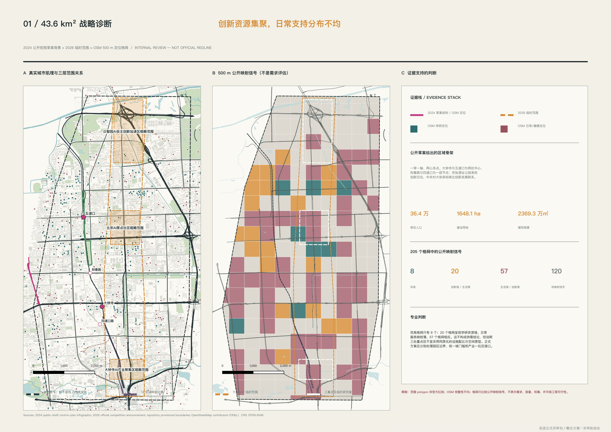
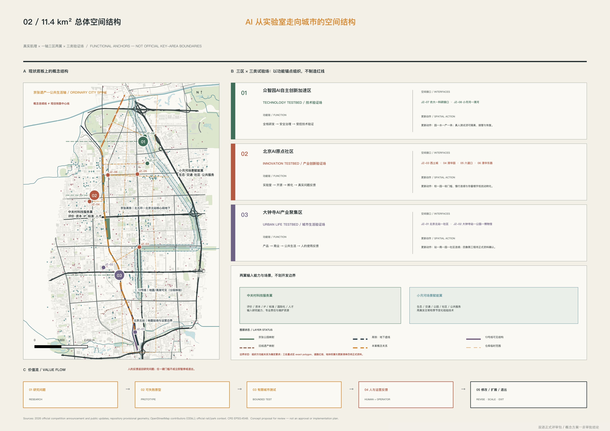
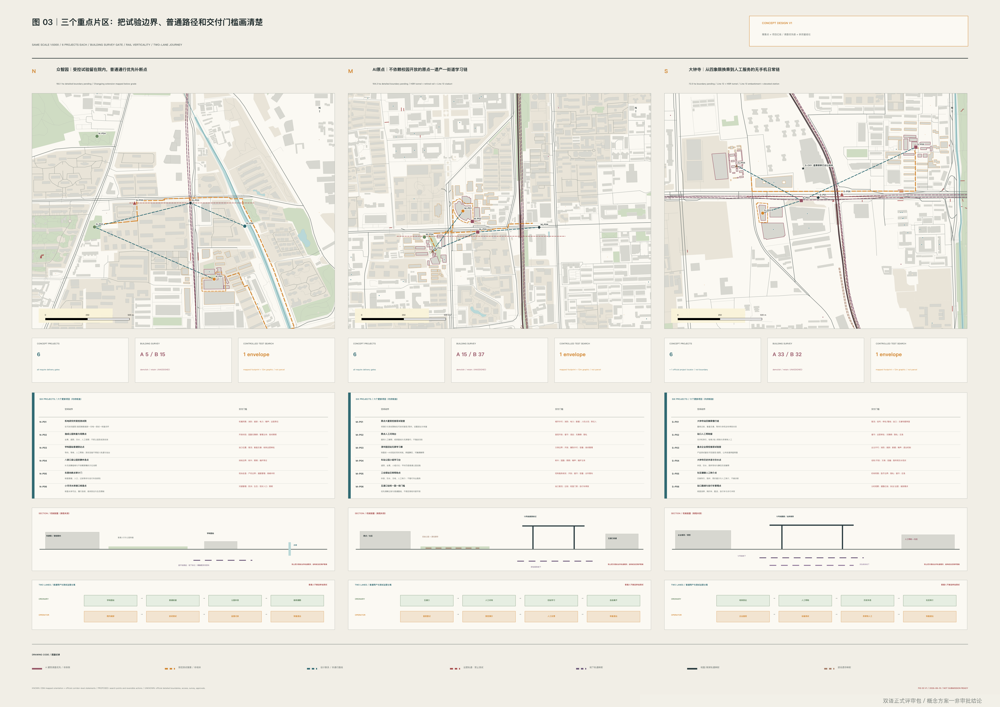
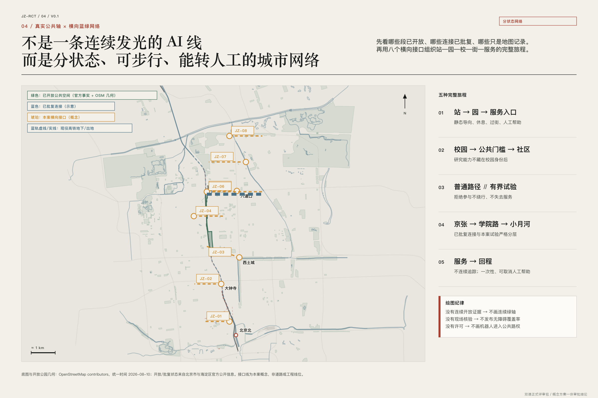
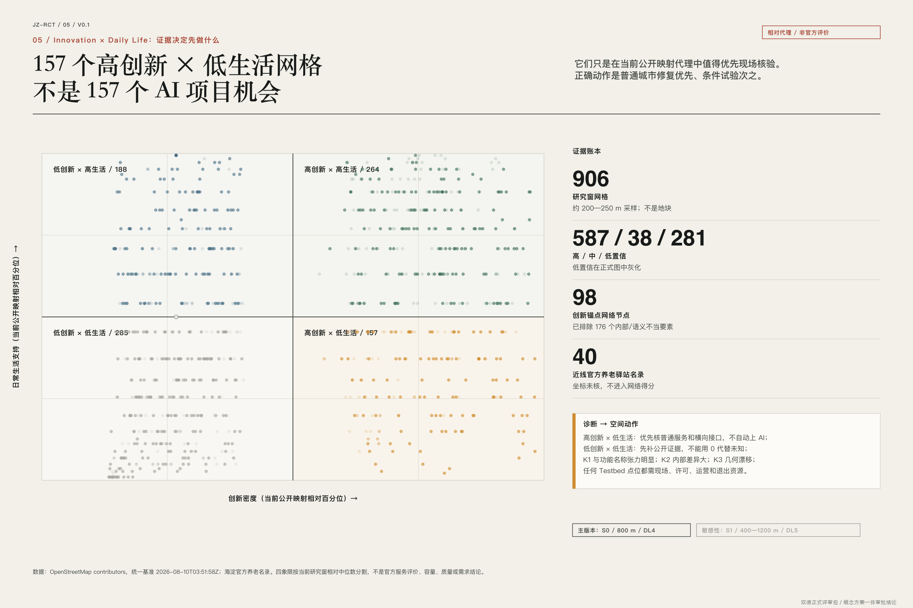

# 百年京张：AI 从实验室走向真实城市的第一公里

**工作制度名：京张城市 AI 验证场 / Jing-Zhang Urban AI Testbed**  
**实施原则：城市在环 / City-in-the-Loop**

这不是在京张沿线陈列更多 AI 产品，而是回答一个更难的问题：实验室里的能力进入真实街道、公园、社区和交通界面后，谁来定义问题，谁能说“不”，出了错谁接管，停止以后城市还留下什么。百年京张曾把自主工程交给真实地形与长期运行检验；今天，这条走廊可以把 AI 交给真实城市检验。这里的“第一公里”是从研究能力到首个受约束城市场景的制度与空间距离，不是“世界第一”或落地承诺。

## 一页交付摘要

| 议题 | 本案回答 | 可核验交付 |
| --- | --- | --- |
| 城市定位 | 以百年京张文化带、都市 AI 生活体验带、AI 融合创新带承接“全球 AI 产业高地、科技文化朝圣地”愿景 | 一轴、三区、两翼与三层范围框架 |
| 空间策略 | 普通公共生活轴先行，八个横向接口逐点确认合法穿越，三类验证场只在有界单元内运行 | 五张双语分析图、8 项接口登记、9 个重点区工作包与轨道竖向关系 |
| 创新机制 | `City-in-the-Loop` 把城市问题提出者、普通使用者和运营者置于模型之前；`City Release` 管理观察、原型、短期部署和复制 | 12 张场景卡、3 份测试契约、V0.1—V2.0 四级门 |
| 实施组织 | 每项试验均设置 A/R/C/I 责任、普通服务基线、候选验收门槛、运行回执、申诉、停止、恢复与公共回报 | 12 项场景—空间—运营链接、2 份桌面回执、5 类资源台账与年度运营闭环 |
| 公共利益 | 六类待验证画像用于发现排除；无手机、无账户、AI 关闭时仍有清楚路径和人工服务 | 两线旅程、Human Handoff Desk、普通服务修补清单 |
| 证据边界 | 运行铁路按地面、地下、高架分别核对；临时 geometry 只作复算，合作、效果和法定指标不作虚构 | 来源登记、假设登记、合规/标准/深度矩阵与停止规则 |

这六项不是六套平行概念，而是一条交付链：**任务定位 → 空间接口 → 有界试验 → 运行回执 → 公共判断 → 修订、退出或有限复制**。任何环节缺少责任人、证据或恢复办法，项目都停留在纸面版本。

## 设计依据与资料清单

本方案把资料分成三层。A 层是征集公告、智能体任务书、政府和铁路主管部门公开资料，用来确认任务、功能区名称、铁路运行状态和已公开项目背景；B 层是仓库 provisional geometry、公开地图和本案生成图层，只能支持定位、方案比较与复算；C 层是尚未取得的官方红线、控规指标、权属、竣工图、客流、市政和现场访谈。图面把三层分开，绝不以绘图精度替代资料权威。[source:OFFICIAL-ANNOUNCEMENT] [source:AGENT-TASKBOOK]

截至 2026-08-10，仓库仍未提供可作为法定依据的总体范围与三处重点区 polygon。本包沿用锁定的 `SITE-001` 和三处 provisional key-area geometry，以保持机器校验和面积复算可重复；它们不是红线、地籍、测量或审批边界。当前临时总体范围复算为 11,412,825.386 平方米，正式 geometry 到达后，用地、道路、公共空间、指标、五张图、HTML 与 A3/A0 必须整体重生成。[data:geometry/site_boundary.geojson#SITE-001] [metric:site_area_sqm]

铁路竖向关系按“系统—运行状态—标高”分别表达。运行中的京张高铁于 2019 年开通：北京北站站场及引入段在地面，进入约 6.02 km 清华园隧道后穿过核心城区，在清华东路—万泉河附近向北重新出地；旧京张核心地面线已经退出运营，部分成为遗产与公共空间；公众在中段更常看见的是现役地铁 13 号线的高架、路堤和地面段。12 号线大钟寺段为地下线。因而“地面看似空”不代表地下可建设，“桥下可见”也不代表可自由进入。[source:NRA-JINGZHANG-HSR] [source:BJ-RAIL-VERTICALITY]

本轮完成了桌面研究、公开地图方向性核验和同行方案审查，但没有现场踏勘、居民访谈、运营主体确认或无障碍同行走查。所有画像和需求均为待验证假设；任何效果图中的人物活动都只说明设计意图，不代表真实参与结果。资料缺口及替换动作登记在 `assumptions.json` 与 `sources.json`。[depth:existing_conditions_diagnosis]

## 三层范围工作框架

统筹研究范围回答“创新资源怎样形成城市能力”；总体设计范围回答“这些能力怎样进入可步行、可运营的空间网络”；三处重点区域回答“一个具体试验怎样获得许可、被使用、被停止”。三层不各做一套口号，而共用一条价值链：**研究问题 → 可失败原型 → 有界城市试验 → 人与运营反馈 → 修订、扩展或退出**。[standard:PROJECT-OFFICIAL-ANNOUNCEMENT] [depth:three_level_scope_framework]

总体结构保持组织方的“一轴、三区、两翼”。一轴被定义为“京张遗产—公共生活轴”，首先承担步行、无障碍、骑行衔接、休息、遮阴、卫生间信息、遗产阅读和人工服务；AI 关闭后，这条轴仍应有用。三区分别对齐 Technology Testbed、Innovation Testbed 与 Urban Life Testbed；两翼不是新划地块，而是输入能力与真实场景的关系网络。中关村科技服务翼提供研究、评价、开源、法务、资本与人才服务，小月河场景赋能翼提供生态、交通、社区生活和公共服务问题。[depth:overall_spatial_structure]

三条定位在空间和运营上逐项落位，而不是停在口号层：**百年京张文化带**以铁路遗产、公共证据和 AI 治理教育连接科技文化朝圣功能；**都市 AI 生活体验带**以普通服务基线、可感知但可退出的 AI+ 场景连接品质生活与智能活力城市功能；**AI 融合创新带**以“研究—受控测试—公开回执—转化”连接全栈产业、创新生态与国际交流功能。五项功能由同一条公共轴串联，但分别有场所、运营人与进入下一版本的门槛。[source:AGENT-TASKBOOK]

八个横向接口 JZ-01—JZ-08 是下一轮走查和截面设计的工作单元，不是八个已确定项目。每个接口都先标合法过线点、普通服务基线、开放状态和责任主体，再判断是否适合试验。概念连线遇到现役铁路围界必须中断，只有既有或正式批准的桥、涵、道路、站区通道才能作为东西联系。[data:geometry/roads.geojson#ROAD-001]

接口登记把“八个”从数量口号变成八个不同的证据任务。当前 `roads.geojson` 只有六条概念横向关系，对应 JZ-01—JZ-06；北京北站咽喉与清华园隧道门户转换界面尚无合法穿越证据，故 JZ-07—JZ-08 只登记、不画推测性跨线。这一差异是风险控制，不是漏画。[metric:interface_register_count]

| 接口 | 走查窗口 | 铁路/空间条件 | 普通服务基线 | 进入试验前的证据门槛 |
| --- | --- | --- | --- | --- |
| JZ-01 | 众智园站区—园区入口 | 北段现役地面/桥梁铁路待核 | 连续步行、无障碍、静态导向、休息 | 围界、开放状态、无障碍走查、运营者确认 |
| JZ-02 | 众智园—小月河 | 并行铁路与水岸条件待核 | 水岸入口、夜间求助、不采集绕行 | 河道与防洪条件、围界、夜间走查 |
| JZ-03 | 遗产公园—校园园区 | 旧地面遗产＋地下高铁＋可见 13 号线 | 不依赖校园开放的公共学习路径 | 校园开放、文保、隧道约束、公共路径走查 |
| JZ-04 | AI 原点—街道 | 高铁隧道段，不推定地下可建设 | 无账户问题提交、具名人工回复 | 场地许可、值守表、隐私告知、提出者复核 |
| JZ-05 | 大钟寺站口—体育公园 | 12 号线地下，地面公共路线待核 | 无手机到达、休息、卫生间信息 | 站口与无障碍走查、休息点、服务时段 |
| JZ-06 | 博物馆—社区服务 | 既有城市路网，不新增跨线结论 | 经核纸质目录、静态地图、一次转接 | 目录审校、运营者、开放时段、照护者同行 |
| JZ-07 | 北京北站咽喉 | 现役地面站场；仅登记 | 既有合法通道、安全边界、静态疏导 | 竣工资料、权属、安全边界、站区运营确认 |
| JZ-08 | 隧道门户—北段出地转换 | 现役高铁地下转地面；仅登记 | 围界外公共路径、警示和连续绕行 | 门户坐标、保护边界、结构与检修资料 |

| 工作尺度 | 设计问题 | 本案交付 | 进入下一阶段的门槛 |
| --- | --- | --- | --- |
| 统筹研究 | 资源如何变成可验证的城市能力 | 生态链、案例矩阵、City Release 与公共回报规则 | 公开来源、问题责任人、可复用机制 |
| 总体设计 | 三区两翼如何通过真实空间协作 | 普通城市公共轴、八个接口、轨道竖向图和蓝绿慢行骨架 | 官方 geometry、现场连续性与权属核验 |
| 重点区域 | 三类 Testbed 如何安全运行 | 三组 1:5000 研究窗、项目卡、剖面、两线旅程 | 场地许可、运营、安全、隐私与恢复方案 |

## 统筹研究范围产业与未来城市研究

本案不以企业 logo 密度衡量“世界级生态”，而把生态拆成八种必须互相咬合的能力：土地与空间、研究与开源、算力与数据、测试与评价、资金与企业服务、人才与社区、场景与采购、治理与国际交流。研究机构提供能力，城市问题提出者提供约束，独立评价与运营者决定是否进入下一版本；任何一方都不能独自宣布成功。[source:AGENT-TASKBOOK]

案例研究只借机制，不搬数字。one-north 提示研发、生活与公共空间应并置；STATION F 提示成长服务需要被编排；Mila 提示责任反思应嵌入研究周期；Knowledge Quarter 提示创新是跨机构网络；Kendall Square 提示生态形成需要长期演化。另以城市 living lab 与具身系统受控测试的公开方法补足“真实世界验证”维度。外部面积、投资、企业数量和绩效均不转移为本地结论。[source:CASE-ONE-NORTH] [source:CASE-MILA]

产业—空间映射采用“能力到接口”，而不是“企业到地块”。众智园聚焦全栈研发、安全评估、设备维护和封闭试验；AI 原点社区聚焦问题定义、成果解释、开源协作、法务与转化；大钟寺聚焦产品进入商业与日常生活后的可用性、人工服务和运营成本。中关村科技服务翼横向支持三处验证场，小月河场景赋能翼用公共生活检验技术是否真的减少负担。[data:geometry/key_areas.geojson#PROV-KEY-001]

区域协同采用“候选接口、双向任务、不过度承诺”的方式组织。北纬社区可作为人才—高校—孵化服务的公开问题接口；未来科学城可交换科研成果与产业问题的受控验证方法。[source:REGION-NORTH-LATITUDE] [source:REGION-FUTURE-SCIENCE-CITY]

怀柔科学城可连接大科学装置成果解释、科学传播与城市场景转译；北京经开区可连接机器人制造验证、运维和供应链问题；京津冀协同只讨论经本地验证后仍可复用的测试协议与公共回执。以上均依据公开职能识别合作方向，不代表已建立合作、获得场地、资源、订单或预算；每一项都须由双方确认问题 owner、数据权限、费用、知识产权与退出条件后才可进入项目库。[source:REGION-HUAIROU-SCIENCE-CITY] [source:REGION-BTH-ROBOTICS]

品牌视觉不另造“科技符号”。标志方向由一段 1909 的轨距线、一段当代城市界面线和一个开放校验框构成；框内永远保留缺口，表示城市可以拒绝、修订与退出。公众主文案使用“从实验室到真实城市的第一公里”，英文使用 “The First Mile from Lab to City”；`Jing-Zhang Urban AI Testbed` 作为工作制度名，不宣称商标或官方命名。[standard:PROJECT-AGENT-OPEN-CALL-TASKBOOK]

## 总体设计范围城市更新与控规深度城市设计

总体设计不是把 AI 场景平均铺满 11.4 平方公里，而是先修普通城市，再划小尺度试验单元。空间骨架包括：一条不与现役铁路中心线混同的公共生活轴、八个横向接口、三类验证场锚点、合法轨道穿越清单、连续蓝绿慢行网络和一套 City Release 运营节点。虚线是待核关系，不是规划红线或工程线位。[data:geometry/land_use.geojson#LU-001] [depth:land_use_layout]

用地与建筑图层承担“方案如何落地到空间类型”的讨论，但不生成容积率、建筑高度、建筑密度、退线或拆除结论。概念建筑仅代表可逆的服务与试验原型：学习公共客厅、受控测试院、人工服务台和恢复仓。正式控规、现状建筑、结构消防、文保与权属未取得前，`retain / renovate / demolish` 保持未分配。[standard:MOHURD-CONTROL-DETAILED-PLANNING] [depth:development_intensity_controls]

城市更新动作分为四类。第一类是“修普通”：过街、座椅、遮阴、静态导向、人工窗口和无障碍断点；第二类是“开门槛”：将园区、校园、社区与公园之间的可达关系做实；第三类是“放试验”：只在边界、时段、责任和恢复方式明确的小单元中测试；第四类是“留公共回报”：无论设备是否退场，保留更好的路径、设施台账、问题档案和维护能力。[depth:retain_renovate_demolish]

铁路保护是总图硬边界。中段可以研究“地面遗产公园＋地下高铁＋13 号线高架”的组合剖面，但不得假设隧道覆土、承载、通风、疏散与检修条件；北段按现役高铁出地、13 号线并行和围界组织，只在合法交叉处缝合。任何永久基础、蓄水设施、重型设备、机器人跨线或新增桥隧都需要铁路与工程资料，本轮不作可行性结论。[source:BJ-RAIL-VERTICALITY]

## 重点区域详细设计

三处重点区采用相同审图框架：1:5000 研究窗、六个项目搜索点、建筑调查优先级、受控试验搜索包络、轨道剖面与两条旅程。研究窗只是制图范围；三处 exact polygon 未获得，尤其 `PROV-KEY-003` 曾被公开问题指出与大钟寺定位错位，不能从该 polygon 推导片区指标。[data:geometry/key_areas.geojson#PROV-KEY-003] [depth:three_key_area_detailed_design]

| 重点区 / Testbed | 普通城市先修 | 有界试验 | 硬门槛与公共回报 |
| --- | --- | --- | --- |
| 众智园 / Technology Testbed | 核站口、园区入口、东西步行断点、小月河接口和安静休息点 | 在可封闭院落测试低速移动、故障接管、路缘交接与非识别巡检 | 无书面场地、安全责任、保险与恢复方案，不试；退场后保留更清楚的路权和设施台账 |
| AI 原点社区 / Innovation Testbed | 构成不依赖校园开放的“原点—遗产—街道”学习链，先设静态说明与人工问题台 | 反向实验室、无屏解释步道、失败与修订档案 | 问题提出者可否决技术改写；退场后保留问题简报、人工责任链和公开档案 |
| 大钟寺 / Urban Life Testbed | 从站口、体育公园、博物馆与社区服务组织无手机也能完成的旅程 | 非诊断的服务查找、休息到服务路线、照护者转接 | 不采病历、不做健康评分、不替代专业人员；退场后保留经核服务目录、休息节点和人工窗口 |

九个重点区工作包把片区愿景转译成专业团队可接手的空间任务；它们不是立项、工程包或真实建筑拆改留结论。[metric:key_area_work_package_count]

| 重点区 | 工作包 | 空间对象与动作 | 候选验收/停止恢复 |
| --- | --- | --- | --- |
| 众智园 | KA-N-01 普通路径修补 | 站口—园区门槛；核开放、导向、无障碍和休息 | AI 关闭仍连续；移除试验标记后保留原路径 |
| 众智园 | KA-N-02 封闭演练院 | 院内硬地；低速礼让、急停与接管 | 急停全通过且不侵普通路径；失败即隔离设备、恢复场地 |
| 众智园 | KA-N-03 接管恢复仓 | 通行线外服务边缘；维护、故障撤回与恢复工具 | 故障设备不占路；退场形成恢复回执 |
| AI 原点 | KA-C-01 问题台与无屏学习链 | 公共门槛和普通步行线；人工问题入口、双语静态解释 | 无扫码可理解并获具名回复；失败回到纯人工台 |
| AI 原点 | KA-C-02 反向实验室 | 可预约室内/有遮蔽空间；把真实约束写成测试简报 | 提出者确认未歪曲；否则撤回技术简报、保留原问题 |
| AI 原点 | KA-C-03 公共验证册 | 小型公共展示＋离线档案；版本、失败、到期与撤销 | 每项有来源、责任人、复核日和有效期；过期下架、档案留存 |
| 大钟寺 | KA-S-01 无手机服务入口 | 站口—服务路线；纸质目录、静态地图和人工窗口 | 无手机/账户完成；退场保留经核目录与导向 |
| 大钟寺 | KA-S-02 休息到服务链 | 街道、公园与服务门槛；核过街、座椅、遮阴和门禁 | 最弱使用者不增加绕行；撤除未经核动态指引 |
| 大钟寺 | KA-S-03 人工转接与目录审校台 | 有人值守服务门槛；一次转接、定期核目录 | 具名转接且零诊断评分；失败降级为纸质目录＋人工窗口 |

北区“具身智能城市实验室”优先进入院内或可封闭硬地，不把开放公园、桥下或唯一无障碍通道当沙盒；中区“AI 学习廊”由静态双语说明、触摸模型、人工讲解、问题台和失败档案组成，核心内容不依赖扫码；南区“AI 健康与老龄实验室”只改善找服务、理解、到达、人工转接和回程，不处理诊断、处方、风险评分或紧急医疗分流。

每区另画两条旅程：一条普通旅程证明 AI 关闭仍能完成任务；一条运营旅程标出许可、值守、接管、维护、投诉、数据删除和恢复原状。图纸中的项目点均写“search / audit / field verify”，不写开工、投资或合作单位。[source:PEER-ISSUE-1061]

## AI 创新生态、人才画像与 AI+ 场景

六类暂定画像用于发现排除，而不是模拟“用户共识”：沿线居民与老年人、照护者和儿童、夜间与一线运营人员、轮椅及助行器使用者、研究者与初创团队、国际与临时访客。下一轮必须分别通过同行走查、问题访谈、无障碍审计和运营流程访谈修订；画像数量为结构化资产计数，不是人口统计。[metric:persona_count]

十二张场景卡分属三旗舰，每张都写同样的 17 个字段：User、Problem、Ordinary Baseline、AI Capability、Physical Space、Data、Data Authority、Operator、Human Review、Privacy、Safety、Baseline Measure、KPI、Stop Condition、Exit Condition、Evidence、Public Return。场景卡不把“能做什么”放在第一位，而先证明没有 AI 时任务如何完成。[data:visual/assets/scenario_nodes.json#SC01] [metric:scenario_node_count]

三旗舰分别把 AI 接入城市规划的不同对象：学习廊处理文化遗产、公共教育和城市治理中的解释与反馈；具身实验室处理交通、公共空间和产业测试中的路权、急停与维护；健康老龄实验室处理社区公共服务、包容性出行和人工转接。AI 在这里不是单独的一层“智慧设施”，而是被土地使用、空间边界、运营班次、公共权利和退出成本共同约束的城市系统。[depth:ai_ecosystem_industry_space]

| 旗舰 | 场景卡 | 主要验证问题 |
| --- | --- | --- |
| AI 学习廊 | 城市问题台、无屏解释步道、反向实验室、失败与修订档案 | 普通人能否理解、质疑、改写并追踪一个 AI 项目 |
| 具身智能城市实验室 | 共享路权沙盒、路缘交接湾、故障接管演练、非识别设施巡检 | 设备能否礼让最弱使用者、被人工接管并恢复场地 |
| AI 健康与老龄实验室 | 无手机服务查找、休息到服务路线、照护者转接、服务目录审校 | 不采敏感健康信息时，服务旅程能否更可靠且保留人工替代 |

场景—空间—运营矩阵把每张卡绑定到一个空间包、一个值守单元和一个证据输出，避免“十二张卡”停留在策划清单。[metric:scenario_operation_link_count]

| 场景 | 空间工作包 | 值守/运营单元 | 产生的证据 |
| --- | --- | --- | --- |
| SC01 城市问题台 | KA-C-01 | 人工问题台 | 问题简报与具名回复 |
| SC02 无屏解释步道 | KA-C-01 | 内容审校＋人工讲解 | 无屏理解与纠正记录 |
| SC03 反向实验室 | KA-C-02 | 引导师＋独立复核 | 提出者确认的反向简报 |
| SC04 失败与修订档案 | KA-C-03 | 档案编辑 | 失败、修订、到期与撤销记录 |
| SC05 共享路权沙盒 | KA-N-02 | 设备运营＋安全责任＋无障碍观察 | 礼让、近失误与急停回执 |
| SC06 路缘交接湾 | KA-N-02 | 场地运营＋人工交接 | 占用空间与冲突记录 |
| SC07 故障接管演练 | KA-N-03 | 运营、维护与接管班组 | 故障、接管时长与恢复回执 |
| SC08 非识别设施巡检 | KA-N-03 | 设施维护＋隐私复核 | 人工核验的缺陷候选日志 |
| SC09 无手机服务查找 | KA-S-01 | 目录 owner＋人工窗口 | 完成、误导与求助记录 |
| SC10 休息到服务路线 | KA-S-02 | 路线审计＋无障碍同行 | 休息、绕行与障碍审计 |
| SC11 照护者人工转接 | KA-S-03 | 社区/养老专业人员 | 具名转接与投诉记录 |
| SC12 服务目录审校 | KA-S-03 | 目录编辑＋服务方核对 | 带日期的增删改与到期日志 |

三个重点测试契约分别覆盖学习、具身和健康老龄旗舰。契约必须写清问题 owner、数据 owner、现场 operator、独立 reviewer 与最终 accountable person；成功看端到端完成、最弱使用者负担、接管与公共回报，不以平均模型准确率掩盖伤害。任何伤害、身份泄露、急停失败、高风险错误指引或人工责任链中断，立即回到 V0.1。[metric:test_scenario_count] [metric:pilot_contract_count]

候选验收门槛在测试前登记，不冒充现有成绩：PC01 要求每个样本都有具名人工 owner、问题提出者确认技术转译没有歪曲原意，且高风险误分类为零；PC02 要求每次急停演练成功、设备不侵入普通通道、弱势使用者不增加绕行；PC03 要求每个样本保留无手机路径和具名人工转接，且不产生诊断或风险评分。当前三项 `field_status` 均为 `not_authorized_not_run`，实测结果保持空值。回执记录版本、场地、时段、责任班次、基线、例外、投诉、停止、删除与恢复；公众可以申诉，独立复核者可以要求降级，最终责任人不能把判断外包给模型。

两份 City Release 桌面回执用于证明制度如何做决定，均为虚构输入、没有真人、真实场地或实测结果，不是效果证明。[metric:synthetic_tabletop_case_count]

| 桌面回执 | 合成条件 | 硬门结果 | 决定与公共回报 |
| --- | --- | --- | --- |
| TT-PASS-01 / PC01 | 虚构匿名请求“夜间卫生间信息更清楚”；纸表＋人工回复 | 具名 owner、未歪曲确认、紧急误分类为零：全部通过 | 仅保持 V0.5，可在获许可后做小范围解释测试；留下问题简报与责任链 |
| TT-STOP-01 / PC02 | 虚构封闭院演练注入定位漂移；无真实设备或影像 | 两次合成急停中一次失败，并发生合成边界侵入 | 立即隔离并降回 V0.1；恢复完整通道，留下失败记录与修订后的测试包络 |

## 用地、建筑规模与拆改留方案

当前 `land_use.geojson` 是为了校验完整覆盖、无缝隙和无重叠而生成的概念分区；它表达公共轴、验证接口、蓝绿空间与服务原型的关系，不等同于现状或法定用地。概念建筑基底面积 46,617.879 平方米，只代表可逆原型占位，不能换算真实总建筑面积、容积率或投资。[data:geometry/buildings.geojson#BLDG-001] [metric:building_footprint_area_sqm]

建筑策略采用“先调查、后分类”。A 级是需要逐栋核查的候选建筑：涉及项目点、入口、首层界面或遗产；B 级是片区筛查：核功能、开放、结构与消防；C 级只作城市肌理背景。未完成权属、测绘、结构、消防、机电、文保和使用访谈前，不给任何真实建筑贴“拆、改、留”标签。[depth:retain_renovate_demolish]

新建或加建设想限于三类轻量构件：无屏说明与导视、可撤除人工服务台、受控试验的围护与恢复仓。材料优先可拆、可修、低眩光，并以轨道工业构件的比例和耐久性建立风貌联系，不复制机车、信号灯等表面符号。永久建筑、地下开发、结构跨越和高度体量均待专业设计与法定程序。[depth:height_massing_character]

用地调整的判定顺序是：公共利益是否明确；普通服务能否先完成；现有空间是否可共享；试验是否必须占地；退出后是否有公共回报。不能回答其中任一项时，项目留在纸面 V0.1，不以“创新”作为占用公共空间的通行证。[standard:MOHURD-URBAN-DESIGN-MEASURES]

## 交通、轨道、市政与公共服务设施

交通策略从“跨线关系逐点成立”开始。公共轴由旧线释放空间、公园、桥下合法开放段、轨道两侧道路和城市街道共同组成，不画一条穿越现役围界的连续彩线。八个横向接口逐一标记 `existing crossing / official project / field verify / no crossing`；没有合法条件的连线在图上断开。概念慢行网络长度 15,237.796 米，仅为本包几何复算值。[data:geometry/roads.geojson#ROAD-001] [metric:road_length_m]

三类铁路截面分别控制设计：X-R1 为中段“遗产公园地面—高铁隧道—13 号线高架/路堤”；X-R2 为北段“现役高铁地面/桥梁—13 号线并行—公园侧带”；X-R3 为北京北站与隧道门户安全界面。所有截面只表达关系，不给保护距离、覆土、净高或基础尺寸。[source:BJ-RAIL-VERTICALITY] [depth:traffic_rail_slow_parking]

市政与数字基础设施采用“最小设备、边缘处理、断网可退”的原则。每个试验单元需要独立核验供电、充电、消防、电池处置、排水、照明、通信与急停；公共 Wi-Fi、摄像、定位和云服务不作为普通路径可用的前提。无法证明合法数据处理者、保留期和删除流程时，只做纸面或离线演示。[depth:municipal_new_infrastructure]

公共服务设施优先补齐座椅、遮阴、饮水与卫生间信息、可读导向、人工窗口和夜间可见求助。具体数量、服务半径和位置需要现场盘点后决定，不能从通用指南直接推导。本轮将它们作为 V0.1 调查表和构件库，不声称达标。[source:WHO-AGE-FRIENDLY]

## 蓝绿空间、公共空间与城市风貌

蓝绿系统不是 AI 装置的背景，而是验证“城市负担是否减少”的基线。概念绿地面积 874,189.284 平方米、公共空间面积 277,584.374 平方米，分别对应当前 provisional geometry 下 7.6597% 与 2.4322%；这些是本案图层的内部复算，不是现状绿地率、控规指标或绩效承诺。[data:geometry/green_space.geojson#GREEN-001] [metric:green_ratio]

小月河场景赋能翼遵循生态和日常使用优先：先核水岸入口、连续性、夜间安全、树木、雨洪和维护，再讨论设施巡检或环境感知。任何传感设备不得成为扩大监控的理由，镜头默认朝向地面或设施，保留不采集绕行路径；河道与防洪条件未核前不布置永久构筑物。[depth:blue_green_public_space]

三类公共空间组件形成统一而克制的风貌：`Evidence Frame` 显示事实、假设、负责人和更新时间；`Human Handoff Desk` 提供不登录的人工入口；`Recovery Bay` 让设备故障时退回、不占通行。它们使用深墨、氧化红、矿物绿和校验橙四种功能色，不以霓虹屏幕制造“AI 感”。文化标识与总体 Logo 分开，遗产解释注明来源和年代。

文化叙事遵循“铁路工程的实证—中关村创新的求证—City Release 的公共验证”三段链条：1909 不是复古布景，而是长期运行对工程的检验；今天的 AI 也必须接受真实城市、普通人和维护周期的检验。国际交流采用可翻译的工作句 **“From railway proof to public AI proof: useful when offline, accountable when active.”**，用于解释制度，不宣称官方口号；双语材料保留相同事实、限制和责任，不以英文版本放大愿景。

三个公共地标不是雕塑，而是可用制度：原点问题台、城市接管门、百年失败档案。它们分别让城市提出问题、让人随时接管、让失败可以被记住和复用；是否设置及具体位置仍需运营与场地许可。[metric:public_landmark_count] [standard:PROJECT-AGENT-OPEN-CALL-TASKBOOK]

“百年公共验证册”承担任务书所要求的荣誉展示，但不做企业、模型或个人的永久排行榜。只有普通服务修补、可复核失败、人工接管、公共回报和可复用开放协议可以被提名；每项必须写来源、公共问题 owner、经同意的贡献者、回执、限制、复核日、有效期和撤销理由。一个 City Release 周期后必须复核；虚假主张、权利侵害、未解决伤害或证据过期即撤下实体展示，保留可审计档案。

## 更新项目清单、实施政策与分期计划

八个更新项目按依赖关系组织：P01 轨道与公共空间现场底图；P02 八接口连续性与无障碍审计；P03 普通服务基线修补；P04 AI 学习廊纸面与无屏原型；P05 具身智能封闭演练；P06 健康老龄无手机旅程；P07 失败与修订档案；P08 年度 City Release 公开复盘。项目数量是方案清单，不代表立项。[metric:renewal_project_count] [depth:renewal_project_list]

实施采用 City Release 四级门。V0.1 Observe：只确认问题、基线、资料权限和谁负责；V0.5 Prototype：在纸面、离线或封闭空间允许失败；V1.0 Deploy：只在有界场地、知情参与、人工值守和可恢复条件下短期运行；V2.0 Scale：只有跨季节证据、维护预算、独立复核和退出成本明确后才讨论复制。任何 hard gate 失败都降级，不以平均分补偿安全和权利红线。[data:geometry/phasing.geojson#PHASE-001] [depth:phasing_implementation]

政策工具不是补贴清单，而是四份标准文件：场景一页纸、场地与数据许可单、故障与人工接管记录、公共回报与退出清单。采购或合作评价把恢复原状、人工工时、能耗、无手机完成率和最弱使用者负担纳入总成本；供应方不得单方面决定失败是否公开。

三份测试契约按候选 RACI 落责。城市问题 owner 或受托公共运营者承担最终责任（A）；现场运营、设施维护与人工接管班组执行（R）；铁路、规划、无障碍、安全、隐私及相关专业人员按场景会签（C）；周边使用者、场地管理者和公开档案接收者获得可理解通知（I）。正式主体尚未确认前只登记角色，不虚构机构承诺。每次进入 V1.0 前必须同时出具场地许可、数据许可、普通基线、值守表、候选验收门槛和恢复押项；结束后形成一份可追踪的 City Release 回执。

实施资源分成五本台账：人员台账记录责任与班次；空间台账记录开放边界、合法通行和恢复状态；设备台账记录供电、消防、维护、急停和退场；数据台账记录控制者、最小字段、保留期、删除与申诉；公共价值台账记录普通服务修补、人工工时、投诉、失败和留下的设施。项目转化依次经过 **公开问题征集 → 公益与专业复核 → 纸面/离线/封闭原型 → 有界短期试验 → 公开回执 → 采用、修订或停止 → 有限复制**，不得从展示直接跳到规模化部署。

开发者共同体不从“招团队”开始，而从一份有普通基线和不可接受后果的公开问题简报开始。进入流程依次为证据诊所、纸面/离线原型、封闭测试冲刺、City Release 复盘以及采用/修订/停止；问题 owner、开发或研究团队、场地运营、人工服务 owner、独立复核者和公共档案编辑必须同时在场。公共参与不要求账号，测试不绑定指定供应商；版本到期后撤销凭证、删除数据、移除设备和未经证实的宣传主张。

| 年度候选单元 | 核心工作 | 必须留下的成果 | 未确认边界 |
| --- | --- | --- | --- |
| 春 / 城市问题与证据诊所 | 校验问题、普通基线和资料缺口 | 经核问题简报、缺失证据登记 | 无确定主办方与日期 |
| 夏 / 封闭测试与接管演练周 | 只做可停止的封闭演练 | 急停回执、恢复记录 | 无确定场地、保险与设备方 |
| 秋 / 公共 AI 实证论坛 | 双语发布采用、修订或停止决定，交换区域协议 | City Release 决定、区域可复用协议 | 无确定合作方或国际嘉宾 |
| 冬 / 失败维护退役年鉴 | 汇总维护、失败、删除、到期与撤销 | 双语年度档案 | 无确定出版方与预算 |

长期运营形成年度闭环：春季重做路径与设施基线，夏季测试热环境与夜间服务，秋季举行开放的 City Release Review，冬季发布维护、失败、停止和删除记录。年度固定运营单元包括问题台值守、无障碍同行走查、设备急停演练、服务目录审校和失败档案整理；活动是设计建议，日期、主办方、资金和合作方均未确定。[source:AGENT-TASKBOOK]

## 指标体系、面积复算与合规矩阵

本案区分三类指标。A 类是从当前 GeoJSON 复算的面积与长度；B 类是结构化资产计数，如 12 场景、6 画像、3 测试契约、3 地标；C 类是正式规划或现场绩效，当前保持 unknown。A、B 类可核查但不自动成为“好”的证据；C 类不能由 AI 补值。[metric:scenario_node_count] [depth:metrics_recalculation]

测试契约中的数值只分为“候选验收门槛”和“实测结果”两列。前者用于试验前的可否决设计，后者只有在授权、基线和独立复核成立后才可填写；本轮全部实测结果为 `null`。这一区分避免把设计目标写成运行绩效，也让停止决定可以由单项硬门槛触发，而不被综合平均值掩盖。

| 指标组 | 当前可报告 | 不可报告 | 下一步 |
| --- | --- | --- | --- |
| 空间几何 | provisional 范围、概念绿地/公共空间/建筑基底、概念网络长度 | 现状比例、法定指标、精确工程量 | 替换官方 geometry 并全包复算 |
| 场景与人 | 12 张场景卡、6 类待验证画像、3 份测试契约 | 真实需求规模、接受度、成效 | 现场基线、知情参与、预登记门槛 |
| 规划控制 | 缺失项及所需责任专业 | 容积率、建筑高度、密度、红线、拆改留 | 控规、测绘、权属、结构消防与文保审查 |
| 运营绩效 | KPI 定义与停止条件 | 未测量的成功率、节省、经济产出 | V0.1 基线后再登记阈值 |

`compliance_matrix.json` 将公告 17 项任务与 agent.1—agent.6 映射到正文、图层、指标、图件和自检；`standard_matrix.json` 逐条说明标准如何影响设计；`design_depth_matrix.json` 记录规划深度已表达什么、哪些结论因缺资料保持未知。网页中所有数值均由 `data-metric` 指回 `metrics.json`。[standard:MNR-LAND-USE-CLASSIFICATION-GUIDE]

## 风险、版权与合规说明

最高风险不是“技术不够先进”，而是把 provisional geometry 当红线、把公开地图当权属、把效果图当参与、把试验当已获许可。对应控制是：图层分级、现场 gate、具名责任、普通替代、知情参与、数据最小化、物理急停、人工接管、失败公开与恢复原状。[depth:risk_missing_data]

铁路风险单列：清华园隧道、北京北站咽喉、北段现役地面/桥梁高铁和 13 号线均按运行设施处理；13 号线扩能的未来形态不能预支为现状。未取得铁路工程、产权和安全资料前，不提出新增跨线、深基础、隧道上重载或桥下试验可行性。[source:NRA-JINGZHANG-HSR]

健康、未成年人、公共安全和具身移动场景均有人类最终判断。方案不做诊断、执法、信用评分、人脸或情绪识别，不将账户作为公共服务门槛。真实参与开始前需形成告知、退出、投诉、数据删除和伤害处置流程；任何 AI 输出不替代规划审批、专业审查或居民意见。

文字由 OpenAI Codex 在用户方向、公开/清权资料和本仓库规则下生成并人工式多轮审查；地图以公开政府资料、仓库 provisional geometry 和 OpenStreetMap 方向性底图派生，OSM 遵守 ODbL 署名。所有图像为本任务中程序化绘制或从上述可复用资料派生，未使用企业 logo、人物肖像或受限字体。版权与许可边界详见 `report/copyright_statement.md`。

## 参考资料

1. 百年京张 AI 创新带城市设计开源征集公告与智能体任务书。[source:OFFICIAL-ANNOUNCEMENT]
2. 国家铁路局、北京市交通与海淀区公开的京张高铁、清华园隧道、遗址公园及轨道关系资料。[source:NRA-JINGZHANG-HSR]
3. 仓库 site package、source registry、processed fact pack 与 provisional geometry。[source:SITE-PACKAGE]
4. one-north、STATION F、Mila、Knowledge Quarter、Kendall Square 等案例的官方或机构公开页面。[source:CASE-KENDALL-SQUARE]
5. 北纬社区、未来科学城、怀柔科学城、北京经开区及京津冀相关官方公开资料，仅用于识别候选协同接口。[source:REGION-BTH-ROBOTICS]
6. WHO 年龄友好城市与 UN-Habitat 儿童公共空间指南，只作通用设计镜头。[source:UNHABITAT-CHILD-PUBLIC-SPACE]
7. OpenStreetMap contributors，ODbL 1.0；仅作定位和制图方向性证据。[source:OSM-CONTEXT]

完整 URL、访问日期、用途、许可和限制见 `sources.json`。结构化引用是审计入口，不改变来源等级；正式设计仍需由规划、建筑、交通、铁路、市政、景观、文保、无障碍、安全、隐私与运营团队共同深化。
