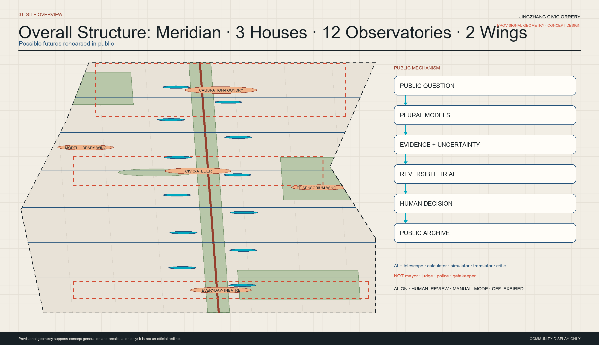
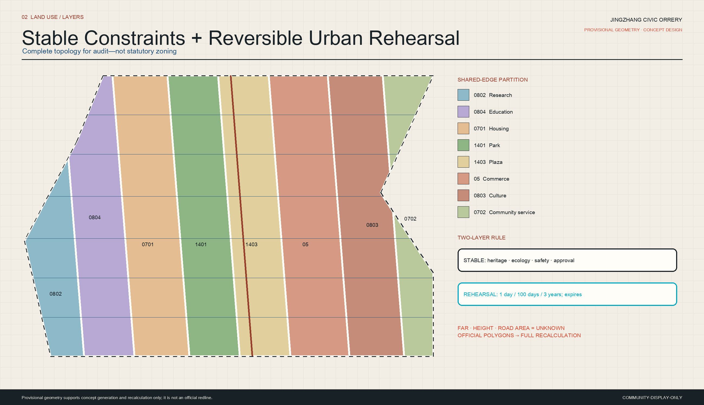
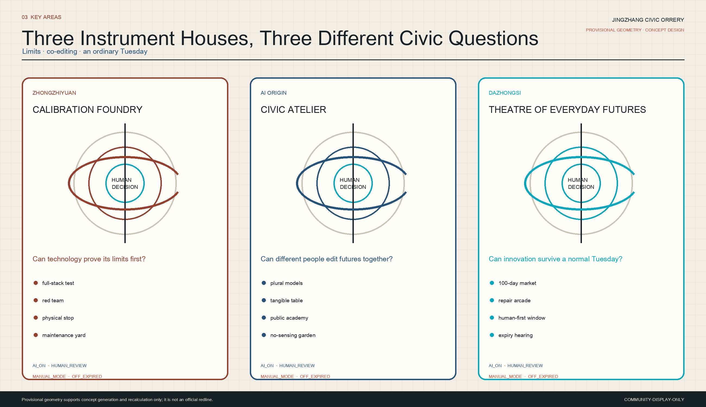
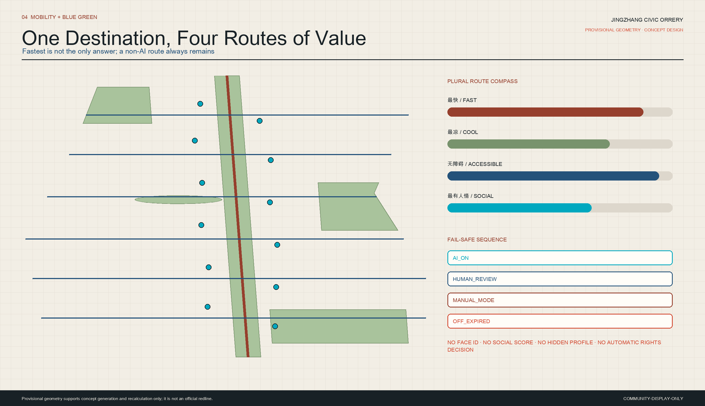
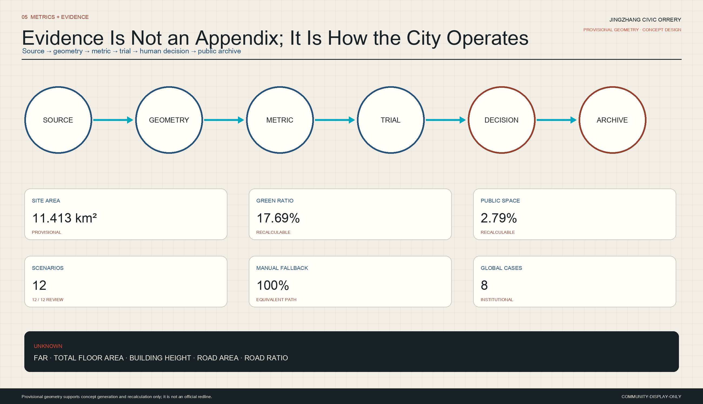

# JINGZHANG CIVIC ORRERY / 京张万象仪

> A city where possible futures are rehearsed in public
>
> **The future is not predicted for the city. It is calibrated with its people.**

The Civic Orrery turns the Centennial Jing-Zhang AI Innovation Belt into a public instrument for comparing possible futures. It is not a machine that predicts a single future. Every civic question is examined by several models. Their evidence, confidence, costs, beneficiaries, and burdened groups are disclosed. Reversible spatial trials allow people to experience competing choices. Accountable humans then retain, change, or stop the trial. Here AI is a telescope, calculator, simulator, translator, and critic—not a mayor, judge, police officer, or unappealable gatekeeper.

## 2126: Zhan Tianyou Wakes on an Ordinary Tuesday

At seven in the morning, Zhan Tianyou leaves an ordinary home near Dazhongsi. There is no giant welcome screen and no camera asking him to identify himself. A mechanical compass points to the fastest, coolest, most accessible, and most sociable routes. He takes a paper slip and enters the civic meridian. Children compare three climate models through moving shadows. A maintainer pins last night's false lighting alert to the Gallery of Useful Failures. At noon, the Parliament of Models refuses to announce an optimum; it shows who benefits, who walks seven minutes farther, and which evidence remains unknown. In the evening, a service trial closes because its manual path failed. People sign the stop record. Zhan understands that the engineering achievement of the next century is not a machine that never errs, but a city able to measure, compare, admit error, and change its mind without abandoning anyone.

## Design Basis and Source List

This proposal responds to the official announcement's three levels of work and deliverables and to the six AI-agent tasks. Urban design, regulatory-plan depth, land-use classification, and architectural-document depth are used as review frameworks.[source:OFFICIAL-ANNOUNCEMENT] [source:AGENT-TASKBOOK] [standard:PROJECT-OFFICIAL-ANNOUNCEMENT] [standard:PROJECT-AGENT-OPEN-CALL-TASKBOOK] [standard:MOHURD-URBAN-DESIGN-MEASURES] [standard:MOHURD-CONTROL-DETAILED-PLANNING] [standard:MNR-LAND-USE-CLASSIFICATION-GUIDE] [standard:MOHURD-ARCH-DESIGN-DEPTH-2016]

Package facts and machine-readable controls come from the site package, source registry, and processed fact guide. The guide is an index and does not upgrade source authority.[source:SITE-PACKAGE] [source:SOURCE-REGISTRY] [source:PROCESSED-FACT-PACK] [source:BOUNDARY-SOURCE] [source:KEY-AREA-SOURCE]

External cases contribute mechanisms only; no drawings, photography, brand identity, or protected expression is copied: tangible simulation at MIT CityScope, real-life testing at Toyota Woven City, industry–university–digital-twin integration at Punggol Digital District, public-space priority in Barcelona Superblocks, resident co-creation in Kalasatama, visible sensing at Amsterdam Responsible Sensing Lab, the privacy and public-interest warning of Toronto Quayside, and time-limited experiments at Paris Urban Lab.[source:CASE-MIT-CITYSCOPE] [source:CASE-TOYOTA-WOVEN-CITY] [source:CASE-JTC-PUNGGOL] [source:CASE-BCN-SUPERBLOCKS] [source:CASE-FI-KALASATAMA] [source:CASE-AMSTERDAM-RESPONSIBLE-SENSING] [source:CASE-WATERFRONT-TORONTO-QUAYSIDE] [source:CASE-PARIS-URBAN-LAB]

The historical account relies on public institutional sources and never presents narrative invention as fact.[source:HIST-JINGZHANG-NRA] [source:HIST-JINGZHANG-PARK-BEIJING]

The current `SITE_BOUNDARY` and all three `KEY_AREA` polygons are repository-maintained `provisional_constraint` geometries. They are not official redlines, property limits, road redlines, or statutory land-use boundaries. They support concept generation, topology checks, figures, and recalculation only. All layers, metrics, drawings, and conclusions require recalculation when official polygons, regulatory plans, surveys, ownership, utilities, fire, flood, heritage, transport, and engineering inputs become available.[data:geometry/site_boundary.geojson#SITE-001] [data:geometry/key_areas.geojson#PROV-KEY-001] [depth:existing_conditions_diagnosis] [depth:risk_missing_data]

## Future Archaeology: Four Readings of One Territory

| Time | Reading | Urban-design implication |
| --- | --- | --- |
| 1909 | Chinese engineers changed the meaning of distance through surveying, standards, construction, and revision | Commemorate method, workers, and correction—not only heroic imagery |
| 2026 | AI compresses knowledge work while making urban algorithms harder to inspect or refuse | Turn evidence, assumptions, dissent, and shutdown into public space |
| 2050, speculative | Prediction is abundant; shared capacity to compare distributional effects is scarce | Build plural-model comparison, reversible trials, appeal, and manual fallback |
| 2126, speculative | The most valuable AI city can change its mind without erasing people or memory | Keep a century-long archive of decisions, failures, repair, and rights |

Ten contradictions form the real brief: century-scale heritage versus monthly AI cycles; global pilgrimage versus ordinary neighbourhood; closed campus versus public learning; optimization versus contestability; data richness versus freedom from surveillance; north–south continuity versus east–west fragmentation; spectacle versus maintenance; talent attraction versus affordability and care; rapid testing versus planning and safety; and strong spatial storytelling versus missing official polygons.

Twelve mutations follow. Buildings become instruments; a reversible rehearsal layer sits above stable constraints; the meridian meets transverse public rooms; routing presents plural values; consumption becomes try–repair–withdraw; the city becomes an academy; closed demos become evidence chambers; tenant lists become problem guilds; one model becomes a parliament; trials expire by default; monuments honour method and useful failure; and the engineering record becomes a bilingual Future Almanac.

Three concepts were scored across Jing-Zhang specificity, AI nativeness, spatial clarity, artistry, public value, ethics, deepening, operation, and international legibility. A, Civic Orrery, scored 87/90; B, City of Human Measure, 76/90; C, Jing-Zhang World Atelier, 77/90. A was selected because it holds B's rights-based human scale and C's open prototype economy without reducing residents to spectators.

## Identity: A Mark That Deliberately Remains Open

The mark uses one vertical meridian, three open orbital rings, two lateral wing arcs, and three calibration points. Its gap means human intervention, dissent, and the right to stop. It works in one colour, at 24 px, on a metal plate, and as a plan symbol. The palette is engineering paper `#F2EEE5`, Beijing grey `#C9C3B8`, ink `#182126`, railway rust `#963F2D`, engineering blue `#24527A`, stop vermilion `#D34A32`, and simulation cyan `#00A8BF`. Neon cyberpunk, giant screens, decorative robots, empty glass boxes, and spectacle-only aerials are excluded.

## Three-Level Scope Framework

The strategic study addresses the AI economy and institutions of a future city. The overall design addresses spatial structure, renewal, mobility, utilities, blue-green systems, and public service. The three key areas host prototypes that can be used and governed in everyday life. Together they form one evidence chain: public problem → strategic study → spatial mother structure → 100-day key-area test → public archive.[depth:three_level_scope_framework] [depth:overall_spatial_structure]

The mother structure is **one civic meridian, three instrument houses, twelve future observatories, and two open observation wings**. The meridian is not a new redline. Transverse rooms are not road engineering alignments. Key-area polygons are not parcel conclusions. Every design layer remains replaceable and recalculable.[data:geometry/roads.geojson#PS-MERIDIAN-001] [data:geometry/public_space.geojson#AI-CALIBRATION-FOUNDRY] [metric:scenario_node_count] [metric:component_count]

Seven systems work together: time distinguishes fact, present proposal, and speculation; space locates each move; industry requires evidence before scaling; daily life preserves care and non-digital access; infrastructure binds smart layers to manual control and maintenance; culture honours method and failure; governance protects inspection, dissent, appeal, and shutdown.

## Coordinated Research Area: Industry and Future City Research

### From Tenant Lists to Problem Guilds

Haidian's advantage is not another closed technology park. Universities, institutes, developers, startups, enterprise services, communities, operators, maintainers, and international visitors form temporary guilds around public problems. Each guild publishes a brief, runs plural simulations and red-team review, tests a reversible field prototype, presents public evidence, receives a human decision, and either converts responsibly to operation or withdraws. No tenant, investment, policy approval, or return is fabricated.[metric:global_case_count]

### Eight Global Cases, Re-authored for Haidian

| Case | Transferable capacity | Civic Orrery adaptation |
| --- | --- | --- |
| MIT CityScope | Tangible simulation and comparison | A distributed public institution rather than one lab tool |
| Toyota Woven City | Resident–inventor testing | Expiry, refusal without penalty, manual mode, public-interest tests |
| Punggol Digital District | Digital twin and industry–academy links | Plural models and visible rights rather than one optimizing OS |
| Barcelona Superblocks | Public-space value first | Evaluate AI through shade, walking, care, and fairness |
| Smart Kalasatama | Resident–company–city living lab | Co-creation as a permanent neighbourhood service |
| Amsterdam Responsible Sensing | Visible sensing, shutters, registry | A standard Consent Lantern and no-sensing route |
| Toronto Quayside | Privacy and public interest as foundations | Governance and return-to-normal designed from the start |
| Paris Urban Lab | Time-limited urban experiments | A 100-day trial followed by retain/change/stop hearing |

### Seven People, Not One Average User

The seven personas are: an existing older resident requiring shade and staffed help; a disabled commuter requiring truthful accessible routes; a child learner requiring safe, understandable explanations; a researcher requiring reproducible public evidence; a startup operator requiring a bounded path to operation; a maintainer requiring access, parts, and safe manual control; and an international visitor requiring a bilingual, participatory story. Inclusion is proven by complete journeys and failure conditions, not demographic labels.[metric:persona_count]

Rent escalation, low-income displacement, removal of traditional service, and maximized data capture can never count as public value.

## Overall Design Area: Urban Renewal and Regulatory-Plan-Level Urban Design

The overall design turns “public comparison of futures” into spatial, project, and accountability relationships rather than a technological skin. It first locks the provisional boundary and the evidence gaps that must not be fabricated. A complete land-use topology, conceptual building footprints, civic meridian, six transverse rooms, blue-green system, and three learning phases then form an auditable mother structure. Every spatial move answers three questions: how ordinary people use it, who maintains it, and how service returns to a non-AI path when it fails. The provisional computed scope supports package consistency only; it is not an official area, development capacity, or engineering condition. FAR, height, road area, and utility capacity remain unknown until official data and professional review replace the entire evidence chain.[depth:overall_spatial_structure] [data:geometry/site_boundary.geojson#SITE-001] [metric:site_area_sqm]

## Transport, Rail, Municipal Infrastructure, and Public Services

### One Meridian and Six Transverse Public Rooms

The Jing-Zhang Heritage Park is read as a walkable civic meridian linking engineering memory, present life, and future trials. Six east–west public rooms present parallel fast, cool, accessible, and sociable choices. They begin as wayfinding, canopy, temporary paving, seating, and full-scale rehearsal; no road, bridge, tunnel, or rail feasibility is claimed.[data:geometry/roads.geojson#PS-MERIDIAN-001] [data:geometry/roads.geojson#PS-TRANSVERSE-001] [metric:concept_walk_length_m] [depth:traffic_rail_slow_parking]

At rail thresholds, “the exit becomes a public instrument”: direction, accessibility interruption, shade, night help, and staffed service are legible from the first segment outside the station. Parking, interchange, cycling, and logistics are principles only until traffic surveys and professional review exist.

## Land Use, Building Scale, and Retain-Renovate-Demolish Strategy

### A Complete Land-Use Partition, Not Statutory Zoning

Eight shared-edge conceptual polygons cover the provisional site without gap or overlap. They use registered codes for research, education, housing, park, plaza, commerce, culture, and community service. They explain the relation between stable constraints and reversible rehearsal; they are not existing or statutory land use.[data:geometry/land_use.geojson#LU-001] [depth:land_use_layout]

Ten conceptual building footprints locate public interfaces and renewal prototypes. They do not imply floors, height, total floor area, or FAR. Form is low-impact, demountable, repairable, and visibly able to stop. New work is quiet at heritage and landscape edges; sections, daylight, mechanisms, and modest displays explain evidence inside.[data:geometry/buildings.geojson#BLDG-001] [metric:building_footprint_area_sqm] [metric:building_density] [metric:floor_area_ratio] [metric:total_floor_area_sqm] [metric:building_height_m] [depth:development_intensity_controls] [depth:height_massing_character]

### Retain, Renovate, Demolish, or Build New

No parcel-level decision is possible without surveyed condition and ownership. A future professional team must pass four gates: heritage/structure/safety value; continued use and low-carbon retrofit capacity; public-interface and accessibility contribution; and operation, maintenance, and lifecycle cost. Retention precedes renovation, renovation precedes demolition, and new construction must prove that existing space or reversible components cannot do the job.[depth:retain_renovate_demolish]

### Utilities, New Infrastructure, and Public Service

New infrastructure has four visible layers of responsibility: edge compute and minimization; environmental and equipment sensing; staffed review and appeal; and a manual layer that works when networks fail. Energy, stormwater, compute, robots, fire, sanitation, and emergency systems require load, permit, heritage, and safety review; no capacity is claimed.[depth:municipal_new_infrastructure]

Every public AI service exposes four states: `AI_ON`, `HUMAN_REVIEW`, `MANUAL_MODE`, and `OFF_EXPIRED`. Unknown, missing-data, and disconnected states appear unavailable. Facial recognition, social scoring, concealed cross-service profiling, and automated rights decisions are prohibited.

## Blue-Green Network, Public Space, and Urban Character

### Blue-Green Systems and Urban Character

A continuous canopy, Xiaoyuehe life-sensorium wetland, northern model grove, Dazhongsi everyday garden, and No-Sensing Garden form the open-space system. Sensing is limited to necessary non-personal environmental conditions, with visible location and ownership. The No-Sensing Garden requires no sensor, registration, or AI.[data:geometry/green_space.geojson#PS-NO-SENSING-GARDEN] [data:geometry/constraints.geojson#CONSTRAINT-NO-SENSING-001] [metric:green_space_area_sqm] [metric:green_ratio] [metric:public_space_area_sqm] [metric:public_space_ratio] [depth:blue_green_public_space]

Character does not paste railway motifs onto technology. It inherits engineering method: readable dimensions, demountable joints, repairable materials, visible states, and recorded errors. Heritage objects and daily park life remain the first layer.

## Renewal Projects, Implementation Policy, and Phasing

### Renewal Project List

Six projects begin with reversible acts: civic-meridian wayfinding and shade; one full-scale transverse-room mock-up; three lightweight instrument-house programs in suitable existing spaces; three initially human-led observatories before all twelve open; a clearly marked No-Sensing Garden; and a standard Gallery of Useful Failures record. Each advances only after relevant accessibility, heritage, fire, site, safety, operator, and maintenance evidence exists.[depth:renewal_project_list] [data:geometry/phasing.geojson#PHASE-001]

## Detailed Design of the Three Key Areas

The key areas are three different civic instruments, not three homogeneous AI parks. Their provisional proxies are [data:geometry/key_areas.geojson#PROV-KEY-001], [data:geometry/key_areas.geojson#PROV-KEY-002], and [data:geometry/key_areas.geojson#PROV-KEY-003]. Precise boundaries and areas require official geometry.[depth:three_key_area_detailed_design]

### Zhongzhiyuan: Calibration Foundry

The Foundry hosts full-stack AI, embodied systems, safety testing, model red-teaming, and governance evidence. Durable workshops, protected test courts, an evidence gallery, Parliament of Models, and maintainer yard let the public see conditions, stops, failures, and human takeover without entering restricted labs. Its question is: “Can technology prove its limits before entering daily life?” T01 stops on any failed physical stop, missing steward, or incomplete incident record.[data:geometry/public_space.geojson#AI-CALIBRATION-FOUNDRY]

### Beijing AI Origin Community: Civic Atelier

The Atelier joins research, startups, developers, public learning, and civic model comparison. Open studios, tangible simulation tables, a stepped forum, shaded learning court, and quiet No-Sensing Garden let residents bring questions and developers translate them into conflicting prototypes. Nothing enters field trial without a resident-legible explanation. Its question is: “Can different people understand and edit the future together?” T02 operates here.[data:geometry/public_space.geojson#AI-CIVIC-ATELIER]

### Dazhongsi: Theatre of Everyday Futures

The Theatre hosts AI-native consumption, commerce, culture, care, service, and nightlife. A 100-day market, repair arcade, human-first windows, adaptable storefronts, and an evening commons test services on an ordinary Tuesday: can they be repaired, are they fair, can people leave, and do they work offline? T03 stops on essential-service denial, concealed profiling, or a missing exit path.[data:geometry/public_space.geojson#AI-EVERYDAY-THEATRE]

The two wings are Zhongguancun's Library of Models and Xiaoyuehe's Sensorium of Life. The former organizes talent, research, enterprise services, standards, and international networks without promising funding or tenants. The latter makes water, soil, heat, sound, ecology, and maintenance perceptible under visible, minimal, expiring, non-biometric sensing with a no-sensing path.[data:geometry/public_space.geojson#AI-MODEL-LIBRARY-WING] [data:geometry/public_space.geojson#AI-LIFE-SENSORIUM-WING]

## AI Innovation Ecosystem, Personas, and AI+ Scenarios

### Twelve Complete AI City Scenario Cards

Every card contains thirteen fields: core user, place, ordinary day, AI role, spatial change, lawful data, human/privacy/exit, operator/maintenance, near-term pilot, public value, risks, stop condition, and drawing. A missing field blocks trial. Node count and safeguards are recorded in [metric:scenario_node_count], [metric:human_review_coverage_ratio], and [metric:non_digital_fallback_coverage_ratio].

### Scenario Card S01 | Three-Choice Commute Compass

- Users/place/day: commuters, students, visitors, and disabled travellers at stations and community thresholds compare fast, cool, accessible, and sociable routes by mechanical dial, paper slip, or optional interface.
- AI/space: cleared transport, weather, volunteered barriers, and aggregate conditions produce plural explanations at a shaded porch with tactile map, rest edge, and visible criteria.
- Rights/data: no identity; staffed help and static map remain; public/licensed or volunteered non-identifying data only.
- Operation/pilot: mobility operator and site steward verify accessibility daily; pilot one origin–destination pair.
- Value/risk/stop/drawing: continuity, shade, detour, and mismatch; stale data and false accessibility; stop after unmarked danger or absent manual audit; draw porch plan, tactile section, four-route comparison.

### Scenario Card S02 | Shade Dividend

- Users/place/day: children, older people, outdoor workers, and walkers see next-hour shade and rest at parks, river, plazas, and waiting areas.
- AI/space: official weather, registered non-personal sensors, shadow models, and manual audit guide movable shade, water cues, cool seats, and seasonal planting.
- Rights/data: no cameras or profiles; static seasonal maps remain.
- Operation/pilot: landscape/facility operator publishes cleaning and water-safety tasks; pilot one short segment with manual logging.
- Value/risk/stop/drawing: comfortable minutes and shaded seats; drift, water use, false precision; stop on water or heat-safety failure; draw seasonal section and timeline.

### Scenario Card S03 | Faceless Night Walk

- Users/place/day: night workers, women, students, older residents, and visitors select staffed, well-lit, or socially active routes and request human help without identification.
- AI/space: privacy-preserving aggregate conditions prioritize repairs and staff presence; visible help points, sightline repair, warm light, active edges, and non-recording buttons.
- Rights/data: no facial recognition or identity score; lighting status, tickets, aggregate counts, and voluntary reports only.
- Operation/pilot: space operator and safety steward; one manually audited evening route.
- Value/risk/stop/drawing: repair/response time; security theatre, surveillance creep, stigma; stop on undisclosed identification or unanswered help; draw night section, sightlines, escalation.

### Scenario Card S04 | Accessible City Rehearsal

- Users/place/day: wheelchair, blind/low-vision, stroller, and temporarily injured users test full-scale temporary layouts on east–west links and key-area thresholds.
- AI/space: compare geometry, volunteered barriers, and alternative arrangements using tape, temporary kerbs, tactile samples, turning radii, and rest intervals.
- Rights/data: voluntary anonymous and paper feedback; public standards and consented workshop input; professional accessibility review controls decisions.
- Operation/pilot: organizer, accessibility reviewer, and steward; one safe controlled crossing-room mock-up.
- Value/risk/stop/drawing: barriers resolved, detour, independent completion; tokenism and unsafe prototypes; stop without professional review or on injury risk; draw trial plan and route section.

### Scenario Card S05 | Civic Repair Clinic

- Users/place/day: residents, maintainers, robotics teams, and operators bring broken public components to the Foundry or a mobile clinic.
- AI/space: manuals, fault trees, compatible parts, and uncertainty support a qualified human at a visible bench, protected robot bay, parts library, and maintenance ledger.
- Rights/data: cleared equipment and work-order records only; manual diagnosis remains; robot has physical stop and safety steward.
- Operation/pilot: facility operator and named maintenance guild; non-safety-critical furniture and sensors.
- Value/risk/stop/drawing: turnaround, reuse, downtime, repeat faults; unsafe advice, lock-in, missing parts; stop on any safety-control failure; draw clinic section, safety zones, flow.

### Scenario Card S06 | One-Day City Academy

- Users/place/day: children, teachers, older residents, visitors, and developers follow one question from evidence through model conflict, physical rehearsal, debate, and human decision.
- AI/space: age-layered explanation, translation, and counterexamples at outdoor tables, mechanical models, listening benches, and screen-free kits.
- Rights/data: no learner profile; teacher mode, paper kit, guardian control; approved evidence and original teaching material.
- Operation/pilot: education partner and program steward; one 60-minute shade or maintenance route.
- Value/risk/stop/drawing: ability to identify source, uncertainty, appeal; oversimplification and persuasion; stop if fact/proposal/speculation cannot be distinguished; draw learning journey.

### Scenario Card S07 | Human-First Service Window

- Users/place/day: older people, low-digital-literacy users, visitors, and anyone refusing AI obtain the same essential service from a person, paper, or direct physical interface.
- AI/space: optional staff translation and retrieval, never eligibility denial, at a visible staffed counter with seating, acoustic privacy, and on/off signage.
- Rights/data: service-minimum data only; equivalent non-AI path, correction, review, and appeal.
- Operation/pilot: service provider audits parity; one information/navigation window.
- Value/risk/stop/drawing: completion parity, wait, correction, refusal without penalty; second-class manual service and stigma; stop if manual completion degrades; draw dual-path section and parity checklist.

### Scenario Card S08 | Market of 100 Tomorrows

- Users/place/day: residents, startups, shopkeepers, visitors, and regulators test an expiring AI-native service in adaptable Dazhongsi storefronts and use a human alternative.
- AI/space: declared service model only, no cross-service profile; modular shop, evidence plate, data shutter, repair counter, end-of-test board.
- Rights/data: purpose-limited service data, voluntary feedback, synthetic early data; granular consent, limited manual mode, visible account/data deletion.
- Operation/pilot: temporary operator, market steward, safety reviewer, decision owner; three non-critical services for 100 days.
- Value/risk/stop/drawing: voluntary reuse, fallback, repair, complaints, final decision; novelty and commercialization; stop on denial, profiling, unresolved safety, or no exit; draw kit, timeline, plate.

### Scenario Card S09 | Parliament of Models

- Users/place/day: residents, planners, researchers, affected operators, and students inspect several answers to one public question, including sources, uncertainty, winners, burdened groups, and no-action baseline.
- AI/space: alternatives critique each other at a circular forum, tangible table, source wall, dissent seat, and physical session stop.
- Rights/data: public/cleared sources, provisional geometry, necessary synthetic examples; no automated policy decision; anonymous questions and no-model baseline required.
- Operation/pilot: independent chair, evidence steward, technical team, accountable professional; compare three shade allocations.
- Value/risk/stop/drawing: traceability, diversity, unanswered questions, reversibility; staged participation and persuasive graphics; stop on hidden evidence, fabricated certainty, rights automation, or non-reproducibility; draw forum and disagreement protocol.

### Scenario Card S10 | Xiaoyuehe Ecological Observatory

- Users/place/day: residents, children, ecologists, walkers, and maintainers perceive water, soil, heat, biodiversity, and maintenance in professionally suitable river spaces.
- AI/space: disclosed environmental time-series anomaly detection proposes human inspection at water gauges, phenology rings, listening decks, seasonal shade, and no-sensing refuge.
- Rights/data: no identity or conversation recording; cleared sensors, manual observation, public weather, licensed ecological data; sensors registered and visible.
- Operation/pilot: ecological steward and maintenance team; manual observation plus one non-personal sensor.
- Value/risk/stop/drawing: inspection response, uptime, learning, qualified observations; disturbance and false anomalies; stop on habitat harm or unregistered sensing; draw bank section and quiet zone.

### Scenario Card S11 | Maintenance Foresight Ticket

- Users/place/day: crews, operators, and reporting residents inspect ranked probable faults for furniture, lighting, accessibility, water, and landscape; workers verify or reject recommendations.
- AI/space: equipment history and environment produce confidence and reason codes; service access, labelled components, human-readable plates, and safe manual controls.
- Rights/data: cleared equipment/work-order data; no worker productivity score; override without penalty; phone and in-person reporting remain.
- Operation/pilot: asset owner and contractor; non-safety-critical lighting or seating.
- Value/risk/stop/drawing: repair time, false alert, repeat fault, accessible downtime; worker surveillance and automation bias; stop if used for ranking workers or auto-closing safety work; draw lifecycle and override flow.

### Scenario Card S12 | Data Consent Lantern

- Users/place/day: everyone entering sensed or AI-assisted space sees whether it is on, what it senses, ownership, expiry, objection, and the no-sensing path.
- AI/space: AI is not needed for the accountability interface; standard colour, physical shutter, plain-language plate, expiry dial, accessible alternative.
- Rights/data: public registry metadata and operator declaration only; visible off state, safe physical disconnect, complaint channel, no-consent path.
- Operation/pilot: system owner and independent registry steward; every project sensor plus one no-image-storage shutter demonstrator.
- Value/risk/stop/drawing: registry completeness, expiry, objection response, alternate path; misleading lights and symbolic consent; stop whenever display and actual collection differ; draw states, shutter, entry choice.

## Three Regulated Tests

| Test | Sequence | Mandatory controls | Immediate stop |
| --- | --- | --- | --- |
| T01 Embodied AI Shared Space | simulation → fenced workshop → supervised low-speed encounter → time-limited public trial | safety steward, physical stop, speed/geofence, incident log, manual recovery, no face ID | uncontained safety event, missing steward, failed stop, or incomplete record |
| T02 Multi-Model Urban Decision | synthetic problem → public-source problem → reversible physical rehearsal | three alternatives plus no-action, sources, uncertainty, affected groups, human chair | automated rights decision, hidden evidence, fabricated certainty, or non-reproducibility |
| T03 AI-Native Service Market | closed prototype → invited users → 100-day public trial → hearing | operator, standard contract, lawful purpose, manual fallback, repair, expiry/deletion | essential-service denial, cross-service profiling, unresolved safety, or missing exit |

The number of regulated tests is recorded by [metric:test_validation_scenario_count]. Trials do not scale by default; they expire by default; failure stays visible; human decisions govern.

## Four Pilgrimage Landmarks, Ten Components, Three Routes

The **Civic Orrery Dome** uses rings, daylight, shadow, water, counterweights, and sections to reveal plural futures. The **Parliament of Models** leaves its centre empty because no model owns the city. The **Market of 100 Tomorrows** gives service endings the same visibility as launches. The **Gallery of Useful Failures** credits engineers, workers, maintainers, residents, and responsibly stopped experiments without unauthorized portraits or marks.

Landmark count is recorded by [metric:pilgrimage_landmark_count]. Ten components are the evidence plate, Consent Lantern, physical shutter, human-review bell, manual-route marker, expiry dial, dissent seat, maintenance-ledger plate, reversible test frame, and quiet no-sensing bench; each has a non-electronic reading mode and replaceable parts.

The one-hour route links the Civic Orrery Dome, one model comparison, the No-Sensing Garden, and a Human-First Service Window. The half-day route links Calibration Foundry, Parliament of Models, meridian observatories, and Civic Atelier. The full-day route links Zhongzhiyuan, AI Origin, Xiaoyuehe ecology, Dazhongsi's 100-day market, and a useful-failures night walk. These are experience frameworks, not verified continuous accessible alignments.

## Parliament of Models: Governance Is the Design

The fixed civic sequence is: **public question → at least three conflicting models plus no-action → disclosed source, uncertainty, cost, and distribution → reversible spatial rehearsal → resident experience and challenge → accountable human retain/change/stop → useful failure enters the archive.** Conflict is not averaged away; low confidence cannot trigger automated action.

Every scene record contains purpose; operator and maintainer; permitted/prohibited data; model version; confidence and limitations; human reviewer; appeal; manual fallback; start/review/expiry; stop conditions; decision; and incident history. Data rules are necessity, proportionality, non-biometric default, local/aggregate processing, purpose separation, shortest retention, visible registry, equal non-AI service, correction, appeal, and shutdown.[data:geometry/constraints.geojson#CONSTRAINT-NO-SENSING-001]

Missing data shows unavailable and invokes static or human verification. Model conflict stays visible. Low confidence enters `HUMAN_REVIEW`. Sensor or network failure enters `MANUAL_MODE`. A safety event stops the trial. Expiry enters `OFF_EXPIRED` without silent renewal. Only lawful, bounded, low-risk assistance may display `AI_ON`.

## Annual Programme, Operating Loop, and Phasing

The annual system proposes a Festival of Possible Cities, Parliament of Models Week, 100-Day Prototype Season, Night of Maintenance, and bilingual Jing-Zhang Future Almanac. None is a confirmed government event. The operating loop is question → open brief → problem guild → simulation/red team → reversible trial → public evidence/human decision → procurement, permission, or responsible withdrawal → operation/maintenance → international exchange → new questions. Revenue, contracts, IP, procurement, and sponsorship remain options for legal, financial, and government review.[depth:phasing_implementation]

- 2026–2028: reversible non-structural instruments, first Civic Atelier, Consent Lantern standard, first model parliament, T01–T03, one-hour route, maintenance/failure ledger.
- 2029–2035: adapt suitable spaces for three instrument houses; open twelve stations and two wings; develop recurring programmes and service-to-operation contracts.
- 2036–2050: interoperable public-evidence and urban-test standards; exportable components; international civic-observatory network.
- 2126: a narrative horizon for public revision, not a programme, investment, or government commitment.

The three provisional phase areas are [metric:phase_1_area_sqm], [metric:phase_2_area_sqm], and [metric:phase_3_area_sqm]. Advancement depends on public audit, accessibility, safety, maintenance, failure review, and human authorization—not the calendar alone.

## Metrics, Area Recalculation, and Compliance Matrix

All known spatial metrics are recalculated in `EPSG:4548` from the same GeoJSON. Official announced areas and computed provisional polygon areas remain separate. Unknowns remain `unknown`; design desire never fills evidence gaps.[depth:metrics_recalculation]

| Metric | Package value | Boundary of interpretation |
| --- | ---: | --- |
| [metric:site_area_sqm] | 11,412,825.386 sqm | Computed provisional overall polygon |
| [metric:key_area_count] | 3 | Three provisional key-area proxies |
| [metric:zhongzhiyuan_ai_acceleration_area_proxy_area_sqm] | 1,929,201.877 sqm | Zhongzhiyuan proxy, not official precise area |
| [metric:beijing_ai_origin_community_proxy_area_sqm] | 1,043,236.909 sqm | AI Origin proxy |
| [metric:dazhongsi_ai_industry_cluster_proxy_area_sqm] | 720,454.219 sqm | Dazhongsi proxy |
| [metric:building_footprint_area_sqm] / [metric:building_density] | 175,248.233 sqm / 0.015355 | Ten conceptual footprints only |
| [metric:green_space_area_sqm] / [metric:green_ratio] | 2,018,512.008 sqm / 0.176863 | Design green union / provisional site |
| [metric:public_space_area_sqm] / [metric:public_space_ratio] | 317,843.952 sqm / 0.027850 | Instrument-node union / provisional site |
| [metric:concept_walk_length_m] | 16,785.338 m | Meridian plus six transverse concept routes |
| [metric:global_case_count] / [metric:persona_count] | 8 / 7 | Cases and personas |
| [metric:scenario_node_count] / [metric:test_validation_scenario_count] | 12 / 3 | Complete scenes and regulated tests |
| [metric:pilgrimage_landmark_count] / [metric:component_count] | 4 / 26 | Landmarks and system components |
| [metric:human_review_coverage_ratio] | 1.0 | Human review required in 12/12 scenes |
| [metric:non_digital_fallback_coverage_ratio] | 1.0 | Non-digital fallback in 12/12 scenes |

Conceptual land-use areas are commerce [metric:land_use_05_area_sqm], housing [metric:land_use_0701_area_sqm], community service [metric:land_use_0702_area_sqm], research [metric:land_use_0802_area_sqm], culture [metric:land_use_0803_area_sqm], education [metric:land_use_0804_area_sqm], park [metric:land_use_1401_area_sqm], and plaza [metric:land_use_1403_area_sqm]. They prove reproducible topology, not statutory zoning.

FAR [metric:floor_area_ratio], total floor area [metric:total_floor_area_sqm], building height [metric:building_height_m], road area [metric:road_area_sqm], and road-area ratio [metric:road_area_ratio] are `unknown` because official boundary, approved controls, building floors, and road redlines are absent. Unknown is a professional prohibition against false precision.

`compliance_matrix.json` locates announcement 1.3–1.5 and agent.1–agent.6. `standard_matrix.json` locates six controlling references. `design_depth_matrix.json` locates fifteen professional depth items. Each points back to exact sections, drawings, GeoJSON, metrics, sources, assumptions, and self-checks.

## Risk, Copyright, and Compliance

[depth:risk_missing_data]

1. **Boundary:** overall and key-area polygons are provisional; official data triggers complete recalculation.
2. **Planning and engineering:** no FAR, height, parcel demolition, road, utility, fire, flood, heritage, investment, or feasibility claim is made.
3. **Governance:** default facial recognition, social scoring, cross-service profiling, automated rights decisions, missing equivalent human service, and non-expiring systems are excluded.
4. **Operation:** no demo opens without named responsibility, maintenance budget, parts, incident record, and end decision.
5. **Equity:** rent escalation, resident exclusion, disappearance of traditional service, and greater data capture are not success.
6. **Time:** 1909 is history, 2026 is the design context, and 2050/2126 are speculation—not predictions or commitments.
7. **Copyright:** text, geometry, identity, and diagrams are original to this proposal. External cases are paraphrased mechanism studies. No protected drawings, photographs, marks, characters, or science-fiction expression are reproduced.

This is an open co-creation urban-design proposal, not a statutory plan, approval, procurement, investment commitment, construction drawing, or legal opinion. The Chinese proposal controls interpretation; this English companion aligns sections, claims, numbers, evidence tags, and figure positions. Display terms and attribution are stated in `report/copyright_statement.md`.

**The future is not predicted for the city. It is calibrated with its people.**

## References

The complete source register is in `sources.json`. Professional standards, task coverage, and design-depth evidence are in `standard_matrix.json`, `compliance_matrix.json`, and `design_depth_matrix.json`. Every online source records publisher, title, URL, retrieval date, use, transformation, and limitation.[source:SITE-PACKAGE] [source:SOURCE-REGISTRY]

Sources have three roles. The official announcement and agent taskbook define tasks but do not substitute for parcel controls. The repository site package, registry, fact pack, and provisional geometry support a recalculable package without becoming an official redline. Eight global cases and two Jing-Zhang historical sources support mechanism comparison and contextual checking only; they do not prove local engineering, legal, or operational feasibility. The narrative, figures, and PDFs embed no third-party photography, protected drawing, or mark. If a source changes, a link fails, or official polygons are released, source status and assumptions must be updated first, followed by regeneration of GeoJSON, metrics, matrices, figures, HTML, and PDFs—not narrative-only correction.
