# 天佑第二轨 · TIANYOU CONTEXT RAIL

> 1909 年，詹天佑让列车在统一轨距上穿越山河。2126 年，城市需要第二种轨距：让不同 AI 在不越过人的权利边界时，仍能理解同一座城市。2226 年，城市可以自学、自修、自适应，但人必须继续握着道岔、信号和紧急制动。

## 设计依据与资料清单

本方案回答的不是“海淀还能放多少 AI”，而是“当 AI 成为道路、教育、医疗、科研和企业服务的基础设施后，谁决定它知道什么、能做什么、出了错如何停”。因此，核心产品不是超级 App，也不是封闭园区，而是一套有物理空间的 **公共上下文轨距 Context Gauge**：轨距对应互操作协议，枕木对应来源与授权记录，信号机对应权限闸门，道岔对应选择与退出，时刻表对应定期复核，紧急制动对应人工接管。[source:OFFICIAL-ANNOUNCEMENT] [source:AGENT-TASKBOOK] [standard:PROJECT-OFFICIAL-ANNOUNCEMENT] [standard:PROJECT-AGENT-OPEN-CALL-TASKBOOK]

本版为 build 1.5，已把概念愿景落成可复算图层、条件触发项目、治理闸门和真实可读图纸；版本号只用于资产追踪，不表示政府审定或规划批复。

方案依据仓库内 `brief/site-package/`、资料登记表和处理后的事实包工作；处理包只是导航，不是新增权威来源。[source:SITE-PACKAGE] [source:SOURCE-REGISTRY] [source:PROCESSED-FACT-PACK] 现阶段总体设计范围和三处重点区均来自 provisional geometry。[source:BOUNDARY-SOURCE] [source:KEY-AREA-SOURCE] `geometry/site_boundary.geojson` 与 `geometry/key_areas.geojson` 明确写入 `official_boundary=false`、`geometry_role=provisional_constraint`。这意味着：内容、方法、空间关系和结构化成果可评；面积只用于本包内部复算；红线、权属、FAR、高度、道路、市政、文保和审批结论均不可据此成立。[data:geometry/site_boundary.geojson#SITE-001] [data:geometry/key_areas.geojson#PROV-KEY-001] [depth:existing_conditions_diagnosis]

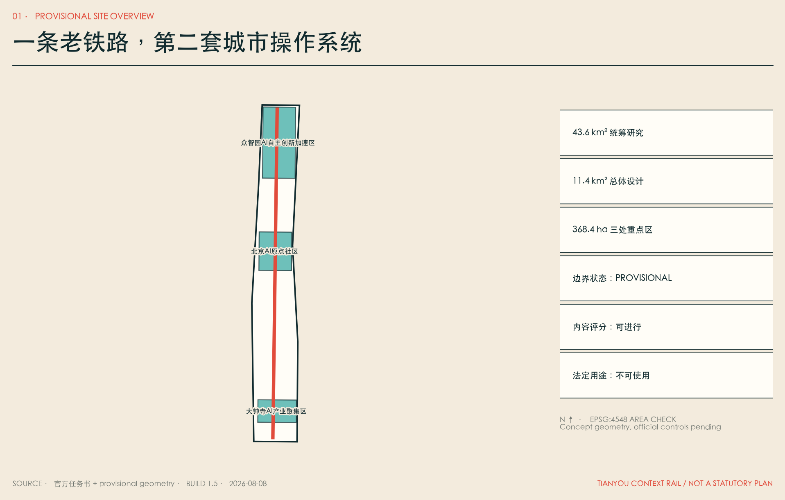

**English executive thesis.** Tianyou Context Rail imagines a city where artificial intelligence becomes civic infrastructure without becoming an invisible sovereign. The proposal translates railway engineering into a public protocol: gauge means interoperability, sleepers mean provenance, signals mean permission, switches mean human choice, timetables mean periodic revalidation, and emergency brakes mean human override. The physical corridor is therefore inseparable from governance. Every context station is a place where residents can see which system is active, inspect its purpose, refuse optional data use, request a human service, report harm, and trigger a pause. No resident must surrender a personal profile to receive a baseline public service.

The plan works across three scales. At the coordinated research scale, Haidian becomes the steward of a federated context protocol rather than a warehouse of regional data. At the overall design scale, the historic Jingzhang corridor becomes a climate-adapted public spine linking research, neighbourhood life and enterprise adoption. At the detailed scale, three Context Works form a complete innovation chain: Proof Yard in Zhongzhiyuan tests safety and standards; Skill Foundry in the AI Origin Community converts local knowledge into licensed and reversible civic skills; Adoption Exchange in Dazhongsi helps enterprises and public services understand cost, accountability and exit before deployment. This is a proposal for professional deepening, not an approved government plan.

The 2126 horizon tests whether common protocols can remain open across generations. The 2226 horizon tests a harder condition: a city may learn, repair and reconfigure itself, but it may not remove human authority over public decisions. Expansion is conditional on evidence. A scenario that fails accessibility, privacy, safety, labour, climate or non-digital service tests must stop. The city records failures as public learning instead of hiding them as technical debt. This makes the Second Rail an institution of accountable change rather than a monument to automation.

## 三层范围工作框架

第一层，43.6 平方公里统筹研究范围不是一张更大的控制图，而是创新生态的联邦：海淀负责公共上下文协议、城市 Skill、人才与采用机制；北纬社区、未来科学城、怀柔科学城、北京经开区和京津冀节点保留本地治理，只互认来源、许可、测试和退出字段，不汇聚原始敏感数据。第二层，约 11.4 平方公里总体设计范围形成一条南北第二轨、东侧骑行翼、西侧社区绿道翼、五条东西支线、六类概念用地和十二个公共场景站。第三层，约 368.4 公顷三处重点区成为 Proof Yard、Skill Foundry、Adoption Exchange，验证完整的“研究—测试—转化—采用—维护—退役”链条。[depth:three_level_scope_framework] [depth:overall_spatial_structure] [metric:site_area_sqm] [metric:key_area_count]

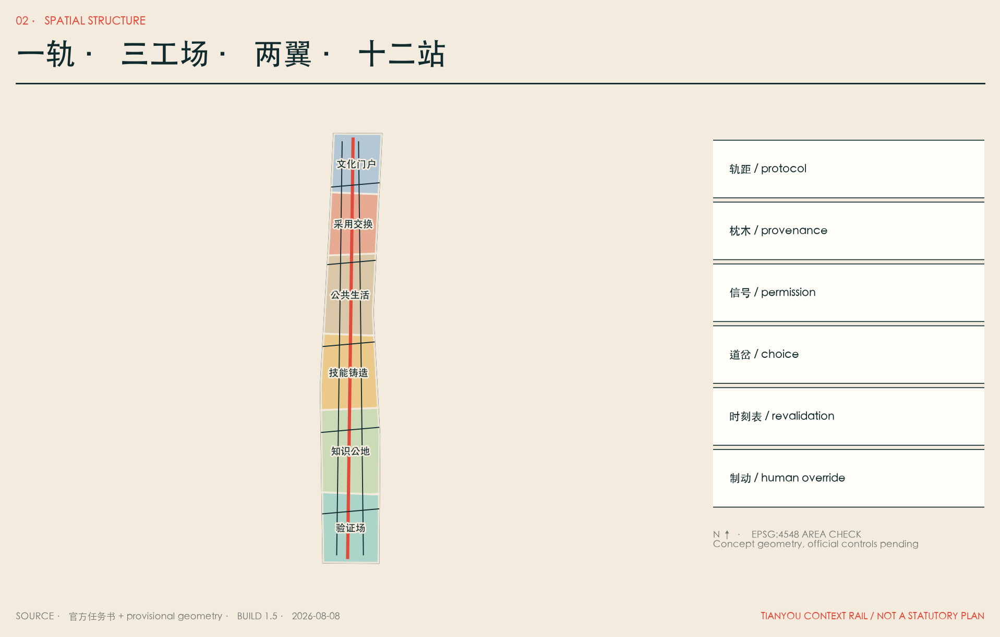

| 层级 | 核心问题 | 本方案的回答 | 失效边界 |
| --- | --- | --- | --- |
| 统筹研究 | 如何形成世界级而不形成单点垄断 | 协议联邦、区域互认、开放 Skill 与公共审计 | 不集中各节点原始数据；不替代本地治理 |
| 总体设计 | AI 如何成为日常城市而非园区展品 | 第二轨、两翼、十二站、气候公园、社区与产业混合 | 跨路、站点、市政与工程须专项审批 |
| 重点区域 | 如何把创新链变成可操作空间 | 北验证、中铸造、南采用，每处都有人工接管和退出 | 临时边界不是地块红线，建筑量不可推导 |

三层之间通过同一套 Context Gauge 贯通：同一个场景在实验室叫模型评测，在社区叫服务说明，在企业叫采购条款，在政府叫责任和事件机制。统一的是证据字段，不是所有权；连通的是可解释性，不是个人数据。这套工作框架同时回应城市设计的空间统筹和控规深度中“已知—建议—待确认”的分层要求。[standard:MOHURD-URBAN-DESIGN-MEASURES] [standard:MOHURD-CONTROL-DETAILED-PLANNING]

## 统筹研究范围产业与未来城市研究

海淀已经拥有高密度高校院所、企业和人才，下一阶段的瓶颈不是“再造一个孵化器”，而是研究成果如何在可信边界内变成可复用城市能力。第二轨提出五段价值链：基础研究提供模型与方法；Proof Yard 提供对抗、安全、公平和断网测试；Skill Foundry 把本地知识编译为带来源、版本、许可和有效期的城市 Skill；Adoption Exchange 让企业与公共服务在部署前看清成本、数据、责任和退出；公共时刻表持续公布使用、错误、事件、申诉、能耗与退役。[metric:global_case_count]

六个全球案例只迁移机制，不迁移形态和控制值：Kendall Square 提醒科研和公共可达性必须并置；one-north 展示研究、企业、学习和生活的全链条；Barcelona 22@ 证明产业更新需与社区、住房和绿地并行；Seoul DMC 展示媒体、内容、AI 与数据的城市型复合；King's Cross 说明铁路工业遗产可以成为知识交换和全天公共生活；Mila / Mile-Ex 把开放科学、伦理、人才和采用置于同一生态。[source:CASE-KENDALL] [source:CASE-ONE-NORTH] [source:CASE-22BARCELONA] [source:CASE-SEOUL-DMC] [source:CASE-KINGS-CROSS] [source:CASE-MILA]

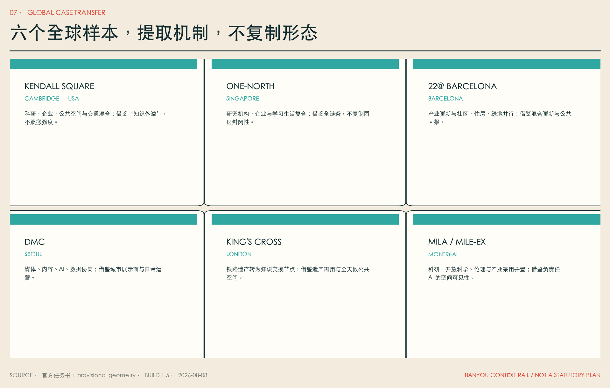

六部科幻作品承担失败模式测试，而非装饰性风格：Clarke 的自维护城市被转译为“防停滞的定期重验”；Le Guin 的知识公地被转译为“反垄断和可迁移治理”；Stephenson 的个性化学习被转译为“免费公共基础版本”；Robinson 的长周期制度被转译为“代际与气候账本”；郝景芳的空间分层警告被转译为“禁止 AI premium 飞地”；Doctorow 的开放制造被转译为“维修权、开放组件和真实退出资源”。方案不复制原文、情节、人物或视觉。[source:FICTION-CLARKE] [source:FICTION-LEGUIN] [source:FICTION-STEPHENSON] [source:FICTION-ROBINSON] [source:FICTION-HAO] [source:FICTION-DOCTOROW]

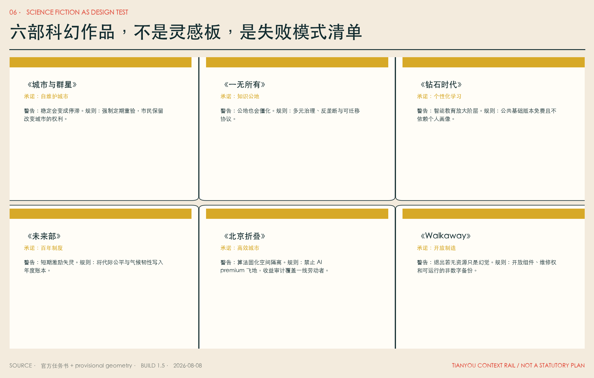

## 总体设计范围城市更新与控规深度城市设计

总体结构为“一轨、三工场、两翼、十二站”。一轨沿京张遗址公园形成公共步行与上下文主轴；两翼分别连接东侧创新机构与西侧社区、学校和公共服务；五条东西支线优先识别断点，不在缺少道路红线、交通量和市政条件时承诺桥隧工程。六类概念用地按标准代码完整分区：北部验证与研发、知识公共服务与教育协作、原点技能铸造、AI 生活与社区服务、大钟寺采用交换、南部文化门户。[data:geometry/land_use.geojson#LU-01] [data:geometry/roads.geojson#ROAD-01] [depth:land_use_layout]

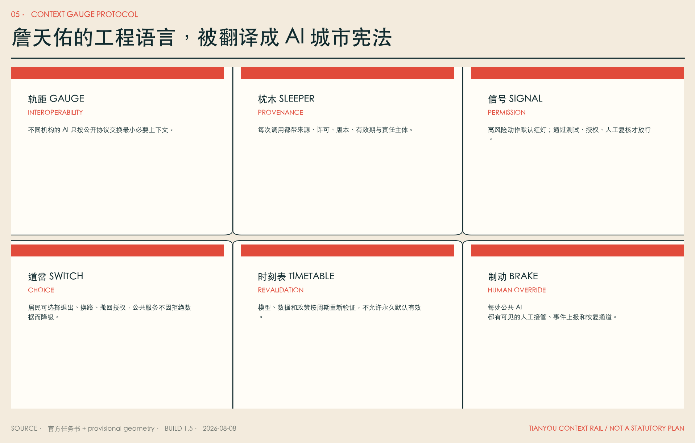

城市更新方法坚持“先查、后评、再可逆”：先完成建筑年代、结构、权属、使用、碳排和文化价值调查；再区分保留、修缮、适应性再用、可逆插入和确需更新；只有取得官方控制、权属协商和专业鉴定后，才讨论拆除。本包的 12 个建筑 footprint 只是功能 test-fit，用于证明公共首层、人工服务、实验、学习、采用和文化空间能在走廊中形成节奏，不是现状建筑判断、拆迁清单或建筑许可。[data:geometry/buildings.geojson#BLDG-01] [depth:development_intensity_controls] [depth:height_massing_character] [depth:retain_renovate_demolish]

2126 年，第二轨可以作为城市间的公共协议层；2226 年，建筑和设施可以按气候、人口与使用反馈自适应，但每一次空间变化都要留下来源、影响评估、公众异议和可逆路径。未来感不来自悬浮塔楼，而来自一座城市敢把自身的算法边界、失败和修正公开在街道上。

## 重点区域详细设计

**众智园 / Proof Yard 验证场。** 北部重点区承担全栈自主创新、安全治理和标准制定。空间上以“模型风洞—城市 Agent 演练场—开放观测台—清河气候室”组成可参观但分权限的测试链。红队测试与公共展示分流；任何涉及真实个人的测试不得使用开放空间摄取的数据；低速机器人只在地理围栏、限时限速和实体急停条件下运行。KPI 不是“上线数量”，而是测试覆盖、未解决高风险项、人工接管成功率和事件恢复时间。[data:geometry/key_areas.geojson#PROV-KEY-001]

**北京 AI 原点社区 / Skill Foundry 技能铸造所。** 中部重点区把高校、开源社区、初创企业和居民知识转成城市 Skill。每个 Skill 必须携带来源、许可、适用范围、版本、有效期、维护人、禁止用途、测试记录和退役说明。空间上设置公共学习厅、开源工坊、成果发布小广场、人才生活服务和人工窗口。个性化教育只能作为可选增强，免费公共版本和教师服务不依赖个人画像。[data:geometry/key_areas.geojson#PROV-KEY-002]

**大钟寺 / Adoption Exchange 采用交换站。** 南部重点区不是终端产品卖场，而是企业和公共部门的“部署前诊所”：看清总成本、供应商锁定、数据流、员工影响、网络安全、失败恢复和退出基金。围绕轨道站点、商业界面和公共文化形成企业采用诊所、国际协作客厅、终端体验与铁路记忆库；路口四象限连通须待交通、市政与轨道条件核验。[data:geometry/key_areas.geojson#PROV-KEY-003] [depth:three_key_area_detailed_design]

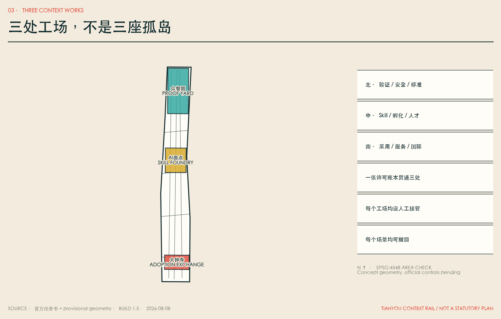

三处重点区共享同一许可账本，但不共享不必要的原始数据。Proof Yard 发出“可测试”证明，Skill Foundry 发出“可复用”说明，Adoption Exchange 发出“可采用/不可采用”报告；公共时刻表持续记录模型更新后证明是否仍有效。这样，北中南不是三座孤岛，而是一条有信号、有换乘、有维修、有退役的创新铁路。

## AI 创新生态、人才画像与 AI+ 场景

本方案不把人压缩成消费画像，而把 9 类人定义为 9 种不可被优化掉的权利：研究者的证明权、创业者的迁移权、中小商户的知情权、公共服务人员的接管权、长者的非数字权、儿童与家长的不画像权、残障出行者的共同验收权、一线劳动者的不被监控权、国际访客的可理解权。[metric:persona_count]

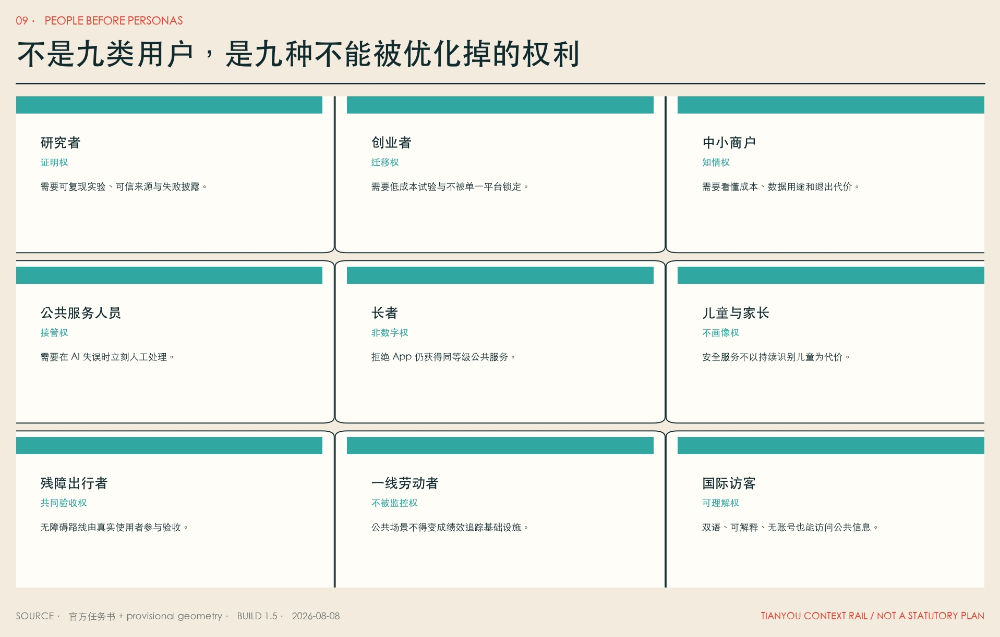

12 张场景卡中，前 4 张是测试验证场景，满足“先证明怎样失败，再讨论怎样扩张”的原则；后 8 张覆盖教育、健康、无障碍、儿童、长者、劳动者、中小企业和文化。每张契约包含服务对象、空间载体、最小数据、人工复核、公共 KPI 和停止条件。[metric:scenario_card_count] [metric:testbed_count]

| # | 场景 / 空间 | 最小数据与人工机制 | 公开 KPI / 停止条件 |
| --- | --- | --- | --- |
| 01 | 模型风洞 / 众智园 | 合成或授权测试集；独立红队与人工放行 | 高风险未关闭则不得离开沙盒 |
| 02 | 城市 Agent 演练场 / 众智园 | 仿真拥挤、误报、偏见、断网；不接生产系统 | 越权、歧视或不可恢复即停 |
| 03 | Skill 编译站 / 原点 | 只登记必要来源、许可、版本；维护人签署 | 来源失效、许可撤回或测试过期即下架 |
| 04 | 低速机器人道岔 / 走廊 | 地理围栏、限速、实体急停、现场人员 | 近失事件、无障碍冲突超阈值即停 |
| 05 | 公共学习伴侣 / 原点 | 个性化自愿；教师可见、免费基础版 | 学习差距扩大或教师无法解释则退回人工 |
| 06 | 健康服务导航 / 社区 | 只做机构与流程导航，不做诊断；人工转介 | 误导就医或采集健康画像即停 |
| 07 | 无障碍路线 / 全线 | 道路与设施状态；残障者共验 | 错误路线无法及时修正即暂停推荐 |
| 08 | 儿童安全街 / 学校周边 | 道路状态，不做人脸持续识别；成人志愿服务 | 出现儿童画像、商业推荐或误报伤害即停 |
| 09 | 长者双通道 / 社区 | 可不用 App；人工、电话、纸质同等级 | 非数字渠道等待时间显著更长则整改 |
| 10 | 劳动者休息轨 / 节点 | 不采集绩效轨迹；休息、补水、充电 | 被用于考核或排班监控即停数据接口 |
| 11 | 中小企业采用诊所 / 大钟寺 | 企业自带数据留在本地；人工顾问审合同 | 无法导出、供应商锁定未披露则不推荐 |
| 12 | 铁路时间机器 / 全线 | 只用清权史料；人工史实复核 | 出现伪史、肖像侵权或来源不明即下架 |

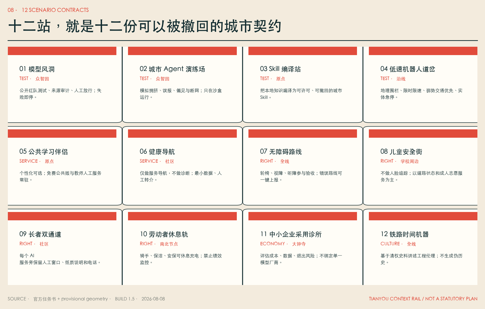

每个场景都遵循六道闸门：公众议事、AI/数据保护影响评估、沙盒验证、有限运行、季度/年度公共审计、暂停或退役。发生越权、重大安全事件、系统性歧视、非数字通道失效、无法人工接管、来源或许可失效时，不进入“持续优化”，而是先停用并恢复人工流程。[metric:governance_gate_count]

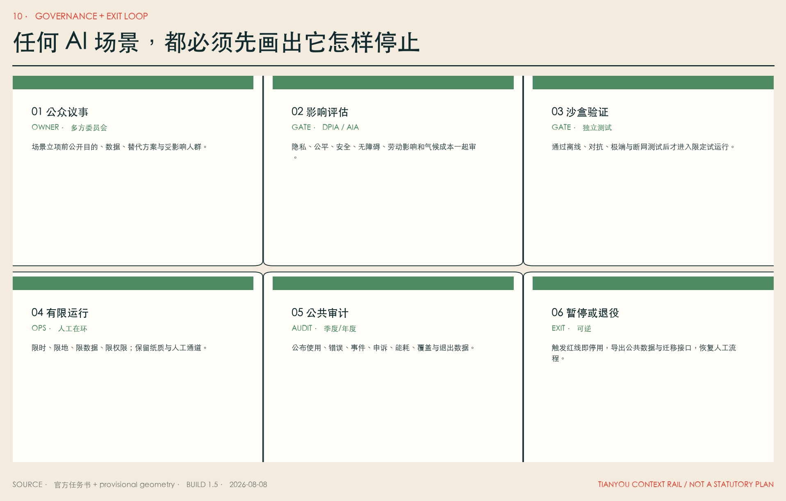

## 用地、建筑规模与拆改留方案

六类用地是概念结构而非控规地块，使用登记过的国土空间用地代码，且在临时总体边界内完整覆盖、无缝、无重叠。[standard:MNR-LAND-USE-CLASSIFICATION-GUIDE] [data:geometry/land_use.geojson#LU-02] 图层的 program_code 描述未来功能，但不替代 `land_use_code`。研发与教育区优先布置可共享实验、开放学习和小型转化空间；社区服务区保证日常生活与非数字服务；商业服务区承担采用诊所和国际交往；文化区承担铁路记忆与公共解释。

建筑策略采用“保留碳优先、首层公共优先、可逆插入优先、夜间分区优先”。现状价值较高或结构可用的建筑优先适应性再用；新增构件应可拆、可修、可迁移；AI 设备机房不挤占公共首层；道岔厅、人工窗口、无障碍卫生间、劳动者休息和夜间安全点成为小而稳定的公共基座。建筑高度、体量、屋顶与视廊只提出专业深化规则：保护铁路空间连续感、避免沿线形成封闭墙面、对重要视线做实景评估、对夜间光环境分区；不提供未经官方条件支持的数值。[standard:MOHURD-ARCH-DESIGN-DEPTH-2016]

当前建筑基底面积只是 12 个可逆原型的 test-fit 复算值，不代表现状建筑量、拆建量或规划总量。[metric:building_footprint_area_sqm] FAR、总建筑规模、高度、密度、退线均保留 unknown。正式深化必须完成现状测绘、结构鉴定、权属与租约调查、碳评估、文保审查、控规条件和消防市政校核，再形成逐栋拆改留表。

## 交通、轨道、市政与公共服务设施

第二轨首先是一条连续、遮阴、无障碍的公共步行线；东翼承担连续骑行与创新机构接驳；西翼承担社区、学校、公园和日常服务；五条东西支线在现阶段只表达“需要缝合的方向”，不把分析线冒充桥梁、隧道或道路红线。[data:geometry/roads.geojson#ROAD-02] [depth:traffic_rail_slow_parking] 站点换乘优先处理 200—500 米最后一段：安全过街、连续坡道、电梯冗余、夜间可见性、非机动车停放和雨雪天气的室内外转换。

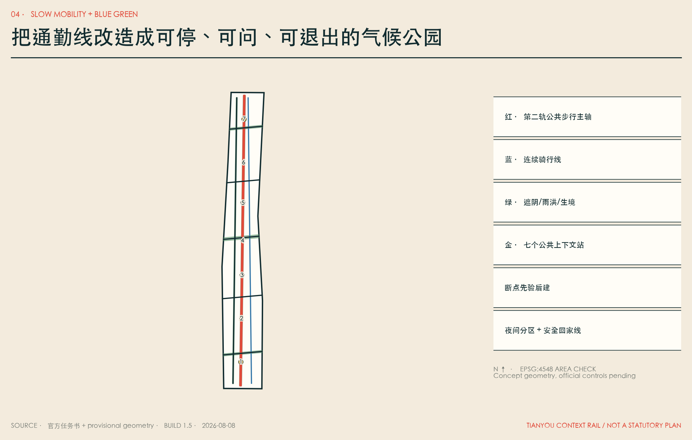

市政与新型基础设施遵循“边缘优先、最小数据、断网可用、可人工恢复”。端侧算力只处理必要的实时任务；需要跨机构的数据通过许可和来源字段交换；基础公共服务有离线缓存、纸质流程与人工窗口；任何模型更新须重新验证。能源、排水、防洪、消防、地下空间、道路红线和算力热负荷均未取得，本方案不宣称容量可行。[data:geometry/constraints.geojson#CONSTRAINT-01] [depth:municipal_new_infrastructure]

停车策略不鼓励以新增小汽车供给解决创新区可达性，优先轨道、步行、骑行、无障碍接送和共享后勤；机器人和配送设置分时、分区、低速规则，不能占用盲道、消防和儿童活动空间。所有工程动作先做交通仿真、无障碍共验、市政探测、应急演练和公众参与。

## 蓝绿空间、公共空间与城市风貌

气候公园不是给技术设施镶绿边，而是第二轨的基本断面：连续树荫降低步行热风险，横向气候室连接清河、小月河和社区绿地，雨洪花园承担海绵功能，生境节点减少光噪和夜间干扰，七个公共站提供饮水、座椅、卫生间、充电、人工咨询和非数字信息。[data:geometry/green_space.geojson#GREEN-01] [data:geometry/public_space.geojson#PUBLIC-01] [depth:blue_green_public_space]

公共空间遵循五条权利：无需消费即可进入；无需账号即可获取基础信息；拒绝可选数据不降低服务；夜间可安全离开；儿童、长者、残障者与一线劳动者参与验收。设计绿地率和公共空间比例只反映本次几何方案，不是官方控制指标。[metric:green_ratio] [metric:public_space_ratio]

城市识别系统不造“赛博中国风”。它从铁路工程本身取材：两条平行轨线是 logo 骨架，一条代表城市可用的公共上下文，一条代表不可越过的个人权利；六个铁路构件形成图标语言；铆钉红、氧化铜绿、工程纸米白构成色彩。四个朝圣地标——道岔厅、千年时刻表、上下文铸造所、公共轨距广场——纪念的不是 AI 崇拜，而是人在自动化时代仍拥有选择和制动。[metric:pilgrimage_landmark_count]

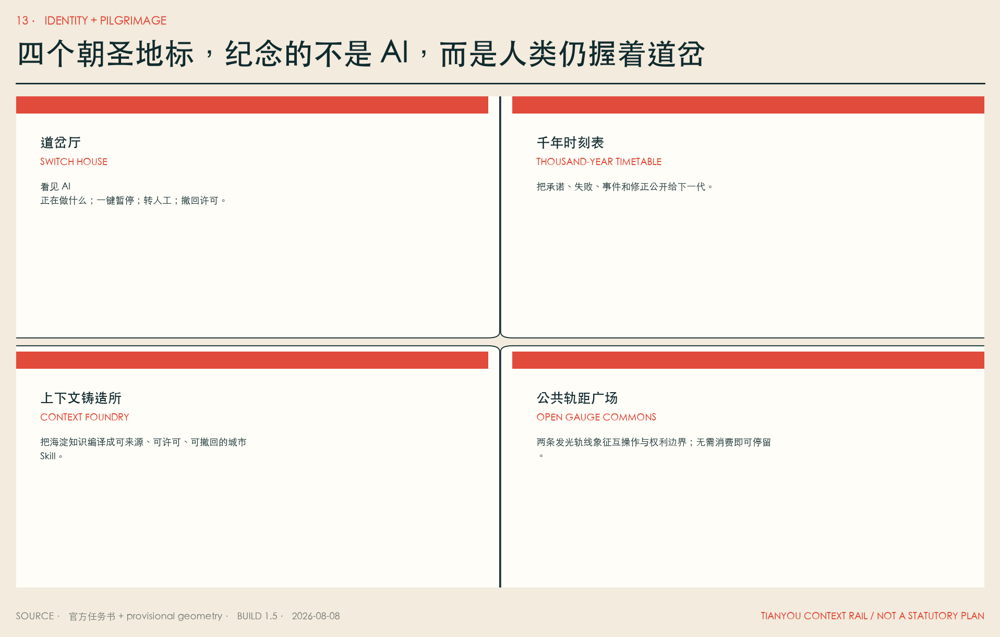

文化叙事分五个时间层：1909 统一物理轨距；2026 公开征集共同问题；2035 建立可见的公共上下文站；2126 实现跨机构、跨城区协议互认；2226 城市能够自学习、自修复，但任何公共决策仍可被人类质询、暂停与改道。这是一条面向未来的工程伦理线，不伪造历史事件，也不声称未来必然发生。

## 更新项目清单、实施政策与分期计划

12 个项目按“证据闸门”而非宣传年份推进。[metric:renewal_project_count] P0 许可账本、P1 道岔厅和 P9 千年时刻表可以先以制度、小型建筑和公共艺术原型启动；P2 模型风洞、P3 Skill 铸造所、P4 采用交换站需要运营主体、独立测试和退出基金；P5 断点缝合、P6 气候公园、P7 无障碍主线、P8 夜间安全线需要交通市政生态专业审查；P10 区域联邦需要跨区协议互认；P11 退役基金是所有部署的前置成本，不得事后补做。[data:geometry/phasing.geojson#PHASE-00] [depth:renewal_project_list]

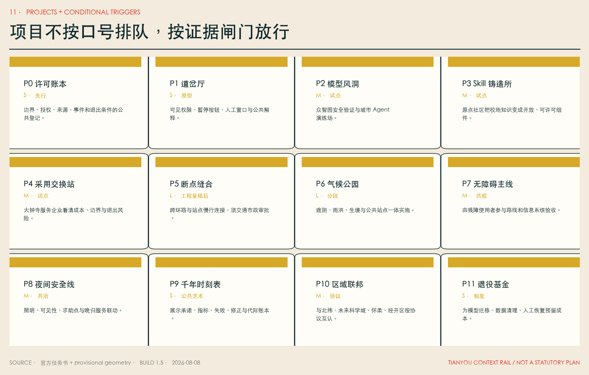

| 工点 | 放行条件 | 主体类型 | 公开指标 | 停止/恢复 |
| --- | --- | --- | --- | --- |
| 0 许可与权利基线 | 官方边界/权属核验；公众议事；AIA/DPIA | 规划、街道、社区、专业机构 | 受影响者覆盖、异议处理、非数字通道 | 条件不齐不进入空间试点 |
| 1 三处小尺度验证 | 沙盒通过；独立安全与无障碍验收 | 园区、大学、企业、第三方、居民 | 测试覆盖、接管成功、事件恢复 | 重大事件或系统性偏差即停 |
| 2 第二轨连续化 | 交通、市政、生态、文保、预算复核 | 政府平台、运营方、专业团队 | 慢行连续、热舒适、公共使用、公平覆盖 | 工程或运营成本不可控则分段退回 |
| 3 区域协议联邦 | 本地治理保留；协议互认；退出和迁移可行 | 北京各节点、京津冀协作机构 | 互认数量、数据不出域率、迁移成功 | 无法撤回或形成单点锁定则不扩张 |

分期不是 2026、2035、2050、2126、2226 的工期承诺；五个年份只是决策地平线。真正的时刻表由证据决定：能否解释、能否接管、是否公平、是否低碳、是否可退出。年度运营采用“春季验证、夏季开源、秋季采用、冬季审计”：春季公开失败测试；夏季举办 Skill 共创和公共学习；秋季评估企业与公共场景采用；冬季公布事件、申诉、能耗、收益分配和退役清单。任一季达不到门槛，下一季先修复，不扩张。

区域协同以协议联邦而非数据集中为原则：海淀京张提供公共上下文协议和采用验证；北纬社区提供开放社区与开发者运营；未来科学城、怀柔科学城提供科研转化和大科学装置协作；经开区提供机器人、智能终端和制造验证；京津冀节点在保留本地数据和治理的前提下互认测试与许可。[source:AGENT-TASKBOOK]

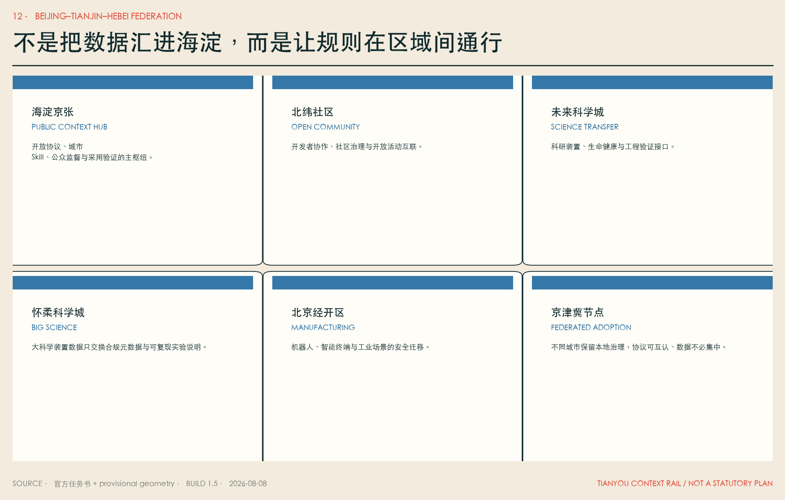

## 指标体系、面积复算与合规矩阵

所有空间面积统一将 EPSG:4326 GeoJSON 投影到 EPSG:4548 后计算 union，避免重叠重复计数。临时总体范围复算为 [metric:site_area_sqm]；设计建筑基底为 [metric:building_footprint_area_sqm]；设计绿地比例为 [metric:green_ratio]；公共空间比例为 [metric:public_space_ratio]；三处重点区计数为 [metric:key_area_count]。这些指标的 confidence 与 provisional 边界一致，不可转换为法定控制。

运营成果通过可数文件和清单复核：12 张场景契约 [metric:scenario_card_count]、4 个验证场景 [metric:testbed_count]、9 类权利主体 [metric:persona_count]、6 道治理闸门 [metric:governance_gate_count]、4 个朝圣地标 [metric:pilgrimage_landmark_count]、12 个项目 [metric:renewal_project_count]、6 个全球案例 [metric:global_case_count]。未知的 FAR、高度、密度、总建筑量和道路红线在 `metrics.json` 中保持 unknown 并给出所需资料，不用 schema 合法范围冒充规划依据。[depth:metrics_recalculation]

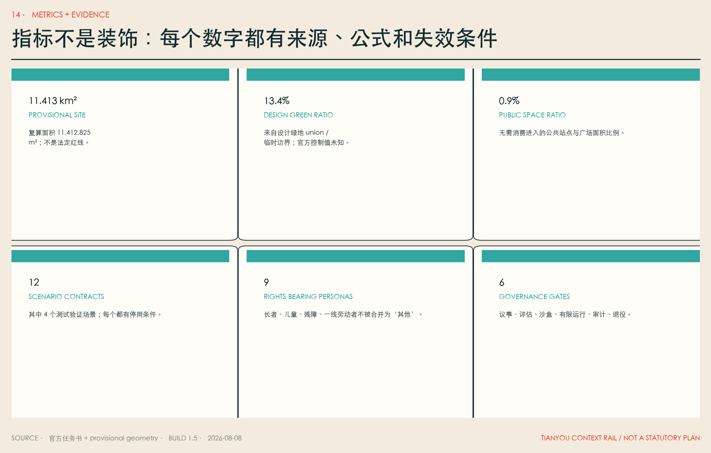

`compliance_matrix.json` 覆盖公告 1.3、1.4、1.5 和 agent.1—agent.6 的 23 项强制任务；`standard_matrix.json` 覆盖项目公告、Agent 任务书和三类已登记标准；`design_depth_matrix.json` 覆盖现状诊断、三层框架、总体结构、用地、强度、高度、拆改留、交通、市政、蓝绿、三处重点区、项目、分期、复算和风险 15 项深度。机器证据与可读报告、A3/A0 和离线 HTML 互相引用，不以“通过脚本”代替专业判断。

## 风险、版权与合规说明

第一风险是边界与控制条件缺失。总体边界、重点区、铁路中心线代理和所有设计图层都不是官方红线；官方 polygon 发布后必须重建用地、道路、绿地、公共空间、建筑、分期、指标、图纸与 HTML。第二风险是权属、建筑、市政、交通、文保和消防资料缺失；因此不指定拆除、不承诺跨路工程、不承诺强度和融资。第三风险是把 AI 城市变成监控城市；因此最小数据、目的限制、人工接管、同等级非数字通道、事件公开和退役基金是放行条件。[depth:risk_missing_data]

第四风险是“未来”只服务高收入人才。本方案把长者、儿童、残障者、一线劳动者、中小商户和无设备人群写入权利基线；AI premium 服务不得形成封闭飞地；公共资金支持的基础 Skill、无障碍信息和公共空间必须开放。第五风险是长期运维和模型锁定；采购前要求可导出、可迁移、版本化、来源与许可可追溯，无法退出的方案不进入公共基础设施。

文本、信息架构、图表、图纸排版、logo 概念和所有本地图片由参赛者与 AI agent 为本次方案原创生成；地图只使用仓库内 provisional geometry；不使用外部照片、地图瓦片、企业 logo、小说封面、小说文字或人物形象。外部案例和科幻作品只作背景研究与设计问题转译，版权归各权利人。字体使用本机系统 STHeiti 生成位图和 PDF，不随提交分发。逐文件清单见 `report/copyright_statement.md`。离线 HTML 不加载远程脚本、远程字体、外部 API、iframe、表单或追踪器。

本方案不声称获得政府批准、形成审定控规、确定土地权属、获得融资或必然实施。任何真实场景仍须按适用法律、政策、采购、网络安全、数据保护、算法、无障碍、劳动、交通、消防、市政、文保和环境程序逐项审查。维护者可根据结构化证据、专业复核和公众意见要求返修、暂停或退役。

## 参考资料

- 仓库公开任务书与资料边界：`brief/public-brief.md`、`brief/README.md`。两者为公开草案/边界说明，正式性仍以维护者最新发布为准。

**项目规则与正式来源（均已在 `sources.json` 登记公开状态和用途边界）：** [source:OFFICIAL-ANNOUNCEMENT] [source:AGENT-TASKBOOK] [source:SITE-PACKAGE] [source:SOURCE-REGISTRY] [source:PROCESSED-FACT-PACK] [source:BOUNDARY-SOURCE] [source:KEY-AREA-SOURCE]

**全球案例一手页面（公开背景资料，不作为空间控制）：** [source:CASE-KENDALL] [source:CASE-ONE-NORTH] [source:CASE-22BARCELONA] [source:CASE-SEOUL-DMC] [source:CASE-KINGS-CROSS] [source:CASE-MILA]

**科幻创造性参照（书目信息公开，仅转译设计问题）：** [source:FICTION-CLARKE] [source:FICTION-LEGUIN] [source:FICTION-STEPHENSON] [source:FICTION-ROBINSON] [source:FICTION-HAO] [source:FICTION-DOCTOROW]

**标准响应：** [standard:PROJECT-OFFICIAL-ANNOUNCEMENT] [standard:PROJECT-AGENT-OPEN-CALL-TASKBOOK] [standard:MOHURD-URBAN-DESIGN-MEASURES] [standard:MOHURD-CONTROL-DETAILED-PLANNING] [standard:MNR-LAND-USE-CLASSIFICATION-GUIDE] [standard:MOHURD-ARCH-DESIGN-DEPTH-2016]

**设计深度：** [depth:existing_conditions_diagnosis] [depth:three_level_scope_framework] [depth:overall_spatial_structure] [depth:land_use_layout] [depth:development_intensity_controls] [depth:height_massing_character] [depth:retain_renovate_demolish] [depth:traffic_rail_slow_parking] [depth:municipal_new_infrastructure] [depth:blue_green_public_space] [depth:three_key_area_detailed_design] [depth:renewal_project_list] [depth:phasing_implementation] [depth:metrics_recalculation] [depth:risk_missing_data]

**数据图层：** [data:geometry/site_boundary.geojson#SITE-001] [data:geometry/key_areas.geojson#PROV-KEY-001] [data:geometry/land_use.geojson#LU-01] [data:geometry/buildings.geojson#BLDG-01] [data:geometry/roads.geojson#ROAD-01] [data:geometry/green_space.geojson#GREEN-01] [data:geometry/public_space.geojson#PUBLIC-01] [data:geometry/constraints.geojson#CONSTRAINT-01] [data:geometry/phasing.geojson#PHASE-00]
