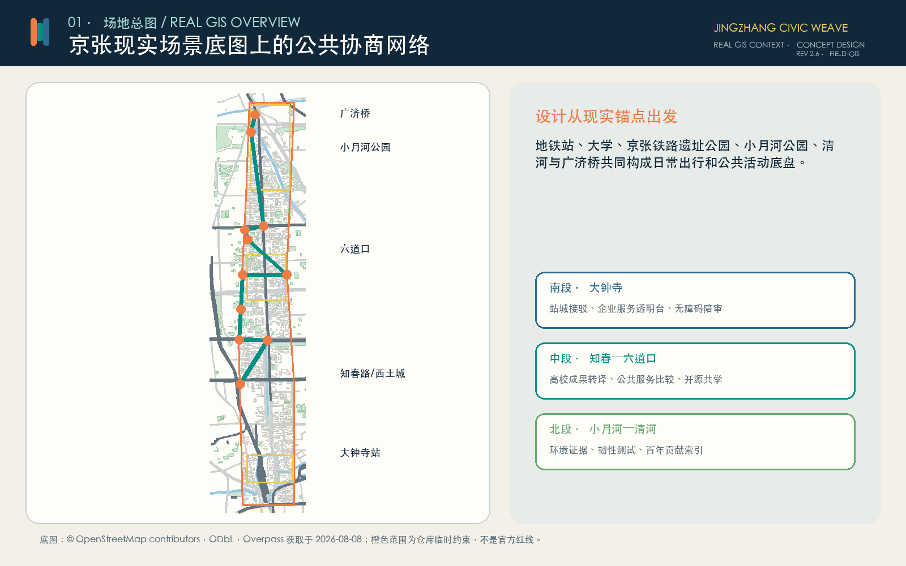
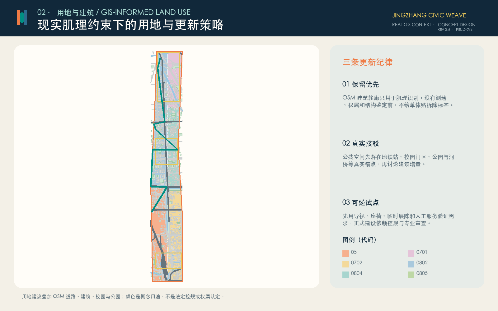
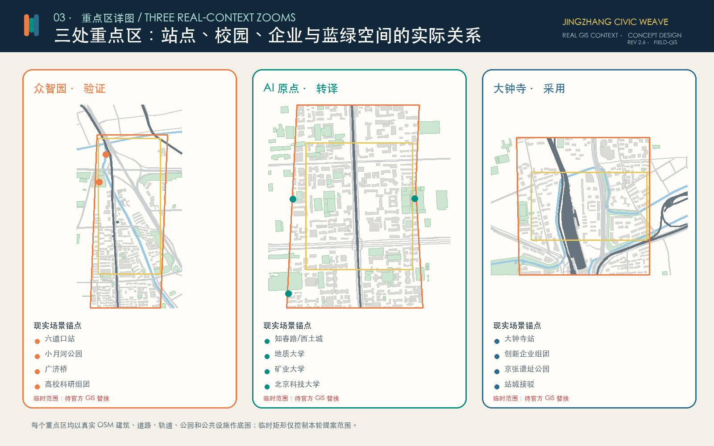
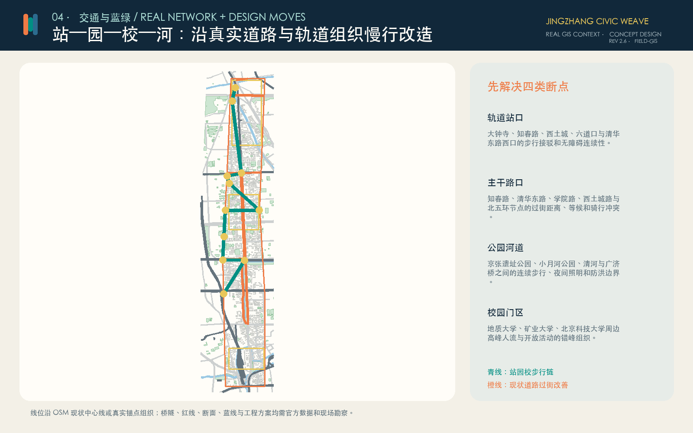
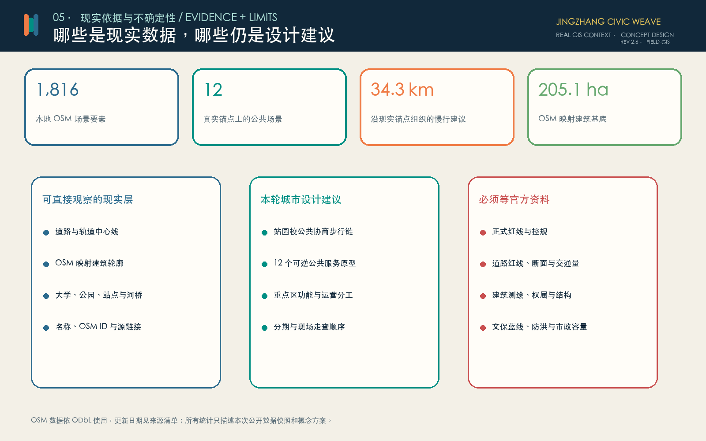

# 京张议织 JINGZHANG CIVIC WEAVE

> 先看人每天在哪里走，再决定技术放在哪里。

这不是在一张空白纸上画未来城市。方案把大钟寺站、知春路、西土城、清华东路西口、六道口、三所高校、京张铁路遗址公园、小月河公园、清河与广济桥放进同一张现实底图，再沿真实道路、轨道和步行关系安排公共服务、验证活动与更新次序。

场地校准版 2.6 把可核验的 OSM 要素直接写入提交几何：建筑只采用现有映射轮廓，慢行和过街建议沿现状道路关系组织，公园、水系、车站与校园名称作为十二个公共原型的定位依据；无法由公开资料支持的道路红线、拆改留和开发强度继续保留为空缺。

## 设计依据与资料清单

正式任务范围和三处重点区来自征集公告。当前没有可公开核验的官方精确红线，因此总体范围和重点区仍使用仓库提供的临时约束；图上橙色和黄色边界只控制本轮概念提案，不解释为审批红线、权属界线或道路红线。[source:OFFICIAL-ANNOUNCEMENT] [data:geometry/site_boundary.geojson#SITE-001]

现实场景底图来自 OpenStreetMap 公开数据，通过 Overpass API 于 2026 年 8 月 8 日提取，内容包括道路、轨道、水系、建筑轮廓、校园、公园、站点和部分公共设施。每个要素保留 OSM ID、源链接和 ODbL 归属。公开地图可能存在缺漏、偏移或更新滞后，只用于现状识别、城市肌理阅读和设计锚点，不替代测绘、控规、权属或工程勘察。[source:OSM-OVERPASS-20260808] [depth:existing_conditions_diagnosis]

后续深化必须补齐官方红线、控规、道路断面、建筑测绘、权属、市政、防洪、文保和公共服务底数。任何涉及永久建设、拆除、桥隧或站点改造的结论，都要在这些资料和现场勘察到位后重新判断。

## 三层范围工作框架

43.6 平方公里统筹研究范围用于理解中关村创新资源、学院路高校群、京张铁路文化、轨道站点和周边生活区的协作关系；约 11.4 平方公里总体设计范围用于组织慢行、公共空间、用地更新和分期；三处重点区用于把产业、教育、社区和公共治理落到具体场景。[source:OFFICIAL-ANNOUNCEMENT] [depth:three_level_scope_framework]

总体结构从原来的抽象轴线改为“站—园—校—河公共协商链”：

1. **南段，大钟寺站城接口**：把轨道接驳、企业服务、社区通勤和京张铁路遗址公园联系起来。
2. **中段，知春—西土城—六道口校城接口**：连接三座轨道站和中国地质大学、中国矿业大学、北京科技大学，形成成果转译、公共学习和服务比较的连续界面。
3. **北段，小月河—清河生态接口**：围绕小月河公园、清河与广济桥组织环境解释、韧性测试和百年工程叙事。

一条概念慢行链把十二个现实锚点串联起来；横向联系尽量沿大钟寺东路、知春路、清华东路、学院路、西土城路、清河路和北五环等现状道路讨论过街与接驳，而不是另画一套脱离城市的路网。[data:geometry/roads.geojson#ROAD-001] [depth:overall_spatial_structure]

## 统筹研究范围产业与未来城市研究

产业策略按“验证—转译—采用”组织。北段关注模型安全、城市韧性和环境验证；中段依托高校把研究成果转译成居民、企业和公共部门可以理解的服务说明；南段在服务进入城市前公开比较 AI、人工和离线方案，并明确责任、申诉和退出。

六个国际案例提供方法参照，而不是空间模板：Barcelona 22@ 提醒产业更新要同时回应社区和公共空间；STATION F 展示历史建筑与创业服务的复合运营；Helsinki AI Register 强调公共 AI 的可见性和反馈；UK AI Security Institute 强调能力与风险测试；NIST AI RMF 提供全生命周期治理框架；Singapore AI Verify 说明技术测试与过程检查需要并行。[source:CASE-22BARCELONA] [source:CASE-HELSINKI-AI-REGISTER] [source:CASE-NIST-AI-RMF]

对应到京张，产业生态需要五种公共能力：可重复的验证、可理解的成果说明、可比较的服务目录、可追责的人工责任和可积累的失败档案。空间设计的任务不是承诺招商规模，而是为这些能力提供可进入、可观察和可退出的场所。

## 总体设计范围城市更新与控规深度城市设计

用地方案先读取 OSM 已映射的校园、公园、住宅、商业和体育空间，再叠加现状主干路中心线；剩余空间按南、中、北三段的现实功能关系补成拓扑连续的概念分区。用地代码遵循国家分类术语，但颜色只表达本轮建议，不代表已批用途。[data:geometry/land_use.geojson#LU-001] [depth:land_use_layout]

总体设计的核心不是增加一条脱离现状的轴线，而是修补现实网络中的断点。南段围绕大钟寺站处理轨道到街区的换乘、无障碍和企业服务界面；中段利用知春路、西土城和六道口三站与高校门区之间的密集人流，组织步行、共享学习和成果转译；北段把小月河公园、清河和广济桥作为生态、韧性与文化叙事的共同底盘。公共空间优先落在已有出入口、道路交叉、公园边缘和校园开放界面，避免在没有权属依据的位置预设大型建筑。[data:geometry/roads.geojson#ROAD-001] [depth:overall_spatial_structure]

本轮控制重点是公共界面、步行连续、可逆设施和运营责任，不提出未经支持的容积率、高度或建筑退线。现状道路中心线、建筑轮廓和公园范围来自公开地图，适合识别关系但不足以支撑工程尺寸；正式控规、道路红线、建筑测绘和市政资料到位后，应重新划分用地、核对设施承载并校准所有指标。[depth:height_massing_character]

## 用地、建筑规模与拆改留方案

建筑轮廓全部来自 OSM 公开映射并裁切到临时范围，不再生成虚构楼栋。由于 OSM 不是建筑测绘，也不提供可靠的层数、结构、年代和权属，本方案对所有建筑采用“保留优先、待现场核查”的默认态度，不给单体贴拆除标签。[data:geometry/buildings.geojson#BLDG-0001] [depth:retain_renovate_demolish]

更新分三步：先用导视、座椅、临时展陈和人工服务验证真实需求；再在有明确运营主体、消防条件和社区支持的建筑首层试点；最后才在正式控规、权属和结构鉴定支持下讨论永久改造或新增建筑。容积率、高度、退线和建设规模保持待正式资料补齐。[depth:development_intensity_controls]

## 重点区域详细设计

### 5.1 众智园：小月河—清河验证片区

现实底盘包括六道口站、小月河公园、清河、广济桥以及周边高校科研资源。建议把安全验证、韧性测试和环境解释做成可预约、可旁观的小规模公共课程，不先建设封闭园区。靠近河道和公园的设施采用可移动构件，传感器默认关闭，任何防洪、生态和文保要求由专业部门先行判断。[data:geometry/key_areas.geojson#PROV-KEY-001]

### 5.2 AI 原点：知春—西土城—六道口转译片区

现实底盘包括知春路站、西土城站、六道口站以及中国地质大学、中国矿业大学和北京科技大学。设计重点是校园门区、轨道站口与社区街道之间的步行连续性，并在可进入的首层空间设置开源成果门诊、教育共学桌和公共服务比较台。高校成果必须用普通语言说明适用范围、失败情形、许可证和撤回方式。[data:geometry/key_areas.geojson#PROV-KEY-002]

### 5.3 大钟寺：站城采用片区

现实底盘包括大钟寺站、周边创新企业组团、社区通勤路线和京张铁路遗址公园南段。设计先解决站口到街区的无障碍连续性，再用临时服务透明台比较 AI、人工与离线服务的时间、成本、风险和申诉路径。企业周边空间更新不预设品牌合作或建设规模。[data:geometry/key_areas.geojson#PROV-KEY-003] [depth:three_key_area_detailed_design]

## AI 创新生态、人才画像与 AI+ 场景

六类核心使用者是：日常通勤者与周边居民、老年人和残障使用者、高校师生与研究者、开发者和初创团队、公共服务人员、园区与公园运营者。每类人都需要人工帮助、无账户通行和拒绝自动化的权利，而不是被迫适应统一的数字入口。

十二个场景都绑定真实地点或空间关系：[data:geometry/constraints.geojson#SCENARIO-01] [metric:scenario_node_count]

| 锚点 | 公共原型 | 需要解决的现实问题 |
| --- | --- | --- |
| 大钟寺站 | 无障碍接驳陪审 | 站口到街区的连续步行、坡度、过街和求助 |
| 大钟寺创新企业组团 | 服务透明台 | 企业服务的用途、数据、自动化程度和人工责任 |
| 京张铁路遗址公园 | 模型说明长廊 | 用普通语言展示适用范围、失败案例和撤回方式 |
| 知春路站 | 通勤服务比较台 | AI、人工与离线通勤服务是否真正等价可达 |
| 西土城站 | 人工接管站 | 自动化异常时由谁接管、恢复和解释 |
| 清华东路西口站 | 教育共学桌 | 教师、学生和家长如何保留最终判断 |
| 六道口站 | 开源成果门诊 | 高校成果如何被社区理解、复现和质疑 |
| 中国地质大学 | 城市安全验证课 | 地质、地下空间和公共安全问题的跨学科验证 |
| 中国矿业大学 | 城市韧性测试场 | 能源、材料与基础设施韧性的小规模可逆试验 |
| 北京科技大学 | 材料循环实验 | 公共设施的可维修、可回收与低扰动构造 |
| 小月河公园 | 环境证据窗 | 数据解释不能取代生态、防洪和公园管理判断 |
| 广济桥 | 百年贡献索引 | 同时记录贡献、失败、修订和可撤回的公共记忆 |

所有场景共同遵守：无账户可用、人工服务同等可达、数据最小化、用途公开、人工复核、可申诉、可暂停和可退出。测试通过不等于绝对安全，也不构成行政许可。

## 交通、轨道、市政与公共服务设施

交通设计优先处理四类现实断点：轨道站口的无障碍接驳；知春路、清华东路、学院路、西土城路和北五环等主干路口的过街冲突；京张铁路遗址公园、小月河公园和清河之间的绿道连续性；高校门区的高峰人流和共享单车组织。[source:OSM-OVERPASS-20260808] [depth:traffic_rail_slow_parking]

图中的青线是由真实锚点串联的概念步行链，橙线是沿 OSM 现状道路中心线识别的过街和接驳改善对象。它们不代表道路红线、桥隧位置或工程线位。下一步应逐段开展步行时距、冲突点、坡度、遮阴、照明、停车和无障碍现场调查。

### 市政与新型基础设施

新型基础设施不等于布满摄像头。建议只设置四类可控接口：现场可关闭的端侧设备、公开用途和保存期限的数据授权台、随时可接管的人工服务席、以及服务恢复和退出工具。任何摄像、定位或环境感知都必须说明必要性，并优先采用不识别个人的方式。[depth:municipal_new_infrastructure]

现阶段没有供水、排水、供电、通信、消防、算力负荷和防洪容量资料，因此不提出容量数字。临时活动优先使用现有设施并设置撤场计划；永久设施须经过市政、消防、能源、网络安全和运营维护评估。

## 蓝绿空间、公共空间与城市风貌

蓝绿系统以 OSM 已映射的京张铁路遗址公园、小月河公园、清河及广济桥为现实起点，再用窄尺度、可逆的绿荫步行带连接站点和校园。现状公园边界只是公开地图记录，仍需官方绿线、蓝线、防洪和文保资料校核。[data:geometry/green_space.geojson#GREEN-001] [depth:blue_green_public_space]

公共空间原型采用可移动座椅、遮阴、纸质说明、人工咨询和可关闭展示设备。夜间照明以安全和居民安宁为先，不通过持续追踪制造“智能感”。城市风貌延续铁路工程的克制结构、学院路的开放学习和中关村的可读界面，不复制企业商标。

三类文化地标分别是：京张铁路遗址公园的模型说明长廊、站城接口的服务透明台、广济桥附近的百年贡献索引。它们不占用遗产本体，不做个人信用排名，并允许更正、撤回和补充失败记录。[data:geometry/public_space.geojson#PUBLIC-003]

## 更新项目清单、实施政策与分期计划

分期按现实对象和现场工作组织，而不是按抽象色块推进：[data:geometry/phasing.geojson#PHASE-001] [depth:phasing_implementation]

| 阶段 | 现实对象 | 工作内容 | 放行条件 |
| --- | --- | --- | --- |
| 第一阶段 | 大钟寺站及周边街区 | 无障碍走查、服务透明台、临时公共座席 | 现场核查、运营主体、交通安全、消防和社区意见 |
| 第二阶段 | 知春路—西土城—六道口高校组团 | 开源成果门诊、教育共学、道路过街改善 | 校园协同、道路红线、交管、权属和居民反馈 |
| 第三阶段 | 小月河公园—清河—广济桥 | 环境证据窗、韧性测试和贡献索引 | 防洪、生态、文保、公园管理和官方边界 |

年度运营建议包括春季城市问题征集、夏季公共验证周、秋季高校开源节和冬季城市服务评议会。每次活动都要公布责任人、数据规则、无障碍安排、人工替代和撤场条件；没有长期维护者的试点不进入下一阶段。[depth:renewal_project_list]

## 指标体系、面积复算与合规矩阵

指标分为三组：现实公开数据快照、从本轮几何复算的概念设计指标、以及必须等待官方资料的指标。OSM 建筑面积只描述公开地图中已映射并落入临时范围的轮廓，不等于完整现状建筑量；概念慢行长度只描述本轮线路；临时范围面积不能升级为官方红线面积。[metric:building_footprint_area_sqm] [metric:road_network_length_m] [depth:metrics_recalculation]

容积率、建筑高度、正式道路面积、停车供需、市政容量和工程造价保持待正式数据补齐。图纸中的精细线条不改变这些不确定性。

## 品牌、文化叙事与长期共同体

“京张议织”中的“议”代表公共讨论和人类最终判断，“织”代表把铁路遗产、校园知识、产业服务、社区生活和蓝绿空间编成一条可步行的网络。标识采用三条错位竖带：橙色表示质询，青色表示协作，蓝色表示证据；图形由基础几何构成，不复制任何企业标志。

文化叙事从京张铁路的自主工程实践出发，经过学院路和中关村的开放学习，走向 AI 时代可理解、可比较、可申诉、可退出的公共技术。长期共同体不以流量排名为目标，而以可复现问题、公开失败、版本维护和跨学科合作衡量贡献。[source:OFFICIAL-ANNOUNCEMENT]

建议每年举办“京张城市技术公共周”：一天现场走查、一天高校开放课、一天产业验证、一天居民评议、一天国际案例对话。所有展示明确区分“已提出、已评审、已试点、已实施”，不把概念方案包装成落地成果。

## 风险、版权与合规说明

最大风险不是图画得不够精确，而是把不完整公开数据误当成官方事实。临时边界、OSM 建筑、道路中心线和公园轮廓都必须在图例和来源中明确级别；官方红线到位后，所有分区、面积、图件和实施清单需重新校准。[depth:risk_missing_data]

第二类风险是跳过现场。下一步应邀请居民、通勤者、残障使用者、高校师生、公共服务人员和公园运营者完成逐段走查，核验站口、路口、校园门区、公园河道和夜间使用问题。只有经过现场和专业复核的节点才进入轻量试点。

OSM 数据依 ODbL 使用并保留归属；图件不加载商业地图瓦片，不使用新闻图片、人物肖像或企业商标。方案是城市设计概念提案，不替代正式规划，不构成政府审定、投资承诺或工程实施结论。

## 参考资料

本方案的事实依据分三层管理。第一层是征集公告，用于确认项目名称、三层范围、三处重点区域、工作任务和成果深度；公告文字和约面积不能替代精确 GIS 红线。[source:OFFICIAL-ANNOUNCEMENT]

第二层是 OpenStreetMap 现实场景提取，用于识别道路、轨道、水系、建筑轮廓、校园、公园、站点和公共设施之间的关系。提取文件保留 OSM ID、链接、获取日期和 ODbL 许可，只能支持场地阅读、命名核验和设计锚点；任何控规、权属、道路红线、建筑测绘或工程判断仍需官方资料。[source:OSM-OVERPASS-20260808]

第三层是本轮设计生成的用地、慢行、绿地、公共空间、场景和分期图层。它们可以复算提案内部的面积、长度和数量，却不把临时边界升级为官方事实。三处重点区和总体范围的精确位置、面积与法定控制仍需官方 GIS 校准。[data:geometry/key_areas.geojson#PROV-KEY-001] [depth:risk_missing_data]

案例研究包括 Barcelona 22@、STATION F、Helsinki AI Register、UK AI Security Institute、NIST AI RMF 和 Singapore AI Verify；它们只提供更新、透明、验证和治理方法，不构成北京项目的政策、机构或投资承诺。完整书目、访问日期、许可、允许用途、禁止用途、指标公式、缺失资料和专业核对保存在结构化来源清单、指标表、假设表和专业矩阵中。
