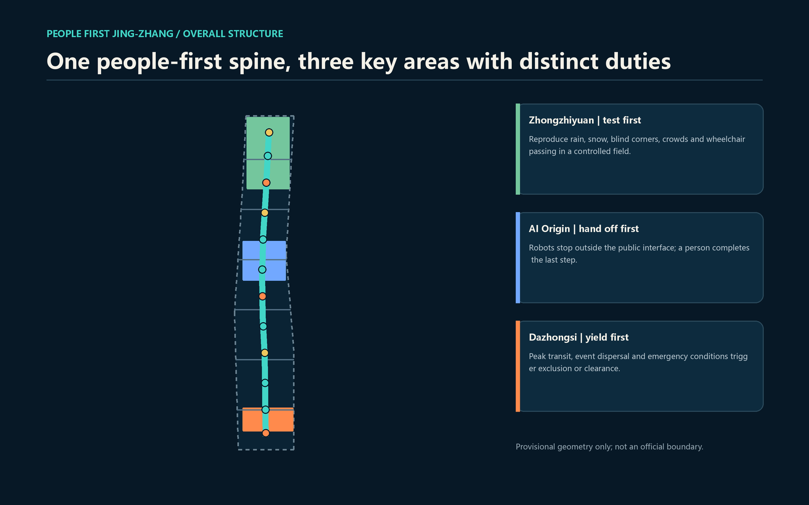
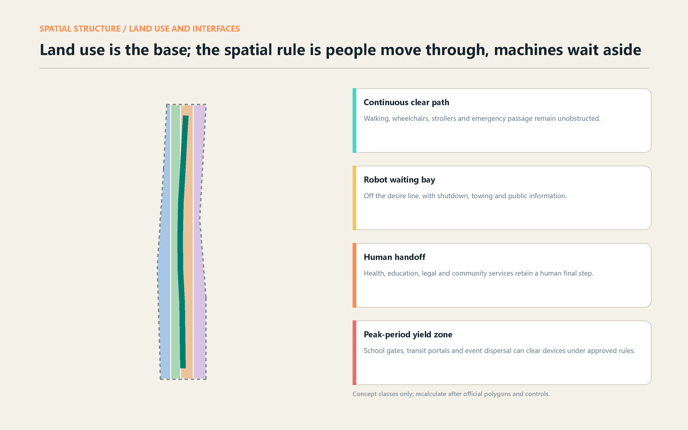
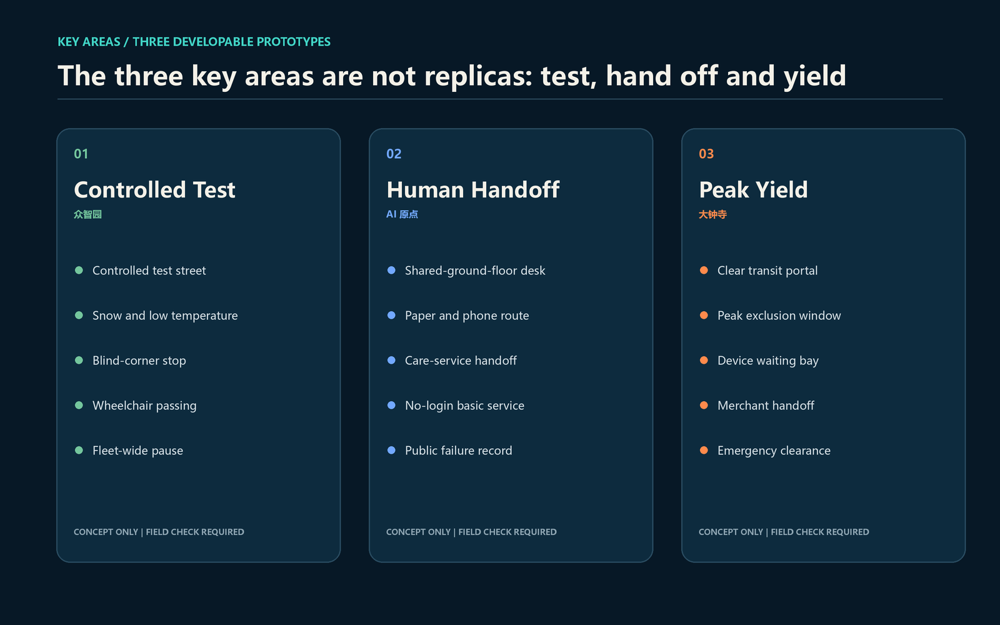
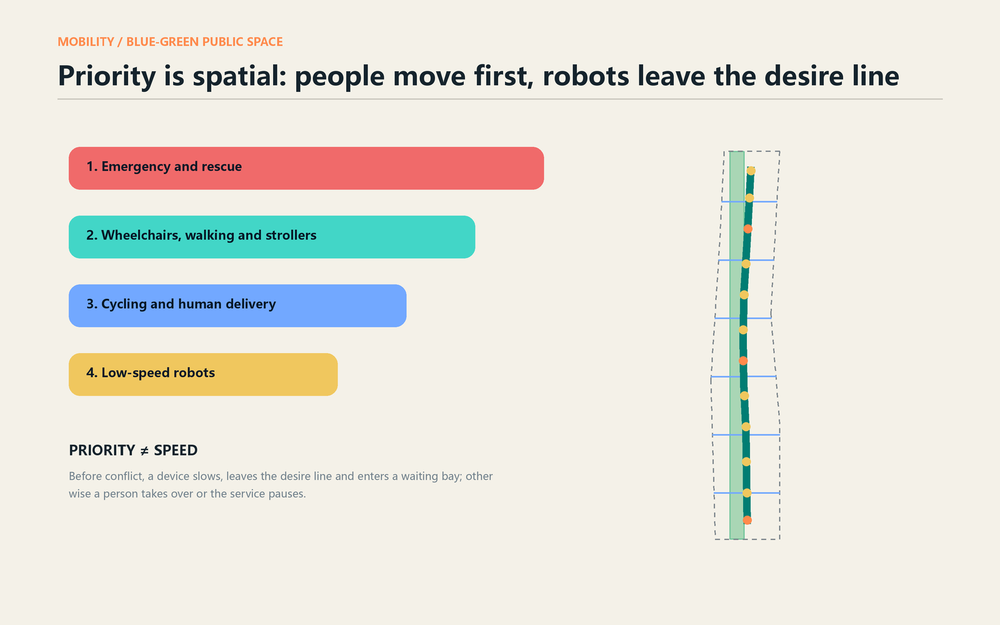
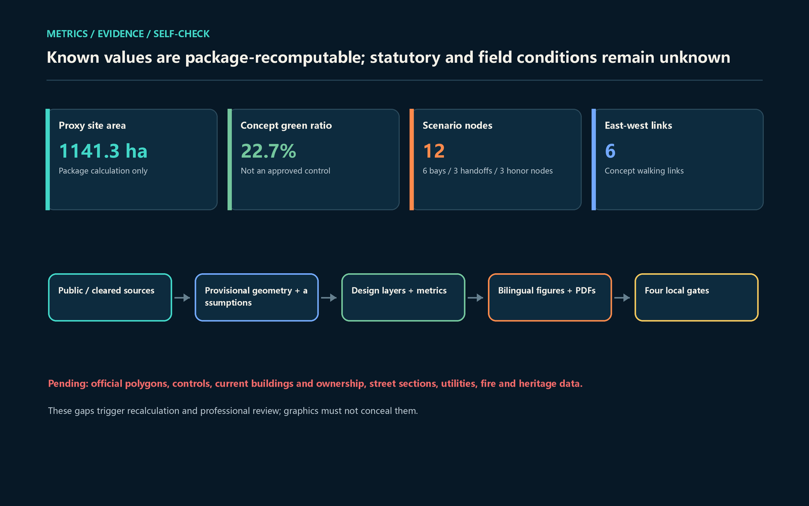

# PEOPLE FIRST JING-ZHANG: Robots Must Yield to People

> Whether a robot belongs in a city depends not only on obstacle avoidance, but on knowing when it should not be present. This proposal makes one legible urban-design judgment: **people move through the middle; machines wait aside. When a machine cannot yield, a person takes over or the service pauses.**

Every spatial, operational, branding, event and phasing move in this report is a conceptual recommendation for professional development. Nothing here replaces statutory planning or constitutes government approval, a road permit, procurement, investment or implementation commitment.

## Design Basis and Source List

The official announcement controls the three scope levels, three key areas and urban-design tasks; the cleared Agent taskbook adds branding, scenarios, personas, landmarks and long-term operation [source:OFFICIAL-ANNOUNCEMENT] [source:AGENT-TASKBOOK]. Local reference snapshots guide public-space and urban-character language, land-use codes and the boundary between design and Regulatory Detailed Planning. Floor area ratio, height, road redlines, building decisions and engineering capacity remain pending because formal attachments are unavailable [standard:MOHURD-URBAN-DESIGN-MEASURES] [standard:MOHURD-CONTROL-DETAILED-PLANNING].

No official site or exact key-area polygon is present in the repository. The package uses the maintainer-supplied provisional geometry only for generation, topology, composition and package calculations [source:BOUNDARY-SOURCE] [source:KEY-AREA-SOURCE]. The dashed outline is not an official planning boundary. The projected 1,141.3-hectare value is a package proxy, not a replacement for the announcement's approximate 11.4 square kilometres. When official CAD, GIS or PDF geometry arrives, the professional team must rebuild the nine spatial layers, recalculate metrics and regenerate bilingual figures, HTML and PDFs [depth:risk_missing_data].

Cases are mechanism comparisons, not imported law or dimensions. Beijing's delivery-vehicle rules connect trials to time, route, traffic and responsibility, while E-Town demonstrates a controlled-test-first sequence [source:BEIJING-DELIVERY-RULES] [source:BEIJING-ETOWN-TEST]. Singapore, Japan, the EU JRC and U.S. accessibility guidance provide comparisons for path classification, staged implementation, real-user co-testing and continuous accessible routes [source:SINGAPORE-LTA-AV-PATHS] [source:JAPAN-METI-DELIVERY-ROBOTS] [source:EU-JRC-LIVING-LAB]. China's Barrier-Free Environment Construction Law supports retaining in-person and traditional routes for relevant public services, so a human final step is a baseline rather than an optional experience [source:CHINA-ACCESSIBILITY-LAW].

## Three-Level Scope Framework

The three levels answer different questions. The 43.6-square-kilometre Coordinated Research Area asks how research, industry, oversight, public services and regional cooperation can form a loop from public problem to controlled test, public use and improvement. The approximately 11.4-square-kilometre Overall Design Area asks how one clear-path spine, six east-west links, three public-interface types and blue-green space work together. The approximately 368.4-hectare Key-Area Detailed Design Area turns testing, handoff and yielding into three professionally developable prototypes [depth:three_level_scope_framework].

| Level | Core judgment | Output | Boundary not crossed |
| --- | --- | --- | --- |
| Coordinated Research Area | Public responsibility precedes robotic expansion | Six cases, Three Zones and Two Wings, annual operation | No invented companies, investment or policy promise |
| Overall Design Area | Public right of passage precedes device efficiency | One clear path, six links and twelve nodes | No road-redline, alignment or permit conclusion |
| Key-Area Detailed Design Area | Each key area carries a distinct duty | Test at Zhongzhiyuan, hand off at AI Origin, yield at Dazhongsi | No parcel or precise-area claim from proxy polygons |

The framework separates spatial relationships that can be explained now from professional decisions that require data. Current buildings, ownership, transit entrances, street sections, flows, heritage, utilities and fire information are not in the cleared package. Building footprints test capacity only; lines express desired connections; key areas assign duties rather than parcel outcomes [data:geometry/site_boundary.geojson#SITE-001] [data:geometry/key_areas.geojson#PROV-KEY-001]. This restraint tells the next professional team what to collect and what to recalculate.

## Coordinated Research Area: Industry and Future City Research

The primary name is **PEOPLE FIRST JING-ZHANG**, with Chinese **京张先行**. “First” means people move first, systems are tested before deployment, and the railway heritage is read as pioneering public infrastructure. The identity uses two original lines: a continuous cyan line for public passage and a short orange line for machines stopped at handoff. The common phrases are PEOPLE FIRST, WAIT HERE, HUMAN HANDOFF and SERVICE PAUSED. No company mark, existing railway logo, portrait or redistributed font is used [standard:PROJECT-AGENT-OPEN-CALL-TASKBOOK].

The three official positionings share one rule. The Centennial Jing-Zhang Culture Belt translates signal discipline and station handoff into public yielding. The Urban AI Life Experience Belt lets older people, children, wheelchair users, couriers and visitors understand when a machine runs, waits or stops. The AI Integration Innovation Belt makes research, testing, operation, complaint and exit traceable. Zhongzhiyuan carries full-stack controlled testing; AI Origin carries innovation and talent services; Dazhongsi carries AI-native urban business; the Xiaoyue River wing brings daily-user feedback; the Zhongguancun wing brings legal, standards, IP, finance and talent interfaces.

Six cases form mechanisms rather than a project checklist [metric:global_case_count]:

| Case | Mechanism | Translation into this proposal |
| --- | --- | --- |
| Beijing E-Town test field | Complex conditions first enter a controlled environment | Rain, snow, blind-corner, crowd and wheelchair tests at Zhongzhiyuan |
| Beijing delivery-vehicle rules | Time, route, flow and responsibility are evaluated together | Every scenario records time, space, owner and exit |
| Singapore LTA public-path framework | Public paths are not automatically open to autonomous devices | Devices leave the continuous clear path; a pilot needs separate approval |
| Japan METI staged implementation | Expansion follows legal and operational readiness | Enclosed test, limited handoff, then evaluation before expansion |
| EU JRC Living Labs | Real users co-test in controlled settings | Wheelchair users, older people and caregivers join closure decisions |
| U.S. PROWAG | A continuous accessible pedestrian route is foundational | Continuous accessible clearance becomes the first spatial priority |

Regional synergy is an invitation, not a claimed partnership. Beijing E-Town may contribute road-speed-domain experience while this belt examines pedestrian-scale interfaces. Future Science City and Huairou Science City may bring research prototypes to public-readable handoff and exit tests. Regional nodes may exchange de-identified test methods, failure types and maintenance knowledge, but not personal trajectories or unauthorized data. Each real partner must confirm its own role [depth:overall_spatial_structure].

## Overall Design Area: Urban Renewal and Regulatory-Plan-Level Urban Design

The spatial structure is **one continuous clear-path spine, six east-west mending links, twelve yielding nodes and three key responsibility areas**. The spine supports walking, wheelchairs, strollers and emergency passage along the Jing-Zhang Railway Heritage Park. East-west links express the need to connect existing districts, transit and public services; they do not presume a bridge, tunnel, intersection reconstruction or right-of-way change [data:geometry/roads.geojson#ROAD-001]. The twelve nodes include six robot waiting bays, three human handoff points and three public honor nodes, all deliberately outside the primary desire line [metric:scenario_node_count].

Urban renewal starts with three low-regret steps. First, field teams survey clear width, gradient, blind corners, ponding, bicycle parking and event dispersal. Second, movable markings, seats, shade and information signs test the “people through, machines aside” interface. Third, time-limited controlled tests begin only with a responsible operator, emergency stop, human takeover and exit plan. Parcel-by-parcel retain, renovate, demolish or new-build decisions wait for building, ownership, structural, fire, daylight and embodied-carbon evidence [depth:existing_conditions_diagnosis] [depth:retain_renovate_demolish].

Four auditable land-use codes are retained: research for controlled testing; park green space for people-first passage; commercial service land for handoff and back-of-house; community-service land for basic services that do not depend on a smartphone or real-name account [standard:MNR-LAND-USE-CLASSIFICATION-GUIDE]. The polygons cover the full provisional boundary without overlap, but they are not approved Regulatory Detailed Planning. Concept footprints test six public interfaces; floor area ratio, height, density and road-area ratio remain pending [depth:land_use_layout] [depth:development_intensity_controls].

Urban character follows four directions: low profile, reversible, maintainable and readable day or night. Yielding equipment should not obstruct heritage views or create luminous screen pollution. Public interfaces retain mechanical controls, printed information and human contact. Replaceable components are preferred. Color communicates state rather than spectacle. Exact height, massing, roof and architectural color require heritage, planning, landscape and architectural review [depth:height_massing_character].

## Detailed Design of Key Areas

### Zhongzhiyuan: test first

Zhongzhiyuan asks robots to prove they can yield before entering public life. A controlled test street combines four switchable conditions and a public closure hall: snow and low temperature, blind corners, multi-device crowding and wheelchair passing. Real affected users judge whether they were forced aside. Physical contact, failed emergency stop, emergency-route occupation or failed human takeover pauses the same device class rather than removing only one unit [data:geometry/constraints.geojson#AI-ZONE-001]. Existing factories or research buildings are considered for reuse only after ownership, structure, fire and environmental checks. The Qinghe interface keeps blue-green continuity and everyday accessible movement before testing capacity.

### Beijing AI Origin Community: hand off first

AI Origin requires machines to stop outside the public interface while people complete the last step. Shared-ground-floor desks separate three layers: AI may organize public information; accountable staff review safety or rights-related matters; residents retain in-person, phone and paper routes. Delivery robots enter a waiting bay, and a merchant, community worker or recipient completes the final distance rather than sending the device into narrow corridors, children's spaces or quiet courtyards [data:geometry/constraints.geojson#AI-ZONE-002]. Public forecourts serve handoff, courier rest, accessible waiting and complaints together. If space is insufficient, device numbers fall before human clearance does.

### Dazhongsi: yield first

Dazhongsi removes machines during the most complex pedestrian conditions. Transit portals, retail ground floors and event dispersal use peak exclusion windows, waiting bays, merchant handoff and emergency clearance. This proposal sets no numerical time window. Observed flow, school and event schedules, accessibility surveys and authority approval must determine it [data:geometry/constraints.geojson#AI-ZONE-003]. Four-quadrant connections, bicycle parking and transit integration require transport professionals. Robots must not dwell on tactile paving, ramps, fire access, queues or turning points. Robot-dependent business also retains manual delivery during suspension.

All three areas use repository provisional polygons. Their areas are location proxies; official polygons trigger full regeneration [depth:three_key_area_detailed_design].

## AI Innovation Ecosystem, Personas, and AI+ Scenarios

The ecosystem is not a list of companies. It is eight interfaces: define a public problem, provide controlled space, state a test method, own site safety, protect data, retain human service, record failure and decide exit. Zhongzhiyuan connects research and tests; AI Origin connects university output, community needs and public services; Dazhongsi connects operation with complex pedestrian flow. The two wings provide compliance, IP and business support on one side and daily-user feedback on the other. Funding, compute, data and scenario access each need a term, owner, exit condition and public knowledge output.

Seven personas represent different passage constraints [metric:persona_count]: wheelchair and mobility-device users; blind, low-vision, Deaf and hard-of-hearing users; children and caregivers; older and slower walkers; couriers and maintainers; developers and operators; and local residents, commuters and visitors. Responses include continuous clearance, tactile and multimodal status, school-gate yielding, phone and paper service, equal human-worker facilities, controlled negative testing and no-login basic passage.

Twelve scenario cards map to public-space nodes; the first three are Testing and Validation Scenarios [metric:industry_test_scenario_count]:

| ID | Scenario / place | Data and human review | Pause or exit |
| --- | --- | --- | --- |
| TVS-01 | Snow and low-temperature delivery / Zhongzhiyuan | Device logs plus human observation | Brake, localization or takeover anomaly |
| TVS-02 | Wheelchair passing and blind corners / Zhongzhiyuan | Affected users judge; no identity collected | A person is forced off the clear path |
| TVS-03 | Fleet queue and emergency clearance / Zhongzhiyuan | Fleet logs plus manual counts | Emergency access is blocked or fleet cannot withdraw |
| S-04 | Medicine and meal handoff / AI Origin | Minimum order data; person verifies recipient | No human delivery or wrong recipient |
| S-05 | Public-service document delivery / AI Origin | Contents not read; staff sign-off | Broken chain or unclear responsibility |
| S-06 | Accessible route guidance / full corridor | Barriers field-checked; no persistent tracking | User evidence overrides system output |
| S-07 | Night library return / AI Origin | Device state and anonymous count | Lighting, noise or safety conditions fail |
| S-08 | Park-facility inspection / heritage park | Asset ledger plus maintainer confirmation | No automatic enforcement decision |
| S-09 | Transit-portal retail handoff / Dazhongsi | Merchant confirmation and device state | Peak flow, event dispersal or queue spillback |
| S-10 | Emergency supply assistance / corridor | Emergency authority instructs; human accountable | Any obstruction to rescue |
| S-11 | Multilingual cultural guide / honor nodes | Public sources plus professional fact check | Uncertain history, rights issue or unrepaired error |
| S-12 | Maintainer rest and repair / near waiting bays | Aggregated repair tickets; human dispatch | No labor-rights decision by automatic assignment |

Across all scenarios, basic passage needs no app or real-name account; persistent personal tracking is excluded; health, education, legal, government and safety services remain assistance only; the human review point is visible; and a manual equivalent remains when AI stops. Tests are conceptual and do not claim approval [depth:municipal_new_infrastructure].

## Land Use, Building Scale, and Retain-Renovate-Demolish Strategy

The four land-use classes form a complete topology rather than a statutory amendment: research for controlled tests, park green space for the people-first spine, commercial service for handoff and AI-native retail, and community service for care, health navigation and traditional service. All polygons derive from one provisional boundary and share coordinates, avoiding gaps and overlaps [data:geometry/land_use.geojson#LU-001].

Six concept footprints test whether a rain/snow shed, handoff hall, accessible service desk, yielding archive, commercial handoff gallery and maintainer station can form a complete work chain [metric:building_footprint_area_sqm]. They do not represent current buildings or confirmed scale. Total floor area, floor area ratio and height remain pending. Professional development follows current survey and ownership, value/structure/carbon assessment, stakeholder input, retention-first tests and lawful parcel decisions.

Direction is clear without overreach: retain buildings with historic, use or structural value; renovate where low-impact work can improve ground-floor publicness, accessibility and back-of-house; discuss demolition only after ownership, structure, fire, heritage, daylight and approval evidence; and prefer movable, repairable components for additions. No parcel decision is made now [depth:retain_renovate_demolish].

## Transport, Rail, Municipal Infrastructure, and Public Services

The conceptual passage order is emergency and rescue first; wheelchairs, walking and strollers second; cycling and human delivery third; low-speed robots last. It is a design working principle, not substituted traffic law. The provisional people-first spine measures about 8.95 kilometres within the package, and six east-west links connect the linear park to districts, transit and services. These lines identify relationships to survey, not engineering alignments [metric:human_first_path_length_m] [metric:east_west_connection_count].

Waiting bays leave the desire line and display an ID, operator responsibility, shutdown method, towing position and service state. They never occupy tactile paving, ramps, fire access, bus waiting, primary cycle flow or pedestrian turning points. Device numbers follow measured clearance and flow; when space is scarce, devices decrease before people detour. Dazhongsi, Wudaokou and Qinghuadongluxikou require entrance, flow, section and accessibility data before transit-station integration is developed [depth:traffic_rail_slow_parking].

Municipal and new infrastructure must work offline, be maintainable and retire cleanly. Charging, edge compute, communications and sensors sit in removable equipment bands. Basic lighting, signs, toilets, water, seating and human service continue during disconnection. Each asset records an owner, energy use, offline behavior, maintenance cycle and retirement date. Utility, drainage, flood and fire capacity remain unknown. Public service protects in-person, phone and paper routes before adding AI [source:CHINA-ACCESSIBILITY-LAW].

## Blue-Green Network, Public Space, and Urban Character

The blue-green system treats the Jing-Zhang Railway Heritage Park as public-passage infrastructure rather than a device showroom. Concept green space is 22.7 percent of the provisional package geometry, not an approved planning control [metric:green_ratio]. Exact Qinghe, Xiaoyue River, heritage-park, ecological and flood conditions are unavailable; the design therefore proposes continuous shade, permeable waiting, winter maintenance, low-glare lighting and accessible connections as directions only.

Twelve public nodes create three component types: six bays for shutdown and maintenance, three human handoff points for the final public-service step, and three honor nodes that remember voluntary yielding, timely suspension and maintenance rather than speed. The three AI pilgrimage nodes are the Zhongzhiyuan Yield Test Gate, AI Origin Human Final Step Archive and Dazhongsi Empty Path Measure [metric:pilgrimage_landmark_count]. Exact placement waits for heritage, green-line, blue-line, street and ownership evidence.

The component library includes a continuous clear line, waiting bay, handoff desk, state light, mechanical stop, printed explanation, maintainer seat and removable shade. Components are low-profile, reversible and tactile, with Chinese, English and graphic information. Red means pause or danger, cyan means people-first path, orange means handoff and yellow means waiting [depth:blue_green_public_space].

## Renewal Projects, Implementation Policy, and Phasing

Eight conceptual renewal projects follow survey, prototype and evaluation [metric:renewal_project_count]: continuous-clearance survey; six east-west links; twelve movable public-node prototypes; Zhongzhiyuan test street; AI Origin handoff hall; Dazhongsi peak yielding; maintainer facilities; and a public yielding ledger. Each moves forward only after accessible co-review, field and ownership evidence, effective human takeover, continuous traditional service, multi-party evaluation, preserved labor space or a privacy-safe correction route.

Near-term work is limited to data collection and movable prototypes. Mid-term work uses time-limited, pausable tests in the three key areas. Long-term decisions retain, expand or retire based on incidents, complaints, accessibility, maintenance and public value. The three phase polygons express a work sequence inside one provisional geometry; they are not a construction schedule or investment promise [data:geometry/phasing.geojson#PHASE-001] [depth:phasing_implementation].

The annual concept is **People First Week**: accessibility users lead a corridor walk; teams publish failures and pauses; developers repair issues; maintainers explain real work; and the three key areas host public reviews. Developer contribution is measured through issue records, test protocols, negative results and maintenance documents rather than device count. International communication distinguishes submitted, review-ready, reviewed and implemented. Events, funding, recruitment and partnerships require separate confirmation.

## Metrics, Area Recalculation, and Compliance Matrix

Metrics have three classes. Provisional-geometry quantities include proxy site area, concept green and public-space ratios, concept footprints and spine length; all are recalculated in EPSG:4548 and remain low-confidence [metric:site_area_sqm] [metric:public_space_ratio]. Proposal counts include twelve nodes, six bays, three handoffs, three honor nodes, six cross-links, seven personas, six cases and eight projects [metric:robot_waiting_bay_count] [metric:human_handoff_count]. Statutory and field values such as floor area ratio, height, road-area ratio, pedestrian capacity, energy and utility capacity remain unknown.

GeoJSON is the authoritative evidence layer; figures, bilingual HTML and PDFs explain it. Land use covers the boundary without overlap; each design layer uses stable feature IDs; metrics record formula, source files, assumptions and confidence. The compliance matrix covers announcement sections 1.3, 1.4 and 1.5 plus agent.1 through agent.6. The standard matrix records professional basis, and the design-depth matrix records evidence and gaps [depth:metrics_recalculation].

The local target is PASS across deterministic validation, trusted spatial review, visual packaging and professional evidence review. PASS means the package can enter content review; it does not mean approval, engineering feasibility, implementation or design excellence.

## Risk, Copyright, and Compliance

The first risk is mistaking provisional geometry and package metrics for formal planning. Every display and structured record labels the boundary, and official geometry triggers full recalculation. The second risk is reading the conceptual priority order as an issued traffic rule. Actual time, route, device count and operating condition require lawful approval and accountable confirmation [source:BEIJING-DELIVERY-RULES].

The third risk is physical harm or digital exclusion. Robots do not displace accessible passage, emergency access or basic service. High-impact AI returns to accountable humans, and suspension retains a manual equivalent. The fourth is labor displacement: courier and maintainer rest, water, charging, toilets and repair space stand alongside machine back-of-house, while real workforce effects require a separate pilot assessment. The fifth is data harm: persistent personal trajectories and health, education, legal or children's data are excluded from spatial input.

OpenAI Codex (GPT-5 family) generated the report, structure, original diagrams, GeoJSON, HTML and PDFs under a task authorized by GitHub user `jadenjin`. Sources, methods, model disclosure and limits appear in `sources.json`, `agent.json` and `report/copyright_statement.md`. No commercial map, remote tile, third-party photo, company logo, portrait or paper image is used. PDFs use locally installed system fonts without redistributing font files. Official documents, law, professional review and field evidence prevail over any conflicting statement.

## References

1. Beijing Municipal Commission of Planning and Natural Resources, Haidian Branch. *Official Prequalification Announcement for the Centennial Jing-Zhang AI Innovation Belt*, 2026. [source:OFFICIAL-ANNOUNCEMENT]
2. Repository-cleared *Agent Open-Call Taskbook Extract*, 2026. [source:AGENT-TASKBOOK]
3. Ministry of Housing and Urban-Rural Development: *Urban Design Management Measures* and *Measures for Regulatory Detailed Planning*.
4. Standing Committee of the National People's Congress. *Barrier-Free Environment Construction Law*, 2023.
5. Beijing transport authorities. *Measures for Road Testing and Commercial Demonstration of Unmanned Delivery Vehicles*, 2023.
6. Singapore Land Transport Authority. *Autonomous Vehicles on Public Paths*.
7. Ministry of Economy, Trade and Industry, Japan. *Future Perspectives on Autonomous Delivery Robots*.
8. European Commission JRC. *Living Labs at the JRC*.
9. U.S. Access Board. *Public Right-of-Way Accessibility Guidelines*.
