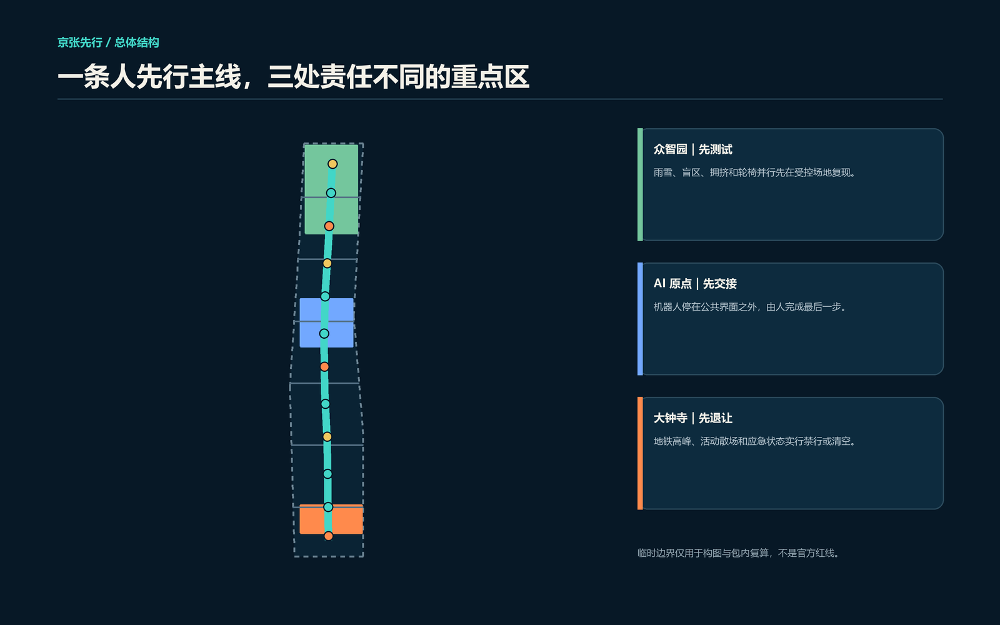
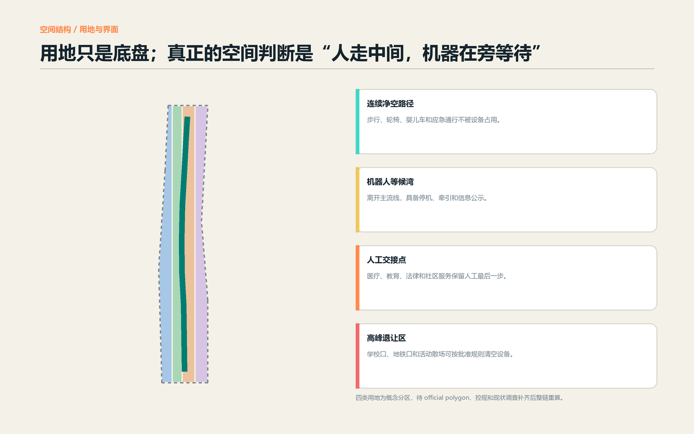
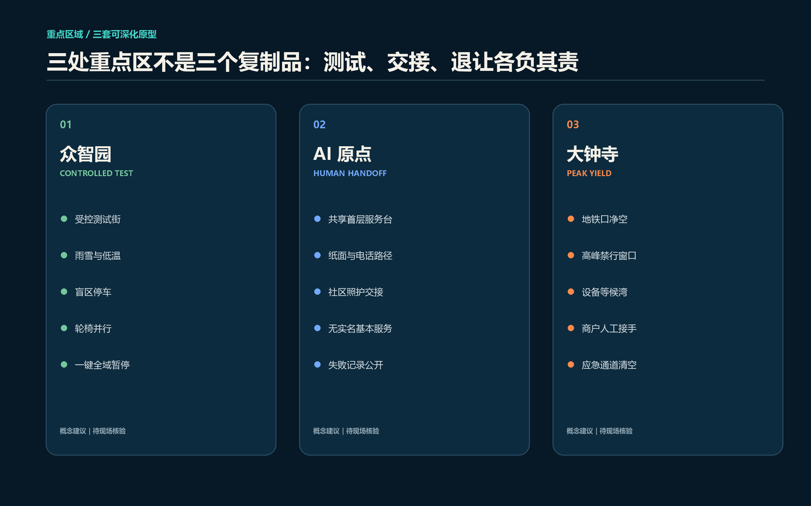
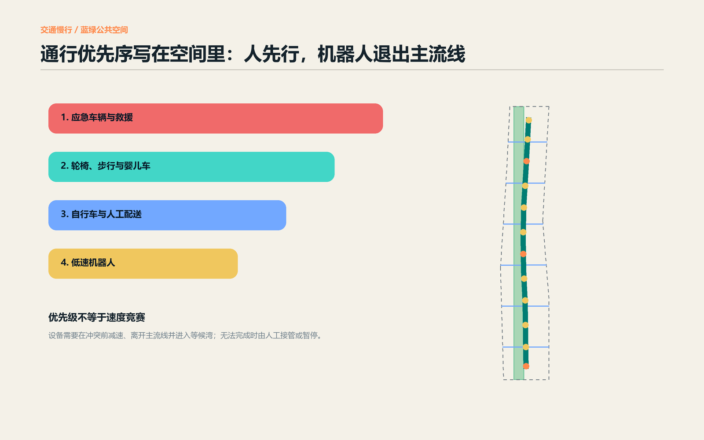
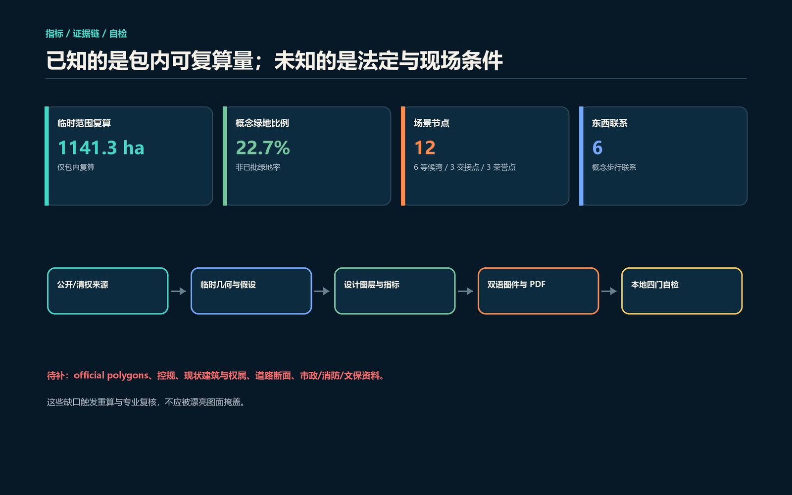

# 京张先行 / PEOPLE FIRST JING-ZHANG：机器人必须为人让路

> 一台机器人能不能进入城市，不只取决于它会不会避障，还取决于它是否知道什么时候不该出现。本方案提出一个简单、可现场理解的城市设计判断：**人走中间，机器在旁等待；机器无法让行时，由人接手或暂停服务。**

本文所有空间、运营、品牌、活动和分期内容均为概念建议或可供专业团队深化的参考方案，不替代正式规划，不构成政府审定、道路许可、采购、投资或实施承诺。

## 设计依据与资料清单

本方案首先服从官方公告规定的三层范围、三处重点区和城市设计任务，再用面向智能体任务书补齐品牌、场景、用户、地标与长期运营要求 [source:OFFICIAL-ANNOUNCEMENT] [source:AGENT-TASKBOOK]。专业表达遵守本地标准快照：公共空间与城市风貌回应《城市设计管理办法》，用地代码使用自然资源部分类子集；容积率、建筑高度、道路红线、拆改留和工程容量因缺少正式资料而保持待确认，不把概念容量图形写成法定结论 [standard:MOHURD-URBAN-DESIGN-MEASURES] [standard:MOHURD-CONTROL-DETAILED-PLANNING]。

当前仓库没有 official site polygon 和三处重点区精确 polygon。本包沿用维护者提供的临时粗略几何，只用于生成、拓扑检查、图面构图和包内复算 [source:BOUNDARY-SOURCE] [source:KEY-AREA-SOURCE]。图中虚线不是官方红线，约 1141.3 公顷是投影到 EPSG:4548 后的临时边界包内面积，不替代公告“约 11.4 平方公里”的官方文字口径。取得正式 CAD/GIS/PDF 后，必须从 site boundary 开始重建九类图层，复算 metrics，再重制双语图片、HTML 与 PDF [depth:risk_missing_data]。

案例只用来比较机制，不直接移植法规或尺度。北京市无人配送车管理办法提示测试需核查时间、路段、交通流量和责任主体；亦庄展示了先封闭测试再进入开放场景的顺序 [source:BEIJING-DELIVERY-RULES] [source:BEIJING-ETOWN-TEST]。新加坡、日本、欧盟 JRC 和美国无障碍公共通行规则提供了路径分类、分阶段实施、真实使用者共测和连续可达路径的对照 [source:SINGAPORE-LTA-AV-PATHS] [source:JAPAN-METI-DELIVERY-ROBOTS] [source:EU-JRC-LIVING-LAB]。中国《无障碍环境建设法》要求相关公共服务保留现场指导、人工办理等传统方式，因此本案把“人工最后一步”作为基本服务底线，而不是可选体验 [source:CHINA-ACCESSIBILITY-LAW]。

## 三层范围工作框架

三层范围回答不同问题，不能用一张总图混在一起。统筹研究范围约 43.6 平方公里，回答海淀的科研、产业、监管、公共服务和京津冀协同如何形成“提出问题—受控测试—公众使用—反馈改进”的闭环；总体设计范围约 11.4 平方公里，回答人本通行主线、六条东西联系、三类公共界面和蓝绿空间如何协同；三处重点区约 368.4 公顷，分别把“测试、交接、退让”深化为可供专业团队接手的空间原型 [depth:three_level_scope_framework]。

| 工作层 | 核心判断 | 本案输出 | 不越过的边界 |
| --- | --- | --- | --- |
| 统筹研究范围 | 机器人与 AI 公共服务要先有公共责任再谈扩张 | 六个全球机制案例、三区两翼协作、年度运营 | 不编造企业、投资、政策承诺 |
| 总体设计范围 | 公共通行权先于设备效率 | 一条净空主线、六条东西联系、十二处公共节点 | 不给道路红线、工程线位和许可结论 |
| 重点区域范围 | 三处重点区承担不同责任 | 众智园测试、AI 原点交接、大钟寺高峰退让 | 临时 polygon 不作地块和精确面积依据 |

该框架把设计深度分成“可立即说清的空间关系”和“必须等资料后再决定的专业结论”。现状建筑、权属、轨道出入口、道路断面、客流、文保、市政与消防资料尚未进入清权包，因此当前建筑基底只验证空间容量，交通线只表达联系意图，重点区只表达责任分工 [data:geometry/site_boundary.geojson#SITE-001] [data:geometry/key_areas.geojson#PROV-KEY-001]。这种克制不是缺少设计，而是让下一轮专业深化知道先补什么、补完后重算什么。

## 统筹研究范围产业与未来城市研究

主名称为“**京张先行**”，英文 **PEOPLE FIRST JING-ZHANG**。中文“先行”同时指人优先通行、先试后用和京张铁路的开路精神。识别符号由两条线组成：连续青色线代表人的公共通行权，短橙线代表设备在交接点停靠；Logo 只使用原创几何与系统字体，不借用企业、既有铁路标志或人物形象。导视句统一为“人先行 / PEOPLE FIRST”“在此等待 / WAIT HERE”“人工接手 / HUMAN HANDOFF”“暂停运行 / SERVICE PAUSED”。[standard:PROJECT-AGENT-OPEN-CALL-TASKBOOK]

三大定位由同一规则贯通：百年京张文化带把铁路“按信号运行、在站点交接”的传统转译为人机公共礼让；都市 AI 生活体验带让老人、儿童、轮椅使用者、骑手和访客能看懂设备何时运行、何处等待；AI 融合创新带把研发、测试、运营、投诉和退出写成一条可追踪链。五大功能分别落在众智园的全栈受控测试、AI 原点的世界级创新与人才服务、大钟寺的智能原生业态、小月河翼的公共场景反馈、中关村翼的法务、标准、知识产权、资金和人才接口。三区两翼不是单向招商图，而是双向责任回路：技术向城市交付便利，城市向技术交付真实约束。

六个案例形成“可转化机制”而不是项目清单 [metric:global_case_count]：

| 案例 | 可读到的机制 | 转化为本案的动作 |
| --- | --- | --- |
| 北京亦庄封闭测试场 | 复杂场景先在受控环境验证 | 众智园设置雨雪、盲区、拥挤和轮椅并行测试街 |
| 北京无人配送车管理规则 | 时间、路段、流量与责任需同时评估 | 每个概念场景卡同时写时段、空间、责任与退出 |
| 新加坡 LTA 公共路径框架 | 公共路径不是默认开放给自动设备 | 设备必须离开连续净空主线，试点需另行批准 |
| 日本 METI 分阶段实施 | 法律与产业能力成熟后逐步扩大 | 从围合测试、限定交接到评估后扩大 |
| 欧盟 JRC Living Lab | 真实使用者参与受控验证 | 轮椅使用者、老人、儿童照护者参加结项判断 |
| 美国 PROWAG | 连续可达路径是公共空间底线 | 把连续无障碍净空作为主线第一优先 |

区域协同不宣称已建立合作。概念上，经开区可提供车行速度域与开放道路经验，本带补充行人尺度和复杂公共界面；未来科学城与怀柔科学城可提出科研原型，本带提供公众可读的交接与退出测试；京津冀节点可交换经过脱敏的测试方法、失败类型和维护知识，而不是交换个人轨迹或未经授权的数据。所有协作须由实际主体确认后才能成立 [depth:overall_spatial_structure]。

## 总体设计范围城市更新与控规深度城市设计

总体空间结构是“**一条连续净空主线、六条东西缝合联系、十二处让行节点、三处重点责任区**”。主线沿京张遗址公园组织步行、轮椅、婴儿车和应急通行；东西联系优先连接既有街区、轨道站点与公共服务，但当前只画联系意图，不推定可建桥隧、改造路口或调整路权 [data:geometry/roads.geojson#ROAD-001]。十二处节点中有六个机器人等候湾、三个人工交接点和三个公共荣誉节点；它们均避开把设备放在主流线中央的做法 [metric:scenario_node_count]。

城市更新先做三件低后悔动作：第一，现场走查净宽、坡度、盲区、积水、非机动车停放和活动散场；第二，用可移动标线、座椅、遮阴和信息牌验证“人在中间、设备在旁”的界面；第三，在有责任主体、急停、人工接管和退出方案的前提下开展短期受控测试。只有当现状建筑、权属、结构安全、消防、日照和全生命周期碳资料补齐后，才进入逐栋保留、改造、拆除或新建判断 [depth:existing_conditions_diagnosis] [depth:retain_renovate_demolish]。

用地分区保持四个可校验代码：科研用地承载受控测试和研发，公园绿地承载连续人本通行，商业服务业用地承载人工交接和设备后场，社区服务设施用地承载不依赖手机或实名账户的基本服务 [standard:MNR-LAND-USE-CLASSIFICATION-GUIDE]。这些分区完整覆盖临时边界且不重叠，但不代表已批控规。概念建筑基底用于验证六类公共界面是否有空间，容积率、建筑高度、建筑密度和道路面积率全部待正式条件补齐 [depth:land_use_layout] [depth:development_intensity_controls]。

风貌控制采用“低体量、可撤回、可维护、昼夜可读”四条方向：设备退让设施不做巨大地标，不遮挡京张遗产视线，不以屏幕亮度制造夜间污染；公共界面保留机械按钮、纸面说明和人工联系方式；材料优先可更换构件，颜色只编码状态，不作为装饰。具体高度、体量、屋顶和建筑色彩仍需文保、控规、景观和建筑专业共同深化 [depth:height_massing_character]。

## 重点区域详细设计

### 众智园：先测试

众智园承担“机器人先证明会让行”的责任。概念结构为一条受控测试街、四类可切换场景段和一处公开结项厅：雨雪与低温段观察制动和续航变化，盲区段观察遮挡前停车，拥挤段观察多设备排队与回撤，轮椅并行段由真实使用者判断是否被迫让路。任何物理接触、急停失效、占用应急通道或无法人工接管，都触发同类设备暂停而不是只移走一台 [data:geometry/constraints.geojson#AI-ZONE-001]。

建筑更新以既有空间复用优先。厂房、研发楼和首层界面是否可改造，须先核实权属、结构、消防和环境条件；本案只用概念建筑基底表示测试棚、维护间、人工接管席和公众说明区的关系，不作逐栋结论。清河界面优先保留蓝绿连续性，设备测试不得挤占无障碍与日常慢行。

### 北京 AI 原点社区：先交接

AI 原点承担“机器停在界面外，人完成最后一步”的责任。共享首层服务台把健康导航、教育信息、法律服务、图书文化和社区照护分成三层：AI 可整理公开信息；有职责的人员复核涉及权益或安全的内容；居民始终可以使用现场、电话或纸面路径。机器人配送到达后进入等候湾，由商户、社区服务人员或收件人完成最后距离，不进入狭窄楼道、儿童活动场或安静庭院 [data:geometry/constraints.geojson#AI-ZONE-002]。

空间更新先修补校区、园区与社区之间的步行断点，再讨论建筑规模。公共前场要同时容纳等候、人工交接、骑手休息、无障碍停留和投诉入口；如果面积不足，先减少设备数量而不是压缩人的通行空间。失败与投诉按脱敏原则形成公开记录，让团队能解释“为什么暂停、谁来修复、何时复核”。

### 大钟寺：先退让

大钟寺承担“高峰时机器退出”的责任。地铁口、商业首层和活动散场形成最复杂的人流叠加，因此概念上设置高峰禁行窗口、设备等候湾、商户人工接手点和应急清空路径。禁行时段不由本案预设数字，须用现场客流、学校和活动日历、无障碍走查及主管部门批准共同确定 [data:geometry/constraints.geojson#AI-ZONE-003]。

大钟寺四象限连通、非机动车停放和轨道接驳必须由交通专业深化。本案不画桥隧工程或道路红线，只明确每个出入口外应保持可见的净空区域，机器人不得在盲道、坡道口、消防通道、排队区或人群转向点停留。商业服务若依赖机器人，也必须准备人工交付和停运期间的连续服务。

三处重点区使用仓库临时 polygon，所有面积均为位置代理；正式边界到位后必须重做图层与指标 [depth:three_key_area_detailed_design]。

## AI 创新生态、人才画像与 AI+ 场景

生态不是企业名单，而是八类接口：提出公共问题、提供受控空间、给出测试方法、承担现场安全、保护数据、保留人工服务、记录失败、决定退出。众智园连接研发与测试，AI 原点连接高校成果、社区需求与公共服务，大钟寺连接运营与真实复杂人流；中关村翼提供合规、知识产权和创业服务，小月河翼提供日常使用者反馈。资金、算力、数据和场景都必须写清使用期限、责任主体、退出条件与公共知识产出，不能以“试点”名义无限占用公共空间。

七类画像不是营销标签，而是不同通行约束 [metric:persona_count]：

| 画像 | 真实约束 | 设计响应 |
| --- | --- | --- |
| 轮椅与行动障碍使用者 | 无法被迫下缘石或倒车让行 | 连续净空、本人参加并行测试 |
| 视听障碍使用者 | 难以读取屏幕和静默设备状态 | 声音、触觉、文字与人工多通道 |
| 儿童与照护者 | 行为不可预测，婴儿车需要连续空间 | 学校口退让时段、低位可见标识 |
| 老年人与慢行者 | 需要更长反应时间和人工服务 | 电话、纸面、现场交接路径 |
| 骑手、快递员与维护者 | 需要停留、充电、饮水、如厕和避雨 | 人类劳动空间与设备后场同级配置 |
| 开发者与运营团队 | 需要真实但可控的测试条件 | 众智园受控测试、负面结果归档 |
| 周边居民、通勤者与访客 | 不应被迫注册、绕行或持续被拍摄 | 无实名基本通行、明显退出与投诉入口 |

十二张场景卡均映射到公共空间节点，前三张为产业测试验证场景 [metric:industry_test_scenario_count]：

| 编号 | 场景 / 空间 | 数据与人工复核 | 暂停或退出条件 |
| --- | --- | --- | --- |
| TVS-01 | 雨雪低温配送测试 / 众智园 | 设备日志、人工观察；安全员复核 | 制动、定位或人工接管异常即暂停 |
| TVS-02 | 轮椅并行与盲区测试 / 众智园 | 使用者本人判定；不采集身份 | 人被迫离开净空路径即失败 |
| TVS-03 | 多设备排队与应急清空 / 众智园 | 车队日志、人工计数 | 占用应急通道或无法整体回撤即暂停 |
| S-04 | 社区药品与餐食交接 / AI 原点 | 订单最小信息；人工核对收件 | 无人工交付或错误收件即停用该流程 |
| S-05 | 公共服务文件递送 / AI 原点 | 不读取文件内容；服务人员签收 | 链路断裂或责任不清即回到人工递送 |
| S-06 | 无障碍路径导航 / 全线 | 障碍点人工走查；不持续记录轨迹 | 使用者反馈与系统不一致时以人工为准 |
| S-07 | 夜间图书归还 / AI 原点 | 设备状态与匿名次数 | 照明、噪声或安全条件不满足即暂停 |
| S-08 | 公园设施巡检 / 遗址公园 | 设施台账；维护者现场确认 | 不得自动形成执法或处罚结论 |
| S-09 | 地铁口商业交接 / 大钟寺 | 商户确认、设备状态 | 高峰、活动散场或排队外溢即清空 |
| S-10 | 应急物资辅助 / 全线 | 应急主体指令；全程人工负责 | 任何妨碍救援即退出主线 |
| S-11 | 多语文化导览 / 公共荣誉点 | 公开史料；专业人员核校 | 史实不确定、侵权或错误未修复即下线 |
| S-12 | 维护者休息与报修 / 等候湾旁 | 聚合报修；人工分派 | 不以自动派单替代劳动权益判断 |

适用于全部场景的共同规则是：基本通行不需要 App 或实名账户；不采集持续个人轨迹；医疗、教育、法律、政务和安全事项只做辅助整理或导航；人工复核点必须可见；机器人服务停运时仍有人工等价路径。所有测试均为概念建议，不表示已获批准运营 [depth:municipal_new_infrastructure]。

## 用地、建筑规模与拆改留方案

四类用地是完整拓扑分区，不是法定调整：科研用地对应受控测试与研发；公园绿地对应人先行主线；商业服务业用地对应人工交接与智能原生消费；社区服务设施用地对应照护、健康导航和传统服务。每个 polygon 均从同一临时边界切分，共享边坐标，避免手画色块造成缝隙或重叠 [data:geometry/land_use.geojson#LU-001]。

六处概念建筑基底只验证“测试棚、交接厅、公共服务台、让行档案馆、商业交接廊、维护者驿站”能否形成完整工作链 [metric:building_footprint_area_sqm]。它们不代表现状建筑，也不推定建设规模。总建筑面积、容积率和建筑高度保持待正式数据补齐；建筑密度不作为已批指标。专业团队应按“现状测绘与权属—价值、结构和碳评估—产权人与公众意见—保留优先—依法形成逐栋决定”的顺序深化。

拆改留方向明确但不越界：有历史、使用或结构价值的建筑优先保留；能用低扰动方式改善首层公共性、无障碍和设备后场的建筑优先改造；只有在取得权属、结构、消防、文保、日照和审批依据后才讨论拆除；新增构筑物优先采用可移动、可拆卸、可修复构件。任何具体地块结论都不在本阶段作出 [depth:retain_renovate_demolish]。

## 交通、轨道、市政与公共服务设施

概念通行优先序为：应急与救援第一，轮椅、步行和婴儿车第二，自行车和人工配送第三，低速机器人最后。它不是交通法规替代物，而是把公共利益写进空间设计的工作原则。人先行主线包内复算长度约 8.95 公里，六条东西联系把纵向公园与两侧街区、轨道和服务节点连接起来；这些线只表达需要调查的联系，不是道路中心线或工程方案 [metric:human_first_path_length_m] [metric:east_west_connection_count]。

机器人等候湾必须离开主流线，具备可见编号、运营责任、停机方式、人工牵引位置和服务状态说明。交接点与等候湾不得压占盲道、坡道口、消防通道、公交站候车区、非机动车主流线和人群转向点。设备数量由现场净空与人流承载反推；如果空间不足，减少设备而不是让人绕行。大钟寺、五道口和清华东路西口等轨道节点须先取得出入口、客流、断面与无障碍资料，再由交通专业完成一体化深化 [depth:traffic_rail_slow_parking]。

市政和新型基础设施采用“可断网、可维护、可退役”：充电、端侧算力、通信和传感设备进入可拆设备带；断网时基本照明、导视、厕所、饮水、座椅和人工服务继续工作；每件设备登记责任人、能耗、断网行为、维护周期和退役日期。现阶段没有管线、能源容量、排水、防洪和消防资料，因此不作容量或线位结论。公共服务在 AI 之前先保证人工、电话和纸面路径 [source:CHINA-ACCESSIBILITY-LAW]。

## 蓝绿空间、公共空间与城市风貌

蓝绿系统把京张遗址公园读作公共通行基础设施，而不是设备展示长廊。概念绿地关系覆盖临时边界包内约 22.7%，这个比例只反映设计图层，不是已批绿地率 [metric:green_ratio]。清河、小月河、遗址公园和横向步行联系的正式范围、生态约束与防洪条件尚未补齐；本案只提出连续树荫、透水停留、雨雪维护、低眩光照明和无障碍连接的方向。

十二处公共节点形成三类组件：六个等候湾容纳设备停机与维护，三个人工交接点完成公共服务最后一步，三个公共荣誉节点记录“主动让行、及时停运、维护修复”而非单纯技术速度。三处 AI 朝圣节点分别是：众智园“让行试验门”，展示通过和失败的测试；AI 原点“人工最后一步档案馆”，记录被人纠正的 AI 服务；大钟寺“空出的路”标尺，把高峰时留给人的净空空间作为城市荣誉 [metric:pilgrimage_landmark_count]。

公共空间组件库包括连续净空线、等候湾、人工交接台、状态灯、机械急停、纸面说明、维护者座椅与可拆遮阴。所有组件低体量、可撤回、可触读，中英文字和图形并置；红色只表示暂停或危险，青色表示人先行路径，橙色表示交接，黄色表示等待。地标精确落位必须等文保、绿线、蓝线、道路和产权资料确认 [depth:blue_green_public_space]。

## 更新项目清单、实施政策与分期计划

八个概念更新项目由“先走查、再原型、后评估”排序 [metric:renewal_project_count]：

| 项目 | 近期动作 | 进入下一阶段的条件 |
| --- | --- | --- |
| JZ-01 连续净空走查 | 记录净宽、坡度、盲区、积水和占用 | 无障碍使用者与交通专业共同确认 |
| JZ-02 六条东西联系 | 现场识别断点与绕行 | 取得路权、断面、客流和安全资料 |
| JZ-03 十二处公共节点 | 用可移动标线和设施做短期原型 | 不压占通行且责任、退出可执行 |
| JZ-04 众智园测试街 | 三项产业测试验证 | 负面结果可读，人工接管有效 |
| JZ-05 AI 原点交接厅 | 健康、教育、法律和社区服务台 | 传统服务路径持续可用 |
| JZ-06 大钟寺高峰退让 | 观察高峰、散场和排队外溢 | 主管部门、运营者与公众共同评估 |
| JZ-07 维护者基础设施 | 座椅、饮水、充电、报修和工具存放 | 不因机器人引入而减少人的劳动空间 |
| JZ-08 公开让行账本 | 记录暂停、投诉、修复、退役 | 可脱敏、可复核、有纠错入口 |

近期只做资料走查和可移动原型；中期在三处重点区开展有期限、可暂停的受控测试；长期根据事故、投诉、无障碍、维护和公共价值评估决定保留、扩大或退役。三期范围来自同一临时边界的分割，只表达工作顺序，不是建设时序和投资承诺 [data:geometry/phasing.geojson#PHASE-001] [depth:phasing_implementation]。

年度活动体系命名为 **People First Week / 人先行周**：一天由轮椅和慢行使用者领走全线，一天公开失败与暂停记录，一天让开发者修复问题，一天让维护者说明真实工作，一天进行三处重点区公众评议。开发者社区以问题单、测试协议、负面结果和维护文档作为贡献，不以设备数量作为成绩。全球传播只陈述“submitted / review-ready / reviewed / implemented”的真实状态；活动、资金、招商与合作均需另行确认。

## 指标体系、面积复算与合规矩阵

指标分三类。第一类是临时几何可复算量：site proxy area、概念绿地比例、概念公共空间比例、建筑基底和人先行主线长度；它们全部在 EPSG:4548 下由 GeoJSON 重算，置信度低，不能截屏后当作官方指标 [metric:site_area_sqm] [metric:public_space_ratio]。第二类是方案数量：十二场景节点、六等候湾、三人工交接点、三荣誉节点、六东西联系、七类画像、六案例与八项目，可从正文和图层逐项计数 [metric:robot_waiting_bay_count] [metric:human_handoff_count]。第三类是仍未知的法定和现场指标：容积率、高度、道路面积率、客流承载、能源和市政容量，必须在正式资料与专业调查后再填。

图层是权威证据层，五张图片、双语 HTML 和 PDF 是解释层。土地分区保证全覆盖不重叠；建筑、道路、绿地、公共空间、约束和分期都留有稳定 feature id；metrics 记录公式、源文件、假设和置信度。任务覆盖矩阵逐条对应公告 1.3、1.4、1.5 与 agent.1-agent.6；标准矩阵说明设计判断依据；设计深度矩阵记录哪些内容已具备证据链、哪些仍是资料缺口 [depth:metrics_recalculation]。

当前自检目标是 deterministic validation、trusted spatial review、visual packaging check 和 professional evidence review 四门通过。通过只说明包可进入内容审阅，不代表方案优秀、获得官方批准、具备工程可行性或已经实施。

## 风险、版权与合规说明

首要风险是把临时边界和包内指标误读为正式规划。正文、图件、HTML、PDF、sources、assumptions 与 self_check 同时标注 provisional 状态；official polygon 到位后必须整链重算。第二是把“人先行优先序”误读为已发布交通规则；本案只提供城市设计参考，真实时段、路段、设备数量和运行条件必须依法审批并由责任主体确认 [source:BEIJING-DELIVERY-RULES]。

第三是技术伤害和数字排斥。机器人不得挤占无障碍路径、应急通道和人的基本服务；高风险或权益相关的 AI 输出回到有职责的人；服务暂停后仍保留人工等价路径。第四是劳动替代：骑手、维护者和服务人员的休息、饮水、充电、如厕和报修空间与设备后场同级安排，岗位变化应在真实试点中另行评估。第五是数据风险：不采集持续个人轨迹，不把个人影像、健康、教育、法律或未成年人数据作为空间设计输入。

全部正文、结构、图形、GeoJSON、HTML 与 PDF 由 OpenAI Codex（GPT-5 family）在 GitHub 用户 `jadenjin` 授权任务下生成；使用的事实来源、构建方法、模型披露和限制记录在 `sources.json`、`agent.json` 与 `report/copyright_statement.md`。图件为本次原创技术图解，不使用商业地图、远程瓦片、第三方照片、企业 Logo、人物肖像或论文图像；PDF 使用本机系统字体绘制但不再分发字体文件。任何与官方文件、法律、专业复核或现场调查冲突之处，以后者为准。

## 参考资料

1. 北京市规划和自然资源委员会海淀分局：《百年京张AI创新带城市设计国际方案征集资格预审公告》，2026。[source:OFFICIAL-ANNOUNCEMENT]
2. 本仓库：《面向全球智能体开展百年京张AI创新带城市设计开源征集任务书摘录》，2026。[source:AGENT-TASKBOOK]
3. 住房和城乡建设部：《城市设计管理办法》；《城市、镇控制性详细规划编制审批办法》。
4. 全国人大常委会：《中华人民共和国无障碍环境建设法》，2023。
5. 北京市交通委员会等：《北京市无人配送车道路测试与商业示范管理办法（试行）》，2023。
6. Singapore Land Transport Authority: *Autonomous Vehicles on Public Paths*.
7. Ministry of Economy, Trade and Industry, Japan: *Future Perspectives on Autonomous Delivery Robots*.
8. European Commission JRC: *Living Labs at the JRC*.
9. U.S. Access Board: *Public Right-of-Way Accessibility Guidelines*.
