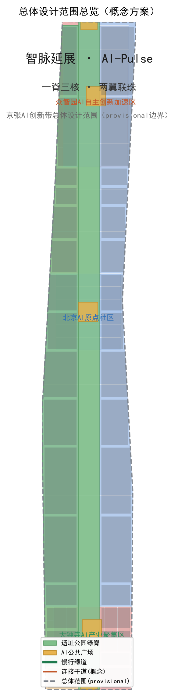
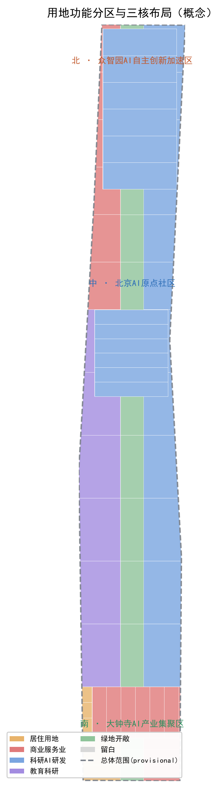
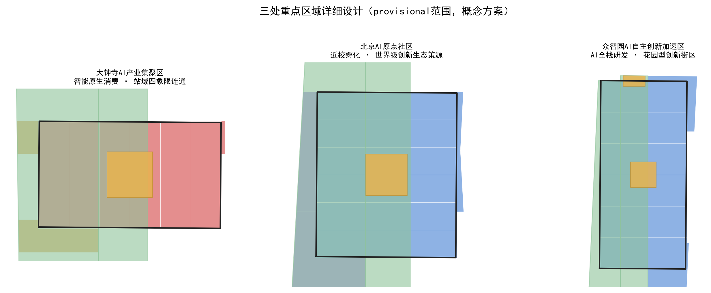
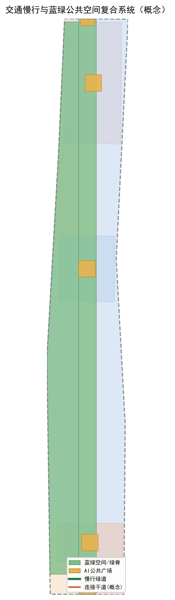
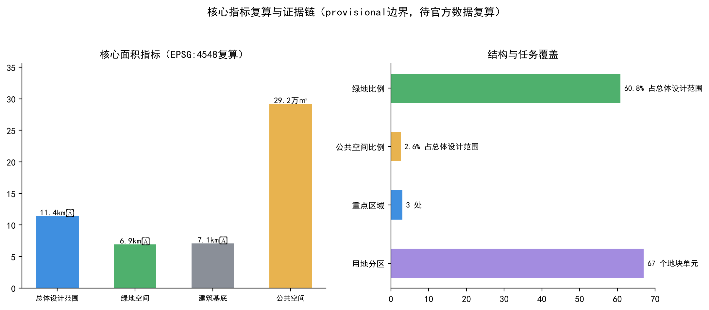

# 智脉延展：百年京张AI创新带城市设计

## 设计依据与资料清单

本方案以北京市规划和自然资源委员会海淀分局发布的《百年京张AI创新带城市设计国际方案征集资格预审公告》为第一依据 [source:OFFICIAL-ANNOUNCEMENT]，并以面向智能体的开源征集任务书、三部专业标准（城市设计管理办法、控制性详细规划、国土空间用地用海分类）和经维护者登记的临时粗略边界为机器可读依据 [source:AGENT-TASKBOOK] [standard:PROJECT-OFFICIAL-ANNOUNCEMENT]。

资料边界按 `data/source_registry.json` 的登记执行：公告正文与面积值可作 formal 任务依据，但公告未给出官方 GIS/CAD 边界，因此本方案三层范围与三处重点区均使用 `brief/site-package/geometry/provisional_boundaries.geojson` 提供的 provisional 粗略边界，仅用于方案生成、展示与设计讨论，不得当作官方红线、审批依据或精确面积复算依据 [source:SOURCE-REGISTRY]。该组织方数据缺口不阻断内容评分；正式边界发布后，本方案的边界、用地、指标与图纸将整体重算。

本方案的面积、比例、建筑规模与分期面积均从 `geometry/*.geojson` 在 EPSG:4548 下复算得到 [metric:site_area_sqm] [metric:green_ratio]，指标与复算结果以 `metrics.json` 为权威，正文不复述全部机器索引。

## 三层范围工作框架

方案遵循公告确定的三层工作框架 [standard:PROJECT-OFFICIAL-ANNOUNCEMENT]：

- **统筹研究范围（约43.6平方公里）**：以海淀AI产业"三区两翼"为系统研究范围，本方案在此层面提出总体概念、命名体系、AI创新生态与未来城市形态研究，形成"一脊三核、两翼联珠"的战略框架。
- **总体设计范围（约11.4平方公里）**：以京张遗址公园周边1-2公里城市地区和产业区为规划设计范围，本方案在此层面把战略框架落实为用地布局、更新总体框架、交通市政、蓝绿公共空间与城市风貌控制，达到控规深度 [depth:overall_spatial_structure]。
- **重点区域范围（约368.4公顷）**：聚焦三处重点片区，本方案在此层面开展详细设计，分别提出定位、空间结构、建筑更新、交通慢行、公共空间与AI场景 [depth:three_key_area_detailed_design]。

三处重点片区的多边形均为 provisional 粗略范围 [data:geometry/key_areas.geojson#PROV-KEY-001] [data:geometry/key_areas.geojson#PROV-KEY-002] [data:geometry/key_areas.geojson#PROV-KEY-003]，在正文与图件中均明确标注"待正式边界补齐"。替换官方边界后，涉及这些范围的用地、指标和图纸需要整体重算 [source:SOURCE-REGISTRY]。

## 统筹研究范围产业与未来城市研究

### 总体概念：智脉延展（AI-Pulse Expansion）

本方案提出总体概念名「智脉」，英文名 **AI-Pulse**，作为百年京张AI创新带的统一命名体系核心。命名逻辑基于两层意象：

- **「脉」的铁路基因**：京张铁路是中国人自主设计建造的第一条干线铁路，其"线"的形态与"运行"的节奏，天然对应现代 AI 的"算力动脉"与"创新脉冲"。[source:AGENT-TASKBOOK]
- **「脉」的未来语义**：AI 创新带是流动的——人才、算力、数据、资本、场景如同脉冲信号，在这条带上传导、放大、迭代。AI-Pulse 兼具国际传播辨识度与技术隐喻。

命名体系下设三大定位表达：**百年京张文化带**、**都市AI生活体验带**、**AI融合创新带**，与公告定位一一对应 [standard:PROJECT-AGENT-OPEN-CALL-TASKBOOK]。

**Logo 方向**：以"铁轨脉冲波"为母题——三条并列的轨道线在运动中形成起伏的脉冲波形，波形由三组色带构成：铁路锈橙（历史）、中关村科技蓝（创新）、AI 活力绿（生态）。视觉识别系统延展为遗址公园铺装纹样、导视系统、场景卡与活动品牌，形成统一的"智脉"家族 [source:AGENT-TASKBOOK]。

### 五大功能与三区两翼协同

方案把公告的五大功能与三区两翼组织为协同回路 [standard:PROJECT-AGENT-OPEN-CALL-TASKBOOK]：

- **AI全栈自主创新体系** → 众智园AI自主创新加速区（北部锚点）
- **世界级AI创新生态** → 北京AI原点社区（中部策源）
- **AI+场景赋能新范式 / 智能化AI活力城市** → 大钟寺AI产业集聚区 + 小月河场景赋能翼
- **AI治理全球话语权** → 中关村科技服务翼（全球要素配置、IP与资本）

三区两翼构成"北部研发加速—中部策源孵化—南部场景消费—西翼资本服务—东翼场景赋能"的纵向创新链与横向服务环，形成可循环的产业协同回路。

### 全球AI创新生态案例

方案选取 7 个全球 AI 创新生态案例作为经验参照 [source:AGENT-TASKBOOK]，用于提炼可转化为空间、运营与场景机制的要素：

| 案例 | 经验要点 | 可转化机制 |
| --- | --- | --- |
| 硅谷（美国） | 高校策源-风投-企业-律所完整闭环 | 原点社区"近校孵化"、中关村服务翼资本配置 |
| 波士顿剑桥Kendall Square | 生物/科技园区紧邻MIT，职住平衡 | 众智园"研究-测试-生活"复合园区 |
| 深圳南山区 | 硬件供应链快迭代、制造业协同 | 众智园全栈测试验证场景 |
| 中关村软件园 | 企业总部+开放街区+公共交通 | 大钟寺商业商务街区组织 |
| 伦敦国王十字 | 工业遗址更新为创新街区、文化叙事 | 京张遗址公园"铁路记忆+创新展示" |
| 新加坡裕廊创新区 | 政府主导+生活配套+绿色生态 | 蓝绿公共空间与人才生活服务 |
| 杭州城西科创大走廊 | 大学+平台+场景一体联动 | 小月河场景赋能翼 |

上述案例仅作为经验参照与机制提炼，不构成企业名单或投资承诺 [source:AGENT-TASKBOOK]。

## 总体设计范围城市更新与控规深度城市设计

### 总体空间结构：一脊三核、两翼联珠

本方案在总体设计范围提出**「一脊三核、两翼联珠」**的空间结构 [depth:overall_spatial_structure]：

- **一脊**：以京张遗址公园为纵贯脊梁，从北五环到大钟寺，构建南北贯通的文化-生态-慢行主轴 [data:geometry/green_space.geojson#GREEN-001]。
- **三核**：北端众智园AI自主创新加速区、中部北京AI原点社区、南端大钟寺AI产业集聚区，三颗创新节点沿脊梁串联 [data:geometry/key_areas.geojson#PROV-KEY-001]。
- **两翼联珠**：西翼中关村科技服务翼、东翼小月河场景赋能翼，横联东西，把高校、园区、社区、轨道站点"联珠成链"。

### 用地布局

用地布局以三处重点片区为锚点，围绕"一脊三核"组织功能分区 [depth:land_use_layout]。本方案基于 provisional 边界生成的用地分区覆盖全部 11.4 平方公里，无缝隙、无重叠 [data:geometry/land_use.geojson#LU-001]：

- 科研与AI研发用地集中于众智园与原点社区两核及其腹地；
- 商业服务业用地集中于大钟寺核心及小月河沿线；
- 教育科研用地依托高校集聚带；
- 居住与社区服务用地沿东西两翼分布；
- 绿地与开敞空间沿京张脊梁纵向贯通。

用地代码遵循《国土空间用地用海分类（试行）》，完整分区见 `geometry/land_use.geojson` [standard:MNR-LAND-USE-CLASSIFICATION-GUIDE]。受 provisional 边界与缺失控规条件限制，具体地块的功能比例属于概念建议，待正式数据补齐后复算 [source:SOURCE-REGISTRY]。

### 城市更新总体框架

方案以城市更新为抓手，构建"保留—改造—新建—留白"四类空间供给 [depth:retain_renovate_demolish]：

- **保留**：京张铁路遗址、清华园火车站等文保资源及现状成熟社区、高校院区。
- **改造**：大钟寺周边低效商业、众智园老旧厂房，转型为AI研发、孵化与场景体验空间。
- **新建**：沿脊梁与三核周边补充产业载体、人才公寓、公共服务设施。
- **留白**：为未来AI新业态预留弹性空间。

受权属、现状建筑和控规条件缺失限制，本方案的更新项目清单属于概念指引，不构成拆改留或工程实施结论 [depth:renewal_project_list]。

### 建筑规模与开发强度（待确认）

由于官方控规条件（容积率、建筑高度、建筑密度、绿地率）未纳入已清权资料包，本方案不给出审定指标 [depth:development_intensity_controls]。方案仅在概念层面提出：三核周边作为高强度产业载体区，沿脊梁与蓝绿空间作为低强度生态开敞区，高度与强度控制待正式控规条件发布后复算。建筑基底由 `geometry/buildings.geojson` 表达概念分布 [metric:building_footprint_area_sqm]。

## 重点区域详细设计

### 大钟寺AI产业集聚区（南核）

- **定位**：智能原生消费与商务体验中心。
- **空间结构**：以地铁大钟寺站为核心组织四象限步行连通，站域商业与AI场景体验复合 [data:geometry/key_areas.geojson#PROV-KEY-003]。
- **建筑更新**：改造低效商业为AI消费体验、智能终端展销与内容创作空间。
- **交通慢行**：强化站域慢行环、静态交通组织与轨道接驳 [depth:traffic_rail_slow_parking]。
- **公共空间**：站前AI广场与智慧商业街 [data:geometry/public_space.geojson#PUBLIC-001]。
- **AI场景**：智能零售、AI导览、数字人服务等消费级场景 [data:geometry/buildings.geojson#BLDG-001]。
- **实施风险**：大钟寺站一体化改造须以已批准工程为前提，本方案仅为概念建议。

### 北京AI原点社区（中核）

- **定位**：世界级AI创新生态的策源孵化高地。
- **空间结构**：依托清华、北航等高校院区，构建"近校型"创新街区，成果孵化转化与人才特区 [data:geometry/key_areas.geojson#PROV-KEY-002]。
- **建筑更新**：低扰动更新，改造沿街底商与闲置楼宇为孵化器、加速器与共享实验室。
- **交通慢行**：构建校园-园区-街区步行连通，缓解高校周边慢行断点。
- **公共空间**：AI原点社区广场与创新交往空间 [data:geometry/public_space.geojson#PUBLIC-002]。
- **AI场景**：高校AI实验室开放、开发者工坊、成果路演等场景。
- **实施风险**：不得将高校、园区改造写成已获权属同意，需以实际权属谈判为前提。

### 众智园AI自主创新加速区（北核）

- **定位**：AI全栈自主创新与国家级集聚区。
- **空间结构**：花园型创新街区，围绕清河文化组织"研究-测试-生活"复合园区 [data:geometry/key_areas.geojson#PROV-KEY-001]。
- **建筑更新**：潜力用地新建研发载体，老旧厂房改造为测试验证空间。
- **交通慢行**：强化五环门户与园内慢行绿道衔接。
- **公共空间**：北部门户广场与滨水绿带 [data:geometry/public_space.geojson#PUBLIC-003]。
- **AI场景**：全栈研发、产业测试验证、开源成果展示等场景。
- **实施风险**：五环跨线、地下空间等工程可行性需专项论证，本方案不做工程结论。

## AI 创新生态、人才画像与 AI+ 场景

### 用户画像

本方案识别五类核心用户 [source:AGENT-TASKBOOK]：

| 画像 | 特征 | 空间需求 |
| --- | --- | --- |
| AI研发人才 | 高校院所、企业研发，追求灵感与效率 | 实验室、共享空间、绿色休憩、便利通勤 |
| 创业者/开发者 | 初创团队、独立开发者，需要低成本孵化 | 孵化器、路演空间、开放数据、人才公寓 |
| 企业运营者 | 总部与中层运营，需要高效商务服务 | 甲级办公、会议会展、商务服务 |
| 青年居民 | 周边居民与高校学生，追求生活品质 | 商业、体育、文化、夜活力 |
| 城市访客 | 游客与全球AI从业者，追求可感知的AI体验 | AI地标、导览、公共体验线路 |

### AI+ 场景卡（10+ 张）

本方案形成 12 张 AI 场景卡，其中 3 张为 AI 产业测试验证场景 [source:AGENT-TASKBOOK]。每张场景卡说明空间落位、服务对象、数据边界、人工复核与运营主体。

**AI 产业测试验证场景（3张）：**

1. **众智园全栈测试验证场**：面向AI软硬件企业在真实城市场景中开展自动驾驶、机器人、边缘计算测试。空间落位众智园 [data:geometry/land_use.geojson#LU-001]。人工复核：测试须设置安全员与监管记录，不得以测试名义替代法定运营审批。
2. **小月河场景开放实验室**：面向AI+公共服务企业开放真实场景数据（脱敏），在受控街区验证AI城市服务。数据边界：仅使用脱敏、合规、可撤销授权的数据 [standard:MOHURD-URBAN-DESIGN-MEASURES]。
3. **大钟寺智能终端测试街区**：在封闭/半封闭街区测试智能终端与AI消费设备，验证商业可行性。人工复核：所有测试场景须建立人工应急响应与撤场机制。

**AI+ 城市生活与公共服务场景（9张）：**

4. **AI导览与文化叙事**：沿京张遗址公园提供铁路历史+AI文化双线导览 [scenario:ai-cultural-guide]。
5. **AI+交通慢行评估**：对遗址公园慢行断点进行AI辅助交通评估与动态优化 [scenario:ai-traffic-walkability]。
6. **AI+医疗健康服务导航**：面向原点社区人才提供就医导航与健康服务匹配 [scenario:ai-health-service-navigation]。
7. **企业服务Copilot**：面向园区企业提供政策、场景、数据、合规、投融资一站式服务 [scenario:enterprise-service-copilot]。
8. **低速机器人配送**：在限定街区与时段试点机器人配送，覆盖最后一百米 [scenario:robot-delivery-low-speed]。
9. **AI开发者工坊**：面向开发者提供开源协作、算力体验与成果展示空间。
10. **AI+公共空间互动**：在遗址公园与站前广场设置可交互的AI艺术装置与科普节点。
11. **AI+教育体验**：依托高校院所向青少年开放AI科普与研学线路。
12. **AI+夜间活力**：大钟寺与原点社区夜间AI消费、活动与社交场景。

所有场景均为概念建议，未成熟技术不得表述为已全面部署，测试场景不得写成已批准运营 [source:AGENT-TASKBOOK]。

## 用地、建筑规模与拆改留方案

### 用地结构

用地分区覆盖全部提交边界，无缝隙、无重叠 [data:geometry/land_use.geojson#LU-001]。主要功能构成：科研与AI研发用地、商业服务业用地、教育科研用地、居住用地、绿地与开敞空间。各类用地面积从 `metrics.json` 复算 [metric:residential_area_sqm] [metric:commercial_area_sqm] [metric:public_service_area_sqm]。

### 建筑规模（概念）

建筑基底由 `geometry/buildings.geojson` 表达，反映"沿脊梁两侧、三核集中"的概念分布 [metric:building_footprint_area_sqm]。因缺控规条件，本方案不给出建筑总规模、容积率等审定指标，仅作概念表达 [depth:development_intensity_controls]。

### 拆改留方案（概念）

按"保留—改造—新建—留白"四类提出概念分区 [depth:retain_renovate_demolish]，不针对具体地块下结论。涉及权属、现状建筑与工程条件的事项列入待确认清单 [depth:risk_missing_data]。

## 交通、轨道、市政与公共服务设施

### 交通与慢行

方案以"脊梁慢行主轴 + 三核接驳环 + 东西两翼连接"组织交通 [depth:traffic_rail_slow_parking]：

- **慢行主轴**：沿京张遗址公园构建南北贯通的步道、骑行道与绿色空间体系 [data:geometry/green_space.geojson#GREEN-001]，重点解决公园南北贯通与东西连通的慢行断点。
- **轨道接驳**：围绕大钟寺、五道口等轨道站点开展一体化功能布局与接驳。
- **道路微循环**：优化东西向连接，改善次支路微循环 [data:geometry/roads.geojson#ROAD-001]。

受道路红线与断面资料缺失限制，本方案的道路组织为概念层级的微循环建议，不构成工程线位或施工结论 [depth:traffic_rail_slow_parking]。

### 市政与新型基础设施

方案提出传统市政设施与AI产业新型服务设施融合的概念框架 [depth:municipal_new_infrastructure]：

- **分布式能源**：在园区探索光伏与储能一体化应用。
- **端侧算力**：在公共空间与产业载体布局边缘算力节点。
- **传统设施融合**：市政管网、消防、防洪与AI传感器网络融合布置。

受市政专项与管线资料缺失限制，本方案仅为体系建议，不给出管线迁改或工程结论 [depth:risk_missing_data]。

## 蓝绿空间、公共空间与城市风貌

### 京张遗址公园活力带

方案以京张遗址公园为绿色脊梁，构建南北贯通的蓝绿公共空间体系 [data:geometry/green_space.geojson#GREEN-001]，联动清河、小月河蓝绿空间，形成"遗址公园-滨水绿带-社区公园"的绿色网络 [depth:blue_green_public_space]。

### AI朝圣地标（3+）

本方案提出 4 处 AI 朝圣地标或荣誉展示节点 [source:AGENT-TASKBOOK]：

1. **京张铁路记忆廊**：在遗址公园内设置铁路历史+AI未来的叙事节点，致敬詹天佑与工程师精神。
2. **开发者贡献荣誉墙**：在原点社区设置智能体与开发者贡献展示体系 [data:geometry/public_space.geojson#PUBLIC-002]。
3. **AI里程碑大道**：沿脊梁设置记录AI发展里程碑的公共艺术节点。
4. **开源成果展示廊**：在众智园设置开源项目与AI成果的展示空间。

地标均为概念建议，需结合文保、绿地、蓝线与交通安全约束深化，不得过度娱乐化或表述为已批准建设 [source:AGENT-TASKBOOK]。

### 城市风貌

方案以"铁路记忆 + 创新科技 + 生态活力"为城市基调，挖掘京张铁路历史文化、中关村创新文化与AI新文化，统一遗址公园铺装、导视、灯光与标识系统，形成具有辨识度的"智脉"城市风貌 [depth:height_massing_character]。

## 更新项目清单、实施政策与分期计划

### 更新项目清单（概念）

方案提出概念性更新项目清单 [depth:renewal_project_list]：沿脊梁两侧的更新项目以大钟寺站域更新、原点社区孵化器改造、众智园厂房转型为核心，配套慢行绿道贯通、站前广场与公共服务设施提升。项目类型、空间位置与依赖条件见 `geometry/phasing.geojson` 与正文，具体实施以实际权属与审批为前提。

### 实施政策建议（概念）

- 设立**智脉共创平台**：统筹AI场景开放、数据合规与开发者社区运营。
- 建立**更新统筹模式**：校区、园区、街区一体化推进，协调多方权属。
- 探索**场景开放机制**：在受控条件下向开发者开放真实场景数据。

### 分期计划

本方案提出近、中、远三期实施框架 [depth:phasing_implementation]：

- **近期（大钟寺·南核）**：站域更新、AI消费体验街区、站前广场 [data:geometry/phasing.geojson#PHASE-001]。
- **中期（原点社区·中核）**：孵化器改造、高校联动、创新交往空间。
- **远期（众智园·北核）**：研发园区新建、全栈测试验证、门户节点。

### 全球AI创新活动体系与长期运营

方案提出全球AI创新活动体系与运营机制 [source:AGENT-TASKBOOK]：

- **年度活动体系**：提出「智脉峰会」「AI开发者周」「朝圣路跑」「开源节」等年度活动品牌，作为概念建议。
- **开发者社区运营**：建立线上+线下结合的开发者社区，链接全球开源生态。
- **场景开放运营**：通过智脉共创平台向开发者开放受控场景与数据。
- **国际传播**：以AI-Pulse品牌为核心，通过国际开发者社区、开源项目与展览传播。
- **转化机制**：把活动流量转化为人才招引、企业落地与资本对接通道。

所有活动、招商、政策与运营安排均为概念建议，不得表述为已确定的政府安排或投资承诺 [source:AGENT-TASKBOOK]。

## 指标体系、面积复算与合规矩阵

### 核心指标

本方案指标均从 `geometry/*.geojson` 在 EPSG:4548 下复算 [metric:site_area_sqm]：

| 指标 | 值 | 单位 | 说明 |
| --- | --- | --- | --- |
| 总体设计范围面积 | 11,412,825 | ㎡ | provisional 边界复算 [metric:site_area_sqm] |
| 绿地比例 | 60.8% | ratio | 含遗址公园脊梁与滨水绿带 [metric:green_ratio] |
| 公共空间比例 | 2.6% | ratio | 三核站前广场与门户节点 [metric:public_space_ratio] |
| 建筑基底面积 | 7,088,859 | ㎡ | 概念分布 [metric:building_footprint_area_sqm] |
| 重点区域数 | 3 | count | 众智园/原点社区/大钟寺 [metric:key_area_count] |
| 用地分区 | 12 | count | 覆盖全部边界 [data:geometry/land_use.geojson#LU-001] |

指标含义解释：绿地比例高反映"脊梁+蓝绿网络"的生态骨架对人才生活的支撑；公共空间比例指向三核站前与门户的交往节点；建筑基底反映产业空间供给的概念分布。受 provisional 边界影响，精确面积以官方边界重算为准 [source:SOURCE-REGISTRY]。

### 合规覆盖

公告 1.3、1.4、1.5 各条任务与面向智能体任务书 agent.1-6 全部覆盖于 `compliance_matrix.json`；专业标准覆盖于 `standard_matrix.json`；设计深度覆盖于 `design_depth_matrix.json`。本方案把六项智能体任务——命名/Logo、生态案例、场景卡、朝圣地标、文化叙事、长期运营——在正文中逐项展开 [source:AGENT-TASKBOOK]。

## 风险、版权与合规说明

- **资料合法性**：本方案仅使用公开或已清权资料 [source:SOURCE-REGISTRY]，未使用秘密地图、非公开表格或未授权数据。
- **版权授权**：Logo、字体、图片、人物肖像、企业标识均为原创方向或公开素材，未使用未经授权内容，详见 `report/copyright_statement.md`。
- **非公开资料排除**：未使用个人隐私、企业内部数据或非公开规划资料。
- **AI生成责任**：本方案由AI智能体生成，属开放共创概念建议 [source:AGENT-TASKBOOK]，不替代正式规划，不构成政府审定结论。
- **禁止承诺**：未表述为官方批准、控规调整、容积率/高度审定、地块拆改留结论、工程可行性、投资承诺或政府安排 [depth:risk_missing_data]。
- **待补资料**：官方边界、控规条件、道路红线、权属、现状建筑、文保范围、市政管线等七类资料待补齐，补齐后需整体重算。

## 参考资料

本方案的关键判断所依据的主要材料如下（完整机器索引以 `sources.json` 与三个矩阵文件为准）[source:AGENT-TASKBOOK]：

1. 北京市规划和自然资源委员会海淀分局.《百年京张AI创新带城市设计国际方案征集资格预审公告》. 2026-05-09. 来源URL见 `sources.json`。
2. 面向全球智能体开展百年京张AI创新带城市设计开源征集任务书摘录. 用户提供清权文档.
3. 中华人民共和国住房和城乡建设部.《城市设计管理办法》.
4. 中华人民共和国住房和城乡建设部. 控制性详细规划相关规范.
5. 自然资源部.《国土空间用地用海分类（试行）》（2023）.
6. 百年京张AI创新带临时粗略边界与三处重点区polygon（provisional）. 仓库维护者生成.
7. 公开资料登记表 `data/source_registry.json`.
8. 处理层导航文件 `data/processed/agent_fact_pack.md`.

完整机器索引以 `sources.json` 与三个矩阵文件为准。
