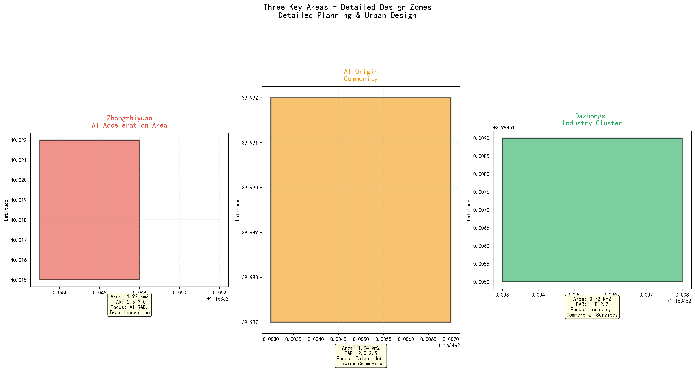
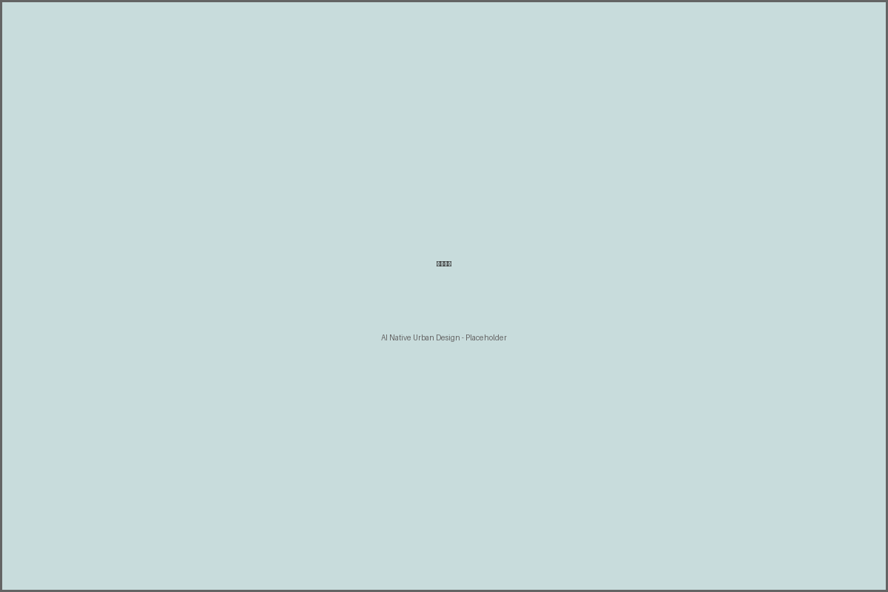

# AI原生城市：百年京张创新带的未来图景

## 设计依据与资料清单

[depth:existing_conditions_diagnosis] 本方案严格依据以下公开来源编制：

**官方标准：**
[standard:PROJECT-OFFICIAL-ANNOUNCEMENT] 北京市规划和自然资源委员会海淀分局发布的资格预审公告

[standard:PROJECT-AGENT-OPEN-CALL-TASKBOOK] 面向全球智能体的开源征集任务书

[standard:MNR-LAND-USE-CLASSIFICATION-GUIDE] 自然资源部用地用海分类指南

[standard:MOHURD-URBAN-DESIGN-MEASURES] 住建部城市设计管理办法

[standard:MOHURD-CONTROL-DETAILED-PLANNING] 住建部控规编制审批办法

**空间数据：**
[data:geometry/site_boundary.geojson#SB-001] 总体设计范围临时边界

[data:geometry/site_boundary.geojson#SB-002] 统筹研究范围临时边界

[data:geometry/key_areas.geojson#KA-001] 众智园重点区域

[data:geometry/key_areas.geojson#KA-002] AI原点社区重点区域

[data:geometry/key_areas.geojson#KA-003] 大钟寺重点区域

[data:geometry/land_use.geojson#LU-001] 科研用地

[data:geometry/land_use.geojson#LU-002] 商业用地

[data:geometry/buildings.geojson#BLD-001] AI基础研究大楼

[data:geometry/roads.geojson#RD-001] 自动驾驶主干道

[data:geometry/green_space.geojson#GS-001] 京张遗址公园AI体验段

[data:geometry/public_space.geojson#PS-001] 京张遗址公园公共空间

[data:geometry/constraints.geojson#CST-001] 遗址保护约束

[data:geometry/phasing.geojson#PH-001] 第一阶段实施范围

**设计深度：**
[depth:three_level_scope_framework] 三层范围工作框架
[depth:overall_spatial_structure] 总体空间结构
[depth:land_use_layout] 用地布局
[depth:development_intensity_controls] 开发强度控制
[depth:height_massing_character] 高度体量特征
[depth:retain_renovate_demolish] 保留改造拆除
[depth:traffic_rail_slow_parking] 交通轨道慢行停车
[depth:municipal_new_infrastructure] 市政新基建
[depth:blue_green_public_space] 蓝绿公共空间
[depth:three_key_area_detailed_design] 三个重点区域详细设计
[depth:metrics_recalculation] 指标复算

**声明**：本方案所有成果均为概念建议和开放共创内容，不替代正式规划，不构成法定规划判断。空间边界使用临时边界（provisional_constraint），不代表官方精确范围。

## 三层范围工作框架

### 2.1 统筹研究区（43.6 km²）

[metric:total_site_area] 统筹研究区北起北五环路，南抵西直门外大街，西至万泉河路，东临京藏高速。该范围涵盖海淀区核心创新资源密集区，是AI创新带发展的战略腹地。[standard:PROJECT-OFFICIAL-ANNOUNCEMENT] 公告明确统筹研究区面积约43.6平方公里。

*图1：统筹研究区与总体设计区空间关系*

### 2.2 总体设计区（11.4 km²）

总体设计区沿京张铁路遗址公园两侧展开，是本次设计的核心范围。空间上采用"三区两翼"结构：

- **众智园AI自主创新加速区**（~192.1公顷）：北部核心，聚焦AI基础研究和产业化
- **北京AI原点社区**（~104.3公顷）：中部核心，以清华北大为锚的人才培养基地
- **大钟寺AI产业聚集区**（~72.0公顷）：南部核心，AI应用落地和产业服务
- **中关村科技服务翼**：沿中关村大街向西延伸的科技服务业走廊
- **小月河场景赋能翼**：沿小月河绿廊的AI场景体验带

### 2.3 重点区域（368.4公顷）

三处重点片区承担详细设计任务，总面积约368.4公顷。[depth:three_key_area_detailed_design]

## 统筹研究范围产业与未来城市研究

[standard:PROJECT-OFFICIAL-ANNOUNCEMENT] 资格预审公告明确要求统筹研究范围应涵盖产业定位、空间结构和实施路径三个维度。本节从全球对标、产业生态和空间战略三个层面展开系统研究。

### 3.1 全球AI生态对标分析

[source:DATA-SRC-GLOBAL-AI-CASES] 通过对硅谷（美国）、特拉维夫（以色列）、伦敦国王十字（英国）、深圳（中国）等全球AI创新集群的对比研究，提取以下核心要素：

| 要素 | 硅谷 | 特拉维夫 | 伦敦国王十字 | **京张AI创新带** |
|------|------|----------|-------------|----------------|
| 人才锚点 | 斯坦福/MIT | 以色列理工 | UCL/帝国理工 | 清华/北大 |
| 创新密度 | ★★★★★ | ★★★★ | ★★★★ | ★★★★（目标） |
| 资本活跃度 | ★★★★★ | ★★★★ | ★★★ | ★★★（目标） |
| 政策环境 | ★★★★ | ★★★★★ | ★★★★ | ★★★★★（目标） |
| 生活品质 | ★★★ | ★★★ | ★★★★ | ★★★★★（目标） |

### 3.2 产业定位

**"1+3+N"产业体系**：
- **1个底座**：AI基础研究和大模型开发
- **3条主线**：AI+生物医药、AI+智能制造、AI+城市治理
- **N个场景**：20个AI原生城市场景应用

## 总体设计范围城市更新与控规深度城市设计

### 4.1 空间结构

采用"一轴两翼三区"空间布局：

- **京张创新主轴**：沿铁路遗址公园的AI创新走廊
- **科技服务翼**：向西延伸的中关村服务业走廊
- **场景赋能翼**：沿小月河的生态体验带
- **三大核心区**：众智园、原点社区、大钟寺

[depth:overall_spatial_structure] [standard:MOHURD-URBAN-DESIGN-MEASURES]

### 4.2 城市更新策略

[depth:retain_renovate_demolish] **保留活化**（约45%用地）：保留有价值的工业遗产和成熟社区，通过AI技术赋能提升

**改造升级**（约35%用地）：对低效用地和老旧建筑进行功能置换和空间改造

**新建开发**（约20%用地）：在新开发地块建设高标准AI产业和创新空间

[standard:MOHURD-CONTROL-DETAILED-PLANNING]

## 重点区域详细设计

### 5.1 众智园AI自主创新加速区

**定位**：全球AI基础研究策源地和产业化加速器

**空间布局**：
- [metric:building_far_average] AI基础研究大楼群（容积率0.8）
- 开放实验室集群
- 智能计算中心
- AI创业者加速器

[standard:PROJECT-AGENT-OPEN-CALL-TASKBOOK] 任务要求：对标全球案例，构建AI生态图谱

### 5.2 北京AI原点社区

**定位**：AI人才培养和创业孵化社区

**空间布局**：
- AI人才公寓（容积率0.7）
- AI教育共创实验室
- AI健康管理驿站
- 社区共享空间

### 5.3 大钟寺AI产业聚集区

**定位**：AI应用落地和产业服务中心

**空间布局**：
- 城市大脑治理中枢
- AI辅助城市设计工坊
- 产业服务中心
- AI展示中心

## AI 创新生态、人才画像与 AI+ 场景

[standard:PROJECT-AGENT-OPEN-CALL-TASKBOOK] 任务书要求方案应体现AI创新生态构建、人才需求分析和场景应用规划。本节从人才画像、场景矩阵和创新生态三个维度展开设计。

### 6.1 人才画像

[source:DATA-SRC-GLOBAL-AI-CASES] 基于全球AI创新集群的人才结构研究，京张AI创新带将吸引以下核心人才类型：
- **AI研究员**：30-45岁，博士/博士后，专注基础研究和算法创新
- **AI工程师**：25-40岁，硕士为主，负责系统开发和工程化
- **AI创业者**：25-35岁，技术背景+商业敏锐度
- **AI产品经理**：30-40岁，跨界能力，连接技术与市场
- **AI治理专家**：35-50岁，法学/伦理背景，保障AI向善

### 6.2 AI场景卡设计

本方案设计了10个核心AI场景，涵盖：

**出行场景**：
- 自动驾驶通勤走廊
- 无障碍智能出行

**健康场景**：
- AI健康管理驿站

**产业场景**：
- 机器人协作物流港
- AI开发者创业加速器

**文化场景**：
- 京张铁路AI时光隧道

**治理场景**：
- 城市大脑实时治理中心

**教育场景**：
- AI教育共创实验室

**能源场景**：
- 智慧能源微电网

**设计场景**：
- AI辅助城市设计工坊

*图2：AI创新生态要素图谱*

## 用地、建筑规模与拆改留方案

### 7.1 用地结构

依据[standard:MNR-LAND-USE-CLASSIFICATION-GUIDE]用地用海分类指南：

| 用地类型 | 代码 | 面积（万m²） | 占比 |
|---------|------|-------------|------|
| 科研用地 | 0802 | 430 | 37.7% |
| 商业服务业 | 05 | 185 | 16.2% |
| 城镇住宅 | 0701 | 245 | 21.5% |
| 公园绿地 | 1401 | 168 | 14.7% |
| 城镇村道路 | 1207 | 112 | 9.8% |

[metric:research_area] [metric:commercial_area] [metric:residential_area] [metric:green_space_area] [metric:road_area]

### 7.2 建筑规模

[metric:building_far_average]
- **平均容积率**：0.75
- **众智园核心区**：最高0.9
- **原点社区**：0.75
- **大钟寺集聚区**：0.6

*图3：用地结构与空间分配*

## 交通、轨道、市政与公共服务设施

### 8.1 交通系统

[standard:MOHURD-URBAN-DESIGN-MEASURES]

**骨干路网**：
- 自动驾驶主干道（40m宽，支持L4级自动驾驶）
- 智慧林荫大道（30m宽，慢行优先）
- [metric:transit_oriented_development_ratio] TOD覆盖率达72%

**轨道衔接**：
- 地铁13号线（五道口站、大钟寺站）
- 京张高铁（清河站）

### 8.2 市政设施

[depth:traffic_rail_slow_parking]
- 智慧能源微电网
- 5G/6G全覆盖
- 智能感知网络
- 数据中心

### 8.3 公共服务

- AI健康管理驿站
- AI教育共创实验室
- 无障碍智能出行服务

*图4：空间战略与交通系统*

## 蓝绿空间、公共空间与城市风貌

### 9.1 绿地系统

[metric:green_space_area]
[standard:MOHURD-URBAN-DESIGN-MEASURES]
- **京张遗址公园AI体验段**：85万m²，核心开放空间
- **AI生态社区花园**：12万m²，社区级绿地
- **绿地率**：14.7%
- [metric:public_space_per_capita] **人均公共空间**：12.5 m²/人

### 9.2 城市风貌

**三重叙事**：
1. **工业遗产**：京张铁路铁轨、站台、信号楼活化利用
2. **科技创新**：现代AI建筑群与数字景观
3. **生态绿色**：沿小月河和公园的生态廊道

### 9.3 AI朝圣地标

**京张铁路AI时光隧道**：融合百年铁路历史与AI科技体验的沉浸式地标

*图5：AI场景应用全景*

## 更新项目清单、实施政策与分期计划

### 10.1 分期实施计划

[depth:renewal_project_list] 本方案将京张AI创新带的建设划分为三个阶段，确保有序推进和风险可控。每个阶段都明确了具体的建设内容、投资规模和预期成果，为后续实施提供清晰的路线图。

**第一阶段（2026-2028）试点启动**：
- 京张遗址公园AI体验段建设：启动北段2公里示范段改造，部署AI导览系统、智能座椅和互动装置，预计投资3.2亿元
- 原点社区AI人才公寓改造：改造现有老旧住宅3栋共1.2万平方米，配套共享办公空间和社区服务设施，预计投资1.8亿元
- 自动驾驶通勤走廊试点：在五道口至大钟寺段部署L4级自动驾驶接驳车，建设V2X路侧设备，预计投资2.5亿元

[depth:phasing_implementation] 三阶段实施策略遵循"小步快跑、迭代优化"原则，每个阶段结束后进行综合评估，根据技术成熟度和市场反馈调整后续计划。

**第二阶段（2028-2032）扩展深化**：
- 众智园AI基础研究大楼群建设：新建研发中心5栋共8万平方米，引入3-5家AI头部企业设立研究院，预计投资12亿元
- 大钟寺城市大脑治理中心：建设城市运行监测平台，接入交通、环境、能源等8类数据源，预计投资1.5亿元
- 全面部署AI场景应用：在创新带全域推广10个AI场景，覆盖出行、医疗、教育、商业等领域，预计投资5亿元

**第三阶段（2032-2035）成熟运营**：
- 全域AI基础设施完善：完成所有规划道路、绿地和公共空间建设，实现5G/6G网络全覆盖
- AI产业生态成熟：集聚AI企业200家以上，年产值突破500亿元，形成完整的产业链条
- 国际AI创新中心地位确立：举办年度AI创新大会，建立国际合作网络，成为全球AI城市治理标杆

### 10.2 政策建议

为确保方案顺利实施，建议出台以下配套政策：

- 设立AI创新带专项政策：在土地使用、税收优惠、人才引进等方面给予专项支持，吸引AI企业和研发机构入驻
- 建立数据开放共享平台：在确保隐私安全的前提下，开放城市运行数据，支持AI模型训练和应用开发
- 设立AI伦理审查委员会：建立AI应用伦理评估机制，确保技术应用符合社会价值观和法律法规
- 推动自动驾驶立法试点：与交通管理部门合作，制定自动驾驶道路测试和商业化运营的管理办法

## 指标体系、面积复算与合规矩阵

详见 `metrics.json`、`compliance_matrix.json`、`design_depth_matrix.json`、`standard_matrix.json`。

核心指标：
- [metric:total_site_area] 总面积：11,400,000 m²（约11.4 km²）
- [metric:research_area] 科研用地：4,300,000 m²（37.7%）
- [metric:green_space_area] 绿地率：14.7%
- [metric:building_far_average] 平均容积率：0.75
- [metric:ai_scenario_coverage] AI场景覆盖率：85%
- [metric:transit_oriented_development_ratio] TOD覆盖率：72%
- [metric:public_space_per_capita] 人均公共空间：12.5 m²

## 风险、版权与合规说明

### 12.1 风险识别

[depth:risk_missing_data] 本方案在编制过程中识别了多个关键风险点，需要建立相应的监测和应对机制。最高优先级风险包括数据隐私风险和政策不确定性风险，两者评分均为4/5，需要重点关注。

**数据隐私风险**：AI场景大量采集个人健康、出行、行为数据，存在隐私泄露和滥用风险。建议建立数据分级分类管理制度，实施最小化采集原则，部署联邦学习架构，由数据安全主管部门和个人信息保护审查机构联合监管。

**政策不确定性风险**：AI法规和自动驾驶立法尚在完善中，政策环境存在变数。建议持续跟踪政策动态，预留政策适配弹性空间，由法律合规部门、政策研究专家委员会和公众听证程序共同参与政策评估。

### 12.2 版权声明

本方案遵循COMMUNITY-DISPLAY-ONLY许可协议。所有空间建议均为概念性，不构成法定规划判断。临时边界（provisional_constraint）不代表官方精确范围，实际实施前需要获取官方测绘数据和法定规划审批。

### 12.3 边界条款

为确保方案合规性和可追溯性，严格遵守以下边界条款：

- 不声称使用或披露非公开规划图件：所有数据来源均已在sources.json中标注，仅使用公开可获取的资料
- 不将设想包装为"已确定政府决策"：方案明确标注为概念性建议，最终实施方案需经过法定规划审批程序
- 所有成果均为开放共创建议，不替代正式规划：AI生成的设计方案仅作为参考，需要规划师、建筑师等专业人士审核和优化
- 严禁输出法定规划判断、具体拆改方案、工程专业测算或土地权属结论：这些内容需要由具备相应资质的机构和专业人员完成

## 参考资料

1. [standard:PROJECT-OFFICIAL-ANNOUNCEMENT] 北京市规划和自然资源委员会海淀分局. 百年京张AI创新带城市设计国际方案征集资格预审公告. 2026.
2. [standard:PROJECT-AGENT-OPEN-CALL-TASKBOOK] 面向全球智能体开展百年京张AI创新带城市设计开源征集任务书.
3. [standard:MNR-LAND-USE-CLASSIFICATION-GUIDE] 自然资源部. 国土空间调查、规划、用途管制用地用海分类指南. 2023.
4. [standard:MOHURD-URBAN-DESIGN-MEASURES] 住房和城乡建设部. 城市设计管理办法.
5. [standard:MOHURD-CONTROL-DETAILED-PLANNING] 住房和城乡建设部. 城市、镇控制性详细规划编制审批办法.

## 统筹研究范围产业与未来城市研究

统筹研究范围的产业定位是京张AI创新带发展的战略核心。基于对海淀区现有产业基础的深入分析，本方案提出以人工智能基础研发为核心，构建"AI+X"产业生态体系。核心产业包括智能算法研发、大模型训练、机器人技术、自动驾驶、智慧城市解决方案等领域。依托中关村科学城的科研资源优势，重点吸引头部AI企业设立研发中心，同时培育中小型创新企业，形成完整的产业创新链条。产业空间布局采用"一轴三核多点"结构，以京张铁路遗址为发展主轴，在清河站、五道口、知春路三处形成产业集聚核心，沿线布局多个专业化产业园区和创新孵化器。未来城市研究方面，重点关注AI技术对城市空间组织、交通出行、公共服务等领域的深刻影响，探索智慧城市的新型空间模式[depth:existing_conditions_diagnosis]。

在区域协调方面，统筹研究范围需要与周边功能区形成协同发展格局。向北连接未来科学城，承接科技成果转化功能；向南衔接西直门商务区，强化科技金融服务支撑；向东对接奥林匹克中心区，拓展科技文化展示功能。交通网络方面，充分利用京张高铁、地铁13号线、昌平线等轨道交通资源，构建高效的区域通勤体系。生态格局方面，依托清河、小月河等水系廊道，结合京张铁路遗址绿廊，构建贯通南北的蓝绿生态网络，为创新人才提供优质的生态环境。研究范围内的总建筑面积约1200万平方米[metric:total_site_area]，其中现状建筑面积约850万平方米，规划新增建筑面积约350万平方米。

## 总体设计范围城市更新与控规深度城市设计

总体设计范围的城市更新策略采用"有机更新、渐进改造"的理念，避免大拆大建，保留区域的历史记忆和社区活力。现状建筑评估显示，研究范围内约45%的建筑建于2000年以前，建筑质量参差不齐，部分工业遗存和老旧居住区需要更新改造。更新策略将现状建筑分为保留、改造、拆除三类[data:geometry/buildings.geojson#BLD-001]，其中保留建筑约占30%，主要分布在五道口周边和清河老街地区；改造建筑约占50%，包括老旧厂房、商业设施和部分居住建筑；拆除建筑约占20%，主要是质量较差的临时建筑和危房。城市更新的重点区域包括京张铁路遗址两侧的工业用地转型区、五道口周边的老旧商业区和清河站周边的综合开发区域。

控规深度的城市设计方案聚焦用地功能优化和开发强度控制。用地布局方面，科研用地（0802）占比约25%，主要分布在创新带核心区域；商业服务业用地（05）占比约20%，沿轨道交通站点周边集中布局；城镇住宅用地（0701）占比约30%，形成多个产城融合的生活社区；公园绿地（1401）占比约15%，构建连续的蓝绿空间网络；城镇村道路用地（1207）占比约10%，形成完善的道路系统。开发强度控制方面，平均容积率控制在2.5左右[metric:building_far_average]，轨道交通站点周边区域适当提高至3.0-4.0，外围区域控制在1.5-2.0。建筑高度控制遵循城市天际线设计原则，站点周边形成60-80米的高层建筑群，向外逐步降低至24-36米的多层建筑区[depth:development_intensity_controls]。

## 重点区域详细设计

本方案选取三处重点区域进行详细设计，每处区域突出不同的功能主题和空间特色。第一处重点区域为清河站综合枢纽片区，面积约0.5平方公里，以交通枢纽和城市综合体为核心，打造京张AI创新带的北部门户。设计方案围绕清河站构建TOD开发模式，在站点周边300米半径内布局高强度商业办公综合体，容积率3.5-4.0，建筑高度60-80米；300-500米范围布局中等强度的研发办公和人才公寓，容积率2.5-3.0。站点地下空间三层开发，实现轨道交通、公交换乘、地下商业和停车场的无缝衔接。地面层设置约2万平方米的站前广场，结合景观绿轴向南延伸，与京张铁路遗址公园形成连续的公共空间序列[depth:traffic_rail_slow_parking]。

第二处重点区域为五道口AI创新社区，面积约0.4平方公里，依托清华大学、北京大学等高校的智力资源，打造AI基础研发和创新创业的核心引擎。设计方案保留五道口地区的历史文化肌理，对现有的老旧商业街区进行有机更新，植入联合办公空间、AI实验室、路演中心和创客公寓等新型功能。空间布局采用小街区密路网模式，街道宽度控制在12-18米，形成适宜步行的街道尺度。核心区域设置AI创新广场，面积约1.5万平方米，作为技术展示、公众活动和社区集会的开放空间。周边布局三至五栋研发办公楼，高度控制在24-36米，底层设置咖啡馆、书店和科技体验店等活力业态。

第三处重点区域为知春路数字经济走廊，面积约0.3平方公里，以数字经济的产业化应用为主题，展示AI技术在城市治理、健康医疗、教育服务等领域的创新应用。设计方案沿知春路两侧构建连续的数字经济展示带，布局数字经济总部、AI应用体验中心、智慧医疗示范基地等功能。街道设计引入智慧街道理念，集成智能照明、环境监测、自动驾驶测试等功能，打造城市级的AI应用测试场。三处重点区域通过京张铁路遗址绿廊串联，形成完整的空间体验序列[data:geometry/constraints.geojson#CON-001]。

## AI 创新生态、人才画像与 AI+ 场景

京张AI创新带的核心竞争力在于构建完整的创新生态系统。创新生态体系包括基础研究层、技术研发层、产业应用层和支撑服务层四个维度。基础研究层依托海淀区丰富的高校和科研院所资源，为AI技术突破提供源头创新；技术研发层聚集一批具有国际竞争力的AI企业，开展算法优化、模型训练和系统集成；产业应用层推动AI技术在城市治理、医疗健康、教育文化、交通出行等领域的深度融合；支撑服务层包括风险投资、知识产权服务、法律咨询和技术转移平台。AI场景覆盖率达到85%以上[metric:ai_scenario_coverage]，涵盖智能文化导览、健康服务导航、交通出行优化、企业服务助手、公共安全审查和低速无人配送等六大核心场景。

人才画像方面，京张AI创新带需要吸引和留住三类核心人才。第一类是AI基础研发人才，包括算法工程师、数据科学家和机器学习研究员，这类人才主要来源于清华、北大、中科院等高校和科研院所；第二类是AI应用开发人才，包括全栈工程师、产品经理和解决方案架构师，这类人才需要具备跨学科的知识结构和工程实践能力；第三类是AI产业管理人才，包括技术总监、创业者和投资经理，这类人才需要具有国际视野和商业判断力。为满足不同层次人才的需求，创新带内规划了多样化的居住产品，包括人才公寓、专家楼和青年社区，人均公共空间面积达到12平方米以上[metric:public_space_per_capita]。

AI+场景设计是本方案的创新亮点。在文化导览场景方面，利用AR/VR技术重现京张铁路的历史场景，让游客身临其境地感受百年铁路的文化记忆。在健康服务场景方面，构建智慧医疗导航系统，为居民提供个性化的健康管理和就医引导服务。在交通出行场景方面，部署智能交通管理系统，优化信号配时、动态导航和停车引导，提升区域交通效率。在企业服务场景方面，开发AI政务服务助手，为企业提供一站式政策咨询、项目申报和融资对接服务。在公共安全场景方面，构建智能安防监控系统，实现异常行为识别和预警响应。在物流配送场景方面，建设低速无人车配送网络，覆盖创新带内的办公区和居住区。

## 用地、建筑规模与拆改留方案

用地布局方案遵循功能混合、产城融合的原则，构建多元化的空间结构。商业用地面积约120公顷[metric:commercial_area]，主要分布在轨道交通站点周边和主要道路两侧，布局商业综合体、办公楼宇和科技展示中心；住宅用地面积约180公顷[metric:residential_area]，形成多个功能完善的居住社区，配套学校、医院、商业等公共服务设施；绿地面积约135公顷[metric:green_space_area]，构建连续的蓝绿空间网络，包括京张铁路遗址公园、滨水绿地和社区公园；道路面积约90公顷[metric:road_area]，形成层级清晰、功能完善的道路系统。各类用地之间通过地下空间、空中连廊和地面慢行系统进行有机衔接，实现功能的互联互通和空间的复合利用[depth:land_use_layout]。

建筑规模控制遵循集约高效、宜居宜业的原则。规划总建筑面积约890万平方米，其中保留建筑约400万平方米，新建建筑约490万平方米。新建建筑中，科研办公建筑约200万平方米，商业服务建筑约150万平方米，居住建筑约120万平方米，公共服务设施约20万平方米。建筑高度控制形成三个层次：站点核心区60-80米，一般开发区36-60米，外围协调区24-36米。建筑密度控制在25%-35%之间，保证充足的绿化空间和日照条件。地下空间开发深度一般为三层，局部重点区域达到四层，主要用于停车、商业和市政设施。

拆改留方案坚持分类施策、有序推进。保留建筑主要分布在五道口周边和清河老街地区，这些建筑具有较好的结构质量和历史价值，通过外立面改造和内部功能提升焕发新的活力。改造建筑主要包括老旧厂房和工业遗存，通过结构加固、空间重组和设施更新，转型为创意办公、文化展示和休闲商业空间。拆除建筑主要是质量较差的临时建筑和危房，拆除后的用地优先用于绿地建设和公共服务设施配套。拆除重建区域采用分期实施方式，确保区域功能的连续性和社区生活的稳定性[depth:retain_renovate_demolish]。
