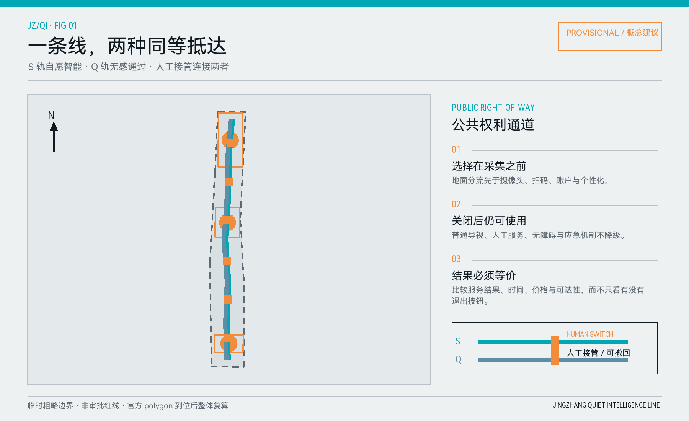
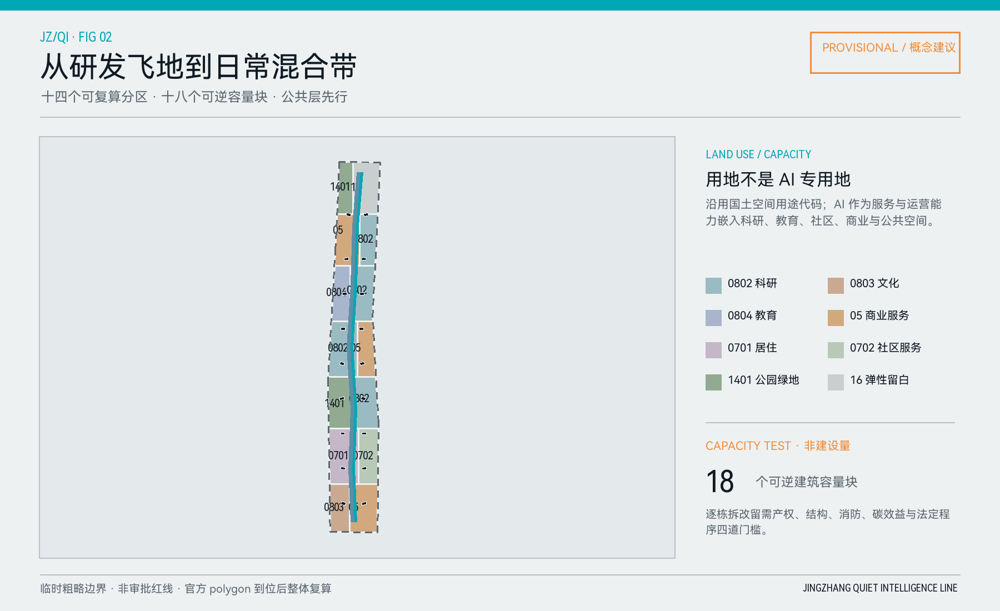
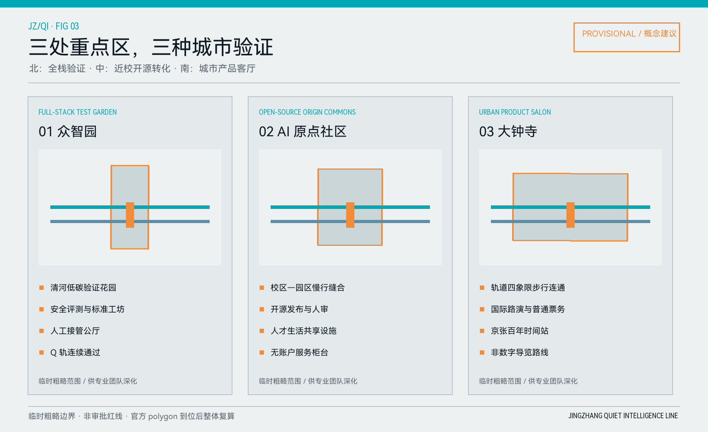
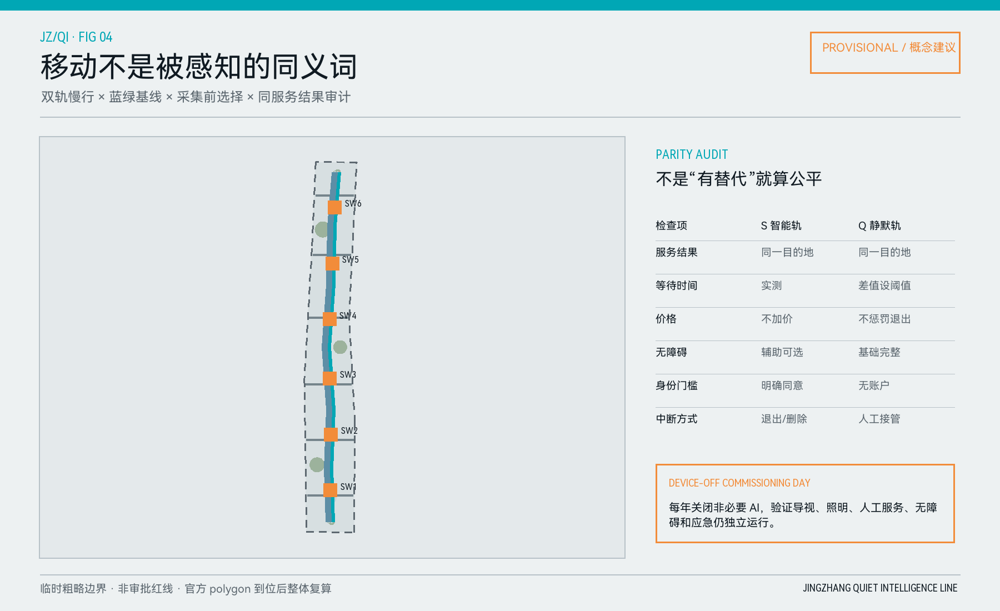
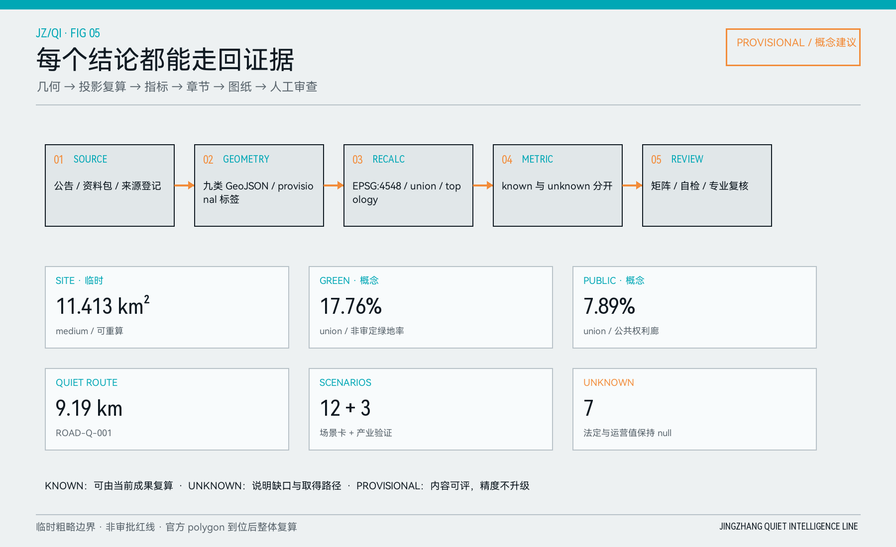

# 京张静智线：可选择智能的城市共同体

**Jingzhang Quiet Intelligence Line · A civic right-of-way for optional intelligence**

本案的判断很直接：未来城市的先进性，不应以居民持续联网、持续被感知为前提。沿百年京张形成一组并行公共权利通道——S 轨提供主动选择的智能服务，Q 轨提供无传感器、无应用程序、无需账户的等价路径；两轨只在有明确告知和人工值守的“选择阈值”发生切换。每个场景必须同时证明采集前看得见选择、服务中看得见状态并能转人工、服务后拿得到退出或删除回执。关闭全部 AI 时，遮阴、照明、导视、座椅、无障碍、人工柜台与应急响应构成不降级的“安静基线”。方案口号是：**智能可以选择，安静可以抵达，服务有人接管。**

## 设计依据与资料清单

本次成果以公开征集公告和仓库内项目资料包为任务依据，以来源登记和 processed fact pack 为检索导航，以临时粗略范围为几何起点。公告说明三层研究范围、三处重点区域和城市设计任务；智能体任务书补充命名、文化叙事、场景、画像、运营与边界条款。资料包没有提供可直接用于审批的正式总体边界、重点区 polygon、完整控规、道路红线、逐栋现状、权属、市政和文保控制，所以本案把“已知”“设计建议”“待确认”分栏处理：可从当前 GeoJSON 计算的值进入 metrics.json；缺少正式依据的容积率、高度、建筑密度、退线、建筑面积和拆除量保持 unknown；所有精确敏感图面均标“临时边界/概念建议”。

专业响应采用 [standard:PROJECT-OFFICIAL-ANNOUNCEMENT]、[standard:PROJECT-AGENT-OPEN-CALL-TASKBOOK]、[standard:MOHURD-URBAN-DESIGN-MEASURES]、[standard:MOHURD-CONTROL-DETAILED-PLANNING]、[standard:MNR-LAND-USE-CLASSIFICATION-GUIDE]、[standard:MOHURD-ARCH-DESIGN-DEPTH-2016]。任务和几何证据分别来自 [source:OFFICIAL-ANNOUNCEMENT]、[source:AGENT-TASKBOOK]、[source:SITE-PACKAGE]、[source:SOURCE-REGISTRY]、[source:PROCESSED-FACT-PACK]、[source:BOUNDARY-SOURCE]、[source:KEY-AREA-SOURCE]，并由 [depth:existing_conditions_diagnosis] 检查现状诊断与资料缺口。`data/source_registry.json` 只决定资料能否使用，不把处理后的摘要升级为新权威来源。

提交中的 [data:geometry/site_boundary.geojson#SITE-001] 和 [data:geometry/key_areas.geojson#PROV-KEY-001] 均沿用仓库登记的 provisional constraint，`official_boundary=false`。它们可支撑概念比较、拓扑自检和复算流程，但不能解释为官方红线、地块边界或审批依据。官方 polygon 到位时，必须以同一脚本重新裁切 land use、building、road、green、public space、phase 和 scenario zone，再更新所有面积、图纸与哈希，而不是只改一个数字。

## 三层范围工作框架

三层范围采用“战略—结构—原型”递进，而不是把一张总图按比例放大。统筹研究范围回答 AI 产业链、人才链、公共服务链和文化传播如何在海淀协同；总体设计范围把协同关系落到京张沿线的用地、慢行、蓝绿、更新与公共服务骨架；三处重点区域以可运营空间原型检验研发、转化、国际交往和居民日常能否共存。每一层都设同一底线：智能服务必须可拒绝，拒绝后仍能获得同一公共服务结果，故治理原则不是附录，而是总体结构的一部分。

[depth:three_level_scope_framework] 负责三层分工，[depth:overall_spatial_structure] 负责双轨结构落图。总体设计范围按当前临时几何计算约 11.413 平方公里 [metric:site_area_sqm]；重点区数量为三处 [metric:key_area_count]，但其面积不用于新的审定结论。总体结构概括为“**一线、双轨、三站、六阈值、十二场景**”：一线是京张公共文化与绿色骨架；S/Q 双轨分别承载自愿智能与无感通过；三站对应众智园、原点社区、大钟寺；六个阈值在采集前分流；十二个场景把技术、人工和退出流程共同落点。

图层体系把框架变成可核验对象：总体与重点边界见 [data:geometry/site_boundary.geojson#SITE-001]、[data:geometry/key_areas.geojson#PROV-KEY-002]；用地和容量测试见 [data:geometry/land_use.geojson#LU-001]、[data:geometry/buildings.geojson#BLDG-001]；公共权利通道见 [data:geometry/roads.geojson#ROAD-S-001] 与 [data:geometry/roads.geojson#ROAD-Q-001]；运营场景和分期见 [data:geometry/constraints.geojson#SCENE-01]、[data:geometry/phasing.geojson#PHASE-001]。该结构在正式边界替换后仍可保持逻辑连续。

## 统筹研究范围产业与未来城市研究

产业策略从“展示 AI”转为“验证 AI 如何被城市可靠使用”。上游以高校和科研平台形成模型、芯片、数据与开源策源，中游以评测、安全、合规、知识产权和场景撮合形成共享服务，下游在交通、医疗、教育、法律、消费、设施运维和文化导览中进行小规模、可撤回验证。三处重点区分别承担全栈自主验证、近校成果转化和城市级产品体验；企业取得的不是不受约束的试验场，而是一份包含空间、数据、人工、时段、退出和复盘条件的“场景合同”。

六个官方来源案例只抽取机制，不复制形态：Helsinki 的开放三维底图提示共同事实层 [source:HELSINKI-3D]；Amsterdam 的算法登记提示谁在何处使用何种系统必须可查 [source:AMSTERDAM-ALGORITHM-REGISTER]；Punggol 的开放数字平台提示跨系统测试需要统一接口 [source:PUNGGOL-OPEN-DIGITAL-PLATFORM]；Barcelona Decidim 提示公众意见和响应应可追踪 [source:BARCELONA-DECIDIM]；AI Verify 提示上线前要有可重复测试 [source:SINGAPORE-AI-VERIFY]；Seoul Smart City Center 提示展示、验证和公共沟通可以共址 [source:SEOUL-SMART-CITY-CENTER]。这些均为背景研究，不代表本项目已采用相应制度；相关限制记录在 assumptions.json 的 A-CASES-001。

未来城市形态因此不是高密传感器景观，而是“技术层可替换、公共层不断供”。地面层优先连续步行、骑行、遮阴、雨洪和人工服务；可选智能层通过预约或现场选择进入；运营层记录模型版本、服务中断、人工接管、投诉与恢复。产业评价不只看企业数量，还看三个公共绩效：安静基线是否保持、选择是否发生在采集之前、非 AI 路径与 AI 路径的结果/时间/价格/无障碍差距是否收敛。后者在没有运营样本前保持 unknown，而不是预填漂亮分数。

## 总体设计范围城市更新与控规深度城市设计

总体结构把狭长的京张走廊视作连续城市缝合器。十四个用地单元 [metric:land_use_zone_count] 由临时 site polygon 直接分割，完整覆盖且互不叠压；北段偏向众智园研发、清河绿廊和弹性留白，中段组织原点社区近校转化、开源教育与企业服务，南段连接人才生活、大钟寺国际交往和京张文化界面。用地代码全部来自资料包允许集合，几何在 [data:geometry/land_use.geojson#LU-001]，对应 [standard:MNR-LAND-USE-CLASSIFICATION-GUIDE] 与 [depth:land_use_layout]。

十八个建筑容量测试块 [metric:building_capacity_block_count] 只用于检验公共空间、慢行和功能混合的承载关系，其联合基底面积见 [metric:building_footprint_area_sqm]。它们不声称是现状建筑，也不生成拆除决定；`intervention_status=capacity_test_only`、`demolition_decision=false`。开发强度、总建筑面积、建筑高度、建筑密度和退线均保持 unknown，由 [depth:development_intensity_controls]、[depth:height_massing_character] 记录“已完成深度响应但结论待资料”，这比用假设层数推导伪精确规模更适合后续专业团队接续。

更新方法是“小单元、可逆、先公共后建设”。先用地面标线、导视、树阵、可移动人工柜台和可拆卸遮阴测试 S/Q 双轨；再在三重点区推进低效界面、首层公共性、慢行断点和服务设施更新；最后才依据正式控规、交通、市政、消防、文保和产权条件决定建筑实施。总体空间、公共空间和建筑风貌共同响应 [standard:MOHURD-URBAN-DESIGN-MEASURES]、[standard:MOHURD-CONTROL-DETAILED-PLANNING]，不是以一张效果图替代控规接口。

## 重点区域详细设计

**众智园 AI 自主创新加速区**定位为“全栈验证花园”。沿清河侧优先连续绿荫、雨洪与无感通过，内侧布置模型安全评测、端侧设备联合调试、标准工作坊和人工接管公厅。产业测试不是封闭园区演示：每次测试需公开时段、设备范围、退出路线和停止条件；Q 轨连续通过，S 轨进入前出现选择阈值。空间证据沿用 [data:geometry/key_areas.geojson#PROV-KEY-001]，正式线位需等待官方重点区边界和工程专项。

**北京 AI 原点社区**定位为“近校开源转化共同体”。校区—园区—社区之间以全天候步行与骑行缝合，首层组织开源发布、成果转化、知识产权、企业服务、人才生活和居民共享设施。静默共享厅提供纸质预约、人工问询和无账户服务；开源发布厅可以使用翻译、检索和无障碍辅助，但所有输出都由发布者确认。这里检验“技术能否帮助协作而不把参与门槛变成装应用程序”，见 [data:geometry/key_areas.geojson#PROV-KEY-002]。

**大钟寺 AI 产业聚集区**定位为“城市级智能产品客厅”。围绕轨道接驳、四象限步行连续、企业展示、内容消费和国际交流设置公共路演与长期展陈，同时保留清晰的非数字导览、人工票务与普通消费通道。京张记忆站把铁路时间、工程精神和中关村创新史组织为可步行叙事；任何个性化讲解均为选择项。范围证据见 [data:geometry/key_areas.geojson#PROV-KEY-003]。

三处原型由 [depth:three_key_area_detailed_design] 统一检查，均至少回答功能、建筑接口、交通慢行、蓝绿公共空间、AI 场景、人工接管、实施依赖和退出方式。三者不是三座孤立“AI 岛”，而通过约 9.19 公里的 Q 线 [metric:quiet_route_length_m] 与 S 线、东西向公共支线相连。重点区图面均带 provisional 标签，避免矩形临时范围被误读为街坊或道路红线。

## AI 创新生态、人才画像与 AI+ 场景

六类需求画像 [metric:persona_count] 不描述具体个人：研发工程师需要可预约测试与安静专注；初创团队需要低成本合规、算力和首个城市客户；高校师生需要跨校协作、成果发布和日常慢行；国际访客需要多语导览、普通票务和人工服务；周边居民需要低扰动休闲、社区服务与明确投诉通道；一线运维人员需要可解释工单、设备断网后手动操作和明确责任。所有画像只用于空间需求，不用于行为追踪或商业推荐。

十二张场景卡 [metric:scenario_card_count] 均写入 [data:geometry/constraints.geojson#SCENE-01] 至 SCENE-12：01 静默优先通勤导航；02 开源发布与人审服务；03 低速配送共路测试；04 清河低碳设施巡检；05 近校成果转化助手；06 社区健康人工转接；07 知识产权服务柜台；08 大钟寺国际访客导览；09 无障碍路径协同；10 夜间安静基线监测；11 城市维护工单助手；12 设备关闭联合调试日。其中 02、03、04 为三类产业测试验证场景 [metric:industry_test_scenario_count]：分别验证模型/内容的人审流程、机器人与行人的停止规则、设施诊断与人工工单闭环。

每张卡共用“三段证明”。Before：在摄像头、扫码或账户发生前，用地面 S/Q 标识说明数据种类、目的、时长和普通路径；During：显示系统正在运行、模型/运营方、人工柜台位置和紧急停止；After：提供退出、删除、纠错或恢复回执。若 Q 轨的等待时间、价格或无障碍条件明显劣于 S 轨，则不算“有选择”。运营期以 choice_parity_gap_index 测量归一化服务等价差，但当前缺少运行样本，保持 unknown。

三座“城市朝圣地标” [metric:pilgrimage_landmark_count] 构成文化叙事：北端“工程验证庭”致敬京张铁路的工程求真；中段“开源原点台”展示可复现贡献而非明星崇拜；南端“百年时间站”并置铁路、城市与 AI 的时间尺度。地标以公共空间、展陈和年度档案构成，不以巨大新建物制造负担。对应场景深度和风险分别由 [depth:municipal_new_infrastructure]、[depth:risk_missing_data] 约束。

## 用地、建筑规模与拆改留方案

用地以科研、文化、教育、居住、社区服务、商业、公园绿地和留白构成混合序列。每个分区都用 `land_use_code` 表达，不能用“AI 用地”等自造类别替代法定分类接口。当前用地结构是概念分区，不改变既有土地权属和用途；正式深化应将官方地块、现状用地和控规图则叠加后，逐块形成“保持、微更新、功能置换、综合更新、留白”建议，并记录依据和审批路径。

建筑拆改留采用四道门槛：第一道是产权与现状调查；第二道是结构、消防、节能和历史价值评估；第三道是公共利益与全寿命碳比较；第四道是法定程序和公众沟通。任一门槛缺失，不进入拆除清单。因此 [data:geometry/buildings.geojson#BLDG-001] 只表达十八个可逆容量块，总基底 [metric:building_footprint_area_sqm] 用于检验街廓开敞关系，不是批准建设规模。[depth:retain_renovate_demolish] 的完成含义是“方法、证据门槛和缺口已明确”，不是“逐栋决定已完成”。

风貌控制强调“轨道尺度、安静界面、可读技术”。建筑首层优先连续檐下、可开闭公共房间与人工服务；设备避免占用主要步行界面，传感状态以低眩光、可理解的标识表达；屋顶设施成组遮蔽并预留维护路径；面向京张遗址与绿廊的体量保持分段和通透。具体高度、贴线率、间距和天际线需经正式控规、景观视廊、文保与日照分析后确定，响应 [standard:MOHURD-ARCH-DESIGN-DEPTH-2016] 的资料缺口提醒。

## 交通、轨道、市政与公共服务设施

交通体系包含 S 感知可选轨、Q 无感通过带和六条东西向公共支线 [metric:choice_switch_count]。两条纵向线路不是两套等级不同的道路：S 轨可提供自愿导航、拥挤提示、无障碍协同或低速接驳；Q 轨依靠普通导视、连续铺装、可触知信息和人工问询完成同一到达任务。六处选择阈值设在数据采集之前，而不是用户走进感知区后再提供退出按钮。全部线网概念长度见 [metric:road_network_length_m] 与 [data:geometry/roads.geojson#ROAD-Q-001]。

轨道站点和重点路口优先落实“到站—过街—停放—入口—人工台”的连续链：地面过街与无障碍先于复杂的自动接驳；自行车停放靠近入口但不挤占盲道；活动日以预约流量为辅助、人工疏导为兜底；低速机器人采用限时、限速、让人优先和现场停止员。由于缺少完整客流、出入口、停车和路网模型，本案不写道路红线宽度、停车配建或通行能力定值，由 [depth:traffic_rail_slow_parking] 留出专项接口。

市政与新型基础设施采用“断网仍安全”原则。照明、雨洪、能源、充电、边缘计算和设施巡检均需本地手动模式、故障可见、数据最小化和明确维护主体；公共服务设人工柜台、电话/纸质渠道、普通支付与无障碍替代。社区健康场景只做导航和转接，不作自动诊断；法律与知识产权场景只做材料辅助，不替代专业意见；公共安全场景只做信息汇总，不自动作出处置决定。这些设施在 [data:geometry/constraints.geojson#SCENE-06] 落点，并由 [depth:municipal_new_infrastructure] 管理深化。

## 蓝绿空间、公共空间与城市风貌

蓝绿结构以京张连续公园、清河低碳花园、原点社区开源草坪和大钟寺雨洪静园组成。联合概念面积为 [metric:green_space_area_sqm]，相对临时总体范围的比例约 17.76% [metric:green_ratio]；这些数值来自 [data:geometry/green_space.geojson#GREEN-001] 与 site polygon 的投影复算，不作为审定绿地率。植物、海绵设施、河道条件和地下管线仍需生态、市政和水务专项校核。

公共空间以双轨公共权利廊、六处选择阈值广场和三处重点区共享公厅构成，联合概念面积为 [metric:public_space_area_sqm]、比例约 7.89% [metric:public_space_ratio]，空间记录在 [data:geometry/public_space.geojson#PUBLIC-001]。每处至少有连续遮阴、座椅、饮水、卫生间导向、无障碍信息和人工帮助；AI 装置必须可绕行、可关闭、可说明。夜间“安静时窗”降低屏幕、播报和试验频率，保障居民日常与遗址气质。

城市风貌的识别不靠蓝色发光屏，而靠铁路工程语言：里程、双线、道岔、时刻表、铆接尺度与低饱和矿物色。Signal Cyan 表示自愿智能，Human Amber 表示人工接管，Quiet Blue 表示无感通道，Moss 表示蓝绿基线。所有关键图纸都同时显示图例、来源和 provisional 提示，防止设计图被截取后脱离语境。[depth:blue_green_public_space] 与 [depth:height_massing_character] 共同约束地面、建筑界面和长期维护。

## 更新项目清单、实施政策与分期计划

更新项目形成八项可独立启动、可暂停复盘的工作包：JZ-01 双轨地面标识与普通导视；JZ-02 六处选择阈值与人工服务台；JZ-03 三处重点区首层公共界面微更新；JZ-04 清河—京张连续蓝绿修补；JZ-05 轨道站点步行、骑行和无障碍断点整治；JZ-06 三类产业验证场景；JZ-07 算法/设备/服务公开登记页与现场告示；JZ-08 年度设备关闭联合调试日。项目位置对应道路、公共空间、绿地、场景和 [data:geometry/phasing.geojson#PHASE-001]，由 [depth:renewal_project_list] 检查证据完整性。

三期策略 [metric:phase_count] 不是固定建设承诺。近期先做可逆公共设施、安静基线普查、纸质/人工渠道、两类路线标识和小规模场景合同；中期在三处重点区同步推进公共界面、交通断点、雨洪与产业服务，并通过公众复盘决定哪些智能功能保留；长期形成年度运营、模型/设备更新、服务等价审计和空间适应性改造。每一期开始前均需满足相应官方边界、控规、权属、交通、市政、消防和文保条件，[depth:phasing_implementation] 记录触发门槛。

长效运营采用“一个月度台账、四个季度动作、一个年度停机日”。月度公开人工接管次数、服务中断、投诉、删除/纠错请求和 Q 轨可用性；一季度审场景合同，二季度做无障碍与服务等价走查，三季度做公共活动和产业测试，四季度审模型/设备续期；年度“设备关闭联合调试日”关闭非必要 AI，验证普通导视、人工服务和应急机制能否独立运行。若关闭后基本服务失效，项目必须先修复基线再扩展智能。

## 指标体系、面积复算与合规矩阵

指标分三组。空间已知组由当前 GeoJSON 直接计算，包括范围、绿地、公共空间、建筑容量基底、路网和 Q 线长度；方案计数组由结构化成果统计，包括分区、容量块、场景、画像、产业验证、地标、选择阈值和分期；法定或运营未知组保持 null，包括容积率、高度、建筑密度、退线、批准拆除、总建筑面积与服务等价差。所有 known 引用集中列为：[metric:site_area_sqm]、[metric:green_space_area_sqm]、[metric:green_ratio]、[metric:public_space_area_sqm]、[metric:public_space_ratio]、[metric:building_footprint_area_sqm]、[metric:road_network_length_m]、[metric:quiet_route_length_m]、[metric:key_area_count]、[metric:land_use_zone_count]、[metric:building_capacity_block_count]、[metric:scenario_card_count]、[metric:industry_test_scenario_count]、[metric:persona_count]、[metric:pilgrimage_landmark_count]、[metric:choice_switch_count]、[metric:phase_count]。任何 known 值均有 source_files、formula、confidence 和 assumptions；任何 unknown 值均有 reason。

[depth:metrics_recalculation] 规定复算顺序：先验证 site 与 key area 的来源角色；再投影至 EPSG:4548；检查用地完整覆盖和重叠；对绿地、公共空间和建筑采用 union 后面积，避免叠加重复；对中心线求长度；最后把结果回写 metrics 和 HTML 的 data attributes。边界面积约 11,412,825 平方米，Q 线约 9.19 公里；由于边界为 provisional，置信度是 medium，不能写成精确官方统计。

合规链由 compliance_matrix.json 覆盖公告与 agent.1-agent.6 共二十三项任务，standard_matrix.json 覆盖六项标准响应，design_depth_matrix.json 覆盖十五个专业深度项。专业深度索引为：[depth:existing_conditions_diagnosis]、[depth:three_level_scope_framework]、[depth:overall_spatial_structure]、[depth:land_use_layout]、[depth:development_intensity_controls]、[depth:height_massing_character]、[depth:retain_renovate_demolish]、[depth:traffic_rail_slow_parking]、[depth:municipal_new_infrastructure]、[depth:blue_green_public_space]、[depth:three_key_area_detailed_design]、[depth:renewal_project_list]、[depth:phasing_implementation]、[depth:metrics_recalculation]、[depth:risk_missing_data]。数据图层索引为：[data:geometry/site_boundary.geojson#SITE-001]、[data:geometry/key_areas.geojson#PROV-KEY-001]、[data:geometry/land_use.geojson#LU-001]、[data:geometry/buildings.geojson#BLDG-001]、[data:geometry/roads.geojson#ROAD-Q-001]、[data:geometry/green_space.geojson#GREEN-001]、[data:geometry/public_space.geojson#PUBLIC-001]、[data:geometry/constraints.geojson#SCENE-01]、[data:geometry/phasing.geojson#PHASE-001]。评审可从正文的任一结论回到 geometry、metrics、sources、assumptions、自检、A3 文册、A0 展板和离线 HTML，避免“只能看图、无法复核”。

## 风险、版权与合规说明

主要风险有六类。第一，临时边界可能造成面积和位置误读，故所有图面反复标注 provisional；第二，缺少控规和逐栋资料可能造成实施误读，故建筑只做容量测试、法定指标保持 unknown；第三，智能服务可能形成隐性强迫，故设置采集前分流、Q 轨、普通支付和人工服务；第四，算法错误和设备中断可能影响安全，故保留人工接管、停止权限和断网手动模式；第五，运营成本可能使非 AI 路径退化，故持续审计结果、时间、价格与无障碍等价；第六，展示与品牌素材可能有版权问题，故所有图表由本案生成、案例只作文字机制研究。

假设和缺口分别记录为 A-BOUNDARY-001、A-CONTROLS-001、A-BUILDING-001、A-MOBILITY-001、A-PARITY-001、A-CASES-001；[depth:risk_missing_data] 负责把缺口转为下一阶段的资料清单。方案不声称获得审批、土地权属、建设规模或实施承诺；所有空间动作均为“概念建议/参考方案/供专业团队深化”。隐私采用最小必要、明确目的、短期保存、现场告知、可撤回和人工复核；涉及健康、法律、公共安全和无障碍的高影响服务不得只由模型决定。

文本、GeoJSON、图表、离线 HTML 与 PDF 由声明的 AI agent 为本次开源征集生成，采用 CC-BY-4.0；来源事实和标准的权利仍归各自发布机构。图表使用 HarmonyOS 系统字体进行本地排版，不嵌入远程资源；网页不含外部脚本、远程地图、追踪器、表单或联网调用。详细说明见 report/copyright_statement.md。[source:SOURCE-REGISTRY] 与 [standard:PROJECT-OFFICIAL-ANNOUNCEMENT] 共同限定事实和成果边界。

## 参考资料

机器可读来源索引：[source:SITE-PACKAGE]、[source:SOURCE-REGISTRY]、[source:PROCESSED-FACT-PACK]、[source:BOUNDARY-SOURCE]、[source:KEY-AREA-SOURCE]、[source:OFFICIAL-ANNOUNCEMENT]、[source:AGENT-TASKBOOK]、[source:HELSINKI-3D]、[source:AMSTERDAM-ALGORITHM-REGISTER]、[source:PUNGGOL-OPEN-DIGITAL-PLATFORM]、[source:BARCELONA-DECIDIM]、[source:SINGAPORE-AI-VERIFY]、[source:SEOUL-SMART-CITY-CENTER]。

专业标准索引：[standard:PROJECT-OFFICIAL-ANNOUNCEMENT]、[standard:PROJECT-AGENT-OPEN-CALL-TASKBOOK]、[standard:MOHURD-URBAN-DESIGN-MEASURES]、[standard:MOHURD-CONTROL-DETAILED-PLANNING]、[standard:MNR-LAND-USE-CLASSIFICATION-GUIDE]、[standard:MOHURD-ARCH-DESIGN-DEPTH-2016]。

空间数据索引：[data:geometry/site_boundary.geojson#SITE-001]、[data:geometry/key_areas.geojson#PROV-KEY-001]、[data:geometry/land_use.geojson#LU-001]、[data:geometry/buildings.geojson#BLDG-001]、[data:geometry/roads.geojson#ROAD-Q-001]、[data:geometry/green_space.geojson#GREEN-001]、[data:geometry/public_space.geojson#PUBLIC-001]、[data:geometry/constraints.geojson#SCENE-01]、[data:geometry/phasing.geojson#PHASE-001]。

设计深度索引：[depth:existing_conditions_diagnosis]、[depth:three_level_scope_framework]、[depth:overall_spatial_structure]、[depth:land_use_layout]、[depth:development_intensity_controls]、[depth:height_massing_character]、[depth:retain_renovate_demolish]、[depth:traffic_rail_slow_parking]、[depth:municipal_new_infrastructure]、[depth:blue_green_public_space]、[depth:three_key_area_detailed_design]、[depth:renewal_project_list]、[depth:phasing_implementation]、[depth:metrics_recalculation]、[depth:risk_missing_data]。

本案还读取 `brief/site-package/design_brief.json`、`allowed_design_space.json`、`agent_taskbook.json`、`ranges/planning_limits.json`、`standards/standards.json`、`data/source_registry.json` 与 `data/processed/agent_fact_pack.md`。国际案例一律链接到发布机构页面，只支持机制研究；正式规划判断仍回到项目公告、资料包、官方后续文件和专业审查。最终交付包括 proposal.md、九类 GeoJSON、metrics/assumptions/sources/三类矩阵、自检、五张核心图、A3 文册、A0 展板、离线报告和离线总览页。
