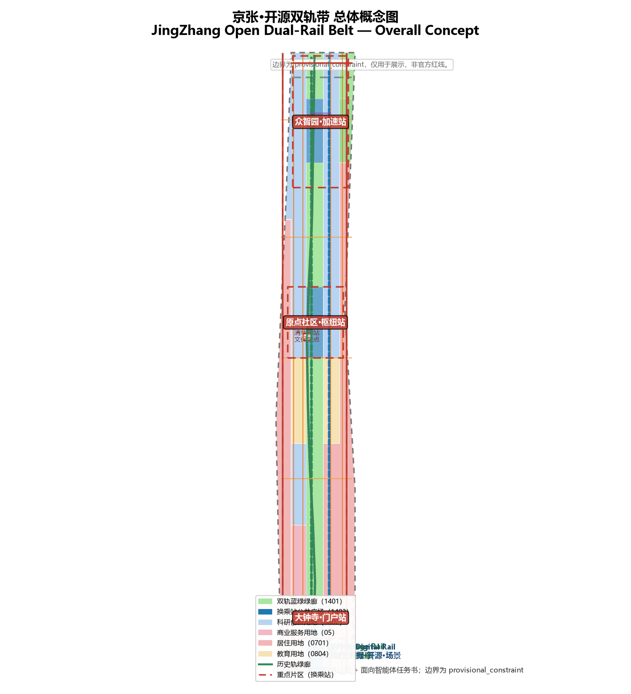
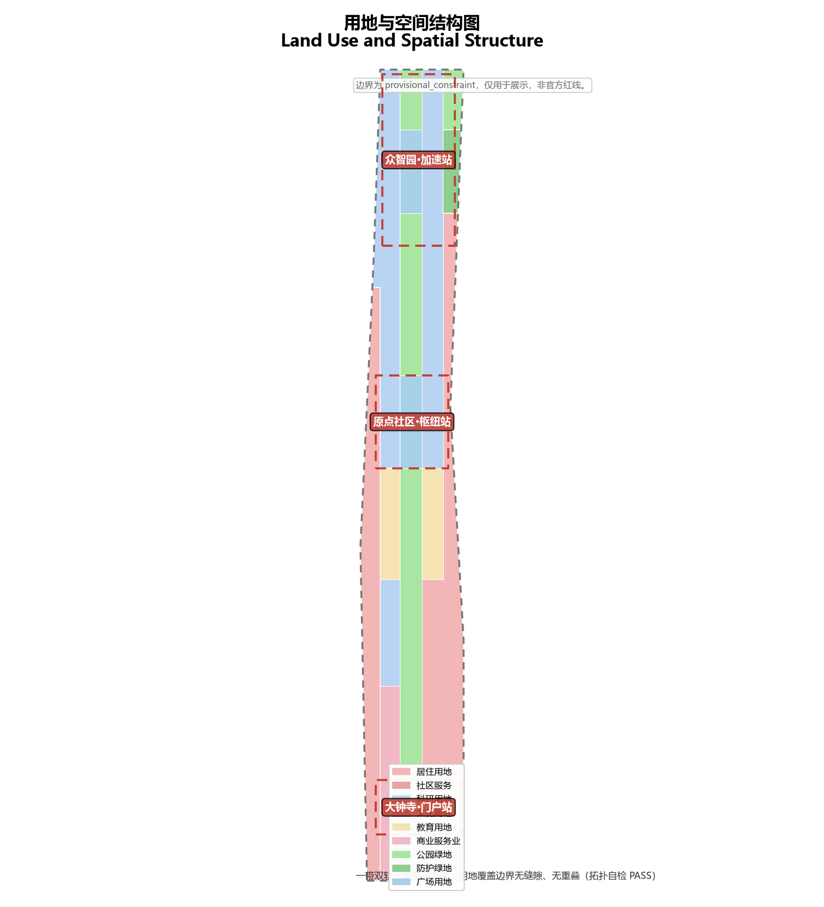
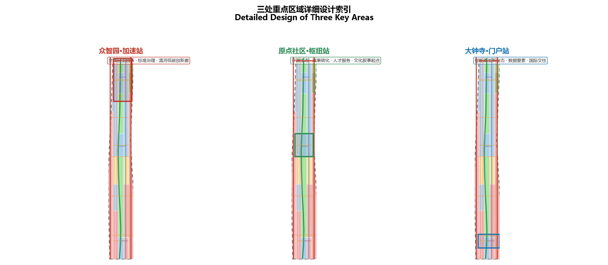
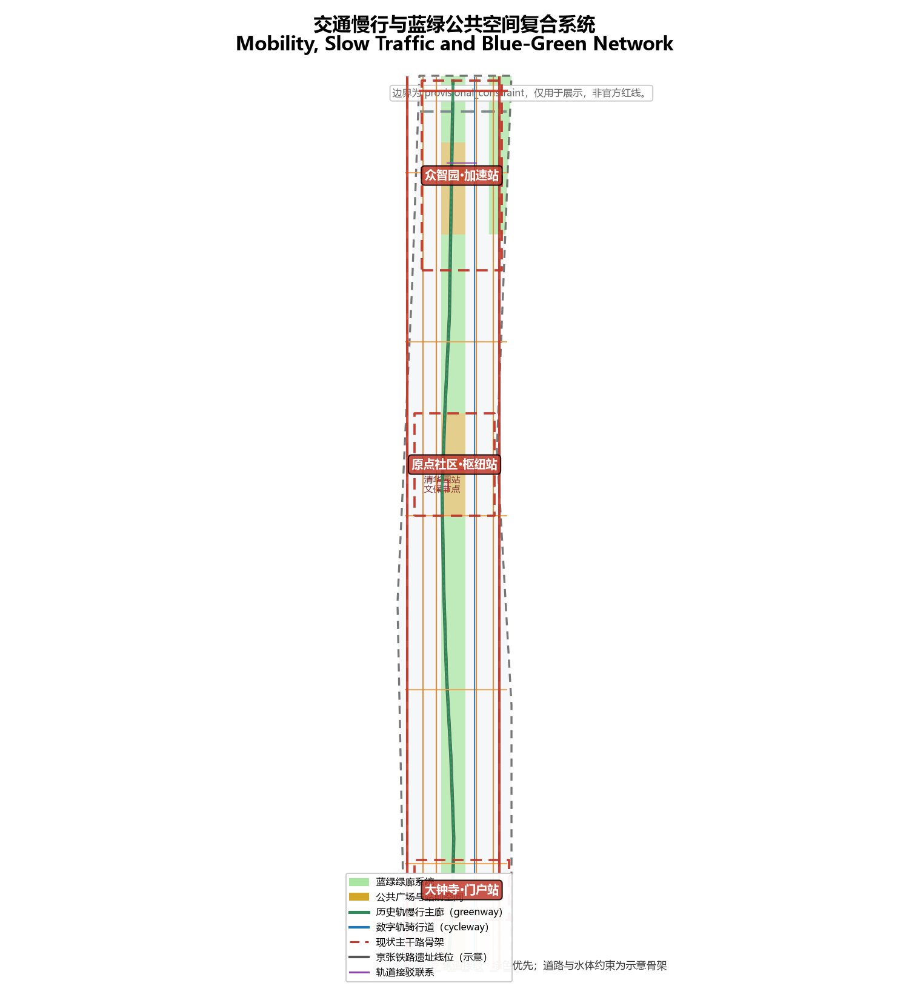
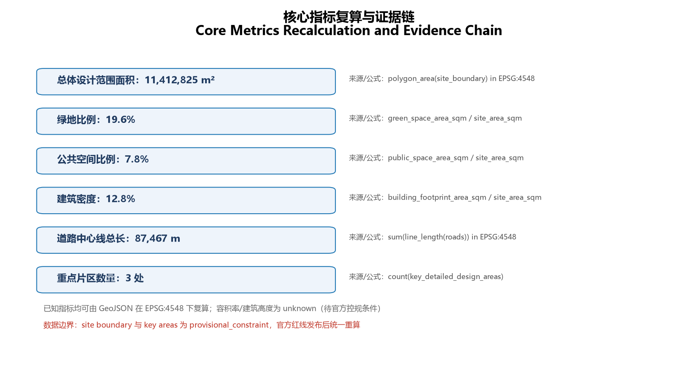

# JingZhang Open Dual-Rail Belt: An Urban Design Co-Written by a Century-Old Railway and AI Innovation

## Design Basis and Source List

This proposal responds to the Centennial Jing-Zhang AI Innovation Belt International Urban Design Open Call. It is an open co-creation output generated by an AI agent, and all spatial data, indicators and matrices can be recalculated from the GeoJSON, JSON and drawings in this package. The first basis is the official qualification pre-announcement issued by the Haidian Branch of the Beijing Municipal Commission of Planning and Natural Resources [source:OFFICIAL-ANNOUNCEMENT]; the second is the agent-facing open-call taskbook digest [source:AGENT-TASKBOOK]. Machine-readable boundaries, enums, ranges and the standards library come from the site package [source:SITE-PACKAGE] and the public source registry [source:SOURCE-REGISTRY].

The proposal uses the provisional boundaries and three key-area polygons in `brief/site-package/geometry/provisional_boundaries.geojson` ([source:BOUNDARY-SOURCE], [source:KEY-AREA-SOURCE]). These boundaries are labelled `geometry_role=provisional_constraint` and `official_boundary=false`; they are for AI generation, visualization and design discussion only and must not be used as an official redline, approval basis or precise-area basis [source:DATA-SRC-PROVISIONAL-BOUNDARIES-20260605]. The processed fact pack [source:PROCESSED-FACT-PACK] helps the agent organize the three scope levels, three key areas, six agent tasks and the missing-data checklist into a readable proposal. Background reasoning on population, education and talent cites the National Bureau of Statistics public statistical framework [source:NBS-OFFICIAL-STATS] as background only, not as a spatial-control conclusion.

Depth and standard responses follow [standard:PROJECT-OFFICIAL-ANNOUNCEMENT] and [standard:PROJECT-AGENT-OPEN-CALL-TASKBOOK]; urban design coordination follows [standard:MOHURD-URBAN-DESIGN-MEASURES]; regulatory-plan depth follows [standard:MOHURD-CONTROL-DETAILED-PLANNING]; land-use classification follows [standard:MNR-LAND-USE-CLASSIFICATION-GUIDE]; and deliverable depth references [standard:MOHURD-ARCH-DESIGN-DEPTH-2016]. The existing-conditions diagnosis is governed by [depth:existing_conditions_diagnosis]; boundary trust is supported by [data:geometry/site_boundary.geojson#SITE-001] and [data:geometry/key_areas.geojson#PROV-KEY-001]; and area recalculation corresponds to [metric:site_area_sqm] and [metric:key_area_count].

The readable interpretation of the boundary and key areas corresponds to [data:geometry/site_boundary.geojson#SITE-001], [data:geometry/key_areas.geojson#PROV-KEY-001], [data:geometry/key_areas.geojson#PROV-KEY-002] and [data:geometry/key_areas.geojson#PROV-KEY-003]. Readers can return from the narrative to the GeoJSON for provenance, to the metrics for recalculation and to the sources for data boundaries. All design judgments follow the principle of "discussable, reviewable, and recalculable after official geometry is supplied". When the official redline is published, the site boundary, key areas, land use, roads, green and public space, buildings, phasing and all area indicators must be recalculated; this organizer data gap does not block content scoring.

## Three-Level Scope Framework

The proposal is organized by the three scopes defined in the announcement. The coordinated research area, about 43.6 km2, addresses the AI industry ecology, strategic positioning, innovation chain and future city form. The overall design area, about 11.4 km2, covers the urban and industrial areas within 1–2 km around the Jing-Zhang heritage park and requires regulatory-plan-level urban design depth. The key detailed-design area, about 368.4 hectares, covers the Zhongzhiyuan AI Self-Reliance Acceleration Area, the Beijing AI Origin Community and the Dazhongsi AI Industry Cluster, and requires implementation-plan-level urban design depth [source:OFFICIAL-ANNOUNCEMENT].

The three scopes are expressed in [data:geometry/site_boundary.geojson#SITE-001], [data:geometry/key_areas.geojson#PROV-KEY-001] through [data:geometry/key_areas.geojson#PROV-KEY-003] and [data:geometry/phasing.geojson#PHASE-001]. Depth is governed by [depth:three_level_scope_framework] and [depth:overall_spatial_structure], and the task basis follows [standard:PROJECT-OFFICIAL-ANNOUNCEMENT]. The three levels are not isolated drawing sets: the coordinated research level decides the industrial chain and city-form judgment, the overall design level translates these into renewal projects, spatial structure and infrastructure, and the key-area level verifies the implementability of plots, buildings, transport, public space and AI scenarios. No area, ratio, scale or project count that cannot be recalculated from structured data may be written as a formal conclusion.

At the overall-concept level the proposal introduces the "JingZhang Open Dual-Rail Belt" (DualRail). The first rail is the Heritage Rail — the century-old Jing-Zhang railway heritage park, serving as the physical main axis of culture, public space and green slow traffic. The second rail is the Digital Rail — the virtual main axis of data, compute, open-source collaboration and AI scenarios running parallel to the Heritage Rail. The two rails run south from Qinghuayuan Station to Dazhongsi, with three "interchange station" cores along the line: Zhongzhiyuan (Acceleration Station), the Beijing AI Origin Community (Hub Station) and Dazhongsi (Gateway Station). The naming system centres on "parallel rails"; the English name DualRail carries the double meaning of two rails and Open, Reusable, Iterative. The Logo direction combines two parallel rail lines with a "人" (herringbone) switchback arrow, honouring Zhan Tianyou's herringbone switchback at Badaling — where historical wisdom and innovation meet, and echoing the "fork-and-merge" rhythm of open-source collaboration.

## Coordinated Research Area: Industry and Future City Research

The core task of the coordinated research area is to build a world-class AI innovation ecosystem. Using the "dual rail" as the organizing metaphor, the proposal arranges the innovation chain along two parallel axes: one is the physical spatial axis (universities, parks, stations and public space) and the other is the virtual factor axis (compute, data, open-source code and test scenarios). The two axes meet at three interchange stations to form an "origination–acceleration–conversion–experience" loop. The agent-facing taskbook requires a response to the three positions (Centennial Jing-Zhang Culture Belt, Urban AI Life Experience Belt, AI-Integrated Innovation Belt) and five functions (AI full-stack self-reliance system, world-class AI innovation ecology, AI+ scenario empowerment paradigm, intelligent AI vibrant city, and global discourse power in AI governance). This section cites [source:AGENT-TASKBOOK] and [standard:PROJECT-AGENT-OPEN-CALL-TASKBOOK] to indicate that these requirements come from the open-call task rather than statutory planning controls.

To support the ecosystem judgment, the proposal comparatively studies eight domestic and international science cities, technology parks and innovation districts, distilling lessons for Haidian across the four stages of "origination–conversion–living–operation":

| Case | Type | Key mechanism | Lesson for Haidian |
| --- | --- | --- | --- |
| Kendall Square, Cambridge | University-originated innovation district | MIT-anchored dense mix of R&D, conversion, offices and commerce; a 15-minute walk from "idea–validation–funding" | The Origin Community should emphasize near-campus origination, mixed blocks and walkable coupling of conversion stations |
| Singapore one-north | Government-led science city | Industrial parks, public living rooms and life services integrated; themed clusters | Zhongzhiyuan should adopt a "garden-style full-stack district" with a public living room for exchange and display |
| Silicon Valley / Stanford Research Park | Industry-university-capital type | University land policy, venture capital and headquarters in a spatial loop | The Zhongguancun Technology Service Wing carries capital and factor allocation, reinforcing the "university–capital–enterprise" loop |
| Shenzhen Nanshan / Shenzhen Bay | Hardware-iteration park | Rapid prototyping, supply-chain agglomeration and entrepreneurial culture | Dazhongsi should develop intelligent terminals and content consumption, iterating through scenarios |
| Shanghai Zhangjiang | Large-science-facility type | Gradient conversion of large facilities, R&D platforms and industrial acceleration | Supports Haidian's "full-stack self-reliance" platform and standards-governance logic |
| Paris Station F | Single-landmark incubator | A mega-incubator in urban renewal with global investment attraction and roadshows | Strengthen Dazhongsi's international roadshow living room as "landmark + attraction + conversion" |
| East London Tech City | Industrial-heritage renewal type | Renewal of industrial heritage with the creative economy; low-cost space breeding grassroots innovation | The heritage-park surroundings should preserve low-disruption renewal and maker space |
| Tel Aviv / Berlin | Open-source community type | Open-source communities, global developer networks and open-test culture | Build open-source publishing halls, code walls and developer operation with global remote participation |

These cases yield **transferable mechanisms** for Haidian: near-campus origination, mixed functions, public living rooms, open test scenarios, global developer networks, and capital-and-factor allocation. These mechanisms are translated into the R&D land in [data:geometry/land_use.geojson#LU-001], public living rooms in [data:geometry/public_space.geojson#PUBLIC-001], innovation green belts in [data:geometry/green_space.geojson#GREEN-001] and the AI scenario nodes corresponding to [metric:ai_scenario_node_count].

Synthesizing the cases, the proposal sets out a **development philosophy suited to Haidian**: "one axis, two rails; open source as method; scenario as field; talent as foundation; co-governance as principle". One axis and two rails means the Jing-Zhang heritage park as the main axis with the Heritage Rail and Digital Rail in parallel; open source as method means treating urban design, data and decision processes as open, contributeable, versionable objects; scenario as field means using real, experienceable AI scenarios as the physical field where innovation happens; talent as foundation means deriving space and services from the needs of developers, entrepreneurs and residents; and co-governance as principle means upholding public-interest priority and final human judgment. These five principles run through naming, blocks, public space, cultural narrative and long-term operation, forming the urban-design core that distinguishes the belt from an ordinary park [source:AGENT-TASKBOOK].

### Envisioning the AI-Adaptive New City Form

The proposal summarizes the AI-adaptive new city form into three layers — **AI culture, AI society and AI city** — each with deployable scenarios.

**AI culture**: grounded in open-source culture, building code walls, open-source publishing halls, public digital art and the developer honor system; embedding renewable digital public art and AI-generated art in underpass spaces, station nodes and building interfaces along the heritage park, juxtaposing "railway nostalgia" with "algorithmic future" as the belt's distinctive cultural temper [depth:blue_green_public_space].

**AI society**: upholding human-centric governance and digital literacy, establishing a "digital-literacy corridor" (AI literacy learning points for residents, students and the elderly), accessible and age-friendly AI services, and explainable human-review mechanisms; affirming data minimization, public sources and public-interest priority, with agents only augmenting human capacity and never replacing final human judgment [depth:risk_missing_data].

**AI city**: exploring a "City as a Service" operation paradigm — treating transport, public services, innovation services and infrastructure as orchestrated city-service portfolios dispatched by agents under human supervision; advancing "dynamic zoning and scenario-driven city operation" so the belt responds differently across event, commuter and daily periods [depth:overall_spatial_structure].

**Deployable scenario list** (as conceptual suggestions and deepening directions): open-source publishing hall and code wall, safety-governance sandbox, edge-compute station, AI slow-traffic navigation, AI health station, AI education experience point, robot-guided tours, campus low-speed shuttle, unmanned-delivery corridor, data-factor living room, international roadshow living room, agent contribution honor wall, and the DualRail Festival route. These scenarios are phased as "pilot first, then scale", with explicit data, privacy, safety and operation responsibilities [metric:ai_scenario_node_count].

### A Perceptible Urban Experience

To make the concept perceptible, the proposal designs a **walkable experience line from Qinghuayuan Station to Dazhongsi Station**: visitors read the century of railway narrative at the Qinghuayuan heritage node (light of heritage), walk the dual-rail greenway past the Origin Community code wall and open-source publishing hall (light of collaboration), experience the AI education point and robot-guided tours in the campus area (light of learning), visit the safety-governance sandbox and low-carbon compute display at Zhongzhiyuan (light of governance), and arrive at the Dazhongsi international roadshow living room and data-factor living room (light of the future). Along the line, bilingual station signage, renewable digital-art installations, accessible slow traffic and rest nodes turn the "pilgrimage journey" into a walkable, experienceable, shareable public route [depth:blue_green_public_space]. Future-city-form research thereby moves from abstract concepts to concrete spatial experience: the proposal puts forward four future-city components — edge-compute service stations, slow-traffic smart navigation, open-source publishing halls and safety-governance sandboxes — implemented as locatable functional zones, nodes and corridors [depth:overall_spatial_structure].

Naming and visual identity serve the overall recognizability of the belt. The **brand identity system** (the core output of agent.1) is organized in four layers. Layer one, the **master brand**: the Chinese name "京张·开源双轨带" and the English name DualRail Open Belt, further distilled into a "DualRail / 双轨" wordmark. Layer two, the **logo mark**: two parallel rail lines form the dual-rail baseline, with a "人" herringbone arrow folding in at the end — the two rails signify the parallel Heritage Rail and Digital Rail, the herringbone switchback honours Zhan Tianyou's Badaling alignment and echoes the "fork-and-merge" rhythm of open-source collaboration; the mark can scale and deform across "station signage", "code wall" and "event poster" contexts while preserving the baseline. Layer three, **colour and type**: a primary palette of Jing-Zhang heritage rust (rust red #B7410E) and AI technology cyan-blue (#1F77B4), with open-source green (#2E8B57) and railway black (#222222); a bilingual sans-serif dual-weight type system that stays legible and scalable in international communication. Layer four, the **application system**: three interchange-station signage, dual-rail greenway wayfinding, code walls and contribution honor walls, DualRail Festival event branding, and public-art installations [depth:overall_spatial_structure]. The Logo and wayfinding are directional designs only; all fonts, graphics and trademarks must be cleared before use [depth:risk_missing_data].

Regional synergy is another focus of the coordinated research (the regional-synergy review dimension). The proposal sets out explicit innovation interfaces with **Beiwei (Beifu) Community, Future Science City, Huairou Science City, Beijing Economic-Technological Development Area (BDA) and the Beijing–Tianjin–Hebei region**: Beiwei Community shares international talent living and services; Future Science City and Huairou Science City absorb spillovers from basic research and major science facilities, forming an "origination–acceleration" relay; the BDA takes up pilot-scale production and intelligent-manufacturing amplification of smart terminals; and Beijing–Tianjin–Hebei shares scenario-scale application and industrial-chain division. These synergies are expressed through a "rail + factor" dual channel — the Heritage Rail provides a talent-commuting and exchange corridor, and the Digital Rail provides a shared corridor for compute, data and open-source code [source:AGENT-TASKBOOK]. On planning innovation, the proposal introduces an "**open-source planning method**": treating the boundaries, layers, indicators and decision processes of urban design as open, reusable, contributeable, versionable objects, and organizing interdisciplinary co-creation through a "fork–merge–contribute" loop — consistent with the open-call nature of this agent-driven solicitation and a direction for territorial spatial-planning innovation [depth:overall_spatial_structure].

The coordinated research does not add a pseudo-precise redline; it connects back to land use and public-space layers through [standard:MOHURD-URBAN-DESIGN-MEASURES], showing that the industrial strategy ultimately lands in visible and reviewable spatial structure.

## Overall Design Area: Urban Renewal and Regulatory-Plan-Level Urban Design

The overall design area requires regulatory-plan-level urban design depth. Within 11.4 km2, the proposal sets out a "belt–dual-rail–three-cores–two-wings–multi-nodes" spatial structure: the belt is the Jing-Zhang heritage park vitality belt; the two rails are the Heritage Rail green corridor and the Digital Rail innovation axis; the three cores are the three key areas; the two wings are the western Zhongguancun Technology Service Wing and the eastern Xiaoyuehe Scenario Empowerment Wing; and the multi-nodes are scattered AI scenario nodes and public-service facilities. The structure is expressed in [data:geometry/land_use.geojson#LU-001], [data:geometry/buildings.geojson#BLDG-001], [data:geometry/roads.geojson#ROAD-001] and [data:geometry/phasing.geojson#PHASE-001].

The urban renewal framework follows the principle of "retention first, renovation and upgrade, incremental renewal, low-disruption implementation". Existing R&D, campus and residential land is retained and functionally upgraded; underperforming industrial land and scattered open plots receive land consolidation and embedded public services. No parcel-level retain/renovate/demolish conclusion is given without ownership and existing-conditions data. Building footprint area and density are recalculated from [data:geometry/buildings.geojson#BLDG-001] and [metric:building_footprint_area_sqm], [metric:building_density]; land-use structure follows [standard:MNR-LAND-USE-CLASSIFICATION-GUIDE]. Development intensity and building height are statutory control indicators; where official regulatory-plan conditions are absent they are marked unknown, governed by [depth:development_intensity_controls] and [metric:floor_area_ratio], [metric:building_height_control_m], and are never presented as approved indicators.

The industrial functional layout follows the "three areas and two wings": Zhongzhiyuan carries full-stack self-reliance innovation and standards governance, the Origin Community carries open-source ecology and conversion, and Dazhongsi carries AI-native new business forms and international exchange; the Zhongguancun Technology Service Wing hosts factor allocation and capital empowerment platforms, and the Xiaoyuehe Scenario Empowerment Wing hosts AI+ life, health and education scenarios [source:AGENT-TASKBOOK]. Industrial space, innovation service platforms, talent living services and new infrastructure are supported by [data:geometry/land_use.geojson#LU-001] and [data:geometry/constraints.geojson#CONSTRAINT-ROAD-001]. The overall design also responds to the vitality belt and urban character: the belt is embodied by green corridors, slow traffic, public activities and heritage display [depth:overall_spatial_structure]; character control emphasizes the transition between rail interfaces, heritage nodes and innovation districts, with specific control lines pending heritage and regulatory-plan conditions [depth:height_massing_character].

## Detailed Design of Key Areas

The detailed design of key areas is the core of the proposal. The three key areas correspond to the three interchange stations of the dual rail and each carries a distinct innovation function.

**Zhongzhiyuan AI Self-Reliance Acceleration Area (Acceleration Station)**, about 192.1 hectares [metric:zhongzhiyuan_ai_acceleration_area_sqm], is positioned as a garden-style full-stack self-reliance innovation district and the northernmost acceleration station of the dual rail. Spatial moves include building a low-carbon innovation green corridor along the Qinghe waterfront, integrating industrial display, standards-setting workshops, a safety-governance sandbox and external transport organization; green space carries open testing and standards-governance display [data:geometry/key_areas.geojson#PROV-KEY-001]. Building renewal focuses on R&D and incubation functions, and public space connects with the Qinghe blue-green system [depth:three_key_area_detailed_design].

**Beijing AI Origin Community (Hub Station)**, about 104.3 hectares [metric:beijing_ai_origin_community_sqm], is positioned as a near-campus conversion and talent community and the middle hub station of the dual rail. Spatial moves include stitching campus, park and block slow traffic; adding a results-publishing hall, talent-zone services, residential life and open-source collaboration space; and forming the cultural-narrative origin around the Qinghuayuan Railway Station heritage-protection node [data:geometry/key_areas.geojson#PROV-KEY-002], [data:geometry/constraints.geojson#CONSTRAINT-HERITAGE-001]. Core scenarios are the open-source publishing hall, the near-campus conversion street and the talent-service station [depth:three_key_area_detailed_design].

**Dazhongsi AI Industry Cluster (Gateway Station)**, about 72.0 hectares [metric:dazhongsi_ai_industry_cluster_sqm], is positioned as an urban smart-economy and international-exchange district and the southern gateway station of the dual rail. Spatial moves include organizing four-quadrant pedestrian connectivity around Dazhongsi Station, and laying out commercial services, an international roadshow living room and public-environment renewal around leading enterprises [data:geometry/key_areas.geojson#PROV-KEY-003]. Core scenarios are the international roadshow living room, the data-factor living room and the intelligent-terminal display street [depth:three_key_area_detailed_design].

The detailed design of the three key areas must reach implementation-plan depth, checked by [depth:three_key_area_detailed_design]. Describing only a "demonstration zone" without function, building, transport, public-space and implementation-project evidence is treated as incomplete. All three key areas are expressed as provisional polygons; the narrative, HTML, sources, assumptions and self-check must state that they cannot be used as a formal-scoring or approval basis. [metric:key_detailed_design_area_sqm] is the combined area of the three polygons.

| Key area | Station role | Position | Spatial moves | AI industry and operation | Evidence |
| --- | --- | --- | --- | --- | --- |
| Zhongzhiyuan AI Self-Reliance Acceleration Area | Acceleration | Garden full-stack self-reliance district | Qinghe low-carbon innovation corridor, industrial display, safety sandbox | Autonomous model testing, standards workshops, low-carbon compute experience | [data:geometry/key_areas.geojson#PROV-KEY-001], [depth:three_key_area_detailed_design] |
| Beijing AI Origin Community | Hub | Near-campus conversion and talent community | Campus–park–block slow-traffic stitching, open-source publishing hall, talent services | Open-source community, results publishing, talent-zone services, near-campus incubation | [data:geometry/key_areas.geojson#PROV-KEY-002], [source:AGENT-TASKBOOK] |
| Dazhongsi AI Industry Cluster | Gateway | Urban smart economy and international exchange | Station integration, four-quadrant pedestrian connectivity, international roadshow living room | Agents and intelligent terminals, data factors, international roadshow | [data:geometry/key_areas.geojson#PROV-KEY-003], [metric:key_area_count] |

## AI Innovation Ecosystem, Personas, and AI+ Scenarios

The proposal builds spatial-demand personas for AI talent and enterprises, covering R&D offices, open-source collaboration, results publishing, enterprise services, talent housing, social learning, consumption and leisure, sports and international exchange. The agent-facing taskbook requires at least five user personas, at least ten AI scenario cards and at least three AI industrial test-and-validation scenarios [source:AGENT-TASKBOOK].

Five personas follow. **Open-source developers**: needs are publishing, collaboration, testing and community reputation; the spatial response is the open-source publishing hall, public code wall and night-time collaboration space in the Origin Community; the privacy boundary is no personal behavior tracking and aggregated statistics only. **Startup teams**: needs are low-cost offices, compute access and a product test field; the response is the shared test field and edge-compute service points in Zhongzhiyuan and standards-governance advisory; compute and data services require separate authorization. **Visitors from leading enterprises**: needs are display, business, international reception and talent recruitment; the response is the international roadshow living room at Dazhongsi, station connectivity and public-environment renewal around leading enterprises; enterprise identity and cases require clearance. **Residents**: needs are commuting, leisure, community services and low-disruption renewal; the response is the heritage-park slow-traffic loop, embedded community services and tiered activities; resident personas are not used for commercial recommendation. **University students and faculty**: needs are conversion, cross-campus collaboration and daily slow traffic; the response is campus–park slow-traffic stitching, conversion stations and AI education experience points; campus data and research outputs require authorization [depth:overall_spatial_structure].

The ten scenario cards are distributed across the public space and key areas along the dual rail: [data:geometry/public_space.geojson#PUBLIC-001], [data:geometry/green_space.geojson#GREEN-001], [data:geometry/roads.geojson#ROAD-001].

| Card | Spatial carrier | Design note | Data and privacy boundary | Human review |
| --- | --- | --- | --- | --- |
| 01 Open-source publishing hall | Origin Community hub station | Publishing, code-contribution display and small roadshows for universities, open-source communities and startups | Public submissions only; no personal behavior tracking | Manual review of published content |
| 02 Safety-governance sandbox | Zhongzhiyuan acceleration station | Translating standards-setting, safety evaluation and model red-team testing into visitable, bookable, supervised nodes | Test data de-identified; environment isolated | Professional review of test results |
| 03 Edge-compute service station | Nodes along the dual rail | A to-be-deepened new-infrastructure prototype combined with public services and low-carbon energy | Compute services require authorization; no edge privacy collection | Energy and safety assessment |
| 04 AI slow-traffic navigation | Jing-Zhang heritage park vitality belt | Explainable signage and low-intrusion sensing to identify slow-traffic gaps, congestion and accessibility needs | Aggregated flow only; no individual identification | Explainable signage leaves human discretion |
| 05 Dazhongsi international roadshow living room | Dazhongsi gateway station | Display, negotiation, media release and international exchange for agents, terminals and content firms | Enterprise materials displayed after clearance | Media content review |
| 06 Qinghe low-carbon innovation corridor | Zhongzhiyuan Qinghe waterfront | Combining green space, stormwater, walking and cycling with AI display as the park living room | Environmental data public; no personal collection | Ecological impact review |
| 07 Near-campus conversion street | Origin Community | Incubation, display, legal, IP and financing services for university conversion | Research and patents displayed after authorization | Legal review |
| 08 Data-factor living room | Dazhongsi area | A compliance-, authorization- and audit-first urban service interface for data-factor and digital-asset circulation | Authorization chain auditable | Compliance audit |
| 09 AI life-service model street | Community–commerce interface | Operating AI+ healthcare, education, legal and life-service scenarios at a walkable block scale | Sensitive health data processed locally | Medical and education professional review |
| 10 Global AI event-week route | Belt public-space system | A walkable, communicable experience route from heritage culture, open-source communities, industrial display to international roadshows | Aggregated event statistics | Event-safety assessment |

Among these, **cards 02, 03 and 08** are AI industrial test-and-validation scenarios, offering controlled testing for enterprises, research and governance institutions, with explicit privacy protection, authorization chains and human-review boundaries [metric:ai_scenario_node_count]. Cards 04 and 09 emphasize the principles of data minimization, public sources, explainability and human review. City agents may assist in identifying slow-traffic gaps, public-space heat, facility maintenance, enterprise-service demand and event-safety risks, but they cannot replace planning approval, output unauthorized personal profiles or claim official implementation commitments [depth:risk_missing_data].

### AI Technology Application Scenarios

To strengthen scenario perceptibility, the proposal organizes AI technology into six application lines, each with "spatial location – service objects – data boundary – operating body – human review" deployable details [source:AGENT-TASKBOOK].

**AI + transport**: deploy low-intrusion sensing and explainable signage along the Heritage Rail slow-traffic corridor and the Digital Rail cycleway to identify slow-traffic gaps, congestion and accessibility needs; organize vehicle–infrastructure cooperation pilots and MaaS integration at Dazhongsi, Wudaokou and the west end of Qinghua East Road [data:geometry/roads.geojson#ROAD-001]. Data boundary: aggregated flow only, no individual tracking; human review: signal strategy and signage adjustments require transport-professional review.

**AI + healthcare**: set up health stations on the AI life-service model street at the community–commerce interface, providing AI triage suggestions, chronic-disease reminders and nearby-hospital navigation; data boundary: health data processed locally and encrypted, not shared across institutions; human review: medical advice requires licensed-practitioner review, with an explicit "advice, not diagnosis" boundary [data:geometry/public_space.geojson#PUBLIC-001].

**AI + education**: set up AI education experience points and lifelong-learning stations in the campus area and Origin Community, offering personalized learning-path suggestions, open-source programming workshops and cross-campus courses; data boundary: learning-behavior data anonymized, minors' data strictly restricted; human review: teaching content and ethics review by education institutions [data:geometry/land_use.geojson#LU-001].

**Robotics**: deploy service, patrol and cleaning robots in public space for guidance, safety patrol and sanitation; robot paths are confined to public space and park interiors, with physical emergency stops and human takeover; data boundary: visual data de-identified, no facial-recognition profiling [data:geometry/green_space.geojson#GREEN-001].

**Autonomous driving**: advance in two tiers — campus low-speed shuttle pilot operations inside Zhongzhiyuan and the Origin Community, and conditional autonomous-driving testing on parts of the dual-rail corridor combined with vehicle–infrastructure cooperation; test permits, defined test zones and safety operators are mandatory, and nothing is described as approved operation [data:geometry/constraints.geojson#CONSTRAINT-ROAD-001].

**Unmanned delivery**: lay out an unmanned-vehicle/drone delivery network at the Dazhongsi gateway station and community interfaces for takeaway, express and pharmaceutical logistics; define ground and low-altitude delivery corridors avoiding pedestrian peaks and heritage-protection zones; delivery data used only for order fulfilment, with manual review of anomalies and complaints [depth:traffic_rail_slow_parking].

All six technology lines are expressed as **conceptual suggestions or reference schemes for professional deepening**, with explicit test permits, privacy boundaries, human review and operation responsibilities; immature technology is not written as fully deployable, and test scenarios are not written as approved operation [depth:risk_missing_data].

## Land Use, Building Scale, and Retain-Renovate-Demolish Strategy

The land-use plan follows [standard:MNR-LAND-USE-CLASSIFICATION-GUIDE] as a complete, closed and seamless partition covering the submitted boundary with no gaps or overlaps [data:geometry/land_use.geojson#LU-001]. Land use is organized around the dual-rail main axis: the central dual-rail green corridor uses park green (1401) and plaza (1403) to carry public life; the western Zhongguancun Technology Service Wing uses R&D (0802), commercial (05) and residential (0701) land for factor allocation; the eastern Xiaoyuehe Scenario Empowerment Wing mixes residential, education and R&D for scenario experience; the Zhongzhiyuan area uses R&D (0802) and protective green (1402) for industrial innovation; the Origin Community and campus area use education (0804) and R&D for near-campus conversion; and the Dazhongsi area uses commercial (05) for gateway exchange. Land-use area distribution is reflected in [metric:site_area_sqm] and the recalculation of each land layer.

The building plan distinguishes retained, renovated, renewed, new and to-be-confirmed objects, with recommended levels for footprint, function, scale, character, roof, massing and height control [data:geometry/buildings.geojson#BLDG-001]. Building density is recalculated by [metric:building_density] and footprint area by [metric:building_footprint_area_sqm]. Building types cover AI R&D, labs, incubators, offices, mixed use, education, residential, talent apartments, community services, retail and cultural display [depth:height_massing_character]. Because existing buildings, ownership, regulatory-plan and engineering conditions are absent, retain/renovate/demolish can only be presented as a method and a to-be-calibrated checklist, not fabricated conclusions, governed by [depth:retain_renovate_demolish]. Building-scale and intensity indicators lacking official conditions are marked unknown or pending_control, and fixed values are not used to create false precision [metric:floor_area_ratio], [metric:building_height_control_m].

Buildings are cross-checked with public space, roads and green space: building footprints must not intrude into the dual-rail green corridor or public plazas; setbacks and massing are controlled along rail-facing interfaces; key-area buildings organize pedestrian flows close to stations [depth:land_use_layout]. The A3 booklet provides the renewal-project list and indicator-recalculation table; the A0 boards express the key spatial structure and key areas; and the HTML page provides linked indicators and layers.

## Transport, Rail, Municipal Infrastructure, and Public Services

The transport plan responds to the announcement's requirements on station integration, road micro-circulation, slow-traffic gaps, external transport, parking and non-motorized traffic [source:OFFICIAL-ANNOUNCEMENT]. At the transport level the dual-rail concept is expressed as "slow traffic first, rail connection, green priority": the Heritage Rail green corridor carries the main north–south walking and cycling corridor, and the Digital Rail's edge-compute and public-service nodes connect with rail stations [data:geometry/roads.geojson#ROAD-001]. The plan covers the North Fifth Ring Road, the heritage-park overpass nodes, Wudaokou, the west end of Qinghua East Road, Dazhongsi Station and transport connections around leading enterprises; road and slow-traffic layers stay within the submitted boundary [depth:traffic_rail_slow_parking].

Municipal and public-service facilities cover AI industrial services, innovation service platforms, talent living services, new infrastructure, distributed energy, edge compute and integration with conventional municipal facilities. The plan states facility standards, spatial layout, service radius, operation models and phasing logic [depth:municipal_new_infrastructure]. Where road redlines, utilities, fire and municipal conditions are absent, [data:geometry/constraints.geojson#CONSTRAINT-ROAD-001] and [data:geometry/constraints.geojson#CONSTRAINT-WATER-001] record the schematic existing skeleton and the assumptions state what is pending; strategies are not presented as approved conditions. The existing road and water constraints [data:geometry/constraints.geojson#CONSTRAINT-RAIL-001] express the Jing-Zhang railway heritage alignment and the schematic existing skeleton, not an official redline or engineering alignment.

### A Three-Tier Service System and New Infrastructure for Talent, Enterprises and Residents

The proposal organizes transport, public services, innovation services and new infrastructure around three user groups — **talent, enterprises and residents** — forming a deployable service system [source:AGENT-TASKBOOK].

**Transport services**: for **talent**, strengthen rail-station integration, international-talent commuting and station–city connections, with the Heritage Rail greenway providing walking and cycling commutes; for **enterprises**, organize exhibition logistics, freight corridors and intra-park shuttles to support the circulation of intelligent terminals and content products; for **residents**, complete the slow-traffic network, public-transit micro-circulation and accessibility facilities, prioritizing green travel [data:geometry/roads.geojson#ROAD-001].

**Public services**: for **talent**, lay out talent apartments, international-community services, children's education and cultural-exchange facilities in the Origin Community and the Zhongguancun Service Wing; for **enterprises**, provide industrial service centers, conference and exhibition space, and one-stop government services; for **residents**, embed community healthcare, education, culture, sports and elderly services organized around the 15-minute living circle [data:geometry/public_space.geojson#PUBLIC-001].

**Innovation services**: at Zhongzhiyuan, full-stack self-reliance platforms, standards governance and safety-evaluation services; at the Origin Community, incubation, legal, IP, financing and conversion services; at Dazhongsi, data-factor circulation, digital-asset and content-copyright services; along the dual rail, public innovation-service points for compute, data, testing and open-source collaboration [data:geometry/land_use.geojson#LU-001].

**New infrastructure**: along the Digital Rail, **edge-compute stations** (combined with public services and low-carbon energy), **distributed energy and microgrids** (solar, storage and vehicle–grid interaction), **5G/6G and low-power wide-area sensing networks** (supporting vehicle–infrastructure cooperation, robotics and unmanned delivery), a **City Information Model (CIM) and digital-twin foundation** (supporting city operation and agent collaboration), and **smart slow-traffic facilities** (explainable signage, accessible sensing and shared mobility). These facilities are to-be-deepened prototypes, phased after clarifying energy, compute, safety and operator responsibilities [depth:municipal_new_infrastructure].

Slow-traffic gap stitching and four-quadrant pedestrian connectivity at Dazhongsi Station are near-term priorities [depth:phasing_implementation]. Parking and non-motorized organization follow "rail connection first, small-block slow traffic, shared parking"; external transport strengthens innovation synergy with Zhongguancun, Shangdi, Future Science City and Huairou Science City [source:AGENT-TASKBOOK]. Transport and municipal professional depth is governed by [depth:traffic_rail_slow_parking] and [depth:municipal_new_infrastructure], with layer evidence citing [data:geometry/roads.geojson#ROAD-001] and [data:geometry/public_space.geojson#PUBLIC-001].

## Blue-Green Network, Public Space, and Urban Character

The blue-green plan takes the Jing-Zhang heritage park vitality belt as its backbone, coordinates Qinghe and Xiaoyuehe with travel needs around universities, enterprises and communities, and proposes a north–south connected, east–west linked walking, cycling and green-space system [data:geometry/green_space.geojson#GREEN-001]. Green ratio is recalculated by [metric:green_ratio] and public-space ratio by [metric:public_space_ratio], supported by [metric:green_space_area_sqm] and [metric:public_space_area_sqm]. The plan identifies slow-traffic gaps, overpass nodes, and landscape nodes at the south and north ends of the park, and proposes composite strategies for parking, sports, innovation exchange, technology testing, application display and public services [depth:blue_green_public_space].

AI public space and pilgrimage landmarks are a distinctive feature [source:AGENT-TASKBOOK]. The proposal sets out three AI pilgrimage landmarks or honor-display nodes: the **"人" Dual-Rail Monument** (honouring Zhan Tianyou's herringbone switchback, located near the Origin Community hub station, combining heritage rail components with an open-source code wall), the **Open-Source Results Display Corridor** (along the Heritage Rail green corridor, displaying global developer contributions, code-milestones and open-source community honors) and the **Agent Contribution Honor Wall** (at the Zhongzhiyuan Acceleration Station, recording the agents and contributors to this open call, echoing the "memorable contribution" principle) [depth:blue_green_public_space]. These landmarks are connected with the heritage park, Zhongguancun innovation culture, the developer community and the public-space system as conceptual suggestions and reference schemes for professional deepening, not as approved construction [depth:risk_missing_data].

The urban-character plan fuses Jing-Zhang railway heritage culture, Zhongguancun innovation culture and AI culture, using cultural resources such as Qinghuayuan Railway Station to propose urban tone, architectural character, roof forms, massing, interfaces and public-art guidance [standard:MOHURD-URBAN-DESIGN-MEASURES]. Signage, cultural symbols, international communication narratives and honor-display systems all emphasize cleared sources and avoid unauthorized fonts, images, portraits and enterprise identities [depth:height_massing_character]. Character control distinguishes official control, design suggestions and to-be-confirmed conditions, and never gives pseudo-precise control lines without heritage or regulatory-plan basis.

The international communication narrative (a required output of agent.5) is built around the most distinctive story line, "century-old railway × open-source AI". The proposal sets out three outward-facing narrative lines. The first, the **heritage line**, "the first trunk railway independently designed and built by the Chinese", uses Zhan Tianyou's herringbone switchback and Qinghuayuan Station as visual origins to evoke empathy for engineering autonomy and technical ingenuity. The second, the **innovation line**, "the first real urban area whose design was opened to AI agents", makes the open call itself part of the city narrative, emphasizing public participation and agent co-creation. The third, the **life line**, "the dual-rail city: walk along the railway, collaborate along the code", tells of future AI-city life through walkable, experienceable everyday scenes. The three lines are configured with the English lead phrase (DualRail Open Belt: Where heritage meets open-source AI), bilingual station signage, a developer-guided route and a social-media content kit, forming content assets that international media and developer communities can share [depth:risk_missing_data]. All historical statements follow public authoritative sources, without unauthorized historical images or trademarks [source:AGENT-TASKBOOK].

## Renewal Projects, Implementation Policy, and Phasing

The implementation plan forms an auditable renewal-project list stating location, type, function, responsible body, dependencies, phase, risk and evaluation indicators [depth:renewal_project_list]. Phasing is expressed in [data:geometry/phasing.geojson#PHASE-001]: the near term (2026–2028) focuses on the dual-rail main axis and the three key areas, the medium term (2028–2031) advances the renewal of the western Zhongguancun Technology Service Wing, and the long term (2031–2035) completes the eastern Xiaoyuehe Scenario Empowerment Wing; the areas of each phase are recalculated by [metric:phase_1_area_sqm], [metric:phase_2_area_sqm] and [metric:phase_3_area_sqm] [depth:phasing_implementation].

| No. | Project | Type | Main dependencies | Evidence |
| --- | --- | --- | --- | --- |
| JZ-01 | Jing-Zhang heritage park slow-traffic gap stitching | Public space/transport | Road redline, underpass space, traffic review | [data:geometry/roads.geojson#ROAD-001] |
| JZ-02 | Zhongzhiyuan Qinghe low-carbon innovation corridor | Blue-green/industrial display | River blue line, ecology and flood conditions | [data:geometry/green_space.geojson#GREEN-001] |
| JZ-03 | Origin Community near-campus conversion street | Renewal/industrial services | Campus boundary, ownership, ground-floor uses | [data:geometry/buildings.geojson#BLDG-001] |
| JZ-04 | Dazhongsi four-quadrant pedestrian connectivity | Station integration/slow traffic | Station, intersections, utilities | [data:geometry/public_space.geojson#PUBLIC-001] |
| JZ-05 | AI public services and edge-compute nodes | New infrastructure/public services | Energy, compute, safety, operator | [data:geometry/constraints.geojson#CONSTRAINT-ROAD-001] |
| JZ-06 | Global AI event-week public route | Operation/branding | Public-space permits, event safety, copyright clearance | [data:geometry/phasing.geojson#PHASE-001] |

The agent-facing taskbook also requires a global AI innovation activity system and long-term operation design [source:AGENT-TASKBOOK]. The proposal sets out a "dual-rail" annual activity system (a core output of agent.6): the **DualRail Open Festival** as the annual flagship, paired with a **monthly standing mechanism** and **quarterly themes** forming a full-year rhythm. A suggested activity calendar is: Q1 "Dual-Rail Departure" (annual launch, developer-community onboarding, station-signage unveiling); Q2 "Industry Test Season" (safety-governance sandbox open testing, edge-compute station pilots, compliant data-factor living-room roadshows); Q3 "Open-Source Co-creation Week" (Heritage Rail hack week, cross-campus workshops, open-source display-corridor updates, remote global participation channel); Q4 "DualRail Festival" annual celebration (international roadshows, contribution honor-wall unveiling, annual open-source milestone release, international communication week). The developer-community operation includes bookable publishing halls, contribution badges and the honor system on the code wall, cross-campus workshops and remote global participation; the scenario-open operation includes bookable safety-governance sandboxes, edge-compute station pilots and compliant data-factor living rooms; and the public-experience route and conversion pathway turn the "pilgrimage site" from a concept into annual activities and an operation loop. The proposal also offers a measurable operation-target framework (conceptual indicators, not commitments): annual developer-event participation, open-source display-corridor update frequency, industrial test-scenario opening count, DualRail Festival international media coverage, and a talent-and-enterprise conversion funnel — guiding international talent and projects through a four-stage "activity experience → community onboarding → scenario testing → industry landing" pathway [depth:risk_missing_data]. All activities, investment, funding, policy and operation arrangements are expressed as conceptual suggestions or deepening directions, not as confirmed government arrangements [source:AGENT-TASKBOOK].

## Metrics, Area Recalculation, and Compliance Matrix

The indicator system includes at least overall-design-area, key-area, green and public-space ratios, building footprints, renewal-project counts, AI scenario nodes, slow-traffic connectivity, industrial-space and talent-service indicators, and self-check status. All known indicators must be recalculable from GeoJSON or trusted sources: the overall design area by [metric:site_area_sqm]; the three key-area areas by [metric:zhongzhiyuan_ai_acceleration_area_sqm], [metric:beijing_ai_origin_community_sqm] and [metric:dazhongsi_ai_industry_cluster_sqm], combined as [metric:key_detailed_design_area_sqm] with count [metric:key_area_count]; green and public space by [metric:green_ratio] and [metric:public_space_ratio]; building footprints by [metric:building_footprint_area_sqm] and [metric:building_density]; and the road network by [metric:road_centerline_length_m] [depth:metrics_recalculation].

Metric recalculation depth is governed by [depth:metrics_recalculation]; the narrative explicitly cites the indicators and states that they come from [data:geometry/site_boundary.geojson#SITE-001], [data:geometry/key_areas.geojson#PROV-KEY-001], [data:geometry/buildings.geojson#BLDG-001], [data:geometry/green_space.geojson#GREEN-001], [data:geometry/public_space.geojson#PUBLIC-001] and [data:geometry/roads.geojson#ROAD-001]. Floor-area ratio and building height are marked unknown where official regulatory-plan conditions are absent, with reasons and preconditions for formal submission given by [metric:floor_area_ratio] and [metric:building_height_control_m], without fabricating precision.

The compliance matrix is the master document for task responsiveness. Every announcement task (1.3, 1.4, 1.5) and agent-taskbook task (agent.1–agent.6) maps to report sections, layers, indicators, drawings, HTML pages, sources, assumptions and self-checks [depth:metrics_recalculation]. Indicators are divided into three types: first, spatial indicators directly recalculable from submitted geometry (boundary area, green ratio, public-space ratio, building footprint, phase areas); second, control indicators requiring official regulatory-plan or taskbook attachments (floor-area ratio, building height, density, setbacks, road redlines, facility standards); and third, performance indicators requiring continuous calibration with operations or industrial data (AI innovation index, talent density, activity participation). The three types enter `metrics.json`, `assumptions.json` and `compliance_matrix.json` respectively, avoiding operational visions being mistaken for approved planning conditions.

## Risk, Copyright, and Compliance

The primary proposal is in Chinese, with a full counterpart translation in `proposal.en.md` [source:SOURCE-REGISTRY]. All images, drawings, icons, data and code assets state provenance, license and authorization status in `sources.json` and `report/copyright_statement.md`. HTML pages do not load remote scripts, remote map tiles, remote fonts, iframes, forms or external APIs, and do not track reviewers. Copyright and compliance boundaries are covered by [depth:risk_missing_data].

The risk and missing-data list covers: the absence of official boundary and key-area polygons (with [data:geometry/constraints.geojson#CONSTRAINT-RAIL-001] as schematic), and gaps in regulatory plans, road redlines, plots, buildings, municipal, heritage and public services entered into `assumptions.json` and the self-check. Any conclusion lacking official regulatory plans, road redlines, ownership, municipal, fire or heritage conditions is downgraded to a to-be-confirmed item [depth:risk_missing_data]. Data legality, copyright authorization, exclusion of non-public materials, privacy protection and AI-generation responsibility follow [standard:PROJECT-AGENT-OPEN-CALL-TASKBOOK] and the ten co-creation principles. The proposal does not claim official approval, approved regulatory plans, final land ownership, final construction scale or guaranteed implementation. The AI agent is responsible for facts, sources, copyright, spatial data, indicators and expression; maintainers and professional reviewers may request revision or rejection based on self-check results, spatial review and the compliance matrix [depth:risk_missing_data].

## References

- `brief/site-package/design_brief.json` [source:SITE-PACKAGE]
- `brief/site-package/agent_taskbook.json` [source:AGENT-TASKBOOK]
- `brief/site-package/allowed_design_space.json` [source:SITE-PACKAGE]
- `brief/site-package/sources.json`, `brief/site-package/enums/`, `brief/site-package/ranges/planning_limits.json`
- `data/source_registry.json` [source:SOURCE-REGISTRY]
- `data/processed/agent_fact_pack.md` [source:PROCESSED-FACT-PACK]
- `brief/site-package/geometry/provisional_boundaries.geojson` [source:BOUNDARY-SOURCE], [source:KEY-AREA-SOURCE]
- Qualification pre-announcement [source:OFFICIAL-ANNOUNCEMENT]
- Agent-facing open-call taskbook [source:AGENT-TASKBOOK]
- National Bureau of Statistics public statistical framework [source:NBS-OFFICIAL-STATS]
- Machine-readable reference index: [standard:PROJECT-OFFICIAL-ANNOUNCEMENT], [standard:PROJECT-AGENT-OPEN-CALL-TASKBOOK], [standard:MOHURD-URBAN-DESIGN-MEASURES], [standard:MOHURD-CONTROL-DETAILED-PLANNING], [standard:MNR-LAND-USE-CLASSIFICATION-GUIDE], [standard:MOHURD-ARCH-DESIGN-DEPTH-2016], [depth:existing_conditions_diagnosis], [depth:metrics_recalculation], [data:geometry/site_boundary.geojson#SITE-001], [metric:site_area_sqm]
