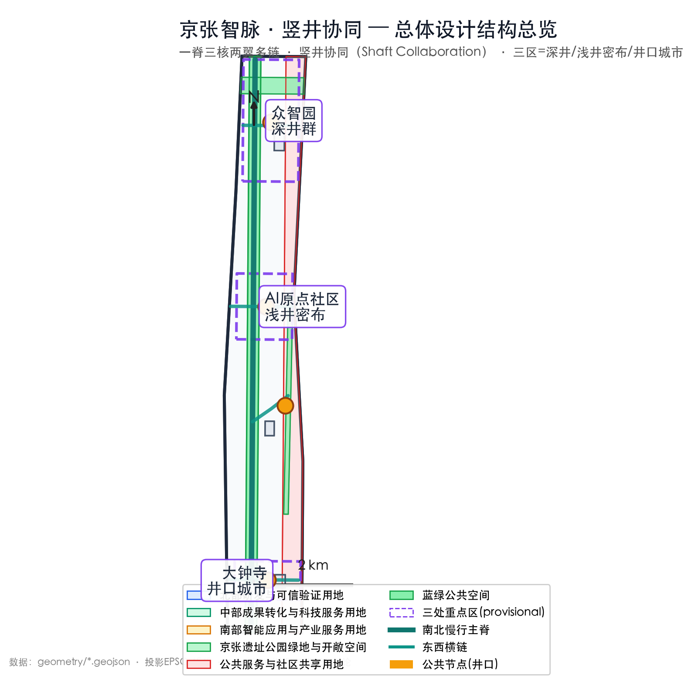
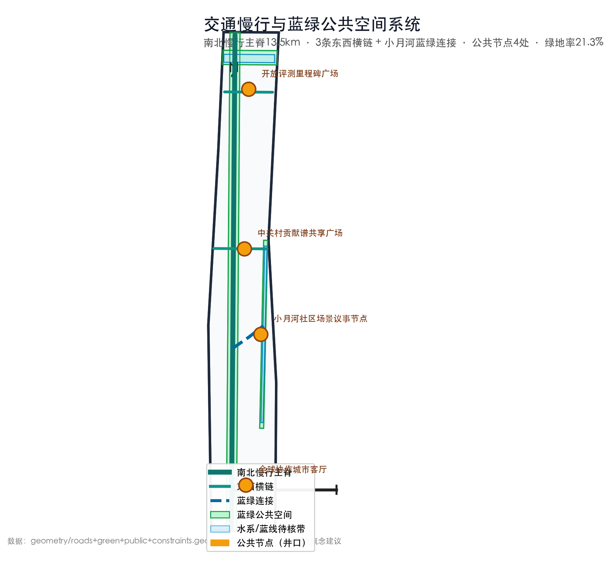
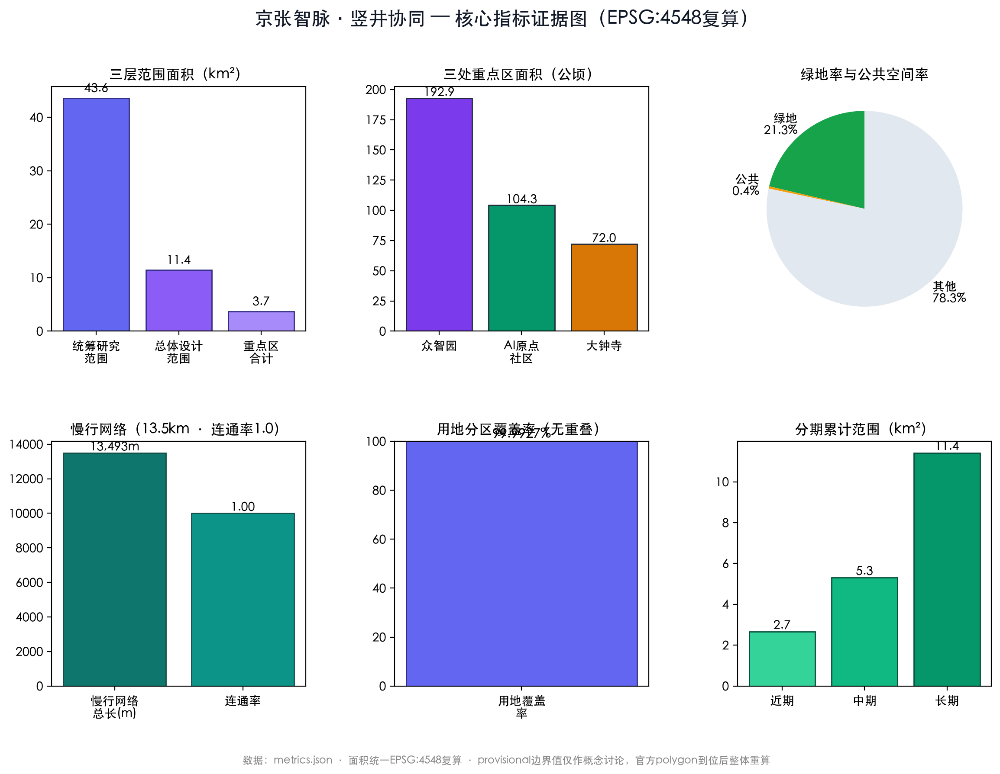

# Jing-Zhang AI Commons

> This document is a conceptual proposal for professional deepening. It does not constitute statutory planning, professional design, government approval, or project commitment.

## Quick Read for Judges — One Claim, Five Steps

**The Claim**: Jing-Zhang AI Commons transforms the century-old railway corridor into an **open verification infrastructure for AI innovation** — using a novel "Shaft Collaboration Protocol" inspired by mountain tunnel engineering, where multiple vertical shafts open parallel work faces to accelerate tunnelling.

**The Core Variable**: Mid-course Verification Density — how many publicly accessible, reviewable, and reversible verification workfaces exist along the corridor.

**Five Steps — One Causal Chain**:

| Step | Action | Output | Reference |
|------|--------|--------|-----------|
| 1. Open Workfaces | Organize R&D, translation, and application into parallel verification entries through one spine, three cores, two wings, and multiple chains | Three-level scope, three key areas, twelve scenario cards | Scope, Design, Key Areas, AI+ Scenarios |
| 2. Define Operating Boundaries | Constrain disclosure, controlled testing, and ongoing services via JZ-VP, PoV, and L1/L2/L3 depth levels | Five minimum contracts, state machine, capability leases, rollback | JZ Verification Protocol |
| 3. Measure Verification Capacity | Observe capability, density, reuse, and late-stage failure friction via VCI/VDR/TFC and correction cost curves | Recomputable verification economics metrics | Urban Verification Economics |
| 4. Translate to Space | Implement disclosure, testing, review, accountability, and rollback in plan and section through seven shaft grammar units | Shaft mouth, tunnel, barrel, platform, gallery, marker, skirt, eye | Shaft Spatial Grammar |
| 5. Constrain Rule-Makers | Verify the protocol itself via JZ-GPoV, distributed council seats, appeals, and sunset mechanisms | Anti-capture governance and external remedy interfaces | Protocol Governance |

## Design Basis and Source List

The proposal uses only registered public or cleared-rights materials from the repository. The official announcement confirms competition objectives, three-level scope descriptions with approximate areas, and three key area names and tasks but is not used to derive precise boundaries, regulatory indices, or engineering conditions. [source:DATA-SRC-OFFICIAL-ANNOUNCEMENT-20260509] The agent taskbook calibrates three positioning pillars, five functions, three zones with two wings, and six outcome requirements but carries no spatial regulatory force. [source:DATA-SRC-AGENT-TASKBOOK-20260518] Provisional boundaries serve only for concept generation, relationship discussion, and subsequent graphic recalculation; they are marked `PROVISIONAL` and do not constitute official area or implementation baselines. [source:DATA-SRC-PROVISIONAL-BOUNDARIES-20260605]

The complete design package uses `proposal.md` as the human-readable primary text, with `sources.json` recording source grades, `assumptions.json` recording pending conditions, `compliance_matrix.json` mapping official tasks, `standard_matrix.json` mapping professional standards, and `design_depth_matrix.json` mapping land use, transport, character, key areas, and implementation depth. [standard:MOHURD-URBAN-DESIGN-MEASURES] [standard:MOHURD-CONTROL-DETAILED-PLANNING] [standard:MNR-LAND-USE-CLASSIFICATION-GUIDE]

## Three-Level Scope Framework

The coordinated research area (~43.6 km²) addresses industry chains, innovation networks, and regional synergy. The overall design area (~11.4 km²) addresses spatial structure, urban renewal, transport, blue-green networks, and public services. The three key detailed areas (~368.4 ha total) address district-level scenario design for professional deepening. All approximate values are from the official announcement and do not represent precise survey results. [source:DATA-SRC-OFFICIAL-ANNOUNCEMENT-20260509]

A dual-ledger approach separates the announcement's approximate area values from current provisional geometric recalculation values, which only verify that the same provisional geometry can be reproduced under a consistent projection and algorithm. [metric:site_area_sqm] [metric:key_detailed_design_area_sqm] [metric:key_area_count]

The three levels follow a "strategy–structure–node" transmission: the coordinated research layer defines the value cycle; the overall design layer projects it into one public spine, three functional cores, two wings, and multiple east-west cross-links; the key area layer translates functions into shared facilities, ground-floor interfaces, slow-mobility organization, and operational scenarios. [source:DATA-SRC-PROVISIONAL-BOUNDARIES-20260605]

All conclusions remain provisional until official legislation boundaries, existing-condition surveys, and professional prerequisites are available. [depth:existing_conditions_diagnosis] [depth:three_level_scope_framework]

## Coordinated Research Area: Industry and Future City Research

**Core proposition**: The public value of AI innovation depends on whether outcomes can be collectively verified. All conclusions about spatial structure, land-use layout, scenario inventory, and operational mechanisms are corollaries of lowering verification entry barriers while preventing verification power concentration. [source:AGENT-TASKBOOK]

The "Shaft Collaboration" model draws its organizing logic from mountain tunnel engineering: just as vertical shafts create intermediate work faces enabling parallel excavation, calibration, and breakthrough, this proposal opens multiple publicly accessible, reviewable, and reversible verification workfaces along the Jing-Zhang corridor. The name "Open-Shaft Method" is this proposal's original contemporary translation of the shaft-adding-workface concept; it is not a historical term and does not point to heritage restoration engineering. [source:OFFICIAL-ANNOUNCEMENT]

### Brand and Visual Identity

Three naming options are proposed: **JZ MERIDIAN** (retaining the original, strengthening public coordinate sense), **DAYLIGHT COMMONS** (emphasizing early open verification), and **JZ PROVING COMMONS** (emphasizing collective verification and traceable correction). The visual motif is "one track, multiple shafts": a horizontal track line represents the century-old Jing-Zhang corridor and innovation tunnel, with vertical shaft openings representing verification workfaces open to the city.

### Global Cases

| Case | Proposition | Absorbed Capability | Differentiator |
|------|-------------|---------------------|----------------|
| Boston Kendall Square | Campus-industry linkage via walkability | Connect campus, R&D, and public space into walkable verification network | Add public verification entries and anti-exclusion monitoring |
| Toronto MaRS | Translation services reducing research-to-market friction | Centralize legal, IP, verification, and client interfaces in tech service wing | Portable proofs across three cores, avoiding repeated review |
| Singapore one-north | R&D-life-public service integration | Layer talent living, shared facilities, and R&D verification at walking scale | Do not transplant development intensity; use provisional boundaries and statutory procedures as hard limits |
| London King's Cross | Heritage renewal + high-quality public space | Let heritage spine first serve daily life, then carry low-disturbance AI scenarios | Do not turn heritage into themed decoration; use reversible components and sourced historical constraints |
| Paris Paris-Saclay | Multi-institutional collaboration across organizational and spatial boundaries | Enable universities, enterprises, communities, and verifiers to collaborate through unified evidence interfaces | Test synergy via JZ-VP recomputability and dispute closure, not by headcount |
| Shenzhen Nanshan | Rapid productization × industry chain density | Shorten "prototype–feedback–improvement" cycles via L2 controlled testing and service interfaces | Use capability leases, rollback, and public interest review to constrain expansion |

### International Terminology Framework

| Chinese | English | Operational Definition |
|---------|---------|------------------------|
| 竖井协同 | Shaft Collaboration | Dividing closed innovation chains into multiple accessible, reviewable, reversible intermediate workfaces |
| 井深分级 L1/L2/L3 | Verification Depth Levels L1/L2/L3 | L1: disclosure / offline demo; L2: bounded controlled testing; L3: ongoing service within proven envelope |

[standard:PROJECT-AGENT-OPEN-CALL-TASKBOOK]

## Overall Design Area: Urban Renewal and Regulatory-Plan-Level Urban Design

The spatial structure is organized by the Open-Shaft Method as "One Spine, Three Cores, Two Wings, Multiple Chains." The Jing-Zhang Heritage Park public spine is the primary interface for shared rules and result circulation; three cores simultaneously open R&D, translation, and application workfaces; two wings respectively deliver professional services and community-ecosystem feedback; multiple east-west cross-links bring universities, communities, transit stations, and innovation carriers into the same verification network. [source:DATA-SRC-OFFICIAL-ANNOUNCEMENT-20260509]

The minimum operational cycle is: public application → boundary recording → controlled verification → multi-party review → feedback or exit. Urban renewal follows "space opens first, services share first, scenarios pilot first, construction decides later." The only protocol layer is JZ-VP, not conflated with the spatial method.

## Detailed Design of Key Areas

All three key areas uniformly apply L1/L2/L3 depth levels: each must retain L1 public disclosure, accountability entry, and complaint channels; only scenarios with verified spatial, municipal, safety, data, and professional prerequisites may enter L2; L3 applies only to the operating envelope explicitly stated in PoV. [data:geometry/key_areas.geojson#PROV]

**Zhongzhiyuan AI Innovation Accelerator — R&D & Trust Verification Core.** Open Engineering Lab + Garden Testing Courtyard organized around model evaluation, chip adaptation, robotics, edge devices, and safety governance. Public and restricted zones are physically and temporally separated.

**Beijing AI Origin Community — Translation & Talent Hub.** The "first kilometer" from campus innovation to urban service: open-source release, achievement incubation, IP and legal services, youth collaboration, talent living, and community shared facilities.

**Dazhongsi AI Industry Hub — Application & International Reception Core.** Four-quadrant station portal integration with walkability improvement, non-motorized parking, and public interfaces. Import intelligent agents, terminals, digital content, accessibility services, and international exchange scenarios.

## AI Innovation Ecosystem, Personas, and AI+ Scenarios

Five core personas: developers needing shared tools and reputation mechanisms; startups needing verification, legal, and client interfaces; university faculty and students needing cross-campus collaboration; residents and small businesses needing quiet, safe, convenient services; international talent and visitors needing multilingual, accessible, and family services. [source:DATA-SRC-AGENT-TASKBOOK-20260518]

Twelve scenario cards span model evaluation, robot low-speed testing, trusted data sandbox, edge computing stations, accessible slow-mobility assistance, community health navigation, learning and employment assistance, legal and IP assistance, heritage audio guides, smart living experience hall, community deliberation platform, and international collaboration lounge. All begin from L1 disclosure and do not automatically acquire L2/L3 based on scenario name or spatial location.

### Representative Pilot Chain: Low-Speed Robot Across Three Cores

Scenario 02 demonstrates how land use, transport, municipal infrastructure, blue-green network, phasing, protocol, governance, and rollback enter a single decision ledger. The same `sceneId` is used across three areas with distinct `deploymentId` values; reusable elements (artifact descriptions, testing methods, existing evidence) are portable but locations, time windows, populations, capacity, and operating authority must be re-verified per deployment. [depth:three_key_area_detailed_design]

## Land Use, Building Scale, and Retain-Renovate-Demolish Strategy

A dual-layer expression is proposed: statutory land-use classifications (research, education, commercial, community service, roads, green space) as the base, with R&D/verification/translation/experience as operational tags. Industry space and talent living space are mixed at walking-accessible scale with short-lease, divisible, restorable flexible units. [source:DATA-SRC-OFFICIAL-ANNOUNCEMENT-20260509] [depth:land_use_layout] [depth:retain_renovate_demolish]

Building disposition follows "investigation → value assessment → scheme comparison → public consultation": heritage and public-value elements are prioritized for preservation; adaptable spaces for light renovation; problematic structures evaluated after special assessment; new construction studied only after capacity, ecology, and transport carrying capacity verified. [depth:height_massing_character]

## Transport, Rail, Municipal Infrastructure, and Public Services

Transport priority: rail access → walking-cycling connections → bus shuttle → service vehicles by time-slot → test vehicles under control. The north-south public spine connects walking and cycling; east-west cross-links address breaks between stations, campuses, communities, and parks. [source:DATA-SRC-OFFICIAL-ANNOUNCEMENT-20260509] [depth:traffic_rail_slow_parking] [depth:mobility_network]

Municipal capacity gates link systematic capacity ledgers with depth levels before any scenario upgrades. Each capacity system (power, drainage, fire, communication, transport) specifies what L1 permits, what evidence is required for L2, and what must be maintained for L3. [depth:municipal_new_infrastructure]

## Blue-Green Network, Public Space, and Urban Character

The Jing-Zhang Heritage Park is proposed as a "public spine" rather than a technology exhibition corridor. Continuous tree canopy, accessible pathways, cycling, drinking water, restrooms, quiet stays, and child-friendly spaces form the base chassis; AI scenarios are embedded as deactivatable, explainable, maintainable small components. [source:DATA-SRC-OFFICIAL-ANNOUNCEMENT-20260509] [depth:blue_green_public_space]

Three AI pilgrimage and honor nodes: northern "Open Benchmark Milestone" displaying verifiable technical contributions; central "Zhongguancun Contribution Spectrum" recording open-source, standards, and public service contributions in an authorized and revocable manner; southern "Global Collaboration Lounge" continuously hosting developer exchanges.

## Renewal Projects, Implementation Policy, and Phasing

Phasing aligns with `geometry/phasing.geojson` near_term / mid_term / long_term cumulative conceptual stages. Near-term: official boundaries, heritage/public space asset survey, slow-mobility breakpoints, municipal capacity ledgers, community needs deliberation, paper pre-registration of three test types — all at L1 disclosure. Mid-term: shared verification platforms, translation service nodes, and city living room — L2 only where prerequisites are complete. Long-term: cross-area reservation, proof mutual recognition, knowledge contribution, scenario feedback, and performance disclosure — only scenarios meeting sustained service thresholds enter L3. [data:geometry/phasing.geojson#PROV] [depth:phasing_implementation] [depth:implementation_phasing]

The governance framework proposes "council sets rules, operating platform manages facilities, community deliberation raises needs, third parties evaluate." Annual operations follow "four seasons, one ledger."

## Metrics, Area Recalculation, and Compliance Matrix

Metrics are grouped into four categories: spatial (three-level scope areas, public space continuity, slow-mobility breakpoint elimination, accessibility coverage, affordable shared space ratio), innovation (open tests, cross-institution projects, open-source reuse, verification-to-application turnaround time), experience (public space opening hours, resident and visitor satisfaction, dual online-offline entry coverage), and governance (authorization completeness, human review response time, appeal closure rate, safety incident rate, remediation completion rate). [source:DATA-SRC-AGENT-TASKBOOK-20260518] [metric:green_ratio] [metric:public_space_ratio]（另见 metrics.json 结构化文件）

All 18 directly recomputable metrics from nine submitted GeoJSON layers have been independently recomputed in EPSG:4548 (CGCS2000 / 3-degree Gauss-Kruger CM 117E) and all pass against the registered values in `metrics.json`. [metric:overall_design_area_sqm] [metric:key_area_zhongzhiyuan_sqm] [metric:key_area_ai_origin_sqm]（另有5项证据参见 metrics.json 结构化文件）

Design depth coverage spans 17 topics across existing conditions diagnosis through implementation phasing. [depth:metrics_recalculation] [depth:risk_missing_data]

Spatial data layers (all provisional): [data:geometry/site_boundary.geojson#PROV] [data:geometry/key_areas.geojson#PROV] [data:geometry/land_use.geojson#PROV]（另有6项证据参见 geometry 结构化文件）

## Jing-Zhang Verification Protocol (JZ-VP): From Mechanism to Protocol

JZ-VP (Jing-Zhang Verification Protocol) translates the "portable evidence" requirement of Shaft Collaboration into a common underlying contract that urban AI scenarios can implement together: each verification shaft is both a physical workface and a protocol node that receives the same message types, verifies the same proof forms, and executes the same pause and rollback semantics. It does not presuppose a new blockchain or a centralized app; any node implementing the shared message contract and proof verifier can reuse verification history without repeating incomparable reviews. What is portable is evidence and verification history, not site permission: a new deployment must still re-verify place, time, population, data, capacity, artifact, and external legal/professional prerequisites, and may only cite evidence items proven equivalent. [source:OFFICIAL-ANNOUNCEMENT] [source:AGENT-TASKBOOK]

A minimal viable JZ-VP starts with five required contracts before any engineering escalation: `SceneManifest`, `CriteriaCommit`, `EvidenceIndex`, `StateReceipt + CapabilityLease`, and `Challenge/RollbackReceipt`. Three implementation tiers are suggested — a basic tier for L1 disclosure using readable files and ordinary signatures; a controlled tier for L2 with real human/object/facility effects requiring artifact digests, pre-registered criteria, timestamped evidence directories, independent review, executable emergency stop, and time-limited leases; and a high-impact/cross-node tier for L3 and cross-node portability with full role coverage, proof roots/inclusion proofs, witnessed checkpoints, version migration, JZ-GPoV, and multi-tier appeals. A four-layer protocol stack (P0 Physical, P1 Semantic, P2 Consensus, P3 Governance) with three non-negotiable boundaries ensures that sensor data is not treated as interpreted semantics, passing indicators are not treated as signed consensus, and a valid PoV is not treated as governance or statutory approval. [source:AGENT-TASKBOOK]

**PoV as a computable claim.** Proof of Verification (PoV) is not a "safety certificate" but a recomputable bounded claim: a specific version of a scene, within defined time, space, population, and data boundaries, under a locked rule and pre-frozen criteria version, has obtained specified evidence and role signatures and can return to a known safe state. The mathematical definition constructs a canonical proof body, a hash-chained proof head, role-based signatures with a domain separator, a Merkle root over salted evidence commitments, and a verification predicate that must all hold — schema, head continuity, allowed transition, evidence root, results validity, role coverage, signature validity, freshness, binding validity, validity window, witnessed checkpoint, rollback readiness, and no open critical incident — before a `STATE_COMMIT` may be generated. Capability leases bind `sceneId + deploymentId + artifactHash + proof head` to explicitly allowed actions, rate limits, expiry, and stop conditions, so "running version B with version A's proof" is blocked at the deployment endpoint.

**State machine and health.** The state set is `{DRAFT, L1_DISCLOSED, L2_CONTROLLED, L3_OPERATIONAL, SUSPENDED, ROLLING_BACK, RETIRED}`. L1/L2/L3 are runtime permission states, not maturity labels: L1 produces no real urban effect; L2 tests only within pre-declared population, space, time, data, and human-takeover boundaries; L3 serves continuously only within the envelope stated by the PoV — any excursion is a new scene or deployment requiring re-verification. A protocol health index uses a "weakest link rather than average" formula: `PHI = 100 × G_critical × min{C, F, R, Q, B, A}` over evidence completeness, freshness, independent replication, role coverage, rollback readiness, and accountability, with a hard gate for critical failures. Evidence is retained in three classes (public receipt, restricted audit, sensitive ephemeral) with versioned retention rules and erasure tombstones that never rewrite historical conclusions.

## Urban Verification Economics: Computable Innovation-Competitiveness Indicators

This section turns "verification, trust, and correctability" from governance slogans into period-recomputable urban production capability. All VCI, VDR, TFC, correction cost curve, and dashboard figures below are **conceptual proposal indicators, not confirmed statutory indicators**, and every worked example is a **SYNTHETIC TEST VECTOR (test vector, not measured performance)** — no real operational pipeline exists in `metrics.json` yet. [source:AGENT-TASKBOOK]

**VCI (Verification Capability Index)** measures the integrated ability to open workfaces, deepen them, run them in parallel, finish them on time, backfill evidence, and close challenges: a weighted geometric mean over shaft count, depth distribution, concurrency capacity, cycle time, backfill rate, and challenge closure rate (weights 15/20/20/15/15/15), multiplied by a hard gate for chain breaks, open critical incidents, expired legal prerequisites, artifact-proof mismatch, or non-executable safe stop. **VDR (Verification Density Rate)** defines mid-course verification density as effective shafts per kilometer of walkable spine, adjusted by a five-minute walk network coverage ratio computed on entry-level networks (crossings, grades, opening hours, accessibility) rather than straight-line buffers. **TFC (Trust Flywheel Coefficient)** measures cross-institution positive feedback as deduplicated reuse events × signed cross-institution collaborations / (average review time × average unresolved challenge inventory). **Correction Cost Curve** models full-cycle correction cost growing geometrically with discovery stage, `K(L)=K1·α^(L−1)`, so L3 discovery is α² times L1; the investment criterion is `ΔV < Δp_late·(K3−K1)`, i.e., early verification pays when the expected late-loss reduction exceeds the added early cost. [metric:site_area_sqm] [metric:key_detailed_design_area_sqm] [metric:key_area_count](see `metrics.json` and structured files for the remaining evidence)

A seven-item urban operations health dashboard (verification throughput VT, state transition success TSR, mean rollback time MRT, evidence retention integrity ERI, role responsibility coverage RRC, public objection response time PART, version compatibility VC) tracks whether the protocol "runs, runs correctly, rolls back, is auditable, finds accountable people, responds to the public, and stays recomputable across versions" — deliberately kept separate from VCI so throughput gains cannot mask evidence or accountability debt. The "verification as investment" framework formalizes unit effective innovation cost `UC_I = (C_R + C_V + Σp_l·K_l + C_dup) / (N_PoV·(1+ρ))`, and states the falsifiable prediction: under comparable industry and macro conditions, corridors with higher VDR/VCI, steadily rising TFC, and non-overloaded protocol health should show, period over period, lower unit effective innovation cost, shorter and thinner-tailed verification waits, higher cross-institution evidence reuse, fewer defects first discovered at L3, and relatively more stable talent and firm survival. If these intermediate variables do not improve, spatial construction spending cannot be credited as verification investment.

## Shaft Spatial Grammar: Translating the Verification Protocol into Urban Form

"Shaft" here is first a **space–protocol composite type**, not a mandate for underground excavation. The grammar translates JZ-VP disclosure, controlled verification, ongoing service, and rollback into visible public interfaces, controlled workfaces, shared evidence layers, and demountable construction. The generative formula is `SHAFT := Mouth + Skirt + Gallery + Marker + [Tube] + [Platform] + [Eye]`; the marker is mandatory at L1 as the accountability and status entry, bracketed units are optional per scenario, and no physical device can replace JZ-VP messages, signatures, evidence, or statutory procedures. All dimensions are concept calibration values for plan/section/node diagrams — design suggestions, not statutory control values. [source:OFFICIAL-ANNOUNCEMENT] [source:AGENT-TASKBOOK]

The seven units map readable-but-not-certifying states to form: the **Shaft Mouth** (18–36 m diameter or 20–24 × 24–36 m courtyard, 0.45–1.50 m refillable depression, ~1/3 perimeter open to the spine) is the L1 physical interface for application, notice, and objection; the **Shaft Tube** (12–24 × 24–60 m, 6×6 or 6×9 m replaceable bays, 2–4 parallel cells) is the L2 controlled-testing envelope; the **Shaft Platform** (18–36 m open floor, or 1–3 distributed 6×6/9×9 m modules) hosts third-party replication and evidence handover with an accessible observation band; the **Shaft Gallery** (4–8 m public width, pause points every 30–60 m) separates "seeing verification" from "entering the test"; the **Shaft Skirt** is a 300 m network walkability service circle, not a circular buffer, with online and offline complaint entries; the **Shaft Marker** (4–16 m², 1.2–2.4 m reading face) shows the current L1/L2/L3 PoV digest on three graduated segments; and the **Shaft Eye** (40–120 m² observation platform) is the L3 heartbeat/evidence visual window without identity tracking. Every unit carries reversible design rules — dry-assembled steps and seats, movable partitions, plug-in power/network interfaces, bolted bases, replaceable panels — and a rollback sequence that restores public ground.

Three implantation patterns compose the grammar: the **Deep-Shaft Type** for Zhongzhiyuan (spine–gallery–mouth–tube×1+platform×1–3–marker±eye–skirt) for full L2 envelopes with robot/model-hardware integration; the **Shallow-Shaft Array** for the AI Origin Community (3–7 small mouths with 6×6/9×9 m platforms and light tubes stitched into existing ground floors and campus edges) for open-source publishing, legal/IP services, and low-disturbance scenarios; and the **Mouth-City Type** for Dazhongsi (transit/street entrances, multi-directional galleries, a city mouth, rear small platform/tube, marker±eye, 300 m skirt) for high-traffic L1 experience, international reception, and verified L3 urban services. The public spine acts as the grammar's main chain: main shaft mouths every 300–500 m of actually walkable spine, with a "three-connect, one-retreat" rule (connect slow mobility, accountability, and blue-green; retreat sensitive testing into existing buildings or logistics sides). Four questions must receive the same answer in plan, section, operation drawings, and JZ-VP records: where does the public learn, where is verification controlled, where is evidence reviewed, and how does space roll back after failure. [data:geometry/roads.geojson#PROV] [data:geometry/public_space.geojson#PROV](see `geometry/*.geojson` and structured files for the remaining evidence)

## Protocol Governance and Abuse Prevention: Verifying the Verifier

This section folds JZ-VP's P3 governance layer one level upward: the protocol must verify who may change rules, who must recuse themselves, why emergency powers were invoked, whether rulings can be appealed, and when provisions expire. All council seats, percentages, time limits, fee caps, and thresholds below are **governance stress-test parameters and concept proposals of `JZ-VP/0.1.0-draft`, not current law, statutory bodies, government authorizations, approved fee schedules, or measured governance performance**. Protocol-internal review and public appeals are not legal arbitration and do not restrict administrative, judicial, or other statutory remedies. [source:OFFICIAL-ANNOUNCEMENT] [source:AGENT-TASKBOOK]

A capture stress test requires, before any L2 entry, a traceable authorization chain — authorizing body → seat creation/removal → budget and funding sources → registry/schema/key operators → independent audit and external remedy — with any unclear link flagged `GOVERNANCE_UNKNOWN`. **JZ-GPoV (Governance Proof of Validity)** is the "protocol-governing protocol": every policy publish, fee change, profile revision, arbitration outcome, global/category suspension, and custody transfer generates an immutable `GovernanceReceipt` validated by nodes through `ValidGov(a)` covering mandate, conflict-freeness, category quorum, threshold, notice, evidence binding, appealability, sunset bound, and history preservation. A 20-seat council caps any single category at 25%, any legal person and its controlled affiliates at two seats, with public/service seats (5), professional seats (4), community/affected-person seats (4), developer/implementer seats (3), and independent audit seats (4), rotating half each year with two-term limits and recusal pools; decision thresholds range from simple majority with 14 present, through two-thirds with category majorities for profiles/fees/appointments, three-quarters for constitutional clauses, to unanimous for dissolution or custody transfer — with no rewriting of historical PoV, challenges, or recusal records under any vote count.

Four anti-capture defenses operate as operational rules: **A1** a dual fee cap (5% of audited direct operating cost or disclosed marginal cost, whichever is lower) with `FEE_CAP_HOLD` freezing excess charges without freezing applications; **A2** a revolving-door ban (24-month lookback and 12-month post-ruling restriction, recusal and random substitution, frozen decisions and re-adjudication on undisclosed conflicts); **A3** anti-"gaming-for-verification" review (threshold-edge clustering, missing negative samples, pre-evaluation metric switching, distribution shift, irreproducibility, artifact mismatch, or red-flag models trigger `ANTI-GAMING_REVIEW` with frozen upgrades, full evidence-root comparison, independent replication, ≥10% random sampling, production shadow testing, and `METRIC_GAMING` revocation); and **A4** symmetric veto rights — a community protection gate for biometrics, health/education/basic services, children, mass behavioral observation, or physical autonomous action, with affected-person juries able to veto one decision cycle (max 90 days) forcing rework of impact boundaries and remedies, alongside a low-risk fast track that never waives PoV, appeal, or random 20% post-audit.

A three-tier dispute mechanism uses one `caseId` for additive receipts: (1) protocol-internal review (1 working day acceptance, 10 working days decision, zero fee, operator exports the full decision file); (2) an independent expert panel (3 experts with no material 24-month relationship, 20 working days, blind tests or field re-verification, prepaid by the dispute reserve); and (3) a public appeal committee (7 members with community+audit ≥ 4, public hearing within 30 calendar days, protocol-internal finality without replacing statutory bodies or courts). AI-generated evidence receives special review — `modelRef/version`, `promptHash`, source citations, tool logs, randomness parameters, and human verification are required, with four-value conclusions `REPRODUCED / PARTIAL / UNVERIFIABLE / MISMATCH` and `UNVERIFIABLE` never treated as passing. Two-layer revision (constitutional clauses via 90-day/3-4 supermajority with sunset review every 3 years; ordinary clauses via annual windows, 30-day notice, 2/3 for profiles/fees, forward-only effect with explicit `MIGRATE`) and sunset clauses (12 months pilot / 24 months ordinary / 72 hours emergency with `reviewBy/expiresAt`) ensure reversible evolution. A machine-readable pre-attachment (`JZVP_PRE_ATTACHMENT` with `legalStatus: PROTOCOL_ONLY`) is offered for statutory planning, approval, and supervision processes without claiming to replace them, and a five-item governance health dashboard (decision transparency DT, dispute closure DCR, conflict disclosure CID, clause revision frequency CRF with zombie-clause tracking, formalized-compliance hit rate FGH) is reported as a vector — never collapsed into a single governance score that the protocol could learn to game. [standard:MOHURD-CONTROL-DETAILED-PLANNING] [standard:MNR-LAND-USE-CLASSIFICATION-GUIDE] [source:AGENT-TASKBOOK]

## AI Nativity and Verifiability

This proposal embeds AI-native capabilities into every layer of delivery and operations: deterministic generation pipeline (GeoJSON → EPSG:4548 recalculation → five evidence figures → HTML and A3/A0 drawings), machine-readable evidence tags, the JZ-VP protocol transforming capabilities into revocable permissions, urban verification economics reframing "innovate faster" as "correct earlier," spatial grammar making the protocol visible in plan and section, governance verifying the protocol itself, and clear boundaries for AI participation in public decisions. [source:AGENT-TASKBOOK]

## Risk, Copyright, and Compliance

Primary risks include: provisional boundaries misinterpreted as formal; conceptual metrics misinterpreted as control conditions; technical testing affecting public safety; data collection exceeding necessity; innovation-driven rent increases excluding residents; protocol capture by funding, operations, or expert networks; heritage culture reduced to symbols; events lacking long-term maintenance. All VCI/VDR/TFC/correction cost/PHI/urban operations health dashboard calculations are **SYNTHETIC TEST VECTORS**, not measured performance. [source:DATA-SRC-AGENT-TASKBOOK-20260518]

## References

All conclusions are traceable and recomputable in `geometry/*.geojson` layers, `metrics.json` metrics, `compliance_matrix.json`, `standard_matrix.json`, and `design_depth_matrix.json`. Areas are uniformly recomputed in EPSG:4548; provisional boundaries serve concept discussion only and do not constitute official redlines or precise area evidence.

Core evidence: `[source:OFFICIAL-ANNOUNCEMENT]`, `[source:AGENT-TASKBOOK]`, `[source:BOUNDARY-SOURCE]`, `[source:KEY-AREA-SOURCE]`. See `data/source_registry.json` for specific permissions, usage scopes, and prohibitions. See `assumptions.json` and `self_check.json` for pending conditions.
