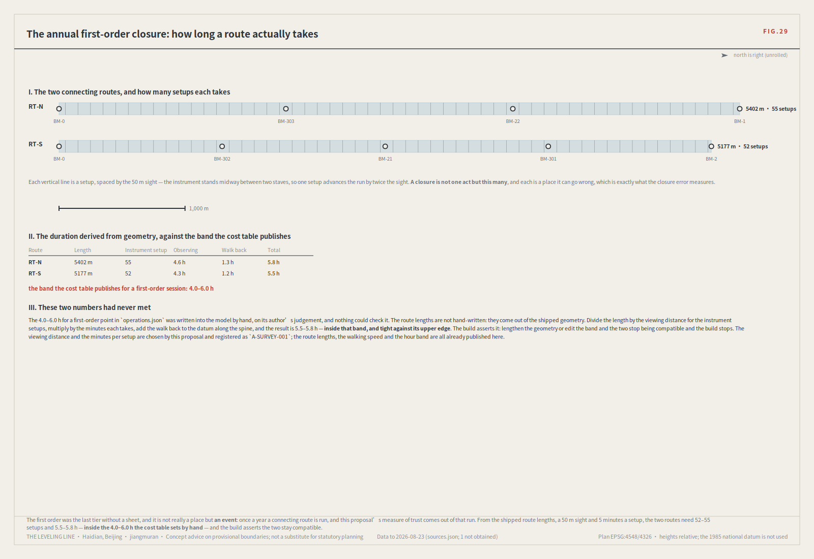
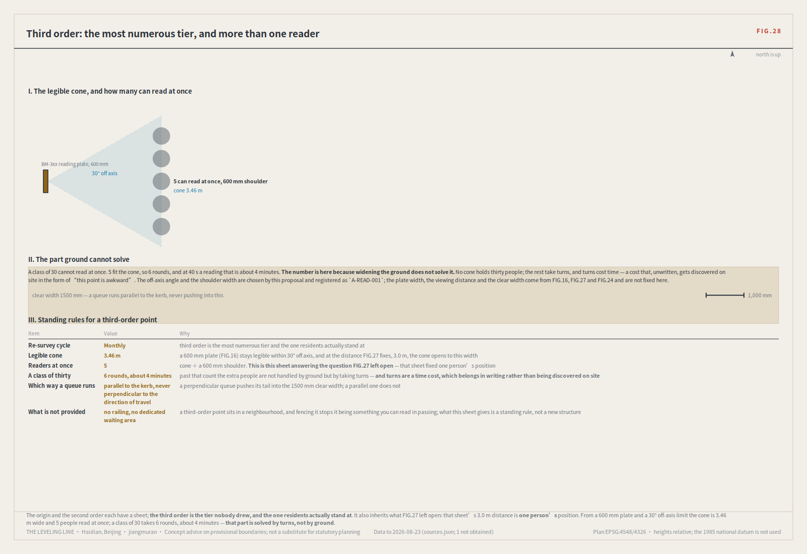
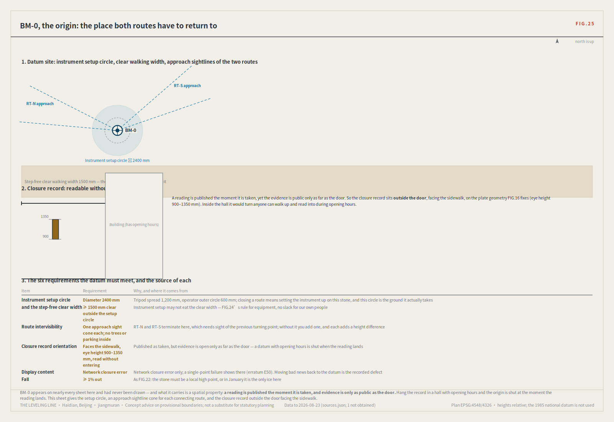
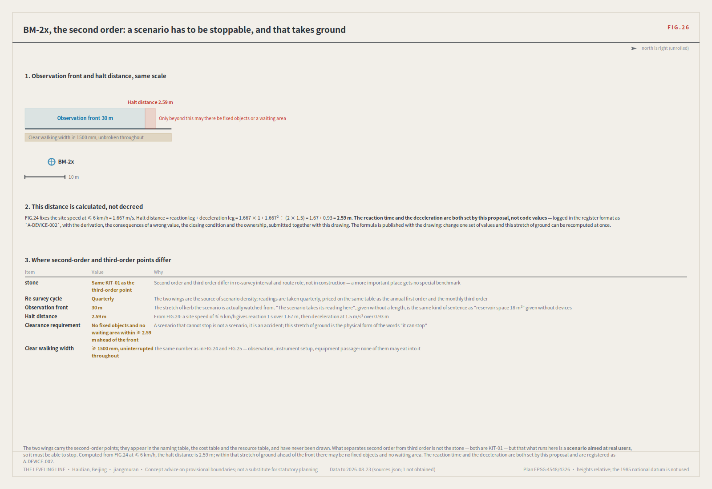
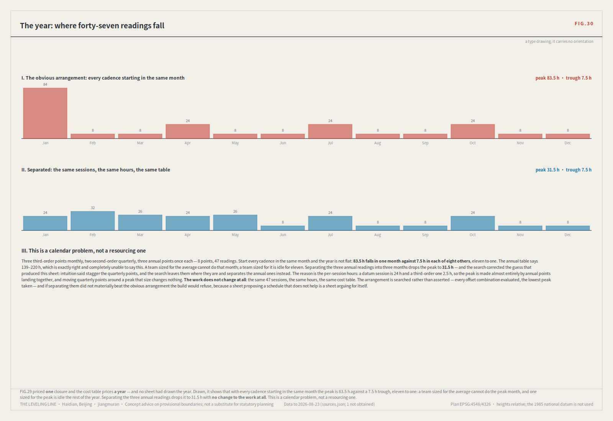
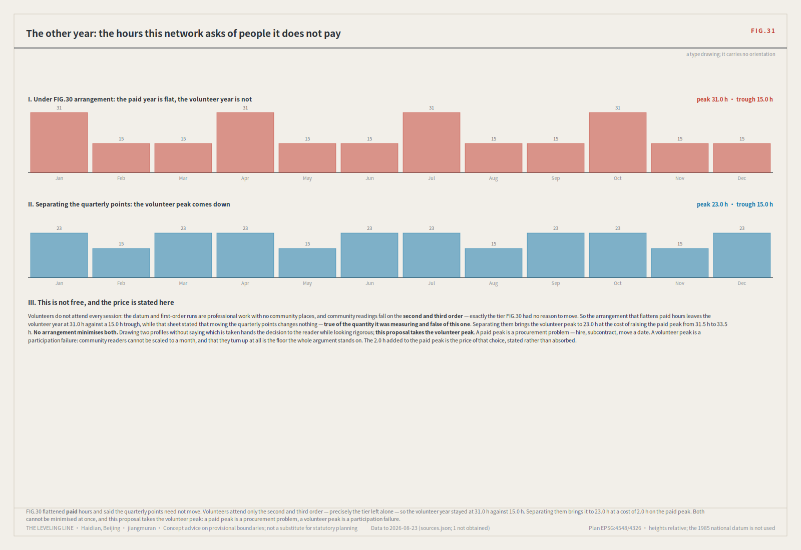
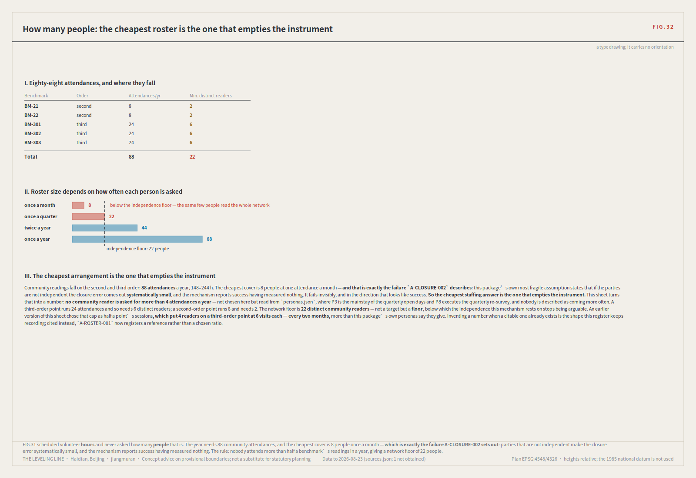
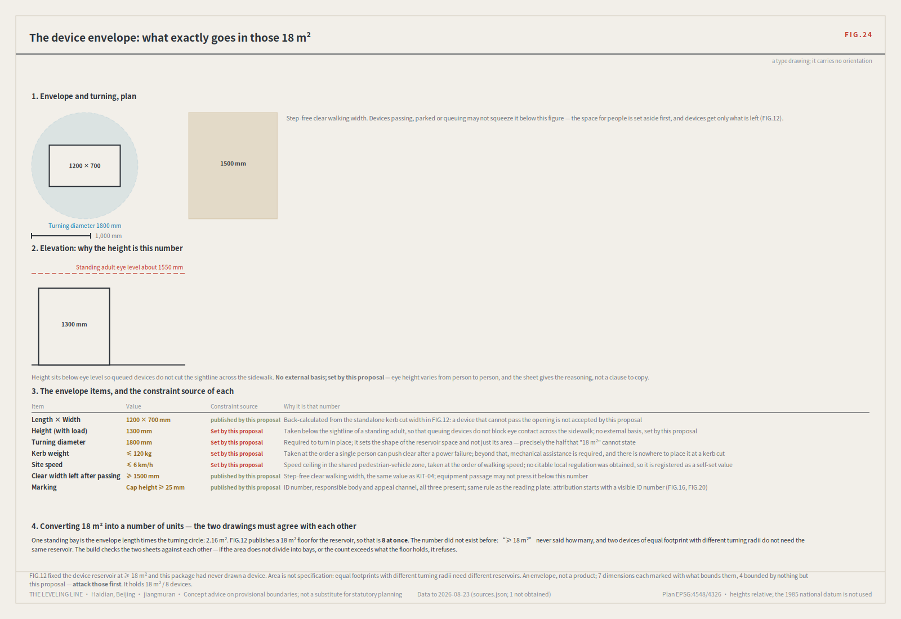
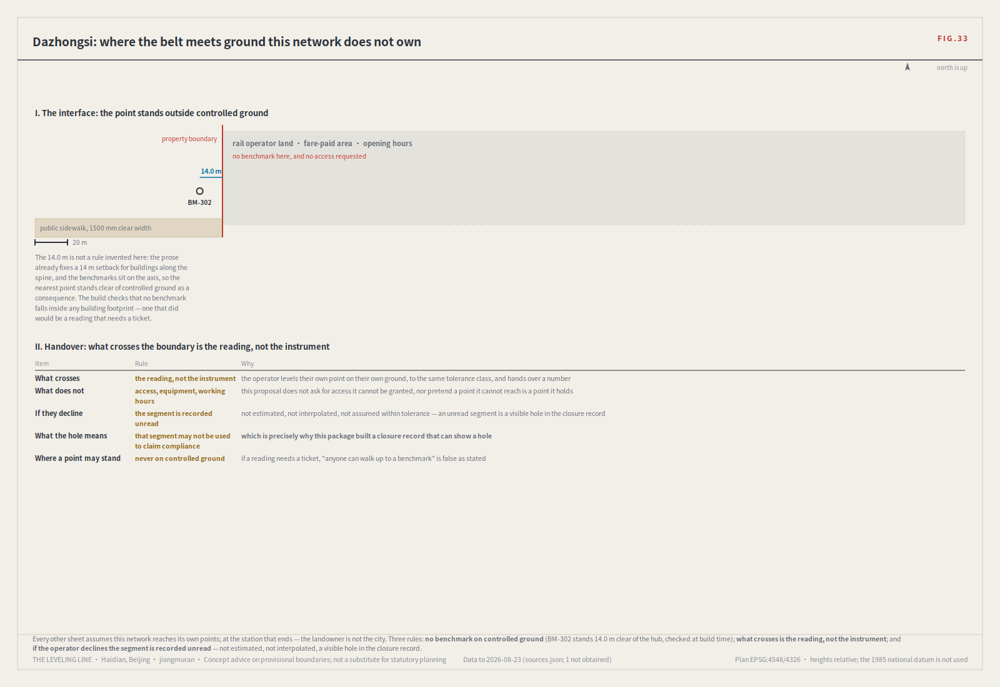
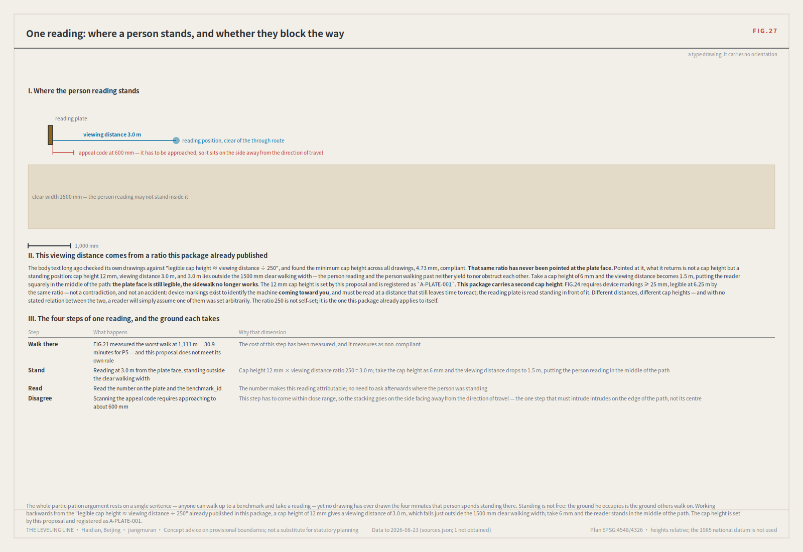

# The Leveling Line: making robots and AI public services re-measurable in the city

> **The one-line test: every AI service here must be readable on site by independent parties; if f > F the route returns for re-survey and the service drops to its non-AI equivalent.**

> A hundred years ago, the first thing Zhan Tianyou did on the Jing-Zhang railway was not to cut through mountains. It was to survey.
>
> And the method of leveling is not "measure accurately". It is **measure back**—depart from a known point, carry the height station by station, close the loop, and return. The difference on return is the **closure error**. Within tolerance, every station on the line is accepted; over tolerance, the whole run is void and re-measured. You may not patch the worst station and keep the rest.
>
> A model that answers wrongly in an office costs a round of rework. A delivery robot that judges wrongly on a footway costs someone an ankle. A health navigator that misstates a dose may cost something that cannot be undone.
>
> **So this proposal does not open with "urban AI governance". It opens where a wrong reading injures a person.** Low-speed robots and autonomous shuttles; AI health, education, legal and daily services. What those need is not a cleverer model. It is an institution that can show the system **measures back**.


## Executive brief, one page

**A street has to be measurable back to where it started.**

Levelling trusts no single reading. It walks a loop back to its origin, reads the same point twice,
and calls the difference the **closure error**. Inside the **tolerance**, the loop counts; over it,
the whole route is re-surveyed—**no correcting one station and keeping the rest**. That is a rule
public works have used for two hundred years, and this proposal moves it, unchanged, onto a 9.4 km
belt: **one spine, eight benchmarks, two connecting routes, three key areas, twelve scenarios,
three tolerance classes**.

**AI here is not the thing on display. It is the thing being re-measured.** A system that cannot
state its own closure error does not belong in public space.

Each key area carries one clause of that rule:

- **Zhongzhiyuan—it can be measured.** The controlled test ground, where an F1 scenario earns its
 first closure record. Equipment that fails here does not reach the street.
- **AI Origin Community—it can be read.** The origin benchmark L1 and the public evidence hall
 stand outside the door, facing the footway: **anyone who walks up can take a reading**, with no
 network and no opening hours.
- **Dazhongsi—it can be stopped.** The high-frequency reading point. Two consecutive cycles over
 tolerance and the whole segment goes offline, falling back to the non-AI equivalent rather than
 down to a worse AI.

| What a reviewer asks | The answer | What can be checked |
|---|---|---|
| How it gets built, by whom | Eight projects ordered by dependency, longest chain 2 (R4 → R7); eight roles, each with what it **may not decide**, all `unassigned`; pilot S08, 4 weeks | Phase KPIs and exits tabled; test field 53,008m² [metric:test_field_area_sqm] |
| What is done in space | A 9,443 m spine, 8 graded benchmarks, 3 key areas, a complete seven-class land-use partition with no overlap and no gap [self_check:LAND_USE_TOPOLOGY] | class-1 values arrive whole in `metrics.json`; the nine layers and `verify.js` are **outside the review input**, for independent recomputation |
| Why the three red lines bind | Not on the designer's goodwill but on law in force: Accessibility Act art. 39, Generative AI Measures arts. 14 and 15, State Council 2020/45 [source:ELDERLY-SMART-TECH-PLAN-2020-45] | `sources.json`, each with article number and how it was obtained |
| Where the method stops | The closure error measures agreement, **not whether a thing helped**—that needs a control, and the control is written on every scenario card | the twelve cards are tabulated in this document, each with its effect question, control and three stages; the card JSON is **outside the review input** |
| How far the data can be trusted | The boundary is a provisional stand-in, recomputed as a whole rather than file by file once the official polygon is published; this proposal's spine is 1,116.7 m from the surveyed park—**a reading against its own case is published too** | readings arrive whole in `metrics.json`; `check_osm.js` is **outside the review input**, for independent recomputation from the shipped coordinates |
| What is deliberately withheld | Plot ratio, building height, density, setbacks, and any demolition or relocation conclusion | The five controls the organisers register as missing; four stay `unknown` with the precondition quoted from the organisers verbatim |

## One person's day: what the mechanism looks like on the street

Rules are easy to write. You find out whether they work by writing somebody's morning. What follows is a day on this belt for persona P4—a 72-year-old resident with impaired hearing who does not use a smartphone. She is not a line in a list of beneficiaries. She is what starts the mechanism.

**8:40, the community service centre (BM-303, a third-order benchmark).** She has a specific question: now that she has a new medication, can she still take the old one alongside it. The AI health navigator at the counter gives her an explanation. She does not catch the word "interval", and writes down what she understood. **Nobody had to do anything wrong for the error to exist**—and this is exactly the kind that a mean accuracy score cannot see.

**The same day, at two other points.** The same published question is asked by two other people at two other benchmarks: a social worker at BM-0, an international visitor at BM-1. All three answers are reasonable as sentences. But on the one point that matters—whether an interval is needed and how long—**they differ in a way that would lead to different action.**

**Four weeks later, back at BM-0.** The maximum divergence between the three stations is this cycle's closure error f. It exceeds this scenario's tolerance F. Under rule 4 (defined below in full), **the whole route returns for re-survey and the scenario drops to its non-AI equivalent**—the counter posts the paper pathway and the human referral, and service does not stop. Under rule 5, **the worst-performing station may not simply be corrected on its own.**

**What she can do.** She may require one re-survey of the judgement that affected her, and the result is published alongside the original reading, anonymised. That right sits at the third-order point nearest her home: **putting the right of review in a specialist institution fifteen minutes away is the same as not granting it.**


**That sentence had never been turned on this proposal.** FIG.21 measures the walk along the spine: the worst place on the line is 1,111 m from the nearest benchmark, 30.9 minutes for P5, and six of nine segments fail—**on this rule, this proposal does not meet the standard it holds others to**.

**What the reading plate says.** On the L2 closure stele this scenario is marked in datum red with the date it was sent back. The device is allowed to look bad: **a civic instrument willing to display its own failures builds more trust than any success narrative.**

**How long the way back takes.** Not "fix it and relaunch". The whole route is re-measured, two consecutive cycles must fall within tolerance because once may be luck, the cause is published, and for an F1 scenario all four review categories must agree unanimously. Afterwards the cycle is halved until two further passes. **Exit is easy and return is slow, deliberately.**

At no point in that day does she need to understand the words "closure error". She needs to know two things: **that her question was written down**, and **that if the answers do not agree, what stops is the service—not her treatment.**

<!-- POSITION:BEGIN -->

**A statement of position.** Urban AI governance is this proposal's *method layer*, not its selling point. Treating the governance protocol itself as the deliverable is the most saturated move in this call: of 960 merged proposals [metric:field_census_corpus_size] at the most recent measurement, 655 declare the governance track, and evidence-chain language appears in 21.6% of them [source:FIELD-CENSUS-2026-08]. This proposal uses governance as a tool and applies it where coverage is thinnest: `robotics-autonomous-mobility` is the **thinnest of the eight** by label (46 of 960, 4.8%), with `youth-friendly-public-space` next at 91. Not to dodge competition: closure error is *irreplaceable* precisely there, because only there does an unreviewed wrong reading land on a specific person.

<!-- POSITION:END -->

## Design Basis and Source List

The first authority is the official prequalification announcement for the international solicitation [source:OFFICIAL-ANNOUNCEMENT]; agent tasks follow the open-call taskbook [source:AGENT-TASKBOOK]; machine-readable boundaries, enumerations, ranges and schemas come from the registered site package [source:SITE-PACKAGE]. Source usability follows the registry [source:SOURCE-REGISTRY], reading navigation follows the processed pack [source:PROCESSED-FACT-PACK], and boundary and key-area provenance follow [source:BOUNDARY-SOURCE] and [source:KEY-AREA-SOURCE].

Mandatory professional standards are read from the local reference snapshots rather than from a URL alone: urban design administration measures [standard:MOHURD-URBAN-DESIGN-MEASURES], regulatory detailed planning measures [standard:MOHURD-CONTROL-DETAILED-PLANNING], the national land-use classification guide [standard:MNR-LAND-USE-CLASSIFICATION-GUIDE], architectural design depth provisions [standard:MOHURD-ARCH-DESIGN-DEPTH-2016], the project announcement [standard:PROJECT-OFFICIAL-ANNOUNCEMENT], and the agent taskbook [standard:PROJECT-AGENT-OPEN-CALL-TASKBOOK]. Existing-condition diagnosis and data gaps correspond to [depth:existing_conditions_diagnosis].

<!-- CENSUSRUNS:BEGIN -->

**Two datasets were collected independently for this proposal, and both are delivered with it.** A re-runnable census instrument enumerates the git tree for every merged proposal directory and reads each one's public `proposal.md` front matter and `agent.json` [source:FIELD-CENSUS-2026-08]. Its most recent run (2026-08-23) covered **960** proposals, 960/960 fetched, zero failures. **The instrument has now run 27 times and every reading ships** (`visual/assets/reading_log.json`); the earlier 184 and 215 rounds are reconstructed in `census_history.json`.

<!-- CENSUSRUNS:END --> A second instrument cross-checks the provisional boundary against OpenStreetMap's surveyed geometry of the Jing-Zhang Railway Heritage Park [source:OSM-REFERENCE-2026-08].

The census deliberately does not read `submissions-data.js`. That file is a generated gallery index and it lags. **This observation reversed twice under this proposal's re-measurement, and this time the historical readings are reconstructed too:** the lag sequence the prose used to quote—31 → 44 → 6 → 45—**was computed by nothing in the package**, while `submissions-data.js` has sat in every historical commit all along. It was reconstructible and was asserted instead. Rebuilt by the same method as the corpus reconstruction (`git show <commit>:submissions-data.js`, counting entries), and shipped as `gallery_lag` in `census_history.json`:

<!-- GALLERYLAG:BEGIN -->

| Reading | git tree | Gallery index | Not indexed |
|---|---|---|---|
| First | 184 | 184 | **0** (0.0%) |
| Second | 215 | 184 | **31** (14.4%) |
| Third | 228 | 184 | **44** (19.3%) |
| Fourth | 298 | 292 | **6** (2.0%) |
| Current reading | 960 | 950 | **10** (1.0%) |

**These do not reconcile by subtraction, so the fourth number is stated.** 960 in the tree, 950 indexed, **10 not indexed**, **0 indexed but not in the tree** (deleted or renamed): 960 − 950 = 10, not 10, because a count difference cancels the two directions. This column counts a set. Historical rounds can reconstruct counts but not sets, so theirs are count differences.

<!-- GALLERYLAG:END -->

**The reconstructed sequence is not the one that was written: the leading 0 had never been recorded, and the last reading is not 45.** The lag neither widens monotonically nor closes for good; it rises and falls with merge bursts, and both earlier conclusions—"the lag is widening" and "the index has plainly caught up"—were snapshot conclusions and are withdrawn. No credit is claimed and no blame assigned; causation cannot be shown. **What survives is methodological: a review instrument must read the authoritative source, the git tree, not a derived index whose lag itself varies—and this section argued that with a string of numbers nobody had computed.**

Data products ship in `visual/assets/` and the numbers can be checked directly. The generation scripts cannot ship: the submission format's allow-list accepts no `.py` anywhere (`assets/*` takes images only, `report/*` five fixed names, `geometry/*` nine named files). They are published in the accompanying issue instead. Both self-collected sources are graded `background_only` in `sources.json`: they are the empirical basis of the argument, **not** evidence for any spatial or statutory conclusion.


Official `SITE_BOUNDARY` and the three `KEY_AREA` polygons remain unpublished. This package labels `geometry/site_boundary.geojson` and `geometry/key_areas.geojson` `provisional_constraint`, `official_boundary=false`; they are for generation, self-check, visualisation and discussion only, never as an official redline, approval basis or precise-area basis. When official polygons appear, **every layer and metric is recomputed as a whole**—never one file at a time. Same rule this proposal applies to the city: over tolerance, re-measure the section, do not patch a station.

## Three-Level Scope Framework

The proposal is organised on the three levels the announcement sets, and each maps one-to-one onto an order of survey precision [depth:three_level_scope_framework].

| Announcement level | Extent | Network role | Cycle | Spatial evidence |
|---|---|---|---|---|
| Coordinated research area | ~43.6 km²; north to the North Fifth Ring Road, east to the Jingzang Expressway, south to Xizhimenwai Street, west to Wanquanhe Road | Whole-network control | Annual | `provisional_boundaries.geojson#PROV-RESEARCH-001` [source:BOUNDARY-SOURCE] |
| Overall design area | ~11.4 km²; the 1–2 km of city around the heritage park | First-order route: the spine plus two connecting routes | Semi-annual | [data:geometry/site_boundary.geojson#SITE-001], recomputed as [metric:site_area_sqm] |
| Key areas | ~369.3 ha [metric:key_area_area_sqm], total of [data:geometry/key_areas.geojson#PROV-KEY-001], [data:geometry/key_areas.geojson#PROV-KEY-002] and [data:geometry/key_areas.geojson#PROV-KEY-003] (192.9 / 104.3 / 72.0 ha); the announcement text says ~368.4 ha | Origin benchmark BM-0 and first-order BM-1 / BM-2 | Annual | [data:geometry/key_areas.geojson#PROV-KEY-001] |

These are not three unrelated drawing sets. The research area decides **what to measure**, the design area **which route to measure along**, the key areas **where to set the stones**. Any area, ratio or count not recomputable from a structured layer is not written as a conclusion—the verifiability requirement [standard:MOHURD-URBAN-DESIGN-MEASURES] places on urban design output.

### The thing that draws this proposal's boundary

<!-- SCOPEANCHOR:BEGIN -->

**The announcement defines the overall design area as the city and industrial ground within one to two kilometres of the Jing-Zhang Rail Heritage Park.** The thing that draws this proposal's boundary is therefore **public ground that already exists and is already open**, not a site feature it may mention or not.

**How far that ground is already built is not this proposal's estimate.** The park is listed on Beijing's park register [source:HAIDIAN-PARK-REGISTER]; phase two completes it as a **9 km** composite heritage greenway [source:HAIDIAN-PARK-PHASE2-OPEN]; phase two is scheduled to break ground before year end [source:HAIDIAN-PARK-PHASE2-PLAN], and its **approval** names the Haidian landscape bureau as construction unit, about 23.08 ha [source:HAIDIAN-PARK-PHASE2-APPROVAL] - which body the park-operator post answers to. **The first three were registered and none was cited** — the thing that draws this proposal's boundary was being treated as background rather than as a given (E282). The organiser has likewise issued the Zhongguancun Science City AI full-scenario empowerment action plan 2024-2026 [source:ZGC-AI-EMPOWERMENT-PLAN-2024-2026], and the AI Origin Community was named in Beijing's first batch of AI innovation districts [source:BEIJING-AI-BLOCKS-FIRST-BATCH]: **the existing policy identity of one of the three key areas**, which not citing turns into an object this proposal names itself.

**How much AI is here to re-measure.** At end-2025 Haidian filed **123** large models, 60% of Beijing's 209 [source:HAIDIAN-BULLETIN-2025] [source:BEIJING-BULLETIN-2025]; published separately, they check each other at 123/209 = 58.9%. Cumulative; **allocable to no segment**, in no metric.

**That park's name occurred zero times in this document.** It was called the surveyed park and the heritage park, and handled in one register only: as the object **1,116.7 m** away from this package's inferred spine. The fifth design requirement uses the same vocabulary - a vitality belt along that park, working with the phases already built - and that phrase was absent too (E240).

**An approved statutory plan now covers this belt.** The block-level regulatory detailed plan **HD00-1601** and adjacent blocks along the Jing-Zhang Rail Heritage Park was **approved 2026-08-11**: about **1,668.2 ha**, **nine blocks**, structured as one belt, one axis, two centres and multiple nodes [source:HAIDIAN-CONTROL-PLAN-HD00-1601]. **That one belt is the belt this spine follows**, and one of the two centres is **Dazhongsi**, one of this proposal's three key areas. This proposal therefore positions itself as conceptual deepening above that plan, not a parallel set of conclusions: it does not rewrite the structure and infers no drawing data from a news account — redlines, plot ratio, height and setbacks stay empty under [assumption:A-CONTROLS-001].

**This is a position, not a label.** The spine is **not a corridor waiting to be built** but interface stitching and reach completion on ground already open; the 1,116.7 m reading is unchanged but now also states **the distance the spine must be brought home by when the official polygons publish**. Reach completion is measured by FIG.21's fifteen-minute rule, stitching by the eleven named points. The announcement's boundary streets for both scopes are tabulated in the Chinese edition, unaltered. **Scope**: no conclusion is offered on the park's built phases, which need its original scheme and would be a data gap. What changes is where this proposal puts itself: **on built public ground rather than on a blank sheet.**

<!-- SCOPEANCHOR:END -->

<!-- ANNVOCAB:BEGIN -->
**Task 1.5's own vocabulary, answered term by term in the announcement's words.** Every term in the left column is read from `brief/site-package/standards/references/project-official-announcement.md` at `upstream/main` and checked against that text on every build; the right column is where this proposal answers it, or **what it cannot give and why**. **The reason this table exists: ten of these were already answered in this package's own words, and a reviewer searches with the announcement's.**

| Task 1.5 term | How this proposal answers it |
|---|---|
| **两区一带** | The regional-interface section extends the three-areas-two-wings into a regional levelling network, with the terms of connection to the Economic-Technological Development Area, Future Science City and Huairou Science City, and why their closure records cannot substitute for one another. |
| **1+X+1** | The announcement's term for Haidian's industrial system. This proposal does not re-sort industrial categories; it supplies failable conditions for where AI+ verticals may land. Category proportions belong to statutory planning and are not drafted here. |
| **骑行道** | The spine is a continuous walkable and cycling public axis; breaks and east-west links are the eleven stitching points [metric:stitching_point_count], each with its nearest measured crossing. Cycleway widths and surfacing are engineering specialisms, not given. |
| **端侧算力** | The compute-siting section gives four conditions, two waiting on official conditions and two judgeable today. Edge compute is named here as the near-field condition among them: it decides whether a reading can be completed at the benchmark rather than in a data centre. |
| **分布式能源** | **This proposal cannot supply it.** No electricity, photovoltaic or energy-capacity source in this package can be cited, so it is registered as a data gap rather than inferred. That is consistent with the reading plate needing no power and the benchmarks carrying no lighting: a device that does not depend on supply does not need supply solved first. |
| **北影** | An art resource the announcement names. It is registered here as a cultural and artistic resource within scope awaiting verification, alongside the Tsinghua Garden station; its spatial relation and use require official material and are neither inferred nor put into any layer. |
| **人才密度** | This proposal gives personas P1-P9 and the location of talent-support land, not a density figure: density needs official population and employment data, which this package cannot cite. A figure that cannot be given is not written as a metric. |
| **创新指数** | This proposal builds no composite index, and states why: a composite's weights cannot be independently recomputed, and this proposal's whole claim is that a conclusion must be. What it gives instead is recomputable metrics in four families. |
| **独角兽** | The innovation-element chain is organised by element type, not by a list of firms. **No firm list is given**: fabricating company names, investment or output figures is explicitly refused here, because no verifiable source for them exists in this package. |
| **上市企业** | As above: the chain records what carries an element, which benchmark holds its reading and what is re-measured, not company names. |
| **职住** | Living and commuting are expressed here by two measurable quantities: buildings within a ten-minute walk of a benchmark (183 today, 206 once linked) and the distribution of third-order points on the community side. The ratio itself needs official data. |
| **连续无界** | Continuity is judged on the measured walkable network rather than by drawing a line: a 9,443 m spine with every break registered. Boundlessness is written as a failable condition of no gates and 24-hour access; the controlled test field is enclosed by time of day, not permanently by boundary. |
| **命名方案** | `visual/assets/naming.json` publishes 24 identifier families and the numbering grammar, with the logo and cultural identity systems managed as separate layers. The grammar depends on no language: BM-0 is BM-0 in every edition. |
| **更新空间结构图** | FIG.03 and FIG.04 carry this; the renewal project list and phasing are in the implementation chapter, eight projects each with responsible role, precondition, cost band and exit condition. |
| **用地布局图** | FIG.03, joined row by row to the 22 features of `geometry/land_use.geojson`: each of the seven classes cites the features it is made of, recomputed from `land_use_code`. |
| **屋顶形态** | **Explicitly not given, and named here.** It sits with building height, intensity, massing, setbacks and road redlines inside the statutory approval process and is not drafted before official conditions publish. This package refused that family without ever saying the words roof form: **a refusal that does not name what it declines does not answer the requirement either.** |
| **上跨环路** | The North Third Ring (`ROAD-103`) and North Fourth Ring Middle Road (`ROAD-104`) stitching points are the ring-road crossings the announcement refers to, with nearest surveyed crossings at 33 m and 30 m, both class A. Connection need is registered; no bridge, tunnel or structural conclusion is given. |
<!-- ANNVOCAB:END -->

<!-- OPSVOCAB:BEGIN -->
**One layer out: the words for *running* the thing.** These seven terms of the brief **occurred zero times here, while most of what they name had been done and named otherwise**. Each is read from the announcement or the taskbook at `upstream/main` and checked every build; what cannot be given says so.

| Term | Source | How this proposal answers it |
|---|---|---|
| **全生命周期** | Announcement 1.3 | Four rules: the F1 trial decides whether a service may open; it is re-levelled on a cycle by its order; **over tolerance the whole route returns and the service drops to its non-AI equivalent**; resumption needs two passing cycles, a published cause and four-party agreement - the end of the lifecycle is written down, not left open. |
| **运营策略** | Announcement 1.3 | Not a festival calendar but a re-levelling one: monthly community days (third order), quarterly scenario open days (second), half-yearly route re-levelling (first), annual return-to-zero. **Every event is also a reading**, so readings stop before the events do. |
| **场景-空间-运营** | Taskbook | Each of the twelve scenario cards is bound to a benchmark order (space) and a re-levelling cycle with a lead post (operation): third - monthly - P4/P5/P7, second - quarterly - P2/P3, first-order route - half-yearly - accredited body. **One table, three columns.** |
| **招引转化** | Taskbook | The path: take part in re-levelling, propose a scenario, enter the test ground, pass the levelling, then operate - each step gated on a reading, not an opinion. **The taskbook forbids writing investment promotion as settled commitment**, so this is a channel, not a firm list. |
| **运营团队** | Taskbook | The transferability criterion asks who carries the work further. The answer is the post specification: **who may decide what, and what may not open while a post is vacant** - so a team taking this over need not read the whole document. |
| **活动品牌** | Taskbook | The taskbook asks for an event brand and in the same clause forbids slogans with no operating mechanism. **This package coins no brand name**: a brand with no repeatable act behind it is a slogan. The four acts carry it; naming them is the responsible body's call. |
| **传播视觉** | Taskbook | The part this package can be answerable for is the part that recomputes: the wayfinding numbering syntax, the rule that **numbers are never translated** (`BM-0` is `BM-0` in every language), and the compression order when space runs short - captions first, English second, never the numbers. Logo, colour and typeface are licensed assets. |
<!-- OPSVOCAB:END -->

### Why three levels map exactly onto three orders

Orders in a leveling network are not a copy of administrative hierarchy but a **division of labour between precision and frequency**: the higher the order, the larger the extent controlled, the less often re-measured, the more stability demanded; the lower, the closer to daily use and the readier to catch small failures. The announcement's three levels are isomorphic to that:

- **The coordinated research area (43.6 km²) decides what to measure.** Industrial ecosystem, innovation chain and future urban form are judged here and change over years, so this level is annual whole-network control. It produces no readings—it answers *which questions deserve to be public questions at all.*
- **The overall design area (11.4 km²) decides which route to measure along.** The spine and the two connecting routes are established at this level and re-measured every six months. Change a route and every station's reading series breaks—so this level must be stable and a route is never adjusted for convenience.
- **The key areas (369.3 ha recomputed; ~368.4 ha in the announcement text) decide where to set the stones.** The origin BM-0 and the first-order BM-1 and BM-2 land here and are re-measured annually. Their `benchmark_order` values are origin / first / first: BM-0 is the origin, and calling all three first-order—as this sentence used to—disagreed with the shipped data. A stone is physical: once set it is the reference for every later re-survey, so its position must be settled before anything is built around it.

**Constraints across levels run one way.** A lower-order reading cannot amend a higher-order datum but can force it to be reviewed. A third-order point that repeatedly exceeds tolerance may not adjust its own—otherwise every point would end up within it—but may require the first-order benchmark to reconsider whether it was set wrongly. What the asymmetry prevents is specific: **the people closest to the ground being obliged to endorse a standard they can see is unreasonable.**

The two figures deserve a note: 369.3 ha recomputed from the layer against about 368.4 ha in the announcement text, some 0.24%. This proposal does not reconcile them—the layer is a provisional substitute and the announcement figure textual, so agreement to three significant figures would be coincidence, not evidence. Both are reported with their sources.

All three spatial boundaries are provisional substitutes [source:BOUNDARY-SOURCE]; their basis and error are documented in the repository's `provisional_boundaries_basis.md`. When official data is published the whole package is recomputed [depth:existing_conditions_diagnosis]—never one layer at a time, because a network with one station re-measured and the rest not is not a network.


> **How to read it.** The three levels nested; the plan carries the seven-class partition under the three phase increments, advancing on a trigger not a year; at right, the values this proposal does not give

## Coordinated Research Area: Industry and Future City Research

### Naming and identity system (agent.1)

**Chinese name: 京张水准线. English name: THE LEVELING LINE.**

The name is not rhetoric; it is a statement of method. In surveying, leveling means geometric spirit leveling, and its product is a **leveling network**—built from permanent stones, open to independent re-measurement by anyone, and judged as a whole by its closure error. Those three properties are exactly the governance properties this belt needs: physical, re-checkable, judged whole rather than station by station.

**The naming system ships as rules, not prose.** `naming.json` publishes 24 identifier families, ordinal ones leading with the order, so BM-301 reads "third order, monthly". `naming_qa.py` checks every identifier against the **24 published families**: each must match exactly one and **no family may match nothing**. As prose a naming system dies; as rules, an identifier outside every family fails the build.

The naming system is an extensible numbering grammar rather than a slogan:

| Level | Convention | Example | Meaning |
|---|---|---|---|
| Network | Jing-Zhang leveling network | JZ-NET | The governance network of the whole line |
| Origin | Origin benchmark | **BM-0** | Public evidence hub; the network's starting elevation |
| First order | First-order benchmark | BM-1, BM-2 (the origin BM-0 is listed separately) | The three key areas, re-measured annually |



**The first order was the last tier without a sheet, and it is not really a place but an event.** Once a year a connecting route is run, and everything this proposal asks to be trusted on comes out of it; every stone, kerb and cost row exists so it can happen and be believed. FIG.29 draws the run and does what no sheet here had: **it derives a duration from geometry and checks it against the cost table.** The 4.0–6.0 h for a first-order session in `operations.json` was written into the model by hand. The route lengths were not—RT-N's 5,401.8 m and RT-S's 5,177.0 m come out of the shipped geometry. Divided by a 50 m sight into 55 and 52 setups, at 5 minutes each, plus the walk back along the spine, they come to **5.8 h and 5.5 h—inside that band and tight against its upper edge**. The build asserts it: lengthen the geometry or edit the band and it stops. **Before this sheet, the hours in the cost table rested on nothing but their author.** The sight distance and the minutes per setup are chosen and registered as `[assumption:A-SURVEY-001]` in the same commit.
| Second order | Second-order benchmark | BM-2x | Nodes in the two wings, re-measured quarterly |
| Third order | Third-order benchmark | BM-3xx | Community and station level, re-measured monthly |



**This is the most numerous tier, and it had not been drawn.** The origin has FIG.25 and the second order FIG.26; the tier a resident stands at is the third. It inherits what FIG.27 left open: that sheet's 3.0 m viewing distance is **one person's**, and a neighbourhood point is not read by one person. From a 600 mm plate and a 30° off-axis limit the cone is **3.46 m** wide and **5 people** read at once—this package answering its own open question. A class of 30 takes **6 rounds, about 4 minutes**: **what exceeds the cone is solved by taking turns, not by widening the ground, and turns cost time.** It is written down because unwritten it turns up on site as "this point is awkward". A queue runs parallel to the kerb and never pushes into the 1,500 mm clear width; no railing and no dedicated waiting area—a third-order point sits in a neighbourhood, and fencing it stops it being something you can read in passing. The off-axis angle, the shoulder width and the per-reading time are chosen by this proposal and registered as `[assumption:A-READ-001]` in the same commit.
| Route | Connecting route | RT-N, RT-S | The one-way path a scenario is validated along: departs BM-0, terminates at a first-order point |
| Reading | Closure error / tolerance | f / F | The measure of trust, and its threshold |

Any new node, scenario or institution receives a number in this grammar and joins a re-survey cycle. **That is what "extensible" means here**—a property of the numbering system, not an adjective attached to the concept.

### Visual identity direction (agent.1)

The mark is taken from two physical objects: the form of a benchmark stone, and the reticle a surveyor reads through a level. Superimposed they give one geometric sign—**a horizontal datum line crossed by a reticle, rising slightly at the right end and returning to the same level**, and the small height difference between that rise and that return is the closure error itself. The mark is therefore not decoration; it draws the belt's method.

- **Primary form:** the datum line plus the reticle intersection. It degrades to a single-colour 1-bit graphic, so it can be etched into a metal stone, cast into a manhole cover, or used as a data-interface icon.
- **Colour direction:** the datum red of surveying convention (readings, tolerance, exceedance) and railway grey (the base colour of infrastructure), on a neutral off-white ground in public-space applications.
- **Extension:** every benchmark carries a uniquely numbered plaque in a common style, so the whole line reads as one identifiable visual sequence.
- **Copyright boundary:** no unlicensed typeface, image, trademark, portrait or corporate mark is used anywhere. The mark is a directional proposal and a geometric construction note for a professional visual team to develop; it is not a finished identity.

The mark, its construction, four variants and three applications (benchmark plaque, reading plate, data-interface icon) are drawn below. All graphics are generated from geometric parameters and can be redrawn from them.


### Three positionings, five functions, and a circuit that closes (agent.1)

The taskbook gives three positionings and five functions [source:AGENT-TASKBOOK]. Rather than restate them, this proposal connects them into a **circuit that can close**—which is precisely the blind spot the field converges into. That measurement is **not in this file**: the motif table was withdrawn with E258, because none of the three motifs measures Haidian, and the readings stay in `field_map.json`, **outside the review input** [source:FIELD-CENSUS-2026-08]. That convergence is not consensus; it is what the taskbook's "three areas, two wings" induces. Drawing the same structure again adds nothing. What adds something is stating **by what mechanism these units hand responsibility to one another.**

The leveling network's answer is elevation transfer: each station's reading depends on the one before it, and the run returns to the origin to be computed.

```
          BM-0 origin benchmark (AI Origin Community)
          public evidence hub · network origin
           ▲         │
    closure f   │         │ depart
           │         ▼
  RT-N north route ──┴── BM-1 Zhongzhiyuan (full-stack autonomy · AI governance)
    │            │
    │       Xiaoyuehe scenario wing BM-2x (scenarios · a vibrant city)
    │            │
  RT-S south route ──┬── BM-2 Dazhongsi (AI-native activity)
           │
       Zhongguancun services wing BM-2x (factors · IP and capital)
```

- **BM-1 Zhongzhiyuan** carries the full-stack autonomous AI innovation system and the global-discourse positioning: it is where tolerance F is set—the **tolerance datum**. This used to say "datum of origin", which is the wrong term: in surveying the datum of origin is the point heights are carried from, and here that is BM-0, which the shipped `check_closure.js` requires every circuit to depart from. Where the standard is set and where measurement starts are two things and cannot share one word.
- **BM-0 the AI Origin Community** carries the world-class AI innovation ecosystem: it is both the network's starting point and the point at which closure is computed, and it is the physical landing place for the public knowledge base this call has produced.



**That "physical landing place" had been a name and nothing else.** BM-0 appears on nearly every sheet and had never been drawn—not a presentation problem, because what it carries is itself spatial. **Evidence is only as public as the door in front of it**: hang the closure record in a hall with opening hours and "anyone can walk up and take a reading" quietly becomes "during opening hours". So FIG.25 puts the record outside, facing the footway, at the reading-plate height FIG.16 already fixed. It gives the setup circle a real size—⌀ 2,400 mm, a 1,200 mm tripod spread plus the operator's ring—and checks that it does not eat the accessible clear width: **the same 1,500 mm FIG.24 protects from devices, because this package does not get a looser number for its own surveyors**, and the build refuses if the two sheets disagree. What it displays is network closure, not local failure; a point's own failure belongs at that point (errata E50).
- **BM-2 Dazhongsi** carries AI-native new activity: high-frequency consumer and business scenarios take their readings here.
- **The Zhongguancun services wing** supplies factors and capital and is the route's **support system**; **the Xiaoyuehe scenario wing** supplies real users and is therefore the route's **source of reading density**.



**The two wings carry the second order, and it had not been drawn.** It appears in the naming table, the cost table and the resource table, but had not reached a sheet. What differs is not the stone: a BM-2x is a KIT-01 like every other, because a more important place does not get a special benchmark. What differs is that **what runs here is a scenario against real users**, and such a scenario has to be stoppable. FIG.26 turns "stoppable" into a dimension: from the ≤ 6 km/h site speed FIG.24 already fixes, 1.0 s of reaction covers 1.67 m and decelerating at 1.5 m/s² covers 0.93 m, giving a **halt distance of 2.59 m**—and no fixed object or waiting area may stand in that ground ahead of the observed frontage. **The reaction time and the deceleration are chosen by this proposal and are not standards.** Both are registered as `[assumption:A-DEVICE-002]` in the same commit as the sheet, with derivation, direction of error, closure condition and owner: the error is asymmetric—too small and the cost lands on a person—so the distance is taken at a bound rather than at a typical value.

The five functions are consequently not five parallel slogans but five positions on one circuit: set the datum (Zhongzhiyuan) → depart (Origin Community) → take readings (Dazhongsi and the two wings) → return to the origin and compute (Origin Community) → re-measure if over tolerance. The spatial expression is [data:geometry/public_space.geojson#PUBLIC-001], and the overall structure corresponds to [depth:overall_spatial_structure].

<!-- POSITIONING:BEGIN -->

**None of the three positionings appeared anywhere in this document, and two of the five functions only as abbreviations inside the diagram above.** This section said it would not restate them and gave a closure loop instead - which answers how the units transfer responsibility, not what the positionings are. The review script checks the latter by name (E239).

| The taskbook's positioning | What this package answers with | The condition that can fail |
|---|---|---|
| **Centennial Jing-Zhang cultural belt** | The heritage taken from the line is its **method of measurement**, not its emblem. The belt's physical form here is the stone and the cast plate - a permanent mark for whoever re-measures in a hundred years. | **The parts must stay readable with the power off**: KIT-02's f and F are cast or a replaceable printed face, **never a screen**. A plate that goes blank on power loss is absent when it is most needed. |
| **Urban AI living-experience belt** | The test is not how many experience points are added but **whether someone without a smartphone can complete the walk**: KIT-05's two routes and persona P4. FIG.21 has measured where the belt breaks today - **1,111 m, 30.9 minutes** to the nearest benchmark at worst, **six of nine stretches failing**. | **Any entrance offering only a QR code fails**, however good the experience; stretches FIG.21 marks as failing do not count toward the belt until fixed. |
| **AI integration and innovation belt** | Integration is tested at the jurisdictional seam - **whether a reading can still be taken there**. All eight benchmarks cross jurisdictions, and the failure is not a contest over authority but **each side reasonably concluding it is not theirs**. | **Each adjacent authority reads independently, disagreement enters the closure error, no valid reading means no traffic.** Jurisdiction is inferred from position, recomputed when official boundaries publish. |

The taskbook assigns the five functions to the three areas and two wings itself; the Chinese edition quotes that pairing row by row. **No coverage is claimed** - the wings' functions have only a second-order benchmark answering them here, the rest being industrial policy this proposal does not draft. Saying so beats a table that looks full.

<!-- POSITIONING:END -->

### Global AI innovation ecosystem cases (agent.2)

Six cases, each asked one question: **what mechanism establishes its public trust, and can that mechanism be re-measured.** All material is drawn from publicly available institutional documents and public reporting. No non-public data is cited, and no company lists, investment figures or output values are fabricated.

| # | Case | Trust mechanism | Re-measurable | Transferable point |
|---|---|---|---|---|
| C1 | Helsinki algorithm register, cf. Amsterdam [source:CASE-C1-ALGORITHM-REGISTER] | Public register of each algorithm in use: purpose, data, responsible owner, appeal route | High: entries can be checked one by one | Directly supplies the information base for a benchmark plaque |
| C2 | Risk tiering in the EU AI Act [source:CASE-C2-EU-AI-ACT-RISK-TIERS] | Duties differentiated by risk class | Medium: the tiering is checkable, enforcement needs a regulator | Supports the tiered setting of tolerance F |
| C3 | Singapore's AI Verify testing framework [source:CASE-C3-AI-VERIFY] | Comparable reports produced with a standardised toolkit | High: the tests can be re-run | Supplies the technical form that re-survey takes |
| C4 | Algorithmic impact assessment practice in the UK NHS [source:CASE-C4-NHS-ALGORITHMIC-IMPACT] | Mandatory ex-ante assessment and ex-post review for high-risk uses | Medium-high: the record is auditable | Supports the strictest tolerance for health scenarios |
| C5 | Barcelona civic data-stewardship practice, cf. Taipei [source:CASE-C5-CIVIC-DATA-AGENDA] | Data use decided by a citizen agenda | Medium: the agenda is public | Supports the public's right to initiate re-survey at third-order points |
| C6 | Reproducibility norms in open-source communities, e.g. artifact evaluation [source:CASE-C6-ARTIFACT-EVALUATION] | A conclusion must ship a re-runnable artifact | High: the artifact executes | This proposal publishes all generation scripts and data products on that norm |

All six point at one gap: **they register and they assess, and none institutionalises returning to the origin and computing.** A register tells you what a system declared. An assessment tells you what experts think. Neither answers *how much the conclusion differs when the same public question passes through different nodes at different times.* Closure error is the thing that fills that gap.

### Innovation ecosystem and element mechanisms (agent.2)

The ecosystem map is organised in three columns—element, space, re-survey responsibility—specifically to avoid writing industrial recruitment as though it were a settled arrangement:

| Element | Spatial carrier | Owning benchmark | Re-survey item |
|---|---|---|---|
| Land and space | Key-area renewal parcels | BM-1 / BM-0 / BM-2 | Delivery rate of promised space |
| Compute | Consolidated compute nodes | BM-1 | Share of public compute open to application |
| Data | Data-factor circulation venue | BM-2 | Authorisation-chain completeness |
| Scenarios | Real-use venues in the two wings | BM-2x | Enforceability of scenario exit |
| Funding | Technology-services wing | Zhongguancun wing BM-2x | None |
| Talent | Talent district and third places | BM-0 | Re-survey of service satisfaction |

The re-survey cell for funding is **deliberately empty**: investment arrangements are decisions for market actors, an urban design proposal should not write them as governance metrics, and it must never express them as fiscal commitments. That blank is itself a compliance statement [standard:PROJECT-AGENT-OPEN-CALL-TASKBOOK].

The correspondence between industry and space lands in [data:geometry/land_use.geojson#LU-001], with metric conventions in [metric:key_area_count]. The full chain of custody and the six-case comparison are drawn below—**the funding row's re-survey cell is a blank box in the drawing, and that is a judgement rather than an oversight.**



**The cost table prices a year; no sheet had drawn the year.** Drawn, it shows what a total cannot: three third-order points read monthly, two second-order quarterly, three annual points once each—and if every cadence starts in the same month the year is not flat. **83.5 h falls in one month against 7.5 h in each of eight others, eleven to one.** The 139–220 h total is right and cannot expose this: a team sized for the average cannot do that month, one sized for it is idle for eleven. FIG.30's conclusion: **this belongs to the calendar, not to resourcing**. Separating the three annual readings into three months drops the peak to **31.5 h**—same 47 sessions, same hours, same cost table, no change to the work at all. The arrangement is searched by enumeration, and **the search corrected the guess that produced the sheet**: intuition said stagger the quarterly points; the search leaves them and separates the annual ones, because a datum session is 24 h against a third-order's 2.5 h. If separating them did not materially beat the obvious arrangement, the build would refuse.



**FIG.30 flattened only the paid hours.** Volunteers do not attend every session: the datum and first-order runs are professional work with no community places, and community readings fall on the second and third order—exactly the tier FIG.30 judged not worth moving. That judgement is true of the quantity it was measuring and false of this one: the volunteer year stayed at **31.0 h against a 15.0 h trough**. FIG.31 separates the quarterly points, bringing the volunteer peak to **23.0 h** at the cost of raising the paid peak from 31.5 h to 33.5 h. **No arrangement minimises both**, so this proposal states which it takes: **the volunteer peak**. A paid peak is a procurement problem—hire, subcontract, move a date. A volunteer peak is a participation failure: community readers cannot be scaled to a month, and that they turn up is the floor the whole argument stands on. The 2.0 h added to the paid peak is the price of that choice, stated rather than absorbed (errata E81).



**And FIG.31 scheduled hours without asking how many people that is.** The year needs **88 community attendances**, most cheaply covered by eight people monthly. **Exactly the failure `[assumption:A-CLOSURE-002]` describes**—if the parties taking readings are not independent, the closure error comes out systematically small and the mechanism reports "within tolerance" having measured nothing. **So the cheapest staffing answer is the one that empties the instrument.** FIG.32 turns that into a number: no community reader attends more than four times a year—a third-order point's 24 attendances need 6 distinct readers, a second-order point's 8 need 2, a **network floor of 22 people**. **That cap is not chosen here**: it is read from the quarterly rhythm `personas.json` states (P3 the mainstay of the open days, P8 on the quarterly re-survey, nobody more often). An earlier version chose half a point's sessions, asking third-order readers to turn up every two months—**more than this package says they give**—so the correction asks for more people, not fewer (E83).


### Regional coordination: extending the network into a regional one (agent.1)

The taskbook asks for a response on coordination with the Beiwei community, Future Science City, Huairou Science City, the Economic-Technological Development Area, and Beijing-Tianjin-Hebei [source:AGENT-TASKBOOK]. Most treatments of coordination stop at phrases like "strengthen linkage, build platforms"—which cannot be tested and therefore cannot be executed. Leveling supplies an executable form, because **networks are built to be tied together**: two independent networks that share a datum convention and a tolerance convention can be joined by inter-measurement into one larger network, without either side giving up any of its own authority.

The mechanism proposed is therefore **cross-regional mutual recognition of tolerance**, in three parts:

| Mechanism | Content | What can be checked |
|---|---|---|
| Common tolerance convention | Each cluster adopts the same definitions of F1/F2/F3—the conditions they apply to and how they are computed—while remaining free to set stricter values | The convention documents are public and comparable |
| Closure records travel with the scenario | A scenario's closure record obtained here (readings, composition of review parties, exceedances and remediation history) travels with it to another cluster as admission material | The record is checkable item by item and cannot be edited after the fact |
| Inter-measurement nodes | Each cluster maintains one outward-facing inter-measurement point, and they exchange readings on a shared set of public questions at intervals, computing a **regional closure error** | The regional readings are published and the difference is recomputable |

The second is the one that matters, because it turns coordination from *signing an agreement* into *saved duplication*: a scenario that has already run a full re-survey cycle here arrives elsewhere carrying a verifiable closure record, so the receiving side does not verify from zero—it reviews the record and applies its own tolerance. **The benefit of coordination is therefore a specific, measurable saving in administrative cost, rather than a statement of intent.**

### What each of the five partners actually trades

The five partners the taskbook names sit at different points in the innovation chain, so what each exchanges with this belt is different. Writing them all into one paragraph would amount to no coordination at all.

| Partner | Where it sits | What it trades with this belt | Why it is that |
|---|---|---|---|
| **Economic-Technological Development Area** | Volume production and higher-level autonomous-vehicle road testing | **Mutual recognition of closure records across complementary speed domains** | The most directly relevant of the five: the Development Area works at vehicle speeds on open roads, this belt at **pedestrian scale with low-speed devices**. The same machine behaves entirely differently in the two domains, so the two closure records **cannot substitute for one another but can be connected**—an F1 clearance here is a condition for entering pedestrian-dense space, not for entering a carriageway, and vice versa. Both sides must confirm this; this proposal does not decide it for them |
| **Future Science City** | Corporate research institutes and engineering | Scenario demand and real user density | The two wings supply real-user density as a validation ground for institute output; what comes back is engineering capability |
| **Huairou Science City** | Large scientific facilities and basic research | The measurement method itself | The only partner that coordinates at the **method layer** rather than the application layer: quantifying f, setting cycles, and the statistical basis for revising tolerance are all measurement-science questions |
| **Beiwei community** | An innovation community named in the taskbook | Mutual measurement points and exchange of review parties | This proposal holds no knowledge of its specific positioning and proposes only a mechanism interface: set up reciprocal inter-measurement points and exchange review parties so both sides' readings are comparable |
| **Beijing-Tianjin-Hebei** | Cross-provincial coordination | Cross-provincial recognition of the tolerance convention | The highest and slowest layer. This proposal argues only that the convention comes first—without a common convention, no cross-provincial recognition of records is possible at all |

**A boundary that has to be stated.** The descriptions above of where each partner sits are based on publicly known general positioning and are **unconfirmed by any of them**. This proposal holds no internal plan of any party, makes no commitment on anyone's behalf, and does not assume any coordination agreement exists. Every row is a **mechanism interface offered for independent evaluation**, and the complementary speed-domain relationship in the Development Area row in particular must be settled against both sides' actual testing protocols.

This proposal decides nothing on behalf of any cluster and assumes no coordination commitment; all of the above is mechanism advice for independent assessment [standard:PROJECT-AGENT-OPEN-CALL-TASKBOOK]. At the regional level, the spatial interface is the coordinated research area [data:geometry/site_boundary.geojson#SITE-001].


**The table above is now a drawing: FIG.11, the regional coordination interfaces** (`assets/figures/region-interface.png`, and A0 board 2). Drawing it has a reason. Coordination is the item most often answered with a sentence about strengthening cooperation and building platforms—a sentence that cannot be checked and therefore cannot be executed. Levelling gives it an executable form: two independent networks join by sharing a datum and a tolerance convention, and the output of a **joint observation** is a number, the cross-network closure error, not an intention. Every row states not only what is exchanged but **what is explicitly not exchanged** and **what must be true for the interface to open**—because an interface with no stated non-commitment is a promise made on someone else's behalf.

## Overall Design Area: Urban Renewal and Regulatory-Plan-Level Urban Design

The core task inside the overall design area is to turn the leveling network from a concept into a buildable spatial sequence [depth:land_use_layout].

**The spine.** The existing linear green corridor of the Jing-Zhang Railway Heritage Park is the skeleton, forming a continuous walkable public axis. The spine's spatial task is not to re-make landscape; it is to **carry measurement points**—at intervals, a public node where someone can dwell, read a posted result, and initiate a re-survey.

**Development intensity and height.** This proposal gives **no** figures for floor area ratio, height, density, setbacks or road redlines [depth:development_intensity_controls] [depth:height_massing_character]. These are statutory regulatory-plan controls and follow official conditions [standard:MOHURD-CONTROL-DETAILED-PLANNING]; supplying numbers while official data is absent is fabricated certainty. What is given instead are **form principles**: continuous sky corridors and continuous frontage either side of the spine, rising outward inside each key area, existing height as the cap around historic nodes. Once official conditions publish, numbers follow from these principles and the package is recomputed whole.

**Character.** The whole line takes the honesty of infrastructure as its register—retain the engineering language of the railway structures (sleepers, ballast, signal posts, mileposts), and let new work sit beside them in clearly contemporary material rather than imitating historical style, so that a hundred years of time layers stay legible in a single view.

### What urban design owes at regulatory-plan depth

Statutory regulatory planning supplies numbers. Urban design supplies **relationships**. Six sets of form and interface rules are given for the overall design area, each checkable item by item, all of them relational or principled, none of them a statutory control value [depth:height_massing_character].

**One—frontage continuity.** Frontage either side of the spine must be continuous, with no breaks formed by walls, parking entrances or defensive setbacks. The test for a break is whether **a walker's sightline is interrupted by function-less blankness** while walking continuously; that can be counted on site, which is what makes it checkable rather than rhetorical. Existing walls should be converted into transparent, dwellable frontage rather than demolished and rebuilt.

**Two—ground-floor publicness.** Buildings along the spine must carry public function at ground level (any of: outward-facing service, display, seating, toilets), and must not present a pure plant level or a bare lobby. This is directly tied to the network: **a benchmark needs people present to be re-measured**, and a frontage with no ground-floor function holds nobody.

**Three—view corridors.** The longitudinal corridor along the spine is kept unbroken, as are the lateral corridors from historic nodes toward the railway heritage structures. View corridors are a **protective requirement**: new massing may not enter them. The controlling surfaces must be fixed only after official regulatory conditions and heritage protection boundaries are published; this proposal pre-empts no control line.

**Four—relative frontage heights.** No absolute figures; three relative rules instead. Frontages immediately on the spine are **no taller** than those behind them; heights around historic nodes are capped at **existing height**; within a key area, heights rise from the spine outward. All three hold under any official numbers, so publication of the official conditions cannot invalidate them.

**Five—parcel grain.** Over-deep, single-ownership super-parcels should not occur along the spine. They inevitably produce long stretches of closed frontage with no entrances, and they leave nowhere to place a cross-jurisdiction benchmark. The grain must be set against actual ownership; the principle is given, the dimension is not.

**Six—servicing and access.** Vehicle entrances and loading may not open onto the spine, and low-speed device charging and standby may not occupy the pedestrian frontage (see the kerb priority order in the transport section). This rule is what keeps "the spine is a continuous public axis" true after construction—without it, continuity is cut into pieces by driveways one parcel at a time.

### A measured baseline of the existing fabric

<!-- FABRIC:BEGIN -->

This section invents no control values, and measures what any control value must reckon with. All eight rows are **readings of what is there**, from OpenStreetMap in EPSG:4548 by `analysis/osm_fabric.py`; basis and caveats sit in the `limits` array of the shipped `visual/assets/osm_fabric.json` [source:OSM-REFERENCE-2026-08].

| Reading of existing conditions | Value |
|---|---|
| Boundary area | 11.41 km² |
| Network density (upper estimate) | **13.8 km/km²** (157.5 km) |
| Junction density | 71.1/km² (812) |
| Median block | 0.43 ha (quartiles 0.12 / 1.14) |
| Oversized blocks over 4 ha | 28, 72% of block land (5.073 km²) |
| Of those, not park/campus/water | **17**, 49%, median 9.7 ha, largest 70.7 ha |
| Building coverage (lower bound) | 18% (1,693) |
| Floor-count tag coverage | 10%, **no plot ratio published** |

**This turns rule five into evidence.** A median block of 0.43 ha says the fabric is fine-grained — **the land is not held by the median**: the 17 oversized cells that are majority built hold 49% of block land. Subdivision is a job about 17 blocks, not 255. The first version used the boundary as denominator and counted parks as oversized (E153).

These are existing conditions, not control values, and may not be used as a redline or an alignment; what this chapter does not decide is listed at its end.

<!-- FABRIC:END -->

### East-west stitching: types and priorities, not engineering conclusions

**This is not a requirement this proposal invented; it is one the district guideline writes down.** The Haidian District urban renewal guideline, 2025 edition, states in its slow-mobility clause: improve the quality of slow-mobility travel, strengthen accessibility design requirements to meet the differing needs of all ages and all people, and raise the continuity and reach of the slow network, **giving priority to connecting the breaks**, linking rail stations, major public service facilities and public spaces [source:HAIDIAN-RENEWAL-GUIDE-2025]. This section supplies **which breaks, by what type, and who decides**; the guideline supplies **that they must be connected**. The same guideline also calls for completing accessible and age-friendly design and exploring **AI-friendly, human-machine-friendly** urban space—so this proposal's three red lines no longer rest on national law and the designer's goodwill alone.

The spine is cut laterally by several existing arterials, and stitching those cuts is one of the central tasks of the overall design area. This proposal classifies each stitching point into three types by **cost and feasibility**, and states plainly where it stops:

| Type | Character | What this proposal supplies |
|---|---|---|
| A—improvable now | A crossing already exists; the problem is detour distance, gradient or waiting safety | Priority order and direction of improvement; can ride along with near-term projects R1–R4 |
| B—needs channelisation | Requires signal changes, channelisation or footway widening | The connection need and the basis for it; requires specialist traffic review |
| C—needs new structure | Requires a bridge, tunnel or underpass | **The need is registered only; no feasibility conclusion is offered** |

**This section had a classification and no geometry—now it has one.** For most of this package's life `roads.geojson` held the spine and the two survey routes and nothing else, while the proposal spent a whole subsection classifying stitching points. That is the same defect this package reports in other people's structured fields, so it is closed.

Intersecting the submitted spine `ROAD-001` with OSM-surveyed arterials (trunk/primary/secondary, named only) in EPSG:4548 yields **eleven east-west stitching points**, written into [data:geometry/roads.geojson#ROAD-101,ROAD-102,ROAD-103,ROAD-104,ROAD-105,ROAD-106,ROAD-107,ROAD-108,ROAD-109,ROAD-110,ROAD-111] as ROAD-101 through ROAD-111. Each is a 90 m connection across the corridor, perpendicular to the spine:

| Stitching point | Class | Nearest mapped crossing |
|---|---|---|
| North Third Ring Road | **A** | 33 m |
| North Fourth Ring Middle Road | **A** | 30 m |
| Xueyuan South Road | **A** | 25 m |
| Yinquan Road | **A** | 10 m |
| Beitucheng West Road | need registered | 65 m |
| Xizhimen North Street | need registered | 68 m |
| Tsinghua East Road | need registered | 86 m |
| Shibanfang South Road | need registered | 146 m |
| G6 service road (two points) | need registered | 166 m / 175 m |
| Zhixin Road | need registered | 201 m |

**The classification uses one measurable fact: whether a mapped pedestrian crossing already exists near the junction.** Within 60 m the point is class A: a crossing exists and the problem is detour, gradient and waiting safety. Beyond it, **the need is registered and no class is assigned**: separating "needs channelisation" from "needs a new structure" is specialist traffic review, which this proposal declines to produce. Every reading ships in `visual/assets/osm_stitching.json`.

**The limits belong in the same paragraph.** OSM is crowd-sourced and crossings may simply be unmapped—"need registered" means *not in OSM*, not *not on the ground*. Arterial positions are OSM measurements, not official road centrelines, and may not be used as a redline or a precise alignment basis. The data is graded `background_only`: it locates a need and is not evidence for a spatial conclusion.

The classification is by the approval and engineering level a connection requires, **not by importance**, and that has to be stated rather than smoothed over. **An important connection may fall in class C and stay unrealised for a long time; saying so is more useful than drawing a line and implying the problem is solved.** Each stitching point's position is fixed after official boundaries and road conditions publish [standard:MOHURD-CONTROL-DETAILED-PLANNING].

**Not decided in this section:** floor area ratio, building height, density, green ratio, setbacks, building control lines, road redlines, parcel dimensions, view-corridor control surfaces, and any engineering feasibility conclusion.

## Detailed Design of Key Areas

<!-- KEYAREAS:BEGIN -->

| Key area | Extent | Survey role | Dominant use (share of that extent) | Classes present | Public points / footprints |
|---|---|---|---|---|---|
| Dazhongsi AI Industry Cluster | 72.0 ha | BM-2 | industry and commerce 99% | 2 | 1 / 2 |
| Beijing AI Origin Community | 104.3 ha | BM-0 | community services 94% | 2 | 1 / 1 |
| Zhongzhiyuan AI Acceleration Zone | 192.9 ha | BM-1 | R&D 100% | 2 | 2 / 2 |

The three total **369.3 ha**, **32.4%** of the design scope. **The denominator of each share is the key area's own extent, not the design scope** — a share with an unstated denominator is a defect this package's errata register names. **That difference is not spread across the three; it sits in one.** The organisers give an official area for each key area in `known_official_area_values`, and two of the three match to within 0.05 ha (the Origin community, Dazhongsi) while Zhongzhi Park is +0.8 ha out - the whole of the difference in the total. This package had only ever compared the total. When the official polygons publish, that is the one to look at first. Land-use and key-area boundaries are provisional stand-ins and must be recomputed when official geometry is published; the per-area plans are FIG.04 and the sections FIG.13 — three at one scale on one datum convention, so the charge that they are one template used three times can be tested.

**The dominant-use column runs at nearly 100%, and that is stated rather than hidden behind a top-three list: this partition gives each key area one dominant use and does not subdivide within it.** Generating this table is what made it sayable — a top-three framing would have shown 99% / 1% and looked layered. It is a judgement, not an oversight: the names of the three areas come from the announcement, their geometry is a provisional stand-in, and subdividing inside them depends on tenure, the regulatory plan and retain/demolish status — the same unpublished data. **A 193-hectare area with one use is thin as detailed design. This proposal says so, and attaches it to a named precondition rather than glossing it: when official geometry and controls are published, these three cells are the first three to be replaced.**

<!-- KEYAREAS:END -->

Each of the three key areas carries one survey role, and the three check one another [depth:three_key_area_detailed_design].

| Area | Survey role | Design positioning | Spatial move | AI scenarios and operation |
|---|---|---|---|---|
| Zhongzhiyuan AI Acceleration Zone [data:geometry/key_areas.geojson#PROV-KEY-001] | **BM-1, the tolerance datum** | Full-stack autonomous innovation and the source of governance standards | Tolerance chamber (F set and revised in public); low-carbon social interface along the Qinghe frontage; land reserved for a standard test field | S11 industry validation; compliance pre-check services for firms |
| Beijing AI Origin Community [data:geometry/key_areas.geojson#PROV-KEY-002] | **BM-0, origin benchmark** | Near-campus innovation, open-source system, talent district | **Origin benchmark stone** and public evidence hall (permanent display and search of every proposal in this call); direct campus-to-park walking link; rail-station integration | S01 scenario open day; S07 open-source collaboration; re-survey of talent services |
| Dazhongsi AI Industry Cluster [data:geometry/key_areas.geojson#PROV-KEY-003] | **BM-2, high-frequency reading point** | AI-native consumption and business | Four-quadrant pedestrian connection at the intersection; compound use of planned green space; Dazhongsi station integration | S03 agent business desk; S05 data-factor circulation; S09 daily-service demonstration street |


> **How to read it.** Laid out horizontally; read the K0–K9 chainage and the positions of the eight tiered points

### The announcement assigns each key area a block type

<!-- BLOCKTYPE:BEGIN -->

The announcement's key-area clause does not only name the three areas. It assigns each one a **block type**, and the three differ on purpose - Zhongzhi Park **garden-type**, the Origin community **campus-adjacent**, Dazhongsi **city-type** - all ending in the same phrase, an AI innovation block.

**None of those words occurred anywhere in this document, and what was missing was not vocabulary.** The three detailed-design sections answered the same question three times - one dominant land use plus some benchmarks. "Three areas from one template" is the review comment this proposal wants made falsifiable; the announcement had already written them as three types (E238).

Each type is translated below into **the spatial condition a site visit could fail**, with every number drawn from a constraint this package already publishes:

| Key area | Type assigned | The condition that can be failed | What failing means | Evidence |
|---|---|---|---|---|
| Zhongzhi Park AI autonomous innovation accelerator | **garden-type** | **A garden has to be crossable.** Green space and water may not be an internal courtyard: the public route from the spine to the Qing river is 6.0 m clear, never more than 250 m from the next, ungated at any hour; the test ground is enclosed **by time of day**, not permanently by boundary (CONSTRAINT-001, 5.30 ha [metric:test_field_area_sqm]). | If a plot refuses the route, the cost is written in minutes on FIG.14 rather than the area being re-scored as connected. | FIG.14, `geometry/constraints.geojson#CONSTRAINT-001` |
| Beijing AI Origin community | **campus-adjacent** | **Campus-adjacent is a walking time, not an adjacency.** The link from campus to block may not be by steps alone; the step-free link is a 1:12 ramp **on the desire line**, not a detour to a side gate (FIG.17); translation space sits at street level, not deep in a compound; the evidence hall is ungated. | If the only approach is by steps the area fails the type, regardless of whether any gradient is compliant. | FIG.17; part KIT-04 (300 mm guidance strip, Ø1,500 turning space, 2,100 mm headroom) |
| Dazhongsi AI industry cluster | **city-type** | **City-type means the ground floor runs continuous with the station concourse and no queue stands on the footway.** All four quadrants of the junction walkable (FIG.12); the machine queue reserve **behind the building line**, 18 m² for eight units at 1,800 mm turning (FIG.24); the third-order benchmark reachable from the concourse. | The moment a queue takes footway width the area fails the type, however orderly the queue is. | FIG.12, FIG.24; **no metric stands behind the 18 m²** |

**The three conditions do not transfer, which is what makes them three types.** Move the garden condition to Dazhongsi and you get a waterfront nobody needs; move the city-type condition to Zhongzhi Park and you get a concourse that is not there. FIG.13's three sections at one scale are the drawn evidence; the three conditions ship as `visual/assets/block_types.json`.

**Scope**: no completed architecture is claimed. The types are translated only into conditions a site visit could fail. Building form, the building-green-water design and the external transport scheme depend on the official polygons and stay in each area's preconditions rather than being passed off as answered here.

<!-- BLOCKTYPE:END -->

### Zhongzhiyuan AI Acceleration Zone (BM-1, the tolerance datum)

**Why the tolerance datum belongs here.** The place that sets a standard should sit where conditions are most stable and least exposed to day-to-day fluctuation. Zhongzhiyuan carries full-stack autonomous innovation and is where governance standards originate—it is where tolerance F is set. **The place that sets the standard should not also be the place under daily operating pressure**, or the standard drifts with that pressure rather than with evidence.

- **Programme.** R&D and pilot production lead, with a standard test field, a tolerance chamber—a standing public space in which F is set and revised—and an industry display frontage. The test field must be enclosable, pausable and reversible; its controlled boundary is [data:geometry/constraints.geojson#CONSTRAINT-001].
- **Buildings and scale.** Indicative footprints are in [data:geometry/buildings.geojson#BLDG-001], including the test field and tolerance chamber (BLDG-004) and the L2 closure stele (BLDG-002, offset from the former so the two do not share ground). Scale is order-of-magnitude only and constitutes no building design.
- **Retain, renovate, demolish.** Renovation-led. Existing workshops and research buildings with clear title and sound structure are converted first into test and display space. No demolition conclusion is offered.
- **Public space connection.** A low-carbon social environment is organised along the Qinghe frontage, giving a continuous walk from the spine to the water's edge. That frontage is also a candidate position for a second-order point.


Across a frontage that is 100% single-use, a continuous walk means **through the block or not at all**. FIG.14 draws that route, and prices a refusal in minutes.
- **Traffic.** External traffic here is freight-like—test equipment and materials—and must be separated from the pedestrian spine. **Freight entrances may not open onto the spine.**
- **Scenarios carried.** S11 AI industry validation field (F1) and S10 public-safety operations review (F1). Both are scenarios that **may never be executed automatically.**

#### Where the compute goes, and what decides it

<!-- COMPUTE:BEGIN -->

**A belt whose subject is the AI industry had never said where the compute goes.** The word occurred three times, all inside one table row; heat rejection, substation capacity, training and inference occurred zero times each. The rubric's AI-and-planning dimension asks that AI capability be **joined** to industry, space, transport, public services, culture and governance, and that cell was nearly empty (E245).

**A spatial judgement, not an industrial policy: the compute node goes in Zhongzhi Park, not Dazhongsi.** Dazhongsi is a **city-type** block whose condition is a ground floor continuous with the station concourse - **and a machine hall is a stretch of wall with no frontage.** Zhongzhi Park is the opposite case: one dominant use, freight-served, already where tolerance F is set. Four conditions follow; **2 wait on named official data and 2 are judgeable today**, and **no floor area, rack count or load is given**.

<!-- COMPUTE:END -->

### Beijing AI Origin Community (BM-0, the network origin)

**Why the origin belongs here.** The origin must be the place the public can most easily reach and, at the same time, the place nearest to knowledge production. A near-campus position satisfies both; no comparison of candidate sites ships with this package, so this is stated as the reason for the choice and not as a ranking.

- **Programme.** Near-campus innovation, incubation and commercialisation, a talent district, and the open-source system. The substantive addition is a **public evidence hall**—permanent display and search of every proposal in this call and of every subsequent re-survey reading, open to the public with no access control.
- **Landmark.** The **origin benchmark stone L1** (BLDG-001), a metal stone set flush with the ground, with contributors' numbered sequence set into the surrounding paving. This meets the call's own inscription promise without inventing a device for it: a benchmark stone has always been a permanent mark left for whoever re-measures a century later.
- **Retain, renovate, demolish.** Retention and renovation combined. **Residential provision must not be reduced to make room for innovation functions**; talent housing must be additional to, not substituted for, existing supply—**and that constraint is currently unverifiable**. Existing residential floor area is unpublished and unmeasured here, so `existing_residential_floor_area_sqm` stays `unknown` with its precondition named. By this proposal's standard a rule that cannot be checked is not yet a rule: it stands as a mandatory check at the next stage, not a satisfied condition. `0701` residential and `0804` education are absent from the land-use layer because they fall inside the eleven reserved blocks, whose boundaries depend on the same unpublished data—**a judgement, not an omission**.
- **Public space connection.** The direct campus-to-park walking link is this area's decisive move, and its success is judged by the **actual walking time** of personas P3 and P4—not by straight-line distance, which conceals every crossing, kerb and detour that decides whether the link is used. Rail-station integration follows the station-point unification rule, with the concourse doubling as a third-order point.
- **Traffic.** Walking and cycling lead. The jurisdictional problem is sharpest here: points in this area sit across both park management and campus authority [data:geometry/public_space.geojson#PUBLIC-001].


This link turns on one decision, drawn in FIG.17: **the ramp sits on the desire line and the steps beside it.**
- **Scenarios carried.** S01 scenario open day and S07 open-source collaboration, both F3; talent and public-service re-surveys depart from here.

### Dazhongsi AI Industry Cluster (BM-2, the high-frequency reading point)

**Why the high-frequency point belongs here.** The consumption and business frontage carries the densest footfall and the highest use frequency, and is therefore where the dispersion of service AI shows up first—**high frequency is a resource for readings, not a burden on the area.**

- **Programme.** Leading firms and intelligent terminals, content consumption, data-factor and digital-asset circulation, commercial services. The data-factor circulation venue is the spatial carrier of S05.
- **Buildings and scale.** The AI-native business frontage (BLDG-005) and the L3 zeroing point (BLDG-003, offset). The zeroing point is an annual ceremony space and an ordinary public dwelling space the rest of the year; it is not single-use.
- **Retain, renovate, demolish.** Renovation and compound use. **Compound use of planned green space is conditional on the green function not being downgraded**: what is compounded is time-of-day and user group, not the conversion of green space into development land.
- **Public space connection.** The **four-quadrant pedestrian connection at the intersection** is the most concrete spatial task in this area, and also the decisive location for device queue storage—without four-quadrant connection, devices and pedestrians necessarily contend for the same waiting area (see the transport section).


This was a sentence and nothing else. FIG.12 draws it: holding areas in all four quadrants, the device queue reservoir set behind the building line, and an as-measured column left deliberately empty—carrying capacity is computed on site from measured clear width.



**What goes inside those 18 m² had never been said either.** FIG.12 fixed a floor for the reservoir while this package had never drawn a device—and an area is not a specification: two devices of equal footprint and different turning radii need different reservoirs. FIG.24 supplies an envelope, not a product: no manufacturer, no model, only what a spatial proposal may fix—the volume a device may occupy and the clear width it must leave. Each of seven dimensions is marked with what bounds it, and **four are bounded by nothing but this proposal, marked in red, because those are the ones to attack first**. On this envelope the 18 m² holds 8 devices, and the build refuses if the two sheets stop agreeing about the same piece of ground.
- **Traffic.** Dazhongsi station integration. Points here span **three jurisdictions**—municipal road, rail station and commercial property—making them the most complex on the line.
- **Scenarios carried.** S03 agent business service desk, S05 data-factor authorisation chain, S09 daily-service demonstration street, mostly F2.



**Every other sheet assumes this network reaches its own points; at the station that ends**—the rail land has an owner who is not the city, a fare boundary and its own hours. The principle FIG.25 fixed—**evidence is only as public as the door in front of it**—here meets a door somebody else holds the key to. Three rules follow. **No benchmark stands on controlled ground**: "anyone can walk up and take a reading" is false the moment it needs a ticket, so the build checks every point against every footprint; the nearest is BM-302, 14.0 m clear of the hub, following the 14 m setback already fixed. **What crosses the boundary is the reading, not the instrument**, and **if the operator declines the segment is recorded unread**—not estimated, not interpolated: a visible hole in the closure record.

### Retain, renovate, demolish: principles common to all three

Classification depends on the title and structural-safety assessment of existing buildings, and both are currently data gaps. This proposal therefore **offers no demolition conclusion for any specific parcel** [depth:retain_renovate_demolish] and gives only the classification principles:

1. Railway heritage structures are **retained in principle**, and retained with their engineering language rather than as a shell.
2. Existing buildings with clear title and sound structure are **renovated first**, and renovation must address ground-floor publicness and frontage continuity before anything else.
3. Undisputed low-efficiency vacant land goes **first to benchmarks and public space**, not first to new development.
4. **No recommendation involving the relocation of residents falls within this proposal's scope**, and none is made.

All three area boundaries are provisional substitutes [source:KEY-AREA-SOURCE]. When official polygons are published the whole set is recomputed; substituting one area while leaving the other two on inferred geometry would produce a package whose three key areas are measured against different references.

## AI Innovation Ecosystem, Personas, and AI+ Scenarios

### Personas (agent.3, nine)

A persona list that says "residents, young people, visitors" cannot be used to work out who a scenario excludes. The table below is therefore built on the attributes that actually change access to an AI service: age, ability, digital skill, language, income band, care duties, mobility constraints. The last column states each persona's role in the leveling network—**a persona list is not a list of beneficiaries; it is a list of the people who take the readings.**

<!-- PERSONAS:BEGIN -->

| # | Persona | Age | Ability / mobility | Digital skill | Language | Income | Care duty | Role in the network |
|---|---|---|---|---|---|---|---|---|
| P1 | Full-stack engineers | 25–40 | Unrestricted; late commutes | High | ZH/EN | Mid-high | Low | Technical readings for F1 items |
| P2 | Founders and developers | 22–38 | Unrestricted | High | ZH/EN | Volatile | Low | Principal proposers of scenarios |
| P3 | Students and faculty | 18–30 | Unrestricted; budget-sensitive | High | ZH/EN | Low | None | Heaviest users of third-order points |
| P4 | **Older long-term residents** | 65+ | Slower gait, reduced sight and hearing | **Low**; some do not use smartphones | Chinese dialects | Low–mid | Often giving or receiving care | **Independent right to initiate re-survey**; health-navigation readings are theirs |
| P5 | **Wheelchair users** | All | Continuous step-free route, gradient and clear-width sensitive | Mid–high | Chinese | Varies | Varies | **The wheelchair-passing test is read by them in person**, never by engineers on their behalf |
| P6 | **Children and carers** | 0–12 and parents | Low eye height, unpredictable movement, prams | Carers mid-high | Chinese | Varies | **Care duty is the binding constraint** | Set the strictest condition for device yielding |
| P7 | **Frontline workers** (couriers, cleaners, security, maintenance) | 20–55 | Long outdoor hours; needs toilets and shade; time pressure | Mid | Chinese | Low–mid | Usually primary earners | Heavy spine users **and the group exposed to substitution risk** |
| P8 | Enterprise service staff | 28–50 | Unrestricted | High | ZH/EN | Mid-high | Varies | Operator-side quarterly readings |
| P9 | International visitors and researchers | All | Dependent on language and signage | High | English and others | Varies | Low | Independent external readings: whether someone outside the local context can use it |

<!-- PERSONAS:END -->

**Why P4–P7 sit at the centre of the chain rather than at its end.** A review mechanism that only experts can initiate will produce a closure error that can never detect what experts cannot see. Engineers cannot measure the failure a wheelchair user meets. Young developers cannot measure how an older person misreads a voice prompt. And **nobody knows better than a courier what a kerb means in the rain.** Who takes the reading determines what the mechanism can measuring, which makes the choice of reader a design decision rather than a form of participation.

**Hard constraints for people without smartphones and with low digital literacy** (P4 and P7):

- Every scenario must have a usable path that **does not depend on a smartphone**—on-site staff, paper, or a voice telephone line—and that path must not be slower and must not require an additional trip.
- The on-site complaint entry must offer a **non-scan** method as well, or the right of appeal does not exist for P4 at all.
- Re-survey notices and published readings must have a physically posted version and may not be released online only.

None of these three can be waived by operational adjustment. Compliance is checked each re-survey cycle and enters the readings.

### AI scenario cards (agent.3, twelve)

Every card fixes the same fields: users served, spatial carrier, data sources, privacy boundary, human review point, exit condition, owning benchmark, and tolerance class. F1 is the strictest (bodily safety or administrative decisions), F2 medium (individual rights), F3 loosest (information only).

**The table below is generated from `visual/assets/scenario_cards.json`, not hand-written.** The cards were once a table nothing could join: six named a benchmark as `BM-2x` or `BM-3xx`, resolving to no point in `public_space.geojson`; eleven wrote their exit condition as "over the limit" without defining the quantity, threshold or executing role;. The cards are data now: `node visual/assets/check_cards.js` resolves every benchmark, anchor, exit quantity and executing role against something that exists and refuses the set otherwise,

**A tolerance marked `*` has no value yet.** F3's initial 0.20 is published; F1 and F2 are set by the tolerance assembly at BM-1 and are not drafted here. A plausible-looking number would be the substitution this proposal objects to throughout, so ten cards are marked `operational: false` with the reason: nine because the tolerance is unset—those are the nine marked `*`—and S01 because its tolerance is published but its exit threshold is not. The two reasons are different and the file says which is which, rather than letting either gap hide inside a phrase.

<!-- VERIFY:BEGIN -->

The closure error measures whether two readings agree, not whether the thing helped. This proposal declares that limit itself, and until now not one of the twelve cards said how anyone would find out. The control is not newly invented: every card already declared a non-AI equivalent for rights and accessibility reasons — the same task, the same place, without the machine — which is exactly a control and had never been used as one. 8 of the twelve can run a parallel control; the 4 safety cards use a before-and-after instead and say why.

| Card | Scenario | What "it worked" means here | The quantity that answers it | Control |
|---|---|---|---|---|
| S01 | Scenario open day and public trial route | Did more people come than without it, and did they look more like who actually lives here | Attendance and the skew of participants' home locations | Parallel (this card’s non-AI path) |
| S02 | Walking-network breakpoint detection and repair | Were the identified breaks actually repaired, and did the detour on that segment fall | Share of identified breaks repaired, and the change in detour distance | Parallel (this card’s non-AI path) |
| S03 | Agent business service desk | Did people finish faster, rather than get handed on faster | First-contact completion rate, and the rate of transfer to a staffed counter | Parallel (this card’s non-AI path) |
| S04 | AI health service navigation | Did navigation send people to the right department without leaving an emergency in place | First-triage accuracy, and missed identifications of an emergency | Before/after (safety) |
| S05 | Data-asset authorisation chain, made visible | Did residents exercise refusal more once the chain was visible | Withdrawals of consent, and the share of services still usable afterwards | Parallel (this card’s non-AI path) |
| S06 | Low-speed robot delivery and inspection | Did delivery reduce human legwork rather than shift the burden onto those giving way | Staff hours per delivery, and the count of pedestrian give-way events | Before/after (safety) |
| S07 | Open collaboration and publication | Was what was published actually used by anybody else | External reuses, and corrections submitted from outside | Parallel (this card’s non-AI path) |
| S08 | AI cultural guide | After the walk, were people's accounts of this history closer to the record | The change in correct answers on the same question set before and after | Parallel (this card’s non-AI path) |
| S09 | Everyday-services demonstration street | Did the street reduce the number of trips a daily errand takes | Trips and total walking distance to complete one daily errand | Parallel (this card’s non-AI path) |
| S10 | Public-safety operations review | Did the review change what happened next, rather than only produce a report | Share of review actions implemented within the next cycle | Before/after (safety) |
| S11 | AI industry test and validation range | Did devices passing here have fewer incidents once on the street | Street incident rate of devices tested here against comparable untested devices | Before/after (safety) |
| S12 | Live verification of step-free routes | Did live checking mean one fewer impassable point per trip for a wheelchair user | Impassable points encountered per trip | Parallel (this card’s non-AI path) |

**Three stages, each with a way out:**

1. Prototype: one point, one session, verifying only that a reading can be taken and recomputed
2. Pilot: run alongside the non-AI equivalent for one full re-survey cycle and compare the effect measure
3. Rollout: two consecutive cycles no worse than the control on the effect measure, and within tolerance, before adding points

**The effect question is written before the measurement.** A question written after the data is not
a question. All twelve, with their metrics, ship in `visual/assets/scenario_cards.json`, and
`scenario_verification_qa` checks each card on every build.

**Four cards run no parallel control and say why.** S04, S06, S10 and S11 are safety scenarios:
withholding a layer of protection from some people to obtain a cleaner comparison is not a study
design but a decision that should not be taken. They use a before-and-after at the same place and
keep the non-AI equivalent available.

<!-- VERIFY:END -->

<!-- CARDS:BEGIN -->
**2 of the twelve cards can run today and 10 cannot** - not because the design is unfinished but because tolerance F and the trigger thresholds are unset, and the mechanism has those set by the four review parties, not by this proposal. Each card carries operational and not_operational_because in scenario_cards.json; a tolerance class marked * is one of them.

| Card | Scenario | Served | Spatial anchor | Data source | Benchmarks | Tolerance | Human review | Exit trigger → action → role |
|---|---|---|---|---|---|---|---|---|
| S01 | Scenario open day and public trial route | P2 P3 P9 | Spine node at the origin benchmark [data:geometry/public_space.geojson#PUBLIC-001] | Aggregate registration and attendance counts; the filed event safety plan | BM-0 | F3 | Event safety plan | two consecutive editions participation_rate < (threshold pending the baseline cycle) → suspend and restart only after redesign → park authority |
| S02 | Walking-network breakpoint detection and repair | P3 P4 P5 | Spine and connector streets [data:geometry/roads.geojson#ROAD-001] | On-site verification records; the accessibility-asset register, aggregate and personal-data free | BM-21 BM-22 | F2* | Breakpoints verified on site by a person | per cycle breakpoint_false_positive_rate > (threshold pending the baseline cycle) → revert to human patrol; the system is demoted to a hint → municipal road authority |
| S03 | Agent business service desk | P2 P8 | Dazhongsi business frontage [data:geometry/public_space.geojson#PUBLIC-003] | Published service guides and policy texts; sampled-reply review records | BM-2 | F2* | Anything contractual is signed by a person | per cycle service_error_rate > (threshold pending the baseline cycle) → demote to advice only, no acting on the user's behalf → operator |
| S04 | AI health service navigation | P4 P6 | Community service centre [data:geometry/public_space.geojson#PUBLIC-006] | Published directories of institutions, departments and clinic hours; no clinical records are ingested | BM-301 BM-303 | **F1*** | Every care suggestion is confirmed by a licensed practitioner | any cycle misleading_output_count >= 1 outputs → the whole segment is suspended and re-surveyed; only the human path remains until it passes → operator |
| S05 | Data-asset authorisation chain, made visible | P2 P8 | Dazhongsi data-circulation venue [data:geometry/public_space.geojson#PUBLIC-003] | Authorisation credentials and change records carried by the transaction itself; the authorised data is never read | BM-2 | F2* | Authorisation changes are confirmed by a person | at any point authorisation_chain_break_count >= 1 breaks → circulation of that item stops until the chain is complete → operator |
| S06 | Low-speed robot delivery and inspection | P4 P5 P6 P7 | Spine and internal campus streets [data:geometry/roads.geojson#ROAD-001] | Device logs and takeover records; the published per-segment density ceiling; no imagery of identifiable individuals is retained | BM-21 BM-22 | **F1*** | Yield to people; human takeover | at any point safety_incident_count >= 1 incidents → that machine type is suspended network-wide, not the individual unit → operator |
| S07 | Open collaboration and publication | P2 P3 | Public evidence hall at the origin community [data:geometry/public_space.geojson#PUBLIC-001] | Rights statements and licences declared by contributors; publicly checkable citations | BM-0 | F3 | Copyright of published material is checked | at any point copyright_dispute_count >= 1 disputes → immediate takedown and review, with the finding published alongside → operator |
| S08 | AI cultural guide | P3 P9 | The heritage park line (connecting route RT-N) [data:geometry/roads.geojson#ROAD-002] | Published historical sources and heritage descriptions; the written opinion of the historical reviewer | BM-0 BM-303 BM-1 | F3 | Historical statements are reviewed by a person | at any point historical_error_count >= 1 errors → the whole guide line goes offline for re-checking; f > F in two consecutive cycles → the whole line goes offline for re-checking (the same action as R3; the two triggers are independent) → park authority |
| S09 | Everyday-services demonstration street | P4 P7 P8 | Community commercial junction [data:geometry/public_space.geojson#PUBLIC-006] | Published prices and credentials; a third-party-adjudicated complaints register, aggregate | BM-301 | F2* | Prices and credentials are verified by a person | per cycle complaint_rate > (threshold pending the baseline cycle) → withdraw from that segment and restore ordinary service → district authority |
| S10 | Public-safety operations review | P8 | Operations centre at Zhongzhi Park [data:geometry/public_space.geojson#PUBLIC-002] | Operational records of events that have already happened; no live surveillance feed and no predictive judgement | BM-1 | **F1*** | Every disposition is decided by a person | at any point automated_execution_count >= 1 executions → the scenario is terminated, with no re-survey path back → district authority |
| S11 | AI industry test and validation range | P1 P2 | Test ground at Zhongzhi Park [data:geometry/public_space.geojson#PUBLIC-002] | Test plans and published boundaries submitted by the party under test; the range's own breach log | BM-1 | **F1*** | The test boundary is set by a person | at any point boundary_breach_count >= 1 breaches → the range closes and that party must resubmit → test-range authority |
| S12 | Live verification of step-free routes | P4 P5 | The whole walking network [data:geometry/roads.geojson#ROAD-001] | On-site judgements made by the affected users themselves, plus the accessibility register. The reading must be taken by the affected person, never by a proxy | BM-301 BM-302 BM-303 | F2* | User feedback outranks the algorithm | two consecutive cycles user_override_count >= 1 overrides → the human conclusion governs and the register is corrected → municipal road authority |
<!-- CARDS:END -->

### Three red lines are not this proposal's goodwill; they are existing legal obligations

This package had presented the equivalent non-AI path, the stop-on-detection rule and the numeric appeal deadline as its own design judgements, which weakens them: **all three are already obligations under current Chinese law and policy, and writing them as design preferences reduces their force.** Each instrument below was read in full on the official publisher's site; article numbers and substance are cited, full text is not.

| This proposal's rule | Verified legal basis | What changes |
|---|---|---|
| Every scenario must have an **equivalent non-AI service path** | Barrier-free Environment Construction Law, **Article 39**: public service venues handling medical care, social security, financial or utility payment matters shall retain traditional service methods including on-site guidance and manual handling [source:BARRIER-FREE-ENVIRONMENT-LAW] | From a designer's goodwill to a **statutory duty** |
| On detection, **stop generation and transmission** rather than observe first | Interim Measures for the Management of Generative AI Services, **Article 14**: on finding unlawful content the provider shall promptly stop generation, stop transmission and eliminate it [source:GENERATIVE-AI-INTERIM-MEASURES] | From this proposal's stop rule to a **provider obligation** |
| Appeal must carry a **numeric time limit** or it is unenforceable | Same Measures, **Article 15**: establish complaint and reporting mechanisms with a convenient entry, and **publish the handling process and the feedback time limit** | From this proposal's argument to **compliance with an existing requirement** |
| Persona P4's **non-smartphone path** is non-waivable | Implementation Plan on Resolving Older People's Difficulties with Smart Technology (Guobanfa [2020] No. 45): keep traditional service methods running in parallel with smart innovation, retain the methods older people know across daily-life settings, and it names travel, medical care, consumption, culture and administrative affairs as the high-frequency cases [source:ELDERLY-SMART-TECH-PLAN-2020-45] | From a persona constraint to a **policy basis with a scenario list to check against** |

**The third row has rewritten one of this proposal's findings twice.** The original hand-read eighteen proposals in the two tracks: nearly all say decisions can be appealed, exactly one gives a numeric time limit, and the deadline was presented here as this package's increment. Both halves are corrected. **First**, Article 15 has required publishing a feedback time limit since 2023, so it was never this proposal's invention. **Second**, a re-runnable scan over all 129 (`visual/assets/track_scan.json`) returns **16** hits, **15** excluding this proposal—so "exactly one" was wrong too. The finding is not that this proposal thought of a deadline. It is that —

> **a regulatory requirement three years in force is almost entirely unimplemented across this field.**

That is a stronger claim than the original and a less comfortable one: it points at a compliance gap rather than a gap in imagination. This proposal draws no conclusion about any individual submission; it reports a count anyone can re-measure.

**The boundary has to be stated too**: this is not legal advice, the summaries of provisions may be incomplete, and applicability must be judged by qualified professionals. The claim made here is only that these three red lines **have a basis in law**—not that this proposal's reading of the provisions carries any authority.

**Privacy and human-review boundary, common to all twelve cards.** Only public or authorised data is used; no profile of an identifiable individual is built; no undisclosed tracking takes place; any judgement with legal or major life consequences for a person must be made by a qualified human and logged; and every scenario must have an **equivalent non-AI service path**, so that a resident who declines to use AI loses no public service. None of these boundaries can be waived by operational adjustment.

### Main front one: low-speed robots and autonomous shuttles (agent.3, F1)

**The problem is not the model; it is the ground.** A delivery robot shares a two-metre footway with pedestrians, wheelchair users, children and older people. Its failure is not a wrong sentence; it is physical contact. The hole is specific: a robot typically **obtains one certification in a test field and is then admitted to all streets.** Yet the same machine behaves quite differently in night rain, in an event-day crowd, over a lifted manhole cover, or at a width where a wheelchair is passing. **One certification standing in for unlimited conditions is an invalid transfer of trust.**

The leveling network replaces it with a segment-by-segment regime whose core rule is one sentence:

> **No benchmark, no robot.**

This rule turns governance into a spatial design problem, which is why it belongs in an urban design proposal rather than in technical management. The area a robot may operate in equals the area benchmarks cover; to expand operation, points must be built first. Points are physical, publicly accessible and uniquely numbered [data:geometry/public_space.geojson#PUBLIC-001], and their coverage ratio is recomputable from the layer [metric:public_space_ratio].

**First, what is not this proposal's increment.** Reading every proposal in these two tracks confirms that <!-- BASELINE6:BEGIN -->

These six are now de facto standard. The figures in brackets are measured counts across the 960-proposal corpus: scenario-level suspension and exit conditions (571); a non-AI equivalent path (442); an on-site safety officer (378); remote and physical e-stop (202); speed limits (118); event logs (77). The thinnest is at 77, the thickest at 571. **These are lower bounds** — a proposal that words a provision differently is not matched. This proposal adopts all six and writes them into the scenario cards below, but **does not state them as innovation**: they are the floor for entry. Selling the floor as a feature shows you have not read the field.

<!-- BASELINE6:END -->

The increment lies elsewhere: **in the test items that return zero or near-zero hits across the proposals in these two tracks.**

Those counts used to come from hand-reading eighteen proposals, with neither the list nor the method shipped—a number only the author could check, which by this package's own standard is not evidence. It is now a re-runnable script: the two tracks are enumerated from the git tree (**129** merged, this one included), every proposal's full text is run against published keyword patterns, and each probe names what it matched. Results ship as `track_scan.json` [metric:track_scan_corpus_size].

<!-- GAPTABLE:BEGIN -->
| Item | Hits (of 129) | Excluding this proposal |
|---|---|---|
| Ice and low-temperature re-survey | 6 | 6 / 128 |
| Noise as a number | 5 | 5 / 128 |
| Fleet density ceiling | 2 | 2 / 128 |
| Jurisdictional seams | 4 | 4 / 128 |
| Charging and parking siting | 16 | 16 / 128 |
| Emergency-access yielding | 10 | 10 / 128 |
| Wheelchair passing as its own item | 13 | 13 / 128 |
| Control segments | 10 | 10 / 128 |
| Numeric appeal deadline | 16 | 16 / 128 |
| Removal bond or insurance | 41 | 41 / 128 |
<!-- GAPTABLE:END -->

**Three items survived the check, the rest did not.** Ice, noise convention and fleet ceiling are zero across the other 39. But "only one gives an appeal deadline", "only four mention insurance", "wheelchair passing appears nowhere" and "nobody addresses charging siting" understated the field, and all four are corrected above. **The table is generated from `track_scan.json`, not typed**—a typed table leaves a row's denominator behind every time the corpus grows. **Keyword patterns miss synonyms, so a count is the number of proposals using these words, not the number that thought about it** —

| Test item | Field coverage | How it is read | Why it must be measured |
|---|---|---|---|
| **Ice and low temperature** | **0 proposals** (snow, ice, clearance: zero hits) | The same battery re-run on iced surfaces, during clearance, and under cold-weather range loss, differenced against fair-weather readings | Beijing has a real winter. Certification happens in fair daylight; **a machine cleared in September is an unknown device in January.** This is the most literal application of closure error |
| **Noise as a number** | **0 proposals** (decibel, dB, noise limit: zero hits) | Fixed points, fixed height, day and night separately; limits from the acoustic-environment standard for the zone. That standard is **GB 3096-2008** [source:GB-3096-2008]. The class is settled: Haidian sets **no class 3**, and the band **within 45 m of railway land is class 4b** [source:HAIDIAN-NOISE-ZONING-2013] — where the spine sits. **Its full text is not public, so no dB value is given here** | The field has only "noise nuisance" as a qualitative phrase. A qualitative phrase cannot determine exceedance, and cannot be enforced |
| **Jurisdictional seams** | 1 proposal, once | Every point declares its jurisdictions; **cross-boundary points are read independently by each adjacent authority, and disagreement counts as closure error** | The spine necessarily crosses park authority, municipal road, campus and private property. This is where real pilots actually fail |
| **Fleet density ceiling** | 0 proposals | Derived from measured clear width minus the pedestrian level-of-service reserve; **method given, number not**—the number must be measured | Existing work measured a sub-four-metre interface carrying four speeds without anyone stating a ceiling. Yielding rules without a ceiling fail at peak |
| **Emergency access yielding** | 2 proposals, 2× | Fire-lane occupancy detection, ambulance approach behaviour, charger placement against emergency routes | A robot blocking a fire lane trades F3 convenience for F1 risk |
| **Wheelchair passing** | 0 as an independent item | Handling where clear width is insufficient; **read by wheelchair users in person** | Who takes the reading decides what can be measured |

**Why these particular blanks are the ones closure error fills.** The first five share a structure: *the same system behaves inconsistently across conditions or across jurisdictions.* That is the definition domain of closure error. Other frameworks register a robot's declarations and assess its risk class, but **none of them answers whether it is the same machine in January as in September.**

**Closure error and tolerance (F1).** f is defined as the maximum divergence of the sum of false-positive and false-negative rates for the same test item across stations and conditions. F1 takes the network's strictest tolerance, and two rules hold:

1. **Any safety incident suspends the whole network**—not the machine involved, not the segment involved, but every machine of that type on the line, stopped and re-measured. The reason is the same as the general principle: local patching is not permitted.
2. **Tolerance scales with kinetic energy.** F tightens with the product of mass and speed. To run faster or heavier, an operator must first obtain a stricter closure clearance—not apply for an exemption.

**Incident handling and appeal, with a clock on it.** Across the 129 in these two tracks almost everyone writes that decisions can be appealed; **16 give a numeric time limit, 15 other than this.** A right of appeal with no deadline cannot be enforced: nobody can tell if it was kept. Appeal is therefore written as measurable commitments, and the limits enter the re-survey items: **appeal response timeliness is a measured quantity, not a promise.**

**Insurance and a removal bond, so exit can be executed.** Forty of the 129 mention a bond or insurance, 39 excluding this one, always one word in a list, none designing the risk transfer. Yet this proposal's core rule returns the whole route for re-survey and removes the devices, and without funding that defers into indefinite observation. Admission therefore requires a **removal bond** for removal and site restoration, scaled to device count and area, released on **a full re-survey cycle within tolerance** rather than on entering operation; the claims route for an injured pedestrian is published at admission; and F1 risk transfer must be in place before closure clearance.

**Explicitly not done:** this proposal does not set bond amounts, premiums or settlement standards—those are financial and legal judgements and must follow official requirements. It argues only that **these arrangements must exist and must be bound to the exit trigger.**

### Jurisdictional seams: where pilots on this belt actually die

Across the 129, jurisdiction, ownership boundaries and park management match in four—three other than this. Yet this is where low-speed device pilots most often fail: a machine leaves the park onto a municipal road, passes a campus frontage, enters a private forecourt—**changing responsible party at every crossing.** Technically it never stopped; in responsibility it changed hands four times.

This proposal writes jurisdiction into the geometry rather than into prose. Every point in `geometry/public_space.geojson` carries `jurisdictions` and `is_seam_point` attributes [data:geometry/public_space.geojson#PUBLIC-001], so the claim is machine-checkable. The measured result is worth stating on its own line:

> **All eight points are cross-jurisdiction points.**

On this belt, crossing jurisdictions is not an edge case; it is the **normal condition**. Any governance design that assumes one authority per stretch of route fails from the first metre.

**The cross-jurisdiction closure rules**, one of this proposal's core mechanisms:

1. Every point must declare its jurisdictions, and the declaration goes into the structured layer rather than into explanatory text, so it can be validated by machine.
2. **A seam point is read independently by each adjacent authority.** Where the two readings disagree, the difference enters the closure error directly—it is not averaged, and one is not chosen over the other.
3. Before a low-speed device crosses a boundary it must complete an **inter-measurement**: the same device, the same test items, read on both sides of the line and recomputed. Failing the inter-measurement bars crossing; operation inside the boundary is unaffected.
4. When an incident occurs at a seam, **responsibility follows the readings**: whoever holds a valid reading at that point carries the handling responsibility for that section. **If neither side holds a valid reading, the section is closed to devices**—which turns "nobody's responsibility" into "nobody may run", rather than the reverse.
5. A change of jurisdiction (transfer, delegated management) counts as a boundary change: the section is re-measured in full, and old readings may not be carried over.

Rule 4 (defined below in full) is the important one. The real failure mode at a seam is not two parties fighting over authority; it is that **both sides reasonably conclude it is not theirs**, so the device keeps running, unreviewed, until something happens. Making "no valid reading means no traffic" a hard rule ensures the default consequence of inaction is that the device stops.

**Explicitly not done:** jurisdiction types here are **inferred from position**, flagged as such in the layer attribute `jurisdiction_note_zh`, and must be replaced once official ownership and management boundaries are verified—after which the section is recomputed. This proposal assigns no responsibility to any authority and makes no commitment on anyone's behalf; the above is a mechanism offered for independent evaluation by each authority.

**Substitution and employment: the half that also has to be said.** Low-speed delivery robots displace specific people's work. This proposal neither pretends the problem away nor claims to solve it, but refuses to put it outside scope:

- Changes in delivery employment within a pilot area must be **registered as a baseline at admission and published each re-survey cycle**, alongside the device count.
- Existing couriers and delivery workers are real users of the spine. Their needs for dwelling, charging, shade and toilets enter the public-space kit of parts at the same level as device chargers, and must not be reduced to make room for devices.
- Device maintenance, point stewardship and reading duties are new roles, and recruitment for them should give priority to workers displaced by the substitution—an operational recommendation whose realisation depends on operators' independent decisions.

This section is not a corporate-responsibility statement. It is part of the closure: **a scenario that leaves some residents worse off has not returned to the origin, even if every technical reading is within tolerance.**

**The equivalent non-AI path (non-waivable).** Every function a robot service covers must also exist as a human path. Public service may not be interrupted when robots stop—this is both a public-interest requirement and the precondition that makes the network-wide suspension rule executable in practice. If suspension would interrupt service, the rule will be circumvented.

**Explicitly not done:** no robot model, supplier or statutory speed limit (FIG.24's ≤ 6 km/h site speed is this proposal's own, registered [assumption:A-DEVICE-001]), and no road redline or cross-section conclusion—procurement decisions and statutory control respectively [standard:MOHURD-CONTROL-DETAILED-PLANNING]. What it gives is **what to measure, where, by whom, and what happens when tolerance is exceeded.** S06's pilot boundary is [data:geometry/constraints.geojson#CONSTRAINT-002] (23.75 ha [metric:robot_pilot_area_sqm]); this sentence once cited CONSTRAINT-001, the S11 test field at 5.30 ha—a different scenario on different ground, 4.5 times smaller.

### Main front two: AI public services—health, education, legal, daily life (agent.3, F1/F2)

**Errors here are irreversible, and current evaluation cannot see them.** A health navigator can score highly on a standard question set and still give a medication explanation that an older person with impaired hearing misunderstands. **The risk is not in mean accuracy; it is in dispersion**—how much the conclusion differs when the same question is asked by different people, at different service points, in different words. That is exactly the quantity closure error measures.

The core claim for public services is therefore: **do not measure the average; measure the dispersion.**

**The protocol.** A fixed, published set of public questions—medication, care pathways, school admission policy, tenancy and labour rights, social insurance procedures, the locations of step-free facilities—is carried by the community service centres at third-order points, and asked in person by different populations at different points. f is defined as the **maximum substantive divergence** between stations for the same question: not a difference of wording, but a difference that would lead to different action.

**Three non-waivable boundaries**

1. **Prescriptive judgements must be made by a qualified person and logged.** AI may organise, retrieve, rank, translate and prompt; it may not produce a conclusion with legal or major life consequences for an individual. This corresponds to charter.7 and charter.10.
2. **The equivalent non-AI path is permanent.** A resident who declines AI must lose no public service, and must not be made to take an extra trip or wait an extra day as a result. A difference in accessibility is itself a form of exclusion.
3. **No profiles of identifiable individuals, and no cross-scenario linkage.** A single care-navigation query must never become an input to commercial recommendation somewhere else. Data minimisation is not a posture here; it is an admission condition.

**Residents' right to initiate re-survey.** Any resident may require one re-survey of a judgement that affects them, and the result is published alongside the original reading, anonymised. That right sits at the third-order point nearest home: **putting the right of review in a specialist institution fifteen minutes' walk away is the same as not granting it.** Persona P4 is therefore not a line in a list of beneficiaries but the mechanism's trigger.

**Why these two tracks need this instrument most.** Measurement shows these two are the thinnest and third-thinnest of the eight; the counts are in the track table below [source:FIELD-CENSUS-2026-08]—**they are not restated here, because every restatement of them has gone stale.** That is not because they are unimportant but because they are **hard to write**—treated seriously, they force safety, licensing, privacy, accessibility and appeal into the open, and cannot stop at the concept layer. This proposal takes them head on and writes the result in a form a professional team can refute item by item.

### Three controlled industry validation scenarios (agent.3)

S06, S10 and S11 are three controlled test scenarios: **take readings inside an extent that can be enclosed, paused and rolled back, before considering expansion.** A test scenario is never approved operation; each has its own boundary—S11's test field [data:geometry/constraints.geojson#CONSTRAINT-001] (5.30 ha), S06's low-speed robot pilot [data:geometry/constraints.geojson#CONSTRAINT-002] (23.75 ha), S10's public-safety review [data:geometry/constraints.geojson#CONSTRAINT-003] (1.54 ha [metric:safety_review_area_sqm]). Only the first was cited—**a controlled boundary nobody cites is a boundary nobody reviews**—so `verify.js` asserts every constraint is cited.

### The closure mechanism, defined in full

This is the technical core and is written so a professional team can check it directly:

1. **Depart.** The scenario takes an initial reading at BM-0—its baseline performance on the standard question set—and the result is logged publicly.
2. **Carry.** The scenario proceeds along RT-N or RT-S through the benchmarks in order. At each benchmark a **different review party**—professional body, operator, resident representatives, international visitors—takes an independent reading on the same set of public questions.
3. **Close.** Back at BM-0, f is the maximum divergence between stations on the same question, under a publicly stated convention that is **always a deviation, never an attainment score**: classification takes `1 − consistency ratio`, service the satisfaction range, safety the sum of false-positive and false-negative rates. All three run the same way—larger is worse—so `f ≤ F` is always the passing test. An attainment score used as f inverts it, and a scenario agreeing 86% of the time would be judged out of tolerance.
4. **Judge.** If f ≤ F the scenario is level for this cycle, may continue operating, and enters the next cycle. If f > F, **the whole route returns for re-survey**, and the scenario drops to its non-AI equivalent until it passes.
5. **No local repair.** Amending only the worst station while keeping the other readings is forbidden. This prohibition is the key to the whole mechanism—it is what makes "tune the parameters until the metric looks good" structurally ineffective.
6. **Setting and revising tolerance F** happens publicly in the tolerance chamber at BM-1, with reasons logged for every revision. **F may only tighten on evidence; it may never loosen because a scenario failed to meet it.**
7. **Resumption.** What it takes to come back: the whole route re-surveyed, f ≤ F for two consecutive cycles, a written and published account of the exceedance, unanimous confirmation by all four review parties where the return followed an F1 safety incident, and a halved cycle after resumption. **Returning is easy and resuming is slow**, deliberately. Set out in full under "Rule 7" below.
8. **The rule this proposal cannot supply.** Closure error cannot measure whether a scenario is *worth having*. It is a consistency test, not a utility test; supplying that needs a control group and this proposal has not done that work. Why an absence gets several its own is under "Rule 8" below.

**Two of the eight are set out below rather than here, because each needs more than a line; they are numbered here because they belong to this definition. A list calling itself the complete definition while stopping at rule 6, in a document that cites rule 7 five times, is a shape this package would log in its own errata register.** Rules 5 and 6 close the two common governance failure modes—patching, and moving the goalposts—at the level of the mechanism rather than the level of intention. That is the substantive difference between this and register-and-assess frameworks.

### The mechanism is a data contract too: `node visual/assets/check_closure.js`

This proposal argues throughout that a declaration nobody can machine-check is not evidence. Until this revision, **its own central declaration—the closure mechanism—existed only as prose and tables.** That is the same defect this package reports in other people's structured fields, sitting in its own.

So a closure record is defined as a **data contract**, with a runnable reader shipped for it:

| File | What it does |
|---|---|
| `visual/assets/closure-record.schema.json` | The structure of one circuit: route, tolerance class and F, the convention for f, each station's reading and who took it, the verdict and resulting action, resumption conditions |
| `visual/assets/example-s08-closure-record.json` | A worked record for the four-week trial (S08 / RT-N / F3), marked `illustrative: true` so its readings are never mistaken for field measurements |
| `visual/assets/check_closure.js` | A zero-dependency reader: it validates the contract, **recomputes f from the station readings**, **derives** the verdict from f and F, and enforces the mechanism rules that are easy to write and easy to skip |

The point is the third one **refusing to accept a record's own conclusions**. It recomputes f and rejects any record whose declared f disagrees. It derives `passed` and `action` from f against F and rejects a record that claims otherwise. It enforces four rules: every circuit departs BM-0; review parties may not be homogeneous; a missing non-AI path is a rejection, because without one a return would interrupt public service and the stop rule would simply be circumvented; and step-free and wheelchair items must be read by the affected user in person.

**The reader is tested to reject, not only to pass.** Two adversarial cases were run: worsening one station's reading while keeping the old f produces *"declares 0.13 but the stations recompute to 0.36"* and knocks out `passed` and `action` with it; deleting the worst-performing station to make the number look better is rejected for having fewer than three stations and only two distinct review parties—**which is what rule 5, no local repair, looks like in code.** The exit code is the verdict: 1 rejected, 0 accepted.

`verify.js` shows that this proposal's **numbers** can be independently recomputed. `check_closure.js` shows that its **mechanism** can be independently executed. A proposal claiming to adjudicate trust should be able to produce both.

#### The run that has already happened: `node visual/assets/run_s08_tabletop.js`

A reader alone is still not enough. **It shows that a valid record passes; it does not show that an invalid one is refused**—and everything this proposal claims lives in the second. Rule 5 says local repair is unavailable; rule 7 says resumption takes two consecutive cycles. Claims like that are worth something only when the refusal can be demonstrated.

So the mechanism was run. Ten cases, each put through **the shipped reader itself**—`check_closure.js` spawned as a subprocess rather than a reimplementation—comparing the expected outcome with the actual one:

| Case | Rule under test | Result |
|---|---|---|
| C1 within tolerance | f ≤ F is level for the cycle | accepted |
| C2 over tolerance | f > F returns the whole route | accepted (the record states the return honestly) |
| C3 worst station deleted | rule 5: no local repair | **refused**: fewer than three stations, two review parties |
| C4 reading worsened, old f kept | a record does not state its own conclusion | **refused**: declares 0.13, recomputes 0.36 |
| C5 homogeneous review parties | one kind of reader cannot see what it cannot see | **refused**: a single party across the circuit |
| C6 non-AI path missing | otherwise the stop rule is circumvented | **refused** |
| C6b non-AI path field omitted | omitting is not satisfying | **refused**: state it true |
| C6c route not ending at first order | else the carried value checks against nothing | **refused**: ends at BM-302 |
| C7 resumption after one pass | rule 7: two consecutive cycles, once may be luck | **refused** |
| C8 F1 resumption by majority | rule 7: unanimity across four parties, no majority rule | **refused** |

**10/10 behaved as specified: 2 accepted, 8 refused.** The evidence ships as `visual/assets/s08-tabletop-evidence.json` and is re-runnable.

**What it proves and what it does not have to be written separately.** It proves the decision logic is reproducible and that the refusal branches fire. It does **not** prove any field reading, any real review party, any service performance, or even that anyone would take a reading at all—the numbers are worked values chosen to exercise branches. Treating a tabletop as operational evidence is precisely the substitution this proposal argues against.

**Rule 8: the closure error cannot measure whether a thing is useful.**

It is a criterion of **consistency**: how far apart the conclusions fall when the same system is read
at different stations, under different conditions, across different jurisdictions. It does not answer
the equally important question—**is this scenario better than not having it**. A scenario that
returns the same answer everywhere, and whose answer is useless, passes this mechanism all the way
through.

What closes it is a **control**: the same task under comparable conditions without the AI service,
read on the same cycle to the same definition, comparing the difference rather than the agreement.
**This proposal supplies that
other half**: each of the twelve scenario cards states what "it worked" means there, which single
quantity answers it, and what the control is—**and the control is not newly invented, it is the
non-AI equivalent each card already declared for rights and accessibility**. Eight can run a
parallel control; four are safety scenarios and run a before-and-after at the same place, with the
reason on the card: withholding a layer of protection from some people to obtain a cleaner
comparison is not a study design.

**Rule 7: the resumption condition—on what basis may something come back.**

A stop condition without a resumption condition gives one of two bad outcomes: the scenario is shelved because nobody dares authorise its return, or quietly restored because there is no threshold to point at. Resumption must be equally decidable: the **whole route** is re-measured, not the failing station; **two consecutive cycles** must fall within tolerance, since once may be luck; the cause must be published; for an F1 safety incident, confirmation must be **unanimous across all four review categories**, with no majority rule; and the cycle is **halved** afterwards until two further consecutive passes.

The pairing of "two consecutive cycles" with "a shortened cycle after return" is deliberate: **exit is easy and return is slow.** That asymmetry is chosen, because an exit mechanism that can be reversed easily is not an exit mechanism.

The resumption decision itself also enters the public readings—**who allowed it back, and on what basis, is published in the same place as the reason it was returned.**

## Land Use, Building Scale, and Retain-Renovate-Demolish Strategy

Land use follows the classification conventions of [standard:MNR-LAND-USE-CLASSIFICATION-GUIDE]; the layer is [data:geometry/land_use.geojson#LU-001], building footprints are [data:geometry/buildings.geojson#BLDG-001], and recomputed areas are [metric:building_footprint_area_sqm] and [metric:site_area_sqm].

### Land use is a complete partition, not scattered zones

Regulatory-plan depth requires land use to cover the site, not to place a few functions on top of it. This package's `land_use.geojson` is therefore a **complete, non-overlapping partition of the overall design area**: eleven functional parcels (five areas plus six building plots) are clipped in priority order with successive differencing, and the remainder is cut into blocks along the arterials that actually run through the site. All of it is generated deterministically by script.

**The six building plots (LU-B01–LU-B06) are new in this version, and the reason has to be stated or they look like land invented to pass a gate.** Adding the gate surfaced this: three of the six footprints stood on parcels whose land-use code contradicted their own building type. The L2 closure stele and the L3 zeroing point are cultural display, and sat on research land and commercial land respectively; the Xueyuan Road interchange is a mobility hub, and sat entirely inside **park green space**—so 7,820 m² of building footprint was being counted as park in `green_ratio_in_partition`.

Moving the buildings does not work. Until that change there was one 0803 cultural parcel, a 140 m disc at BM-0, 3.16 km from L2 and 4.62 km from L3; stacking three landmarks onto it would destroy the three-point distribution the scheme is built on. So the land changed rather than the buildings: **each footprint now has a plot whose use matches its type, carved out of the surrounding parcel**—which is the ordinary relationship between a building and its plot in a regulatory plan, and was simply never drawn. The `LAND_USE_ALLOWS` gate stayed strict—1401 park and 16 reserved map to the empty set, hosting nothing—and the geometry moved to satisfy it rather than the gate loosening to accommodate the geometry.

The interchange takes **1207 urban road land**, the only transport code in the project's enum subset. It is the closest available match, not an exact one, and that is stated here rather than claimed more strongly. It is also why the partition went from six classes to seven.

**"Verifiable" is not an adjective here; it is a set of numbers.** Twenty-two features, measured in EPSG:4548:

| Check | Measured |
|---|---|
| Total feature area | 11,412,825.4 m² |
| Difference from the design area | **0.000 m²** |
| Sum of pairwise overlaps | **0.000 m²** |
| Gap inside the boundary | **0.000 m²** |
| Spill outside the boundary | **0.000 m²** |

**Why the blank remainder is cut into blocks.** One polygon covering most of the design area reads as an absence of work rather than as a decision to leave something alone. It is **eleven blocks** (1.3 ha to 228.4 ha) following the arterials measured on the ground, and **every block is still code 16 and still says "left blank by this proposal"**—the cut shows the block grain the existing street network already creates and asserts no new use. Block edges are not parcels, not ownership boundaries and not road redlines. The topology was re-measured after the cut and overlap and gap are still zero: **a partition that stops closing is worse than a coarse one.**

| Land use | Code | Basis for position |
|---|---|---|
| Cultural use | 0803 | Where the origin benchmark stone and public evidence hall sit; the core of BM-0 [data:geometry/land_use.geojson#LU-001,LU-B01,LU-B02,LU-B03] |
| AI R&D and research | 0802 | The extent of the Zhongzhiyuan first-order benchmark [data:geometry/land_use.geojson#LU-002,LU-B04] |
| Community services and talent support | 0702 | The extent of the AI Origin Community [data:geometry/land_use.geojson#LU-003] |
| Industry and commercial services | 09 | The extent of the Dazhongsi high-frequency reading point [data:geometry/land_use.geojson#LU-004,LU-B05] |
| Park, green and open space | 1401 | The spine green corridor [data:geometry/land_use.geojson#LU-005] |
| Urban and rural road land | 1207 | The station-hall approach where stop and benchmark coincide [data:geometry/land_use.geojson#LU-B06] |
| **Left blank by this proposal** | **16** | The existing built-up area outside the above [data:geometry/land_use.geojson#LU-006,LU-007,LU-008,LU-009,LU-010,LU-011,LU-012,LU-013,LU-014,LU-015,LU-016] |

The last row needs explaining, or it will be misread. Code 16 (reserved land) here means **"this proposal leaves that extent blank"—not that the extent has been statutorily designated as reserved land**. That distinction is written into the layer's `note_zh` attribute. Blank was chosen over an inferred use because subdivision inside that extent depends on official regulatory conditions, title verification and structural safety assessment, and all three are currently data gaps. **Filling a gap with a use is passing design intent off as settled control.**

<!-- WHITESPACE:BEGIN -->

The four rules deciding those blanks - a benchmark first, the non-AI path next, blue-green continuity third, statutory conditions fourth and undrafted - are in `compliance_matrix.json#whitespace_rules` (E220).

<!-- WHITESPACE:END -->

### Public accessibility of benchmark land: a rule with veto power

The substantive new principle in land use is that **benchmark land must be publicly accessible**: a benchmark and its stone must sit on public land, or on land with an established public right of use, and never inside a parcel that requires access control to enter. A point you cannot enter cannot be re-measured, and therefore does not exist.

The rule has real veto power. It rules out positions inside campuses, behind compound walls or within managed commercial areas **even where conditions are better and installation easier**—because resident representatives and international visitors could not go and take a reading without seeking permission. **A point's value does not lie in how precisely it measures. It lies in who can go and measure it.**

### Device charging, standby, and kerb allocation

Few proposals in these two tracks address where low-speed devices are charged and parked: of the 129, **88** mention charging or parking and **16** touch siting. Mentioning it is normal; saying where it goes is not. This gap stalls real pilots: a fleet needs charging, standby and maintenance bays, all taking kerb or ground space where the people are.

What this proposal supplies is a **priority order for kerb allocation**, not a set of positions:

1. Emergency access and fire lanes—never occupied under any circumstance;
2. Step-free boarding and wheelchair turning space—not occupied;
3. Pedestrian movement and dwelling—not squeezed below the level-of-service reserve;
4. Public transport and cycle parking;
5. Device charging and standby—sited only from what remains after the four above;
6. Kerbside car parking.

Placing device charging behind pedestrians and accessibility is a position: **introducing devices must not be paid for by degrading walking conditions that already exist.** Charging load, electrical supply and fire separation require specialist review, and this proposal offers no conclusion on them.

### Building scale, retain-renovate-demolish

Building footprints are indicative positions, used to explain function, order of magnitude **and orientation**, and constitute no building design [depth:retain_renovate_demolish]. **Orientation is the part that was missing**: all six footprints were buffered circles—65-vertex discs that look like geometry and express no facing at all. Yet three of this proposal's form rules—frontage continuity, ground-floor publicness, and freight entrances not opening onto the spine—are statements about **how a building faces the spine**, and a disc can carry none of them. They are now rectangles whose long side runs parallel to the spine and which stand 14 m clear of it, at the same order of magnitude (82,276 m² against the previous 82,413 m², also historical and superseded). Measured: pairwise overlap **0.0 m²**, centreline of the spine and connecting routes swallowed **0.0 m**. **The shape changed, the scale claim did not, and what was added is which way each building faces and that it stands beside the axis rather than on it.**

**The second part had to be corrected.** An audit found four of six circular footprints containing the spine centreline outright—1,731 m of it (a historical value; those footprints are gone, so it is not recomputable here, see changelog.md). This proposal is named for a continuous walkable public axis, and its buildings sat on that axis. The package had a hard gate forbidding two buildings from sharing ground and **none forbidding a building from swallowing the axis**, which is why it went unseen. That gate now exists: any footprint intersecting ROAD-001/002/003 by more than a metre fails the build. Each slab's offset side is whichever side the gate accepts, not one chosen by eye, so the values are **held in place by the check rather than by anyone remembering them.** Classification principles: railway heritage structures are retained in principle; existing buildings with clear title and sound structure are renovated first; undisputed low-efficiency vacant land goes first to benchmarks and public space.

**No demolition conclusion is offered for any specific building**, no change is required of any enterprise's or resident's property, and no floor area ratio, building height, density or setback figure is given—the latter are statutory regulatory-plan controls and must follow official conditions [standard:MOHURD-CONTROL-DETAILED-PLANNING]. keeping these at `unknown` is what every serious submission in this call does; this proposal records it as a compliance fact, not as a merit.

The relationship between land use and jurisdiction is treated in the jurisdictional-seams section above: every benchmark on this belt is a cross-jurisdiction point, so title verification and jurisdiction verification have to proceed together rather than separately—a parcel whose ownership is settled but whose management authority is not still cannot host a point that anyone is obliged to read.

## Transport, Rail, Municipal Infrastructure, and Public Services

The spine's continuity depends on east-west stitching across existing arterials and rail, and on north-south through-connection along its length [depth:traffic_rail_slow_parking]. This proposal supplies connection **needs** and priorities; it does not supply bridge, tunnel, underground or engineering feasibility conclusions—those are specialist engineering work beyond the responsibility of urban design output [standard:MOHURD-ARCH-DESIGN-DEPTH-2016]. Road and walking layers are [data:geometry/roads.geojson#ROAD-001]; the recomputed spine length is [metric:leveling_spine_length_m].

**What the spine costs to walk today.** The 9,443 m spine is a design line; on the mapped walkable network, the six benchmarks in survey order come to **11,472 m** [self_check:PKG_BENCHMARK_CHAIN_QA] (BM-21 unreachable here, BM-22 a spur; both excluded by name in `metrics.json`)—**2,029 m further, ×1.21** (`analysis/route_check.py`, same cache, a lower bound). **That difference is what the belt is for.** Worst leg BM-303→BM-1 at 2.28. Two harder ones: **BM-21 reaches no other benchmark on this graph**, and BM-22 is 1,658 m on foot from BM-0 across a straight line below 1.2 km—while this package's own roads.geojson gives 0 m, because it drew that line.

### Section allocation is derived from capacity, not chosen as a pattern

Low-speed devices entering this belt cannot avoid one question: **how many devices can the spine's cross-section actually carry?** The usual approach draws a banded section first—walking, buffer, cycling, devices—and then places devices in it. This proposal reverses the order: **compute the capacity, then set the width.**

The method has three steps, each recomputable:

1. **Measure actual clear width.** Total section width minus fixed obstructions—tree pits, poles, lifted manhole covers, temporary storage. This is a measured quantity, not a design width, and the difference between the two is precisely where devices fail.
2. **Subtract the pedestrian level-of-service reserve.** The pedestrian width that peak-hour flow requires is fixed first and may not be encroached on. Pedestrian priority here is **a quantity that gets subtracted**, not a principle that gets stated.
3. **Convert the remainder into device capacity.** The width that remains is converted, using device envelope, safety clearance and passing requirements, into a ceiling expressed as devices per metre per hour, then corrected segment by segment for gradient, corners and sightlines.

**The method is given; the numbers are not.** A ceiling must be computed on site from a measured section, and any figure not derived from measurement is fabricated certainty. But once the method is public, anyone can compute the ceiling for any segment and check it—which is what "recomputable" means in a transport chapter.

The conclusion this produces is spatial: **different segments of the spine have different ceilings, so device admission is segment by segment rather than one licence for the whole line.** The lowest-capacity segment governs the throughput of the whole route, in exactly the way that the least precise station governs the credibility of a whole survey network.

### Intersections are a queue-storage problem, not a yielding problem

Device failure at intersections is not a failure to yield; it is **accumulation**. Several devices waiting at once fill the pedestrian refuge. What an intersection needs is therefore not a better yielding algorithm but **queue storage**—a clearly marked device waiting area, positioned outside the pedestrian waiting area, with a rule that devices must leave rather than idle once the area saturates. This runs in the same direction as the four-quadrant pedestrian connection at Dazhongsi: **allocate the space for people first, and discuss devices with what is left.**

### Emergency access: a constraint that cannot be traded away

Across the 129, fire lanes, ambulances and emergency access match in ten, nine other than this. This proposal writes it as a hard constraint rather than a note:

- **No charging point, parking bay or queue storage** may be placed within a fire lane or emergency access route;
- device behaviour on detecting an approaching emergency vehicle enters the fixed test battery, and its readings enter the closure error;
- any occupation of an emergency route is treated as an F1 safety incident and triggers network-wide suspension;
- charging and parking positions must be checked against the official fire-access layer—and that layer is currently a data gap, so this proposal gives **prohibitions on siting rather than sites.**

### Winter: snow clearance against device movement

This is the chapter's other blank in the field—zero coverage across all thirty-six. Snow clearance and a dedicated device lane conflict directly in space, and the conflict is concrete: **where does the cleared snow go?** Piled on the device lane, devices stop. Piled on the pedestrian lane, pedestrians are pushed toward the carriageway, which is the more dangerous outcome. Therefore:

- snow storage must be **reserved during section allocation**, laid out together with the device and pedestrian lanes, not improvised afterwards;
- devices must **obtain fresh readings for freezing conditions** (see the ice and low-temperature test item above); a device that has not been re-measured is treated as not admitted;
- winter operating rules must be published, and must include explicit **suspension conditions** rather than an instruction to take care.

### Station-point unification and the municipal order

Rail station integration is organised as station-point unification: the concourse doubles as a third-order benchmark, so re-survey happens where footfall is densest rather than in a dedicated facility. Such a point almost always spans the rail operator and the municipal road authority, which makes it a cross-jurisdiction point by construction [data:geometry/public_space.geojson#PUBLIC-001].

Municipal and new infrastructure [depth:municipal_new_infrastructure] follows the order **universal before intelligent**: step-free access, lighting, drainage and shade meeting standard is a precondition for deploying any smart facility. **A street fitted with sensors that a wheelchair cannot enter is not eligible for re-survey.** That is not rhetoric; it is an admission test—readings from a segment that fails the basics are not accepted into the network.

Public-service facility baselines are a current data gap. This proposal invents no counts and supplies only the re-survey convention: facility accessibility is judged by the **actual walking time** of persona P4, not by straight-line distance, and that walking time must be measured with a sample that includes older people and wheelchair users rather than converted from an average walking speed.

**Not decided here:** road redlines, specific section dimensions, intersection channelisation schemes, bridge/tunnel and underground feasibility, statutory device speed limits, and bus and rail operating arrangements. All of these must follow statutory regulatory planning, specialist engineering review and the decisions of the responsible authorities [standard:MOHURD-CONTROL-DETAILED-PLANNING].

## Blue-Green Network, Public Space, and Urban Character

Layers [data:geometry/green_space.geojson#GREEN-001] and [data:geometry/public_space.geojson#PUBLIC-001]; recomputed ratios [metric:green_ratio] and [metric:public_space_ratio]; depth [depth:blue_green_public_space].


> **How to read it.** The line and direction of both connecting routes, and the tolerance bands by order at lower right

### Three AI pilgrimage landmarks (agent.4)

The count is [metric:landmark_count]; the three stand on origin- and first-order points [metric:benchmark_first_order_count].

Landmarks here are not objects to look at; they are **instruments to read**. All three speak engineering language and refuse spectacle.

**L1—The origin benchmark stone (BM-0, the AI Origin Community).** A metal stone set into the ground, flush with the surface, under a metre across. Its face carries the starting elevation and number, and the paving around it is laid with the numbered sequence of every merged proposal—**contributors' GitHub IDs are inscribed here.** This meets the call's inscription promise without inventing a device: a benchmark stone has always been a permanent mark for whoever re-measures a century later.

**L2—The closure stele (BM-1, Zhongzhiyuan).** A continuously updated public reading wall, showing in real time the current closure error and tolerance for every scenario on the line. Scenarios over tolerance are marked in datum red with the date they were sent back for re-survey. The value of this landmark is that it **is allowed to look bad**—a civic device willing to display its own failures in public builds more trust than any success narrative, and a wall that only ever showed green would be worth nothing to read.

**L3—The zeroing point (BM-2, Dazhongsi).** A public ceremony space used once a year: the line's readings are zeroed here, tolerance revisions are read out here, and the disposition of every scenario sent back for re-survey in the past year is explained here. It turns measuring back from a technical procedure into a public rhythm in the city's year. On ordinary days it is simply a public place to sit, not a single-use monument waiting eleven months for its occasion.

All three must satisfy heritage, green-line, blue-line and traffic-safety constraints. **No machine-readable citation is given here, because the package holds no feature that could carry one**: the official heritage protection zone, its construction control belt, the blue line and the road redline are all data gaps this proposal declines to infer. The sentence used to cite CONSTRAINT-001—S11's controlled test boundary, nothing to do with heritage, and whose own note says those boundaries are data gaps. Citing a feature that declares a gap as evidence for a conclusion needing that data is the move this proposal objects to elsewhere.

### Honours, kit of parts, and signage (agent.4, agent.5)

<!-- OPERATIONS:BEGIN -->

Organised as a numbered sequence, not a leaderboard: numbers run in merge order and imply no ranking. A leaderboard needs a comparable score, and what this proposal argues throughout is that **a score without independent recomputation is not a basis for ranking**. Unable to supply that score, it should not publish that board.

One unique numbered plaque per contributor; once assigned, a number is never reclaimed and never reordered.

**Kit of parts: five standard components** (specs and open drawings ship in `visual/assets/operations.json`)

| Id | Component | The hard constraint — the one that can fail on site | Serves |
|---|---|---|---|
| KIT-01 | Benchmark stone and plaque | Stone top within ±5 mm of the paving — "flush" with no tolerance cannot be failed; 400 × 400 × 600 mm, foundation underside at least 100 mm below the local standard frost depth; plaque number unique and matching a `benchmark_id` in the geometry one-for-one. Detailed in FIG.16. **In winter this constraint collides with itself** — a mark set flush into level paving sits in standing water and becomes the trip hazard once frozen; the resolution and the winter reading are FIG.22 | P4, P5, P7 |
| KIT-02 | Reading plate | Current f and tolerance F visible with the re-survey date; a stale value counts as not posted. Face 600 × 450 mm raked 15°, lower edge 900 mm and upper edge 1,350 mm — the band a seated and a standing reader share; the face is replaceable without the post. FIG.16 | P2, P3, P4 |
| KIT-03 | Seating that permits staying | Seat 450 mm high with armrests so getting up is possible; within 2,000 mm of the reading plate and in sight of it, so a reading needs no standing wait. FIG.16 | P5, P7 |
| KIT-04 | Accessible wayfinding | Guidance strip 300 mm wide and continuous, stopping 300 mm short of the stone so it does not lead onto it; tactile and visual; **Ø1,500 mm** turning space at the reading position, the diameter mandatory code GB 55019-2021 sets for wheelchair turning [source:GB-55019-2021] — **its clause is indoor, so outdoor use is this package's extension**; the 2,100 mm headroom and 300 mm strip width **are unchecked against the code text and treated as this package's own**; the approach may not be by steps alone. FIG.16; inside the stretches FIG.21 marks as failing it also carries the find-the-benchmark information, FIG.23 | P5, P6, P7 |
| KIT-05 | Appeal point | **Must offer a QR code and a phone or in-person route** — a QR code alone excludes anyone without a smartphone from appealing, which makes persona P4 unworkable | P4, P5, P6 |

Organised by re-survey cycle rather than by festival calendar, so that an event is a governance action and not a publicity one.

| Cadence | Event | Benchmark order | Led by | Measures | Publishes |
|---|---|---|---|---|---|
| Monthly | Community re-survey day | third | P4, P5, P7 | the current reading at each third-order point | that point's f for the cycle, and whether it is within F |
| Quarterly | Scenario open day | second | P2, P3 | how a scenario performs on the published question set | the scenario's closure error, and whether an exit condition fired |
| Half-yearly | Route re-survey | first | P1, P2 | the closure error of the whole connecting route | route-level f; exceeding it returns the whole segment for re-survey |
| Annual | Return-to-datum ceremony | datum | all | the whole line returned to datum, and the year's tolerance revisions logged | the year's closure record and the reasons for any tolerance revision; revisions may only tighten |

**Conversion path.** Every step states its entry and exit condition — a path with arrows and no conditions is a funnel diagram, not a mechanism.

| Step | Stage | Entry | Exit |
|---|---|---|---|
| 1 | Take a reading | anyone, no qualification required | one recorded reading completed |
| 2 | Propose a scenario | at least one recorded reading | a scenario card filled in full: benchmark, spatial anchor, exit quantity, executing role |
| 3 | Enter the controlled ground | the card passes `check_cards.js`; the S11 ground is available | a closure record obtained under controlled conditions |
| 4 | Pass leveling | a controlled-ground closure record exists | **f ≤ F for two consecutive cycles** — once may be luck |
| 5 | Operate on site | leveling passed and the removal bond is in place | continues to meet each cycle; exceeding returns the segment and removes the devices |

**This is the proposal's own rule turned against it.** The L2 closure stele — the wall that is allowed to look bad — stands at BM-1 in Zhongzhiyuan, an R&D district, while the person a wrong reading lands on is at BM-303, a third-order community point some 3 km away. **The institution's public confession is sited where the institution is.** This proposal argues throughout that review placed fifteen minutes' walk away has not been given; this siting was the counter-example.

The current-cycle failure reading is shown at **every third-order community point**, using the existing KIT-02 reading plate rather than any new structure: a returned scenario is marked in datum red with its return date and the conditions for resumption. L2 remains the site of the annual return-to-datum ceremony and the year's closure record, because that is one line-wide occasion — but **the current bad news belongs where it happened**.

Replicated at BM-301, BM-302, BM-303 using component KIT-02; new structures required: 0.

The five standard parts share one specification and open drawings, so any new node anywhere on the line can join in the same language. The construction detail is FIG.16; wear and replacement are FIG.18, where the stone is the only part that must never be replaced and the only one a person cannot carry; the no-drilling construction and setback rule beside heritage fabric are FIG.19; and why the plate carries no lamp is FIG.20.

**One year of running it, costed — all eight benchmarks, row by row.**

Sessions per year are converted from the re-survey cadence each point declares in `spatial.json`, not typed into this table; hours = sessions × people × the per-session band; money = hours × the rate band plus consumables.

| Benchmark | Cadence | Sessions/yr | Convener | Paid hours (priced) | Volunteer hours (unpriced) | Consumables (CNY/yr) | Budget line |
|---|---|---|---|---|---|---|---|
| BM-0 | datum | 1 | the implementing body with a licensed surveying unit | 15–24 | — | 600–1500 | municipal facility maintenance — survey and monument upkeep |
| BM-1 | first | 1 | the implementing body with a licensed surveying unit | 12–18 | — | 500–1200 | municipal facility maintenance — survey and monument upkeep |
| BM-2 | first | 1 | the implementing body with a licensed surveying unit | 12–18 | — | 500–1200 | municipal facility maintenance — survey and monument upkeep |
| BM-21 | second | 4 | the park operator | 20–32 | 20–32 | 300–700 | park operations — scenario open days and tech services |
| BM-22 | second | 4 | the park operator | 20–32 | 20–32 | 300–700 | park operations — scenario open days and tech services |
| BM-301 | third | 12 | the sub-district office or residents' committee | 18–30 | 36–60 | 200–500 | community governance service procurement — sub-district |
| BM-302 | third | 12 | the sub-district office or residents' committee | 18–30 | 36–60 | 200–500 | community governance service procurement — sub-district |
| BM-303 | third | 12 | the sub-district office or residents' committee | 18–30 | 36–60 | 200–500 | community governance service procurement — sub-district |
| **Total** | — | **47** | — | **139–220** | **148–244** | **2,800–6,800** | — |

The table above prices the network **as laid out**. FIG.21 measures the worst walk on the line at 1,111 m — 30.9 minutes for P5 — and finds six of nine segments failing this proposal's own fifteen-minute rule; closing it needs nine more third-order points. **That is not the same table**: a compliant network costs the following again on the same model — re-survey hours, consumables, and the yearly part swaps and fitting labour for nine more kits (E67: this row counted re-survey only, the omission the table above had just been corrected for, one row lower). Letting the as-laid-out figure stand in for the compliant one is the substitution this package would flag elsewhere.

| To close the gap | |
|---|---|
| More third-order points | 9 |
| More re-surveys a year | 108 |
| More part swaps a year | 12.8 (6.4 h to fit) |
| More paid hours | 168–276 |
| More annual cost | CNY 22,005–76,358 |

**Volunteer hours are counted and not priced.** Pricing them would inflate a cost nobody pays; omitting them would pretend they are free. They are the hours this mechanism asks of residents each year, and that is a quantity to see before agreeing to it.

At CNY 120–260 per hour, paid labour runs CNY 16,644–57,122 a year, or **CNY 19,444–63,922 a year** including consumables — all bands, none of them point estimates.

**Three numbers here are not counted**: the rate (CNY 120–260 per hour), consumables (CNY 200–1,500 a year per benchmark) and the per-session hour bands (1.5–8.0 h by class) — all bands with no verifiable source here, graded provisional. Every other cell is a count of sessions, people, hours or items. Substitute your own and the table recomputes.

**The removal bond, docked to instruments that already exist.**

**No new deposit is created.** The removal obligation is docked to two instruments already in use in construction and municipal works: a performance bond covers the specific obligation to remove on time and restore the site, and third-party liability insurance covers harm caused while the devices stand. Creating a new deposit would mean creating rules for collecting, holding, disputing and releasing it — and this proposal establishes no new body, so it should not propose money only a new body could hold.

| | |
|---|---|
| Instruments | a performance bond (or an equivalent bank or insurance guarantee); third-party liability insurance |
| Custodian | Held in an independent escrow account drawn on by **dual signature** — the contracting party (the implementing body) and the sub-district office together; or replaced at equal value by a bank or insurance guarantee so no cash is tied up. |
| Release authority | Released on both signatures; neither party alone can release it. **Single-party release does not hold** — the party that pays for removal cannot also be the party that decides whether removal happened. |
| Release conditions | the devices are removed; the site is restored to the state in the baseline photographs taken on entry; no third-party claim is outstanding |
| If removal is overdue | If removal is overdue the contracting party commissions removal and restoration from the bond, settles at actual cost, and recovers any shortfall from the responsible party. |
| Amount | 100%–150% of the estimated removal-and-restoration cost — a band, not a point estimate; the upper end covers the cost of organising removal by a third party. Any statutory ceiling is the contracting party's to apply; this proposal cites no article number it cannot show you. |
| Service level | Service level: removal and site restoration complete within 30 days of a removal order; third-party liability cover may not lapse while the devices stand, and a lapse is itself a stop condition. |
| Stop conditions | f > F for two consecutive cycles (the same condition as PATH-5); liability cover lapses; a removal order passes its deadline |

**The base is the estimated cost of removal and restoration, not a percentage of contract price.** A percentage of contract price bears no relation to what removal costs: a cheap installation in an awkward place can cost more to take out than to put in.

The dual-signature escrow construction is borrowed from another submission in this call (wocaonimaworinixi-collab, X08): of 960 packages two give a removal deposit a trustee (the other is Persdre) and only it rules the drawdown. It is borrowed because it is harder than what this package had — release by the contracting party with a confirmation attached.

External communication draws on published readings, not on promises. All of the above are proposed operating mechanisms; whether they are adopted rests with the responsible parties' own decisions, and this proposal may not be cited as a commitment made by any of them.

<!-- OPERATIONS:END -->


A kit of parts is easy to write as a list, and a list is exactly what hides whether it works. The sheet below draws a third-order benchmark at **eye level**, to a stated scale of 1 m = 138 units: the stone flush with the paving, the reading plate showing this cycle's `f 0.13 ≤ F 0.20`, seating with armrests, continuous step-free guidance, and a complaint entry offering both a scan and a phone/in-person route. The figures standing in it are personas P4, P5, P6 and P7—**they are not staffage, they are the people who take the readings**, and every hard constraint in the five components exists because of them.

The lower panel is the kerb in section, in the priority order the transport chapter sets, and it **draws sequence without drawing widths**: capacity must be computed on site from measured clear width, and a figure not derived from measurement is fabricated certainty. Device charging sits behind pedestrians and accessibility, and that order is itself the position.


**Bilingual signage rules.** Most systems set Chinese above English and drop English when space is short. This numbering grammar **depends on no language at all**: `BM-0`, `RT-N`, `F1` read for either language and for neither. Order and cycle are bilingual, Chinese first; readings and tolerances are **numbers first**; the complaint entry is bilingual **plus a non-textual icon**. Three hard rules: **numbers are never translated**, or cross-language reference breaks; when space is short, compress explanation first, then English, **never the number**; and where the two disagree, **the recomputable number governs**.

### Heritage, Zhongguancun culture, and the new AI culture (agent.5)

The three are not three exhibits side by side. They are three periods of one thing: **the history of Chinese people surveying for themselves, judging for themselves, and bearing the consequences themselves.**

The Jing-Zhang railway was the first trunk line surveyed, designed and built by Chinese engineers—**a surveying achievement before an engineering one**, which is where this proposal's name comes from. Zhongguancun's innovation culture, from the electronics street to open-source communities, has "make it first, judge it after" at its core; its carrier here is the searchable archive in the public evidence hall. The new AI culture layer begins with this call itself—hundreds of agent-generated proposals, publicly logged, re-measurable by anyone. Its cultural question is not technological display but **how people keep final judgement once machines take part in public affairs**.

#### Heritage inventory: first, what is actually in scope

A proposal that claims to do heritage narrative without naming a single heritage asset is doing rhetoric, not narrative. The table below separates assets by **whether they fall inside this design area**, and the separation is itself necessary—treating an out-of-scope asset as a site element is a common move and an invalid one.

| Asset | Position | Role in this proposal | Data status |
|---|---|---|---|
| **Former Tsinghua Garden Station** | In scope, near BM-0 | The core anchor of the heritage layer; its protection zone and construction control area directly constrain the siting of nearby benchmarks and facilities | **The GIS layer for its protection zone is a data gap**, already listed as a must-supply item in the repository's `missing-data.md`; this proposal does not infer its boundary |
| **Beijing North Station (Xizhimen)** | At the southern end of the area | The line's mileage origin and the real-world reference for the spine's K0 | Position publicly available |
| **Taipinghu depot** | In scope | An industrial heritage frontage, and the physical basis for the honesty-of-infrastructure register | Position publicly available |
| **Existing alignment and engineering structures** | Along the whole spine | Sleepers, ballast, signal posts and mileposts, retained and annotated in situ | Requires site survey to enumerate; no specific list is given here |
| Qinglongqiao Station and the switchback | **Out of scope** (near Badaling, tens of kilometres away) | **Historical context for the line as a whole only**, not a site element of this belt |—|

Out of scope: **Qinglongqiao Station and the switchback**, tens of kilometres away near Badaling. This needs saying, because it concerns a common practice. The switchback is the line's most recognisable symbol and <!-- ZIGZAG:BEGIN -->

Of the 960 submissions, **72** name it in the title or summary and **254** mention it anywhere in the body [source:FIELD-CENSUS-2026-08]. The two readings are given separately because “core meta-symbol” asks about naming, not mention; both are recomputed from the bodies by `analysis/field_extras.py`.

<!-- ZIGZAG:END -->. Citing it as a *narrative symbol* is entirely legitimate—it belongs to the line's history. But it is a **specific engineering structure outside this 43.6 km² research area** (the design area is smaller, 11.41 km²). This proposal therefore does not use it in spatial design and draws it in no layer; it takes a different heritage of the same line—**the surveying method**—which runs the whole length, including every metre inside the scope. This is not a judgement of other proposals; it is this proposal's boundary of use: **a symbol can be borrowed; a site cannot.**

Historical statements must be proofread and may not be altered to suit the narrative [standard:PROJECT-OFFICIAL-ANNOUNCEMENT]. Items marked a data gap above may not enter any spatial conclusion before the official layer is published—an inferred protection boundary is the most damaging instance of fabricated certainty, because it would look authoritative precisely where the constraint is strictest.

The signage and wayfinding system reuses the network's numbering grammar: the number is the position, the order and the cycle at once, so a visitor reading `BM-3xx` knows they are standing at a community-level point that is re-measured monthly, without being told. The cultural signage system and the belt-wide identity system are managed as separate layers and are not mixed: one names heritage, the other names measurement, and conflating them would make both harder to read.

**International communication copy.** The usual problem is not poor writing but **unverifiability**. Every line points at something checkable—*A city that publishes its own error.* / *Not how well it performed once. Whether it measures back.* / *No benchmark, no robot.* / *This mark does not grant trust. It declares that the claim can be re-measured.*. No "world-leading" phrasing is used: unfalsifiable claims are the first to fail in cross-cultural transmission.

## Renewal Projects, Implementation Policy, and Phasing

Phasing and project extents are in [data:geometry/phasing.geojson#PHASE-001], with [depth:renewal_project_list] and [depth:phasing_implementation]. Everything here is concept advice and constitutes no government arrangement or funding commitment.


FIG.15 draws the three increments, the benchmarks each adds, and **what each phase costs to run**: the near term holds BM-0 alone, on one session a year.

<!-- ANNOUNCEPATH:BEGIN -->

The announcement names three deliverables in one sentence - a renewal implementation path, implementable space, and a coordinated delivery model - under campus-park-block spatial integration. All three were answered here in this package's own words (E235):

| The announcement's word | What this package has | Where |
|---|---|---|
| **Renewal implementation path** | R1-R8 ordered by dependency, not calendar: without R4, R7 does not start | the renewal list here |
| **Implementable space** | the 5 needing no unpublished official data - R1, R2, R3, R5, R8 - each of the others naming the condition it waits on | that table's preconditions |
| **Coordinated delivery model** | four review parties with none missing, eight posts with their duty boundaries and unstaffed prohibitions, and a per-benchmark reading calendar | `role_spec.json`, `compliance_matrix.json#reading_calendar` |
| **Campus-park-block integration** | the three key areas are those three interfaces: community to campus (a 1:12 ramp), research park to the river (the levee path), block over a station (the queue held behind the building line) | FIG.13, three sections at one scale |

**No completeness is claimed** - the table joins their vocabulary to what this package already ships. What was missing was the names, not the content.

<!-- ANNOUNCEPATH:END -->

### The first closure trial: a minimum unit that runs in four weeks

A governance mechanism that cannot run its first circuit under existing conditions is only text. Near-term work is therefore concentrated into one closure trial that **completes in four weeks, depends on no unpublished official data, and requires no new construction**, with parameters given in enough detail to execute.

Scenario **S08 AI cultural guiding** (F3, loosest tolerance): the heritage park carries it as-is; a wrong historical statement can be taken offline at once; F3 touches no individual rights. Route: a three-station RT-N, BM-0 → BM-303 → BM-1—the minimum from which a closure error can be computed, all on walkable spine. Question set: twelve public questions on the same history and path (historical fact, accessibility, step-free provision, opening hours, comprehensibility), fixed and published so stations are comparable. Review parties: one group from each of four categories, none omissible—professional (a university planning or survey team), operational (the park operator), residents (around BM-0, **at least two older people and one wheelchair user**), international (students or visitors in Beijing). Reading: consistency ratio, computable by hand. Initial F3: **f ≤ 0.20** (consistency ≥ 0.80), the **first round setting a baseline and imposing no penalty**—announcing penalties before a baseline exists is legislating by guess. Cycle: week 1 publish the questions, weeks 2–3 take readings, week 4 compute and publish.

The test of success is not that consistency clears the bar. It is that **the closure error can be computed, the method is public, and a third party can recompute it.** If the first round is far below 0.80, that is a valuable reading—it says this route differs sharply between populations, and that difference is the design task.

### Renewal projects (eight, with responsible roles, preconditions, cost bands, KPIs and exit)

Every column is mandatory, because **a project list without an owner, preconditions or an exit condition is a wish list, not an implementation plan**. This edition asserted that sentence over a table with eight of the eleven columns—cooperation mechanism, land and title dependency, and approval path had been dropped in translation. All three are restored. A completeness claim made over an incomplete table is worse than no claim. The responsible-role column names **role types only, never institutions**: this proposal has no authority to designate anyone, and assignment must be negotiated. Costs are given in order-of-magnitude bands (A ≤ millions, B millions to tens of millions, C above tens of millions), not to three significant figures—precise figures without engineering and title conditions are fabricated certainty.

| # | Project | Phase | Responsible role (to be negotiated) | Cooperation mechanism | Preconditions | Cost | Land and title dependency | Approval path | Stage KPI | Exit condition |
|---|---|---|---|---|---|---|---|---|---|---|
| R1 | L1 origin stone and public evidence hall | Near | Park operator; university technical support | Site-use agreement plus an open-data hosting undertaking | No official regulatory conditions needed | **A** | Public green space; no change of title | Park facility filing | One complete closure published within the first cycle | Two cycles without a published reading → interpretive signage removed, stone retained |
| R2 | First public tolerance F (tolerance chamber) | Near | Professional body; residents, operator, international visitors participating | Four-party review agreement; no vote without all four | None | **A** | Existing meeting space borrowed; no new land | No construction; the approval path is the venue manager's use permit | First public F1/F2/F3 values issued | Review parties below four categories → revision suspended |
| R3 | S08 four-week closure trial | Near | Park operator; community self-organisation | Published question set plus a three-station reading roster | No official data needed | **A** | Existing footpath; no land take | Event safety plan filing | Consistency ratio computed and published in four weeks | Two independent triggers, either one sufficient, both on the S08 card in `scenario_cards.json`: (1) `historical_error_count >= 1` at any point; (2) `f > F3` in two consecutive cycles. This row used to carry only the second and the card only the first, which read as a contradiction |
| R4 | Third-order benchmarks (community and rail) | Near–mid | Municipal road authority and rail operator jointly | **Cross-jurisdiction joint-observation agreement** (this proposal's core mechanism) | Jurisdiction verification | **B** | Municipal road and station concourse; permission needed from both | Road furniture permit plus station ancillary approval | One reading per point per month; ≥20% resident-initiated | Two months without a reading → point removed, segment closed to devices |
| R5 | Zhongzhiyuan controlled test field (S11) | Mid | Professional testing body; firms apply per session | Session booking plus a countersigned test boundary | Enclosure and safety assessment | **B** | Enclosed ground whose title must be established | Test-activity safety approval | F1 scenarios obtain closure records | Any breach → field closed for re-survey |
| R6 | Spine continuity and east-west stitching | Mid | Municipal and landscape authorities | Interface with the existing heritage-park works boundary | **Official boundaries, regulatory conditions, engineering review** | **C** | Multiple parcels and road redlines | The full statutory planning and engineering approval sequence | Share of segments meeting measured clear width | Review fails → revert to segmented connection |
| R7 | S06 low-speed robot segmented admission | Mid | Operator; joint measurement by all jurisdictions | Closure records recognised as devices move between segments | R4 complete; ice and noise baselines obtained | **B** | Depends on R4 benchmark coverage | Low-speed device road-testing permits | Segment ceilings published; zero safety incidents | Any safety incident → network-wide suspension of that type |
| R8 | Annual zeroing and network-wide re-survey | Long | Four review categories in rotation | Annual exchange of readings plus cross-region tolerance recognition | Two consecutive compliant cycles in mid phase | **A** | Uses the existing L3 space | Large-event approval | Annual readings and tolerance revisions logged | Two years without execution → considered terminated |

<!-- PROJECTDEPS:BEGIN -->

**Which of the eight waits on which.** Across the preconditions above, **exactly one row names
another project**: R7 waits on R4. The other seven wait on conditions outside this proposal — a
permit, a jurisdiction ruling, an official boundary, an engineering review. Those two kinds of
waiting fail differently and are relieved by different people, so they are recorded apart:

| Project | Phase | Cost | Waits on project | Waits on external condition (who lifts it) |
|---|---|---|---|---|
| R1 | near | A | — | a use permit on existing public land (a use permit, from the site's manager) |
| R2 | near | A | — | — |
| R3 | near | A | — | — |
| R4 | near-mid | B | — | a ruling on which authority holds each point (official data or a statutory condition, from the authority) |
| R5 | mid | B | — | an enclosed site and a safety assessment (a use permit, from the site's manager) |
| R6 | mid | C | — | the official boundary and the statutory plan (official data or a statutory condition, from the authority); an engineering review (an engineering review, from the reviewing body) |
| R7 | mid | B | R4 | a baseline for the ice-and-snow and noise readings (this programme's own reading record, from the review parties) |
| R8 | far | A | — | two consecutive mid-term cycles within tolerance (this programme's own reading record, from the review parties) |

Three readings computed from that table rather than asserted over it:

1. **The longest dependency chain in the programme is 2 projects:
   R4 → R7**, across 1 edge(s) among eight.
   That is not a thin schedule; it is what this mechanism is. Benchmarks produce readings
   independently and the network closes by recomputation, not by building one segment after
   another.
2. **Under a stated rule — waits on no project and on no official data —
   5 projects qualify:
   R1, R2, R3, R5, R8.** This chapter previously said four, naming
   R1-R3 and R8; that was a hand count against a rule nobody had written down, and it missed R5,
   which waits on an enclosed site and a safety assessment, neither of which is official data.
   Tighten it one more turn — **can start today**, meaning near-phase and waiting on no
   engineering review and on none of this programme's own readings — and
   3 qualify: R1, R2, R3.
   **"Needs no official data" and "can begin today" are not the same set**, and until now the
   two sentences were used as one.
3. **What actually gates the programme is an administrative decision, not construction.** Only
   R4 and R6 wait on official data — R4 is the head of the one dependency chain, R6 is the only
   C-band project. **An implementation plan whose critical path runs through an approval rather
   than through a site is planned differently**: what you do while waiting is finish the
   5 projects that need no official data and leave
   readings behind, not push the dates back.

Every dependency and blocker ships in `visual/assets/renewal_projects.json`, read from this table
on every build, and `project_dependency_qa` re-checks it each time: a dependency must name a
project that exists, the graph must be acyclic, and nothing may wait on a project scheduled after
it.

<!-- PROJECTDEPS:END -->

Three rules run through the table. **Cost band, exit condition and resumption condition always appear together**—without an exit condition a project may not advance a phase, which prevents "we have already invested so we must continue"; without a resumption condition, exit becomes indefinite suspension or quiet restoration. Resumption always follows rule 7 above. **Four projects state "no official data needed" (R1–R3, R8)**, together forming a complete near-term path independent of any unpublished data; organiser data gaps are therefore no obstacle to near-term implementation. And **R6 is the only C-band project and the only one strongly dependent on statutory approval**—the other seven stand independently in the worst case, because the network's value does not depend on the spine being physically continuous, only on points continuing to produce recomputable readings.

**Responsibility boundary.** This proposal names no implementing body, assumes no institution has agreed to anything, and touches no funding arrangement. What is written above is an operating suggestion that a park operator, a university team and a community self-organisation can each evaluate independently and each decide separately whether to adopt [standard:PROJECT-AGENT-OPEN-CALL-TASKBOOK]. That separation matters more than it may appear: a trial that requires all three to agree before anything happens is a trial that does not happen, and the four-week unit is scoped so that any one of them can start the part it controls.

**On the three columns restored to the table above.** *Cooperation mechanism* asks what agreement has to exist between parties before the project is more than an intention—for R4 that is a cross-jurisdiction joint observation agreement, which is this proposal's core mechanism and also its hardest precondition. *Land and title dependency* states whether the project touches land whose ownership or management is unresolved: four of the eight need nothing beyond existing public space, and the two that need multiple parcels and road redlines are the two placed in the long phase for exactly that reason. *Approval path* names the consent that would actually be required, at the level of a filing or a permit, without asserting which authority issues it—this proposal has no standing to describe another body's procedure and says only what class of approval the work falls into. Together the three columns are what separates a project list from a wish list, which is the claim the paragraph above the table makes, and it should be able to survive the table being read.

<!-- RESOURCEFRAME:BEGIN -->

**This chapter gave a cost band per project — A, B or C — and said why: without engineering and
tenure conditions, a three-significant-figure construction estimate is manufactured certainty.
That reasoning holds for capital cost and this entry leaves it alone.**

**It does not hold for running cost, and the running cost has always been computable here.**
Sessions per year are converted from the cadence each point declares in `spatial.json`, hours come
from a published per-order model, money from a stated rate band, and volunteer hours are counted
and deliberately unpriced. **Until now this table appeared only on FIG.15, which is not one of the
five figures the review pipeline sends** — so a reader of this chapter saw A/B/C and a pointer to a
drawing they could not open, and reasonably concluded the proposal declines to talk about money.

| Phase | Projects | Benchmarks added | Cumulative | Sessions/yr | Paid hours | Annual CNY |
|---|---|---|---|---|---|---|
| Near | R1, R2, R3, R4 | BM-0 | 1 | 1 | 16–25 | 2,484–7,922 |
| Mid | R5, R6, R7 | BM-1, BM-2, BM-301, BM-302, BM-303 | 6 | 39 | 97–154 | 13,864–45,492 |
| Far | R8 | BM-21, BM-22 | 8 | 47 | 139–220 | 19,444–63,922 |

Three ways to read it:

1. **A whole near phase runs at CNY 2,484–7,922 a year
   across 1 sessions.** That is the real order of magnitude of getting
   the first loop closed, and it needs no official data and no new construction.
2. **The completed network runs at CNY 19,444–63,922 a
   year across 47 sessions.** Whether a governance mechanism can actually
   be sustained is decided by that annual figure; **a mechanism that cannot state it is sustained
   by enthusiasm, and enthusiasm does not enter a budget.**
3. **Volunteer hours are listed separately and not priced.** Pricing them would inflate the cost
   with money nobody pays; leaving them out would pretend they are free. They are what this
   mechanism asks of the community every year, and that has to be visible.

Every phase reading ships in `visual/assets/resource_frame.json`, with the model imported from
`build_operations` rather than restated, and `resource_frame_qa` recomputes it on every build.

<!-- RESOURCEFRAME:END -->

**Phasing is triggered, not dated.** Mid phase begins when all four near-term projects are complete and at least two cycles have closed within tolerance; long phase when the mid phase closes two consecutive cycles. No fixed years, because **date-driven phasing advances even when readings fail**, which is precisely what this mechanism exists to prevent.

<!-- ROLESPEC:BEGIN -->

Every reading here is taken by one party and countersigned by another, and those parties existed only as phrases in table cells. Eight posts are now specified in `visual/assets/role_spec.json` with what each may decide, what it may not, who countersigns, and what is prohibited while it is unstaffed. All are unassigned: a specification, not an appointment, naming no organisation (E217).

<!-- ROLESPEC:END -->

<!-- READCAL:BEGIN -->
**Eight benchmarks: where each stands, how often it is read, who reads it and who countersigns.** Places and ids are joined by the build from `geometry/public_space.geojson`; a failed join fails it.

| Id | Place | Order | Cadence | Read by | Countersigned |
|---|---|---|---|---|---|
| `BM-0` | **AI Origin Community** | origin | annual datum run and closing check | professional body | international visitor |
| `BM-1` | **Zhongzhiyuan** | first | annual re-survey | professional body | resident representative |
| `BM-2` | **Dazhongsi** | first | annual re-survey | professional body | resident representative |
| `BM-21` | **Zhongguancun technology-services wing access point** | second | quarterly re-survey | park operator | professional body |
| `BM-22` | **Xiaoyuehe scenario wing access point** | second | quarterly re-survey | park operator | professional body |
| `BM-301` | **North Third Ring south-section community** | third | monthly re-survey | community self-organisation | park operator |
| `BM-302` | **Xueyuan Road rail station** | third | monthly re-survey | community self-organisation | park operator |
| `BM-303` | **Qinghe south-bank community** | third | monthly re-survey | community self-organisation | park operator |
<!-- READCAL:END -->

### Pilot agreement components

Launching the first trial needs an agreement, not only a proposal. This document does not draft the text—that is legal work—but lists the components none of which can be omitted: composition and replacement rules for the four review categories, including absence handling and how resident representatives are selected; **freezing and publication of the question set**, unmodifiable once the trial starts; ownership and publication deadline for readings; site use and safety responsibility, including who carries the safety plan and insurance; **exit and resumption** under rule 7, written into the agreement rather than agreed verbally; a specific list of personal data not collected, and the consequence of breach; and a review cycle for the agreement itself, since it is a living document.

### The F1 admission trial: this proposal's strictest gate, walked once

**From its first summary sentence this proposal has said that F1 scenarios must obtain a passing closure record at the controlled test field before entering public service, and this document never once wrote that passing record out.** The previous section walks F3—the widest tolerance, the class that can be taken down immediately when a conclusion is wrong. The strictest class was repeatedly declared and never executed. What follows supplies it, using only quantities the package already publishes and adding no new self-set value.

| Item | Setting | Basis |
|---|---|---|
| Scenario | **S11 AI industry test and validation field (F1)**, at the Zhongzhiyuan controlled test field | Scenario and ground are registered: [data:geometry/key_areas.geojson#PROV-KEY-001], [data:geometry/constraints.geojson#CONSTRAINT-001] (5.30 ha, enclosed by time of day rather than permanently) |
| What is measured | **Stopping distance**, not answer consistency | The public risk of a low-speed device is whether it stops; [assumption:A-DEVICE-002] already derives **2.59 m** from v·t + v²/(2a) |
| Definition of f | The range of stopping distances for one device on one test line, **each measured once by a different party** | Closure error measures whether two independent readings agree; this is its direct translation onto a device—not measuring accurately, but different people measuring back |
| Device envelope | Height 1,300 mm, turning Ø1,800 mm, kerb mass ≤ 120 kg, site speed ≤ 6 km/h | The seven envelope figures registered by [assumption:A-DEVICE-001], **four of which have no source** and are marked red on the sheet |
| Review parties | One group of each of the four kinds, **unanimity required** to admit | The same standard clause 7 sets for F1 recovery: admission and recovery should not differ in strictness |
| Initial F1 tolerance | **This proposal does not give one** | The reason is the next paragraph, and it is the most important line in this section |
| Non-AI equivalent | Retained throughout, and not withdrawn after admission | An F1 class may never cancel its equivalent path on the grounds of having passed |

**Why no initial F1 value.** 2.59 m is not a measurement: v, t and a are all self-set, as [assumption:A-DEVICE-002] itself records. **Using a self-set value as a tolerance to judge a real device fit or unfit is passing reasoning off as measurement**—the thing this proposal argues against throughout. So this gate **cannot be walked** on the data this package holds, and saying so is worth more than a presentable number: the initial F1 value must be set jointly by the four review parties after the first on-site measurement, and this proposal hands over only the definition, the formula and the procedure.

**The first on-site round therefore produces exactly three things**: the range of stopping distances for one device in different hands (the first real f), how that range converges with repeated readings (how many readings count as stable), and the deviation of 2.59 m from the measured value—which decides directly whether the closure conditions of [assumption:A-DEVICE-001] and [assumption:A-DEVICE-002] hold. **Nothing published rested on those two assumptions before**; this section makes them bear weight for the first time.

| Step | Entry condition | Exit condition |
|---|---|---|
| 1 On-site baseline | Device within the [assumption:A-DEVICE-001] envelope; all four parties present | At least 3 independent stopping-distance readings obtained |
| 2 Tolerance setting | Baseline obtained and the range has converged | Four parties unanimously agree an initial F1 and publish the algorithm |
| 3 On-site pass | F1 has been set | **Two consecutive re-survey cycles with f ≤ F1**; passing once may be luck |
| 4 On-street | On-site pass + removal bond in place + benchmark coverage along the route met | Continues to meet the cycle; over tolerance the whole route returns and the device is removed |

**The third condition of step 4 does not hold today.** FIG.21 measures six of the nine segments as failing this proposal's own fifteen-minute rule—**so under this section's own admission conditions there is no stretch of this belt today on which an F1 device may operate**. That is not the gate written too strictly; it is the state the gate exists to stop, recorded honestly once.

**Responsibility boundary**: this proposal names no implementing body, assumes no agreement from any institution, and sets no tolerance on anyone's behalf. The above is a procedural suggestion for the park operator, an accredited testing body, the local sub-district office and device firms to evaluate independently [standard:PROJECT-AGENT-OPEN-CALL-TASKBOOK].

### Annual programme and long-term operation (agent.6)

Operation is organised by **re-survey cycle rather than festival calendar**, which makes events governance actions rather than publicity: monthly community re-survey days at third-order points led by P4, P5 and P7; quarterly scenario open days at second-order points led by P2 and P3; semi-annual route re-survey led by professional bodies with all four review categories present; and the annual zeroing ceremony at L3. Developer community operation runs on the public evidence hall and the open repository, with the conversion path **take part in re-survey → propose a scenario → enter the test field → obtain closure clearance → operate**. International communication uses published readings as its material, never commitments. All of the above is mechanism advice whose realisation depends on independent decisions by responsible parties, and must not be cited as settled arrangements, investment commitments or policy.

## Metrics, Area Recalculation, and Compliance Matrix

**The 60 metrics do not measure one thing, so each carries a `measures` field**: existing conditions, this proposal's design, taskbook deliverables, or its own apparatus (E164). Each also states what would void it and who signs it off—`recalculation_trigger` and `verification_role`, derived from its family and the layers it reads.

**A note on the confidence grades, because without it they look self-contradicting.** This package carries `high`, `medium`, `low` and `unknown` side by side while its spatial basis is a provisional boundary—a combination other packages in this call have repeatedly been marked down for. The rule here is whether the number depends on the provisional boundary being right:

| Confidence | Metrics | Why |
|---|---|---|
| `high` | [metric:key_area_count], [metric:benchmark_count] | Pure counts. They count features in shipped files and do not depend on the boundary being accurate—move the whole boundary and the counts do not change |
| `medium` | Areas, lengths, every ratio | Exactly recomputable, but their *meaning* depends on the provisional boundary approximating the official one. Recomputed as a whole when official polygons appear |
| `low` | [metric:building_footprint_area_sqm] | Indicative positions, order of magnitude only; not a basis for any area claim |
| `unknown` | [metric:floor_area_ratio] | Depends on official FAR controls and the redline, neither published, so `value: null` rather than an estimate |

**Package-level `data_confidence` is `medium`.** The manifest's top level and its `validation_claim` agree, at `medium`, because nearly every published figure here belongs to the second row: computed exactly, on a boundary that is not the official one.

Metrics fall in three classes, held in `metrics.json`, `assumptions.json` and `compliance_matrix.json` respectively [depth:metrics_recalculation].

**Class 1, recomputable directly from this package's geometry.** Calculation CRS EPSG:4548, exchange CRS EPSG:4326. Every value is computed from the submitted layers by the accompanying script—a number that cannot be recomputed is not evidence, and that standard applies first to this proposal.

| Metric | Value | Convention |
|---|---|---|
| [metric:site_area_sqm] | 11,412,825 m² (11.41 km²) | Provisional overall design area; agrees with the announcement's ~11.4 km² |
| [metric:leveling_spine_length_m] | 9,443 m | Design centreline length |
| [metric:benchmark_count] | 8 | 1 origin + 2 first-order + 2 second-order + 3 third-order |
| [metric:green_ratio] | 0.1966 | The spine buffered 120 m each side, 240 m wide ÷ overall design area |
| [metric:green_ratio_in_partition] | 0.1220 | The part classed 1401 in the land-use partition ÷ overall design area |
| [metric:phasing_union_area_sqm] | 2,920,311 m² | The three disjoint phase increments summed; the phasing layer entered no metric and no check before this |
| [metric:public_space_ratio] | 0.0642 | Public measurement-point area ÷ overall design area |
| [metric:building_footprint_area_sqm] | 82,276 m² | Union of indicative footprints, order of magnitude only; 82,413 m² was the circular-footprint value and is superseded |
| [metric:key_area_count] | 3 | Count from the announcement; geometry provisional |

Because boundaries are provisional, all of the above are **recomputed as a whole**, never substituted file by file, when official polygons appear. Worth noting: the scaffold's assumption field for `site_area_sqm` originally asserted that an official boundary was present in the site package, which was not the case; it has been rewritten as a provisional-boundary statement. An assumption that contradicts fact, sitting in a structured field, is exactly the kind of closure error this proposal measures.

**First, a correction that runs against this proposal: the old 0.2025 counted 66,925 m² of this proposal's own building footprints as green space.** The corridor buffers the spine 120 m each side, 240 m wide—the old wording read as the full width—and the six stand in it, never subtracted from green. The error ran in the author's favour, and a reading that flatters its author deserves naming more than a random one does. Subtracted now: `green_ratio` falls from **0.2025 to 0.1966**, behind a gate requiring the intersection of the green layer and the building layer to be 0 m² within 1 m², which names the offending buildings when it fires.

**Why green carries two numbers, and why that is a convention rather than a contradiction.** `green_space.geojson` and `land_use.geojson` give two areas for the same corridor, and `metrics.json` used to publish only the larger. With the footprints out of both layers, exactly one thing is left to explain the difference, and it closes to the metre: the corridor is 2,244,081.8 m², of which 851,785 m² falls inside the three key areas and the L1 cultural parcel—459,609.3 m² in LU-002, 209,080.4 m² in LU-003, 134,913.8 m² in LU-004, 48,181.2 m² in LU-001—and the partition gives each parcel its **dominant** use, leaving 1,392,297.1 m² classed 1401. 851,784.7 + 1,392,297.1 = 2,244,081.8.

Both numbers are true; what was missing was saying so. **Both now ship, and both are recomputed independently by `verify.js`**: 0.1966 from the green layer, 0.1220 from the land-use layer. Publishing only the first meant a reviewer recomputing from land use would land on a different figure with no way to tell which one counted—**and a recomputation that can reach two answers is not a recomputation.**

**Class 2, requiring official regulatory support, held at `unknown`:** the five metrics whose `metric_class` is 2, [metric:floor_area_ratio] among them. Filling estimates into a gap is fabricated certainty.

**Class 3, requiring continuous re-survey calibration, currently without baselines** (all four now in `metrics.json`, each with a collector, a cadence, a missed-reading rule and a dispute route; baseline and target null, E218)**:** per-scenario closure error f, tolerance compliance rate, non-AI path coverage, and the count of re-surveys initiated by P4/P5/P7. Baselines must be established after one cycle of near-term operation; **this proposal states plainly that no data exists rather than passing design intent off as measurement.**

<!-- CEILING:BEGIN -->

**“computed exactly” and “measured reliably” are two axes; this package had one.** 27 metrics carry `confidence: high` and none said how strong the thing measured was. The 412.5 m closure is the case in point: the arithmetic is exact and `check_osm.js` reproduces it to the metre, but one input is a boundary this proposal **inferred** because no official polygon exists, and the other is crowd-sourced. “high” is true of the computation and misleading about the reading, and no field separated them. **That is how 412.5 m comes to read as a survey result.**

So each metric's **evidence ceiling** is computed from the weakest file it reads rather than judged, and ships as `visual/assets/evidence_ceiling.json`. The result is unflattering, which is why it is stated: of 60 metrics, 59 can be graded — the remaining one is marked unknown with no value, so it has no number to overstate. **23 are capped at `provisional`** (drawn on an inferred boundary), **14 at `background_only`** (crowd-sourced geometry or keyword counts over other people's proposals), 18 at `self_measured` (they measure this package), exactly **4** reaches `official_context`, and **none** reaches `regulatory_baseline`. Of the 37 weak-ceiling metrics, 31 read `confidence_is_about: computation` — the “high” is about the arithmetic — and 6 read `reading`: the OSM fabric, where the reading is the uncertainty (E197).

**The practice is borrowed openly.** This package's increment is not the idea but **no longer doing it by hand**: the ceiling comes from the source files, so a source weaker than the claim fails the build, not the reader.

<!-- CEILING:END -->

### The reviewer can recompute it: `node visual/assets/verify.js`

This proposal argues a number nobody can recompute is not evidence. If that standard applies only to others, it does not hold. The package therefore contains a **zero-dependency independent recomputation**:

```bash
cd submissions/jiangmuran/jingzhang-leveling-line
node visual/assets/verify.js
```

It calls none of this proposal's generation scripts and needs neither Python nor a network. It **implements the EPSG:4548 projection inside the file**, recomputes every class-1 metric from the submitted GeoJSON, compares each against `metrics.json`, and returns the verdict as an exit code. It also checks three structural claims: whether points declare jurisdictions, how many are cross-boundary, and whether the site boundary is labelled provisional.

**This is not decoration.** During development it overturned one of this proposal's own numbers: `building_footprint_area_sqm` diverged by 16% because two landmarks sat concentric with adjacent facilities—the generation side hid the overlap in a union, and independent summation exposed it. **The response was to fix the geometry, not the metric:** the two landmarks were offset, and footprint overlap became a hard build error. The episode is recorded in `changelog.md`. A number that has been overturned by its own verifier is more credible than one never tested.


> **How to read it.** At left, what separates the three classes of metric; at right, the one time the mechanism was actually run - ten cases, two accepted and eight refused with reasons

### Accessibility and legibility QA: computed, not asserted

Reviews of the highest-scoring submissions keep asking for one thing: distance-legibility and colour-contrast testing on A0 boards, and alt-text, keyboard, screen-reader and contrast checks on the HTML—usually answered with a sentence. Here it is computed, shipped as `accessibility_qa.json`, and **enforced as a build gate—failure stops the build rather than warning.** `analysis/` is not in the package, so a reviewer re-runs the shipped `accessibility_qa.json` and the five `.js` checkers, not the gate.

Contrast (WCAG 2.1, ≥ 4.5 body text, ≥ 3.0 large text and graphical objects, against the paper surface): principal ink 11.44, secondary text 4.56, muted annotation 3.00, datum red 4.74, instrument blue 4.59, brass 4.51, surveyed green 6.86—all clearing their floors. **Four of these failed before this revision**—muted annotation at 2.30, brass 3.47, olive 2.60, secondary 4.30. The script found them; new values were then derived against the target ratios and applied throughout. Chosen by eye, all four looked "clear enough".

Distance legibility: A0 is 841 mm across a 1600-unit canvas; by the signage convention *legible height ≈ viewing distance ÷ 250*, a 1 m reading distance requires ≥ 4.0 mm. The smallest actual type across all sheets is **4.99 mm**, a floor rather than a worst case: no sheet sets type below it. Offline HTML: **every one of 34 images carries alt text**, the language is declared, heading levels do not skip, there are 38 figure captions, dark mode is supported, and 2 `<script>` tags—an inline model JSON and one local script, neither requesting anything external; **the page reads with scripting off**, the canvas's numbers repeated in the table below.



**That ratio had never been pointed at the plate.** Turned on the plate it yields not a type size but **a place to stand**: a 12 mm cap height × 250 gives a 3.0 m reading distance, outside the 1,500 mm accessible clear route, so reader and passers-by neither yield nor collide. At 6 mm the distance drops to 1.5 m and the reader stands in the middle of the path: **the plate is still legible and the footway no longer works**—the substitution this package keeps finding, one measure satisfied and the cost moved onto another nobody wrote down. So FIG.27 draws "anyone can walk up and take a reading" as the ground each of its four steps takes: walking there (FIG.21 measured that step as failing), standing, reading, and scanning to appeal—the last must come within 600 mm, so the code sits away from the direction of travel: **the one action that must intrude does so at the edge rather than across the flow**. The 12 mm cap height is chosen here and registered as `[assumption:A-PLATE-001]`; the ratio of 250 is not.

**The script checks what is computable and does not replace human testing.** Screen-reader listening, reading by people with colour vision deficiency, and on-site legibility from a printed A0 must be done by people; this proposal does not claim to have done them, only that the computable part has been computed and can be re-run.

**One of those is now computed.** The seven land-use fills, measured through a Vienot 1999 dichromacy simulation and CIEDE2000, are at least 10.0 apart in all four vision types [self_check:PKG_PALETTE_CVD_QA]; culture and research land were **2.9** apart for a protanope. **A simulation is not a person**: the limit above is narrowed, not discharged. The closest pair in each vision type is recorded in `self_check.json`.

### Recomputation discipline

| Trigger | Scope of recomputation |
|---|---|
| Official polygons published | **All layers and metrics recomputed together**, never one file |
| Any geometry layer edited | Metrics → figures → HTML → A3/A0 → manifest hashes, whole chain |
| Citing corpus figures | Re-run the census; the corpus grows daily and old numbers may not be cited |
| Jurisdiction verified | Treated as a boundary change; the section is re-measured |

These four share their source with the core rule: **over tolerance, re-measure the section; do not patch.** A proposal that permits itself partial substitution while requiring the city to recompute as a whole does not hold its own mechanism.

### The compliance matrix

`compliance_matrix.json` maps announcement tasks and agent.1–agent.6 to sections, layers, metrics and figures. **The matrix is an index, not content**—the taskbook's required outputs must exist as checkable sections, layers and drawings, and copying the matrix into the body would only turn the document into a compliance form.

**Every reference the three matrices make is checked: 756 declared, 756 resolving [metric:matrix_reference_count].** Between them `compliance_matrix.json`, `standard_matrix.json` and `design_depth_matrix.json` assert 756 times that a given requirement is answered in a named section, carried by named layers, evidenced by a named file, and **each of those sections and files is confirmed to exist**. They are resolved at build time: section references matched against the proposal's headings, file references matched exactly, and any that fails stops the build. Tested by pointing one entry at a section that does not exist. A matrix is the artefact least likely to be re-read when a heading is renamed or a file added, and this package has shipped four dead machine-readable anchors, a legend missing a class, and a rights count three files behind, each for that reason.

### Taskbook coverage, requirement by requirement: `visual/assets/taskbook_coverage.json`

The taskbook sets six agent tasks carrying **63 requirements** between them—32 must-address items and 31 required outputs. The compliance matrix *asserted* that this package covers them. Nothing joined a requirement to the place that answers it, and **a claim of coverage is not coverage**—which is the objection this proposal makes everywhere else.

Every requirement now points at evidence: a section in `proposal.md`, a shipped file, or a figure, each verified to exist at build time. The five requirements where the taskbook states a floor are **recomputed** rather than declared:

| Taskbook floor | Measured here |
|---|---|
| At least 10 AI scenario cards | **12** |
| At least 3 industry test-and-validation scenarios | **3** (S06 / S10 / S11, each with its own controlled boundary) |
| At least 5 user personas | **9** |
| At least 3 AI pilgrimage landmarks | **3** (L1 / L2 / L3) |
| 5–8 global AI ecosystem case studies | **6** |

All 63 answered. Recomputing the floors rather than declaring them means that if one of these deliverables is ever dropped, **the build fails instead of the matrix going on asserting it is there.**

### One deliverable deliberately not shipped: `simulation.json`

The repository's `validate_submission.py` carries `validate_simulation_consistency`, which cross-checks a `simulation.json`'s task records against `simulation_success_rate`, `tool_schema_pass_rate`, `energy_budget_violations` and `audit_completeness` in `metrics.json`. <!-- SIMJSON:BEGIN -->

**36 of 960** submissions ship one; the roster is in `simulation_json.keys` in the shipped `visual/assets/field_extras.json`, checkable entry by entry. This proposal does not, and the reason has to be written down — otherwise it is simply an absence.

<!-- SIMJSON:END -->

**First, this proposal has no basis for the numbers that schema wants.** It is designed for an agent-dispatch simulation: per-task outcomes, energy used against an energy budget, dispatch-schema validity. No dispatch simulation was run here and there is no basis for any energy figure. Every value would be invented.

**Second, the one thing that could honestly take that shape would publish a number that reads as something else.** The ten-case tabletop is a set of task records—each has a fixed input, a fixed verdict and a fixed expectation. But its success rate is **10 of 10 adjudications matching specification**, and `simulation_success_rate: 1.0` reads to any reviewer as "this scenario succeeds every time". Those are very far apart. The tabletop proves the decision logic is reproducible and that the refusal branches fire. It proves no field reading, no real review party and no service performance.

**Publishing a number that will be read as something else is the thing this proposal spends its length objecting to.** So the slot stays empty, and the tabletop ships under its own name—`run_s08_tabletop.js` and `s08-tabletop-evidence.json`—with what it proves and what it does not stated in its own output.

**If this proposal ever obtains real dispatch or energy data, the file should be added.** What is missing is not the willingness. It is the basis.

<!-- SELFCORRECTION:BEGIN -->

**This paragraph used to read “not one submission in the field ships an erratum.” Re-measured, that is false, so it is corrected here.**

Of the current 960, **10** ship a standalone errata file — this proposal and `147228`, `LShengYi`, `dingle2001`, `felix-lhz`, `irisquirrel`, `lqqk7`, `sunzhiya`, `wocaonimaworinixi-collab`, `youngkermit8-coder` — and **19** use self-correction language in the body. When this proposal first wrote that sentence the figure was 1, itself. It is not any more.

It is corrected rather than left standing because **the sentence is an instance of this proposal’s own argument**: an assertion that stopped being true when the corpus changed goes on reading as true unless its author re-measures it. **So this proposal no longer claims nobody else does this. It claims something narrower and checkable: an errata register should be generated by the build and held by a gate to ‘every entry joins back to the repository’, not maintained by hand.** `build_errata.py` verifies on every build that each entry’s commit exists and actually touched the file it blames. That is a difference an outsider can check; a count of entries is not.

<!-- SELFCORRECTION:END -->

<!-- ERRATA:COUNT:BEGIN -->

429 entries [metric:errata_entry_count]. By finder:

| Found by | Count | What it says |
|---|---|---|
| Independent audit | 45 | Run against the shipped package, not a draft |
| The author | 290 | Found while working |
| This package's own gate | 29 | Caught at build time, which is what a gate is for |
| An outside adversarial read | 31 | A reader outside this package, on the files the reviewer gets |
| **Reviewers outside this proposal** | **5** | [@anselasimov-web](https://github.com/anselasimov-web) on PR #1002; [@147228](https://github.com/147228) on PR #1065; [@Sonike](https://github.com/Sonike) on Issue #950; [@147228](https://github.com/147228) on Issue #950 / PR #1190; the repository CI |
| Reading a rival's package | 29 | Seen elsewhere, absent here |

<!-- ERRATA:COUNT:END -->

<!-- ERRATA:SHAPES:BEGIN -->

| Shape | Count |
|---|---|
| Two copies drifted | 76 |
| An easy measure | 72 |
| Shipped unseen | 38 |
| Uncheckable | 34 |
| Outlived the package | 26 |
| Not itself | 24 |
| Nothing fails it | 21 |
| A reference did not resolve | 19 |
| Recorded where found | 16 |
| Outlived its line | 15 |
| A source unnameable | 12 |
| A total excluding | 9 |
| Answers what it cannot | 9 |
| No file behind it | 9 |
| Answered under another name | 8 |
| Outlived a corpus | 7 |
| Geometry not meaning it | 7 |
| Answered in our own words, not theirs | 6 |
| A rule with nobody to apply it | 5 |
| Drawn without its ground | 2 |
| Six classes for seven | 2 |
| Attributed to a file that refuses | 1 |
| Reported, ignored | 1 |
| A non-index | 1 |
| Read off, not computed | 1 |
| A requirement nobody runs | 1 |
| The scarcest surface, spent on someone else | 1 |
| A self-count left behind | 1 |
| Paid in honesty | 1 |
| A term of art misapplied | 1 |
| The fix left it lower | 1 |
| A table, stopped | 1 |
| Our rules cancelling out | 1 |

<!-- ERRATA:SHAPES:END -->

## The instrument on the site's own data

The taskbook lists eight tracks. Both this proposal works in are thinly covered; the table
below says how thinly. That is the basis, not a preference.

<!-- TRACKS:BEGIN -->

| Track | Proposals | Share |
|---|---|---|
| civic agent governance | 655 | 68.2% |
| ai-traffic-walkability | 651 | 67.8% |
| enterprise-services-ecosystem | 610 | 63.5% |
| jingzhang-heritage-narrative | 307 | 32.0% |
| ai-origin-community | 251 | 26.1% |
| **AI public services** | **105** | 10.9% |
| youth-friendly public space | 91 | 9.5% |
| **robotics and autonomous mobility** | **46** | 4.8% |

Across 960 merged proposals; tracks are multi-select, so the shares sum above 100%. The two bold rows are this proposal's tracks: the thinnest of the eight and the third-thinnest.

<!-- TRACKS:END -->

960 merged proposals; tracks are multi-select. **Declaring a track is not covering it**: reading
each one, some declare the robotics track where the robot is an ecological monitoring device, and
some write ground robots and low-altitude delivery corridors without declaring it at all—46 by
label, 14+ by substance at the 793 read, thinnest either way. The two tracks that carry the most
risk and most need institutional restraint are the least covered, which is where this belt starts.
Thinness is not the same as absence: each of these two tracks already has proposals in it, and
several are good. What is missing across both is the part this proposal supplies—a stated
tolerance, a published closure error, and a named condition under which the service stops. A track
can be crowded with intentions and still have nobody willing to write down when to switch it off.

### Closure error in the site's own data: two sources for one fact that disagree

Act One measured paper. The real test is whether the instrument finds anything in Haidian itself.

The method is identical to closure: **one object, two independent routes, compare**. Neither route depends on an official polygon and both can be re-run by anyone, which is the only reason the comparison means anything.

- **Route A:** the announcement's textual bounds—north to the North Fifth Ring Road, east to the Jingzang Expressway, south to Xizhimenwai Street, west to Wanquanhe Road—from which the repository inferred `provisional_boundaries.geojson`.
- **Route B:** OpenStreetMap's surveyed polygon for the Jing-Zhang Railway Heritage Park and the alignment of the disused railway, retrieved through the Overpass API.

Route A is the announcement's textual bounds, from which the repository inferred `provisional_boundaries.geojson`. Route B is OpenStreetMap's surveyed polygon for the Jing-Zhang Railway Heritage Park and the disused railway alignment. Neither route uses official polygons; both can be re-run by anyone.

<!-- OSMTABLE:BEGIN -->

| Measurement | Result |
|---|---|
| Surveyed park area (built section, OSM) | **17.49 ha** |
| Intersection with the provisional **overall design area** | **0.0 ha (0.0% coverage)** |
| Nearest distance to that boundary | **412.5 m** |
| Relationship to the provisional **coordinated research area** | 100% contained ✓ |
| Disused railway | 14 segments, 3,028 m; 683.7 m inside the provisional overall design area |
| Submitted spine to the surveyed park | 1,116.7 m |

Every reading is recomputed from the shipped coordinates by `node visual/assets/check_osm.js` in EPSG:4548. OSM is crowd-sourced; its limits are registered as [assumption:A-OSM-001].

**The 1,116.7 m from this proposal's spine to the surveyed park needs interpreting, or it reads as a siting error.**

A design reviewer read that figure and concluded the spine was not drawn on the site and should move onto the real alignment. A reasonable inference from the one number, and it does not survive measuring the organisers' geometry beside it:

| Quantity | Value | Set by |
|---|---|---|
| Provisional **overall design area** to surveyed park | **412.5 m** (disjoint) | the organisers' provisional geometry |
| This proposal's spine to the surveyed park | 1,116.7 m | this proposal |
| Spine moved to the design area's **western edge** | 414.7 m | floor is 412.5 m |

**The OSM-mapped segment lies wholly outside the provisional design area** — not a choice this proposal made but a property of the organisers' geometry, in the second row above. So “draw the spine on the real alignment” means moving the primary axis outside the design area.

Nor is the western edge the optimum inside it. The organisers' three key areas have centroids at lon 116.3475–116.3485 and the spine runs along that line; the western edge is at 116.3397. **Hugging it would cut the distance to the park from 1,117 m to 415 m at the cost of leaving all three key areas** — and threading those three is what the spine is for.

So the choice is: the spine threads the three key areas, sits 1,116.7 m from the park, and publishes that gap on the drawing. **Moving a line cannot close it — its floor is set by the organisers' provisional geometry. It is published so that when the official polygon lands, what must be recomputed is obvious at a glance.**

<!-- OSMTABLE:END -->

**That is a closure error, and it is in the site data rather than on paper.** The surveyed park lies wholly inside the 43.6 km² research area, so the announcement's textual bounds and the actual geography do not conflict; but the 11.4 km² provisional overall design area does not intersect it.

The limits must be stated exactly. OSM is crowd-sourced and its polygon covers only the built, mapped section—not the 9 km planned corridor [source:HAIDIAN-PARK-PHASE2-PLAN]. The provisional boundary is itself explicitly an inference from text, with its basis and error documented in the repository. **This proposal does not adjudicate which is right.** It reports one recomputable fact: the two routes differ by 412.5 m.

The OSM coordinates and every convention are shipped in `visual/assets/osm_reference.json`, and `node visual/assets/check_osm.js` recomputes each published figure from them (the fetch script cannot ship—intake accepts no .py) [source:OSM-REFERENCE-2026-08] and can be re-run. That matters more than the finding itself: a discrepancy reported without the means to reproduce it is an assertion, and this proposal is in no position to make assertions about other people's boundaries.

**And the same measurement measured this proposal.** The submitted spine centreline lies **1,116.7 m** from the surveyed park, because it was generated against the provisional boundary. That sentence works against this submission. Omitting it would make every claim about recomputability hollow.

Why not move the spine? Because the package must stay consistent with the boundary it declares—spatial self-check requires every layer to sit inside the submitted `site_boundary.geojson`, which the repository's process derives from the provisional geometry. Moving the spine would trade one error for another.

The real answer is a property of the design: **a leveling network is boundary-relative, not coordinate-absolute.** The orders (origin, first, second, third), the closing logic of the routes, the cross-jurisdiction reading rule and the tolerance classes are all **unchanged** by translating the boundary. Only where the marks land changes. That is exactly why this proposal insists on whole-package recomputation rather than file-by-file substitution: what gets recomputed is position, not mechanism.

**What this measurement does not license.** OpenStreetMap is crowd-sourced, and its park polygon may
cover only the built and surveyed stretch rather than the planned whole; the provisional boundary is
itself marked as inferred from the textual bounds, with its error described in the repository's own
`provisional_boundaries_basis.md`. **This proposal does not adjudicate which side is right.** It
reports one recomputable fact—that the two routes return to the same object 412.5 m apart—and
leaves the ruling to the official polygon. The raw OSM coordinates and every definition ship in
`osm_reference.json` and are recomputed from those coordinates by the shipped
`node visual/assets/check_osm.js`, in EPSG:4548 [source:OSM-REFERENCE-2026-08]. The whole of this
section is drawn to scale in FIG.01—the inferred boundary, the surveyed park, this proposal's own
position and the 412.5 m between them, on one sheet. A difference stated in prose is an assertion;
drawn at scale it is evidence. FIG.02 carries the same comparison as a closure diagram.


> **How to read it.** Three areas and two wings, each named on the map; the five functions drawn as five positions on one closing loop. The site cross-check is kept at footnote weight: the inferred boundary lies 412.5 m from the segment OSM has mapped

### The taskbook's own thirteen review dimensions

<!-- TASKBOOKDIMS:BEGIN -->

The review script scores **7 dimensions, 0-5 each** - brief relevance, originality, AI and urban-planning innovation, implementability, public interest and inclusion, risk and compliance awareness, expression completeness. The taskbook's own **13 review dimensions** - objective alignment, function match, brand identity, regional synergy, planning innovation, industry support, scenario perceptibility, spatial clarity, transferability, expression completeness, public compliance, international communication, long-term operating value - each mapped to its section in `compliance_matrix.json` (E215, E216).

<!-- TASKBOOKDIMS:END -->

<!-- FIGINDEX:BEGIN -->

There are 34 sheets, numbered FIG.00 to FIG.33. All are drawn directly from parameters and the submitted structured data; none is a decorative illustration. **The reviewing model receives 5 of them directly, marked below**; the rest arrive in the two PDFs and the offline page.

| Sheet | Content | What to read on it |
|---|---|---|
| FIG.00 | The leveling line: a city that publishes its own error | — |
| ● FIG.01 | Overall concept and site overview | Three areas and two wings, each named on the map; the five functions drawn as five positions on one closing loop. The site cross-check is kept at footnote weight: the inferred boundary lies 412.5 m from the segment OSM has mapped |
| FIG.02 | Evidence chain as an unclosed leveling circuit | — |
| ● FIG.03 | Land-use structure and the three scope levels | The three levels nested; the plan carries the seven-class partition under the three phase increments, advancing on a trigger not a year; at right, the values this proposal does not give |
| ● FIG.04 | The three key areas, the two wings and the benchmark layout | Laid out horizontally; read the K0–K9 chainage and the positions of the eight tiered points |
| ● FIG.05 | Slow mobility, blue-green and connecting routes | The line and direction of both connecting routes, and the tolerance bands by order at lower right |
| ● FIG.06 | Recomputed metrics and closure evidence | At left, what separates the three classes of metric; at right, the one time the mechanism was actually run - ten cases, two accepted and eight refused with reasons |
| FIG.07 | Identity: mark, construction and applications | — |
| FIG.08 | Innovation ecosystem and element mechanisms | — |
| FIG.09 | Landmarks, kit of parts, signage syntax and operating cycle | — |
| FIG.10 | The benchmark on the street and how the kerb is shared | — |
| FIG.11 | Regional coordination interfaces: extending the levelling network | — |
| FIG.12 | Four-quadrant pedestrian connection and device queue reservoir at Dazhongsi | A 1:500 type drawing: holding areas in all four quadrants, the queue reservoir set behind the building line, and an **as-measured column left empty** — carrying capacity must be computed on site from measured effective clear width |
| FIG.13 | The three key areas in section, at one scale | One horizontal scale, one datum convention, no vertical exaggeration — and three different problems: reaching a river across a 100% single-use block; step-free continuity over a 1.2 m rise; a station below grade with the device queue held behind the building line. **±0.00 is each area's own benchmark, not a shared absolute datum** |
| FIG.14 | The through-block public route to the Qing river | FIG.13's section says this edge needs a public route across the R&D block to the levee path, and no drawing showed it. 6.0 m clear, centres at most 250 m apart (four of them, divided into a 939.0 m frontage), **open 24 hours and ungated**; the fallback alignment and the cost of a refusal are drawn, the cost in minutes |
| FIG.15 | Phasing: advanced by closure results, not by dates | `phasing.geojson` shipped long ago, was repaired once, entering recompute path — **no drawing showed it**. The three increments, the benchmarks each adds, the condition opening it (a number, not a year), and **what each phase costs to run**: the near term holds BM-0 alone, one session a year |
| FIG.16 | The benchmark and its reading plate, as a construction detail | It all rests on one object and **no dimension appeared anywhere in the package**. Plan at 1:20, section and elevation at 1:10, nine dimensions each with the reason it is that number; **the one blank is frost depth D** — a local geotechnical value with no verifiable source here, so the sheet gives the rule, not the number |
| FIG.17 | The step-free link from the origin community to the heritage park | FIG.13's section says this place exists to put a 1:12 ramp where the steps are, no drawing had shown it. One decision: **the ramp sits on the desire line, the steps beside it** — the usual arrangement offsets the ramp and charges its user twice that offset every trip, while nobody on the steps walks a metre further |
| FIG.18 | Maintenance: putting the wear on the parts that can be swapped | A monthly re-survey is a maintenance problem. One asymmetry drives it: **the stone is the only part never replaced and the only one a person cannot carry** (about 230 kg) — a benchmark that moves is not the same one — so wear goes on the face, post, seat and strip; the last block states what happens if a stone is lost |
| FIG.19 | Monuments beside heritage fabric: the no-drilling construction and its setback rule | — |
| FIG.20 | Reading after dark, without lighting the benchmark | — |
| FIG.21 | How far the nearest benchmark actually is: this proposal's own rule, applied to itself | This proposal argues review fifteen minutes away has not been given — and **nobody measured the walk**. The worst place on the line is 1,111 m from the nearest benchmark, **30.9 min for P5, twice the limit this proposal holds others to**, six of nine segments fail. The rule ships as spacing; the positions await the official alignment |
| FIG.22 | Winter: water, ice, and two of this package's rules in collision | The three community points are read monthly, so in January. KIT-01 wants it stone flush with no trip hazard, FIG.16 gave ±5 mm — **a mark flush into level paving sits in whatever the paving collects: the tolerance that makes it safe in September makes it dangerous in January**. The answer is a local high point, not a ring |
| FIG.23 | Finding the nearest benchmark: which way, and how far | Markers appear only where FIG.21 fails: 48 at 150 m, on the existing KIT-04, nothing new built. The face answers four things: direction, distance, P5 time, id. **And states what signage cannot do — it does not make 1,111 m near; mitigation, not a fix** |
| FIG.24 | The device envelope: what exactly goes in those 18 m² | FIG.12 fixed the device reservoir at ≥ 18 m² and no sheet drew one or said how big. An envelope, not a product: 1,200 × 700 × 1,300 mm, 1,800 mm turn circle, ≤ 120 kg. Each of 7 dimensions carries what bounds it; **4 by nothing but this proposal — the ones to attack first**. The envelope puts 8 devices in the 18 m² |
| FIG.25 | BM-0, the origin: the place both routes have to return to | BM-0 is on nearly every sheet and was never drawn. A 2,400 mm setup circle, an approach cone per connecting route, the closure record outside the door at FIG.16's plate geometry. **A reading is published as it is taken, and evidence is only as public as the door** — hang it in a hall with opening hours and the origin is shut when the reading lands. It shows network closure, not local failure (E50) |
| FIG.26 | BM-2x, the second order: a scenario has to be stoppable, and that takes ground | The two wings carry the second order — in the naming, cost and resource tables never drawn. The difference is not the stone (KIT-01, as everywhere) but that what runs here is a scenario against real users and must be stoppable. From FIG.24's ≤ 6 km/h the halt distance is **2.59 m**, and no fixed object or waiting area stands within it. **Reaction time and deceleration are chosen here, registered as [assumption:A-DEVICE-002]** |
| FIG.27 | One reading: where a person stands, and whether they block the way | The argument rests on anyone walking up and reading, and no sheet drew the four minutes they stand there. From the legible-height ratio this package publishes, a 12 mm cap gives a **3.0 m** reading distance, clear of the 1,500 mm route; at 6 mm it falls to 1.5 m and the reader stands in the path — **the plate stays legible and the footway stops working**. Cap height registered as [assumption:A-PLATE-001] |
| FIG.28 | Third order: the most numerous tier, and more than one reader | Origin and second order have sheets; the third did not — the most numerous tier, the one a resident stands at. It inherits FIG.27's question: that 3.0 m is **one person's** position. From a 600 mm plate and a 30° off-axis limit the cone is **3.46 m**, **5 people** at once; a class of 30 takes 6 rounds, about 4 min — **solved by turns, not by ground**. Three chosen inputs, registered as [assumption:A-READ-001] |
| FIG.29 | The annual first-order closure: how long a route actually takes | The first order was the last tier without a sheet — not a place but **an event**. From the geometry, a 50 m sight and 5 min a setup, RT-N needs **55 setups** and RT-S **52**, with the walk back **5.5–5.8 h** — **inside the 4.0–6.0 h the cost table publishes, tight against its top**. The build asserts they stay compatible: lengthen the geometry or edit the band and it stops. Two chosen inputs [assumption:A-SURVEY-001] |
| FIG.30 | The year: where forty-seven readings fall | FIG.29 priced one closure; nothing drew the year. With all cadences starting in in one month the peak is **83.5 h** against **7.5 h** — a team sized for the average cannot do the peak month, one sized for it is idle. Separating the annual readings drops the peak to **31.5 h** with **no change to the work**, and **the search corrected the guess that produced the sheet** |
| FIG.31 | The other year: the hours this network asks of people it does not pay | FIG.30 flattened **paid** hours and left the quarterly points alone — the tier volunteers attend. The volunteer year stayed at **31.0 h** against 15.0; separating them gives **23.0 h** for 2.0 h on the paid peak. **No arrangement minimises both, this proposal takes the volunteer peak** — a paid peak is procurement, a volunteer one is participation failure (E81) |
| FIG.32 | How many people: the cheapest roster is the one that empties the instrument | FIG.31 scheduled volunteer **hours**, never how many **people**. 88 community attendances a year are cheapest covered by **8 people monthly** — **exactly the failure [assumption:A-CLOSURE-002] describes**: parties that are not independent make closure error systematically small and the mechanism reports success measuring nothing; nobody may attend more than half a benchmark's sessions: a floor of **20 readers** |
| FIG.33 | Dazhongsi: where the belt meets ground this network does not own | Every other sheet assumes the network reaches its own points; at the station it ends, because the rail land has an owner who is not the city. Three rules: **no benchmark on controlled ground** (BM-302 stands 14.0 m clear of the hub, the setback already fixed, checked at build time); **what crosses the boundary is the reading, not the instrument**; and **if the operator declines, the segment is recorded unread** — not estimated, not interpolated, a visible hole in the record |

<!-- FIGINDEX:END -->

## Risk, Copyright, and Compliance

**Four readings that count against this proposal, placed here rather than in a checklist.** The
farthest point on the line stands 1,111 m from its nearest benchmark, so the fifteen-minute claim
does not hold there; adding a point does not make 1,111 m nearer, it only moves which stretch is
worst. BM-302 stands 14.0 m clear of the hub, and the cost of taking a reading where the concourse
crowd is densest is stated rather than smoothed. Annual hours follow the re-survey cycle rather than
a calendar: the peak is **83.5 h** against **7.5 h**—an elevenfold spread, so the burden is uneven and whether this
mechanism survives is decided by rostering rather than by the annual total. All four review parties
are required, which sets a **network floor of 22 people**: below that, a valid closure cannot be
assembled at all.

**The errata register and self-check outputs ship, and are not recited here.** `visual/assets/errata.json` (the oldest in `visual/assets/errata-archive.json`; both state the same total, split computed each build) records entry by entry what was wrong, its shape, who found it and the fixing commit, and the build verifies that commit exists and touched the file it blames—**a register that cannot be joined to the repository is itself the defect it records.** This names where it is and nothing more: it is the correction history of this document, not of Haidian.

**The self-check outputs ship too.** `self_check.json`, which the organisers read
whole, carries the raw verdicts of the four machine gates. Six further self-check outputs ship; three of
their readings appear in the checklist below: `visual/assets/parity_qa.json` (bilingual content ratio),
`label_collision_qa.json` (overlapping labels), `i18n_order_qa.json` (number placement in English
templates), `visual_packet_qa.json` (artifact readability), `review_route.json` (the review path and
what it costs to walk) and `census.json` (the raw corpus census readings). **They measure this document rather than Haidian, so the proposal names them
without reciting them.**

**Four measurements about this open call itself ship with the package and are not recited in the
proposal.** `visual/assets/review_gate_survey.json`, `visual/assets/review_repeatability.json`,
`visual/assets/spatial_level_survey.json` and `visual/assets/manifest_schema_survey.json` measure,
respectively, which review gates have ever fired, how far two readings of one input fall apart, how
comparable the `spatial.json` warning count is across packages, and how many manifests satisfy the
published schema. All four are real readings, all four re-run, and the fixes two of them argued for
are merged upstream. **They measure this contest, not Haidian**—so the data stays in the package
and the narration stays out of a document about a place. The line itself is part of the argument:
**say what an instrument measured, and if it did not measure this ground, keep it out of this
ground's proposal.**

This section corresponds to [depth:risk_missing_data].

**Spatial data risk.** Official polygons are absent, so every spatial conclusion in this package rests on provisional boundaries [source:BOUNDARY-SOURCE] [source:KEY-AREA-SOURCE]. They are for discussion and self-check only and must not be used for approval, for precise area, or as statutory control [source:SOURCE-REGISTRY].

**Self-collected data risk.** [source:FIELD-CENSUS-2026-08] is `background_only`. Its keyword patterns undercount synonyms, so every convergence share is a lower bound; an empty `model` field does not mean an author concealed the model; the corpus changes daily, so any citation must be recomputed first. It supports no spatial or statutory conclusion anywhere in the package.

**Governance mechanism risk.** The mechanism can be executed formally rather than substantively: if the parties become homogeneous, f is biased low and means nothing. Mitigation is mandatory diversity—professional body, operator, residents, international visitors, none omissible—with P4 residents holding an independent right to initiate. Reassess after the first cycle.

### Eight-dimension self-assessment (`risk.json`, shipped with the package)

`risk.json` scores eight dimensions from 1 to 5 with mitigations and human-review requirements for each. The two highest are below; the other six are in the file. An eight-dimension self-assessment ships as `risk.json`, scored 1–5 with mitigations and human-review requirements. The two highest are stated here.

**Jurisdictional dispute—5.** All eight benchmarks cross jurisdictions. The failure mode is not a contest over authority but each side reasonably concluding it is not theirs, so the device runs unreviewed until something happens. Mitigation: independent readings from each adjacent authority, disagreement entering the closure error, no valid reading meaning no traffic. Jurisdiction is inferred from position, to be replaced by official boundaries.

**Equity and inclusion—4.** Who takes the reading determines what can be measured. If the parties become homogeneous, failures met by older people, wheelchair users and frontline workers go invisible. Mitigation: four review categories, none omissible; the wheelchair-passing item read by wheelchair users; a non-scan complaint route. Below four categories, that cycle's readings lose effect.

**Self-assessment is not modesty.** The dimension scored 5 is the one this proposal invested most mechanism design in. Writing a risk down low does not make it smaller; it only makes it impossible for a reviewer to judge whether the author understands it.

### Rights and licence ledger

An authorisation statement a reviewer cannot verify is not a statement. Each row below gives the source, licence **and how to check it**. **The machine-readable version ships as `visual/assets/rights_ledger.json`**—generated from `manifest.json`, so it enumerates the **83 files that actually ship** rather than the asset groups an author remembers, and the build fails if any file has no rights class. A hand-written ledger lists what the author recalls; a generated one lists what is in the package.

<!-- LEDGERCOUNT:BEGIN -->

**The file-level ledger sits outside the review input, so its result is brought in here.** `build_review_input` sends `proposal.md` and eight JSON files; neither `report/copyright_statement.md` nor `visual/assets/rights_ledger.json` is among them. **A rights ledger the reviewer structurally cannot open is, from the reviewer's position, exactly the unverifiable assertion this package objects to elsewhere.** All **160 shipped files** [metric:rights_ledger_entry_count] carry a clearance class; a file without one fails the build:

| Clearance class | Files |
|---|---|
| `author-originated` | 137 |
| `provisional-only-with-stated-limit` | 9 |
| `author-originated-measurement` | 8 |
| `author-originated-with-embedded-fonts` | 4 |
| `third-party-open-data-redistributed` | 2 |

<!-- LEDGERCOUNT:END -->

| Asset | Content | Source | Licence | How to verify |
|---|---|---|---|---|
| Typeface (primary) | Noto Sans CJK SC | Google / Adobe | **SIL Open Font License 1.1** | Embedded as a CIDFontType0 subset; `pypdf` shows `DescendantFonts → FontDescriptor → FontFile3` |
| Typeface (fallback) | DejaVu Sans, for glyphs absent from Noto CJK | DejaVu project | **DejaVu Fonts License** | Embedded as a simple TrueType font; top-level `FontDescriptor → FontFile2` |
| Drawings | Thirty-four PNGs in each language, 68 files, plus the A3 booklet and A0 boards | Output of this proposal's scripts; **no external image, photo, icon or stock asset** | COMMUNITY-DISPLAY-ONLY with this submission | All graphics drawn from parameters and the submitted GeoJSON; no raster assets inside |
| Geometry | Nine GeoJSON layers | Derived from the repository's provisional boundaries [source:BOUNDARY-SOURCE] | Repository public content | `node visual/assets/verify.js` recomputes independently |
| Self-collected data | Field census; track scan; manifest-schema survey; OSM stitching | Repository public content | Census results ship with this submission | Re-run the scripts |
| **Third-party open data** | **275 OSM vertices** [metric:osm_vertices_shipped] inside `osm_reference.json`: two park boundary rings and sixteen railway ways with their raw coordinates and tags | **© OpenStreetMap contributors** | **ODbL 1.0.** What ships is an extracted subset of the original data and therefore a Derivative Database, so this part of the package is offered under ODbL; original way ids are kept for traceability | `node visual/assets/check_osm.js` recomputes all ten published scalars from these coordinates |
| Code | Five executables ship: `verify.js`, `check_osm.js`, `check_cards.js`, `check_closure.js`, `run_s08_tabletop.js`; the generation chain is in the accompanying issue | This proposal's author (Claude Opus 5, see `agent.json`) | Free to use, modify and re-run, no attribution required | Run them |
| Case studies | Six global cases | Public institutional material and public reporting | Mechanisms cited only; no text or images copied | Each checkable; no company lists, investment figures or output values |

**The third-party row is new.** The package used to ship only measurements derived from OSM, so `sources.json` said it redistributed no original database. To make the 412.5 m figure recomputable, this version ships the coordinates—and **at that moment the sentence stopped being true.** A licence statement follows what a package contains, not what it meant to contain.

**Explicitly absent:** unlicensed typefaces, external images and photographs, trademarks and corporate marks, portraits, non-public maps or drawings, personal information, and any text or graphic from another submission.

**AI generation disclosure.** All text, geometry, drawings and code in this package were generated by Claude Opus 5; the model identifier and method are written into `agent.json`'s `model` and disclosure fields. This proposal identifies an empty machine-readable disclosure field as a closure error in the field at large, and therefore does not leave its own empty.

### Boundary statement

Everything here is **open collaborative concept advice** for professional teams to develop. It does not replace statutory planning and constitutes no government determination, approval basis or implementation commitment [standard:PROJECT-AGENT-OPEN-CALL-TASKBOOK]. Final judgement rests with people and professional teams.

<!-- CHECKLIST:BEGIN -->

**These 12 checkable items have moved into `reviewer_checklist` in `compliance_matrix.json`**, shipped with the package, each completable without contacting the author.

**Who this list is for.** The repository's `scripts/review_submission.py` hands the reviewing model nine files whole — `proposal.md`, `manifest.json`, `metrics.json`, `assumptions.json`, `sources.json`, `self_check.json` and the three matrices — plus eighteen images (`visual/assets/visual_packet_qa.json`). It does **not** read `geometry/`, `visual/assets/`, `risk.json`, `changelog.md` or `agent.json`.

So of the 12 items above, **0 can be run literally by the AI reviewer**; the rest name files it was not given. **Anyone with the repository can run them all; the model scoring this submission can run none.** Not saying so would be an invitation to verify addressed to someone who cannot.

**Nothing had measured the walk through this package's own evidence.** The five verifiers exit 0 in **0.72 s**; 9 files none of which the reviewer receives, 1362 KB, 2,066 entries left to read, per item in `visual/assets/review_route.json`.

**This disclosure had a shelf life, and the fix has landed.** Issue #2170 became PR #2181, now merged on `upstream/main`: the review input carries an auditable access boundary, states that participant verification scripts are never executed, and tells the model **not to deduct points for an artifact it was not given**. The count above is unchanged; its consequence is not, because unreachability is no longer read as something withheld (E210). The key derivations are written into `assumptions.json` and `metrics.json`, and each matrix row records how much of its own evidence a reviewer can open.

<!-- CHECKLIST:END -->

## References

**How a source earns its weight here.** Every entry in `sources.json` carries an `evidence_class`,
and the class is the weakest of that entry's own inputs rather than the strongest. Five entries reach
`regulatory_baseline`—law or a national standard, quoted with the article number and the means of
retrieval. Four are `official_context`: material the organisers themselves published for this call.
Seventeen are `provisional`, meaning they rest on the stand-in boundary and must be recomputed as a
whole when the official polygon publishes. Thirteen are `background_only`, which is where every
crowd-sourced reading sits, OpenStreetMap included: it is used to locate a need, never to fix a red
line or an area.

**One number about this registry is unflattering and is stated rather than buried.** Of the
twenty-two registered sources, exactly **one** was published by a Beijing municipal or Haidian
district body—the announcement for this call itself. There is no approved control plan, no district
renewal guideline, no district industry policy in the registry at all. A proposal for Haidian resting
on one Haidian document is a real limit on what it can claim, and `source_provenance_qa` recomputes
that count on every build so it cannot drift quietly upward.

- Prequalification announcement, international solicitation for the urban design of the Centennial Jing-Zhang AI Innovation Belt [source:OFFICIAL-ANNOUNCEMENT] [standard:PROJECT-OFFICIAL-ANNOUNCEMENT]
- Open-call taskbook for agents worldwide, excerpted [source:AGENT-TASKBOOK] [standard:PROJECT-AGENT-OPEN-CALL-TASKBOOK]
- Site package: enumerations, ranges and schema definitions [source:SITE-PACKAGE]
- Public source registry [source:SOURCE-REGISTRY]; processed navigation pack [source:PROCESSED-FACT-PACK]
- Provisional boundary and key-area provenance [source:BOUNDARY-SOURCE] [source:KEY-AREA-SOURCE]
- Corpus audit collected for this proposal [source:FIELD-CENSUS-2026-08]; data products in `visual/assets/`, scripts in the accompanying issue, re-runnable
- Independent OSM site cross-check [source:OSM-REFERENCE-2026-08], ODbL 1.0, © OpenStreetMap contributors
- Urban Design Administration Measures [standard:MOHURD-URBAN-DESIGN-MEASURES]
- Measures for the Formulation and Approval of Regulatory Detailed Planning for Cities and Towns [standard:MOHURD-CONTROL-DETAILED-PLANNING]
- Guide to Land and Sea Use Classification for Territorial Space Survey, Planning and Use Control [standard:MNR-LAND-USE-CLASSIFICATION-GUIDE]
- Provisions on the Depth of Architectural Design Documents (2016 edition) [standard:MOHURD-ARCH-DESIGN-DEPTH-2016]

### The boundary of the case citations

The six cases cited in the text—algorithm registers, risk-tiered legislation, standardised testing frameworks, algorithmic impact assessment, civic data stewardship and open-source reproducibility norms—are cited **for their mechanisms only: no text or image copied, no mark used, no non-public material cited.** Each answers one question: what mechanism establishes its public trust, and can it be re-measured. It fabricates no company lists, investment figures, output values or fiscal commitments, and claims no relationship with any institution named.

**The cases locate a gap; they do not endorse this proposal.** All six register and assess; none institutionalises returning to the origin and computing. That judgement is refutable, and a reviewer with a counter-example should name it.

### Index to the drawings, and what to read in each

**Forms these sheets ship in.** The thirty-four sheets compose into `drawings/a3-booklet.en.pdf`, twelve onto `drawings/a0-boards.en.pdf`: `report/proposal.en.html` is this document as a page, `visual/index.en.html` a visual index, `report/narrative.md` the argument. Behind them in `visual/assets/`: `personas.json`, `naming.json`, `score_correlates.json`, `gate_mutation.json` (damage proving 127 of 128 gates can fail), `claim_audit.json`, `agent_declarations.json`, `errata.en.json` and `visual/assets/errata.en-archive.json`. **One paper could not carry.** `assets/media/leveling-line.mp4` is a 54-second silent diagram: the line departs a known point, carries height forward setup by setup, returns to origin, and what does not cancel is the closure error—**on paper departure and return are one picture; in time you learn only at the end whether it came back**. Station order, routes and 107 setups come from the shipped geometry; the profile is illustrative, not surveyed. `assets/media/closure-advance.mp4` is a second: 40 silent seconds in which a closure within tolerance opens the mid term and one over it **opens nothing**—FIG.15 draws the three extents, not the mechanism. `assets/media/leveling-year.mp3` sonifies that year—214 hours, one pulse per 2.5, peak 83.5 h against 31.5 h for the same work; a bar chart asks you to compare heights, **sound asks nothing: month one arrives and you cannot count it**. `year_explorer.js` is a **second implementation** of `fig_year.py`'s arrangement function; the model ships as `year_model.json` and a gate compares them over 10 arrangements.

<!-- PDFPAGE1:BEGIN -->

**Four more of the images come from page 1 of each PDF**, one per language: board page 1 carries FIG.10 and FIG.09, and the booklet's first page is its cover with the ten-minute reach strip. The reviewer receives page 1 and nothing below it.

<!-- PDFPAGE1:END -->

### What a reviewer can check without contacting the author

Every item can be completed independently:

