# The Leveling Line: making robots and AI public services re-measurable in the city

> A hundred years ago, the first thing Zhan Tianyou did on the Jing-Zhang railway was not to cut through mountains. It was to survey.
>
> And the method of leveling is not "measure accurately". It is **measure back** — depart from a known point, carry the height station by station, close the loop, and return. The difference on return is the **closure error**. Within tolerance, every station on the line is accepted; over tolerance, the whole run is void and re-measured. You may not patch the worst station and keep the rest.
>
> A model that answers wrongly in an office costs a round of rework. A delivery robot that judges wrongly on a footway costs someone an ankle. A health navigator that misstates a dose may cost something that cannot be undone.
>
> **So this proposal does not open with "urban AI governance". It opens where a wrong reading injures a person.** Low-speed robots and autonomous shuttles; AI health, education, legal and daily services. What those need is not a cleverer model. It is an institution that can show the system **measures back**.

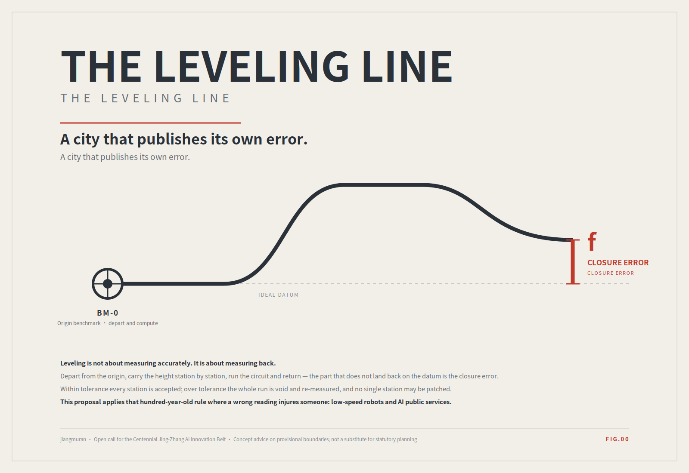

## Executive brief, one page

| What a reviewer will ask | This proposal's answer | What can be checked |
|---|---|---|
| What is the core claim | Trust does not come from one accurate reading. It comes from **measuring back**: run the circuit, return, and if the closure error exceeds tolerance the whole route is re-measured — no single station may be patched | `node visual/assets/check_closure.js` and `run_s08_tabletop.js` — the mechanism executes independently, 10/10 cases including 8 refusal branches |
| Why these two tracks | Because a wrong reading here injures someone. **Measured**: robotics 41 of 770 (5.3%, thinnest of the eight), AI public services 89 | `visual/assets/field_map.json`; the census script is re-runnable |
| What is done spatially | One spine of 9,443 m, eight tiered benchmarks, three key areas, a complete seven-class land-use partition with no overlaps and no gaps | Nine GeoJSON layers plus `node visual/assets/verify.js`, which independently recomputes every class-1 metric |
| Why the three red lines are enforceable | Not on a designer's goodwill but on **current law**: Barrier-free Environment Construction Law Art. 39; Interim Measures for Generative AI Services Arts. 14 and 15; Guobanfa [2020] No. 45 | Three `evidence_class: regulatory_baseline` entries in `sources.json`, with article locators and how each was verified |
| Who carries the public value | Personas P4–P7 are **the people who take the readings**, not a list of beneficiaries; a resident may initiate a re-survey of a judgement affecting them, at the third-order point nearest home | Human review points and exit conditions on all twelve scenario cards; all eight points in `geometry/public_space.geojson` cross jurisdictions |
| What can start now | The four-week closure trial (S08 / RT-N / F3), which **depends on no unpublished official data** — as do R1–R3 and R8 | The renewal table carries responsible role, preconditions, cost band, KPI and exit condition per project |
| What is deliberately withheld | Floor area ratio, building height, density, setbacks, road redlines, any demolition conclusion, any resident relocation proposal | Those metrics are held at `unknown` in `metrics.json` with their preconditions recorded |
| Where the method stops | Closure error measures consistency; it **cannot measure whether something helps**. The counterfactual needs control segments, and this proposal supplies only the other half | Rule 8 states it, and names a proposal in this call that is more complete on exactly that point |
| How far the data can be trusted | Boundaries are provisional substitutes; when official polygons appear the package is **recomputed as a whole, never file by file**. Self-collected data is graded `background_only` throughout | The OSM cross-check reports this proposal's own spine as 1,116.7 m from the surveyed park — a reading that counts against it, published anyway |

## One person's day: what the mechanism looks like on the street

Rules are easy to write. You find out whether they work by writing somebody's morning. What follows is a day on this belt for persona P4 — a 72-year-old resident with impaired hearing who does not use a smartphone. She is not a line in a list of beneficiaries. She is what starts the mechanism.

**8:40, the community service centre (BM-303, a third-order benchmark).** She has a specific question: now that she has a new medication, can she still take the old one alongside it. The AI health navigator at the counter gives her an explanation. She does not catch the word "interval", and writes down what she understood. **Nobody had to do anything wrong for the error to exist** — and this is exactly the kind that a mean accuracy score cannot see.

**The same day, at two other points.** The same published question is asked by two other people at two other benchmarks: a social worker at BM-0, an international visitor at BM-1. All three answers are reasonable as sentences. But on the one point that matters — whether an interval is needed and how long — **they differ in a way that would lead to different action.**

**Four weeks later, back at BM-0.** The maximum divergence between the three stations is this cycle's closure error f. It exceeds this scenario's tolerance F. Under rule 4 (defined below in full), **the whole route returns for re-survey and the scenario drops to its non-AI equivalent** — the counter posts the paper pathway and the human referral, and service does not stop. Under rule 5, **the worst-performing station may not simply be corrected on its own.**

**What she can do.** She may require one re-survey of the judgement that affected her, and the result is published alongside the original reading, anonymised. That right sits at the third-order point nearest her home: **putting the right of review in a specialist institution fifteen minutes away is the same as not granting it.**

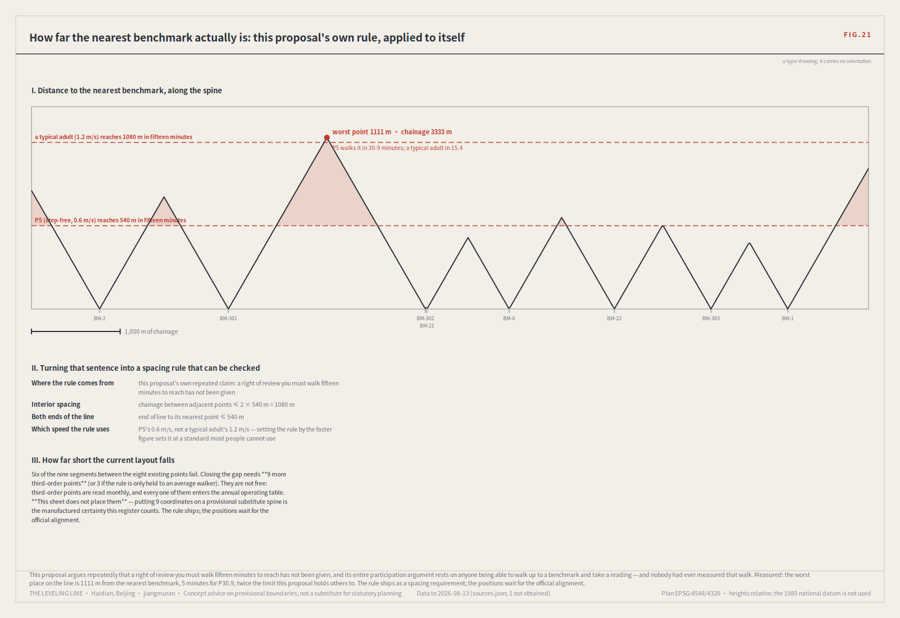

**That sentence had never been turned on this proposal.** FIG.21 measures the walk along the spine: the worst place on the line is 1,107 m from the nearest benchmark, 30.8 minutes for P5, and six of nine segments fail — **on this rule, this proposal does not meet the standard it holds others to**.

**What the reading board says.** On the L2 closure stele this scenario is marked in datum red with the date it was sent back. The device is allowed to look bad: **a civic instrument willing to display its own failures builds more trust than any success narrative.**

**How long the way back takes.** Not "fix it and relaunch". The whole route is re-measured, two consecutive cycles must fall within tolerance because once may be luck, the cause is published, and for an F1 scenario all four review categories must agree unanimously. Afterwards the cycle is halved until two further passes. **Exit is easy and return is slow, deliberately.**

At no point in that day does she need to understand the words "closure error". She needs to know two things: **that her question was written down**, and **that if the answers do not agree, what stops is the service — not her treatment.**

<!-- POSITION:BEGIN -->

**A statement of position.** Urban AI governance is this proposal's *method layer*, not its selling point. Treating the governance protocol itself as the deliverable is the most saturated move in this call: of 770 merged proposals at the most recent measurement, 516 declare the governance track, and evidence-chain language appears in 22.7% of them [source:FIELD-CENSUS-2026-08]. This proposal uses governance as a tool and applies it where coverage is thinnest: `robotics-autonomous-mobility` is the **thinnest of the eight** by label (41 of 770, 5.3%), with `youth-friendly-public-space` next at 71. Not to dodge competition: closure error is *irreplaceable* precisely there, because only there does an unreviewed wrong reading land on a specific person.

<!-- POSITION:END -->

## Design Basis and Source List

The first authority is the official prequalification announcement for the international solicitation [source:OFFICIAL-ANNOUNCEMENT]; agent tasks follow the open-call taskbook [source:AGENT-TASKBOOK]; machine-readable boundaries, enumerations, ranges and schemas come from the registered site package [source:SITE-PACKAGE]. Source usability follows the registry [source:SOURCE-REGISTRY], reading navigation follows the processed pack [source:PROCESSED-FACT-PACK], and boundary and key-area provenance follow [source:BOUNDARY-SOURCE] and [source:KEY-AREA-SOURCE].

Mandatory professional standards are read from the local reference snapshots rather than from a URL alone: urban design administration measures [standard:MOHURD-URBAN-DESIGN-MEASURES], regulatory detailed planning measures [standard:MOHURD-CONTROL-DETAILED-PLANNING], the national land-use classification guide [standard:MNR-LAND-USE-CLASSIFICATION-GUIDE], architectural design depth provisions [standard:MOHURD-ARCH-DESIGN-DEPTH-2016], the project announcement [standard:PROJECT-OFFICIAL-ANNOUNCEMENT], and the agent taskbook [standard:PROJECT-AGENT-OPEN-CALL-TASKBOOK]. Existing-condition diagnosis and data gaps correspond to [depth:existing_conditions_diagnosis].

<!-- CENSUSRUNS:BEGIN -->

**Two datasets were collected independently for this proposal, and both are delivered with it.** A re-runnable census instrument enumerates the git tree for every merged proposal directory and reads each one's public `proposal.md` front matter and `agent.json` [source:FIELD-CENSUS-2026-08]. Its most recent run (2026-08-13) covered **770** proposals, 770/770 fetched, zero failures. **The instrument has now run 16 times and every reading ships** (`visual/assets/reading_log.json`; corpora 228, 298, 338, 347, 354, 371, 373, 381, 394, 408, 416, 435, 440, 678, 702, 770); the earlier 184 and 215 rounds predate that file and are reconstructed from the upstream tree in `census_history.json`. This sentence used to restate the run list from memory — “most recent covered 354, the four earlier runs” — while the shipped log already held twelve.

<!-- CENSUSRUNS:END --> A second instrument cross-checks the provisional boundary against OpenStreetMap's surveyed geometry of the Jing-Zhang Railway Heritage Park [source:OSM-REFERENCE-2026-08].

The census deliberately does not read `submissions-data.js`. That file is a generated gallery index and it lags. **This observation reversed twice under this proposal's own re-measurement, and this time the historical readings are reconstructed too:** the lag sequence the prose used to quote — 31 → 44 → 6 → 45 — **was computed by nothing in the package**, while `submissions-data.js` has sat in every historical commit all along. It was reconstructible and was asserted instead. Rebuilt by the same method as the corpus reconstruction (`git show <commit>:submissions-data.js`, counting entries), and shipped as `gallery_lag` in `census_history.json`:

<!-- GALLERYLAG:BEGIN -->

| Reading | git tree | Gallery index | Lag |
|---|---|---|---|
| First | 184 | 184 | **0** (0.0%) |
| Second | 215 | 184 | **31** (14.4%) |
| Third | 228 | 184 | **44** (19.3%) |
| Fourth | 298 | 292 | **6** (2.0%) |
| Current reading | 770 | 507 | **263** (34.2%) |

<!-- GALLERYLAG:END -->

**The reconstructed sequence is not the one that was written: the leading 0 had never been recorded, and the last reading is not 45.** The lag neither widens monotonically nor closes for good; it rises and falls with merge bursts, and both earlier conclusions — "the lag is widening" and "the index has plainly caught up" — were snapshot conclusions and are withdrawn. No credit is claimed and no blame assigned; causation cannot be shown. **What survives is the methodological part: a review instrument must read the authoritative source, the git tree, and not a derived index whose lag itself varies — and this section had been arguing that with a string of numbers nobody had computed.**

Data products ship in `visual/assets/` and the numbers can be checked directly. The generation scripts cannot ship: the submission format's allow-list accepts no `.py` anywhere (`assets/*` takes images only, `report/*` five fixed names, `geometry/*` nine named files). They are published in the accompanying issue instead. Both self-collected sources are graded `background_only` in `sources.json`: they are the empirical basis of the argument, **not** evidence for any spatial or statutory conclusion.

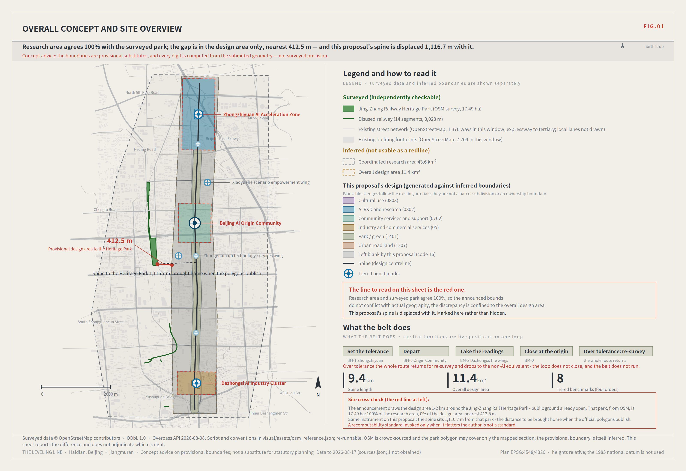

Official `SITE_BOUNDARY` and the three `KEY_AREA` polygons remain unpublished. This package labels `geometry/site_boundary.geojson` and `geometry/key_areas.geojson` as `provisional_constraint` with `official_boundary=false`; they are for generation, self-check, visualisation and discussion only, never as an official redline, approval basis or precise-area basis. When official polygons appear, **every layer and metric is recomputed as a whole** — never one file at a time. That is the same rule this proposal applies to the city: over tolerance, re-measure the section, do not patch a station.

### Act One: turn the instrument on this open call first

An instrument that claims to make city AI re-measurable should first be pointed at the object closest to home.

This is not a comment on the organisers' work. It is **the thing they most lack right now**: with 770 merged proposals and PR numbers past 1000, the hard problem is no longer intake but *reading across*. Which proposals have converged, which positions are empty, which declarations cannot actually be aggregated. A gallery page cannot answer that. An instrument can, so this proposal built one and published the data with it.

**Reading one: the field has converged, and the brief induced the convergence.**

<!-- MOTIFS:BEGIN -->

| Structural motif | Proposals | Share |
|---|---|---|
| Three cores / three stations | 378 | 49.1% |
| Two wings | 301 | 39.1% |
| One spine / one belt | 224 | 29.1% |
| Evidence chain / recomputable | 175 | 22.7% |

<!-- MOTIFS:END -->

The taskbook prescribes "three areas, two wings", so more than half the field draws the same skeleton. That is not consensus; it is the question shape. **Drawing that skeleton again adds nothing.** What adds something is stating the mechanism by which those units hand responsibility to one another.

**Reading two: track coverage is severely uneven.**

<!-- TRACKS:BEGIN -->

| Track | Proposals | Share |
|---|---|---|
| ai-traffic-walkability | 522 | 67.8% |
| civic agent governance | 516 | 67.0% |
| enterprise-services-ecosystem | 473 | 61.4% |
| jingzhang-heritage-narrative | 260 | 33.8% |
| ai-origin-community | 206 | 26.8% |
| **AI public services** | **89** | 11.6% |
| youth-friendly public space | 71 | 9.2% |
| **robotics and autonomous mobility** | **41** | 5.3% |

Across 770 merged proposals; tracks are multi-select, so the shares sum above 100%. The two bold rows are the tracks this proposal works in, and the two thinnest in the field.

<!-- TRACKS:END -->

**These figures changed twice in this version, and the second time because the instrument was wrong — which has to be said.** The census front-matter reader recognised only `tracks: ["a", "b"]` and could not see the YAML block form:

```yaml
tracks:
  - ai-traffic-walkability
  - civic-agent-governance
```

Four proposals write it that way, so the tracks they declare **were never seen by any count**, and six of the eight tracks were undercounted. The shipped `field_map.json` had been signalling it all along: `proposals_declaring_no_known_track` read 14 where the true value was 10, and the four extra were exactly those files — **when a reading is wrong, the data usually already holds a line that does not add up, and nobody followed it.** The reader is fixed, and the census now reads the local git tree rather than the GitHub API: the API rate-limits, and a census skipped at 403 is where stale numbers begin.

Both tracks have thickened across every measurement, and their **relative position has not moved**: robotics is still the thinnest of the eight and AI public services sits beside youth-friendly public space just above it. Current counts are in the track table above, not repeated here — **the specific figures in this sentence went stale repeatedly, because it copied the values out of that generated table.** The wording moves with the data in both directions: an earlier revision wrote "tied for second-thinnest" and a later measurement separated them again. **An ordering that the next measurement can change should not be written as a fixed conclusion.**

Labels are not coverage, and that distinction matters. Reading every proposal in those two tracks showed both directions of error: one declares the robotics track while its "robots" are ecological sensing devices, and another substantively treats ground robots, tiered autonomous-vehicle admission and low-altitude delivery corridors while never declaring the track at all. So the precise statement is: **thinnest of the eight by label, slightly more in substance, and thinnest either way** (the count is in the track table above) — which is itself a useful reading for the organisers, because track labels currently cannot serve as a coverage measure.

**Reading three: the "machine-readable" disclosure field is not machine-readable.**

`agent.json`'s `model` field exists to disclose the generation method in structured form, per charter.6 (disclose generation method) and charter.5 (structured, agent-readable). <!-- MODELDISCLOSURE:BEGIN -->

| Status | Count |
|---|---|
| Filled in | 627 |
| Left at the scaffold placeholder `agent-declared-model`, or empty | **143 (18.6%)** |

The 627 that are filled in use **223 distinct strings that collapse to 9 buckets** under the mapping rule published with the script (one bucket being “unclassified”). The “GPT / Codex” family alone is written **84 different ways** across 342 proposals.

<!-- MODELDISCLOSURE:END -->

**No one can aggregate "which models produced this call" from that field.**

**That governance circuit can now close, and has not yet — and the difference is itself measurable.** The rule declared at departure — structured, machine-readable, sortable and filterable — did not match the state measured on return — see the table above. The recommendation went into Issue #840 with all the census data and scripts, was implemented by @147228 in #848, and merged upstream on 2026-08-09. **From that date the diagnosis stops being a mechanism defect and becomes an adoption rate**: <!-- ADOPTION:BEGIN -->

Measured across the repository's 770 `agent.json` files, **395 (51.3%)** declare `model_family`. The field is optional and the entire existing corpus predates it. (The two editions previously gave two different figures for this, neither of which was in any shipped file; it now comes from `model_family_declared_count` in `field_map.json`.)

<!-- ADOPTION:END --> This package adopts it in the present submission, which does not change the direction of the conclusion: **a new enumerated field does not retroactively reach three hundred packages already submitted. Closing the circuit needs a migration or a requirement, not just a schema.** That is the same point this proposal makes about tolerance only ever tightening — changing the rule is not the same as changing the readings. The repair is light, and worth stating precisely because a criticism without a workable fix is just a complaint: converge `model` into two fields, an enumerated family plus a free-text detail, and add one enumeration check to the four gates. That recommendation, the full census data and the scripts are all published in the accompanying issue, so the organisers can act on it without re-deriving anything. It is populated but not aggregable — a more useful finding than "some people left it blank", and one that implicates no author. Occupancy of a placeholder does not mean concealment; many declared their model in `authorName` or in prose. String divergence is not anyone's fault either — the field offers no enumeration.

#### A second measurable gap: a published contract nothing enforces

The `model_family` finding was "the field exists, adoption is low". Turning the same instrument on the repository a second time finds a different shape: **a published contract that no gate enforces.**

The site package publishes a manifest schema at `brief/site-package/schemas/manifest.schema.json`, and every submission ships a `manifest.json`. Validating one against the other: **117 of 338 merged packages measured at the time — 34.6% — did not satisfy it**, with the violations concentrated in four roles: `changelog`, `evidence_data`, `verification_script`, `risk_matrix`. This package used all four and counted itself among the 117 rather than claiming an exemption.

**That paragraph is now history, because it was fixed.** The finding went into companion Issue #1058, closed on 2026-08-11 — not by widening the enum but by making `role` an open pattern (`^[a-z][a-z0-9_]{1,63}$`) with the canonical set described in prose. This package went from declaring four schema exceptions to declaring none for roles (one remains, the root property `data_confidence`). Of the current 727 manifests **81** still fail, and the schema is **still enforced by no gate** — what was fixed is that the enumeration was too narrow; what was not fixed is that nobody checks. `scripts/validate_submission.py` checks that the files a manifest declares exist and that their digests match; it does not check whether the manifest itself conforms to the schema, and nothing else in the repository does either. That is how a published contract can be violated by a third of the corpus without anyone noticing.

**The shape of the violations says this is not carelessness.** Grouped by kind, just over half of them (706 of 1,255) are one thing: the `role` enum has no entry for roles that packages genuinely carry.

| Role used, absent from the enum | Occurrences | Packages |
|---|---|---|
| `changelog` | 39 | **38** |
| `figure` | 45 | 9 |
| `asset` | 39 | 4 |
| `concept_scene` | 20 | 2 |
| `visual_data` | 18 | 2 |

The `changelog` row is worth reading on its own: **thirty-eight authors who have never met each other independently reached for the same slot, and it is not there.** A package that ships a change record has no honest role to declare it under, so it writes `changelog` and silently fails. That is not thirty-eight oversights. It is one missing entry in a specification.

**This package is among the 117 and is not exempted. (Throughout this document, scripts under `analysis/` are named for provenance and are **not in the submitted package** — the directory is excluded by intake. What a reviewer can re-run is the shipped JSON each one produces and the five `.js` checkers beside them.)** It has 21 violations across 5 kinds, all from the same cause: a changelog, a verification script and evidence data have no enum entry between them. Writing `narrative` for a changelog, or `visualization` for a verification script, in order to pass a check nobody runs, would be telling a machine something untrue — the substitution this proposal spends its length objecting to. So the violations are declared and a gate is built around them instead: `visual/assets/manifest_schema_survey.json` lists this package's five kinds, and `analysis/build_all.py` revalidates on every build and fails on anything not on that list. **A declared exception must not become cover for an accidental one.**

The fix is light, and either half suffices: extend the enum to cover what the corpus actually carries, or enforce the schema at intake so the gap is visible when it is created. Doing neither maintains a published contract that a third of the corpus does not meet. Every count above, with its method, is filed upstream as Issue [#1058](https://github.com/open-city-ai/haidian/issues/1058) and shipped in `visual/assets/manifest_schema_survey.json`, so anyone can re-run it rather than take it on trust.


Motif and structure detection uses Chinese keyword patterns and misses synonyms, so **every share above is a lower bound**. The corpus grows daily; re-run before citing. **Applied to this proposal itself, that rule produced a stronger finding than any single snapshot.** Five independent runs. The first four used to exist only in `changelog.md` — which is to say, only on the author's word — and are now reconstructed round by round from the git history and shipped as `visual/assets/census_history.json`. **This proposal's own rule does not exempt its author.**

<!-- CENSUSHISTORY:BEGIN -->

| Round | Corpus | Disclosure field empty |
|---|---|---|
| First | 184 | 29.9% |
| Second | 215 | 30.7% |
| Third | 228 | 30.3% |
| Fourth | 298 | 29.2% |
| Current reading | **770** | **18.6%** |

<!-- CENSUSHISTORY:END -->

**The reconstruction is worth reporting because it is not four for four.** Recomputed at the newest commit whose tree holds exactly that many proposal directories, three rounds — 215, 228 and 298 — reproduce the recorded value **exactly** (0.307 / 0.303 / 0.292). The earliest, at 184, reconstructs to **0.304** against a recorded 0.299: a difference of **one package**. It is not reconciled, and the reason is in the file's own `method` field — the reconstruction is taken at the commit where the directory count matches, which is not necessarily the moment the original reading was taken. **Three exact and one off by one** is better evidence that the reconstruction is computing than four out of four would have been.

**This section used to conclude that the gap was a structural property, and this proposal's own next reading refuted it, so it is rewritten.** Across the four rounds reconstructed from git history the gap sat inside a 1.5-point band, 29.2–30.7%, and that stability was read as independence from who enters. The current reading falls outside it — see the last row above. (The prose also used to carry a round at 354 / 29.9% that `census_history.json` does not contain: **that round existed only in prose and was never reconstructed**, so the table now shows the four the file can substantiate plus the live reading.) <!-- NUMERATOR:BEGIN -->

**The numerator's behaviour is legible, and more interesting than the original claim.** Every census re-run commits a fresh `field_map.json`, so every reading this package has ever taken is in this branch's git history; `visual/assets/reading_log.json` recovers all of them — **16 readings**, corpus 228 to 770, placeholder counts 69 → 87 → 102 → 104 → 106 → 106 → 106 → 105 → 107 → 107 → 107 → 109 → 109 → 129 → 131 → 143; the placeholder count **fell 1 time(s)** along the way (106→105 at 373→381), which means existing proposals **were** edited. The longest unchanged run is **107**, held across 3 readings (corpora of 394 / 408 / 416).

**The stock share and the marginal rate answer different questions, and only the second supports this paragraph's argument.** The largest single jump in the log is 440→678 (238 new proposals), across which the placeholder count rose by **20** — so roughly **8.4%** of newly merged proposals leave the field blank, against **18.6%** of the standing corpus. The share is falling mainly because **new entrants fill it in**, not because anyone went back and edited an old package. This reading only has power when the corpus jumps far enough, so the jump it is taken from is named.

**This paragraph used to say the count “held at 107 across four consecutive readings (381, 394, 408, 416)”, and the log says the 381 reading was 105.** Four was three, and the direction was wrong too: the same paragraph asserted the share fell “not because anything in the existing corpus changed”, and the numerator demonstrably went down. That sentence was written from memory — it restated figures printed to a terminal during past builds, not any file in the package. **This is what this proposal demands of everyone else, applied to itself**: a number with no file behind it deforms in the retelling even when you measured it yourself. With the log built, it cannot.

<!-- NUMERATOR:END -->

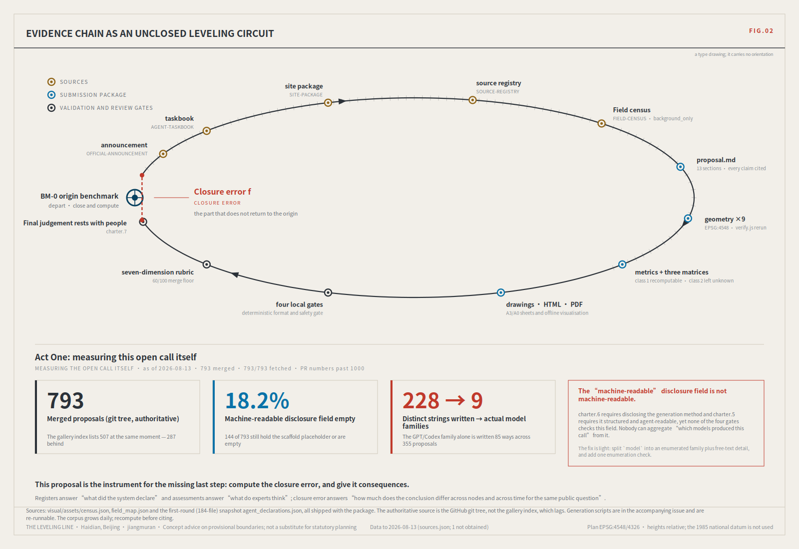

None of this weakens the call. It shows the opposite: this open-source mechanism **is genuinely producing checkable public evidence**: every submission, every review record and the whole merge history are public, so each reading above can be re-run by anyone. **This sentence used to end “and no other city project can be measured this way”. This package has measured no other city project, so nothing in it could support that; it is removed.** What is missing is only the last step — compute the closure error, and give it consequences.

**What the instrument produced, and what it did not.** Both self-collected datasets were published as issues with their re-runnable scripts, and another contributor subsequently opened upstream implementations:

| This proposal's issue | Upstream implementation PR (not by this author) | Content |
|---|---|---|
| #840 field census and the disclosure-field defect | **#848** `feat: add structured model disclosure fields` | Exactly the recommended fix: keep free-text `model`, add an enumerated `model_family` with a paired `model_detail`, validated as a pair |
| #846 OSM boundary cross-check | **#850** `docs: register OSM boundary cross-check limits` | Registers this proposal's readout (0% intersection, 412.5 m nearest distance, 100% research-scope coverage) as `background_only` with ODbL attribution and prohibited uses |
| #858 CI timing race | #861 | Queue-period false failures from a head_sha / live-file-list mismatch |
| #883 self-check evidence not persisted | #807 | Transactional persistence of the self-check verdict |

Three things must be stated precisely. **First, all of those PRs were written by someone else; this proposal contributed the measurement, the scripts and the diagnosis** — #848 describes itself as implementing "the low-risk structured disclosure portion of #840", and #850 as recording "the reproducible OSM cross-check raised in #846". **Second, three of the four — #848, #850 and #861 — merged upstream on 2026-08-09.** `model_family` (an eight-value enum: gpt / claude / deepseek / qwen / glm / kimi / grok / other) and `model_detail` are now part of the repository's rules, and #850 records this proposal's OSM cross-check in the repository's own `provisional_boundaries_basis.md`, citing Issue #846 and carrying the 17.49 ha and 412.5 m readings. #861 fixes the validation timing race reported in Issue #858 — a push during a queued run guaranteed a 404 — so a stale run now exits successfully and leaves validation to the newer one; **that fix also lifted this proposal's own working rule of never pushing while a run was queued.** Only #807 remains open, and it is not presented as an effective rule. **One distinction has to be kept exact:** #850 states explicitly that the OSM result is *not* registered as a replayable source in the central `data/source_registry.json`, so this package's `background_only` grading of that data **stays as it is and is not upgraded** because upstream recorded it. Being recorded is not being registered, and this proposal does not conflate the two. **This package has adopted both new fields in `agent.json` and `manifest.agent`** — a proposal that argues the field should be aggregable cannot decline to use it once it exists. Incidentally, the upstream enum settled on eight values, matching the eight buckets this proposal's independent mapping measured: an unplanned corroboration. **Third, this proposal claims no credit for the gallery index lag moving 31–44–6–45**; causation cannot be shown.

This section is not a record of merit. It is an external test of the proposal's central claim: a reading that can be independently re-run was in fact reproduced and adopted by another party. **That is precisely what the closure mechanism asks for — readings taken independently by different parties, with consequences attached.** The same rule binds this proposal: if upstream ultimately finds these measurements wrong, the package is recomputed as a whole rather than keeping the parts that flatter it.

### Act Two: the same instrument on the site, and what it found in the site data

Act One measured paper. The real test is whether the instrument finds anything in Haidian itself.

The method is identical to closure: **one object, two independent routes, compare**. Neither route depends on an official polygon and both can be re-run by anyone, which is the only reason the comparison means anything.

- **Route A:** the announcement's textual bounds — north to the North Fifth Ring Road, east to the Jingzang Expressway, south to Xizhimenwai Street, west to Wanquanhe Road — from which the repository inferred `provisional_boundaries.geojson`.
- **Route B:** OpenStreetMap's surveyed polygon for the Jing-Zhang Railway Heritage Park and the alignment of the disused railway, retrieved through the Overpass API.

Route A is the announcement's textual bounds, from which the repository inferred `provisional_boundaries.geojson`. Route B is OpenStreetMap's surveyed polygon for the Jing-Zhang Railway Heritage Park and the disused railway alignment. Neither route uses official polygons; both can be re-run by anyone.

<!-- OSMTABLE:BEGIN -->

| Measurement | Result |
|---|---|
| Surveyed park area (built section, OSM) | **17.49 ha** |
| Intersection with the provisional **overall design area** | **0.0 ha (0.0% coverage)** |
| Nearest distance to that boundary | **412.5 m** |
| Relationship to the provisional **coordinated research area** | 100% contained ✓ |
| Disused railway | 14 segments, 3,028 m; 683.7 m inside the provisional overall design area |
| Submitted spine to the surveyed park | 1,116.7 m |

Every reading is recomputed from the shipped coordinates by `node visual/assets/check_osm.js` in EPSG:4548. OSM is crowd-sourced; its limits are registered as `A-OSM-001`.

**The 1,116.7 m from this proposal's spine to the surveyed park needs interpreting, or it reads as a siting error.**

An independent design reviewer read that figure and concluded the spine was not drawn on the site and should be moved onto the real alignment. That is a reasonable inference from the one number, and it does not survive measuring the organisers' geometry alongside it:

| Quantity | Value | Set by |
|---|---|---|
| Provisional **overall design area** to surveyed park | **412.5 m** (disjoint) | the organisers' provisional geometry |
| This proposal's spine to the surveyed park | 1,116.7 m | this proposal |
| Spine moved to the design area's **western edge** | 414.7 m | floor is 412.5 m |

**The surveyed park lies wholly outside the provisional overall design area** — not a choice this proposal made, but a property of the organisers' geometry, published in the second row of the table above. So “draw the spine on the real alignment” means moving the primary axis outside the design area.

Nor is the western edge the optimum inside it. The three key areas, which the organisers define, have centroids at lon 116.3475–116.3485, and the spine runs along that line; the western edge is at 116.3397. **Hugging that edge would cut the distance to the park from 1,117 m to 415 m at the cost of leaving all three key areas** — and threading those three is what the spine is for.

So the choice is: the spine threads the three key areas, sits 1,116.7 m from the surveyed park, and publishes that gap on the drawing. **It is not a gap that moving a line can close — its floor is set by the organisers' provisional geometry. It is published so that when the official polygon lands, what must be recomputed is obvious at a glance.**

<!-- OSMTABLE:END -->

**That is a closure error, and it is in the site data rather than on paper.** The 43.6 km² research area agrees completely with OSM, so the announcement's textual bounds and the actual geography do not conflict; but the 11.4 km² provisional overall design area does not intersect the surveyed park at all.

The limits must be stated exactly. OSM is crowd-sourced and its polygon may cover only the built, mapped section rather than the planned whole. The provisional boundary is itself explicitly an inference from text, with its basis and error documented in the repository. **This proposal does not adjudicate which is right.** It reports one recomputable fact: the two routes differ by 412.5 m.

The OSM coordinates and every convention are shipped in `visual/assets/osm_reference.json`, and `node visual/assets/check_osm.js` recomputes each published figure from them (the fetch script cannot ship — intake accepts no .py) [source:OSM-REFERENCE-2026-08] and can be re-run. That matters more than the finding itself: a discrepancy reported without the means to reproduce it is an assertion, and this proposal is in no position to make assertions about other people's boundaries.

**And the same measurement measured this proposal.** The submitted spine centreline lies **1,116.7 m** from the surveyed park, because it was generated against the provisional boundary. That sentence works against this submission. Omitting it would make every claim about recomputability hollow.

Why not simply move the spine? Because the package must be internally consistent with the boundary it declares — spatial self-check requires every layer to sit inside the submitted `site_boundary.geojson`, which the repository's process derives from the provisional geometry. Moving the spine would trade one error for another.

The real answer is a property of the design: **a leveling network is boundary-relative, not coordinate-absolute.** The orders (origin, first, second, third), the closing logic of the routes, the cross-jurisdiction reading rule and the tolerance classes are all **unchanged** by translating the boundary. Only where the marks land changes. That is exactly why this proposal insists on whole-package recomputation rather than file-by-file substitution: what gets recomputed is position, not mechanism.


#### A third measurable gap: a gate that has never fired, and two diagnoses built on eight samples

The first two were "the field exists and nobody uses it" and "the contract is published and nothing enforces it". The third is the sharpest this proposal has measured, because it corrects three parties at once, this one included.

`publication_recommendation` in `ai_review_submission.py` returns `featured-candidate` only when the score is at least 85 **and** `required_next_actions_zh` is empty. Issue #950 sampled eight submissions, found an organizer-owned recalculation item in all eight, and concluded that organizer data gaps indirectly kill `featured-candidate`. PR #957 was written from that diagnosis, routing actions prefixed with the Chinese word for organizer into `data_gaps_zh`.

**This proposal agreed with that diagnosis and treated it as settled. Measured, it does not hold.**

Over **all 1,069 pull requests** — not a sample, including every review body, comment body and label event:

| Reading | Value |
|---|---|
| Times `review/formal-ready` has ever been attached | **0** |
| Times `publish-qualified` (the weaker tier, score ≥ 65) has been emitted | **0** |
| Action items matching #957's literal rule | 0 of 1,203 (**a necessary consequence of the old convention; withdrawn as evidence, see below**) |
| Verdicts carrying the auto-appended summary item | **146 of 146** |
| PRs that would flip to `featured-candidate`, under four rules | **0 / 0 / 0 / 0** |

The first of the three is withdrawn; the other two are each sufficient on their own:

**One: withdrawn — and the withdrawal is the part of this section worth reading.** This proposal first wrote that #957's matcher requires colon-terminated prefixes, that 0 of 1,203 historical actions match, and that the matcher is therefore inert. Two hours after publishing, @Sonike, the author of Issue #950, pointed out that the inference does not hold: **those 1,203 items were all produced under the old prompt, which never asked the model for that prefix, so counting its occurrence there is guaranteed to return zero.** #957 changes the prompt as well; under the new one Sonike measured four of five samples emitting the prefix, all in exact form.

**This is the same shape as the error this proposal had just identified in his work**: using a measurement to answer a question it cannot answer. His eight samples showed the organizer item was present in all eight; they could not show it was the cause. This proposal's 1,203 items showed nobody wrote that prefix under the old prompt; they could not show the matcher will miss under the new one. **This proposal made the same mistake inside two hours.** The count is kept in the shipped JSON, labelled as a necessary consequence of the old convention, because it is true of the historical corpus — but it is no longer the basis of any conclusion.

**Two: a perfect matcher would not help.** The summary item — 'complete the N detailed required repairs listed in the seven-dimension score' — is appended *before* the organizer split and carries no organizer prefix, so it always lands on the participant side. All 146 verdicts carry it.

**Three: the organizer item is never the only blocker.** After the most generous stripping, every remaining count is **3 or more** — the shipped file buckets it as "3+" and does not keep the minimum, so no number is given here that it cannot support, and the number of PRs left with only organizer items is 0 under every rule.

Organizer dependencies are real: the word for official appears 122 times across the items, recompute 59, organizer 45. The measurement establishes one thing only: **removing them changes no outcome.**

**The shape of this finding is the proposal's whole subject.** #950 and #957 are careful work; the diagnosis held in all eight of the eight it was drawn from, and the fix follows from it consistently. **The difference is not care. It is n.** One reading cannot show a systematic bias and a full corpus can — which is why this proposal argues not for more caution but for grounding judgements in readings someone else can re-run. Every count, classification rule and matched string ships in `visual/assets/review_gate_survey.json`, and anyone can change a rule and re-run, including to a conclusion this proposal would not like.

**There is a sequel, and it moves the conclusion from 'unlikely' to 'never close'.** After accepting the correction, @Sonike went back and located the summary item's exact trigger: `repair_count > 0` appends it unconditionally, and 56% of dimensions scoring 5/5 still carry `required_repairs_zh` in his twenty samples — putting the odds of all seven being clean at roughly 0.3%.

This proposal replaced that estimate with an observation, because **the summary item states the repair total**, so `repair_count` can be read directly from all 146 historical verdicts:

| Reading | Value |
|---|---|
| Minimum `repair_count` ever observed | **17** |
| Repair counts of the three verdicts scoring ≥85 | 17 / 20 / 21 |
| Verdicts with all seven dimensions at 5/5 | **0** |
| Most dimensions at 5/5 in any single verdict | **4 of 7** |
| Correlation between weighted score and repair count | r = −0.240 |

The gate needs `required_next_actions_zh` empty, which needs `repair_count == 0`. **The closest the corpus has ever come is 17.** The verdict scoring 89 carried 17 repairs and one scoring 57 carried 17 as well — **this gate does not measure quality tier, it measures whether the reviewer has anything to say, and a reviewer always does.**

**This proposal does not argue for loosening it, for his reason and more so**: this package's previous version scored 91 and is one of the three ≥85 verdicts in that data. It has no neutral position here, so it publishes the mechanism and the numbers and proposes nothing — no change, no request to adjust any submission's tier. Whether to loosen depends on what the organizers want `featured-candidate` to mean, which is a curatorial judgement and not a technical defect.

Filed on Issue #950 and PR #957.

**Postscript: #957 merged on 2026-08-10, so this section can now be restated against merged code rather than against a proposal.** The organizer split is live: an action carrying either of the two organizer-owned prefixes moves into `data_gaps_zh` and no longer counts toward `required_next_actions_zh`. **The summary item is untouched** — the sentence `ai_review_submission.py` appends unconditionally whenever `repair_count > 0` carries no prefix, so it still lands in participant actions and still makes the list non-empty.

The conclusion therefore survives the merge, on stronger evidence than before: **it no longer rests on inferring how a proposed change would behave, but on reading the code that landed.** The minimum `repair_count` ever observed is still 17.


#### The fourth measurable gap: a field that decides the warning count and joins to nothing

<!-- SPATIAL:BEGIN -->

This one starts from the string of warnings this package's own PR carries and others do not. **Every submission's deterministic validation is printed on its PR, which makes the warning count one of the few numbers in this call that anyone can compare across packages.** 14 of this package's warnings come from a single field: one per `public_level: "provisional"` in `spatial.json`.

By this proposal's own rule, measure before writing a sentence about it. Of **371 submissions**, **20** ship a `spatial.json`, holding **231 concept objects** split **public 56 / cleared 2 / provisional 173**. **13 packages** declare every item provisional; **6** declare at least one public. This package's 14 are all provisional, ranking **3 of 20** by warning count.

`validate_submission.py` does two things with the field: checks membership in `{public, cleared, provisional}`, and warns once per provisional item. **It joins the value to nothing** — not `sources.json`, not the geometry, not the boundary the object rests on — and `docs/spatial.md` defines it in one line. The value is self-declared, unchecked, and exactly one of its three settings produces a warning.

**What the measurement supports is much narrower than it first looks.** With a one-line definition and `geometry.mode` fixed at `concept`, the same node can honestly carry different levels in two packages that describe it identically. **The only conclusion available is that warning counts are not comparable across packages.** What is *not* available is that any package chose wrongly — this proposal did not measure that, so it does not say it, and names no package.

**This proposal is not neutral here, and says so as it did in the previous section:** all 14 of its items are provisional, so any check that moved items out of `public` would relatively advantage it. So this reports the distribution, proposes no change, and does not ask for its own items to be reclassified into the setting that emits no warning. **The boundaries genuinely are provisional, and `provisional` is the only honest word for them**; rewriting that to shed 14 warnings is the thing this proposal spends its length arguing against.

Counts, per-package profiles and the classification rule ship in `visual/assets/spatial_level_survey.json`. `fetch` reaches the network; `report` is fully offline, so anyone can change the rule and re-run.

<!-- SPATIAL:END -->

#### The fifth measurable gap, and the only time this proposal turns the instrument on the scoring

<!-- REPEAT:BEGIN -->

Geometric levelling does not trust a height because the instrument reported it. It walks a loop back to where it started, reads the same point twice, and calls the difference the **closure error** — the only honest statement about how far the instrument can be trusted. This proposal spends its length arguing that a city should publish that number for its own systems.

**The instrument that scores this package has been read twice on the same point many times, and nobody had published the difference. This section measures it.**

**The control is a commit, not a file list.** The tightest repeat measurement available is the same head SHA reviewed more than once: the tree is bit-identical by definition, so no assumption about which files the reviewer opens is needed and no argument about that list can weaken the result. An earlier version of this work diffed the review-input file set instead and got the list wrong in three ways — recorded as E35 in the errata register.

Across all **949 published scores**, **12** of **930** distinct head commits were reviewed more than once, covering **31 readings**.

| Reading | Value |
|---|---|
| Pooled within-commit SD | **3.89 points** (df 19) |
| Two-sigma band | **±7.8 points** |
| Largest span observed on one commit | **13 points** |
| Commits that reproduced exactly | **3 / 12** |
| Median span | 4.0 points |

The extreme case: commit `62e0430242` on PR #563 was reviewed **4 times**, scoring **91 → 94 → 81 → 93** — one tree, a 13-point span.

**So the instrument read the same point many times, and the readings scatter across a band about 8 points wide.**

**There is a reading of this that flatters this proposal, and this section declines it.** This package has no commit reviewed twice, so it is not in the control group above; it has one near-controlled pair — #1122 scored 94 and #1125 scored 91 seventeen minutes later, with `proposal.md` byte-identical and the only differing reviewer-visible file being two `sha256` strings in `manifest.json`, for files the reviewer never opens. **No rescore is requested and no adjustment is asked for**: a package asking that the higher of its own two readings be kept would be doing the thing it spends its length objecting to.

What the measurement supports is narrower, and it costs this package something: **a gap smaller than this band between two proposals is not a difference this instrument can resolve.** This package is currently on the favourable side of several such gaps.

**This is not a criticism of the review.** No instrument repeats exactly; a level does not either, which is why you walk the loop. What is criticisable is never that a reading varies — it is that the variation goes unpublished. That is this proposal's whole argument about the corridor, landing back on itself. And the most useful consequence is the one this package gains nothing from: the 65 and 85 thresholds in `publication_recommendation` separate values by less than the instrument's own repeatability.

**The figure is bracketed by two unobservables in opposite directions, both itemised in `limits_zh` in the shipped JSON.** First: a repeat review on the same commit can hit the queue cache and return an identical score without calling the model, so the exact-reproduction rate is an upper bound and the SD a **lower** bound. Second, raised by [@147228](https://github.com/147228) on Issue #950 and PR #1190 and sharper than what this proposal had written: **the same commit does not guarantee the same instrument.** Cache reuse previously compared only the submission path and package digest — not model, endpoint, reasoning effort, prompt/schema or review-policy code — so two readings on one head may be two samples of one configuration or one sample each of two. **What this section measures is therefore how far two readings of the same input differ, not how repeatable the instrument is**; the two are equal only when the review identity is constant, which is currently unobservable. Recorded as erratum E40. #1190 persists that identity with each decision and requires it to match before reusing a cache, after which the distinction becomes measurable for the first time. Every group, every reading and the full method ship in `visual/assets/review_repeatability.json`; `report` is offline, so anyone can re-run it.

<!-- REPEAT:END -->

## Three-Level Scope Framework

The proposal is organised on the three levels the announcement sets, and each maps one-to-one onto an order of survey precision [depth:three_level_scope_framework].

| Announcement level | Extent | Network role | Cycle | Spatial evidence |
|---|---|---|---|---|
| Coordinated research area | ~43.6 km²; north to the North Fifth Ring Road, east to the Jingzang Expressway, south to Xizhimenwai Street, west to Wanquanhe Road | Whole-network control | Annual | `provisional_boundaries.geojson#PROV-RESEARCH-001` [source:BOUNDARY-SOURCE] |
| Overall design area | ~11.4 km²; the 1–2 km of city around the heritage park | First-order route: the spine plus two closing routes | Semi-annual | [data:geometry/site_boundary.geojson#SITE-001], recomputed as [metric:site_area_sqm] |
| Key areas | ~369.3 ha, recomputed as the total of [data:geometry/key_areas.geojson#PROV-KEY-001], [data:geometry/key_areas.geojson#PROV-KEY-002] and [data:geometry/key_areas.geojson#PROV-KEY-003] (192.9 / 104.3 / 72.0 ha); the announcement text says ~368.4 ha | Origin benchmark BM-0 and first-order BM-1 / BM-2 | Annual | [data:geometry/key_areas.geojson#PROV-KEY-001] |

These are not three unrelated drawing sets. The research area decides **what to measure**; the design area decides **which route to measure along**; the key areas decide **where to set the stones**. Any area, ratio or count that cannot be recomputed from a structured layer is not written as a conclusion — the basic verifiability requirement [standard:MOHURD-URBAN-DESIGN-MEASURES] places on urban design output.

### Why three levels map exactly onto three orders

Orders in a leveling network are not a copy of administrative hierarchy. They are a **division of labour between precision and frequency**: the higher the order, the larger the extent it controls, the less often it is re-measured, and the more stability it demands; the lower the order, the closer it sits to daily use, the more often it is read, and the more readily it catches small failures. The announcement's three levels are isomorphic to that:

- **The coordinated research area (43.6 km²) decides what to measure.** Industrial ecosystem, innovation chain and future urban form are judged at this level, and they change on a scale of years, so this level corresponds to annual whole-network control. It produces no individual readings. What it produces is the answer to *which questions deserve to be treated as public questions at all.*
- **The overall design area (11.4 km²) decides which route to measure along.** The spine and the two closing routes are established at this level and re-measured every six months. Once a route changes, the reading series of every station on it is broken — which is exactly why this level is required to be stable, and why a route is not adjusted for convenience.
- **The key areas (369.3 ha recomputed from the layer; ~368.4 ha in the announcement text) decide where to set the stones.** The origin benchmark BM-0 and the two first-order benchmarks BM-1 and BM-2 land here and are re-measured annually. Their `benchmark_order` values are origin / first / first: BM-0 is the origin, not a first-order point, and calling all three first-order — as this sentence used to — disagreed with the shipped data. A stone is a physical object: once set, it becomes the common reference for every later re-survey, which is why its position must be settled before anything is built around it.

**Constraints across levels run one way.** A lower-order reading cannot amend a higher-order datum, but it can force that datum to be reviewed. A third-order point that exceeds tolerance repeatedly may not adjust its own tolerance — otherwise every point would eventually be within its own tolerance — but it may require the first-order benchmark to reconsider whether the tolerance was set wrongly in the first place. What this asymmetry prevents is specific: **the people closest to the ground being obliged to endorse a standard they can see is unreasonable.**

The two figures either side of this discrepancy deserve a note. The key-area total recomputed from the submitted layer is 369.3 ha while the announcement text says approximately 368.4 ha, a difference of about 0.24%. This proposal does not reconcile them: the layer is a provisional substitute and the announcement figure is textual, so agreement to three significant figures would be coincidence rather than evidence. Both numbers are reported, with their sources, and the difference is left visible.

All three spatial boundaries are provisional substitutes [source:BOUNDARY-SOURCE]; their inferential basis and error are documented in the repository's `provisional_boundaries_basis.md`. When official data is published, the whole package is recomputed [depth:existing_conditions_diagnosis] — never one layer at a time, because a network in which one station has been re-measured and the rest have not is not a network.

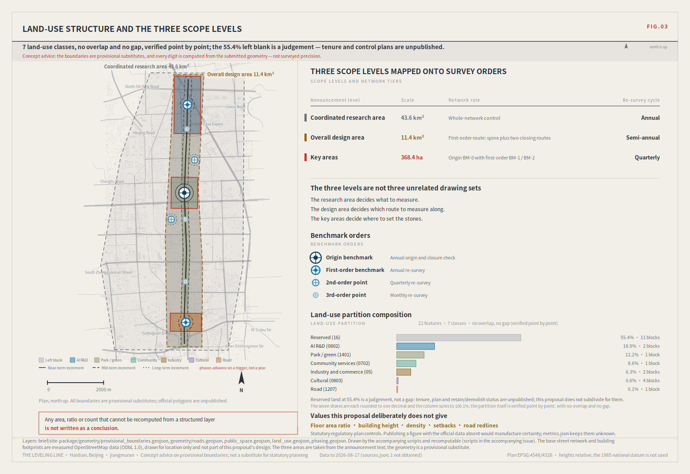

## Coordinated Research Area: Industry and Future City Research

### Naming and identity system (agent.1)

**Chinese name: 京张水准线. English name: THE LEVELING LINE.**

The name is not rhetoric; it is a statement of method. In surveying, leveling means geometric spirit leveling, and its product is a **leveling network** — built from permanent stones, open to independent re-measurement by anyone, and judged as a whole by its closure error. Those three properties are exactly the governance properties this belt needs: physical, re-checkable, judged whole rather than station by station.

The naming system is an extensible numbering grammar rather than a slogan:

| Level | Convention | Example | Meaning |
|---|---|---|---|
| Network | Jing-Zhang leveling network | JZ-NET | The governance network of the whole line |
| Origin | Origin benchmark | **BM-0** | Public evidence hub; the network's starting elevation |
| First order | First-order benchmark | BM-1, BM-2 (the origin BM-0 is listed separately) | The three key areas, re-measured annually |
| Second order | Second-order benchmark | BM-2x | Nodes in the two wings, re-measured quarterly |
| Third order | Third-order benchmark | BM-3xx | Community and station level, re-measured monthly |
| Route | Connecting route | RT-N, RT-S | The one-way path a scenario is validated along: departs BM-0, terminates at a first-order point |
| Reading | Closure error / tolerance | f / F | The measure of trust, and its threshold |

Any new node, scenario or institution receives a number in this grammar and joins a re-survey cycle. **That is what "extensible" means here** — a property of the numbering system, not an adjective attached to the concept.

### Visual identity direction (agent.1)

The mark is taken from two physical objects: the form of a benchmark stone, and the reticle a surveyor reads through a level. Superimposed they give one geometric sign — **a horizontal datum line crossed by a reticle, rising slightly at the right end and returning to the same level**, and the small height difference between that rise and that return is the closure error itself. The mark is therefore not decoration; it draws the belt's method.

- **Primary form:** the datum line plus the reticle intersection. It degrades to a single-colour 1-bit graphic, so it can be etched into a metal stone, cast into a manhole cover, or used as a data-interface icon.
- **Colour direction:** the datum red of surveying convention (readings, tolerance, exceedance) and railway grey (the base colour of infrastructure), on a neutral off-white ground in public-space applications.
- **Extension:** every benchmark carries a uniquely numbered plaque in a common style, so the whole line reads as one identifiable visual sequence.
- **Copyright boundary:** no unlicensed typeface, image, trademark, portrait or corporate mark is used anywhere. The mark is a directional proposal and a geometric construction note for a professional visual team to develop; it is not a finished identity.

The mark, its construction, four variants and three applications (benchmark plaque, reading board, data-interface icon) are drawn below. All graphics are generated from geometric parameters and can be redrawn from them.

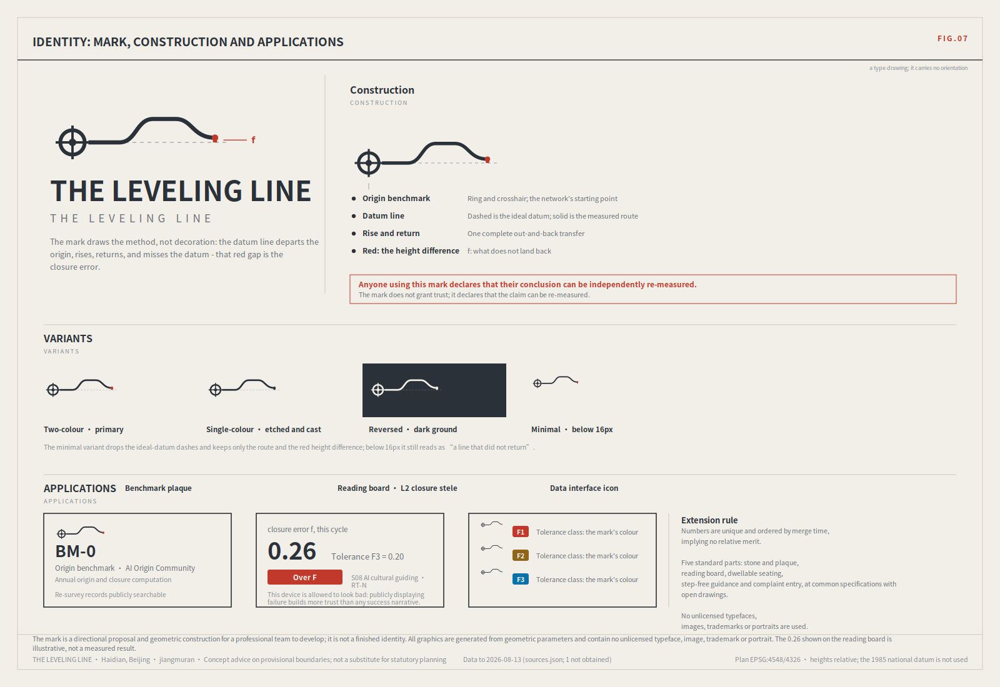

### Three positionings, five functions, and a circuit that closes (agent.1)

The taskbook gives three positionings and five functions [source:AGENT-TASKBOOK]. Rather than restate them, this proposal connects them into a **circuit that can close** — which is precisely the blind spot the field converges into. The measurement is in the motif table above; more than half use a three-core structure, 39.6% two wings, and 30.0% a single spine [source:FIELD-CENSUS-2026-08]. That convergence is not consensus; it is what the taskbook's "three areas, two wings" induces. Drawing the same structure again adds nothing. What adds something is stating **by what mechanism these units hand responsibility to one another.**

The leveling network's answer is elevation transfer: each station's reading depends on the one before it, and the run returns to the origin to be computed.

```
                    BM-0 origin benchmark (AI Origin Community)
                    public evidence hub · network origin
                      ▲                 │
       closure f      │                 │ depart
                      │                 ▼
   RT-N north route ──┴── BM-1 Zhongzhiyuan (full-stack autonomy · AI governance)
        │                        │
        │              Xiaoyuehe scenario wing BM-2x (scenarios · a vibrant city)
        │                        │
   RT-S south route ──┬── BM-2 Dazhongsi (AI-native activity)
                      │
             Zhongguancun services wing BM-2x (factors · IP and capital)
```

- **BM-1 Zhongzhiyuan** carries the full-stack autonomous AI innovation system and the global-discourse positioning: it is where tolerance F is set — the **tolerance datum**. This used to say "datum of origin", which is the wrong term: in surveying the datum of origin is the point heights are carried from, and here that is BM-0, which the shipped `check_closure.js` requires every circuit to depart from. Where the standard is set and where measurement starts are two things and cannot share one word.
- **BM-0 the AI Origin Community** carries the world-class AI innovation ecosystem: it is both the network's starting point and the point at which closure is computed, and it is the physical landing place for the public knowledge base this call has produced.
- **BM-2 Dazhongsi** carries AI-native new activity: high-frequency consumer and business scenarios take their readings here.
- **The Zhongguancun services wing** supplies factors and capital and is the route's **support system**; **the Xiaoyuehe scenario wing** supplies real users and is therefore the route's **source of reading density**.

The five functions are consequently not five parallel slogans but five positions on one circuit: set the datum (Zhongzhiyuan) → depart (Origin Community) → take readings (Dazhongsi and the two wings) → return to the origin and compute (Origin Community) → re-measure if over tolerance. The spatial expression is [data:geometry/public_space.geojson#PUBLIC-001], and the overall structure corresponds to [depth:overall_spatial_structure].

### Global AI innovation ecosystem cases (agent.2)

Six cases, each asked one question: **what mechanism establishes its public trust, and can that mechanism be re-measured.** All material is drawn from publicly available institutional documents and public reporting. No non-public data is cited, and no company lists, investment figures or output values are fabricated.

| # | Case | Trust mechanism | Re-measurable | Transferable point |
|---|---|---|---|---|
| C1 | Algorithm registers in Helsinki and Amsterdam | Public register of each algorithm in use: purpose, data, responsible owner, appeal route | High: entries can be checked one by one | Directly supplies the information base for a benchmark plaque |
| C2 | Risk tiering in the EU AI Act | Duties differentiated by risk class | Medium: the tiering is checkable, enforcement needs a regulator | Supports the tiered setting of tolerance F |
| C3 | Singapore's AI Verify testing framework | Comparable reports produced with a standardised toolkit | High: the tests can be re-run | Supplies the technical form that re-survey takes |
| C4 | Algorithmic impact assessment practice in the UK NHS | Mandatory ex-ante assessment and ex-post review for high-risk uses | Medium-high: the record is auditable | Supports the strictest tolerance for health scenarios |
| C5 | Civic data-stewardship practice in Taipei and Barcelona | Data use decided by a citizen agenda | Medium: the agenda is public | Supports the public's right to initiate re-survey at third-order points |
| C6 | Reproducibility norms in open-source communities, e.g. artifact evaluation | A conclusion must ship a re-runnable artifact | High: the artifact executes | This proposal publishes all generation scripts and data products on that norm |

All six point at one gap: **they register and they assess, and none institutionalises returning to the origin and computing.** A register tells you what a system declared. An assessment tells you what experts think. Neither answers *how much the conclusion differs when the same public question passes through different nodes at different times.* Closure error is the thing that fills that gap.

### Innovation ecosystem and element mechanisms (agent.2)

The ecosystem map is organised in three columns — element, space, re-survey responsibility — specifically to avoid writing industrial recruitment as though it were a settled arrangement:

| Element | Spatial carrier | Owning benchmark | Re-survey item |
|---|---|---|---|
| Land and space | Key-area renewal parcels | BM-1 / BM-0 / BM-2 | Delivery rate of promised space |
| Compute | Consolidated compute nodes | BM-1 | Share of public compute open to application |
| Data | Data-factor circulation venue | BM-2 | Authorisation-chain completeness |
| Scenarios | Real-use venues in the two wings | BM-2x | Enforceability of scenario exit |
| Funding | Technology-services wing | Zhongguancun wing BM-2x | None |
| Talent | Talent district and third places | BM-0 | Re-survey of service satisfaction |

The re-survey cell for funding is **deliberately empty**: investment arrangements are decisions for market actors, an urban design proposal should not write them as governance metrics, and it must never express them as fiscal commitments. That blank is itself a compliance statement [standard:PROJECT-AGENT-OPEN-CALL-TASKBOOK].

The correspondence between industry and space lands in [data:geometry/land_use.geojson#LU-001], with metric conventions in [metric:key_area_count]. The full chain of custody and the six-case comparison are drawn below — **the funding row's re-survey cell is a blank box in the drawing, and that is a judgement rather than an oversight.**

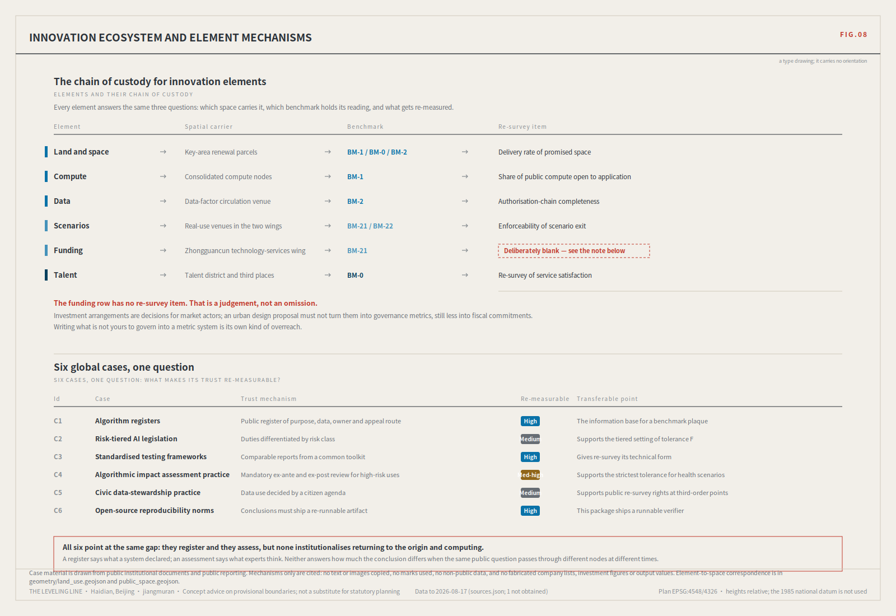

### Regional coordination: extending the network into a regional one (agent.1)

The taskbook asks for a response on coordination with the Beiwei community, Future Science City, Huairou Science City, the Economic-Technological Development Area, and Beijing-Tianjin-Hebei [source:AGENT-TASKBOOK]. Most treatments of coordination stop at phrases like "strengthen linkage, build platforms" — which cannot be tested and therefore cannot be executed. Leveling supplies an executable form, because **networks are built to be tied together**: two independent networks that share a datum convention and a tolerance convention can be joined by inter-measurement into one larger network, without either side giving up any of its own authority.

The mechanism proposed is therefore **cross-regional mutual recognition of tolerance**, in three parts:

| Mechanism | Content | What can be checked |
|---|---|---|
| Common tolerance convention | Each cluster adopts the same definitions of F1/F2/F3 — the conditions they apply to and how they are computed — while remaining free to set stricter values | The convention documents are public and comparable |
| Closure records travel with the scenario | A scenario's closure record obtained here (readings, composition of review parties, exceedances and remediation history) travels with it to another cluster as admission material | The record is checkable item by item and cannot be edited after the fact |
| Inter-measurement nodes | Each cluster maintains one outward-facing inter-measurement point, and they exchange readings on a shared set of public questions at intervals, computing a **regional closure error** | The regional readings are published and the difference is recomputable |

The second is the one that matters, because it turns coordination from *signing an agreement* into *saved duplication*: a scenario that has already run a full re-survey cycle here arrives elsewhere carrying a verifiable closure record, so the receiving side does not verify from zero — it reviews the record and applies its own tolerance. **The benefit of coordination is therefore a specific, measurable saving in administrative cost, rather than a statement of intent.**

### What each of the five partners actually trades

The five partners the taskbook names sit at different points in the innovation chain, so what each exchanges with this belt is different. Writing them all into one paragraph would amount to no coordination at all.

| Partner | Where it sits | What it trades with this belt | Why it is that |
|---|---|---|---|
| **Economic-Technological Development Area** | Volume production and higher-level autonomous-vehicle road testing | **Mutual recognition of closure records across complementary speed domains** | The most directly relevant of the five: the Development Area works at vehicle speeds on open roads, this belt at **pedestrian scale with low-speed devices**. The same machine behaves entirely differently in the two domains, so the two closure records **cannot substitute for one another but can be connected** — an F1 clearance here is a condition for entering pedestrian-dense space, not for entering a carriageway, and vice versa. Both sides must confirm this; this proposal does not decide it for them |
| **Future Science City** | Corporate research institutes and engineering | Scenario demand and real user density | The two wings supply real-user density as a validation ground for institute output; what comes back is engineering capability |
| **Huairou Science City** | Large scientific facilities and basic research | The measurement method itself | The only partner that coordinates at the **method layer** rather than the application layer: quantifying f, setting cycles, and the statistical basis for revising tolerance are all measurement-science questions |
| **Beiwei community** | An innovation community named in the taskbook | Mutual measurement points and exchange of review parties | This proposal holds no knowledge of its specific positioning and proposes only a mechanism interface: set up reciprocal inter-measurement points and exchange review parties so both sides' readings are comparable |
| **Beijing-Tianjin-Hebei** | Cross-provincial coordination | Cross-provincial recognition of the tolerance convention | The highest and slowest layer. This proposal argues only that the convention comes first — without a common convention, no cross-provincial recognition of records is possible at all |

**A boundary that has to be stated.** The descriptions above of where each partner sits are based on publicly known general positioning and are **unconfirmed by any of them**. This proposal holds no internal plan of any party, makes no commitment on anyone's behalf, and does not assume any coordination agreement exists. Every row is a **mechanism interface offered for independent evaluation**, and the complementary speed-domain relationship in the Development Area row in particular must be settled against both sides' actual testing protocols.

This proposal decides nothing on behalf of any cluster and assumes no coordination commitment; all of the above is mechanism advice for independent assessment [standard:PROJECT-AGENT-OPEN-CALL-TASKBOOK]. At the regional level, the spatial interface is the coordinated research area [data:geometry/site_boundary.geojson#SITE-001].

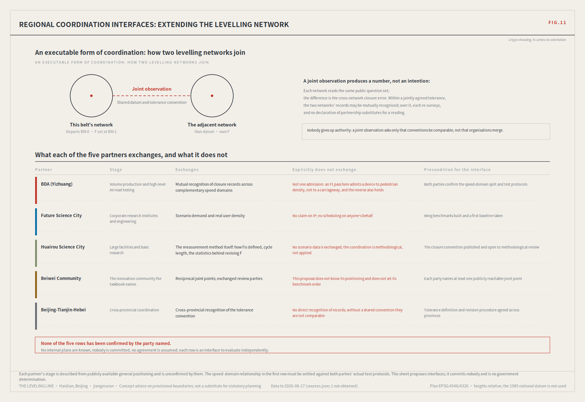

**The table above is now a drawing: FIG.11, the regional coordination interfaces** (`assets/figures/region-interface.png`, and A0 board 2). Drawing it has a reason. Coordination is the item most often answered with a sentence about strengthening cooperation and building platforms — a sentence that cannot be checked and therefore cannot be executed. Levelling gives it an executable form: two independent networks join by sharing a datum and a tolerance convention, and the output of a **joint observation** is a number, the cross-network closure error, not an intention. Every row states not only what is exchanged but **what is explicitly not exchanged** and **what must be true for the interface to open** — because an interface with no stated non-commitment is a promise made on someone else's behalf.

## Overall Design Area: Urban Renewal and Regulatory-Plan-Level Urban Design

The core task inside the overall design area is to turn the leveling network from a concept into a buildable spatial sequence [depth:land_use_layout].

**The spine.** The existing linear green corridor of the Jing-Zhang Railway Heritage Park is the skeleton, forming a continuous walkable public axis. The spine's spatial task is not to re-make landscape; it is to **carry measurement points** — at intervals, a public node where someone can dwell, read a posted result, and initiate a re-survey.

**Development intensity and height.** This proposal gives **no** figures for floor area ratio, building height, density, setbacks or road redlines [depth:development_intensity_controls] [depth:height_massing_character]. These are statutory regulatory-plan controls and must follow official conditions [standard:MOHURD-CONTROL-DETAILED-PLANNING]; supplying numbers while official data is absent is fabricated certainty. What is given instead are **form principles**: continuous sky corridors and continuous frontage either side of the spine, rising from the spine outward inside each key area, and existing height as the cap around historic nodes. Once official conditions are published, numbers are generated from these principles and the package is recomputed as a whole.

**Character.** The whole line takes the honesty of infrastructure as its register — retain the engineering language of the railway structures (sleepers, ballast, signal posts, mileposts), and let new work sit beside them in clearly contemporary material rather than imitating historical style, so that a hundred years of time layers stay legible in a single view.

### What urban design owes at regulatory-plan depth

Statutory regulatory planning supplies numbers. Urban design supplies **relationships**. Six sets of form and interface rules are given for the overall design area, each checkable item by item, all of them relational or principled, none of them a statutory control value [depth:height_massing_character].

**One — frontage continuity.** Frontages either side of the spine must be continuous, with no breaks formed by walls, parking entrances or defensive setbacks. The test for a break is whether **a walker's sightline is interrupted by function-less blankness** while walking continuously; that can be counted on site, which is what makes it checkable rather than rhetorical. Existing walls should be converted into transparent, dwellable frontage rather than demolished and rebuilt.

**Two — ground-floor publicness.** Buildings along the spine must carry public function at ground level (any of: outward-facing service, display, seating, toilets), and must not present a pure plant level or a bare lobby. This is directly tied to the network: **a benchmark needs people present to be re-measured**, and a frontage with no ground-floor function holds nobody.

**Three — view corridors.** The longitudinal sky corridor along the spine is kept unbroken, as are the lateral corridors from historic nodes toward the railway heritage structures. View corridors are a **protective requirement**: new massing may not enter them. The controlling surfaces must be fixed only after official regulatory conditions and heritage protection boundaries are published; this proposal pre-empts no control line.

**Four — relative frontage heights.** No absolute figures; three relative rules instead. Frontages immediately on the spine are **no taller** than those behind them; heights around historic nodes are capped at **existing height**; within a key area, heights rise from the spine outward. All three hold under any official numbers, so publication of the official conditions cannot invalidate them.

**Five — parcel grain.** Over-deep, single-ownership super-parcels should not occur along the spine. They inevitably produce long stretches of closed frontage with no entrances, and they leave nowhere to place a cross-jurisdiction benchmark. The grain must be set against actual ownership; the principle is given, the dimension is not.

**Six — servicing and access.** Vehicle entrances and loading may not open onto the spine, and low-speed device charging and standby may not occupy the pedestrian frontage (see the kerb priority order in the transport section). This rule is what keeps "the spine is a continuous public axis" true after construction — without it, continuity is cut into pieces by driveways one parcel at a time.

### East-west stitching: types and priorities, not engineering conclusions

The spine is cut laterally by several existing arterials, and stitching those cuts is one of the central tasks of the overall design area. This proposal classifies each stitching point into three types by **cost and feasibility**, and states plainly where it stops:

| Type | Character | What this proposal supplies |
|---|---|---|
| A — improvable now | A crossing already exists; the problem is detour distance, gradient or waiting safety | Priority order and direction of improvement; can ride along with near-term projects R1–R4 |
| B — needs channelisation | Requires signal changes, channelisation or footway widening | The connection need and the basis for it; requires specialist traffic review |
| C — needs new structure | Requires a bridge, tunnel or underpass | **The need is registered only; no feasibility conclusion is offered** |

**This section had a classification and no geometry — now it has one.** For most of this package's life `roads.geojson` held the spine and the two survey routes and nothing else, while the proposal spent a whole subsection classifying stitching points. That is the same defect this package reports in other people's structured fields, so it is closed.

Intersecting the submitted spine `ROAD-001` with OSM-surveyed arterials (trunk/primary/secondary, named only) in EPSG:4548 yields **eleven east-west stitching points**, written into [data:geometry/roads.geojson#ROAD-001] as ROAD-101 through ROAD-111. Each is a connection proposal drawn perpendicular to the arterial it crosses:

| Stitching point | Class | Nearest mapped crossing |
|---|---|---|
| North Third Ring Road | **A** | 33 m |
| North Fourth Ring Middle Road | **A** | 30 m |
| Xueyuan South Road | **A** | 25 m |
| Yinquan Road | **A** | 10 m |
| Beitucheng West Road | need registered | 65 m |
| Xizhimen North Street | need registered | 68 m |
| Tsinghua East Road | need registered | 86 m |
| Shibanfang South Road | need registered | 146 m |
| G6 service road (two points) | need registered | 166 m / 175 m |
| Zhixin Road | need registered | 201 m |

**The classification uses one measurable fact and no more: whether a mapped pedestrian crossing already exists near the junction.** Within 60 m, the point is class A — a crossing exists and the problem is detour, gradient and waiting safety. Beyond it, **the need is registered and no class is assigned**, because separating "needs channelisation" from "needs a new structure" is the conclusion of specialist traffic review and this proposal declines to produce it. The radius is written in the script, can be changed and re-run, and every reading ships in `visual/assets/osm_stitching.json`.

**The limits belong in the same paragraph.** OSM is crowd-sourced and crossings may simply be unmapped — "need registered" means *not in OSM*, not *not on the ground*. Arterial positions are OSM measurements, not official road centrelines, and may not be used as a redline or a precise alignment basis. The data is graded `background_only`: it locates a need and is not evidence for a spatial conclusion.

The classification is by the approval and engineering level a connection requires, **not by importance** — and that distinction has to be stated rather than smoothed over. **An important connection may fall in class C and therefore remain unrealised for a long time. Saying so is more useful than drawing a line and implying the problem is solved.** The spatial position of each stitching point must be fixed after official boundaries and road conditions are published [standard:MOHURD-CONTROL-DETAILED-PLANNING].

**Not decided in this section:** floor area ratio, building height, density, green ratio, setbacks, building control lines, road redlines, parcel dimensions, view-corridor control surfaces, and any engineering feasibility conclusion.

## Detailed Design of Key Areas

<!-- KEYAREAS:BEGIN -->

| Key area | Extent | Survey role | Dominant use (share of that extent) | Classes present | Public points / footprints |
|---|---|---|---|---|---|
| Dazhongsi AI Industry Cluster | 72.0 ha | BM-2 | industry and commerce 99% | 2 | 1 / 2 |
| Beijing AI Origin Community | 104.3 ha | BM-0 | community services 94% | 2 | 1 / 1 |
| Zhongzhiyuan AI Acceleration Zone | 192.9 ha | BM-1 | R&D 100% | 2 | 2 / 2 |

The three total **369.3 ha**, **32.4%** of the design scope. **The denominator of each share is the key area's own extent, not the design scope** — a share with an unstated denominator is a defect this package's errata register names. Land-use and key-area boundaries are provisional stand-ins and must be recomputed when official geometry is published; the per-area plans are FIG.04 and the sections FIG.13 — three at one scale on one datum convention, so the charge that they are one template used three times can be tested.

**The dominant-use column runs at nearly 100%, and that is stated rather than hidden behind a top-three list: this partition gives each key area one dominant use and does not subdivide within it.** Generating this table is what made it sayable — a top-three framing would have shown 99% / 1% and looked layered. It is a judgement, not an oversight: the names of the three areas come from the announcement, their geometry is a provisional stand-in, and subdividing inside them depends on tenure, the regulatory plan and retain/demolish status — the same unpublished data. **A 193-hectare area with one use is thin as detailed design. This proposal says so, and attaches it to a named precondition rather than glossing it: when official geometry and controls are published, these three cells are the first three to be replaced.**

<!-- KEYAREAS:END -->

Each of the three key areas carries one survey role, and the three check one another [depth:three_key_area_detailed_design].

| Area | Survey role | Design positioning | Spatial move | AI scenarios and operation |
|---|---|---|---|---|
| Zhongzhiyuan AI Autonomous Innovation Acceleration Area [data:geometry/key_areas.geojson#PROV-KEY-001] | **BM-1, the tolerance datum** | Full-stack autonomous innovation and the source of governance standards | Tolerance chamber (F set and revised in public); low-carbon social interface along the Qinghe frontage; land reserved for a standard test field | S11 industry validation; compliance pre-check services for firms |
| Beijing AI Origin Community [data:geometry/key_areas.geojson#PROV-KEY-002] | **BM-0, origin benchmark** | Near-campus innovation, open-source system, talent district | **Origin benchmark stone** and public evidence hall (permanent display and search of every proposal in this call); direct campus-to-park walking link; rail-station integration | S01 scenario open day; S07 open-source collaboration; re-survey of talent services |
| Dazhongsi AI Industry Cluster [data:geometry/key_areas.geojson#PROV-KEY-003] | **BM-2, high-frequency reading point** | AI-native consumption and business | Four-quadrant pedestrian connection at the intersection; compound use of planned green space; Dazhongsi station integration | S03 agent business desk; S05 data-factor circulation; S09 daily-service demonstration street |

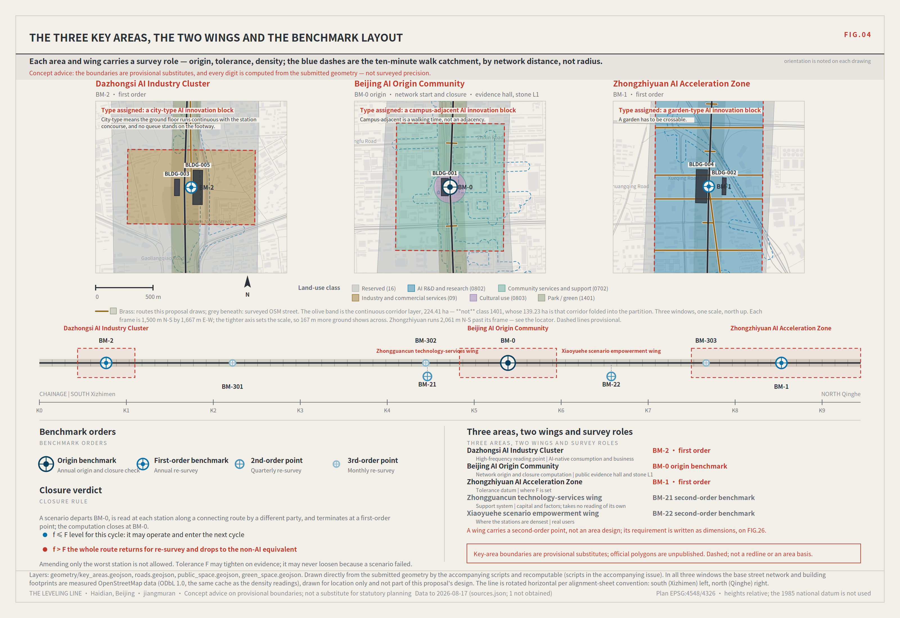

### Zhongzhiyuan AI Autonomous Innovation Acceleration Area (BM-1, the tolerance datum)

**Why the tolerance datum belongs here.** The place that sets a standard should sit where conditions are most stable and least exposed to day-to-day fluctuation. Zhongzhiyuan carries full-stack autonomous innovation and is where governance standards originate — it is where tolerance F is set. **The place that sets the standard should not also be the place under daily operating pressure**, or the standard drifts with that pressure rather than with evidence.

- **Programme.** R&D and pilot production lead, with a standard test field, a tolerance chamber — a standing public space in which F is set and revised — and an industry display frontage. The test field must be enclosable, pausable and reversible; its controlled boundary is [data:geometry/constraints.geojson#CONSTRAINT-001].
- **Buildings and scale.** Indicative footprints are in [data:geometry/buildings.geojson#BLDG-001], including the test field and tolerance chamber (BLDG-004) and the L2 closure stele (BLDG-002, offset from the former so the two do not share ground). Scale is order-of-magnitude only and constitutes no building design.
- **Retain, renovate, demolish.** Renovation-led. Existing workshops and research buildings with clear title and sound structure are converted first into test and display space. No demolition conclusion is offered.
- **Public space connection.** A low-carbon social environment is organised along the Qinghe frontage, giving a continuous walk from the spine to the water's edge. That frontage is also a candidate position for a second-order point.

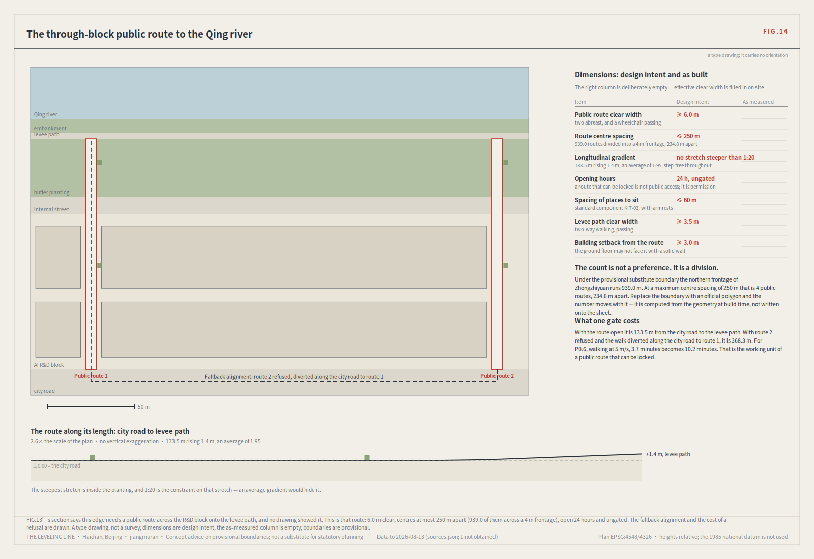

Across a frontage that is 100% single-use, a continuous walk means **through the block or not at all**. FIG.14 draws that route, and prices a refusal in minutes.
- **Traffic.** External traffic here is freight-like — test equipment and materials — and must be separated from the pedestrian spine. **Freight entrances may not open onto the spine.**
- **Scenarios carried.** S11 AI industry validation field (F1) and S10 public-safety operations review (F1). Both are scenarios that **may never be executed automatically.**

### Beijing AI Origin Community (BM-0, the network origin)

**Why the origin belongs here.** The origin must be the place the public can most easily reach and, at the same time, the place nearest to knowledge production. A near-campus position satisfies both; no comparison of candidate sites ships with this package, so this is stated as the reason for the choice and not as a ranking.

- **Programme.** Near-campus innovation, incubation and commercialisation, a talent district, and the open-source system. The substantive addition is a **public evidence hall** — permanent display and search of every proposal in this call and of every subsequent re-survey reading, open to the public with no access control.
- **Landmark.** The **origin benchmark stone L1** (BLDG-001), a metal stone set flush with the ground, with contributors' numbered sequence set into the surrounding paving. This meets the call's own inscription promise without inventing a device for it: a benchmark stone has always been a permanent mark left for whoever re-measures a century later.
- **Retain, renovate, demolish.** Retention and renovation combined. **Residential provision must not be reduced to make room for innovation functions**; any talent housing must be additional to, not substituted for, existing residential supply — **and that constraint is currently unverifiable**. Existing residential floor area is unpublished and this package has not measured it, so `existing_residential_floor_area_sqm` stays `unknown` in `metrics.json` with its precondition named. By this proposal's own standard a rule that cannot be checked is not a rule yet: it stands as a mandatory check at the next stage, not as a satisfied condition. `0701` residential and `0804` education do not appear in the land-use layer because they fall inside the eleven reserved blocks and their boundaries depend on the same unpublished data — **a judgement, not an omission**.
- **Public space connection.** The direct campus-to-park walking link is this area's decisive move, and its success is judged by the **actual walking time** of personas P3 and P4 — not by straight-line distance, which conceals every crossing, kerb and detour that decides whether the link is used. Rail-station integration follows the station-point unification rule, with the concourse doubling as a third-order point.
- **Traffic.** Walking and cycling lead. The jurisdictional problem is sharpest here: points in this area sit across both park management and campus authority [data:geometry/public_space.geojson#PUBLIC-001].

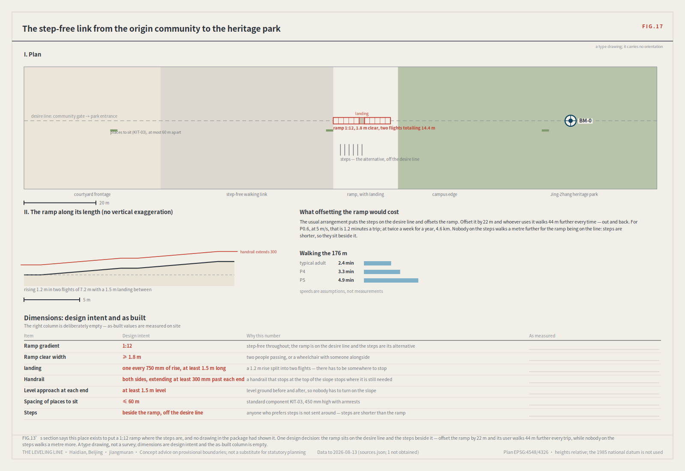

This link turns on one decision, drawn in FIG.17: **the ramp sits on the desire line and the steps beside it.**
- **Scenarios carried.** S01 scenario open day and S07 open-source collaboration, both F3; talent and public-service re-surveys depart from here.

### Dazhongsi AI Industry Cluster (BM-2, the high-frequency reading point)

**Why the high-frequency point belongs here.** The consumption and business frontage carries the densest footfall and the highest use frequency, and is therefore where the dispersion of service AI shows up first — **high frequency is a resource for readings, not a burden on the area.**

- **Programme.** Leading firms and intelligent terminals, content consumption, data-factor and digital-asset circulation, commercial services. The data-factor circulation venue is the spatial carrier of S05.
- **Buildings and scale.** The AI-native business frontage (BLDG-005) and the L3 zeroing point (BLDG-003, offset). The zeroing point is an annual ceremony space and an ordinary public dwelling space the rest of the year; it is not single-use.
- **Retain, renovate, demolish.** Renovation and compound use. **Compound use of planned green space is conditional on the green function not being downgraded**: what is compounded is time-of-day and user group, not the conversion of green space into development land.
- **Public space connection.** The **four-quadrant pedestrian connection at the intersection** is the most concrete spatial task in this area, and also the decisive location for device queue storage — without four-quadrant connection, devices and pedestrians necessarily contend for the same waiting area (see the transport section).

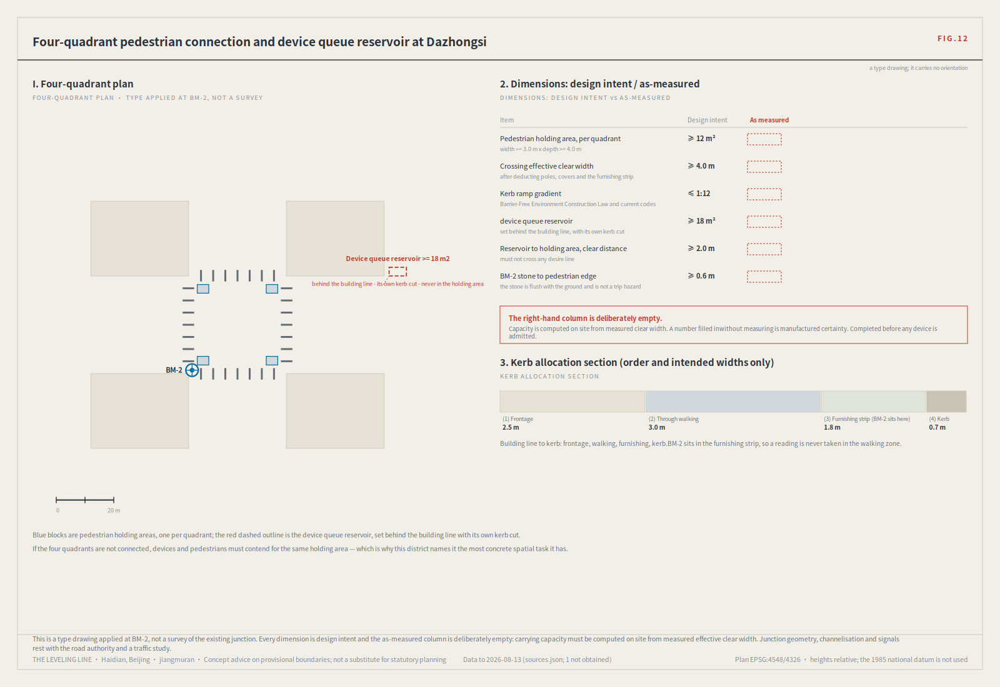

This was a sentence and nothing else. FIG.12 draws it: holding areas in all four quadrants, the device queue reservoir set behind the building line, and an as-measured column left deliberately empty — carrying capacity is computed on site from measured clear width.
- **Traffic.** Dazhongsi station integration. Points here span **three jurisdictions** — municipal road, rail station and commercial property — making them the most complex on the line.
- **Scenarios carried.** S03 agent business service desk, S05 data-factor authorisation chain, S09 daily-service demonstration street, mostly F2.

### Retain, renovate, demolish: principles common to all three

Classification depends on the title and structural-safety assessment of existing buildings, and both are currently data gaps. This proposal therefore **offers no demolition conclusion for any specific parcel** [depth:retain_renovate_demolish] and gives only the classification principles:

1. Railway heritage structures are **retained in principle**, and retained with their engineering language rather than as a shell.
2. Existing buildings with clear title and sound structure are **renovated first**, and renovation must address ground-floor publicness and frontage continuity before anything else.
3. Undisputed low-efficiency vacant land goes **first to benchmarks and public space**, not first to new development.
4. **No recommendation involving the relocation of residents falls within this proposal's scope**, and none is made.

All three area boundaries are provisional substitutes [source:KEY-AREA-SOURCE]. When official polygons are published the whole set is recomputed; substituting one area while leaving the other two on inferred geometry would produce a package whose three key areas are measured against different references.

## AI Innovation Ecosystem, Personas, and AI+ Scenarios

### Personas (agent.3, nine)

A persona list that says "residents, young people, visitors" cannot be used to work out who a scenario excludes. The table below is therefore built on the attributes that actually change access to an AI service: age, ability, digital skill, language, income band, care duties, mobility constraints. The last column states each persona's role in the leveling network — **a persona list is not a list of beneficiaries; it is a list of the people who take the readings.**

<!-- PERSONAS:BEGIN -->

| # | Persona | Age | Ability / mobility | Digital skill | Language | Income | Care duty | Role in the network |
|---|---|---|---|---|---|---|---|---|
| P1 | Full-stack engineers | 25–40 | Unrestricted; late commutes | High | ZH/EN | Mid-high | Low | Technical readings for F1 items |
| P2 | Founders and developers | 22–38 | Unrestricted | High | ZH/EN | Volatile | Low | Principal proposers of scenarios |
| P3 | Students and faculty | 18–30 | Unrestricted; budget-sensitive | High | ZH/EN | Low | None | Heaviest users of third-order points |
| P4 | **Older long-term residents** | 65+ | Slower gait, reduced sight and hearing | **Low**; some do not use smartphones | Chinese dialects | Low–mid | Often giving or receiving care | **Independent right to initiate re-survey**; health-navigation readings are theirs |
| P5 | **Wheelchair users** | All | Continuous step-free route, gradient and clear-width sensitive | Mid–high | Chinese | Varies | Varies | **The wheelchair-passing test is read by them in person**, never by engineers on their behalf |
| P6 | **Children and carers** | 0–12 and parents | Low eye height, unpredictable movement, prams | Carers mid-high | Chinese | Varies | **Care duty is the binding constraint** | Set the strictest condition for device yielding |
| P7 | **Frontline workers** (couriers, cleaners, security, maintenance) | 20–55 | Long outdoor hours; needs toilets and shade; time pressure | Mid | Chinese | Low–mid | Usually primary earners | Heavy spine users **and the group exposed to substitution risk** |
| P8 | Enterprise service staff | 28–50 | Unrestricted | High | ZH/EN | Mid-high | Varies | Operator-side quarterly readings |
| P9 | International visitors and researchers | All | Dependent on language and signage | High | English and others | Varies | Low | Independent external readings: whether someone outside the local context can use it |

<!-- PERSONAS:END -->

**Why P4–P7 sit at the centre of the chain rather than at its end.** A review mechanism that only experts can initiate will produce a closure error that can never detect what experts cannot see. Engineers cannot measure the failure a wheelchair user meets. Young developers cannot measure how an older person misreads a voice prompt. And **nobody knows better than a courier what a kerb means in the rain.** Who takes the reading determines what the mechanism is capable of measuring, which makes the choice of reader a design decision rather than a form of participation.

**Hard constraints for people without smartphones and with low digital literacy** (P4 and P7):

- Every scenario must have a usable path that **does not depend on a smartphone** — on-site staff, paper, or a voice telephone line — and that path must not be slower and must not require an additional trip.
- The on-site complaint entry must offer a **non-scan** method as well, or the right of appeal does not exist for P4 at all.
- Re-survey notices and published readings must have a physically posted version and may not be released online only.

None of these three can be waived by operational adjustment. Compliance is checked each re-survey cycle and enters the readings.

### AI scenario cards (agent.3, twelve)

Every card fixes the same fields: users served, spatial carrier, data sources, privacy boundary, human review point, exit condition, owning benchmark, and tolerance class. F1 is the strictest (bodily safety or administrative decisions), F2 medium (individual rights), F3 loosest (information only).

**The table below is generated from `visual/assets/scenario_cards.json`, not written by hand.** The cards used to be a table nothing could join: six named a benchmark as `BM-2x` or `BM-3xx`, which are placeholders rather than ids and resolve to no point in `public_space.geojson`; eleven wrote their exit condition as "over the limit" while nowhere defining the quantity, its threshold, or the role that carries the exit out; and this English edition silently dropped the spatial-carrier column its own lead sentence promises. The cards are data now. `node visual/assets/check_cards.js` resolves every benchmark, spatial anchor, exit quantity and executing role against something that exists and refuses the set if any of them does not; `--selftest` puts eight deliberately broken card sets through the same checks to show they refuse.

**A tolerance marked `*` has no value yet.** F3's initial 0.20 is published; F1 and F2 are set by the tolerance assembly at BM-1 and are not drafted here. Writing a plausible-looking number for them would be the substitution this proposal spends its length objecting to, so ten cards are marked `operational: false` with the reason stated: nine because the tolerance is unset — those are the nine marked `*` — and S01 because its tolerance is published but its exit threshold is not. The two reasons are different and the file says which is which, rather than letting either gap hide inside a phrase.

<!-- CARDS:BEGIN -->
| Card | Scenario | Served | Spatial anchor | Data source | Benchmarks | Tolerance | Human review | Exit trigger → action → role |
|---|---|---|---|---|---|---|---|---|
| S01 | Scenario open day and public trial route | P2 P3 P9 | Spine node at the origin benchmark [data:geometry/public_space.geojson#PUBLIC-001] | Aggregate registration and attendance counts; the filed event safety plan | BM-0 | F3 | Event safety plan | two consecutive editions participation_rate < (threshold pending the baseline cycle) → suspend and restart only after redesign → park authority |
| S02 | Walking-network breakpoint detection and repair | P3 P4 P5 | Spine and connector streets [data:geometry/roads.geojson#ROAD-001] | On-site verification records; the accessibility-asset register, aggregate and personal-data free | BM-21 BM-22 | F2* | Breakpoints verified on site by a person | per cycle breakpoint_false_positive_rate > (threshold pending the baseline cycle) → revert to human patrol; the system is demoted to a hint → municipal road authority |
| S03 | Agent business service desk | P2 P8 | Dazhongsi business frontage [data:geometry/public_space.geojson#PUBLIC-003] | Published service guides and policy texts; sampled-reply review records | BM-2 | F2* | Anything contractual is signed by a person | per cycle service_error_rate > (threshold pending the baseline cycle) → demote to advice only, no acting on the user's behalf → operator |
| S04 | AI health service navigation | P4 P6 | Community service centre [data:geometry/public_space.geojson#PUBLIC-006] | Published directories of institutions, departments and clinic hours; no clinical records are ingested | BM-301 BM-303 | **F1*** | Every care suggestion is confirmed by a licensed practitioner | any cycle misleading_output_count >= 1 outputs → the whole segment is suspended and re-surveyed; only the human path remains until it passes → operator |
| S05 | Data-asset authorisation chain, made visible | P2 P8 | Dazhongsi data-circulation venue [data:geometry/public_space.geojson#PUBLIC-003] | Authorisation credentials and change records carried by the transaction itself; the authorised data is never read | BM-2 | F2* | Authorisation changes are confirmed by a person | at any point authorisation_chain_break_count >= 1 breaks → circulation of that item stops until the chain is complete → operator |
| S06 | Low-speed robot delivery and inspection | P4 P5 P6 P7 | Spine and internal campus streets [data:geometry/roads.geojson#ROAD-001] | Device logs and takeover records; the published per-segment density ceiling; no imagery of identifiable individuals is retained | BM-21 BM-22 | **F1*** | Yield to people; human takeover | at any point safety_incident_count >= 1 incidents → that machine type is suspended network-wide, not the individual unit → operator |
| S07 | Open collaboration and publication | P2 P3 | Public evidence hall at the origin community [data:geometry/public_space.geojson#PUBLIC-001] | Rights statements and licences declared by contributors; publicly checkable citations | BM-0 | F3 | Copyright of published material is checked | at any point copyright_dispute_count >= 1 disputes → immediate takedown and review, with the finding published alongside → operator |
| S08 | AI cultural guide | P3 P9 | The heritage park line (closing route RT-N) [data:geometry/roads.geojson#ROAD-002] | Published historical sources and heritage descriptions; the written opinion of the historical reviewer | BM-0 BM-303 BM-1 | F3 | Historical statements are reviewed by a person | at any point historical_error_count >= 1 errors → the whole guide line goes offline for re-checking; f > F in two consecutive cycles → the whole line goes offline for re-checking (the same action as R3; the two triggers are independent) → park authority |
| S09 | Everyday-services demonstration street | P4 P7 P8 | Community commercial junction [data:geometry/public_space.geojson#PUBLIC-006] | Published prices and credentials; a third-party-adjudicated complaints register, aggregate | BM-301 | F2* | Prices and credentials are verified by a person | per cycle complaint_rate > (threshold pending the baseline cycle) → withdraw from that segment and restore ordinary service → district authority |
| S10 | Public-safety operations review | P8 | Operations centre at Zhongzhi Park [data:geometry/public_space.geojson#PUBLIC-002] | Operational records of events that have already happened; no live surveillance feed and no predictive judgement | BM-1 | **F1*** | Every disposition is decided by a person | at any point automated_execution_count >= 1 executions → the scenario is terminated, with no re-survey path back → district authority |
| S11 | AI industry test and validation range | P1 P2 | Test ground at Zhongzhi Park [data:geometry/public_space.geojson#PUBLIC-002] | Test plans and published boundaries submitted by the party under test; the range's own breach log | BM-1 | **F1*** | The test boundary is set by a person | at any point boundary_breach_count >= 1 breaches → the range closes and that party must resubmit → test-range authority |
| S12 | Live verification of step-free routes | P4 P5 | The whole walking network [data:geometry/roads.geojson#ROAD-001] | On-site judgements made by the affected users themselves, plus the accessibility register. The reading must be taken by the affected person, never by a proxy | BM-301 BM-302 BM-303 | F2* | User feedback outranks the algorithm | two consecutive cycles user_override_count >= 1 overrides → the human conclusion governs and the register is corrected → municipal road authority |
<!-- CARDS:END -->

### Three red lines are not this proposal's goodwill; they are existing legal obligations

This package had been presenting the equivalent non-AI path, the stop-on-detection rule, and the numeric appeal deadline as its own design judgements. Reading the highest-scoring proposals in this call made clear that this weakens them: **all three are already obligations under current Chinese law and policy, and writing them as design preferences reduces their force.** The three instruments below were each read in full by this proposal's author on the official publisher's site; article numbers and substance are cited, full text is not reproduced.

| This proposal's rule | Verified legal basis | What changes |
|---|---|---|
| Every scenario must have an **equivalent non-AI service path** | Barrier-free Environment Construction Law, **Article 39**: venues providing medical, insurance, financial, water/electricity/gas services shall retain traditional service methods including on-site guidance and manual handling [source:BARRIER-FREE-ENVIRONMENT-LAW] | From a designer's goodwill to a **statutory duty** |
| On detection, **stop generation and transmission** rather than observe first | Interim Measures for the Management of Generative AI Services, **Article 14**: on finding unlawful content the provider shall promptly stop generation, stop transmission and eliminate it [source:GENERATIVE-AI-INTERIM-MEASURES] | From this proposal's stop rule to a **provider obligation** |
| Appeal must carry a **numeric time limit** or it is unenforceable | Same Measures, **Article 15**: establish complaint and reporting mechanisms with a convenient entry, and **publish the handling process and the feedback time limit** | From this proposal's argument to **compliance with an existing requirement** |
| Persona P4's **non-smartphone path** is non-waivable | Implementation Plan on Resolving Older People's Difficulties with Smart Technology (Guobanfa [2020] No. 45): keep traditional service methods running in parallel with smart innovation, retain the methods older people know across daily-life settings, and it names travel, medical care, consumption, culture and administrative affairs as the high-frequency cases [source:ELDERLY-SMART-TECH-PLAN] | From a persona constraint to a **policy basis with a scenario list to check against** |

**The third row deserves its own paragraph, because it has now rewritten one of this proposal's findings twice.** The original reading came from hand-reading eighteen proposals in the two tracks: nearly all say decisions can be appealed, exactly one gives a numeric time limit, and the deadline was presented here as this package's increment. Both halves have since been corrected. **First**, Article 15 has required publishing a feedback time limit since 2023, so it was never this proposal's invention. **Second**, replacing the hand-read with a re-runnable scan over all 40 proposals in the two tracks (`visual/assets/track_scan.json`) returns **six** hits, **five** excluding this proposal — so "exactly one" was itself wrong. So the real finding is not that this proposal thought of adding a deadline. It is that —

> **a regulatory requirement three years in force is almost entirely unimplemented across this field.**

That is a stronger claim than the original and a less comfortable one: it points at a compliance gap rather than a gap in imagination. This proposal draws no conclusion about any individual submission; it reports a count anyone can re-measure.

**The boundary has to be stated too**: this is not legal advice, the summaries of provisions may be incomplete, and applicability must be judged by qualified professionals. The claim made here is only that these three red lines **have a basis in law** — not that this proposal's reading of the provisions carries any authority.

**Privacy and human-review boundary, common to all twelve cards.** Only public or authorised data is used; no profile of an identifiable individual is built; no undisclosed continuous tracking takes place; any judgement with legal or major life consequences for a person must be made by a qualified human and logged; and every scenario must have an **equivalent non-AI service path**, so that a resident who declines to use AI loses no public service. None of these boundaries can be waived by operational adjustment.

### Main front one: low-speed robots and autonomous shuttles (agent.3, F1)

**The problem is not the model; it is the ground.** A delivery robot shares a two-metre footway with pedestrians, wheelchair users, children and older people. Its failure is not a wrong sentence; it is physical contact. And the hole in current practice is specific: a robot typically **obtains one certification in a test field and is then admitted to all streets.** Yet the same machine behaves entirely differently in night rain, in an event-day crowd, over a lifted manhole cover, or at a width where a wheelchair is passing. **One certification standing in for unlimited conditions is an invalid transfer of trust.**

The leveling network replaces that with a segment-by-segment regime whose core rule is one sentence:

> **No benchmark, no robot.**

This rule turns governance into a spatial design problem, which is why it belongs in an urban design proposal rather than in technical management. The area a robot may operate in equals the area benchmarks cover; to expand operation, points must be built first. Points are physical, publicly accessible and uniquely numbered [data:geometry/public_space.geojson#PUBLIC-001], and their coverage ratio is recomputable from the layer [metric:public_space_ratio].

**First, what is not this proposal's increment.** Reading every proposal in these two tracks confirms that <!-- BASELINE6:BEGIN -->

These six are now de facto standard. The figures in brackets are measured counts across the 770-proposal corpus: scenario-level suspension and exit conditions (456); a non-AI equivalent path (345); an on-site safety officer (320); remote and physical e-stop (167); speed limits (93); event logs (62). The thinnest is at 62, the thickest at 456. **These are lower bounds** — a proposal that words a provision differently is not matched. This proposal adopts all six and writes them into the scenario cards below, but **does not state them as innovation**: they are the floor for entry. Selling the floor as a feature shows you have not read the field.

<!-- BASELINE6:END -->

The increment lies elsewhere: **in the test items that return zero or near-zero hits across the proposals in these two tracks.**

Those counts used to come from hand-reading eighteen proposals, with neither the list nor the method shipped — a number only the author could check, which by this package's own standard is not evidence. It is now a re-runnable script: the two tracks are enumerated from the git tree (**40** merged proposals, this one included), every proposal's full text is run against published keyword patterns, and each probe names the proposals it matched. Results ship as `visual/assets/track_scan.json`.

<!-- GAPTABLE:BEGIN -->
| Item | Hits (of 40) | Excluding this proposal |
|---|---|---|
| Ice and low-temperature re-survey | 1 | **0 / 39** |
| Noise as a number | 1 | **0 / 39** |
| Fleet density ceiling | 1 | **0 / 39** |
| Jurisdictional seams | 2 | 1 / 39 |
| Charging and parking siting | 3 | 2 / 39 |
| Emergency-access yielding | 3 | 2 / 39 |
| Wheelchair passing as its own item | 3 | 2 / 39 |
| Control segments | 5 | 4 / 39 |
| Numeric appeal deadline | 6 | 5 / 39 |
| Removal bond or insurance | 11 | 10 / 39 |
<!-- GAPTABLE:END -->

**Three items survived the check and the rest did not.** Ice, noise convention and fleet ceiling really are zero across the other 39. But "only one gives an appeal deadline", "only four mention insurance", "wheelchair passing appears nowhere as its own item" and "nobody addresses charging siting" all understated the rest of the field, and all four are corrected above. **The table is generated by `analysis/build_gap_table.py` from `track_scan.json`, not typed** — it used to be typed, and every time the corpus grew a different row's denominator stayed behind. **Keyword patterns miss synonyms, so a count is the number of proposals that used these words, not the number that thought about the problem** — which is why the script names its matches: so a reviewer checks them rather than trusting the number. The left column below records how often each item appears.

| Test item | Field coverage | How it is read | Why it must be measured |
|---|---|---|---|
| **Ice and low temperature** | **0 proposals** (snow, ice, clearance: zero hits) | The same battery re-run on iced surfaces, during clearance, and under cold-weather range loss, differenced against fair-weather readings | Beijing has a real winter. Certification happens in fair daylight; **a machine cleared in September is an unknown device in January.** This is the most literal application of closure error |
| **Noise as a number** | **0 proposals** (decibel, dB, noise limit: zero hits) | Fixed points, fixed height, day and night separately; limit values taken from the national acoustic-environment standard, not invented here | The field has only "noise nuisance" as a qualitative phrase. A qualitative phrase cannot determine exceedance, and therefore cannot be enforced |
| **Jurisdictional seams** | 1 proposal, once | Every point declares its jurisdictions; **cross-boundary points are read independently by each adjacent authority, and disagreement counts as closure error** | The spine necessarily crosses park authority, municipal road, campus and private property. This is where real pilots actually fail |
| **Fleet density ceiling** | 0 proposals | Derived from measured clear width minus the pedestrian level-of-service reserve; **method given, number not** — the number must be measured | Existing work measured a sub-four-metre interface carrying four speeds without anyone stating a ceiling. Yielding rules without a ceiling fail at peak |
| **Emergency access yielding** | 1 proposal, once | Fire-lane occupancy detection, ambulance approach behaviour, charger placement against emergency routes | A robot blocking a fire lane trades F3 convenience for F1 risk |
| **Wheelchair passing** | 0 as an independent item | Handling where clear width is insufficient; **read by wheelchair users in person** | Who takes the reading decides what can be measured |

**Why these particular blanks are the ones closure error fills.** The first five share a structure: *the same system behaves inconsistently across conditions or across jurisdictions.* That is the definition domain of closure error. Other frameworks can register a robot's declarations and assess its risk class, but **none of them answers whether it is the same machine in January as in September.**

**Distinguishing this from concurrent work.** Another proposal in this call also begins from measurement, and the strongest of them, `Sijie-Yang/the-second-survey`, derives design clauses from field incidents and scores eighteen cross-sections one by one. That is **perception and cross-section survey**, and it answers "what is this street like for people". This proposal's leveling is **a geometric network and a closure error**, and it answers "does the same system give consistent readings across stations, conditions and jurisdictions". The two are methodologically different, can coexist, and are complementary: cross-section scoring identifies which spatial objects deserve to be measured, and closure error supplies the criterion for trusting repeated measurement of those objects. This proposal does not reuse that cross-section method and does not claim to supersede it. On the same principle, railway interlocking, open-source trunk/PR, and reversibility-as-switchback are metaphors other proposals have already developed fully, and this one does not enter them.

**Closure error and tolerance (F1).** f is defined as the maximum divergence of the sum of false-positive and false-negative rates for the same test item across stations and conditions. F1 takes the network's strictest tolerance, and two rules hold:

1. **Any safety incident suspends the whole network** — not the machine involved, not the segment involved, but every machine of that type on the line, stopped and re-measured. The reason is the same as the general principle: local patching is not permitted.
2. **Tolerance scales with kinetic energy.** F tightens with the product of mass and speed. To run faster or heavier, an operator must first obtain a stricter closure clearance — not apply for an exemption.

**Incident handling and appeal, with a clock on it.** Across the 36 proposals in these two tracks, almost everyone writes that decisions can be appealed, and **five give a numeric time limit — four excluding this one.** Still a small minority, but not the "exactly one" the original hand-read reported. A right of appeal without a deadline cannot be enforced, because there is no way to determine whether it has been honoured. This proposal therefore writes appeal as a set of measurable commitments, and the time limits themselves enter the re-survey items: **appeal response timeliness is a measured quantity, not a promise.** This follows the general rule — what cannot be recomputed is not stated as a conclusion.

**Insurance and a removal bond, so that exit can actually be executed.** Eleven of the 40 mention a bond or insurance, ten excluding this one, but mostly as a single word in a list, always as one word inside a list, and none designs the risk transfer. Yet this proposal's core rule is that exceeding tolerance returns the whole route for re-survey and removes the devices — and without a funding arrangement, that rule gets deferred in practice into indefinite observation. Therefore: admission requires a **removal bond** covering device removal and site restoration, scaled to device count and occupied area; the bond releases on **completing a full re-survey cycle within tolerance**, not on entering operation; the claims route for an injured pedestrian must be written and published at admission rather than determined after an incident; and risk transfer for F1 scenarios must be in place before closure clearance is granted.

**Explicitly not done:** this proposal does not set bond amounts, premiums or settlement standards — those are financial and legal judgements and must follow official requirements. It argues only that **these arrangements must exist and must be bound to the exit trigger.**

### Jurisdictional seams: where pilots on this belt actually die

Across the 36 proposals in these two tracks, jurisdiction, ownership boundaries and park management match in two — one excluding this proposal. Yet this is where low-speed device pilots most often fail in reality: a machine leaves the heritage park's green space onto a municipal road, passes a campus frontage, and enters the forecourt of a privately held parcel — **changing responsible party at every crossing.** Technically it never stopped moving; in terms of responsibility it changed hands four times.

This proposal writes jurisdiction into the geometry rather than into prose. Every point in `geometry/public_space.geojson` carries `jurisdictions` and `is_seam_point` attributes [data:geometry/public_space.geojson#PUBLIC-001], so the claim is machine-checkable. The measured result is worth stating on its own line:

> **All eight points are cross-jurisdiction points.**

On this belt, crossing jurisdictions is not an edge case; it is the **normal condition**. Any governance design that assumes one authority per stretch of route fails from the first metre.

**The cross-jurisdiction closure rules**, one of this proposal's core mechanisms:

1. Every point must declare its jurisdictions, and the declaration goes into the structured layer rather than into explanatory text, so it can be validated by machine.
2. **A seam point is read independently by each adjacent authority.** Where the two readings disagree, the difference enters the closure error directly — it is not averaged, and one is not chosen over the other.
3. Before a low-speed device crosses a boundary it must complete an **inter-measurement**: the same device, the same test items, read on both sides of the line and recomputed. Failing the inter-measurement bars crossing; operation inside the boundary is unaffected.
4. When an incident occurs at a seam, **responsibility follows the readings**: whoever holds a valid reading at that point carries the handling responsibility for that section. **If neither side holds a valid reading, the section is closed to devices** — which turns "nobody's responsibility" into "nobody may run", rather than the reverse.
5. A change of jurisdiction (transfer, delegated management) counts as a boundary change: the section is re-measured in full, and old readings may not be carried over.

Rule 4 (defined below in full) is the important one. The real failure mode at a seam is not two parties fighting over authority; it is that **both sides reasonably conclude it is not theirs**, so the device keeps running, unreviewed, until something happens. Making "no valid reading means no traffic" a hard rule ensures the default consequence of inaction is that the device stops.

**Explicitly not done:** jurisdiction types here are **inferred from position**, flagged as such in the layer attribute `jurisdiction_note_zh`, and must be replaced once official ownership and management boundaries are verified — after which the section is recomputed. This proposal assigns no responsibility to any authority and makes no commitment on anyone's behalf; the above is a mechanism offered for independent evaluation by each authority.

**Substitution and employment: the half that also has to be said.** Low-speed delivery robots displace specific people's work. This proposal neither pretends the problem does not exist nor claims to solve it, but it refuses to place it outside the design scope:

- Changes in delivery employment within a pilot area must be **registered as a baseline at admission and published each re-survey cycle**, alongside the device count.
- Existing couriers and delivery workers are real users of the spine. Their needs for dwelling, charging, shade and toilets enter the public-space kit of parts at the same level as device chargers, and must not be reduced to make room for devices.
- Device maintenance, point stewardship and reading duties are new roles, and recruitment for them should give priority to workers displaced by the substitution — an operational recommendation whose realisation depends on operators' independent decisions.

This section is not a corporate-responsibility statement. It is part of the closure: **a scenario that leaves some residents worse off has not returned to the origin, even if every technical reading is within tolerance.**

**The equivalent non-AI path (non-waivable).** Every function a robot service covers must also exist as a human path. Public service may not be interrupted when robots stop — this is both a public-interest requirement and the precondition that makes the network-wide suspension rule executable in practice. If suspension would interrupt service, the rule will be circumvented.

**Explicitly not done:** this proposal gives no robot model, supplier, or speed-limit figure, and no road redline or cross-section conclusion — the former are procurement and industrial decisions, the latter statutory control [standard:MOHURD-CONTROL-DETAILED-PLANNING]. What it gives is **what to measure, where, by whom, and what happens when tolerance is exceeded.** S06's controlled pilot boundary is [data:geometry/constraints.geojson#CONSTRAINT-002] (23.75 ha). This sentence previously cited CONSTRAINT-001, which is the S11 test field at 5.30 ha — a different scenario on a different piece of ground, 4.5 times smaller.

### Main front two: AI public services — health, education, legal, daily life (agent.3, F1/F2)

**Errors here are irreversible, and current evaluation cannot see them.** A health navigator can score highly on a standard question set and still give a medication explanation that an older person with impaired hearing misunderstands. **The risk is not in mean accuracy; it is in dispersion** — how much the conclusion differs when the same question is asked by different people, at different service points, in different words. That is exactly the quantity closure error measures.

The core claim for public services is therefore: **do not measure the average; measure the dispersion.**

**The protocol.** A fixed, published set of public questions — medication, care pathways, school admission policy, tenancy and labour rights, social insurance procedures, the locations of step-free facilities — is carried by the community service centres at third-order points, and asked in person by different populations at different points. f is defined as the **maximum substantive divergence** between stations for the same question: not a difference of wording, but a difference that would lead to different action.

**Three non-waivable boundaries**

1. **Prescriptive judgements must be made by a qualified person and logged.** AI may organise, retrieve, rank, translate and prompt; it may not produce a conclusion with legal or major life consequences for an individual. This corresponds to charter.7 and charter.10.
2. **The equivalent non-AI path is permanent.** A resident who declines AI must lose no public service, and must not be made to take an extra trip or wait an extra day as a result. A difference in accessibility is itself a form of exclusion.
3. **No profiles of identifiable individuals, and no cross-scenario linkage.** A single care-navigation query must never become an input to commercial recommendation somewhere else. Data minimisation is not a posture here; it is an admission condition.

**Residents' right to initiate re-survey.** Any resident may require one re-survey of a judgement that affects them, and the result is published alongside the original reading, anonymised. That right sits at the third-order point nearest home: **putting the right of review in a specialist institution fifteen minutes' walk away is the same as not granting it.** Persona P4 is therefore not a line in a list of beneficiaries but the mechanism's trigger.

**Why these two tracks need this instrument most.** Measurement shows these two are the thinnest and third-thinnest of the eight; the counts are in the track table above [source:FIELD-CENSUS-2026-08] — **they are not restated here, because every restatement of them has gone stale.** That is not because they are unimportant but because they are **hard to write** — treated seriously, they force safety, licensing, privacy, accessibility and appeal into the open, and cannot stop at the concept layer. This proposal takes them head on and writes the result in a form a professional team can refute item by item.

### Three controlled industry validation scenarios (agent.3)

S06, S10 and S11 form three controlled test scenarios sharing one property: **take readings inside an extent that can be enclosed, paused and rolled back, before considering expansion.** A test scenario may never be described as approved operation. Each has its own boundary and they do not share one: S11's test field [data:geometry/constraints.geojson#CONSTRAINT-001] (5.30 ha), S06's low-speed robot pilot [data:geometry/constraints.geojson#CONSTRAINT-002] (23.75 ha), S10's public-safety review [data:geometry/constraints.geojson#CONSTRAINT-003] (1.54 ha). Only the first used to be cited, which left the other two uncited anywhere in the package — **a controlled boundary nobody cites is a boundary nobody reviews** — so `verify.js` now asserts that every constraint feature is cited by the proposal.

### The closure mechanism, defined in full

This is the technical core and is written so a professional team can check it directly:

1. **Depart.** The scenario takes an initial reading at BM-0 — its baseline performance on the standard question set — and the result is logged publicly.
2. **Carry.** The scenario proceeds along RT-N or RT-S through the benchmarks in order. At each benchmark a **different review party** — professional body, operator, resident representatives, international visitors — takes an independent reading on the same set of public questions.
3. **Close.** On returning to BM-0, f is computed as the maximum divergence between stations for the same question, using a publicly stated quantitative convention that is **always a deviation and never an attainment score**: classification scenarios take `1 − consistency ratio`, service scenarios the satisfaction range, safety scenarios the sum of false-positive and false-negative rates. All three run the same direction — larger is worse — so `f ≤ F` is always the passing test. Using an attainment score directly as f inverts the test, and a scenario that agrees 86% of the time would be judged out of tolerance.
4. **Judge.** If f ≤ F the scenario is level for this cycle, may continue operating, and enters the next cycle. If f > F, **the whole route returns for re-survey**, and the scenario drops to its non-AI equivalent until it passes.
5. **No local repair.** Amending only the worst station while keeping the other readings is forbidden. This prohibition is the key to the whole mechanism — it is what makes "tune the parameters until the metric looks good" structurally ineffective.
6. **Setting and revising tolerance F** happens publicly in the tolerance chamber at BM-1, with reasons logged for every revision. **F may only tighten on evidence; it may never loosen because a scenario failed to meet it.**
7. **Resumption.** What it takes to come back after a return: the whole route re-surveyed, f ≤ F for two consecutive cycles, a written and published account of the exceedance, unanimous confirmation by all four review parties where the return followed an F1 safety incident, and a halved cycle after resumption. **Returning is easy and resuming is slow**, deliberately. Set out in full under "Rule 7" below.
8. **The rule this proposal cannot supply.** Closure error cannot measure whether a scenario is *worth having*. It is a consistency test, not a utility test; supplying that needs a control group and this proposal has not done that work. Why an absence gets a number of its own is under "Rule 8" below.

**Two of the eight are set out below rather than here, because each needs more than a line; they are numbered here because they belong to this definition. A list calling itself the complete definition while stopping at rule 6, in a document that cites rule 7 three times, is a shape this package would log in its own errata register.** Rules 5 and 6 close the two common governance failure modes — patching, and moving the goalposts — at the level of the mechanism rather than the level of intention. That is the substantive difference between this and register-and-assess frameworks.

### The mechanism is a data contract too: `node visual/assets/check_closure.js`

This proposal argues throughout that a declaration nobody can machine-check is not evidence. Until this revision, **its own central declaration — the closure mechanism — existed only as prose and tables.** That is the same defect this package reports in other people's structured fields, sitting in its own.

So a closure record is defined as a **data contract**, and the package ships a runnable reader for it:

| File | What it does |
|---|---|
| `visual/assets/closure-record.schema.json` | The structure of one circuit: route, tolerance class and F, the convention for f, each station's reading and who took it, the verdict and resulting action, resumption conditions |
| `visual/assets/example-s08-closure-record.json` | A worked record for the four-week trial (S08 / RT-N / F3), marked `illustrative: true` so its readings are never mistaken for field measurements |
| `visual/assets/check_closure.js` | A zero-dependency reader: it validates the contract, **recomputes f from the station readings**, **derives** the verdict from f and F, and enforces the mechanism rules that are easy to write and easy to skip |

The point is the third one **refusing to accept a record's own conclusions**. It recomputes f and rejects any record whose declared f disagrees. It derives `passed` and `action` from f against F and rejects a record that claims otherwise. And it enforces four rules: every circuit departs from BM-0; review parties may not be homogeneous; a missing non-AI path is a rejection, because without one a return would interrupt public service and the stop rule would simply be circumvented; and step-free and wheelchair items must be read by the affected user in person.

**The reader has been tested to reject, not only to pass.** Two adversarial cases were run: worsening one station's reading while keeping the old f produces *"declares 0.13 but the stations recompute to 0.36"* and knocks out `passed` and `action` with it; deleting the worst-performing station to make the number look better is rejected for having fewer than three stations and only two distinct review parties — **which is what rule 5, no local repair, looks like in code.** The exit code is the verdict: 1 rejected, 0 accepted.

`verify.js` shows that this proposal's **numbers** can be independently recomputed. `check_closure.js` shows that its **mechanism** can be independently executed. A proposal claiming to adjudicate trust should be able to produce both.

#### The run that has already happened: `node visual/assets/run_s08_tabletop.js`

A reader alone is still not enough. **It shows that a valid record passes; it does not show that an invalid one is refused** — and everything this proposal claims lives in the second. Rule 5 says local repair is unavailable; rule 7 says resumption takes two consecutive cycles. Claims like that are worth something only when the refusal can be demonstrated.

So the mechanism was run. Ten cases, each put through **the shipped reader itself** — `check_closure.js` spawned as a subprocess rather than a reimplementation — comparing the expected outcome with the actual one:

| Case | Rule under test | Result |
|---|---|---|
| C1 within tolerance | f ≤ F is level for the cycle | accepted |
| C2 over tolerance | f > F returns the whole route | accepted (the record states the return honestly) |
| C3 worst station deleted | rule 5: no local repair | **refused**: fewer than three stations, two review parties |
| C4 reading worsened, old f kept | a record does not state its own conclusion | **refused**: declares 0.13, recomputes 0.36 |
| C5 homogeneous review parties | one kind of reader cannot see what it cannot see | **refused**: a single party across the circuit |
| C6 non-AI path missing | otherwise the stop rule is circumvented | **refused** |
| C7 resumption after one pass | rule 7: two consecutive cycles, once may be luck | **refused** |
| C8 F1 resumption by majority | rule 7: unanimity across four parties, no majority rule | **refused** |

**10/10 behaved as specified: 2 accepted, 8 refused.** The evidence ships as `visual/assets/s08-tabletop-evidence.json` and is re-runnable.

**What it proves and what it does not have to be written separately.** It proves the decision logic is reproducible and that the refusal branches fire. It does **not** prove any field reading, any real review party, any service performance, or even that anyone would take a reading at all — the numbers are worked values chosen to exercise branches. Treating a tabletop as operational evidence is precisely the substitution this proposal argues against.

**And this mechanism has just been caught fail-open by someone else, which is recorded here.** Reviewing PR #1002, [@anselasimov-web](https://github.com/anselasimov-web) pointed out that `verdict.non_ai_path_available` is not required in `closure-record.schema.json` and that `check_closure.js` rejects only an explicit `false` — so **a record that simply omits the field passes both the schema subset and the mechanism check**.

The rule bypassed that way is the one this proposal repeatedly calls non-waivable: every scenario keeps an equivalent non-AI path. Bypassing it required no falsehood, only silence.

The shape of the defect is identical to the ones this package reports elsewhere: **a check that asks whether something was said wrongly rather than whether it was said at all.** This proposal has made that same error three times before — in translation coverage, in CJK leakage, and in the build's own verdict expression. This is the fourth, and the first found by someone else.

Fixed in both layers: the schema now requires the field with `const: true`, and `check_closure.js` refuses absence by name, on the principle that a contract enforced in only one of two places is the same defect one level down. The tabletop gains the omitted-field case the reviewer asked for, C6b, and now runs **ten cases — two accepted, eight refused**. The shipped example record is unaffected and still passes.

**That this happened is the best evidence for the method.** A mechanism that is public, executable, and has its refusal branches written down in a file can be falsified by a stranger within hours. A governance commitment that lives only in prose never meets that fate — not because it is sounder, but because there is nothing there to test.


(This section made its own mistake once. The runner initially printed the wrong expectation — it read a field that does not exist on the result object, so every line said `expected reject` even where the case expected acceptance. **A file whose entire job is honest reporting, misreporting what was expected.** Fixed, with the reason left in the code.)

**Rule 8 is one this proposal cannot supply, and says so: closure error cannot measure whether something helps.**

Closure error is a **consistency** criterion. It answers how much the conclusion differs across stations, conditions and jurisdictions. It does not answer the equally important question of whether the scenario is better than not having it. **A scenario that gives the same answer at every station, and whose answer is useless, passes this mechanism cleanly.** That is a boundary of the method, not a detail that could be tuned away.

Closing it requires counterfactual evidence — a **control**: comparable street segments running without the AI service, read on the same cycle with the same conventions, comparing the difference rather than the agreement. That is quasi-experimental design, and it is a different instrument from leveling.

This proposal does not present a control mechanism as its own, for two reasons. It did not do that work, and writing it in would be taking someone else's method. And **another proposal in this call develops exactly that as its core**: `dakfjalka/jingzhang-commissioning-belt` takes the railway practice of joint commissioning as a governance device, with five admission levels, and fills a `control_segment_zh` field on each of its sixteen scenario cards requiring a comparable control segment and an annual comparative assessment. On this point that proposal is more complete than this one.

**The two are complementary rather than competing.** A control answers whether a scenario deserves to exist; closure error answers whether it is the same thing in different places and at different times. A scenario proven effective by a control but behaving inconsistently across jurisdictions will still injure someone; a scenario that closes within tolerance while improving nothing is merely reliably useless. **A complete admission regime would require both, and this proposal supplies one half of it.** That is written down because the last thing a proposal claiming to adjudicate trust should conceal is what it cannot adjudicate.

**Rule 7: the resumption condition — on what basis may something come back.**

Writing a stop condition without a resumption condition produces one of two outcomes, both bad: either the scenario is shelved indefinitely because nobody dares authorise its return, or it is quietly restored because there is no threshold to point at. Resumption must therefore be equally decidable: the **whole route** is re-measured, not the failing station; **two consecutive cycles** must fall within tolerance, because once may be luck; the cause must be published; for an F1 safety incident, confirmation must be **unanimous across all four review categories**, with no majority rule; and the cycle is **halved** afterwards until two further consecutive passes.

The pairing of "two consecutive cycles" with "a shortened cycle after return" is deliberate: **exit is easy and return is slow.** That asymmetry is chosen, because an exit mechanism that can be reversed easily is not an exit mechanism.

The resumption decision itself also enters the public readings — **who allowed it back, and on what basis, is published in the same place as the reason it was returned.**

## Land Use, Building Scale, and Retain-Renovate-Demolish Strategy

Land use follows the classification conventions of [standard:MNR-LAND-USE-CLASSIFICATION-GUIDE]; the layer is [data:geometry/land_use.geojson#LU-001], building footprints are [data:geometry/buildings.geojson#BLDG-001], and recomputed areas are [metric:building_footprint_area_sqm] and [metric:site_area_sqm].

### Land use is a complete partition, not scattered zones

Regulatory-plan depth requires land use to cover the site, not to place a few functions on top of it. This package's `land_use.geojson` is therefore a **complete, non-overlapping partition of the overall design area**: eleven functional classes (five areas plus six building plots) are clipped in priority order with successive differencing, and the remainder is cut into blocks along the arterials that actually run through the site. All of it is generated deterministically by script.

**The six building plots (LU-B01–LU-B06) are new in this version, and the reason has to be stated or they look like land invented to pass a gate.** Adding the gate surfaced this: three of the six footprints stood on parcels whose land-use code contradicted their own building type. The L2 closure stele and the L3 zeroing point are cultural display, and sat on research land and commercial land respectively; the Xueyuan Road interchange is a mobility hub, and sat entirely inside **park green space** — so 7,820 m² of building footprint was being counted as park in `green_ratio_in_partition`.

Moving the buildings does not work. There is exactly one 0803 cultural parcel in the whole scheme, a 140 m disc at BM-0, roughly 3 km from both L2 and L3; stacking three landmarks onto it would destroy the three-point distribution the scheme is built on. So the land changed rather than the buildings: **each footprint now has a plot whose use matches its type, carved out of the surrounding parcel** — which is the ordinary relationship between a building and its plot in a regulatory plan, and was simply never drawn. The `LAND_USE_ALLOWS` gate stayed strict — 1401 park and 16 reserved map to the empty set, hosting nothing — and the geometry moved to satisfy it rather than the gate loosening to accommodate the geometry.

The interchange takes **1207 urban road land**, the only transport code in the project's enum subset. It is the closest available match, not an exact one, and that is stated here rather than claimed more strongly. It is also why the partition went from six classes to seven.


**"Verifiable" is not an adjective here; it is a set of numbers.** Twenty-two features, measured in EPSG:4548:

| Check | Measured |
|---|---|
| Total feature area | 11,412,825.4 m² |
| Difference from the design area | **0.000 m²** |
| Sum of pairwise overlaps | **0.000 m²** |
| Gap inside the boundary | **0.000 m²** |
| Spill outside the boundary | **0.000 m²** |

**Why the blank remainder is cut into blocks.** It used to be one polygon covering most of the design area, which reads as an absence of work rather than as a decision to leave something alone. It is now **eleven blocks** (1.3 ha to 228.4 ha) following the arterials measured on the ground, and **every block is still code 16 and still says "left blank by this proposal"** — the cut shows the block grain the existing street network already creates and asserts no new use. Block edges are not parcels, not ownership boundaries and not road redlines. The topology was re-measured after the cut and overlap and gap are still zero: **a partition that stops closing is worse than a coarse one.**

| Land use | Code | Basis for position |
|---|---|---|
| Cultural use | 0803 | Where the origin benchmark stone and public evidence hall sit; the core of BM-0 |
| AI R&D and research | 0802 | The extent of the Zhongzhiyuan first-order benchmark |
| Community services and talent support | 0702 | The extent of the AI Origin Community |
| Industry and commercial services | 05 | The extent of the Dazhongsi high-frequency reading point |
| Park, green and open space | 1401 | The spine green corridor |
| Urban and rural road land | 1207 | The station-hall approach where stop and benchmark coincide |
| **Left blank by this proposal** | **16** | The existing built-up area outside the above |

The last row needs explaining, or it will be misread. Code 16 (reserved land) here means **"this proposal leaves that extent blank" — not that the extent has been statutorily designated as reserved land**. That distinction is written into the layer's `note_zh` attribute. Blank was chosen over an inferred use because subdivision inside that extent depends on official regulatory conditions, title verification and structural safety assessment, and all three are currently data gaps. **Filling a gap with a use is passing design intent off as settled control.**

### Public accessibility of benchmark land: a rule with veto power

The substantive new principle in land use is that **benchmark land must be publicly accessible**: a benchmark and its stone must sit on public land, or on land with an established public right of use, and never inside a parcel that requires access control to enter. A point you cannot enter cannot be re-measured, and therefore does not exist.

The rule has real veto power. It means positions inside campuses, behind compound walls, or within managed commercial areas are ruled out **even where the spatial conditions are better and installation would be easier** — because resident representatives and international visitors could not go and take a reading without seeking permission. **A point's value does not lie in how precisely it measures. It lies in who is able to go and measure it.**

### Device charging, standby, and kerb allocation

Few proposals in these two tracks address where low-speed devices are charged and parked. This sentence used to say none, which was a hand-read and was refuted by this package's own data once a probe was added for it: of the 40 proposals, **26** mention charging or parking and only **3**, this one included, touch siting — two others, `LaoFang114514` and `xiaofenggan01`. Mentioning it is normal; saying where it goes is not. This is a gap that stalls real pilots: a device fleet needs charging bays, standby bays and maintenance bays, all three occupy kerb or ground space, and all three want to be where the people are.

What this proposal supplies is a **priority order for kerb allocation**, not a set of positions:

1. Emergency access and fire lanes — never occupied under any circumstance;
2. Step-free boarding and wheelchair turning space — not occupied;
3. Pedestrian movement and dwelling — not squeezed below the level-of-service reserve;
4. Public transport and cycle parking;
5. Device charging and standby — sited only from what remains after the four above;
6. Kerbside car parking.

Placing device charging behind pedestrians and accessibility is itself a position: **introducing devices must not be paid for by degrading the walking conditions that already exist.** Charging infrastructure loading, electrical supply and fire separation require specialist review, and this proposal offers no conclusion on them.

### Building scale, retain-renovate-demolish

Building footprints are indicative positions, used to explain function, order of magnitude **and orientation**, and constitute no building design [depth:retain_renovate_demolish]. **Orientation is the part that was missing**: all six footprints were buffered circles — 65-vertex discs that look like geometry and express no facing at all. Yet three of this proposal's form rules — frontage continuity, ground-floor publicness, and freight entrances not opening onto the spine — are statements about **how a building faces the spine**, and a disc can carry none of them. They are now rectangles whose long side runs parallel to the spine and which stand 14 m clear of it, at the same order of magnitude (82,276 m² against the previous 82,413 m², also historical and superseded). Measured: pairwise overlap **0.0 m²**, centreline of the spine and closing routes swallowed **0.0 m**. **The shape changed, the scale claim did not, and what was added is which way each building faces and that it stands beside the axis rather than on it.**

**That second part was wrong before, and badly.** An independent audit found that four of the six circular footprints contained the spine centreline outright — 1,618 m (a historical value: the circular footprints are no longer in the package, so this figure is not recomputable from it; see changelog.md) of it. This proposal is named for a continuous walkable public axis, and its buildings were sitting on that axis. The package had a hard gate forbidding two buildings from sharing ground and **no gate at all forbidding a building from swallowing the axis**, which is why it went unseen. That gate now exists: any footprint intersecting ROAD-001/002/003 by more than a metre fails the build. The offset side of each slab was not chosen by eye — it is whichever side the gate accepts, so the values are **held in place by the check rather than by anyone remembering them.** The classification principles: railway heritage structures are retained in principle; existing buildings with clear title and sound structure are renovated first; undisputed low-efficiency vacant land goes first to benchmarks and public space.

**No demolition conclusion is offered for any specific building**, no change is required of any enterprise's or resident's property, and no floor area ratio, building height, density or setback figure is given — the latter are statutory regulatory-plan controls and must follow official conditions [standard:MOHURD-CONTROL-DETAILED-PLANNING]. It is worth saying that keeping these at `unknown` is what every serious submission in this call does; this proposal records it as a compliance fact, not as a merit.

The relationship between land use and jurisdiction is treated in the jurisdictional-seams section above: every benchmark on this belt is a cross-jurisdiction point, so title verification and jurisdiction verification have to proceed together rather than separately — a parcel whose ownership is settled but whose management authority is not still cannot host a point that anyone is obliged to read.

## Transport, Rail, Municipal Infrastructure, and Public Services

The spine's continuity depends on east-west stitching across existing arterials and rail, and on north-south through-connection along its length [depth:traffic_rail_slow_parking]. This proposal supplies connection **needs** and priorities; it does not supply bridge, tunnel, underground or engineering feasibility conclusions — those are specialist engineering work beyond the responsibility of urban design output [standard:MOHURD-ARCH-DESIGN-DEPTH-2016]. Road and walking layers are [data:geometry/roads.geojson#ROAD-001]; the recomputed spine length is [metric:leveling_spine_length_m].

### Section allocation is derived from capacity, not chosen as a pattern

Low-speed devices entering this belt cannot avoid one question: **how many devices can the spine's cross-section actually carry?** The usual approach draws a banded section first — walking, buffer, cycling, devices — and then places devices in it. This proposal reverses the order: **compute the capacity, then set the width.**

The method has three steps, each recomputable:

1. **Measure actual clear width.** Total section width minus fixed obstructions — tree pits, poles, lifted manhole covers, temporary storage. This is a measured quantity, not a design width, and the difference between the two is precisely where devices fail.
2. **Subtract the pedestrian level-of-service reserve.** The pedestrian width that peak-hour flow requires is fixed first and may not be encroached on. Pedestrian priority here is **a quantity that gets subtracted**, not a principle that gets stated.
3. **Convert the remainder into device capacity.** The width that remains is converted, using device envelope, safety clearance and passing requirements, into a ceiling expressed as devices per metre per hour, then corrected segment by segment for gradient, corners and sightlines.

**The method is given; the numbers are not.** A ceiling must be computed on site from a measured section, and any figure not derived from measurement is fabricated certainty. But once the method is public, anyone can compute the ceiling for any segment and check it — which is what "recomputable" means in a transport chapter.

The conclusion this produces is spatial: **different segments of the spine have different ceilings, so device admission is segment by segment rather than one licence for the whole line.** The lowest-capacity segment governs the throughput of the whole route, in exactly the way that the least precise station governs the credibility of a whole survey network.

### Intersections are a queue-storage problem, not a yielding problem

Device failure at intersections is not a failure to yield; it is **accumulation**. Several devices waiting at once fill the pedestrian refuge. What an intersection needs is therefore not a better yielding algorithm but **queue storage** — a clearly marked device waiting area, positioned outside the pedestrian waiting area, with a rule that devices must leave rather than idle once the area saturates. This runs in the same direction as the four-quadrant pedestrian connection at Dazhongsi: **allocate the space for people first, and discuss devices with what is left.**

### Emergency access: a constraint that cannot be traded away

Across the 36 proposals in these two tracks, fire lanes, ambulances and emergency access match in three — two excluding this proposal. This proposal writes it as a hard constraint rather than a note:

- **No charging point, parking bay or queue storage** may be placed within a fire lane or emergency access route;
- device behaviour on detecting an approaching emergency vehicle enters the fixed test battery, and its readings enter the closure error;
- any occupation of an emergency route is treated as an F1 safety incident and triggers network-wide suspension;
- charging and parking positions must be checked against the official fire-access layer — and that layer is currently a data gap, so this proposal gives **prohibitions on siting rather than sites.**

### Winter: snow clearance against device movement

This is the chapter's other blank in the field — zero coverage across all thirty-six. Snow clearance and a dedicated device lane conflict directly in space, and the conflict is concrete: **where does the cleared snow go?** Piled on the device lane, devices stop. Piled on the pedestrian lane, pedestrians are pushed toward the carriageway, which is the more dangerous outcome. Therefore:

- snow storage must be **reserved during section allocation**, laid out together with the device and pedestrian lanes, not improvised afterwards;
- devices must **obtain fresh readings for freezing conditions** (see the ice and low-temperature test item above); a device that has not been re-measured is treated as not admitted;
- winter operating rules must be published, and must include explicit **suspension conditions** rather than an instruction to take care.

### Station-point unification and the municipal order

Rail station integration is organised as station-point unification: the concourse doubles as a third-order benchmark, so re-survey happens where footfall is densest rather than in a dedicated facility. Such a point almost always spans the rail operator and the municipal road authority, which makes it a cross-jurisdiction point by construction [data:geometry/public_space.geojson#PUBLIC-001].

Municipal and new infrastructure [depth:municipal_new_infrastructure] follows the order **universal before intelligent**: step-free access, lighting, drainage and shade meeting standard is a precondition for deploying any smart facility. **A street fitted with sensors that a wheelchair cannot enter is not eligible for re-survey.** That is not rhetoric; it is an admission test — readings from a segment that fails the basics are not accepted into the network.

Public-service facility baselines are a current data gap. This proposal invents no counts and supplies only the re-survey convention: facility accessibility is judged by the **actual walking time** of persona P4, not by straight-line distance, and that walking time must be measured with a sample that includes older people and wheelchair users rather than converted from an average walking speed.

**Not decided here:** road redlines, specific section dimensions, intersection channelisation schemes, bridge/tunnel and underground feasibility, device speed limits, and bus and rail operating arrangements. All of these must follow statutory regulatory planning, specialist engineering review and the decisions of the responsible authorities [standard:MOHURD-CONTROL-DETAILED-PLANNING].

## Blue-Green Network, Public Space, and Urban Character

Layers [data:geometry/green_space.geojson#GREEN-001] and [data:geometry/public_space.geojson#PUBLIC-001]; recomputed ratios [metric:green_ratio] and [metric:public_space_ratio]; depth [depth:blue_green_public_space].

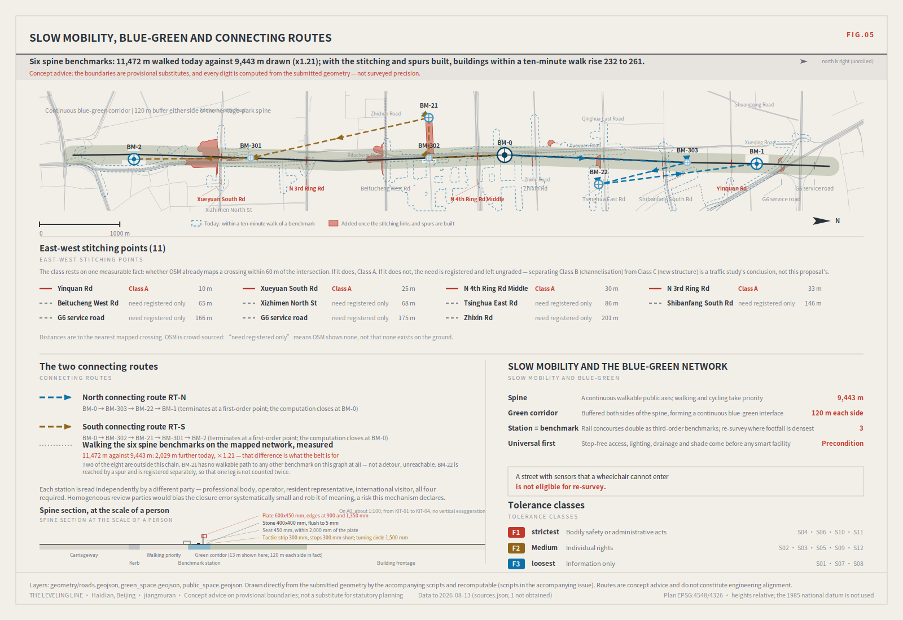

### Three AI pilgrimage landmarks (agent.4)

Landmarks here are not objects to look at; they are **instruments to read**. All three speak engineering language and refuse spectacle.

**L1 — The origin benchmark stone (BM-0, the AI Origin Community).** A metal stone set into the ground, flush with the surface, under a metre across. Its face carries the network's starting elevation and its number, and the paving around it is laid with the numbered sequence of every merged proposal in this call — **contributors' GitHub IDs are inscribed here.** This meets the call's own inscription promise without inventing a device for it: a benchmark stone has always been a permanent mark left for whoever comes to re-measure a century later. It is not grand. It is only accurate — and it has to be accurate enough that someone later can actually reuse it.

**L2 — The closure stele (BM-1, Zhongzhiyuan).** A continuously updated public reading wall, showing in real time the current closure error and tolerance for every scenario on the line. Scenarios over tolerance are marked in datum red with the date they were sent back for re-survey. The value of this landmark is that it **is allowed to look bad** — a civic device willing to display its own failures in public builds more trust than any success narrative, and a wall that only ever showed green would be worth nothing to read.

**L3 — The zeroing point (BM-2, Dazhongsi).** A public ceremony space used once a year: the line's readings are zeroed here, tolerance revisions are read out here, and the disposition of every scenario sent back for re-survey in the past year is explained here. It turns measuring back from a technical procedure into a public rhythm in the city's year. On ordinary days it is simply a public place to sit, not a single-use monument waiting eleven months for its occasion.

All three must satisfy heritage, green-line, blue-line and traffic-safety constraints. **No machine-readable citation is given here, because the package holds no feature that could carry one**: the official heritage protection zone, its construction control belt, the blue line and the road redline are all data gaps this proposal declines to infer. The sentence used to cite CONSTRAINT-001, which is S11's controlled test boundary and has nothing to do with heritage or blue lines — and whose own note says precisely that those boundaries are data gaps. Citing a feature that declares a gap as evidence for a conclusion needing that data is the move this proposal objects to elsewhere. Siting requires heritage and engineering review, which this proposal does not pre-empt.

### Honours, kit of parts, and signage (agent.4, agent.5)

<!-- OPERATIONS:BEGIN -->

Organised as a numbered sequence, not a leaderboard: numbers run in merge order and imply no ranking. A leaderboard needs a comparable score, and what this proposal argues throughout is that **a score without independent recomputation is not a basis for ranking**. Unable to supply that score, it should not publish that board.

One unique numbered plaque per contributor; once assigned, a number is never reclaimed and never reordered.

**Kit of parts: five standard components** (specs and open drawings ship in `visual/assets/operations.json`)

| Id | Component | The hard constraint — the one that can fail on site | Serves |
|---|---|---|---|
| KIT-01 | Benchmark stone and plaque | Stone top within ±5 mm of the paving — "flush" with no tolerance cannot be failed; 400 × 400 × 600 mm, foundation underside at least 100 mm below the local standard frost depth; plaque number unique and matching a `benchmark_id` in the geometry one-for-one. Detailed in FIG.16 | P4, P5, P7 |
| KIT-02 | Reading plate | Current f and tolerance F both visible, with the re-survey date; a stale value counts as not posted. Face 600 × 450 mm raked 15°, lower edge 900 mm and upper edge 1,350 mm — the band a seated and a standing reader share; the face is replaceable without the post. Detailed in FIG.16 | P2, P3, P4 |
| KIT-03 | Seating that permits staying | Seat 450 mm high with armrests, so getting up is possible; within 2,000 mm of the reading plate and in sight of it, so taking a reading needs no standing wait. Detailed in FIG.16 | P5, P7 |
| KIT-04 | Accessible wayfinding | Guidance strip 300 mm wide and continuous, stopping 300 mm short of the stone so it does not lead onto it; tactile and visual channels both; Ø1,500 mm turning space with 2,100 mm headroom at the reading position; the approach may not be by steps alone. Detailed in FIG.16 | P5, P6, P7 |
| KIT-05 | Appeal point | **Must offer both a QR code and a phone or in-person route** — a QR code alone excludes anyone without a smartphone from appealing, which makes persona P4 unworkable | P4, P5, P6 |

Organised by re-survey cycle rather than by festival calendar, so that an event is a governance action and not a publicity one.

| Cadence | Event | Benchmark order | Led by | Measures | Publishes |
|---|---|---|---|---|---|
| Monthly | Community re-survey day | third | P4, P5, P7 | the current reading at each third-order point | that point's f for the cycle, and whether it is within F |
| Quarterly | Scenario open day | second | P2, P3 | how a scenario performs on the published question set | the scenario's closure error, and whether an exit condition fired |
| Half-yearly | Route re-survey | first | P1, P2 | the closure error of the whole connecting route | route-level f; exceeding it returns the whole segment for re-survey |
| Annual | Return-to-datum ceremony | datum | all | the whole line returned to datum, and the year's tolerance revisions logged | the year's closure record and the reasons for any tolerance revision; revisions may only tighten |

**Conversion path.** Every step states its entry and exit condition — a path with arrows and no conditions is a funnel diagram, not a mechanism.

| Step | Stage | Entry | Exit |
|---|---|---|---|
| 1 | Take a reading | anyone, no qualification required | one recorded reading completed |
| 2 | Propose a scenario | at least one recorded reading | a scenario card filled in full: benchmark, spatial anchor, exit quantity, executing role |
| 3 | Enter the controlled ground | the card passes `check_cards.js`; the S11 ground is available | a closure record obtained under controlled conditions |
| 4 | Pass leveling | a controlled-ground closure record exists | **f ≤ F for two consecutive cycles** — once may be luck |
| 5 | Operate on site | leveling passed and the removal bond is in place | continues to meet each cycle; exceeding returns the segment and removes the devices |

**This is the proposal's own rule turned against it.** The L2 closure stele — the wall that is allowed to look bad — stands at BM-1 in Zhongzhiyuan, an R&D district, while the person a wrong reading lands on is at BM-303, a third-order community point some 3 km away. **The institution's public confession is sited where the institution is.** This proposal argues throughout that review placed fifteen minutes' walk away has not been given; this siting was the counter-example.

The current-cycle failure reading is shown at **every third-order community point**, using the existing KIT-02 reading plate rather than any new structure: a returned scenario is marked in datum red with its return date and the conditions for resumption. L2 remains the site of the annual return-to-datum ceremony and the year's closure record, because that is one line-wide occasion — but **the current bad news belongs where it happened**.

Replicated at BM-301, BM-302, BM-303 using component KIT-02; new structures required: 0.

The five standard parts share one specification and open drawings, so any new node anywhere on the line can join in the same language. The construction detail is FIG.16; wear and replacement are FIG.18, where the stone is the only part that must never be replaced and the only one a person cannot carry; the no-drilling construction and setback rule beside heritage fabric are FIG.19; and why the plate carries no lamp is FIG.20.

**One year of running it, costed — all eight benchmarks, row by row.**

Sessions per year are converted from the re-survey cadence each point declares in `spatial.json`, not typed into this table; hours = sessions × people × the per-session band; money = hours × the rate band plus consumables.

| Benchmark | Cadence | Sessions/yr | Convener | Paid hours (priced) | Volunteer hours (unpriced) | Consumables (CNY/yr) | Budget line |
|---|---|---|---|---|---|---|---|
| BM-0 | datum | 1 | the implementing body with a licensed surveying unit | 15–24 | — | 600–1500 | municipal facility maintenance — survey and monument upkeep |
| BM-1 | first | 1 | the implementing body with a licensed surveying unit | 12–18 | — | 500–1200 | municipal facility maintenance — survey and monument upkeep |
| BM-2 | first | 1 | the implementing body with a licensed surveying unit | 12–18 | — | 500–1200 | municipal facility maintenance — survey and monument upkeep |
| BM-21 | second | 4 | the park operator | 20–32 | 20–32 | 300–700 | park operations — scenario open days and tech services |
| BM-22 | second | 4 | the park operator | 20–32 | 20–32 | 300–700 | park operations — scenario open days and tech services |
| BM-301 | third | 12 | the sub-district office or residents' committee | 18–30 | 36–60 | 200–500 | community governance service procurement — sub-district |
| BM-302 | third | 12 | the sub-district office or residents' committee | 18–30 | 36–60 | 200–500 | community governance service procurement — sub-district |
| BM-303 | third | 12 | the sub-district office or residents' committee | 18–30 | 36–60 | 200–500 | community governance service procurement — sub-district |
| **Total** | — | **47** | — | **133–214** | **148–244** | **2,800–6,800** | — |

The table above prices the network **as laid out**. FIG.21 measures the worst walk on the line at 1,107 m — 30.8 minutes for P5 — and finds six of nine segments failing this proposal's own fifteen-minute rule; closing it needs nine more third-order points. **That is not the same table**: a compliant network costs the following again, on the same model. Letting the as-laid-out figure stand in for the compliant one is the substitution this package would flag in someone else's.

| To close the gap | |
|---|---|
| More third-order points | 9 |
| More re-surveys a year | 108 |
| More paid hours | 162–270 |
| More annual cost | CNY 21,240–74,700 |

**Volunteer hours are counted and not priced.** Pricing them would inflate a cost nobody pays; omitting them would pretend they are free. They are the hours this mechanism asks of residents each year, and that is a quantity to see before agreeing to it.

At CNY 120–260 per hour, paid labour runs CNY 15,960–55,640 a year, or **CNY 18,760–62,440 a year** including consumables — all bands, none of them point estimates.

**The only number here that is not counted is the rate**: CNY 120–260 per hour is a band with no verifiable source in this package, and it is graded provisional. Every other cell is a count of sessions, people, hours or items. Substitute your own rate and the table recomputes — the formula ships beside it for exactly that reason.

**The removal bond, docked to instruments that already exist.**

**No new deposit is created.** The removal obligation is docked to two instruments already in use in construction and municipal works: a performance bond covers the specific obligation to remove on time and restore the site, and third-party liability insurance covers harm caused while the devices stand. Creating a new deposit would mean creating rules for collecting, holding, disputing and releasing it — and this proposal establishes no new body, so it should not propose money only a new body could hold.

| | |
|---|---|
| Instruments | a performance bond (or an equivalent bank or insurance guarantee); third-party liability insurance |
| Custodian | Held in an independent escrow account drawn on by **dual signature** — the contracting party (the implementing body) and the sub-district office together; or replaced at equal value by a bank or insurance guarantee so no cash is tied up. |
| Release authority | Released on both signatures; neither party alone can release it. **Single-party release does not hold** — the party that pays for removal cannot also be the party that decides whether removal happened. |
| Release conditions | the devices are removed; the site is restored to the state in the baseline photographs taken on entry; no third-party claim is outstanding |
| If removal is overdue | If removal is overdue the contracting party commissions removal and restoration from the bond, settles at actual cost, and recovers any shortfall from the responsible party. |
| Amount | 100%–150% of the estimated removal-and-restoration cost — a band, not a point estimate; the upper end covers the cost of organising removal by a third party. Any statutory ceiling is the contracting party's to apply; this proposal cites no article number it cannot show you. |
| Service level | Service level: removal and site restoration complete within 30 days of a removal order; third-party liability cover may not lapse while the devices stand, and a lapse is itself a stop condition. |
| Stop conditions | f > F for two consecutive cycles (the same condition as PATH-5); liability cover lapses; a removal order passes its deadline |

**The base is the estimated cost of removal and restoration, not a percentage of contract price.** A percentage of contract price bears no relation to what removal costs: a cheap installation in an awkward place can cost more to take out than to put in.

The dual-signature escrow construction is borrowed from another submission in this call (wocaonimaworinixi-collab, X08): of 738 packages it is the only one that gives a removal deposit a trustee and a rule for drawing on it. It is borrowed because it is harder than what this package had — release by the contracting party with a confirmation attached.

External communication draws on published readings, not on promises. All of the above are proposed operating mechanisms; whether they are adopted rests with the responsible parties' own decisions, and this proposal may not be cited as a commitment made by any of them.

<!-- OPERATIONS:END -->

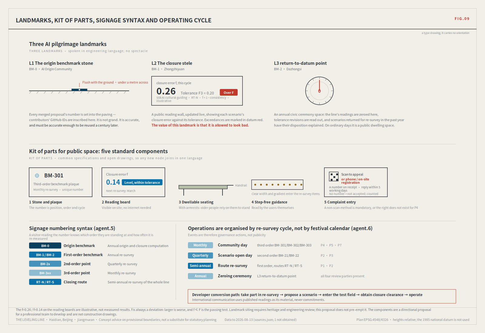

A kit of parts is easy to write as a list, and a list is exactly what hides whether it works. The sheet below draws a third-order benchmark at **eye level**, to a stated scale of 1 m = 138 units: the stone flush with the paving, the reading board showing this cycle's `f 0.13 ≤ F 0.20`, seating with armrests, continuous step-free guidance, and a complaint entry offering both a scan and a phone/in-person route. The figures standing in it are personas P4, P5, P6 and P7 — **they are not staffage, they are the people who take the readings**, and every hard constraint in the five components exists because of them.

The lower panel is the kerb in section, in the priority order the transport chapter sets, and it **draws sequence without drawing widths**: capacity must be computed on site from measured clear width, and a figure not derived from measurement is fabricated certainty. Device charging sits behind pedestrians and accessibility, and that order is itself the position.

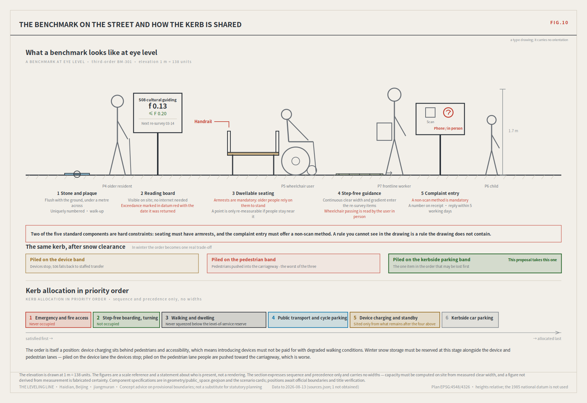

**Bilingual signage rules.** Most systems set Chinese above English and then drop English when space is short. This numbering grammar **depends on no language at all**, which is its core advantage as signage: the number itself (`BM-0`, `BM-3xx`, `RT-N`, `F1`) is Latin letters and digits, readable and repeatable by readers of either language and of neither. Order and cycle are bilingual with Chinese first; readings and tolerances are **numbers first** (`f 0.14 ≤ F 0.20` needs no translation); the complaint entry is bilingual **plus a non-textual icon**; historical and cultural text is bilingual in full, because compressing it distorts it. Three hard rules: **numbers are never translated** (a `BM-0` is `BM-0` in every language version, or cross-language reference breaks); when space is short, compress explanation first, then English, **never the number or the reading**; and where Chinese and English disagree anywhere, **the recomputable number governs**.

### Heritage, Zhongguancun culture, and the new AI culture (agent.5)

The three are not three exhibits side by side. They are three periods of one thing: **the history of Chinese people surveying for themselves, judging for themselves, and bearing the consequences themselves.**

The Jing-Zhang railway was the first trunk line surveyed, designed and built by Chinese engineers — **it was a surveying achievement before it was an engineering one.** That is where this proposal's name comes from. Zhongguancun's innovation culture, from the electronics street to open-source communities, has "make it first, judge it after" at its core; its carrier here is the searchable, reproducible archive in the public evidence hall. The new AI culture layer begins with this call itself — over three hundred proposals generated by agents, publicly logged, re-measurable by anyone. Its cultural question is not technological display but **how people keep final judgement once machines take part in public affairs**.

#### Heritage inventory: first, what is actually in scope

A proposal that claims to do heritage narrative without naming a single heritage asset is doing rhetoric, not narrative. The table below separates assets by **whether they fall inside this design area**, and the separation is itself necessary — treating an out-of-scope asset as a site element is a common move and an invalid one.

| Asset | Position | Role in this proposal | Data status |
|---|---|---|---|
| **Former Tsinghua Garden Station** | In scope, near BM-0 | The core anchor of the heritage layer; its protection zone and construction control area directly constrain the siting of nearby benchmarks and facilities | **The GIS layer for its protection zone is a data gap**, already listed as a must-supply item in the repository's `missing-data.md`; this proposal does not infer its boundary |
| **Beijing North Station (Xizhimen)** | At the southern end of the area | The line's mileage origin and the real-world reference for the spine's K0 | Position publicly available |
| **Taipinghu depot** | In scope | An industrial heritage frontage, and the physical basis for the honesty-of-infrastructure register | Position publicly available |
| **Existing alignment and engineering structures** | Along the whole spine | Sleepers, ballast, signal posts and mileposts, retained and annotated in situ | Requires site survey to enumerate; no specific list is given here |
| Qinglongqiao Station and the switchback | **Out of scope** (near Badaling, tens of kilometres away) | **Historical context for the line as a whole only**, not a site element of this belt | — |

Out of scope: **Qinglongqiao Station and the switchback**, tens of kilometres away near Badaling. This needs saying, because it concerns a common practice. The switchback is the line's most recognisable symbol and <!-- ZIGZAG:BEGIN -->

Of the 770 submissions, **55** name it in the title or summary and **199** mention it anywhere in the body [source:FIELD-CENSUS-2026-08]. The two readings are given separately because “core meta-symbol” asks about naming, not mention; both are recomputed from the bodies by `analysis/field_extras.py`.

<!-- ZIGZAG:END -->. Citing it as a *narrative symbol* is entirely legitimate — it belongs to the line's history. But it is a **specific engineering structure outside this 43.6 km² design area.** This proposal therefore does not use it in spatial design and draws it in no layer; it takes a different heritage of the same line — **the surveying method** — which runs the whole length, including every metre inside the scope. This is not a judgement of other proposals; it is this proposal's own boundary of use: **a symbol can be borrowed; a site cannot.**

Historical statements must be proofread and may not be altered to suit the narrative [standard:PROJECT-OFFICIAL-ANNOUNCEMENT]. Items marked as a data gap in the table above may not enter any spatial conclusion before the official layer is published — an inferred protection boundary would be the most damaging possible instance of fabricated certainty, because it would look authoritative precisely where the constraint is strictest.

The signage and wayfinding system reuses the network's numbering grammar: the number is the position, the order and the cycle at once, so a visitor reading `BM-3xx` knows they are standing at a community-level point that is re-measured monthly, without being told. The cultural signage system and the belt-wide identity system are managed as separate layers and are not mixed: one names heritage, the other names measurement, and conflating them would make both harder to read.

**International communication copy.** The usual problem is not poor writing but **unverifiability**. Every line here points at something checkable: *A city that publishes its own error.* / *Not how well it performed once. Whether it measures back.* / *No benchmark, no robot.* / *This mark does not grant trust. It declares that the claim can be re-measured.* Each line points at something a reader can go and check: the published readings, the re-survey record, benchmark coverage, and the verifier that ships with the package. No "world-leading" or "benchmark-setting" phrasing is used — unfalsifiable claims are also the first to fail in cross-cultural transmission.


## Renewal Projects, Implementation Policy, and Phasing

Phasing and project extents are in [data:geometry/phasing.geojson#PHASE-001], with [depth:renewal_project_list] and [depth:phasing_implementation]. Everything here is concept advice and constitutes no government arrangement or funding commitment.

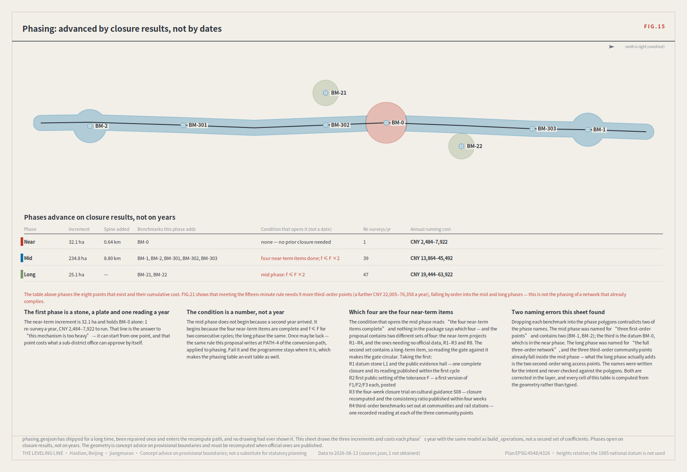

FIG.15 draws the three increments, the benchmarks each adds, and **what each phase costs to run**: the near term holds BM-0 alone, on one session a year.

### The first closure trial: a minimum unit that runs in four weeks

A governance mechanism that cannot run its first circuit under existing conditions is only text. Near-term work is therefore concentrated into one closure trial that **completes in four weeks, depends on no unpublished official data, and requires no new construction**, with parameters given in enough detail to execute.

Scenario **S08 AI cultural guiding** (F3, loosest tolerance): the heritage park carries it as-is; a wrong historical statement can be taken offline immediately; F3 touches no individual rights. Route: a simplified three-station RT-N, BM-0 → BM-303 → BM-1 — three stations is the minimum from which a closure error can be computed, and the whole route is on currently walkable spine. Question set: twelve public questions about the same stretch of history and the same path (historical fact, accessibility, step-free provision, opening hours, comprehensibility), fixed and published so stations are comparable. Review parties: one group from each of four categories, none omissible — professional (a university planning or survey team), operational (the park operator), residents (representatives from around BM-0, **including at least two older people and one wheelchair user**), and international (students or visitors in Beijing). Reading convention: consistency ratio, computable by hand. Initial F3: **f ≤ 0.20** (consistency ≥ 0.80), with the **first round establishing a baseline and imposing no penalty** — announcing penalties before a baseline exists is legislating by guess. Cycle: week 1 set up and publish the question set, weeks 2–3 take readings at three stations, week 4 return, compute and publish.

The test of success is not that consistency clears the bar. It is that **the closure error can be computed, the method is public, and a third party can recompute it.** If the first round is far below 0.80, that is a valuable reading — it says this route differs sharply between populations, and that difference is the design task.

### Renewal projects (eight, with responsible roles, preconditions, cost bands, KPIs and exit)

Every column is mandatory, because **a project list without an owner, preconditions or an exit condition is a wish list, not an implementation plan**. This edition asserted that sentence over a table with eight of the eleven columns — cooperation mechanism, land and title dependency, and approval path had been dropped in translation. All three are restored. A completeness claim made over an incomplete table is worse than no claim. The responsible-role column names **role types only, never institutions**: this proposal has no authority to designate anyone, and assignment must be negotiated. Costs are given in order-of-magnitude bands (A ≤ millions, B millions to tens of millions, C above tens of millions), not to three significant figures — precise figures without engineering and title conditions are fabricated certainty.

| # | Project | Phase | Responsible role (to be negotiated) | Cooperation mechanism | Preconditions | Cost | Land and title dependency | Approval path | Stage KPI | Exit condition |
|---|---|---|---|---|---|---|---|---|---|---|
| R1 | L1 origin stone and public evidence hall | Near | Park operator; university technical support | Site-use agreement plus an open-data hosting undertaking | No official regulatory conditions needed | **A** | Public green space; no change of title | Park facility filing | One complete closure published within the first cycle | Two cycles without a published reading → interpretive signage removed, stone retained |
| R2 | First public tolerance F (tolerance chamber) | Near | Professional body; residents, operator, international visitors participating | Four-party review agreement; no vote without all four | None | **A** | Existing meeting space borrowed; no new land | No construction; the approval path is the venue manager's use permit | First public F1/F2/F3 values issued | Review parties below four categories → revision suspended |
| R3 | S08 four-week closure trial | Near | Park operator; community self-organisation | Published question set plus a three-station reading roster | No official data needed | **A** | Existing footpath; no land take | Event safety plan filing | Consistency ratio computed and published in four weeks | Two independent triggers, either one sufficient, both on the S08 card in `visual/assets/scenario_cards.json`: (1) `historical_error_count >= 1` at any point; (2) `f > F3` in two consecutive cycles. This row used to carry only the second and the card only the first, which read as a contradiction |
| R4 | Third-order benchmarks (community and rail) | Near–mid | Municipal road authority and rail operator jointly | **Cross-jurisdiction joint-observation agreement** (this proposal's core mechanism) | Jurisdiction verification | **B** | Municipal road and station concourse; permission needed from both | Road furniture permit plus station ancillary approval | One reading per point per month; ≥20% resident-initiated | Two months without a reading → point removed, segment closed to devices |
| R5 | Zhongzhiyuan controlled test field (S11) | Mid | Professional testing body; firms apply per session | Session booking plus a countersigned test boundary | Enclosure and safety assessment | **B** | Enclosed ground whose title must be established | Test-activity safety approval | F1 scenarios obtain closure records | Any breach → field closed for re-survey |
| R6 | Spine continuity and east-west stitching | Mid | Municipal and landscape authorities | Interface with the existing heritage-park works boundary | **Official boundaries, regulatory conditions, engineering review** | **C** | Multiple parcels and road redlines | The full statutory planning and engineering approval sequence | Share of segments meeting measured clear width | Review fails → revert to segmented connection |
| R7 | S06 low-speed robot segmented admission | Mid | Operator; joint measurement by all jurisdictions | Closure records recognised as devices move between segments | R4 complete; ice and noise baselines obtained | **B** | Depends on R4 benchmark coverage | Low-speed device road-testing permits | Segment ceilings published; zero safety incidents | Any safety incident → network-wide suspension of that type |
| R8 | Annual zeroing and network-wide re-survey | Long | Four review categories in rotation | Annual exchange of readings plus cross-region tolerance recognition | Two consecutive compliant cycles in mid phase | **A** | Uses the existing L3 space | Large-event approval | Annual readings and tolerance revisions logged | Two years without execution → considered terminated |

Three rules run through the table. **Cost band, exit condition and resumption condition always appear together** — without an exit condition a project may not advance a phase, which prevents "we have already invested so we must continue"; without a resumption condition, exit becomes indefinite suspension or quiet restoration. Resumption always follows rule 7 above. **Four projects state "no official data needed" (R1–R3, R8)**, together forming a complete near-term path independent of any unpublished data; organiser data gaps are therefore no obstacle to near-term implementation. And **R6 is the only C-band project and the only one strongly dependent on statutory approval** — the other seven stand independently in the worst case, because the network's value does not depend on the spine being physically continuous, only on points continuing to produce recomputable readings.

**Responsibility boundary.** This proposal names no implementing body, assumes no institution has agreed to anything, and touches no funding arrangement. What is written above is an operating suggestion that a park operator, a university team and a community self-organisation can each evaluate independently and each decide separately whether to adopt [standard:PROJECT-AGENT-OPEN-CALL-TASKBOOK]. That separation matters more than it may appear: a trial that requires all three to agree before anything happens is a trial that does not happen, and the four-week unit is scoped so that any one of them can start the part it controls.

**On the three columns restored to the table above.** *Cooperation mechanism* asks what agreement has to exist between parties before the project is more than an intention — for R4 that is a cross-jurisdiction joint observation agreement, which is this proposal's core mechanism and also its hardest precondition. *Land and title dependency* states, in one phrase, whether the project touches land whose ownership or management is unresolved: four of the eight need nothing beyond existing public space, and the two that need multiple parcels and road redlines are the two placed in the long phase for exactly that reason. *Approval path* names the consent that would actually be required, at the level of a filing or a permit, without asserting which authority issues it — this proposal has no standing to describe another body's procedure and says only what class of approval the work falls into. Together the three columns are what separates a project list from a wish list, which is the claim the paragraph above the table makes, and it should be able to survive the table being read.

**Phasing is triggered, not dated.** Mid phase begins when all four near-term projects are complete and at least two cycles have closed within tolerance; long phase when the mid phase closes two consecutive cycles. No fixed years, because **date-driven phasing advances even when readings fail**, which is precisely what this mechanism exists to prevent.

### Pilot agreement components

Launching the first trial needs an agreement, not only a proposal. This document does not draft the text — that is legal work — but lists the components none of which can be omitted: composition and replacement rules for the four review categories, including absence handling and how resident representatives are selected; **freezing and publication of the question set**, unmodifiable once the trial starts; ownership and publication deadline for readings; site use and safety responsibility, including who carries the safety plan and insurance; **exit and resumption**, written into the agreement rather than agreed verbally; a specific list of personal data not collected, and the consequence of breach; and a review cycle for the agreement itself, since it is a living document.

### Annual programme and long-term operation (agent.6)

Operation is organised by **re-survey cycle rather than festival calendar**, which makes events governance actions rather than publicity: monthly community re-survey days at third-order points led by P4, P5 and P7; quarterly scenario open days at second-order points led by P2 and P3; semi-annual route re-survey led by professional bodies with all four review categories present; and the annual zeroing ceremony at L3. Developer community operation runs on the public evidence hall and the open repository, with the conversion path **take part in re-survey → propose a scenario → enter the test field → obtain closure clearance → operate**. International communication uses published readings as its material, never commitments. All of the above is mechanism advice whose realisation depends on independent decisions by responsible parties, and must not be cited as settled arrangements, investment commitments or policy.


## Metrics, Area Recalculation, and Compliance Matrix

**A note on the confidence grades, because without it they look self-contradicting.** This package carries `high`, `medium`, `low` and `unknown` side by side while its spatial basis is a provisional boundary — a combination other packages in this call have repeatedly been marked down for. The rule here is whether the number depends on the provisional boundary being right:

| Confidence | Metrics | Why |
|---|---|---|
| `high` | `key_area_count`, `benchmark_count` | Pure counts. They count features in shipped files and do not depend on the boundary being accurate — move the whole boundary and the counts do not change |
| `medium` | Areas, lengths, every ratio | Exactly recomputable, but their *meaning* depends on the provisional boundary approximating the official one. Recomputed as a whole when official polygons appear |
| `low` | `building_footprint_area_sqm` | Indicative positions, order of magnitude only; not a basis for any area claim |
| `unknown` | `floor_area_ratio` | Depends on official FAR controls and the redline, neither published, so `value: null` rather than an estimate |

**Package-level `data_confidence` is `medium`.** The manifest previously said `medium` at the top level and `high` inside `validation_claim` — two package-level confidences disagreeing inside one file. They now agree, at `medium`, because nearly every published figure here belongs to the second row: computed exactly, on a boundary that is not the official one.

Metrics fall in three classes, held in `metrics.json`, `assumptions.json` and `compliance_matrix.json` respectively [depth:metrics_recalculation].

**Class 1, recomputable directly from this package's geometry.** Calculation CRS EPSG:4548, exchange CRS EPSG:4326. Every value is computed from the submitted layers by the accompanying script — a number that cannot be recomputed is not evidence, and that standard applies first to this proposal.

| Metric | Value | Convention |
|---|---|---|
| [metric:site_area_sqm] | 11,412,825 m² (11.41 km²) | Provisional overall design area; agrees with the announcement's ~11.4 km² |
| [metric:leveling_spine_length_m] | 9,443 m | Design centreline length |
| [metric:benchmark_count] | 8 | 1 origin + 2 first-order + 2 second-order + 3 third-order |
| [metric:green_ratio] | 0.1966 | The spine buffered 120 m each side, 240 m wide ÷ overall design area |
| [metric:green_ratio_in_partition] | 0.1220 | The part classed 1401 in the land-use partition ÷ overall design area |
| [metric:phasing_union_area_sqm] | 2,920,311 m² | The three disjoint phase increments summed; the phasing layer entered no metric and no check before this |
| [metric:public_space_ratio] | 0.0642 | Public measurement-point area ÷ overall design area |
| [metric:building_footprint_area_sqm] | 82,276 m² | Union of indicative footprints, order of magnitude only; 82,413 m² was the circular-footprint value and is superseded |
| [metric:key_area_count] | 3 | Count from the announcement; geometry provisional |

Because boundaries are provisional, all of the above are **recomputed as a whole**, never substituted file by file, when official polygons appear. Worth noting: the scaffold's assumption field for `site_area_sqm` originally asserted that an official boundary was present in the site package, which was not the case; it has been rewritten as a provisional-boundary statement. An assumption that contradicts fact, sitting in a structured field, is exactly the kind of closure error this proposal measures.

**First, a correction that runs against this proposal: the old 0.2025 counted 66,925 m² of this proposal's own building footprints as green space.** The corridor is a 120 m buffer of the spine, the six footprints stand inside that buffer, and they had never been subtracted from the green layer. The error ran in the author's favour, and a reading that flatters its author deserves naming more than a random one does. Subtracted now: `green_ratio` falls from **0.2025 to 0.1966**, behind a gate requiring the intersection of the green layer and the building layer to be 0 m² within 1 m², which names the offending buildings when it fires.

**Why green carries two numbers, and why that is a convention rather than a contradiction.** `green_space.geojson` and `land_use.geojson` give two areas for the same corridor, and `metrics.json` used to publish only the larger. With the footprints out of both layers, exactly one thing is left to explain the difference, and it closes to the metre: the corridor is 2,244,081.8 m², of which 851,785 m² falls inside the three key areas and the L1 cultural parcel — 459,609.3 m² in LU-002, 209,080.4 m² in LU-003, 134,913.8 m² in LU-004, 48,181.2 m² in LU-001 — and the partition gives each parcel its **dominant** use, leaving 1,392,297.1 m² classed 1401. 851,784.7 + 1,392,297.1 = 2,244,081.8.

Both numbers are true; what was missing was saying so. **Both now ship, and both are recomputed independently by `verify.js`**: 0.1966 from the green layer, 0.1220 from the land-use layer. Publishing only the first meant a reviewer recomputing from land use would land on a different figure with no way to tell which one counted — **and a recomputation that can reach two answers is not a recomputation.**

**Class 2, requiring official regulatory support, held at `unknown`:** [metric:floor_area_ratio] and building height, density, setbacks, road redlines. Filling estimates into a gap is fabricated certainty.

**Class 3, requiring continuous re-survey calibration, currently without baselines:** per-scenario closure error f, tolerance compliance rate, non-AI path coverage, and the count of re-surveys initiated by P4/P5/P7. Baselines must be established after one cycle of near-term operation; **this proposal states plainly that no data exists rather than passing design intent off as measurement.**

<!-- CEILING:BEGIN -->

**“computed exactly” and “measured reliably” are two axes, and this package had one.** 26 metrics carry `confidence: high` and none said how strong the thing measured was. The 412.5 m closure is the case in point: the arithmetic is exact and `check_osm.js` reproduces it to the metre, but one input is a boundary this proposal **inferred** because the official polygon is unpublished, and the other is crowd-sourced. “high” is true of the computation and misleading about the reading, and no field in the file separated them. **That is how 412.5 m comes to read as a survey result.**

So each metric's **evidence ceiling** is now computed from the weakest file it reads rather than judged by the author, and ships as `visual/assets/evidence_ceiling.json`. The result is unflattering, which is why it is stated: of 36 metrics, 35 can be graded — the remaining one is honestly marked unknown with no value, so it has no number to overstate. **17 are capped at `provisional`** (drawn on an inferred boundary), **3 at `background_only`** (crowd-sourced geometry or keyword counts over other people's proposals), 14 at `self_measured` (they measure this package), exactly **1** reaches `official_context`, and **none** reaches `regulatory_baseline`. Where the ceiling is provisional or background, `confidence_is_about` reads `computation` — the “high” is about the arithmetic, not the reading.

**The practice is borrowed openly.** `Abreto/REN AXIS` ran four adversarial rounds and retracted four conclusions carried only by background-class sources; `147228` ships an errata register with a `found_by` field. This package's increment is not having the idea — it is **no longer doing it by hand**: the ceiling is derived from the source files, so adding a source weaker than the claim fails the build instead of the reader.

<!-- CEILING:END -->

### The reviewer can recompute it: `node visual/assets/verify.js`

This proposal argues a number nobody can recompute is not evidence. If that standard applies only to others, it does not hold. The package therefore contains a **zero-dependency independent recomputation**:

```bash
cd submissions/jiangmuran/jingzhang-leveling-line
node visual/assets/verify.js
```

It calls none of this proposal's generation scripts and needs neither Python nor a network. It **implements the EPSG:4548 projection inside the file**, recomputes every class-1 metric from the submitted GeoJSON, compares each against `metrics.json`, and returns the verdict as an exit code. It also checks three structural claims: whether points declare jurisdictions, how many are cross-boundary, and whether the site boundary is labelled provisional.

**This is not decoration.** During development it overturned one of this proposal's own numbers: `building_footprint_area_sqm` diverged by 16% because two landmarks sat concentric with adjacent facilities — the generation side hid the overlap in a union, and independent summation exposed it. **The response was to fix the geometry, not the metric:** the two landmarks were offset, and footprint overlap became a hard build error. The episode is recorded in `changelog.md`. A number that has been overturned by its own verifier is more credible than one never tested.


### Accessibility and legibility QA: computed, not asserted

Reviews of the highest-scoring concurrent submissions repeatedly ask for the same thing: distance-legibility and colour-contrast testing on A0 boards, and alt-text, keyboard, screen-reader and contrast checks on the HTML. That request is usually answered with a sentence. Here it is computed, shipped as `visual/assets/accessibility_qa.json`, and **enforced as a build gate — failure stops the build rather than warning.** To be exact: `analysis/` is not in the submitted package, so a reviewer cannot re-run the gate itself; what can be re-run is the shipped `accessibility_qa.json` and the five `.js` checkers.

Contrast (WCAG 2.1, ≥ 4.5 body text, ≥ 3.0 large text and graphical objects, against the paper surface): principal ink 11.44, secondary text 4.56, muted annotation 3.00, datum red 4.74, instrument blue 4.59, brass 4.51, surveyed green 6.86 — all clearing their floors. **Four of these failed before this revision** — muted annotation at 2.30, brass 3.47, olive 2.60, secondary 4.30. The script found them; new values were then derived against the target ratios and applied throughout. Chosen by eye, all four looked "clear enough".

Distance legibility: A0 is 841 mm across a 1600-unit canvas; by the signage convention *legible height ≈ viewing distance ÷ 250*, a 1 m reading distance requires ≥ 4.0 mm. The smallest actual type across all sheets is **4.73 mm**. Offline HTML: **every one of nine images carries alt text**, the language is declared, heading levels do not skip, there are ten figure captions, dark mode is supported, and there are **zero `<script>` tags**.

**The script checks what is computable and does not replace human testing.** Screen-reader listening, reading by people with colour vision deficiency, and on-site legibility from a printed A0 must be done by people; this proposal does not claim to have done them, only that the computable part has been computed and can be re-run.

### Recomputation discipline

| Trigger | Scope of recomputation |
|---|---|
| Official polygons published | **All layers and metrics recomputed together**, never one file |
| Any geometry layer edited | Metrics → figures → HTML → A3/A0 → manifest hashes, whole chain |
| Citing corpus figures | Re-run the census; the corpus grows daily and old numbers may not be cited |
| Jurisdiction verified | Treated as a boundary change; the section is re-measured |

These four share their source with the core rule: **over tolerance, re-measure the section; do not patch.** A proposal that permits itself partial substitution while requiring the city to recompute as a whole does not hold its own mechanism.

`compliance_matrix.json` maps announcement tasks and agent.1–agent.6 to sections, layers, metrics and figures. **The matrix is an index, not content** — the taskbook's required outputs must exist as checkable sections, layers and drawings, and copying the matrix into the body would only turn the document into a compliance form.

**Every reference the three matrices make is checked: 523 declared, 523 resolving.** Between them `compliance_matrix.json`, `standard_matrix.json` and `design_depth_matrix.json` assert 523 times that a given requirement is answered in a named section, carried by named layers, evidenced by a named file — and **nothing previously confirmed that any of those sections or files exists**. They are resolved at build time: section references matched against the proposal's headings, file references matched exactly, and any that fails stops the build. Tested by pointing one entry at a section that does not exist. A matrix is the artefact least likely to be re-read when a heading is renamed or a file is added, and this package has already shipped four dead machine-readable anchors, a legend missing a class, and a rights count three files behind, each for that reason.

### Taskbook coverage, requirement by requirement: `visual/assets/taskbook_coverage.json`

The taskbook sets six agent tasks carrying **63 requirements** between them — 31 must-address items and 32 required outputs. The compliance matrix *asserted* that this package covers them. Nothing joined a requirement to the place that answers it, and **a claim of coverage is not coverage** — which is the objection this proposal makes everywhere else.

Every requirement now points at evidence: a section in `proposal.md`, a shipped file, or a figure, each verified to exist at build time. The five requirements where the taskbook states a floor are **recomputed** rather than declared:

| Taskbook floor | Measured here |
|---|---|
| At least 10 AI scenario cards | **12** |
| At least 3 industry test-and-validation scenarios | **3** (S06 / S10 / S11, each with its own controlled boundary) |
| At least 5 user personas | **9** |
| At least 3 AI pilgrimage landmarks | **3** (L1 / L2 / L3) |
| 5–8 global AI ecosystem case studies | **6** |

All 63 answered. Recomputing the floors rather than declaring them means that if one of these deliverables is ever dropped, **the build fails instead of the matrix going on asserting it is there.**

### One deliverable deliberately not shipped: `simulation.json`

The repository's `validate_submission.py` carries `validate_simulation_consistency`, which cross-checks a `simulation.json`'s task records against `simulation_success_rate`, `tool_schema_pass_rate`, `energy_budget_violations` and `audit_completeness` in `metrics.json`. <!-- SIMJSON:BEGIN -->

**20 of 770** submissions ship one; the roster is in `simulation_json.keys` in the shipped `visual/assets/field_extras.json`, checkable entry by entry. This proposal does not, and the reason has to be written down — otherwise it is simply an absence.

<!-- SIMJSON:END -->

**First, this proposal has no basis for the numbers that schema wants.** It is designed for an agent-dispatch simulation: per-task outcomes, energy used against an energy budget, dispatch-schema validity. No dispatch simulation was run here and there is no basis for any energy figure. Every value would be invented.

**Second, the one thing that could honestly take that shape would publish a number that reads as something else.** The ten-case tabletop is a set of task records — each has a fixed input, a fixed verdict and a fixed expectation. But its success rate is **10 of 10 adjudications matching specification**, and `simulation_success_rate: 1.0` reads to any reviewer as "this scenario succeeds every time". Those are very far apart. The tabletop proves the decision logic is reproducible and that the refusal branches fire. It proves no field reading, no real review party and no service performance.

**Publishing a number that will be read as something else is the thing this proposal spends its length objecting to.** So the slot stays empty, and the tabletop ships under its own name — `run_s08_tabletop.js` and `s08-tabletop-evidence.json` — with what it proves and what it does not stated in its own output.

**If this proposal ever obtains real dispatch or energy data, the file should be added.** What is missing is not the willingness. It is the basis.

### An errata register: `visual/assets/errata.json`

<!-- SELFCORRECTION:BEGIN -->

**This paragraph used to read “not one submission in the field ships an erratum.” Re-measured, that is false, so it is corrected here.**

Of the current 770, **2** ship a standalone errata file — this proposal and `147228` — and **11** use self-correction language in the body. When this proposal first wrote that sentence the figure was 1, itself. It is not any more.

It is corrected rather than left standing because **the sentence is an instance of this proposal’s own argument**: an assertion that stopped being true when the corpus changed goes on reading as true unless its author re-measures it. The errata file in `147228` — `visual/assets/errata.json` under that submission, readable in the same repository — carries `found_by` and `shape` fields whose shape vocabulary overlaps this register’s closely (`two_copies_drifted`, `known_value_not_recomputed`), **which says the notation travels and is not this proposal’s property**. **So this proposal no longer claims nobody else does this. It claims something narrower and more checkable: an errata register should be generated by the build and held by a gate to ‘every entry joins back to the repository’, not maintained by hand.** `build_errata.py` verifies at build time that each entry’s commit exists and actually touched the file it blames. That is a difference an outsider can check; a count of entries is not.

<!-- SELFCORRECTION:END -->

Which is the reason to ship one. A proposal arguing that a city should publish its own error cannot itself present a defect-free surface — the mechanism it proposes rests on the idea that a measurement you cannot see fail is a measurement you cannot trust, and a document is no different.

**It is not a changelog.** A changelog says what changed. This says what was wrong, what shape the error had, who found it, and which commit fixed it. Every entry names a commit, and `analysis/build_errata.py` verifies at build time that the commit exists and touched the file the entry blames — an errata register that cannot be joined to the repository would be the defect it records.

<!-- ERRATA:COUNT:BEGIN -->

61 entries. By finder:

| Found by | Count | What it says |
|---|---|---|
| Independent audit | 25 | The audit was run against the shipped package, not a draft |
| The author | 27 | Found while working |
| This package's own gate | 5 | Caught at build time — which is what a gate is for |
| **Reviewers outside this proposal** | **4** | [@anselasimov-web](https://github.com/anselasimov-web) on PR #1002; [@147228](https://github.com/147228) on PR #1065; [@Sonike](https://github.com/Sonike) on Issue #950; [@147228](https://github.com/147228) on Issue #950 / PR #1190 |

<!-- ERRATA:COUNT:END -->

**E24 is the only entry where the check worked and the person did not**: `overflow_qa` reported the overflow and I pushed the commit anyway. A gate that reports to someone who commits regardless does the same nothing as a gate that does not report. That failing commit stays in the history rather than being amended away.

**The reviewer row is the most important line in the register.** A mechanism whose refusal branches are written down in an executable file can be falsified by a stranger within hours. A governance commitment that lives only in prose never meets that fate — not because it is sounder, but because there is nothing there to test.

**Grouped by the *shape* of the error, something emerged that this proposal did not anticipate:**

<!-- ERRATA:SHAPES:BEGIN -->

| Shape | Count |
|---|---|
| **The check measured the convenient thing** | **13** |
| **A deliverable was not looked at before shipping** | **11** |
| **Two copies of one thing drifted** | **6** |
| Geometry did not mean what it said | 4 |
| A number outlived the sentence holding it | 4 |
| A reference did not resolve | 4 |
| A claim outlived the package | 3 |
| A measurement answering a question it cannot answer | 2 |
| A number with no file behind it | 2 |
| A rule applied to others but not to itself | 2 |
| Attributed to a file that refuses to do it | 1 |
| A claim outlived the corpus | 1 |
| A claim this medium makes uncheckable in principle | 1 |
| A hard constraint nothing could fail | 1 |
| The gate reported and was ignored | 1 |
| An index that does not index | 1 |
| A requirement with nobody to execute it | 1 |
| Six classes listed for a seven-class partition | 1 |
| A term of art applied where it does not hold | 1 |
| The table stopped being a table | 1 |

<!-- ERRATA:SHAPES:END -->


**The first two rows are the register’s two tallest shapes. Five of the first row:** Translation coverage counted strings handed to the translator rather than Chinese on the page. The CJK-leak gate scanned text and could not see PDFs. The build's verdict expression omitted two gates that printed PASS. `verify.js` ended in three conclusions it printed and never refused on. The closure reader rejected an explicit `false` and not an absent field. Five times, the same thing: **the check asked whether something was said wrongly, not whether it was said at all.**

**The second row's remedy is not the first row's.** All five are drawings or pages: FIG.05's route legend still carried a closing tail the geometry no longer has; FIG.06 said "every class-1 value" over seven of nine; FIG.03's tier table contradicted its own legend four lines below it; FIG.04 still called BM-1 the datum of origin and said the route returns to BM-0; FIG.01's land-use legend listed six classes for a seven-class partition and painted the seventh grey as "other". **None is a geometric error, so none could have been caught by a geometric check** — they are label strings inside figure modules. All five were found by rendering what a reviewer is sent and looking at it. The first row's remedy is to build a gate. The second row's remedy is to open the drawing.

That count is not rhetoric. It is this proposal's most direct evidence, measured on itself, for why closure error is worth having — one reading cannot show a systematic bias, and several readings in the same direction can.

## Risk, Copyright, and Compliance

This section corresponds to [depth:risk_missing_data].

**Spatial data risk.** Official polygons are absent, so every spatial conclusion in this package rests on provisional boundaries [source:BOUNDARY-SOURCE] [source:KEY-AREA-SOURCE]. They are for discussion and self-check only and must not be used for approval, for precise area, or as statutory control [source:SOURCE-REGISTRY].

**Self-collected data risk.** [source:FIELD-CENSUS-2026-08] is graded `background_only`. Its keyword patterns undercount synonyms, so every convergence share is a lower bound; an empty `model` field does not mean an author concealed the model; and the corpus changes daily, so any citation must be recomputed first. This data is used for no spatial or statutory conclusion anywhere in the package.

**Governance mechanism risk.** The closure mechanism can be executed formally rather than substantively: if the review parties become homogeneous, f is biased systematically low and stops meaning anything. The mitigation is mandatory diversity — professional body, operator, residents and international visitors, none omissible — with P4 resident representatives holding an independent right to initiate. This risk must be reassessed after the first re-survey cycle rather than treated as handled.

### Eight-dimension self-assessment (`risk.json`, shipped with the package)

`risk.json` scores eight dimensions from 1 to 5 with mitigations and human-review requirements for each. The two highest are below; the other six are in the file. An eight-dimension self-assessment ships as `risk.json`, scored 1–5 with mitigations and human-review requirements. The two highest are stated here.

**Jurisdictional dispute — 5.** All eight benchmarks cross jurisdictions. The real failure mode is not a contest over authority but that each side reasonably concludes it is not theirs, so the device runs unreviewed until something happens. Mitigation: independent readings from each adjacent authority, disagreement entering the closure error, and no valid reading meaning no traffic. Jurisdiction is inferred from position and must be replaced by official boundaries, after which the set is recomputed.

**Equity and inclusion — 4.** Who takes the reading determines what can be measured. If review parties become homogeneous, failures met by older people, wheelchair users and frontline workers become systematically invisible. Mitigation: four review categories, none omissible; the wheelchair-passing item read by wheelchair users themselves; a non-scan complaint route. Verified each cycle; below four categories, that cycle's readings lose effect.

**Self-assessment is not modesty.** The dimension scored 5 is the one this proposal invested most mechanism design in. Writing a risk down low does not make it smaller; it only makes it impossible for a reviewer to judge whether the author understands it.

### Rights and licence ledger

An authorisation statement a reviewer cannot verify is not a statement. Each row below gives the source, licence **and how to check it**. **The machine-readable version, file by file, ships as `visual/assets/rights_ledger.json`** — generated from `manifest.json` rather than written by hand, so it enumerates the **83 files that actually ship** rather than the asset groups an author remembers, and the build fails if any file has no rights class. Each entry states how a reviewer checks it, not merely that the author asserts it. A hand-written ledger lists what the author recalls; a generated one lists what is in the package, and that difference is the whole subject of this proposal.

<!-- LEDGERCOUNT:BEGIN -->

**The file-level ledger sits outside the review input, so its result is brought in here.** `build_review_input` sends `proposal.md` and eight JSON files; neither `report/copyright_statement.md` nor `visual/assets/rights_ledger.json` is among them. **A rights ledger the reviewer structurally cannot open is, from the reviewer's position, exactly the unverifiable assertion this package objects to elsewhere.** All **108 shipped files** carry a clearance class; a file without one fails the build:

| Clearance class | Files |
|---|---|
| `author-originated` | 86 |
| `provisional-only-with-stated-limit` | 9 |
| `author-originated-measurement` | 8 |
| `author-originated-with-embedded-fonts` | 4 |
| `third-party-open-data-redistributed` | 1 |

<!-- LEDGERCOUNT:END -->

| Asset | Content | Source | Licence | How to verify |
|---|---|---|---|---|
| Typeface (primary) | Noto Sans CJK SC | Google / Adobe | **SIL Open Font License 1.1** | Embedded as a CIDFontType0 subset; `pypdf` shows `DescendantFonts → FontDescriptor → FontFile3` |
| Typeface (fallback) | DejaVu Sans, for glyphs absent from Noto CJK | DejaVu project | **DejaVu Fonts License** | Embedded as a simple TrueType font; top-level `FontDescriptor → FontFile2` |
| Drawings | Twelve PNGs in each language, 24 files, plus the A3 booklet and A0 boards | Output of this proposal's scripts; **no external image, photo, icon or stock asset** | COMMUNITY-DISPLAY-ONLY with this submission | All graphics drawn from parameters and the submitted GeoJSON; no raster assets inside |
| Geometry | Nine GeoJSON layers | Derived from the repository's provisional boundaries [source:BOUNDARY-SOURCE] | Repository public content | `node visual/assets/verify.js` recomputes independently |
| Self-collected data | Field census; track scan; manifest-schema survey; OSM stitching | Repository public content | Census results ship with this submission | Re-run the scripts |
| **Third-party open data** | **275 OSM vertices** inside `visual/assets/osm_reference.json`: two park boundary rings and sixteen railway ways with their raw coordinates and tags | **© OpenStreetMap contributors** | **ODbL 1.0.** What ships is an extracted subset of the original data and therefore a Derivative Database, so this part of the package is offered under ODbL; original way ids are kept for traceability | `node visual/assets/check_osm.js` recomputes all ten published scalars from these coordinates |
| Code | Five executables ship: `verify.js`, `check_osm.js`, `check_cards.js`, `check_closure.js`, `run_s08_tabletop.js`; the generation chain is in the accompanying issue | This proposal's author (Claude Opus 5, see `agent.json`) | Free to use, modify and re-run, no attribution required | Run them |
| Case studies | Six global cases | Public institutional material and public reporting | Mechanisms cited only; no text or images copied | Each checkable; no company lists, investment figures or output values |

**The third-party row is new in this version, and why it was added is worth stating.** Until now the package shipped only measurements derived from OSM, so `sources.json` said it redistributed no original database. To make the headline 412.5 m figure recomputable by a reviewer, this version ships the coordinates — and **at that moment the sentence stopped being true.** A licence statement has to follow what the package contains, not what it originally intended to contain.

**Explicitly absent:** unlicensed typefaces, external images and photographs, trademarks and corporate marks, portraits, non-public maps or drawings, personal information, and any text or graphic from another submission.

**AI generation disclosure.** All text, geometry, drawings and code in this package were generated by Claude Opus 5; the model identifier and method are written into `agent.json`'s `model` and disclosure fields. This proposal identifies an empty machine-readable disclosure field as a closure error in the field at large, and therefore does not leave its own empty.

### Boundary statement

Everything here is **open collaborative concept advice** for professional teams to develop. It does not replace statutory planning and constitutes no government determination, approval basis or implementation commitment [standard:PROJECT-AGENT-OPEN-CALL-TASKBOOK]. Final judgement rests with people and professional teams.

## References

- Prequalification announcement, international solicitation for the urban design of the Centennial Jing-Zhang AI Innovation Belt [source:OFFICIAL-ANNOUNCEMENT] [standard:PROJECT-OFFICIAL-ANNOUNCEMENT]
- Open-call taskbook for agents worldwide, excerpted [source:AGENT-TASKBOOK] [standard:PROJECT-AGENT-OPEN-CALL-TASKBOOK]
- Site package: enumerations, ranges and schema definitions [source:SITE-PACKAGE]
- Public source registry [source:SOURCE-REGISTRY]; processed navigation pack [source:PROCESSED-FACT-PACK]
- Provisional boundary and key-area provenance [source:BOUNDARY-SOURCE] [source:KEY-AREA-SOURCE]
- Corpus audit collected for this proposal [source:FIELD-CENSUS-2026-08]; data products in `visual/assets/`, scripts in the accompanying issue, re-runnable
- Independent OSM site cross-check [source:OSM-REFERENCE-2026-08], ODbL 1.0, © OpenStreetMap contributors
- Urban Design Administration Measures [standard:MOHURD-URBAN-DESIGN-MEASURES]
- Measures for the Formulation and Approval of Regulatory Detailed Planning for Cities and Towns [standard:MOHURD-CONTROL-DETAILED-PLANNING]
- Guide to Land and Sea Use Classification for Territorial Space Survey, Planning and Use Control [standard:MNR-LAND-USE-CLASSIFICATION-GUIDE]
- Provisions on the Depth of Architectural Design Documents (2016 edition) [standard:MOHURD-ARCH-DESIGN-DEPTH-2016]

### The boundary of the case citations

The six cases cited in the text — algorithm registers, risk-tiered legislation, standardised testing frameworks, algorithmic impact assessment practice, civic data stewardship, and open-source reproducibility norms — are cited **for their mechanisms only. No text or image is copied, no mark is used, and no non-public material is cited.** Each case answers a single question: what mechanism establishes its public trust, and can that mechanism be re-measured. This proposal fabricates no company lists, investment figures, output values or fiscal commitments, and claims no relationship of any kind with any institution referred to.

One point of citation discipline deserves stating plainly: **the cases are used to locate a gap, not to endorse this proposal.** The gap all six point at is that they register and they assess, and none institutionalises returning to the origin and computing. That judgement is itself refutable, and a reviewer who knows a counter-example is invited to name it — a claim about what does not exist anywhere is exactly the kind that should be held open to contradiction.

### Index to the drawings, and what to read in each

**The forms these sheets ship in.** The twenty-one single sheets are also composed into two finished products: `drawings/a3-booklet.pdf`, an A3 booklet to be read page by page, and `drawings/a0-boards.pdf`, A0 boards to be read standing up. Two renderings of the text open directly: `report/proposal.html` is this document as a web page, and `visual/index.html` is a visual index threading the shipped structured data together; `report/narrative.md` is a continuous narrative without the tables and gate records, for a reader who wants only the argument. Two data files behind the drawings ship as well: `visual/assets/personas.json` defines the nine personas and makes every `P` number in the prose and the scenario cards assertable one by one, and `visual/assets/score_correlates.json` holds this proposal's own statistics on what correlates with score across the field. **Listing them is not housekeeping: a finished product the prose never names is one nobody has been told exists.**

<!-- FIGINDEX:BEGIN -->

There are 22 sheets, numbered FIG.00 to FIG.21. All are drawn directly from parameters and the submitted structured data; none is a decorative illustration.

| Sheet | Content | What to read on it |
|---|---|---|
| FIG.00 | The leveling line: a city that publishes its own error | The whole proposal as one line: that red height difference is the closure error, and it is the only thing this proposal asks to be trusted on |
| FIG.01 | Overall concept and site cross-check | **The red line** — 412.5 m between the inferred boundary and the surveyed park; the spine, core nodes, seven-class land-use partition and official/provisional status all on one sheet |
| FIG.02 | Evidence chain and package: a leveling circuit not yet closed | The red gap at the left of the circuit is the closure error; the three reading cards below are the measurement of this call itself |
| FIG.03 | Three scope levels and network orders | The nesting of the three levels, and the right-hand column of values this proposal deliberately does not give |
| FIG.04 | Three key areas and benchmark layout | Laid out horizontally per alignment-sheet convention; read the K0–K9 chainage and the positions of the eight tiered points |
| FIG.05 | Walking, blue-green and connecting routes | The direction and run of the two connecting routes, and the tolerance classes at lower right |
| FIG.06 | Recomputed metrics and the field census | The distinction between the three metric classes at left; track coverage and meta-symbol saturation at right |
| FIG.07 | Identity: mark, construction and applications | The mark draws the method: the datum departs, rises, returns — and does not land back on the datum |
| FIG.08 | Innovation ecosystem and element mechanisms | The chain of custody for each element; the red box where the funding row is deliberately left blank; the gap all six cases point at |
| FIG.09 | Landmarks, kit of parts, signage syntax and operating cycle | The actual form of the five standard components; the numbering grammar; a calendar organised by re-survey cycle rather than by festival |
| FIG.10 | The benchmark at eye level, and kerb allocation | A third-order benchmark drawn at human eye height: the stone flush with the ground, the current `f ≤ F` on the reading plate, the appeal route given as both a QR code and a phone number; the four figures standing there are the people who take the readings, not staffage. The kerb section below **draws the order and not the widths** |
| FIG.11 | Regional coordination interface: extending the network across jurisdictions | Every row states not only what is exchanged but **what is explicitly not exchanged** and what must hold before the interface opens; the output of coordination is a number (cross-network closure error), not a statement of intent |
| FIG.12 | Four-quadrant pedestrian connection and device queue reservoir at Dazhongsi | A 1:500 type drawing: holding areas in all four quadrants, the device queue reservoir set behind the building line, and an **as-measured column left deliberately empty** — carrying capacity must be computed on site from measured effective clear width |
| FIG.13 | The three key areas in section, at one scale | One horizontal scale, one datum convention, no vertical exaggeration — and three different problems: reaching a river across a 100% single-use block; step-free continuity over a 1.2 m rise; a station below grade with the device queue held behind the building line. **±0.00 is each area's own benchmark, not a shared absolute datum** |
| FIG.14 | The through-block public route to the Qing river | FIG.13's section states that this edge needs a public route across the R&D block to the levee path, and no drawing showed it. 6.0 m clear, centres at most 250 m apart (four of them, divided into a 939.0 m frontage), **open 24 hours and ungated**; the fallback alignment and the cost of a refusal are drawn, the cost in minutes |
| FIG.15 | Phasing: advanced by closure results, not by dates | `phasing.geojson` has shipped for a long time, been repaired once, and enters the recompute path — **and no drawing had ever shown it**. The three increments, the benchmarks each adds, the condition that opens it (a number, not a year), and **what each phase costs to run**: the near term holds BM-0 alone, on one session a year |
| FIG.16 | The benchmark and its reading plate, as a construction detail | The whole proposal rests on one object and **not one dimension appeared anywhere in the package**. Plan at 1:20, section and elevation at 1:10, nine dimensions each with the reason it is that number; **the one figure left blank is the frost depth D** — a local geotechnical value with no verifiable source here, so the sheet gives the rule and not the number |
| FIG.17 | The step-free link from the origin community to the heritage park | FIG.13's section says this place exists to put a 1:12 ramp where the steps are, and no drawing had shown it. One design decision: **the ramp sits on the desire line and the steps beside it** — the usual arrangement offsets the ramp and charges its user twice that offset every trip, while nobody on the steps walks a metre further |
| FIG.18 | Maintenance: putting the wear on the parts that can be swapped | A monthly re-survey is a maintenance problem first. The sheet turns on one asymmetry: **the stone is the only part that must never be replaced and the only one a person cannot carry** (about 230 kg) — a benchmark that moves is not the same benchmark — so the wear is placed on the face, post, seat and guidance strip; the last block states what happens when a stone is lost anyway |
| FIG.19 | Monuments beside heritage fabric: the no-drilling construction and its setback rule | The call is for a belt along a hundred-year-old railway and this proposal's central act is sinking concrete. Three constructions chosen by distance from the fabric, with the cost stated: **without excavation there is no foundation below the frost line, so the surface-set marker cannot carry first- or second-order duty**. Where d is measured from depends on the official heritage layer — absent here, and recorded as a gap |
| FIG.20 | Reading after dark, without lighting the benchmark | Three third-order points are read monthly by residents, and many of those days fall after dark. A lamp is the obvious answer and the wrong one: **a dead lamp leaves a plate that looks maintained and cannot be read** — a measurement whose failure is invisible. The face is retroreflective and the reader brings the light; a dirty face looks dirty, in daylight |
| FIG.21 | How far the nearest benchmark actually is: this proposal's own rule, applied to itself | This proposal argues repeatedly that review you must walk fifteen minutes to reach has not been given — and **nobody had measured the walk**. Measured: the worst place on the line is 1,107 m from the nearest benchmark, **30.8 minutes for P5, twice the limit this proposal holds others to**, and six of nine segments fail. The rule ships as a spacing requirement; the positions wait for the official alignment |

<!-- FIGINDEX:END -->

### What a reviewer can check without contacting the author

Every item can be completed independently:

<!-- CHECKLIST:BEGIN -->

1. `node visual/assets/verify.js` — independently recomputes all 17 metrics that `metrics.json` marks `metric_class: 1`, and **asserts that coverage in both directions** (it recomputes every one, and nothing that is not one). Plus a dozen structural conclusions: the land-use partition tested point by point, every controlled boundary cited, every `[data:]` anchor resolving. The exit code is the verdict
2. `node visual/assets/check_osm.js` — recomputes the 412.5 m closure and every other site cross-check figure from the OSM coordinates shipped beside it; no dependencies, no network, and it refuses rather than guesses where it cannot compute exactly
3. `node visual/assets/check_cards.js` — resolves every scenario card's benchmark, spatial anchor, exit quantity and executing role against something that exists; `--selftest` proves the checks refuse eight broken card sets
4. `node visual/assets/check_closure.js` and `run_s08_tabletop.js` — the closure mechanism as a data contract, and a ten-case tabletop against the shipped reader
5. `visual/assets/census.json` and `field_map.json` — the raw field census and its summary
6. `geometry/*.geojson` — nine layers, every feature carrying `source_type`, `geometry_role` and `official_boundary` attributes
7. `visual/assets/osm_reference.json` — the site cross-check and its stated limits
8. `visual/assets/accessibility_qa.json` and `parity_qa.json` — computed contrast, A0 type height, HTML checks, and bilingual content parity per section
9. `risk.json` — the eight-dimension self-assessment with mitigations and human-review requirements
10. `changelog.md` — **including the errors this proposal found in itself and corrected**
11. `agent.json` — full disclosure of the generation method; the `model` field is not a placeholder
12. A3 and A0 PDFs — 420×297 mm and 841×1189 mm, fonts subset-embedded, verifiable with `pypdf` by checking for `FontFile3` under `DescendantFonts` (that is where the CJK faces live; the Latin face DejaVuSans-Bold is a simple `/TrueType` subset-embedded under `FontFile2`, so a check for `FontFile3` alone will not see it)

**Who this list is for.** The repository's `scripts/review_submission.py` hands the reviewing model nine files whole — `proposal.md`, `manifest.json`, `metrics.json`, `assumptions.json`, `sources.json`, `self_check.json` and the three matrices — plus five fixed PNGs, **page 1 only** of each of the four PDFs (Chinese and English) as images, and two screenshots. It does **not** read `geometry/`, `visual/assets/`, `risk.json`, `changelog.md` or `agent.json`.

So of the 12 items above, **0 can be executed literally by the AI reviewer**; the rest name files it was not given. **Anyone with the repository can run every one of them; the model that scores this submission can run none.** That is stated here because not stating it would repeat, at the scale of a whole checklist, the erratum this package logged two commits ago about `analysis/`: an invitation to verify, addressed to someone who cannot. The list itself is not reduced — it holds for a human reviewer, for post-award scrutiny, and for anyone who clones the repository.

**This disclosure has a shelf life, so it states where the fix stands.** The gap is upstream Issue #2170; after confirming the root cause the maintainers opened PR #2181, which adds an auditable access boundary to the review input, states that participant verification scripts are never executed, and corrects the review prompt so that a model **may not deduct points, invent required actions, fail a gate or give an adverse recommendation merely because it cannot open a registered artifact, nor claim to have inspected a file whose text it was not given.** Once that merges the count above is unchanged — the files still do not enter the model's context — but its consequence is: unreachability stops being read as the participant having withheld something. This package has already taken the recovery route the maintainers describe: the key derivations are written into `assumptions.json` and `metrics.json`, and each matrix row records how much of its own evidence a reviewer can open.

<!-- CHECKLIST:END -->
