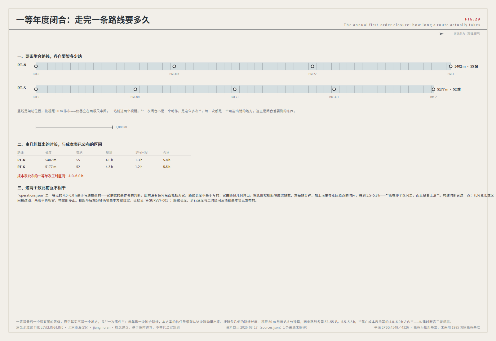
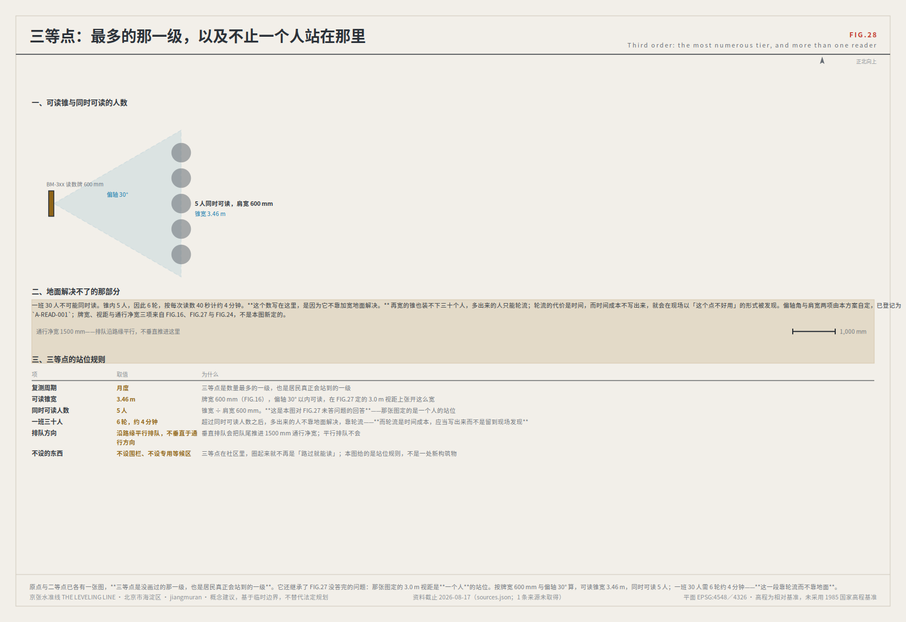
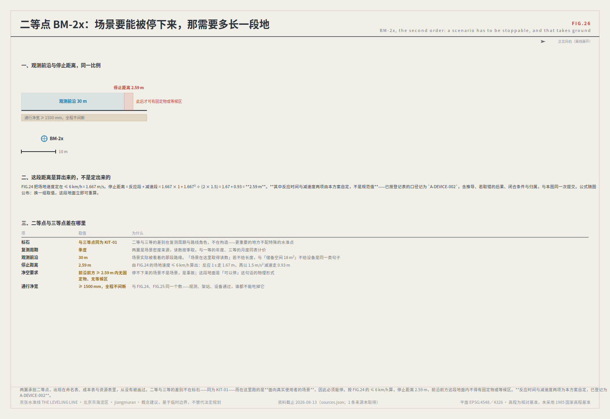
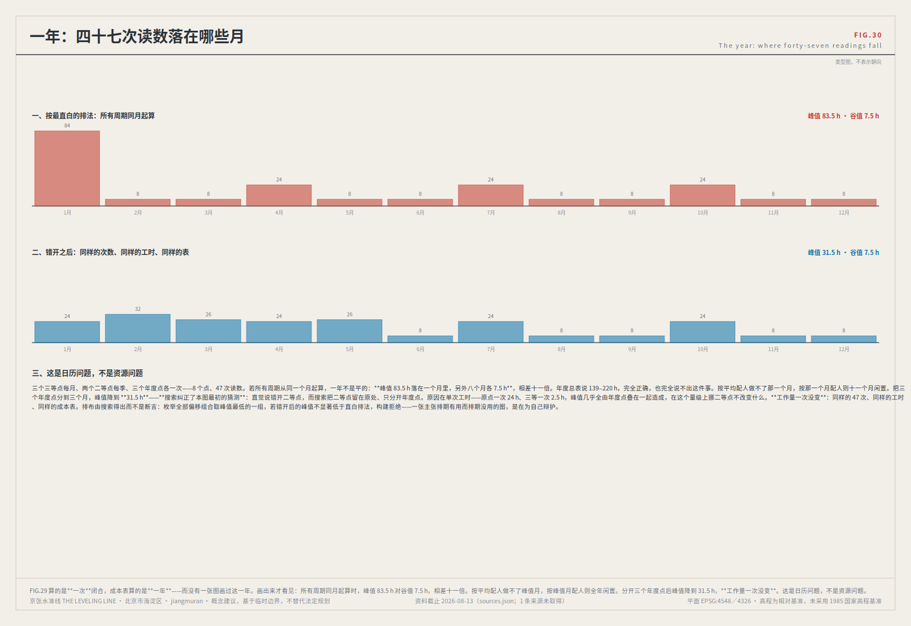
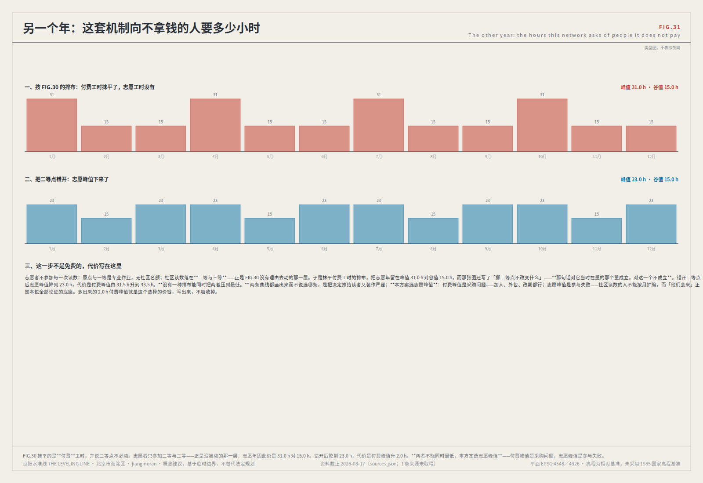
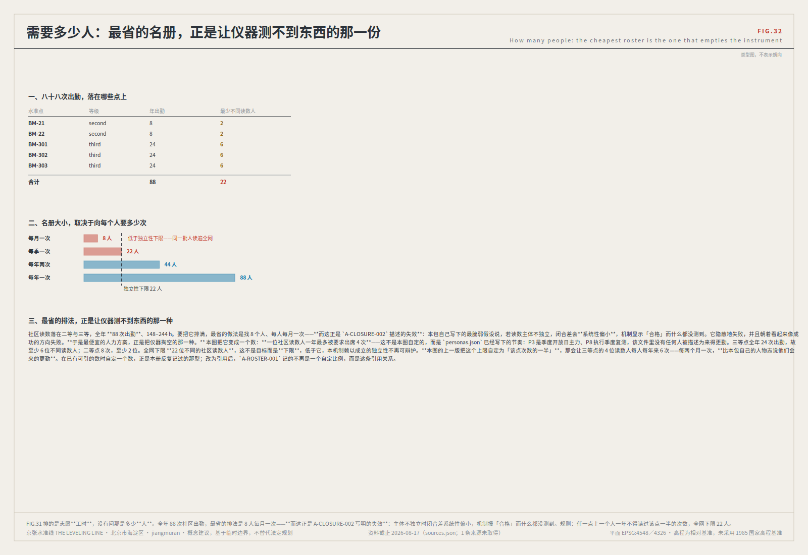
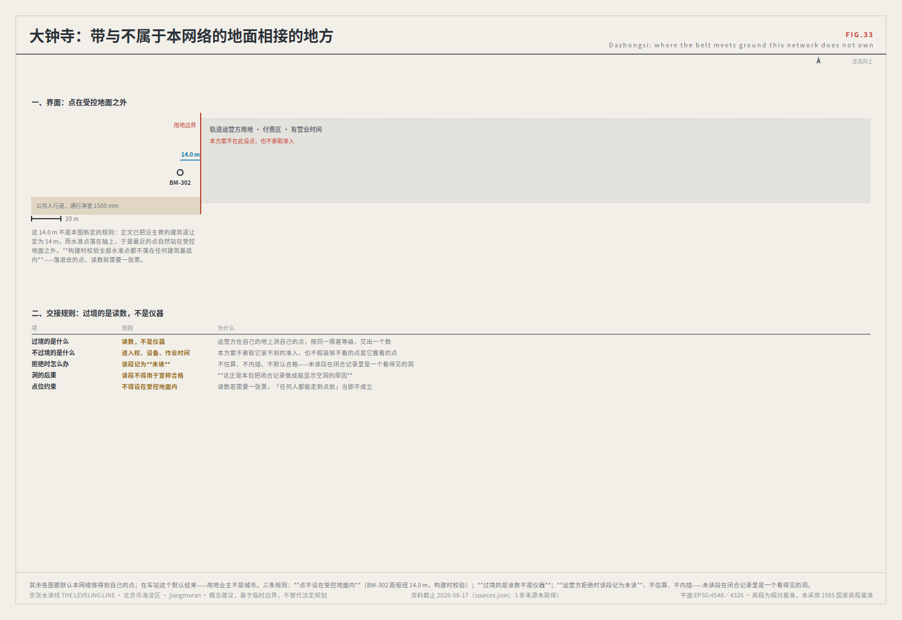
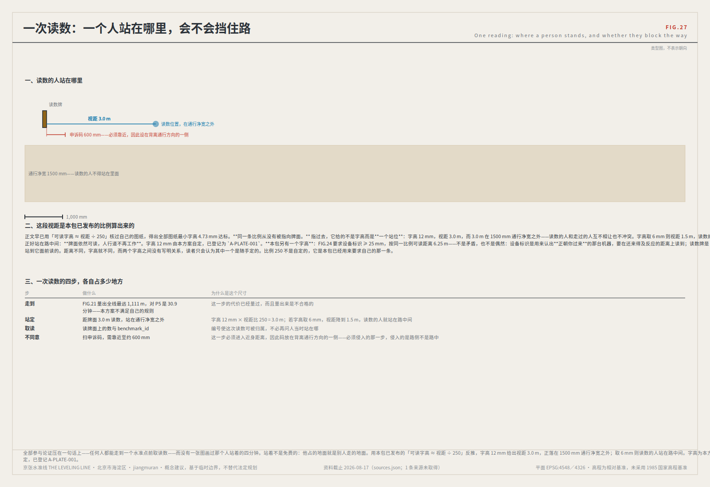

# 百年京张AI创新带 · 京张水准线：让机器人与AI公共服务在城市里可被复测

> **一句话判准：这条带上任何一项 AI 服务，都要能在现场被不同主体各测一次；f > F 就整段退回复测，在复测通过前降级为无AI等价服务。**

> 一百年前，詹天佑修京张铁路做的第一件事不是开山，是测量。
>
> 而水准测量真正的方法论不在于「测得准」，在于「测得回来」——从已知点出发，沿路线逐站传递高程，绕一周回到原点。回到原点时的差值叫**闭合差**。闭合差在限差以内，整条路线的每一站才被承认；超限，整段作废重测，不允许挑一站修正了事。
>
> 一台在写字楼里答错问题的模型，代价是一次返工。一台在人行道上判断错的配送机器人，代价是一个人的脚踝。一个把用药建议说错的健康导航，代价可能无法挽回。
>
> **所以本方案不从「城市治理」讲起，从读数错了会伤到人的地方讲起。** 低速机器人与自动驾驶接驳、AI医疗教育法律与生活服务——这两类场景在真实世界里最需要一件事：不是更聪明的模型，而是一套能证明它**测得回来**的制度。
>
> 水准网提供的正是这个。不凭单次表现有多好。凭它测得回来。


## 一页执行摘要

**一条街要能被测回来。**

水准测量不相信任何单次读数。它走一圈回到起点，把同一个点读两次，两次之差叫**闭合差**；差在**限差**之内，这一圈才算数，超了就整段退回重测——**不许挑一站修正**。这是一条已经用了两百年的公共工程规矩，本方案把它原样搬到这条 9.4 km 的带子上：**一脊八点、两线三区、十二场景、三级限差**。

**AI 在这里不是被展示的对象，是被复测的对象。** 一个说不出自己闭合差的智能系统，不该出现在公共空间里。

三处重点区各承担这条规矩的一段：

- **众智园——测得出。** 受控测试场，F1 级场景在这里取得第一个闭合记录；不合格的设备不上街。
- **AI 原点社区——读得到。** 水准原点 L1 与公共证据厅设在门外、面向人行道，**任何人走到就能取读数**，不需上网、不需营业时间。
- **大钟寺——停得下。** 高频读数点；连续两期超限即整段下线，服务落回非 AI 等价路径，而不是降级为一个更差的 AI。

| 评审会问 | 本方案的回答 | 可核验的东西 |
|---|---|---|
| 怎么落地、谁来做 | 八项更新项目按依赖排序，最长依赖链只有 2 项（R4 → R7）；八个岗位逐条写明可决定／**不可决定**／缺岗时禁止，全部 `unassigned`；首个试点是 S08 四周闭合试验（RT-N 三站，不依赖任何官方数据发布） | 阶段 KPI 与退出条件逐项在本文成表；受控测试场 53,008 m²[metric:test_field_area_sqm] 随 `metrics.json` 整份送达 |
| 空间上做了什么 | 主脊 9,443 m、8 个分级水准点、3 处重点区、七类用地完整剖分（无重叠无缺口 [self_check:LAND_USE_TOPOLOGY]） | 一类指标值随 `metrics.json` 整份送达；九个图层与 `verify.js` **在评审输入之外**，供独立重算 |
| 三条红线凭什么可执行 | 不凭设计者善意，凭现行法规：无障碍环境建设法第三十九条、生成式AI暂行办法第十四、十五条、国办发〔2020〕45号 [source:ELDERLY-SMART-TECH-PLAN-2020-45] | `sources.json`，三条均含条号与取证方式 |
| 方法的边界在哪 | 闭合差测一致性，**测不出「有没有用」**——那需要对照组，本方案把对照组写在每一张场景卡上 | 十二张卡在本文成表，各带效果问题、对照与三段验证；卡片 JSON **在评审输入之外** |
| 数据可信到什么程度 | 边界为临时替代边界，官方 polygon 发布后**整体重算而非逐个替换**；本方案主脊距实测公园 1,116.7 m——**对自己不利的读数也照登** | 读数随 `metrics.json` 整份送达；`check_osm.js` **在评审输入之外**，供从随包坐标独立复算 |
| 刻意不给什么 | 容积率、建筑高度、建筑密度、退线、任何拆除与搬迁结论 | 主办方登记为 missing 的五项管控，本方案四项状态 `unknown`、前置条件逐字取自主办方 |

## 一个人的一天：这套机制在街上是什么样子

机制写成规则容易，写成一个人的早晨才知道它有没有用。以下是画像 P4——一位 72 岁、听力不好、不用智能手机的居民——在这条带上的一天。她不是受益人清单里的一行，她是这套机制的启动者。

**8:40，社区服务中心（BM-303，三等水准点）。** 她要问一件具体的事：换了新药之后，原来的药还能不能一起吃。窗口的 AI 健康导航给了一段说明。她没听清「间隔」两个字，按自己的理解记下了。**这里不需要任何人做错事，误差就已经产生了**——这正是平均正确率测不到的那一类。

**同一天，另外两处。** 同一组公开问题，被另外两个人在另外两个水准点问了同样一遍：一位社工在 BM-0，一位国际访客在 BM-1。三处的回答在措辞上都合理，但**在「要不要间隔、间隔多久」这一点上给出了会导致不同行动的差别**。

**四周后，回到 BM-0 复算。** 三站读数的最大偏离就是这一期的闭合差 f。它超过了这条场景的限差 F。按机制第 4 条（完整定义见后文），**整段路线退回复测，该场景降级为无AI等价路径**——窗口挂出纸质流程与人工转介，服务不中断。按第 5 条，**不允许只去修正表现最差的那一站**。

**她能做什么。** 她可以就影响自己的那一次判断，要求一次复测；结果与原读数一并公开（脱敏）。这条权利落在她家最近的三等点上——**把复核权放在需要走十五分钟才能到的专门机构，等于没有给。**


**这句话从没有被用在本方案自己身上。** FIG.21 沿主脊量了这段路：全线最远处距最近水准点 1,111 m，对 P5 是 30.9 分钟，九个区段中六个不满足——**本方案在这一条上，没有达到它要求别人达到的标准**。

**读数牌上会写什么。** L2 闭合差碑上，这条场景以基准红标出，并写明退回日期。它允许自己难看：**一座敢公开显示自身失败的城市装置，比任何成功叙事更能建立信任。**

**恢复要多久。** 不是修好就上。整段重测、连续两期在限差以内（一次可能是运气）、原因公开；F1 类还须四类复核主体一致同意。恢复之后周期减半，直到再连续两期合格。**退回容易、恢复缓慢，是刻意的不对称。**

这一天里没有任何一个环节需要她理解「闭合差」这三个字。她只需要知道两件事：**她的那次提问会被记下来**，以及**如果结论对不上，停的是这个服务，不是她的就医。**

<!-- POSITION:BEGIN -->

**本方案的定位声明。** 城市AI治理是本方案的**方法层**，不是卖点——把治理协议本身当成成果，是这次征集里最饱和的做法（最近一次实测：960 份已合入方案中 655 份申报治理赛道，「证据链/可复算」类表述出现在 21.6% 的方案里 [source:FIELD-CENSUS-2026-08]）。本方案把治理当工具，把工具用在覆盖最薄的赛道上：`robotics-autonomous-mobility` 按标签计是八条赛道里**最薄**的一条（46 份，4.8%），次薄的是 `youth-friendly-public-space`（91 份）。这不是为了避开竞争而选空位——恰恰相反，闭合差机制在这两条赛道上才真正不可替代，因为只有在这里，一次未被复核的错误读数会落在具体某个人身上。

<!-- POSITION:END -->

## 设计依据与资料清单

本方案以《百年京张AI创新带城市设计国际方案征集资格预审公告》为第一依据 [source:OFFICIAL-ANNOUNCEMENT]，以面向全球智能体的开源征集任务书为智能体任务依据 [source:AGENT-TASKBOOK]，并以 `brief/site-package/` 登记的机器可读边界、枚举、指标区间与模式定义为生成依据 [source:SITE-PACKAGE]。资料可用性分级依 `data/source_registry.json` 执行 [source:SOURCE-REGISTRY]，阅读导航依处理资料包 [source:PROCESSED-FACT-PACK]，边界与重点区来源分别依 [source:BOUNDARY-SOURCE] 与 [source:KEY-AREA-SOURCE]。

强制专业标准从本地参考快照读取，不以 `source_url` 单独作为证据：城市设计管理办法 [standard:MOHURD-URBAN-DESIGN-MEASURES]、城市镇控制性详细规划编制审批办法 [standard:MOHURD-CONTROL-DETAILED-PLANNING]、国土空间调查规划用途管制用地用海分类指南 [standard:MNR-LAND-USE-CLASSIFICATION-GUIDE]、建筑工程设计文件编制深度规定 [standard:MOHURD-ARCH-DESIGN-DEPTH-2016]、项目官方公告 [standard:PROJECT-OFFICIAL-ANNOUNCEMENT] 与智能体开源征集任务书 [standard:PROJECT-AGENT-OPEN-CALL-TASKBOOK]。现状认知与数据缺口诊断对应 [depth:existing_conditions_diagnosis]。

<!-- CENSUSRUNS:BEGIN -->

**本方案额外自采一组公开数据，并把它作为交付物之一** [source:FIELD-CENSUS-2026-08]。本方案编写了一台可重跑的普查仪器：枚举 git tree 得到全部已合入方案目录，逐份抓取其公开 `proposal.md` front matter 与 `agent.json`，再汇总统计。最近一次运行（2026-08-23）覆盖 **960 份**，抓取成功 960/960、失败 0。**这台仪器已经跑过 27 次，每一次的读数都随包**（`visual/assets/reading_log.json`，语料依次为 228、298 … 960）；更早的 184、215 两轮早于该文件进入本包，由 `census_history.json` 从上游树重建。

<!-- CENSUSRUNS:END -->

普查刻意不读 `submissions-data.js`——那是生成的展示索引，会滞后。**这条观察在本方案自己的复测下反转过两次，历史读数已重建：**正文引用过的滞后序列「31 → 44 → 6 → 45」**没有任何随包文件计算它**，而 `submissions-data.js` 一直躺在每一个历史提交里——那个序列本来就可以重建，却被当作断言写了出来。现已按与语料重建同法逐轮重建（`git show <commit>:submissions-data.js` 逐条计数），结果随包提交于 `census_history.json` 的 `gallery_lag` 字段：

<!-- GALLERYLAG:BEGIN -->

| 读数 | git tree | 展示索引 | 未被索引 |
|---|---|---|---|
| 第一次 | 184 | 184 | **0**（0.0%）|
| 第二次 | 215 | 184 | **31**（14.4%）|
| 第三次 | 228 | 184 | **44**（19.3%）|
| 第四次 | 298 | 292 | **6**（2.0%）|
| 本次实测 | 960 | 950 | **10**（1.0%）|

**这四个数不能靠减法对上，所以第四个也写出来。** 本次实测：git tree 960 份，索引 950 份，**未被索引 10 份**，另有 **0 份在索引中而不在 tree 中**（已删除或改名的提交）。因此 960 − 950 = 10 不等于 10：计数差把两个方向的差抵消了，而这一列问的是「有多少份没被列出」，那是一个集合，不是一个差。历史各轮只能重建计数，无法重建集合，故其数值为计数差——**同一列里两种定义，这一行说清楚**。

<!-- GALLERYLAG:END -->

**重建出来的序列是另一回事：首轮的 0 从来没被写进去过，末轮也不是 45。** 滞后既不在单调扩大，也没有被一次性追平，而是随合并批次起伏——当时那两次「滞后在扩大」与「已被追平」都是单次快照结论，都已收回。本方案不据此邀功也不据此指责：无法证明因果。**结论中仍然成立的那部分是方法层面的：评审仪器必须读权威源（git tree），而不是读一个可能滞后、且滞后幅度本身会变的派生索引。**

数据产物 `census.json`、`field_map.json` 与原始快照 `agent_declarations.json` 随包提交于 `visual/assets/`，数字可直接核验。生成脚本因提交格式白名单不接受 `.py`（`assets/*` 仅收图片、`report/*` 仅收五个固定文件名、`geometry/*` 仅收九个指定文件）而无法进入提交包，已在本方案的配套 Issue 中公开发布，任何人可重跑复算。该数据在 `sources.json` 中定级为 `background_only`：它是本方案论证的经验基础，**不**作为空间结论或法定管控的证据。


官方 `SITE_BOUNDARY` 与三处 `KEY_AREA` 的精确 polygon 截至撰写时仍未公开发布。本包中 `geometry/site_boundary.geojson` 与 `geometry/key_areas.geojson` 均标注 `provisional_constraint`、`official_boundary=false`，仅用于生成、自检、可视化与设计讨论，不得作为 official redline、审批依据或精确面积依据。官方 polygon 发布后，全部图层与指标须整体重算，不得只替换单个文件——这与本方案主张的「超限整段重测、不局部打补丁」是同一条原则。

## 三层范围工作框架

方案按公告确定的三个层次组织，并与水准网的三级精度一一对应 [depth:three_level_scope_framework]。

| 公告层次 | 范围 | 水准网对应 | 复测周期 | 空间证据 |
|---|---|---|---|---|
| 统筹研究范围 | 约 43.6 km²，北至北五环路、东至京藏高速、南至西直门外大街、西至万泉河路 | 水准网整体控制 | 年 | 仓库 `provisional_boundaries.geojson#PROV-RESEARCH-001` [source:BOUNDARY-SOURCE] |
| 总体设计范围 | 约 11.4 km²，遗址公园周边 1–2 km 城市地区 | 一等水准路线（主脊 + 两条附合路线） | 半年 | [data:geometry/site_boundary.geojson#SITE-001]，复算 [metric:site_area_sqm] |
| 重点区域范围 | 约 369.3 ha [metric:key_area_area_sqm]（由 [data:geometry/key_areas.geojson#PROV-KEY-001]、[data:geometry/key_areas.geojson#PROV-KEY-002]、[data:geometry/key_areas.geojson#PROV-KEY-003] 三处合计复算：192.9 / 104.3 / 72.0 ha；公告文字为约 368.4 ha） | 水准原点 BM-0 与一等水准点 BM-1 / BM-2 | 年 | [data:geometry/key_areas.geojson#PROV-KEY-001] |

三层不是三套互不相干的图纸。统筹研究决定测什么，总体设计决定沿哪条路线测，重点区域决定在哪里立标石。任何无法从结构化图层复算的面积、比例或数量，不写入结论——这是 [standard:MOHURD-URBAN-DESIGN-MEASURES] 对城市设计成果可核验性的基本要求。

### 划出本方案范围的那件东西

<!-- SCOPEANCHOR:BEGIN -->

**公告把总体设计范围定义为「以**京张遗址公园**周边 1–2 公里的城市地区和产业区」 [depth:three_level_scope_framework]。** 也就是说，划出本方案设计范围的那件东西，是一处**已经存在、已经开放的公共基底**，不是本方案可提可不提的场地要素。

**这条基底建成到什么程度，本方案不自己估。** 京张遗址公园已列入北京市公园名录[source:HAIDIAN-PARK-REGISTER]；二期建成后是一条 **9 公里**复合型城市遗址绿廊[source:HAIDIAN-PARK-PHASE2-OPEN]；二期计划年底前开工[source:HAIDIAN-PARK-PHASE2-PLAN]；其**批复**载明建设单位为海淀区园林绿化局、用地约 23.08 公顷[source:HAIDIAN-PARK-PHASE2-APPROVAL]——**岗位规格中「公园运营方」对应哪类主体，此批复是旁证**。**前三条是给定条件，不是背景**——把划定本方案设计范围的那件东西当成了背景，而不是给定条件（E282）。

**「京张遗址公园」这个名字在本文里逐处点名。** 本方案亦称它「实测公园」「遗址公园」，并且只在一个位置上处理过它：作为与本方案推定主脊相差 **1,116.7 m** 的那个误差对象。公告第五项设计要求用的也是这套词——「结合公园已实施区域和原设计方案……塑造更具创新活力和特色魅力的**京张遗址公园活力带**」——这一整项的关键词同样是零（E240）。

**这不是称呼问题，是立场问题。** 改正之后：

- **主脊不是一条待建走廊。** 它是在京张遗址公园这条已开放的公共基底上做**接口缝合与可达性补足**——公园已实施区域是给定的，本方案加的是横向接入与读数点。
- **1,116.7 m 这条读数有两重用法。** 它是一条对本方案不利的读数；现在它同时是**官方 polygon 发布后主脊须整体归位的量**，即那次重算的规模写在这里，不等到发布当天才算。这条差不可能靠移线消掉，其下限由三处重点区形心的位置决定。
- **可达性补足有判据**：FIG.21 的十五分钟规则——现状最远 **1,111 m / 30.9 分钟**，九段里六段不合格。**接口缝合有判据**：十一个具名缝合点，各自最近过街设施距离已实测。

**四至按公告原文，本方案不改写：**

| 范围 | 面积 | 北 | 东 | 南 | 西 |
|---|---|---|---|---|---|
| 统筹研究范围 | 43.6 km² | 北五环路 | 京藏高速 | 西直门外大街 | 万泉河路 |
| 总体设计范围 | 11.4 km² | 北五环路 | 学院路、西土城路 | 西直门外大街 | 大钟寺东路、荷清路 |

重点区域范围约 368.4 公顷。项目位置为**北京市海淀区**，统筹研究范围即海淀人工智能产业发展的「三区两翼」所在区域，承办单位为中关村科学城管理委员会。**这些都是公告写明的。**

**这个区里有多少 AI 要被复测。** 截至 2025 年末，海淀备案上线大模型 **123 款**，占北京全市 **209 款**的 60%[source:HAIDIAN-BULLETIN-2025][source:BEIJING-BULLETIN-2025]——**两份公报各自发布，互相核对得 123/209 = 58.9%**。累计口径，**不可分配到本带任何一段**。

**承办单位已发布的政策，本方案逐条引用。** 中关村科学城管理委员会已印发《中关村科学城人工智能全景赋能行动计划（2024—2026年）》[source:ZGC-AI-EMPOWERMENT-PLAN-2024-2026]；AI 原点社区入选北京首批人工智能创新街区[source:BEIJING-AI-BLOCKS-FIRST-BATCH]。**这两条是本方案三处重点区之一的既有政策身份**——不引它们，等于把重点区当成自己命名的对象。

**这条带上已经有一份获批的法定控规。** 《北京海淀区京张铁路遗址公园沿线（人工智能创新街区重点地区）**HD00—1601** 等街区控制性详细规划（街区层面）（2024—2035 年）》**2026-08-11 批复**，约 **1,668.2 公顷**、**9 个街区**，空间结构为「**一带一轴，两心多点**」[source:HAIDIAN-CONTROL-PLAN-HD00-1601]。**其中「一带」就是本方案主脊所沿的这条带**——京张铁路遗址公园产业创新带；「两心」之一的**大钟寺**，正是本方案三处重点区之一。因此本方案的定位是**控规底盘之上的概念深化**，不是与控规并列的另一套结论：本方案不改写它的空间结构，也不据新闻通稿口径推定任何图则数据——红线、容积率、高度、退线仍按 [assumption:A-CONTROLS-001] 留空。

**范围**：本方案不对公园已实施区域提出改造结论——那需要公园的原设计方案，属数据缺口。本节改的是本方案把自己放在哪里：**放在一处已建成的公共基底上，而不是一张白纸上。**

<!-- SCOPEANCHOR:END -->

<!-- ANNVOCAB:BEGIN -->
**公告 1.5 的用词，逐条按公告的词回答。** 下表左列全部读自 `brief/site-package/standards/references/project-official-announcement.md` @ `upstream/main`，并在每次构建时对照原文；右列是本方案在哪一节以什么回答，或者**明确给不出、并说明为什么**。**这张表存在的理由：评审是用公告的词去找的，而评审是用公告的词去找的。**

| 公告 1.5 的用词 | 本方案的回答 |
|---|---|
| **两区一带** | 区域接口一节把「三区两翼」外延为区域水准网，并给出经开区、未来科学城、怀柔科学城各自的衔接口径与不可互相替代的理由。公告用这个词指同一组关系，此处按公告用词指认。 |
| **1+X+1** | 海淀产业体系的公告用词。本方案不重排产业门类，只对「AI+」垂直应用落地给出可失败条件——限差等级与复测周期。产业门类比例属法定规划与产业主管部门口径，本方案不代拟。 |
| **骑行道** | 主脊为连续慢行公共轴，含非机动车通行；断点与东西向连通见十一个缝合点表，各自最近已测绘过街设施距离已实测。骑行道宽度与铺装标准属工程专项，本方案不给。 |
| **端侧算力** | 算力落在哪里一节给出四条选址条件，两条待官方条件、两条今天即可判定。端侧算力按公告用词指认为其中的近场算力条件：它决定读数能否在测点现场完成，而不是能否在云端完成。 |
| **分布式能源** | **本方案给不出。** 包内没有任何可引的用电、光伏或能源容量来源，35 份来源里没有一份涉及能源；据此登记为数据缺口，不作推定。这一条与读数牌不接电、夜间不给水准点装灯的选择相互一致——不依赖供电的装置，才不需要先解决供电。 |
| **北影** | 公告点名的艺术资源。本方案把它登记为范围内待核的文化—艺术资源，与清华园车站旧址同列；其位置关系与可利用方式需官方资料，本方案不推定，也不写入任何图层。 |
| **人才密度** | 本方案给的是画像 P1–P9 与人才配套用地的空间位置，不给密度数值：密度需官方人口与就业数据，包内没有可引来源。给不出的数值不写成指标。 |
| **创新指数** | 本方案不构造合成指数，理由写在此处：合成指数的权重无法被独立复算，而本方案的全部主张是结论要能被独立复算。给出的是 60 项分四族的可复算指标，每项带 `measures` 与作废条件。 |
| **独角兽** | 创新要素链一节按要素类型而非企业名单组织。**本方案不列企业名单**——编造企业名单、投资额或产值是本方案明确拒绝的一类，因为包内没有任何可核验来源。 |
| **上市企业** | 同上：要素链登记的是「谁承载它、哪个测点持有它的读数、复测时测什么」，不登记企业名称。 |
| **职住** | 居住与通勤在本方案里由两个可测的量表达：十分钟步行可达水准点的建筑数（现状 183 栋，接上后 206 栋）与三等点在社区侧的分布。职住比例本身需官方数据，不代拟。 |
| **连续无界** | 「连续」由实测可步行网络判定，不由画线判定：主脊 9,443 m，断点逐处登记。「无界」由不设门禁与 24 小时开放写成可失败条件——受控测试场按时段围合，不按边界永久围合。 |
| **命名方案** | 随包 `visual/assets/naming.json` 公布 24 个标识族与编号语法，Logo 与文化标识系统分层管理。编号语法**不依赖任何语言**，这是它作为导视系统的核心：`BM-0` 在任何语言版本中都是 `BM-0`。 |
| **更新空间结构图** | FIG.03 用地结构与三层范围、FIG.04 三处重点区与水准点布设承担这一项；更新项目清单与分期见实施章节，八项逐项写明责任角色、前置条件、成本级别与退出条件。 |
| **用地布局图** | FIG.03，并与 `geometry/land_use.geojson` 的 22 个要素逐行对应：七类用地各引它由哪些要素组成，组由 `land_use_code` 现算。 |
| **屋顶形态** | **明确不给，并在此点名。** 与建筑高度、建筑强度、体量、退线、道路红线同列，属法定控规审批范畴，官方条件未公布前不代拟。**一条不点名所拒之物的拒绝，同样答不上要求**——所以「屋顶形态」这个词在这里点名。 |
| **上跨环路** | 北三环（`ROAD-103`）与北四环中路（`ROAD-104`）两处东西缝合点即公告所指上跨环路区域，最近已测绘过街设施分别为 33 m 与 30 m，均判 A 类。本方案登记连通需求，不给桥隧或结构结论。 |
<!-- ANNVOCAB:END -->

<!-- OPSVOCAB:BEGIN -->
**再往外一层：把这件事**运行**起来所用的词。** **下面七个词在本方案里出现过零次，而它们指的事本方案大都做了，只是用自己的词说的**。左列逐词读自公告 1.3 或任务书 @ `upstream/main` 并每次构建对照；做不到的，写明做不到和为什么。

| 用词 | 出处 | 本方案的回答 |
|---|---|---|
| **全生命周期** | 公告 1.3 | 四条规则：F1 准入试验决定能不能开；运行期按等级复测；**闭合差超限，整条路线退回，服务降为它的非 AI 等价物**；恢复须连续两个周期合格、原因公布、四方同意。**生命周期的终点是写死的，不是留白的。** |
| **运营策略** | 公告 1.3 | 同一句里的第二个词。不是节庆日历，是复测日历：月度社区复测日、季度场景开放日、半年度路线复测、年度归零仪式。**每一次活动同时是一次读数**，因此读数会先停，而不是读数停了活动照办。 |
| **场景-空间-运营** | 任务书 | 十二张场景卡逐张绑定一个测点等级（空间）与一个复测周期加主导岗位（运营）：三等点—月度，二等点—季度，一等路线—半年度。**三列是同一张表的三列。** |
| **招引转化** | 任务书 | 转化路径：参与复测 → 提出场景 → 进入测试场 → 取得水准合格 → 落地运营，每一步的通过条件是读数而不是评议。**任务书禁止把招商写成确定承诺**，因此给的是通道，不是名单，也不是投资额。 |
| **运营团队** | 任务书 | 可转化性一条问能否被专业、运营或传播团队继续深化。答复是岗位规格那一节：**谁可以决定什么，以及缺岗时什么不许开**。接手的团队不必读完全文，就知道授权到哪里为止。 |
| **活动品牌** | 任务书 | 任务书要活动品牌，同一条又禁止「只写宣传口号而没有运营机制」。**本方案不取品牌名**：没有可重复动作撑着的品牌就是口号。承担品牌的是那四个动作本身；取名属责任主体。 |
| **传播视觉** | 任务书 | 本方案能负责的是可复算的那一部分：导视编号语法、**编号永不翻译**（`BM-0` 在任何语言里都是 `BM-0`）、以及空间不足时先压说明后压英文、绝不压编号与读数的取舍次序。标志、色彩与字体属需授权资产，不出具——**任务书禁止未授权使用字体图片**。 |
<!-- OPSVOCAB:END -->

### 为什么三个层次恰好对应三级精度

水准网的分级不是行政层级的复制，而是**精度与频次的分工**：等级越高，控制范围越大、复测频次越低、对稳定性要求越高；等级越低，越贴近日常使用、复测越频繁、越容易发现细小失效。这与公告的三层范围是同构的：

- **统筹研究范围（43.6 km²）** 决定**测什么**。产业生态、创新链、未来城市形态在这一层判断，其变化以年为尺度，因此对应全网年度控制。这一层不产生具体读数，它产生的是「哪些问题值得被列为公共问题」。
- **总体设计范围（11.4 km²[metric:site_area_sqm]）** 决定**沿哪条路线测**。主脊与两条附合路线在这一层成立，半年复测一次；路线一旦改变，其上所有站点的读数序列即中断，因此这一层要求稳定。
- **重点区域（图层复算 369.3 ha[metric:key_area_area_sqm]，公告文字约 368.4 ha）** 决定**在哪里立标石**。水准原点 BM-0 与两处一等水准点 BM-1、BM-2 在这一层落地，年度复测（`benchmark_order` 分别为 origin / first / first——BM-0 是原点不是一等点，此前把三处并称「一等」与随包数据不符）；标石是实体，一旦埋设即成为后续所有复测的共同参照。

这个差值两侧的两个数值得写一句。由随包图层复算的重点区合计为 369.3 ha[metric:key_area_area_sqm]，公告文字为约 368.4 ha，相差约 0.24%。**本方案不作调和**：图层是临时替代边界，公告数是文字表述，二者若在三位有效数字上一致，那是巧合而不是证据。两个数各自带来源公布，差值留在明处。

**跨层的约束是单向的**：低层的读数不能修改高层的基准，但可以触发高层的复审。一个三等测点连续超限，不能自行调整限差，但可以要求一等水准点重新审议该场景的限差是否设错——这条防止的是「贴近现场者被迫为不合理的标准背书」。

三层的空间边界均为临时替代边界 [source:BOUNDARY-SOURCE]，其推定依据与误差见仓库的 `provisional_boundaries_basis.md`；官方数据发布后须整体重算 [depth:existing_conditions_diagnosis]。


> **这张图怎么看。** 三层嵌套关系；平面铺七类用地剖分并叠三期增量，分期以触发条件推进而非年份；右栏是本方案刻意不给出的数值

## 统筹研究范围产业与未来城市研究

### 总体概念与命名体系（agent.1）

**中文主名：京张水准线。英文名：THE LEVELING LINE [depth:overall_spatial_structure]。**

**命名体系随包以规则发布，不是以句子。** `naming.json` 列出本包全部 24 个标识符族——族名说明它是什么，数字说明它在族里的位置；有等级的族把等级放进第一位数字，因此 BM-301 读出来就是「三等点，每月复测」。闸门 `naming_qa.py` 采集包内实际出现的每一个标识符逐一核对，对着 **24 个已发布的族**：每个必须命中且只命中一族，且**没有任何一条规则是空转的**。**写成句子的命名体系死在句子里**——写一次，包再长出几百个编号，没有人回去检查后来的那些；写成规则，一个掉出所有族的编号会让构建失败。（合规矩阵的条款编号取自主办方文件，原样保留，不由本方案编制。）

命名不是修辞，是方法声明。「水准」在测绘学中指几何水准测量，其成果是一张**水准网**——由永久标石构成、允许任何人独立复测、以闭合差判定整网是否可信。这三条属性正是这条创新带需要的治理属性：有实体、可复核、整体判定。

命名体系是可延展的编号语法，不是一句口号：

| 层级 | 命名法 | 示例 | 含义 |
|---|---|---|---|
| 网 | 京张水准网 | JZ-NET | 全线治理网络总称 |
| 原点 | 水准原点 | **BM-0** | 公共证据枢纽，全网高程起算点 |
| 一等点 | 一等水准点 | BM-1、BM-2（原点 BM-0 另列） | 三处重点区，年度复测 |



**一等是最后一个没有图的等级，而它其实不是一个地方，是一次事件。** 每年跑一次附合路线，本方案全部的信任量纲就从这次跑动里出来；其余每一块标石、每一段路缘、每一行成本，都是为了让这件事发生并且可信。FIG.29 因此画这次跑动：**从几何反算出时长，再拿它核对成本表**。`operations.json` 里一等单次 4.0–6.0 h 是手写进模型的；路线长度不是——RT-N 5,401.8 m、RT-S 5,177.0 m 由随包几何算出。按视距 50 m 除成架站数（55 站与 52 站）、每站 5 分钟，加上沿主脊走回原点的时间，得 **5.8 h 与 5.5 h**，**落在那个区间内且贴着上沿**。构建时断言二者相容：几何变长或区间被改动，构建即停止。**在这张图之前，成本表里的工时只依据作者的判断，没有任何东西能核对它。** 视距与每站分钟两项自定，同一次提交登记为 `[assumption:A-SURVEY-001]`。
| 二等点 | 二等水准点 | BM-2x | 两翼节点，季度复测 |
| 三等点 | 三等水准点 | BM-3xx | 社区与站点级，月度复测 |



**这一级是数量最多的，而作此图时它还没有被画过。** 原点有 FIG.25，二等点有 FIG.26，而居民真正会站到的恰恰是三等点。它还继承了 FIG.27 没答完的问题：那张图算出的 3.0 m 视距，是**一个人**的站位；社区里的点不会只有一个人读。按牌宽 600 mm 与偏轴 30° 计，可读锥宽 **3.46 m**，同时可读 **5 人**——这是本包对那个未答问题的回答。而一班 30 人需 **6 轮、约 4 分钟**：**超出锥宽的部分不靠加宽地面解决，靠轮流，而轮流的代价是时间**。这个数写出来，是因为不写它就会在现场以「这个点不好用」的形式被发现。队伍沿路缘平行排，不垂直推进 1,500 mm 通行净宽；不设围栏、不设专用等候区——三等点在社区里，圈起来就不再是「路过就能读」。偏轴角、肩宽与单次读数时长三项由本方案自定，与本图同一次提交登记为 `[assumption:A-READ-001]`。
| 路线 | 附合路线 | RT-N、RT-S | 场景验证的单程路径：自 BM-0 起测，止于一等点 |
| 读数 | 闭合差 / 限差 | f / F | 信任的度量与门槛 |

任何新增节点、新增场景、新增机构，都能在这套语法里获得编号并接入复测周期——这是「可延展」的实际含义，而不是形容词。

### 视觉识别方向（agent.1）

Logo 方向取自水准点标石的实物形态与水准仪的读数十字丝，二者叠合为一个几何记号：**一条水平基准线，被一个十字标记穿过，右端微微抬升后回落到同一水平**——那个抬升与回落之间的微小高差，就是闭合差本身。标志因此不是装饰，它画的是这条带的方法论。

- 主形：水平基准线 + 十字丝交点，可退化为单色 1bit 图形，可蚀刻于金属标石、可铸于井盖、可作为数据接口的图标。
- 色彩方向：以测绘规范中的基准红（读数与限差告警）与铁路灰（基础设施底色）为主，公共空间应用中以中性米白为衬底。
- 延展：每个水准点拥有唯一编号铭牌，铭牌样式统一、编号唯一，构成全线可识别的视觉序列。
- **版权边界**：本方案不使用任何未授权字体、图片、商标、人物肖像或企业标识；Logo 为方向性提案与几何构造说明，供专业视觉团队深化，不构成最终标识成品。

标志、构造、四种变体与三类应用（标石铭牌、读数牌、数据接口图标）见下图。全部图形由几何参数生成，可按参数重绘。


### 三大定位、五大功能与三区两翼的协同回路（agent.1）

任务书给出三大定位与五大功能 [source:AGENT-TASKBOOK]。本方案不复述，而是把它们接成一条**可以闭合的回路**——这正是多数并行方案的收敛盲点：本次实测的收敛度**不在本文件里**——母题表已随另两块在 E258 一起撤掉，理由是它们量的都不是海淀；读数留在 `field_map.json`，**在评审输入之外**[source:FIELD-CENSUS-2026-08]。这种高度收敛并非共识，而是任务书本身规定了「三区两翼」所诱导的结果。把同一结构再画一遍没有增量；有增量的是说清楚这些单元之间**靠什么机制传递责任**。

水准网给出的答案是高程传递：每一站的读数依赖上一站，最后回到原点验算。

```
                    BM-0 水准原点（AI原点社区）
                    公共证据枢纽 · 全网起算
                      ▲                 │
          闭合验算 f  │                 │ 起测
                      │                 ▼
   RT-N 北附合路线 ──┴── BM-1 众智园（全栈自主创新·AI治理话语权）
        │                        │
        │              小月河场景赋能翼 BM-2x（场景赋能·活力城市）
        │                        │
   RT-S 南附合路线 ──┬── BM-2 大钟寺（智能原生新业态）
                      │
             中关村科技服务翼 BM-2x（要素配置·IP与资本）
```

- **BM-1 众智园**承担「AI全栈自主创新体系」与「AI治理全球话语权」：它是限差 F 的制定地——本方案称之为**限差基准**。测绘学中的起算基准是高程被传递出去的那个点，本方案里那是 BM-0，随包的 `check_closure.js` 也强制每条回路自 BM-0 起测。设标准的地方与起算的地方是两件事，不能共用一个词。
- **BM-0 AI原点社区**承担「世界级AI创新生态」：全网起算点与闭合验算点，也是本次征集所形成的公共知识库的物理落点。


**这个「物理落点」不能只是一个名字。** BM-0 出现在本包几乎每一张图上，作此图时却从没有被画过——这不是装帧问题：它承载的性质本身就是空间性的。**读数一取即公布，而证据只公开到门为止**：闭合记录若挂在有营业时间的厅里，原点就在读数落地的那一刻是关着的，「任何人都能走到一个水准点前取读数」这句话也就变成了「在营业时间内」。FIG.25 因此把记录放在门外、面向人行道，用 FIG.16 已定的读数牌视高；给出架站圈 ⌀ 2,400 mm（三脚架 1,200 mm 加操作者外圈），并校验它不吃掉无障碍通行净宽——**与 FIG.24 对设备的要求是同一个 1,500 mm，本方案不对自己人放宽**，构建时两张图的取值不一致即拒绝。显示的是全网闭合差而不是单点失败：单点失败属于它发生的那个点（勘误 E50）。
- **BM-2 大钟寺**承担「智能原生新业态」：面向消费与商务的高频场景在此取得读数。
- **中关村科技服务翼**提供要素与资本，是路线的**支持系统**；**小月河场景赋能翼**提供真实使用人群，是路线的**测点密度来源**。



**两翼承担二等点，而作此图时二等点还没有被画过。** 它出现在命名表、成本表与资源表里，当时却没有落到图面。差别不在标石——与三等点同为 KIT-01，更重要的地方不配特殊的水准点——而在这里跑的是**面向真实使用者的场景**，因此必须能停。FIG.26 把「能停」写成尺寸：按 FIG.24 已定的场地速度 ≤ 6 km/h，反应 1.0 s 走 1.67 m，再以 1.5 m/s² 减速走 0.93 m，**停止距离 2.59 m**；观测前沿前方这段地面内不得有固定物或等候区。**其中反应时间与减速度两项由本方案自定，不是规范值**，已与本图同一次提交登记为 `[assumption:A-DEVICE-002]`，含推导、误差方向、闭合条件与归属——误差不对称（取小了后果落在人身上），因此按上限取值而不是按典型值。

五大功能因此不是五个并列口号，而是一条回路上的五个功能位：定基准（众智园）→ 起测（原点社区）→ 取读数（大钟寺与两翼）→ 回原点验算（原点社区）→ 超限重测。这条回路的空间落位见 [data:geometry/public_space.geojson#PUBLIC-001]，整体空间结构对应 [depth:overall_spatial_structure]。

<!-- POSITIONING:BEGIN -->

**三大定位与五大功能在这一节逐条落地。** 本节开头写的是「本方案不复述」，而接下来给的是一条闭合回路——回路答的是「这些单元靠什么传递责任」，不是「三大定位是什么」，后者是任务书另外要的东西，评审脚本的**功能匹配度**正按名字核它（E239）。

三大定位按 E238 的同一种形式作答：每条给出**能被判不合格的那一条**，不给口号。

| 任务书的定位 | 本方案答的是什么 | 判据——能被判不合格的那一条 |
|---|---|---|
| **百年京张文化带** | 本方案取的这条线路的遗产是**测量方法**，不是它的形态符号（人字形为何不入图，见文化章）。文化带在这里的物质形态是**标石与铸刻读数牌**——为百年后的复测者留下的永久标记，与京张工区「逾百年持续运转」是同一项遗产。 | **构件必须断电仍可读**：KIT-01 标石、KIT-02 的当期 f 与限差 F 为铸刻或可整体更换的印面，**不得为电子屏**。一面断电即空白的读数牌，在最需要被读到的那一刻不在。 |
| **都市AI生活体验带** | 体验带的判据不是新增了多少体验点，而是**不用智能手机的人能不能完整走完一次**。本方案的对应物是 KIT-05 申诉入口的两条路径与 P4 画像；而 FIG.21 已经量出这条带此刻断在哪里：走到最近水准点最远 **1,111 m / 30.9 分钟**，**九段里六段不合格**。 | **任何一处只给扫码的入口即判不合格**，与该处体验做得多好无关；FIG.21 判为违规的区段在补齐前不计入体验带。 |
| **AI融合创新带** | 融合的判据落在**跨管辖交界处还能不能读到数**——本方案最薄弱、也写得最具体的一处：八个水准点全部跨管辖，真正的失效不是争权，而是**每一方都合理地认为不归自己**，于是设备无人复核地跑着。 | **相邻各方各自独立取读数，分歧计入闭合差；没有有效读数即不放行。** 管辖由位置推定，官方边界发布后整体重算。 |

五大功能由任务书自己挂到三区两翼上，本节按其原文对位，不重排：

| 三区两翼 | 任务书给它的功能 | 本方案在那里放了什么 |
|---|---|---|
| AI 原点社区 | 世界级AI创新生态 | BM-0 水准原点：公共证据厅与全网起算点 |
| 众智园AI自主创新加速区 | AI全栈自主创新体系｜AI治理全球话语权 | BM-1 限差基准：限差议事厅是 F 的制定与修订地 |
| 大钟寺AI产业聚集区 | 智能原生新业态 | BM-2 高频读数点：站—点合一，四象限步行连通 |
| 中关村科技服务翼 | 要素全球化配置｜中关村 IP 与资本赋能 | 二等点 BM-21：场景要能被停下来，见 FIG.26 |
| 小月河场景赋能翼 | AI+场景赋能新范式｜智能化AI活力城市 | 二等点 BM-22：场景开放日的读数在这里取 |

**这张表不主张覆盖度**：它只把任务书的词与本包已有的东西对上。两翼各自的功能（要素全球化配置、中关村 IP 与资本赋能）在本方案里只有二等测点这一件对应物，其余属产业政策，本方案不代拟——写明这一点，好过让表看起来是满的。

<!-- POSITIONING:END -->

### 全球AI创新生态案例研究（agent.2）

选取六个案例，每个只回答一个问题：**它靠什么机制建立公共信任，那个机制能否被复测。** 案例信息均来自公开可查的机构公开材料与公开报道，本方案不引用非公开数据，也不编造企业名单、投资额或产值。

| 编号 | 案例 | 建立信任的机制 | 可复测性 | 对京张的可借鉴点 |
|---|---|---|---|---|
| C1 | 赫尔辛基算法登记册（对照阿姆斯特丹） [source:CASE-C1-ALGORITHM-REGISTER] | 公开登记每个在用算法的用途、数据、责任人与申诉入口 | 高：登记项可逐条核对 | 直接构成水准点铭牌的信息底稿 |
| C2 | 欧盟 AI 法案的风险分级 [source:CASE-C2-EU-AI-ACT-RISK-TIERS] | 按风险等级施加差异化义务 | 中：分级可核，执行需监管 | 支撑限差 F 的分级设定 |
| C3 | 新加坡 AI Verify 测试框架 [source:CASE-C3-AI-VERIFY] | 以标准化测试工具产出可比报告 | 高：测试可重跑 | 提供复测的技术执行形态 |
| C4 | 英国 NHS 的算法影响评估实践 [source:CASE-C4-NHS-ALGORITHMIC-IMPACT] | 高风险场景强制事前评估与事后审查 | 中高：留档可查 | 支撑医疗类场景的最严限差 |
| C5 | 巴塞罗那市民数据自治实践（对照台北） [source:CASE-C5-CIVIC-DATA-AGENDA] | 数据用途由市民议程决定 | 中：议程公开 | 支撑三等水准点的公众复测权 |
| C6 | 开源社区的可复现研究规范（如 artifact evaluation） [source:CASE-C6-ARTIFACT-EVALUATION] | 论文结论须附可重跑的产物 | 高：产物可执行 | 本方案按此规范公开全部生成脚本与数据产物 |

六个案例共同指向一个空缺：**它们都在登记与评估，没有一个把「回到原点验算」制度化。** 登记册告诉你系统声明了什么，评估告诉你专家怎么看，但没有一个机制回答「同一个公共问题，经过不同节点、不同时间，得到的结论差多少」。闭合差补的正是这个空缺。

### AI创新生态图谱与要素机制（agent.2）

生态图谱按「要素—空间—复测责任」三列组织，避免把产业招商写成确定安排：

| 要素 | 空间承载 | 水准点归属 | 复测项 |
|---|---|---|---|
| 土地与空间 | 重点区更新地块 | BM-1 / BM-0 / BM-2 | 空间供给兑现率 |
| 算力 | 集约算力节点 | BM-1 | 公共算力可申请比例 |
| 数据 | 数据要素流通场所 | BM-2 | 授权链完整率 |
| 场景 | 两翼真实使用场所 | BM-2x | 场景退出可执行性 |
| 资金 | 科技服务翼 | 中关村翼 BM-2x | 无 |
| 人才 | 人才社区与第三空间 | BM-0 | 服务满意度复测 |

「资金」一列的复测项刻意留空：投融资安排属于市场主体决策，不应被城市设计方案写成治理指标，更不得表述为财政承诺。这一留空本身是合规声明 [standard:PROJECT-AGENT-OPEN-CALL-TASKBOOK]。



**成本表算的是一年，而没有一张图画过这一年。** 画出来才看见一件年度总额说不出的事：三个三等点每月、两个二等点每季、三个年度点各一次，若所有周期从同一个月起算，一年不是平的——**峰值 83.5 h 落在一个月，另外八个月各 7.5 h，相差十一倍**。139–220 h 这个总数完全正确，也完全无法暴露它：按平均配人做不了那一个月，按那一个月配人则十一个月闲置。FIG.30 的结论是**这属于日历而不属于资源**：把三个年度点分到三个月，峰值降到 **31.5 h**，同样的 47 次、同样的工时、同样的成本表，工作量一次没变。排布由枚举搜索得出而不是断言——**而搜索纠正了这张图最初的猜测**：直觉说该错开二等点，搜索却把二等点留在原处、只分开年度点，因为原点一次 24 h 而三等一次 2.5 h，峰值几乎全由年度点叠在一起造成。若错开后的峰值不显著低于直白排法，构建拒绝。



**而 FIG.30 抹平的只是付费工时。** 志愿者不参加每一次读数：原点与一等是专业作业、无社区名额，社区读数落在二等与三等——正是 FIG.30 判断「挪了也不改变什么」而留在原处的那一层。那句话对它当时在量的量成立，对志愿工时不成立：志愿年仍是**峰值 31.0 h 对谷值 15.0 h**。FIG.31 把二等点错开，志愿峰值降到 **23.0 h**，代价是付费峰值由 31.5 h 升到 33.5 h。**没有一种排布能同时把两者压到最低**，因此本方案明写选哪一个：**选志愿峰值**。付费峰值是采购问题——加人、外包、改期都行；志愿峰值是参与失败，社区读数的人不能按月扩编，而「他们会来」是本包全部论证的底座。多出的 2.0 h 付费峰值是这个选择的价钱，写出来，不吸收掉（勘误 E81）。



**而 FIG.31 排的是工时，没有问那是多少人。** 全年社区出勤 **88 次**：要把它排满，最省的做法是找 8 个人、每人每月一次。**这正是 `[assumption:A-CLOSURE-002]` 描述的失效**——本包自己写下的最脆弱假设说，若读数主体不独立，闭合差会系统性偏小，机制显示「合格」而什么都没测到；它隐蔽地失败，并且朝着看起来像成功的方向失败。**于是最便宜的人力方案，正是把仪器掏空的那一种。** FIG.32 把它变成一个数：任一水准点上，同一个人一年不得出席该点一半以上的读数——三等点 24 次出勤需至少 6 位不同读数人，二等点 8 次需至少 2 位，**全网下限 22 人**。这不是目标而是下限：低于它，本机制赖以成立的独立性不再可辩护。**这个上限不是自定的**：每位社区读数人每年最多 4 次，读自 `personas.json` 已写下的季度节奏（P3 季度开放日主力、P8 执行季度复测，全表无人被描述为来得更勤）。上一版曾把它自定为「该点次数的一半」，那会要求三等点读数人每两个月来一次，**比本包自己说他们会来的更勤**——改正之后要求的人更多而不是更少（勘误 E83）。

产业与空间的对应关系落在 [data:geometry/land_use.geojson#LU-001]，指标口径见 [metric:key_area_count]。要素保管链与六个案例的完整对照见下图——**「资金」一栏的复测项在图中是一个空格，那是判断不是疏漏**。


### 区域创新协同：把水准网外延为区域水准网（agent.1）

任务书要求回应与北纬社区、未来科学城、怀柔科学城、经开区及京津冀的创新协同 [source:AGENT-TASKBOOK]。多数协同论述停在「加强联动、共建平台」一类表述上——这类表述无法被检验，因此也无法被执行。水准测量提供了一个可执行的协同形式：**水准网天然是可以联测的**。两张独立的水准网只要共用起算基准与限差口径，就能通过联测接成一张更大的网，而不需要任何一方放弃自己的管理权限 [depth:three_level_scope_framework]。

因此本方案提出的协同机制是**跨区域限差互认**，共三条：

| 机制 | 内容 | 可检验点 |
|---|---|---|
| 限差口径互认 | 各创新组团采用同一套限差分级定义（F1/F2/F3 的适用条件与计算口径），数值可各自从严 | 口径文件公开可比对 |
| 闭合记录随场景迁移 | 一个 AI 场景在京张取得的闭合记录（读数、复核主体构成、超限与整改历史）随场景迁移至其他组团，作为准入材料 | 记录可逐条核对，不可事后编辑 |
| 联测节点 | 各组团各设一处对外联测点，定期就同一组公共问题交换读数，计算**区域闭合差** | 区域读数公开，差值可复算 |

第二条是关键，它把协同从「签协议」变成「省重复」：一个已在京张跑过完整复测周期的场景进入其他组团时，带着可核验的闭合记录，接收方无需从零验证，只需复核记录并按本地限差判定。协同的收益因此是**具体的、可计量的行政成本节省**，而不是一句愿景。

### 五个协同对象各自换什么

任务书点名的五个对象在创新链上处于不同环节，因此与本带交换的东西也不同。把它们写成同一段话，等于没有协同 [depth:three_level_scope_framework]。

| 对象 | 其所处环节 | 与本带交换什么 | 为什么是它 |
|---|---|---|---|
| **经开区** | 量产与高级别自动驾驶道路测试 | **速度域互补的闭合记录互认** | 这是五者中与本方案最直接相关的一个：经开区面向机动车速度域与开放道路，本带面向**行人尺度与低速设备**。同一台设备在两个速度域的行为完全不同，因此两地的闭合记录**不能互相替代，但可以互相衔接**——在本带取得 F1 合格是进入行人密集区的条件，不是进入车行道的条件，反之亦然。这一条需要双方各自确认，本方案不代其决定 |
| **未来科学城** | 企业研究院与工程化 | 场景需求与真实使用人群 | 本带的两翼提供真实使用者密度，是研究院成果的验证场；换回的是工程化能力 |
| **怀柔科学城** | 大科学装置与基础研究 | 测量方法本身 | 唯一与本方案在**方法层**而非应用层协同的对象：闭合差的量化口径、复测周期设定、限差修订的统计依据，都属于测量科学问题 |
| **北纬社区** | 任务书点名的创新社区 | 测点互设与复核主体交换 | 本方案不掌握其具体定位，仅提出机制接口：互设联测点、交换复核主体，使双方的读数可比 |
| **京津冀** | 跨省域协同 | 限差口径的跨省互认 | 层级最高、也最慢的一层。本方案只主张口径先行——口径不统一，任何跨省记录互认都无从谈起 |

**必须说清楚的边界**：以上对各对象所处环节的描述，基于公开可查的一般性定位，**未经各方确认**；本方案不掌握任何一方的内部规划，不代表任何一方作出承诺，也不假设已获得任何协同意向。表中每一行都是**可供各方独立评估的机制接口建议**，其中「经开区」一行的速度域互补关系需要以双方实际测试规程为准核定。

本方案不代替任何组团作出决定，也不假设已获得任何协同承诺；上述为可供各方独立评估的机制建议 [standard:PROJECT-AGENT-OPEN-CALL-TASKBOOK]。区域层面的空间关系以统筹研究范围为界面 [data:geometry/site_boundary.geojson#SITE-001]。


**上表已画成图：FIG.11「区域协同接口」**（`assets/figures/region-interface.png`，并置于 A0 展板二）。画出来是有原因的：协同这一项最常见的答法是「加强联动、共建平台」，这类表述无法被检验，因此也无法被执行。水准测量给了它一个可执行的形式——两张独立的水准网只要共用起算基准与限差口径，就能通过一次**联测**接成一张更大的网，而联测的产出是一个数（跨网闭合差），不是一份意向。图中每一行除了「交换什么」，还必须写出**「明确不交换什么」**与**「接口开启的前置」**：一个没有写明不承诺什么的接口，等于替对方许了诺。

## 总体设计范围城市更新与控规深度城市设计

总体设计范围的核心任务，是把水准网从概念落成可建造的空间序列 [depth:land_use_layout]。

**主脊（水准线）**：以京张铁路遗址公园现状线性绿廊为骨架，形成连续可步行的公共轴。主脊的空间任务不是再造景观，而是**承载测点**——每隔一段设置一处可停留、可展示读数、可发起复测的公共节点。

**开发强度与高度**：本方案**不给出**容积率、建筑高度、建筑密度、退线与道路红线的具体数值 [depth:development_intensity_controls] [depth:height_massing_character]。这些属于法定控规管控内容，须以官方控规条件为准 [standard:MOHURD-CONTROL-DETAILED-PLANNING]；在官方数据缺位的前提下给出数值，属于伪造确定性。本方案给出的是**形态原则**：主脊两侧保持贯通的天际视廊与连续界面，重点区内部由低向外围递增，历史节点周边以现状为上限。待官方控规条件公布后，按本节原则生成具体数值并整体重算。

**风貌**：全线以「基础设施的诚实」为风貌基调——保留铁路构筑物的工程语言（轨枕、道砟、信号杆、里程标），新建部分不模仿历史样式，以清晰可辨的当代材料并置，使一百年的时间层次在同一视野中可读。

### 控规深度的城市设计要给什么

法定控规给数值，城市设计给**关系**。本方案在总体设计范围内给出六组可被逐条核对的形态与界面规定，全部为相对关系与原则性要求，不含法定管控数值 [depth:height_massing_character]。

**一、街道界面连续性**。主脊两侧界面须连续，不得出现由围墙、停车场出入口或消极后退形成的断口。界面断口的判定标准是**行人视线在连续行走中是否被无功能的空白打断**，可现场实测计数，因此可复核。既有围墙优先改造为可透视、可停留的界面，而非拆除重建。

**二、底层公共性**。主脊沿线建筑底层须承担公共功能（对外服务、展示、休憩、卫生间任一），不得为纯设备层或纯门厅。这一条与水准网直接相关：**测点需要有人在场才可能被复测**，而底层无功能的界面不会有人停留。

**三、视廊**。保持主脊纵向天际视廊贯通，以及在历史节点处向铁路遗产构筑物的横向视廊。视廊为**保护性要求**：新建体量不得进入视廊，具体控制面须在官方控规条件与文保范围公布后核定，本方案不预设控制线。

**四、界面高度的相对关系**。不给绝对高度，给三条相对规则：紧邻主脊的界面**不高于**其外侧界面；历史节点周边以**现状高度为上限**；重点区内部由主脊向外围递增。这三条在任何官方数值下都成立，因此不会因数据发布而失效。

**五、地块细分原则**。主脊沿线不宜出现进深过大、单一权属的超大地块——超大地块必然产生长段无出入口的封闭界面，也使跨管辖测点无处设置。细分尺度须结合权属现状确定，本方案给原则不给尺寸。

**六、货运与出入口组织**。机动车出入口与货运装卸不得开向主脊；低速设备的充电与待命位不得占用主脊步行界面（详见交通章节的路缘分配顺序）。这一条是使「主脊是连续公共轴」在建成后仍然成立的必要条件——否则连续性会被出入口逐段切碎。

### 现状肌理的实测基线：不发明管控数值，把管控必须面对的数字量出来

<!-- FABRIC:BEGIN -->

本节不发明控规数值，把控规必须面对的数字量出来。以下八项全部是**现状读数**，由 `analysis/osm_fabric.py` 在 EPSG:4548 下从 OpenStreetMap 计算，随包提交于 `visual/assets/osm_fabric.json`（口径与限度逐条写在该文件的 `limits` 里），可重跑 [source:OSM-REFERENCE-2026-08]。

| 现状读数 | 值 |
|---|---|
| 边界面积 | 11.41 km² |
| 路网密度（上限估计） | **13.8 km/km²**（157.5 km） |
| 交叉口密度 | 71.1 个/km²（812 个） |
| 街块中位规模 | 0.43 ha（四分位 0.12 / 1.14） |
| 超大街块 > 4 ha | 28 个，占闭合单元用地（5.073 km²）的 72% |
| 其中非公园/校园/水面/文保 | **17 个**，占 49%，中位 9.7 ha，最大 70.7 ha |
| 建筑基底覆盖（下限） | 18%（1,693 个基底） |
| 层数标注覆盖 | 10%，**因此不发布容积率** |

**这让本节第五条从主张变成证据 [depth:existing_conditions_diagnosis]。** 街块中位数 0.43 ha 说这片肌理是细的——**而土地不在中位数手里**：17 个以建成为主的超大单元（公园、校园、水体、遗产占比均低于 50%）占了闭合单元用地的 49%。细分要做的不是 255 个街块，是这 17 个。第一版把分母写成了边界面积，并把公园校园算作超大街块，更正登记为 E153。

以上是现状读数，不是管控值，不得作为红线或定线依据（本节不决定的事项见本章末）。

<!-- FABRIC:END -->

### 东西缝合：给类型与优先级，不给工程结论

**这件事不是本方案发明的要求，是区级导则写下的要求。** 《海淀区城市更新导则（2025 年版）》在慢行一节写着：「优化慢行交通出行品质，强化无障碍设计要求，满足全年龄段全体人群的差异性需求。提升慢行系统的连贯性和通达性，**重点打通断点**，串联轨道站点、重要公共服务设施、公共空间等资源」[source:HAIDIAN-RENEWAL-GUIDE-2025]。本节给的是**哪些断点、按什么类型、谁来判定**；导则给的是**必须打通**。同一份导则另写着「完善无障碍设计和适老化改造，探索建设 **AI 友好、人机友好**的城市空间」——**本方案三条红线因此不再只由国家法规与设计者善意支撑，区级导则也这么要求 [depth:traffic_rail_slow_parking]。**

主脊被若干既有干道横向切断，缝合是总体设计范围的核心任务之一。本方案把缝合点按**代价与可行性**分三类，并明确本方案不做工程判断：

| 类型 | 特征 | 本方案给出的内容 |
|---|---|---|
| A 类·可即时改善 | 现状已有过街设施，问题在于绕行距离、坡度或等候安全 | 优先级排序与改善方向；属近期项目 R1–R4 的可附带内容 |
| B 类·需渠化改造 | 需调整信号、渠化或人行道拓宽 | 连通需求与判定依据；须交通专项论证 |
| C 类·需新建结构 | 需桥、隧或地下通道 | **仅登记需求，不做可行性结论** |

**这一节同时给分类与几何。** 本方案的 `roads.geojson` 长期只含主脊与两条测量路线，而正文用整整一节讨论缝合点，却拿不出任何可被核验的空间对象。这与本方案在别人结构化字段里报告的缺陷是同一个，因此补齐：

以提交的主脊 `ROAD-001` 与 OSM 实测干道（trunk/primary/secondary，须有名称）在 EPSG:4548 下求交，得到 **11 个东西缝合点** [metric:stitching_point_count]，逐一写入 [data:geometry/roads.geojson#ROAD-101,ROAD-102,ROAD-103,ROAD-104,ROAD-105,ROAD-106,ROAD-107,ROAD-108,ROAD-109,ROAD-110,ROAD-111]（ROAD-101 至 ROAD-111），每段为垂直于主脊、横跨走廊的 90 m 连通提案（此前误取「垂直于该干道」，那个方向沿走廊而行，连不通它本要缝的东西两侧，见 E204）：

| 缝合点 | 类别判定 | 最近已测绘过街设施 |
|---|---|---|
| 北三环 | **A 类** | 33 m |
| 北四环中路 | **A 类** | 30 m |
| 学院南路 | **A 类** | 25 m |
| 银泉路 | **A 类** | 10 m |
| 北土城西路 | 仅登记需求 | 65 m |
| 西直门北大街 | 仅登记需求 | 68 m |
| 清华东路 | 仅登记需求 | 86 m |
| 石板房南路 | 仅登记需求 | 146 m |
| G6 辅路（两处） | 仅登记需求 | 166 m / 175 m |
| 志新路 | 仅登记需求 | 201 m |

**判定口径只用一件可测的事：交叉口附近是否已有已测绘的过街设施。** 半径 60 m 内有，判 A 类——现状已有过街，问题在绕行距离、坡度与等候安全；没有，则**只登记连通需求，不判类别**，因为 B 类（需渠化）与 C 类（需新建结构）的区分是交通专项论证的结论，本方案拒绝代为判定。半径写在脚本里，改了可重跑，全部读数随包提交于 `visual/assets/osm_stitching.json`。

**限度也要说清**：OSM 为众包数据，过街设施可能未被完整测绘——判为「仅登记需求」只说明**OSM 上没有**，不等于现场没有。干道位置为 OSM 实测，非官方道路中心线，不得作为红线或精确定线依据；该数据定级 `background_only`，用于定位需求，不作为空间结论的证据。

三类的划分依据是「达成连通所需的审批与工程层级」，而非重要性——**重要的连通点可能是 C 类，因此长期无法实现，这一点必须在方案里说出来，而不是画一条线假装它已解决。** 缝合点的空间落位待官方边界与道路条件公布后核定 [standard:MOHURD-CONTROL-DETAILED-PLANNING]。

**本方案在本节不决定的事项**：容积率、建筑高度、建筑密度、绿地率、退线、建筑控制线、道路红线、地块划分尺寸、视廊控制面、任何工程可行性结论。

## 重点区域详细设计

<!-- KEYAREAS:BEGIN -->

| 重点区 | 范围面积 | 水准职能 | 主导用途（占本区面积） | 区内用地类别数 | 公共测点 / 建筑基底 |
|---|---|---|---|---|---|
| 大钟寺AI产业聚集区 | 72.0 ha | BM-2 | 产业与商业服务 99% | 2 | 1 / 2 |
| 北京AI原点社区 | 104.3 ha | BM-0 | 社区服务与配套 94% | 2 | 1 / 1 |
| 众智园AI自主创新加速区 | 192.9 ha | BM-1 | AI研发与科研 100% | 2 | 2 / 2 |

三区合计 **369.3 ha**，占总体设计范围 **32.4%**。**占比的分母是本重点区自身的面积，不是设计范围**——分母不写明的占比，正是本包在勘误册里记过的那型缺陷。

**这个差不是摊在三处的，它落在一处。** 组织方在 `ranges/planning_limits.json` 的 `known_official_area_values` 里逐区给了官方面积：原点社区、大钟寺与官方值相差不到 0.05 ha，而 众智园 相差 **+0.8 ha**——**总数上的 0.9 ha 全部来自这一处**。官方 polygon 发布时，要先看的是这一块，不是三块。

**主导用途一列近乎 100%，这一点写出来而不是藏进「前三类」：本方案的用地剖分给每个重点区一个主导用途，区内不再细分。** 生成这张表之前它不曾被说出口——「前三类」的写法会把它显示成 99%／1%，看上去像有层次。它是判断不是疏漏：三处重点区的名称来自公告，几何是临时替代边界，而区内细分依赖权属、控规与拆改留——同一批未公开的数据。**一个 193 ha 的片区只给一个用途，作为「详细设计」是薄的，本方案承认这一点，并把它挂在一个具体的前置条件上而不是含糊过去：官方 polygon 与控规公开后，这三格是最先要被替换的三格。**

用地边界与重点区边界均为临时替代边界，官方 polygon 发布后须整体重算；逐区平面见 FIG.04，剖面见 FIG.13——三幅同尺度、同一基准约定，正是为了让「三处像一个模板用了三次」这条评图意见可以被否证。

<!-- KEYAREAS:END -->

三处重点区各承担一级水准职能，形成互相验算的关系 [depth:three_key_area_detailed_design]。

| 片区 | 水准职能 | 设计定位 | 空间动作 | AI 场景与运营 |
|---|---|---|---|---|
| 众智园AI自主创新加速区 [data:geometry/key_areas.geojson#PROV-KEY-001] | **BM-1 限差基准** | 全栈自主创新与治理标准策源 | 设限差议事厅（公开制定与修订 F 值）；沿清河界面组织低碳交往环境；预留标准测试场地 | S11 产业测试场景；面向企业的合规预检服务 |
| 北京AI原点社区 [data:geometry/key_areas.geojson#PROV-KEY-002] | **BM-0 水准原点** | 近校创新、开源体系与人才特区 | 设**水准原点标石**与公共证据厅（本次征集全部方案的永久陈列与检索）；校区—园区慢行直连；轨道站一体化 | S01 场景开放日；S07 开源协作；人才服务复测 |
| 大钟寺AI产业聚集区 [data:geometry/key_areas.geojson#PROV-KEY-003] | **BM-2 高频读数点** | 智能原生消费与商务 | 路口四象限步行连通；规划绿地复合利用；大钟寺站一体化 | S03 智能体商务；S05 数据要素流通；S09 生活服务样板街 |


> **这张图怎么看。** 按展线惯例横向展开，读 K0–K9 里程与八个分级测点的位置

### 公告给三处重点区各指定了一个街区类型

<!-- BLOCKTYPE:BEGIN -->

公告的重点区条款不只给名字，它给每个区一个**街区类型**，三个各不相同，并且都以「人工智能创新街区」收尾：众智园**花园型**、原点社区**近校型**、大钟寺**城市型** [depth:three_key_area_detailed_design]。

**这四个词各自对应一件必须交代的事，漏掉的不是词。** 三段详细设计答的是同一件事——一个主导用地加若干水准点——彼此同构。「三处像一个模板用了三次」是本方案自己写下、希望能被否证的那条评图意见；公告早已把它们写成了三种类型（E238）。

下表把每个类型翻成**能在现场判不合格的那一条空间条件**，数值全部来自本包已发布的约束：

| 重点区 | 公告给的类型 | 判据——能被现场判不合格的那一条 | 不合格意味着什么 | 依据 |
|---|---|---|---|---|
| 众智园AI自主创新加速区 | **花园型**人工智能创新街区 | **「园」必须可穿越。** 绿地与水系不得只作地块内部庭院：自主脊到清河的公共通道净宽 ≥ 6.0 m、中心间距 ≤ 250 m、24 小时不设门禁；受控测试场按**时段**围合而非按边界永久围合（CONSTRAINT-001，5.30 ha）。 | 通道被地块拒绝时，代价按 FIG.14 写成分钟，不改判为「已连通」。 | FIG.14、`geometry/constraints.geojson#CONSTRAINT-001` |
| 北京AI原点社区 | **近校型**人工智能创新街区 | **「近校」是步行时间，不是相邻关系。** 校区至街区的连接不得以台阶为唯一方式，无台阶连接以 1:12 坡道设在**期望线**上而非绕到侧门（FIG.17）；成果转化与展示空间设在沿街首层，不设在园区纵深；公共证据厅不设门禁。 | 接入路径若只有台阶，本区按近校型不成立——与坡度是否合规无关。 | FIG.17、组件 KIT-04（引导带 300 mm、回转 Ø1,500、净空 ≥ 2,100 mm） |
| 大钟寺AI产业聚集区 | **城市型**人工智能创新街区 | **「城市型」意味着首层界面与站厅连续，且排队不占人行道。** 路口四象限步行连通（FIG.12）；设备排队储备退到**建筑线后**，18 ㎡ 容 8 台、回转 1,800 mm（FIG.24）；站—点合一，三等点设在站厅可达处。 | 排队一旦占用人行道净宽，本区按城市型不合格——即使排队本身有序。 | FIG.12、FIG.24；**18 ㎡ 这一格没有对应指标**，是本方案自定的设计值 |

**三条判据互不通用，这正是它们是三种类型的意思。** 把花园型的判据搬到大钟寺，会得到一段不需要的水岸；把城市型的判据搬到众智园，会得到一条不存在的站厅。FIG.13 的三幅同尺度剖面是这件事的图面证据：同一基准约定下，三处的断面组织不一样。三条判据与各自依据随包提交于 `visual/assets/block_types.json`。

**范围**：本方案不声称已完成三种街区形态的建筑设计。类型在这里只被翻译成可被现场判不合格的空间条件；公告在同一条里还要求的建筑形态、建筑—绿地—水系一体化设计与对外交通方案，依赖官方 polygon 与控规条件，留在各区「前置条件」里，不在这里冒充已答。

<!-- BLOCKTYPE:END -->

### 众智园AI自主创新加速区（BM-1 · 限差基准）

**为什么限差基准放在这里**：定标准的位置应设在最稳定的地方。众智园承担全栈自主创新与治理标准策源，是限差 F 的制定地——**定标准的地方不应同时是高频运营的地方**，否则标准会随运营压力漂移 [depth:three_key_area_detailed_design]。

- **功能业态**：研发与中试为主，配置标准测试场地、限差议事厅（公开制定与修订 F 值的常设空间）与产业展示界面。测试场地须可围合、可暂停、可回滚，其受控边界见 [data:geometry/constraints.geojson#CONSTRAINT-001]。
- **建筑与规模**：示意基底见 [data:geometry/buildings.geojson#BLDG-001]，含测试场与议事厅（BLDG-004）与 L2 闭合差碑（BLDG-002，与前者错位布置）。规模量级仅供说明。
- **拆改留**：以改造为主。权属清晰、结构安全的既有厂房与研发楼优先改造为测试与展示空间。
- **公共空间连通**：沿清河界面组织低碳交往环境，形成从主脊到水岸的连续步行，此界面同时是二等测点的候选位置。


「连续步行」在 100% 单一用途的地块前沿意味着**必须穿过地块**。FIG.14 画出那条通道，并把地块拒绝时的代价写成分钟数。
- **交通组织**：对外交通以货运与试验设备运输为特征，须与主脊步行界面分离，货运出入口不得开向主脊。
- **承载场景**：S11 AI产业测试验证场（F1）、S10 公共安全运行复盘（F1）。两者均为**不得自动执行**的场景。

#### 算力落在哪里，凭什么落在那里

<!-- COMPUTE:BEGIN -->

**一条以 AI 产业为主题的创新带，必须说清算力落在哪里。** 「算力」在本文里出现三次，全在一张表的一行；散热、变电、智算、训练、推理各零次。评分维度要的是把 AI 能力与产业、空间、交通、公共服务、文化和治理**结合**——本方案与治理结合最深，产业×空间这一格几乎是空的（E245）。

**先说结论，因为它是一个空间判断而不是产业政策：算力节点放在众智园，不放在大钟寺。**

理由不是「众智园有地」。大钟寺按公告是**城市型**街区，其成立条件正是首层界面与站厅连续；**而机房是一段没有界面的墙**——把算力放进城市型街区，等于用这条带上最贵的首层界面装一个不能开门的东西。众智园是相反的情形：单一主导用途、货运为对外交通特征、且已是限差 F 的制定地。

落位之后是四条能被现场判不合格的条件：

| 编号 | 条件 | 规则 | 不合格是什么样 | 等哪份官方条件 |
|---|---|---|---|---|
| C-COMP-1 | **不占主脊界面** | 算力节点的外墙**不得成为主脊步行界面的一段**；其货运与设备出入口不得开向主脊——这条已是众智园的交通规则，此处只是把机房纳入它。 | 外墙落在主脊步行界面上，或货运口开向主脊，即判不合格。 | — |
| C-COMP-2 | **退距由噪声倒算** | 与最近居住建筑的退距**以噪声限值倒算**，不取整数。**而噪声限值属法定管控，本方案不代拟**——本条给的是方法与前置条件，不是数字。 | 给出一个没有噪声限值支撑的退距数字，本条即不成立。 | 法定噪声限值与所在声环境功能区划 |
| C-COMP-3 | **接入容量先于选址** | 变电接入容量决定节点规模，**属官方数据缺口**：本包没有该数据，因此不给规模、不给机柜数、不给功率。选址成立与否在容量核定之后。 | 在容量未核定时写出规模，就是本包在勘误册里记过的伪造确定性。 | 所在片区变电接入容量 |
| C-COMP-4 | **散热不取河水** | 清河紧邻众智园，**本方案明确不主张取河水冷却**：取水涉及水权、水质与生态基流，三者都不在本包的数据范围内。散热方案留待深化，但**临河不构成选址理由**——写明这一点，好过让「靠水」看起来像论证。 | 以「临河散热条件好」作为选址理由，本条即不成立。 | — |

**2 条等官方条件，2 条不等**——不等的现在就能核，等的各自写明等哪一份。**规模、机柜数与功率一律不给**：它们由变电接入容量决定，而本包没有那份数据。

<!-- COMPUTE:END -->

### 北京AI原点社区（BM-0 · 水准原点）

**为什么原点放在这里**：原点必须是公众最容易到达、且与知识生产最近的地方，近校位置同时满足两者 [depth:three_key_area_detailed_design]。

- **功能业态**：近校创新、成果孵化转化、人才特区与开源体系。核心新增是**公共证据厅**——本次征集全部方案与后续全部复测读数的永久陈列与检索空间，向公众开放，不设门禁。
- **标志物**：**水准原点标石 L1**（BLDG-001），与地面齐平的金属标石，四周铺设贡献者编号序列。这与征集承诺的碑刻机制天然咬合：标石本就是为百年后复测者留下的永久标记。
- **拆改留**：以留改结合为主，居住生活配套不得因创新功能植入而减配。人才公寓与既有居住的关系须以不减少现有居住供给为前提——**而这条约束目前不可核验**：现状居住建筑面积未公开，本包也未测，`metrics.json` 中 `existing_residential_floor_area_sqm` 保持 unknown 并写明前置条件。按本方案自己的标准，一条无法核验的规则只能作为深化阶段的必检项，不能声称已满足。0701 城镇住宅与 0804 教育用地不出现在用地图层里，是因为它们落在十一个留白街区内、其边界依赖同一批未公开数据——**这是判断，不是遗漏**。
- **公共空间连通**：校区—园区慢行直连是本片区的关键动作，其成败判据是 P3、P4 画像的**实际步行时间**而非直线距离。轨道站一体化按「站—点合一」组织，站厅兼作三等测点。
- **交通组织**：以步行与非机动车为主导；跨管辖问题在此最突出——本片区测点同时涉及公园管理与校园两类管辖 [data:geometry/public_space.geojson#PUBLIC-001]。


这条连接的设计决定只有一条，见 FIG.17：**坡道设在期望线上，台阶并在旁边**。
- **承载场景**：S01 场景开放日、S07 开源协作（均 F3）；人才与公共服务类复测在此起算。

### 大钟寺AI产业集聚区（BM-2 · 高频读数点）

**为什么高频读数点放在这里**：消费与商务界面人流最密、使用频次最高，最容易暴露服务类 AI 的离散度——**高频是取读数的资源，不是负担** [depth:three_key_area_detailed_design]。

- **功能业态**：领军企业与智能终端、内容消费、数据要素与数字资产流通、商业服务。数据要素流通场所是 S05 的空间载体。
- **建筑与规模**：智能原生商务界面（BLDG-005）与 L3 归零点（BLDG-003，错位布置）。归零点是年度仪式空间，平日为公共停留场所，不做单一用途。
- **拆改留**：以改造与复合利用为主。**规划绿地复合利用**须以绿地功能不降级为前提，复合的是使用时段与人群，不是把绿地变成建设用地。
- **公共空间连通**：**路口四象限步行连通**是本片区最具体的空间任务，也是设备排队储备空间的关键位置——四象限连通若不成立，设备与行人必然在同一等候区冲突（详见交通章节）。


FIG.12 把这一条画成图：四象限等候区、退到建筑线后的设备排队储备空间、以及一栏刻意留空的实测尺寸——承载力须以现场实测有效净宽为输入计算。


**那 18 m² 里装的是什么，也要说清。** FIG.12 给了储备空间的下限，全包却从未画过一台设备、也没写过它多大——面积不是规格：同样占地、回转半径不同的两台设备，需要的储备空间并不相同。FIG.24 补上包络而不是产品：不写厂商与型号，只固定一个空间提案有权固定的东西——设备可占的体量与必须让出的净宽。七项尺寸逐项标注约束来源，**其中四项是本方案自定、无外部依据，图上直接标红，因为那四项应当被最先质疑**。按此包络，18 m² 同时容纳 8 台；两张图对同一块地方的说法由构建校验，除不出台数即拒绝构建。
- **交通组织**：大钟寺站一体化；本片区测点涉市政道路、轨道站与商业物业**三类管辖**，是全线管辖最复杂的测点。
- **承载场景**：S03 智能体商务服务台、S05 数据要素授权链、S09 生活服务样板街（F2 为主）。



**其余各图都默认本网络够得到自己的点；在车站这个默认结束了。** 轨道用地有一个不是城市的业主、一道付费边界、它自己的营业时间，以及说不的理由——而带必须跨过它，因为大钟寺是任务书点名的三处重点区之一。FIG.25 定下的原则（**证据只公开到门为止**）在这里遇到别人掌钥匙的门，于是三条规则：**其一，点不设在受控地面内**——不在建筑里、不在付费区里、不在任何读一次要一张票的地方，因为「任何人都能走到点前取读数」在需要票的那一刻就不成立；随包几何已经满足，构建时逐点校验没有水准点落进任何建筑基底，最近的 BM-302 距枢纽 14.0 m，而这个距离不是本图新定的，它由正文已定的 14 m 建筑退让得出。**其二，过境的是读数，不是仪器**：运营方在自己的地上测自己的点、按同一限差等级，交出一个数；本方案不索取拿不到的准入，也不假装够不着的点是它握着的点。**其三，运营方拒绝时该段记为未读**——不估算、不内插、不默认合格。未读段在闭合记录里是一个看得见的洞，而这正是本包把闭合记录做成能显示空洞的原因。

### 三片区共同的拆改留原则

「拆改留」分类须以现状建筑权属与结构安全评估为前提，二者目前均为数据缺口。本方案因此**不对任何具体地块给出拆除结论** [depth:retain_renovate_demolish]，仅提出分类原则：

1. 铁路遗产构筑物**原则留**，且保留其工程语言而非仅保留外壳；
2. 权属清晰且结构安全的既有建筑**优先改**，改造须优先解决底层公共性与界面连续性；
3. 无权属争议的低效空地**优先用于测点与公共空间**，而非优先用于新建开发；
4. 任何涉及居民搬迁的建议均不在本方案范围内——本方案不提出此类建议。

三处片区的边界均为临时替代边界 [source:KEY-AREA-SOURCE]，官方 polygon 发布后须整体重算，不得只替换单个片区。

## AI 创新生态、人才画像与 AI+ 场景

### 用户画像（agent.3，九类）

画像若只写「居民、青年、访客」，就无法用来判断一个场景会把谁排除在外。因此下表按**会改变 AI 服务可及性的属性**建立：年龄、能力、数字技能、语言、收入区间、照护责任、出行限制。每一行末列写明该画像在水准网中的角色——**画像不是受益人清单，是取读数的人。**

<!-- PERSONAS:BEGIN -->

| 编号 | 画像 | 年龄 | 能力与出行限制 | 数字技能 | 语言 | 收入区间 | 照护责任 | 在水准网中的角色 |
|---|---|---|---|---|---|---|---|---|
| P1 | 全栈研发人员 | 25–40 | 无限制；深夜通勤 | 高 | 中/英 | 中高 | 少 | 提供技术复测能力，负责 F1 测项的技术读数 |
| P2 | 创业团队与开发者 | 22–38 | 无限制 | 高 | 中/英 | 波动大 | 少 | 场景的主要提出方，须接受复测约束 |
| P3 | 高校师生 | 18–30 | 无限制；预算敏感 | 高 | 中/英 | 低 | 无 | 三等点高频使用者，季度开放日主力 |
| P4 | **周边长期居民（老年人）** | 65+ | 步行速度慢、视听力下降、久站困难 | **低**；部分不使用智能手机 | 中文方言 | 低至中 | 常需照护他人或被照护 | **拥有独立复测发起权**；健康导航类场景的读数由本群体取得 |
| P5 | **轮椅使用者与行动障碍者** | 全年龄 | 需连续无障碍路径、坡度与净宽约束、缘石高差敏感 | 中至高 | 中文 | 差异大 | 差异大 | **轮椅并行让行测项由本群体本人取读数**，不由工程人员代测 |
| P6 | **儿童与照护者** | 0–12 及其家长 | 身高低、行为不可预测、需推车通行 | 儿童无；照护者中高 | 中文 | 差异大 | **照护责任为主要约束** | 低速设备遇人让行测项的最严条件由本群体设定 |
| P7 | **一线服务人员（骑手、快递员、保洁、安保、维修）** | 20–55 | 长时户外、需如厕与遮阴、时间压力大 | 中；工具化使用为主 | 中文 | 低至中 | 多为家庭主要收入者 | 既是主脊高频使用者，**也是被设备替代风险的承受方**；其岗位变化进入复测项 |
| P8 | 企业服务与运营人员 | 28–50 | 无限制 | 高 | 中/英 | 中高 | 差异大 | 执行季度复测，承担运营方读数责任 |
| P9 | 国际访客与研究者 | 全年龄 | 语言与标识依赖 | 高 | 英文及其他 | 差异大 | 少 | 外部独立复测来源，测的是「不熟悉本地语境的人能否用」 |

<!-- PERSONAS:END -->

**为什么把 P4–P7 放在链条核心而不是末端**：一个只有专家能发起的复核机制，其闭合差永远测不出专家看不见的问题。工程人员测不出轮椅使用者遇到的失效，年轻研发人员测不出老年人对语音提示的误解，而**没有人比骑手更知道一条路缘在雨天意味着什么**。取读数的人决定了这套机制能测出什么，因此谁取读数是设计决策，不是参与形式。

**非智能手机用户与低数字素养者的硬约束**（对应 P4、P7）：

- 每个场景必须存在**不依赖智能手机**的使用路径（现场人工、纸质、语音电话任一），且该路径不得更慢、不得需要额外往返；
- 现场申诉入口必须同时提供**非扫码**方式，否则申诉权对 P4 不成立；
- 复测通知与读数公示必须有线下张贴版本，不得仅在线发布。

以上三条不可通过运营调整豁免，其达标情况按复测周期核查并计入读数。

### AI 场景卡（agent.3，十二张）

每张场景卡统一给出八个字段：服务对象、空间载体、数据来源、人工复核点、退出条件、所属水准点、限差等级，以及适用全部十二张卡的**统一隐私与人工复核边界**（见下一节「三条红线」末尾）。限差等级 F1 最严（涉人身安全或行政决定）、F2 中（涉个人权益）、F3 宽（纯信息服务）。

**下表由 `visual/assets/scenario_cards.json` 生成，不是手写的。** 卡片先前是一张无法被联接的表：六张卡把水准点写成 `BM-2x`、`BM-3xx`——那是占位符不是 id，接不到 `public_space.geojson` 里的任何一点；十一张卡的退出条件写「超限」，而「限」是什么量、由谁执行，全篇没有定义。现在卡片是数据，`node visual/assets/check_cards.js` 逐卡把水准点、空间载体锚点、退出量、执行角色解析到实际存在的对象上，任一解析不到即拒收；`--selftest` 会用八份人为改坏的卡片证明这些检查确实会拒绝。

**标 `*` 的限差尚未设定值。** F3 的初值 0.20 已公布，F1、F2 由 BM-1 的限差议事厅设定，本方案不代为拟定——在这里写一个看起来合理的数字，正是本方案通篇反对的那种替换。因此十张卡在 `scenario_cards.json` 里被标为 `operational: false` 并写明原因——九张因限差未设定（即表中标 `*` 的九张），S01 则是限差已定而退出阈值未定，两者原因不同，文件里分开写明——而不是让缺口藏在「超限」两个字里。

<!-- VERIFY:BEGIN -->

**闭合差测的是两次读数合不合，不是这件事有没有用。** 这是本方案自己声明过的界限，每张卡都要说明「怎么知道它有用」。对照组不是新造的：每张卡本来就为权利与无障碍声明了一条**非 AI 等价路径**——同一件事、同一地点、不经过机器的做法——**那本来就是对照组，只是从没被当成对照组用过。** 十二张中 8 张可设并行对照；4 张为安全类，改用前后对照并写明理由。

| 卡 | 场景 | 「有用」在这里是什么意思 | 用哪一个量回答 | 对照 |
|---|---|---|---|---|
| S01 | 场景开放日与公共体验路径 | 来的人是否比不办这件事时更多、且更接近这条带真实的居住构成 | 开放日参与人次与参与者居住地分布的偏度 | 并行（本卡非 AI 等价路径） |
| S02 | 慢行断点识别与修补 | 被识别出的断点是否真的被修，且修完之后那一段的绕行距离下降 | 已修断点数占已识别数的比例，与该段绕行距离变化 | 并行（本卡非 AI 等价路径） |
| S03 | 智能体商务服务台 | 办事的人是否更快办完，而不是更快被转走 | 一次办结率，与到人工窗口的转出率 | 并行（本卡非 AI 等价路径） |
| S04 | AI健康服务导航 | 导航是否把人送到了对的科室，且没有把急症留在原地 | 首次分诊正确率，与急症识别的漏报数 | 前后（安全类，不并行） |
| S05 | 数据要素授权链可视化 | 授权链可视化之后，居民是否更多地行使了拒绝权 | 撤回授权的次数，与撤回后服务仍可用的比例 | 并行（本卡非 AI 等价路径） |
| S06 | 低速机器人配送与巡检 | 配送是否减少了人的步行负担，而不是把负担转给让路的人 | 单位配送量的人力工时，与行人让行事件次数 | 前后（安全类，不并行） |
| S07 | 开源协作与成果发布 | 发布出去的东西是否被别人真正用过 | 外部复用次数，与外部提交的修正数 | 并行（本卡非 AI 等价路径） |
| S08 | AI文化导览 | 导览之后，人对这段历史的说法是否比导览之前更接近史实 | 导览前后同一组问题的正确率之差 | 并行（本卡非 AI 等价路径） |
| S09 | 生活服务样板街 | 样板街是否让日常事情少跑一趟 | 完成一件日常事务的出行次数与总步行距离 | 并行（本卡非 AI 等价路径） |
| S10 | 公共安全运行复盘 | 复盘是否改变了下一次的处置，而不只是产生了一份报告 | 复盘提出的改动中在下一周期内落实的比例 | 前后（安全类，不并行） |
| S11 | AI产业测试验证场 | 在这里通过测试的设备，上街之后是否更少出事 | 场内通过设备的上街安全事件率，对照未在此测试的同类设备 | 前后（安全类，不并行） |
| S12 | 无障碍路径实时校核 | 实时校核是否让轮椅使用者少遇到一次走不通 | 单次出行遇到的不可通过点数 | 并行（本卡非 AI 等价路径） |

**三段验证，逐段有出口：**

1. 原型：在一个点位、一个时段跑通，只验证读数能取到、口径可复算
2. 试点：与非 AI 等价路径并行运行一个完整复测周期，比较效果量
3. 推广：连续两个周期效果量不劣于对照，且限差合格，方可扩点

**效果问题在测量之前写下。** 一个在数据出来之后才写的问题不是问题；这十二个问题连同各自的量，随包提交于 `visual/assets/scenario_cards.json`，改动会被 `scenario_verification_qa` 逐张核出。

**四张卡不设并行对照，理由写在卡上。** S04、S06、S10、S11 是安全类：为取得更干净的比较而让一部分人少一层保护，不是研究设计，是一个不该做的决定。它们改用同一地点的前后对照，并保留非 AI 等价路径。

<!-- VERIFY:END -->

<!-- CARDS:BEGIN -->
**十二张卡里，2 张此刻可运行，10 张不可**——不是因为设计未完成，是因为**限差 F 与触发阈值尚未设定**，而这两样按机制必须由四类复核主体共同定，不由本方案单方面填。每张卡的 `operational` 与 `not_operational_because` 随包提交于 `visual/assets/scenario_cards.json`。带 * 的限差等级即属此类。

| 卡号 | 场景 | 服务对象 | 空间载体 | 数据来源 | 水准点 | 限差 | 人工复核点 | 退出触发 → 动作 → 执行角色 |
|---|---|---|---|---|---|---|---|---|
| S01 | 场景开放日与公共体验路径 | P2 P3 P9 | 主脊节点·水准原点 [data:geometry/public_space.geojson#PUBLIC-001] | 现场报名与签到聚合计数；活动安全预案备案记录 | BM-0 | F3 | 活动安全预案 | 连续两期 participation_rate < (阈值待首轮基线设定) → 停办并改版后重启 → 公园管理方 |
| S02 | 慢行断点识别与修补 | P3 P4 P5 | 主脊与联络路 [data:geometry/roads.geojson#ROAD-001] | 现场人工核验记录；无障碍设施台账（聚合，不含个人数据） | BM-21 BM-22 | F2* | 现场人工核验断点 | 按周期 breakpoint_false_positive_rate > (阈值待首轮基线设定) → 回退人工巡查，系统降级为线索提示 → 市政道路管理方 |
| S03 | 智能体商务服务台 | P2 P8 | 大钟寺商务界面 [data:geometry/public_space.geojson#PUBLIC-003] | 公开办事指南与政策文本；服务抽查复核记录 | BM-2 | F2* | 涉合同事项人工签署 | 按周期 service_error_rate > (阈值待首轮基线设定) → 降级为纯咨询，不得代办 → 运营主体 |
| S04 | AI健康服务导航 | P4 P6 | 社区服务中心 [data:geometry/public_space.geojson#PUBLIC-006] | 公开的机构与科室目录、排班与导诊信息；不接入任何诊疗记录 | BM-301 BM-303 | **F1*** | 全部诊疗建议须执业人员确认 | 任一周期 misleading_output_count >= 1 起 → 整段停用并复测，复测通过前只保留人工路径 → 运营主体 |
| S05 | 数据要素授权链可视化 | P2 P8 | 大钟寺数据要素流通场所 [data:geometry/public_space.geojson#PUBLIC-003] | 流通环节自带的授权凭证与变更记录；不读取被授权数据本身 | BM-2 | F2* | 授权变更人工确认 | 任一时点 authorisation_chain_break_count >= 1 起 → 停止该数据项流通，直至授权链补齐 → 运营主体 |
| S06 | 低速机器人配送与巡检 | P4 P5 P6 P7 | 主脊与园区内部路 [data:geometry/roads.geojson#ROAD-001] | 设备运行日志与接管记录；分段承载上限公示值；不采集可识别个人的影像 | BM-21 BM-22 | **F1*** | 遇人让行与人工接管 | 任一时点 safety_incident_count >= 1 起 → 全域暂停同类机型，不是停涉事那一台 → 运营主体 |
| S07 | 开源协作与成果发布 | P2 P3 | 原点社区公共证据厅 [data:geometry/public_space.geojson#PUBLIC-001] | 投稿方自述的权利声明与许可；公开可核的引用来源 | BM-0 | F3 | 发布内容版权核验 | 任一时点 copyright_dispute_count >= 1 起 → 立即下架并复核，复核结论一并公开 → 运营主体 |
| S08 | AI文化导览 | P3 P9 | 遗址公园全线（附合路线 RT-N） [data:geometry/roads.geojson#ROAD-002] | 公开史料与已公布的文物保护说明；史实审校方的书面意见 | BM-0 BM-303 BM-1 | F3 | 史实陈述人工审校 | 任一时点 historical_error_count >= 1 起 → 整条导览线下线重校；连续两期 f > F → 整线下线重校（与 R3 同一动作，两条触发彼此独立） → 公园管理方 |
| S09 | 生活服务样板街 | P4 P7 P8 | 社区商业交汇处 [data:geometry/public_space.geojson#PUBLIC-006] | 公示价格与资质信息；第三方判定的投诉台账（聚合） | BM-301 | F2* | 价格与资质人工核验 | 按周期 complaint_rate > (阈值待首轮基线设定) → 退出该街段，恢复常规服务 → 区级主管部门 |
| S10 | 公共安全运行复盘 | P8 | 众智园运行中心 [data:geometry/public_space.geojson#PUBLIC-002] | 事后复盘所用的运行记录，均为已发生事件的留档；不接入实时监控，不做预测性判断 | BM-1 | **F1*** | 全部处置建议由人工决定 | 任一时点 automated_execution_count >= 1 起 → 终止该场景，不设复测重启路径 → 区级主管部门 |
| S11 | AI产业测试验证场 | P1 P2 | 众智园测试场地 [data:geometry/public_space.geojson#PUBLIC-002] | 受测方提交的测试方案与边界公示；场地自有的越界检测记录 | BM-1 | **F1*** | 测试边界人工设定 | 任一时点 boundary_breach_count >= 1 起 → 封场，该受测方须重新提交方案 → 测试场管理方 |
| S12 | 无障碍路径实时校核 | P4 P5 | 全线慢行系统 [data:geometry/roads.geojson#ROAD-001] | 使用者本人现场判定记录；无障碍设施台账。读数须由受影响本人取得，不得由代理人代取 | BM-301 BM-302 BM-303 | F2* | 使用者反馈优先于算法判定 | 连续两期 user_override_count >= 1 次 → 以人工结论为准并改正台账 → 市政道路管理方 |
<!-- CARDS:END -->

### 三条红线不是本方案的善意，是现行法规的义务

「无AI等价路径」「任一违规即停用」「申诉必须有数字时限」不是本方案的设计判断。核读评分最高的方案后意识到这是个弱化：**这三条在现行法规里已经是义务，写成设计偏好反而降低了它们的效力。** 以下三条依据由本方案作者逐一读取官方全文核实，条号与要义如实引述，不复制全文。

| 本方案的规则 | 法定依据（已核实） | 效力变化 |
|---|---|---|
| 每个场景必须存在**无AI等价服务路径** | 《中华人民共和国无障碍环境建设法》**第三十九条**：公共服务场所涉及医疗健康、社会保障、金融业务、生活缴费等服务事项的，应当保留现场指导、人工办理等传统服务方式 [source:BARRIER-FREE-ENVIRONMENT-LAW] | 从「设计者的善意」变为**法定义务** |
| 发现问题**即停止生成与传输**，不得先观察 | 《生成式人工智能服务管理暂行办法》**第十四条**：提供者发现违法内容的，应当及时采取停止生成、停止传输、消除等处置措施 [source:GENERATIVE-AI-INTERIM-MEASURES] | 从「本方案的停用规则」变为**提供者义务** |
| 申诉必须给出**数字时限**，否则不可执行 | 同办法**第十五条**：应当建立健全投诉举报机制，设置便捷入口，**公布处理流程和反馈时限** | 从「本方案的主张」变为**已有要求的落实** |
| 画像 P4 的**非智能手机路径**不可豁免 | 《关于切实解决老年人运用智能技术困难实施方案》（国办发〔2020〕45号）：坚持传统服务方式与智能化服务创新并行，日常生活场景中必须保留老年人熟悉的传统服务方式，并列出出行、就医、消费、文娱、办事五类高频事项 [source:ELDERLY-SMART-TECH-PLAN-2020-45] | 从「本方案的画像约束」变为**政策依据 + 可对照场景清单** |

**第三行值得单独说，因为它两次改写了本方案自己的发现。** 最初本方案手读两条赛道的 18 份方案，得出「给出数字时限的只有 1 份」，并把「时限」列为自己的增量。这个结论此后被修正了两次：**第一次**，《暂行办法》第十五条早已要求公布反馈时限——所以那从来不是本方案的发明；**第二次**，把手读换成可重跑扫描后（现 129 份，见 `visual/assets/track_scan.json`），命中为 **16 份**，除本方案外 **15 份** [metric:track_scan_corpus_size]——所以「只有 1 份」这个数本身就是错的。 因此真正的发现不是「本方案想到了加时限」，而是——

> **一条已经生效三年的规章要求，在这个场里几乎没有被落实。**

这比原来的说法更强，也更不客气：它指向的不是想象力的缺口，是合规的缺口。本方案不据此评价任何具体方案，只如实报告这个可被任何人重测的计数。

**同时要说准边界**：本方案不是法律意见，条款要义引述可能不完整，具体适用须由具备资质的专业人员判断；本方案只主张这三条红线**有法可依**，不主张自己对法条的理解具有权威性。

**隐私与人工复核的统一边界**（适用全部十二张卡）：仅使用公开或已获授权的数据；不建立针对可识别个人的画像；不进行未经告知的持续跟踪；任何对个人产生法律或重大生活影响的判断，必须由具备资格的人作出并留痕；每个场景必须存在一条**无AI的等价服务路径**，使拒绝使用AI的居民不损失任何公共服务。以上边界不可通过运营调整豁免。

### 主战场一：低速机器人与自动驾驶接驳（agent.3，F1）

**问题不在模型，在场地。** 一台配送机器人在人行道上与行人、轮椅使用者、儿童、老人共用同一条 2 米宽的通道。它的失效不是答错一句话，是物理接触。而现行做法的漏洞很具体：机器人通常**在测试场取得一次认证，然后进入全部道路**。可是同一台机器在雨夜、在活动日人流里、在井盖翘边的路段、在轮椅并行的宽度下，行为完全不同。**一次认证对应无限场景，这是无效的信任传递 [depth:traffic_rail_slow_parking]。**

水准网把它改成区间制。核心规则一句话：

> **没有水准点的路段，不允许机器人运行。**（No benchmark, no robot.）

这条规则把治理变成了空间设计问题——因此它属于城市设计而非技术管理。机器人可运行的范围，等于水准点覆盖的范围；要扩大运营范围，必须先建测点。测点是实体的、公共可达的、编号唯一的 [data:geometry/public_space.geojson#PUBLIC-001]，其覆盖占比可从图层复算 [metric:public_space_ratio]。

**先说清楚哪些不是本方案的增量。** 逐份核读本次征集这两条赛道的全部方案后可以确认，<!-- BASELINE6:BEGIN -->

以下六项已成为事实标准，括号内为 960 份 [metric:field_census_corpus_size] 语料中的实测份数：场景级停用与退出条件（571）、无AI等价路径（442）、现场安全员（378）、远程与物理急停（202）、限速（118）、事件日志（77）。最薄的一项也有 77 份，最厚的 571 份。**这是下界**——换了说法的方案不会被关键词计入。本方案全部采纳这六项并写入下方场景卡，但**不把它们当作创新陈述**——它们是准入底线。把底线当卖点，说明没有读过这个场。

<!-- BASELINE6:END -->

本方案的增量在别处：**在两条赛道的全部方案里逐词检索为零或近零的那些测项上。**

这一节的计数由可重跑脚本给出，而不是手读——一个只有作者能复核的数字，按本方案自己的标准不构成证据：从 git tree 枚举两条赛道的**全部已合入方案**（含本方案；份数随语料增长，见下表表头），对每份全文运行公开的关键词正则，逐项列出命中方案名，结果随包提交于 `track_scan.json`。

<!-- GAPTABLE:BEGIN -->
| 测项 | 命中（共 129 份） | 除本方案外 |
|---|---|---|
| 冰雪与低温复测 | 6 | 6 / 128 |
| 噪声数值口径 | 5 | 5 / 128 |
| 车队承载上限 | 2 | 2 / 128 |
| 管辖交界 | 4 | 4 / 128 |
| 充电与停放选址 | 16 | 16 / 128 |
| 应急通道让行 | 10 | 10 / 128 |
| 轮椅通过（独立测项） | 13 | 13 / 128 |
| 对照街段 | 10 | 10 / 128 |
| 申诉数字时限 | 16 | 16 / 128 |
| 撤除保证金／保险 | 41 | 41 / 128 |
<!-- GAPTABLE:END -->

**三项经受住了检验，其余都没有。** 冰雪、噪声口径、车队上限在除本方案外的全部方案里确为 0；而「申诉时限只有 1 份」「保险只有 4 份」「轮椅通过 3 份」「无人处理充电选址」这四处旧表述都低估了同场其他方案，已全部按实测改正。**上表由 `analysis/build_gap_table.py` 从 `track_scan.json` 生成，不是手写的**——手写的表在语料每增长一次时，就会有一行的分母停在旧值上。**关键词正则会漏计同义表述，因此计数是「用过这些词的份数」，不是「想过这件事的份数」**——脚本逐项列出命中名单，正是为了让评审复核而不是采信计数。下表左列标注了该测项在这批方案中的出现情况。

| 测项 | 全场覆盖 | 读数方式 | 为何必测 |
|---|---|---|---|
| **冰雪与低温** | **0 份**（积雪/结冰/除雪全场零命中） | 同一套测项在结冰路面、除雪作业期间、低温续航衰减下重测，与晴好条件读数求差 | 北京有真实冬季。认证几乎都在晴好条件下完成，而**一台九月合格的机器人，一月是未知设备**。这是闭合差最字面的应用 |
| **噪声（数值）** | **0 份**（分贝/dB/噪声限值全场零命中） | 固定测点、固定高度、昼间与夜间分别测；限值取声环境功能区对应的国家标准值——标准为《声环境质量标准》**GB 3096—2008**（生态环境部，2008-10-01 实施）[source:GB-3096-2008]；适用类别已可定：海淀区**不设 3 类区**，**铁路用地范围外两侧 45 m 为 4b 类**，主脊两侧即在此带内 [source:HAIDIAN-NOISE-ZONING-2013]。**该标准全文未公开，故本包仍不给 dB 数值**，执行前须以取得的标准文本为准 | 全场只有「噪声扰民」这类定性表述。定性表述无法判定超限，因此也无法执行 |
| **管辖交界** | 1 份、1 次 | 每个测点声明其管辖归属；**跨界测点由相邻两个管辖方各自独立取读数，两个读数不一致即计入闭合差** | 主脊必然穿越公园管理、市政道路、校园与权属地块。这是真实试点实际失败的地方 |
| **车队密度上限** | 0 份 | 由断面实测有效净宽减去行人服务水平预留后倒算，给出每米每小时承载上限；**本方案给方法不给数字**，数字须实测 | 已有方案实测到不足四米的界面上并行四种速度，却无人给出承载上限。没有上限的让行规则在高峰时段无效 |
| **应急通道让行** | 2 份、2 次 | 消防通道占用检测、救护车接近时的避让与停靠行为、充电桩与应急车道的空间关系 | 一台堵住消防通道的机器人，是把 F3 级的便利换成 F1 级的风险 |
| 遇人让行与盲区停车 | 已是底线 | 实测让行距离、减速起点、遮挡处停止率 | 采纳为底线项，不作创新陈述 |
| 路面缺陷通过 | 已是底线 | 井盖、坡道、缘石的通过成功率 | 同上 |
| **轮椅并行让行** | 2 份以此为独立测项 | 通道净宽不足时的处置；**此项由轮椅使用者本人取读数，不由工程人员代测** | 谁取读数决定测得出什么。工程人员测不出轮椅使用者遇到的那一类失效 |

**为什么这些空白恰好由闭合差来补**：上表前五项的共同结构是「同一个系统，在不同条件或不同管辖下，行为不一致」。这正是闭合差的定义域。其他框架能登记一台机器人的声明、能评估它的风险等级，但**没有一个机制回答「它在一月和九月是不是同一台机器」**。

**闭合差与限差（F1）**：f 定义为同一测项在全路线各站、各条件下的**误报率与漏报率之和的最大偏离**。F1 采用全网最严限差，且遵守两条：

1. **任一安全事件即全域暂停**，不是暂停涉事机器、不是暂停涉事路段——全线同类机型一并停运复测。理由与本方案的总原则一致：不允许局部打补丁。
2. **动能分级**：限差随质量×速度上限收紧。想跑得更快或更重，必须先取得更严的闭合合格，而不是申请豁免。

**事故处置与申诉——带时钟的版本**。两条赛道 129 份方案里，「可申诉」几乎人人都写，而**给出数字时限的有 16 份（除本方案外 15 份）** [metric:track_scan_corpus_size]——比例仍低，但不是最初手读时以为的「只有一份」。没有时限的申诉权不可执行，因为无法判定它有没有被兑现。本方案因此把申诉写成一组可计量的承诺：

| 环节 | 时限 | 超时后果 |
|---|---|---|
| 现场受理（扫码或人工） | 即时受理并给出编号 | 无编号即视为未受理，计入该测点读数 |
| 首次实质答复 | **5 个工作日** | 超时自动升级至一等水准点 |
| 涉安全事件的读数公开 | **48 小时** | 超时即该场景暂停，直至公开 |
| 复测结论公开 | 一个复测周期内 | 超时按超限处理 |
| 公开结案率 | 按季度公布 | 低于阈值即整段退回复测 |

时限本身进入复测项：**申诉响应及时率是被测量的对象，不是承诺**。这条与本方案总原则一致——凡不可复算者不作为结论。

**保险与撤除保证金——让退出真的能执行**。两条赛道 129 份中有 40 份提到保证金或保险（除本方案外 39 份） [metric:track_scan_corpus_size]，但多为清单中的一个词，未见对风险转移的设计。而本方案的核心规则是「超限即整段退回复测、设备撤除」——这条规则若无资金安排，实际执行时会被推迟成无限期观察。因此：

- 试点准入的前置条件包含**撤除保证金**，额度覆盖设备撤除与场地复原，与设备数量和占用面积挂钩；
- 保证金的释放条件是「完整走完一个复测周期且闭合合格」，不是「投入运营」；
- 行人受伤的索赔路径须在准入时写明并公示，不得在事故后再行确定责任主体；
- 保险与限差挂钩：F1 级场景的风险转移安排须在取得闭合合格前落地。

**明确不做**：本方案不拟定保证金额度、保费与赔付标准——那属于金融与法律专业判断，且须以官方要求为准。本方案只主张**这些安排必须存在，且必须与退出触发条件绑定**。

### 管辖交界：这条带上真正会让试点死掉的地方

两条赛道 129 份方案里，「管辖 / 权属交界 / 公园管理」只命中 4 份（除本方案外 3 份） [metric:track_scan_corpus_size]。而这是低速设备试点在现实中最常失败的位置：一台机器从遗址公园的绿地驶上市政道路、经过校园界面、进入权属地块的门前区，**每一次跨界都换了一个负责人**。技术上它一直在走，责任上它已经换了四次手 [depth:traffic_rail_slow_parking]。

本方案把管辖写进了几何，而不是写在文字里。`geometry/public_space.geojson` 的每个测点都带 `jurisdictions` 与 `is_seam_point` 属性 [data:geometry/public_space.geojson#PUBLIC-001]。实测结果值得一提：

> **8 个测点，全部是跨管辖点。**

也就是说，在这条带上跨管辖不是边缘情况，是**常态**。任何假定「一个主体管一段路」的治理设计，在这里从第一米就不成立。

**跨管辖闭合规则**（本方案的核心机制之一）：

1. 每个测点必须声明其管辖归属，声明写入结构化图层而非说明文字，因此可被机器校验。
2. **跨界测点由相邻各管辖方各自独立取读数。** 两个读数不一致，差值直接计入闭合差——不做平均、不取其一。
3. 低速设备跨界通行前，须完成一次**联测**：同一台设备、同一套测项，在界线两侧分别取读数并复算。联测不合格即不得跨界，设备在界内运行不受影响。
4. 事件发生在交界处时，**责任按读数归属判定**：谁在该测点持有合格读数，谁承担该段的处置责任。若双方都没有有效读数，则该段禁止设备通行——这条把「谁也不管」变成了「谁也不能跑」，而不是相反。
5. 管辖归属变更（例如移交、代管）视同边界变更，须整段重测，不得沿用旧读数。

机制第 4 条（完整定义见后文）是这套规则的关键。现实中交界处的失败模式不是「双方争夺管理权」，而是**双方都合理地认为不属于自己**，于是设备照跑、无人复核、直到出事。把「无有效读数即禁行」写成硬规则，使不作为的默认结果是设备停下，而不是设备继续跑。

**明确不做**：本方案的管辖类型为**按位置推定**，已在图层属性中标注 `jurisdiction_note_zh`，须以官方权属与管理边界核定后替换，替换后须整段重算。本方案不指定任何管辖方的职责划分，不代替任何主体作出承诺——上述为可供各管辖方独立评估的机制建议。

低速配送机器人替代的是具体的人的工作。本方案不假装这个问题不存在，也不宣称能解决它，但拒绝把它排除在设计范围外：

- 机器人试点范围内的配送岗位变化须**在准入时登记基线、在每个复测周期公开变化**，与设备数量一并公示；
- 现有骑手与快递员是主脊上的真实使用者，其停留、充电、遮阴、如厕需求进入公共空间组件库，与机器人充电桩同级配置，不得因引入设备而减配；
- 机器人运维、测点值守与复测取读数是新增岗位，其招募优先面向受替代影响的从业者——这是一条运营建议，其落实取决于运营主体的独立决策。

这一节不是社会责任表态。它是闭合差的一部分：**一个让部分居民生计变差的场景，即使技术读数全部合格，也没有回到原点。**

**无AI等价路径（不可豁免）**：机器人服务覆盖的每一项功能，必须同时存在人工路径。机器人停运时公共服务不得中断——这既是公共利益要求，也是使「全域暂停」这条硬规则在现实中可执行的前提。若停运会导致服务中断，那条规则就会被绕过。

**明确不做**：本方案不给出机器人型号、供应商，也不给出**法定**限速值，不给出道路红线与断面结论（FIG.24 为自身场景定了场地速度 ≤ 6 km/h，登记为本方案自定 `[assumption:A-DEVICE-001]`——那是自定的作业上限，不是法定限速）——前者属采购与产业决策，后者属法定管控 [standard:MOHURD-CONTROL-DETAILED-PLANNING]。本方案给出的是**测什么、在哪测、谁来测、超限怎么办**。S06 的受控试点边界见 [data:geometry/constraints.geojson#CONSTRAINT-002]（23.75 ha）——不是 S11 测试场的边界 CONSTRAINT-001（5.30 ha），两者相差 4.5 倍，是两个不同场景的两块地。

### 主战场二：AI公共服务——医疗、教育、法律、生活（agent.3，F1/F2）

**这里的错误代价不可逆，而现行评价方式测不到它。** 一个健康导航在标准问答集上得分很高，仍可能对一位听力不好的老人给出被误解的用药说明。**风险不在平均正确率里，在离散度里**——同一个问题，不同的人、在不同的服务点、用不同的说法问，得到的结论差多少。这正是闭合差直接度量的量。

因此本方案对公共服务类场景的核心主张是：**不测平均分，测离散度。**

**协议**：把同一组公共问题（用药、就诊路径、入学政策、租赁与劳动权益、社保办理、无障碍设施位置）固定下来公示，由三等水准点所在的社区服务中心承接，在不同水准点、由不同人群实际提问并取读数。f 定义为同一问题在各站结论之间的**最大实质性偏离**（不是措辞差异，而是会导致不同行动的差异）。

**三条不可豁免的边界**

1. **处方性判断必须由具备资格的人作出并留痕。** AI 可以整理、检索、排序、翻译、提示，不得作出对个人产生法律或重大生活影响的结论。这一条对应共创宪章 charter.7 与 charter.10。
2. **无AI等价路径永远保留。** 拒绝使用 AI 的居民不得损失任何公共服务，且不得因此需要多跑一趟、多等一天。可及性差异本身就是一种排除。
3. **不建立针对可识别个人的画像，不跨场景关联。** 一次问诊导航不得成为另一处商业推荐的输入。数据最小化不是姿态，是准入条件。

**居民的复测发起权**：任一居民可就影响自己的一次判断要求一次复测，结果与原读数一并公开（脱敏后）。这条权利落在离家最近的三等水准点上——把复核权放在需要走 15 分钟才能到的专门机构，等于没有给。用户画像 P4 因此不是受益人清单里的一行，而是机制的启动者。

**为什么这两条赛道最需要这台仪器**：实测显示这两条赛道是八条里覆盖最薄的两条之一与之三，份数见后文赛道表 [source:FIELD-CENSUS-2026-08]——**这里不再复述数字，因为复述过的每一个都过期过**。这不是因为它们不重要，而是因为它们**难写**——一旦认真处理，就必须面对安全、资质、隐私、无障碍与申诉，无法停留在概念层。本方案选择正面处理，并把处理结果写成可被专业团队逐条否证的形式。

### 三个产业测试验证场景（agent.3）

S06、S10、S11 构成三个受控测试场景，共同特征是：**先在可封闭、可暂停、可回滚的范围内取得读数，再考虑扩大**。测试场景一律不得表述为已批准运营。三者各有各的边界，不共用一块：S11 测试场 [data:geometry/constraints.geojson#CONSTRAINT-001]（5.30 ha [metric:test_field_area_sqm]）、S06 低速机器人试点 [data:geometry/constraints.geojson#CONSTRAINT-002]（23.75 ha [metric:robot_pilot_area_sqm]）、S10 公共安全复盘 [data:geometry/constraints.geojson#CONSTRAINT-003]（1.54 ha [metric:safety_review_area_sqm]）。**一条无人引用的受控边界，等于一条无人复核的边界**——`verify.js` 逐个断言每条约束都被正文引用。

### 闭合差机制的完整定义

这是本方案的技术核心，须可被专业团队直接复核：

1. **起测**：场景在 BM-0 取得初始读数——即在标准问题集上的基线表现，公开留档。
2. **传递**：场景沿附合路线 RT-N 或 RT-S 依次经过各水准点。每个水准点由**不同的复核主体**（专业机构、运营方、居民代表、国际访客）就同一组公共问题独立取读数。
3. **闭合**：回到 BM-0 复算。闭合差 f 定义为同一问题在全路线各站结论之间的最大偏离度，按场景类型采用可公开说明的量化口径，且**一律定义为偏离量而非达成度**——分类场景取 `1 − 一致性比率`，服务场景取满意度极差，安全场景取误报率与漏报率之和。三者同向：数值越大越差，因此 `f ≤ F` 恒为合格判据。把达成度直接当 f 会使判据反向，一个 86% 一致的场景反而被判超限。
4. **判定**：f ≤ F 则该场景本周期「水准合格」，可继续运营并进入下一复测周期；f > F 则**整段路线退回复测**，该场景在复测通过前降级为无AI等价服务。
5. **禁止局部修正**：不允许仅修改差值最大的那一站而保留其余读数。这条禁令是整个机制的关键——它使得「调参使指标好看」在结构上无效。
6. **限差 F 的制定与修订**：在 BM-1 的限差议事厅公开进行，每次修订须说明理由并留档。F 只可因证据收紧，不可因未达标而放宽。
7. **恢复条件**：退回之后凭什么能回来——整段重测、连续两个周期 f ≤ F、书面说明超限原因、安全事件退回须四类主体一致确认、恢复后进入加密复测。**退回容易、恢复缓慢**是刻意的不对称。逐条见下文「第 7 条」。
8. **本方案给不出的那一条**：闭合差测不出「有没有用」。它是一致性判据，不是效用判据；补它需要对照组，而本方案没有做那项工作。为什么把一条空缺编进号里，见下文「第 8 条」。

**八条里有两条在下文展开，因为它们各自要说的比一行长；但它们属于这份定义，因此编在这里——一份自称「完整定义」却只列到第 6 条、而正文在六处引用第 7 条的清单，是本方案自己会记进勘误册的形状。**第 5、6 两条把常见的治理失效模式（打补丁、移动球门）在机制层面堵死。这是本方案区别于「登记 + 评估」类框架的实质所在。

### 机制本身也是数据契约：`node visual/assets/check_closure.js`

本方案通篇主张「无法被机器核验的声明不构成证据」。但直到这一版之前，本方案**最核心的那条声明——闭合差机制本身——只存在于散文与表格里**，没有任何可被机器读取的形态。这与本方案在别人结构化字段里报告的缺陷是同一个，只不过发生在自己身上。

因此闭合记录被定义为一份**数据契约**，并随包提交可运行的读取器：

| 文件 | 作用 |
|---|---|
| `visual/assets/closure-record.schema.json` | 一次闭合测量的结构定义：路线、限差等级与 F 值、f 的口径、各站读数与取读主体、判定与后续动作、恢复条件 |
| `visual/assets/example-s08-closure-record.json` | 首轮四周试验（S08 / RT-N / F3）的样例记录，`illustrative: true` 明确标注为示意值 |
| `visual/assets/check_closure.js` | 零依赖读取器：校验契约、**从各站读数重算 f**、由 f 与 F **推导**判定，并强制那些「容易写、也容易跳过」的机制规则 |

关键在第三项**不接受记录自称的结论**：它重算 f，若与记录声明的 f 不一致即拒绝；它由 f 与 F 自行推导 `passed` 与 `action`，若与记录声明的不一致即拒绝。同时强制四条机制规则——回路必须自 BM-0 起测；复核主体不得同质化；无AI等价路径缺失即拒绝（否则「退回」会中断公共服务，停用规则就会被绕过）；轮椅与无障碍测项必须由使用者本人取读数。

**这个读取器是被验证过会拒绝的，不是只会通过。** 两个反例已实测：把某站读数改差却保留原 f，它报出「声明 0.13，各站重算为 0.36」并连带推翻 `passed` 与 `action`；直接删掉表现最差的那一站以求好看，它以「少于三站」与「复核主体仅剩两类」拒绝——**这正是第 5 条「禁止局部修正」在代码里的样子**。退出码即判定：拒绝为 1，通过为 0。

`verify.js` 证明的是本方案的**数字**可被独立重算；`check_closure.js` 证明的是本方案的**机制**可被独立执行。一份声称能判定信任的方案，这两件事都该拿得出来。

#### 已经跑过的那一次：`node visual/assets/run_s08_tabletop.js`

只提供读取器仍然不够——**它证明「合格记录会通过」，不证明「不合格记录会被拒绝」**。而本方案的全部力量恰恰在后者：第 5 条说不允许局部修正，第 7 条说恢复需连续两期，这些主张只有在拒绝能被演示时才成立。

因此机制被实际跑了一遍。十个用例，每个对应一条规则，全部送进**随包的那个读取器本身**（以子进程调用 `check_closure.js`，不是复制一份逻辑），比对预期与实际：

| 用例 | 所验规则 | 结果 |
|---|---|---|
| C1 限差以内 | f ≤ F 本期合格 | 接受 |
| C2 超限 | f > F 整段路线退回 | 接受（记录如实写明退回） |
| C3 删掉最差一站 | 第 5 条：禁止局部修正 | **拒绝**：少于三站、复核主体仅剩两类 |
| C4 读数改差但保留原 f | 记录无权自称结论 | **拒绝**：声明 0.13，重算 0.36 |
| C5 复核主体同质化 | 单一主体测不出它看不见的东西 | **拒绝**：全线仅一类主体 |
| C6 无AI等价路径缺失 | 否则停用规则会被绕过 | **拒绝** |
| C6b 无AI等价路径字段缺失 | 省略不等于满足 | **拒绝**：字段缺失即不合格，须显式写 true |
| C6c 路线未终于一等点 | 终点非一等点则所传高程无从校核 | **拒绝**：本例终于 BM-302（三等）|
| C7 一期即恢复 | 第 7 条：需连续两期，一次可能是运气 | **拒绝** |
| C8 F1 事件按多数恢复 | 第 7 条：须四类主体一致，无多数决 | **拒绝** |

**10/10 与规范一致：2 接受、8 拒绝。** 证据随包提交为 `visual/assets/s08-tabletop-evidence.json`，可重跑。

**它证明什么、不证明什么，必须分开写。** 它证明**判定逻辑可复现，且拒绝分支确实会触发**。它**不**证明任何实地读数、任何真实复核主体、任何服务绩效，甚至不证明会有人去取读数——用例中的数字是为触发分支而选的示意值。把桌面演练当作运营证据，正是本方案通篇反对的那种替换。

**第 8 条：闭合差测不出「有没有用」。**

闭合差是一个**一致性**判据：同一个系统在不同站点、不同条件、不同管辖下，结论差多少。它不回答另一个同样重要的问题——**这个场景比没有它的时候更好吗**。一个在所有站点都给出同样答案、而那个答案毫无用处的场景，在这套机制下会一路合格通过。

补它需要的是**对照**：同类条件下不使用该 AI 服务的一条路径，同周期、同口径取读数，比较的不是一致性而是差值。**这一半本方案提供**：十二张场景卡各自写明「有用」在这里是什么意思、用哪一个量回答、对照是什么——**对照不是新造的，就是每张卡本来为权利与无障碍声明的那条非 AI 等价路径**。八张可设并行对照；四张为安全类，改用同一地点的前后对照，理由写在卡上：为取得更干净的比较而让一部分人少一层保护，不是研究设计。

**第 7 条：恢复条件——退回之后凭什么能回来。**

只写停止条件而不写恢复条件，实际结果有两种，都不好：要么场景被无限期搁置（因为没人敢说可以恢复），要么悄悄恢复（因为没有门槛可依）。因此恢复必须同样可判定：

| 条件 | 要求 |
|---|---|
| 复测范围 | **整段路线重测**，不接受只补差值最大的那一站的读数 |
| 合格次数 | **连续两个复测周期** f ≤ F。一次达标可能是偶然，两次才是状态 |
| 原因说明 | 超限原因须书面说明并公开；说明不成立的，视同未整改 |
| 安全事件 | 若因 F1 安全事件退回，恢复须由四类复核主体**一致**确认，不适用多数决 |
| 恢复后观察 | 恢复后进入**加密复测**（周期减半），直至再连续两期合格方回到常规周期 |

「连续两期」与「恢复后加密」这两条是对称的：**退回容易、恢复缓慢**，是这套机制刻意选择的不对称。一个能被轻易恢复的退出机制，等于没有退出机制。

同样地，恢复决定本身也进入公开读数——**谁在什么依据下让它重新上线，与它当初为什么被退回，公开在同一处。**

## 用地、建筑规模与拆改留方案

用地布局按 [standard:MNR-LAND-USE-CLASSIFICATION-GUIDE] 的分类口径组织，图层见 [data:geometry/land_use.geojson#LU-001]，建筑基底见 [data:geometry/buildings.geojson#BLDG-001]，复算面积见 [metric:building_footprint_area_sqm] 与 [metric:site_area_sqm]。

### 用地是完整剖分，不是散点分区

控规深度要求用地覆盖场地而非在场地上点几处功能。本包的 `land_use.geojson` 因此是**总体设计范围的完整无重叠剖分**：十一块功能用地（五个片区 + 六个建筑地块）按优先级顺序逐一裁剪并做差集，余量再按现状干道切分为街区，全部由脚本确定性生成 [depth:land_use_layout]。

**六个建筑地块（LU-B01–LU-B06）是这一版新加的，理由要写清楚，否则它看起来像为了通过闸门而造的地。** 加闸门时发现：六个建筑基底里有三个所在地块的用地代码与它自己的建筑类型互相矛盾——L2 闭合差碑与 L3 归零点是文化展示，却分别落在科研用地和商业服务业用地上；学院路一体化接驳设施是交通接驳，却整体落在**公园绿地**里，于是 7,820 m² 的建筑基底一直被当作公园绿地计入 `green_ratio_in_partition`。

搬建筑解决不了：**改地之前**，全场只有一处 0803 文化用地，是 BM-0 处一个 140 m 的圆，与 L2 相距 3.16 km、与 L3 相距 4.62 km，把三座地标叠到一处会摧毁「三点分布」这个方案赖以成立的结构。因此改的是地，不是建筑——**LU-B01–LU-B03 三块 0803 正是由此而来，下表那一行列的就是它们**：**每个建筑基底获得一块与其类型匹配的建筑地块，从周边地块中切出**——这本来就是控规里「建筑与其所在地块」的正常关系。闸门 `LAND_USE_ALLOWS` 保持严格（1401 公园绿地与 16 留白用地映射为空集，即不允许承载任何建筑），由几何去满足它，不是放松它去迁就几何。

接驳设施用 **1207 城镇村道路用地**，是项目枚举子集里唯一的交通类代码，为最接近的可用项而非精确对应——这一点在此写明，不做更强的声称。这也是用地类别从六类变为七类的原因。

**「可验证」不是形容词，是一组数**。当前 **22 个要素**，在 EPSG:4548 下实测：

| 检验项 | 实测值 |
|---|---|
| 要素总面积 | 11,412,825.4 m² |
| 与总体设计范围之差 | **0.000 m²** |
| 两两重叠面积合计 | **0.000 m²** |
| 范围内缺口面积 | **0.000 m²** |
| 越出范围面积 | **0.000 m²** |

**留白部分为什么要切成街区。** 余量若是一整块覆盖大半个设计范围的多边形，读起来像「没做」，而不像「决定留白」。现按 OSM 实测干道在范围内的走向切分为 **11 个街区**（面积 1.3 ha 至 228.4 ha），**每一块仍为代码 16、仍是「本方案对该范围留白」**：切分只呈现现状路网造成的街区肌理，不新增任何用途断言。街区边界不是地块划分、不是权属边界、不是道路红线。切分后重新实测拓扑，重叠与缺口仍为 0——**一个切不闭合的剖分，比一个粗的剖分更糟。**

| 用地 | 代码 | 落位依据 |
|---|---|---|
| 文化用地 | 0803 | 水准原点标石与公共证据厅所在，BM-0 核心 [data:geometry/land_use.geojson#LU-001,LU-B01,LU-B02,LU-B03] |
| AI研发与科研用地 | 0802 | 众智园一等水准点范围 [data:geometry/land_use.geojson#LU-002,LU-B04] |
| 社区服务与人才配套 | 0702 | AI原点社区范围 [data:geometry/land_use.geojson#LU-003] |
| 产业服务与商业服务 | 09 | 大钟寺高频读数点范围 [data:geometry/land_use.geojson#LU-004,LU-B05] |
| 公园绿地与开敞空间 | 1401 | 主脊绿廊 [data:geometry/land_use.geojson#LU-005] |
| 城镇村道路用地 | 1207 | 站—点合一的轨道站厅接入段 [data:geometry/land_use.geojson#LU-B06] |
| **本方案留白范围** | **16** | 上述之外的现状城市建成区 [data:geometry/land_use.geojson#LU-006,LU-007,LU-008,LU-009,LU-010,LU-011,LU-012,LU-013,LU-014,LU-015,LU-016] |

最后一行需要解释清楚，否则容易被误读。代码 16（留白用地）在此**表示「本方案对该范围留白」，不是声称该范围在法定意义上已被划为留白用地**。这一区别写入了图层属性 `note_zh`。选择留白而不是填入推定用途，是因为该范围内的用途细分取决于官方控规条件、权属核定与结构安全评估，三者目前均为数据缺口——在缺口上填入用途，就是把设计意图冒充为已确定管控。

<!-- WHITESPACE:BEGIN -->

**留白不是缺省，但只写条件不写规则，与缺省无从分辨。** 以下四条按顺序适用，每条的触发量都是本包已经在测的量；逐块计算见 `compliance_matrix.json` 的 `whitespace_rules`（E220）。

| 顺序 | 规则 | 触发量 |
|---|---|---|
| **W1** | 街区中心距任一水准点超过 720 m（十分钟步行，按本包自陈的一般成人 1.2 m/s 折算）的，细分时先落一个三等水准点，再谈用途。 | `walk10_benchmark_reach_gain_buildings` |
| **W2** | 街区内已有运行中场景而缺无AI等价路径的，细分时先建那条等价路径。 | `non_ai_path_coverage` |
| **W3** | 蓝绿连续性先于街区内部地块划分确定：绿廊在这一块是连续的，或者它不是绿廊。 | `green_ratio` |
| **W4** | 其余一律等官方条件——容积率、建筑高度、建筑密度、退线、道路红线、以及任何拆除结论。**本方案不代拟，也不打算代拟。** | `brief/site-package/ranges/planning_limits.json` |

按今天的几何，W1 会先落到 3 个街区上（共 11 个）；距离为几何中心到最近水准点的**直线距离，不是步行距离**——一个还不存在的街区，走不出步行距离。

<!-- WHITESPACE:END -->

### 测点用地的公共性：一条会否决选址的规则

用地组织的核心新增原则是**测点用地必须公共可达**：水准点及其标石所在用地必须为公共用地或已明确公共使用权的用地，不得设于需门禁通行的封闭地块。一个进不去的测点无法被复测，等于不存在 [depth:land_use_layout]。

这条规则有实际否决力。它意味着：园区内部、校园围墙内、商业物业管控区内的位置，即使空间条件更好、更便于布设，也不能作为水准点——因为居民代表与国际访客无法在不获许可的情况下前往取读数。**测点的价值不取决于它测得多准，取决于谁能去测。**

### 设备充电、停放与路缘分配

两条赛道的方案中很少有人处理设备的充电与停放**选址**——加设探针后的读数是：129 份方案中 **88 份**提到充电或停放，但触及选址的只有 **16 份**（含本方案） [metric:track_scan_corpus_size]——名单见 `track_scan.json` 的 `charging_siting.matched`，每条都是「作者/包名」，逐条可查。提及是常态，落到「放在哪」不是。这是一处实际会卡住试点的空缺：一支设备队伍需要充电位、待命位与检修位，三者都占用路缘或地面空间，且都在人流密集处 [depth:traffic_rail_slow_parking]。

本方案提出的判据是**路缘分配的优先顺序**，而非具体点位：

1. 应急通道与消防车道 —— 绝对不可占用；
2. 无障碍上下客与轮椅回转空间 —— 不可占用；
3. 行人通行与停留 —— 不可挤占至低于服务水平预留；
4. 公共交通与非机动车停放；
5. 设备充电与待命位 —— 只能在前四项满足后的余量中选址；
6. 机动车路侧停车。

设备充电位排在行人与无障碍之后，这一顺序本身是设计立场：**引入设备不得以降低现有步行条件为代价。** 充电设施的荷载、电力接入与消防间距须专项论证，本方案不给出结论。

### 建筑规模与拆改留

建筑基底为示意性落位，用于说明功能与规模量级，不构成建筑方案 [depth:retain_renovate_demolish]。**朝向必须画出来**：缓冲圆——65 顶点的圆盘——看起来像几何，实际不表达任何朝向。而本方案的界面连续性、底层公共性、货运出入口不得开向主脊三条规则，说的都是建筑**怎样面向主脊**，圆形基底一条也承载不了。现改为长边平行于主脊、并向一侧退让 14 m 的矩形，面积量级不变（合计 82,276 m²[metric:building_footprint_area_sqm]，原 82,413 m²，同为历史值，已废止）。实测两两重叠 **0.0 m²**，压占主脊与附合路线中心线 **0.0 m**——**形状变了，规模声明没变，多出来的是它面朝哪边、以及它站在轴的旁边而不是轴上。**

**后一件事本来是错的，而且错得很难看。** 独立审计发现：改形之前，六个圆形基底中有四个把主脊中心线**吞在里面**，合计 1,731 m（历史值：圆形基底已不在包内，此数不可从本包复算，来源见 changelog.md）。本方案以「连续可步行公共轴」立名，而建筑坐在那条轴上——本包有一条「两个建筑不得共用地面」的硬闸门，却**从来没有一条「建筑不得压占轴线」**，所以它一直没被发现。该闸门现已补上：任一基底与 ROAD-001/002/003 中心线相交长度超过 1 m 即构建失败。退让侧不是随手选的，是由这道闸门筛出来的——**它们被闸门按住，不靠任何人记得。**拆改留分类原则：铁路遗产构筑物原则留；权属清晰且结构安全的既有建筑优先改；无权属争议的低效空地优先用于测点与公共空间。

**本方案不对任何具体建筑给出拆除结论**，不对企业或居民权属空间提出改造要求，也不给出容积率、建筑高度、建筑密度与退线数值——后者属法定控规管控内容，须以官方条件为准 [standard:MOHURD-CONTROL-DETAILED-PLANNING]。需要说明的是，保持这些指标为 `unknown` 是本次征集中认真方案的普遍做法，本方案不将其作为优点陈述，只作为合规事实记录。

用地与管辖的关系另见前文管辖交界一节：本带的测点全部跨管辖，因此用地权属核定与管辖归属核定必须同步进行，不能分别推进。

## 交通、轨道、市政与公共服务设施

主脊的连续性依赖于跨越既有干道与铁路的东西缝合，以及沿线南北贯通 [depth:traffic_rail_slow_parking]。本方案提出连通**需求**与优先级，不给出桥隧、地下空间或工程可行性结论——那属于专项工程论证，超出城市设计成果的责任边界 [standard:MOHURD-ARCH-DESIGN-DEPTH-2016]。道路与慢行图层见 [data:geometry/roads.geojson#ROAD-001]，主脊长度复算见 [metric:leveling_spine_length_m]。

**这条脊今天走起来是多少米。** 画出的主脊 9,443 m 是一条设计线；在现状已测绘的可步行路网上，按测序顺序走完六个水准点是 **11,472 m** [self_check:PKG_BENCHMARK_CHAIN_QA]（BM-21 走不到，BM-22 走支线，均在 `metrics.json` 里具名排除）——**多走 2,029 m，倍率 1.21**（`analysis/route_check.py`，同一份 OSM 缓存，为下界）。**这个差就是这条带要做的事。** 最差的一段 BM-303→BM-1 倍率 2.28。两处更硬的读数：**BM-21 在这张图上走不到任何其他水准点**；BM-22 距 BM-0 步行 1,658 m 而直线不到 1.2 km——而本包自己的 `roads.geojson` 给出 0 m，因为那条线是本方案画的。

### 断面分配由承载力倒算，不由样式决定

低速设备要进入这条带，绕不开一个问题：**主脊断面到底能承载多少台设备。** 多数做法是先画一个分带断面（步行、缓冲、骑行、设备），再把设备放进去。本方案反过来：**先算承载，再定宽度 [depth:traffic_rail_slow_parking]。**

计算口径分三步，每一步都可复算：

1. **实测有效净宽**：断面总宽减去固定障碍（树池、灯杆、井盖翘边、临时堆物）后的可通行净宽。这是实测量，不是设计宽度——现状差异恰恰是设备失效的来源。
2. **扣除行人服务水平预留**：按高峰时段行人流量确定必须保留的行人通行宽度，不得挤占。行人优先在这里是一个**被减掉的数**，不是一句原则。
3. **余量折算设备承载**：剩余宽度按设备外廓、安全侧距与会车需求，折算为「每米每小时可通过设备数」上限，并按坡度、转角与视距逐段修正。

**本方案给方法不给数字**：承载上限须以实测断面为输入现场计算，任何未经实测的数字都是伪造确定性。但方法一旦公开，任何人都能对任一段落算出上限并复核——这正是「可复算」在交通章节的具体含义。

由此得到的结论是空间性的：**主脊上不同段落的设备承载上限不同，因此设备准入是分段的，而不是全线一张许可。** 承载最低的一段决定了整条路线的通行能力，与水准路线上精度最差的一站决定整网可信度，是同一个道理。

### 交叉口是排队储备问题，不是让行问题

设备在交叉口的失效不是「不让行」，而是**积压**：几台设备同时等待时占满行人过街等候区。因此交叉口需要的不是更好的让行算法，而是**排队储备空间**——明确划定的设备等候区，位置在行人等候区之外，且在等候区饱和时设备必须驶离而非原地停留。这一条与大钟寺路口四象限步行连通的诉求同向：**先把人的空间划出来，剩下的才谈设备 [depth:traffic_rail_slow_parking]。**

### 应急通道：一条不可让渡的硬约束

两条赛道 129 份方案里，消防通道、救护车、应急车道合计命中 10 份（除本方案外 9 份） [metric:track_scan_corpus_size] [depth:traffic_rail_slow_parking]。本方案把它写成硬约束而非注意事项：

- 消防通道与应急车道范围内**不得设置充电桩、停放点与排队储备区**；
- 设备检测到应急车辆接近时的行为须进入固定测项，读数纳入闭合差；
- 应急占用一经发生即按 F1 安全事件处理，触发全域暂停；
- 充电与停放点选址须与消防通道图层叠合核对——而官方消防通道图层目前属数据缺口，因此本方案只给出**选址禁止条件**，不给出选址结果。

### 冬季：除雪与设备通行的冲突

这是本方案在交通章节的另一处补白（全场零覆盖）。除雪作业与专用设备通行带在空间上直接冲突：**清出来的雪要堆在哪里。** 若堆在设备带，设备停摆；若堆在行人带，行人被挤到车行道——后者是更危险的结果 [depth:municipal_new_infrastructure]。因此：

- 除雪堆放区须在断面分配阶段预留，与设备带、行人带一并划定，不得事后临时占用；
- 结冰期设备通行须重新取得读数（见前文冰雪测项），未复测者按未准入处理；
- 冬季运行规则须公示，包含明确的**停运条件**而不只是「注意安全」。

### 站—点合一与市政排序

轨道站点一体化以「站—点合一」组织：轨道站厅同时作为三等水准点，使复测发生在人流最密处而非专门场所，其管辖归属通常横跨轨道运营方与市政道路，因此本身就是跨管辖测点 [data:geometry/public_space.geojson#PUBLIC-001]。

市政与新型基础设施 [depth:municipal_new_infrastructure] 按「先普惠后智能」排序：无障碍、照明、排水、遮阴等基础项达标，是任何智能设施部署的前置条件。**一条装了传感器但轮椅上不去的街道，不具备复测资格。** 这句不是修辞——它是准入判据：基础项未达标的路段，其智能设施读数不予采信。

公共服务设施底数属于当前数据缺口，本方案不虚构现状数量，仅提出复测口径：设施可达性以 P4 画像的**实际步行时间**为准，而非直线距离；且步行时间须由包含老年人与轮椅使用者的样本实测，不由平均步速换算。

**本方案不决定的事项**：道路红线、断面具体尺寸、交叉口渠化方案、桥隧与地下空间可行性、设备的**法定**限速值（FIG.24 的场地速度属本方案自定，不属法定）、公交与轨道运营组织。以上均须以法定控规、专项工程论证与主管部门决定为准 [standard:MOHURD-CONTROL-DETAILED-PLANNING]。

## 蓝绿空间、公共空间与城市风貌

蓝绿与公共空间图层见 [data:geometry/green_space.geojson#GREEN-001] 与 [data:geometry/public_space.geojson#PUBLIC-001]，复算比例见 [metric:green_ratio] 与 [metric:public_space_ratio]，空间深度对应 [depth:blue_green_public_space]。


> **这张图怎么看。** 两条附合路线的走向与方向，以及右下的限差分级

### 三处AI朝圣地标（agent.4）

三处的计数见 [metric:landmark_count]；下列三处分别立在一等与原点级测点上 [metric:benchmark_first_order_count] [depth:blue_green_public_space]。

地标不设为观赏对象，而设为**可读的仪器**。三处均以工程语言表达，拒绝网红化与过度娱乐化。

**L1 水准原点（BM-0，AI原点社区）**
一块埋入地面的金属标石，与地面齐平，直径不足一米。标石表面刻全网起算高程与编号，四周地面铺设本次征集全部合入方案的编号序列——**贡献者的 GitHub ID 刻在这里**。这与征集承诺的碑刻机制天然咬合：水准点标石本来就是一种为百年后复测者留下的永久标记。它不宏大，它只是准确，且必须准确到能被后人复用。

**L2 闭合差碑（BM-1，众智园）**
一面持续更新的公共读数墙，实时显示全线各场景当期闭合差与限差。超限的场景以基准红标出并写明退回复测的日期。这座地标的价值在于它**允许自己难看**——一座敢于公开显示自身失败的城市装置，比任何成功叙事都更能建立信任。

**L3 归零点（BM-2，大钟寺）**
一处每年一次的公共仪式空间：全线读数在此归零、限差在此宣读修订、上一年度退回复测的场景在此说明处置结果。它把「测得回来」从技术流程变成城市的公共时间节奏。

三处地标均须符合文保、绿地、蓝线与交通安全约束。**此处不给机读引用，因为包里没有可引的要素**：官方文物保护范围、建设控制地带、蓝线与道路红线均属数据缺口，本方案不予推定。CONSTRAINT-001 是 S11 测试场的受控边界，与文保蓝线无关，且该要素自己的说明里写的正是「这些边界属数据缺口」——用一条声明缺口的要素去支撑一条需要该数据的结论，是这份方案自己反对的那种引用。具体选址须经文保与工程专项论证后确定。

### 荣誉展示体系与公共空间组件库（agent.4）

<!-- OPERATIONS:BEGIN -->

以**编号序列**而非排名榜组织：编号按合入时间排列，不隐含优劣。排名榜要求一个可比的分数，而本方案通篇主张的是：**没有独立复核的分数不构成排序依据**。给不出那个分数，就不该给出那个榜。

每位贡献者一个唯一编号铭牌；编号一经分配不回收、不重排。

**公共空间组件库：五类标准件**（规格与开放图纸随包于 `visual/assets/operations.json`）

| 编号 | 标准件 | 硬约束——可被现场判定不合格的那一条 | 为谁而设 |
|---|---|---|---|
| KIT-01 | 标石与铭牌 | 标石顶面与铺装高差 ≤ ±5 mm（无公差的「齐平」判不了不合格）；400 × 400 × 600 mm，基础底面低于当地标准冻深不少于 100 mm；铭牌编号唯一且与 geometry 中的 benchmark_id 一一对应。详图 FIG.16；这条约束在冬季与它自己冲突——齐平嵌进平铺装的标志坐在积水里，结冰即成绊倒风险；解法与冬季读数见 FIG.22 | P4、P5、P7 |
| KIT-02 | 读数牌 | 当期 f 与限差 F 同时可见，且标注复测日期；数值过期即视为未公示。牌面 600 × 450 mm、倾角 15°，下沿 900 / 上沿 1,350 mm（坐姿与立姿共同可读区）；面板可整体更换，支架不动。详图 FIG.16 | P2、P3、P4 |
| KIT-03 | 可停留座具 | 面高 450 mm 带扶手，便于起身；距读数牌 ≤ 2,000 mm 且在视线内，使取读数不需要站立等待。详图 FIG.16 | P5、P7 |
| KIT-04 | 无障碍引导 | 引导带宽 300 mm、连续不断点，止于标石外缘 300 mm（不把人引到标石上）；触觉与视觉双通道；读数位轮椅回转 **Ø1,500 mm**——该直径取自强制性规范《建筑与市政工程无障碍通用规范》GB 55019—2021 对轮椅回转空间的规定 [source:GB-55019-2021]，**而该条文语境为电梯厅、无障碍卫生间等室内场所，用在室外读数位上是本方案的引申**；净空 ≥ 2,100 mm 与上述引导带宽 300 mm **两项未能在规范文本中核到，按本方案自定值处理**（该规范附件为扫描件）；接入路径不得以台阶为唯一方式。详图 FIG.16；在 FIG.21 判为违规的区段内兼作寻点导视，见 FIG.23 | P5、P6、P7 |
| KIT-05 | 申诉入口 | **必须同时给出扫码与电话/现场登记两条路径**——只给扫码，等于把不用智能手机的人排除在申诉之外，画像 P4 因此不成立 | P4、P5、P6 |

以**复测周期**而非节庆日历组织，使活动成为治理动作而非宣传动作。

| 周期 | 活动 | 水准点等级 | 主导画像 | 测什么 | 公布什么 |
|---|---|---|---|---|---|
| 月度 | 社区复测日 | 三等水准点 | P4、P5、P7 | 各三等点当期读数 | 该点位当期 f 与是否 ≤ F |
| 季度 | 场景开放日 | 二等水准点 | P2、P3 | 场景在公开问题集上的表现 | 场景级闭合差与退出条件是否触发 |
| 半年度 | 路线复测 | 一等附合路线 RT-N / RT-S | P1、P2 | 整条附合路线的闭合差 | 路线级 f，超限即整段退回复测 |
| 年度 | 归零仪式 | L3 归零点 | 全体 | 全线读数归零与上一年度限差修订留档 | 全年闭合记录与限差修订理由；修订只可收紧 |

**这一条是本方案自己的规则打自己。** L2 闭合差碑——那面「允许自己难看」的墙——立在 BM-1 众智园，一个研发片区；而读数不一致真正落到的人在 BM-303，一个约 3 km 外的三等社区点。**机构的公开认错，立在机构自己所在的地方。** 本方案通篇主张「把复核权放在需要走十五分钟才能到的专门机构，等于没有给」，这处选址正是那句话的反例。

当期失败读数在**每一个三等社区点**同步显示，用的是既有标准件 KIT-02 读数牌，不新增构筑物：退回中的场景以基准红标出，写明退回日期与恢复条件。L2 保留为**年度归零仪式**与全年闭合记录的所在，因为那是一次集中的、面向全线的仪式；而**当期的坏消息属于它发生的地方**。

复制于 BM-301、BM-302、BM-303，用标准件 KIT-02；新增构筑物 0 处。

**转化路径**：每一步都写出进入条件与退出条件——一条只有箭头没有条件的路径是漏斗图，不是机制。

| 步 | 环节 | 进入条件 | 退出条件 |
|---|---|---|---|
| 1 | 参与复测 | 任何人，无资格门槛 | 完成一次有记录的读数 |
| 2 | 提出场景 | 已有至少一次读数记录 | 场景卡填全：水准点、空间锚点、退出量、执行角色 |
| 3 | 进入受控测试场 | 场景卡通过 `check_cards.js`；S11 场地可用 | 在受控条件下取得闭合记录 |
| 4 | 取得水准合格 | 已有受控场闭合记录 | **连续两个复测周期 f ≤ F**；一次达标可能是偶然 |
| 5 | 落地运营 | 水准合格且撤除保证金到位 | 持续满足复测周期；超限即整段退回，设备撤除 |

五类标准件统一规格、开放图纸，使全线任何新增节点都能以一致语言接入。构造详图见 FIG.16；磨损与更换见 FIG.18（标石是唯一不该更换、也唯一一人搬不动的件）；邻近遗址本体时的不钻孔构造与退距规则见 FIG.19；夜间读数不装灯的理由见 FIG.20。

**一年的运营成本与人员：八个水准点逐点列出。**

每行的年次数由 `spatial.json` 中该点自己声明的复测周期换算，未在此处手写；工时 = 年次数 × 人数 × 每次工时区间；金额 = 工时 × 费率区间 + 耗材区间。

| 水准点 | 复测周期 | 年次数 | 召集方 | 专业工时（计价） | 志愿工时（不计价） | 耗材（元/年） | 预算科目 |
|---|---|---|---|---|---|---|---|
| BM-0 | 年度 | 1 | 项目实施主体 + 具测绘资质单位 | 15–24 | — | 600–1500 | 市政设施维护——测绘与标石维护 |
| BM-1 | 年度 | 1 | 项目实施主体 + 具测绘资质单位 | 12–18 | — | 500–1200 | 市政设施维护——测绘与标石维护 |
| BM-2 | 年度 | 1 | 项目实施主体 + 具测绘资质单位 | 12–18 | — | 500–1200 | 市政设施维护——测绘与标石维护 |
| BM-21 | 季度 | 4 | 园区运营方 | 20–32 | 20–32 | 300–700 | 园区运营——场景开放与科技服务 |
| BM-22 | 季度 | 4 | 园区运营方 | 20–32 | 20–32 | 300–700 | 园区运营——场景开放与科技服务 |
| BM-301 | 月度 | 12 | 属地街道 / 社区居委会 | 18–30 | 36–60 | 200–500 | 社区治理服务采购——属地街道 |
| BM-302 | 月度 | 12 | 属地街道 / 社区居委会 | 18–30 | 36–60 | 200–500 | 社区治理服务采购——属地街道 |
| BM-303 | 月度 | 12 | 属地街道 / 社区居委会 | 18–30 | 36–60 | 200–500 | 社区治理服务采购——属地街道 |
| **合计** | — | **47** | — | **139–220** | **148–244** | **2,800–6,800** | — |

上表为现状布点的年运营成本。FIG.21 量出全线最远处距最近水准点 1,111 m，对 P5 是 30.9 分钟，九个区段中六个不满足本方案自己的十五分钟规则；补齐需新增 9 个三等点。那不是同一张表：补齐后的网络按同一模型另需下列一笔——复测工时、耗材，以及九套标准件每年的更换与安装工时（勘误 E67：这一行曾只算复测，与上表被修正之前犯的是同一个错，只低一行）。把现状成本当作合规网络的成本，是本包会在别人包里指出的那种替换。

| 补齐所需 | 数量 |
|---|---|
| 新增三等点 | 9 个 |
| 新增年复测 | 108 次 |
| 新增年更换件 | 12.8 件（6.4 h 安装工时） |
| 新增专业工时 | 168–276 h |
| 新增年运营 | 22,005–76,358 元 |

**志愿工时照列，不计价。** 折成钱会让成本看起来更高，且那笔钱没有人支付；不折成钱又不列出来，等于假装它免费。它是这套机制每年向社区索取的小时数——在同意之前，应该先看见它。

按 120–260 元/工时，专业人工 16,644–57,122 元/年，含耗材合计 **19,444–63,922 元/年**——全部为区间，不是点估计。

**这张表里不是数出来的数有三处，都在这里点名**：费率 120–260 元/工时；**耗材 200–1,500 元/年·点**；以及每次工时区间本身（1.5–8.0 h，按等级不同）。三者都是区间估计，包内都没有可核对的来源，证据等级 provisional。其余每一格都是次数、人数、小时或件数，由这三者算出。把它们换成你自己的口径，整张表重算即可——公式随表公布正是为了这个。

**撤除保证金：挂靠到已有工具，不新设。**

**不新设保证金。** 撤除义务挂靠到工程与市政领域已经在用的两件工具：履约保证金约束「按期撤除并恢复场地」这一条履约义务，第三方责任险覆盖设备存续期间对他人造成的损害。新设一项保证金要新设收取、保管、争议与释放的全套规则，而本方案不设立任何新机构——没有机构，就不该有只有新机构才能管的钱。

| 项 | 内容 |
|---|---|
| 挂靠工具 | 履约保证金（或等额银行/保险保函替代）；第三方责任险 |
| 保管方 | 存入独立托管账户，由发包方（项目实施主体）与属地街道**双签支用**；亦可由承建方以等额银行/保险保函替代，不占用现金。 |
| 释放权 | 双签释放，缺任一方签字不得释放。**单方释放不成立**——为撤除付钱的一方，不能同时是判断撤除是否发生的一方。 |
| 释放条件 | 设备已撤除；场地恢复至进场基线照片所示状态；无未决第三方索赔 |
| 逾期处置 | 逾期未撤除：发包方以保证金委托第三方撤除并恢复，费用据实结算，差额向责任方追偿。 |
| 金额 | 取撤除恢复估算成本的 100%–150%（区间，非点估计）；上限用于承担第三方代为撤除的组织成本。具体比例上限以发包方所适用的规定为准，本方案不引用具体条款号。 |
| 服务水平 | 服务水平：撤除令发出后 30 日内完成撤除与场地恢复；第三方责任险在设备存续期内不得断保，断保即触发停止条件。 |
| 停止条件 | 连续两个复测周期 f > F（与 PATH-5 同一条件）；责任险断保；撤除令逾期未执行 |

**以撤除与恢复的估算成本为基数，不以合同额的百分比为基数。** 按合同额取百分比的保证金与撤除成本无关——一处造价低、位置难的装置，拆掉可能比装上贵。

双签托管的构造借自本场另一份方案（wocaonimaworinixi-collab，X08 撤除准备金）：全场 960 份里有两份给撤除押金写了受托方——另一份是 Persdre，其保证金托管由第三方机构执行；把支用写成双签、缺一不可的仍只有它，本包借的正是这一条。借来是因为它比本包原来的「发包方释放、街道确认为前置」更硬。

以公开读数为素材，不以承诺为素材。以上均为运营机制建议，落实取决于责任主体的独立决策；本方案不得被引用为任何一方已作承诺。

<!-- OPERATIONS:END -->

三处地标的形态、五类组件的尺度关系、导视编号语法与以复测周期组织的运营日历，见下图。其中两处细节值得指出：座具**必须带扶手**（老年人起身依赖它），申诉入口**必须有非扫码方式**（否则申诉权对不使用智能手机的居民不成立） [depth:blue_green_public_space]。


组件库的规格容易写成清单，写成清单就看不出它成不成立。下图把三等水准点画到**人眼高度**，并按 1 m = 138 单位标注比例：标石与地面齐平、读数牌上是当期 `f 0.13 ≤ F 0.20`、座具带扶手、无障碍引导连续、申诉入口同时给出扫码与电话/现场登记两条路径。图中站着的是画像 P4、P5、P6、P7——**他们不是配景，是取读数的人**，这五类标准件的每一条硬约束都是因他们而设。

下半幅是路缘分配剖面，按交通章节给出的优先顺序排列，且**只画顺序不画宽度**：承载力须以实测有效净宽为输入现场计算，未经实测的数字属伪造确定性。设备充电排在行人与无障碍之后，这个顺序本身是设计立场。


### 百年京张文化、中关村文化与AI新文化的融合叙事（agent.5）

三种文化在这条带上不是并置的三段展陈，而是同一件事的三个时期：**中国人自己测量、自己判断、自己承担后果的能力史** [depth:height_massing_character]。

- **京张铁路遗产层**：詹天佑测量队的方法与标准，是这条带的方法学祖本。京张铁路是中国人自主勘测、设计、施工的第一条干线铁路——**它首先是一次测量成就，其次才是一次工程成就**。这正是本方案取「水准」为名的由来。
- **中关村创新文化层**：从电子一条街到开源社区，其内核是「先做出来再评价」。表达载体为公共证据厅中可检索、可复现的成果档案。
- **AI新文化层**：本次征集本身即这一层的开端——**已合入的每一份**方案都由智能体生成、公开留档、可被任何人复测。它的文化命题不是技术炫示，而是「机器参与公共事务之后，人如何保留最终判断」。

#### 遗产资源清单：先说清哪些在范围内

一份声称做遗产叙事的方案，如果一处具体遗产都没点名，那它做的是修辞不是叙事。下表按**是否落在本次设计范围内**分列，这个区分本身是必要的——把范围外的资源当成场地要素来设计，是常见但不成立的做法。

| 资源 | 位置关系 | 在本方案中的角色 | 数据状态 |
|---|---|---|---|
| **清华园车站旧址** | 范围内，近 BM-0 | 遗产层的核心锚点；其文保范围与建设控制地带直接约束周边测点与设施选址 | **文保范围 GIS 图层为数据缺口**，仓库 `missing-data.md` 已列入必须补齐项；本方案不推定其边界 |
| **北京北站（西直门）** | 范围南端 | 全线里程起点，主脊 K0 的现实参照 | 位置公开可查 |
| **太平湖车辆段** | 范围内 | 铁路工业遗产界面，属「基础设施的诚实」风貌基调的实物依据 | 位置公开可查 |
| **既有线形与工程构筑物** | 沿主脊全线 | 轨枕、道砟、信号杆、里程标的原位保留与标注 | 需现场踏勘核定，本方案不给具体清单 |
| 青龙桥车站与人字形展线 | **范围外**（八达岭一带，距本带数十公里） | **仅作为线路整体的历史语境**，不作为本带的场地要素 | — |

最后一行需要展开说明，因为它涉及一个普遍做法。**人字形折返是京张铁路最具辨识度的符号**，<!-- ZIGZAG:BEGIN -->

本次征集 960 份中有 **72 份**在标题或摘要中以它命名，**254 份**在正文任意处提及 [source:FIELD-CENSUS-2026-08]。两个口径分开给，是因为「核心元符号」问的是命名而不是提及；两者都由 `analysis/field_extras.py` 从正文重算。

<!-- ZIGZAG:END -->。作为**叙事符号**引用它完全成立——它属于这条线路的整体历史。但它是位于八达岭一带的**具体工程构筑物，不在本次 43.6 km² 的统筹研究范围内（总体设计范围更小，为 11.41 km²[metric:site_area_sqm]）**。因此本方案在空间设计中不使用它，也不把它画进任何图层；本方案取的是同一条线路的另一项遗产——**测量方法**，而测量恰恰贯穿全线，包括范围内的每一米。

这不是对其他方案的评价，是本方案自己的取用边界声明：**符号可以借，场地不能借。**

史实陈述须经审校，不得为叙事需要而修改历史 [standard:PROJECT-OFFICIAL-ANNOUNCEMENT]。上表中标注为「数据缺口」的项，在官方图层发布前不得进入任何空间结论。

导视与标识系统沿用水准网编号语法：编号即位置、即层级、即复测周期，游客读到 BM-3xx 就知道自己站在一个月度复测的社区级测点上。文化标识系统与全带 Logo 系统分层管理，不相互混淆。

#### 双语导视规则

导视系统的多数做法是「中文一行、英文一行」，然后在空间不够时砍掉英文。本方案的编号语法**从设计上就不依赖任何语言**，这是它作为导视系统的核心优势：

| 层级 | 语言依赖 | 说明 |
|---|---|---|
| 编号本体 `BM-0` `BM-3xx` `RT-N` `F1` | **无** | 拉丁字母加数字，中英读者与不识两者的读者都能识别与转述 |
| 等级与周期 | 双语并置，中文在上 | `三等水准点 / THIRD-ORDER BENCHMARK`；`月度复测 / RE-SURVEYED MONTHLY` |
| 读数与限差 | **数字优先，文字为辅** | `f 0.14 ≤ F 0.20` 本身不需要翻译；「水准合格 / WITHIN TOLERANCE」为辅助说明 |
| 申诉入口 | 双语 + 非文字图示 | 必须同时有图示，因为它要服务不使用智能手机、也可能不便阅读的使用者 |
| 史实与文化说明 | 双语全文 | 这一层不能压缩，压缩即失真 |

三条硬规则：**编号永不翻译**（`BM-0` 在任何语言版本中都是 `BM-0`，否则跨语言无法互相指认）；**空间不足时先压缩说明、后压缩英文，绝不压缩编号与读数**；**任何一处的中英文如果表达不一致，以可复算的数字为准**。

#### 国际传播文案

传播文案的问题通常不是写得不好，是**不可验证**。本方案的文案一律以可复算的事实为素材：

> **A city that publishes its own error.**
> 一座公开自己误差的城市。

> **Not how well it performed once. Whether it measures back.**
> 不凭单次表现有多好，凭它测得回来。

> **No benchmark, no robot.**
> 没有水准点的路段，不允许机器人运行。

> **This mark does not grant trust. It declares that the claim can be re-measured.**
> 这个标志不授予信任，只声明其结论可被独立复测。

每一句都指向一个可被检查的对象：公开的读数、复测记录、测点覆盖、验算器。**不使用「全球领先」「打造标杆」一类无法证伪的表述**——它们既不可验证，也在跨语境传播中最先失效。

#### 试点协议要件

首轮闭合试验（见下一章）若要真正启动，需要一份协议而不只是一份方案。本方案不起草协议文本（那属于法律专业判断），但列出**缺一不可的要件**，供各方据以拟定：

1. **四类复核主体的组成与替换规则**——含缺席时的处理，以及居民代表的产生方式
2. **问题集的冻结与公示**——试验开始后不得修改，修改即重新计时
3. **读数的归属与公开时限**——谁持有原始读数、多久内公开、以何种格式
4. **场地使用与安全责任**——含活动安全预案与保险安排的责任主体
5. **退出与恢复**——适用前文闭合机制第 7 条，写入协议而非口头约定
6. **数据边界**——不采集个人信息的具体清单，以及违反时的处理
7. **协议本身的复核周期**——协议是活文件，随复测周期一并复核

**本方案不指定任何一方，不代任何一方承诺。** 上述为可供公园运营方、专业机构、社区自组织与国际参与者各自独立评估的要件清单。

## 更新项目清单、实施政策与分期计划

分期与项目清单见 [data:geometry/phasing.geojson#PHASE-001]，对应 [depth:renewal_project_list] 与 [depth:phasing_implementation]。全部内容为概念建议，不构成已确定的政府安排或财政承诺。

### 更新项目清单（八项，逐项给出责任角色、前置条件、成本级别、阶段KPI与退出条件）

下表的每一列都是必填项，因为**一份没有责任人、没有前置条件、没有退出条件的项目清单不是实施方案，是愿望清单**。责任角色一栏刻意只写**角色类型**而非具体机构：本方案无权指定任何单位，角色归属须经协商确定。成本级别按量级带给出（A ≤ 百万级、B 百万至千万级、C 千万级以上），不给三位有效数字的估价——在缺少工程与权属条件时，精确数字是伪造确定性 [depth:renewal_project_list]。

| # | 项目 | 期 | 责任角色（待协商） | 合作机制 | 前置条件 | 成本级别 | 用地/权属依赖 | 审批路径 | 阶段KPI | 退出条件 |
|---|---|---|---|---|---|---|---|---|---|---|
| R1 | 水准原点标石 L1 与公共证据厅 | 近期 | 公园运营方主责；高校团队技术支持 | 场地使用协议 + 开放数据托管约定 | 无需官方控规；仅需现状公共用地使用许可 | **A** | 公共绿地，无权属变更 | 公园设施设置备案 | 首个复测周期内完成 1 次完整闭合并公开读数 | 连续两周期未产生公开读数即撤除标石解释牌，保留标石 |
| R2 | 限差 F 首版公开制定（限差议事厅） | 近期 | 专业机构主责；居民代表、运营方、国际访客参与 | 四方复核主体协议，缺一方不得表决 | 无 | **A** | 借用既有会议空间，无新增用地 | 不涉及工程建设，审批路径以场地管理方的使用许可为准 | F1/F2/F3 三级限差各出首版并公示 | 复核主体多元性不达四类即暂停修订 |
| R3 | S08 文化导览四周闭合试验 | 近期 | 公园运营方主责；社区自组织协办 | 问题集公示 + 三站取读数分工书 | 无需官方数据 | **A** | 现状步道，无占地 | 活动安全预案备案 | 四周内完成闭合复算并公开一致性比率 | 两条独立触发，任一成立即整线下线重校：① `historical_error_count ≥ 1`（任一时点）；② 连续两期 `f > F3`。两条都写在 `scenario_cards.json` 的 S08 卡上，两处各写一条时，读起来像互相矛盾 |
| R4 | 三等水准点（社区与轨道站）布设 | 近期—中期 | 市政道路管理方与轨道运营方共同主责 | **跨管辖联测协议**（本方案核心机制） | 管辖归属核定 | **B** | 涉市政道路与站厅，需双方使用许可 | 道路设施设置许可 + 车站附属设施审批 | 每点每月产出 1 次读数，居民发起复测占比 ≥ 20% | 任一点连续两月无读数即摘除该点，路段同步禁行设备 |
| R5 | 众智园受控测试场（S11） | 中期 | 专业测试机构主责；企业按场次申请 | 场次预约 + 测试边界共签 | 场地围合条件与安全评估 | **B** | 需明确权属的封闭场地 | 测试活动安全审批 | F1 场景完成受控测试并出具闭合记录 | 越界一次即封场复测 |
| R6 | 主脊连续化与东西缝合 | 中期 | 市政与园林主管部门主责 | 与既有遗址公园实施边界衔接 | **官方边界、控规条件、工程专项论证** | **C** | 涉多宗地与道路红线 | 法定规划与工程审批全流程 | 断面实测有效净宽达标段落占比 | 工程论证不通过即回退为分段贯通 |
| R7 | S06 低速机器人分段准入 | 中期 | 运营主体主责；管辖各方联测 | 闭合记录随设备迁移互认 | R4 建成 + 冰雪与噪声测项取得基线 | **B** | 依赖 R4 测点覆盖范围 | 低速设备道路测试相关许可 | 分段承载上限公示；安全事件 0 起 | 任一安全事件即全域暂停同类机型 |
| R8 | 年度归零仪式与全网复测制度化 | 远期 | 四类复核主体轮值 | 年度读数交换 + 跨区域限差互认 | 中期连续两个周期闭合合格 | **A** | 使用 L3 既有空间 | 大型活动审批 | 年度公开读数与限差修订留档 | 制度连续两年未执行即视为终止 |

<!-- PROJECTDEPS:BEGIN -->

**八个项目之间到底谁等谁。** 上表每一行的前置条件里，**只有一行点名了另一个项目**：R7 等 R4。
其余七行等的是本方案之外的条件——一纸许可、一次管辖核定、一份官方边界、一次工程论证。
这两种「等」的失败方式不同，能解除它们的也不是同一批人，因此分开写：

| 项目 | 期 | 成本 | 等哪个项目 | 等哪个外部条件（谁能解除） |
|---|---|---|---|---|
| R1 | 近期 | A | — | 现状公共用地使用许可（使用许可（场地管理方）） |
| R2 | 近期 | A | — | — |
| R3 | 近期 | A | — | — |
| R4 | 近期—中期 | B | — | 管辖归属核定（官方数据或法定条件（主管部门）） |
| R5 | 中期 | B | — | 场地围合条件与安全评估（使用许可（场地管理方）） |
| R6 | 中期 | C | — | 官方边界与控规条件（官方数据或法定条件（主管部门））；工程专项论证（工程专项论证（专业论证机构）） |
| R7 | 中期 | B | R4 | 冰雪与噪声测项取得基线（本方案自身的读数状态（复核主体）） |
| R8 | 远期 | A | — | 中期连续两个周期闭合合格（本方案自身的读数状态（复核主体）） |

三条由这张表算出来、而不是写上去的读数：

1. **全程最长的依赖链只有 2 个项目：R4 → R7。**
   八项之间共 1 条依赖边。这不是排期稀疏，是这套机制本来就不靠工程串联——
   水准点各自产出读数，网靠复算闭合，不靠一段接一段地建成。
2. **按「前置条件中不含官方数据、且不等任何其他项目」这条规则数，是
   5 项：R1、R2、R3、R5、R8。**
   本章的口径写下来是这样的——不是一次没有写下规则的手工清点，
   漏掉的是 R5：它等的是场地围合与安全评估，两样都不是官方数据。
   把规则写出来再数同一张表，答案是 5 项。
   再收紧一步——**今天就能启动**（属于近期、且不等工程论证或本程序自身的读数）——
   是 3 项：R1、R2、R3。
   **「不需要官方数据」和「今天就能开工」不是同一个集合**，这两句话不能当成一句用。
3. **真正卡住整个程序的是行政判断，不是施工。** 等官方数据的只有 R4（管辖归属核定）、R6（官方边界与控规条件）——
   前者是本程序唯一那条依赖链的起点，后者是唯一的 C 级项目。
   **一份关键路径穿过审批而不是穿过工地的实施计划，要按另一种方式安排**：
   在等待期内能做的是把不依赖官方数据的那 5 项做完并留下读数，
   而不是把工期表往后推。

全部依赖与阻塞条件随包提交于 `visual/assets/renewal_projects.json`，由构建从本表现读，
`project_dependency_qa` 每次构建复核一遍：依赖须指向存在的项目、不得成环、
不得指向排在自己之后的期。

<!-- PROJECTDEPS:END -->

**三条贯穿全表的规则**

1. **成本级别、退出条件与恢复条件三者成对出现。** 任何一项若无退出条件，则不得进入下一期——这是为了避免「已投入所以必须继续」；而任何一项若无恢复条件，退出就会变成无限期搁置或悄悄复原。恢复一律适用前文第 7 条：整段重测、连续两期合格、原因公开、安全事件须一致确认、恢复后加密观察。
2. **哪些项目不依赖官方数据，按写下来的规则数，不按手点。** 具体项目与两条规则各自数出多少，见上方由构建生成的依赖表——此处不再复述一个手工清点的数字。组织方数据缺口不构成本方案近期实施的障碍。
3. **R6 是唯一的 C 级项目，也是唯一强依赖法定审批的项目。** 其余七项在最坏情况下（R6 长期未获批）仍可独立成立——水准网的价值不取决于主脊是否物理连续，取决于测点是否持续产出可复算读数。

<!-- RESOURCEFRAME:BEGIN -->

**成本只给量级带（A/B/C），理由是：缺少工程与权属条件时，一个三位有效数字的造价是伪造确定性。那条理由对**资本性支出**成立，本条不动它。**

**它对运营支出不成立，而运营支出本包一直算得出来。** 年复测次数由每个点在 `spatial.json` 里自己声明的周期换算，工时按分级模型，金额按已公布的费率带，志愿工时照列不计价。**这张表写在正文里，而不是只画在 FIG.15 上——FIG.15 不在评审每次收到的五张图里，只看到 A/B/C 和一句「详见图」的人会合理地得出「这份方案不谈钱」的结论。**

| 分期 | 本期项目 | 本期新增测点 | 累计测点 | 累计年复测次数 | 累计付酬工时 | 累计年运营支出（元） |
|---|---|---|---|---|---|---|
| 近期 | R1、R2、R3、R4 | BM-0 | 1 | 1 | 16–25 | 2,484–7,922 |
| 中期 | R5、R6、R7 | BM-1、BM-2、BM-301、BM-302、BM-303 | 6 | 39 | 97–154 | 13,864–45,492 |
| 远期 | R8 | BM-21、BM-22 | 8 | 47 | 139–220 | 19,444–63,922 |

三点读法：

1. **近期一整期的年运营支出是 2,484–7,922 元，1 次复测。** 这是「先跑通第一圈」的真实代价量级——它不需要任何官方数据，也不需要任何新建工程。
2. **全网建成后是 19,444–63,922 元/年、47 次。** 一套治理机制的年度开销落在这个区间，是它能不能被真正维持下去的判据；**给不出这个数的机制，只能靠热情维持，而热情不进预算。**
3. **志愿工时单独列、不折价。** 折成钱会让成本看起来更高，且那笔钱没有人支付；不折又不列，等于假装它免费。它是这套机制每年向社区索取的东西，必须写在明面上。

全部分期读数随包提交于 `visual/assets/resource_frame.json`，模型自 `build_operations` 导入而非另立系数，`resource_frame_qa` 每次构建复算一遍。

<!-- RESOURCEFRAME:END -->

**分期触发条件而非日期**：中期启动条件是「近期四项全部完成且至少两个周期闭合合格」；远期启动条件是「中期连续两个周期闭合合格」。不设固定年份，因为**按日期推进会导致在读数不合格时仍然进入下一期**，那正是本方案要防的事。分期空间范围见 [data:geometry/phasing.geojson#PHASE-001]。


FIG.15 把三期增量、各期新增测点与**每一期建成后的年运营成本**画在一起：近期只含 BM-0，全年一次复测。

### 岗位规格：谁可以决定什么，缺岗时什么不许开

<!-- ROLESPEC:BEGIN -->

本方案通篇要求一次读数由不同主体取得并复核，而**这些角色一直只是表格里的一句话**：没有职责边界，也没有说缺岗时什么不许开。以下八个岗位由本文已用到的角色汇成，全部 `unassigned`——**这是岗位规格，不是任命，本方案不指名任何单位或个人**。**权限的边界写在这里而不是只写在 `role_spec.json` 里**：那份文件评审打不开，而「谁不能决定什么」正是一份治理设计里最该被读到的一栏。每格取首句，全文见该 JSON。

| 岗位 | 可决定 | **不可决定** | 缺岗时禁止 |
|---|---|---|---|
| 公园运营方 | 开放时段、场地占用与活动安全预案 | **限差 F 的取值——不可单独决定，亦不可在四方表决之外自行取值（作为四方之一参与表决见 R2）** | L1 证据厅不得开放 |
| 专业机构 | 读数规程与仪器校准要求 | **限差 F 的最终取值（须四方复核主体共同表决）** | 不得新增水准点，不得开展 F1 级场景 |
| 居民代表 | 发起复测的请求 | **读数本身的取值** | 不得表决限差 F |
| 国际访客 | 以外部读者身份判断一次记录是否可被独立复核，并公开这一判断 | **任何本地事项** | 年度归零仪式的读数交换缺一方，闭合记录标注为「四方缺一」，不得对外称已互认 |
| 市政道路管理方 | 道路范围内测点的设置条件与施工时段 | **轨道站厅内的测点** | 三等点不得在道路范围内布设 |
| 轨道运营方 | 站厅内测点位置与客流时段的取读数窗口 | **站外道路测点** | 站—点合一不成立，三处站厅测点缺位，复测须改在人流较稀处进行并标注 |
| 运营主体 | 设备的投放批次与分段准入申请 | **准入是否通过** | 低速设备不得上路 |
| 社区自组织 | 志愿取读数的排班 | **读数规程** | 四周闭合试验的社区站缺位，闭合记录标注为「三站中缺一」，不计入合格周期 |

<!-- ROLESPEC:END -->

<!-- READCAL:BEGIN -->
**八个测点，各自站在哪里、多久读一次、谁读、谁复签、读完公布什么。** 这张表此前只存在于 `compliance_matrix.json` 的机器字段里，行里是 `BM-303` 与 `ROLE-COMMUNITY-SELFORG`，而它们站的地方——清河南岸、学院路轨道站、大钟寺、中关村科技服务翼、小月河场景赋能翼——写在评审打不开的 `geometry/public_space.geojson` 里。**一张说明谁在哪里读什么的表，交到评审手上时只剩编号。** 地名与编号在此由构建现连，连不上就构建失败。全部岗位 `unassigned`：**这是岗位规格，不是任命。**

| 编号 | 地点 | 等级 | 复测周期 | 采读方 | 复签方 | 公布什么 |
|---|---|---|---|---|---|---|
| `BM-0` | **北京AI原点社区** | 水准原点 | 年度起算与闭合验算 | 专业机构 | 国际访客 | 年度归零仪式的全网读数与限差修订记录 |
| `BM-1` | **众智园** | 一等 | 年度复测 | 专业机构 | 居民代表 | 该点年度闭合记录与超限退回记录 |
| `BM-2` | **大钟寺** | 一等 | 年度复测 | 专业机构 | 居民代表 | 该点年度闭合记录与超限退回记录 |
| `BM-21` | **中关村科技服务翼接入点** | 二等 | 季度复测 | 公园运营方 | 专业机构 | 季度闭合记录，含缺站标注 |
| `BM-22` | **小月河场景赋能翼接入点** | 二等 | 季度复测 | 公园运营方 | 专业机构 | 季度闭合记录，含缺站标注 |
| `BM-301` | **北三环南段社区** | 三等 | 月度复测 | 社区自组织 | 公园运营方 | 月度读数与居民发起复测的处理记录 |
| `BM-302` | **学院路轨道站** | 三等 | 月度复测 | 社区自组织 | 公园运营方 | 月度读数与居民发起复测的处理记录 |
| `BM-303` | **清河南岸社区** | 三等 | 月度复测 | 社区自组织 | 公园运营方 | 月度读数与居民发起复测的处理记录 |
<!-- READCAL:END -->

### 公告点名的三样：实施路径、可实施空间、统筹实施模式

<!-- ANNOUNCEPATH:BEGIN -->

公告在同一句里点名要三样东西：**更新实施路径**、**可实施空间**、**统筹实施模式**，并放在「校区园区街区空间融合发展」之下。三样本方案都答过，只是一直用自己的说法（E235）：

| 公告的词 | 本方案的东西 | 在哪里 |
|---|---|---|
| **更新实施路径** | R1–R8，按依赖而非工期排序：R4 不建成，R7 不启动 | 本章更新项目清单 |
| **可实施空间** | 不依赖未公开官方数据的 5 项：R1、R2、R3、R5、R8；其余 3 项各自写明卡在哪份官方条件上 | 同表「前置条件」列 |
| **统筹实施模式** | 四类复核主体缺一不可 + 八岗位的可决定／不可决定／缺岗禁令 + 读数日程表 | `role_spec.json`、`compliance_matrix.json#reading_calendar` |
| **校区园区街区空间融合** | 三处重点区正是这三种交界：社区—校园（1:12 坡道）、研发园区—清河（堤顶路）、街区—地下车站（排队退到建筑线后） | FIG.13 三幅同尺度剖面 |

**不主张完成度，只把公告的词与本方案的东西对上**——缺的是名字，不是内容 [depth:phasing_implementation]。

<!-- ANNOUNCEPATH:END -->

### 首轮闭合试验：一个四周内可跑完的最小实施单元

一套治理机制如果不能在现状条件下跑通第一圈，它只是文本。本方案因此把近期项目收敛到**一次可在四周内完成、不依赖任何官方数据发布、不依赖任何新建工程**的闭合试验，并给出足以照着执行的参数 [depth:phasing_implementation]。

| 项 | 设定 | 为何这样选 |
|---|---|---|
| 场景 | **S08 AI文化导览**（F3 最宽限差） | 遗址公园现状即可承载；史实类结论错了可立即下线，风险最低；F3 不涉个人权益 |
| 路线 | RT-N 简化三站：BM-0 → BM-303 → BM-1 | 三站是能算出闭合差的最小站数；全程位于主脊现状可步行段 |
| 问题集 | 12 个关于同一段京张历史与同一条路径的公共问题（史实、可达性、无障碍、开放时间、导览可懂度） | 问题固定且公示，各站才可比；12 个是一次现场取读数的合理上限 |
| 复核主体 | 四类各一组，缺一不可：专业（高校规划或测绘团队）、运营（公园管理方）、居民（BM-0 周边社区代表，**其中至少 2 名老年人与 1 名轮椅使用者**）、国际（在京留学生或访客） | 主体同质化会使闭合差系统性偏小；居民与国际两类是专业主体看不见的失效来源 |
| 读数口径 | 一致性比率＝各站对同一问题结论一致的比例 | 分类型场景的标准口径，可手算，无需专用工具 |
| 限差 F3 初值 | **f ≤ 0.20**（即一致性 ≥ 0.80） | 首轮**只建立基线、不设罚则**——没有基线就宣布罚则，等于凭猜测立规 |
| 周期 | 第 1 周布点与问题集公示 · 第 2–3 周三站取读数 · 第 4 周回原点复算并公开 | 四周内完成一次完整闭合，才能证明月度/季度复测周期是现实的 |
| 产出 | 首个公开闭合差读数、限差修订建议、无AI等价路径的可行性记录 | 这三项分别对应第三类指标的前三个基线 |

试验的成败判据不是「一致性达标」，而是**闭合差算得出来、算法公开、结论可被第三方重算**。若首轮一致性远低于 0.80，那正是有价值的读数——它说明这条导览线在不同人群眼中差异极大，这个差异本身是设计任务。

**责任边界**：本方案不指定实施主体，不假设已获任何机构同意，不涉及经费安排。以上是一份可供公园管理方、高校团队与社区自组织**独立评估并各自决定是否采用**的操作建议 [standard:PROJECT-AGENT-OPEN-CALL-TASKBOOK]。试验空间位于 [data:geometry/public_space.geojson#PUBLIC-001] 与 [data:geometry/phasing.geojson#PHASE-001] 的一期范围内。

### F1 准入试验：本方案自己那道最严的闸门，走一遍会怎样

**本方案从摘要第一句起就说 F1 类场景必须先在受控测试场取得闭合合格才能进入公共服务，而这份文件从未把那一次合格写出来。** 前一节走通的是 F3——限差最宽、结论错了可立即下线的一类。最严的那一类只被反复宣布，没有被执行。以下把它补上，用的全是包里已发布的量，不新增任何自定值 [depth:phasing_implementation]。

| 项 | 设定 | 依据 |
|---|---|---|
| 场景 | **S11 AI产业测试验证场（F1）**，场地为众智园受控测试场 | 该场景与场地已登记 [data:geometry/key_areas.geojson#PROV-KEY-001]、[data:geometry/constraints.geojson#CONSTRAINT-001]（5.30 ha，按时段围合而非永久围合） |
| 被测量 | **停止距离**，不是答案一致性 | 低速设备的公共风险落在它停不停得下来；[assumption:A-DEVICE-002] 已按 v·t + v²/(2a) 算出 **2.59 m** |
| 闭合差 f 的定义 | 同一台设备、同一条测线、由**不同主体各测一次**所得停止距离的极差 | 闭合差量的是两次独立读数是否一致，这是它在设备上的直译：不是「测得准」，是不同人测得回来 |
| 设备包络 | 高 1,300 mm、回转 Ø1,800 mm、整备质量 ≤ 120 kg、场地速度 ≤ 6 km/h | [assumption:A-DEVICE-001] 登记的七项包络，其中四项**没有来源**，图上以红色标出 |
| 复核主体 | 四类各一组，**须一致同意**方可准入 | 与机制第 7 条对 F1 恢复的要求同一标准：进入与恢复不应宽严不一 |
| 限差 F1 初值 | **本方案不给** | 给不出的理由写在下一段，这是本节最重要的一行 |
| 无AI等价路径 | 全程保留，准入通过后亦不撤除 | F1 类永不允许以「已合格」为由取消等价路径 |

**为什么不给 F1 初值。** 2.59 m 不是实测值：v、t、a 三项全部自定，[assumption:A-DEVICE-002] 自己就这么登记着。**用一个自定值当限差，去判一台真实设备合不合格，是把推理冒充成测量**——而那正是本方案通篇反对的事。所以这道闸门在本包的数据条件下**走不通**，说清这一点比给一个好看的数字有用：F1 初值须由四类复核主体在第一轮场内实测之后共同设定，本方案只交出定义、算式与流程。

**第一轮场内实测因此只产出三件东西**：同一台设备在不同主体手里的停止距离极差（即第一个真实的 f）、极差随测次的收敛情况（判断多少次读数才算稳定）、以及 2.59 m 与实测值的偏离（这将直接决定 [assumption:A-DEVICE-001] 与 [assumption:A-DEVICE-002] 的关闭条件是否成立）。**本节使这两条假定第一次承重。**

| 步 | 进入条件 | 退出条件 |
|---|---|---|
| 1 场内基线 | 设备符合 [assumption:A-DEVICE-001] 包络；四类主体到齐 | 取得 ≥ 3 组独立停止距离读数 |
| 2 限差设定 | 已有基线且极差已收敛 | 四类主体一致同意 F1 初值并公开算法 |
| 3 场内合格 | F1 已设定 | **连续两个复测周期 f ≤ F1**；一次达标可能是偶然 |
| 4 上街 | 场内合格 + 撤除保证金到位 + 沿线水准点覆盖达标 | 持续满足复测周期；超限即整段退回，设备撤除 |

**第 4 步的第三个条件此刻不成立。** FIG.21 量出全线九个区段中六个不满足本方案自己的十五分钟规则——**按本节的准入条件，今天这条带上没有一段可以让 F1 设备上街**。这不是把闸门写严了，这是闸门本来就该拦住的状态被如实登记了一次。

**责任边界**：本方案不指定实施主体，不假设已获任何机构同意，不代任何一方设定限差。以上为可供园区运营方、具资质检测机构、属地街道与设备企业各自独立评估的流程建议 [standard:PROJECT-AGENT-OPEN-CALL-TASKBOOK]。

**年度活动体系与长期运营（agent.6）**：以复测周期而非节庆日历组织，使活动成为治理动作而非宣传动作——月度社区复测日（三等点，P4/P5/P7 主导）、季度场景开放日（二等点，P2/P3 主导）、半年度路线复测（一等路线，专业机构主导）、年度归零仪式（L3，全体）。开发者社区运营依托公共证据厅与开源仓库，其转化路径为：参与复测 → 提出场景 → 进入测试场 → 取得水准合格 → 落地运营。国际传播以公开读数为素材，不以承诺为素材。以上均为运营机制建议，其落实取决于责任主体的独立决策，本方案不得被引用为已确定的活动安排、招商承诺或政策安排。

**为什么把最后一族也放进来，而不是藏起来。** 一个把近一半指标用来量自己的方案，看上去像是把仪器对准了比赛而不是场地——这个读法是对的，所以不遮掩：装置族存在，是因为本方案的核心主张是「结论要能被独立复算」，而复算装置本身也必须能被数出来。**但它们不冒充场地读数**：现状那一族的六项写在这份文件里，而不是只躺在评审读不到的 `osm_fabric.json` 里。

## 指标体系、面积复算与合规矩阵

**这份文件里有 60 项指标，它们不是在量同一件事，因此分成四族写明。**每项都带 `measures`，读者不必靠猜——下表左列就是该字段的取值，可直接在 `metrics.json` 里检索。

| 族（`measures` 取值） | 项数 | 例 |
|---|---|---|
| **量现状** `existing_conditions` | 9 项 | 路网密度、交叉口、街块中位规模、建筑基底覆盖——从 OpenStreetMap 在 EPSG:4548 下算出，定级 `background_only` |
| **量本方案自己的设计** `proposed_design` | 34 项 | 主脊长度、测点数、各类占比、法定管控项的未知登记 |
| **量任务书要求的交付内容** `deliverable` | 9 项 | 场景卡、画像、地标、案例、更新项目与覆盖 |
| **量本包自己的核验装置** `apparatus` | 8 项 | 矩阵引用、校验器、勘误、权利台账、语料规模 |
**每一项还写明什么会让它作废、以及哪一个专业会为它签字**——`recalculation_trigger` 与 `verification_role`：现状读数等 OSM 或官方实测取代；设计读数在官方 polygon 发布后**整体重算**，不得只换一个文件；本方案不起草的管控项，签字方是法定控规编制单位，不是本方案。两项都由构建从该指标已有的族别与所读图层派生，不逐条手写。

指标分三类，分别进入 `metrics.json`、`assumptions.json` 与 `compliance_matrix.json` [depth:metrics_recalculation]。**三类是「可复算性」一轴上的三档；另有两值不在这轴上，不说清则 22 项像掉在分类外**：`package_self_count`（17）数本包自身产物，不由几何推出；`measured_not_reverified`（5）已实测、未被随包校验器复算。**都不是更弱的第三类。**

**第一类，可由本包几何直接复算**。计算坐标系 EPSG:4548，交换坐标系 EPSG:4326。全部数值由随附脚本从提交的图层现算——一个无法被重算的数字不构成证据，这条标准首先适用于本方案自己。

| 指标 | 实测值 | 复算口径 |
|---|---|---|
| [metric:site_area_sqm] | 11,412,825 m²（11.41 km²） | 总体设计范围临时边界面积，与公告约 11.4 km² 一致 |
| [metric:leveling_spine_length_m] | 9,443 m | 主脊设计中心线长度 |
| [metric:benchmark_count] | 8 | 1 处水准原点 + 2 处一等点 + 2 处二等点 + 3 处三等点 |
| [metric:green_ratio] | 0.1966 | 主脊两侧各 120 m（全宽 240 m）绿廊，已扣除建筑基底 / 总体设计范围 |
| [metric:green_ratio_in_partition] | 0.1220 | 用地剖分中归为 1401 的部分 / 总体设计范围 |
| [metric:phasing_union_area_sqm] | 2,920,311 m² | 三期互不重叠的增量之和；分期图层进入指标与校验 |
| [metric:public_space_ratio] | 0.0642 | 公共测点面积 / 总体设计范围面积 |
| [metric:building_footprint_area_sqm] | 82,276 m² | 示意性基底并集，仅说明规模量级；82,413 m² 为圆形基底时期的旧值，已废止 |
| [metric:key_area_count] | 3 | 重点区数量来自公告，几何为临时替代 |

因边界为 provisional，上述全部数值随官方 polygon 发布须**整体重算**而非局部替换。需要特别指出：脚手架默认在 `site_area_sqm` 的假设栏写有「官方边界已存在于站点资料包」，而事实并非如此；本方案已将该假设改写为临时边界声明。一条与事实不符的假设留在结构化字段里，正是本方案所测量的那类闭合差。

**先说一处对本方案不利的纠正：此前的 0.2025 把 66,925 m² 本包自己的建筑基底算作绿地。** 绿廊是主脊中心线两侧各 120 m 的缓冲（全宽 240 m——「120 m 绿廊」此前读起来像总宽，是半宽），六个建筑基底就在这条缓冲里，此前未从绿地图层中扣除。偏差方向对作者有利——**偏向自己的读数比随机的错更该被单独指出来**。现已扣除，`green_ratio` 由 **0.2025 降为 0.1966**，并加闸门：绿地与建筑图层相交面积必须为 0（容差 1 m²），超出即构建失败并逐栋点名。

**绿地为什么有两个数——这是口径不是矛盾。** `green_space.geojson` 与 `land_use.geojson` 对同一条绿廊给出两个面积，而 `metrics.json` 两个都发布。扣除建筑之后，两者的差额只剩一个原因，且逐项闭合到米：绿廊 2,244,081.8 m²，其中 851,785 m² 落在三处重点区与 L1 文化地块内（LU-002 459,609.3 m²、LU-003 209,080.4 m²、LU-004 134,913.8 m²、LU-001 48,181.2 m²）；用地剖分把地块归给**主导用途**，因此剖分中的 1401 为 1,392,297.1 m²。851,784.7 + 1,392,297.1 = 2,244,081.8，正好闭合。

两个数都对，缺的是说明。**现两值一并发布，且都由 `verify.js` 独立重算**：从绿地图层得 0.1966，从用地图层得 0.1220。只发布其中一个，评审若从用地图层复算会得到另一个数，且无从判断哪个作数——**一个可能得出两个答案的重算，不是重算。**

**第二类，须官方控规支撑，本方案不给数值**：[metric:floor_area_ratio]、建筑高度、建筑密度、退线与**现状居住建筑面积**。状态标记为 `unknown` 并记录前置条件，而非填入估计值。

**第三类，须持续复测校准的绩效指标**（四项现已进入 `metrics.json`，各带谁来测、多久测、漏测怎么算、谁可以质疑，且 baseline 与 target 一律为 null，E218）：各场景闭合差 f、限差 F 达标率、无AI等价路径覆盖率、P4/P5/P7 画像发起复测的次数。这四项目前均无基线，其基线须在近期项目运行一个周期后建立——本方案明确说明「尚无数据」，不以设计意图冒充实测。

<!-- CEILING:BEGIN -->

**「算得准」和「测得可靠」是两根轴。** `metrics.json` 里 27 条写着`confidence: high`，而没有一条写它测的东西有多强。412.5 m 这个闭合差就是例子：算式是精确的，`check_osm.js` 能复算到米；但它的两个输入，一个是本方案在官方 polygon 未发布时**推定**的边界，另一个是众包几何。「high」对算式成立，对读数误导——而文件里没有任何字段能把这两件事分开。**「412.5 m」正是这样读起来像一次实测的。**

因此每条指标的**证据上限**由它读取的文件里最弱的一份算出，不由作者判断，随包为 `visual/assets/evidence_ceiling.json`。结果不好看，所以照写：60 条指标中 59 条可定上限（余下一条是如实标记 unknown、没有取值的，也就没有可被高估的数），**23 条的上限是 `provisional`**（画在推定边界上），**14 条是 `background_only`**（众包几何或关键词统计），18 条 `self_measured`（测的是本包自己），只有 **4 条**够得上 `official_context`，**没有一条**够得上 `regulatory_baseline`。上限为 provisional／background 的 37 条里，31 条 `confidence_is_about` 写作 `computation`——「高」说的是算式，不是读数；另 6 条写作 `reading`，是 OSM 肌理的读数，那里可疑的本来就是读数本身。**两个数由构建从 `evidence_ceiling.json` 数出**（E197）。

**这条做法是公开借鉴来的。** 本方案的增量不是想到，而是**不再靠人做**：上限由来源文件推出，加入比结论更弱的来源会让构建失败，而不是让读者受骗。

<!-- CEILING:END -->

### 评审可以自己重算：`node visual/assets/verify.js`

本方案主张「一个无法被重算的数字不构成证据」。这条标准如果只对别人成立，它就不成立 [depth:metrics_recalculation]。因此本包内附一个**零依赖的独立重算器**：

```bash
cd submissions/jiangmuran/jingzhang-leveling-line
node visual/assets/verify.js
```

它不调用本方案的任何生成脚本，也不需要 Python 或联网。它在文件内**自己实现 EPSG:4548 投影**，从提交的 GeoJSON 重新计算全部第一类指标，与 `metrics.json` 逐项比对，并把退出码作为结论（0 = 全部复现）。同时核验三项结构性主张：测点是否声明管辖、跨管辖测点数量、场地边界是否标注为临时边界。

**这不是装饰。** 该重算器在开发过程中真的推翻过本方案自己的一个数字：`building_footprint_area_sqm` 曾出现 16% 差异，原因是两处建筑基底与相邻设施同心重叠——生成端用并集掩盖了它，独立求和把它暴露了。**处理方式是修几何，不是改指标**：把两处地标错位布置，并在生成链中把「基底重叠」设为硬报错。这段经过写在 `changelog.md` 里。


> **这张图怎么看。** 左栏三类指标的区别；右栏是机制被跑过的那一次——十个案例、二接受、八拒绝，拒绝理由逐条引自随包文件

一个数字被自己的验算器推翻过，比一个从未被检验过的数字更可信。

### 无障碍与可读性 QA：算出来，不是声称

高分同期方案收到的改进要求中反复出现同一项：**对 A0 展板做远距可读性与色彩对比测试，对 HTML 做替代文本、键盘、屏幕阅读器与对比度检查。** 这类要求通常被一句话打发 [depth:metrics_recalculation]。本方案把它算出来，结果随包提交于 `visual/assets/accessibility_qa.json`，由 `analysis/accessibility_qa.py` 生成并已作为构建闸门——**不达标则构建失败**（须说准：`analysis/` 不在提交包内，闸门本身评审无法重跑；可重跑的是随包的 `accessibility_qa.json` 与五个 `.js` 校验器）**，不是提醒

**同一条标准指向本包的闸门本身。** 128 道闸门若只被观察到通过，则一道从不失败的闸门与一道不会失败的闸门，产生的证据完全一样。因此本方案人为损坏自己的包，每次损坏都要求对应的闸门报错并**指名**所损坏的东西：结果随包提交于 `visual/assets/gate_mutation.json`：185 处蓄意缺陷全部被捕获，128 道中 127 道已被证明会失败，另 1 道连同理由一并写明。同一目录下的 `visual/assets/claim_audit.json` 记录两版正文里带单位的量是否逐条对齐，`visual/assets/agent_declarations.json` 记录全场语料的机器可读声明状况。**须说准：`scripts/review_submission.py` 不读 `visual/assets/`**——这三份文件不进评审模型的上下文，因此这里指名它们，是拿到仓库的人唯一能知道它们存在的途径。**

**色彩对比**（WCAG 2.1，正文 ≥ 4.5，大字号与图形对象 ≥ 3.0，衬底为图面米白 `#F2EFE9`）：

| 角色 | 色值 | 对比度 | 下限 |
|---|---|---|---|
| 主墨 | `#2B3138` | 11.44 | 4.5 |
| 次级文字 | `#676D74` | 4.56 | 4.5 |
| 弱化注记 | `#858B90` | 3.00 | 3.0 |
| 基准红 | `#C0392B` | 4.74 | 4.5 |
| 仪器蓝 | `#0A72A8` | 4.59 | 4.5 |
| 黄铜 | `#906519` | 4.51 | 4.5 |
| 实测绿 | `#1B5E20` | 6.86 | 4.5 |

需要说明的是：**这一版之前有四个角色不达标**——弱化注记只有 2.30、黄铜 3.47、橄榄绿 2.60、次级文字 4.30。是这个脚本把它们测出来的，随后按目标对比度反算出新色值并全线替换。凭肉眼选色时它们看起来都「够清楚」。

**远距可读性**：A0 幅面 841 mm 对应画布 1600 单位；按标识设计常用的「可读字高 ≈ 视距 ÷ 250」，1 m 视距要求字高 ≥ 4.0 mm。全部图纸的最小实际字高为 **4.99 mm**，全部达标（这是下限，不是最差值：没有任何一张图把字排得比它更小）。



**同一条比例从没有被指向牌面。** 它一直只用来核本方案自己的图纸，而指向牌面时它给的不是字高，是**一个站位**：字高 12 mm × 250 = 视距 3.0 m，而 3.0 m 落在 1,500 mm 无障碍通行净宽之外——读数的人与走过的人互不相让也不冲突。字高取 6 mm 则视距降到 1.5 m，读数的人正好站在路中间：**牌面依然可读，人行道不再工作**，这正是本包一路在查的那种替换——一个指标满足了，代价转移到另一个没人写下来的指标上。FIG.27 因此把「任何人都能走到一个水准点前取读数」这句话画成四步各自占的地面：走到（FIG.21 已量出这一步不合格）、站定、取读、扫码申诉——最后一步必须靠近至 600 mm，所以码设在背离通行方向的一侧，**必须侵入的那一步侵入的是路侧不是路中**。字高 12 mm 由本方案自定，与本图同一次提交登记为 `[assumption:A-PLATE-001]`；比例 250 不是自定的。

**离线 HTML**：34 张图**全部带替代文本**，语言声明存在，标题层级无跳级，38 处图注，深色模式支持，2 个 `<script>` 标签——一段内联的模型 JSON 与一个本地脚本，均不请求任何外部资源；**关掉脚本本页照样可读**，互动画布的同一组数字在它下方的表里。

**这个脚本检查的是可计算的项，不替代人工实测。** 屏幕阅读器实听、色觉障碍者实读、A0 打样后的现场远距辨识，都必须由人完成——本方案不声称已经完成它们，只声称可计算的部分已经过计算且可被重跑。

**其中一项该次修复后为算出来的。** 七类用地填色经 Viénot 1999 二色觉模拟与 CIEDE2000 复算，最接近的一对在四种视觉下均 ≥ 10.0 [self_check:PKG_PALETTE_CVD_QA]；此前文化用地与科研用地对红色盲只差 **2.9**。**模拟不是人**：上面那条限度被收窄，没有解除。四种视觉下各自最接近的一对随包记于 `self_check.json`。

**关于置信度分级，须说清楚，否则它看起来像自相矛盾。** 本包同时出现 `high`、`medium`、`low`、`unknown` 四级，而空间基础是临时边界——这在别的方案里被反复指为「包级 high 与 provisional 冲突」。本包的分级规则是**该数是否依赖临时边界为真**：

| 置信度 | 指标 | 为什么 |
|---|---|---|
| `high` | [metric:key_area_count]、[metric:benchmark_count] | 纯计数。数随包文件里有几个要素，不依赖边界画得准不准——边界整体挪动，计数不变 |
| `medium` | 面积、长度、各项比率 | 数值本身可精确复算，但**其含义取决于临时边界是否接近官方边界**。官方 polygon 发布后须整体重算 |
| `low` | [metric:building_footprint_area_sqm] | 示意性落位，仅说明规模量级；不作为任何面积依据 |
| `unknown` | [metric:floor_area_ratio] | 依赖官方容积率管控与红线，两者均未公开，因此 `value: null` 而非估值 |

**包级 `data_confidence` 为 `medium`。** manifest 顶层与 `validation_claim` 的包级置信度一致。取 `medium` 而非 `high`，因为包内绝大多数已发布数值都属上表第二行：算得准，但建立在一条不是官方边界的边界上。

### 复算纪律

| 触发事件 | 必须重算的范围 |
|---|---|
| 官方 polygon 发布 | **全部图层与全部指标整体重算**，不得只替换单个文件 |
| 任一几何图层修改 | 指标 → 图纸 → HTML → A3/A0 → manifest 哈希，全链重跑 |
| 语料引用 | 重跑普查脚本；语料每日增长，旧数字不得直接引用 |
| 管辖归属核定 | 视同边界变更，整段重测 |

这四条与本方案的核心规则同源：**超限整段重测，不局部打补丁。** 一份方案若允许自己局部替换而要求城市整体重算，它的机制主张就不成立 [depth:metrics_recalculation]。

### 合规矩阵

`compliance_matrix.json` 逐条映射公告任务与 agent.1–agent.6，确保每项要求都能定位到本文章节、图层、指标与图纸。需要说明的是：**矩阵是索引，不是内容**。本方案不把矩阵内容复述进正文——任务书要求的成果必须以可核验的章节、图层与图纸形式存在，把矩阵抄进正文只会让文档变成一张合规表格 [depth:metrics_recalculation]。

**三张矩阵的每条引用都经校验：756 条声明、756 条解析 [metric:matrix_reference_count]。** `compliance_matrix.json`、`standard_matrix.json` 与 `design_depth_matrix.json` 合计做出 756 次[metric:matrix_reference_count]「这条要求由那个小节回答、由这些图层承载、由这份证据支撑」的声明；此前**没有检查确认被点名的小节与文件真的存在**。构建时逐条解析：小节引用对标题双向匹配，文件引用精确匹配，解析不到即构建失败（已用一条指向不存在小节的条目验证过它会拒绝）。矩阵是全包最不容易在改名或加文件后被重读的东西，而本包已因同一原因交付过四处失效的机读引用、一张少一类的图例、一个落后三个文件的权利计数。

### 任务书逐条覆盖：`visual/assets/taskbook_coverage.json`

任务书给出六项 agent 任务，合计 **63 条**要求（32 条 must-address 与 31 项 required output）。只**声明**覆盖而没有任何检查把「一条要求」与「答它的那个地方」联接起来——**声称覆盖不等于覆盖**，这正是本方案在别处反复指出的那件事。

<!-- TBSTRENGTH:BEGIN -->
**都答了，不都答得一样。** 每行还带一个证据强度，写在这里而不是只写在那份打不开的文件里：41 条有产物、5 条已量化、**17 条只有正文**，agent.5 最靠正文（10 条里 6 条）。

| 任务 | 要求数 | 有产物 | 已量化 | 仅正文 |
|---|---|---|---|---|
| agent.1 | 10 | 7 | 0 | 3 |
| agent.2 | 11 | 7 | 1 | 3 |
| agent.3 | 10 | 6 | 3 | 1 |
| agent.4 | 10 | 6 | 1 | 3 |
| agent.5 | 10 | 4 | 0 | 6 |
| agent.6 | 12 | 11 | 0 | 1 |
<!-- TBSTRENGTH:END -->

现在每一条都指向一处证据：`proposal.md` 中的一个小节、一个随包文件，或一张图纸，构建时逐条校验其存在。任务书给出下限的五项，改为**重算计数**而非声明：

| 任务书下限 | 本包实测 |
|---|---|
| 不少于 10 张 AI 场景卡 | **12** |
| 不少于 3 个 AI 产业测试验证场景 | **3**（S06 / S10 / S11，各有独立受控边界） |
| 不少于 5 类用户画像 | **9** |
| 不少于 3 个 AI 朝圣地标 | **3**（L1 / L2 / L3） |
| 5–8 个全球 AI 创新生态案例 | **6** |

63 条全部有据。把下限改成重算的意义在于：**如果哪天某类交付物被删掉一个，构建会失败，而不是矩阵继续声称它还在。**

### 一处**故意不交**的交付物：`simulation.json`

仓库的 `validate_submission.py` 内建 `validate_simulation_consistency`，会把 `simulation.json` 的任务记录与 `metrics.json` 中的 `simulation_success_rate`、`tool_schema_pass_rate`、`energy_budget_violations`、`audit_completeness` 交叉复算 [depth:risk_missing_data]。<!-- SIMJSON:BEGIN -->

全场 960 份中有 **36 份**提交了它——名单在随包的 `visual/assets/field_extras.json` 的 `simulation_json.keys` 里，逐条可查。本方案不交，理由必须写出来，否则这只是一处空缺。

<!-- SIMJSON:END -->

**第一，那个 schema 要的数本方案没有依据。** 它按智能体调度仿真设计：逐任务的 outcome、能耗与能耗预算、dispatch schema 校验结果。本方案没有做过任何设备调度仿真，也没有任何能耗测算基础——填进去的每一个数都会是编的。

**第二，唯一能诚实塞进那个形状的东西，会产出一个被读错的数。** 随包的十例桌面演练确实是任务记录：每例有确定的输入、确定的判定、确定的期望。但它的「成功率」是 **10/10 判定与规格一致**，而 `simulation_success_rate: 1.0` 在任何评审眼里读起来都是「这个场景百分之百成功」。两者相差极远：演练证明的是**判定逻辑可复现、拒绝分支确实会触发**，它不证明任何实地读数、任何真实复核主体、任何服务绩效。

**发布一个会被读成别的意思的数，正是本方案通篇反对的那件事。** 因此这一格留空，而演练以它本来的名字随包提交（`run_s08_tabletop.js` 与 `s08-tabletop-evidence.json`），标题写明它证明什么、不证明什么。

**一旦本方案获得真实的调度或能耗数据，这个文件应当补上。** 缺的不是意愿，是依据。

<!-- SELFCORRECTION:BEGIN -->

当前 960 份中，**10 份**随包提交了独立的勘误文件——本方案，以及 `147228`, `LShengYi`, `dingle2001`, `felix-lhz`, `irisquirrel`, `lqqk7`, `sunzhiya`, `wocaonimaworinixi-collab`, `youngkermit8-coder`；另有 **19 份**在正文里出现「自查发现并修正」一类表述。这个数字在本方案首次写下那句话时是 1（只有本方案），现在不是了。

改掉而不是留着，是因为**这句话本身就是本方案论点的实例**：一个在语料变化后不再成立的断言，作者不复测就会一直读起来像真的。**因此只声称一件更窄也更可查的事：勘误册应由构建生成，并被闸门约束到「每条都能 join 回仓库」。**`build_errata.py` 每次构建校验 commit 存在且确实改过它指认的文件；这是可被外部复核的差别，条目多少不是。

<!-- SELFCORRECTION:END -->

<!-- ERRATA:COUNT:BEGIN -->

当前 **429 条** [metric:errata_entry_count]。按发现者分：

| 发现者 | 条数 | 这说明什么 |
|---|---|---|
| 独立审计 | 45 | 委托的审计对象是随包产物，不是草稿 |
| 作者自查 | 290 | 本轮工作中发现 |
| 本包自己的闸门 | 29 | 构建时被抓出——这是闸门本该做的事 |
| 包外对抗性通读 | 31 | 由本包之外的读者按评审收到的那几份文件逐条挑错 |
| **包外评审** | **5** | [@anselasimov-web](https://github.com/anselasimov-web) 在 PR #1002、[@147228](https://github.com/147228) 在 PR #1065、[@Sonike](https://github.com/Sonike) 在 Issue #950、[@147228](https://github.com/147228) 在 Issue #950 / PR #1190、仓库 CI |
| 读别人的方案 | 29 | 在别人的包里看见本包缺的那一样 |

<!-- ERRATA:COUNT:END -->

<!-- ERRATA:SHAPES:BEGIN -->

| 形状 | 次数 |
|---|---|
| 同一件事的两份拷贝各自漂移 | 76 |
| 检查测了方便测的东西 | 72 |
| 交付物在提交前没被看过 | 38 |
| 这个说法在这种载体上原理上无法被核对 | 34 |
| 声明活得比包的内容久 | 26 |
| 规则对别人成立，对自己没有执行 | 24 |
| 写成硬约束，却判不了不合格 | 21 |
| 引用解析不到 | 19 |
| 记在了发现它的地方，没记在别人会去查的地方 | 16 |
| 数字活得比装它的那句话久 | 15 |
| 把举不出编号的出处当作出处 | 12 |
| 指着一个总数说「它包含这个」，而那个总数不包含这个 | 9 |
| 拿一个测量去回答它回答不了的问题 | 9 |
| 数字背后没有文件 | 9 |
| 答在了没人按那个名字找的地方 | 8 |
| 声明活得比语料久 | 7 |
| 几何表达的不是它声称的意思 | 7 |
| 对方给了词，本方案用自己的说法答 | 6 |
| 有规则，没有可以执行它的人 | 5 |
| 图上只有提案,没有它落在的地面 | 2 |
| 表列六类而剖分已是七类 | 2 |
| 把别的文件明确拒绝做的事安在它头上 | 1 |
| 闸门报了，人没停 | 1 |
| 索引不索引 | 1 |
| 把图上读到的数当成算出来的数 | 1 |
| 写了要求，没写谁来执行 | 1 |
| 最稀缺的图面，花在了别人的包上 | 1 |
| 自陈的数没跟着被它数的文件走 | 1 |
| 一个更严的声明，唯一的买法是削弱它所依据的那条事实 | 1 |
| 把一个专业术语用在它不适用的地方 | 1 |
| 修缺陷的那次提交，把同一缺陷留在低一行处 | 1 |
| 表格不再是表格 | 1 |
| 两条自订规则在某个条件下互相取消 | 1 |

<!-- ERRATA:SHAPES:END -->

## 把仪器用在场地数据上

任务书列了八条赛道。本方案选定的两条覆盖都薄——**薄到第几，以下表为准，本行不复述**（前一版这里写「全场最薄的两条」，而下表第三行就是反例）。选主战场的判据也不是「哪条空」，而是「哪条一旦读错会落到具体某个人身上」。

<!-- TRACKS:BEGIN -->

| 赛道 | 申报份数 | 占比 |
|---|---|---|
| 城市智能体治理 | 655 | 68.2% |
| ai-traffic-walkability | 651 | 67.8% |
| enterprise-services-ecosystem | 610 | 63.5% |
| jingzhang-heritage-narrative | 307 | 32.0% |
| ai-origin-community | 251 | 26.1% |
| **AI公共服务** | **105** | 10.9% |
| 青年友好公共空间 | 91 | 9.5% |
| **机器人与自动驾驶** | **46** | 4.8% |

共 960 份已合入方案；赛道为多选，占比之和大于 100%。加粗两行是本方案选定的两条：八条里最薄的一条与第三薄的一条。

<!-- TRACKS:END -->

共 960 份已合入方案 [metric:field_census_corpus_size]，赛道为多选。**申报不等于覆盖**：逐份核读发现有方案申报了机器人赛道而其中的「机器人」是生态观测装置，也有方案实质写了地面机器人与低空配送走廊却没有申报——按标签计 46 份；按实质计的那次逐份核读是在 793 份语料上做的，当时略多于 14 份，尚未在新语料上重做——怎么计都是最薄的一条。风险最高、最需要制度约束的两条覆盖最薄，这条带就从这里入手。

### 场地数据本身的闭合差：同一件事的两份来源对不上

赛道厚薄是纸面上的读数。真正的检验是：**这台仪器用在海淀本身，能不能测出东西 [depth:existing_conditions_diagnosis]。**

本方案因此对场地做了一次独立复核。方法与闭合差完全一致——**同一个对象，经两条独立路径测量，比较差值**：

- 路径甲：公告的文字四至（北至北五环路、东至京藏高速、南至西直门外大街、西至万泉河路）→ 仓库据此推定的 `provisional_boundaries.geojson`
- 路径乙：OpenStreetMap 中实际测绘的「京张铁路遗址公园」多边形与废弃铁路线形

两条路径都不依赖官方 polygon，都可被任何人重跑。结果：

<!-- OSMTABLE:BEGIN -->

| 读数 | 值 |
|---|---|
| 实测公园面积（OSM 已测绘段） | **17.49 ha** |
| 与临时**总体设计范围**的相交面积 | **0.0 ha（覆盖 0.0%）** |
| 与该边界的最近距离 | **412.5 m** |
| 与临时**统筹研究范围**的关系 | 100% 完全包含 ✓ |
| 废弃铁路 | 14 段，3,028 m；其中 683.7 m 落在临时总体设计范围内 |
| 本方案提交主脊到实测公园 | 1,116.7 m |

全部读数由 `node visual/assets/check_osm.js` 从随包坐标独立复算，投影 EPSG:4548；OSM 为众包数据，其限度登记为 [assumption:A-OSM-001]。

**「本方案主脊到实测公园 1,116.7 m」这个数需要解释，否则它会被读成一个选址错误。**

一位独立评图人读到它，结论是「主脊没有画在场地上，应当改到真实线位」。这个结论从这一个数看是合理的，但把组织方给的几何一起量就不成立：

| 量 | 值 | 由谁决定 |
|---|---|---|
| 临时**总体设计范围**到实测公园 | **412.5 m**（不相交） | 组织方的 provisional geometry |
| 本方案主脊到实测公园 | 1,116.7 m | 本方案 |
| 若把主脊改到设计范围**西边界** | 414.7 m | 上限即 412.5 m |

**OSM 已测绘的这一段整体落在临时总体设计范围之外**——这不是本方案的取舍，是组织方几何本身如此，本包在上表第二行就公布了它。因此「把主脊画到真实线位」意味着**把主轴移出设计范围**。

而设计范围内的最优解也不是西边界。三处重点区（组织方给定）的形心在 lon 116.3475–116.3485，主脊正走在那条线上；西边界在 116.3397。**把主脊贴到西边界，可以把到公园的距离从 1,117 m 压到 415 m，代价是它同时离开全部三处重点区**——而串起这三处正是主脊要做的事。

所以本方案的选择是：主脊穿三处重点区，与实测公园保持 1,116.7 m，并把这个差公布在图上。**这不是一个能靠移线消掉的差，它的下限由组织方的临时几何决定；公开它，是为了在官方 polygon 发布后能一眼看出该重算什么。**

<!-- OSMTABLE:END -->

**这就是一个闭合差，而且它在场地数据上，不在纸面上。** 实测公园完全落在 43.6 km² 的统筹研究范围内，说明公告的四至文字与实际地理没有矛盾；但**11.4 km²[metric:site_area_sqm] 的临时总体设计范围与实际测绘的公园不相交，最近处相距 412.5 m**。两条路径回到同一个对象，没有闭合。

必须把话说到位、不越界：

- OSM 是众包数据，其公园多边形**只覆盖已建成并被测绘的一段**——两份已登记来源给出的走廊是全长 9 公里、约 53–70 公顷，一期为 2.4 公里、16.8 公顷 [source:HAIDIAN-PARK-PHASE2-PLAN][source:HAIDIAN-PARK-PHASE2-OPEN]，**上表实测的那个面积是一期的量级，不是规划全域**（此前这一行写的是「可能只覆盖」——两份来源登记之后，它就不再是一个可能性）；
- 临时边界本身也明确标注为按文字四至**推定**，仓库的 `provisional_boundaries_basis.md` 已说明其误差；
- **本方案不判定哪一方正确**，只报告两者差 412.5 m 这一可复算事实。真正的裁决需要官方 polygon。

**本方案对自己的披露。** 同一次测量也测到了本方案自己：**提交的主脊中心线距 OSM 测绘的公园最近处 1,116.7 m。** 因为主脊是依临时总体设计范围生成的，而该范围本身偏东。这句话对本方案不利，但不写出来，本方案关于「可复算」的全部主张就都是空的。

那么为什么不把主脊移过去？因为**本包必须在声明的边界内自洽**——空间自检要求全部图层落在提交的 `site_boundary.geojson` 内，而该文件按仓库要求取自临时边界。移动主脊会使包内不一致，那是用一个错误换另一个错误。

**真正的答案是这套设计本身的性质：水准网是边界相对的，不是坐标绝对的。** 分级（原点/一等/二等/三等）、附合路线的闭合逻辑、跨管辖读数规则、限差分级——这些在边界平移后**全部不变**，改变的只是标石落在哪里。这正是本方案坚持「官方 polygon 发布后整体重算而非局部替换」的原因：重算的是位置，不是机制。

OSM 原始坐标与全部口径随包提交于 `visual/assets/osm_reference.json`，并由随包的 `node visual/assets/check_osm.js` 从这些坐标独立复算（抓取脚本无法进包，入库格式白名单不含 .py） [source:OSM-REFERENCE-2026-08]。这一节的全部内容画在下图里——**推定边界、实测公园、本方案落位与那 412.5 m 按比例画在同一张图上**。文字里的差异是断言，按比例画出来才是证据。


> **这张图怎么看。** 三区两翼在图上各自具名；五大功能画成一条回路上的五个位置。场地复核以脚注体量保留：推定边界与实测公园相距 412.5 m

### 任务书自己的十三项评审维度：逐项指向本文哪一节

<!-- TASKBOOKDIMS:BEGIN -->

评审按 **7 个维度各打 0–5 分**，维度名写在 `upstream/main` 的评审脚本里。这七个词在本文里同样出现过零次——注意「表达完整度」与任务书的「表达完整性」并非同一个词，两份都要（E216）。

| 打分维度（0–5） | 本文哪一节回答它 |
|---|---|
| **任务书相关性** | 三层范围工作框架 |
| **原创性** | 闭合差机制的完整定义 |
| **AI 与城市规划创新性** | 主战场一：低速机器人与自动驾驶接驳（agent.3，F1） |
| **可实施性** | 更新项目清单（八项，逐项给出责任角色、前置条件、成本级别、阶段KPI与退出条件） |
| **公共利益与包容性** | 用户画像（agent.3，九类） |
| **风险与合规意识** | 三条红线不是本方案的善意，是现行法规的义务 |
| **表达完整度** | 图纸索引与阅读方式 |

任务书自己列了 **13 项评审维度**，与评审脚本里的那七项不是同一份，两份都随包交给评审。这十三个词**逐一出现在本文里**——映射一直在 `compliance_matrix.json` 的 `rubric_coverage.taskbook_dimensions` 里，而正文用的是本方案自己的说法。**答得对，用的不是他们的词**，按名字找「国际传播力」的人只会在一份 JSON 里找到它（E215）。

| 任务书评审维度 | 本文哪一节回答它 |
|---|---|
| **目标契合度** | 三层范围工作框架 |
| **功能匹配度** | 三大定位、五大功能与三区两翼的协同回路（agent.1） |
| **品牌识别度** | 总体概念与命名体系（agent.1） |
| **区域协同性** | 区域创新协同：把水准网外延为区域水准网（agent.1） |
| **规划创新性** | 总体设计范围城市更新与控规深度城市设计 |
| **产业支撑度** | AI创新生态图谱与要素机制（agent.2） |
| **场景可感知度** | AI 场景卡（agent.3，十二张） |
| **空间明确性** | 重点区域详细设计 |
| **可转化性** | 更新项目清单（八项，逐项给出责任角色、前置条件、成本级别、阶段KPI与退出条件） |
| **表达完整性** | 图纸索引与阅读方式 |
| **公开合规性** | 三条红线不是本方案的善意，是现行法规的义务 |
| **国际传播力** | 国际传播文案 |
| **长期运营价值** | 更新项目清单、实施政策与分期计划 |

维度清单由构建从 `upstream/main` 现读；上表每个小节名都要能在本文标题里解析到，解析不到即构建失败。**不主张得分**，只说明去哪一节看；每项完整的（至多三节）映射见 `compliance_matrix.json`。

<!-- TASKBOOKDIMS:END -->

<!-- FIGINDEX:BEGIN -->

本方案共三十四张图纸，FIG.00–FIG.33 连续编号；均由参数与提交的结构化数据直接绘制，非示意性配图。**评审模型直接收到其中 5 张（下表标 ●）**，其余随两份 PDF 与离线页提交：

| 图号 | 内容 | 该图要读什么 |
|---|---|---|
| FIG.00 | 京张水准线：一座公开自己误差的城市 | — |
| ● FIG.01 | 总体概念与场地总览：一条会闭合的公共轴 | 三区两翼在图上各自具名；五大功能画成一条回路上的五个位置。场地复核以脚注体量保留：推定边界与实测公园相距 412.5 m |
| FIG.02 | 证据链与提交包：一条尚未闭合的水准回路 | — |
| ● FIG.03 | 用地结构与三层范围 | 三层嵌套关系；平面铺七类用地剖分并叠三期增量，分期以触发条件推进而非年份；右栏是本方案刻意不给出的数值 |
| ● FIG.04 | 三处重点区、两翼与水准点布设 | 按展线惯例横向展开，读 K0–K9 里程与八个分级测点的位置 |
| ● FIG.05 | 慢行、蓝绿与附合路线 | 两条附合路线的走向与方向，以及右下的限差分级 |
| ● FIG.06 | 指标复算与闭合差证据 | 左栏三类指标的区别；右栏是机制被跑过的那一次——十个案例、二接受、八拒绝，拒绝理由逐条引自随包文件 |
| FIG.07 | 视觉识别：标志、构造与应用 | — |
| FIG.08 | AI 创新生态图谱与要素机制 | — |
| FIG.09 | 地标、组件库、导视编号与运营周期 | — |
| FIG.10 | 街道上的水准点与路缘分配 | — |
| FIG.11 | 区域协同接口：把水准网外延为区域水准网 | — |
| FIG.12 | 大钟寺路口四象限步行连通与设备排队储备空间 | 1:500 类型图：四象限等候区、退到建筑线后的设备排队储备空间、以及**刻意留空的实测栏**——承载力须以实测有效净宽为输入现场计算 |
| FIG.13 | 三处重点区同尺度剖面 | 同一水平比例、同一基准约定、无垂直放大——三幅要解决的问题各不相同：穿过 100% 单一用途地块到达一条河、1.2 m 高差上的无台阶连续、地下车站与退到建筑线后的设备排队。**±0.00 是各区自己的水准点，不是共用绝对高程** |
| FIG.14 | 众智园临河公共通道 | FIG.13 的剖面说这里要有一条穿过研发地块到堤顶路的公共通道，而包内没有一张图画过它。净宽 6.0 m、中心间距上限 250 m（按 939.0 m 前沿除得 4 条）、**24 小时不设门禁**；备选线位与被拒的代价一并画出，代价以分钟计 |
| FIG.15 | 分期实施：按闭合结果推进 | `phasing.geojson` 随包已久、修过一次、进入复算路径，并由本图画出。三期增量、各期新增测点、开启条件（是一个数不是一个年份），以及**每一期建成后的年运营成本**：近期只含 BM-0，全年一次复测 |
| FIG.16 | 水准点标石与读数牌构造详图 | 全案压在一个物件上，**尺寸必须给全**。1:20 平面、1:10 剖面与立面，九项尺寸各写明「为什么是这个数」；**唯一不填的是标准冻深 D**——那是当地岩土数值，包内无可核来源，图上给规则不给数 |
| FIG.17 | 原点社区—遗址公园无台阶连接 | FIG.13 的剖面说这处存在的理由是把台阶换成 1:12 坡道，而没有一张图画过它。设计决定只有一条：**坡道设在期望线上，台阶并在旁边**——常见做法把坡道挪开，用它的人每次多走两倍偏移量，而走台阶的人一步也不少 |
| FIG.18 | 维护与更换：把磨损放在可换的件上 | 每月一次的复测先是维护问题。全图围绕一处不对称：**标石是唯一不该被更换的件，也是唯一一人搬不动的件（约 230 kg）**——移动过的水准点不再是同一个点，所以磨损被安排在面板、支架、座具与引导带上；末栏写明标石灭失后如何处置 |
| FIG.19 | 邻遗址水准点：不钻孔的构造与退距规则 | — |
| FIG.20 | 夜间读数：不给水准点装灯 | — |
| FIG.21 | 走到最近水准点要多久：本方案对自己的那条规则 | 本方案反复主张「走十五分钟才能到的复核权，等于没有给」，而**这段路从没有人量过**。量出来：全线最远处距最近水准点 1,111 m，对 P5 是 30.9 分钟——**是本方案要求别人达到的两倍**，九个区段中六个不满足。规则写成间距要求随包，位置留给官方线位 |
| FIG.22 | 冬季：水、冰，与两条自相冲突的规则 | 三个三等点每月复测，也就是一月也要读。KIT-01 要求标石齐平、不构成绊倒风险，FIG.16 给了 ±5 mm 公差——**而齐平嵌进平铺装的标志就坐在积水里：九月让它安全的那条公差，一月让它危险**。解法是让标石成为局部高点，不是加环 |
| FIG.23 | 找到最近的水准点：往哪边，还有多远 | 导视只设在 FIG.21 判为违规的区段内，每 150 m 一处共 48 处，用既有 KIT-04，不新增构筑物。牌面答四件事：方向、距离、P5 时间、编号。**并写明导视做不到的事——它不会把 1,111 m 变近，这是缓解不是修复** |
| FIG.24 | 设备包络：那 18 m² 里装的到底是什么 | FIG.12 把设备储备空间定在「≥ 18 m²」，而全包从未画过一台设备，也没说过它多大。本图给包络不给产品：1,200 × 700 × 1,300 mm、回转 1,800 mm、≤ 120 kg，7 项各标约束来源，**其中 4 项本方案自定、无外部依据——那 4 项应当被最先质疑**。按此包络，18 m² 同时容纳 8 台 |
| FIG.25 | 原点 BM-0：两条路线都要回到的那个地方 | BM-0 出现在几乎每一张图上，从没有被画过。架站圈 ⌀ 2,400 mm、两条路线的进场视线锥、门外面向人行道的闭合记录（视高 900–1350 mm，取自 FIG.16）。**读数一取即公布，而证据只公开到门为止**——挂进有营业时间的厅里，原点就在读数落地那一刻是关着的。显示全网闭合差，不含单点失败（勘误 E50） |
| FIG.26 | 二等点 BM-2x：场景要能被停下来，那需要多长一段地 | 两翼承担二等点，出现在命名表、成本表与资源表里，从没有被画过。差别不在标石——同为 KIT-01——而在这里跑的是面向真实使用者的场景，因此必须能停。按 FIG.24 的 ≤ 6 km/h 算，停止距离 **2.59 m**，前沿前方这段地面不得有固定物或等候区。**反应时间与减速度两项本方案自定，与本图同一次提交登记为 [assumption:A-DEVICE-002]** |
| FIG.27 | 一次读数：一个人站在哪里，会不会挡住路 | 全部参与论证压在「任何人都能走到一个水准点前取读数」上，而没有一张图画过那个人站着的四分钟。用本包已发布的「可读字高 ≈ 视距 ÷ 250」反推：字高 12 mm 给出视距 **3.0 m**，落在 1,500 mm 通行净宽之外；取 6 mm 则读数的人站在路中间——**牌面依然可读，人行道不再工作**。字高自定，同一次提交登记为 [assumption:A-PLATE-001] |
| FIG.28 | 三等点：最多的那一级，以及不止一个人站在那里 | 原点与二等点各有一张图，三等点没有——而它是数量最多、居民真正会站到的一级。它还继承了 FIG.27 没答完的问题：那张图定的 3.0 m 视距是**一个人**的站位。按牌宽 600 mm 与偏轴 30° 算，可读锥宽 **3.46 m**，同时可读 **5 人**；一班 30 人需 6 轮约 4 分钟——**这一段靠轮流不靠地面**。三项自定，同一次提交登记 [assumption:A-READ-001] |
| FIG.29 | 一等年度闭合：走完一条路线要多久 | 一等是最后一个没有图的等级，而它不是一个地方，是**一次事件**。按随包几何的路线长度、视距 50 m 与每站 5 分钟算，RT-N 需 **55 站**、RT-S 需 **52 站**，连步行回程共 **5.5–5.8 h**——**落在成本表手写的 4.0–6.0 h 之内，且贴着上沿**。构建时断言二者相容：几何变长或区间被改，构建即停止。自定两项登记为 [assumption:A-SURVEY-001] |
| FIG.30 | 一年：四十七次读数落在哪些月 | FIG.29 算的是一次闭合，成本表算的是一年——没有一张图画过这一年。所有周期同月起算时，峰值 **83.5 h** 对谷值 **7.5 h**，相差十一倍：按平均配人做不了峰值月，按峰值月配人则全年闲置。分开三个年度点后峰值降到 **31.5 h**，**工作量一次没变**。排布由搜索得出，且**搜索纠正了本图最初的猜测** |
| FIG.31 | 另一个年：这套机制向不拿钱的人要多少小时 | FIG.30 抹平的是**付费**工时，并说二等点不必动——而志愿者只参加二等与三等，正是没被动的那一层。志愿年因此仍是 **31.0 h** 对 15.0 h；错开后降到 **23.0 h**，代价是付费峰值升 2.0 h。**两者不能同时最低，本方案选志愿峰值**——付费峰值是采购问题，志愿峰值是参与失败（勘误 E81） |
| FIG.32 | 需要多少人：最省的名册，正是让仪器测不到东西的那一份 | FIG.31 排的是志愿**工时**，没问那是多少**人**。全年 88 次社区出勤，最省是 **8 人每月一次**——**而这正是 [assumption:A-CLOSURE-002] 写明的失效**：主体不独立时闭合差系统性偏小，机制报「合格」而什么都没测到。规则：任一社区读数人一年出席不超过四次（`personas.json` 已述的季度节奏）；全网下限 **22 人** |
| FIG.33 | 大钟寺：带与不属于本网络的地面相接的地方 | 其余各图都默认本网络够得到自己的点，在车站这个默认结束：轨道用地的业主不是城市。三条规则——**点不设在受控地面内**（BM-302 距枢纽 14.0 m，由已定的建筑退让得出，构建时校验）；**过境的是读数不是仪器**；**运营方拒绝时该段记为未读**，不估算不内插——未读段在闭合记录里是一个看得见的洞 |

<!-- FIGINDEX:END -->

## 风险、版权与合规说明

**四条对本方案不利的读数，放在这里而不是放在一份清单里。** 全线最远处距最近水准点 **1,111 m**——十五分钟步行圈的说法在那一段不成立；加点只会换掉最差的那一段，**它不会把 1,111 m 变近**。BM-302 距枢纽净距仅 **14.0 m**，站厅人流最密处取读数的代价写在这里而不是抹平。年度工时按复测周期排布而非按日历，峰值 **83.5 h** 对谷值 **7.5 h**——十一倍差意味着负担不均匀，排班而非年总量才是它能不能维持的判据。四类复核主体缺一不可，因此人力**全网下限 **22 人****：低于这个数，一次合格的闭合在制度上就凑不出来。

**勘误登记册与自检产出随包，不在正文复述。** `visual/assets/errata.json`（最旧的一批在 `visual/assets/errata-archive.json`，两份都写明同一个总数——切点由构建现算，写死在这里的数活不过下一次构建）与 `errata.en.json`（越过上限时同样分卷到 `visual/assets/errata.en-archive.json`）逐条记录错在哪、错成什么形状、谁发现的、哪个提交修的，`build_errata.py` 在构建时校验该提交确实存在且确实改动了被指认的文件——**一份无法与仓库联接的勘误册，本身就是它所记录的那种缺陷**。此处只点名它在哪：它记的是这份文件的改错史，不是海淀。

**自检产出同样随包。** 组织方读整份的 `self_check.json` 记录四道机器闸门的原始判定；本包另有六份自检产出随包提交，**六份的判定全文都只在文件里，而其中三份的读数在下面那份复核清单里各被点到一次**（此前这一行写的是「不进正文」，那对六份全部不成立）——`visual/assets/parity_qa.json`（双语内容比）、`label_collision_qa.json`（标签重叠）、`i18n_order_qa.json`（英文模板数字位置）、`visual_packet_qa.json`（图件可读性）、`review_route.json`（复核路径与耗时）、`census.json`（语料普查原始读数）。**它们测的是这份文件本身，不是海淀，因此正文只点名不复述。**

**四份关于这次征集本身的测量，随包提交而不在正文复述。** `visual/assets/review_gate_survey.json`、`visual/assets/review_repeatability.json`、`visual/assets/spatial_level_survey.json`、`visual/assets/manifest_schema_survey.json` 分别测的是评审闸门的触发情况、同一份输入两次读数的差、`spatial.json` 警告条数的跨包可比性、以及 manifest 对已发布 schema 的符合率。它们都是真读数，都可重跑，其中两条促成的修法已合入上游。**它们测的是这场征集，不是海淀**——所以数据留在包里，叙述不留在一份关于地方的文件里。这条界线本身就是本方案的主张：**一台仪器测了什么，要说清楚；测的不是这块地，就不要写进这块地的方案。**

本节对应 [depth:risk_missing_data]。

**空间数据风险**：官方 polygon 缺失，本包全部空间结论基于 provisional 边界 [source:BOUNDARY-SOURCE] [source:KEY-AREA-SOURCE]，仅供讨论与自检，不得用于审批、精确面积或法定管控 [source:SOURCE-REGISTRY]。

**自采数据风险**：[source:FIELD-CENSUS-2026-08] 定级 `background_only`。其正则口径存在漏计，收敛度为下界；`model` 字段为空不等于作者隐瞒；语料每日变动，引用须复算。本方案不将该数据用于任何空间或法定结论。

**治理机制风险**：闭合差机制存在被形式化执行的可能——若复测主体同质化，f 会系统性偏小而失去意义。缓解措施是强制复核主体多元（专业、运营、居民、国际四类缺一不可），且 P4 居民代表拥有独立发起权。此风险须在首个复测周期后重新评估。

### 八维风险自评（随包提交 `risk.json`）

本方案随包提交 `risk.json`，按八个维度逐项自评 1–5 分并给出缓解措施与人工复核要求 [depth:risk_missing_data]。自评最高的两项如下，其余六项见文件：

| 维度 | 自评 | 为什么高 |
|---|---|---|
| 管辖交界争议 | **5** | 本带 8 个测点全部跨管辖；现实失败模式是各方都合理认为不属于自己 |
| 公平与包容 | **4** | 闭合差由谁取读数决定它能测出什么；复核主体同质化会使风险系统性测不出来 |

自评不是自谦。**给自己打 5 分的那一项，正是本方案投入最多机制设计的那一项**——把风险写低不会让它消失，只会让评审无从判断作者是否理解它。

### 权利与许可台账

评审无法核验的授权声明等于没有声明。下表逐类列出本包全部资产的来源、许可与**核验方式**，每一行都可独立复核。**逐文件的机读版本随包提交于 `visual/assets/rights_ledger.json`** [metric:rights_ledger_entry_count]——它由 `manifest.json` 生成而非手写，枚举的是实际随包的 **160 个文件**，任一文件没有权利归类即构建失败；每条另给出评审自行核验的方式，而不只是一句「原创」。手写台账枚举的是作者记得的资产，生成台账枚举的是包里真有的文件，这个差别正是本方案通篇在说的那件事：

<!-- LEDGERCOUNT:BEGIN -->

**逐文件台账在评审输入之外，因此把它的结果放进来。** `build_review_input` 送出的是 `proposal.md` 与八份 JSON；`report/copyright_statement.md` 与 `visual/assets/rights_ledger.json` 都不在其中。**一份评审结构上打不开的权利台账，从评审的位置看就是一句无法核验的断言**——而那正是本方案在别处反对的东西。当前 **160 个随包文件全部有权利归类**，任一文件缺归类即构建失败：

| 清权类别 | 文件数 | 含义 |
|---|---|---|
| `author-originated` | 137 | 本方案原创，无第三方内容 |
| `provisional-only-with-stated-limit` | 9 | 九个 GeoJSON 图层，派生自仓库临时边界，限制已写明 |
| `author-originated-measurement` | 8 | 对仓库公开元数据的自采统计，定级 background_only |
| `author-originated-with-embedded-fonts` | 4 | A3/A0 PDF，含字体子集（见下） |
| `third-party-open-data-redistributed` | 2 | osm_reference.json 与 osm_fabric.json 中的 OSM 派生读数，ODbL 1.0 |

<!-- LEDGERCOUNT:END -->

| 资产类别 | 具体内容 | 作者/来源 | 许可 | 如何核验 |
|---|---|---|---|---|
| 字体（主） | Noto Sans CJK SC（全部中文与多数西文） | Google / Adobe | **SIL Open Font License 1.1**（允许嵌入与再分发） | A3/A0 内嵌为 CIDFontType0 子集，`pypdf` 读 `DescendantFonts → FontDescriptor → FontFile3` 可见 |
| 字体（兜底） | DejaVu Sans（Noto CJK 缺失字形的兜底，如箭头与部分符号） | DejaVu 项目（Bitstream Vera 衍生） | **DejaVu Fonts License**（Bitstream Vera 系，允许嵌入与再分发） | 以 TrueType 简单字体嵌入，`pypdf` 读顶层 `FontDescriptor → FontFile2` 可见 |
| 图纸与图表 | 三十四张 PNG（中英各一套，共 68 个文件）、A3 文册、A0 展板 | 本方案生成脚本输出，**无任何外部图片、照片、图标或素材** | 随本方案以 COMMUNITY-DISPLAY-ONLY 提交 | 全部图形由几何参数与提交的 GeoJSON 绘制，可按参数重绘；图中无位图素材 |
| 空间几何 | 九个 GeoJSON 图层 | 由本仓库 `provisional_boundaries.geojson` 派生 [source:BOUNDARY-SOURCE] | 仓库公开内容 | `node visual/assets/verify.js` 可从图层独立重算指标 |
| 自采数据 | `census.json`、`field_map.json`、`track_scan.json`、`manifest_schema_survey.json`、`osm_stitching.json` | 原始数据为仓库公开内容；统计由本方案脚本生成 | 仓库公开内容；统计结果随包提交 | 重跑普查脚本即可复算；定级 `background_only` |
| 代码 | 随包五个可执行文件：`verify.js`、`check_osm.js`、`check_cards.js`、`check_closure.js`、`run_s08_tabletop.js`；生成链在配套 Issue | 本方案作者（Claude Opus 5，见 `agent.json`） | 可自由使用、修改、重跑，无需署名 | 直接运行 |
| 标志与视觉系统 | 标志、变体与应用示意 | 本方案原创几何构造 | 方向性提案，非最终成品 | 由参数生成，可核对构造 |
| 案例研究 | 六个全球案例 | 各机构公开材料与公开报道 | 仅引述机制，不复制图文 | 逐条可查；不含企业名单、投资额、产值 |

| **第三方开放数据** | `osm_reference.json` 内的 **275 个 OSM 顶点** [metric:osm_vertices_shipped]：2 条公园边界环、16 条铁路 way 的原始坐标与标签 | **© OpenStreetMap contributors** | **ODbL 1.0**。本包再分发的是原始数据的一个提取子集，构成派生数据库，因此该部分数据以 ODbL 1.0 提供；保留原始 way id 以便追溯 | `node visual/assets/check_osm.js` 从这些坐标复算全部十个已发布标量 |

**这一行的原因值得写出来**：若只提交由 OSM 派生的测量结果，`sources.json` 就会写着「不再分发原始数据库」。而为了让 412.5 m 这个头号读数可被评审复算，本版开始随包提交原始坐标——**那一刻这句话就不成立了**，许可声明必须跟着包的内容走，而不是跟着包最初的意图走。

**明确不含**：未授权字体、外部图片与照片、商标与企业标识、人物肖像、非公开地图或图件、个人隐私信息、任何来自其他参赛方案的文本或图形。

**AI 生成资产披露**：本包全部文本、几何、图纸与代码由 Claude Opus 5 生成，模型标识与生成方式写入 `agent.json` 的 `model` 与 `generation_disclosure_zh` 字段。本方案在正文中把「机器可读披露字段为空」列为一处闭合差，因此不会让自己的该字段为空。

### 性质声明

本方案全部内容为**开放共创的概念建议**，供专业团队深化研究参考，不替代法定规划，不构成政府审定结论、审批依据或实施承诺 [standard:PROJECT-AGENT-OPEN-CALL-TASKBOOK]。最终判断由人类与专业团队作出。

<!-- CHECKLIST:BEGIN -->

**这 12 项可复核清单已移入 `compliance_matrix.json` 的 `reviewer_checklist`**，随包提交，逐项可在不联系作者的情况下独立完成。

**先说清楚这份清单是给谁的。** 仓库的 `scripts/review_submission.py` 只把九个文件整份交给评审模型——`proposal.md`、`manifest.json`、`metrics.json`、`assumptions.json`、`sources.json`、`self_check.json` 与三份矩阵——外加十八张图像：五个图纸路径、四份 PDF 的第一页、两个页面的首屏截图，每一项中英各一张（清单见 `visual/assets/visual_packet_qa.json`）。它**不读** `geometry/`、`visual/assets/`、`risk.json`、`changelog.md` 与 `agent.json`。

因此上面 12 项里，**AI 评审能按字面执行的是 0 项**：其余各项指名的文件不在它收到的东西里。**拿到仓库的人可以逐项跑完，给本方案打分的模型一项也跑不了。**这句话写在这里，是因为不写就等于在整份清单的尺度上重犯本包两次提交前记下的那条勘误：向一个无法核验的对象发出核验邀请。清单本身不缩水——它对人类评审、对赛后复核、对任何下载了仓库的人都成立。

**FIG.21 量了走到水准点的路，本包却没量过走完自己证据的路。** 「跑这五个脚本、读这几份文件」是一句话，跑一遍要多久是没人问过的问题——现在问了：五个随包校验器全部零退出，合计 **0.76 秒**；另有 9 份**不在评审输入里的**文件、1362 KB、2,066 条要读，逐条读数随包提交于 `visual/assets/review_route.json`。计时界定的是**工作量**而不是难度。

**这条披露有时效，而缺口已经补上。** Issue #2170 对应的 PR #2181 已并入 `upstream/main`：review-input 里有了可审计的访问边界，明确参赛者的校验脚本从不执行，并要求评审**不得仅因打不开一份未提供的 artifact 就扣分或判 gate 失败**。上面的「0 项」不变，变的是它的后果：可达性不再被误读为投稿方没有提供（E210）。本包已按该恢复路径做过——关键推导同步写进 `assumptions.json` 与 `metrics.json`，三份矩阵逐行标注证据的可达程度。

<!-- CHECKLIST:END -->

## 参考资料

- 《百年京张AI创新带城市设计国际方案征集资格预审公告》[source:OFFICIAL-ANNOUNCEMENT] [standard:PROJECT-OFFICIAL-ANNOUNCEMENT]
- 面向全球智能体的开源征集任务书摘录 [source:AGENT-TASKBOOK] [standard:PROJECT-AGENT-OPEN-CALL-TASKBOOK]
- 站点资料包、枚举、区间与模式定义 [source:SITE-PACKAGE]
- 公开资料登记表 [source:SOURCE-REGISTRY]；处理资料导航包 [source:PROCESSED-FACT-PACK]
- 临时边界与重点区来源 [source:BOUNDARY-SOURCE] [source:KEY-AREA-SOURCE]
- 本方案自采语料审计 [source:FIELD-CENSUS-2026-08]，数据产物见 `visual/assets/`，脚本见配套 Issue，可复算
- 《城市设计管理办法》[standard:MOHURD-URBAN-DESIGN-MEASURES]
- 《城市、镇控制性详细规划编制审批办法》[standard:MOHURD-CONTROL-DETAILED-PLANNING]
- 《国土空间调查、规划、用途管制用地用海分类指南》[standard:MNR-LAND-USE-CLASSIFICATION-GUIDE]
- 《建筑工程设计文件编制深度规定（2016年版）》[standard:MOHURD-ARCH-DESIGN-DEPTH-2016]

### 全球案例的引用边界

正文引用的六个案例（算法登记册、风险分级立法、测试框架、算法影响评估、市民数据自治、开源可复现规范）**均只引述其机制，不复制其图文、不使用其标识、不引用非公开材料**。每个案例只回答一个问题：它靠什么机制建立公共信任，该机制能否被复测。本方案不编造企业名单、投资额、产值或财政承诺，也不宣称与任何被引机构存在合作关系。

需要说明一处引用纪律：**案例是用来定位空缺的，不是用来背书的**。六个案例共同指向的空缺是「都在登记与评估，没有一个把回到原点验算制度化」——这个判断本身可被反驳，欢迎评审指出已有的反例。

### 图纸索引与阅读方式

**这些图纸随包以哪几种形式存在。** 三十四张单页整套排进 `drawings/a3-booklet.pdf`（A3 文册，逐页阅读）；其中十二张选排到 `drawings/a0-boards.pdf` 的六块 A0 展板上，每块两张（站着看）。两个数都由构建从图纸清单与展板清单读出，不是写死的。正文另有两种可直接打开的渲染：`report/proposal.html` 是本文的网页版，`visual/index.html` 是把随包结构化数据串起来的可视索引；`report/narrative.md` 是不含表格与门禁记录的连续叙述版，供只想读论证的人。图纸背后的六份数据文件也随包：`visual/assets/personas.json` 定义九个画像并使正文与场景卡里每一个 P 编号可被逐个断言，`naming.json` 以规则发布命名体系，`score_correlates.json` 保存本方案对全场评分相关性的自采统计，`gate_mutation.json` 记录蓄意缺陷与它们触发的闸门，`claim_audit.json` 记录两版正文里带单位的量是否逐条对齐，`agent_declarations.json` 记录全场语料的机器可读声明状况。**还有一件在纸上做不出来的。** `assets/media/leveling-line.mp4` 是 54 秒的无声动态示意图：水准线从已知点出发，逐站传递高程，绕一周回到原点，剩下的差值就是闭合差。纸上出发与回来是同一张图，时间里不是——**你看着它离开，看着它累积，最后才知道它有没有回来，这正是「主张」与「测量」的分别**。站序、路线与 107 个架站取自随包几何（EPSG:4548），高差起伏为示意而非实测高程，画面每一帧都写明这不是实景渲染；同目录随包海报帧、中英双语 WebVTT 字幕与载明方法、限度与权利的文字稿。**第二件在纸上做不出来的。** `assets/media/closure-advance.mp4` 是 40 秒的无声动态示意图：近期只有水准原点；闭合合格则中期开启；**闭合超限则整段重测、什么也不开启**；重测通过后远期开启。FIG.15 画得出三期范围，画不出让它们成为机制而不是进度表的那件事——**超限时会怎样**。平面由随包 phasing / key_areas / public_space / roads 图层在 EPSG:4548 下生成；**片中的合格与超限是规则示意，不是实测读数**——本方案未跑过任何一次复测。

**还有一件在图表上说不清的：** `assets/media/leveling-year.mp3` 是 48 秒数据发声（无语音、无音乐素材、非现场录音）：全年 214 小时复测工时按月排开，每一次脉冲代表 2.5 小时。前半段所有周期同月起算，峰值 83.5 小时；后半段把三个年度点分开，峰值降到 31.5 小时——**工作量没变**。**声音不要求你判断任何东西——第一个月一到就数不过来**。**还有一件只有页面能做的：** `visual/index.html` 里有一块可交互画布：把三个年度点搬到别的月份，峰值月立刻重算。其中的 `year_explorer.js` 是 `fig_year.py` 排布函数的**第二次实现**，模型随包提交为 `year_model.json`，闸门在 10 个排布上逐一比对。**图纸只能被相信，这块画布可以被反驳**——11,880 种排布已搜过，读者能到达的每一个都不优于已发布的 31.5 h。**没有被正文指名的成品，等于没人被告知它存在。**

<!-- PDFPAGE1:BEGIN -->

**另有四张图像来自两份 PDF 的第一页**（中英各一）：A0 展板第一页是 FIG.10 与 FIG.09，A3 文册第一页是封面（含十分钟可达对比条带）。评审只收到第一页，其后不看。

<!-- PDFPAGE1:END -->

### 本方案的可复核清单

供评审逐项核对，每项都可在不联系作者的情况下独立完成：

