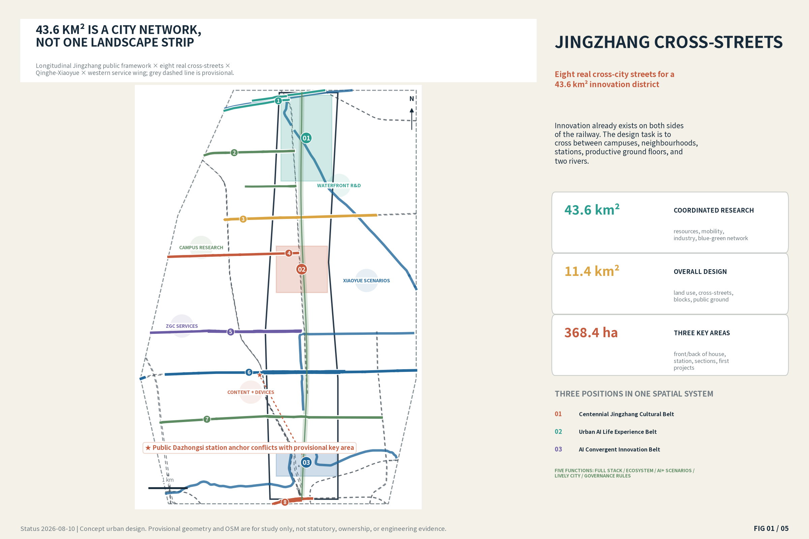
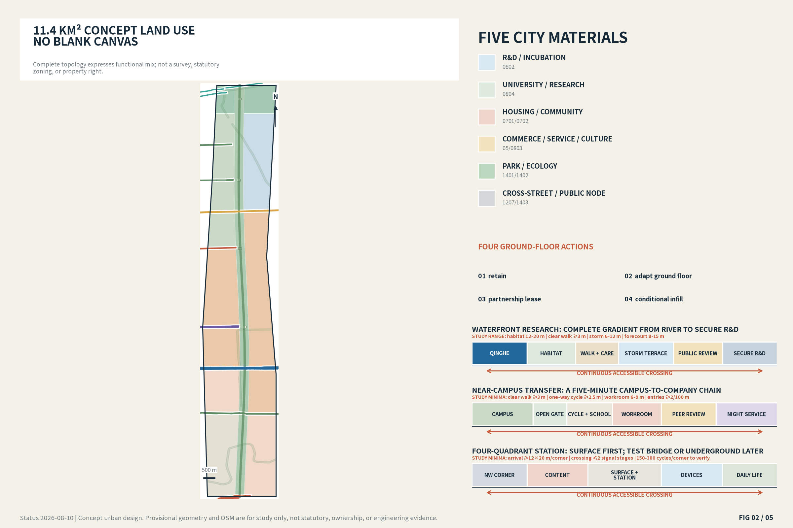
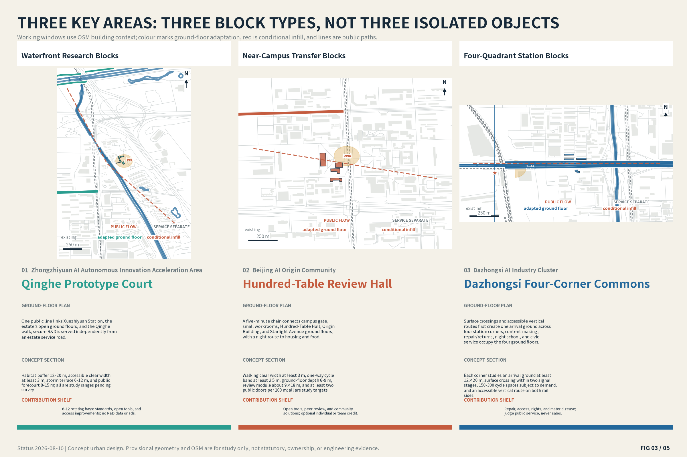
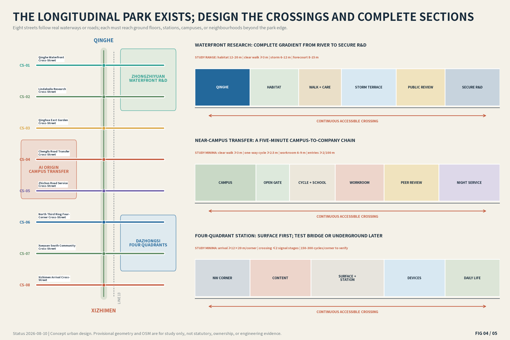
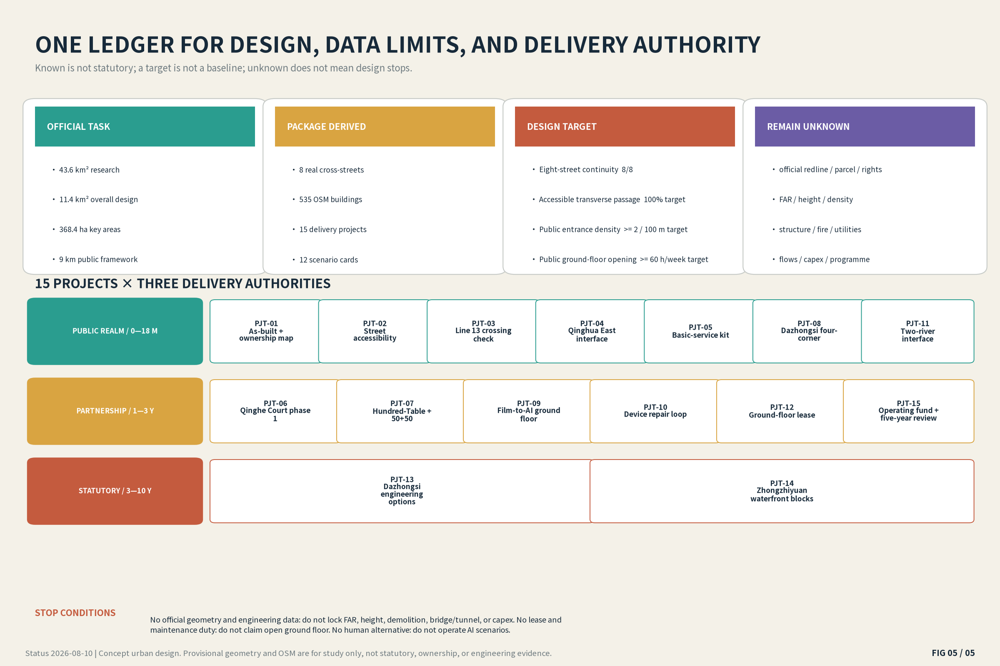

# 京张横街 / JINGZHANG CROSS-STREETS

> Eight real cross-city streets for a 43.6 km² innovation district. This is first an urban-spatial proposal. The name only gives a shared identity to eight real streets. Every spatial move is a concept proposal and reference scheme for professional development, not a statutory plan or government decision.

## Design Basis and Source List

This redesign begins with what already exists. Phase 1 of the Jingzhang Railway Heritage public space is open; in July 2026, the official update reported the completion of the Phase 2 supporting works, including a fishbone network for walking, running, cycling, and neighbourhood use. The nine-kilometre park is therefore not blank land. The design object is the first row of blocks on both sides, the real east-west streets, campus and estate gates, four station corners, under-rail spaces, and the Qinghe-Xiaoyue interfaces. The approved Qinghua East Road project and active river works enter the base map and are connected rather than duplicated. [source:BJ-PARK-PHASE2] [source:BJ-QINGHUA-EAST]

Evidence is used in four tiers. The announcement and current law define the task and hard limits. Official construction and renewal notices define built, in-progress, and named anchors. OpenStreetMap supplies a dated context for streets, rail, water, stations, and building footprints only. Repository provisional polygons support topology and package validation only. The 43.6 km² and 11.4 km² figures follow the formal announcement; the earlier 37 km² media figure remains background. Because the provisional Dazhongsi key-area rectangle conflicts with the public station anchor, the drawings show both the placeholder and a station working window instead of turning the conflict into false precision. [source:OFFICIAL-ANNOUNCEMENT] [source:OSM-20260810]

Still unknown are official GIS boundaries, parcels and land use, ownership and leases, structure and storeys, FAR and height, road redlines and pedestrian flows, heritage GIS, utility capacity, and investment. Unknown does not mean no design: this package completes a topologically whole conceptual land-use plan, eight cross-streets, three block-scale prototypes, sections, ground-floor operations, scenarios, and implementation packages. The unknowns define the next replacement and calibration tasks in `assumptions.json`. [data:geometry/constraints.geojson#CON-DZS-ANCHOR]

## Three-Level Scope Framework

The 43.6 km² research area, 11.4 km² overall design area, and 368.4 ha key areas are not the same drawing at three scales. The research level connects the western Zhongguancun service wing, the Jingzhang public spine, the eastern Xiaoyue scenario wing, universities, transit, and rivers. The overall-design level resolves the first blocks on both sides of the park, conceptual land use, sections, mobility, and the blue-green system. Only the three key areas enter ground-floor rooms, block plans, station corners, front-and-back separation, and first projects. All three scales are designed, but at deliberately different precision. [depth:three_level_scope_framework] [metric:coordinated_research_area_sqm]

Jingzhang Cross-Streets does not draw another north-south innovation line. Innovation assets already sit on both sides of the railway; people must cross to move from campus to estate, neighbourhood to park, station to workplace, and western services to eastern applications. Each street is named after a real road or waterfront. The longitudinal park carries walking and history; cross-streets carry everyday city life and innovation transfer. Their intersections become operable public ground floors. [data:geometry/roads.geojson#CS-01]

The taskbook's three positions are not three additional slogans. Each is assigned a visible spatial carrier and an acceptance move:

| Three positions | Spatial carrier | Design response |
| --- | --- | --- |
| Centennial Jingzhang Cultural Belt | Jingzhang Park, Beijing North Station, Qinghuayuan Station, bridges, tracks, and vertical relationships | Organise real heritage as platform-workbench-shared-table chapters without repeating railway motifs. |
| Urban AI Life Experience Belt | Stations, neighbourhoods, campus gates, public ground floors, and river interfaces on eight cross-streets | All twelve scenarios need real rooms, human alternatives, opening hours, and stop triggers; daily services are not displaced by display. |
| AI Convergent Innovation Belt | Campus research-Origin transfer-Zhongzhiyuan R&D-Dazhongsi content/devices-Xiaoyue civic scenarios | Join research, production, service, and civic use through walkable short chains, public-front/secure-rear sections, and controlled tests. |

The five functions form a three-area/two-wing loop. The Zhongguancun service wing brings professional services and resource access; AI Origin turns research into teams and prototypes; Zhongzhiyuan hosts full-stack R&D and public standards discussion; Dazhongsi brings content, devices, repair, and consumption to the urban ground floor; and the Xiaoyue scenario wing offers bounded civic testing. Evaluated results return to teaching, standards workshops, and the next spatial repair. This loop handles specific projects and voluntary scenarios only; it is not a universal traceability system for city actions. [source:AGENT-TASKBOOK]

| Five functions | Three-area/two-wing location | Spatial move | Acceptance/boundary |
| --- | --- | --- | --- |
| Full-stack autonomous AI innovation system | Zhongzhiyuan + CS-01/02 | Shared-equipment booking, public review, a low-rise shared hall, and an independent secure R&D rear | opening hours, booking access, and public/service separation |
| World-class AI innovation ecosystem | AI Origin + Zhongguancun service wing + CS-04/05 | 50+50 desks, Hundred-Table Review, eight founder clinics, and daily talent services | first response, desk turnover, affordable rent, and team continuity |
| New AI+ scenario-enablement model | Xiaoyue scenario wing + controlled forecourts in three key areas | Four industrial tests and eight daily-service scenarios open only with space, staff, insurance, and stop triggers | card-level acceptance, human takeover, exit, and complaint closure |
| Intelligent and lively AI city | Eight cross-streets + Dazhongsi four corners + neighbourhood/campus gates | Transfer, school trips, night school, repair, childcare, water, toilets, and night staff form an everyday public ground | 8/8 continuity, rest points within 150 m, and basic services on 8/8 streets |
| Global voice in AI governance | Zhongzhiyuan standards workshops + cross-street scenario rules | Turn privacy impact, human alternatives, test suspension, repairable design, and accessible content into public rules and examples | no universal city-action tracking; review only specific voluntary scenarios |

Interfaces with North Latitude Community, Future Science City, Huairou Science City, Beijing E-Town, and the Beijing-Tianjin-Hebei region remain conceptual proposals for research briefs, standards work, prototype hand-off, scenario exchange, and talent services—not confirmed partnerships. The planning innovation is to keep three levels of precision, the industry chain, public space, ground-floor operation, and exit conditions in one auditable framework without replacing statutory planning.

| ID | Real cross-street | Anchors | Required urban move |
| --- | --- | --- | --- |
| CS-01 | Qinghe Waterfront Cross-Street | Qinghe, the northern Jingzhang edge, and the Xiaoyue River confluence | Join the waterfront walk, research courts, Xuezhiyuan transit access, and dark habitat into one walkable research edge without inventing a new water feature. |
| CS-02 | Lindabeilu Research Cross-Street | southern Zhongzhiyuan edge, Xueqing Road, and Xueyuan Road | Turn the first row of inward-facing buildings into an accessible ground floor for public reviews, shared-equipment booking, talent services, and food. |
| CS-03 | Qinghua East Garden Cross-Street | Jingzhang Park, Xueyuan Road, Liudaokou, and Xiaoyue River | Connect directly to the approved Xueyuan Road public-space project, its five cycle-parking areas, and six gardens to complete a station-park-street sequence. |
| CS-04 | Chengfu Road Transfer Cross-Street | Wudaokou, campus gates, Origin Building, and Jingzhang Park | Keep the paper-to-prototype-to-company journey on the real street through small workrooms, a hundred-table review hall, night study, and daily talent services within a one-kilometre walk. |
| CS-05 | Zhichun Road Service Cross-Street | Zhongguancun service wing, Zhichun Road Station, the completed park, and neighbourhoods | Put legal, compute, finance, recruitment, and frequent community services at walkable ground level while auditing the unresolved Line 13 crossings toward Dazhongsi. |
| CS-06 | North Third Ring Four-Corner Cross-Street | four Dazhongsi station quadrants, Line 13, the Third Ring, universities, and neighbourhoods | Deliver surface continuity, vertical access, cycle parking in all four corners, and accessible ground floors before considering bridges, underground links, or new volume. |
| CS-07 | Xueyuan South Community Cross-Street | Beijing Jiaotong University, neighbourhoods, Jingzhang Park, and the Xiaoyue direction | Prioritise independent school trips, older people’s rest, toilets and drinking water, under-bridge sport, and repair so the street serves more than innovation workers. |
| CS-08 | Xizhimen Arrival Cross-Street | Beijing North Station, Xizhimen, the southern Jingzhang edge, and city transit | Create an arrival ground through legible transfers, luggage-friendly walking, a historical opening chapter, and all-day services rather than decorative railway motifs. |

The public ground floor is a measurable section rule, not a second brand. Each segment is marked retain, open, lease-and-adapt, conditional infill, or secure rear. Entrance use, opening hours, accessible continuity, and servicing are testable. The key areas prove three different block types-waterfront research, near-campus transfer, and four-quadrant station urbanism-rather than replicating one landmark.

## Coordinated Research Area: Industry and Future City Research

The 43.6 km² ecosystem assigns spatial roles to the western professional-service wing, campus research, Origin transfer, Zhongzhiyuan full-stack research, Dazhongsi devices and content, and the eastern civic-scenario wing. Legal, finance, talent, international, and compute services sit at walkable ground level on streets such as Zhichun and Chengfu. Secure research and shared equipment use a public-forecourt/controlled-rear structure at Zhongzhiyuan. Content production, device trial, repair, reuse, and consumption form a surface-accessible four-quadrant network at Dazhongsi. Qinghe and Xiaoyue are real infrastructure projects, so habitat, drainage, maintenance, and access share one section. [source:BJ-WATERWAYS] [depth:overall_spatial_structure]

The ecosystem map places eight enabling elements in space, operation, and safeguards at the same time. Data is not treated as an abstract resource: booking/consulting data is separated from R&D data, public space does not identify people persistently, public information is limited to human-reviewed aggregates, and each scenario can stop independently.

| Element | Spatial carrier | Operating mechanism | Safeguard |
| --- | --- | --- | --- |
| Land | Existing estates, first street-facing rows, and conditional opportunity sites | Retain first, use short leases and ground-floor adaptation; replace the chain when official parcels and rights arrive | No acquisition, disposal, or land-price promise |
| Space | Public forecourt-accessible ground floor-secure rear | Three dimensioned section families, four building actions, and daily/event states | Concept only before structure, fire, heritage, and utility checks |
| Industry | Campus-Origin-Zhongzhiyuan-Dazhongsi-Xiaoyue | A walkable chain of research, review, prototyping, content/devices, repair/reuse, and civic scenarios | No invented companies, output, or investment promise |
| Funding | Basic public service, ground-floor leases, tests, and operating fund | Public funds secure access/care; owners secure ground floor/rear; testers fund insurance/clear-down; income pays accessibility→repair→free service→public programme | Responsibility proposal, not a fiscal commitment |
| Talent | 50+50 desks, Hundred-Table Review, housing links, and visiting desks | Move from open events into clinics, desks, equipment, prototypes, leases, or long partnerships | Guardrails are affordability, night safety, and incumbent retention |
| Compute | Compute clinics on CS-04/05 + controlled R&D rear | Public desks explain booking, price, and human support; training/R&D data stay with responsible secure operators | Capacity, heat reuse, and energy benefit await professional study |
| Data | Booking desks, service desks, controlled test rooms, and annual public summaries | Separate booking/consulting from R&D data; no persistent public identification; publish only opening hours, maintenance response, and human-reviewed aggregates | Purpose limitation, data minimisation, deletion, human appeal, and scenario-level stop |
| Scenarios | Real rooms and public routes for twelve scenario cards | Put responsible body, frequency/capacity, acceptance, human takeover, insurance, and stop trigger into each opening agreement | A test is not approved operation; anomalies stop it |

Zhongzhiyuan's “full stack” is organised as five spatially legible levels rather than a company list: foundational resources in the secure rear; models and tools in shared workrooms; agents and applications in team rooms; validation in a bounded test gallery; and standards/governance in the public review forecourt. No supplier, compute capacity, funding, or approval is presumed.

The streets are not evenly distributed programme dots. Each receives a brief framed as existing supply, actual gap, and first accepted delivery. A 400 m walk audits daily services, 800 m audits founder and shared facilities, and 1 km tests the innovation short chain in the three key areas. These are walking assessment tools, not statutory service promises.

| Street | Existing supply | Actual gap | First delivery |
| --- | --- | --- | --- |
| CS-01 | Qinghe, Xiaoyue, Zhongzhiyuan, Xuezhiyuan Station | river works, estate edge, and station access remain separate | deliver one accessible station-estate-river line and dark-habitat section |
| CS-02 | Zhongzhiyuan, Tencent Xuezhiyuan, Dongsheng Phase III 604 | ground floors, shared equipment, and daily services are discontinuous | adapt one existing building row as public front and secure rear |
| CS-03 | Qinghua East project, Liudaokou, three universities, Xiaoyue | approved gardens, parking, and campus axes still need one Jingzhang interface | combine five parking areas, six gardens, and three campus axes in one interface plan |
| CS-04 | Wudaokou, Origin Building, TusPark, Zhiyuan Building | no visible short chain from research to desks, review, and company services | lease two ground floors for peer review and 50+50 open desks |
| CS-05 | Zhongguancun service wing, Zhichun Road Station, built park, neighbourhoods | professional services are dispersed and the Line 13 crossing remains unverified | open the eight-need clinic and verify the crossing on site and as-built drawings |
| CS-06 | Dazhongsi Station, Third Ring, film/university resources, renewal group | crossings, vertical access, cycle parking, and ground floors are fragmented | deliver a surface-arrival package at each corner; test bridges or tunnels later |
| CS-07 | Beijing Jiaotong University, neighbourhoods, under-bridge space, Xueyuan South Road | school trips, older people’s rest, toilets, water, and repair are underserved | accept one child/caregiver route with basic services and under-bridge rooms |
| CS-08 | Beijing North Station, Xizhimen hub, southern Jingzhang | transfer, luggage walking, historical opening, and all-day service lack one arrival ground | complete one luggage- and wheelchair-friendly arrival line and the first heritage chapter |

The identity serves the plan. A vertical void and eight unequal horizontal bars form the mark; each street receives one colour, ID, and section icon. The Chinese name stresses east-west connection, while the plural English name rejects a single scenic axis. Wayfinding keeps real street names and adds walking time to the park, campuses, river, and stations. Railway spikes, tickets, rails, and robot mascots are not the primary visual language.

Eight international cases are used as a mechanism library rather than collage. Each transfer is paired with a limitation; no case supplies Beijing's climate, ownership, statutory, investment, or engineering conclusion. [source:CASE-ONE-NORTH]

| Case | Scale | Transferable move | Do not copy |
| --- | --- | --- | --- |
| Singapore Rail Corridor | 24 km corridor; first 4 km central section | Use section families along Jingzhang, let cross-streets provide access, and control night lighting in ecological segments. | Tropical ecology and coordinated public land differ from Beijing. |
| Singapore one-north | about 200 ha | Shared labs and young-worker housing must touch public space and transit; the programme calendar starts with the spatial plan. | JTC's unified land and investment authority is not transferable. |
| Kashiwa-no-ha / UDCK | 13 km² vision; 272.9 ha core | Each key area needs a permanent operating room, not an event-only stage. | New-town development, one dominant developer, and a new station differ from Jingzhang. |
| Barcelona 22@ | 198.26 ha / 115 blocks | Audit every Jingzhang block for production, housing, services, and public space together. | Its early employment-and-property bias and later repair of daily life are a warning. |
| King's Cross | 67 acres; more than 40% public space | Complete one station-street-public-space-neighbourhood chain before releasing adjacent projects. | Consolidated ownership and London land values are not transferable. |
| Paris Rive Gauche | 130 ha; 26 ha rail deck | At Dazhongsi, prioritise surface and existing-link continuity; bridges and underground links remain options requiring proof. | Rail decking is costly, slow, and can still produce weak everyday commerce. |
| Yangpu Waterfront | 15.5 km waterfront / 12.93 km² | Grade the railway heritage as an operating system, not one uniformly themed culture street. | Waterfront value, river conditions, and public investment differ. |
| Brooklyn Navy Yard | about 300 acres | Add brand-neutral repair and small-batch making at Dazhongsi, and retain affordable prototype back-of-house space at Zhongzhiyuan. | Production safety boundaries can still create an enclave. |

Five combined principles enter the design: deliver public space together with housing, production, and services; read railway heritage as a system; design daily/event, dry/storm, summer/winter, and day/night states; establish the operating team, lease, and maintenance rear in the first phase; and front-load affordable production and anti-displacement measures.

## Overall Design Area: Urban Renewal and Regulatory-Plan-Level Urban Design

The 11.4 km² conceptual plan uses the built Jingzhang park as its central public framework and eight cross-streets to create segments with different tasks. The land-use layer partitions the provisional overall polygon without gaps or overlap into research, education, housing, commercial service, culture, roads, and open space. It expresses a desired mix rather than surveyed or statutory land use. Each crossing is checked for the first building row, crossings, cycle parking, community service, stormwater, and servicing. [data:geometry/land_use.geojson#LU-001] [standard:MNR-LAND-USE-CLASSIFICATION-GUIDE]

Renewal is not blanket redevelopment. Buildings are retained, ground-floor adapted, leased for partnership use, or conditionally infilled. OSM footprints supply morphology only. A ground-floor retrofit changes access, programme, and servicing while retaining the main structure by default. Conditional infill enters professional design only after planning, ownership, structure, fire, and heritage checks. No building is designated for demolition; FAR, height, and total floor area stay unknown. [metric:osm_existing_building_count] [depth:retain_renovate_demolish]

Three section families guide design. The waterfront-research section grades habitat, path, stormwater terrace, public forecourt, and secure rear. The campus-transfer section keeps gates, cycling, workrooms, review rooms, and night services at eye level. The four-corner station section delivers surface crossings, lifts, canopies, parking, and accessible ground floors before any bridge or underground option. All dimensions are relational until official redlines and engineering data arrive.

The following dimensions are study minima or ranges, not surveyed conditions or statutory road redlines. They must be replaced segment by segment once topography, transport, and utility evidence is available; they are not construction dimensions.

| Section family | Concept dimensions and acceptance relationship |
| --- | --- |
| Waterfront research | habitat buffer 12-20 m; accessible clear width at least 3 m; storm terrace 6-12 m; public forecourt 8-15 m; separate R&D service entry |
| Near-campus transfer | walking clear width at least 3 m; one-way cycle band at least 2.5 m; workroom depth 6-9 m; review module about 9×18 m; at least 2 public entrances/100 m |
| Four-quadrant station | continuous arrival ground at each corner target at least 12×20 m; surface crossing within two signal stages; 150-300 cycle spaces/corner subject to demand; accessible vertical route on both rail sides |

## Detailed Design of Key Areas

The three areas are not coloured cards. Each working window draws OSM morphology, real streets/stations/water, the principal cross-route, public ground floors, secure rear areas, daily and event states, and first projects. New volume is only low-impact, reversible, and phased in spatial intent. The provisional polygons remain in `key_areas.geojson`; the detailed windows follow the announcement's textual anchors and public context, with the Dazhongsi conflict shown explicitly. [data:geometry/key_areas.geojson#PROV-KEY-003] [depth:three_key_area_detailed_design]

### Zhongzhiyuan AI Autonomous Innovation Acceleration Area: Waterfront Research Blocks

Its spatial engine is **secure research rear + accessible review forecourt + Qinghe habitat edge**. Everyday use consists of shared-equipment booking, lunchtime review, commuting, waterfront walking, and food; its event state is quarterly prototype open days and international standards workshops. The inhabitable landmark, **Qinghe Prototype Court**, combines public ground, accessible building space, and real back-of-house rather than an isolated object. First projects are accessible Xuezhiyuan station-to-park link; public ground-floor prototype facing Qinghe; separated research logistics and visitor route; dark habitat and stormwater terraces. All building and parcel moves remain conceptual until ownership, structure, fire, heritage, and planning controls are confirmed.

| Detailed-design layer | Non-statutory block design |
| --- | --- |
| Ground-floor plan | One public line links Xuezhiyuan Station, the estate's open ground floors, and the Qinghe walk; secure R&D is served independently from an estate service road. |
| Ground-floor programme | The river-facing row places booking, waiting, public review, and a shared hall in sequence; confidential labs, plant, and loading remain behind. |
| Public/service flows | Public: station→booking→review→waterfront. Service: side road→loading→secure lab rear. They meet only at a staffed booking foyer. |
| Concept section dimensions | Habitat buffer 12-20 m, accessible clear width at least 3 m, storm terrace 6-12 m, and public forecourt 8-15 m; all are study ranges pending survey. |
| Landmark components | Qinghe terrace + covered review hall + shared-equipment booking foyer + independent secure rear |
| Daily/event switch | Daily use keeps commuting, booking, and waterfront rest. Open days add removable displays only in the forecourt; the secure boundary does not move. |

### Beijing AI Origin Community: Near-Campus Transfer Blocks

Its spatial engine is **a short chain from campus gate to workroom, public review, incubation, and daily services**. Everyday use consists of open desks, legal and compute clinics, night study, childcare, and affordable food; its event state is weekly peer review, monthly street releases, and graduation residencies. The inhabitable landmark, **Hundred-Table Review Hall**, combines public ground, accessible building space, and real back-of-house rather than an isolated object. First projects are Chengfu Road campus-gate walking repairs; continuous ground floor from Origin Building to Starlight Avenue; distributed 50+50 open desks; low-impact shared longhouse. All building and parcel moves remain conceptual until ownership, structure, fire, heritage, and planning controls are confirmed.

| Detailed-design layer | Non-statutory block design |
| --- | --- |
| Ground-floor plan | A five-minute chain connects campus gate, small workrooms, Hundred-Table Hall, Origin Building, and Starlight Avenue ground floors, with a night route to housing and food. |
| Ground-floor programme | Small workrooms 6-9 m deep divide by the hour; review modules of about 9×18 m combine; legal, compute, hiring, and childcare services share a street-facing waiting area. |
| Public/service flows | Public: campus gate→workroom→review→services. Team service: side lane→storage/plant→rear workroom doors. Visible staffed points join the night route. |
| Concept section dimensions | Walking clear width at least 3 m, one-way cycle band at least 2.5 m, ground-floor depth 6-9 m, review module about 9×18 m, and at least two public doors per 100 m; all are study targets. |
| Landmark components | Divisible hundred-table hall + small workrooms on both sides + night-study gallery + independent storage and plant rear |
| Daily/event switch | Daily use is desks, clinics, and study. Review days open sliding partitions into one hall, then restore small rooms without occupying the public route. |

### Dazhongsi AI Industry Cluster: Four-Quadrant Station Blocks

Its spatial engine is **surface-first four-quadrant access + content production + intelligent devices + commuter life**. Everyday use consists of transfer, cycle parking, repair and returns, youth night school, and community services; its event state is small releases, public screenings, device trials, and sound-culture nights. The inhabitable landmark, **Dazhongsi Four-Corner Commons**, combines public ground, accessible building space, and real back-of-house rather than an isolated object. First projects are four-corner crossing and vertical-access audit; cycle parking in all four quadrants; film-to-Dazhongsi content-production ground floor; intelligent-device repair and circular counter. All building and parcel moves remain conceptual until ownership, structure, fire, heritage, and planning controls are confirmed.

| Detailed-design layer | Non-statutory block design |
| --- | --- |
| Ground-floor plan | Surface crossings and accessible vertical routes first create one arrival ground across four station corners; content making, repair/returns, night school, and civic service occupy the four ground floors. |
| Ground-floor programme | The east shared room handles trials and repair, north makes content, west supports transfers, and south hosts community and night school; every corner keeps canopy, parking, and human help. |
| Public/service flows | Passengers: station→four-corner arrival ground→services. Logistics: perimeter road→timed loading→repair/production rear. Event queues may not block station access. |
| Concept section dimensions | Each corner studies an arrival ground at least 12×20 m, surface crossing within two signal stages, 150-300 cycle spaces subject to demand, and an accessible vertical route on both rail sides. |
| Landmark components | Four covered arrival platforms + distributed ground-floor services + one accessible wayfinding system + independent repair/production rear |
| Daily/event switch | Daily use keeps transfer, repair, and night school. A release or screening occupies one managed corner only; the other three remain open for movement and civic service. |

All three inhabitable landmarks pass five gates: everyday access, a public service, real back-of-house, continuous accessibility, and a useful post-event state. Qinghe Prototype Court is a waterfront research block; Hundred-Table Review Hall is a divisible low-impact longhouse; Dazhongsi Four-Corner Commons is a distributed station system. Their image comes from occupied sections, not towers or giant screens.

The honor system uses three **Contribution Shelves** embedded in the landmarks rather than a separate hall. It displays only voluntarily public, human-checked contributions such as open tools, standards work, mentoring and civic service, accessibility improvements, repair/reuse, and community problem-solving. It records neither general city activity nor personal movement, has no personal leaderboard, and does not treat corporate advertising as honor. Every item states contributor, public use, display term, correction/withdrawal route, and exit into a public catalogue or removal. [source:AGENT-TASKBOOK]

| Spatial node | Contribution shown | Spatial/rotation rule |
| --- | --- | --- |
| Qinghe Prototype Court | Public standards, open tools, accessibility improvements | 6-12 replaceable bays; quarterly rotation |
| Hundred-Table Review Hall | Open tools, peer review, mentoring, community problem-solving | Pinned up on review days, displayed for at most six months |
| Dazhongsi Four-Corner Commons | Repairable design, accessible content, rights compliance, material reuse | Reviewed by public-service outcomes, never sales ranking |

## AI Innovation Ecosystem, Personas, and AI+ Scenarios

Seven personas test the design; talent is not treated as one young professional. Neighbours, disabled and older people, caregivers, and operations staff hold the same design weight as researchers. [source:PRC-ACCESSIBILITY-LAW] [metric:persona_count]

| ID | User | What must work in one day |
| --- | --- | --- |
| P-01 | University researcher / student | Find public review, shared desks, affordable food, and a safe return route within 15 minutes |
| P-02 | Solo founder and small team | Use workrooms by the hour and receive weekly legal, compute, hiring, and prototype support |
| P-03 | Hardware engineer and test operator | Keep logistics away from public flows while demonstrating and taking over manually in a controlled forecourt |
| P-04 | Neighbour and caregiver | Keep school trips, care, rest, drinking water, toilets, and daily shopping from being displaced by innovation events |
| P-05 | Wheelchair user and older person with limited mobility | Receive one continuous chain of crossings, station access, ramps, lifts, and rest points with human alternatives to digital service |
| P-06 | International visitor and partner | Arrive from Xizhimen or Xuezhiyuan, understand the district, book a visit, and enter public events without insider knowledge |
| P-07 | Park and district operator | Have real back-of-house space for storage, repair, night duty, waste sorting, event set-up, and complaints |

Twelve cards include four explicit industrial tests, with the rest covering services, production, and civic use. Every card names a real room, frequency/capacity, acceptance metric, and independent stop trigger. AI does not grant extra public right-of-way. [source:AGENT-TASKBOOK] [metric:test_scenario_count]

| ID | Type | Scenario | Real space | Responsible operator | Data/human boundary | Frequency/capacity | Acceptance | Card stop trigger |
| --- | --- | --- | --- | --- | --- | --- | --- | --- |
| SCN-01 | test | Controlled Prototype Review Street | Qinghe Prototype Court forecourt and closable test lane | estate operator, test company, and human safety marshal | minimal device telemetry, no passer-by identity capture, and manual takeover on anomaly | monthly; one test lane; no more than 40 observers | every test records its boundary, takeover time, and clear-down | stop if the trial leaves its enclosure, manual stop fails, or the marshal leaves |
| SCN-02 | test | Low-Speed Campus Logistics Window | service lane, controlled crossings, and indoor hand-off lockers | property manager, logistics provider, and transport professionals | limited time and route; public right-of-way never yields to the trial | two off-peak weekday hours; no more than four low-speed devices | zero obstruction of accessible paths and takeover within the declared time | stop on accessible/fire-route obstruction or two safety takeovers in one session |
| SCN-03 | test | Qinghe Habitat Observatory | dark river edge, stormwater terraces, and public observation points | joint river, park, university, and volunteer team | water level, temperature, humidity, sound level, and human-verified species records only | continuous environment log; quarterly species check; no more than 12 people per point | lighting boundary, habitat continuity, and human verification coverage | stop if light crosses the dark boundary, sensors capture personal data, or storm alert triggers |
| SCN-04 | operation | Street-Level Shared Equipment Booking | public booking desk, secure rear area, and waiting café | estate platform and equipment owners | booking data separated from research data with in-person verification | at least 60 weekday hours/week; 6-12 waiting seats | open hours, equipment utilisation, and access by small teams | stop on booking/research-data mixing, blocked public passage, or secure-rear failure |
| SCN-05 | operation | Hundred-Table Peer Review | divisible longhouse, street-side spill-out, and quiet booths | rotating university, incubator, and developer hosts | offline by default with physical separation of public and confidential work | two sessions/week; 40-100 demountable tables; 120-300 seats after fire approval | weekly open hours, cross-institution seats, and later tenancy conversion | stop on blocked egress, loss of public/confidential separation, or noise breach |
| SCN-06 | operation | Distributed 50+50 Open Desks | two small ground floors five minutes apart rather than one new mega-incubator | local authority, park operator, and social operator | contracts held by the operator; no face access control in public space | 100 desks total; at least 60 hours/week; two ground floors within a five-minute walk | desk turnover, night safety, affordability, and team survival | stop if rent leaves the agreed affordable band, night staffing fails, or access breaks |
| SCN-07 | operation | Eight-Need Founder Clinic | a sequence of small Chengfu Road rooms for policy, finance, compute, talent, partners, expertise, space, and scenarios | professional service providers on daily rotation | consultation records stay with each professional body; public display shows anonymous queues only | eight rotating service rooms; first response target within one working day | first-response time and conversion to long-term service | stop if public display identifies clients, no human professional is present, or conflicts are undisclosed |
| SCN-08 | operation | Night Study and Care Chain | lighting, seating, and help points between station, campus gate, food, and talent housing | subdistrict, universities, property managers, and merchants | no persistent identity tracking; visible staff and human assistance instead | daily 18:00-23:00; rest points no more than 150 m apart | continuous lit frontage, a 150 m rest-point target, and human response | stop on loss of continuous light/help, nuisance glare, or an un-routed accessibility break |
| SCN-09 | test | Four-Quadrant Device Trial | four small indoor trial rooms and continuous surface crossing | device companies, consumer representatives, and station operator | opt-in participants with on-site deletion; commuters outside the trial are not captured | quarterly trial week; four indoor rooms; no more than eight people per room | ease of exit, accessible use, and completed human after-sales service | stop without opt-in, on-site deletion, commuter exclusion, or human after-sales |
| SCN-10 | operation | Film-to-AI Production Ground Floor | adjacent dubbing, captioning, audio description, small screening, and rights advice | universities, content studios, accessibility advisers, and rights professionals | training material must be licensed with separate consent for voice and likeness | two small screenings/month; no more than 80 seats; five daily production rooms | accessible-content share, rights completeness, and public screenings | stop if rights are incomplete, captions/audio description are absent, or sound/light breaches limits |
| SCN-11 | operation | Device Repair and Circular Counter | one ground floor for repair, returns, parts, material recovery, and resale | brand-neutral repair provider and producer-responsibility body | local personal-data erasure before repair; no recirculation if erasure is impossible | eight daily repair benches; at least one accessible bench | repair rate, reuse rate, and affordable-service share | stop if personal data cannot be erased, battery risk cannot be isolated, or disposition is unrecorded |
| SCN-12 | operation | Cross-Street Accessibility Relay | stations, ramps, crossings, rest points, toilets, and human desks on all eight cross-streets | public-space operator and disabled-user representatives | in-person co-testing first; navigation supplements rather than replaces physical repair | quarterly recheck of all eight routes; panel of at least 12 including disabled users | route-by-route acceptance on all eight streets with user verification of closed issues | close the affected segment and repair when a safety break has no alternative route |

Four shared limits apply: no persistent identity tracking in public space; digital service keeps a human path; trial participation is voluntary and reversible; a named person can take over and stop an anomalous system. Robots, guides, and algorithms are not landmarks. They enter only when they remove a physical barrier, improve service, or support a controlled industrial test.

## Land Use, Building Scale, and Retain-Renovate-Demolish Strategy

The conceptual land-use layer uses national codes and fully covers the provisional overall boundary. It states a desired mix, not existing or statutory use. The central park uses 1401 and river/habitat interfaces use 1402; campus and research segments use 0802/0804; station and enterprise-service areas use 05; inhabited segments retain 0701/0702; heritage and content nodes use 0803; study transport interfaces use 1207 and public junctions use 1403. Boundaries are cut by real cross-streets, the curved park, and waterways rather than equal stripes. Areas are recalculated from GeoJSON and cannot be reverse-engineered into a regulatory plan. [data:geometry/land_use.geojson#LU-001] [metric:concept_land_use_area_sqm]

The building layer combines OSM context in three working windows with a small number of concept actions. Existing footprints describe morphology. Ground-floor adaptation retains the main building by default. Conditional new shapes explain forecourt-rear-court-street relationships rather than architectural schemes. A demolition count of zero is not a promise; it records that no demolition decision is legitimate without structure, ownership, lease, fire, and heritage investigation. [depth:development_intensity_controls]

With no statutory parcels or denominator, the scheme does not invent FAR, but it does not leave massing blank. Three study envelopes define ground-floor depth, footprint, storeys, front/back separation, and setbacks in the current working windows; any official plan, structure, fire, or heritage input triggers recalculation. Housing demand is tested against the officially reported 4,000+ talent apartments before new supply is proposed; that number remains a media-reporting baseline rather than a planning statistic. [source:BJ-AI-ORIGIN]

| Working window | Non-statutory massing study envelope |
| --- | --- |
| KA-01 | retain main R&D buildings; conditional infill 1-3 storeys; shared hall footprint about 1,250 m²; step behind public forecourt and habitat buffer; no tower |
| KA-02 | retain first and adapt ground floors; conditional infill 1-4 storeys; reversible longhouse footprint about 986 m²; small rooms on street, confidential rooms behind |
| KA-03 | prioritise existing buildings and four surface corners; conditional infill 2-6 storeys; east shared room footprint about 717 m²; no tower substitute for station continuity |

Workrooms divide, merge, and rent by the hour; public review has an independent secure rear; cycle parking, toilets, plant, and storage cannot be improvised out of public space. When official controls arrive, every concept unit receives a parcel ID, permitted uses, FAR, height, setback, public contribution, and implementation body. Until then, the stated storeys and footprints only test spatial relationships.

## Transport, Rail, Municipal Infrastructure, and Public Services

The mobility drawing overlays the underground Jingzhang railway, surface/elevated Line 13, other stations, eight cross-streets, the longitudinal park paths, Qinghe, and Xiaoyue. A connection is not a line intersection: it needs a lift or ramp, acceptable crossing delay, uninterrupted cycling, adequate under-rail clearance and light, and a real park entrance. Dazhongsi prioritises surface and existing-facility improvements; bridges, tunnels, underground links, and rail works remain professional options, not feasibility claims. [source:BJ-HERITAGE-PARK-PLANNING] [depth:traffic_rail_slow_parking]

The approved Qinghua East project already provides roughly 1,900 cycle-parking spaces, so this proposal treats it as an interface rather than repeating the number. Other streets first test demand, illegal parking, and evacuation conflict. One wayfinding system covers bus, shared bicycle, walking, and rail. Xizhimen, Xuezhiyuan, and Dazhongsi perform different arrival roles.

Utilities are not invented. Each street reserves a visible maintenance band for drinking water, toilet wayfinding, waste sorting, event storage, repair power, storm overflow, and night staff. Compute heat reuse, heat pumps, charging, communications, and underground space enter only after professional capacity studies. New equipment goes inside existing ground floors or replaceable plant rooms before filling public space with smart poles and screens. [depth:municipal_new_infrastructure]

## Blue-Green Network, Public Space, and Urban Character

Jingzhang Park, Qinghe, and Xiaoyue are an emerging built framework. Four interface tasks remain: barrier-free cross-street entrances; no conflict between river maintenance and public walking; waterfront research forecourts that manage storm states; and night activity that does not invade habitat darkness. Each public space carries at least two operational states among daily/event, dry/storm, summer/winter, and day/night. [source:BJ-WATERWAYS-PROGRESS] [depth:blue_green_public_space]

Character comes from material, scale, and use. The railway system stays legible without repeating sleeper, spike, ticket, and rail motifs everywhere. Zhongzhiyuan uses durable, replaceable research-court elements; AI Origin keeps small rooms and low-impact transparent-but-controlled work fronts; Dazhongsi limits screens and sound while repair, making, screening, and night school establish its content character. Any volume near Qinghuayuan Station waits for official GIS, archaeology, and heritage review. [source:BJ-QINGHUAYUAN-PROTECTION]

The cultural sequence is **platform-workbench-shared table**, used as spatial grading rather than another brand. Real rail, station, bridge, signal, and vertical relationships form the platform chapter at CS-08 Xizhimen and CS-06 Dazhongsi. The engineering culture of solving problems by making becomes small workrooms, repair, and review on CS-04 Chengfu and CS-05 Zhichun. Qinghe, Qinghua East, Xueyuan South, and the three landmarks provide shared tables with seats, learning, collaboration, and back-of-house. Legible material joints, reversible track display, railway soundscapes, and quiet rooms replace giant bells, ticket plazas, or one repeated furniture set. [source:BJ-HERITAGE-PARK-PLANNING] [depth:height_massing_character]

The international narrative is a spatially testable sentence: **“From a historic corridor of Chinese railway engineering to an open cross-street network for solving problems together.”** Xizhimen “Arrive,” Chengfu Road “Make Together,” and Qinghe “Review in Public” form a three-part civic itinerary. It uses real street names, `CS-01-08` IDs, bilingual walking times, accessibility information, and public booking points only. No company mark is borrowed; English event pages state capacity, opening status, and the concept-proposal boundary.

The component library is eight coupled systems rather than furniture: entrance+ramp; shade+seat; water+toilet wayfinding; cycle parking+repair; bioswale+overflow; event power+storage; human desk+digital information; night staff+dark-habitat edge. Each section combines them and assigns maintenance responsibility.

## Renewal Projects, Implementation Policy, and Phasing

Projects are grouped by authority, not grand dates. Public-realm work can survey, repair, and coordinate first. Agreement projects require real owners, tenants, and operators. Statutory and engineering projects wait for planning, structure, fire, pedestrian-flow, utility, and heritage evidence. This allows meaningful design now without pretending to approve later work. [source:HAIDIAN-URBAN-RENEWAL-GUIDE] [data:geometry/phasing.geojson#PHASE-01]

| Project | Name | Location | Authority | Design and delivery |
| --- | --- | --- | --- | --- |
| PJT-01 | As-built and ownership composite | ALL | 0-12 months · public realm | Combine as-built park, rail, river, road, heritage, campus, ownership, and ground-floor interfaces as the base for every later design decision. |
| PJT-02 | Eight-street accessibility audit | ALL | 0-12 months · public realm | Disabled users, older people, caregivers, and operators audit all eight streets and issue an immediate list for ramps, crossings, rest, toilets, and human help. |
| PJT-03 | Line 13 crossing verification | CS-05 | 0-12 months · public realm | Verify the Line 13 break through as-built evidence and field use; if unresolved, improve the nearest entry and signed route before presuming a bridge or tunnel. |
| PJT-04 | Qinghua East project interface | CS-03 | 0-12 months · public realm | Coordinate the five approved cycle parks, six gardens, and three campus axes with Jingzhang and Xiaoyue in one section and wayfinding plan. |
| PJT-05 | Cross-street basic-service kit | ALL | 0-18 months · public realm | Add water, toilet guidance, shade, seats, repair power, waste sorting, event storage, and night-duty points on every street. |
| PJT-06 | Qinghe Prototype Court phase 1 | KA-01 | 1-3 years · agreement/lease | Adapt existing ground floor and courtyard space for public review, waiting, shared-equipment booking, and an independent secure research rear. |
| PJT-07 | Hundred-Table Hall and 50+50 desks | KA-02 | 1-3 years · agreement/lease | Lease and adapt two small ground floors for a divisible review hall, open desks, founder clinics, and night study. |
| PJT-08 | Dazhongsi four-corner walking and cycling | KA-03 | 1-3 years · public realm | Resolve crossings, vertical access, cycle parking, canopy, waiting, and open ground floor corner by corner in all four station quadrants. |
| PJT-09 | Film-to-AI production ground floor | KA-03 | 1-3 years · agreement/lease | Use modest existing-building adaptation for dubbing, captions, audio description, small screenings, and rights advice. |
| PJT-10 | Device repair and material loop counter | KA-03 | 1-3 years · agreement/lease | Organise brand-neutral repair, returns, parts, material recovery, and resale as an affordable everyday service. |
| PJT-11 | Qinghe and Xiaoyue interface prototypes | WATER | 1-3 years · public realm | Coordinate with active river works to share one section among storm terraces, dark habitat, slow access, and maintenance routes. |
| PJT-12 | Ground-floor partnership lease | ALL | 1-3 years · agreement/lease | Put opening hours, rent, accessibility duty, servicing, noise, maintenance, insurance, and exit into real lease appendices. |
| PJT-13 | Dazhongsi station engineering options | KA-03 | 3-10 years · statutory + engineering | Once flows, rights, structure, fire, and utilities are known, compare surface optimisation, existing-link adaptation, bridge, and underground options. |
| PJT-14 | Conditional Zhongzhiyuan waterfront blocks | KA-01 | 3-10 years · statutory + engineering | Only after planning, ownership, and ecological conditions are confirmed, organise added or reconfigured buildings as small blocks with public ground and secure research rear. |
| PJT-15 | Cross-street operating fund and five-year review | ALL | ongoing · agreement/lease | Public funding secures basic access and care; owners fund ground floor and rear; trial bodies fund insurance and clear-down; lease/event income pays in order for accessibility, repair, free service, and public programme, reviewed annually and every five years. |

Long-term operation has four layers: district coordination secures the public framework; renewal and estate bodies deliver assets; a university-business-community platform curates content and tests; an independent public-space team handles access, maintenance, complaints, accessibility, and nights. Funding follows the same hierarchy. Public and renewal budgets secure continuous access, toilets, water, and basic maintenance; owners and operators fund fit-out, rent relief, and back-of-house; trial companies fund testing, insurance, and clear-down; event and lease income enters the operating fund only to supplement free civic service. Spending priority is safety/accessibility, repair, free service, public programme, and only then communication.

Contract triggers are explicit. Opening below 60 hours/week reopens subsidy and lease terms. An accessibility or fire-route break closes the affected event. Forced displacement, rent beyond the agreed affordable band, or commercial occupation of free service pauses new leasing and requires remedy. An AI scenario stops when a safety failure has no human response. Annual reporting covers eight-street continuity, free-service hours, maintenance response, incumbent retention, affordable desks, and complaint closure. [metric:renewal_project_count]

The annual system follows real rooms. Spring Cross-Street Co-Test accepts walking and accessibility. Summer Hundred-Table Review brings work to the street. Autumn Prototype Open Days use controlled forecourts. Winter Repair and Reuse Month concentrates device repair and material circulation. Conversion is explicit: desk, professional service, equipment booking, prototype, lease, or long partnership.

The four seasonal programmes share the cross-street ID, street colour, date/capacity, accessibility condition, and stop symbol as a lightweight communication system. The developer community is not a mailing list; district/estate operators, the university-business-community platform, and the independent public-space team jointly staff a five-step pathway:

| Stage | Space and action | Condition for the next stage |
| --- | --- | --- |
| Discover | Cross-Street Co-Test / Hundred-Table Review / Prototype Open Day / Repair and Reuse Month | Publish calendar, capacity, accessibility, and stop conditions together |
| Enter | Bilingual welcome desk + eight founder clinics + target of one human follow-up within 14 days | Participants choose a desk, professional service, equipment, or civic brief |
| Build | 50+50 open desks + shared equipment + four controlled industrial tests | Every project has an owner, insurance, human takeover, and exit |
| Convert | Public review→prototype/content→short ground-floor lease→long lease or partnership | Record pathway and affordability without promising investment outcomes |
| Contribute | Contribution shelves, mentor hours, civic problem briefs, and annual public KPIs | Record voluntary public contributions only; no personal scoring or universal city ledger |

Scenario opening follows eight gates: open call; rights/privacy/safety screening; match to a real room and operator; bounded sandbox; human go/no-go; limited public use; post-evaluation; and stop, repeat, or conversion. International conversion begins with a bilingual brief and open day, then a staffed welcome follow-up, visiting desk, peer review, equipment booking or bounded trial, and only then a short ground-floor lease, long lease, or research partnership. People who do not convert can return as mentors, open contributors, or collaborators on civic briefs. Annual reporting publishes only human-reviewed aggregates for participation, follow-up, desk/equipment access, affordable leases, and public contribution; it promises no investment count, capital, policy benefit, or approval. [source:AGENT-TASKBOOK]

## Metrics, Area Recalculation, and Compliance Matrix

Metrics separate official known values, design-layer recalculation, performance targets, and unknown controls. Official area and construction figures retain their sources. Provisional boundaries, conceptual land use, paths, and public spaces are recalculated from GeoJSON. Entrances, opening hours, rest spacing, and accessible continuity are next-stage measured targets. Statutory FAR, height, demolition, utility capacity, investment, and ownership remain unknown. `public_space_ratio` is only the footprint of proposed public-space interventions and may overlap green space; it is not the existing public-space supply ratio across 11.4 km². OSM counts are not claimed as design achievement. [metric:cross_street_count] [metric:unknown_control_count]

| Performance | Target | Acceptance basis |
| --- | --- | --- |
| Eight-street continuity | 8/8 | Accept each street in the field; a line on a map does not count. |
| Accessible transverse passage | 100% target | Disabled-user co-testing controls acceptance; unsafe segments may remain closed during repair. |
| Public entrance density | >= 2 / 100 m target | Count only doors the public can actually enter during declared hours. |
| Public ground-floor opening | >= 60 h/week target | Record each leased shop or room separately. |
| Continuous rest points | <= 150 m target | Each point includes shade, a backrest, and space beside the seat for a wheelchair. |
| Cross-street basic service | 8/8 | Every street provides water, toilet guidance, human help, and repair power. |
| Human takeover in tests | 100% | All four test scenarios require a named person and an explicit stop trigger. |
| Anti-displacement in phase one | 100% projects | Every project states rent, incumbent-business, and affordable-space safeguards at initiation. |

The compliance matrix maps announcement tasks 1.3-1.5 and agent.1-agent.6 to the narrative, five figures, nine GeoJSON layers, metrics, sources, assumptions, A3, A0, and offline HTML. Automated checks cover topology, bilingual completeness, image and PDF packaging, and offline safety. Spatial correctness still requires professional and user judgement. [standard:PROJECT-OFFICIAL-ANNOUNCEMENT]

## Risk, Copyright, and Compliance

This is an open co-creation proposal, not a statutory plan or government decision. Repository geometry for 43.6 km², 11.4 km², and the three key areas remains provisional. Conflicts involving 37 versus 43.6 km², Xuebeiyuan versus Zhongzhiyuan, supporting-works completion versus full-line status, the Xuezhiyuan underground link, Line 13 crossings, and vacated-site uses remain explicit. Official data should replace the whole affected chain, not merely remove the warning. [source:BOUNDARY-SOURCE] [data:geometry/constraints.geojson#CON-BOUNDARY]

Privacy and ethics apply to the twelve scenarios: minimum data, voluntary participation, human alternative, human takeover, explicit stop, deletion, and complaint. The scheme does not propose a general doctrine that every state-changing city action must be traced. Provenance and rights records serve the public submission and licensing boundary only.

Original text, concept design, diagrams, PDFs, and offline pages are released under CC BY 4.0. OSM-derived context follows ODbL 1.0 and contributor attribution. Noto Sans SC follows OFL 1.1. The user-provided UrbanOS proposal was reviewed solely as a completeness benchmark; its COMMUNITY-DISPLAY-ONLY text, concept, visual language, geometry, and institutional terms were not reused. [source:REFERENCE-URBANOS] [source:NOTO-SANS-SC]

## References

These are the most important public entry points. Full publisher, date, use, licence, and limitation fields are in `sources.json`. International cases support mechanism comparison, not Beijing statutory, investment, or engineering conclusions. [source:SOURCE-REGISTRY]

- `OFFICIAL-ANNOUNCEMENT` — Beijing Municipal Commission of Planning and Natural Resources, Haidian Branch: https://ghzrzyw.beijing.gov.cn/zhengwuxinxi/tzgg/hd/202605/t20260509_4643047.html
- `BJ-PARK-PHASE2` — Beijing Municipal Forestry and Parks Bureau: https://yllhj.beijing.gov.cn/zwgk/zwxx/202607/t20260714_4761226.shtml
- `BJ-QINGHUA-EAST` — Beijing Municipal Government Portal: https://www.beijing.gov.cn/ywdt/gzdt/202606/t20260602_4681460.html
- `BJ-WATERWAYS` — Beijing Water Authority: https://swj.beijing.gov.cn/swdt/ztzl/sstxczl/sstzx/202507/t20250708_4144746.html
- `BJ-ZZY-RENEWAL` — Beijing Urban Renewal Service Platform: https://www.beijing.gov.cn/fuwu/lqfw/ztzl/bjchshgx/xmgsh/202607/t20260714_4762585.html
- `BJ-DZS-RENEWAL` — Beijing Urban Renewal Service Platform: https://www.beijing.gov.cn/fuwu/lqfw/ztzl/bjchshgx/xmgsh/202607/t20260714_4762615.html
- `BJ-AI-ORIGIN` — Haidian District Government: https://www.bjhd.gov.cn/ztzx/2025/aifuture/jq/aiyd/202603/t20260326_4809740.shtml
- `BJ-QINGHUAYUAN-PROTECTION` — Beijing Municipal Cultural Heritage Bureau: https://wwj.beijing.gov.cn/bjww/362771/362782/743928533/743928745/index.html
- `HAIDIAN-URBAN-RENEWAL-GUIDE` — Haidian District Government: https://zyk.bjhd.gov.cn/zwdt/zcwj/202507/t20250716_4779051.shtml
- `OSM-20260810` — OpenStreetMap contributors: https://www.openstreetmap.org/copyright
- `CASE-ONE-NORTH` — JTC: https://www.jtc.gov.sg/-/media/project/jtc-cx/corpweb/assets/find-land/estates/one-north/one-north-brochure.pdf
- `CASE-22AT` — Barcelona City Council: https://www.habitatge.barcelona/en/noticia/more-housing-facilities-and-economic-activity-in-the-22_1144038
- `CASE-KINGS-CROSS` — King's Cross Estate: https://www.kingscross.co.uk/press/2021/10/08/the-kings-cross-estate-celebrates-10-year-anniversary
- `CASE-RIVE-GAUCHE` — SEMAPA: https://www.semapa.fr/paris-rive-gauche/
- `CASE-YANGPU` — Shanghai Yangpu District: https://english.shyp.gov.cn/ywb/latest/20211029/395437.html
- `CASE-NAVY-YARD` — Brooklyn Navy Yard Development Corporation: https://www.brooklynnavyyard.org/mission/
