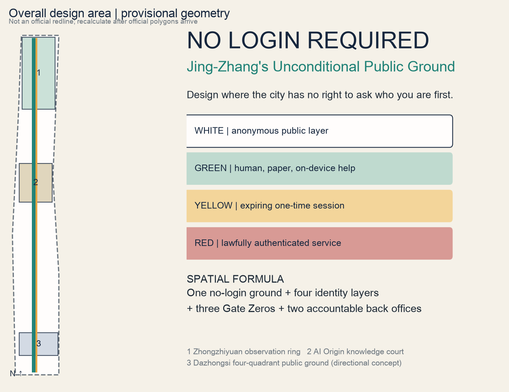
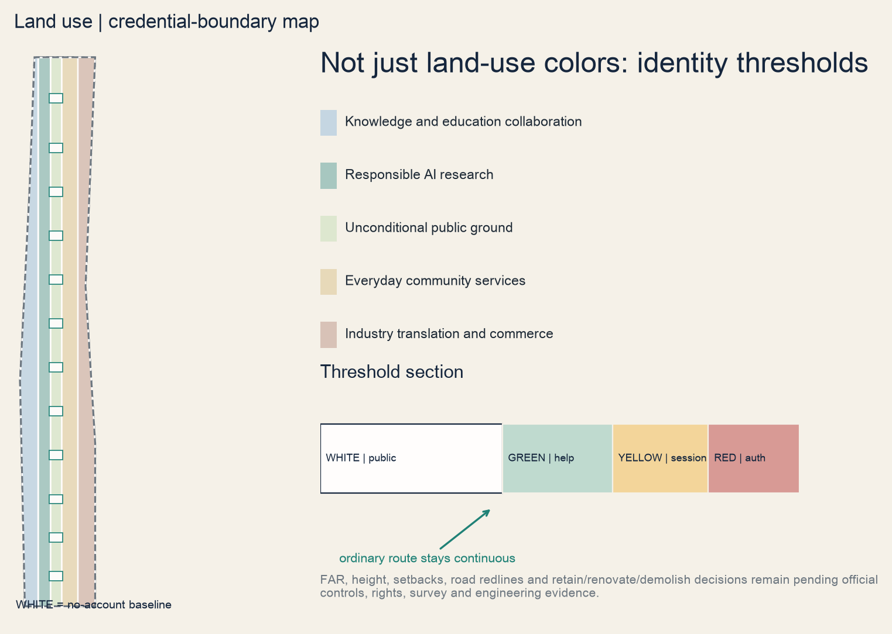
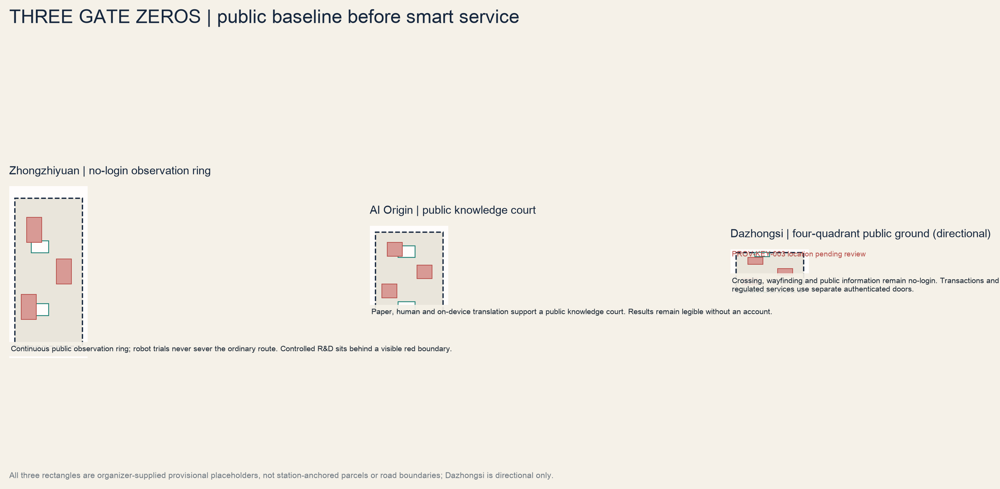
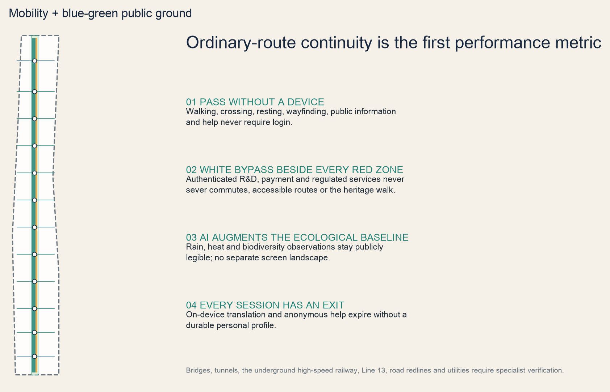
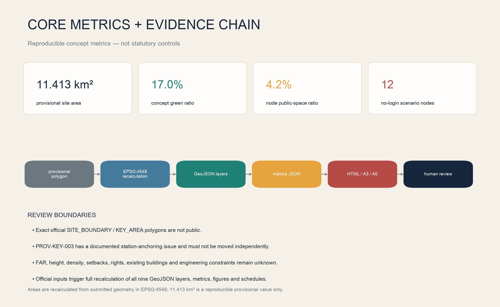

# NO LOGIN REQUIRED: Jing-Zhang's Unconditional Public Ground

> Spatial formula: one no-login ground + a four-level identity section + three Gates Zero + two responsibility back offices. Every red authenticated zone has a direct white public bypass.

## Design Basis and Source List

This proposal takes the official open-call announcement, the agent taskbook, and the repository site package as its task basis while separating official facts, provisional geometry, background precedents, and conceptual design. The announcement defines a 43.6-square-kilometre Coordinated Research Area, an approximately 11.4-square-kilometre Overall Design Area, and three Key-Area Detailed Design Areas totalling 368.4 hectares. The site and key-area shapes currently supplied in the repository are provisional, rough geometries. They may support submission generation, discussion, and structured recalculation, but they are not an Official Planning Boundary, cadastral record, statutory Regulatory Detailed Planning control, or engineering survey.[source:OFFICIAL-ANNOUNCEMENT] [source:SITE-PACKAGE] All spatial moves in this report are therefore Conceptual Recommendations. FAR, Building Height, Building Coverage Ratio, setbacks, road lines, municipal capacity, fire safety, heritage controls, and implementation responsibilities remain pending official data and professional review.

The evidence method is a short chain from source to judgment, layer, metric, and risk. `sources.json` registers the public task material and seven first-party international cases; GeoJSON records conceptual spatial objects; `metrics.json` stores reproducible calculations; and the three matrices audit task coverage, standards, and design depth. The prose keeps only claim-adjacent evidence anchors. Official material on the Jing-Zhang Railway Heritage Park and Qinghuayuan Station informs historical context but does not establish an unissued conservation boundary or construction entitlement.[source:BJ-HERITAGE-PARK] [source:BJ-QINGHUAYUAN-PROTECTION] Figures are to be derived from the submission's geometry and metrics. No peer language, case-study image, corporate trademark, or third-party map is reused.

“No login required” is a public-baseline promise to any ordinary passer-by, not an absolute rule for every urban activity. Identity infrastructure has four visible levels. White is anonymous public space for walking, accessibility, basic wayfinding, rest, public information, and basic participation. Green is human, paper, or on-device help without a durable profile. Yellow is an explicitly accepted one-time session that expires automatically. Red is lawful authentication for payment, controlled research, medical, legal, or other regulated services. Materials, signs, interfaces, and staff must make the levels legible, and every red zone must have a white route that is not materially longer or inferior.[standard:PROJECT-AGENT-OPEN-CALL-TASKBOOK] [depth:risk_missing_data]

## Three-Level Scope Framework

The same public promise is implemented at three scales. The 43.6-square-kilometre Coordinated Research Area examines how the Three Zones and Two Wings connect universities, institutes, enterprises, communities, ecology, and public governance into a durable AI Innovation Ecosystem. It produces industry coordination, precedent translation, activity systems, and governance rules rather than unsupported statutory land controls. The approximately 11.4-square-kilometre Overall Design Area lays down one continuous no-login ground through the Jing-Zhang Railway Heritage Park and connected streets. Any passer-by can obtain walking, cycling, information, and rest without presenting identity credentials. The key areas—192.1 hectares at Zhongzhiyuan, 104.3 hectares at Beijing AI Origin Community, and 72.0 hectares at Dazhongsi—become a No-Login Observation Ring, a Public Knowledge Court, and a Four-Quadrant Public Ground, each marked by a Gate Zero.[source:AGENT-TASKBOOK] [metric:key_area_count]

These are not three independent schemes. The research scale establishes that public rights must not shrink when a person withholds credentials. The overall scale translates this rule into one no-login ground, a four-level identity section, the Three Zones and Two Wings, and a continuous blue-green Walking and Cycling Network. The key-area scale draws white, green, yellow, and red into plan and section. Every node must show where the white route goes and whether it detours; who provides green help; when a yellow session expires; why red authentication is legally necessary; what data is cleared at exit; and who audits the result. When official polygons replace provisional ones, land use, green space, public space, roads, buildings, and phasing must be clipped again; areas, ratios, and intersections must be recalculated; and drawings and HTML must be updated.[data:geometry/land_use.geojson#LU-001] [depth:three_level_scope_framework]

`PROV-KEY-003` is an area-and-order placeholder rather than a station-anchored Dazhongsi polygon. Its relationship to Dazhongsi Station is materially uncertain and has been raised in repository Issue #1029. The Four-Quadrant Public Ground therefore expresses directional station-city logic only. It does not determine an underground connection, junction engineering, or development quantity.[source:ISSUE-1029] [data:geometry/key_areas.geojson#PROV-KEY-003] Once station entrances, road lines, rail protection, ownership, and survey data are available, the area must be re-anchored and every dependent layer and project recalculated. Until then it may support content review, not precision-dependent Formal Professional Scoring.

## Coordinated Research Area: Industry and Future City Research

The concept name is “NO LOGIN REQUIRED: Jing-Zhang's Unconditional Public Ground.” Its mark is an unbroken white ground line passing through green, yellow, and red identity thresholds; every red block is visibly bypassed by the white line. The mark states that lawful authentication may exist without severing the public city. White denotes anonymity, green human or paper assistance, yellow an expiring session, and red legal authentication, all on a civic navy field. Generic railway ideas—track, switch, and signal—are translated into continuity, choice, and visible risk. This connects an engineering heritage to present-day public control without inventing historic events or claiming an official brand licence.[source:BJ-HERITAGE-PARK] [standard:MOHURD-URBAN-DESIGN-MEASURES]

The Three Zones and Two Wings allocate the cost of identity. Zhongzhiyuan uses a No-Login Observation Ring to place public observation next to controlled full-stack testing. AI Origin uses a Public Knowledge Court so explanation, printed material, human help, and temporary tools come before an institutional account. Dazhongsi uses a Four-Quadrant Public Ground to protect anonymous movement in every direction. The Zhongguancun Technology Services Wing is a responsibility back office for intellectual property, law, computing, certification, and enterprise services; institutions, not passers-by, carry compliance. The Xiaoyue River Scenario Enablement Wing tests no-account daily services, maintenance, and aggregated community feedback. The zones provide spatial samples, the wings carry professional responsibility, and the public ground permits people simply to pass.[source:AGENT-TASKBOOK] [depth:overall_spatial_structure]

Seven first-party global cases contribute mechanisms, not copied forms. Helsinki's AI Register suggests public disclosure of purpose, data, and feedback. Amsterdam's Tada values stress inclusion, personal control, human scale, and the principle that data is not the final decision. Singapore's Punggol Digital District shows a shared digital platform connecting industry, education, and operations. Barcelona's Decidim demonstrates open-source participation infrastructure and deliberative rules. MIT Kendall Square demonstrates research, enterprise, housing, and open-space mix. The Montréal Declaration emphasises autonomy, inclusion, and final human responsibility. Smart Kalasatama demonstrates small experiments co-produced by residents, firms, government, and researchers.[source:CASE-HELSINKI-AI-REGISTER] [source:CASE-AMSTERDAM-TADA] [source:CASE-PUNGGOL-ODP]

Their local translation is to register each public AI use, provide a non-digital entry by default, test at a small and stoppable scale, retain human responsibility, mix public and research space while clarifying permissions, and keep feedback minimal, aggregated, and time-limited. Barcelona, Kendall Square, Montréal, and Kalasatama support the four operating modules of deliberation, encounter, accountability, and stop-capable testing.[source:CASE-BARCELONA-DECIDIM] [source:CASE-KENDALL-SQUARE] [source:CASE-MONTREAL-RESPONSIBLE-AI] These precedents are Background Only, not Beijing planning controls or legal standards.[source:CASE-KALASATAMA-LIVING-LAB]

## Overall Design Area: Urban Renewal and Regulatory-Plan-Level Urban Design

The spatial formula is one no-login ground, a four-level identity section, three Gates Zero, and two responsibility back offices. The Heritage Park and parallel streets form the continuous white layer, crossed by east-west school, work, and community routes. White supplies movement, direction, rest, drinking water, toilets, and basic information without scanning. Green supplies staff, paper, and local-device assistance. Yellow processes a clearly accepted task and expires at a marked data-clear point. Red enters laboratories, payment, enterprise systems, or professional advice and must display the reason for authentication, retention period, human responsibility, and direct white bypass.[data:geometry/roads.geojson#ROAD-001] [depth:overall_spatial_structure]

Renewal follows “lay the no-login ground, repair identity thresholds, then add controlled capacity.” Early work repairs walking, cycling, accessibility, station links, and basic public information, adds human desks and printed maps, and marks where yellow sessions are cleared. Medium-term work adapts underused ground floors, campus edges, and under-bridge spaces after survey and ownership review. New research, housing, or service floor area waits for statutory planning and infrastructure capacity. The conceptual land-use plan expresses relationships among public green, innovation mix, community service, and transport. Building footprints are types, not demolition decisions.[data:geometry/buildings.geojson#BLDG-001] [standard:MOHURD-CONTROL-DETAILED-PLANNING]

The transport and infrastructure rule is that testing cannot occupy the ordinary path. Robots, automated delivery, and sensing trials operate only within marked time and space, with physical stop lines, a named supervisor, and a continuous bypass. Wi-Fi, edge computing, digital signs, and energy systems retain offline information and failure modes. Drainage, power, communications, fire, sanitation, and waste data remain incomplete, so equipment locations are logical concepts rather than capacity or specification commitments.[depth:municipal_new_infrastructure] [data:geometry/constraints.geojson]

The proposal does not fabricate FAR, height, or BCR. Without official controls, these remain `unknown` or `pending_control`; only areas, ratios, counts, and connectivity inside the provisional boundary are computed. Review should first inspect the credential boundary map for white continuity and direct red-zone bypasses, then inspect the identity-threshold section for green and yellow responsibility and exit clearing. Development intensity follows only after official geometry and existing-condition data arrive.[metric:site_area_sqm] [depth:development_intensity_controls]

## Detailed Design of Key Areas

Zhongzhiyuan AI Independent Innovation Acceleration Area becomes a “No-Login Observation Ring” with “ZHONGZHI GATE ZERO.” A continuous white route loops along the edge of controlled testing. Any ordinary passer-by may observe public displays, rest, and obtain basic direction without entering a research account system. Green human explanation and yellow temporary demonstrations precede red model testing, robot validation, standards work, and controlled computing. Public interpretation and test pockets are separated from research logistics. If a robot enters shared space, time, speed, stop triggers, and a named on-site person are mandatory; the white accessible route cannot be blocked or lengthened.[data:geometry/key_areas.geojson#PROV-KEY-001] [depth:three_key_area_detailed_design]

Beijing AI Origin Community becomes a “Public Knowledge Court” with “ORIGIN GATE ZERO.” It is a network of open courts, ground-floor counters, and corners along university–campus–community links. An open-source clinic, research explanation, printed material, human questions, and on-device temporary translation sit together. A passer-by may read, ask, and leave. Only code submission, equipment booking, or personal and enterprise services cross into a red institutional system. Yellow sandboxes erase sessions at marked exit points; green service does not require a personal phone. Professional operators manage the boundary between living and research.[data:geometry/key_areas.geojson#PROV-KEY-002] [source:AGENT-TASKBOOK]

Dazhongsi AI Industry Cluster becomes a “Four-Quadrant Public Ground” with “DAZHONGSI GATE ZERO.” White anonymous paths connect all directions before a person chooses a terminal demonstration, enterprise display, transaction, or international event. Ground markings show walking time, service status, and identity level. Payment, access control, and enterprise data remain in red operator systems, which the white route bypasses without material detour. Because `PROV-KEY-003` is not yet station-anchored, quadrant geometry, connections, underground space, and development quantities are directional only and must be redrawn after Issue #1029 is resolved.[source:ISSUE-1029] [data:geometry/key_areas.geojson#PROV-KEY-003]

The three Gates Zero create a pilgrimage route about identity infrastructure rather than spectacle. Zhongzhi shows how a public ring sees a test boundary; Origin shows how knowledge precedes an account; Dazhongsi shows how white paths remain continuous around red zones. Each displays a credential boundary map, four-level section, exit data-clear point, and responsibility statement. It may recognise licensed public contributions and repairs, but not unauthorised rankings, faces, or corporate marks. Retain, Renovate, and Demolish decisions remain subject to survey, structural safety, ownership, heritage, and statutory planning.[depth:retain_renovate_demolish] [standard:MOHURD-URBAN-DESIGN-MEASURES]

## AI Innovation Ecosystem, Personas, and AI+ Scenarios

Six personas begin with one test: can an ordinary passer-by continue without surrendering a credential? A researcher or start-up engineer needs computing, testing, intellectual-property help, and peers, but the red laboratory boundary cannot expand onto public ground. A caregiver with a child needs predictable accessible movement and untracked rest. An older visitor without a smartphone needs print, seating, and a person to ask. A visually impaired commuter needs tactile, audible, and consistent white-route language, protected from robot obstruction. A service or maintenance worker needs offline work orders, emergency stops, and handover without a personal phone. An international visitor or new resident needs multilingual explanation and city services without a durable profile.[source:AGENT-TASKBOOK] [depth:traffic_rail_slow_parking]

Each scenario card identifies place, user, identity level, data minimum, Human Review, operator, and exit trigger. Cards 08, 11, and 12 are industry Testing and Validation Scenarios:

| Card | Scenario and place | Identity levels, data, and governance |
| --- | --- | --- |
| 01 | Tactile and printed bilingual wayfinding / all nodes | White offers tactile and paper maps; yellow offers on-device routing. Only the current origin and destination are processed. Facilities staff review; device failure returns to print. |
| 02 | No-login heritage walk / Heritage Park | White uses plaques and a booklet; yellow uses local-device narration. Only aggregated device health is retained. A heritage editor reviews uncertain content.[source:BJ-HERITAGE-PARK] |
| 03 | Human-backed AI information desk / Gates Zero | Green staff search and print; yellow retrieves public services. Query text is deleted at exit. A supervisor refers professional questions to red institutions. |
| 04 | No-account co-learning / Public Knowledge Court | Yellow provides an expiring sandbox; white and green provide books, boards, and peers. No learning profile is made. Operators add safeguarding for minors. |
| 05 | Public model-status board / Observation Ring | Yellow displays version, purpose, limits, and outages; white supplies print. Governance staff review public registry data; unknown status pauses the display.[source:CASE-HELSINKI-AI-REGISTER] |
| 06 | Anonymous health navigation / community service | Yellow directs people only to lawful providers; white and green provide directories and human referral. No diagnosis or record is created; emergencies go directly to emergency care. |
| 07 | Profile-free commerce discovery / Dazhongsi direction | Yellow lists nearby services for current criteria; white uses a classified map. Cross-session recommendation is prohibited. Transactions occur in the merchant's red system. |
| 08 | Robot-test bypass — industry validation / Zhongzhiyuan | Red testing has physical bounds, speed limits, and logs; the white accessible path is not narrowed or lengthened. Tester and safety officer co-review; intrusion or emergency stop ends the trial. |
| 09 | Face-free event entry / public event nodes | Yellow may use a one-time ticket; white uses paper and staffed lists. Faces are not collected unless legally necessary. System failure switches to human entry. |
| 10 | Paper and physical-token participation / Xiaoyue River Wing | Yellow accepts an anonymous response; white accepts paper or tokens. Only aggregates are published. Disputed issues move to an in-person meeting.[source:CASE-BARCELONA-DECIDIM] |
| 11 | On-device temporary translation — industry validation / Knowledge Court | Yellow processes locally and states uncertainty; white and green provide print or people. Audio and text clear at exit; low confidence transfers to a language professional. |
| 12 | Profile-free terminal and service evaluation — industry validation / Dazhongsi direction | Yellow lets visitors use a temporary mode; white allows observation or staff demonstration. No marketing profile is made. Coercive consent or excess collection ends the trial. |

AI presence is not the success criterion. Quality of the white route, data minimum, human responsibility, and ability to stop are the common gate. A public register states schedule, operator, data type, complaint route, and last review. Stopping a test cannot close public space. Medical, legal, payment, access, and research data remain subject to professional law and institutional authority; the no-login promise does not cross those red boundaries.[source:CASE-MONTREAL-RESPONSIBLE-AI] [depth:risk_missing_data]

## Land Use, Building Scale, and Retain-Renovate-Demolish Strategy

The conceptual Land-Use Layout uses continuous public green and the Walking and Cycling Network as its armature, locating innovation mix, community service, cultural interpretation, and essential transport at accessible nodes. Innovation mix does not mean a permanently open laboratory: public ground floors, shared courts, and controlled research are vertically and horizontally separated. Community services sit on the white path, with a physical or human alternative to each digital service. Green space serves ecology, rest, heritage interpretation, and low-risk display; commercial events cannot displace basic movement. Polygons must cover the provisional site without overlap, and ratios are recalculated from geometry rather than prose.[data:geometry/land_use.geojson#LU-001] [standard:MNR-LAND-USE-CLASSIFICATION-GUIDE]

The building strategy is “retain first, adapt lightly, postpone increments.” Without complete building age, structure, ownership, and protection inventories, no named building receives a demolition judgment. Six auditable prototypes are used: Gate Zero, adaptive research, community service, talent life, logistics, and controlled test. Later survey matches prototypes building by building and assesses safety, heritage, ground continuity, and energy before retain, repair, adapt, or replace decisions. Gates Zero sit on the white ground; red authenticated rooms retreat to courts or upper floors; logistics and test entrances cannot sever the white route.[data:geometry/buildings.geojson#BLDG-001] [depth:retain_renovate_demolish]

Only the conceptual Building Footprint is reported as a recalculable quantity; it is neither an existing nor approved gross floor area. FAR, Building Height, BCR, statutory green ratio, building lines, and setbacks remain pending official Regulatory Detailed Planning. Any massing shown on a board must say “concept prototype, not approval drawing.” The character recommendation is restrained, durable, and maintainable, retaining an industrial railway scale and pragmatic Zhongguancun research expression. Identity comes from public rules and legible thresholds, not exaggerated objects.[metric:building_footprint_area_sqm] [depth:height_massing_character]

Every public ground floor requires hours, no-account service, maintenance duty, and a night boundary. Every controlled research unit requires an authentication reason, hazard class, logistics, and emergency provision. Mixed use does not mean mixed permissions. Formal development will replace prototypes with cadastral, survey, safety, heritage, fire, daylight, transport, and municipal evidence and receive professional review.[source:KEY-AREA-SOURCE] [depth:development_intensity_controls]

## Transport, Rail, Municipal Infrastructure, and Public Services

“Arrive as usual” is a continuity measure, not a smartphone service. The north-south no-login ground and east-west community links form a Walking and Cycling Network. At stations, campus gates, bridges, and junctions, a credential boundary map identifies white, green, yellow, and red. White includes physical wayfinding, light, shade, seats, and water. Green and yellow may supply people, real-time routing, or temporary translation but must show data purpose and the exit-clear point. Road geometry expresses conceptual centrelines and walking relations only; road boundaries, junction design, signals, parking, and rail protection require authority and consultant confirmation.[data:geometry/roads.geojson#ROAD-001] [depth:traffic_rail_slow_parking]

Transit-Station Integration considers the complete path from vehicle to street and from street to public ground. Existing relations at Wudaokou, Qinghuadongluxikou, and Dazhongsi support strategic discussion only. No underground connection is promised without entrances and construction evidence. Cycle parking stays outside tactile paths; ride-hail and delivery use controlled stops; robot trials are separated through colour, touch, and physical barriers. `PROV-KEY-003` must be re-anchored before the Dazhongsi quadrant proceeds to engineering.[source:ISSUE-1029] [data:geometry/key_areas.geojson#PROV-KEY-003]

Municipal and New Infrastructure follow failure-degradation and institutional responsibility. Edge computing, displays, sensing, and communications are stoppable modules within existing facilities. When networks fail, static signs and human service return. A personal phone cannot substitute for staff equipment or emergency communication. Data-centre, transformer, energy, drainage, water, waste, and emergency capacity remain unknown; the concept reserves interfaces but makes no capacity commitment.[data:geometry/constraints.geojson] [depth:municipal_new_infrastructure]

Public services support existing residents and innovation workers: childcare, health referral, culture, learning, legal and IP advice, talent service, repair, and community deliberation. Basic inquiry may be anonymous. Personal rights, transactions, or professional conclusions cross a clearly marked red threshold with an appeal to a person. The Zhongguancun Wing carries the professional back office and the Xiaoyue River Wing tests daily usability.[source:AGENT-TASKBOOK] [depth:municipal_new_infrastructure]

## Blue-Green Network, Public Space, and Urban Character

The Jing-Zhang Railway Heritage Park is treated as continuous white no-login ground, not an equipment showroom. Ecology, movement, rest, and historical understanding are primary; AI display is a bypassable and stoppable addition. The Qinghe and Xiaoyue rivers and connected green spaces form east-west ecological relations with stormwater, shade, play, exercise, and quiet uses. Official river lines, flood criteria, and ecological controls remain pending. Conceptual green and public-space ratios are recalculable but are not statutory green ratios or park boundaries.[source:BJ-PARK-ECOLOGY] [data:geometry/green_space.geojson#GREEN-001]

Public Space uses a common four-level identity language. White identifies anonymous public ground; green identifies human, paper, or on-device help; yellow identifies an automatically expiring session; red identifies lawful authentication. A red entrance states reason, data, responsibility, and exit, while the direct white bypass remains visible on the credential boundary map. Every digital node has a directly understandable physical facility. Failure or dispute closes yellow and red before it closes white.[data:geometry/public_space.geojson#PUBLIC-001] [metric:public_space_ratio]

The three Gates Zero make governance visible as urban character. Zhongzhi shows white passing a red test boundary in the Observation Ring. Origin places white reading, green human help, and yellow devices together in the Knowledge Court. Dazhongsi shows four white directions bypassing red services without detour. Each marks a data-clear point and connects a contribution wall, annual responsibility report, and public issue record. Names, images, and contributions require permission.[source:AGENT-TASKBOOK] [depth:blue_green_public_space]

The cultural narrative uses generic railway terms: track is public continuity, switch is choice, signal is visible data and risk, and timetable is predictable service. It connects independent engineering capacity to accountable AI without presenting a conceptual landmark as approved construction or copying historic images. Architecture remains restrained and maintainable, with roofs and massing subject to planning and heritage review. Public art should be procured through open calls and clear rights agreements.[source:BJ-QINGHUAYUAN-PROTECTION] [standard:MOHURD-URBAN-DESIGN-MEASURES]

## Renewal Projects, Implementation Policy, and Phasing

Projects fall into three phases. “No-login ground, years 0–2” includes JZ-01 continuous white signs and printed maps, JZ-02 accessibility and detour audit, JZ-03 three lightweight Gates Zero, JZ-04 identity-boundary and public-AI registers, and JZ-05 a small robot-bypass trial. “Identity-threshold repair, years 3–5” includes JZ-06 Public Knowledge Court, JZ-07 No-Login Observation Ring, JZ-08 Xiaoyue River participation points, and JZ-09 Zhongguancun responsibility services. “Station-city and increments under formal conditions, year 5+” includes JZ-10 Dazhongsi Four-Quadrant Public Ground after re-anchoring, JZ-11 planning-approved mixed increments, and JZ-12 blue-green and municipal completion.[data:geometry/phasing.geojson#PHASE-001] [depth:renewal_project_list]

Dependencies, not publicity dates, control sequence. Lightweight work still needs accessibility, fire, transport, operations, and rights review. Building adaptation needs ownership, structure, and permission. Long-term construction requires official boundaries, planning, station, infrastructure, and funding. A cross-agency ledger should state each project's white route, identity levels, responsible entity, data list, complaint route, pause condition, and annual review. If an operator cannot maintain human alternatives or a direct bypass, the smart service is reduced first.[depth:phasing_implementation] [source:OFFICIAL-ANNOUNCEMENT]

The proposed annual programme, “Jing-Zhang No-Login Week,” combines Gate Zero open days, an on-device clinic, public model-status classes, paper co-design, accessibility walks, international case dialogues, and a developer contribution night. It has no mandatory app: on-site, phone, paper, and web options are equivalent, with some walk-in events. Honours recognise verifiable public repairs with consent, not personal behaviour scores. Developers explain technology, community groups review inclusion, professionals review high risk, and operators publish annual problems and changes.[source:CASE-KALASATAMA-LIVING-LAB] [source:CASE-BARCELONA-DECIDIM]

Investment, policy, funding, and government roles are Conceptual Recommendations, not commitments. Performance prioritises white-route availability, no-account task completion, human response, successful data clearing, accessible continuity, compliant stopping, public understanding, and quality of industry validation rather than account count or data volume. Boundary changes trigger versioned recalculation rather than concealed differences.[metric:ai_scenario_node_count] [depth:phasing_implementation]

## Metrics, Area Recalculation, and Compliance Matrix

Metrics have three groups. Recalculable spatial metrics include provisional site area, key-area count and placeholder areas, green and public-space areas and ratios, conceptual Building Footprint, road length, scenario-node count, and phase area. Pending statutory or engineering metrics include FAR, Building Height, BCR, setbacks, road boundaries, parking, municipal capacity, fire, and flood controls. Operational metrics include white-route availability, no-account completion, human response, residual-data checks, accessibility interruptions, trial pauses, public comprehension, and industry-validation quality.[depth:metrics_recalculation] [metric:site_area_sqm]

The provisional site recalculates to approximately 11,412,825.386 square metres, consistent with the announcement's approximate 11.4-square-kilometre scale. Decimal places describe computation, not boundary accuracy.[metric:site_area_sqm] Green ratio divides `green_space` area by site area; public-space ratio divides `public_space` by site area; conceptual Building Footprint sums building polygons. GeoJSON, metrics, drawings, and HTML must agree.[metric:green_ratio] [metric:public_space_ratio] Green and public spaces can overlap functionally and cannot simply be added as an open-space rate or called statutory control.

Four auditable operational measures are added. “Ordinary-path continuity” checks a same-quality bypass at each credential boundary. “No-account task completion” uses anonymous field sampling for basic information, direction, and participation. “Authorisation comprehension” asks different personas to restate data and exit rules. “Stop without closing public space” tests whether white remains usable when enhancements stop. Baselines will be established during pilots; no target is invented now. Collection is minimal, aggregated, time-limited, and reviewed by people.

The Compliance Matrix maps announcement clauses 1.3, 1.4, and 1.5 and agent tasks 1–6 to the 13 sections, nine geometry classes, core metrics, five bilingual figures, A3/A0 outputs, and offline HTML. The standards matrix separates project tasks, urban-design measures, regulatory depth, and land classification. The depth matrix marks land use, intensity, character, DRR, transport, municipal, blue-green, key areas, projects, phasing, recalculation, and risk as complete, conceptual, or data gap. Automated checks do not equal approval; Review-Ready status needs recalculation, bilingual equivalence, and professional human review.[standard:MOHURD-URBAN-DESIGN-MEASURES] [depth:metrics_recalculation]

## Risk, Copyright, and Compliance

The first risk is geometric accuracy. The site and all key areas are provisional, and `PROV-KEY-003` is not reliably tied to Dazhongsi Station. Derived areas, roads, Gates Zero, projects, and drawings are directional. When official boundary, survey, cadastre, Regulatory Detailed Planning, road, station, rail-protection, municipal, fire, flood, heritage, public-service, and implementation data arrive, the package must be clipped, recalculated, redrawn, and version-compared.[source:BOUNDARY-SOURCE] [source:ISSUE-1029] [depth:risk_missing_data]

The second risk is misreading “no login.” It covers public ground, basic movement, basic wayfinding and information, low-risk experience, and a basic participation channel. It does not cover research access, payment, personal government services, diagnosis, legal opinions, dangerous equipment, or regulated transactions. Qualified institutions and people remain responsible for high-risk outputs. An Urban Agent cannot replace approval, diagnosis, legal judgment, or safety duty. Dark patterns, default consent, or hiding the white path are prohibited; leaving must be as easy as entering.[source:CASE-AMSTERDAM-TADA] [source:CASE-MONTREAL-RESPONSIBLE-AI]

The third risk is the gap between privacy promises and operations. Scenarios apply minimisation, purpose limitation, short retention, public registration, Human Review, and stoppability. White cannot fail because a network, device, or budget fails. Robots, translation, and terminal testing require safety and accessibility checks, a named operator, and a complaint route. A node that cannot demonstrate real no-account service cannot use the brand.

Text and graphics are original to this submission. External cases are factual summaries and mechanism comparisons; their images, layouts, logos, maps, and peer material are not copied. Beijing history and policy use public authority pages; fonts, software, charts, and PDF construction are registered in `report/copyright_statement.md`. `COMMUNITY-DISPLAY-ONLY` does not imply that third-party material can be sublicensed. Chinese and English keep sections, numbers, evidence anchors, and figure positions aligned. The submitter remains responsible for AI-generated content. No Gate Zero, event, investment, policy, or programme is represented as government approval or implementation commitment.[source:SOURCE-REGISTRY] [standard:PROJECT-OFFICIAL-ANNOUNCEMENT]

## References

This section lists only sources that materially shaped the proposal. `sources.json` retains complete URLs, publishers, retrieval dates, rights status, allowed use, and limitations. The announcement and taskbook support scope and mandatory tasks; the site package supports provisional geometry and recalculation; Beijing authority pages support heritage and ecological context; and the seven international cases support comparison of transparency, inclusion, platform coordination, participation, mixed innovation, human responsibility, and small trials. The cases do not support local statutory controls, and no image, map, layout, or identity mark has been copied. Issue #1029 records a geometry risk and is not a replacement boundary source. When formal material changes, publisher and version must be checked, the machine index updated, and every affected claim, layer, and metric recalculated.

1. Beijing Municipal Commission of Planning and Natural Resources, Haidian Branch, official prequalification announcement for the Centennial Jing-Zhang AI Innovation Belt, 2026; task scope and deliverables.[source:OFFICIAL-ANNOUNCEMENT]
2. Agent Open-Call Taskbook for the Centennial Jing-Zhang AI Innovation Belt; three positions, five functions, Three Zones and Two Wings, and six agent tasks.[source:AGENT-TASKBOOK]
3. Repository site package, provisional boundaries, key-area placeholders, and Source Registry; used only within their stated status.[source:SITE-PACKAGE] [source:SOURCE-REGISTRY]
4. Beijing heritage and landscape authorities' public materials on the Heritage Park, Qinghuayuan Station, and park construction; historical and ecological context.[source:BJ-HERITAGE-PARK] [source:BJ-PARK-ECOLOGY]
5. City of Helsinki, *AI Register*; public algorithm transparency and feedback.[source:CASE-HELSINKI-AI-REGISTER]
6. City of Amsterdam, *Tada — Clear About Data*; inclusion, control, human scale, and accountability.[source:CASE-AMSTERDAM-TADA]
7. JTC Singapore, *Punggol Digital District Open Digital Platform*; shared district infrastructure.[source:CASE-PUNGGOL-ODP]
8. Barcelona City Council, *Decidim / Citizen Participation Guide*; open-source participation and deliberative procedure.[source:CASE-BARCELONA-DECIDIM]
9. MIT, *Kendall Square Initiative*; a mixed research, enterprise, and public-space ecosystem.[source:CASE-KENDALL-SQUARE]
10. Université de Montréal partners, *Montréal Declaration for Responsible AI*; autonomy, inclusion, and human responsibility.[source:CASE-MONTREAL-RESPONSIBLE-AI]
11. Forum Virium Helsinki, *Smart Kalasatama Final Report*; resident, company, government, and research experimentation.[source:CASE-KALASATAMA-LIVING-LAB]
12. GitHub Issue #1029; the `PROV-KEY-003` Dazhongsi placeholder and station relationship require review.[source:ISSUE-1029]
