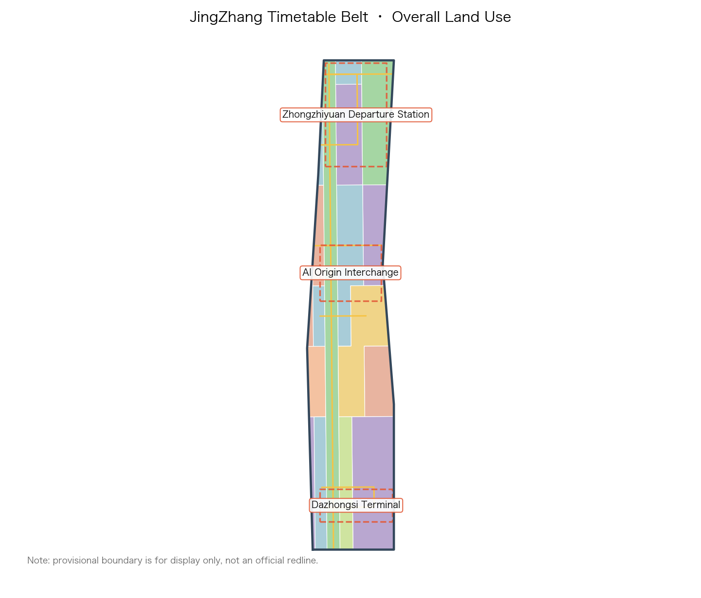
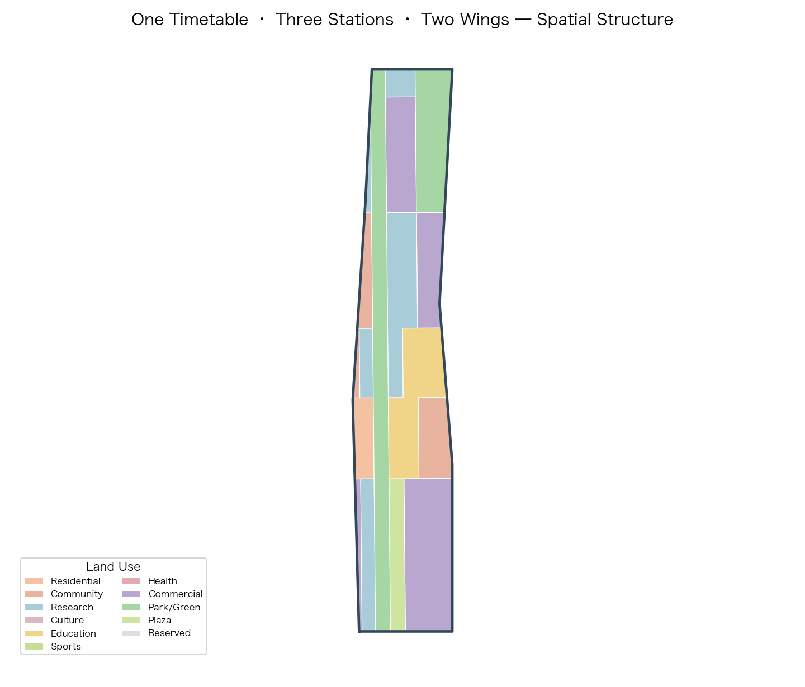
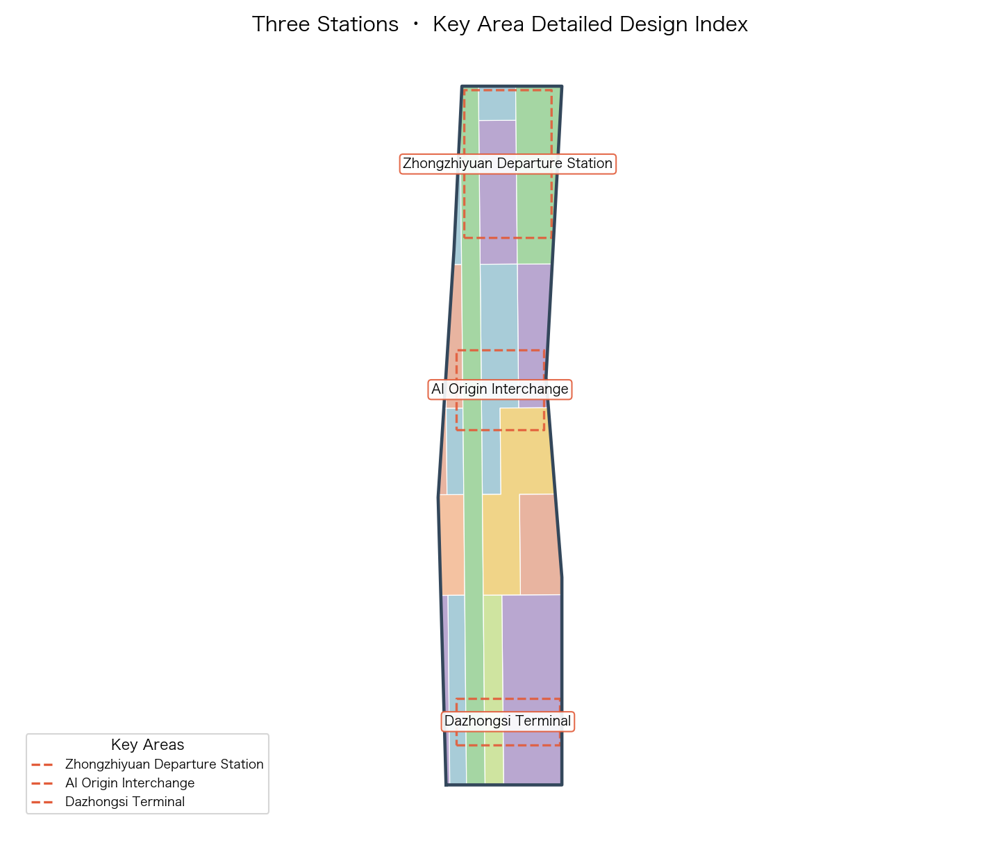
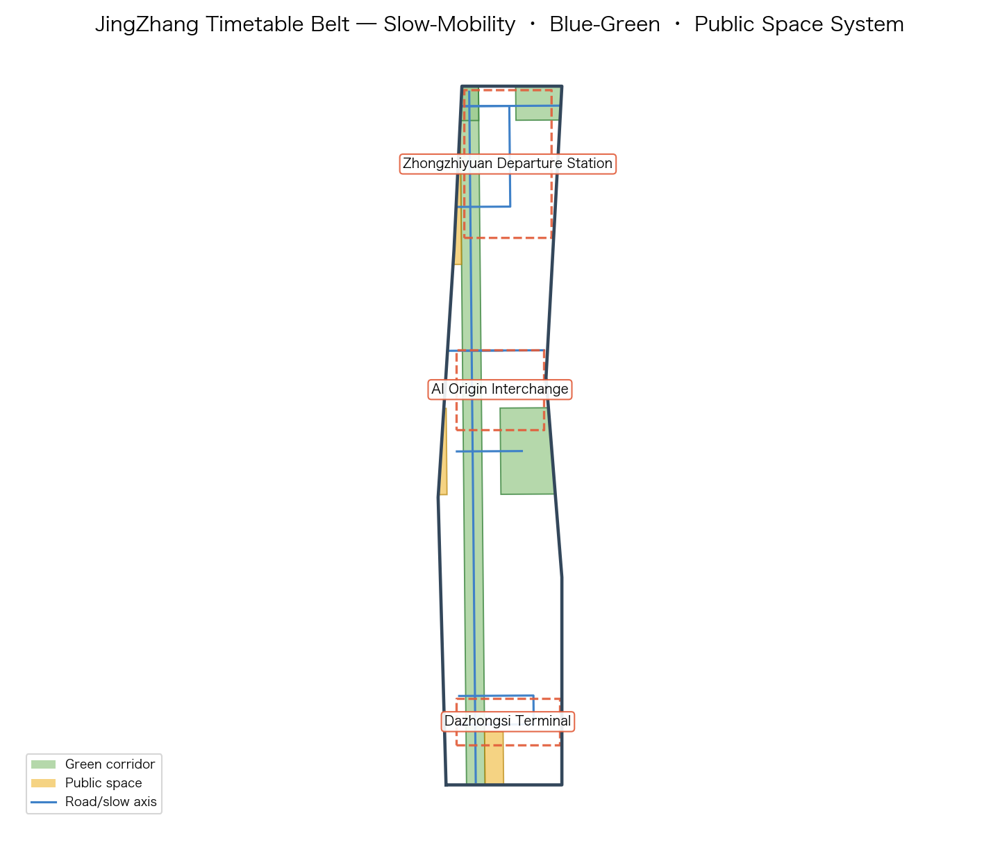
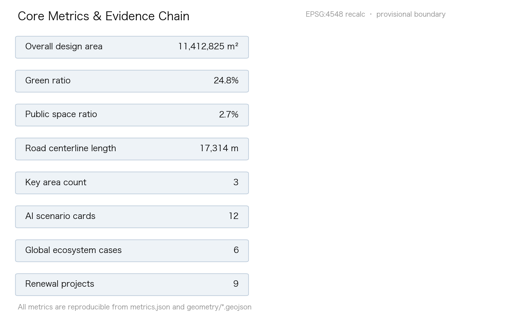

# JingZhang Timetable: Making the AI City a Public Timetable That Is Queryable, Transferable, and Reversible

## Design Basis and Source List

This proposal takes the Announcement for the International Design Competition for the Centennial Jing-Zhang AI Innovation Belt (published by the Haidian Sub-bureau of the Beijing Municipal Commission of Planning and Natural Resources) as its primary basis, and the agent-facing co-creation taskbook as its task organization basis [source:OFFICIAL-ANNOUNCEMENT] [source:AGENT-TASKBOOK] [depth:existing_conditions_diagnosis]. Every requirement in sections 1.3, 1.4, and 1.5 of the announcement and in agent.1 through agent.6 of the taskbook is decomposed into traceable sources, recomputable metrics, reviewable layers, and human-reviewable assumptions. The complete index is kept in `sources.json`, `compliance_matrix.json`, `standard_matrix.json`, and `design_depth_matrix.json`; the narrative itself carries only a small number of directly relevant evidence markers next to the judgments they support [source:SITE-PACKAGE].

The work is grounded in public and cleared materials and follows the usage boundaries registered in `data/source_registry.json`: the announcement, the taskbook, and the site package may be used for formal generation, while the maintainer-provided provisional boundary may only support generation, display, and discussion and must not be treated as an official redline or precise-area basis [source:SOURCE-REGISTRY] [source:PROCESSED-FACT-PACK]. Spatially the proposal uses the provisional polygons in `brief/site-package/geometry/provisional_boundaries.geojson` [source:BOUNDARY-SOURCE] [source:KEY-AREA-SOURCE]; the provisional label is kept in the narrative, layers, metrics, assumptions, and visualization, and the full chain will be recalculated once official polygons are released.

The motif is grounded in the most valuable public inheritance of the Jing-Zhang Railway — China's first self-built main railway line — which is not the rails themselves but the timetable: it turned long-distance travel from an unpredictable act into a public promise that is queryable, punctual, and reversible. This proposal translates that inheritance into an AI-era urban design motif: turning the AI innovation belt into a **public timetable that is queryable, transferable, and reversible**. All spatial conclusions are worded as conceptual suggestions, reference schemes, or material for professional teams to deepen; they do not replace statutory planning and do not constitute government approval [standard:PROJECT-OFFICIAL-ANNOUNCEMENT] [standard:PROJECT-AGENT-OPEN-CALL-TASKBOOK].

## Three-Level Scope Framework

Following section 1.4 of the announcement, the project advances on three levels: the coordinated research area (about 43.6 km²), the overall design area (about 11.4 km²), and the key detailed-design area (about 368.4 ha in total) [depth:three_level_scope_framework]. The three levels are not three parallel drawings but a work chain that converges progressively from industrial strategy to spatial form and then to implementation detail: the research level decides why and what, the overall level decides where and how it grows, and the key-area level decides what to build and how to manage it.

- **Coordinated research area**: using the "three areas, two wings" framework, it positions Haidian's AI industry within a world-class innovation ecosystem and proposes the overall concept, naming system, ecosystem map, and future-city directions. The official approximate area of 43.6 km² is an authoritative fact [metric:coordinated_research_area_sqm].
- **Overall design area**: as urban design for the 1–2 km zone around the Jing-Zhang Heritage Park, it produces the land-use structure, renewal framework, transport and municipal strategy, and urban character, reaching regulatory-plan-level urban design depth. The submitted provisional boundary is recomputed in EPSG:4548 as 11,412,825.386 m² [data:geometry/site_boundary.geojson#SITE-001] [metric:site_area_sqm], consistent with the announced ~11.4 km² but usable only as a provisional constraint, not as an approval basis.
- **Key detailed-design area**: detailed design is provided for the Zhongzhiyuan acceleration area, the AI Origin community, and the Dazhongsi cluster [data:geometry/key_areas.geojson#PROV-KEY-001]. Recomputed areas are respectively about 192.9 ha, 104.3 ha, and 72.0 ha [metric:zhongzhiyuan_area_sqm] [metric:beijing_ai_origin_area_sqm] [metric:dazhongsi_area_sqm], close to the announced total of 368.4 ha [metric:key_detailed_design_area_sqm].

The provisional polygons are rough rectangles used only for generation, display, and discussion; once official polygons are available, `site_boundary` and `key_areas` will be replaced and all layers and metrics recalculated, as detailed in the risk register and assumptions [depth:metrics_recalculation].

## Coordinated Research Area: Industry and Future City Research

### Overall concept: the Public Timetable

The overall concept of "JingZhang Timetable" starts from three intrinsic attributes of a railway timetable and derives three design threads for the AI city [depth:overall_spatial_structure]:

1. **Queryable** — as open and predictable as a train service. AI resources, computing, data, scenarios, and services are registered as publicly queryable services and stops: transparent, searchable, bookable, and trust earned through openness.
2. **Transferable** — as freely mobile as changing lines. Every stage of the innovation chain, talents and firms, and capital and scenarios transfer efficiently at hub stops; knowledge, data, and people flow continuously between tracks.
3. **Reversible** — as reversible and accountable as refunding or rebooking a ticket. Every AI service keeps a human-review, rollback, and circuit-breaker channel, making governance and safety a default rather than an exception.

The three threads map onto the three positioning statements of the taskbook: the Centennial Jing-Zhang culture belt carries the reversible promise, the urban AI life experience belt carries the queryable everyday, and the AI convergence innovation belt carries the transferable ecosystem [standard:PROJECT-AGENT-OPEN-CALL-TASKBOOK].

### Naming system and Logo direction (agent.1)

The primary name is **JingZhang Timetable** (JZ-TT, or "the Timetable Belt" in short); the Chinese name is 京张时刻. The word "timetable" echoes the national memory of the Jing-Zhang railway timetable and points to the queryable, predictable, and reversible character of the AI era.

The spatial naming system uses railway verbs to organize the whole belt — departure, transfer, marshalling, rendezvous, terminal. The three key areas are named the **Departure Marshalling Yard (Zhongzhiyuan)**, the **Interchange Hub (AI Origin community)**, and the **Terminal City Parlour (Dazhongsi)**; the two wings are the **Service Track (Zhongguancun technology service wing)** and the **Scenario Track (Xiaoyuehe scenario empowerment wing)**.

Logo direction: a motif of "zigzag rail line × timetable polyline × three station dots" — a rust-red zigzag rail at the base (commemorating Zhan Tianyou's innovative switchback design), a continuously extendable timetable polyline in the middle (symbolizing queryability and punctuality), and three dots on top corresponding to the three stations (departure·interchange·terminal). The palette uses Jing-Zhang rust red (history/promise), Zhongguancun blue (innovation/knowledge), signal yellow (queryable/broadcast), and paper white (transparency/recalculation). The logo and signage system must be original and cleared to avoid confusion with existing city or park brands [source:AGENT-TASKBOOK].

### Spatial translation of the three positioning and five functions (agent.1)

The three positioning statements have explicit spatial carriers in this proposal: the culture belt lands on the heritage-park timetable ridge and the station-platform memory nodes, the life belt on the slow-mobility blue-green system and scenario stops, and the innovation belt on the three-station industrial functions and the two-wing service/scenario tracks.

The five functions are spatially assigned: the full-stack independent innovation system anchors at the Zhongzhiyuan departure station; the world-class AI innovation ecosystem is carried by the whole-belt timetable network with the AI Origin interchange hub at its center; AI+ scenario empowerment unfolds along the scenario track (Xiaoyuehe wing) and scenario stops; the intelligent vibrant AI city is carried by the timetable operations hub (digital twin plus intelligent scheduling); and global voice in AI governance is carried by the reversible-governance protocol and the international standards parlour [depth:three_key_area_detailed_design].

### Global AI innovation ecosystem cases (agent.2)

Six global cases are compared to extract spatial and mechanism lessons [metric:global_ai_ecosystem_case_count]:

| Case | Core mechanism | JingZhang translation | Reference location |
| --- | --- | --- | --- |
| Kendall Square, Boston | A "transfer-type district" where university, city, and firms sit adjacently | University outputs complete talent, capital, and scenario transfer within one walkable block/stop | AI Origin interchange hub |
| Station F, Paris | Routes, incubation, firms, and events inside one large hall | A low-barrier "departure platform" for global AI teams | Zhongzhiyuan departure yard |
| One-North, Singapore | Research park—ecology—walkability continuum, people integrated with industry | R&D, testing, and living unfold continuously along blue-green slow axes | The whole Timetable ridge |
| Shenzhen Bay Sci-Tech Park | High-density clustering of the industry chain at vertical and block scale | "AI+" industries cluster in a composite way at block scale | Dazhongsi terminal parlour |
| Toranomon Hills, Tokyo | Station-city integration, three-dimensional connection, terminal-flow conversion | Integrated station and urban-function interchange design | Dazhongsi station and four-quadrant connection |
| Dubai AI City plan (concept) | City-wide AI service cataloguing and booking management | Register AI services as a public service schedule | Timetable operations hub |

### Future city form: adaptive and reversible

This proposal advances an "adaptive and reversible" AI city form that replaces one-shot fixed form with flexible spatial units and reversible implementation. Buildings and parcels keep retrofit interfaces (storey height, pipe systems, structural load reserve), public facilities adopt replaceable modules, AI scenarios run on a "pilot—evaluation—scale or stop" rollback mechanism, and communities keep equivalent non-AI service channels to prevent digital exclusion [standard:MOHURD-URBAN-DESIGN-MEASURES].

## Overall Design Area: Urban Renewal and Regulatory-Plan-Level Urban Design

### Industrial targets and functional layout (agent.2)

Around Haidian's AI industry system, the proposal sets target function shares — R&D and testing (0802 research-oriented, about 29%), commercial services and industrial services (05-oriented, about 27%), education, research support, and community services (0804/0702-oriented, about 22%), with the rest being green space, plazas, and reserved land [data:geometry/land_use.geojson#LU-001]. Building coverage, green ratio, and public-space ratio together compose the urban-design indicator system [metric:building_density] [metric:green_ratio] [metric:public_space_ratio]. Because regulatory indicators (floor-area ratio, height limits, density, green ratio, setbacks) are absent from public materials, they are all treated as pending confirmation and never fabricated [depth:development_intensity_controls].

### Overall urban renewal framework

"Keep the structure, renew the interface, add the function, keep the flexibility" is the renewal keynote: the heritage-park slow-mobility and rail-memory skeleton is retained along the timetable ridge; existing industrial buildings are primarily converted in function and renewed in facade; inefficient spaces are mainly supplemented with scenarios and public services; and any genuinely new construction uses modular, reversible units [depth:retain_renovate_demolish]. All retain-renovate-demolish judgments are constrained by unverified ownership and are worded as methodological suggestions rather than implementation instructions.

### Transport, rail, municipal, and new infrastructure (agent.2)

Within the provisional boundary, a framework for road micro-circulation, station-integration design, and slow-mobility gap closure is proposed [depth:traffic_rail_slow_parking]: a "rail + slow mobility" dual-priority strategy along Line 13, Line 15, and the existing rail corridor; four-quadrant pedestrian connection and station-city integration research at Dazhongsi station [data:geometry/roads.geojson#ROAD-004]. Municipal works are a conceptual framework: utility tunnels along primary corridors and research directions for the integration of distributed energy and edge-computing nodes with the three traditional networks [depth:municipal_new_infrastructure]; underground network and capacity conditions await municipal special studies.

### The JingZhang Timetable ridge and urban character

The Jing-Zhang Heritage Park corridor forms a north-south **JingZhang Timetable ridge**: an axis for both culture and slow mobility and a "timetable stop board" for AI public services, lined with queryable scenario stops, honour nodes, and public experience facilities [depth:blue_green_public_space]. Three stations, three characteristics: Zhongzhiyuan garden-research character, AI Origin academic-avant character, and Dazhongsi metropolitan-smart-city character; building height and massing are constrained by the proximity of universities and heritage protection and remain pending heritage impact assessment [depth:height_massing_character].

## Detailed Design of Key Areas

### Zhongzhiyuan AI autonomous innovation acceleration area: the Departure Marshalling Yard

Positioned as the "departure yard" for full-stack autonomous AI innovation [data:geometry/key_areas.geojson#PROV-KEY-001] [depth:three_key_area_detailed_design]. Its spatial structure is "marshalling plaza + three-track workshops + joint test line":

- **Marshalling plaza (PUBLIC-003)**: an open departure-forecourt plaza hosting results departure, roadshows, and launches [data:geometry/public_space.geojson#PUBLIC-003].
- **Three-track workshops**: corresponding to the data, algorithm, and model innovation tracks, carried by modular R&D building clusters covering ai_r_and_d, lab, and incubator types [data:geometry/buildings.geojson#BLDG-001].
- **Joint test line**: an open test field and garden-style campus along the Qing River that integrates Fifth Ring external-access optimization and tests models and agents in a reversible "safety governance sandbox" [data:geometry/green_space.geojson#GREEN-002].

### Beijing AI Origin community: the Interchange Hub

Positioned as a near-campus transformation hub adjacent to Wudaokou and the west mouth of Qinghuadong Road [data:geometry/key_areas.geojson#PROV-KEY-002]. Organized as "open-source interchange plaza (PUBLIC-002) + education-research mixed blocks + context activation belt": original innovation from Tsinghua, Peking University, and the Chinese Academy of Sciences is connected to the industry side through a walkable "interchange hall (education-research buildings)" (0804/0802) [data:geometry/buildings.geojson#BLDG-003], with station-integration design, low-disturbance organic renewal, and a focus on open source, technology transfer, talent services, and brand events.

### Dazhongsi AI industry cluster: the Terminal City Parlour

Positioned as a global-facing AI "terminal and city parlour" [data:geometry/key_areas.geojson#PROV-KEY-003]. Organized as "city venue (PUBLIC-001) + smart-economy buildings (05/0802) + four-quadrant connection": it focuses on AI-native and “AI+” fusion businesses such as agents, content consumption, and smart terminals, and provides display and test space for data-element and digital-asset circulation; the Dazhongsi metro station intersection receives four-quadrant pedestrian connection and non-motor-vehicle parking organization, raising the public environment quality and commercial services around leading enterprises [data:geometry/public_space.geojson#PUBLIC-001] [data:geometry/roads.geojson#ROAD-004].

## AI Innovation Ecosystem, Personas, and AI+ Scenarios

### Global ecosystem map (agent.2)

The six global cases are translated into a complete innovation-chain loop of "source seeding (AI Origin) — full-stack acceleration (Zhongzhiyuan) — industrial aggregation (Dazhongsi) — services and scenarios (two wings)", and the six factor mechanisms are landed spatially: land (flexible supply), capital (capital roadshows), talent (talent services), computing (edge/distributed nodes), data (data-element spaces), and scenarios (open-scenario mechanisms) each have corresponding spatial and operational interfaces [depth:land_use_layout].

### User personas (agent.3)

Five core personas are proposed [metric:user_persona_count]:

1. **P1 frontier researcher** — needs quiet labs, 24-hour research support, and international academic interfaces;
2. **P2 start-up engineer/developer** — needs open-source space, low-barrier experimentation, financing, and launch platforms;
3. **P3 industry/product manager** — needs scenario trials, data compliance, and supply-chain connections;
4. **P4 student/learner** — needs experiential education and an internship-company network;
5. **P5 resident/senior** — needs unobtrusive AI services while keeping human channels, preventing digital exclusion.

### AI+ scenario cards (agent.3)

Twelve experienceable, reviewable AI scenario cards are proposed [metric:ai_scenario_card_count], including three industry test-and-validation scenarios [metric:industry_test_scenario_count]:

| ID | Scenario | Location | Persona | Test |
| --- | --- | --- | --- | --- |
| SC-01 | JingZhang Timetable city service query desk | PUBLIC-001 | P1–P5 | — |
| SC-02 | Open-source launch platform (departure roadshow) | PUBLIC-003 | P2/P3 | — |
| SC-03 | Interchange hall·straight tech-transfer line | BLDG-003 | P1/P3 | — |
| SC-04 | Joint test line·agent sandbox testing | along GREEN-002 | P2/P3 | **Test T1** |
| SC-05 | Model evaluation corridor·reversible recalc station | BLDG-001 | P1/P2 | **Test T2** |
| SC-06 | Edge-computing stop·low-carbon computing display | along ridge | P1/P2/P5 | **Test T3** |
| SC-07 | AI health stop | along ridge | P5 | — |
| SC-08 | AI education study route | education-research blocks | P4 | — |
| SC-09 | Slow-mobility digital track·accessible guidance | ridge slow axis | P4/P5 | — |
| SC-10 | Data-element parlour·compliant circulation demo | PUBLIC-002 | P3 | — |
| SC-11 | Inspection and O&M agent assembly point | station nodes | P2/P5 | — |
| SC-12 | JingZhang memory·railway culture digital stop | ridge culture node | all | — |

Each scenario card maps space, served personas, operation data, privacy boundary, human review, operator, visualization layer, and risks; all test scenarios run as bookable, stoppable, and reversible and must not be described as approved operations [source:AGENT-TASKBOOK].

The three industry test scenarios open progressively: T1 the agent safety sandbox (Zhongzhiyuan joint test line), T2 the model evaluation recalc station (Zhongzhiyuan model workshop), and T3 edge-computing and low-carbon integration validation (new-infrastructure nodes along the ridge).

The per-scenario admission and rollback records for T1/T2/T3 are registered in `visual/assets/scenario_test_records.json` (one record each for SC-04/SC-05/SC-06); every record uses `{status, value}` pairs covering the four field groups: baseline, observation object, sample and time window; success condition and stop condition; human-equivalent path and responsible roles; review cycle, objection entry and deletion proof [data:visual/assets/scenario_test_records.json#SC-04] [data:visual/assets/scenario_test_records.json#SC-05] [data:visual/assets/scenario_test_records.json#SC-06]. Unknown fields are explicitly marked as frozen before authorization / not collected / pending responsible-entity confirmation, with no fabricated values; the offline checker `check_scenario_records.py` verifies that no field is omitted, statuses are valid, and no invented number is present (matching the `SCENARIO_RECORD_COMPLETENESS` entry in `self_check.json`), turning bookable / stoppable / reversible into a per-card contract that reviewers can verify rather than a single general principle.

## Land Use, Building Scale, and Retain-Renovate-Demolish Strategy

The land-use structure seamlessly covers the submitted boundary with the 18 parcels in `geometry/land_use.geojson` [data:geometry/land_use.geojson#LU-001]: research land (0802), commercial services (05), education (0804), residential and community services (0701/0702), park green (1401), plaza (1403), and reserved land (16) [depth:land_use_layout].

Building scale is expressed by the building-footprint indicator [metric:building_footprint_area_sqm] and registered per building by building_type (ai_r_and_d, lab, incubator, office, mixed_use, education, residential, talent_apartment, community_service, retail, cultural, and so on); retain-renovate-demolish follows the principle of retaining structures, converting functions, and moderately adding new build, with no whole-block demolition-and-rebuild preset; all parcel renewal actions are constrained by pending ownership and regulatory conditions [depth:retain_renovate_demolish].

## Transport, Rail, Municipal Infrastructure, and Public Services

Transport is organized around a "rail + slow-mobility dual priority" [depth:traffic_rail_slow_parking]: the road centerline layer registers arterial, secondary, branch, and slow/greenway alignments [data:geometry/roads.geojson#ROAD-001] [metric:road_centerline_length_m]; station-integration design is provided around Lines 13 and 15; the JingZhang Timetable ridge is fully cycle- and pedestrian-continuous, stitching existing slow-mobility gaps. Municipal works take utility tunnels, distributed energy, edge computing, and sponge city as four new-infrastructure directions, all presented as conceptual frameworks pending engineering confirmation [depth:municipal_new_infrastructure]. Public and industrial services configure innovation-service platforms, talent-life facilities, and new-infrastructure standards according to the five functions [standard:MOHURD-CONTROL-DETAILED-PLANNING].

## Blue-Green Network, Public Space, and Urban Character

The blue-green system uses a "timetable ridge + Qing River/Xiaoyuehe double corridors + node gardens" structure [depth:blue_green_public_space]: the JingZhang Timetable ridge is a north-south through greenway (GREEN-001), the Qing River green wedge a northern ecological interface (GREEN-002), and the Xiaoyuehe green belt the eastern scenario wing (GREEN-003) [data:geometry/green_space.geojson#GREEN-001]. Public space is anchored by the three station plazas (PUBLIC-001/002/003) [data:geometry/public_space.geojson#PUBLIC-001]. Urban character follows "three stations, three characteristics", and cultural display respects rail heritage such as the Qinghuayuan station site [standard:MOHURD-URBAN-DESIGN-MEASURES].

## Renewal Projects, Implementation Policy, and Phasing

Nine renewal projects (a conceptual list) are proposed [metric:renewal_project_count], corresponding to the three-phase partition in `geometry/phasing.geojson` [data:geometry/phasing.geojson] [depth:phasing_implementation]:

| ID | Project | Station | Phasing |
| --- | --- | --- | --- |
| R-01 | Timetable ridge slow-mobility link and scenario stops | ridge | Phase 1 |
| R-02 | Zhongzhiyuan joint test line and marshalling plaza | Zhongzhiyuan | Phase 1 |
| R-03 | Departure platform·open-source launch podium | Zhongzhiyuan | Phase 1 |
| R-04 | AI Origin open-source interchange plaza and campus renewal | AI Origin | Phase 2 |
| R-05 | Interchange hall·straight tech-transfer line | AI Origin | Phase 2 |
| R-06 | Dazhongsi terminal parlour and four-quadrant connection | Dazhongsi | Phase 2 |
| R-07 | Edge-computing and data-element nodes | along ridge | Phase 2 |
| R-08 | JingZhang memory·culture digital stops and honour nodes | ridge | Phase 3 |
| R-09 | Two-wing tracks·service and scenario wing deepening | two wings | Phase 3 |

### Global AI innovation events and long-term operations (agent.6)

An annual "JingZhang Timetable" event system is proposed: **Start Day**, **Interchange Week**, **Pilgrimage Season**, **Timetable Forum**, **Open-Source Release Season**, and **Rollback Drill Day**, combined with developer-community operation (open-source governance, graded contribution, reversible honours), open-scenario operation (booking—safety briefing—experience—feedback—iteration loop), and public experience routes; all events, investment attraction, funding, and policy are worded as conceptual suggestions or deepening directions rather than confirmed arrangements [depth:renewal_project_list]. Long-term brand assets use the "timetable" core IP and are consolidated through the three principles of queryability, transferability, and reversibility into a sustainably operated public brand.

## Metrics, Area Recalculation, and Compliance Matrix

Metrics fall into three groups: (1) spatial metrics recomputed from `geometry/*.geojson` in EPSG:4548 (overall area, key-area areas, green ratio, public-space ratio, building coverage, road length, phase areas) [metric:site_area_sqm] [metric:green_ratio] [metric:public_space_ratio]; (2) statistical metrics (12 scenario cards, 3 test scenarios, 5 personas, 6 cases, 3 landmarks, 9 renewal projects) [metric:ai_scenario_card_count]; and (3) pending-confirmation metrics (floor-area ratio, height limits, density, green ratio, setbacks) all registered as `unknown` with reasons [depth:metrics_recalculation]. The compliance matrix covers announcement sections 1.3/1.4/1.5 and agent.1–agent.6 item by item; the professional standard matrix covers six standards; the design-depth matrix covers fifteen depth items [standard:PROJECT-OFFICIAL-ANNOUNCEMENT].

## Risk, Copyright, and Compliance

**Risk register**: boundary risk (official polygons not yet released; full-chain recalculation pending), regulatory risk (statutory indicators such as floor-area ratio missing), heritage risk (protection scope of sites such as Qinghuayuan station pending), ownership risk (parcel ownership unverified; retain-renovate-demolish is methodological), municipal risk (underground networks and capacity pending), and operation risk (events and investment attraction are conceptual) [depth:risk_missing_data].

**Copyright**: all text, geometry, drawings, PDFs, and offline HTML in this proposal were generated by the declared AI agent from public/cleared sources and are licensed under CC-BY-4.0; the package contains no non-public data, no personal privacy, and no unauthorized material; `visual/index.html` is fully offline with no CDN, remote scripts, external fonts, or API calls. This proposal is an open co-creation suggestion; it does not replace professional planning and does not constitute government approval [standard:PROJECT-AGENT-OPEN-CALL-TASKBOOK].

## References

1. Announcement for the International Design Competition for the Centennial Jing-Zhang AI Innovation Belt, Haidian Sub-bureau of the Beijing Municipal Commission of Planning and Natural Resources [source:OFFICIAL-ANNOUNCEMENT]
2. Excerpt of the open-call taskbook targeting global agents for the Centennial Jing-Zhang AI Innovation Belt (user-provided, cleared) [source:AGENT-TASKBOOK]
3. Measures for the Administration of Urban Design, MOHURD [standard:MOHURD-URBAN-DESIGN-MEASURES]
4. Measures for the Compilation and Approval of Regulatory Detailed Plans for Cities and Towns, MOHURD [standard:MOHURD-CONTROL-DETAILED-PLANNING]
5. Guide to the Classification of Land and Sea Use for Territorial-Space Surveys, Planning, and Use Control, MNR [standard:MNR-LAND-USE-CLASSIFICATION-GUIDE]
6. Project site package `brief/site-package/` and the provisional-boundary basis document [source:SITE-PACKAGE] [source:BOUNDARY-SOURCE]
7. Source usability registry `data/source_registry.json` [source:SOURCE-REGISTRY]
8. Agent fact pack `data/processed/agent_fact_pack.md` [source:PROCESSED-FACT-PACK]
9. Global AI innovation ecosystem case studies such as Kendall Square and One-North (see the agent.2 table in the narrative)
