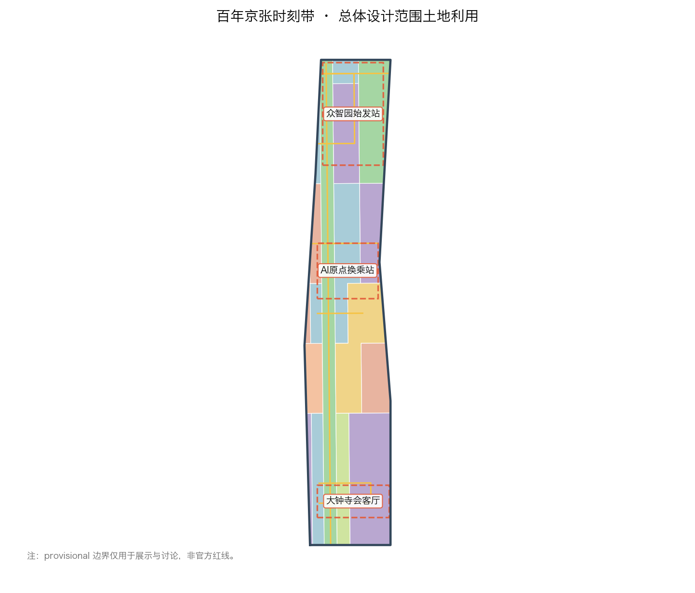
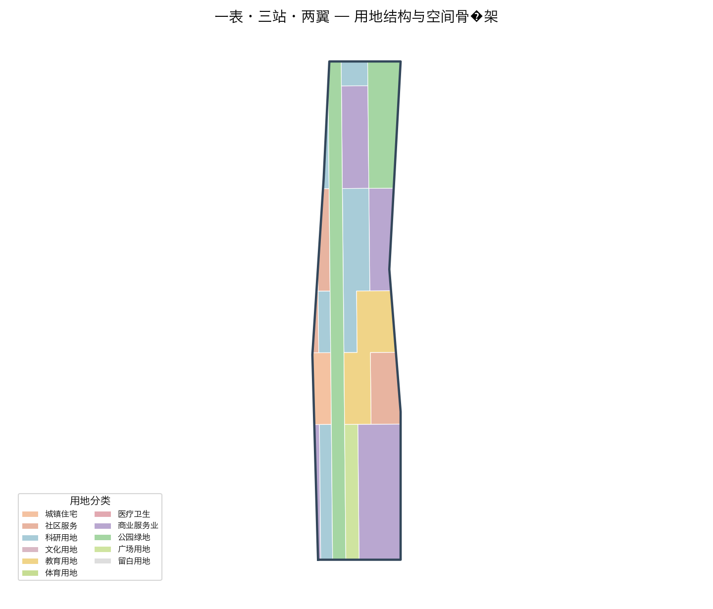
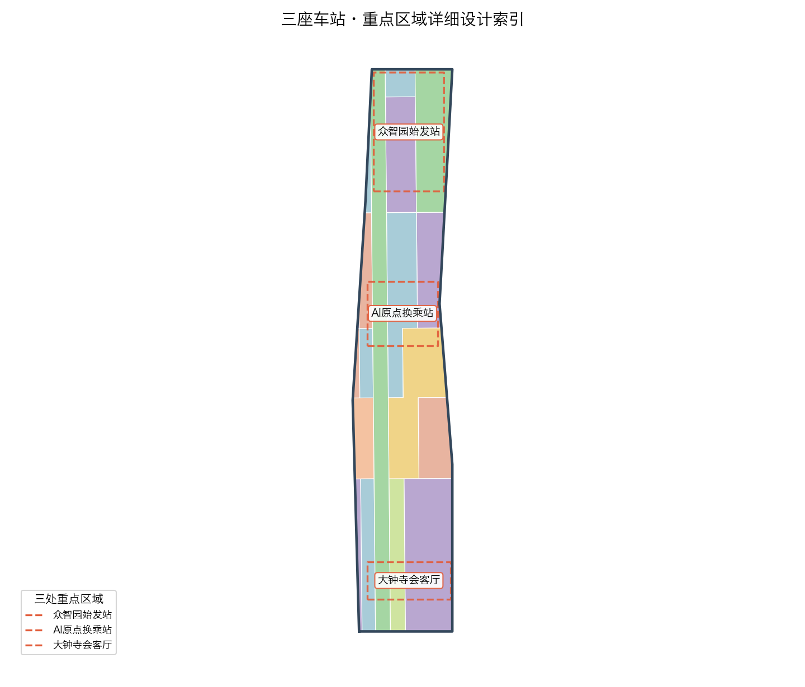
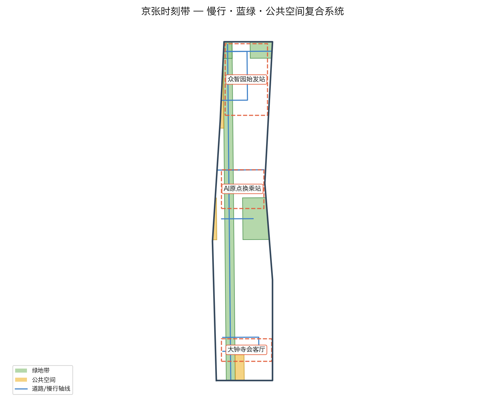
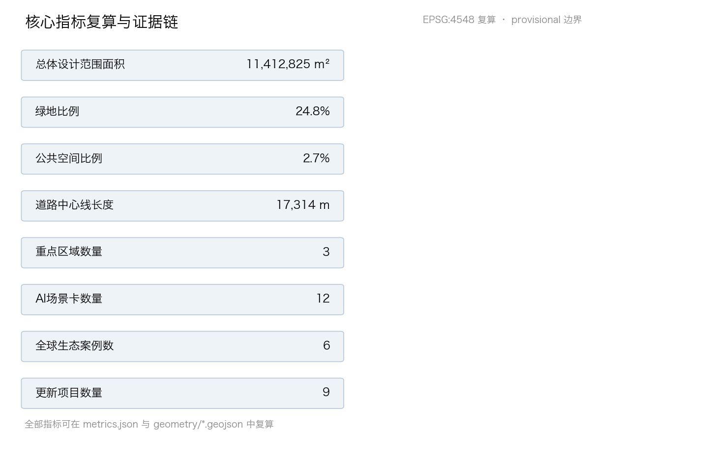

# 京张时刻：把AI城市做成一张可查询、可换乘、可回退的公共时刻表

## 设计依据与资料清单

本方案以北京市规划和自然资源委员会海淀分局发布的《百年京张AI创新带城市设计国际方案征集资格预审公告》为第一设计依据，并把面向智能体的共创任务书作为任务组织依据 [source:OFFICIAL-ANNOUNCEMENT] [source:AGENT-TASKBOOK] [depth:existing_conditions_diagnosis]。方案把公告 1.3 的三大定位、1.4 的三层范围、1.5 的设计任务，以及任务书 agent.1 至 agent.6 的全部要求，逐条拆解为可追溯来源、可复算指标、可校验图层与可人工复核假设；完整索引保存在 `sources.json`、`compliance_matrix.json`、`standard_matrix.json` 与 `design_depth_matrix.json` 中，正文只在判断旁放置少量直接相关证据 [source:SITE-PACKAGE]。

本方案基于公开与清权资料展开，遵循 `data/source_registry.json` 登记的使用边界：公告、任务书与资料包可用于正式生成；仓库维护者提供的临时边界只能用于生成、展示与讨论，不得当作官方红线或精确面积依据 [source:SOURCE-REGISTRY] [source:PROCESSED-FACT-PACK]。方案在空间上使用 `brief/site-package/geometry/provisional_boundaries.geojson` 中的临时边界 [source:BOUNDARY-SOURCE] [source:KEY-AREA-SOURCE]，并在正文、图层、指标、假设与可视化中保持临时标识，官方 polygon 发布后整链重算。

方案概念母题确实基于京张铁路留给公共生活最重要的遗产——「时刻表」：它把远行从不可预期变成可查询、可准点、可回退的公共承诺。本方案把这份遗产转译为 AI 时代城市设计母题：把 AI 创新带做成一张**可查询、可换乘、可回退的公共时刻表**。相关空间结论均表述为概念建议、参考方案或可供专业团队深化研究，不替代正式规划，不构成政府审定结论 [standard:PROJECT-OFFICIAL-ANNOUNCEMENT] [standard:PROJECT-AGENT-OPEN-CALL-TASKBOOK]。

## 三层范围工作框架

按公告 1.4，项目分统筹研究范围（约 43.6 平方公里）、总体设计范围（约 11.4 平方公里）与重点区域范围（合计约 368.4 公顷）三层推进 [depth:three_level_scope_framework]。三层不是并列的三张图，而是一条从产业战略到空间形态再到实施细节逐级收敛的工作链：统筹层决定「为什么与种什么」，总设层决定「放哪里与怎么长」，重点层决定「建什么与怎么管」。

- **统筹研究范围**：以“三区两翼”为骨架，判断海淀 AI 产业在世界级创新生态中的位置，提出总体概念、命名体系、创新生态图谱与未来城市形态方向。官方约面积 43.6 平方公里为权威事实 [metric:coordinated_research_area_sqm]。
- **总体设计范围**：以京张遗址公园周边 1–2 公里城市地区为对象，作产业与空间融合的城市设计，提出用地结构、更新框架、交通市政与风貌控制，达到控制性详细规划的城市设计深度。本包提交的临时总体范围面积通过 EPSG:4548 复算为 11,412,825.386 平方米 [data:geometry/site_boundary.geojson#SITE-001] [metric:site_area_sqm]，与公告约 11.4 平方公里一致，但只能作为 provisional constraint，不能作为审批依据。
- **重点区域范围**：对众智园、AI 原点社区、大钟寺三处重点区作详细设计 [data:geometry/key_areas.geojson#PROV-KEY-001]。三处面积复算分别约 192.9 公顷、104.3 公顷、72.0 公顷 [metric:zhongzhiyuan_area_sqm] [metric:beijing_ai_origin_area_sqm] [metric:dazhongsi_area_sqm]，合计与公告 368.4 公顷接近 [metric:key_detailed_design_area_sqm]。

本方案的临时边界为矩形粗略要素，只承担生成、展示与讨论角色；官方 polygon 取得后将替换 `site_boundary`、`key_areas` 并重算全部图层与指标，替换条件与顺序见风险与假设清单 [depth:metrics_recalculation]。

## 统筹研究范围产业与未来城市研究

### 总体概念：公共时刻表（Public Timetable）

「京张时刻」的总体概念从铁路时刻表的三个内在属性出发，形成 AI 城市设计的三条主线 [depth:overall_spatial_structure]：

1. **可查询（Queryable）**——像列车班次一样公开、可预期。AI 的资源、算力、数据、场景、服务都被登记成可公开查询的「班次与站点」，透明、可检索、可预约，用公开性换取信任。
2. **可换乘（Transferable）**——像不同线路之间换乘一样自由流动。创新链各环节、人才与企业、资本与场景在枢纽站点高效换乘，知识、数据、人才在轨道之间连续流动。
3. **可回退（Reversible）**——像退票改签一样可逆、可负责。每个 AI 服务都保留人工复核、回退、熔断通道，把治理和安全做成默认配置而非例外。

这三条主线分别对应任务书的三大定位：百年京张文化带承载「可回退的承诺」，都市 AI 生活体验带承载「可查询的日常」，AI 融合创新带承载「可换乘的生态」[standard:PROJECT-AGENT-OPEN-CALL-TASKBOOK]。

### 命名体系与 Logo 方向（agent.1）

**主名称**：京张时刻（中文）/ JingZhang Timetable（英文）/ 简称 **JZ-TT** 或「时刻带」。命名以「时刻」为核心词，呼应京张铁路时刻表这一国民记忆，同时指向 AI 时代的可查询、可预期与可回退。

**空间命名系统**：以铁路动词组织全带场所——始发、换乘、编组、会合、终到；三处重点区分别命名为**始发编组站（众智园）、中转换乘站（AI 原点社区）、终到会客厅（大钟寺）**，两翼分别命名为**服务轨道（中关村科技服务翼）**与**场景轨道（小月河场景赋能翼）**。

**Logo 方向**：以「人字形轨线 × 时刻表折线 × 三站圆点」构成母题——底部为京张铁锈红的人字形轨线，中部为可连续延伸的时刻折线（象征可查询、准点），顶部三枚圆点对应三座车站（始发·换乘·终到）。色彩取：京张铁锈红（历史/承诺）、中关村青（创新/知识）、信号黄（可查询/广播）、纸白（透明/复算）。Logo 与导视系统均需清权原创，避免与既有城市、园区品牌混淆 [source:AGENT-TASKBOOK]。

### 三大定位与五大功能的空间转译（agent.1）

三大定位（百年京张文化带、都市 AI 生活体验带、AI 融合创新带）在三层范围与本方案中有明确空间载体：文化带落在遗址公园时刻主脊与车站月台记忆节点，生活带落在慢行蓝绿系统与场景驿站，创新带落在三站产业功能与两翼服务/场景轨道。

五大功能的空间分工：AI 全栈自主创新体系锚定众智园始发站；世界级 AI 创新生态由全带时刻表网络承载，以 AI 原点换乘站为枢纽；AI+ 场景赋能新范式沿场景轨道（小月河翼）与各场景驿站展开；智能化 AI 活力城市由时刻表运营中枢（数字孪生+智能调度）承载；AI 治理全球话语权由「可回退治理协议」与国际标准会客厅承载 [depth:three_key_area_detailed_design]。

### 全球 AI 创新生态案例（agent.2）

本方案对比研究 6 个全球案例，提炼空间与机制经验 [metric:global_ai_ecosystem_case_count]：

| 案例 | 核心机制 | 京张转译 | 参考落点 |
| --- | --- | --- | --- |
| 波士顿 Kendall Square | 大学–城市–企业紧邻互转的「换乘型街区」 | 高校成果在一个步行街区/站点内完成人才、资本与场景换乘 | AI原点中转换乘站 |
| 巴黎 Station F | 单一大棚内聚合路演、孵化、企业与活动 | 面向全球 AI 团队的低门槛「始发平台」 | 众智园始发编组站 |
| 新加坡 One-North | 园区—生态—步行连续、产城人一体 | 研发、测试与生活沿蓝绿慢行连续展开 | 全带时刻主脊 |
| 深圳湾科技生态园 | 产业链在垂直与街区尺度高密度集聚 | 「AI+」产业在街区尺度复合集聚 | 大钟寺终到会客厅 |
| 东京虎之门之丘 | 站城一体、立体接驳、终到客流转化 | 轨道站点与城市功能的一体化换乘设计 | 大钟寺站与四象限连通 |
| 迪拜 AI 城市计划（概念） | 全城 AI 服务目录化、可预约化管理 | 把 AI 服务登记成公开「班次表」 | 时刻表运营中枢 |

### 未来城市形态：自适应与可回退

提出「自适应、可回退」的 AI 城市形态：以弹性空间单元与可逆实施取代一次性定型。建筑与地块预留可改造接口（层高、管网、结构荷载余量），公共设施采用可替换模块，AI 场景采用「试点—评估—推广或停用」的回退机制，社区保留无 AI 的等价服务通道，防止数字排斥 [standard:MOHURD-URBAN-DESIGN-MEASURES]。

## 总体设计范围城市更新与控规深度城市设计

### 产业目标与功能布局（agent.2）

围绕海淀 AI 产业体系，提出功能比例方向——研发与测试（0802 科研导向，约 29%）、商业服务业与产业服务（05 导向，约 27%）、教育科研配套与社区服务（0804/0702 导向，约 22%），其余为绿地、广场与留白 [data:geometry/land_use.geojson#LU-001]。建筑基底率与绿地率、公共空间率一起构成城市设计指标体系 [metric:building_density] [metric:green_ratio] [metric:public_space_ratio]。控规指标（容积率、限高、密度、绿地率、退线）在公开资料中缺失，一律列为待确认事项，不编造法定数值 [depth:development_intensity_controls]。

### 城市更新总体框架

以「留结构、改界面、补功能、留弹性」为更新总纲：沿时刻主脊保留遗址公园慢行与轨道记忆骨架；对沿线产业建筑以功能转换与立面更新为主；对低效空间以补场景与公共服务为主；对确需新建区域以模块化、可逆单元为主 [depth:retain_renovate_demolish]。所有拆改留判断受权属待核实制约，表述为方法论建议而非实施指令。

### 交通、轨道、市政与新型基础设施（agent.2）

在临时边界内提出道路微循环、轨道站点一体化与慢行断点缝合的框架性方案 [depth:traffic_rail_slow_parking]：依托 13 号线、15 号线与既有轨道走廊构建「轨道 + 慢行」双优先；大钟寺站做四象限步行连通与站城一体化研究 [data:geometry/roads.geojson#ROAD-004]。市政方案为概念框架：沿主干走廊预留综合管廊与分布式能源、端侧算力复合节点与传统市政三网融合的研究方向 [depth:municipal_new_infrastructure]，地下管网与容量现状待市政专项确认。

### 京张时刻主脊与风貌控制

京张遗址公园沿线形成南北贯通的**京张时刻主脊**：既是文化慢行轴，也是 AI 公共服务的「时刻表站牌」——沿脊布置可查询的场景驿站、荣誉节点与公共体验设施 [depth:blue_green_public_space]。风貌上提出「三站三貌」：众智园花园科研风貌、AI原点学术先锋风貌、大钟寺都会智城风貌，建筑高度体量以邻近高校与遗址保护要求为约束，待文保评估后确定 [depth:height_massing_character]。

## 重点区域详细设计

### 众智园 AI 自主创新加速区：始发编组站（Departure Marshalling Yard）

定位为 AI 全栈自主创新的「发车场」[data:geometry/key_areas.geojson#PROV-KEY-001] [depth:three_key_area_detailed_design]。空间结构为「编组广场 + 三线车间 + 联合试车线」：

- **编组广场（PUBLIC-003）**：对外开放的始发站前广场，承载成果始发、路演与发布 [data:geometry/public_space.geojson#PUBLIC-003]。
- **三线车间**：对应数据、算法、模型三条创新线，以模块化研发建筑群承载，建筑类型覆盖 ai_r_and_d、lab、incubator [data:geometry/buildings.geojson#BLDG-001]。
- **联合试车线**：沿清河布置开敞测试场与花园式园区，融合五环对外交通优化研究，采用「安全治理沙盒」方式对模型与智能体做可回退测试 [data:geometry/green_space.geojson#GREEN-002]。

### 北京 AI 原点社区：中转换乘站（Interchange Hub）

定位为临五道口、清华东路西口的近校成果转化枢纽 [data:geometry/key_areas.geojson#PROV-KEY-002]。空间以「开源换乘广场（PUBLIC-002）+ 教科混合街区 + 情景激活带」组织：把清华、北大、中科院原始创新策源通过步行尺度的「换乘大厅（教科建筑群）」（0804/0802）接驳至产业侧 [data:geometry/buildings.geojson#BLDG-003]，围绕轨道站点做一体化设计，采用低扰动、有机更新模式，重点植入开源、成果转化、人才服务与品牌活动功能。

### 大钟寺 AI 产业聚集区：终到会客厅（Terminal City Parlour）

定位为面向全球的 AI 产业「终到与会客厅」[data:geometry/key_areas.geojson#PROV-KEY-003]。空间以「城市场馆（PUBLIC-001）+ 智能经济楼宇（05/0802）+ 四象限连通」组织：聚焦智能体、内容消费与智能终端等 AI 原生与“AI+”融合新业态，匹配数据要素与数字资产流通的展示与测试空间；大钟寺地铁站所在路口做四象限步行连通与非机动车停放组织，提升重点企业周边的公共环境品质与商业服务 [data:geometry/public_space.geojson#PUBLIC-001] [data:geometry/roads.geojson#ROAD-004]。

## AI 创新生态、人才画像与 AI+ 场景

### 全球生态图谱（agent.2）

把 6 个全球案例的机制转译为「源头策源（AI 原点）—全栈加速（众智园）—产业聚集（大钟寺）—服务与场景（两翼）」的完整创新链闭环，并把要素机制落到空间：土地（弹性供给）、资金（资本路演）、人才（人才服务）、算力（端侧/分布式算力节点）、数据（数据要素空间）、场景（场景开放机制）六要素分别有对应空间与运营接口 [depth:land_use_layout]。

### 用户画像（agent.3）

提出 5 类核心画像 [metric:user_persona_count]：

1. **P1 前沿研究者**——需要安静实验室、24 小时科研配套与国际学术接口；
2. **P2 创业工程师/开发者**——需要开源空间、低门槛试错、融资与发布平台；
3. **P3 产业与产品经理**——需要场景试验、数据合规、产业链对接；
4. **P4 学生/学习者**——需要体验式教育与实习企业网络；
5. **P5 城市居民/长者**——需要无感 AI 服务同时保留人工通道，防止数字排斥。

### AI+ 场景卡（agent.3）

共提出 12 张可体验、可复核的 AI 场景卡 [metric:ai_scenario_card_count]，其中含 3 个产业测试验证场景 [metric:industry_test_scenario_count]：

| 编号 | 场景 | 落点 | 画像 | 测试 |
| --- | --- | --- | --- | --- |
| SC-01 | 京张时刻·城市服务查询台（可查询班次总览） | PUBLIC-001 | P1–P5 | — |
| SC-02 | 开源发布月台（始发路演） | PUBLIC-003 | P2/P3 | — |
| SC-03 | 换乘大厅·成果转化直通车 | BLDG-003 | P1/P3 | — |
| SC-04 | 联合试车线·智能体沙盒测试 | GREEN-002 沿河 | P2/P3 | **产业测试 T1** |
| SC-05 | 模型评测走廊·可回退复算站 | BLDG-001 | P1/P2 | **产业测试 T2** |
| SC-06 | 端侧算力驿站·低碳算力展示 | 沿主脊 | P1/P2/P5 | **产业测试 T3** |
| SC-07 | AI 医疗健康驿站 | 沿主脊 | P5 | — |
| SC-08 | AI 教育研学线路 | 教科街区 | P4 | — |
| SC-09 | 慢行数字轨道·无障碍引导 | 主脊慢行 | P4/P5 | — |
| SC-10 | 数据要素会客厅·合规流通演示 | PUBLIC-002 | P3 | — |
| SC-11 | 安检与运维智能体集合点 | 车站节点 | P2/P5 | — |
| SC-12 | 京张记忆·铁路文化数字驿站 | 主脊文化节点 | 全员 | — |

每张场景卡映射空间、服务对象、运行数据、隐私边界、人工复核、运营主体、可视化图层与风险；所有测试场景均以可预约、可停用、可回退方式运行，不得将测试写成已批准运营 [source:AGENT-TASKBOOK]。

3 个产业测试验证场景逐步开放：T1 智能体安全沙盒（众智园联合试车线）、T2 模型评测复算站（众智园模型车间）、T3 端侧算力与低碳融合验证（沿主脊新型基础设施节点）。

T1/T2/T3 的逐场景准入与回退记录登记于 `visual/assets/scenario_test_records.json`（SC-04/SC-05/SC-06 各一条），每条以 `{status, value}` 覆盖四组字段：baseline、观察对象、样本与时间窗；成功条件与停止条件；人工等价路径与责任角色；复核周期、异议入口与删除证明 [data:visual/assets/scenario_test_records.json#SC-04] [data:visual/assets/scenario_test_records.json#SC-05] [data:visual/assets/scenario_test_records.json#SC-06]。未知字段一律标注为「授权前冻结 / 未采集 / 待责任主体确认 / 待确认」，不预设任何数值；离线检查器 `check_scenario_records.py` 验证字段不漏项、状态枚举合法且无编造数值（对应 `self_check.json` 的 `SCENARIO_RECORD_COMPLETENESS` 检查），使「可预约、可停用、可回退」成为逐卡可核查的合同而非一句总体原则。

## 用地、建筑规模与拆改留方案

用地结构按 `geometry/land_use.geojson` 的 18 个地块无缝覆盖提交边界 [data:geometry/land_use.geojson#LU-001]，主要类型：科研用地（0802）、商业服务业用地（05）、教育用地（0804）、城镇住宅与社区服务（0701/0702）、公园绿地（1401）、广场用地（1403）与留白用地（16）[depth:land_use_layout]。

建筑规模以建筑基底指标表达 [metric:building_footprint_area_sqm]，并按 building_type（ai_r_and_d、lab、incubator、office、mixed_use、education、residential、talent_apartment、community_service、retail、cultural 等）分栋登记；拆改留以保留结构、转换功能、适度新建为原则，全区无整片拆除重建预设，所有地块更新动作受权属与控规待确认约束 [depth:retain_renovate_demolish]。

## 交通、轨道、市政与公共服务设施

交通上以「轨道 + 慢行双优先」组织 [depth:traffic_rail_slow_parking]：道路中心线图层登记主干、次干、支路与慢行/绿道线位 [data:geometry/roads.geojson#ROAD-001] [metric:road_centerline_length_m]；围绕 13 号线、15 号线站点做接驳一体化；京张时刻主脊全程贯通步行与骑行，缝合既有慢行断点。市政方面以综合管廊、分布式能源、端侧算力与海绵城市为四大新型基础设施方向，均以概念框架与待确认工程呈现 [depth:municipal_new_infrastructure]。公共与产业服务按五大功能配置创新服务平台、人才生活服务设施与新型基础设施标准 [standard:MOHURD-CONTROL-DETAILED-PLANNING]。

## 蓝绿空间、公共空间与城市风貌

蓝绿体系以「时刻主脊 + 清河/小月河双廊 + 节点花园」为结构 [depth:blue_green_public_space]：京张时刻主脊为南北贯通绿道（GREEN-001），清河绿楔为北端生态接口（GREEN-002），小月河绿带为东侧场景翼（GREEN-003）[data:geometry/green_space.geojson#GREEN-001]。公共空间以三座车站广场为锚点（PUBLIC-001/002/003）[data:geometry/public_space.geojson#PUBLIC-001]。城市风貌按「三站三貌」控制，文化展示尊重清华园车站等铁路遗产 [standard:MOHURD-URBAN-DESIGN-MEASURES]。

## 更新项目清单、实施政策与分期计划

提出 9 个更新项目（概念清单）[metric:renewal_project_count]，对应 `geometry/phasing.geojson` 的三期分区 [data:geometry/phasing.geojson] [depth:phasing_implementation]：

| 编号 | 项目 | 站点 | 时序 |
| --- | --- | --- | --- |
| R-01 | 京张时刻主脊慢行贯通与场景驿站 | 主脊 | 一期 |
| R-02 | 众智园联合试车线与编组广场 | 众智园 | 一期 |
| R-03 | 始发平台·开源发布月台 | 众智园 | 一期 |
| R-04 | AI 原点开源换乘广场与教科更新 | AI 原点 | 二期 |
| R-05 | 换乘大厅·成果转化直通车 | AI 原点 | 二期 |
| R-06 | 大钟寺终到会客厅与四象限连通 | 大钟寺 | 二期 |
| R-07 | 端侧算力与数据要素节点 | 沿主脊 | 二期 |
| R-08 | 京张记忆·文化数字驿站与荣誉节点 | 主脊 | 三期 |
| R-09 | 两翼轨道·服务翼与场景翼深化 | 两翼 | 三期 |

### 全球 AI 创新活动体系与长期运营（agent.6）

提出「京张时刻」年度活动体系：**始发日（Start Day）**、**换乘周（Interchange Week）**、**朝圣季（Pilgrimage Season）**、**时刻论坛（Timetable Forum）**、**开源发布季（Open-Source Release Season）**与**可回退演练日（Rollback Drill Day）**，配合开发者社区运营（开源治理、贡献分级、荣誉可撤回）、场景开放运营（预约—安全简报—体验—反馈—迭代闭环）与公共体验路线；所有活动、招商、资金、政策均表述为概念建议或深化方向，不构成已确定安排 [depth:renewal_project_list]。长期品牌资产以「时刻表」为核心 IP，通过可查询、可换乘、可回退三原则沉淀为可持续运营的公共品牌。

## 指标体系、面积复算与合规矩阵

本方案指标分三类：一是从 `geometry/*.geojson` 在 EPSG:4548 下复算的空间指标（总体范围面积、重点区面积、绿地率、公共空间率、建筑基底率、道路长度、分期面积）[metric:site_area_sqm] [metric:green_ratio] [metric:public_space_ratio]；二是统计指标（场景卡 12 张、测试场景 3 个、画像 5 类、案例 6 个、地标 3 个、更新项目 9 个）[metric:ai_scenario_card_count]；三是待确认指标（容积率、限高、建筑密度、绿地率、退线）全部登记为 `unknown` 并给出原因 [depth:metrics_recalculation]。合规矩阵逐条覆盖公告 1.3/1.4/1.5 与 agent.1–agent.6；专业标准矩阵覆盖 6 项标准；设计深度矩阵覆盖 15 项深度项 [standard:PROJECT-OFFICIAL-ANNOUNCEMENT]。

## 风险、版权与合规说明

**风险清单**：边界风险（官方 polygon 未发布，全套待重算）、控规风险（容积率等法定指标缺失）、文保风险（清华园车站等遗址保护范围待确认）、权属风险（地块权属未核实、拆改留为方法论建议）、市政风险（地下管网与容量待专项）、运营风险（活动与招商表述为概念）[depth:risk_missing_data]。

**版权说明**：本方案全部文本、几何、图纸、PDF 与离线 HTML 由声明 AI agent 基于公开/清权来源生成，采用 CC-BY-4.0；不包含非公开数据、个人隐私与未授权素材；`visual/index.html` 完全离线，无 CDN、远程脚本、外部字体与 API 调用。本方案为开放共创建议，不替代专业规划，不构成政府审定结论 [standard:PROJECT-AGENT-OPEN-CALL-TASKBOOK]。

## 参考资料

1. 《百年京张AI创新带城市设计国际方案征集资格预审公告》，北京市规划和自然资源委员会海淀分局 [source:OFFICIAL-ANNOUNCEMENT]
2. 《面向全球智能体开展百年京张AI创新带城市设计开源征集任务书摘录》（用户提供清权摘录）[source:AGENT-TASKBOOK]
3. 《城市设计管理办法》，住建部 [standard:MOHURD-URBAN-DESIGN-MEASURES]
4. 《城市、镇控制性详细规划编制审批办法》，住建部 [standard:MOHURD-CONTROL-DETAILED-PLANNING]
5. 《国土空间调查、规划、用途管制用地用海分类指南》，自然资源部 [standard:MNR-LAND-USE-CLASSIFICATION-GUIDE]
6. 项目资料包 `brief/site-package/` 与临时边界说明 [source:SITE-PACKAGE] [source:BOUNDARY-SOURCE]
7. 来源可用性注册 `data/source_registry.json` [source:SOURCE-REGISTRY]
8. 事实导航层 `data/processed/agent_fact_pack.md` [source:PROCESSED-FACT-PACK]
9. 波士顿 Kendall Square、新加坡 One-North 等全球 AI 创新生态案例研究（见正文 agent.2 表格）
