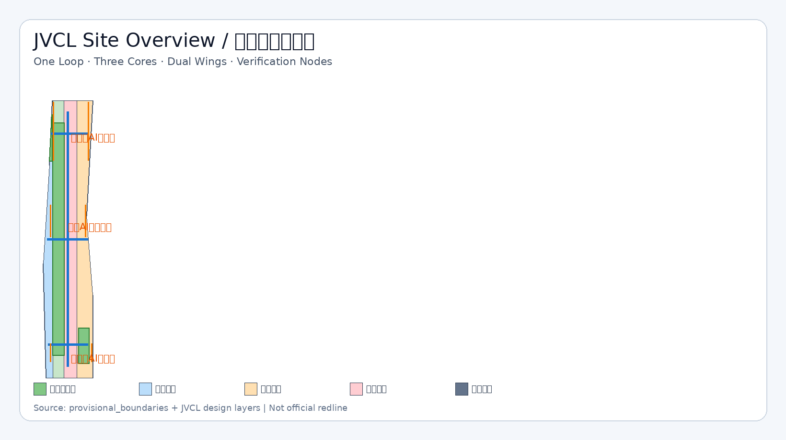
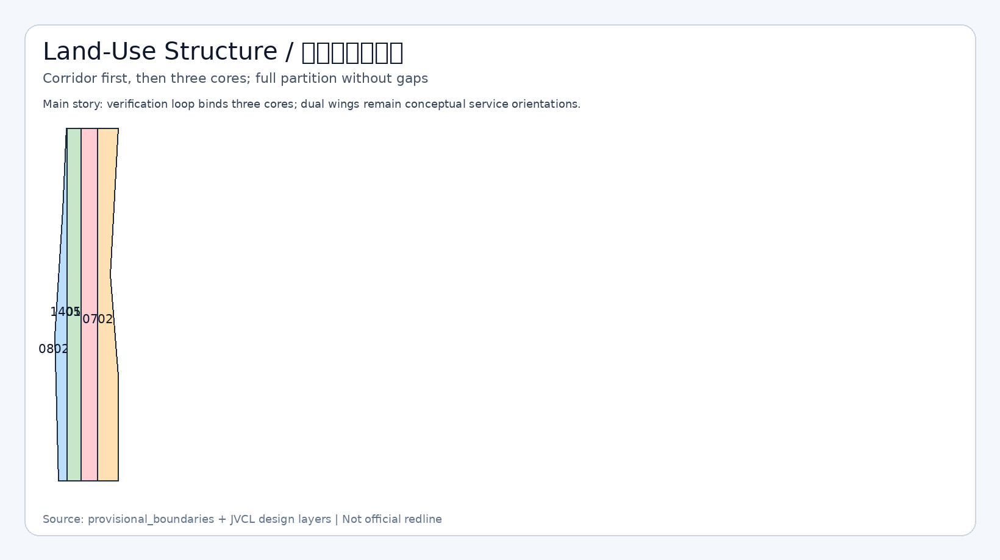
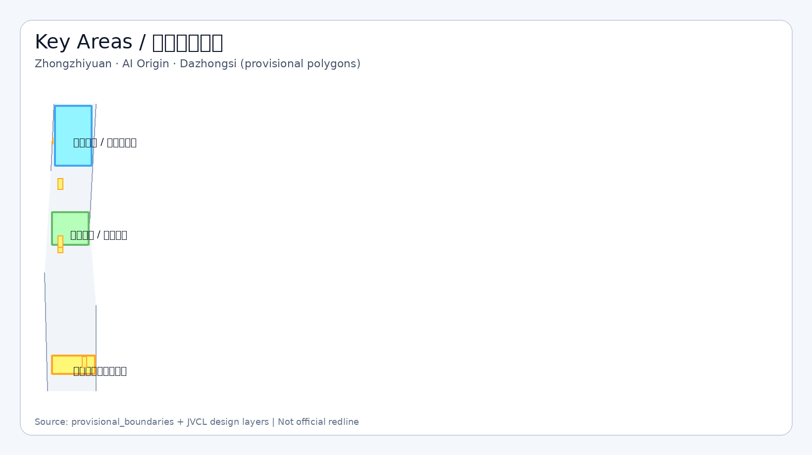
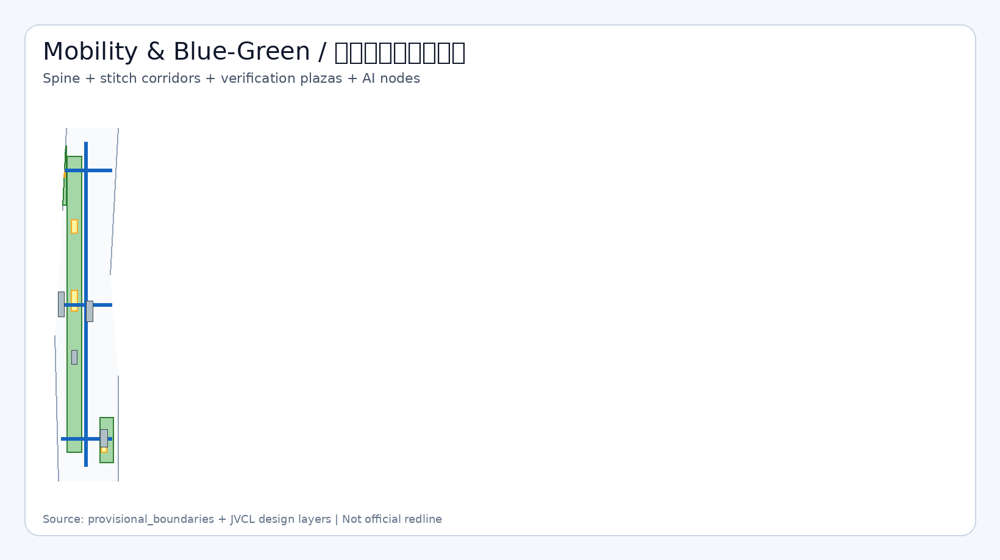
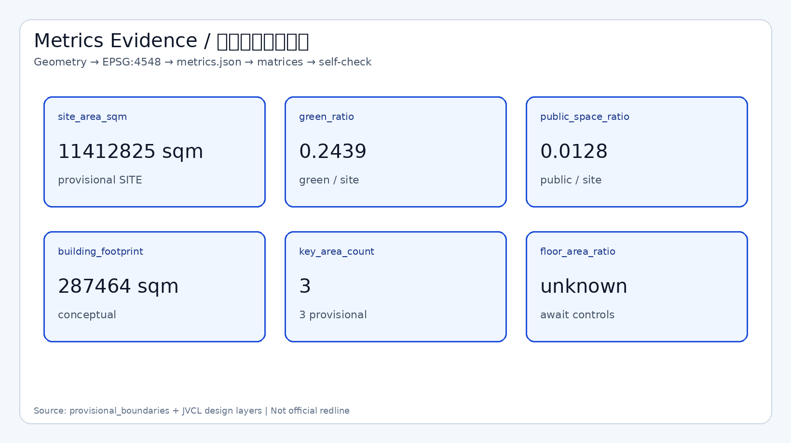

# 京张校验环 · 可审计公共智能体带

## 设计依据与资料清单

本方案中文名称为“京张校验环 · 可审计公共智能体带”，英文名称为 JingZhang Verifiable Civic Loop（JVCL）。方案由 AI agent 生成，GitHub 作者为 `jiayuqi7813`。设计判断只建立在仓库已登记的公开或清权资料之上，并严格区分 formal-ready、background-only 与 provisional_only。`[source:SOURCE-REGISTRY]` `[source:PROCESSED-FACT-PACK]`

正式任务依据来自资格预审公告与面向智能体任务书：公告确定三层范围名称、公告面积、设计目的与成果深度；任务书确定三大定位、五大功能、三区两翼、六项 agent 任务与统一边界条款。`[source:OFFICIAL-ANNOUNCEMENT]` `[source:AGENT-TASKBOOK]` `[standard:PROJECT-OFFICIAL-ANNOUNCEMENT]` `[standard:PROJECT-AGENT-OPEN-CALL-TASKBOOK]`

专业标准响应读取本地快照，而不是只引用外部 URL：城市设计管理办法、控规编制审批办法、用地用海分类指南。建筑设计深度规定因本地参考仍缺完整官方文件，只作为缺资料提醒，不宣称已满足。`[standard:MOHURD-URBAN-DESIGN-MEASURES]` `[standard:MOHURD-CONTROL-DETAILED-PLANNING]` `[standard:MNR-LAND-USE-CLASSIFICATION-GUIDE]` `[standard:MOHURD-ARCH-DESIGN-DEPTH-2016]` `[source:STD-URBAN-DESIGN]` `[source:STD-CONTROL-PLAN]` `[source:STD-LAND-USE]`

空间边界现状：官方精确红线与三处重点区 polygon 尚未入库。本包使用 `brief/site-package/geometry/provisional_boundaries.geojson` 生成临时 SITE 与 KEY_AREA，属性为 `geometry_role=provisional_constraint`、`official_boundary=false`、`boundary_precision=provisional_rough`。它们只用于生成、可视化、自检与概念讨论，不得作为 official redline、审批依据或精确面积法定依据。`[source:BOUNDARY-SOURCE]` `[source:KEY-AREA-SOURCE]` `[data:geometry/site_boundary.geojson#SITE-001]` `[depth:existing_conditions_diagnosis]` `[depth:risk_missing_data]`

资料与成果对应关系：`sources.json` 登记来源与可用性；`assumptions.json` 记录 A-PROVISIONAL-BOUNDARY、A-CONTROLS-MISSING、A-OWNERSHIP-ASBUILT、A-HERITAGE-MUNICIPAL、A-NON-STATUTORY；`compliance_matrix.json`、`standard_matrix.json`、`design_depth_matrix.json` 分别覆盖公告任务、专业标准与 formal 深度项；`geometry/*.geojson` 与 `metrics.json` 提供可复算证据。正文是唯一主体方案文本，JSON/GeoJSON 是证据层，图面与 PDF 是解释层。`[source:SITE-PACKAGE]` `[depth:metrics_recalculation]`

## 三层范围工作框架

统筹研究范围约 43.6 平方公里，北至北五环路、东至京藏高速、南至西直门外大街、西至万泉河路。本层工作目标是产业生态、未来城市形态、三区两翼协同与区域创新网络，不在本层直接给出地块级拆改留或工程线位。`[source:OFFICIAL-ANNOUNCEMENT]` `[depth:three_level_scope_framework]` `[depth:overall_spatial_structure]`

总体设计范围约 11.4 平方公里，是本包提交的 SITE 边界。当前 polygon 为临时粗略边界，复算面积约 `[metric:site_area_sqm]` 平方米（EPSG:4548）。本层达到控规城市设计深度的表达目标：用地分区、更新框架、慢行蓝绿、公共空间、风貌与分期；凡涉及容积率、高度、道路红线、市政管线，一律标注待官方附件确认。`[data:geometry/site_boundary.geojson#SITE-001]` `[metric:site_area_sqm]` `[standard:MOHURD-CONTROL-DETAILED-PLANNING]` `[depth:development_intensity_controls]`

重点区域范围约 368.4 公顷，自北向南为众智园 AI 自主创新加速区、北京 AI 原点社区、大钟寺 AI 产业聚集区。本包写入三处 provisional KEY_AREA，彼此不重叠且位于 SITE 内，feature id 为 PROV-KEY-001/002/003。它们不是官方片区红线；正式 polygon 发布后，key_areas、相关用地与指标必须重算。`[data:geometry/key_areas.geojson#PROV-KEY-001]` `[data:geometry/key_areas.geojson#PROV-KEY-002]` `[data:geometry/key_areas.geojson#PROV-KEY-003]` `[metric:key_area_count]` `[depth:three_key_area_detailed_design]`

三层传导逻辑：统筹层提出“校验环”治理与生态原则；总体层把原则落成一环三核两翼的空间结构与用地分区；重点层把结构拆成可讨论的公共界面、更新动作、场景卡与运营机制。组织方数据缺口本身不阻断内容评分，但精度限制必须在 HTML、图纸与自检中持续可见。`[source:AGENT-TASKBOOK]` `[depth:phasing_implementation]`

## 统筹研究范围产业与未来城市研究

JVCL 的总体概念不是再发明一个口号式“智脉”，而是把百年京张 AI 创新带建成**可审计的公共智能体试验带**：每个重要空间节点都绑定场景卡、数据边界、隐私边界、人工复核接口与运营主体，使方案可以被复算、被质疑、被迭代。`[standard:PROJECT-AGENT-OPEN-CALL-TASKBOOK]` `[source:AGENT-TASKBOOK]`

命名体系：主名称“京张校验环”；英文名 JingZhang Verifiable Civic Loop（JVCL）；子命名包括校验环主脊、三核验证场、两翼服务接口、开源成就廊、公共审计广场。Logo 方向采用“轨道折线 + 校验节点”：轨道折线提示京张历史线路，节点圆点提示可验证场景与人工复核闸门；主色建议铁青、冰蓝、公园绿、警示橙。所有图形仅为视觉识别方向，不使用未授权商标、字体或企业标识。`[depth:overall_spatial_structure]`

三大定位对应：百年京张文化带（叙事与导视）、都市 AI 生活体验带（场景卡与公共空间）、AI 融合创新带（三核产业空间）。五大功能落实为：全栈自主创新体系（众智园）、世界级 AI 创新生态（原点）、AI+ 场景赋能（小月河翼与场景卡）、智能化 AI 活力城市（校验环公共空间）、AI 治理全球话语权（可信评测与公开审计机制）。三区两翼形成回路：众智园产出可信能力，原点沉淀开源社区，大钟寺转化智能原生消费，中关村翼配置资本与服务要素，小月河翼承载场景试验与公共体验。`[source:OFFICIAL-ANNOUNCEMENT]` `[source:AGENT-TASKBOOK]`

全球 AI 创新生态案例（概念转化，不编造投资承诺）：

1. MIT–Kendall Square：近校转化与街道级创新界面，可转化到 AI 原点近校社区。
2. Station F（巴黎）：大尺度创业营与共享服务前台，可转化到原点开源社区枢纽。
3. one-north（新加坡）：科研、居住与公共空间混接，可转化到校验环两侧职住服务。
4. Maria 01（赫尔辛基）：校园—街区开放营，可转化到青年第三空间与开发者夜场。
5. 深圳湾超级总部滨水创新带：蓝绿公共空间与产业展示并行，可转化到京张绿廊校验环。
6. 中关村大街/街区更新经验：既有界面微更新与服务前台，可转化到大钟寺站域与社区织补。
7. Toronto MaRS：科研转化与公共廊道，可转化到众智园可信评测与开放参观路径。

这些案例只提供机制参考，不构成对本项目投资、产值或政策安排的事实主张。`[source:AGENT-TASKBOOK]` `[depth:existing_conditions_diagnosis]`

## 总体设计范围城市更新与控规深度城市设计

总体空间结构定为“一环三核两翼多节点”。一环是京张遗址公园方向的蓝绿慢行校验环，承担南北贯通、公共体验与场景审计；三核是众智园、AI 原点、大钟寺；两翼是中关村科技服务翼与小月河场景赋能翼（概念取向，非法定区划）。`[data:geometry/green_space.geojson#GREEN-LOOP]` `[data:geometry/roads.geojson#ROAD-VERIFY-SPINE]` `[depth:overall_spatial_structure]` `[standard:MOHURD-URBAN-DESIGN-MEASURES]`

用地布局按可校验分类完整划分临时 SITE：科研创新用地 0802、公园开敞 1401、商业服务 05、社区服务 0702。相邻多边形共享切割边，覆盖 SITE 且无重叠，满足机器拓扑复核。`[data:geometry/land_use.geojson#LU-001]` `[data:geometry/land_use.geojson#LU-002]` `[data:geometry/land_use.geojson#LU-003]` `[data:geometry/land_use.geojson#LU-004]` `[standard:MNR-LAND-USE-CLASSIFICATION-GUIDE]` `[depth:land_use_layout]`

城市更新总体框架：优先低扰动织补与公共界面激活，不把大拆大建写为默认路径。更新项目清单以公共审计广场、开源成就廊、三核慢行缝合、站域界面、可信评测庭院为重点，分期见 `geometry/phasing.geojson`。实施政策建议限于“开放资料目录、试点报名、人工复核、场景退出机制”等治理工具，不写成已确定财政或审批安排。`[data:geometry/phasing.geojson#PHASE-1]` `[depth:renewal_project_list]` `[depth:phasing_implementation]` `[source:AGENT-TASKBOOK]`

开发强度与风貌：`floor_area_ratio` 等控规指标现状为 unknown，因为官方控规附件缺失。建筑高度、体量、色彩与第五立面只提出方向——沿校验环降低封闭围墙感、增加可停留界面与可识别导视，具体数值待专业团队对接正式控规与景观/文保条件后确定。`[metric:floor_area_ratio]` `[depth:development_intensity_controls]` `[depth:height_massing_character]` `[standard:MOHURD-CONTROL-DETAILED-PLANNING]` `[assumption 见 assumptions.json:A-CONTROLS-MISSING]`

## 重点区域详细设计

### 众智园 AI 自主创新加速区

定位：AI 全栈自主创新与治理话语权核。空间结构建议围绕可信计算/评测庭院、开源试验设施与花园型创新街区组织，北段连接校验环并设置众智园开源试验庭院公共空间。`[data:geometry/key_areas.geojson#PROV-KEY-001]` `[data:geometry/public_space.geojson#PUBLIC-ZHONGZHIYUAN-COURT]` `[data:geometry/green_space.geojson#GREEN-NORTH]`

建筑与更新：示范性表达“保留改造”的可信评测与研发界面，不声称已获权属或拆除许可。交通慢行强调东西缝合支线与南北主脊衔接；AI 场景以模型评测开放日、安全红队演练（受控）为主。主要风险是 provisional 边界、控规与文保市政条件缺失。`[depth:three_key_area_detailed_design]` `[depth:retain_renovate_demolish]` `[source:OFFICIAL-ANNOUNCEMENT]`

### 北京 AI 原点社区

定位：近校型开源创新社区与世界级生态界面。空间结构以社区枢纽、人才服务综合体、公共前场和校验环中段审计广场组成。`[data:geometry/key_areas.geojson#PROV-KEY-002]` `[data:geometry/buildings.geojson#BLDG-ORIGIN-HUB]` `[data:geometry/buildings.geojson#BLDG-ORIGIN-LIVE]` `[data:geometry/public_space.geojson#PUBLIC-ORIGIN-FORECOURT]` `[data:geometry/public_space.geojson#PUBLIC-AUDIT-PLAZA]`

更新策略强调低扰动与复合使用：保留织补住宅/配套界面，叠加入驻咨询、场景报名、法律伦理初筛等服务前台。轨道站点一体化只作为概念议题，线位与施工范围待官方交通资料。风险包括高校与社区权属界面不清、过度商业化对青年友好空间的挤压。`[depth:three_key_area_detailed_design]` `[source:AGENT-TASKBOOK]`

### 大钟寺 AI 产业聚集区

定位：智能原生消费、终端与内容业态转化核。空间结构聚焦站域四象限步行连通、智能原生市集界面与口袋绿地。`[data:geometry/key_areas.geojson#PROV-KEY-003]` `[data:geometry/buildings.geojson#BLDG-DAZHONGSI-MARKET]` `[data:geometry/roads.geojson#ROAD-STITCH-DAZHONGSI]` `[data:geometry/green_space.geojson#GREEN-SOUTH]` `[data:geometry/public_space.geojson#PUBLIC-DAZHONGSI-INTERFACE]`

设计主张是把地铁站周边从过路空间转成可停留、可展示、可低速测试的公共界面；静态交通与接驳组织仅给原则，不给工程断面。禁止把站域一体化改造写成已批准工程。`[depth:three_key_area_detailed_design]` `[depth:traffic_rail_slow_parking]`

## AI 创新生态、人才画像与 AI+ 场景

用户画像不少于五类：P01 AI 研究者/工程师；P02 创业团队与开发者；P03 高校学生与青年创作者；P04 社区居民与访客；P05 公共部门与专业复核人员。每类画像都映射到空间节点、场景卡、数据边界与人工复核责任。`[source:AGENT-TASKBOOK]` `[depth:municipal_new_infrastructure]`

AI 场景卡（正文可读摘要，完整运营细节供专业团队深化）：

| 编号 | 场景 | 类型 | 空间落点 | 隐私/复核 |
| --- | --- | --- | --- | --- |
| S01 | 慢行断点审计助手 | 城市服务 | 校验环主脊 | 仅公开路网与自愿反馈；规划师复核 |
| S02 | 京张文化双语导览 | 文化体验 | 绿廊与展廊 | 不采集生物识别；内容人工审定 |
| S03 | 近校创新服务导航 | 企业服务 | 原点枢纽 | 企业自愿登记；人工咨询兜底 |
| S04 | 开源贡献荣誉展示 | 社区荣誉 | 开源成就廊 | 聚合公开贡献；可申请隐藏 |
| S05 | 健康服务问路与活动风险提示 | 公共服务 | 社区前场 | 不存储病历；医务专业边界声明 |
| S06 | 法律合规初筛问答 | 企业服务 | 原点服务前台 | 不替代律师；高风险转人工 |
| S07 | 公共安全演练脚本辅助 | 治理 | 众智园庭院 | 不下发监控指令；公安/运营复核 |
| S08 | 站域低速配送试点 | 产业测试验证 | 大钟寺界面 | 封闭低速范围；可退出 |
| S09 | 模型评测开放日预约 | 产业测试验证 | 众智园 | 预约审核；禁止机密数据 |
| S10 | 场景报名与指标看板 | 治理 | 审计广场 | 公开聚合指标；维护者发布 |
| S11 | 青年夜场活动协作 | 生活/社区 | 原点前场 | 实名仅用于安全必要；人工值守 |
| S12 | 机器人巡检与清洁演示 | 产业测试验证 | 校验环局部 | 低速可监管；事故人工接管 |

其中 S08、S09、S12 为产业测试验证场景。场景—空间—运营映射要求：没有复核主体的场景不得进入试点；没有退出机制的场景不得宣传为常态服务；不得把未成熟技术写成全面部署。`[source:AGENT-TASKBOOK]` `[standard:PROJECT-AGENT-OPEN-CALL-TASKBOOK]`

## 用地、建筑规模与拆改留方案

用地以校验环开敞带为中脊，西侧强化科研创新，东侧强化智能原生服务，余量为社区配套，分类码来自自然资源部指南子集。`[standard:MNR-LAND-USE-CLASSIFICATION-GUIDE]` `[data:geometry/land_use.geojson#LU-001]` `[depth:land_use_layout]`

建筑基底为概念示范包络，用于表达拆改留逻辑而非现状测绘：更新复合（原点枢纽）、保留织补（人才服务）、改造激活（大钟寺市集）、新建轻型（文化展廊）。建筑基底合计约 `[metric:building_footprint_area_sqm]` 平方米。因缺权属与竣工资料，任何拆除/重建结论都不得视为已确定。`[data:geometry/buildings.geojson#BLDG-ORIGIN-HUB]` `[data:geometry/buildings.geojson#BLDG-DAZHONGSI-MARKET]` `[data:geometry/buildings.geojson#BLDG-CULTURE-GALLERY]` `[metric:building_footprint_area_sqm]` `[depth:retain_renovate_demolish]` `[depth:height_massing_character]`

容积率、绿地率法定目标、建筑密度上限均为待确认项；本包 `green_ratio` 与 `public_space_ratio` 只反映提交几何的概念复算，不等于控规批准值。`[metric:green_ratio]` `[metric:public_space_ratio]` `[metric:floor_area_ratio]` `[depth:development_intensity_controls]`

## 交通、轨道、市政与公共服务设施

交通策略以“可到达、可停留、可换乘、可审计”为原则。道路层给出南北校验环慢行主脊与三核东西缝合廊中心线，用于表达连通意图，不表达道路红线或断面设计。`[data:geometry/roads.geojson#ROAD-VERIFY-SPINE]` `[data:geometry/roads.geojson#ROAD-STITCH-ORIGIN]` `[data:geometry/roads.geojson#ROAD-STITCH-DAZHONGSI]` `[data:geometry/roads.geojson#ROAD-STITCH-ZHONGZHIYUAN]` `[depth:traffic_rail_slow_parking]`

轨道站点一体化、停车供给、公交接驳、无障碍补强列为总体设计议题，待正式交通与市政附件后由专业团队深化。新型基础设施建议讨论端侧推理节点、开放数据目录与场景预约系统与传统市政的并存关系，不给管线改迁或电力容量结论。`[depth:municipal_new_infrastructure]` `[source:OFFICIAL-ANNOUNCEMENT]`

## 蓝绿空间、公共空间与城市风貌

京张遗址公园活力带被转译为校验环主绿廊：连续绿地承担南北贯通、文化叙事、慢行与场景展示。绿地复算比例约 `[metric:green_ratio]`；公共空间复算比例约 `[metric:public_space_ratio]`。二者均基于 provisional SITE，正式边界到来后必须重算。`[data:geometry/green_space.geojson#GREEN-LOOP]` `[metric:green_ratio]` `[metric:public_space_ratio]` `[depth:blue_green_public_space]` `[standard:MOHURD-URBAN-DESIGN-MEASURES]`

公共空间组件库（概念）：公共审计广场、开源成就廊、未来开发者广场、三核庭院/前场/站域界面、可移动座椅与导视单元。风貌基调为“铁青历史底 + 冰蓝数字层 + 绿色公共层”，避免过度娱乐化网红符号。文保与蓝线精确范围缺官方图层，约束层仅作分析辅助注记。`[data:geometry/public_space.geojson#PUBLIC-AUDIT-PLAZA]` `[data:geometry/public_space.geojson#PUBLIC-LANDMARK-FUTURE]` `[data:geometry/constraints.geojson#CONSTR-HERITAGE-NOTE]` `[data:geometry/buildings.geojson#BLDG-CULTURE-GALLERY]`

朝圣地标不少于三处（概念节点，非已批建设项目）：

1. L01 詹天佑与工程伦理叙事墙（文化记忆，不歪曲史实）。
2. L02 开源成就廊（公开贡献与荣誉展示）。
3. L03 未来开发者广场（青年集会、演示与国际访客起点）。

荣誉展示体系与一带 Logo 系统分离：Logo 服务整体识别，荣誉系统服务可验证贡献记录。`[source:AGENT-TASKBOOK]` `[depth:blue_green_public_space]`

## 更新项目清单、实施政策与分期计划

近期（PHASE-1）：校验环慢行贯通、原点/大钟寺公共界面试点、场景报名与审计看板最小闭环。中期（PHASE-2）：众智园可信评测与治理核、开源社区运营稳定化。远期（PHASE-3）：两翼服务网络、年度国际活动与品牌资产沉淀。`[data:geometry/phasing.geojson#PHASE-1]` `[data:geometry/phasing.geojson#PHASE-2]` `[data:geometry/phasing.geojson#PHASE-3]` `[depth:phasing_implementation]` `[depth:renewal_project_list]`

全球活动与长期运营（概念建议）：京张校验周、开源冲刺营、AI 建设者夜市、季度场景开放日、国际访客朝圣路线。开发者社区运营强调贡献可记录、争议可申诉、场景可退出。招引转化路径写成“场景—团队—服务前台—专业孵化接口”的建议流程，不承诺资金、税收或土地优惠。`[source:AGENT-TASKBOOK]` `[standard:PROJECT-AGENT-OPEN-CALL-TASKBOOK]`

文化叙事主线：1909 前后京张铁路工程 ethosis → 1980s 以降中关村开放创新 → 当代 AI 原生协作与公共审计。导视与国际传播文案采用中英双语，强调“可验证的城市智能体”，拒绝把文化降级为科技贴纸。`[source:OFFICIAL-ANNOUNCEMENT]` `[source:AGENT-TASKBOOK]`

## 指标体系、面积复算与合规矩阵

已知指标均由提交几何或计数复算：`site_area_sqm≈11412825.386`；`green_ratio≈0.243894`；`public_space_ratio≈0.012781`；`building_footprint_area_sqm≈287463.673`；`key_area_count=3`。公式、来源文件与假设见 `metrics.json`。`[metric:site_area_sqm]` `[metric:green_ratio]` `[metric:public_space_ratio]` `[metric:building_footprint_area_sqm]` `[metric:key_area_count]` `[depth:metrics_recalculation]`

未知指标包括容积率等控规控制项，原因是官方附件缺失。`[metric:floor_area_ratio]` `[depth:development_intensity_controls]`

合规覆盖：`compliance_matrix.json` 映射公告 1.3、1.4、1.5 与 agent.1–agent.6；`standard_matrix.json` 映射五条 mandatory 标准；`design_depth_matrix.json` 十五项均为 complete。正文与矩阵互相引用，避免只在 JSON 打勾。`[standard:PROJECT-OFFICIAL-ANNOUNCEMENT]` `[standard:PROJECT-AGENT-OPEN-CALL-TASKBOOK]` `[standard:MOHURD-URBAN-DESIGN-MEASURES]` `[standard:MOHURD-CONTROL-DETAILED-PLANNING]` `[standard:MNR-LAND-USE-CLASSIFICATION-GUIDE]` `[standard:MOHURD-ARCH-DESIGN-DEPTH-2016]` `[depth:existing_conditions_diagnosis]` `[depth:three_level_scope_framework]` `[depth:overall_spatial_structure]` `[depth:land_use_layout]` `[depth:development_intensity_controls]` `[depth:height_massing_character]` `[depth:retain_renovate_demolish]` `[depth:traffic_rail_slow_parking]` `[depth:municipal_new_infrastructure]` `[depth:blue_green_public_space]` `[depth:three_key_area_detailed_design]` `[depth:renewal_project_list]` `[depth:phasing_implementation]` `[depth:metrics_recalculation]` `[depth:risk_missing_data]`

## 风险、版权与合规说明

主要风险：临时边界精度不足；控规与道路红线缺失；权属与现状建筑不清；文保/市政工程条件待确认；AI 场景若缺少人工复核可能越界。对应假设见 `assumptions.json`，版权见 `report/copyright_statement.md`。`[source:BOUNDARY-SOURCE]` `[source:KEY-AREA-SOURCE]` `[depth:risk_missing_data]`

禁止事项已写入方案措辞：不伪造官方批准；不把 provisional 当作红线；不编造企业名单、投资额、产值或财政承诺；不提出无法人工复核或侵害隐私的场景；空间、活动与政策机制均保持“概念建议/参考方案/可供专业团队深化研究”。`[source:AGENT-TASKBOOK]` `[standard:PROJECT-AGENT-OPEN-CALL-TASKBOOK]` `[source:OFFICIAL-ANNOUNCEMENT]`

正式数据发布后的复算清单：site_boundary、key_areas、land_use、roads、green_space、public_space、buildings、phasing，以及 site_area_sqm、green_ratio、public_space_ratio、building_footprint_area_sqm 等面积类指标。`[depth:metrics_recalculation]` `[data:geometry/site_boundary.geojson#SITE-001]`

## 参考资料

- `brief/site-package/design_brief.json`
- `brief/site-package/agent_taskbook.json`
- `brief/site-package/allowed_design_space.json`
- `brief/site-package/sources.json`
- `data/source_registry.json`
- `data/processed/agent_fact_pack.md`
- `brief/site-package/standards/references/project-official-announcement.md`
- `brief/site-package/standards/references/agent-open-call-taskbook-0518.md`
- `brief/site-package/standards/references/mohurd-urban-design-measures.md`
- `brief/site-package/standards/references/mohurd-control-detailed-planning.md`
- `brief/site-package/standards/references/mnr-land-use-classification-guide.md`
- `brief/site-package/geometry/provisional_boundaries.geojson`
- `[source:SITE-PACKAGE]` `[source:SOURCE-REGISTRY]` `[source:PROCESSED-FACT-PACK]` `[source:OFFICIAL-ANNOUNCEMENT]` `[source:AGENT-TASKBOOK]` `[source:BOUNDARY-SOURCE]` `[source:KEY-AREA-SOURCE]`
