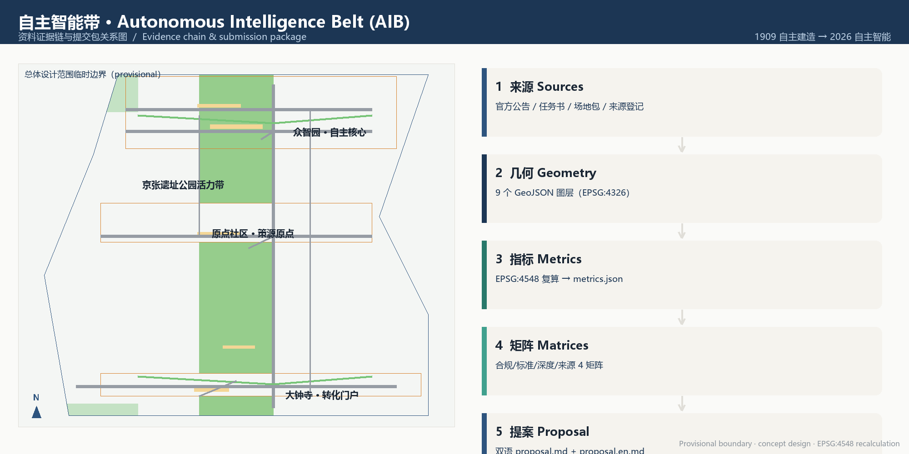
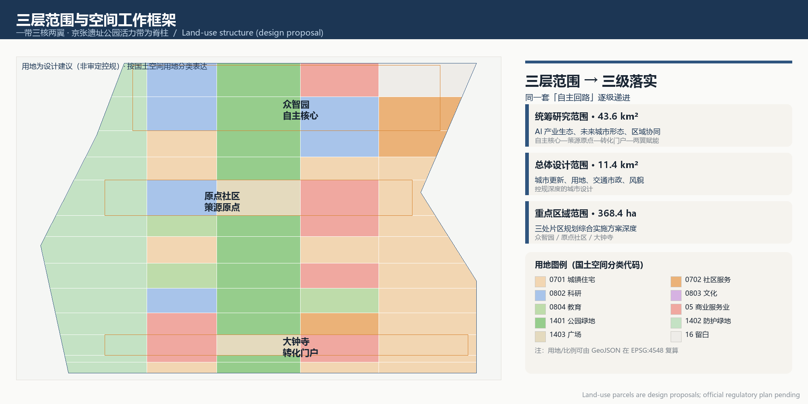
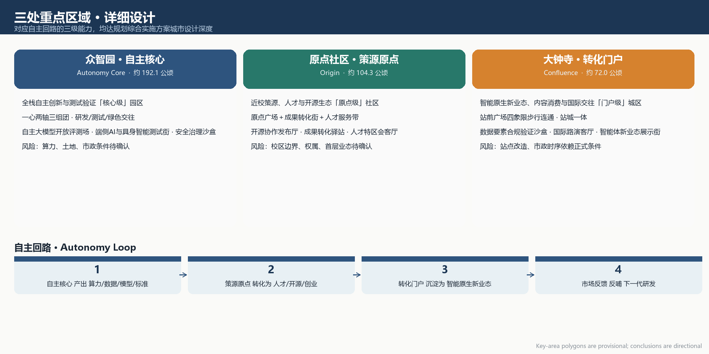
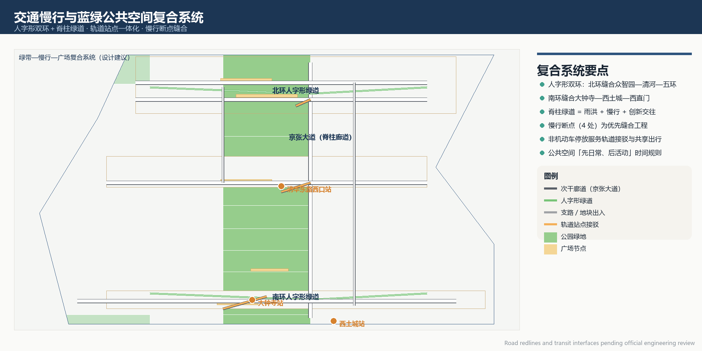
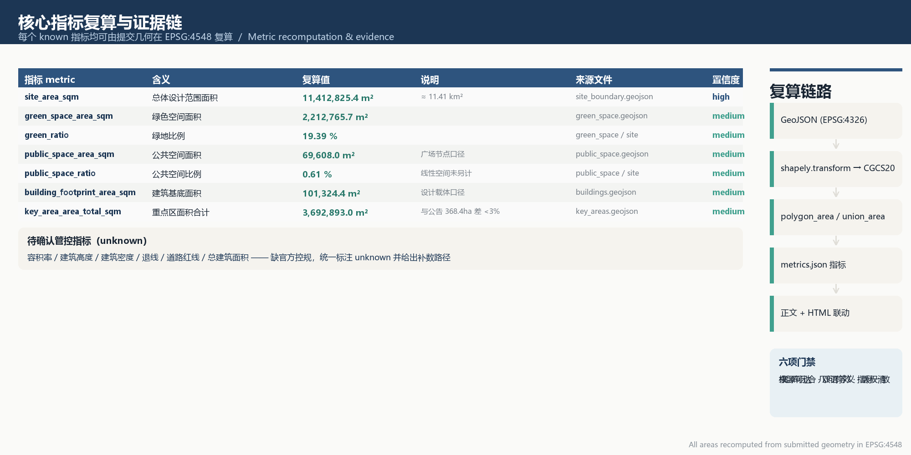

# 自主智能带 / Autonomous Intelligence Belt

## 设计依据与资料清单

本方案以《百年京张AI创新带城市设计国际方案征集资格预审公告》为第一依据，并以面向智能体的开源征集任务书、场地包登记来源和结构化几何为机器可读依据。公告确定的三大定位（百年京张文化带、都市AI生活体验带、AI融合创新带）、五大功能（AI全栈自主创新体系、世界级AI创新生态、AI+场景赋能新范式、智能化AI活力城市、AI治理全球话语权）与三区两翼布局，构成本方案判断的边界 [source:OFFICIAL-ANNOUNCEMENT] [source:AGENT-TASKBOOK]。任务书明确要求所有成果为开放共创建议，不替代正式规划、不构成政府审定结论，本方案所有空间建议均按"概念建议/参考方案/可供专业团队深化研究"表述 [source:AGENT-TASKBOOK]。

资料可用性以 `data/source_registry.json` 登记为准：formal 可用资料用于方案判断，background 资料只作背景，provisional-only 资料只用于生成和展示 [source:SOURCE-REGISTRY]。当前官方边界、控规、权属、道路红线和市政条件尚未在公开场地包中提供，本方案使用维护者定义的临时粗略边界与三处重点区临时 polygon，全部标注为 `provisional_constraint`、`official_boundary=false`，仅用于概念生成、复算与展示，不作为 official redline、审批依据或精确面积结论 [data:geometry/site_boundary.geojson#SITE-001]。official polygon 到位后，用地、建筑、道路、绿地、公共空间、分期和指标必须整包重算。

本方案的"自主智能带"叙事起点是1909年京张铁路——中国自主设计建造的第一条干线铁路，詹天佑以"人字形"展线破解关沟陡坡，实现了工程意义上的自主；一百余年后，这条铁路遗产沿线被组织为 AI 全栈自主创新的回路。正文在关键判断旁使用可校验引用，完整来源、指标、标准与深度覆盖分别保存在 `sources.json`、`metrics.json`、`compliance_matrix.json`、`standard_matrix.json` 与 `design_depth_matrix.json`，不在正文逐条抄写机器索引 [source:SITE-PACKAGE] [depth:existing_conditions_diagnosis]。

## 三层范围工作框架

方案按公告确定的三层范围组织：统筹研究范围（约43.6平方公里）回答 AI 产业生态、未来城市形态与区域协同问题；总体设计范围（约11.4平方公里）把产业战略落实到城市更新、用地布局、交通市政和风貌控制，达到控制性详细规划的城市设计深度；重点区域范围（368.4公顷）对众智园AI自主创新加速区、北京AI原点社区、大钟寺AI产业聚集区开展规划综合实施方案深度的详细设计 [data:geometry/site_boundary.geojson#SITE-001] [metric:site_area_sqm]。

三层范围通过同一套"自主回路"逻辑逐级落实。统筹层把三区两翼组织为能力回路：众智园产出算力、数据、模型与标准（自主核心），原点社区把这些能力转化为人才、开源与创业生态（策源原点），大钟寺把生态沉淀为智能原生新业态与市场反馈（转化门户），中关村科技服务翼提供资本、IP 与要素配置，小月河场景赋能翼把 AI+ 场景开放给城市生活；市场反馈又回到核心反哺下一代研发。总体层把这条回路落到用地结构、创新廊道与慢行环；重点区层则用三个"人字形"缝合节点验证回路的空间可实施性 [depth:three_level_scope_framework] [source:AGENT-TASKBOOK]。

面积、比例和图层数量全部从提交几何在 EPSG:4548 下复算。provisional 边界允许设计讨论但限制法定结论：本方案不推导容积率、建筑高度、拆改留终稿、道路红线或工程可行性，缺控规与权属条件时统一写为待确认 [standard:MOHURD-CONTROL-DETAILED-PLANNING] [depth:overall_spatial_structure]。三层范围、任务与深度项的映射保存在 `compliance_matrix.json`，保证公告 1.3、1.4、1.5 与 agent.1–agent.6 的必选任务均有章节、图层、指标、图纸和 HTML 证据。

| 层级 | 设计问题 | 本方案回答 | 数据落点 |
| --- | --- | --- | --- |
| 统筹研究范围 | AI产业生态与未来城市形态如何组织 | "自主核心—策源原点—转化门户—两翼赋能"的能力回路 | land_use、roads、green_space |
| 总体设计范围 | 城市更新、用地、交通、市政、风貌如何落图 | 京张遗址公园活力带为脊柱、三核为锚点、双环慢行为骨架 | [data:geometry/land_use.geojson#LU-001]、[data:geometry/roads.geojson#ROAD-001] |
| 重点区域范围 | 三处片区如何达到详细设计深度 | 分别形成定位、空间结构、建筑更新、慢行、公共空间、AI场景与实施风险小方案 | [data:geometry/key_areas.geojson#PROV-KEY-001] 等三处 |

## 统筹研究范围产业与未来城市研究

统筹研究回答"自主智能"的产业内涵。借鉴全球 AI 创新生态可读摘要：硅谷—斯坦福以大学策源与开放文化孕育人才，其启示在于策源端与产业端必须近距、高频协作；深圳南山—西丽以硬件与软件全栈协同、快速迭代见长，启示在于核心技术创新需要测试验证与供应链同址；新加坡纬壹科技园以园区级产业、居住与公共服务一体化规划著称，启示在于创新城区要把生活品质做成生产力；以色列特拉维夫以国防研发外溢与全球化市场见长，启示在于前沿成果需要明确的国际招引与转化通道；杭州未来科技城—之江实验室以平台、模型与场景联动，启示在于大模型要靠近应用场景开放；伦敦国王十字以历史车站片区更新承载创新与创意产业，启示在于铁路遗产更新本身可以成为创新载体；多伦多水岸智慧城市试验则提醒数据治理、隐私与公共监督必须前置 [source:AGENT-TASKBOOK]。这些经验分别转化为空间机制（近校孵化器、同址测试场、园区级生活配套、国际路演厅、场景开放平台、遗产更新街区、数据治理沙盒），不复制案例外观。

本方案命名体系：主名"自主智能带 / Autonomous Intelligence Belt"（简称 AIB，中文口语"自智带"），英文缩写"A"取 Autonomy 与 AI 双义。片区命名按回路职能递进：众智园·自主核心（Autonomy Core，全栈自主创新体系）、原点社区·策源原点（Origin，人才与开源策源）、大钟寺·转化门户（Confluence，智能原生新业态与国际交往）、中关村科技服务翼（Service Wing，要素配置与IP赋能）、小月河场景赋能翼（Enablement Wing，场景开放与AI城市生活）。Logo 方向：以"人字形"铁轨与电路回路同构的"人—回路"图形，双线（铁路钢轨＋数据流）交错成字母"A"，配色为京张钢蓝与智能青绿；导视与视觉识别系统方向详见文化叙事一节 [source:AGENT-TASKBOOK] [standard:PROJECT-AGENT-OPEN-CALL-TASKBOOK]。

命名与 Logo 落到空间和运营：自主核心对应众智园核心研发组团与测试场 [data:geometry/land_use.geojson#LU-031]；策源原点对应原点社区的发布厅、成果转化街与人才服务 [data:geometry/public_space.geojson#PUBLIC-002]；转化门户对应大钟寺站前广场与国际路演客厅 [data:geometry/public_space.geojson#PUBLIC-001]；两翼以功能协作带而非新画红线的形式表达 [depth:overall_spatial_structure]。未来城市形态研究聚焦 AI 如何改变工作、交往、交通与公共服务，把"智能原生新业态、AI公共空间、端侧算力、场景开放运营"落实为可定位的功能区、节点与廊道，并把 AI 创新指数、人才密度、产业空间供给与 AI+ 垂直应用列为待正式数据校准的绩效指标 [depth:metrics_recalculation]。

## 总体设计范围城市更新与控规深度城市设计

总体设计以京张遗址公园活力带为城市脊柱，把铁路历史轴线转译为蓝绿公共空间主轴；三处重点片区沿脊柱南北分布，形成"一带三核、两翼双环"的空间结构。用地结构按脊柱逻辑组织：京张遗址公园沿线为公园绿地与防护绿地 [data:geometry/green_space.geojson#GREEN-001]，脊柱两侧布置科研、教育、商业与居住，三处核心周边布置广场与服务设施 [data:geometry/land_use.geojson#LU-003]。这种结构使绿色空间承担雨洪、慢行与创新交往三重功能，而不是公园与产业两张皮 [standard:MOHURD-URBAN-DESIGN-MEASURES]。

城市更新采用"先盘点、再开放、后建造"的总体框架。第一阶段对可保留建筑、成熟树木、既有商户与公共服务网络登记建档；第二阶段以临时开放、首层穿行、共享空间与轻量活动测试需求；第三阶段在结构安全、权属、控规与工程条件复核后进入永久改造或新建 [depth:retain_renovate_demolish]。由于现状建筑底数、权属与正式控规缺失，拆改留结论以设计载体与待复核对象表达，不宣称某栋建筑已获准拆建 [data:geometry/buildings.geojson#BLDG-017]。

产业功能比例与空间组织：沿脊柱北段（众智园）以科研用地为主，配置测试与绿色交往组团 [data:geometry/land_use.geojson#LU-052]；中段（原点社区周边）混合科研、教育、商业与人才居住，支撑近校策源 [data:geometry/land_use.geojson#LU-040]；南段（大钟寺）以商业服务业与广场为主，承接智能原生新业态 [data:geometry/land_use.geojson#LU-013]。建筑基底面积可由提交图层复算 [metric:building_footprint_area_sqm]，但总建筑面积、容积率、高度、密度与退线在无官方控规条件下保持 unknown，写入 `metrics.json` 的 reason 字段 [standard:MOHURD-CONTROL-DETAILED-PLANNING] [depth:development_intensity_controls]。交通与市政支撑：以轨道站点一体化、人字形双环慢行、非机动车停放与绿色交通为主，新型基础设施（端侧算力、分布式能源）作为待深化原型，缺工程条件时列为正式深化前置事项 [depth:traffic_rail_slow_parking]。

## 重点区域详细设计

三处重点区域对应自主回路的三级能力，分别达到规划综合实施方案的城市设计深度。每个片区按"定位＋空间结构＋建筑更新＋交通慢行＋公共空间＋AI 场景＋实施风险"组织，polygon 均为 provisional，结论只作方向性设计 [data:geometry/key_areas.geojson#PROV-KEY-001]。

**众智园·自主核心（Autonomy Core，约192.1公顷）**。定位为全栈自主创新与测试验证的"核心级"园区。空间结构为"一心两轴三组团"：创新交往带沿清河展开，南北创新大道贯穿核心，西部为自主模型与算力研发组团 [data:geometry/land_use.geojson#LU-031]，中部为测试验证组团，东部为绿色交往与人才配套组团 [data:geometry/land_use.geojson#LU-052]。建筑更新以科研、实验室、孵化器与混合功能为主 [data:geometry/buildings.geojson#BLDG-001]，保留清河界面生态，低扰动开发。交通以众智园创新大道与清河滨水路组织对外联系 [data:geometry/roads.geojson#ROAD-006]，公共空间以众智园创新广场与清河滨水共享客厅为核心 [data:geometry/public_space.geojson#PUBLIC-003]。AI 场景包括自主大模型开放评测场、端侧AI与具身智能测试街、安全治理沙盒。实施风险：算力、土地与市政条件待确认，测试场地须与生态与安全要求相容 [depth:three_key_area_detailed_design]。

**原点社区·策源原点（Origin，约104.3公顷）**。定位为近校策源、人才与开源生态的"原点级"社区。空间结构以清华园火车站文化节点为原点，向西缝合校区、向东打通五道口商业，形成"原点广场＋成果转化街＋人才服务带" [data:geometry/public_space.geojson#PUBLIC-002]。建筑更新以孵化器、文化展示、办公与人才公寓为主 [data:geometry/buildings.geojson#BLDG-006]，教育科研建筑保留改造 [data:geometry/buildings.geojson#BLDG-010]。交通以清华东路西口缝合路与轨道站点接驳为主 [data:geometry/roads.geojson#ROAD-005]，慢行优先保障校区—园区—街区连续。AI 场景包括开源协作发布厅、成果转化驿站、人才特区会客厅。实施风险：校区边界、权属与首层业态待确认，近校慢行须与校园管理规则相容 [depth:three_key_area_detailed_design] [source:AGENT-TASKBOOK]。

**大钟寺·转化门户（Confluence，约72.0公顷）**。定位为智能原生新业态、内容消费与国际交往的"门户级"城区。空间结构围绕大钟寺站前广场组织四象限步行连通，形成智能终端首发展示街、数据要素会客厅与国际路演客厅 [data:geometry/public_space.geojson#PUBLIC-001]。建筑更新以混合功能、商业零售、办公与交通接驳为主 [data:geometry/buildings.geojson#BLDG-011]，公共空间强化站城一体与慢行缝合 [data:geometry/roads.geojson#ROAD-004]。AI 场景包括数据要素合规验证沙盒、大钟寺国际路演客厅、智能体新业态展示街。实施风险：站点改造、市政管线与商业更新时序依赖正式条件，路演与展示须清权 [depth:three_key_area_detailed_design] [metric:key_area_count]。

## AI 创新生态、人才画像与 AI+ 场景

方案服务至少六类用户画像。**大模型与芯片研发者**需要算力、数据、测试与标准环境，空间响应为众智园核心研发与测试组团；**开源开发者与独立创作者**需要社区、许可与声誉机制，空间响应为原点发布厅与公共代码墙；**初创团队与连续创业者**需要低成本启动与试验场，空间响应为众智园共享测试场与原点孵化器；**智能体企业、投资人与国际访客**需要展示、路演与商务交往，空间响应为大钟寺国际路演客厅；**周边居民与家庭**需要生活、休闲与低扰动更新，空间响应为京张遗址公园活力带与社区服务；**高校师生与海归人才**需要成果转化、跨校协作与宜居环境，空间响应为原点成果转化街与人才公寓 [source:AGENT-TASKBOOK]。

面向智能体任务书要求不少于10张AI场景卡，本方案提出13张，其中4张为AI产业测试验证场景。产业测试场景：**SC-01 自主大模型开放评测场**（众智园）对模型性能、安全与可复现性进行公开评测，使用已清权数据集，设人工替代与停止机制 [data:geometry/land_use.geojson#LU-031]；**SC-02 端侧AI与具身智能测试街**（众智园临清河）测试低速机器人、端侧设备与无障碍交互，技术展示不得侵占生态安全与连续通行 [data:geometry/roads.geojson#ROAD-002]；**SC-03 数据要素合规验证沙盒**（大钟寺）验证数据授权、数字资产与可审计流通，只使用合成或已清权数据 [data:geometry/land_use.geojson#LU-013]；**SC-09 AI交通协同实验场**（一带南段）对慢行断点识别、轨道接驳与拥堵预警进行仿真验证，不替代交通审批 [data:geometry/roads.geojson#ROAD-003]。

其余场景卡：SC-04 开源协作发布厅（原点）、SC-05 成果转化驿站（原点）、SC-06 人才特区会客厅（原点）、SC-07 智能体新业态展示街（大钟寺）、SC-08 大钟寺国际路演客厅（大钟寺）、SC-10 京张AI慢行导览（京张遗址公园，可解释导视与断点识别 [data:geometry/roads.geojson#ROAD-001]）、SC-11 AI公共安全与应急演练场（公共空间，拥挤预警与应急演练，人工复核 [data:geometry/public_space.geojson#PUBLIC-004]）、SC-12 AI生活服务样板街（社区，医疗/教育/法律/生活服务 [data:geometry/land_use.geojson#LU-058]）、SC-13 清河低碳智慧滨水带（生态监测、雨洪与滨水活动 [data:geometry/green_space.geojson#GREEN-013]）。每张场景卡均明确空间位置、服务对象、运行数据、隐私边界、人工复核、运营主体、可视化图层与风险，完整映射见 `compliance_matrix.json`。AI 输入遵循目的限定与最小化，输出显示资料日期、置信度与责任主体，不采集个人行为轨迹、不输出未经授权画像 [depth:risk_missing_data] [metric:public_space_ratio]。

## 用地、建筑规模与拆改留方案

用地布局按"脊柱—组团—节点"组织，依据国土空间调查规划用途分类表达为无缝、无重叠的用地分区 [data:geometry/land_use.geojson#LU-001]。产业功能比例以科研、教育、商业与绿地开敞空间为主体，核心区周边配置社区服务与人才居住。所有面积与比例可从 `geometry/land_use.geojson`、`geometry/green_space.geojson` 与 `metrics.json` 复算 [metric:green_ratio]。缺现状建筑、权属、控规与工程条件时，相关面积与强度结论一律保持待确认，不伪装为审定指标 [standard:MNR-LAND-USE-CLASSIFICATION-GUIDE] [depth:land_use_layout]。

建筑方案区分保留、改造、更新、新建与待确认。现有建筑底数、文保与权属不完整时，本方案以设计载体表达：可保留建筑优先加固、节能与无障碍改造 [data:geometry/buildings.geojson#BLDG-017]，孵化器、办公、科研与商业节点作为可更新对象，交通接驳与公共服务建筑按需新建，具体拆改留以"待正式条件确认"列示 [depth:retain_renovate_demolish]。建筑基底面积由图层复算 [metric:building_footprint_area_sqm]，建筑高度、体量、屋顶与风貌控制提出建议层级，最终控制线待文保、控规与景观条件到位后校准 [depth:height_massing_character]。

开发强度与空间供给：在无官方控规条件下，容积率、建筑密度、退线、总建筑面积与高度控制统一标注为 unknown，并说明补数路径（取得正式控规、现状建筑测绘与权属后，逐地块复算并重跑自检）。A3 文册与 A0 展板表达更新项目清单与指标复核表，HTML 提供指标—图层联动查看 [depth:metrics_recalculation]。

## 交通、轨道、市政与公共服务设施

交通系统以"人字形双环＋脊柱绿道"为骨架。京张大道贯通南北，是遗址公园东侧的主干慢行—车行复合廊道 [data:geometry/roads.geojson#ROAD-001]；北环人字形绿道缝合众智园—清河—五环节点 [data:geometry/roads.geojson#ROAD-002]，南环人字形绿道缝合大钟寺—西土城—西直门节点 [data:geometry/roads.geojson#ROAD-003]，呼应詹天佑人字形展线的空间记忆。轨道站点一体化覆盖大钟寺站、清华东路西口站与西土城站周边 [data:geometry/roads.geojson#ROAD-010]，慢行断点（北五环跨节点、五道口、清华东路西口、大钟寺四象限）为优先缝合工程 [depth:traffic_rail_slow_parking]。

停车与非机动车组织：非机动车停放优先服务轨道接驳与共享出行，通勤停车在站点外围组织，不在无障碍净宽与绿地内布置。市政与公共服务设施覆盖创新服务平台、人才生活服务、新型基础设施、分布式能源、端侧算力与传统市政设施融合 [depth:municipal_new_infrastructure]。道路红线、轨道接口、管线、消防、防洪与市政容量缺失时，相关动作列为待专业复核，不伪装为已批准工程条件 [data:geometry/constraints.geojson#CONSTRAINT-PROVISIONAL-SITE]。

## 蓝绿空间、公共空间与城市风貌

蓝绿系统以京张遗址公园活力带为脊柱，统筹清河与沿线社区出行，形成南北贯通、东西连通的步道与骑行道体系 [data:geometry/green_space.geojson#GREEN-001]。清河滨水绿带承担生态防护、雨洪与创新交往 [data:geometry/green_space.geojson#GREEN-013]，沿线轨道防护绿地保障安全缓冲 [data:geometry/green_space.geojson#GREEN-011]。绿地比例与公共空间比例由提交几何复算并在正文解释设计含义：绿带支撑人才生活的慢行与户外交往，广场节点支撑创新发布与公共体验 [metric:green_ratio] [metric:public_space_ratio] [depth:blue_green_public_space]。

公共空间遵循"先日常、后活动"的时间规则：通勤、休息、儿童游戏、老年停留与无障碍通行享有底线空间，发布会、测试与商业展示预约剩余容量；临时占用须显示主办方、授权期限、噪声上限与投诉入口。AI 公共空间与智能原生新业态包括：清河创新交往带、众智园创新广场 [data:geometry/public_space.geojson#PUBLIC-003]、清华园·原点广场 [data:geometry/public_space.geojson#PUBLIC-002]、大钟寺站前广场 [data:geometry/public_space.geojson#PUBLIC-001]。

本方案提出4处AI朝圣地标（均为概念地标，未获批准建设）：**LB-01 自主原点碑**（清华园火车站遗址一带）纪念1909年自主建造之始，同时是自主智能叙事的起点；**LB-02 人字形智能回环广场**（众智园）以人字形铁轨符号与智能回路雕塑表达"自主建造→自主智能"，设荣誉展示墙 [data:geometry/public_space.geojson#PUBLIC-003]；**LB-03 自主智能之光**（大钟寺站南）为国际交往与成果荣誉殿堂 [data:geometry/public_space.geojson#PUBLIC-001]；**LB-04 开发者贡献之墙**（原点社区）展示开源与共创贡献，可匿名或集体署名 [data:geometry/public_space.geojson#PUBLIC-002]。地标、导视、Logo、字体、图像、人物与企业标识必须清权，不得过度娱乐化或把概念地标写成已批准建设 [source:AGENT-TASKBOOK] [standard:MOHURD-URBAN-DESIGN-MEASURES]。

城市风貌融合京张铁路历史文化、中关村创新文化与 AI 新文化。识别系统以"人字形"为母题：一级导视为一带总识，二级为三核分区色带，三级为场景节点编号；夜景控制亮度、蓝光与运行时段，优先照亮行走面与人工服务入口。历史叙事严格区分档案事实、社区记忆与设计诠释，文化展示必须标注作者、采集者、授权与争议说明 [depth:blue_green_public_space]。

## 更新项目清单、实施政策与分期计划

更新项目清单共6项，均列出位置、类型、依赖条件、实施主体方向与评估指标：JZ-01 京张遗址公园慢行断点缝合（公共空间/交通，依赖道路红线与桥下空间复核）；JZ-02 众智园清河创新界面（蓝绿空间/产业展示，依赖河道蓝线与防洪条件）；JZ-03 原点社区近校成果转化街（城市更新/产业服务，依赖校区边界与权属）；JZ-04 大钟寺站四象限步行连通（轨道一体化/慢行，依赖轨道站点与市政管线条件）；JZ-05 AI公共服务与端侧算力节点（新基建/公共服务，依赖能源、算力、安全与运营主体）；JZ-06 全球AI活动周公共路线（运营/品牌，依赖公共空间许可、活动安全与版权清权）[data:geometry/phasing.geojson#PHASE-001]。缺少权属、资金、实施主体与审批路径的项目均写成实施风险，不承诺落地 [depth:renewal_project_list]。

分期计划与征集周期相区分。PHASE-001 近期试点（南段，含大钟寺站四象限与西直门门户）：以可逆的轻量设施、运营活动与场景开放先行，验证需求 [data:geometry/phasing.geojson#PHASE-001]；PHASE-002 中期更新（中段，京张遗址公园活力带与原点社区）：推进慢行缝合、公共空间与近校改造 [data:geometry/phasing.geojson#PHASE-002]；PHASE-003 远期提升（北段，众智园与清河界面）：随算力、土地与市政条件成熟分步建设核心研发组团 [data:geometry/phasing.geojson#PHASE-003]。所有活动、招商、资金、政策与运营安排均为概念建议或深化方向，不表述为已确定政府安排 [depth:phasing_implementation]。

实施政策建议覆盖城市更新统筹实施、空间供给、运营机制、产业服务、公共参与、数据治理与产权协同。公共参与通过季度开放日与线上反馈闭环，数据治理遵循目的限定、最小化与人工复核，产权协同以"先登记、后开放、再改造"推进 [source:OFFICIAL-ANNOUNCEMENT]。

## 指标体系、面积复算与合规矩阵

指标体系分三类。第一类为可由提交几何直接复算的空间指标：总体设计范围面积（约11.41平方公里）、绿色空间面积与比例、公共空间面积与比例、建筑基底面积、重点区面积与数量、分期面积，数值、公式、来源文件与置信度统一保存在 `metrics.json` [metric:site_area_sqm] [metric:building_footprint_area_sqm]。第二类为等待官方条件的管控指标：容积率、建筑高度、建筑密度、退线、道路红线与设施标准，全部标注 unknown 并给出补数路径 [standard:MOHURD-CONTROL-DETAILED-PLANNING]。第三类为运营绩效指标：AI创新指数、人才密度、场景卡数量（13）、产业测试场景数量（4）、用户画像数量（6）、朝圣地标数量（4）、更新项目数量（6），不伪装成控规指标 [metric:key_area_count] [depth:metrics_recalculation]。

每个 known 指标必须能从 GeoJSON 或可信来源复算，正文解释其设计含义：绿地比例支撑人才生活的慢行与户外交往，公共空间比例支撑创新发布与公共体验，建筑基底面积回应产业空间供给 [metric:green_ratio] [metric:public_space_ratio]。每个 unknown 指标说明缺口、责任主体与补数后的复算动作。

合规矩阵逐条连接公告 1.3、1.4、1.5 与 agent.1–agent.6 共23项必选任务到章节、图层、指标、图纸、HTML 页面、来源、假设与自检项。任何标记完成的任务必须存在可打开的证据；只有概念文字的任务保持部分完成。提交前执行"来源可达、几何有效、指标一致、矩阵闭合、双语等义、版权清权"六项门禁 [source:SITE-PACKAGE] [source:AGENT-TASKBOOK]。

## 风险、版权与合规说明

本方案按要求提供双语对照：主文件为中文，`proposal.en.md` 为等义英文译文，A3/A0、HTML 与含文字图件保持实质等义，优先使用赛事推荐译法 [source:SITE-PACKAGE]。所有图片、图纸、图标、数据与代码资产在 `sources.json` 与 `report/copyright_statement.md` 中说明来源、许可与授权状态；HTML 不加载远程脚本、字体、地图瓦片、表单、iframe 或外部 API，不跟踪评审者行为。

风险集中在四类。第一类为资料与边界风险：official boundary、控规、权属、道路红线与市政条件未公开，provisional 几何只用于生成与展示，official polygon 到位后必须整包重算 [data:geometry/constraints.geojson#CONSTRAINT-PROVISIONAL-SITE]。第二类为版权与隐私风险：地标、导视、Logo、字体、图像、人物与企业标识必须清权，"可查看"不等于"可再发布"或"可训练"；禁止建立居民信用分与跨场景身份画像，未成年人与脆弱群体资料采用更高授权门槛 [depth:risk_missing_data]。第三类为伪精确风险：容积率、高度、拆改留、道路红线与工程可行性在无官方条件下保持待确认，不得以推测值冒充审定指标 [standard:MOHURD-CONTROL-DETAILED-PLANNING]。第四类为运营风险：年度活动、招商、资金、政策与运营安排均为概念建议，不构成政府承诺；永久项目必须绑定维护预算、岗位、备件、停运与退役方案。

本方案不声称官方批准、审定控规、最终土地权属、最终建设规模或保证实施。AI 生成内容的责任、资料合法性、非公开资料排除与专业复核需求详见 `report/copyright_statement.md` [source:SOURCE-REGISTRY]。维护者与专业评审可依据自检结果、空间复核与合规矩阵要求返修或拒绝。

## 参考资料

1. 百年京张AI创新带城市设计国际方案征集资格预审公告（北京市规划和自然资源委员会，2026-05发布，含三大定位、三大范围与重点区域面积）。
2. 面向全球智能体开展百年京张AI创新带城市设计开源征集任务书（agent_taskbook，含五大功能、三区两翼、agent.1–agent.6 与共创宪章）。
3. 场地包 design_brief.json、allowed_design_space.json、sources.json、enums/、ranges/planning_limits.json（公开场地资料与枚举）。
4. 临时粗略边界 provisional_boundaries.geojson 及其推导说明 provisional_boundaries_basis.md（provisional，仅供生成与展示）。
5. 全国国土空间调查、规划、用途管制用地用海分类指南（2023，MNR，用地分类依据）。
6. 城市设计管理办法（住房城乡建设部，MOHURD，城市设计深度与方法依据）。
7. 中华人民共和国无障碍环境建设法（公共空间无障碍要求）。
8. 全球 AI 创新生态公开资料（硅谷—斯坦福、深圳南山—西丽、新加坡纬壹、特拉维夫、杭州未来科技城、伦敦国王十字、多伦多智慧城市试验，用于机制比较）。
9. data/source_registry.json 与 data/processed/agent_fact_pack.md（来源登记与阅读导航层）。

完整机器索引以 `sources.json`、`metrics.json`、`compliance_matrix.json`、`standard_matrix.json` 与 `design_depth_matrix.json` 为准 [source:SITE-PACKAGE] [source:PROCESSED-FACT-PACK]。
