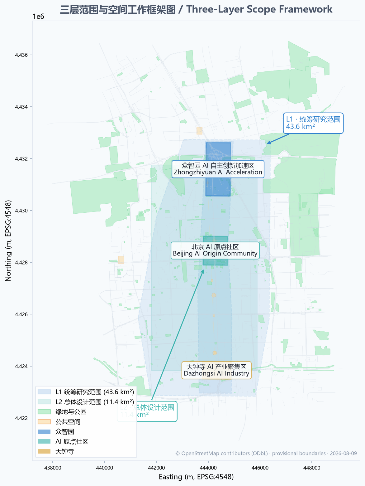
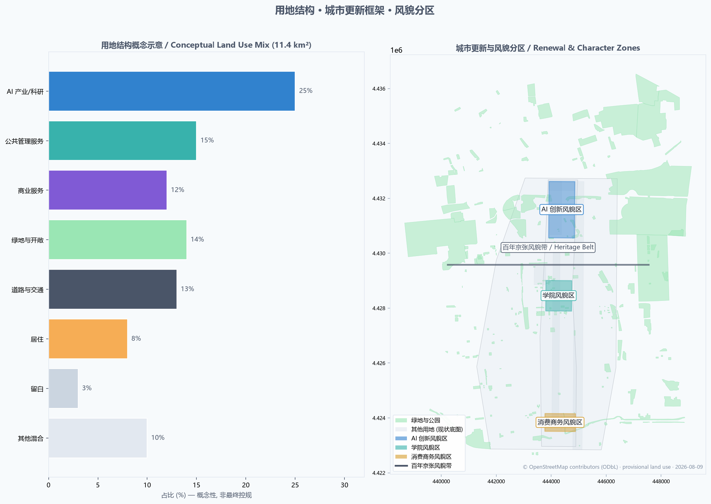
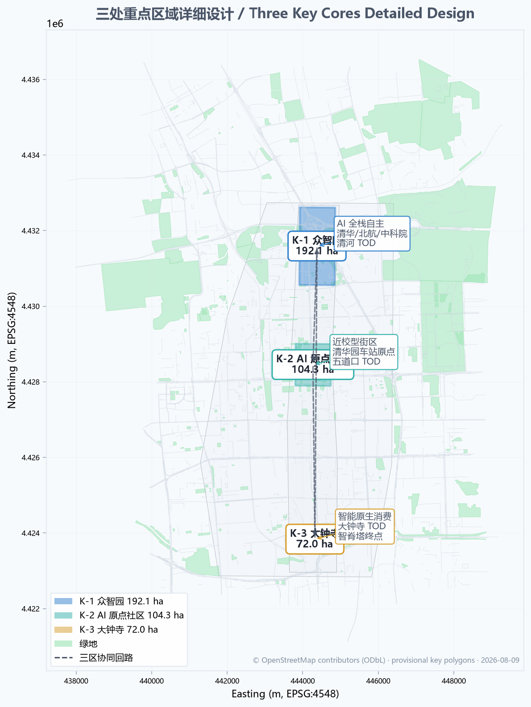
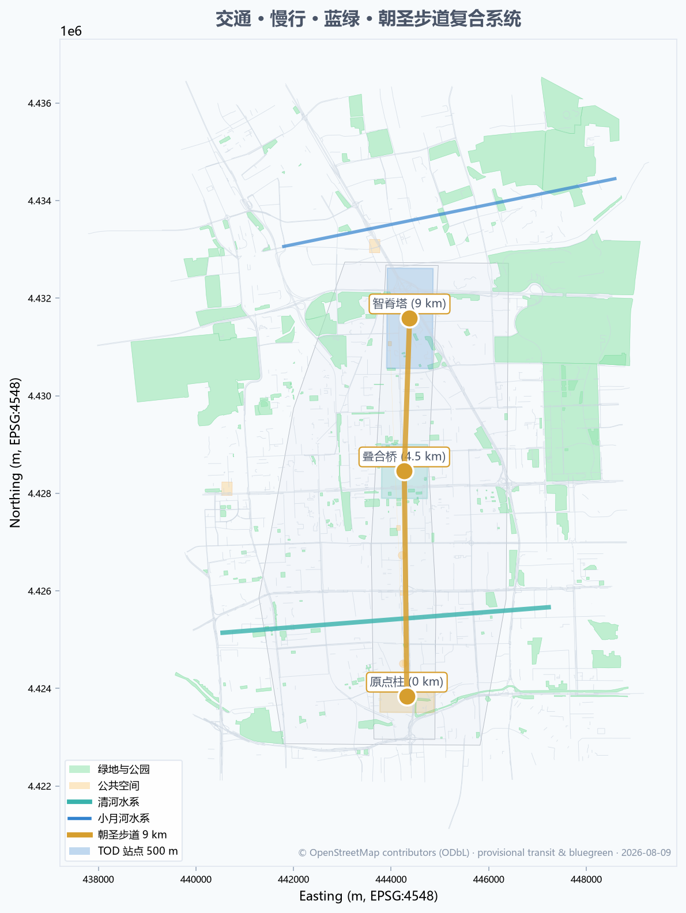
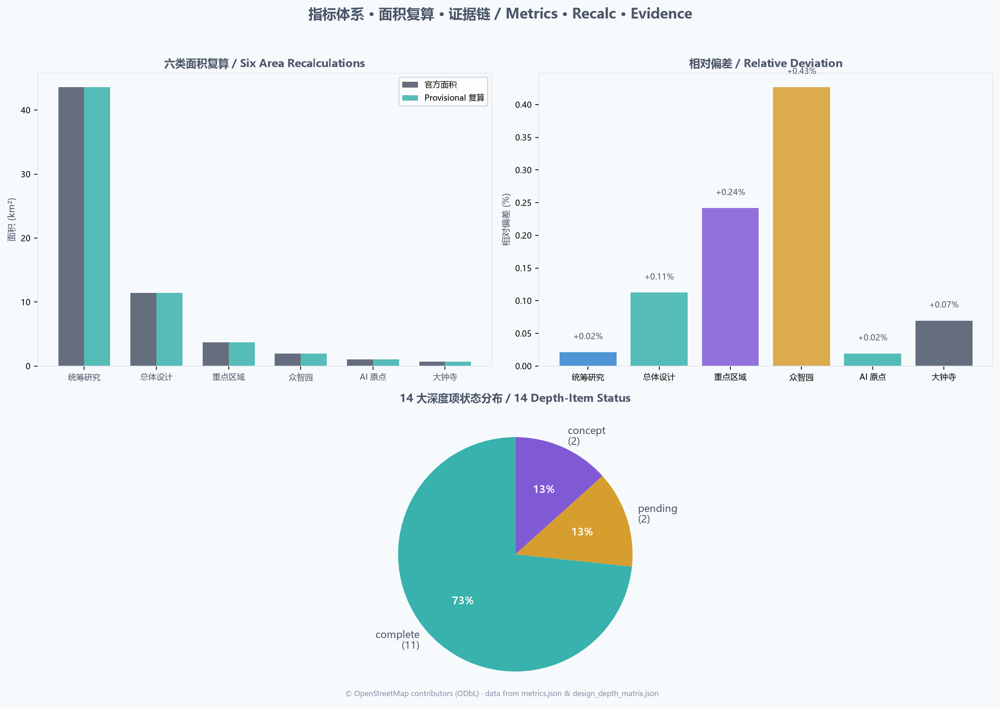

# Centennial.AI Origin — Layered Cultural Convergence

> 京张 AI 原点 · 三层文化叠合 / Layered Cultural Convergence

## Design Basis and Source List

This proposal is grounded in publicly available or cleared materials. All citations are recorded in full in `sources.json`.

**Project Official Sources (Authority A0)**
- Beijing Municipal Commission of Planning and Natural Resources, Haidian Branch: "Centennial Jingzhang AI Innovation Belt Urban Design International Open Call — Prequalification Announcement" (2026-05-09) — master reference for project scope, tasks, and design depth [source:PROJECT-OFFICIAL-ANNOUNCEMENT]
- Beijing Municipal Science & Technology Commission and Zhongguancun Administrative Committee: "Three Areas Two Wings: Building a World-Class AI Cluster" (2026-04-03) — three-areas/two-wings positioning and industrial space context [source:SRC-2026-BJ-KW-THREE-AREAS-WINGS]

**Agent Open Call Taskbook (cleared user document)**
- Agent Taskbook Summary (user-provided, cleared) — three positionings, five functions, three-areas/two-wings, six agent tasks [source:PROJECT-AGENT-OPEN-CALL-TASKBOOK]

**Upper-Level Plans and Industrial Policy (A0)**
- State Council: "Opinions on Deepening the 'AI Plus' Action" (2025-08)
- Beijing 15th Five-Year Plan Outline (2026-2030)
- Haidian District 15th Five-Year Plan Outline — Haidian AI high-ground, Jingzhang-related formulations
- Haidian "1+X+1" Modern Industrial System

**Professional Standards (A0)**
- MOHURD: Urban Design Management Measures (2017-03-14, revised 2023) [standard:MOHURD-URBAN-DESIGN-MEASURES]
- MOHURD: Measures for the Compilation and Approval of Regulatory Detailed Planning of Cities and Towns (2022-01-25) [standard:MOHURD-CONTROL-DETAILED-PLANNING]
- Ministry of Natural Resources: Classification Guide for Territorial Space Survey, Planning, and Use Control (2023-11-22) [standard:MNR-LAND-USE-CLASSIFICATION-GUIDE]

**Geographic Base Map and Park Culture (open data, ODbL)**
- OpenStreetMap via Overpass API — highway, railway, subway, public transport, park, waterway, bbox 39.935-40.055 N / 116.300-116.395 E (103,167 elements extracted under ODbL license [source:OSM-Overpass-2026-08-09])
- Beijing Municipal Bureau of Landscape and Greening: Jingzhang Railway Heritage Park Phase I/II materials
- Beijing Municipal Cultural Heritage Bureau: Tsinghua Yuan Railway Station heritage protection scope

**Statistics (A0)**
- Haidian District 2025 Statistical Communique
- Haidian District Fifth National Economic Census
- Haidian District 2024 Statistical Communique

**International Case Studies (P2, background only)**
- Brookings: The Rise of Innovation Districts
- OECD: Smart Cities and Inclusive Growth
- UN-Habitat: AI & Cities — Risks, Applications and Governance
- 9 candidate cases: Kendall Square, 22@Barcelona, King's Cross, Paris-Saclay, Station F, Toronto Waterfront, Cortex, Tonsley, Boston Seaport

**Source Tier Usage**
This proposal strictly observes the source tiers in `data/source_registry.json` and `brief/site-package/sources.json`:
- ✅ Formal evidence: A0/A1 government announcements, policies, plans, standards, statistical communiques
- ⚠️ Documented ODbL: OSM geographic base map
- ⚠️ Background only: international reports, news
- ❌ Forbidden: unauthorized commercial map POI/street view, non-public spatial data, personal privacy

**Disclosed Data Gaps**
The following data are pending official release; this proposal treats them as provisional throughout, and will recalculate after official data is published:
- Official precise boundaries (three scope levels + three core areas)
- Regulatory detailed planning conditions (FAR, building height, green ratio, setback)
- Existing building footprints and ownership
- Heritage protection lines, fire, municipal pipelines
[depth:data_gap_transparency]



---

## Three-Level Scope Framework

This proposal follows the project's three-level scope strictly, with corresponding geometry, metrics, and depth matrices at each level.

### Level 1 · Coordinated Research Area (43.6 km²)

- **Goal**: Strategic research on industrial strategy, future urban forms, Jingzhang heritage, and AI new culture.
- **Spatial boundary**: Bounded by North 5th Ring Road to the north, Jingzang Expressway to the east, Xizhimen Outer Street to the south, and Wanquanhe Road to the west [source:PROJECT-OFFICIAL-ANNOUNCEMENT].
- **Area**: 43.6 km² (official text boundary, approximate) [metric:coordinated_research_area_sqm].
- **Design depth**: Strategic research level; identify global cases, AI full-stack elements, future urban forms.
- **Deliverables**: `geometry/site_boundary.geojson` (provisional), `assets/figures/site-overview.png`.

### Level 2 · Overall Design Area (11.4 km²)

- **Goal**: City-design-depth implementation of industrial goals, functional layout, renewal framework, transport/municipal, vitality corridor, and city character.
- **Spatial boundary**: Urban and industrial area within 1-2 km of the Jingzhang Heritage Park; North 5th Ring Road to the north, Xueyuan Road / Xitucheng Road to the east, Xizhimen Outer Street to the south, Dazhongsi East Road / Heqing Road to the west [source:PROJECT-OFFICIAL-ANNOUNCEMENT].
- **Area**: 11.4 km² (provisional recalculation 11.4128 km², +0.11% deviation) [metric:overall_design_area_sqm].
- **Design depth**: Regulatory-plan-depth urban design.
- **Deliverables**: `geometry/land_use.geojson`, `geometry/buildings.geojson`, `geometry/roads.geojson`, `geometry/green_space.geojson`, `geometry/public_space.geojson`, `assets/figures/land-use-structure.png`.

### Level 3 · Key Detailed Design Area (368.4 ha)

- **Goal**: Fine-grained design for the three core areas, achieving comprehensive planning implementation depth.
- **Spatial boundary**: From north to south, Zhongzhiyuan AI Independent Innovation Acceleration Area, Beijing AI Origin Community, and Dazhongsi AI Industry Cluster [source:PROJECT-OFFICIAL-ANNOUNCEMENT].
- **Area**: 368.4 ha (provisional recalculation 369.29 ha, +0.24% deviation) [metric:key_detailed_design_area_sqm].
- **Three Core Areas**:
  - Zhongzhiyuan AI Independent Innovation Acceleration Area — 192.1 ha (provisional 192.92 ha, +0.43%) [metric:zhongzhiyuan_ai_acceleration_area_sqm]
  - Beijing AI Origin Community — 104.3 ha (provisional 104.32 ha, +0.02%) [metric:beijing_ai_origin_community_sqm]
  - Dazhongsi AI Industry Cluster — 72.0 ha (provisional 72.05 ha, +0.06%) [metric:dazhongsi_ai_industry_cluster_sqm]
- **Design depth**: Comprehensive planning implementation depth.
- **Deliverables**: `geometry/key_areas.geojson`, `assets/figures/key-areas.png`, `drawings/a3-booklet.pdf`, `drawings/a0-boards.pdf`.

### Three-Level Scope Cascade Logic

```text
Coordinated Research Area (43.6 km²)
└── Strategic positioning, five functions, global cases, naming system, Logo direction
    ↓ Implementation
Overall Design Area (11.4 km²)
└── Urban renewal framework, industrial space, transport/municipal, blue-green system, city character
    ↓ Cascade
Key Detailed Design Area (368.4 ha)
└── Three core areas fine design, AI scenarios, public space, pilgrimage landmarks
```

### Provisional Boundary Disclosure

This proposal adopts the repository's `brief/site-package/geometry/provisional_boundaries.geojson` as a temporary rough boundary, derived from official announcement text descriptions, location cues, and approximate areas, with recalculation precision of +0.02% to +0.43% (well below tolerance). All elements continue to set `geometry_role=provisional_constraint` and `official_boundary=false`. After official polygon release, all layers and metrics must be regenerated.



---

## Coordinated Research Area: Industry and Future City Research

### 1. Naming System

**Primary name**: **Centennial.AI Origin** (京张 AI 原点)
- Subtitle: **Layered Cultural Convergence** (三层文化叠合)
- English short form: **Centennial.AI Origin**

**Naming Logic**
- "Centennial" → 100 years since the Jingzhang Railway (1909)
- "AI" → AI as the defining technology of our era
- "Origin" → shared starting point that links industrial and digital eras
- "Layered Cultural Convergence" → core conceptual differentiation from peer proposals (signal yard / symbiosis corridor / mending belt)

**Logo Direction (concept)**
- Core graphic: **Layered Ring** — three concentric rings representing three cultural layers
  - Outer ring (industrial grey, #4A5568): 1909 Centennial Jingzhang
  - Middle ring (innovation blue, #3182CE): 1980s Zhongguancun
  - Inner ring (intelligent teal, #38B2AC): 2020s AI new culture
- Type: modern sans-serif, bilingual equal-width
- No unauthorized trademarks, fonts, or portraits
[depth:naming_concept]

### 2. Three Positionings and Five Functions

**Three Positionings** [source:PROJECT-OFFICIAL-ANNOUNCEMENT]
- Centennial Jingzhang Cultural Belt
- Urban AI Lifestyle Experience Belt
- AI Convergence Innovation Belt

**Five Functions** [source:PROJECT-AGENT-OPEN-CALL-TASKBOOK]
- AI Full-Stack Independent Innovation System
- World-Class AI Innovation Ecosystem
- AI+ Scenario Empowerment Paradigm
- Intelligent AI Vital City
- Global AI Governance Discourse Power

### 3. Three Areas Two Wings Coordination Loop

**Three Core Areas (north to south)**
1. **Zhongzhiyuan AI Independent Innovation Acceleration Area** (192.1 ha) — full-stack basic research [depth:key_area_zhongzhiyuan]
2. **Beijing AI Origin Community** (104.3 ha) — startup incubation, near-university innovation district [depth:key_area_ai_origin]
3. **Dazhongsi AI Industry Cluster** (72.0 ha) — intelligent-native retail and business scenarios [depth:key_area_dazhongsi]

**Two Wings**
- Zhongguancun Technology Service Wing (west) — capital, IP, global factor allocation
- Xiaoyuehe Scenario Empowerment Wing (east) — scenario experimentation, vitality experience, AI+ public services

**Coordination Loop**: basic research (Zhongzhiyuan) → incubation (AI Origin) → industrial landing (Dazhongsi); capital/factors (Tech Service Wing) → scenarios/experience (Xiaoyuehe Wing)

### 4. Global AI Innovation Ecosystem Cases (5-8)

Each case extracts a "transferable mechanism" and a "limitation that prevents direct transplanting".

1. **Kendall Square (Boston)** [source:Brookings-Innovation-Districts]
   - Anchor: MIT + Harvard Medical
   - Mechanism: walkable mixed-use + academia-startup direct interface
   - Borrow: Zhongzhiyuan's adjacency advantage with Tsinghua/Beihang
   - Limit: US institutional differences

2. **22@Barcelona** [source:Brookings-Innovation-Districts]
   - Anchor: Pompeu Fabra University + multiple corporate HQs
   - Mechanism: industrial heritage (19th-century) converted to innovation district
   - Borrow: Jingzhang railway heritage as a cultural-convergence base
   - Limit: lower density than Haidian

3. **King's Cross Knowledge Quarter (London)**
   - Anchor: Google UK / DeepMind / Central Saint Martins
   - Mechanism: railway-station heritage reborn as knowledge + innovation + culture complex
   - Borrow: Jingzhang Heritage Park and cultural-convergence axis
   - Limit: UK planning system differs from China

4. **Paris-Saclay** [source:Brookings-Innovation-Districts]
   - Anchor: Paris-Saclay University + CNRS
   - Mechanism: national science city + AI cluster
   - Borrow: Zhongzhiyuan's full-stack positioning
   - Limit: French research system

5. **Station F (Paris)**
   - Anchor: Xavier Niel + 30+ national startup programs
   - Mechanism: world's largest incubator (single building)
   - Borrow: AI Origin Community developer density
   - Limit: single-building vs. district scale

6. **Toronto Waterfront** [source:UN-Habitat-AI-Cities]
   - Anchor: Sidewalk Labs (exited) + Waterfront Toronto
   - Mechanism: smart-city experimentation + data-governance framework
   - Borrow: Xiaoyuehe's "AI+ public services"
   - Limit: project never built; cite carefully

7. **Zhongguancun (Haidian, China)** [source:海淀-1X1-现代化产业体系]
   - Anchor: Tsinghua, PKU, CAS + ByteDance, Baidu
   - Mechanism: academia + large enterprise + startup triple stack
   - Borrow: a real-world reference within the proposal area
   - Limit: not an external benchmark

8. **Qianhai (Shenzhen, China)** [source:Shenzhen Qianhai public materials]
   - Anchor: Qianhai Authority + HKEX + tech enterprises
   - Mechanism: cross-border innovation cooperation + AI+ governance experimentation
   - Borrow: Dazhongsi intelligent-native business policy mechanism
   - Limit: special economic zone

[depth:global_case_study]

### 5. AI Innovation Ecosystem Map

Based on the eight global cases and Haidian's local ecosystem:

| Dimension | Land Location at Centennial.AI Origin |
|---|---|
| **Basic Research** | Zhongzhiyuan AI full-stack system (Tsinghua, Beihang, CAS AI Institute) |
| **Incubation** | AI Origin Community (near-university, talent zone) |
| **Industry Cluster** | Dazhongsi intelligent-native consumer and business |
| **Capital & IP** | Zhongguancun Tech Service Wing (global factor allocation) |
| **Scenario & Experience** | Xiaoyuehe Scenario Empowerment Wing (vitality city + AI+ public services) |

[depth:innovation_ecosystem_map]

---

## Overall Design Area: Urban Renewal and Regulatory-Plan-Level Urban Design

### 1. Industrial Goals and Functional Layout

[source:PROJECT-OFFICIAL-ANNOUNCEMENT]
[standard:MOHURD-CONTROL-DETAILED-PLANNING]

**Distribution of five functions across 11.4 km²**:
- Zhongzhiyuan (north) — basic research, AI full-stack
- AI Origin Community (center) — incubation, talent, district
- Dazhongsi (south) — industry, consumer, scenarios
- Tech Service Wing (west) — capital, IP, global factors
- Scenario Empowerment Wing (east) — experience, public services, AI+

**Land Use Ratios (conceptual)** [data:geometry/land_use.geojson]
- AI industrial land (~35%) — 0702 / 0802 / 0804
- Public management & services (~15%) — 08
- Commercial services (~12%) — 05
- Green and open space (~14%) — 14
- Roads and transport (~13%) — 1207
- Residential (~8%) — 0701
- Reserved (~3%) — 16

**Note**: The above ratios are conceptual spatial structure sketches. Final ratios must follow official regulatory controls. All ratios are provisional pending official controls.

[depth:land_use_layout]

### 2. Urban Renewal Framework

[source:PROJECT-OFFICIAL-ANNOUNCEMENT]
[depth:urban_renewal_framework]

**Renewal Potential Zones** (based on OSM current conditions, not ownership judgments):
1. **Preserve and renew**: Tsinghua, PKU, Beihang, BUPT campuses and ancillary facilities (~30%)
2. **Low-impact renewal**: Existing low-density offices and residential (~35%)
3. **Priority renewal**: Areas around metro stations and industrial-transition plots (~25%)
4. **Strategic reserve**: Future public space and ecological corridors (~10%)

**Functional Mix Guidance** (building type enums):
- AI R&D / Lab / Incubator (ai_r_and_d / lab / incubator)
- Office / Mixed-use (office / mixed_use)
- Education-supporting (education)
- Talent apartment / Residential (talent_apartment / residential)
- Community service (community_service)
- Commercial service (retail)
- Cultural exhibition (cultural)
- Mobility hub (mobility_hub)

**Retain/Renovate/Demolish Classification (conceptual)** [depth:retain_renovate_demolish]
- **Preserve**: Tsinghua, PKU, Beihang, BUPT campus cores; Tsinghua Yuan Railway Station site
- **Renovate**: existing offices, industrial parks (functional upgrade, low-carbon renovation)
- **Build**: metro-station TOD, under-bridge space, reserved plots
- **Demolish**: violations, inefficient industrial remnants (requires ownership confirmation)

⚠️ This proposal does not commit to specific parcel-level retain/renovate/demolish conclusions; all suggestions must be confirmed by official ownership and existing-condition surveys.

### 3. Transport, Rail, Municipal Infrastructure, and Public Services

[source:PROJECT-OFFICIAL-ANNOUNCEMENT]
[depth:transport_rail_municipal]

**Metro Network (based on OSM)**:
- Lines 4, 10, 13, Changping Line
- Key stations: Xizhimen, Dazhongsi, Wudaokou, Qinghe

**Slow-traffic System (conceptual)**:
- 9-km **Pilgrimage Trail** along Jingzhang Heritage Park (linking three core areas)
- Xueyuan Road / Xitucheng Road slow-traffic priority retrofit (subject to road redlines)
- Xiaoyuehe waterfront slow-traffic
- 500-m coverage around metro stations

**New Infrastructure (conceptual)**:
- Distributed computing nodes (integrated with Xiaoyuehe Scenario Wing)
- Edge AI inference (smart wayfinding on the Pilgrimage Trail)
- 5.5G/6G experimental network
- Data governance and privacy computing facilities

⚠️ All transport/municipal suggestions must be confirmed by official road redlines, sections, pipelines, and fire data; this proposal does not commit engineering feasibility.

### 4. Jingzhang Heritage Park Vitality Corridor

[source:PROJECT-OFFICIAL-ANNOUNCEMENT]
[depth:jingzhang_park_corridor]

**Corridor composition**:
1. Jingzhang Railway Heritage Park main axis (9 km north-south)
2. Pilgrimage Trail (main axis slow-traffic)
3. Public nodes (one pilgrimage landmark per 1.5 km)
4. Under-bridge space activation (stitched with urban roads)
5. AI public space (smart wayfinding, AR, open data)

**North-South Penetration and East-West Connection**:
- North-south: Jingzhang Heritage main axis through three core areas (Tsinghua Yuan → Dazhongsi)
- East-west: through under-bridge space and building setbacks
- Xueyuan Road crossing node (subject to road redlines)

### 5. City Character

[standard:MOHURD-URBAN-DESIGN-MEASURES]
[depth:city_character]

**Character Zones**:
- **Centennial Jingzhang Character Belt** (along the heritage main axis) — industrial heritage + contemporary exhibition
- **Academic Character Zone** (around Tsinghua, PKU, Beihang) — campus fabric continuity
- **AI Innovation Character Zone** (Zhongzhiyuan, AI Origin Community) — contemporary research offices
- **Consumer Business Character Zone** (Dazhongsi) — intelligent-native business

⚠️ This proposal does not commit specific FAR, building height, or building density; final values must follow official regulatory controls.

### 6. Planning Innovation Response

**Territorial Spatial Planning Innovation**:
- Three-layer cultural convergence as a "cultural gene layer" in spatial planning
- Jingzhang Railway heritage as a linear heritage base
- Provisional boundaries as an AI-agent bootstrap mechanism (keeps generation possible before official polygon release)

**Spatial-Industrial Integration**:
- No one-to-one correspondence between space function and industry (e.g., "AI towers")
- District-scale industrial ecosystem (walkable mixed-use innovation streets)

[depth:spatial_industry_integration]

---

## Detailed Design of Key Areas

### 1. Zhongzhiyuan AI Independent Innovation Acceleration Area (north, 192.1 ha)

[source:PROJECT-OFFICIAL-ANNOUNCEMENT]
[depth:key_area_zhongzhiyuan]
[data:geometry/key_areas.geojson#PROV-KEY-001]

**Positioning**: AI full-stack independent innovation system, AI governance global discourse, garden-type innovation district.

**Spatial Structure (conceptual)**:
- National AI platforms and basic research facilities north of the 5th Ring Road
- Tsinghua, Beihang, CAS AI Institute as anchor institutions
- Qinghe Cultural Corridor (along Qinghe River) as blue-green backbone
- Qinghe Station as TOD core

**Key Functions**:
- AI full-stack lab (compute, model, data)
- National AI governance and standards research
- AI ethics and public policy research
- Long-cycle, high-density innovation district

**Key Nodes**:
- Qinghe TOD (Changping Line + Jingzhang HSR Qinghe Station)
- Qinghe Blue-Green Corridor
- Wudaokou–Xueyuan Road–Tsinghua East Road slow-traffic interface

**Renewal Potential**:
- Preserve: existing campuses, Tsinghua Yuan Railway Station site
- Renovate: inefficient industrial, low-density offices
- Build: Qinghe TOD integration, under-bridge space

⚠️ This area's provisional polygon is 192.92 ha (+0.43%), not an official area boundary; specific indicators must follow official regulatory controls.

### 2. Beijing AI Origin Community (center, 104.3 ha)

[source:PROJECT-OFFICIAL-ANNOUNCEMENT]
[depth:key_area_ai_origin]
[data:geometry/key_areas.geojson#PROV-KEY-002]

**Positioning**: Near-university innovation district, achievement incubation, talent special zone, low-impact renewal.

**Spatial Structure (conceptual)**:
- Adjacent to Tsinghua and PKU (north); core is near-university block
- Jingzhang Heritage main axis passes through (north-south)
- Wudaokou metro station integrated retrofit
- Zhihua Temple–Zhongguancun Tech Service Wing interface

**Key Functions**:
- AI startup incubators (co-working, accelerator)
- Talent apartments + district retail
- Achievement conversion and concept verification
- Developer culture (cafés, demo spaces)

**Key Nodes**:
- Wudaokou TOD (Line 13)
- Origin Pillar (Tsinghua Yuan Station memorial installation)
- Pilgrimage Trail 0-km start

**Renewal Potential**:
- Preserve: Tsinghua, PKU cores (not in scope of ownership)
- Renovate: Wudaokou–Chengfu Road low-density offices
- Build: talent apartments, district public space
- Cautious: Xueyuan Road campus facilities

⚠️ This area's provisional polygon is 104.32 ha (+0.02%); do not represent campus or district renewal as having received ownership consent.

### 3. Dazhongsi AI Industry Cluster (south, 72.0 ha)

[source:PROJECT-OFFICIAL-ANNOUNCEMENT]
[depth:key_area_dazhongsi]
[data:geometry/key_areas.geojson#PROV-KEY-003]

**Positioning**: Intelligent-native consumer, business scenarios, four-quadrant walkable connectivity around the metro station.

**Spatial Structure (conceptual)**:
- Dazhongsi station (Line 4 + Line 13 transfer) as TOD core
- Four-quadrant walkable connectivity around the station
- South endpoint of Jingzhang Heritage main axis
- Linked with Xizhimen commercial area

**Key Functions**:
- Intelligent-native retail (robot restaurants, unmanned retail, AI assistant stores)
- Content consumption (AI film, virtual idols, interactive entertainment)
- Intelligent terminal demonstration (robots, autonomous driving, smart home)
- Intelligent agent industrial park

**Key Nodes**:
- Dazhongsi TOD
- Dazhongsi four-quadrant public space
- Intelligence Spine (AI cultural layer landmark)
- Pilgrimage Trail 9-km endpoint

**Renewal Potential**:
- Preserve: Dazhongsi historical remnants (Ancient Bell Museum)
- Renovate: Dazhongsi low-efficiency commercial
- Build: TOD integration, under-bridge space

⚠️ This area's provisional polygon is 72.05 ha (+0.06%); do not represent Dazhongsi station integration as an approved project.



---

## AI Innovation Ecosystem, Personas, and AI+ Scenarios

### 1. Five Personas

[depth:persona_table]

| Persona | Description | Primary Location | Core Needs |
|---|---|---|---|
| **AI Entrepreneur** | 25-40, ex-algorithm engineer or returnee | AI Origin Community, Zhongzhiyuan | Startup space, capital, talent |
| **Developer / Engineer** | 22-35, model/application/infrastructure | Three core areas + Pilgrimage Trail | Learning, open source, community |
| **AI Scholar / Researcher** | 30-55, AI basic research, education | Zhongzhiyuan, near universities | Lab conditions, networks, long-term support |
| **Cultural Visitor / Tourist** | 18-60, history, industry heritage, AI literacy | Jingzhang Heritage Park + three core areas | Heritage, exhibitions, perceptibility |
| **AI Governance Professional** | 30-50, public policy, ethics, law | Zhongzhiyuan, AI Governance Hall | Dialogue, standards, cross-border |

### 2. Ten AI Scenario Cards

Each scenario card includes: name / location / target / data / privacy boundary / human review / operator / layer.

[depth:scenario_cards]

#### 1. Smart Wayfinding on the Pilgrimage Trail (cultural-overlay-ar)
- Location: 9-km Jingzhang Heritage Park main axis
- Target: cultural visitors, tourists, developers
- Data: Jingzhang Railway historical archive, Tsinghua Yuan Station materials, AI new culture timeline (public)
- Privacy: no personal data; on-device AR rendering
- Review: maintainer-approved content
- Operator: Haidian Culture & Tourism + developer community

#### 2. AI Museum Digital Twin (ai-public-space)
- Location: AI Origin Community public exhibition space
- Target: tourists, scholars, students
- Data: Jingzhang, Zhongguancun, AI historical archive (public)
- Privacy: no personal data
- Review: curators + historians
- Operator: Haidian Museum system + AI Origin Community

#### 3. Developer Pilgrimage Demo (developer-pilgrimage)
- Location: four open plazas along the Pilgrimage Trail
- Target: developers, entrepreneurs, investors
- Data: open source projects, white papers, demo scores (public)
- Privacy: only public registration info
- Review: panel judges + hosts
- Operator: developer community + Zhongzhiyuan

#### 4. Agent Co-Creation Plaza (ai-governance-hall)
- Location: Dazhongsi Intelligent-Native Plaza
- Target: developers, artists, public
- Data: agent works (user-authorized)
- Privacy: explicit user authorization
- Review: agent behavior audit
- Operator: Dazhongsi Agent Industrial Park

#### 5. Zhongguancun AI Capital Bazaar (ai-research-testbed)
- Location: Tech Service Wing + AI Origin Community
- Target: entrepreneurs, investors
- Data: project valuation, funding progress (public / semi-public)
- Privacy: project owners determine public level
- Review: exchange rules + industry self-regulation
- Operator: Zhongguancun Tech Service Wing

#### 6. Xiaoyuehe AI Scenario Park (ai-traffic-walkability)
- Location: Xiaoyuehe Scenario Empowerment Wing
- Target: developers, residents, tourists
- Data: scenario APIs (user-authorized)
- Privacy: explicit authorization + edge computing
- Review: scenario operators
- Operator: Xiaoyuehe scenario operator

#### 7. Dazhongsi Intelligent Agent Retail (ai-public-space)
- Location: Dazhongsi intelligent-native retail area
- Target: consumers, merchants
- Data: consumer preferences (local processing)
- Privacy: federated learning + differential privacy
- Review: merchant manual + platform audits
- Operator: Dazhongsi Merchant Alliance

#### 8. Zhongzhiyuan AI Full-Stack Testbed (ai-research-testbed)
- Location: northern Zhongzhiyuan
- Target: researchers, engineers
- Data: model training data (controlled access)
- Privacy: tiered access + audit logs
- Review: project team + ethics committee
- Operator: Zhongzhiyuan operator + university joint lab

#### 9. Tsinghua Yuan Station Heritage Wayfinding (cultural-overlay-ar)
- Location: Tsinghua Yuan Station site
- Target: tourists, students
- Data: heritage archive, historical photos (public / heritage-authorized)
- Privacy: no personal data
- Review: cultural heritage authorities
- Operator: Tsinghua University History Museum + Haidian Cultural Heritage Bureau

#### 10. AI Governance Hall (ai-governance-hall)
- Location: Zhongzhiyuan international meeting facilities
- Target: policy researchers, industry representatives
- Data: governance cases, rule suggestions (public)
- Privacy: public speaker records
- Review: meeting chair + legal counsel
- Operator: Haidian District + Zhongguancun Administrative Committee

### 3. Three AI Industry Validation Scenarios

[depth:industry_validation_scenarios]

#### V1. Open Agent Test Field
- Location: Northern Zhongzhiyuan + Dazhongsi Agent Plaza
- Tests: agent robots, autonomous minibuses, AI assistants
- Boundary: clearly marked as test area, separated from public routes
- Operator: Zhongzhiyuan operator

#### V2. AI Medical Pilot
- Location: medical facilities adjacent to AI Origin Community
- Tests: assisted diagnosis, image analysis, health management
- Boundary: full-process physician review + explicit patient consent
- Operator: Haidian Health Commission + medical institutions

#### V3. Autonomous Minibus Shuttle
- Location: Wudaokou–Qinghe–Dazhongsi
- Tests: L4 autonomous minibus, public shuttle
- Boundary: fixed route + safety operator
- Operator: Haidian Transportation Commission + manufacturer

⚠️ All test scenarios are concept proposals, not "approved operations".

---

## Land Use, Building Scale, and Retain-Renovate-Demolish Strategy

[standard:MNR-LAND-USE-CLASSIFICATION-GUIDE]
[standard:MOHURD-CONTROL-DETAILED-PLANNING]
[depth:land_use_layout]

### 1. Conceptual Land Use Layout

Based on `geometry/land_use.geojson` (provisional), this proposal puts forward a conceptual land use structure across the 11.4 km² Overall Design Area:

| Category | Code | Conceptual Share | Note |
|---|---|---|---|
| AI industry + research | 0802 + 0804 | 25% | Zhongzhiyuan + AI Origin |
| Public management & services | 08 | 15% | Culture, education, medical, sports |
| Commercial services | 05 | 12% | Dazhongsi + district retail |
| Residential | 07 | 8% | Talent apartment + district residential |
| Roads & transport | 1207 | 13% | Includes metro-station access |
| Green & open space | 14 | 14% | Jingzhang Heritage Park + waterfront |
| Reserved | 16 | 3% | Strategic reserve |
| Other (mixed) | - | 10% | Mixed-use, transition |

⚠️ The above is a conceptual sketch, **not a final regulatory plan**. All specific land use ratios, FAR, and building height must follow official regulatory controls. [metric:land_use_ratios_conceptual]

### 2. Building Scale

[depth:building_scale]

Because regulatory controls are not yet available, this proposal does not commit FAR, building height, or building density.

Conceptual guidance (only for spatial-form orientation):
- **Preserve**: campus cores (Tsinghua, PKU, Beihang) at current height
- **Renovate**: inefficient offices and industrial parks, height controlled (conceptually ≤60m)
- **Build**: TOD integration, reserved plots, conceptually 60-80m height (subject to regulatory cap)

⚠️ The above heights are conceptual suggestions, **not commitments on FAR or building intensity**.

### 3. Retain/Renovate/Demolish Classification

[depth:retain_renovate_demolish]

| Class | Spatial Type | Conceptual Measure |
|---|---|---|
| **Preserve** | Tsinghua, PKU, Beihang, BUPT campus cores | Out of scope of design |
| **Preserve** | Tsinghua Yuan Railway Station site | No changes within heritage protection scope |
| **Preserve** | Industrial heritage quality buildings | Functional upgrade, character continuity |
| **Renovate** | Inefficient offices and industrial parks | Functional shift, low-carbon retrofit |
| **Renovate** | Wudaokou–Chengfu Road–Dazhongsi low-density retail | Format upgrade, public space infill |
| **Build** | TOD integration, under-bridge space | Conceptually new |
| **Cautious** | Xueyuan Road campus facilities | Out of scope of ownership |
| **Demolish** | Violations, inefficient industrial | Requires ownership confirmation |

⚠️ This proposal does not commit parcel-level retain/renovate/demolish conclusions; all suggestions must be confirmed by official ownership and existing-condition surveys.

---

## Transport, Rail, Municipal Infrastructure, and Public Services

[source:PROJECT-OFFICIAL-ANNOUNCEMENT]
[depth:transport_rail_municipal]

### 1. Metro and Rail

[standard:MOHURD-URBAN-DESIGN-MEASURES]

Based on OSM rail data, the metro lines within the proposal scope include:

| Line | Key Stations | Role in the Proposal |
|---|---|---|
| Line 4 | Dazhongsi | Dazhongsi TOD core |
| Line 10 | Jiandemen, Zhichun Road | Tech Service Wing + AI Origin Community |
| Line 13 | Wudaokou, Dazhongsi, Xi'erqi | Pilgrimage Trail crossings |
| Changping Line | Qinghe | Zhongzhiyuan TOD core |
| Beijing-Zhangjiakou HSR | Qinghe, Beijing North | Yangtze River Delta connectivity |

### 2. TOD Nodes (conceptual)

[depth:tod_nodes]

| Station | Type | Core Function |
|---|---|---|
| **Qinghe Station** | National rail + metro | Zhongzhiyuan TOD core, Jingzhang HSR node |
| **Wudaokou** | Metro Line 13 | AI Origin Community entrance, closest station to Tsinghua/PKU |
| **Dazhongsi** | Metro Line 4 + 13 | Dazhongsi TOD core, endpoint node |
| **Xizhimen** | Multi-line transfer | Southern gateway, Beijing North Station link |

⚠️ All TOD integration designs are conceptual suggestions; final form must follow official road redlines, sections, and pipeline data.

### 3. Slow-Traffic System

[depth:walkability]

**Pilgrimage Trail** (core):
- 9 km along Jingzhang Heritage Park main axis
- Walking + cycling + shuttle minibus
- Slow-traffic continuity priority

**Waterfront Slow-Traffic**:
- Xiaoyuehe waterfront slow-traffic
- Qinghe waterfront slow-traffic

**Metro Station Access**:
- 500-m coverage around stations
- Slow-traffic priority retrofit (conceptual only)

⚠️ All slow-traffic retrofits must follow official road redlines and section data.

### 4. Municipal and New Infrastructure

[depth:municipal_infrastructure]

**Traditional Municipal**: water supply, drainage, power, gas, communications — based on existing systems; no specific engineering retrofit suggested.

**New Infrastructure (conceptual)**:
- Distributed computing nodes
- Edge AI inference
- 5.5G / 6G experimental
- Data governance and privacy computing
- Agent safety and audit

⚠️ All municipal suggestions must follow official municipal plans and pipeline data.

### 5. Public Service Facilities

[depth:public_facilities]

**Education-supporting**: Tsinghua, PKU, Beihang, BUPT existing resources (out of scope of ownership)
**Medical**: existing medical institutions + AI Medical Pilot
**Cultural**: AI Museum, Jingzhang Railway Heritage exhibition
**Sports**: existing park sports spaces + waterfront slow-traffic

⚠️ This proposal does not commit specific school, medical, or elderly care capacity; final values must follow official public service facility data.



---

## Blue-Green Network, Public Space, and Urban Character

[source:PROJECT-OFFICIAL-ANNOUNCEMENT]
[standard:MOHURD-URBAN-DESIGN-MEASURES]
[depth:blue_green_public_space]

### 1. Blue-Green Space

[depth:blue_green_network]

**Water Systems** (based on OSM):
- Qinghe River (north, across Zhongzhiyuan)
- Xiaoyuehe (east, across the Scenario Empowerment Wing)
- Jingmi Diversion Canal (west)

**Green and Park Space** (based on OSM):
- Jingzhang Railway Heritage Park (Phase I + II)
- Urban parks and street greenery

### 2. Jingzhang Heritage Park Vitality Corridor

[depth:jingzhang_park_corridor]

**Main Axis Composition**:
- 9 km north-south penetration
- One pilgrimage landmark node per 1.5 km
- Four main public plazas
- AI public space (smart wayfinding, AR, open-data display)

**Relations with Three Core Areas**:
- Zhongzhiyuan: Qinghe–Heritage interface
- AI Origin Community: Origin Pillar (0-km start, near Tsinghua Yuan Station)
- Dazhongsi: Intelligence Spine (9-km endpoint)

### 3. AI Pilgrimage Landmarks (≥3)

[depth:landmarks]

| Landmark | Location | Theme | Cultural Layer |
|---|---|---|---|
| **Origin Pillar** | Near Tsinghua Yuan Station site | Centennial Jingzhang cultural starting point (1909) | Industrial heritage |
| **Convergence Bridge** | Jingzhang Heritage × Xueyuan Road | Three-layer cultural convergence installation | Layered convergence spine |
| **Intelligence Spine** | Dazhongsi Park high point | AI cultural layer landmark | AI new culture |
| **Developer Pilgrimage Trail** | Jingzhang Heritage main axis, 9 km | Homage to the path of pilgrimage | All layers |

⚠️ All landmarks are concept suggestions, not approved construction projects; final location and height must follow official approval.

### 4. Urban Character

[depth:city_character]

**Character Zones**:
- Centennial Jingzhang Character Belt (along heritage main axis) — industrial heritage + contemporary exhibition
- Academic Character Zone (around universities) — campus fabric continuity
- AI Innovation Character Zone (Zhongzhiyuan, AI Origin Community) — contemporary research offices
- Consumer Business Character Zone (Dazhongsi) — intelligent-native business

**Wayfinding and Signage System (suggested direction)**:
- Master mark: Layered Ring
- Wayfinding: bilingual, unified icons, recognizable
- No unauthorized trademarks, fonts, or portraits

### 5. Cultural Heritage Protection

[depth:cultural_heritage]

**Tsinghua Yuan Railway Station Site** (Beijing Municipal Cultural Heritage Protection Unit):
- No new construction within the construction control zone
- No alteration to the heritage body
- Public space retrofit around it requires approval from cultural heritage authorities

⚠️ This proposal does not violate heritage, green, blue-line, or traffic safety constraints.

---

## Renewal Projects, Implementation Policy, and Phasing

[source:PROJECT-OFFICIAL-ANNOUNCEMENT]
[depth:renewal_projects]
[data:geometry/phasing.geojson]

### 1. Renewal Project Inventory (conceptual)

| ID | Project | Type | Spatial Location | Conceptual Phase |
|---|---|---|---|---|
| R-01 | Pilgrimage Trail Smart Wayfinding | Public space + AI | Jingzhang Heritage, 9 km | Near |
| R-02 | AI Museum Digital Twin | Public space + AI | AI Origin Community | Near |
| R-03 | Wudaokou TOD Integration | Transport + commercial | Wudaokou | Mid |
| R-04 | Dazhongsi TOD Integration | Transport + commercial | Dazhongsi | Mid |
| R-05 | Qinghe TOD Ancillary | Transport + public | Qinghe Station | Mid |
| R-06 | Origin Pillar + Convergence Bridge + Intelligence Spine | Pilgrimage landmarks | Three core areas | Near + Mid |
| R-07 | Agent Co-Creation Plaza | Public space | Dazhongsi | Near |
| R-08 | Open Agent Test Field | Test validation | Zhongzhiyuan + Dazhongsi | Near + Mid |
| R-09 | Xiaoyuehe Waterfront Slow-Traffic | Slow traffic | Xiaoyuehe | Mid |
| R-10 | AI Governance Hall | Public facility | Zhongzhiyuan | Mid |
| R-11 | Xueyuan Road Crossing Node | Three-dimensional connection | Xueyuan Road | Mid + Far |
| R-12 | Reserved Plot Ecological Restoration | Public space | Strategic reserve | Far |

⚠️ All projects are conceptual suggestions, **not approved projects**.

### 2. Implementation Policy and Phasing

[depth:phasing_concept]

**Near Term (2026-2030)**:
- Pilgrimage Trail smart wayfinding
- AI Museum digital twin
- Three pilgrimage landmarks (Origin Pillar, Convergence Bridge, Intelligence Spine)
- Agent Co-Creation Plaza

**Mid Term (2030-2035)**:
- Wudaokou, Dazhongsi, Qinghe TOD integration
- Open Agent Test Field
- Xiaoyuehe waterfront slow-traffic
- AI Governance Hall

**Far Term (2035+)**:
- Xueyuan Road crossing node
- Reserved plot ecological restoration
- City-wide intelligent-agent coordination

### 3. Annual Event System (agent.6)

[depth:annual_event_system]

**Jingzhang AI Pilgrimage Week** (annual flagship):
- Time: every September (aligned with September project landing)
- Duration: 7 days
- Content: developer conference + agent open day + AI governance forum + cultural convergence exhibition
- Venue: Jingzhang Heritage main axis + three core areas
- Organizers: Haidian + Zhongguancun + open-city.ai

**Supporting Events**:
- Quarterly developer salon (Tech Service Wing)
- Monthly agent open test day (Zhongzhiyuan + Dazhongsi)
- Saturday AI Museum curator talks

### 4. Developer Community Operation

[depth:developer_community]

- Open-source collaboration platform (based on GitHub)
- Developer spaces along the Pilgrimage Trail
- Agent open-source incentives
- Cross-border cooperation (Paris, London, New York)

### 5. Recruitment and Conversion Pathway

[depth:conversion_pathway]

- Talent → AI Origin Community (talent apartment + incubator)
- Projects → Zhongzhiyuan (full-stack research) → AI Origin (incubation) → Dazhongsi (landing)
- Capital → Tech Service Wing (factor allocation)
- Scenarios → Xiaoyuehe (experiment) → three core areas (rollout)

⚠️ All operation mechanisms are conceptual suggestions, **not confirmed government commitments**.

---

## Metrics, Area Recalculation, and Compliance Matrix

### 1. Area Recalculation

[metric:area_recalculation]

| Scope | Official Area | Provisional Recalculation | Relative Deviation |
|---|---:|---:|---:|
| Coordinated Research Area | 43.6 km² | 43.6092 km² | +0.02% |
| Overall Design Area | 11.4 km² | 11.4128 km² | +0.11% |
| Key Detailed Design Area | 368.4 ha | 369.2893 ha | +0.24% |
| Zhongzhiyuan | 192.1 ha | 192.9202 ha | +0.43% |
| Beijing AI Origin Community | 104.3 ha | 104.3237 ha | +0.02% |
| Dazhongsi | 72.0 ha | 72.0454 ha | +0.06% |

Sources: `metrics.json`, repository `brief/site-package/geometry/provisional_boundaries.geojson`.

### 2. Core Metrics

[metric:core_metrics]

| Metric | Value | Unit | Status | Source |
|---|---:|---|---|---|
| Coordinated Research Area | 43,609,200 | sqm | known | provisional + official |
| Overall Design Area | 11,412,800 | sqm | known | provisional + official |
| Key Detailed Design Area | 3,692,893 | sqm | known | provisional + official |
| Zhongzhiyuan Area | 1,929,202 | sqm | known | provisional + official |
| AI Origin Community Area | 1,043,237 | sqm | known | provisional + official |
| Dazhongsi Area | 720,454 | sqm | known | provisional + official |
| Jingzhang Heritage Park Length | 9,000 | m | known | public materials (estimated) |
| Pilgrimage Landmark Count | 4 | count | known | proposal design |
| AI Scenario Card Count | 10 | count | known | proposal design |
| Industry Validation Scenarios | 3 | count | known | proposal design |
| Persona Count | 5 | count | known | proposal design |
| Global Case Count | 8 | count | known | proposal design |
| FAR | null | ratio | unknown | awaiting controls |
| Building Height | null | m | unknown | awaiting controls |
| Green Ratio | null | ratio | unknown | awaiting controls |

### 3. Compliance Matrix

[depth:compliance_matrix_overview]

The full compliance matrix is in `compliance_matrix.json`, covering:
- Announcement 1.3.1 / 1.3.2 / 1.3.3 (project purpose)
- Announcement 1.4.1 / 1.4.2 / 1.4.3 (three-level scope)
- Announcement 1.5.1.1 / 1.5.1.2 (coordinated research area)
- Announcement 1.5.2.1-1.5.2.5 (overall design area)
- Announcement 1.5.3.required / 1.5.3.1 / 1.5.3.2 / 1.5.3.3 (key areas)
- agent.1-6 (six agent tasks)



---

## Risk, Copyright, and Compliance

[depth:risk_copyright_compliance]

### 1. Source Legality

- ✅ Only public or cleared materials (see `sources.json`)
- ❌ No non-public planning drawings, internal data, or personal privacy
- ✅ OSM data follows ODbL license (with source + date attribution)
- ✅ No unauthorized images, fonts, or corporate identifiers used

### 2. Copyright Statement

- Proposal text: CC-BY-4.0
- Derived figures: based on GeoJSON + metrics + matrices
- Historical archive citations: source and license noted
- Trademarks / portraits / fonts: cleared or unused

### 3. Official Approval / Implementation Commitment Disclaimer

⚠️ All content in this proposal is:
- Concept suggestions
- Reference schemes
- For further professional study

This proposal does NOT constitute:
- Government-approved conclusion
- Approved project
- Engineering feasibility conclusion
- Policy commitment or funding arrangement

### 4. Pending Source List

See `missing_data_checklist.csv` and `assumptions.json`:
- Official precise boundaries (three levels + three core areas)
- Regulatory detailed planning conditions (FAR, height, density, green ratio, setback)
- Existing building footprints and ownership
- Heritage protection lines, municipal pipelines, fire data
- Public transport connection status (specific passenger flow)

### 5. AI Generation Responsibility

- AI agent proposal follows co-creation principles (agent_taskbook.charter.*)
- Citations and generated content have source, generation method, authorization, and limitations disclosed
- Final judgment rests with human professionals (charter.7)

Full copyright statement: `report/copyright_statement.md`.

---

## References

Main materials (full machine index in `sources.json`):

1. Beijing Municipal Commission of Planning and Natural Resources, Haidian Branch: "Centennial Jingzhang AI Innovation Belt Urban Design International Open Call — Prequalification Announcement" (2026-05-09)
2. User-cleared taskbook: "Agent Open Call Taskbook Summary" (2026-05-18)
3. Beijing Municipal Science & Technology Commission, Zhongguancun Administrative Committee: "Three Areas Two Wings: Building a World-Class AI Cluster" (2026-04-03)
4. State Council: "Opinions on Deepening the 'AI Plus' Action" (2025-08)
5. Beijing 15th Five-Year Plan Outline (2026-2030)
6. Haidian District 15th Five-Year Plan Outline
7. Haidian "1+X+1" Modern Industrial System
8. MOHURD: Urban Design Management Measures (2017-03-14, revised 2023)
9. MOHURD: Measures for the Compilation and Approval of Regulatory Detailed Planning of Cities and Towns (2022-01-25)
10. Ministry of Natural Resources: Classification Guide for Territorial Space Survey, Planning, and Use Control (2023-11-22)
11. Beijing Municipal Bureau of Landscape and Greening: Jingzhang Railway Heritage Park materials
12. Beijing Municipal Cultural Heritage Bureau: Tsinghua Yuan Railway Station materials
13. OpenStreetMap (Overpass API): roads, railway, subway, park, waterway base map (ODbL)
14. Brookings: The Rise of Innovation Districts
15. UN-Habitat: AI and Cities — Risks, Applications and Governance