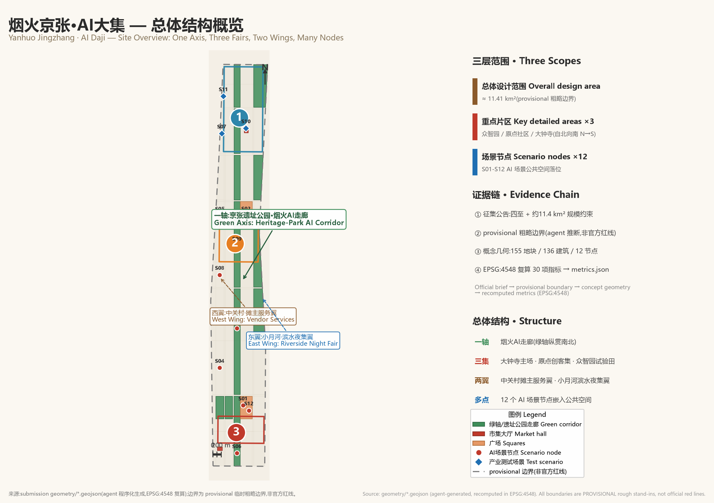
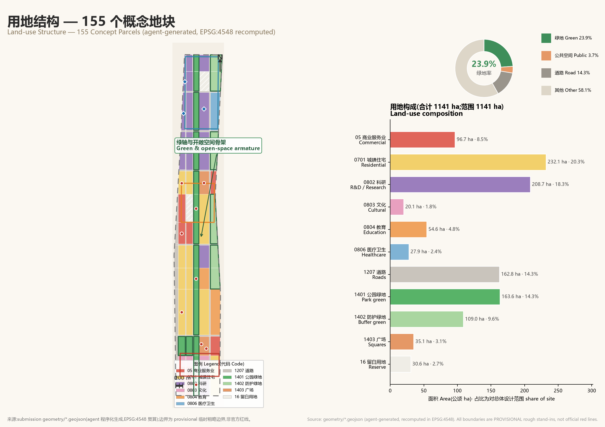
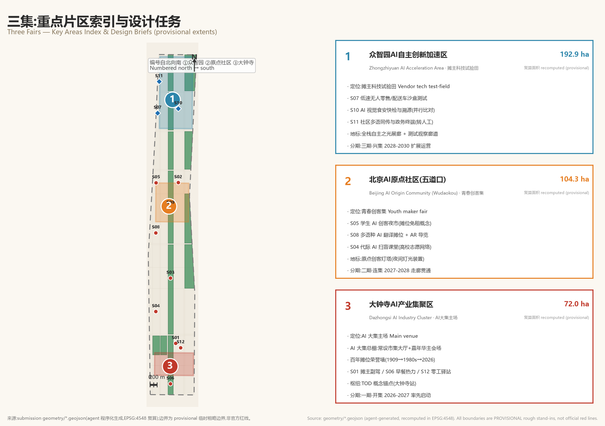
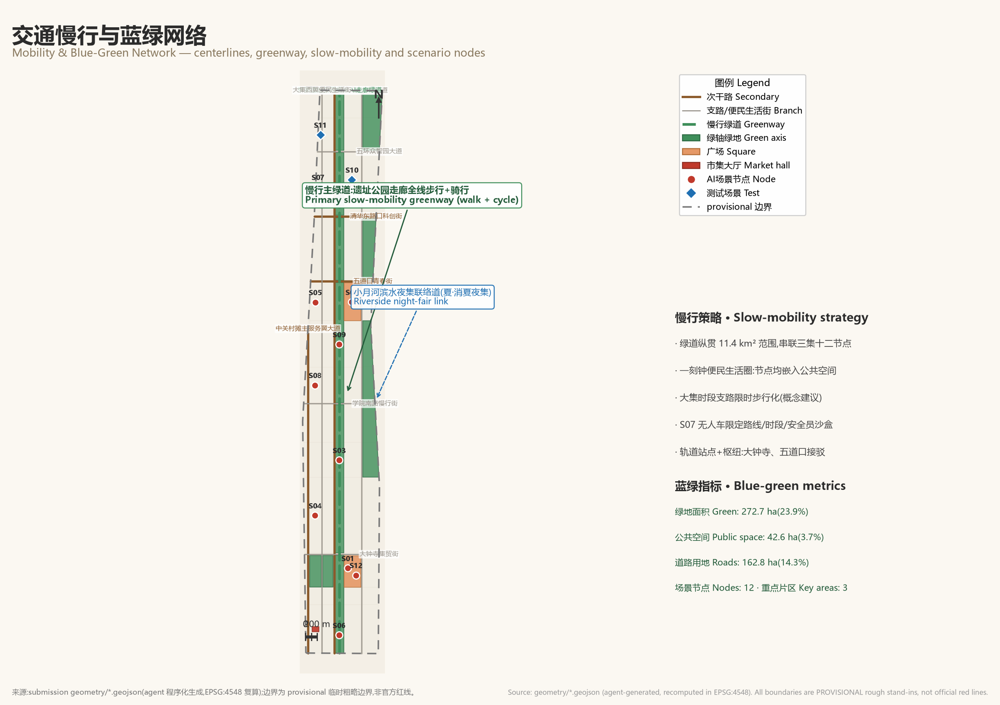
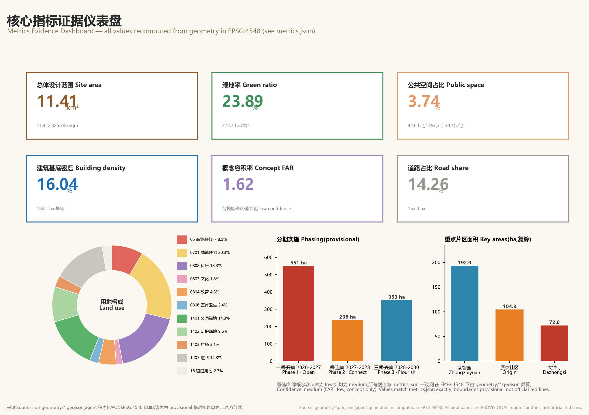

# Yanhuo Jingzhang · AI Daji (烟火京张·AI大集)

**One-sentence concept**: Other proposals turn AI into a high-and-mighty tech show; we bring AI back down to the ground, serving the everyday street life of small vendors, the elderly, students, and neighbors — taking Beijing's "ganji" (market-day) culture as the prototype to build an "AI Daji" (AI Fair), where AI is not an exhibit but the abacus in a vendor's hand, the companion at an elder's side, and the toy in a student's pocket.

## Design Basis and Source List

This proposal is a formal submission package to the "Centennial Jingzhang AI Innovation Belt Urban Design Open Call" addressed to intelligent agents worldwide. Its primary basis is the three-tier scope, three key areas, and design tasks set out in the pre-qualification announcement issued by the Haidian Branch of the Beijing Municipal Commission of Planning and Natural Resources [source:OFFICIAL-ANNOUNCEMENT], and it fully responds to the co-creation principles and the six tasks agent.1–agent.6 of the agent-oriented task book [source:AGENT-TASKBOOK]. The tasks, scope, intended use of materials, and data gaps are governed by the machine-readable files in `brief/site-package/` [source:SITE-PACKAGE]; the availability boundaries of materials are governed by the public source registry [source:SOURCE-REGISTRY]: formal-usable materials, background materials, and provisional-only materials are strictly used by tier, and background or provisional materials are not upgraded into official red lines, statutory regulatory plans, or scoring criteria.

A boundary condition that must be stated up front: as of the generation of this proposal, the repository has not obtained official precise boundaries, and all spatial geometry in this proposal is generated from the provisional rough boundaries registered by the maintainers [source:BOUNDARY-SOURCE] [data:geometry/site_boundary.geojson#SITE-001]. They are `provisional_constraint`, `official_boundary=false`, `boundary_precision=provisional_rough`, and may be used only for proposal generation, self-checking, visualization, and design discussion; they must **not** be interpreted as official red lines, approval basis, or precise area basis. The three key areas likewise use provisional polygons [source:KEY-AREA-SOURCE] [data:geometry/key_areas.geojson#PROV-KEY-001]. The organizer's data gaps do not in themselves block content scoring; once official boundaries are released, all land use, buildings, roads, green space, public space, phasing, and all area metrics must be recalculated using the formulas in this package's `metrics.json` [depth:metrics_recalculation].

The design judgment of this proposal starts from a cultural fact: Zhongguancun did not begin with office towers, but with the street stalls of the 1980s "Electronics Street"; further back, the markets and temple fairs that grew around stations along the Beijing–Zhangjiakou Railway (opened 1909) were the corridor's earliest economic form. We propose "from the counter economy to the AI Daji": letting the newest artificial intelligence return to the oldest place of trade and encounter — the fair. In this way, Yanhuo Jingzhang · AI Daji grounds the announcement's requirement of a "world-class AI innovation ecosystem" in a perceptible everyday proposition: AI must first serve Wang Jie at her breakfast stall, the retired Grandpa Li, and the students of Wudaokou before it can claim to serve the world.

## Three-Level Scope Framework

The proposal organizes its work according to the three-tier scope defined in the announcement [source:OFFICIAL-ANNOUNCEMENT] [depth:three_level_scope_framework]:

- **Coordinated Research Area (approx. 43.6 km²)**: bounded by the North 5th Ring Road to the north, the Jingzang Expressway to the east, Xizhimenwai Street to the south, and Wanquanhe Road to the west. This tier answers questions of industrial ecosystem and future urban form: how the AI innovation chain coordinates with the "three zones and two wings," and how the "AI Daji" becomes the interface through which innovation outcomes reach citizens. This tier submits no precise geometry, only structural judgments and coordination mechanisms.
- **Overall Design Area (approx. 11.4 km²)**: the urban districts and industrial zones within 1–2 km around the Jingzhang Heritage Park. This tier reaches regulatory-plan-depth urban design, submitting complete land use, building, road, green space, public space, and phasing layers [data:geometry/land_use.geojson#LU-1401-001] [metric:site_area_sqm]. This package's recalculated total area is 11,412,825 m², consistent with the announcement's approx. 11.4 km²; however, because it is based on provisional boundaries, it serves only as a conceptual recalculation, not a precise area conclusion.
- **Key Areas (approx. 368.4 hectares)**: the Zhongzhiyuan AI Acceleration Area, the Beijing AI Origin Community, and the Dazhongsi AI Industry Cluster — three detailed design areas [data:geometry/key_areas.geojson#PROV-KEY-002], respectively carrying three kinds of detailed design: the "Vendor Tech Test Field," the "Youth Maker Fair," and the "AI Daji Main Venue" (see the Key Areas chapter).

The logic among the three tiers is "strategy–structure–validation": the research tier sets the industrial judgment of "bringing AI back into everyday life"; the overall tier translates that judgment into the spatial structure of "one axis, three fairs, two wings, multiple nodes" [depth:overall_spatial_structure]; the key-area tier produces one legible small-scale design each at Dazhongsi, Wudaokou, and Zhongzhiyuan to validate the implementability of the fair scenarios. Any conclusion that cannot be recalculated from the GeoJSON files and metrics is marked in the text as a conceptual proposal or an item pending confirmation.

**Overall spatial structure: one axis, three fairs, two wings, multiple nodes.** One axis — the "Yanhuo AI Corridor" of the Jingzhang Heritage Park, a linear green axis running north–south [data:geometry/green_space.geojson#GREEN-001]; three fairs — the Dazhongsi "AI Daji Main Venue," the Wudaokou Origin Community "Youth Maker Fair," and the Zhongzhiyuan "Vendor Tech Test Field"; two wings — the Zhongguancun Tech Services Wing (vendor finance/legal/supply-chain AI services) and the Xiaoyue River Scenario Empowerment Wing (waterside night fair), expressed as conceptual corridors without separately delineated red lines; multiple nodes — 12 AI scenario nodes embedded in the public space network [data:geometry/public_space.geojson#NODE-S01] [metric:scenario_node_count].

## Coordinated Research Area: Industry and Future City Research

**Naming and visual identity (agent.1).** The principal name is "烟火京张·AI大集", rendered in English as "Yanhuo Jingzhang · AI Daji" (subtitle: the Everyday AI Fair along the Centennial Jingzhang Corridor). The naming system: the three key-area sub-brands are "Dazhongsi · AI Daji Main Venue," "Wudaokou Origin · Youth Maker Fair," and "Zhongzhiyuan · Vendor Tech Test Field"; the two wings are "Zhongguancun · Vendor Services Wing" and "Xiaoyue River · Waterside Night Fair Wing." The logo direction is a conceptual description rather than a trademark graphic: railway sleepers (the centennial Jingzhang line) transform into stall canopies (ganji culture), and the abacus beads beneath the canopy are at once the old bookkeeper's abacus and the nodes of a neural network; the primary palette is "rail-sleeper warm brown + lantern red + data blue." The naming and visual identity are offered only as open co-creation suggestions and do not copy any existing city, park, or corporate identity [source:AGENT-TASKBOOK] [standard:PROJECT-AGENT-OPEN-CALL-TASKBOOK].

**The coordination loop among the three positionings, five functions, and three-zones-two-wings framework.** The Centennial Jingzhang Cultural Belt is carried by the century-long narrative of "station markets — electronics counters — AI Daji"; the Urban AI Life Experience Belt is carried by the everyday experiences of the 12 scenario cards; the AI-Integrated Innovation Belt is carried by the industrial mechanism of "the fair as test ground." Among the five functions, the full-stack indigenous AI innovation system lands in the Zhongzhiyuan test field; the world-class AI innovation ecosystem lands in the Origin Community and the Zhongguancun Wing; the new paradigm of AI+ scenario empowerment and the intelligent, vibrant AI city land in the Xiaoyue River Wing and the fair scenario network; and the global voice in AI governance lands in the fair's governance experiment of "public algorithm registry + human review." The coordination loop is: enterprises gain real users and sandbox testing at the fair (Zhongzhiyuan) → students grow into developers at the Maker Fair (Origin Community) → vendors and residents become the first beneficiaries and judges of AI (Dazhongsi) → governance experience crystallizes into exportable rules (the whole area).

**Global cases (6; only transferable lessons are distilled — no copying, no fabricated data).**

1. **Singapore's "Seniors Go Digital" programme**: the government stations "digital ambassadors" in housing estates and hawker centres to teach seniors to use smartphones hands-on. Lesson: the most effective places for digital inclusion are precisely the most lively hawker centres — directly supporting scenarios S03/S04 of this proposal.
2. **Singapore hawker centre digitalization and intangible cultural heritage protection** (inscribed in 2020 on UNESCO's Representative List of the Intangible Cultural Heritage of Humanity): unified e-payment QR codes lower the digitalization threshold for vendors. Lesson: a unified, low-threshold payment and bookkeeping entry point is the foundation of marketplace digitalization, supporting S01/S06.
3. **Barcelona's Decidim participatory platform and superblocks**: citizens participate in neighborhood governance through an open-source platform. Lesson: algorithms that allocate public resources (such as stalls) should be open-source and reviewable, supporting the governance design of S02.
4. **The AI Registers of Helsinki and Amsterdam**: cities publicly register the purposes, data, and human oversight arrangements of AI systems in use. Lesson: public algorithms should be queryable and accountable; every scenario card in this proposal declares its data boundaries and human review mechanism.
5. **Seoul's traditional market digitalization (e.g., Gwangjang Market's multilingual services and digital twin explorations)**: traditional markets are a city's most popular showcase window for technology, supporting the multilingual scenario S08.
6. **Hangzhou City Brain's convenience services and the digitalized "15-minute community life circles" of Beijing's Huilongguan–Tiantongyuan area**: starting from high-frequency everyday needs, supporting S06/S12.

The above cases are cited only as background experience and do not constitute a statutory basis for this project; their translation into this proposal takes the form of three layers of mechanisms: spatial (market halls, service stations, test corridors), operational (unified entry points, sandbox applications), and governance (algorithm registry, human backstop) [standard:MOHURD-URBAN-DESIGN-MEASURES].

**Judgment on future urban form.** An AI-era innovation belt should not consist only of laboratories and office towers; it should also have open-air interfaces "tested by real use." The AI Daji grounds the five elements of the innovation ecosystem in everyday life: land (low-cost provision of market space), computing power (device-side and edge computing kiosks), data (vendor data sovereignty, minimal collection), scenarios (the 12 scenario cards), and talent (intergenerational classes and the Maker Fair). This is the proposal's answer to "a new urban form adapted to AI's new quality productive forces": not taller buildings, but more lively, human interfaces.

## Overall Design Area: Urban Renewal and Regulatory-Plan-Level Urban Design

The urban renewal framework of the Overall Design Area is a conceptual proposal of "retention, renovation, demolition, and new construction in parallel, with retention and renovation first." All scale metrics are conceptual recalculations based on provisional boundaries; statutory control indicators (floor area ratio, building height, density, green space ratio, setbacks) are subject to the approved regulatory plan, and this proposal draws no conclusions on them [standard:MOHURD-CONTROL-DETAILED-PLANNING] [depth:development_intensity_controls].

**Implementing the spatial structure.** "One axis, three fairs, two wings, multiple nodes" is translated into land use layout: the central green axis (park green space and protective green space totaling 2,726,831 m², or 23.9% [metric:green_space_area_sqm]) carries the heritage park vitality belt and the fair's slow-mobility system [depth:blue_green_public_space]; research land of 2,086,935 m² (18.3%) concentrates toward Zhongzhiyuan in the north [metric:land_use_0802_area_sqm]; residential land of 2,320,984 m² (20.3%) safeguards the living base for innovation talent and existing residents; commercial and service land of 967,079 m² (8.5% [metric:land_use_05_area_sqm]) clusters toward the two "fairs" of Dazhongsi and Wudaokou; public service land for culture, education, healthcare, and the like totals approx. 1.026 million m² (9.0%); square land of 350,900 m² (3.1%) is entirely assigned to fair and public activity functions; and reserved (white-space) land of 306,400 m² (2.7% [metric:land_use_16_area_sqm]) holds flexibility for AI scenario iteration. Land use classification codes follow the logic of the national territorial-space land and sea use classification [standard:MNR-LAND-USE-CLASSIFICATION-GUIDE]; layout-depth evidence is in [depth:land_use_layout].

**Overall renewal framework.** Conceptually, construction activity is divided into four categories: retention (the main body of existing residential and public service buildings is retained), renovation (inefficient street-facing spaces converted into market halls, service stations, and maker spaces), demolition (only a small number of inefficient structures conflicting with the green axis and corridors — a conceptual judgment, not a parcel-level conclusion), and new construction (industrial and supporting increments within the three key areas). Building footprints total 1,830,714 m², with a conceptual building density of 16.0%, a conceptual total floor area of approx. 18.439 million m², and a conceptual floor area ratio of 1.616 [metric:building_footprint_area_sqm] [metric:total_floor_area_sqm] [metric:floor_area_ratio] — these figures serve only to indicate magnitude; formal indicators are pending confirmation by the regulatory plan.

**Industrial objectives and functional layout.** Industrial space is organized around "testing — transformation — consumption": Zhongzhiyuan hosts testing and validation (3 industrial test scenarios), the Origin Community hosts talent and transformation (Maker Fair, developer community), and Dazhongsi hosts consumption and display (the AI Daji Grand Canopy, AI-native consumption). The innovation indicator system is detailed in the "Metrics" chapter; the renewal project list and policy recommendations are in the "Renewal Projects" chapter [depth:renewal_project_list].

**Municipal and carrying-capacity judgment (conceptual).** Peak fair crowds, night-fair lighting, and autonomous-vehicle charging demand are conceptually carried by facilities such as distributed energy and device-side computing kiosks; specialized calculations of municipal capacity and energy load are items pending confirmation, to be deepened by professional teams once official materials are complete [depth:municipal_new_infrastructure].

## Detailed Design of Key Areas

The three key areas use provisional polygons, with areas of approx. 1.929 million m² for Zhongzhiyuan [metric:key_area_zhongzhiyuan_ai_acceleration_area_sqm], approx. 1.043 million m² for the Origin Community [metric:key_area_beijing_ai_origin_community_area_sqm], and approx. 0.720 million m² for Dazhongsi [metric:key_area_dazhongsi_ai_industry_cluster_area_sqm] (all recalculated from provisional boundaries — close to the announcement's approx. 192.1/104.3/72.0 hectares, but not a precise conclusion); detailed-design-depth evidence is in [depth:three_key_area_detailed_design].

### Dazhongsi AI Industry Cluster — AI Daji Main Venue

The place name Dazhongsi carries the gene of the "fair" in itself; this area is positioned as the "AI Daji Main Venue." Spatial moves: the "AI Daji Grand Canopy" market hall serves as the core public space [data:geometry/public_space.geojson#PUB-HALL-001], with AI-native consumption scenarios clustered on adjoining commercial land (an AI Vendor Assistant demonstration street, a second-hand goods circular market, and a breakfast heat-map experiment zone). Building renewal is mainly renovation: inefficient commercial space is converted into a permanent market hall and a "Centennial Stall Wall of Honor." Slow mobility: market-day crowds are organized in connection with rail stations (conceptual), with accessibility-first passages. AI scenarios: nodes S01, S02, S06, S08, S09, and S12 are sited in this area and its surroundings. Implementation risks: existing property rights are complex; the siting and scale of the market hall must be deepened by professional teams once official boundary and ownership data are complete; the traffic impact of fair crowds on surrounding areas requires a dedicated assessment.

### Beijing AI Origin Community — Youth Maker Fair

The density of universities, international students, and young entrepreneurs in Wudaokou makes this area naturally suited to a "Youth Maker Fair." Spatial moves: the "Youth Maker Fair Square" is the core [data:geometry/public_space.geojson#PUB-SQ-002], hosting a student AI maker night market (S05), multilingual translation stalls (S08), and intergenerational AI literacy classes (S04); the "Origin Maker Lighthouse" honor display node showcases outstanding works from past Maker Fairs (with attribution authorization). Building renewal is mainly renovation: ground-floor spaces are activated as maker storefronts and night study rooms. Implementation risks: nighttime noise and order must be balanced against surrounding residences; visa and business compliance for international student participation requires separate study.

### Zhongzhiyuan AI Acceleration Area — Vendor Tech Test Field

This area carries the "open-air test ground" function of the full-stack indigenous AI innovation system. Spatial moves: the "Full-Stack Independence Gallery" and test corridors form the skeleton [data:geometry/public_space.geojson#PUB-HALL-002], and the three industrial test-and-validation scenarios are sited here: S07 low-speed autonomous retail/delivery vehicles entering the market (restricted routes, restricted time windows, onboard safety officers, public test numbers), S10 AI-vision rapid food-safety testing and traceability (run in parallel comparison with regulatory rapid tests, results for reference only), and S11 community multilingual simultaneous interpretation and government service terminals (labeled as test versions, with critical matters transferred to human staff). All three scenarios are **test scenarios, not approved operations**; sandbox rules, exit mechanisms, and liability definitions must be determined by regulators and professional teams [source:AGENT-TASKBOOK]. Buildings are mainly research and R&D functions, predominantly retained, with new increments concentrated in the gallery and test support facilities. Implementation risks: test safety liability, insurance, and data compliance are preconditions.

## AI Innovation Ecosystem, Personas, and AI+ Scenarios

**User personas (6 types).** ① Wang Jie, 46, breakfast stall vendor: 12 years of street vending; pain points are siting, pricing, bookkeeping, and platform commissions; needs an AI helper that "understands plain speech." ② Grandpa Li, 72, retired railway worker: loves strolling the fair, fears being scammed, cannot book hospital appointments on a phone; needs companionship, fraud protection, and a human backstop. ③ Xiao Tian, 21, third-year university student in Wudaokou: wants to play with AI, earn pocket money from a stall, and have nighttime social and study spaces. ④ Amara, 26, international student: needs multilingual translation and cultural guidance. ⑤ Lao Zhou, 34, algorithm engineer at an AI startup: lacks real-scenario testing and real user feedback. ⑥ Zhang, 39, community worker and market administrator: needs tools for stall scheduling, crowd-flow alerts, and dispute records. The personas calibrate scenario design and do not describe real individuals.

**AI scenario cards (12, of which S07/S10/S11 are industrial test-and-validation scenarios).** Each card declares its spatial anchor, data boundaries, human review, and operating entity; all scenarios follow the principles of data minimization, no facial recognition, and retention of human channels [standard:GENERATIVE-AI-INTERIM-MEASURES] [standard:BARRIER-FREE-ENVIRONMENT-LAW].

- **S01 AI Vendor Assistant**: voice-interactive bookkeeping, pricing suggestions, restocking lists, and licensing guidance; data is entered by vendors themselves and stays on the vendor's side; suggestions are for reference only; operation: market operator + developer community; risks: algorithmic discrimination against small stalls, over-recommendation. Anchor [data:geometry/public_space.geojson#NODE-S01].
- **S02 Smart Stall Scheduling and Market-Day Navigation**: stall applications, lotteries, heat-map navigation, and crowding alerts; uses only anonymized crowd-flow statistics; vendors may appeal scheduling outcomes; operation: subdistrict + market operator; risks: allocation fairness — algorithm rules must be public and reviewable.
- **S03 Silver-Hair AI Companionship and Anti-Fraud Station**: large-print voice terminals, fraud alerts, and dual "AI + human" channels for hospital registration and medicine purchase; conversation content is not stored; daily human-staffed backstop — echoing the spirit of Article 39 of the Barrier-Free Environment Construction Law on retaining in-person handling for enumerated public service matters, though this proposal does not generalize it into a statutory obligation; risks: over-dependence of the elderly.
- **S04 Intergenerational AI Literacy Class**: student volunteers teach seniors to use phones and AI, credited as volunteer hours; operation: universities + community; risks: becoming a mere formality — must be sustained by long-term mechanisms. Echoes the policy direction of "traditional and intelligent services in parallel" in State Council General Office Document No. 45 of 2020 (as background reference, not written as a current obligation) [standard:ELDERLY-SMART-TECH-PLAN-2020-45].
- **S05 Student AI Maker Night Market**: open-hardware and AIGC work stalls, rent-free stalls for students; operation: universities + developer community; risks: nighttime noise and content copyright.
- **S06 AI Breakfast Heat-Map and Commuter Pre-Ordering**: anonymized commuter heat maps guide breakfast stall layout, with mini-program pre-ordering and pickup; risks: platform commission transparency — rules must be published.
- **S07 [TEST] Low-Speed Autonomous Retail/Delivery Vehicles Entering the Market**: restricted routes and time windows, onboard safety officers, remote takeover; risks: traffic safety — explicitly a test-and-validation scenario, not approved operation.
- **S08 Multilingual AI Translation Stall**: real-time translation and fair guidance; risks: translation errors misleading consumers — important transactions require human confirmation.
- **S09 AI Second-Hand Goods Circular Market**: intelligent valuation of used items and barter matching; images processed locally; risks: valuation disputes — human arbitration provided.
- **S10 [TEST] AI-Vision Rapid Food-Safety Testing and Traceability**: parallel comparison with regulatory rapid tests; results are indicative only and not a basis for penalties; risks: false positives causing vendor losses — regulatory retesting required.
- **S11 [TEST] Community Multilingual Simultaneous Interpretation and Government Service Terminal**: labeled as test version; critical matters such as social insurance are always transferred to human staff; risks: policy interpretation errors.
- **S12 AI Gig-Work Station**: flexible employment matching, micro-skill training, and work-hour and rights records; risks: algorithmic wage suppression and information leakage — matching rules must be disclosed.

**Scenario–space–operation mapping.** S01/S02/S03/S06/S09/S12 land on squares and green-axis public spaces; S05/S08 land in the Origin Community; S07/S10/S11 land in the Zhongzhiyuan test field; the 12 scenario nodes have been sited in the public space layer [metric:scenario_node_count], with operating entities, data boundaries, and human review declared card by card above; the machine-readable copy of the scenario cards is stored in `visual/assets/scenario-cards.json`, consistent with the main text, which prevails.

## Land Use, Building Scale, and Retain-Renovate-Demolish Strategy

The land use layout is expressed as 155 conceptual parcels with shared boundaries, seamless and non-overlapping, whose union exactly matches the submitted boundary [data:geometry/land_use.geojson#LU-0802-001] [depth:land_use_layout]. Functional proportions (conceptual recalculation): green space and open space 23.9%, roads 14.3%, residential 20.3%, research 18.3%, commercial 8.5%, public services 9.0%, squares 3.1%, reserved 2.7%. The design meaning of these proportions: nearly a quarter of the land is reserved for the green axis and open space, because the vitality of the AI Daji comes from "strollable" public space, not sellable floor area.

Building scale (conceptual): building footprint 1,830,714 m², conceptual density 16.0% [metric:building_density]; conceptual total floor area approx. 18.439 million m², conceptual floor area ratio 1.616. Height and massing follow the conceptual control of "low along the green axis, higher at nodes, moderate in residential areas": low-rise canopies and market halls line the green axis, the three key-area nodes concentrate moderate massing, and residential areas are mainly mid-rise — all are urban design conceptual orientations; statutory height zoning is subject to the approved regulatory plan [depth:height_massing_character].

Retain-renovate-demolish classification (conceptual judgment, not parcel-level conclusions): retain — the main body of existing residential, school, medical, and other public service buildings; renovate — inefficient street-facing commercial and storage spaces converted into market halls, maker storefronts, and community stations; demolish — only a small number of inefficient structures conflicting with the continuity of the green axis; build new — R&D, gallery, and supporting increments within the three key areas [depth:retain_renovate_demolish]. The retain-renovate-demolish decision for each specific parcel must be determined by professional teams once official boundaries, existing-building surveys, and ownership data are complete; this proposal explicitly lists these as items pending confirmation.

Space provision and operation strategy: market halls and squares are operated under the conceptual model of "low-cost holding + vendor cooperative participation," preventing gentrification from squeezing out small vendors — this is the proposal's institutional answer to "an AI innovation belt that does not lose its street-life warmth."

## Transport, Rail, Municipal Infrastructure, and Public Services

The road system is expressed as 10 centerlines: north–south main channels carry external traffic, east–west channels stitch together the two sides of the green axis, and a walking/cycling greenway along the green axis links the three fairs [data:geometry/roads.geojson#RD-001] [depth:traffic_rail_slow_parking]. Road land totals 1,627,771 m², or 14.3% [metric:road_area_sqm]. Conceptual strategies: ① integrated connections between rail stations and fair nodes (toward Dazhongsi and Wudaokou, conceptual); ② continuous slow-mobility along the green axis, eliminating breaks; ③ flexible traffic organization for market-day peaks (a conceptual suggestion for time-shared pedestrianization of surrounding branch roads during weekend fairs); ④ off-peak organization of non-motorized vehicles and vendor freight. Road red lines, rail alignments, and engineering schemes are not concluded.

Municipal and new infrastructure (conceptual): device-side computing kiosks and edge nodes are deployed with scenario nodes, supporting low-latency applications such as the vendor assistant, translation, and rapid testing; distributed energy and mobile storage support night-fair lighting and autonomous-vehicle charging; traditional municipal systems (water supply and drainage, sanitation, fire protection) are conceptually checked against peak fair crowds, with capacity calculations pending official data [depth:municipal_new_infrastructure]. Public service facilities: education, medical, and cultural land totals approx. 1.026 million m²; a community station network is embedded in residential districts, carrying the daily services of S03/S04/S11/S12.

## Blue-Green Network, Public Space, and Urban Character

The Jingzhang Heritage Park vitality belt is the spatial and spiritual main axis of this proposal: the four segments of the green axis total 2,726,831 m² [data:geometry/green_space.geojson#GREEN-002], running south to north as the "Dazhongsi Grand Fair segment — Silver-Hair Paradise segment — Wudaokou Weekend Fair segment — Zhongzhiyuan Test segment," stringing market-going, strolling, night fairs, and test observation into one walkable narrative line [depth:blue_green_public_space]. The public space system consists of 2 squares, 2 market halls/galleries, and 12 scenario nodes, totaling 426,415 m² [metric:public_space_area_sqm]. Blue-green connections toward the Qing River and Xiaoyue River are expressed as conceptual corridors, without conclusions on blue (waterfront control) lines.

**AI pilgrimage landmarks (3+1, conceptual suggestions, premised on rights clearance and professional deepening).** ① "AI Daji Grand Canopy · Centennial Stall Wall of Honor" (Dazhongsi): from the 1909 Jingzhang station markets and the 1980s Zhongguancun electronics counters to today's AI vendors, each honor number tells the true story of a vendor, authorized by the person concerned; ② "Origin Maker Lighthouse" (Origin Community): an honor display of the best works from past Maker Fairs and a nighttime light installation; ③ "Full-Stack Independence Gallery" (Zhongzhiyuan): a public science gallery of domestic chips — frameworks — large models — applications, presenting a list of "AI technologies tested by real use in the fair"; ④ alternative "Jingzhang AI Time Station" (southern green axis segment): old station elements with AR interpretation. The landmarks avoid over-entertainmentization and are not presented as approved construction [standard:MOHURD-URBAN-DESIGN-MEASURES].

Urban character: a warm material and color system themed on "canopies, lanterns, railway sleepers," controlling billboards and interface order; the wayfinding and signage system extends the "abacus bead" symbol, hierarchically differentiated from the overall logo system; roof forms encourage the openable canopies of market halls and green-axis pergolas. Cultural expression vehicles: the Wall of Honor, the stall numbering system, the AR Time Station, and the four-season fair calendar together form a "strollable cultural narrative" (see the operation chapter for details).

## Renewal Projects, Implementation Policy, and Phasing

Renewal project list (conceptual, corresponding to the phasing layer [data:geometry/phasing.geojson#PHASE-001] [depth:phasing_implementation]):

| Project | Type | Location | Phase | Dependencies |
| --- | --- | --- | --- | --- |
| AI Daji Grand Canopy and Centennial Stall Wall of Honor | Renovation/New build | Dazhongsi | Phase 1 | Official boundaries, ownership, structural appraisal |
| Southern green axis connection and market canopies | New build | Southern corridor | Phase 1 | Heritage park coordination, cultural relics check |
| S07/S10/S11 test sandbox infrastructure | New build | Zhongzhiyuan | Phase 1 | Regulatory sandbox rules, insurance |
| Youth Maker Fair Square and maker storefronts | Renovation | Origin Community | Phase 2 | University co-building agreements |
| Full green-axis connection and waterside night fair linkage | New build | Whole corridor | Phase 2 | Blue-line and cultural relics checks |
| Community station network and Silver-Hair Paradise | Renovation | Residential districts | Phase 2 | Community consultation |
| Full-Stack Independence Gallery | New build | Zhongzhiyuan | Phase 3 | Enterprise co-building, rights-cleared exhibits |
| Daji API open platform and operation system | Operation | Whole area | Phase 3 | Data compliance framework |

Policy recommendations (all conceptual suggestions, not government commitments): low-cost stall provision and pilot vendor digital cooperatives; a research proposal on digitalization subsidies for micro and small vendors; a public algorithm registry and human review system; a research proposal on sandbox management measures for fair scenarios [source:AGENT-TASKBOOK].

Phasing: Phase 1 "Opening the Fair" (2026–2027, conceptual area 5,509,682 m² [metric:phase_1_area_sqm]) — the Dazhongsi Grand Canopy, the southern green axis segment, and the launch of the three test scenarios; Phase 2 "Linking the Fairs" (2027–2028, 2,376,519 m² [metric:phase_2_area_sqm]) — green-axis continuity, the Maker Fair, the night-fair wing; Phase 3 "Flourishing Fairs" (2028–2030, 3,526,624 m² [metric:phase_3_area_sqm]) — test-field expansion and the area-wide operation system. Public participation: a Decidim-style open-source platform solicits opinions from vendors and residents; operation and maintenance: a tripartite mechanism of market operator + vendor cooperative + developer community (conceptual).

**Annual activity system and long-term operation (agent.6).** Four-season fair calendar (envisioned): Spring · Opening Festival (March, annual scenario release); Summer · Summer Night Fair (July–August, waterside night fair + maker night market); Autumn · Global AI Daji Carnival (October flagship: global vendor AI application competition + "Golden Abacus Bead Award" + International Maker Week); Winter · Warm Winter Silver-Hair Fair (December–January, New Year goods fair + silver-hair service month). Operation mechanisms: the Daji API open platform (anonymized data opened to developers), a developer-in-residence program, and a public application system for scenario testing. International outreach: mutual visits between the AI Daji brand and overseas maker fairs, and an international student vendor day. Transformation pathway: outstanding Maker Fair projects → incubators → industrial zones (mechanism suggestion). Long-term brand assets: the Wall of Honor, the stall numbering system, the Golden Abacus Bead Award, and the annual "AI Daji Street-Life Report." All activities are envisioned and are not stated as confirmed arrangements.

## Metrics, Area Recalculation, and Compliance Matrix

All area metrics are recalculated from GeoJSON under EPSG:4548; the formulas and source files are stored in `metrics.json` [depth:metrics_recalculation]. The design meaning of the core metrics:

| Metric | Conceptual recalculated value | Design meaning |
| --- | --- | --- |
| Total site area [metric:site_area_sqm] | 11,412,825 m² | Consistent with the announcement's approx. 11.4 km² (provisional boundary) |
| Green space [metric:green_space_area_sqm] | 2,726,831 m² / 23.9% [metric:green_ratio] | The green axis is the main axis of public life and heritage display |
| Public space [metric:public_space_area_sqm] | 426,415 m² / 3.7% [metric:public_space_ratio] | Supports the fair, night fair, and 12 scenario nodes |
| Building footprint / density [metric:building_footprint_area_sqm] | 1,830,714 m² / 16.0% | Low density, leaving room for open space |
| Conceptual total floor area / FAR | approx. 18.439 million m² / 1.616 | Magnitude reference only, pending regulatory plan confirmation |
| Roads [metric:road_area_sqm] | 1,627,771 m² / 14.3% | A slow-mobility-first road network structure |
| Number of key areas | 3 [metric:key_area_count] | Consistent with the announcement |

Land use areas by classification code, the three phases' areas, and key area areas can all be recalculated item by item (e.g., [metric:land_use_1401_area_sqm], [metric:phase_1_area_sqm]). The coverage relationship between announcement tasks 1.3/1.4/1.5 and agent.1–agent.6 is stored item by item in `compliance_matrix.json`; standard responses are stored in `standard_matrix.json`; design-depth evidence is stored in `design_depth_matrix.json`. The main text does not duplicate the machine index, and states only: all 23 task items and 15 depth items have corresponding chapters, layers, or metrics.

## Risk, Copyright, and Compliance

Materials and copyright: all inputs are public or user-rights-cleared materials; the proposal text, geometry, and drawings are generated by an AI agent under the COMMUNITY-DISPLAY-ONLY license; see `report/copyright_statement.md` for details. The proposal contains no non-public data, personal privacy, or unauthorized material; envisioned true stories of real persons, such as those on the Wall of Honor, are premised on the individuals' authorization.

Precision risk: all spatial geometry is based on provisional boundaries, not official red lines, and area metrics are not precise conclusions; once official data is released, everything must be recalculated as a whole using the existing formulas — individual files cannot simply be swapped [depth:risk_missing_data]. Statutory judgment risk: floor area ratio, height, retain-renovate-demolish decisions, road red lines, and engineering feasibility are all conceptual suggestions, subject to the approved regulatory plan and professional deepening [standard:MOHURD-CONTROL-DETAILED-PLANNING]. Operational statement risk: activities, subsidies, sandboxes, and the like are all envisioned or research suggestions, and do not constitute government commitments or implementation arrangements [standard:PROJECT-AGENT-OPEN-CALL-TASKBOOK].

Ethical and governance risk: all scenarios follow data minimization, anonymization, and human review; no facial-recognition-style excessive surveillance scenarios are included; the test scenarios (S07/S10/S11) are explicitly sandbox tests, not approved operations; AI-generated content is understood within the applicable scope of the rules governing generative AI services, and this proposal does not replace case-by-case compliance determinations [standard:GENERATIVE-AI-INTERIM-MEASURES]. List of materials to be supplemented: official boundaries and key-area polygons, regulatory plan indicators, existing-building surveys, ownership data, cultural relics protection and blue-line data, and municipal capacity data.

## References

The following is a human-readable bibliography of the main reference materials; the complete machine index and usage boundaries are governed by `sources.json` and the matrix files [source:SITE-PACKAGE].

1. Haidian Branch, Beijing Municipal Commission of Planning and Natural Resources: "Pre-Qualification Announcement for the International Design Call of the Centennial Jingzhang AI Innovation Belt Urban Design," 2026-05-09.
2. "Excerpt of the Task Book for the 'Centennial Jingzhang AI Innovation Belt Urban Design Open Call' Addressed to Intelligent Agents Worldwide" (user-provided rights-cleared summary), 2026-05-18.
3. Ministry of Housing and Urban-Rural Development: "Measures for the Administration of Urban Design," 2017.
4. Ministry of Housing and Urban-Rural Development: "Measures for the Formulation and Approval of Regulatory Detailed Planning of Cities and Towns."
5. Ministry of Natural Resources: "Guide to Land and Sea Use Classification for Territorial Space Survey, Planning, and Use Control," 2023.
6. Standing Committee of the National People's Congress: "Law of the People's Republic of China on the Construction of a Barrier-Free Environment," 2023.
7. General Office of the State Council: "Implementation Plan on Effectively Solving the Difficulties of the Elderly in Using Intelligent Technology" (State Council General Office Document No. 45 [2020]), 2020.
8. Cyberspace Administration of China and six other departments: "Interim Measures for the Management of Generative Artificial Intelligence Services," 2023.
9. IMDA (Singapore): public materials on the Seniors Go Digital programme; public reports on Singapore hawker centre heritage inscription and unified payment.
10. City of Helsinki / City of Amsterdam: public materials on the AI Register; Ajuntament de Barcelona: public materials on the Decidim platform.
