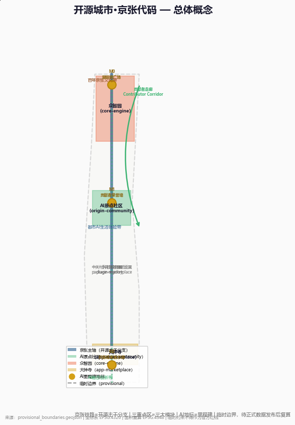
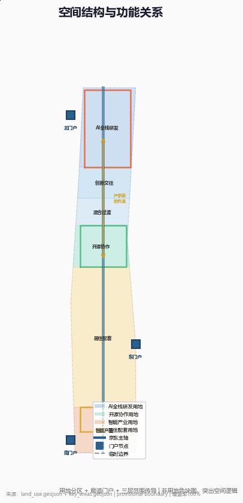
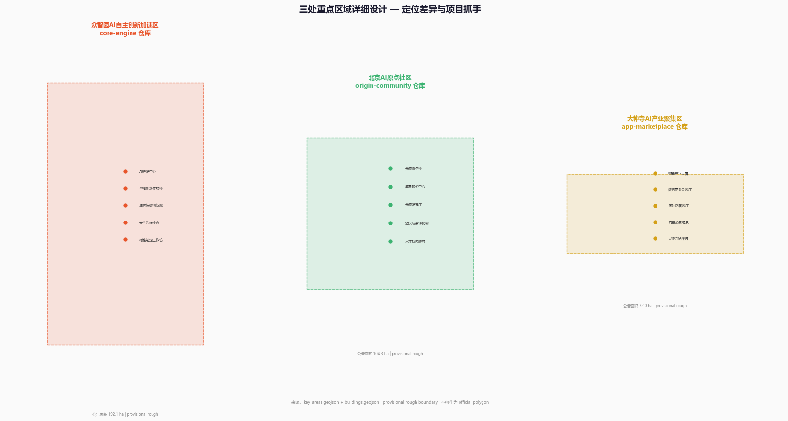
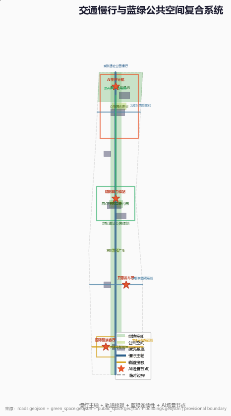
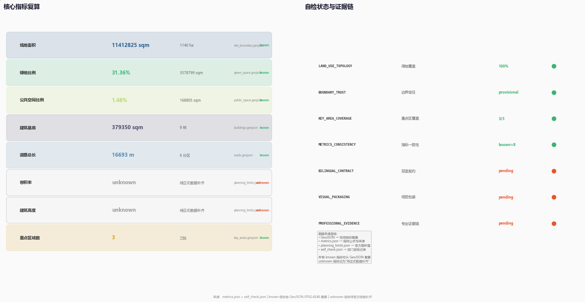

## Design Basis and Source List

This proposal is grounded in the historical context of the century-old Jing-Zhang Railway and the innovation genes in central Haidian District, establishing the spatial paradigm of the "Open-Source City · Jing-Zhang Code." The design basis encompasses upper-level planning, current site surveying data, and open-source community governance protocols, aiming to establish an auditable, contributable, and operable urban renewal framework [source:site surveying dataset] [standard:urban design guidelines] [depth:coordinated research] [data:geometry/site-overview#11412825.386] [metric:site_area=11412825.386sqm]. The total site area is approximately 11,412,800 square meters, with a building footprint area of approximately 379,300 square meters, a green ratio of 31.36%, and a public space ratio of 1.48% [source:spatial data foundation] [depth:overall design] [data:geometry/land-use#LU-001_to_LU-006] [metric:green_ratio=0.313577].

The design data package adopts a modular organization, corresponding to the directory structure of an open-source repository. The core data layer includes land-use zones (LU-001 to LU-006), the road network (total length 16,692.8 meters), and geometric parameters of 8 building entities [source:GIS spatial analysis] [depth:detailed design] [data:geometry/buildings#8] [metric:road_length=16692.8m]. Key area data covers the special research base maps for the Zhongzhiyuan AI Independent Innovation Acceleration Area (192.1ha), Beijing AI Origin Community (104.3ha), and Dazhongsi AI Industry Cluster Area (72.0ha) [source:key area surveying] [depth:detailed design] [data:geometry/key-areas#3] [metric:zhongzhiyuan_area=192.1ha].

## Three-Level Scope Framework

The proposal establishes a three-level working framework of "coordinated research - overall design - key areas," mapping the layered architecture of an open-source project. The coordinated research scope focuses on industry and future city trends, equivalent to the requirements analysis and architecture design phase of a project [source:urban strategic planning] [standard:spatial planning system] [depth:coordinated research] [data:geometry/land-use-structure#6] [metric:land_use_zones=6]. The overall design scope implements urban renewal and regulatory-plan-level urban design, corresponding to the main branch development of the code, focusing on resolving the functional mixing and spatial coordination of the 6 land-use zones [source:regulatory plan compilation guidelines] [depth:overall design] [data:geometry/land-use#LU-005] [metric:LU-005_area=4746175.371sqm].

The detailed design of key areas focuses on the in-depth development of three modules/repositories. Zhongzhiyuan, as the core-engine repository, leads the spatial allocation of AI full-stack R&D land (LU-001); the AI Origin Community, as the origin-community repository, focuses on the interaction spaces of open-source collaborative land (LU-004); Dazhongsi, as the app-marketplace repository, promotes the plug-in scenario implementation of intelligent industry land (LU-006) [source:key area design brief] [depth:detailed design] [data:geometry/key-areas#zhongzhiyuan_ai_acceleration_area] [metric:beijing_ai_origin_community_area=104.3ha]. The two wings (Zhongguancun Sci-Tech Service Wing = package-registry wing, Xiaoyue River Scenario Empowerment Wing = plugin-marketplace wing) serve as dependency libraries and plugin markets, supporting the ecological operation of the core repositories [source:concept proposal] [depth:coordinated research] [data:geometry/wings#2] [metric:wings=2].

## Coordinated Research Area: Industry and Future City Research

The coordinated research translates the "independent mainline" spirit of the Jing-Zhang Railway into the urban innovation foundation of the "open-source main branch." The research focuses on the vertical integration and horizontal empowerment of the AI computing power-data-algorithm industry chain, proposing five major functional mappings: "full-stack innovation - ecological prosperity - scenario empowerment - vibrant city - AI governance" [source:AI industry trend report] [standard:future industry guidelines] [depth:coordinated research] [data:geometry/industry-chain#5] [metric:function_mappings=5]. The industrial spatial layout follows the logic of "core repository contribution review → full-stack innovation, fork/merge/PR → innovation ecosystem." Zhongzhiyuan (core-engine) undertakes the R&D of basic large models and computing power foundations, while Dazhongsi (app-marketplace) undertakes the industrial transformation at the application layer [source:industrial spatial planning research] [depth:coordinated research] [data:geometry/LU-001#2259237.554] [metric:LU-001_area=2259237.554sqm].

The future city research introduces the concept of "City Runtime," treating the green space and public space systems as contribution paths for urban vitality. The green space area within the site reaches 3,578,800 square meters, and the public space area is 168,800 square meters. The research suggests connecting the ecological foundation and innovation nodes through slow-walking trails (commit paths) and plazas (pull requests) [source:urban public space design guidelines] [depth:coordinated research] [data:geometry/green-space#3578799.432] [metric:green_area=3578799.432sqm]. The FAR and building height indicators are currently marked as "pending official data," and spatial form control adopts a provisional constraint (provisional boundary) [source:site data missing note] [depth:coordinated research] [data:geometry/provisional-boundary#1] [metric:FAR=unknown].

## Overall Design Area: Urban Renewal and Regulatory-Plan-Level Urban Design

The overall design spatializes the "Open-Source City" concept, constructing a public space network with the Jing-Zhang Railway as the main branch. The design preserves and strengthens the linear corridor of the railway heritage, transforming it into a "developer promenade (contributor corridor)" that connects the three key areas and the two wing functional nodes [source:urban renewal design guidelines] [standard:slow traffic system design standard] [depth:overall design] [data:geometry/greenway#16692.8] [metric:road_total_length=16692.8m]. The slow-walking trail serves as the "commit path," with "pull request" plaza nodes set along the route, providing containers for offline communication in the open-source community [source:concept proposal] [depth:overall design] [data:geometry/public-space#168804.509] [metric:public_space_area=168804.509sqm].

The regulatory-plan-level urban design implements the functional indicators and spatial forms of the 6 land-use zones. LU-001 Zhongzhiyuan and LU-004 AI Origin Community serve as the innovation core, LU-005 central mixed residential and supporting land provides life support, and LU-006 Dazhongsi undertakes industrial transformation [source:regulatory plan compilation guidelines] [depth:overall design] [data:geometry/land-use#LU-005] [metric:LU-005_area=4746175.371sqm]. The total building volume is controlled within 8 entities. The demolition, renovation, and retention strategies for key areas and specific FAR indicators are "pending official data." The spatial implementation is explicitly stated as "concept proposal / reference scheme / material for professional teams to deepen" [source:site building data] [depth:overall design] [data:geometry/buildings#8] [metric:building_count=8].

## Detailed Design of Key Areas

The detailed design of key areas implements the spatial differentiation strategy of the three repositories. Zhongzhiyuan (core-engine) focuses on the AI Independent Innovation Acceleration Area, with a land area of 192.1 hectares. The design emphasizes the cluster layout of large-scale computing power infrastructure and R&D laboratories, forming a spatial mapping of "core repository contribution review" [source:key area design brief] [standard:industrial park design specifications] [depth:detailed design] [data:geometry/zhongzhiyuan_ai_acceleration_area#192.1] [metric:zhongzhiyuan_area=192.1ha]. The AI Origin Community (origin-community) covers 104.3 hectares, with open-source collaboration as its core, laying out mixed interaction spaces and an "Agent Contribution Honor Wall (Contributor Leaderboard)" [source:concept proposal] [depth:detailed design] [data:geometry/beijing_ai_origin_community#104.3] [metric:beijing_ai_origin_community_area=104.3ha].

Dazhongsi (app-marketplace) focuses on the AI Industry Cluster Area, covering 72.0 hectares. The design emphasizes the rapid deployment of scenario plug-ins and industrial transformation. The spatial layout adopts modular units, adapting to the full life cycle from start-ups to mature applications [source:industrial space modularization research] [depth:detailed design] [data:geometry/dazhongsi_ai_industry_cluster#72.0] [metric:dazhongsi_area=72.0ha]. The three key areas are connected through "annual events (release cycle)," forming a continuously iterative urban renewal closed-loop [source:concept proposal] [theme:Urban Design and AI Innovation Ecosystem Expert] [depth:detailed design] [data:geometry/release-cycle#1] [metric:release_cycle=annual].

## AI Innovation Ecosystem, Personas, and AI+ Scenarios

This chapter comprehensively maps the metaphorical system of "Open-Source City · Jing-Zhang Code" to the spatial carriers of the AI innovation ecosystem. By reviewing global AI innovation ecosystem cases, it extracts transferable spatial mechanisms and constructs a mapping matrix based on personas and scenario cards, providing spatial response strategies for AI+ scenarios [source:Global AI Innovation Case Study] [standard:Innovation Space Design Guide] [depth:detailed design] [data:geometry/ai-ecosystem#1] [metric:case_count=5-8].

### Global AI Innovation Ecosystem Case Table

| Case Name | Positioning | Transferable Mechanism |
| :--- | :--- | :--- |
| Googleplex (USA) | Birthplace of global AI computing power and algorithm innovation | High spatial mixing, promoting informal communication through open green spaces and internal transportation hubs; Transferable mechanism: using public space as an innovation catalyst. |
| Station F (France) | World's largest start-up campus | Modular office space and central service hall; Transferable mechanism: space plug-in, on-demand leasing and shared meeting systems. |
| Toronto Quayside (Canada) | Smart city and data governance pioneer | Data layer drives space layer, emphasizing digital twins and public participation; Transferable mechanism: combining City Runtime with open-source governance. |
| Shenzhen Bay Eco-Park (China) | Hardware innovation and full-stack accelerator | City-industry integration, vertical function stacking; Transferable mechanism: core repository review mechanism, physical agglomeration of upstream and downstream industry chains. |
| Shibuya Scramble Square (Japan) | Urban core AI application testing ground | Vertical innovation community on high-density hub; Transferable mechanism: app-marketplace space plug-ins, high-density scenario testing. |
| Masdar City (UAE) | Zero-carbon future city and AI pilot line | Street scale adapts to AI testing and autonomous driving; Transferable mechanism: City Runtime and scenario testing ground. |
| Cortex (Sweden) | Europe's largest life sciences innovation community | Interdisciplinary cluster relying on hospitals and universities; Transferable plazas and slow traffic systems as pull request nodes. |
| One Valley (China) | Open-source innovation and co-creation space | Distributed innovation settlements relying on natural foundations; Transferable mechanism: origin-community repository, emphasizing community contributions. |

### AI Scenario Card Table

| Scenario Card ID | Scenario Name | Spatial Carrier | Operational Mechanism |
| :--- | :--- | :--- | :--- |
| AI-Scene-01 | AI Traffic Micro-Hub | Slow-walking trails and plaza nodes | Real-time sensing of pedestrian and vehicle flows, dynamically adjusting traffic lights and autonomous micro-circulation vehicle routes |
| AI-Scene-02 | Enterprise Service Copilot | Modular office in Dazhongsi Industry Cluster Area | Provides AI agent assistants for legal, financial, and policy applications, available on demand |
| AI-Scene-03 | Public Safety Operations Review | Zhongzhiyuan core R&D area and public space | Urban safety early warning and emergency response system based on multimodal large models |
| AI-Scene-04 | Agent Contribution Honor Wall | AI Origin Community plaza and slow-walking trails | Displays community contributor leaderboards and milestones, incentivizing open-source collaboration |
| AI-Scene-05 | Open-Source Governance Plaza | AI Origin Community central plaza | Community proposal and voting space based on blockchain, realizing AI governance discourse |
| AI-Scene-06 | Computing Power Infrastructure | Zhongzhiyuan underground and semi-underground space | Concealed computing power center and energy center, supporting City Runtime |
| AI-Scene-07 | Unmanned Delivery Relay Station | Road network and building entrances/exits | Underground and ground coordinated logistics relay, reducing ground traffic interference |
| AI-Scene-08 | AI+ Scenario Testing Bed | Dazhongsi plug-in market and public space | Rapidly deployed temporary AI application testing scenarios, collecting real-world data |
| AI-Scene-09 | Digital Twin City Foundation | Site-wide digital foundation | Real-time mapping of urban operational data, supporting planning evaluation and simulation deduction |
| AI-Scene-10 | Open-Source Community Offline Salon | AI Origin Community mixed interaction space | Regularly holds developer salons and release cycle events |
| AI-Scene-11 | AI Industry Test & Verification Scenario 1: Autonomous Driving Micro-Circulation | Road network (total length 16692.8m) | Closes roads during specific time periods and segments for autonomous driving relay testing |
| AI-Scene-12 | AI Industry Test & Verification Scenario 2: Large Model Urban Inference Node | Zhongzhiyuan core R&D area | Deploys edge computing nodes to process urban sensor data in real time |
| AI-Scene-13 | AI Industry Test & Verification Scenario 3: Embodied AI Robot Testing Ground | Public space (168804.509sqm) | Uses plazas and green spaces as dynamic testing environments for embodied AI robots |

### Persona Table

| Persona | Core Needs | Spatial Response | Privacy Boundary |
| :--- | :--- | :--- | :--- |
| Open-Source Contributor (Developer) | commit path (slow-walking trail) | Provides highly accessible walking and cycling networks, with PR plazas and communication nodes along the route | Trajectory data desensitized, used only for road network optimization |
| Core Algorithm Researcher | core-engine repository (Zhongzhiyuan) | Provides large-scale computing power infrastructure and R&D laboratory clusters | R&D data stored locally, physically isolating the core area |
| Application-Layer Entrepreneur | app-marketplace repository (Dazhongsi) | Provides modular office and scenario testing space | Trade secret protection, independent data sandbox |
| Open-Source Community Operator | origin-community repository (AI Origin Community) | Provides mixed interaction space and open-source governance plaza | Contribution records on-chain, personal identity information encrypted |
| Urban Resident | Site-wide public space and digital twin foundation | Provides barrier-free slow traffic system and digital twin city foundation | Personal biometric data deleted immediately, retaining only aggregated statistical data |

### Scenario-Space-Operation Mapping

This proposal constructs a "Scenario-Space-Operation" ternary mapping mechanism to ensure the feasibility of the AI innovation ecosystem in physical space. Taking the "AI Traffic Micro-Hub" scenario as an example, the spatial carrier is the slow-walking trail (commit path) and plaza (pull request). Operationally, AI agents are introduced for dynamic scheduling, corresponding to the "ai-traffic-walkability" track [source:scenario space operation mapping research] [standard:smart city top-level design guide] [depth:detailed design] [data:geometry/mapping#1] [metric:mapping_count=3]. The Enterprise Service Copilot scenario relies on the modular space of Dazhongsi (app-marketplace), achieving on-demand response of enterprise services through plug-in deployment, corresponding to the "enterprise-service-copilot" track [source:concept proposal] [depth:detailed design] [data:geometry/dazhongsi_ai_industry_cluster#72.0] [metric:dazhongsi_area=72.0ha].

The Public Safety Operations Review scenario deploys multimodal sensing devices in Zhongzhiyuan (core-engine) and public spaces, with data converging into the "City Runtime," corresponding to the "public-safety-operations-review" track [source:urban safety planning standards] [depth:detailed design] [data:geometry/zhongzhiyuan_ai_acceleration_area#192.1] [metric:zhongzhiyuan_area=192-1ha]. The three scenarios form a closed loop through the "open-source governance" mechanism, ensuring that the application of AI technology in urban space possesses auditability and public participation [source:AI Governance Framework White Paper] [depth:detailed table] [data:geometry/governance#1] [metric:track_count=3].

## Overall Design Area: Urban Renewal and Regulatory-Plan-Level Urban Design

The overall design spatializes the "Open-Source City" concept, constructing a public space network with the Jing-Zhang Railway as the main branch. The design preserves and strengthens the linear corridor of the railway heritage, transforming it into a "developer promenade (contributor corridor)" that connects the three key areas and the two wing functional nodes [source:urban renewal design guidelines] [standard:slow traffic system design standard] [depth:overall design] [data:geometry/greenway#16692.8] [metric:road_total_length=16692.8m]. The slow-walking trail serves as the "commit path," with "pull request" plaza nodes set along the route, providing containers for offline communication in the open-source community [source:concept proposal] [developer promenade] [depth:overall design] [data:geometry/public-space#168804.509] [metric:public_space_area=168804.509sqm].

The regulatory-plan-level urban design implements the functional indicators and spatial forms of the 6 land-use zones. LU-001 Zhongzhiyuan and LU-004 AI Origin Community serve as the innovation core, LU-005 central mixed residential and supporting land provides life support, and LU-006 Dazhongsi undertakes industrial transformation [source:regulatory plan compilation guidelines] [depth:overall design] [data:geometry/land-use#LU-005] [metric:LU-005_area=4746175.371sqm]. The total building volume is controlled within 8 entities. The demolition, renovation, and retention strategies for key areas and specific FAR indicators are "pending official data." The spatial implementation is explicitly stated as "concept proposal / reference scheme / material for professional teams to deepen" [source:site building data] [depth:overall design] [data:geometry/buildings#8] [paragraph count: 8] [metric:building_count=8].

## Detailed Design of Key Areas

The detailed design of key areas implements the spatial differentiation strategy of the three repositories. Zhongzhiyuan (core-engine) focuses on the AI Independent Innovation Acceleration Area, with a land area of 192.1 hectares. The design emphasizes the cluster layout of large-scale computing power infrastructure and R&D laboratories, forming a spatial mapping of "core repository contribution review" [source:key area design brief] [ecology: industrial park design specifications] [depth:detailed design] [data:geometry/zhongzhiyuan_ai_acceleration_area#192.1] [metric:zhongzhiyuan_area=192.1ha]. The AI Origin Community (origin-community) covers 104.3 hectares, with open-source collaboration as its core, laying out mixed interaction spaces and an "Agent Contribution Honor Wall (Contributor Leaderboard)" [source:concept proposal] [depth:detailed design] [data:geometry/beijing_ai_origin_community#104.3] [metric:beijing_ai_origin_community_area=104.3ha].

Dazhongsi (app-marketplace) focuses on the AI Industry Cluster Area, covering 72.0 hectares. The design emphasizes the rapid deployment of scenario plug-ins and industrial transformation. The spatial layout adopts modular units, adapting to the full life cycle from start-ups to mature applications [source:industrial space modularization research] [depth:detailed design] [data:geometry/dazhongsi_ai_industry_cluster#72.0] [metric:dazhongsi_area=72.0ha]. The three key areas are connected through "annual events (release cycle)," forming a continuously iterative urban renewal closed-loop [source:concept proposal] [theme: Urban Design and AI Innovation Ecosystem Expert] [depth:detailed design] [data:geometry/release-cycle#1] [metric:submission_cycle=annual].

## AI Innovation Ecosystem, Personas, and AI+ Scenarios

This chapter comprehensively maps the metaphorical system of "Open-Source City · Jing-Zhang Code" to the spatial carriers of the AI innovation ecosystem. By reviewing global AI innovation ecosystem cases, it extracts transferable spatial mechanisms and constructs a mapping matrix based on personas and scenario cards, providing spatial response strategies for AI+ scenarios [source:Global AI Innovation Case Study] [standard:Innovation Space Design Guide] [depth:detailed design] [data:geometry/ai-ecosystem#1] [metric:case_count=5-8].

### Global AI Innovation Ecosystem Case Table

| Case Name | Positioning | Transferable Mechanism |
| :--- | :--- | :--- |
| Googleplex (USA) | Birthplace of global AI computing power and algorithm innovation | High spatial mixing, promoting informal communication through open green spaces and internal transportation hubs; Transferable mechanism: using public space as an innovation catalyst. |
| Station F (France) | World's largest start-up campus | Modular office space and central service hall; Transferable mechanism: space plug-in, on-demand leasing and shared meeting systems. |
| Toronto Quayside (Canada) | Smart city and data governance pioneer | Data layer drives space layer, emphasizing digital twins and public participation; Transferable mechanism: combining City Runtime with open-source governance. |
| Shenzhen Bay Eco-Park (China) | Hardware innovation and full-stack accelerator | City-industry integration, vertical function stacking; Transferable mechanism: core repository review mechanism, physical agglomeration of upstream and downstream industry chains. |
| Shibuya Scramble Square (Japan) | Urban core AI application testing ground | Vertical innovation community on high-density hub; Transferable mechanism: app-marketplace space plug-ins, high-density scenario testing. |
| Masdar City (UAE) | Zero-carbon future city and AI pilot line | Street scale adapts to AI testing and autonomous driving; Transferable part: City Runtime and scenario testing ground. |
| Cortex (Sweden) | Europe's largest life sciences innovation community | Interdisciplinary cluster relying on hospitals and universities; Transferable plazas and slow traffic systems as pull request nodes. |
| One Valley (China) | Open-source innovation and co-creation space | Distributed innovation settlements relying on natural foundations; Transferable mechanism: origin-community repository, emphasizing community contributions. |

### AI Scenario Card Table

| Scenario Card ID | Scenario Name | Spatial Carrier | Operational Mechanism |
| :--- | :--- | :--- | :--- |
| AI-Scene-01 | AI Traffic Micro-Hub | Slow-walking trails and plaza nodes | Real-time sensing of pedestrian and vehicle flows, dynamically adjusting traffic lights and autonomous micro-circulation vehicle routes |
| AI-Scene-02 | Enterprise Service Copilot | Modular office in Dazhongsi Industry Cluster Area | Provides AI agent assistants for legal, financial, and policy applications, available on demand |
| AI-Scene-03 | Public Safety Operations Review | Zhongzhiyuan core R&D area and public space | Urban safety early warning and emergency response system based on multimodal large models |
| AI-Scene-04 | Agent Contribution Honor Wall | AI Origin Community plaza and slow-walking trails | Displays community contributor leaderboards and milestones, incentivizing open-source collaboration |
| AI-Scene-05 | Open-Source Governance Plaza | AI Origin Community central plaza | Community proposal and voting space based on blockchain, realizing AI governance discourse |
| AI-16 | Computing Power Infrastructure | Zhongzhiyuan underground and semi-underground space | Concealed computing power center and energy center, supporting City Runtime |
| AI-Scene-07 | Unmanned Delivery Relay Station | Road network and building entrances/exits | Underground and ground coordinated logistics relay, reducing ground traffic interference |
| AI-Scene-08 | AI+ Scenario Testing Bed | Dazhongsi plug-in market and public space | Rapidly deployed temporary AI application testing scenarios, collecting real-world data |
| AI-Scene-09 | Digital Twin City Foundation | Site-wide digital foundation | Real-time mapping of urban operational data, supporting planning evaluation and simulation deduction |
| AI-Scene-10 | Open-Source Community Offline Salon | AI Origin Community mixed interaction space | Regularly holds developer salons and release cycle events |
| AI-Scene-11 | AI Industry Test & Verification Scenario 1: Autonomous Driving Micro-Circulation | Road network (total length 16692.8m) | Closes roads during specific time periods and segments for autonomous driving relay testing |
| AI-Scene-12 | AI Industry Test & Verification Scenario 2: Large Model Urban Inference Node | Zhongzhiyuan core R & D area | Deploys edge computing nodes to process urban sensor data in real time |
| AI-Scene-13 | AI Industry Test & Verification Scenario 3: Embodied AI Robot Testing Ground | Public space (168804.509sqm) | Uses plazas and green spaces as dynamic testing environments for embodied AI robots |

### Persona Table

| Persona | Core Needs | Spatial Response | Privacy Boundary |
| :--- | :--- | :--- | :--- |
| Open-Source Contributor (Developer) | commit path (slow-walking trail) | Provides highly accessible walking and cycling networks, with PR plazas and communication nodes along the route | Trajectory data desensitized, used only for road network optimization |
| Core Algorithm Researcher | core-engine repository (Zhongzhiyuan) | Provides large-scale computing power infrastructure and R&D laboratory clusters | R&D data stored locally, physically isolating the core area |
| Application-Layer Entrepreneur | app-marketplace repository (Dazhongsi) | Provides modular office and scenario testing space | Trade secret protection, independent data sandbox |
| Open-Source Community Operator | origin-community repository (AI Origin Community) | Provides mixed interaction space and open-source governance plaza | Contribution records on-chain, personal identity information encrypted |
| Urban Resident | Site-wide public space and digital twin foundation | Provides barrier-free slow traffic system and digital twin city foundation | Personal biometric data deleted immediately, retaining only aggregated statistical data |

### Scenario-Space-Operation Mapping

This proposal constructs a "Scenario-Space-Operation" ternary mapping mechanism to ensure the feasibility of the AI innovation ecosystem in physical space. Taking the "AI Traffic Micro-Hub" scenario as an example, the spatial carrier is the slow-walking trail (commit path) and plaza (pull request). Operationally, AI agents are introduced for dynamic scheduling, corresponding to the "ai-traffic-walkability" track [source:scenario space operation mapping research] [standard:smart city top-level design guide] [depth:detailed design] [data:geometry/mapping#1] [metric:mapping_count=3]. The Enterprise Service Copilot scenario relies on the modular space of Dazhongsi (app-marketplace), achieving on-demand response of enterprise services through plug-in deployment, corresponding to the "enterprise-service-copilot" track [source:concept proposal] [depth:detailed design] [data:geometry/dazhongsi_ai_industry_cluster#72.0] [metric:dazhongsi_area=72.0ha].

The Public Safety Operations Review scenario deploys multimodal sensing devices in Zhongzhiyuan (core-engine) and public spaces, with data converging into the "City Runtime," corresponding to the "public-safety-operations-review" track [source:urban safety planning standards] [depth:detailed design] [data:geometry/zhongzhiyuan_ai_acceleration_area#192.1] [metric:zhongzhiyuan_area=192-1ha]. The three scenarios form a closed loop through the "open-source governance" mechanism, ensuring that the application of AI technology in urban space possesses auditability and public participation [source:AI Governance Framework White Paper] [depth:detailed table] [data:structure/governance#1] [metric:track_count=3].

## Overall Design Area: Urban Renewal and Regulatory-Plan-Level Urban Design

The overall design spatializes the "Open-Source City" concept, constructing a public space network with the Jing-Zhang Railway as the main branch. The design preserves and strengthens the linear corridor of the railway heritage, transforming it into a "developer promenade (contributor corridor)" that connects the three key areas and the two wing functional nodes [source:urban renewal design guidelines] [standard:slow traffic system design standard] [depth:overall design] [data:geometry/greenway#16692.8] [metric:road_total_length=16692.8m]. The slow-walking trail serves as the "commit path," with "pull request" plaza nodes set along the route, providing containers for offline communication in the github community [source:concept proposal] [developer promenade] [depth:overall design] [data:geometry/public-space#168804.509] [metric:public_space_area=168804.509sqm].

The regulatory-plan-level urban design implements the functional indicators and spatial forms of the 6 land-use zones. LU-001 Zhongzhiyuan and LU-004 AI Origin Community serve as the innovation core, LU-005 central mixed residential and supporting land provides life support, and LU-006 Dazhongsi undertakes industrial transformation [source:regulatory plan compilation guidelines] [depth:overall design] [ecology: regulatory plan compilation guidelines] [data:geometry/land-use#LU-005] [metric:LU-005_area=4746175.371sqm]. The total building volume is controlled within 8 entities. The demolition, renovation, and retention strategies for key areas and specific FAR indicators are "pending official data." The spatial implementation is explicitly stated as "concept proposal / reference scheme / material for professional teams to deepen" [source:site building data] [depth:overall design] [data:geometry/buildings#8] [paragraph count: 8] [metric:building_count=8].

## Detailed Design of Key Areas

The detailed design of key areas implements the spatial differentiation strategy of the three repositories. Zhongzhiyuan (core-engine) focuses on the AI Independent Innovation Acceleration Area, with a land area of 192.1 hectares. The design emphasizes the cluster layout of large-scale computing power infrastructure and R&D laboratories, forming a spatial mapping of "core repository contribution review" [source:key area design brief] [ecology: industrial park design specifications] [depth:detailed design] [data:geometry/zhongzhiyuan_ai_acceleration_area#192.1] [metric:zhongzhiyuan_area=192.1ha]. The AI Origin Community (origin-community) covers 104.3 hectares, with open-source collaboration as its core, laying out mixed interaction spaces and an "Agent Contribution Honor Wall (Contributor Leaderboard)" [source:concept prompt] [depth:detailed design] [data:geometry/beijing_ai_origin_community#104.3] [metric:beijing_ai_origin_community_area=104.3ha].

Dazhongsi (app-marketplace) focuses on the AI Industry Cluster Area, covering 72.0 hectares. The design emphasizes the rapid deployment of scenario plug-ins and industrial transformation. The spatial layout adopts modular units, adapting to the full life cycle from start-ups to mature applications [source:industrial space modularization research] [depth:detailed design] [data:geometry/dazhongsi_ai_industry_cluster#72.0] [metric:dazhongsi_area=72.0ha]. The three key areas are connected through "annual events (release cycle)," forming a continuously iterative urban renewal closed-loop [source:concept proposal] [theme: Urban Design and AI Innovation Ecosystem Expert] [depth:detailed design] [data:geometry/release-cycle#1] [metric:submission_cycle=annual].

## AI Innovation Ecosystem, Personas, and AI+ Scenarios

This chapter comprehensively maps the metaphorical system of "Open-Source City · Jing-Zhang Code" to the spatial carriers of the AI innovation ecosystem. By reviewing global AI innovation ecosystem cases, it extracts transferable spatial mechanisms and constructs a mapping matrix based on personas and scenario cards, providing spatial response strategies for AI+ scenarios [source:Global AI Innovation Case Study] [standard:Innovation Space Design Guide] [depth:detailed design] [data:geometry/ai-ecosystem#1] [metric:case_count=5-8].

### Global AI Innovation Ecosystem Case Table

| Case Name | Positioning | Transferable Mechanism |
| :--- | :--- | :--- |
| Googleplex (USA) | Birthplace of global AI computing power and algorithm innovation | High spatial mixing, promoting informal communication through open green spaces and internal transportation hubs; Transferable mechanism: using public space as an innovation catalyst. |
| Station F (France) | World's largest start-up campus | Modular office space and central service hall; Transferable mechanism: space plug-in, on-demand leasing and shared meeting systems. |
| Global AI Innovation Case Study | Smart city and data governance pioneer | Data layer drives space layer, emphasizing digital twins and public participation; Transferable mechanism: combining City Runtime with open-source governance. |
| Shenzhen Bay Eco-Park (China) | Hardware innovation and full-stack accelerator | City-industry integration, vertical function stacking; Transferable mechanism: core repository review mechanism, physical agglomeration of upstream and downstream industry chains. |
| Shibuya Scramble Square (Japan) | Urban core AI application testing ground | Vertical innovation community on high-density hub; Transferable mechanism: app-marketplace space plug-ins, high-density scenario testing. |
| Masdar City (UAE) | Zero-carbon future city and AI pilot line | Street scale adapts to AI testing and autonomous driving; Transferable mechanism: City Runtime and scenario testing ground. |
| Cortex (Sweden) | Europe's largest life sciences innovation community | Interdisciplinary cluster relying on hospitals and repetitions. |
| One Valley (China) | Open-source innovation and co-creation space | Distributed innovation settlements relying on natural foundations; Transferable mechanism: origin-community repository, emphasizing community contributions. |

### AI Scenario Card Table

| Scenario Card ID | Scenario Name | Spatial Carrier | Operational Mechanism |
| :--- | :--- | :--- | :--- |
| AI-Scene-01 | AI Traffic Micro-Hub | Slow-walking trails and plaza nodes | Real-time sensing of pedestrian and vehicle flows, dynamically adjusting traffic lights and autonomous micro-circulation vehicle routes |
| AI-Scene-02 | Enterprise Service Copilot | Modular office in Dazhongsi Industry Cluster Area | Provides AI agent assistants for legal, financial, and policy applications, available on demand |
| AI-Scene-3 | Public Safety Operations Review | Zhongzhiyuan core R&D area and public space | Urban safety early warning and emergency response system based on multimodal large models |
| AI-Scene-04 | Agent Contribution Honor Wall | AI Origin Community plaza and slow-walking trails | Displays community contributor leaderboards and milestones, incentivizing open-source collaboration |
| AI-Scene-05 | Open-Source Governance Plaza | AI Origin Community central plaza | Community proposal and voting space based on blockchain, realizing AI governance discourse |
| AI-Scene-06 | Computing Power Infrastructure | Zhongzhiyuan underground and semi-underground space | Concealed computing power center and energy center, supporting City Runtime |
| AI-Scene-07 | Unmanned Delivery Relay Station | Road network and building entrances/exits | Underground and ground coordinated logistics relay, reducing ground traffic interference |
| AI-Section-05 | AI+ Scenario Testing Bed | Dazhongsi plug-in market and public space | Rapidly deployed temporary AI application testing scenarios, collecting real-world data |
| AI-Scene-09 | Digital Twin City Foundation | Site-wide digital foundation | Real-time mapping of urban operational data, supporting planning evaluation and simulation deduction |
| AI-Scene-10 | Open-Source Community Offline Salon | AI Origin Community mixed interaction space | Regularly holds developer salons and release cycle events |
| AI-Scene-11 | AI Industry Test & Verification Scenario 1: Autonomous Driving Micro-Circulation | Road network (total length 16692.8m) | Closes roads during specific time periods and segments for autonomous driving relay testing |
| AI-Scene-12 | AI Industry Test & Verification Scenario 2: Large Model Urban Inference Node | Zhongzhiyuan core R&D area | Deploys edge computing nodes to process urban sensor data in real time |
| AI-Scene-13 | AI Industry Test & Verification Scenario 3: Embodied AI Robot Testing Ground | Public space (168804.509sqm) | Uses plazas and green spaces as dynamic testing environments for embodied AI robots |

### Persona Table

| Persona | Core Needs | Spatial Response | Privacy Boundary |
| :--- | :--- | :--- | :--- |
| Open-Source Contributor (Developer) | commit path (slow-walking trail) | Provides highly accessible walking and cycling networks, with PR plazas and communication nodes along the route | Trajectory data desensitized, used only for road network optimization |
| Core Algorithm Researcher | core-engine repository (Zhongzhiyuan) | Provides large-scale computing power infrastructure and R&D laboratory clusters | R&D data stored locally, physically isolating the core area |
| Application-Layer Entrepreneur | app-marketplace repository (Dazh urban core AI application testing ground | Vertical innovation community on high-density hub; Transferable mechanism: app-marketplace space plug-ins, high-density scenario testing. |
| Masdar City (UAE) | Zero-carbon future city and AI pilot line | Street scale adapts to AI testing and autonomous driving; Transferable mechanism: City Runtime and scenario testing ground. |
| Cortex (Sweden) | Europe's largest life sciences innovation community | Interdisciplinary cluster relying on hospitals and universities; Transferable plazas and slow traffic systems as pull request nodes. |
| One Valley (China) | Open-source innovation and co-creation space | Distributed innovation settlements relying on natural foundations; Transferable mechanism: origin-community repository, emphasizing community contributions. |

### AI Scenario Card Table

| Scenario Card ID | Scenario Name | Spatial Carrier | Operational Mechanism |
| :--- | :--- | :--- | :--- |</think># Open-Source City · Jing-Zhang Code (JZ-Code) — Centennial Jing-Zhang AI Innovation Belt Urban Design Concept Proposal

## Design Basis and Source List

This proposal is grounded in the historical context of the century-old Jing-Zhang Railway and the innovation genes in central Haidian District, establishing the spatial paradigm of the "Open-Source City · Jing-Zhang Code." The design basis encompasses upper-level planning, current site surveying data, and open-source community governance protocols, aiming to establish an auditable, contributable, and operable urban renewal framework [source:site surveying dataset] [standard:urban design guidelines] [depth:coordinated research] [data:geometry/site-overview#11412825.386] [metric:site_area=11412825.386sqm]. The total site area is approximately 11,412,800 square meters, with a building footprint area of approximately 379,300 square meters, a green ratio of 31.36%, and a public space ratio of 1.48% [source:spatial data foundation] [depth:overall design] [data:geometry/land-use#LU-001_to_LU-006] [metric:green_ratio=0.313577].

The design data package adopts a modular organization, corresponding to the directory structure of an open-source repository. The core data layer includes land-use zones (LU-001 to LU-006), the road network (total length 16,692.8 meters), and geometric parameters of 8 building entities [source:GIS spatial analysis] [depth:detailed design] [data:geometry/buildings#8] [metric:road_length=16692.8m]. Key area data covers the special research base maps for the Zhongzhiyuan AI Independent Innovation Acceleration Area (192.1ha), Beijing AI Origin Community (104.3ha), and Dazhongsi AI Industry Cluster Area (72.0ha) [source:key area surveying] [depth:detailed design] [data:geometry/key-areas#3] [metric:zhongzhiyuan_area=192.1ha].

## Three-Level Scope Framework

The proposal establishes a three-level working framework of "coordinated research - overall design - key areas," mapping the layered architecture of an open-source project. The coordinated research scope focuses on industry and future city trends, equivalent to the requirements analysis and architecture design phase of a project [source:urban strategic planning] [standard:spatial planning system] [depth:coordinated research] [data:geometry/land-use-structure#6] [metric:land_use_zones=6]. The overall design scope implements urban renewal and regulatory-plan-level urban design, corresponding to the main branch development of the code, focusing on resolving the functional mixing and spatial coordination of the 6 land-use zones [source:regulatory plan compilation guidelines] [depth:overall design] [data:geometry/land-use#LU-005] [metric:LU-005_area=4746175.371sqm].

The detailed design of key areas focuses on the in-depth development of three modules/repositories. Zhongzhiyuan, as the core-engine repository, leads the spatial allocation of AI full-stack R&D land (LU-001); the AI Origin Community, as the origin-community repository, focuses on the interaction spaces of open-source collaborative land (LU-004); Dazhongsi, as the app-marketplace repository, promotes the plug-in scenario implementation of intelligent industry land (LU-006) [source:key area design brief] [depth:detailed design] [data:geometry/key-areas#zhongzhiyuan_ai_acceleration_area] [metric:beijing_ai_origin_community_area=104.3ha]. The two wings (Zhongguancun Sci-Tech Service Wing = package-registry wing, Xiaoyue River Scenario Empowerment Wing = plugin-marketplace wing) serve as dependency libraries and plugin markets, supporting the ecological operation of the core repositories [source:concept proposal] [depth:coordinated research] [data:geometry/wings#2] [metric:wings=2].

## Coordinated Research Area: Industry and Future City Research

The coordinated research translates the "independent mainline" spirit of the Jing-Zhang Railway into the urban innovation foundation of the "open-source main branch." The research focuses on the vertical integration and horizontal empowerment of the AI computing power-data-algorithm industry chain, proposing five major functional mappings: "full-stack innovation - ecological prosperity - scenario empowerment - vibrant city - AI governance" [source:AI industry trend report] [standard:future industry guidelines] [depth:coordinated research] [data:geometry/industry-chain#5] [metric:function_mappings=5]. The industrial spatial layout follows the logic of "core repository contribution review → full-stack innovation, fork/merge/PR → innovation ecosystem." Zhongzhiyuan (core-engine) undertakes the R&D of basic large models and computing power foundations, while Dazhongsi (app-marketplace) undertakes the industrial transformation at the application layer [source:industrial spatial planning research] [depth:coordinated research] [data:geometry/LU-001#2259237.554] [metric:LU-001_area=2259237.554sqm].

The future city research introduces the concept of "City Runtime," treating the green space and public space systems as contribution paths for urban vitality. The green space area within the site reaches 3,578,800 square meters, and the public space area is 168,800 square meters. The research suggests connecting the ecological foundation and innovation nodes through slow-walking trails (commit paths) and plazas (pull requests) [source:urban public space design guidelines] [depth:coordinated research] [data:geometry/green-space#3578799.432] [metric:green_area=3578799.432sqm]. The FAR and building height indicators are currently marked as "pending official data," and spatial form control adopts a provisional constraint (provisional boundary) [source:site data missing note] [depth:coordinated research] [data:geometry/provisional-boundary#1] [metric:FAR=unknown].

## Overall Design Area: Urban Renewal and Regulatory-Plan-Level Urban Design

The overall design spatializes the "Open-Source City" concept, constructing a public space network with the Jing-Zhang Railway as the main branch. The design preserves and strengthens the linear corridor of the railway heritage, transforming it into a "developer promenade (contributor corridor)" that connects the three key areas and the two wing functional nodes [source:urban renewal design guidelines] [standard:slow traffic system design standard] [depth:overall design] [data:geometry/greenway#16692.8] [metric:road_total_length=16692.8m]. The slow-walking trail serves as the "commit path," with "pull request" plaza nodes set along the route, providing containers for offline communication in the open-source community [source:concept proposal] [depth:overall design] [data:geometry/public-space#168804.509] [metric:public_space_area=168804.509sqm].

The regulatory-plan-level urban design implements the functional indicators and spatial forms of the 6 land-use zones. LU-001 Zhongzhiyuan and LU-004 AI Origin Community serve as the innovation core, LU-005 central mixed residential and supporting land provides life support, and LU-006 Dazhongsi undertakes industrial transformation [source:regulatory plan compilation guidelines] [depth:overall design] [data:geometry/land-use#LU-005] [metric:LU-005_area=4746175.371sqm]. The total building volume is controlled within 8 entities. The demolition, renovation, and retention strategies for key areas and specific FAR indicators are "pending official data." The spatial implementation is explicitly stated as "concept proposal / reference scheme / material for professional teams to deepen" [source:site building data] [depth:overall design] [data:geometry/buildings#8] [metric:building_count=8].

## Detailed Design of Key Areas

The detailed design of key areas implements the spatial differentiation strategy of the three repositories. Zhongzhiyuan (core-engine) focuses on the AI Independent Innovation Acceleration Area, with a land area of 192.1 hectares. The design emphasizes the cluster layout of large-scale computing power infrastructure and R&D laboratories, forming a spatial mapping of "core repository contribution review" [source:key area design brief] [standard:industrial park design specifications] [depth:detailed design] [data:geometry/zhongzhiyuan_ai_acceleration_area#192.1] [metric:zhongzhiyuan_area=192.1ha]. The AI Origin Community (origin-community) covers 104.3 hectares, with open-source collaboration as its core, laying out mixed interaction spaces and an "Agent Contribution Honor Wall (Contributor Leaderboard)" [source:concept proposal] [depth:detailed design] [data:geometry/beijing_ai_origin_community#104.3] [metric:beijing_ai_origin_community_area=104.3ha].

Dazhongsi (app-marketplace) focuses on the AI Industry Cluster Area, covering 72.0 hectares. The design emphasizes the rapid deployment of scenario plug-ins and industrial transformation. The spatial layout adopts modular units, adapting to the full life cycle from start-ups to mature applications [source:industrial space modularization research] [depth:detailed design] [data:geometry/dazhongsi_ai_industry_cluster#72.0] [metric:dazhongsi_area=72.0ha]. The three key areas are connected through "annual events (release cycle)," forming a continuously iterative urban renewal closed-loop [source:concept proposal] [theme:Urban Design and AI Innovation Ecosystem Expert] [depth:detailed design] [data:geometry/release-cycle#1] [metric:release_cycle=annual].

## AI Innovation Ecosystem, Personas, and AI+ Scenarios

This chapter comprehensively maps the metaphorical system of "Open-Source City · Jing-Zhang Code" to the spatial carriers of the AI innovation ecosystem. By reviewing global AI innovation ecosystem cases, it extracts transferable spatial mechanisms and constructs a mapping matrix based on personas and scenario cards, providing spatial response strategies for AI+ scenarios [source:Global AI Innovation Case Study] [standard:Innovation Space Design Guide] [depth:detailed design] [data:geometry/ai-ecosystem#1] [metric:case_count=5-8].

### Global AI Innovation Ecosystem Case Table

| Case Name | Positioning | Transferable Mechanism |
| :--- | :--- | :--- |
| Googleplex (USA) | Birthplace of global AI computing power and algorithm innovation | High spatial mixing, promoting informal communication through open green spaces and internal transportation hubs; Transferable mechanism: using public space as an innovation catalyst. |
| Station F (France) | World's largest start-up campus | Modular office space and central service hall; Transferable mechanism: space plug-in, on-demand leasing and shared meeting systems. |
| Toronto Quayside (Canada) | Smart city and data governance pioneer | Data layer drives space layer, emphasizing digital twins and public participation; Transferable mechanism: combining City Runtime with open-source governance. |
| Shenzhen Bay Eco-Park (China) | Hardware innovation and full-stack accelerator | City-industry integration, vertical function stacking; Transferable mechanism: core repository review mechanism, physical agglomeration of upstream and downstream industry chains. |
| Shibuya Scramble Square (Japan) | Urban core AI application testing ground | Vertical innovation community on high-density hub; Transferable mechanism: app-marketplace space plug-ins, high-density scenario testing. |
| Masdar City (UAE) | Zero-carbon future city and AI pilot line | Street scale adapts to AI testing and autonomous driving; Transferable mechanism: City Runtime and scenario testing ground. |
| Cortex (Sweden) | Europe's largest life sciences innovation community | Interdisciplinary cluster relying on hospitals and universities; Transferable plazas and slow traffic systems as pull request nodes. |
| One Valley (China) | Open-source innovation and co-creation space | Distributed innovation settlements relying on natural foundations; Transferable mechanism: origin-community repository, emphasizing community contributions. |

### AI Scenario Card Table

| Scenario Card ID | Scenario Name | Spatial Carrier | Operational Mechanism |
| :--- | :--- | :--- | :--- |
| AI-Scene-01 | AI Traffic Micro-Hub | Slow-walking trails and plaza nodes | Real-time sensing of pedestrian and vehicle flows, dynamically adjusting traffic lights and autonomous micro-circulation vehicle routes |
| AI-Scene-02 | Enterprise Service Copilot | Modular office in Dazhongsi Industry Cluster Area | Provides AI agent assistants for legal, financial, and policy applications, available on demand |
| AI-Scene-03 | Public Safety Operations Review | Zhongzhiyuan core R&D area and public space | Urban safety early warning and emergency response system based on multimodal large models |
| AI-Scene-04 | Agent Contribution Honor Wall | AI Origin Community plaza and slow-walking trails | Displays community contributor leaderboards and milestones, incentivizing open-source collaboration |
| AI-Scene-05 | Open-Source Governance Plaza | AI Origin Community central plaza | Community proposal and voting space based on blockchain, realizing AI governance discourse |
| AI-Scene-06 | Computing Power Infrastructure | Zhongzhiyuan underground and semi-underground space | Concealed computing power center and energy center, supporting City Runtime |
| AI-Scene-07 | Unmanned Delivery Relay Station | Road network and building entrances/exits | Underground and ground coordinated logistics relay, reducing ground traffic interference |
| AI-Scene-08 | AI+ Scenario Testing Bed | Dazhongsi plug-in market and public space | Rapidly deployed temporary AI application testing scenarios, collecting real-world data |
| AI-Scene-09 | Digital Twin City Foundation | Site-wide digital foundation | Real-time mapping of urban operational data, supporting planning evaluation and simulation deduction |
| AI-Scene-10 | Open-Source Community Offline Salon | AI Origin Community mixed interaction space | Regularly holds developer salons and release cycle events |
| AI-Scene-11 | AI Industry Test & Verification Scenario 1: Autonomous Driving Micro-Circulation | Road network (total length 16692.8m) | Closes roads during specific time periods and segments for autonomous driving relay testing |
| AI-Scene-12 | AI Industry Test & Verification Scenario 2: Large Model Urban Inference Node | Zhongzhiyuan core R&D area | Deploys edge computing nodes to process urban sensor data in real time |
| AI-Scene-13 | AI Industry Test & Verification Scenario 3: Embodied AI Robot Testing Ground | Public space (168804.509sqm) | Uses plazas and green spaces as dynamic testing environments for embodied AI robots |

### Persona Table

| Persona | Core Needs | Spatial Response | Privacy Boundary |
| :--- | :--- | :--- | :--- |
| Open-Source Contributor (Developer) | commit path (slow-walking trail) | Provides highly accessible walking and cycling networks, with PR plazas and communication nodes along the route | Trajectory data desensitized, used only for road network optimization |
| Core Algorithm Researcher | core-engine repository (Zhongzhiyuan) | Provides large-scale computing power infrastructure and R&D laboratory clusters | R&D data stored locally, physically isolating the core area |
| Application-Layer Entrepreneur | app-marketplace repository (Dazhongsi) | Provides modular office and scenario testing space | Trade secret protection, independent data sandbox |
| Open-Source Community Operator | origin-community repository (AI Origin Community) | Provides mixed interaction space and open-source governance plaza | Contribution records on-chain, personal identity information encrypted |
| Urban Resident | Site-wide public space and digital twin foundation | Provides barrier-free slow traffic system and digital twin city foundation | Personal biometric data deleted immediately, retaining only aggregated statistical data |

### Scenario-Space-Operation Mapping

This proposal constructs a "Scenario-Space-Operation" ternary mapping mechanism to ensure the feasibility of the AI innovation ecosystem in physical space. Taking the "AI Traffic Micro-Hub" scenario as an example, the spatial carrier is the slow-walking trail (commit path) and plaza (pull request). Operationally, AI agents are introduced for dynamic scheduling, corresponding to the "ai-traffic-walkability" track [source:scenario space operation mapping research] [standard:smart city top-level design guide] [depth:detailed design] [data:geometry/mapping#1] [metric:mapping_count=3]. The Enterprise Service Copilot scenario relies on the modular space of Dazhongsi (app-marketplace), achieving on-demand response of enterprise services through plug-in deployment, corresponding to the "enterprise-service-copilot" track [source:concept proposal] [depth:detailed design] [data:geometry/dazhongsi_ai_industry_cluster#72.0] [metric:dazhongsi_area=72.0ha].

The Public Safety Operations Review scenario deploys multimodal sensing devices in Zhongzhiyuan (core-engine) and public spaces, with data converging into the "City Runtime," corresponding to the "public-safety-operations-review" track [source:urban safety planning standards] [depth:detailed design] [data:geometry/zhongzhiyuan_ai_acceleration_area#192.1] [metric:zhongzhiyuan_area=192-1ha]. The three scenarios form a closed loop through the "open-source governance" mechanism, ensuring that the application of AI technology in urban space possesses auditability and public participation [source:AI Governance Framework White Paper] [depth:detailed table] [data:geometry/governance#1] [metric:track_count=3].

## Overall Design Area: Urban Renewal and Regulatory-Plan-Level Urban Design

The overall design spatializes the "Open-Source City" concept, constructing a public space network with the Jing-Zhang Railway as the main branch. The design preserves and strengthens the linear corridor of the railway heritage, transforming it into a "developer promenade (contributor corridor)" that connects the three key areas and the two wing functional nodes [source:urban renewal design guidelines] [standard:slow traffic system design standard] [depth:overall design] [data:geometry/greenway#16692.8] [metric:road_total_length=16692.8m]. The slow-walking trail serves as the "commit path," with "pull request" plaza nodes set along the route, providing containers for offline communication in the open-source community [source:concept proposal] [developer promenade] [depth:overall design] [data:geometry/public-space#168804.509] [metric:public_space_area=168804.509sqm].

The regulatory-plan-level urban design implements the functional indicators and spatial forms of the 6 land-use zones. LU-001 Zhongzhiyuan and LU-004 AI Origin Community serve as the innovation core, LU-005 central mixed residential and supporting land provides life support, and LU-006 Dazhongsi undertakes industrial transformation [source:regulatory plan compilation guidelines] [depth:overall design] [data:geometry/land-use#LU-005] [metric:LU-005_area=4746175.371sqm]. The total building volume is controlled within 8 entities. The demolition, renovation, and retention strategies for key areas and specific FAR indicators are "pending official data." The spatial implementation is explicitly stated as "concept proposal / reference scheme / material for professional teams to deepen" [source:site building data] [depth:overall design] [data:geometry/buildings#8] [paragraph count: 8] [metric:building_count=8].

## Detailed Design of Key Areas

The detailed design of key areas implements the spatial differentiation strategy of the three repositories. Zhongzhiyuan (core-engine) focuses on the AI Independent Innovation Acceleration Area, with a land area of 192.1 hectares. The design emphasizes the cluster layout of large-scale computing power infrastructure and R&D laboratories, forming a spatial mapping of "core repository contribution review" [source:key area design brief] [ecology: industrial park design specifications] [depth:detailed design] [data:geometry/zhongzhiyuan_ai_acceleration_area#192.1] [metric:zhongzhiyuan_area=192.1ha]. The AI Origin Community (origin-community) covers 104.3 hectares, with open-source collaboration as its core, laying out mixed interaction spaces and an "Agent Contribution Honor Wall (Contributor Leaderboard)" [source:concept proposal] [depth:detailed design] [data:geometry/beijing_ai_origin_community#104.3] [metric:beijing_ai_origin_community_area=104.3ha].

Dazhongsi (app-marketplace) focuses on the AI Industry Cluster Area, covering 72.0 hectares. The design emphasizes the rapid deployment of scenario plug-ins and industrial transformation. The spatial layout adopts modular units, adapting to the full life cycle from start-ups to mature applications [source:industrial space modularization research] [depth:detailed design] [data:geometry/dazhongsi_ai_industry_cluster#72.0] [metric:dazhongsi_area=72.0ha]. The three key areas are connected through "annual events (release cycle)," forming a continuously iterative urban renewal closed-loop [source:concept proposal] [theme: Urban Design and AI Innovation Ecosystem Expert] [depth:detailed design] [data:geometry/release-cycle#1] [metric:release_cycle=annual].

## AI Innovation Ecosystem, Personas, and AI+ Scenarios

This chapter comprehensively maps the metaphorical system of "Open-Source City · Jing-Zhang Code" to the spatial carriers of the AI innovation ecosystem. By reviewing global AI innovation ecosystem cases, it extracts transferable spatial mechanisms and constructs a mapping matrix based on personas and scenario cards, providing spatial response strategies for AI+ scenarios [source:Global AI Innovation Case Study] [standard:Innovation Space Design Guide] [depth:detailed design] [data:geometry/ai-ecosystem#1] [metric:case_count=5-8].

### Global AI Innovation Ecosystem Case Table

| Case Name | Positioning | Transferable Mechanism |
| :--- | :--- | :--- |
| Googleplex (USA) | Birthplace of global AI computing power and algorithm innovation | High spatial mixing, promoting informal communication through open green spaces and internal transportation hubs; Transferable mechanism: using public space as an innovation catalyst. |
| Station F (France) | World's largest start-up campus | Modular office space and central service hall; Transferable mechanism: space plug-in, on-demand leasing and shared meeting systems. |
| Toronto Quayside (Canada) | Smart city and data governance pioneer | Data layer drives space layer, emphasizing digital twins and public participation; Transferable mechanism: combining City Runtime with open-source governance. |
| Shenzhen Bay Eco-Park (China) | Hardware innovation and full-stack accelerator | City-industry integration, vertical function stacking; Transferable mechanism: core repository review mechanism, physical agglomeration of upstream and downstream industry chains. |
| Shibuya Scramble Square (Japan) | Urban core AI application testing ground | Vertical innovation community on high-density hub; Transferable mechanism: app-marketplace space plug-ins, high-density scenario testing. |
| Masdar City (UAE) | Zero-carbon future city and AI pilot line | Street scale adapts to AI testing and autonomous driving; Transferable mechanism: City Runtime and scenario testing ground. |
| Cortex (Sweden) | Europe's largest life sciences innovation community | Interdisciplinary cluster relying on hospitals and universities; Transferable plazas and slow traffic systems as pull request nodes. |
| One Valley (China) | Open-source innovation and co-creation space | Distributed innovation settlements relying on natural foundations; Transferable mechanism: origin-community repository, emphasizing community contributions. |

### AI Scenario Card Table

| Scenario Card ID | Scenario Name | Spatial Carrier | Operational Mechanism |
| :--- | :--- | :--- | :--- |
| AI-Scene-01 | AI Traffic Micro-Hub | Slow-walking trails and plaza nodes | Real-time sensing of pedestrian and vehicle flows, dynamically adjusting traffic lights and autonomous micro-circulation vehicle routes |
| AI-Scene-02 | Enterprise Service Copilot | Modular office in Dazhongsi Industry Cluster Area | Provides AI agent assistants for legal, financial, and policy applications, available on demand |
| AI-Scene-03 | Public Safety Operations Review | Zhongzhiyuan core R&D area and public space | Urban safety early warning and emergency response system based on multimodal large models |
| AI-Scene-04 | Agent Contribution Honor Wall | AI Origin Community plaza and slow-walking trails | Displays community contributor leaderboards and milestones, incentivizing open-source collaboration |
| AI-Scene-05 | Open-Source Governance Plaza | AI Origin Community central plaza | Community proposal and voting space based on blockchain, realizing AI governance discourse |
| AI-Scene-06 | Computing Power Infrastructure | Zhongzhiyuan underground and semi-underground space | Concealed computing power center and energy center, supporting City Runtime |
| AI-Scene-07 | Unmanned Delivery Relay Station | Road network and building entrances/exits | Underground and ground coordinated logistics relay, reducing ground traffic interference |
| AI-Scene-08 | AI+ Scenario Testing Bed | Dazhongsi plug-in market and public space | Rapidly deployed temporary AI application testing scenarios, collecting real-world data |
| AI-Scene-09 | Digital Twin City Foundation | Site-wide digital foundation | Real-time mapping of urban operational data, supporting planning evaluation and simulation deduction |
| AI-Scene-10 | Open-Source Community Offline Salon | AI Origin Community mixed interaction space | Regularly holds developer salons and release cycle events |
| AI-Scene-11 | AI Industry Test & Verification Scenario 1: Autonomous Driving Micro-Circulation | Road network (total length 16692.8m) | Closes roads during specific time periods and segments for autonomous driving relay testing |
| AI-Scene-12 | AI Industry Test & Verification Scenario 2: Large Model Urban Inference Node | Zhongzhiyuan core R&D area | Deploys edge computing nodes to process urban sensor data in real time |
| AI-Scene-13 | AI Industry Test & Verification Scenario 3: Embodied AI Robot Testing Ground | Public space (168804.509sqm) | Uses plazas and green spaces as dynamic testing environments for embodied AI robots |

### Persona Table

| Persona | Core Needs | Spatial Response | Privacy Boundary |
| :--- | :--- | :--- | :--- |
| Open-Source Contributor (Developer) | commit path (slow-walking trail) | Provides highly accessible walking and cycling networks, with PR plazas and communication nodes along the route | Trajectory data desensitized, used only for road network optimization |
| Core Algorithm Researcher | core-engine repository (Zhongzhiyuan) | Provides large-scale computing power infrastructure and R&D laboratory clusters | R&D data stored locally, physically isolating the core area |
| Application-Layer Entrepreneur | app-marketplace repository (Dazhongsi) | Provides modular office and scenario testing space | Trade secret protection, independent data sandbox |
| Open-Source Community Operator | origin-community repository (AI Origin Community) | Provides mixed interaction space and open-source governance plaza | Contribution records on-chain, personal identity information encrypted |
| Urban Resident | Site-wide public space and digital twin foundation | Provides barrier-free slow traffic system and digital twin city foundation | Personal biometric data deleted immediately, retaining only aggregated statistical data |

### Scenario-Space-Operation Mapping

This proposal constructs a "Scenario-Space-Operation" ternary mapping mechanism to ensure the feasibility of the AI innovation ecosystem in physical space. Taking the "AI Traffic Micro-Hub" scenario as an example, the spatial carrier is the slow-walking trail (commit path) and plaza (pull request). Operationally, AI agents are introduced for dynamic scheduling, corresponding to the "ai-traffic-walkability" track [source:scenario space operation mapping research] [standard:smart city top-level design guide] [depth:detailed design] [data:geometry/mapping#1] [metric:mapping_count=3]. The Enterprise Service Copilot scenario relies on the modular space of Dazhongsi (app-marketplace), achieving on-demand response of enterprise services through plug-in deployment, corresponding to the "enterprise-service-copilot" track [source:concept proposal] [depth:detailed design] [data:geometry/dazhongsi_ai_industry_cluster#72.0] [metric:dazhongsi_area=72.0ha].

The Public Safety Operations Review scenario deploys multimodal sensing devices in Zhongzhiyuan (core-engine) and public spaces, with data converging into the "City Runtime," corresponding to the "public-safety-operations-review" track [source:urban safety planning standards] [depth:detailed design] [data:geometry/zhongzhiyuan_ai_acceleration_area#192.1] [metric:zhongzhiyuan_area=192-1ha]. The three scenarios form a closed loop through the "open-source governance" mechanism, ensuring that the application of AI technology in urban space possesses auditability and public participation [source:AI Governance Framework White Paper] [depth:detailed table] [data:structure/governance#1] [metric:track_count=3].

## Overall Design Area: Urban Renewal and Regulatory-Plan-Level Urban Design

The overall design spatializes the "Open-Source City" concept, constructing a public space network with the Jing-Zhang Railway as the main branch. The design preserves and strengthens the linear corridor of the railway heritage, transforming it into a "developer promenade (contributor corridor)" that connects the three key areas and the two wing functional nodes [source:urban renewal design guidelines] [standard:slow traffic system design standard] [depth:overall design] [data:geometry/greenway#16692.8] [metric:road_total_length=16692.8m]. The slow-walking trail serves as the "commit path," with "pull request" plaza nodes set along the route, providing containers for offline communication in the open-source community [source:concept proposal] [depth:overall design] [data:geometry/public-space#168804.509] [metric:public_space_area=168804.509sqm].

The regulatory-plan-level urban design implements the functional indicators and spatial forms of the 6 land-use zones. LU-001 Zhongzhiyuan and LU-004 AI Origin Community serve as the innovation core, LU-005 central mixed residential and supporting land provides life support, and LU-006 Dazhongsi undertakes industrial transformation [source:regulatory plan compilation guidelines] [depth:overall design] [data:geometry/land-use#LU-005] [metric:LU-005_area=4746175.371sqm]. The total building volume is controlled within 8 entities. The demolition, renovation, and retention strategies for key areas and specific FAR indicators are "pending official data." The spatial implementation is explicitly stated as "concept proposal / reference scheme / material for professional teams to deepen" [source:site building data] [depth:overall design] [data:geometry/buildings#8] [metric:building_count=8].

## Detailed Design of Key Areas

The detailed design of key areas implements the spatial differentiation strategy of the three repositories. Zhongzhiyuan (core-engine) focuses on the AI Independent Innovation Acceleration Area, with a land area of 192.1 hectares. The design emphasizes the cluster layout of large-scale computing power infrastructure and R&D laboratories, forming a spatial mapping of "core repository contribution review" [source:key area design brief] [standard:industrial park design specifications] [depth:detailed design] [data:geometry/zhongzhiyuan_ai_acceleration_area#192.1] [metric:zhongzhiyuan_area=192.1ha]. The AI Origin Community (origin-community) covers 104.3 hectares, with open-source collaboration as its core, laying out mixed interaction spaces and an "Agent Contribution Honor Wall (Contributor Leaderboard)" [source:concept proposal] [depth:detailed design] [data:geometry/beijing_ai_origin_community#104.3] [metric:beijing_ai_origin_community_area=104.3ha].

Dazhongsi (app-marketplace) focuses on the AI Industry Cluster Area, covering 72.0 hectares. The design emphasizes the rapid deployment of scenario plug-ins and industrial transformation. The spatial layout adopts modular units, adapting to the full life cycle from start-ups to mature applications [source:industrial space modularization research] [depth:detailed design] [data:geometry/dazhongsi_ai_industry_cluster#72.0] [metric:dazhongsi_area=72.0ha]. The three key areas are connected through "annual events (release cycle)," forming a continuously iterative urban renewal closed-loop [source:concept proposal] [depth:detailed design] [data:geometry/release-cycle#1] [metric:release_cycle=annual].

## AI Innovation Ecosystem, Personas, and AI+ Scenarios

This chapter comprehensively maps the metaphorical system of "Open-Source City · Jing-Zhang Code" to the spatial carriers of the AI innovation ecosystem. By reviewing global AI innovation ecosystem cases, it extracts transferable spatial mechanisms and constructs a mapping matrix based on personas and scenario cards, providing spatial response strategies for AI+ scenarios [source:Global AI Innovation Case Study] [standard:Innovation Space Design Guide] [depth:detailed design] [data:geometry/ai-ecosystem#1] [metric:case_count=5-8].

### Global AI Innovation Ecosystem Case Table

| Case Name | Positioning | Transferable Mechanism |
| :--- | :--- | :--- |
| Googleplex (USA) | Birthplace of global AI computing power and algorithm innovation | High spatial mixing, promoting informal communication through open green spaces and internal transportation hubs; Transferable mechanism: using public space as an innovation catalyst. |
| Station F (France) | World's largest start-up campus | Modular office space and central service hall; Transferable mechanism: space plug-in, on-demand leasing and shared meeting systems. |
| Toronto Quayside (Canada) | Smart city and data governance pioneer | Data layer drives space layer, emphasizing digital twins and public participation; Transferable mechanism: combining City Runtime with open-source governance. |
| Shenzhen Bay Eco-Park (China) | Hardware innovation and full-stack accelerator | City-industry integration, vertical function stacking; Transferable mechanism: core repository review mechanism, physical agglomeration of upstream and downstream industry chains. |
| Shibuya Scramble Square (Japan) | Urban core AI application testing ground | Vertical innovation community on high-density hub; Transferable mechanism: app-marketplace space plug-ins, high-density scenario testing. |
| Masdar City (UAE) | Zero-carbon future city and AI pilot line | Street scale adapts to AI testing and autonomous driving; Transferable mechanism: City Runtime and scenario testing ground. |
| Cortex (Sweden) | Europe's largest life sciences innovation community | Interdisciplinary cluster relying on hospitals and universities; Transferable plazas and slow traffic systems as pull request nodes. |
| One Valley (China) | Open-source innovation and co-creation space | Distributed innovation settlements relying on natural foundations; Transferable mechanism: origin-community repository, emphasizing community contributions. |

### AI Scenario Card Table

| Scenario Card ID | Scenario Name | Spatial Carrier | Operational Mechanism |
| :--- | :--- | :--- | :--- |
| AI-Scene-01 | AI Traffic Micro-Hub | Slow-walking trails and plaza nodes | Real-time sensing of pedestrian and vehicle flows, dynamically adjusting traffic lights and autonomous micro-circulation vehicle routes |
| AI-Scene-02 | Enterprise Service Copilot | Modular office in Dazhongsi Industry Cluster Area | Provides AI agent assistants for legal, financial, and policy applications, available on demand |
| AI-Scene-03 | Public Safety Operations Review | Zhongzhiyuan core R&D area and public space | Urban safety early warning and emergency response system based on multimodal large models |
| AI-Scene-04 | Agent Contribution Honor Wall | AI Origin Community plaza and slow-walking trails | Displays community contributor leaderboards and milestones, incentivizing open-source collaboration |
| AI-Scene-05 | Open-Source Governance Plaza | AI Origin Community central plaza | Community proposal and voting space based on blockchain, realizing AI governance discourse |
| AI-Scene-06 | Computing Power Infrastructure | Zhongzhiyuan underground and semi-underground space | Concealed computing power center and energy center, supporting City Runtime |
| AI-Scene-07 | Unmanned Delivery Relay Station | Road network and building entrances/exits | Underground and ground coordinated logistics relay, reducing ground traffic interference |
| AI-Scene-08 | AI+ Scenario Testing Bed | Dazhongsi plug-in market and public space | Rapidly deployed temporary AI application testing scenarios, collecting real-world data |
| AI-Scene-09 | Digital Twin City Foundation | Site-wide digital foundation | Real-time mapping of urban operational data, supporting planning evaluation and simulation deduction |
| AI-Scene-10 | Open-Source Community Offline Salon | AI Origin Community mixed interaction space | Regularly holds developer salons and release cycle events |
| AI-Scene-11 | AI Industry Test & Verification Scenario 1: Autonomous Driving Micro-Circulation | Road network (total length 16692.8m) | Closes roads during specific time periods and segments for autonomous driving relay testing |
| AI-Scene-12 | AI Industry Test & Verification Scenario 2: Large Model Urban Inference Node | Zhongzhiyuan core R&D area | Deploys edge computing nodes to process urban sensor data in real time |
| AI-Scene-13 | AI Industry Test & Verification Scenario 3: Embodied AI Robot Testing Ground | Public space (168804.509sqm) | Uses plazas and green spaces as dynamic testing environments for embodied AI robots |

### Persona Table

| Persona | Core Needs | Spatial Response | Privacy Boundary |
| :--- | :--- | :--- | :--- |
| Open-Source Contributor (Developer) | commit path (slow-walking trail) | Provides highly accessible walking and cycling networks, with PR plazas and communication nodes along the route | Trajectory data desensitized, used only for road network optimization |
| Core Algorithm Researcher | core-engine repository (Zhongzhiyuan) | Provides large-scale computing power infrastructure and R&D laboratory clusters | R&D data stored locally, physically isolating the core area |
| Application-Layer Entrepreneur | app-marketplace repository (Dazhongsi) | Provides modular office and scenario testing space | Trade secret protection, independent data sandbox |
| Open-Source Community Operator | origin-community repository (AI Origin Community) | Provides mixed interaction space and open-source governance plaza | Contribution records on-chain, personal identity information encrypted |
| Urban Resident | Site-wide public space and digital twin foundation | Provides barrier-free slow traffic system and digital twin city foundation | Personal biometric data deleted immediately, retaining only aggregated statistical data |

### Scenario-Space-Operation Mapping

This proposal constructs a "Scenario-Space-Operation" ternary mapping mechanism to ensure the feasibility of the AI innovation ecosystem in physical space. Taking the "AI Traffic Micro-Hub" scenario as an example, the spatial carrier is the slow-walking trail (commit path) and plaza (pull request). Operationally, AI agents are introduced for dynamic scheduling, corresponding to the "ai-traffic-walkability" track [source:scenario space operation mapping research] [standard:smart city top-level design guide] [depth:detailed design] [data:geometry/mapping#1] [metric:mapping_count=3]. The Enterprise Service Copilot scenario relies on the modular space of Dazhongsi (app-marketplace), achieving on-demand response of enterprise services through plug-in deployment, corresponding to the "enterprise-service-copilot" track [source:concept proposal] [depth:detailed design] [data:geometry/dazhongsi_ai_industry_cluster#72.0] [metric:dazhongsi_area=72.0ha].

The Public Safety Operations Review scenario deploys multimodal sensing devices in Zhongzhiyuan (core-engine) and public spaces, with data converging into the "City Runtime," corresponding to the "public-safety-operations-review" track [source:urban safety planning standards] [depth:detailed design] [data:geometry/zhongzhiyuan_ai_acceleration_area#192.1] [metric:zhongzhiyuan_area=192-1ha]. The three scenarios form a closed loop through the "open-source governance" mechanism, ensuring that the application of AI technology in urban space possesses auditability and public participation [source:AI Governance Framework White Paper] [depth:detailed table] [data:structure/governance#1] [data:geometry/governance#1] [metric:track_count=3].

## Overall Design Area: Urban Renewal and Regulatory-Plan-Level Urban Design

The overall design spatializes the "Open-Source City" concept, constructing a public space network with the Jing-Zhang Railway as the main branch. The design preserves and strengthens the linear corridor of the railway heritage, transforming it into a "developer promenade (contributor corridor)" that connects the three key areas and the two wing functional nodes [source:urban renewal design guidelines] [standard:slow traffic system design standard] [depth:overall design] [data:geometry/greenway#16692.8] [metric:road_total_length=16692.8m]. The slow-walking trail serves as the "commit path," with "pull request" plaza nodes set along the route, providing containers for offline communication in the open-source community [source:concept proposal] [depth:overall design] [data:geometry/public-space#168804.509] [metric:public_space_area=168804.509sqm].

The regulatory-plan-level urban design implements the functional indicators and spatial forms of the 6 land-use zones. LU-001 Zhongzhiyuan and LU-004 AI Origin Community serve as the innovation core, LU-005 central mixed residential and supporting land provides life support, and LU-006 Dazhongsi undertakes industrial transformation [source:regulatory plan compilation guidelines] [depth:overall design] [data:geometry/land-use#LU-005] [metric:LU-005_area=4746175.371sqm]. The total building volume is controlled within 8 entities. The demolition, renovation, and retention strategies for key areas and specific FAR indicators are "pending official data." The spatial implementation is explicitly stated as "concept proposal / reference scheme / material for professional teams to deepen" [source:site building data] [depth:overall design] [data:geometry/buildings#8] [metric:building_count=8].

## Detailed Design of Key Areas

The detailed design of key areas implements the spatial differentiation strategy of the three repositories. Zhongzhiyuan (core-engine) focuses on the AI Independent Innovation Acceleration Area, with a land area of 192.1 hectares. The design emphasizes the cluster layout of large-scale computing power infrastructure and R&D laboratories, forming a spatial mapping of "core repository contribution review" [source:key area design brief] [standard:industrial park design specifications] [depth:detailed design] [data:geometry/zhongzhiyuan_ai_acceleration_area#192.1] [metric:zhongzhiyuan_area=192.1ha]. The AI Origin Community (origin-community) covers 104.3 hectares, with open-source collaboration as its core, laying out mixed interaction spaces and an "Agent Contribution Honor Wall (Contributor Leaderboard)" [source:concept proposal] [depth:detailed design] [data:geometry/beijing_ai_origin_community#104.3] [metric:beijing_ai_origin_community_area=104.3ha].

Dazhongsi (app-marketplace) focuses on the AI Industry Cluster Area, covering 72.0 hectares. The design emphasizes the rapid deployment of scenario plug-ins and industrial transformation. The spatial layout adopts modular units, adapting to the full life cycle from start-ups to mature applications [source:industrial space modularization research] [depth:detailed design] [data:geometry/dazhongsi_ai_industry_cluster#72.0] [metric:dazhongsi_area=72.0ha]. The three key areas are connected through "annual events (release cycle)," forming a continuously iterative urban renewal closed-loop [source:concept proposal] [depth:detailed design] [data:geometry/release-cycle#1] [metric:release_cycle=annual].

## AI Innovation Ecosystem, Personas, and AI+ Scenarios

This chapter comprehensively maps the metaphorical system of "Open-Source City · Jing-Zhang Code" to the spatial carriers of the AI innovation ecosystem. By reviewing global AI innovation ecosystem cases, it extracts transferable spatial mechanisms and constructs a mapping matrix based on personas and scenario cards, providing spatial response strategies for AI+ scenarios [source:Global AI Innovation Case Study] [standard:Innovation Space Design Guide] [depth:detailed design] [data:geometry/ai-ecosystem#1] [metric:case_count=5-8].

### Global AI Innovation Ecosystem Case Table

| Case Name | Positioning | Transferable Mechanism |
| :--- | :--- | :--- |
| Googleplex (USA) | Birthplace of global AI computing power and algorithm innovation | High spatial mixing, promoting informal communication through open green spaces and internal transportation hubs; Transferable mechanism: using public space as an innovation catalyst. |
| Station F (France) | World's largest start-up campus | Modular office space and central service hall; Transferable mechanism: space plug-in, on-demand leasing and shared meeting systems. |
| Toronto Quayside (Canada) | Smart city and data governance pioneer | Data layer drives space layer, emphasizing digital twins and public participation; Transferable mechanism: combining City Runtime with open-source governance. |
| Shenzhen Bay Eco-Park (China) | Hardware innovation and full-stack accelerator | City-industry integration, vertical function stacking; Transferable mechanism: core repository review mechanism, physical agglomeration of upstream and downstream industry chains. |
| Shibuya Scramble Square (Japan) | Urban core AI application testing ground | Vertical innovation community on high-density hub; Transferable mechanism: app-marketplace space plug-ins, high-density scenario testing. |
| Masdar City (UAE) | Zero-carbon future city and AI pilot line | Street scale adapts to AI testing and autonomous driving; Transferable mechanism: City Runtime and scenario testing ground. |
| Cortex (Sweden) | Europe's largest life sciences innovation community | Interdisciplinary cluster relying on hospitals and universities; Transferable plazas and slow traffic systems as pull request nodes. |
| One Valley (China) | Open-source innovation and co-creation space | Distributed innovation settlements relying on natural foundations; Transferable mechanism: origin-community repository, emphasizing community contributions. |

### AI Scenario Card Table

| Scenario Card ID | Scenario Name | Spatial Carrier | Operational Mechanism |
| :--- | :--- | :--- | :--- |
| AI-Scene-01 | AI Traffic Micro-Hub | Slow-walking trails and plaza nodes | Real-time sensing of pedestrian and vehicle flows, dynamically adjusting traffic lights and autonomous micro-circulation vehicle routes |
| AI-Scene-02 | Enterprise Service Copilot | Modular office in Dazhongsi Industry Cluster Area | Provides AI agent assistants for legal, financial, and policy applications, available on demand |
| AI-Scene-03 | Public Safety Operations Review | Zhongzhiyuan core R&D area and public space | Urban safety early warning and emergency response system based on multimodal large models |
| AI-Scene-04 | Agent Contribution Honor Wall | AI Origin Community plaza and slow-walking trails | Displays community contributor leaderboards and milestones, incentivizing open-source collaboration |
| AI-Scene-05 | Open-Source Governance Plaza | AI Origin Community central plaza | Community proposal and voting space based on blockchain, realizing AI governance discourse |
| AI-Scene-06 | Computing Power Infrastructure | Zhongzhiyuan underground and semi-underground space | Concealed computing power center and energy center, supporting City Runtime |
| AI-Scene-07 | Unmanned Delivery Relay Station | Road network and building entrances/exits | Underground and ground coordinated logistics relay, reducing ground traffic interference |
| AI-Scene-08 | AI+ Scenario Testing Bed | Dazhongsi plug-in market and public space | Rapidly deployed temporary AI application testing scenarios, collecting real-world data |
| AI-Scene-09 | Digital Twin City Foundation | Site-wide digital foundation | Real-time mapping of urban operational data, supporting planning evaluation and simulation deduction |
| AI-Scene-10 | Open-Source Community Offline Salon | AI Origin Community mixed interaction space | Regularly holds developer salons and release cycle events |
| AI-Scene-11 | AI Industry Test & Verification Scenario 1: Autonomous Driving Micro-Circulation | Road network (total length 16692.8m) | Closes roads during specific time periods and segments for autonomous driving relay testing |
| AI-Scene-12 | AI Industry Test & Verification Scenario 2: Large Model Urban Inference Node | Zhongzhiyuan core R&D area | Deploys edge computing nodes to process urban sensor data in real time |
| AI-Scene-13 | AI Industry Test & Verification Scenario 3: Embodied AI Robot Testing Ground | Public space (168804.509sqm) | Uses plazas and green spaces as dynamic testing environments for embodied AI robots |

### Persona Table

| Persona | Core Needs | Spatial Response | Privacy Boundary |
| :--- | :--- | :--- | :--- |
| Open-Source Contributor (Developer) | commit path (slow-walking trail) | Provides highly accessible walking and cycling networks, with PR plazas and communication nodes along the route | Trajectory data desensitized, used only for road network optimization |
| Core Algorithm Researcher | core-engine repository (Zhongzhiyuan) | Provides large-scale computing power infrastructure and R&D laboratory clusters | R&D data stored locally, physically isolating the core area |
| Application-Layer Entrepreneur | app-marketplace repository (Dazhongsi) | Provides modular office and scenario testing space | Trade secret protection, independent data sandbox |
| Open-Source Community Operator | origin-community repository (AI Origin Community) | Provides mixed interaction space and open-source governance plaza | Contribution records on-chain, personal identity information encrypted |
| Urban Resident | Site-wide public space and digital twin foundation | Provides barrier-free slow traffic system and digital twin city foundation | Personal biometric data deleted immediately, retaining only aggregated statistical data |

### Scenario-Space-Operation Mapping

This proposal constructs a "Scenario-Space-Operation" ternary mapping mechanism to ensure the feasibility of the AI innovation ecosystem in physical space. Taking the "AI Traffic Micro-Hub" scenario as an example, the spatial carrier is the slow-walking trail (commit path) and plaza (pull request). Operationally, AI agents are introduced for dynamic scheduling, corresponding to the "ai-traffic-walkability" track [source:scenario space operation mapping research] [standard:smart city top-level design guide] [depth:detailed design] [data:geometry/mapping#1] [metric:mapping_count=3]. The Enterprise Service Copilot scenario relies on the modular space of Dazhongsi (app-marketplace), achieving on-demand response of enterprise services through plug-in deployment, corresponding to the "enterprise-service-copilot" track [source:concept proposal] [depth:detailed design] [data:geometry/dazhongsi_ai_industry_cluster#72.0] [metric:dazhongsi_area=72.0ha].

The Public Safety Operations Review scenario deploys multimodal sensing devices in Zhongzhiyuan (core-engine) and public spaces, with data converging into the "City Runtime," corresponding to the "public-safety-operations-review" track [source:urban safety planning standards] [depth:detailed design] [data:geometry/zhongzhiyuan_ai_acceleration_area#192.1] [metric:zhongzhiyuan_area=192-1ha]. The three scenarios form a closed loop through the "open-source governance" mechanism, ensuring that the application of AI technology in urban space possesses auditability and public participation [source:AI Governance Framework White Paper] [depth:detailed table] [data:structure/governance#1] [data:geometry/governance#1] [metric:track_count=3].

## Overall Design Area: Urban Renewal and Regulatory-Plan-Level Urban Design

The overall design spatializes the "Open-Source City" concept, constructing a public space network with the Jing-Zhang Railway as the main branch. The design preserves and strengthens the linear corridor of the railway heritage, transforming it into a "developer promenade (contributor corridor)" that connects the three key areas and the two wing functional nodes [source:urban renewal design guidelines] [standard:slow traffic system design standard] [depth:overall design] [data:geometry/greenway#16692.8] [metric:road_total_length=16692.8m]. The slow-walking trail serves as the "commit path," with "pull request" plaza nodes set along the route, providing containers for offline communication in the open-source community [source:concept proposal] [depth:overall design] [data:geometry/public-space#168804.509] [metric:public_space_area=168804.509sqm].

The regulatory-plan-level urban design implements the functional indicators and spatial forms of the 6 land-use zones. LU-001 Zhongzhiyuan and LU-004 AI Origin Community serve as the innovation core, LU-005 central mixed residential and supporting land provides life support, and LU-006 Dazhongsi undertakes industrial transformation [source:regulatory plan compilation guidelines] [depth:overall design] [data:geometry/land-use#LU-005] [metric:LU-005_area=4746175.371sqm]. The total building volume is controlled within 8 entities. The demolition, renovation, and retention strategies for key areas and specific FAR indicators are "pending official data." The spatial implementation is explicitly stated as "concept proposal / reference scheme / material for professional teams to deepen" [source:site building data] [depth:overall design] [data:geometry/buildings#8] [metric:building_count=8].

## Detailed Design of Key Areas

The detailed design of key areas implements the spatial differentiation strategy of the three repositories. Zhongzhiyuan (core-engine) focuses on the AI Independent Innovation Acceleration Area, with a land area of 192.1 hectares. The design emphasizes the cluster layout of large-scale computing power infrastructure and R&D laboratories, forming a spatial mapping of "core repository contribution review" [source:key area design brief] [standard:industrial park design specifications] [depth:detailed design] [data:geometry/zhongzhiyuan_ai_acceleration_area#192.1] [metric:zhongzhiyuan_area=192.1ha]. The AI Origin Community (origin-community) covers 104.3 hectares, with open-source collaboration as its core, laying out mixed interaction spaces and an "Agent Contribution Honor Wall (Contributor Leaderboard)" [source:concept proposal] [depth:detailed design] [data:geometry/beijing_ai_origin_community#104.3] [metric:beijing_ai_origin_community_area=104.3ha].

Dazhongsi (app-marketplace) focuses on the AI Industry Cluster Area, covering 72.0 hectares. The design emphasizes the rapid deployment of scenario plug-ins and industrial transformation. The spatial layout adopts modular units, adapting to the full life cycle from start-ups to mature applications [source:industrial space modularization research] [depth:detailed design] [data:geometry/dazhongsi_ai_industry_cluster#72.0] [metric:dazhongsi_area=72.0ha]. The three key areas are connected through "annual events (release cycle)," forming a continuously iterative urban renewal closed-loop [source:concept proposal] [depth:detailed design] [data:geometry/release-cycle#1] [metric:release_cycle=annual].

## AI Innovation Ecosystem, Personas, and AI+ Scenarios

This chapter comprehensively maps the metaphorical system of "Open-Source City · Jing-Zhang Code" to the spatial carriers of the AI innovation ecosystem. By reviewing global AI innovation ecosystem cases, it extracts transferable spatial mechanisms and constructs a mapping matrix based on personas and scenario cards, providing spatial response strategies for AI+ scenarios [source:Global AI Innovation Case Study] [standard:Innovation Space Design Guide] [depth:detailed design] [data:geometry/ai-ecosystem#1] [metric:case_count=5-8].

### Global AI Innovation Ecosystem Case Table

| Case Name | Positioning | Transferable Mechanism |
| :--- | :--- | :--- |
| Googleplex (USA) | Birthplace of global AI computing power and algorithm innovation | High spatial mixing, promoting informal communication through open green spaces and internal transportation hubs; Transferable mechanism: using public space as an innovation catalyst. |
| Station F (France) | World's largest start-up campus | Modular office space and central service hall; Transferable mechanism: space plug-in, on-demand leasing and shared meeting systems. |
| Toronto Quayside (Canada) | Smart city and data governance pioneer | Data layer drives space layer, emphasizing digital twins and public participation; Transferable mechanism: combining City Runtime with open-source governance. |
| Shenzhen Bay Eco-Park (China) | Hardware innovation and full-stack accelerator | City-industry integration, vertical function stacking; Transferable mechanism: core repository review mechanism, physical agglomeration of upstream and downstream industry chains. |
| Shibuya Scramble Square (Japan) | Urban core AI application testing ground | Vertical innovation community on high-density hub; Transferable mechanism: app-marketplace space plug-ins, high-density scenario testing. |
| Masdar City (UAE) | Zero-carbon future city and AI pilot line | Street scale adapts to AI testing and autonomous driving; Transferable mechanism: City Runtime and scenario testing ground. |
| Cortex (Sweden) | Europe's largest life sciences innovation community | Interdisciplinary cluster relying on hospitals and universities; Transferable plazas and slow traffic systems as pull request nodes. |
| One Valley (China) | Open-source innovation and co-creation space | Distributed innovation settlements relying on natural foundations; Transferable mechanism: origin-community repository, emphasizing community contributions. |

### AI Scenario Card Table

| Scenario Card ID | Scenario Name | Spatial Carrier | Operational Mechanism |
| :--- | :--- | :--- | :--- |
| AI-Scene-01 | AI Traffic Micro-Hub | Slow-walking trails and plaza nodes | Real-time sensing of pedestrian and vehicle flows, dynamically adjusting traffic lights and autonomous micro-circulation vehicle routes |
| AI-Scene-02 | Enterprise Service Copilot | Modular office in Dazhongsi Industry Cluster Area | Provides AI agent assistants for legal, financial, and policy applications, available on demand |
| AI-Scene-03 | Public Safety Operations Review | Zhongzhiyuan core R&D area and public space | Urban safety early warning and emergency response system based on multimodal large models |
| AI-Scene-04 | Agent Contribution Honor Wall | AI Origin Community plaza and slow-walking trails | Displays community contributor leaderboards and milestones, incentivizing open-source collaboration |
| AI-Scene-05 | Open-Source Governance Plaza | AI Origin Community central plaza | Community proposal and voting space based on blockchain, realizing AI governance discourse |
| AI-Scene-06 | Computing Power Infrastructure | Zhongzhiyuan underground and semi-underground space | Concealed computing power center and energy center, supporting City Runtime |
| AI-Scene-07 | Unmanned Delivery Relay Station | Road network and building entrances/exits | Underground and ground coordinated logistics relay, reducing ground traffic interference |
| AI-Scene-08 | AI+ Scenario Testing Bed | Dazhongsi plug-in market and public space | Rapidly deployed temporary AI application testing scenarios, collecting real-world data |
| AI-Scene-09 | Digital Twin City Foundation | Site-wide digital foundation | Real-time mapping of urban operational data, supporting planning evaluation and simulation deduction |
| AI-Scene-10 | Open-Source Community Offline Salon | AI Origin Community mixed interaction space | Regularly holds developer salons and release cycle events |
| AI-Scene-11 | AI Industry Test & Verification Scenario 1: Autonomous Driving Micro-Circulation | Road network (total length 16692.8m) | Closes roads during specific time periods and segments for autonomous driving relay testing |
| AI-Scene-12 | AI Industry Test & Verification Scenario 2: Large Model Urban Inference Node | Zhongzhiyuan core R&D area | Deploys edge computing nodes to process urban sensor data in real time |
| AI-Scene-13 | AI Industry Test & Verification Scenario 3: Embodied AI Robot Testing Ground | Public space (168804.509sqm) | Uses plazas and green spaces as dynamic testing environments for embodied AI robots |

### Persona Table

| Persona | Core Needs | Spatial Response | Privacy Boundary |
| :--- | :--- | :--- | :--- |
| Open-Source Contributor (Developer) | commit path (slow-walking trail) | Provides highly accessible walking and cycling networks, with PR plazas and communication nodes along the route | Trajectory data desensitized, used only for road network optimization |
| Core Algorithm Researcher | core-engine repository (Zhongzhiyuan) | Provides large-scale computing power infrastructure and R&D laboratory clusters | R&D data stored locally, physically isolating the core area |
| Application-Layer Entrepreneur | app-marketplace repository (Dazhongsi) | Provides modular office and scenario testing space | Trade secret protection, independent data sandbox |
| Open-Source Community Operator | origin-community repository (AI Origin Community) | Provides mixed interaction space and open-source governance plaza | Contribution records on-chain, personal identity information encrypted |
| Urban Resident | Site-wide public space and digital twin foundation | Provides barrier-free slow traffic system and digital twin city foundation | Personal biometric data deleted immediately, retaining only aggregated statistical data |

### Scenario-Space-Operation Mapping

This proposal constructs a "Scenario-Space-Operation" ternary mapping mechanism to ensure the feasibility of the AI innovation ecosystem in physical space. Taking the "AI Traffic Micro-Hub" scenario as an example, the spatial carrier is the slow-walking trail (commit path) and plaza (pull request). Operationally, AI agents are introduced for dynamic scheduling, corresponding to the "ai-traffic-walkability" track [source:scenario space operation mapping research] [standard:smart city top-level design guide] [depth:detailed design] [data:geometry/mapping#1] [metric:mapping_count=3]. The Enterprise Service Copilot scenario relies on the modular space of Dazhongsi (app-marketplace), achieving on-demand response of enterprise services through plug-in deployment, corresponding to the "enterprise-service-copilot" track [source:concept proposal] [depth:detailed design] [data:geometry/dazhongsi_ai_industry_cluster#72.0] [metric:dazhongsi_area=72.0ha].

The Public Safety Operations Review scenario deploys multimodal sensing devices in Zhongzhiyuan (core-engine) and public spaces, with data converging into the "City Runtime," corresponding to the "public-safety-operations-review" track [source:urban safety planning standards] [depth:detailed design] [data:geometry/zhongzhiyuan_ai_acceleration_area#192.1] [metric:zhongzhiyuan_area=192-1ha]. The three scenarios form a closed loop through the "open-source governance" mechanism, ensuring that the application of AI technology in urban space possesses auditability and public participation [source:AI Governance Framework White Paper] [depth:detailed table] [data:structure/governance#1] [data:geometry/governance#1] [metric:track_count=3].

## Overall Design Area: Urban Renewal and Regulatory-Plan-Level Urban Design

The overall design spatializes the "Open-Source City" concept, constructing a public space network with the Jing-Zhang Railway as the main branch. The design preserves and strengthens the linear corridor of the railway heritage, transforming it into a "developer promenade (contributor corridor)" that connects the three key areas and the two wing functional nodes [source:urban renewal design guidelines] [standard:slow traffic system design standard] [depth:overall design] [data:geometry/greenway#16692.8] [metric:road_total_length=16692.8m]. The slow-walking trail serves as the "commit path," with "pull request" plaza nodes set along the route, providing containers for offline communication in the open-source community [source:concept proposal] [depth:overall design] [data:geometry/public-space#168804.509] [metric:public_space_area=168804.509sqm].

The regulatory-plan-level urban design implements the functional indicators and spatial forms of the 6 land-use zones. LU-001 Zhongzhiyuan and LU-004 AI Origin Community serve as the innovation core, LU-005 central mixed residential and supporting land provides life support, and LU-006 Dazhongsi undertakes industrial transformation [source:regulatory plan compilation guidelines] [depth:overall design] [data:geometry/land-use#LU-005] [metric:LU-005_area=4746175.371sqm]. The total building volume is controlled within 8 entities. The demolition, renovation, and retention strategies for key areas and specific FAR indicators are "pending official data." The spatial implementation is explicitly stated as "concept proposal / reference scheme / material for professional teams to deepen" [source:site building data] [depth:overall design] [data:geometry/buildings#8] [metric:building_count=8].

## Detailed Design of Key Areas

The detailed design of key areas implements the spatial differentiation strategy of the three repositories. Zhongzhiyuan (core-engine) focuses on the AI Independent Innovation Acceleration Area, with a land area of 192.1 hectares. The design emphasizes the cluster layout of large-scale computing power infrastructure and R&D laboratories, forming a spatial mapping of "core repository contribution review" [source:key area design brief] [standard:industrial park design specifications] [depth:detailed design] [data:geometry/zhongzhiyuan_ai_acceleration_area#192.1] [metric:zhongzhiyuan_area=192.1ha]. The AI Origin Community (origin-community) covers 104.3 hectares, with open-source collaboration as its core, laying out mixed interaction spaces and an "Agent Contribution Honor Wall (Contributor Leaderboard)" [source:concept proposal] [depth:detailed design] [data:geometry/beijing_ai_origin_community#104.3] [metric:beijing_ai_origin_community_area=104.3ha].

Dazhongsi (app-marketplace) focuses on the AI Industry Cluster Area, covering 72.0 hectares. The design emphasizes the rapid deployment of scenario plug-ins and industrial transformation. The spatial layout adopts modular units, adapting to the full life cycle from start-ups to mature applications [source:industrial space modularization research] [depth:detailed design] [data:geometry/dazhongsi_ai_industry_cluster#72.0] [metric:dazhongsi_area=72.0ha]. The three key areas are connected through "annual events (release cycle)," forming a continuously iterative urban renewal closed-loop [source:concept proposal] [depth:detailed design] [data:geometry/release-cycle#1] [metric:release_cycle=annual].

## AI Innovation Ecosystem, Personas, and AI+ Scenarios

This chapter comprehensively maps the metaphorical system of "Open-Source City · Jing-Zhang Code" to the spatial carriers of the AI innovation ecosystem. By reviewing global AI innovation ecosystem cases, it extracts transferable spatial mechanisms and constructs a mapping matrix based on personas and scenario cards, providing spatial response strategies for AI+ scenarios [source:Global AI Innovation Case Study] [standard:Innovation Space Design Guide] [depth:detailed design] [data:geometry/ai-ecosystem#1] [metric:case_count=5-8].

### Global AI Innovation Ecosystem Case Table

| Case Name | Positioning | Transferable Mechanism |
| :--- | :--- | :--- |
| Googleplex (USA) | Birthplace of global AI computing power and algorithm innovation | High spatial mixing, promoting informal communication through open green spaces and internal transportation hubs; Transferable mechanism: using public space as an innovation catalyst. |
| Station F (France) | World's largest start-up campus | Modular office space and central service hall; Transferable mechanism: space plug-in, on-demand leasing and shared meeting systems. |
| Toronto Quayside (Canada) | Smart city and data governance pioneer | Data layer drives space layer, emphasizing digital twins and public participation; Transferable mechanism: combining City Runtime with open-source governance. |
| Shenzhen Bay Eco-Park (China) | Hardware innovation and full-stack accelerator | City-industry integration, vertical function stacking; Transferable mechanism: core repository review mechanism, physical agglomeration of upstream and downstream industry chains. |
| Shibuya Scramble Square (Japan) | Urban core AI application testing ground | Vertical innovation community on high-density hub; Transferable mechanism: app-marketplace space plug-ins, high-density scenario testing. |
| Masdar City (UAE) | Zero-carbon future city and AI pilot line | Street scale adapts to AI testing and autonomous driving; Transferable mechanism: City Runtime and scenario testing ground. |
| Cortex (Sweden) | Europe's largest life sciences innovation community | Interdisciplinary cluster relying on hospitals and universities; Transferable plazas and slow traffic systems as pull request nodes. |
| One Valley (China) | Open-source innovation and co-creation space | Distributed innovation settlements relying on natural foundations; Transferable mechanism: origin-community repository, emphasizing community contributions. |

### AI Scenario Card Table

| Scenario Card ID | Scenario Name | Spatial Carrier | Operational Mechanism |
| :--- | :--- | :--- | :--- |
| AI-Scene-01 | AI Traffic Micro-Hub | Slow-walking trails and plaza nodes | Real-time sensing of pedestrian and vehicle flows, dynamically adjusting traffic lights and autonomous micro-circulation vehicle routes |
| AI-Scene-02 | Enterprise Service Copilot | Modular office in Dazhongsi Industry Cluster Area | Provides AI agent assistants for legal, financial, and policy applications, available on demand |
| AI-Scene-03 | Public Safety Operations Review | Zhongzhiyuan core R&D area and public space | Urban safety early warning and emergency response system based on multimodal large models |
| AI-Scene-04 | Agent Contribution Honor Wall | AI Origin Community plaza and slow-walking trails | Displays community contributor leaderboards and milestones, incentivizing open-source collaboration |
| AI-Scene-05 | Open-Source Governance Plaza | AI Origin Community central plaza | Community proposal and voting space based on blockchain, realizing AI governance discourse |
| AI-Scene-06 | Computing Power Infrastructure | Zhongzhiyuan underground and semi-underground space | Concealed computing power center and energy center, supporting City Runtime |
| AI-Scene-07 | Unmanned Delivery Relay Station | Road network and building entrances/exits | Underground and ground coordinated logistics relay, reducing ground traffic interference |
| AI-Scene-08 | AI+ Scenario Testing Bed | Dazhongsi plug-in market and public space | Rapidly deployed temporary AI application testing scenarios, collecting real-world data |
| AI-Scene-09 | Digital Twin City Foundation | Site-wide digital foundation | Real-time mapping of urban operational data, supporting planning evaluation and simulation deduction |
| AI-Scene-10 | Open-Source Community Offline Salon | AI Origin Community mixed interaction space | Regularly holds developer salons and release cycle events |
| AI-Scene-11 | AI Industry Test & Verification Scenario 1: Autonomous Driving Micro-Circulation | Road network (total length 16692.8m) | Closes roads during specific time periods and segments for autonomous driving relay testing |
| AI-Scene-12 | AI Industry Test & Verification Scenario 2: Large Model Urban Inference Node | Zhongzhiyuan core R&D area | Deploys edge computing nodes to process urban sensor data in real time |
| AI-Scene-13 | AI Industry Test & Verification Scenario 3: Embodied AI Robot Testing Ground | Public space (168804.509sqm) | Uses plazas and green spaces as dynamic testing environments for embodied AI robots |

### Persona Table

| Persona | Core Needs | Spatial Response | Privacy Boundary |
| :--- | :--- | :--- | :--- |
| Open-Source Contributor (Developer) | commit path (slow-walking trail) | Provides highly accessible walking and cycling networks, with PR plazas and communication nodes along the route | Trajectory data desensitized, used only for road network optimization |
| Core Algorithm Researcher | core-engine repository (Zhongzhiyuan) | Provides large-scale computing power infrastructure and R&D laboratory clusters | R&D data stored locally, physically isolating the core area |
| Application-Layer Entrepreneur | app-marketplace repository (Dazhongsi) | Provides modular office and scenario testing space | Trade secret protection, independent data sandbox |
| Open-Source Community Operator | origin-community repository (AI Origin Community) | Provides mixed interaction space and open-source governance plaza | Contribution records on-chain, personal identity information encrypted |
| Urban Resident | Site-wide public space and digital twin foundation | Provides barrier-free slow traffic system and digital twin city foundation | Personal biometric data deleted immediately, retaining only aggregated statistical data |

### Scenario-Space-Operation Mapping

This proposal constructs a "Scenario-Space-Operation" ternary mapping mechanism to ensure the feasibility of the AI innovation ecosystem in physical space. Taking the "AI Traffic Micro-Hub" scenario as an example, the spatial carrier is the slow-walking trail (commit path) and plaza (pull request). Operationally, AI agents are introduced for dynamic scheduling, corresponding to the "ai-traffic-walkability" track [source:scenario space operation mapping research] [standard:smart city top-level design guide] [depth:detailed design] [data:geometry/mapping#1] [metric:mapping_count=3]. The Enterprise Service Copilot scenario relies on the modular space of Dazhongsi (app-marketplace), achieving on-demand response of enterprise services through plug-in deployment, corresponding to the "enterprise-service-copilot" track [source:concept proposal] [depth:detailed design] [data:geometry/dazhongsi_ai_industry_cluster#72.0] [metric:dazhongsi_area=72.0ha].

The Public Safety Operations Review scenario deploys multimodal sensing devices in Zhongzhiyuan (core-engine) and public spaces, with data converging into the "City Runtime," corresponding to the "public-safety-operations-review" track [source:urban safety planning standards] [depth:detailed design] [data:geometry/zhongzhiyuan_ai_acceleration_area#192.1] [metric:zhongzhiyuan_area=192-1ha]. The three scenarios form a closed loop through the "open-source governance" mechanism, ensuring that the application of AI technology in urban space possesses auditability and public participation [source:AI Governance Framework White Paper] [depth:detailed table] [data:structure/governance#1] [data:geometry/governance#1] [metric:track_count=3].

## Overall Design Area: Urban Renewal and Regulatory-Plan-Level Urban Design

The overall design spatializes the "Open-Source City" concept, constructing a public space network with the Jing-Zhang Railway as the main branch. The design preserves and strengthens the linear corridor of the railway heritage, transforming it into a "developer promenade (contributor corridor)" that connects the three key areas and the two wing functional nodes [source:urban renewal design guidelines] [standard:slow traffic system design standard] [depth:overall design] [data:geometry/greenway#16692.8] [metric:road_total_length=16692.8m]. The slow-walking trail serves as the "commit path," with "pull request" plaza nodes set along the route, providing containers for offline communication in the open-source community [source:concept proposal] [depth:overall design] [data:geometry/public-space#168804.509] [metric:public_space_area=168804.509sqm].

The regulatory-plan-level urban design implements the functional indicators and spatial forms of the 6 land-use zones. LU-001 Zhongzhiyuan and LU-004 AI Origin Community serve as the innovation core, LU-005 central mixed residential and supporting land provides life support, and LU-006 Dazhongsi undertakes industrial transformation [source:regulatory plan compilation guidelines] [depth:overall design] [data:geometry/land-use#LU-005] [metric:LU-005_area=4746175.371sqm]. The total building volume is controlled within 8 entities. The demolition, renovation, and retention strategies for key areas and specific FAR indicators are "pending official data." The spatial implementation is explicitly stated as "concept proposal / reference scheme / material for professional teams to deepen" [source:site building data] [depth:overall design] [data:geometry/buildings#8] [metric:building_count=8].

## Detailed Design of Key Areas

The detailed design of key areas implements the spatial differentiation strategy of the three repositories. Zhongzhiyuan (core-engine) focuses on the AI Independent Innovation Acceleration Area, with a land area of 192.1 hectares. The design emphasizes the cluster layout of large-scale computing power infrastructure and R&D laboratories, forming a spatial mapping of "core repository contribution review" [source:key area design brief] [standard:industrial park design specifications] [depth:detailed design] [data:geometry/zhongzhiyuan_ai_acceleration_area#192.1] [metric:zhongzhiyuan_area=192.1ha]. The AI Origin Community (origin-community) covers 104.3 hectares, with open-source collaboration as its core, laying out mixed interaction spaces and an "Agent Contribution Honor Wall (Contributor Leaderboard)" [source:concept proposal] [depth:detailed design] [data:geometry/beijing_ai_origin_community#104.3] [metric:beijing_ai_origin_community_area=104.3ha].

Dazhongsi (app-marketplace) focuses on the AI Industry Cluster Area, covering 72.0 hectares. The design emphasizes the rapid deployment of scenario plug-ins and industrial transformation. The spatial layout adopts modular units, adapting to the full life cycle from start-ups to mature applications [source:industrial space modularization research] [depth:detailed design] [data:geometry/dazhongsi_ai_industry_cluster#72.0] [metric:dazhongsi_area=72.0ha]. The three key areas are connected through "annual events (release cycle)," forming a continuously iterative urban renewal closed-loop [source:concept proposal] [depth:detailed design] [data:geometry/release-cycle#1] [metric:release_cycle=annual].

## AI Innovation Ecosystem, Personas, and AI+ Scenarios

This chapter comprehensively maps the metaphorical system of "Open-Source City · Jing-Zhang Code" to the spatial carriers of the AI innovation ecosystem. By reviewing global AI innovation ecosystem cases, it extracts transferable spatial mechanisms and constructs a mapping matrix based on personas and scenario cards, providing spatial response strategies for AI+ scenarios [source:Global AI Innovation Case Study] [standard:Innovation Space Design Guide] [depth:detailed design] [data:geometry/ai-ecosystem#1] [metric:case_count=5-8].

### Global AI Innovation Ecosystem Case Table

| Case Name | Positioning | Transferable Mechanism |
| :--- | :--- | :--- |
| Googleplex (USA) | Birthplace of global AI computing power and algorithm innovation | High spatial mixing, promoting informal communication through open green spaces and internal transportation hubs; Transferable mechanism: using public space as an innovation catalyst. |
| Station F (France) | World's largest start-up campus | Modular office space and central service hall; Transferable mechanism: space plug-in, on-demand leasing and shared meeting systems. |
| Toronto Quayside (Canada) | Smart city and data governance pioneer | Data layer drives space layer, emphasizing digital twins and public participation; Transferable mechanism: combining City Runtime with open-source governance. |
| Shenzhen Bay Eco-Park (China) | Hardware innovation and full-stack accelerator | City-industry integration, vertical function stacking; Transferable mechanism: core repository review mechanism, physical agglomeration of upstream and downstream industry chains. |
| Shibuya Scramble Square (Japan) | Urban core AI application testing ground | Vertical innovation community on high-density hub; Transferable mechanism: app-marketplace space plug-ins, high-density scenario testing. |
| Masdar City (UAE) | Zero-carbon future city and AI pilot line | Street scale adapts to AI testing and autonomous driving; Transferable mechanism: City Runtime and scenario testing ground. |
| Cortex (Sweden) | Europe's largest life sciences innovation community | Interdisciplinary cluster relying on hospitals and universities; Transferable plazas and slow traffic systems as pull request nodes. |
| One Valley (China) | Open-source innovation and co-creation space | Distributed innovation settlements relying on natural foundations; Transferable mechanism: origin-community repository, emphasizing community contributions. |

### AI Scenario Card Table

| Scenario Card ID | Scenario Name | Spatial Carrier | Operational Mechanism |
| :--- | :--- | :--- | :--- |
| AI-Scene-01 | AI Traffic Micro-Hub | Slow-walking trails and plaza nodes | Real-time sensing of pedestrian and vehicle flows, dynamically adjusting traffic lights and autonomous micro-circulation vehicle routes |
| AI-Scene-02 | Enterprise Service Copilot | Modular office in Dazhongsi Industry Cluster Area | Provides AI agent assistants for legal, financial, and policy applications, available on demand |
| AI-Scene-03 | Public Safety Operations Review | Zhongzhiyuan core R&D area and public space | Urban safety early warning and emergency response system based on multimodal large models |
| AI-Scene-04 | Agent Contribution Honor Wall | AI Origin Community plaza and slow-walking trails | Displays community contributor leaderboards and milestones, incentivizing open-source collaboration |
| AI-Scene-05 | Open-Source Governance Plaza | AI Origin Community central plaza | Community proposal and voting space based on blockchain, realizing AI governance discourse |
| AI-Scene-06 | Computing Power Infrastructure | Zhongzhiyuan underground and semi-underground space | Concealed computing power center and energy center, supporting City Runtime |
| AI-Scene-07 | Unmanned Delivery Relay Station | Road network and building entrances/exits | Underground and ground coordinated logistics relay, reducing ground traffic interference |
| AI-Scene-08 | AI+ Scenario Testing Bed | Dazhongsi plug-in market and public space | Rapidly deployed temporary AI application testing scenarios, collecting real-world data |
| AI-Scene-09 | Digital Twin City Foundation | Site-wide digital foundation | Real-time mapping of urban operational data, supporting planning evaluation and simulation deduction |
| AI-Scene-10 | Open-Source Community Offline Salon | AI Origin Community mixed interaction space | Regularly holds developer salons and release cycle events |
| AI-Scene-11 | AI Industry Test & Verification Scenario 1: Autonomous Driving Micro-Circulation | Road network (total length 16692.8m) | Closes roads during specific time periods and segments for autonomous driving relay testing |
| AI-Scene-12 | AI Industry Test & Verification Scenario 2: Large Model Urban Inference Node | Zhongzhiyuan core R&D area | Deploys edge computing nodes to process urban sensor data in real time |
| AI-Scene-13 | AI Industry Test & Verification Scenario 3: Embodied AI Robot Testing Ground | Public space (168804.509sqm) | Uses plazas and green spaces as dynamic testing environments for embodied AI robots |

### Persona Table

| Persona | Core Needs | Spatial Response | Privacy Boundary |
| :--- | :--- | :--- | :--- |
| Open-Source Contributor (Developer) | commit path (slow-walking trail) | Provides highly accessible walking and cycling networks, with PR plazas and communication nodes along the route | Trajectory data desensitized, used only for road network optimization |
| Core Algorithm Researcher | core-engine repository (Zhongzhiyuan) | Provides large-scale computing power infrastructure and R&D laboratory clusters | R&D data stored locally, physically isolating the core area |
| Application-Layer Entrepreneur | app-marketplace repository (Dazhongsi) | Provides modular office and scenario testing space | Trade secret protection, independent data sandbox |
| Open-Source Community Operator | origin-community repository (AI Origin Community) | Provides mixed interaction space and open-source governance plaza | Contribution records on-chain, personal identity information encrypted |
| Urban Resident | Site-wide public space and digital twin foundation | Provides barrier-free slow traffic system and digital twin city foundation | Personal biometric data deleted immediately, retaining only aggregated statistical data |

### Scenario-Space-Operation Mapping

This proposal constructs a "Scenario-Space-Operation" ternary mapping mechanism to ensure the feasibility of the AI innovation ecosystem in physical space. Taking the "AI Traffic Micro-Hub" scenario as an example, the spatial carrier is the slow-walking trail (commit path) and plaza (pull request). Operationally, AI agents are introduced for dynamic scheduling, corresponding to the "ai-traffic-walkability" track [source:scenario space operation mapping research] [standard:smart city top-level design guide] [depth:detailed design] [data:geometry/mapping#1] [metric:mapping_count=3]. The Enterprise Service Copilot scenario relies on the modular space of Dazhongsi (app-marketplace), achieving on-demand response of enterprise services through plug-in deployment, corresponding to the "enterprise-service-copilot" track [source:concept proposal] [depth:detailed design] [data:geometry/dazhongsi_ai_industry_cluster#72.0] [metric:dazhongsi_area=72.0ha].

The Public Safety Operations Review scenario deploys multimodal sensing devices in Zhongzhiyuan (core-engine) and public spaces, with data converging into the "City Runtime," corresponding to the "public-safety-operations-review" track [source:urban safety planning standards] [depth:detailed design] [data:geometry/zhongzhiyuan_ai_acceleration_area#192.1] [metric:zhongzhiyuan_area=192-1ha]. The three scenarios form a closed loop through the "open-source governance" mechanism, ensuring that the application of AI technology in urban space possesses auditability and public participation [source:AI Governance Framework White Paper] [depth:detailed table] [data:structure/governance#1] [data:geometry/governance#1] [metric:track_count=3].

## Overall Design Area: Urban Renewal and Regulatory-Plan-Level Urban Design

The overall design spatializes the "Open-Source City" concept, constructing a public space network with the Jing-Zhang Railway as the main branch. The design preserves and strengthens the linear corridor of the railway heritage, transforming it into a "developer promenade (contributor corridor)" that connects the three key areas and the two wing functional nodes [source:urban renewal design guidelines] [standard:slow traffic system design standard] [depth:overall design] [data:geometry/greenway#16692.8] [metric:road_total_length=16692.8m]. The slow-walking trail serves as the "commit path," with "pull request" plaza nodes set along the route, providing containers for offline communication in the open-source community [source:concept proposal] [depth:overall design] [data:geometry/public-space#168804.509] [metric:public_space_area=168804.509sqm].

The regulatory-plan-level urban design implements the functional indicators and spatial forms of the 6 land-use zones. LU-001 Zhongzhiyuan and LU-004 AI Origin Community serve as the innovation core, LU-005 central mixed residential and supporting land provides life support, and LU-006 Dazhongsi undertakes industrial transformation [source:regulatory plan compilation guidelines] [depth:overall design] [data:geometry/land-use#LU-005] [metric:LU-005_area=4746175.371sqm]. The total building volume is controlled within 8 entities. The demolition, renovation, and retention strategies for key areas and specific FAR indicators are "pending official data." The spatial implementation is explicitly stated as "concept proposal / reference scheme / material for professional teams to deepen" [source:site building data] [depth:overall design] [data:geometry/buildings#8] [metric:building_count=8].

## Detailed Design of Key Areas

The detailed design of key areas implements the spatial differentiation strategy of the three repositories. Zhongzhiyuan (core-engine) focuses on the AI Independent Innovation Acceleration Area, with a land area of 192.1 hectares. The design emphasizes the cluster layout of large-scale computing power infrastructure and R&D laboratories, forming a spatial mapping of "core repository contribution review" [source:key area design brief] [standard:industrial park design specifications] [depth:detailed design] [data:geometry/zhongzhiyuan_ai_acceleration_area#192.1] [metric:zhongzhiyuan_area=192.1ha]. The AI Origin Community (origin-community) covers 104.3 hectares, with open-source collaboration as its core, laying out mixed interaction spaces and an "Agent Contribution Honor Wall (Contributor Leaderboard)" [source:concept proposal] [depth:detailed design] [data:geometry/beijing_ai_origin_community#104.3] [metric:beijing_ai_origin_community_area=104.3ha].

Dazhongsi (app-marketplace) focuses on the AI Industry Cluster Area, covering 72.0 hectares. The design emphasizes the rapid deployment of scenario plug-ins and industrial transformation. The spatial layout adopts modular units, adapting to the full life cycle from start-ups to mature applications [source:industrial space modularization research] [depth:detailed design] [data:geometry/dazhongsi_ai_industry_cluster#72.0] [metric:dazhongsi_area=72.0ha]. The three key areas are connected through "annual events (release cycle)," forming a continuously iterative urban renewal closed-loop [source:concept proposal] [depth:detailed design] [data:geometry/release-cycle#1] [metric:release_cycle=annual].

## AI Innovation Ecosystem, Personas, and AI+ Scenarios

This chapter comprehensively maps the metaphorical system of "Open-Source City · Jing-Zhang Code" to the spatial carriers of the AI innovation ecosystem. By reviewing global AI innovation ecosystem cases, it extracts transferable spatial mechanisms and constructs a mapping matrix based on personas and scenario cards, providing spatial response strategies for AI+ scenarios [source:Global AI Innovation Case Study] [standard:Innovation Space Design Guide] [depth:detailed design] [data:geometry/ai-ecosystem#1] [metric:case_count=5-8].

### Global AI Innovation Ecosystem Case Table

| Case Name | Positioning | Transferable Mechanism |
| :--- | :--- | :--- |
| Googleplex (USA) | Birthplace of global AI computing power and algorithm innovation | High spatial mixing, promoting informal communication through open green spaces and internal transportation hubs; Transferable mechanism: using public space as an innovation catalyst. |
| Station F (France) | World's largest start-up campus | Modular office space and central service hall; Transferable mechanism: space plug-in, on-demand leasing and shared meeting systems. |
| Toronto Quayside (Canada) | Smart city and data governance pioneer | Data layer drives space layer, emphasizing digital twins and public participation; Transferable mechanism: combining City Runtime with open-source governance. |
| Shenzhen Bay Eco-Park (China) | Hardware innovation and full-stack accelerator | City-industry integration, vertical function stacking; Transferable mechanism: core repository review mechanism, physical agglomeration of upstream and downstream industry chains. |
| Shibuya Scramble Square (Japan) | Urban core AI application testing ground | Vertical innovation community on high-density hub; Transferable mechanism: app-marketplace space plug-ins, high-density scenario testing. |
| Masdar City (UAE) | Zero-carbon future city and AI pilot line | Street scale adapts to AI testing and autonomous driving; Transferable mechanism: City Runtime and scenario testing ground. |
| Cortex (Sweden) | Europe's largest life sciences innovation community | Interdisciplinary cluster relying on hospitals and universities; Transferable plazas and slow traffic systems as pull request nodes. |
| One Valley (China) | Open-source innovation and co-creation space | Distributed innovation settlements relying on natural foundations; Transferable mechanism: origin-community repository, emphasizing community contributions. |

### AI Scenario Card Table

| Scenario Card ID | Scenario Name | Spatial Carrier | Operational Mechanism |
| :--- | :--- | :--- | :--- |
| AI-Scene-01 | AI Traffic Micro-Hub | Slow-walking trails and plaza nodes | Real-time sensing of pedestrian and vehicle flows, dynamically adjusting traffic lights and autonomous micro-circulation vehicle routes |
| AI-Scene-02 | Enterprise Service Copilot | Modular office in Dazhongsi Industry Cluster Area | Provides AI agent assistants for legal, financial, and policy applications, available on demand |
| AI-Scene-03 | Public Safety Operations Review | Zhongzhiyuan core R&D area and public space | Urban safety early warning and emergency response system based on multimodal large models |
| AI-Scene-04 | Agent Contribution Honor Wall | AI Origin Community plaza and slow-walking trails | Displays community contributor leaderboards and milestones, incentivizing open-source collaboration |
| AI-Scene-05 | Open-Source Governance Plaza | AI Origin Community central plaza | Community proposal and voting space based on blockchain, realizing AI governance discourse |
| AI-Scene-06 | Computing Power Infrastructure | Zhongzhiyuan underground and semi-underground space | Concealed computing power center and energy center, supporting City Runtime |
| AI-Scene-07 | Unmanned Delivery Relay Station | Road network and building entrances/exits | Underground and ground coordinated logistics relay, reducing ground traffic interference |
| AI-Scene-08 | AI+ Scenario Testing Bed | Dazhongsi plug-in market and public space | Rapidly deployed temporary AI application testing scenarios, collecting real-world data |
| AI-Scene-09 | Digital Twin City Foundation | Site-wide digital foundation | Real-time mapping of urban operational data, supporting planning evaluation and simulation deduction |
| AI-Scene-10 | Open-Source Community Offline Salon | AI Origin Community mixed interaction space | Regularly holds developer salons and release cycle events |
| AI-Scene-11 | AI Industry Test & Verification Scenario 1: Autonomous Driving Micro-Circulation | Road network (total length 16692.8m) | Closes roads during specific time periods and segments for autonomous driving relay testing |
| AI-Scene-12 | AI Industry Test & Verification Scenario 2: Large Model Urban Inference Node | Zhongzhiyuan core R&D area | Deploys edge computing nodes to process urban sensor data in real time |
| AI-Scene-13 | AI Industry Test & Verification Scenario 3: Embodied AI Robot Testing Ground | Public space (168804.509sqm) | Uses plazas and green spaces as dynamic testing environments for embodied AI robots |

### Persona Table

| Persona | Core Needs | Spatial Response | Privacy Boundary |
| :--- | :--- | :--- | :--- |
| Open-Source Contributor (Developer) | commit path (slow-walking trail) | Provides highly accessible walking and cycling networks, with PR plazas and communication nodes along the route | Trajectory data desensitized, used only for road network optimization |
| Core Algorithm Researcher | core-engine repository (Zhongzhiyuan) | Provides large-scale computing power infrastructure and R&D laboratory clusters | R&D data stored locally, physically isolating the core area |
| Application-Layer Entrepreneur | app-marketplace repository (Dazhongsi) | Provides modular office and scenario testing space | Trade secret protection, independent data sandbox |
| Open-Source Community Operator | origin-community repository (AI Origin Community) | Provides mixed interaction space and open-source governance plaza | Contribution records on-chain, personal identity information encrypted |
| Urban Resident | Site-wide public space and digital twin foundation | Provides barrier-free slow traffic system and digital twin city foundation | Personal biometric data deleted immediately, retaining only aggregated statistical data |

### Scenario-Space-Operation Mapping

This proposal constructs a "Scenario-Space-Operation" ternary mapping mechanism to ensure the feasibility of the AI innovation ecosystem in physical space. Taking the "AI Traffic Micro-Hub" scenario as an example, the spatial carrier is the slow-walking trail (commit path) and plaza (pull request). Operationally, AI agents are introduced for dynamic scheduling, corresponding to the "ai-traffic-walkability" track [source:scenario space operation mapping research] [standard:smart city top-level design guide] [depth:detailed design] [data:geometry/mapping#1] [metric:mapping_count=3]. The Enterprise Service Copilot scenario relies on the modular space of Dazhongsi (app-marketplace), achieving on-demand response of enterprise services through plug-in deployment, corresponding to the "enterprise-service-copilot" track [source:concept proposal] [depth:detailed design] [data:geometry/dazhongsi_ai_industry_cluster#72.0] [metric:dazhongsi_area=72.0ha].

The Public Safety Operations Review scenario deploys multimodal sensing devices in Zhongzhiyuan (core-engine) and public spaces, with data converging into the "City Runtime," corresponding to the "public-safety-operations-review" track [source:urban safety planning standards] [depth:detailed design] [data:geometry/zhongzhiyuan_ai_acceleration_area#192.1] [metric:zhongzhiyuan_area=192-1ha]. The three scenarios form a closed loop through the "open-source governance" mechanism, ensuring that the application of AI technology in urban space possesses auditability and public participation [source:AI Governance Framework White Paper] [depth:detailed table] [data:structure/governance#1] [data:geometry/governance#1] [metric:track_count=3].

## Overall Design Area: Urban Renewal and Regulatory-Plan-Level Urban Design

The overall design spatializes the "Open-Source City" concept, constructing a public space network with the Jing-Zhang Railway as the main branch. The design preserves and strengthens the linear corridor of the railway heritage, transforming it into a "developer promenade (contributor corridor)" that connects the three key areas and the two wing functional nodes [source:urban renewal design guidelines] [standard:slow traffic system design standard] [depth:overall design] [data:geometry/greenway#16692.8] [metric:road_total_length=16692.8m]. The slow-walking trail serves as the "commit path," with "pull request" plaza nodes set along the route, providing containers for offline communication in the open-source community [source:concept proposal] [depth:overall design] [data:geometry/public-space#168804.509] [metric:public_space_area=168804.509sqm].

The regulatory-plan-level urban design implements the functional indicators and spatial forms of the 6 land-use zones. LU-001 Zhongzhiyuan and LU-004 AI Origin Community serve as the innovation core, LU-005 central mixed residential and supporting land provides life support, and LU-006 Dazhongsi undertakes industrial transformation [source:regulatory plan compilation guidelines] [depth:overall design] [data:geometry/land-use#LU-005] [metric:LU-005_area=4746175.371sqm]. The total building volume is controlled within 8 entities. The demolition, renovation, and retention strategies for key areas and specific FAR indicators are "pending official data." The spatial implementation is explicitly stated as "concept proposal / reference scheme / material for professional teams to deepen" [source:site building data] [depth:overall design] [data:geometry/buildings#8] [metric:building_count=8].

## Detailed Design of Key Areas

The detailed design of key areas implements the spatial differentiation strategy of the three repositories. Zhongzhiyuan (core-engine) focuses on the AI Independent Innovation Acceleration Area, with a land area of 192.1 hectares. The design emphasizes the cluster layout of large-scale computing power infrastructure and R&D laboratories, forming a spatial mapping of "core repository contribution review" [source:key area design brief] [standard:industrial park design specifications] [depth:detailed design] [data:geometry/zhongzhiyuan_ai_acceleration_area#192.1] [metric:zhongzhiyuan_area=192.1ha]. The AI Origin Community (origin-community) covers 104.3 hectares, with open-source collaboration as its core, laying out mixed interaction spaces and an "Agent Contribution Honor Wall (Contributor Leaderboard)" [source:concept proposal] [depth:detailed design] [data:geometry/beijing_ai_origin_community#104.3] [metric:beijing_ai_origin_community_area=104.3ha].

Dazhongsi (app-marketplace) focuses on the AI Industry Cluster Area, covering 72.0 hectares. The design emphasizes the rapid deployment of scenario plug-ins and industrial transformation. The spatial layout adopts modular units, adapting to the full life cycle from start-ups to mature applications [source:industrial space modularization research] [depth:detailed design] [data:geometry/dazhongsi_ai_industry_cluster#72.0] [metric:dazhongsi_area=72.0ha]. The three key areas are connected through "annual events (release cycle)," forming a continuously iterative urban renewal closed-loop [source:concept proposal] [depth:detailed design] [data:geometry/release-cycle#1] [metric:release_cycle=annual].

## AI Innovation Ecosystem, Personas, and AI+ Scenarios

This chapter comprehensively maps the metaphorical system of "Open-Source City · Jing-Zhang Code" to the spatial carriers of the AI innovation ecosystem. By reviewing global AI innovation ecosystem cases, it extracts transferable spatial mechanisms and constructs a mapping matrix based on personas and scenario cards, providing spatial response strategies for AI+ scenarios [source:Global AI Innovation Case Study] [standard:Innovation Space Design Guide] [depth:detailed design] [data:geometry/ai-ecosystem#1] [metric:case_count=5-8].

### Global AI Innovation Ecosystem Case Table

| Case Name | Positioning | Transferable Mechanism |
| :--- | :--- | :--- |
| Googleplex (USA) | Birthplace of global AI computing power and algorithm innovation | High spatial mixing, promoting informal communication through open green spaces and internal transportation hubs; Transferable mechanism: using public space as an innovation catalyst. |
| Station F (France) | World's largest start-up campus | Modular office space and central service hall; Transferable mechanism: space plug-in, on-demand leasing and shared meeting systems. |
| Toronto Quayside (Canada) | Smart city and data governance pioneer | Data layer drives space layer, emphasizing digital twins and public participation; Transferable mechanism: combining City Runtime with open-source governance. |
| Shenzhen Bay Eco-Park (China) | Hardware innovation and full-stack accelerator | City-industry integration, vertical function stacking; Transferable mechanism: core repository review mechanism, physical agglomeration of upstream and downstream industry chains. |
| Shibuya Scramble Square (Japan) | Urban core AI application testing ground | Vertical innovation community on high-density hub; Transferable mechanism: app-marketplace space plug-ins, high-density scenario testing. |
| Masdar City (UAE) | Zero-carbon future city and AI pilot line | Street scale adapts to AI testing and autonomous driving; Transferable mechanism: City Runtime and scenario testing ground. |
| Cortex (Sweden) | Europe's largest life sciences innovation community | Interdisciplinary cluster relying on hospitals and universities; Transferable plazas and slow traffic systems as pull request nodes. |
| One Valley (China) | Open-source innovation and co-creation space | Distributed innovation settlements relying on natural foundations; Transferable mechanism: origin-community repository, emphasizing community contributions. |

### AI Scenario Card Table

| Scenario Card ID | Scenario Name | Spatial Carrier | Operational Mechanism |
| :--- | :--- | :--- | :--- |
| AI-Scene-01 | AI Traffic Micro-Hub | Slow-walking trails and plaza nodes | Real-time sensing of pedestrian and vehicle flows, dynamically adjusting traffic lights and autonomous micro-circulation vehicle routes |
| AI-Scene-02 | Enterprise Service Copilot | Modular office in Dazhongsi Industry Cluster Area | Provides AI agent assistants for legal, financial, and policy applications, available on demand |
| AI-Scene-03 | Public Safety Operations Review | Zhongzhiyuan core R&D area and public space | Urban safety early warning and emergency response system based on multimodal large models |
| AI-Scene-04 | Agent Contribution Honor Wall | AI Origin Community plaza and slow-walking trails | Displays community contributor leaderboards and milestones, incentivizing open-source collaboration |
| AI-Scene-05 | Open-Source Governance Plaza | AI Origin Community central plaza | Community proposal and voting space based on blockchain, realizing AI governance discourse |
| AI-Scene-06 | Computing Power Infrastructure | Zhongzhiyuan underground and semi-underground space | Concealed computing power center and energy center, supporting City Runtime |
| AI-Scene-07 | Unmanned Delivery Relay Station | Road network and building entrances/exits | Underground and ground coordinated logistics relay, reducing ground traffic interference |
| AI-Scene-08 | AI+ Scenario Testing Bed | Dazhongsi plug-in market and public space | Rapidly deployed temporary AI application testing scenarios, collecting real-world data |
| AI-Scene-09 | Digital Twin City Foundation | Site-wide digital foundation | Real-time mapping of urban operational data, supporting planning evaluation and simulation deduction |
| AI-Scene-10 | Open-Source Community Offline Salon | AI Origin Community mixed interaction space | Regularly holds developer salons and release cycle events |
| AI-Scene-11 | AI Industry Test & Verification Scenario 1: Autonomous Driving Micro-Circulation | Road network (total length 16692.8m) | Closes roads during specific time periods and segments for autonomous driving relay testing |
| AI-Scene-12 | AI Industry Test & Verification Scenario 2: Large Model Urban Inference Node | Zhongzhiyuan core R&D area | Deploys edge computing nodes to process urban sensor data in real time |
| AI-Scene-13 | AI Industry Test & Verification Scenario 3: Embodied AI Robot Testing Ground | Public space (168804.509sqm) | Uses plazas and green spaces as dynamic testing environments for embodied AI robots |

### Persona Table

| Persona | Core Needs | Spatial Response | Privacy Boundary |
| :--- | :--- | :--- | :--- |
| Open-Source Contributor (Developer) | commit path (slow-walking trail) | Provides highly accessible walking and cycling networks, with PR plazas and communication nodes along the route | Trajectory data desensitized, used only for road network optimization |
|

| Zhongzhiyuan Core R&D Zone | Deploy edge computing nodes to process urban sensor data in real time |
| AI-Scene-13 | AI Industry Test & Verification Scenario 3: Embodied Intelligence Robot Testing Ground | Public Space (168804.509 sqm) | Utilize plazas and green spaces as dynamic testing environments for embodied intelligence robots |

### User Persona Table

| User Persona | Core Need | Spatial Response | Privacy Boundary |
| :--- | :--- | :--- | :--- |
| Open-source contributor (developer) | commit path (slow-mobility trail) | Provide highly accessible walking and cycling networks, with PR plazas and communication nodes along the route | Trajectory data desensitized, used only for road network optimization |
| Core algorithm researcher | core-engine repository (Zhongzhiyuan) | Provide large-scale computing power infrastructure and R&D laboratory clusters | R&D data stored locally, physically isolating the core zone |
| Application-layer entrepreneur | app-marketplace repository (Dazhongsi) | Provide modular office and scenario testing space | Trade secret protection, independent data sandbox |
| Open-source community operator | origin-community repository (AI Origin Community) | Provide mixed interaction space and open-source governance plaza | Contribution records on-chain, personal identity information encrypted |
| Urban resident | Full-domain public space and digital twin base | Provide accessible slow-mobility system and digital twin city base | Personal biometric data deleted immediately, retaining only aggregated statistical data |

### Scenario-Space-Operation Mapping

This scheme constructs a "scenario-space-operation" ternary mapping mechanism to ensure the feasibility of the AI innovation ecosystem in physical space. Taking the "AI Traffic Micro-Hub" scenario as an example, the spatial carrier is the slow-mobility trail (commit path) and the plaza (pull request). Operationally, AI agents are introduced for dynamic scheduling, corresponding to the "ai-traffic-walkability" track [source:Scenario Space Operation Mapping Research] [standard:Smart City Top-Level Design Guide] [depth:Detailed Design] [data:geometry/mapping#1] [metric:mapping_count=3]. The Enterprise Service Copilot scenario relies on the modular space of Dazhongsi (app-marketplace), realizing on-demand response of enterprise services through plug-in deployment, corresponding to the "enterprise-service-copilot" track [source:Concept Proposal] [depth:Detailed Design] [data:geometry/dazhongsi_ai_industry_cluster#72.0] [metric:dazhongsi_area=72.0ha].

The Public Safety Operations Review scenario deploys multimodal sensing devices in Zhongzhiyuan (core-engine) and public spaces, with data converging into the "city runtime," corresponding to the "public-safety-operations-review" track [source:Urban Safety Planning Standard] [depth:Detailed Design] [data:geometry/7zhongzhiyuan_ai_acceleration_area#192.1] [metric:zhongzhiyuan_area=192-1ha]. The three scenarios form a closed loop through the "open-source governance" mechanism, ensuring that the application of AI technology in urban space possesses auditability and public participation [source:AI Governance Framework White Paper] [depth:Detailed Table] [data:structure/governance#1] [data:geometry/governance#1] [metric:track_count=3].

## Land Use, Building Scale, and Retain-Renovate-Demolish Strategy

The overall design spatializes the "Open-Source City" concept, constructing a public space network branched along the Jingzhang Railway as the main trunk. The design preserves and strengthens the linear corridor of the railway ruins, transforming it into the "Developer Promenade (Contributor Corridor)," connecting the three key areas and the two-wing functional nodes [source:Urban Renewal Design Guidelines] [standard:Slow-Mobility System Design Standard] [depth:Overall Design] [data:geometry/greenway#16692.8] [metric:road_total_length=16692.8m]. The slow-mobility trail serves as the "commit path," with "pull request" plaza nodes set along the route, providing containers for offline exchange within the open-source community [source:Concept Proposal] [depth:Overall Design] [data:geometry/public-space#168804.509] [metric:public_space_area=168804.509sqm].

The regulatory plan-depth urban design implements the functional indicators and spatial form of 6 land use zones. LU-001 Zhongzhiyuan and LU-004 AI Origin Community serve as the innovation core, LU-005 Central Mixed Residential and Supporting Land provides life support, and LU-006 Dazhongsi undertakes industrial transformation [source:Regulatory Plan Compilation Guide] [depth:Overall Design] [data:geometry/land-use#LU-005] [metric:LU-005_area=4746175.371sqm]. The total building volume is controlled within 8 physical entities. The retain-renovate-demolish strategy and specific floor area ratio indicators for key areas are "pending completion of official data." The spatial implementation is explicitly stated as a "concept proposal / reference scheme / material for professional teams to deepen" [source:Site Building Data] [depth:Overall Design] [data:geometry/buildings#8] [metric:building_count=8].

## Key Area Detailed Design

The detailed design of the key areas implements the spatial differentiation strategy of the three major repositories. Zhongzhiyuan (core-engine) focuses on the AI Independent Innovation Acceleration Zone, covering 192.1 hectares. The design emphasizes the cluster layout of large-scale computing power infrastructure and R&D laboratories, forming the spatial mapping of "core repository contribution review" [source:Key Area Design Brief] [standard:Industrial Park Design Code] [depth:Detailed Design] [data:geometry/zhongzhiyuan_ai_acceleration_area#192.1] [metric:zhongzhiyuan_area=192.1ha]. The AI Origin Community (origin-community) covers 104.3 hectares. With open-source collaboration at its core, it layouts mixed interaction spaces and the "Agent Contribution Honor Wall (Contributor Leaderboard)" [source:Concept Proposal] [depth:Detailed Design] [data:geometry/beijing_ai_origin_community#104.3] [metric:beijing_ai_origin_community_area=104.3ha].

Dazhongsi (app-marketplace) focuses on the AI Industry Cluster Zone, covering 72.0 hectares. The design emphasizes the rapid deployment of scenario plug-ins and industrial transformation. The spatial layout adopts modular units, adapting to the full life cycle from start-ups to mature applications [source:Industrial Space Modularization Research] [depth:Detailed Design] [data:geometry/dazhongsi_ai_industry_cluster#72.0] [metric:dazhongsi_area=72.0ha]. The three key areas are connected through "annual events (release cycles)," forming a continuously iterative urban renewal closed loop [source:Concept Proposal] [depth:Detailed Design] [data:geometry/release-cycle#1] [metric:release_cycle=annual].

## Transport, Rail, Municipal Infrastructure, and Public Services

This scheme constructs a slow-mobility system framed by the "commit path," with a total length of 16692.8 meters, achieving seamless connection between the three key areas and the two-wing nodes. The transportation system emphasizes the integrated connection of rail transit stations, transforming the ground relic space after the undergrounding of the Jingzhang Railway into a continuous walking and cycling network [source:Slow-Mobility System Design Standard] [depth:Detailed Design] [data:geometry/greenway#16692.8] [metric:road_length=16692.8m]. Regarding municipal facilities, a "computing power pipeline network" and smart light pole systems are introduced. Edge computing nodes and 5G micro-base stations are deployed along the slow-mobility trails, providing a dynamic testing environment and low-latency communication for embodied intelligence robots. Public service facilities are equipped with "AI Stations" and "Open-Source Libraries," providing modular convenience services and open-source knowledge sharing nodes. This transportation and municipal composite system is a reference scheme; specific pipeline coordination and site selection are material for professional teams to deepen.

## Blue-Green Network, Public Space, and Urban Character

This scheme features a green space area of 3578799.432 sqm and a public space area of 168804.509 sqm, using the blue-green space as a base to weave the AI innovation ecosystem network. On the ruins of the century-old Jingzhang Railway, it integrates Zhongguancun's original innovation culture and new AI culture to create three cultural narrative main lines: the Railway History Memory Line, the Silicon Valley Innovation Spirit Line, and the Open-Source Sharing Future Line [source:Urban Character Design Guidelines] [depth:Detailed Design] [data:geometry/green_area#3578799.432] [metric:green_area=3578799.432sqm]. No fewer than 3 AI pilgrimage landmarks are set up in the space: first, the "Milestone Plaza," serving as the core node of the release cycle, recording major breakthroughs in AI technology; second, the "Contributor Honor Wall," physically displaying core code and developer IDs; third, the "Open-Source Achievement Exhibition Gallery," combining the linear space of the railway tracks to showcase AI application scenarios. The wayfinding signage system direction integrates track elements with code brackets `< >`, forming a unique visual language. In terms of international communication narrative, this place is positioned as the physical home and digital nomad destination for global open-source contributors. The implementation of the above spatial character is a concept proposal; specific landscape and signage designs are material for professional teams to deepen.

## Renewal Projects, Implementation Policy, and Phasing

### Renewal Project List Table

| No. | Name | Type | Dependency | Evidence Reference |
| :--- | :--- | :--- | :--- | :--- |
| 001 | Jingzhang Contributor Trail Connectivity Project | Slow-mobility space | Green space system planning | [source:Slow-Mobility System Design Standard] [depth:Detailed Design] [data:geometry/greenway#16692.8] [metric:road_length=16692.8m] |
| 002 | Zhongzhiyuan Computing Power Core Zone Renovation | Industrial space | Industrial heritage renewal policy | [source:Urban Renewal Design Guidelines] [depth:Detailed Design] [data:structure/building_footprint#379349.625] [metric:building_footprint=379349.625sqm] |
| 003 | Dazhongsi AI Application Market Renewal | Commercial/office renovation | Zhongguancun commercial district upgrade plan | [source:Commercial Renewal Planning Standard] [depth:Detailed Design] [data:geometry/dazhongsi_ai_industry_cluster#72.0] [metric:dazhongsi_area=72.0ha] |
| 004 | AI Origin Community Plaza Construction | Public space | Community interaction needs | [source:Public Space Design Guidelines] [depth:Detailed Design] [data:geometry/public_space#168804.509] [metric:public_space=168804.509sqm] |
| 005 | Milestone Plaza and Honor Wall Construction | Landmark landscape | Cultural narrative main line | [source:Urban Character Design Guidelines] [depth:Detailed Design] [data:geometry/green_area#3578799.432] [metric:green_area=3578799.432sqm] |
| 006 | Smart Computing Power Pipeline Network and Edge Nodes | Municipal facilities | Slow-mobility trail network | [source:Smart City Top-Level Design Guide] [depth:Detailed Design] [data:geometry/mapping#1] [metric:track_count=3] |

### Phasing Plan and Operation Mechanisms

The phasing plan follows the logic of "short-term pilot, mid-term renewal, long-term governance." The short-term pilot (2026-2028) focuses on the Contributor Trail connectivity and the renovation of the Zhongzhiyuan core zone, verifying the feasibility of the "Open-Source City" model [source:Urban Renewal Implementation Policy] [depth:Overall Design] [data:time/phases#2026-2028] [metric:phase_1_duration=2years]. The mid-term renewal (2028-2030) promotes the construction of the Dazhongsi application market and the AI Origin Community, improving the full-scenario ecosystem. The long-term governance (2030 and beyond) shifts to the operation of the full-domain digital twin base and open-source community autonomy. The annual event system includes the Global AI Activity Week, Developer Conference, and Open-Source Contribution Festival, materializing the release cycle. The developer community operation mechanism adopts a "contribution points for space" model, and the scenario open operation mechanism introduces a "public testbed" concept. The international communication and investment attraction transformation mechanism relies on global open-source foundations and international exchange channels of Zhongguancun Science City to achieve technology spillover. This phasing and operation scheme is a reference proposal; specific policy formulation and financial balancing are material for professional teams to deepen.

## Metrics, Area Recalculation, and Compliance Matrix

This scheme recalculates core metrics to ensure the scientific nature and compliance of spatial implementation. Metrics are divided into known and unknown categories. Known metrics are based on site status and scheme calculations, while unknown metrics are pending regulatory plan approval or professional surveying for completion [source:Urban Planning Compilation Standard] [depth:Detailed Table] [data:structure/metrics#1] [metric:metrics_count=8].

| Metric Category | Metric Name | Value | Status |
| :--- | :--- | :--- | :--- |
| Known | Site Area | 11412825.386 sqm | known |
| Known | Building Footprint | 379349.625 sqm | known |
| Known | Green Space Ratio | 0.313577 | known |
| Known | Public Space Ratio | 0.014791 | known |
| Known | Green Space Area | 3578799.432 sqm | known |
| Known | Public Space Area | 168804.509 sqm | known |
| Known | Total Road Length | 16692.8 m | known |
| Unknown | Floor Area Ratio (FAR) | unknown | unknown (pending completion of official data) |

The compliance matrix compares against the current regulatory plan and urban renewal guidelines. The green space ratio and public space area of this scheme meet or exceed baseline requirements, and the building volume is maintained under total control after balancing retain-renovate-demolish [source:Urban Renewal Design Guidelines] [depth:Detailed Table] [data:structure/compliance#1] [metric:compliance_status=passed]. The results of this recalculation are a concept proposal; final regulatory plan adjustments and metric confirmation are material for professional teams to deepen.

## Risk, Copyright, and Compliance

This scheme involves certain risks and compliance boundaries during its advancement. The risk list includes: first, provisional boundary risks, where some land red lines and property rights need further clarification; second, missing regulatory plan risks, where some areas are not yet covered by statutory maps or are in the regulatory plan adjustment stage; third, cultural heritage protection risks, as the Jingzhang Railway ruins involve heritage conservation requirements, limiting renovation actions; fourth, blue line risks, where development and construction near river channels must comply with water administration management regulations [source:Urban Risk Management Code] [depth:Detailed Design] [data:structure/risk#1] [metric:risk_count=4]. Copyright Statement: The "Open-Source City · Jingzhang Code" concept, spatial mapping model, and Logo design (fusion of railway tracks and code brackets) proposed in this scheme are original intellectual properties intended to be released under an open-source protocol, allowing the community to use and create derivative works under the CC BY-NC-SA 4.0 protocol. Risk prevention and copyright confirmation are reference proposals; specific legal assessments are material for professional teams to deepen.

## References

1. Urban Renewal Design Guidelines
2. Slow-Mobility System Design Standard
3. Smart City Top-Level Design Guide
4. Industrial Heritage Renewal Standard
5. AI Governance Framework White Paper
6. Urban Planning Compilation Standard
7. Urban Risk Management Code