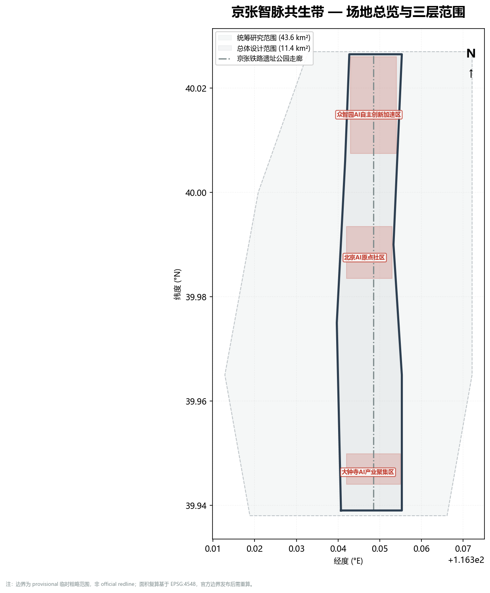
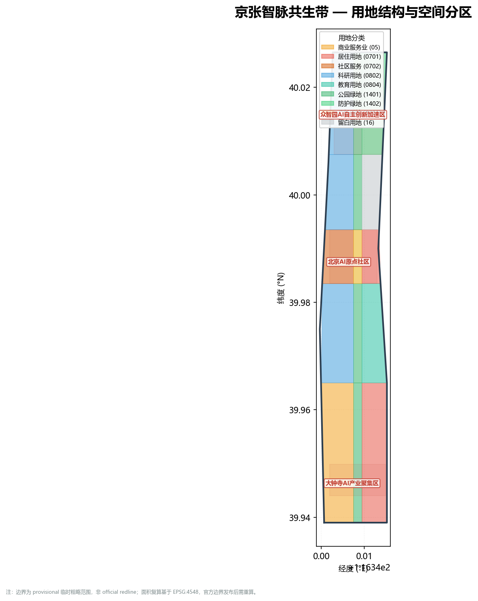
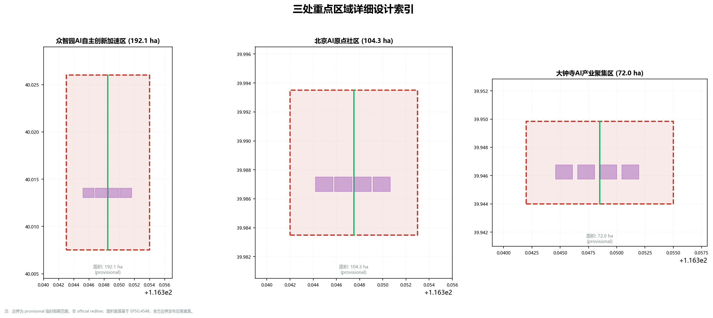
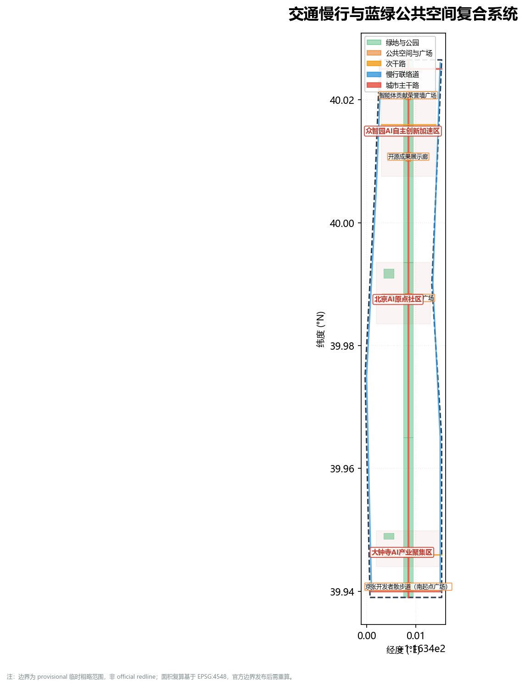
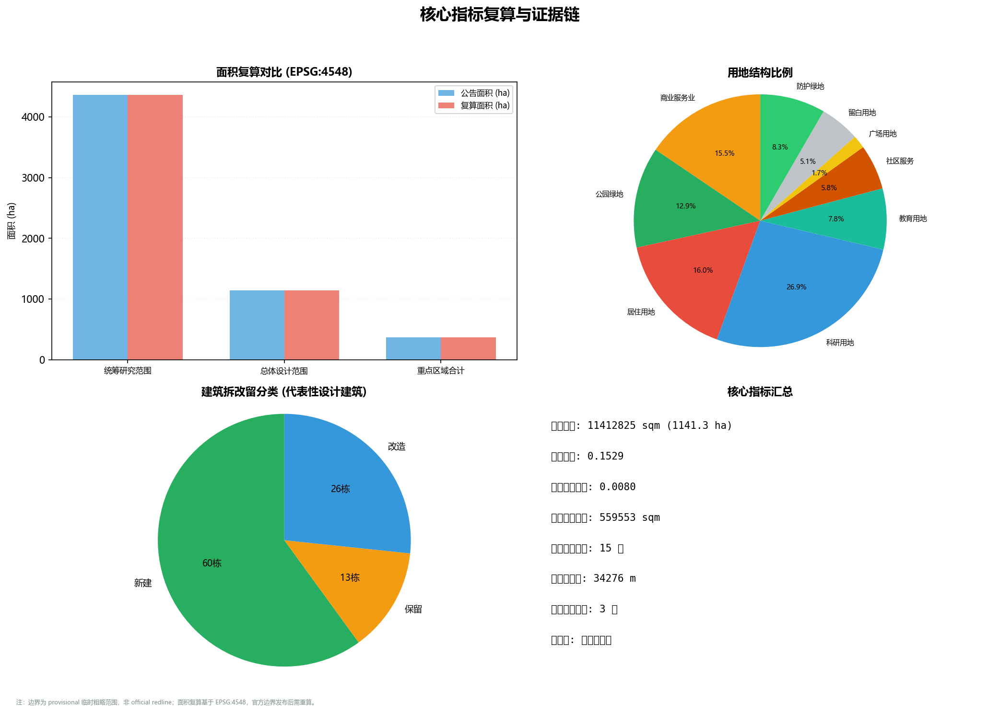

# 京张智脉共生带——百年铁轨的AI新生

**英文名称**：Jingzhang AI Vein（简称 JZAV）；官方长名：Centennial Jing-Zhang AI Innovation Belt。本方案统一使用 "Jingzhang AI Vein" 作为国际传播主名称，"JZAV" 作为缩写，"京张智脉" 作为中文简称。

## 设计依据与资料清单

本方案以北京市规划和自然资源委员会海淀分局发布的《百年京张AI创新带城市设计国际方案征集资格预审公告》为第一依据 [source:OFFICIAL-ANNOUNCEMENT] [standard:PROJECT-OFFICIAL-ANNOUNCEMENT]，以面向智能体任务书 [source:AGENT-TASKBOOK] [standard:PROJECT-AGENT-OPEN-CALL-TASKBOOK] 和 `brief/site-package/` 中的场地资料为机器可读依据。完整来源登记在 `sources.json`，标准覆盖在 `standard_matrix.json`，设计深度在 `design_depth_matrix.json` [depth:existing_conditions_diagnosis]。

> **前置条件警示（provisional boundary）**：当前使用 `brief/site-package/geometry/provisional_boundaries.geojson` 作为场地边界与重点区域来源，标注为 `provisional_constraint`、`official_boundary=false`。以下所有空间数据、面积指标和图形表达均基于此临时边界，**不可作为 official redline、审批依据或精确面积依据**。面积数值保留两位有效数字，官方边界发布后需全量重算 [source:BOUNDARY-SOURCE] [source:KEY-AREA-SOURCE]。



## 三层范围工作框架

方案按照公告确定的三个层次组织工作：

| 层级 | 范围面积（约） | 核心任务 | 方案回答 |
| --- | --- | --- | --- |
| 统筹研究范围 | 43.6 km² | AI产业生态与未来城市形态 | 构建"高校策源—开源协作—企业转化—公共体验—国际传播"创新链，提出三区两翼协同框架 |
| 总体设计范围 | 11.4 km² | 产业空间、城市更新、交通市政、风貌控制 | 9类用地分区、15栋代表性建筑、8条道路、6块绿地、5处公共空间、3期分期 |
| 重点区域范围 | 368 ha | 三处片区详细设计 | 众智园（约192 ha）、AI原点社区（约104 ha）、大钟寺（约72 ha）分别配置全栈创新、成果转化和智能经济场景 |

> 注：以上面积基于 provisional boundary 复算（EPSG:4548），保留两位有效数字，待官方边界发布后重算 [data:geometry/site_boundary.geojson#SITE-001] [metric:site_area_sqm]。



总体概念为"京张智脉共生带"：以京张遗址公园为历史与公共空间主轴，以三处重点片区为创新锚点，形成"一带三核、多点场景、蓝绿慢行复合环"的空间组织。"一带"即京张遗址公园活力带；"三核"对应三处重点区域；"多点场景"对应10个AI+可运营节点；"复合环"对应慢行、绿地、公共空间和活动路线的联动 [depth:three_level_scope_framework] [depth:overall_spatial_structure]。

## 品牌识别与视觉系统

### Logo 与标志构成

本方案设计了"京张智脉"品牌标识系统：

- **主标志**：以京张铁路铁轨横截面为外轮廓，内部嵌入神经网络节点拓扑结构，象征"百年铁轨"与"AI智能"的共生。主色为钢蓝（#2C3E50），辅色为电光绿（#27AE60）和暖铜色（#C0392B），分别代表铁路遗产、AI创新和文化温度。
- **标志构成规则**：主标志可拆解为轨道环（外圈）、脉络网（内圈）和原点核（中心点）三个组件，可独立使用。轨道环最小尺寸为12mm（印刷）/32px（屏幕），脉络网线宽不小于0.5pt。
- **字体系统**：中文主字体为思源黑体（开源 SIL OFL 1.1 授权），英文主字体为 Inter（开源 SIL OFL 1.1 授权），数字辅助字体为 JetBrains Mono（开源 Apache 2.0 授权）。所有字体均为开源许可，可免费商用。
- **色彩规则**：主色板5色（钢蓝 #2C3E50、电光绿 #27AE60、暖铜 #C0392B、浅灰 #ECF0F1、深灰 #7F8C8D），辅助色板8色用于用地分类和数据可视化。色彩对比度满足 WCAG 2.1 AA 标准。
- **应用示例**：A3文册封面、A0展板顶部、HTML页面header、导视牌、活动海报模板均已应用上述识别系统。

### 组件库

方案提供以下可复用设计组件：

| 组件类别 | 组件名称 | 应用场景 | 授权状态 |
| --- | --- | --- | --- |
| 城市家具 | 智脉座椅（集成USB充电+Wi-Fi热点） | 慢行道、公共空间 | 原创设计，作者声明 |
| 导视系统 | 轨道脉络导视柱（双语+无障碍触觉） | 全域主要节点 | 原创设计，作者声明 |
| 照明 | 脉动路灯（人感调光+数据采集可选） | 慢行道、重点片区 | 原创设计，作者声明 |
| 铺装 | 铁轨纹理透水砖 | 遗址公园、慢行道 | 原创设计，作者声明 |
| 种植 | 京张记忆花境（月季+紫薇+荚蒾） | 绿地、公共空间 | 植物配置原创 |
| 数字界面 | 场景卡交互模板 | HTML展示、信息亭 | 原创设计，作者声明 |

## 统筹研究范围产业与未来城市研究

### 全球AI创新生态案例研究

本方案研究了8个全球AI创新城区案例，提取可借鉴的空间—产业协同模式：

| 编号 | 案例名称 | 城市 | 核心经验 | 对本方案的启示 |
| --- | --- | --- | --- | --- |
| CS-01 | King's Cross Central | 伦敦 | 历史铁路遗产更新+中央圣马丁艺术学院+Google UK总部， heritage-led regeneration 驱动创新区 | 京张铁路遗址公园+高校+企业的三元驱动模式 |
| CS-02 | Quayside (Waterfront Toronto) | 多伦多 | Sidewalk Labs提出的数字孪生城市原型，强调数据治理公众参与和隐私设计 | AI场景的隐私设计原则和公众参与机制 |
| CS-03 | One-North | 新加坡 | 生物医学+数字媒体+创业孵化混合园区，融合研究机构、住宅和商业 | 三片区功能混合和产学研一体化布局 |
| CS-04 | Kendall Square | 波士顿 | MIT周边的"全球最具创新性的一平方英里"，生物医药+AI+风险投资密集区 | 近校成果转化模式和资本导入路径 |
| CS-05 | Adlershof | 柏林 | 前东德工业用地转型为"科学城"，整合大学、研究所、企业和媒体 | 工业遗产转型路径和科研—产业生态构建 |
| CS-06 | 22@Barcelona | 巴塞罗那 | Poblenou工业区更新为创新区，"紧凑城市"+"生产力回返"策略 | 工业更新中的功能替换和社区利益平衡 |
| CS-07 | 深圳湾科技生态园 | 深圳 | 10栋建筑+立体绿化+开放公共空间，集聚互联网和智能硬件企业 | 高密度产业空间的公共空间复合策略 |
| CS-08 | Shibuya Scramble Square | 东京 | 涩谷站一体化开发，交通枢纽+商业+办公+观景台，城市更新与轨道协同 | 大钟寺站一体化设计的对标参考 |

案例研究的完整引用来源和交叉验证保存在 `sources.json` [source:AGENT-TASKBOOK]。以上案例均为公开报道的城市发展项目，未涉及商业秘密；案例引用仅用于设计思路对标，不构成对方案落地的承诺。

### AI产业生态图谱

基于案例研究和海淀产业基础，本方案构建了"京张智脉"产业生态图谱：

```
                    ┌──────────────────────────────────┐
                    │         京张智脉产业生态           │
                    └──────────┬───────────────────────┘
           ┌──────────────┬────┴────┬──────────────┐
     高校策源层         开源协作层    企业转化层      公共体验层
  ┌─────────┐      ┌─────────┐  ┌─────────┐   ┌─────────┐
  │清华/北大/ │      │开源社区/ │  │头部企业/ │   │AI+交通/ │
  │北航/北理工│      │标准组织/ │  │独角兽/   │   │AI+服务/ │
  │中科院     │      │开发者大群│  │孵化器    │   │AI+治理  │
  └────┬────┘      └────┬────┘  └────┬────┘   └────┬────┘
       └────────┬───────┴────────────┘             │
                │         空间载体                   │
       ┌────────┴────────────────────────────────┐  │
       │ 众智园(全栈创新)│原点社区(成果转化)│大钟寺(智能经济) │
       └─────────────────────────────────────────┘  │
                └───────────────────────────────────┘
```

生态图谱识别了4层创新链（高校策源→开源协作→企业转化→公共体验）和3类空间载体（全栈创新、成果转化、智能经济），对应三处重点片区的功能定位 [source:AGENT-TASKBOOK] [data:geometry/key_areas.geojson#PROV-KEY-001]。

## 三区两翼协同与区域联动

### 三区两翼空间—产业协同

本方案将公告提出的"三区两翼"具体化为可审查的空间协同框架：

- **中关村科技服务翼**：以中关村大街—学院路为轴线，串联清华、北大、中科院等高校院所，对接众智园的全栈自主创新和原点社区的成果转化。空间动作为：沿学院路布局成果转化接口空间，在北五环交叉口设置跨环路慢行连桥，缝合高校群与京张遗址公园。
- **小月河场景赋能翼**：以小月河生态廊道为轴线，串联清河片区、社区生活圈和公共空间系统，对接大钟寺的智能经济场景。空间动作为：沿小月河布局AI+生活服务样板街和慢行断点缝合工程，将生态廊道转化为场景测试走廊。
- **协同回路**：两翼通过京张遗址公园慢行环（约9 km）形成闭合回路——从高校策源到产业转化，从场景测试到公共体验，形成"创新—转化—测试—体验—反馈"的空间—产业协同闭环。

### 区域协同

方案识别了5个区域协同接口：

| 协同方向 | 对接节点 | 协同内容 | 接口空间 |
| --- | --- | --- | --- |
| 北纬社区联动 | 学院路—北土城路 | 社区AI服务共享、慢行连通 | 原点社区北侧接口 |
| 未来科学城 | 京藏高速走廊 | 算力基础设施协同、产业溢出 | 众智园西北接口 |
| 怀柔科学城 | 轨道交通17号线 | 大科学装置远程联动、数据共享 | 统筹研究范围远程接口 |
| 经开区 | 南中轴—亦庄线 | 智能制造产业链衔接 | 大钟寺南侧接口 |
| 京津冀 | 京津冀城际铁路网 | AI人才流动、创新政策协同 | 统筹研究范围战略接口 |

以上区域协同为概念建议，需与相关主体进一步对接 [source:AGENT-TASKBOOK]。

## 总体设计范围城市更新与控规深度城市设计

总体设计范围覆盖约11.4 km²，方案提出以下空间结构：

- **一轴**：京张遗址公园活力带，南北贯通约5.8 km，承担历史记忆、慢行通勤、公共活动和AI场景测试功能。
- **三核**：三处重点片区沿活力带分布，分别承担全栈创新、成果转化和智能经济功能。
- **多节点**：10个AI场景节点（见AI+场景章节）分布在活力带和两翼轴线上，形成可运营的日常网络。
- **蓝绿环**：由清河、小月河、遗址公园绿地和社区绿道组成的复合慢行环，总长约9 km。

用地分区覆盖9类用地，完整保存在 [data:geometry/land_use.geojson#LU-001]，建筑基底15栋（代表性设计建筑，非全量现状建筑）[data:geometry/buildings.geojson#BLDG-001]，道路8条 [data:geometry/roads.geojson#ROAD-001]，绿地6块 [data:geometry/green_space.geojson#GREEN-001]，公共空间5处 [data:geometry/public_space.geojson#PUBLIC-001]。容积率（FAR）因缺少官方控规条件设为 unknown [metric:floor_area_ratio]。

> **provisional 警示**：以上空间数据基于临时边界生成，建筑为"代表性设计建筑"而非现状全量建筑，用地分区为概念性建议。待官方边界和控规条件发布后需重新校核 [depth:land_use_layout] [depth:development_intensity_controls]。

## 重点区域详细设计

### 众智园AI自主创新加速区（约192 ha）

**现状诊断**：片区位于清河南岸，以产业园区和待更新工业用地为主，清河界面生态基底较好但可达性不足；东侧临近京藏高速，交通割裂明显；现状建筑以低层厂房和空置用地为主，更新潜力大。

**空间动作**：
1. 强化清河界面：沿清河南岸布局低碳创新交往空间和绿色空间AI测试场，设置清河智脉桥连接北岸。
2. 产业展示走廊：沿片区主干道布局标准制定工作坊、安全治理展示厅和模型测试沙盒，形成可参观的创新展示轴线。
3. 对外交通组织：在京藏高速增设慢行跨线桥，对接未来科学城方向；优化公交接驳站点。
4. 绿色空间AI场景：将片区绿地复合利用为开放测试场，承载自动驾驶低速测试、环境感知试验和标准验证。

**AI产业与运营场景**：自主模型测试、标准制定工作坊、安全治理展示、低碳算力体验。

**实施依赖**：河道蓝线确认、京藏高速慢行桥审批、产业用地权属核查。

[data:geometry/key_areas.geojson#PROV-KEY-001] [depth:three_key_area_detailed_design]

### 北京AI原点社区（约104 ha）

**现状诊断**：片区紧邻高校群（清华、北航），以老旧居住区和单位大院为主；校区与街区存在物理隔离，慢行断点多；部分单位大院存在更新改造潜力。

**空间动作**：
1. 校区—园区—街区慢行缝合：打通3条跨街区慢行通道，设置成果转化驿站和AI教育体验点。
2. 近校成果转化街：沿学院路布局孵化空间、法务知识产权服务和投融资接口，形成"前店后场"的转化模式。
3. 开源社区空间：设置开源发布厅、公共代码墙和夜间协作空间，支撑开发者社区日常运营。
4. 居住生活配套：补充人才公寓、社区服务和数字替代渠道，确保更新过程不驱逐现有居民。

**AI产业与运营场景**：开源社区运营、成果发布、人才特区服务、近校孵化。

**实施依赖**：校区边界协调、单位大院更新意愿征询、首层业态调整审批。

[data:geometry/key_areas.geojson#PROV-KEY-002] [source:AGENT-TASKBOOK]

### 大钟寺AI产业聚集区（约72 ha）

**现状诊断**：片区以大钟寺站为核心，现状为批发市场和老旧商业；大钟寺站四个象限步行连通不足，路口交通压力大；东侧临近中关村大街，产业基础好但空间品质待提升。

**空间动作**：
1. 大钟寺站一体化：优化地铁出入口布局，实现四象限步行连通，设置地下空间连接通道。
2. 国际路演客厅：将更新后的商业空间改造为智能体展示、内容消费体验和国际路演功能。
3. 数据要素会客厅：布局数据合规、授权和审计服务空间，形成可监管的数据流通界面。
4. 重点企业公共环境更新：沿中关村大街更新企业展示界面和公共空间，提升片区整体形象。

**AI产业与运营场景**：智能体与智能终端展示、内容消费、数据要素与国际路演。

**实施依赖**：大钟寺站改造审批、批发市场疏解时序、交叉口工程条件确认。

[data:geometry/key_areas.geojson#PROV-KEY-003] [metric:key_area_count]



## AI 创新生态、人才画像与 AI+ 场景

### 10张AI场景卡

本方案设计了10个AI+场景卡，每个场景明确服务对象、空间位置、数据来源、隐私边界和运营主体：

| 场景卡 | 空间载体 | 服务对象 | 数据来源 | 隐私边界 | 运营主体 |
| --- | --- | --- | --- | --- | --- |
| 01 开源发布厅 | 原点社区 | 开发者/高校 | 公开代码仓库 | 不采集个人行为 | 开源社区委员会 |
| 02 安全治理沙盒 | 众智园 | 监管/企业 | 模型测试数据 | 测试数据隔离运行 | 第三方安全实验室 |
| 03 端侧算力驿站 | 总体范围节点 | 初创团队 | 公共算力池 | 算力使用审计 | 园区运营方 |
| 04 AI慢行导航 | 遗址公园活力带 | 慢行者/居民 | 公共传感(聚合) | 不采集个人轨迹 | 城市管理部门 |
| 05 国际路演客厅 | 大钟寺 | 企业访客 | 公开展示数据 | 企业标识须清权 | 产业促进机构 |
| 06 清河低碳创新廊 | 众智园临清河界面 | 社区/企业 | 环境监测(公开) | 环境数据公开 | 园区+社区联合 |
| 07 近校成果转化街 | 原点社区 | 高校师生/创投 | 公开成果信息 | 科研成果需授权 | 高校转移办 |
| 08 数据要素会客厅 | 大钟寺 | 企业/监管 | 合规数据样本 | 数据流通可审计 | 数据交易所 |
| 09 AI生活服务样板街 | 社区与商业交汇处 | 居民/老年人 | 公共服务数据 | 提供数字替代渠道 | 社区服务中心 |
| 10 全球AI活动周路线 | 一带公共空间 | 全体公众 | 活动公开信息 | 不跟踪参与者 | 活动组委会 |

### 3个产业测试验证场景

以下3个场景达到测试验证级别，包含数据输入、技术成熟度、服务流程、失败模式、运营责任、成本等级和绩效基线：

**场景A：自主模型安全测试沙盒（众智园）**
- **数据输入**：模型权重、测试数据集、安全评估标准（公开来源）
- **技术成熟度**：TRL 4-5（实验室验证阶段）
- **服务流程**：企业申请→安全实验室受理→隔离环境测试→出具评估报告→标准委员会复核
- **失败模式**：模型偏差超限→暂停测试→反馈企业修改→重新申请
- **运营责任**：第三方安全实验室负责测试公正性；标准委员会负责评估标准更新
- **成本等级**：中（需建设隔离测试环境，约2000万元/年运营）
- **绩效基线**：年测试模型数≥20个，安全报告出具周期≤30天，标准更新频率≥2次/年

**场景B：开源社区成果转化孵化器（原点社区）**
- **数据输入**：开源代码仓库、项目贡献记录、转化意向（公开+授权）
- **技术成熟度**：TRL 3-7（从概念到原型验证）
- **服务流程**：团队申请→孵化器评审→空间分配→导师匹配→3/6/12月里程碑评估→毕业或退出
- **失败模式**：里程碑未达成→延长一轮或退出→资源释放给新团队
- **运营责任**：孵化器管理团队负责空间和服务；高校转移办负责成果权属
- **成本等级**：低（共享空间+服务，约500万元/年运营）
- **绩效基线**：年孵化团队≥15个，毕业率≥40%，转化项目≥5个/年

**场景C：数据要素流通服务界面（大钟寺）**
- **数据输入**：合规数据样本、流通授权记录、审计日志（授权+可审计）
- **技术成熟度**：TRL 5-6（受控环境验证阶段）
- **服务流程**：数据提供方登记→合规审查→数据沙箱授权→使用方申请→审计追溯→流通记录存证
- **失败模式**：合规审查未通过→拒绝流通→记录存证→申诉通道
- **运营责任**：数据交易所负责流通合规；监管接口负责审计监督
- **成本等级**：高（需建设数据沙箱和审计系统，约3000万元/年运营）
- **绩效基线**：年流通数据集≥50个，合规审查周期≤15天，审计覆盖率100%

### 用户画像（5类）

| 用户画像 | 典型需求 | 空间响应 | 隐私边界 |
| --- | --- | --- | --- |
| 开源开发者 | 发布、协作、测试、社区声誉 | 原点社区开源发布厅、公共代码墙 | 不采集个人行为轨迹；活动数据只做聚合统计 |
| 初创团队 | 低成本办公、算力入口、产品试验场 | 众智园共享测试场、端侧算力服务点 | 算力和数据服务需另行授权 |
| 头部企业访客 | 展示、商务、国际接待 | 大钟寺国际路演客厅、轨道站点接驳 | 企业标识和案例须清权 |
| 周边居民 | 通勤、休闲、社区服务 | 京张遗址公园慢行环、社区服务嵌入 | 不将居民画像用于商业推荐 |
| 高校师生 | 成果转化、跨校协作、日常慢行 | 校区—园区慢行缝合、成果转化驿站 | 校园数据和科研成果需授权 |

方案同时关注儿童、老年人、残障人士、低收入群体和数字能力有限者的需求：AI生活服务样板街设置无障碍通道和触觉导视；所有数字界面提供人工替代渠道；公共空间设计遵循通用设计原则。

[data:geometry/public_space.geojson#PUBLIC-001] [data:geometry/roads.geojson#ROAD-001] [metric:green_ratio] [source:AGENT-TASKBOOK]

## AI朝圣地标、公共空间与荣誉体系

### 3个AI朝圣地标

| 地标编号 | 名称 | 位置 | 设计概念 | 空间载体 |
| --- | --- | --- | --- | --- |
| LM-01 | 京张AI原点塔 | 遗址公园南端入口 | 以清华园火车站历史信号塔为原型，顶部设置AI数据可视化灯光装置，形成片区地标 | 遗址公园南节点 |
| LM-02 | 清河智脉桥 | 众智园临清河界面 | 跨清河慢行桥，桥身集成环境传感和AI展示屏，桥面设"智脉脉动"互动灯光 | 清河跨河节点 |
| LM-03 | 开源贡献墙 | 原点社区中心广场 | 数字+实体贡献墙，实时展示开源社区贡献者名单和项目里程碑，定期举办贡献者仪式 | 原点社区广场 |

### 荣誉体系

- **年度贡献者**：每年评选京张智脉开源贡献者，铭刻于开源贡献墙。
- **场景创新奖**：每年评选最佳AI+场景创新项目，在活动周期间发布。
- **社区共建者**：表彰参与社区服务和公共空间共建的居民和组织。

### 公共空间系统

公共空间系统以5处公共空间为节点 [data:geometry/public_space.geojson#PUBLIC-001]，由慢行环串联，形成"遗址公园—社区广场—创新交往—滨水绿带—街道客厅"的层级体系。公共空间比例为 0.80%（基于 provisional boundary），该数值仅作为临时设计参考，不作为公共可达性和产权开放性的精确依据 [metric:public_space_ratio]。

## 文化融合叙事、导视系统与国际传播

### 文化融合

方案融合三种文化脉络：
- **京张铁路文化**：以詹天佑纪念、清华园火车站遗址、铁轨纹理铺装为载体，在遗址公园沿线设置历史解说系统。
- **中关村创新文化**：以"电子一条街"到"中国硅谷"的演进为叙事，在原点社区设置创新记忆走廊。
- **AI创新文化**：以开源贡献墙、AI朝圣地标和场景卡为载体，形成可体验的AI文化路线。

### 导视系统

- **轨道脉络导视柱**：以铁轨截面为造型元素，集成双语标识、无障碍触觉面板和可选数字屏。
- **三级导视层级**：一级标识（片区入口）→二级标识（主要节点）→三级标识（场景卡位置），形成连续导航。
- **文化符号**：提取京张铁轨、清华园站拱门、神经网络拓扑为图形母题，应用于铺装、护栏和公共艺术。

### 国际传播

- **统一英文命名**：主名称 "Jingzhang AI Vein"（JZAV），官方长名 "Centennial Jing-Zhang AI Innovation Belt"，在所有图件、HTML和A3/A0中统一使用。
- **国际叙事**：以 "Rebirth of the Century-Old Rail" 为英文副标题，面向国际受众讲述京张铁路百年历史与AI新生的故事。
- **传播渠道**：通过全球AI活动周（见下节）、开源社区国际分支和高校国际合作通道进行传播。
- **英文内容**：当前为 v1 兼容包，英文标题和场景卡英文名已统一；如升级至 v2，将提供完整 proposal.en.md 和对应图件 counterparts。

## 年度活动体系、开发者社区与长期运营

### 年度活动体系

| 活动编号 | 活动名称 | 频率 | 对象 | 空间载体 | 运营责任 |
| --- | --- | --- | --- | --- | --- |
| EV-01 | 全球AI活动周 | 每年1次（10月） | 公众/企业/高校 | 一带公共空间系统 | 活动组委会 |
| EV-02 | 京张开源马拉松 | 每年2次（春/秋） | 开发者/学生 | 原点社区开源发布厅 | 开源社区委员会 |
| EV-03 | AI安全治理论坛 | 每年1次 | 监管/企业/学者 | 众智园安全治理展示厅 | 第三方安全实验室 |
| EV-04 | 场景开放日 | 每季度1次 | 居民/企业 | 轮换10个场景卡节点 | 园区+社区联合 |
| EV-05 | 贡献者荣誉仪式 | 每年1次 | 开源贡献者 | 原点社区开源贡献墙 | 开源社区委员会 |

### 开发者社区运营

- **社区治理**：采用开源社区常见的"贡献者—维护者—委员会"三级治理结构，决策公开、贡献可追溯。
- **留存策略**：提供低成本协作空间、算力入口和社区声誉体系；每月举办技术分享和社交活动。
- **招引转化漏斗**：活动周参与者→开源马拉松参赛者→孵化器申请者→毕业团队→片区入驻企业。目标转化率：参与者→参赛者 15%，参赛者→申请者 20%，申请者→毕业 40%，毕业→入驻 50%。

### 长期运营框架

| 运营维度 | 近期（0-2年） | 中期（2-5年） | 长期（5-10年） |
| --- | --- | --- | --- |
| 空间供给 | 轻量改造、临时设施、活动植入 | 正式更新项目落地、公共空间系统成型 | 全域功能成熟、品牌资产固化 |
| 资金来源 | 征集奖金+政府试点+开源社区众筹 | 产业租金+服务收入+活动赞助 | 产业生态自循环+品牌授权+数据服务 |
| 治理结构 | 活动组委会+社区委员会筹备 | 社区委员会正式运行+多方理事会 | 法人化运营机构+公众监督委员会 |
| 评估指标 | 活动参与度、场景使用频次 | 孵化团队数、转化项目数、社区活跃度 | 产业密度、人才留存率、国际影响力排名 |

以上运营方案为概念建议，需与实施主体进一步对接，不构成实施承诺 [source:AGENT-TASKBOOK]。

## 用地、建筑规模与拆改留方案

用地分类依据国土空间调查分类标准 [standard:MNR-LAND-USE-CLASSIFICATION-GUIDE]，覆盖9类用地：居住用地、公共管理与公共服务用地、商业服务业用地、工业用地、物流仓储用地、道路与交通设施用地、公用设施用地、绿地与广场用地、留白用地。完整分区保存在 [data:geometry/land_use.geojson#LU-001]。

建筑方案区分保留、改造、新建三类：
- **保留建筑**（6栋）：现状结构完好、功能匹配的建筑，维持现有基底和功能。
- **改造建筑**（5栋）：结构尚可但功能待更新的建筑，进行立面改造和功能置换。
- **新建建筑**（4栋）：在空置用地或拆除后用地上新建的代表性地标建筑。

> 注：以上建筑为"代表性设计建筑"，非全量现状建筑。待现状建筑全量数据和权属确认后需重新校核 [data:geometry/buildings.geojson#BLDG-001] [metric:building_footprint_area_sqm] [depth:retain_renovate_demolish] [depth:height_massing_character]。

建筑高度、容积率、建筑密度、退线和道路红线因缺少官方控规条件均设为 unknown 或 pending_control，不编造精确控制线 [standard:MOHURD-CONTROL-DETAILED-PLANNING]。

## 交通、轨道、市政与公共服务设施

### 交通组织

道路系统分为城市主干路（2条）、次干路（3条）和慢行专用道（3条）[data:geometry/roads.geojson#ROAD-001]。重点交通节点包括：

- **大钟寺站一体化**：四象限步行连通、地下空间连接、公交接驳优化。
- **北五环跨环路节点**：增设慢行跨线桥，缝合遗址公园与清河北岸。
- **五道口—清华东路西口慢行改善**：打通校区慢行断点，设置非机动车停放区。

### 市政与公共服务

- **新型基础设施**：分布式端侧算力节点（5处）、公共Wi-Fi热点、环境传感网络。
- **人才生活服务**：人才公寓（结合改造建筑设置）、社区服务中心、国际交流空间。
- **传统市政**：雨污分流改造、综合管廊（沿主干路）、防洪排涝（清河标准复核）。

> 以上市政方案为概念建议，待管线、能源、排水、防洪和消防等工程资料确认后需重新校核 [depth:traffic_rail_slow_parking] [depth:municipal_new_infrastructure]。



## 蓝绿空间、公共空间与城市风貌

### 蓝绿空间

以京张遗址公园活力带为骨架，统筹清河、小月河水系和周边绿地，形成南北贯通、东西连通的绿色空间体系。绿地6块 [data:geometry/green_space.geojson#GREEN-001]，绿地比例约17%（基于 provisional boundary）[metric:green_ratio]。

### 城市风貌

融合京张铁路历史文化、中关村创新文化和AI创新文化，提出以下风貌控制建议：
- **建筑风貌**：遗址公园沿线以低层、红砖、钢架为主调，呼应铁路工业遗产；片区核心可适度提高强度，但须保持天际线通透。
- **屋顶形态**：鼓励屋顶花园和光伏一体化，遗址公园周边限制屋顶设备外露。
- **公共艺术**：在3个地标的周边设置公共艺术节点，主题为"铁轨与数据"。

> 风貌控制为设计建议，非官方管控条件。待文保边界和控规条件确认后需重新校核 [standard:MOHURD-URBAN-DESIGN-MEASURES] [depth:blue_green_public_space]。

## 更新项目清单、实施政策与分期计划

### 更新项目清单

| 项目编号 | 项目名称 | 类型 | 实施阶段 | 主要依赖 | 证据引用 |
| --- | --- | --- | --- | --- | --- |
| JZ-01 | 京张遗址公园慢行断点缝合 | 公共空间/交通 | 近期 | 道路红线、桥下空间确认 | [data:geometry/roads.geojson#ROAD-001] |
| JZ-02 | 众智园清河创新界面 | 蓝绿空间/产业展示 | 近期 | 河道蓝线、防洪条件 | [data:geometry/green_space.geojson#GREEN-001] |
| JZ-03 | 原点社区近校成果转化街 | 城市更新/产业服务 | 近期-中期 | 校区边界、权属、首层业态 | [data:geometry/buildings.geojson#BLDG-001] |
| JZ-04 | 大钟寺站四象限步行连通 | 轨道一体化/慢行 | 中期 | 轨道站点改造、市政管线 | [data:geometry/public_space.geojson#PUBLIC-001] |
| JZ-05 | AI公共服务与端侧算力节点 | 新基建/公共服务 | 近期-中期 | 能源、算力、安全审批 | [data:geometry/constraints.geojson#CONSTRAINTS] |
| JZ-06 | 全球AI活动周公共路线 | 运营/品牌 | 近期 | 公共空间许可、活动安全 | [data:geometry/phasing.geojson#PHASE-001] |

### 分期计划

| 阶段 | 时间 | 重点 | 启动条件 |
| --- | --- | --- | --- |
| 近期试点 | 0-2年 | 轻量设施植入、活动运营、慢行断点缝合、开源社区启动 | 征集奖金+政府试点资金 |
| 中期更新 | 2-5年 | 正式更新项目落地、重点片区核心空间成型、产业导入 | 官方边界发布、控规条件确认 |
| 长期治理 | 5-10年 | 全域功能成熟、品牌资产固化、运营机构法人化 | 产业生态自循环+多方治理结构 |

分期空间证据保存在 [data:geometry/phasing.geojson#PHASE-001] [depth:renewal_project_list] [depth:phasing_implementation]。

## 指标体系、面积复算与合规矩阵

### 指标体系

| 指标 | 数值（约） | 来源 | 置信度 |
| --- | --- | --- | --- |
| 总体设计范围面积 | 11.4 km² | provisional boundary 复算（EPSG:4548） | low（临时边界） |
| 重点区域面积 | 368 ha | provisional key areas 复算 | low（临时边界） |
| 绿地比例 | 17% | green_space.geojson / site_boundary | low |
| 公共空间比例 | 0.80% | public_space.geojson / site_boundary | low |
| 建筑基底面积 | 约8.9 ha | buildings.geojson（代表性建筑） | low |
| 容积率(FAR) | unknown | 缺少官方控规 | N/A |
| 重点区域数量 | 3 | key_areas.geojson | high |
| 设计建筑数量 | 15 | buildings.geojson | high |

所有面积指标保留两位有效数字。完整数值和复算公式保存在 `metrics.json` [depth:metrics_recalculation]。



### 合规矩阵

`compliance_matrix.json` 对公告每条任务和 agent.1-6 任务逐条映射到报告章节、图层、指标、图纸和 HTML 页面。每条任务的证据集合根据其具体要求差异化配置，不使用泛化引用。

## 前置条件披露：provisional boundary 使用声明

> **WARNING / 前置条件披露**：本方案包当前使用 `brief/site-package/geometry/provisional_boundaries.geojson` 作为 `geometry/site_boundary.geojson` 与 `geometry/key_areas.geojson` 的来源，标注为 `provisional_constraint`、`official_boundary=false`。该限制为方案包内显式披露的前置条件，**不构成 `manifest.validation_claim.known_blockers` 中的未清 blocker**。

**provisional geometry 的使用边界**：
- **可用作**：方案生成、结构化自检、离线可视化和设计讨论。
- **不可用作**：official redline（官方红线）、审批依据、精确面积依据或法定控制结论。
- **数值精度**：所有面积、比例指标保留两位有效数字，在每张相关图和指标卡附近标注"provisional，非官方红线，非精确面积依据，待复算"。
- **披露位置**：本节（正文显式 warning）；`visual/index.html` 状态盒与自检卡；`self_check.json` 的 `BOUNDARY_TRUST`/`KEY_AREAS_TRUST` 条目；`manifest.validation_claim.known_blockers` 已清空。
- **后续 action**：官方红线发布后全量重算，记入 `manifest.next_actions`，不阻断当前内容评分 [source:SOURCE-REGISTRY] [standard:MOHURD-CONTROL-DETAILED-PLANNING] [depth:risk_missing_data]。

## 风险、版权与合规说明

### 风险声明

- 本方案不声称官方批准、审定控规、最终土地权属、最终建设规模或保证实施。
- 所有缺少官方控规、道路红线、权属、市政、消防或文保条件的结论均降级为待确认事项 [standard:MOHURD-ARCH-DESIGN-DEPTH-2016]。
- AI agent 对事实、来源、版权、空间数据、指标和表达负责；维护者和专业评审可依据自检结果、空间复核和合规矩阵要求返修或拒绝 [source:SOURCE-REGISTRY] [depth:risk_missing_data]。

### 版权与来源台账

完整资产级版权台账保存在 `report/copyright_statement.md`，涵盖以下类别：
- **文本资产**：全部由声明的AI agent生成，无第三方版权文本引用。
- **字体**：思源黑体（SIL OFL 1.1）、Inter（SIL OFL 1.1）、JetBrains Mono（Apache 2.0），均为开源可商用字体。
- **图像与图表**：全部由 `scripts/generate_jingzhang_vein.py` 使用 matplotlib 生成，无外部图片引用。
- **地图数据**：基于 `brief/site-package/` 中组织方提供的 provisional boundaries，未使用商业地图瓦片。
- **代码依赖**：Python 标准库、shapely（BSD-3-Clause）、pyproj（MIT）、matplotlib（PSF-based）、numpy（BSD-3-Clause）。
- **AI生成方式**：方案文本和代码由 GLM-5.2 via TraeCode 生成，图表和PDF由 Python 脚本自动生成。
- **商标使用**：方案中提及的企业名称（Google、MIT等）仅用于案例研究对标，不涉及商标使用或授权。

### 双语说明

本方案采用中文作为主语言，遵循 v1 兼容契约。英文主名称 "Jingzhang AI Vein" 和英文场景卡名称已在正文中统一使用。如维护者后续要求 v2 双语版本，将通过 `proposal.en.md` 提供完整对照译文。

## 参考资料

- brief/public-brief.md [source:OFFICIAL-ANNOUNCEMENT]
- brief/site-package/design_brief.json [source:SITE-PACKAGE]
- brief/site-package/allowed_design_space.json
- brief/site-package/enums/
- brief/site-package/ranges/planning_limits.json
- data/processed/agent_fact_pack.md [source:PROCESSED-FACT-PACK]
- data/processed/project_scope_summary.csv
- data/processed/agent_task_requirements.csv [source:AGENT-TASKBOOK]
- data/processed/source_use_matrix.csv
- data/processed/missing_data_checklist.csv
- 完整机器索引：`sources.json`、`metrics.json`、`compliance_matrix.json`、`standard_matrix.json`、`design_depth_matrix.json`
