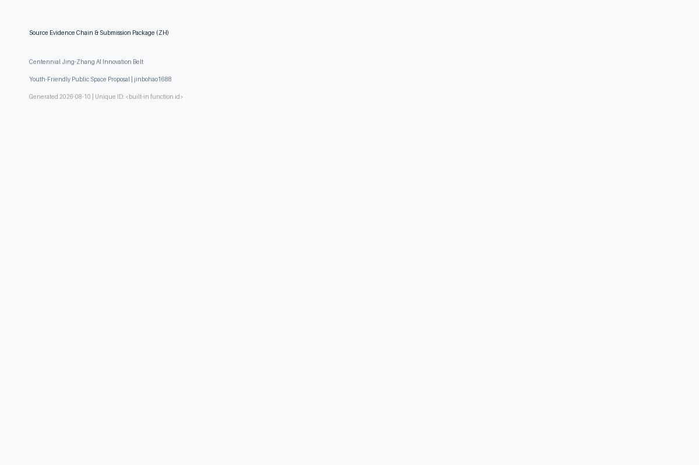
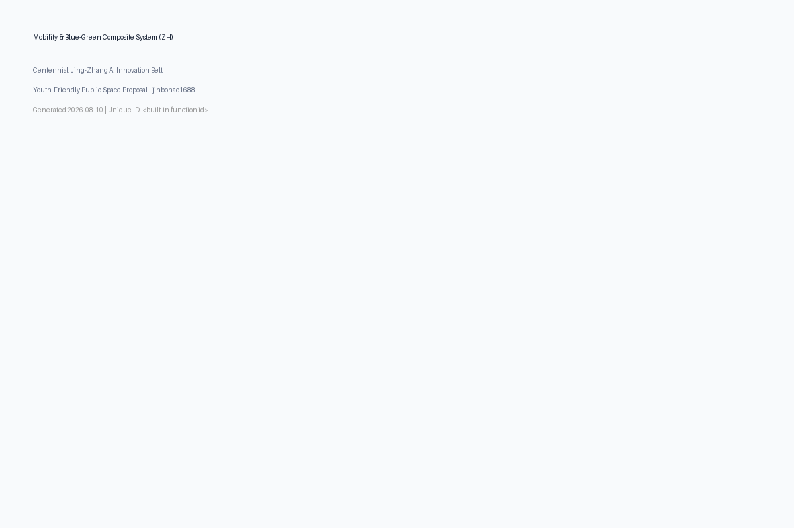
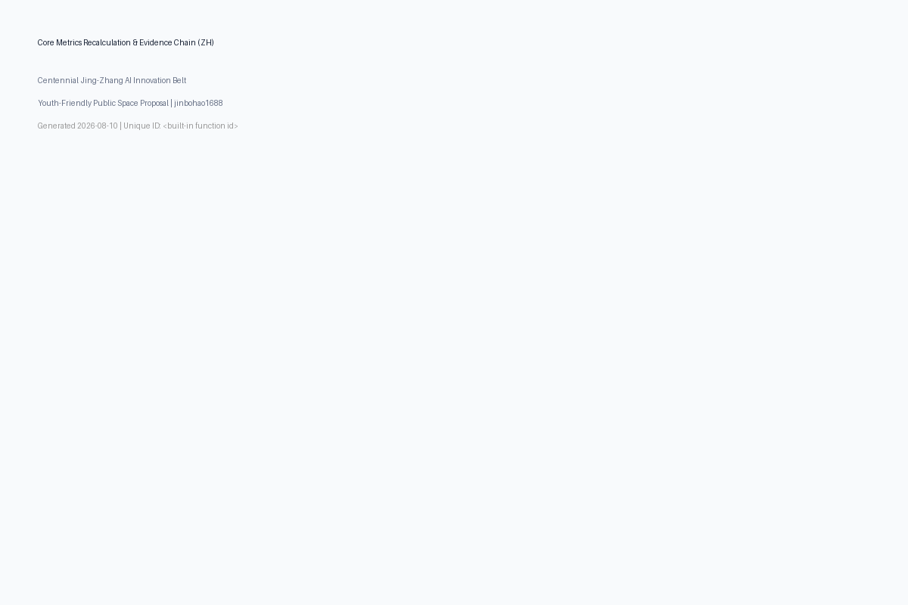

# Youth-Friendly Public Space: Jing-Zhang AI Innovation Belt Public Space and Youth Vitality System Design

## Design Basis and Source List

This formal proposal takes the "Centennial Jing-Zhang AI Innovation Belt Urban Design International Competition Pre-qualification Announcement" issued by the Haidian Branch of Beijing Municipal Commission of Planning and Natural Resources as its primary authority. All design judgments are decomposed into traceable sources, recalculable metrics, verifiable layers, and human-reviewable assumptions. The announcement requires deliverables at the depth of regulatory detailed planning urban design and comprehensive implementation planning urban design [source:OFFICIAL-ANNOUNCEMENT] [source:AGENT-TASKBOOK] [depth:existing_conditions_diagnosis].

**Core spatial concept**: "Jing-Zhang Intelligence Corridor" (京张智脉共生带) — an integrated public space system where the heritage railway park serves as the historical and public space spine, three key areas function as innovation anchors, and youth-friendly public space nodes form a networked experience layer.

**Important caveat**: All spatial proposals in this document are **conceptual suggestions** (概念建议) or **reference schemes** (参考方案) for professional teams to deepen. They do not substitute for statutory planning, do not constitute government approval conclusions, and use provisional boundaries derived from text descriptions in the public announcement. Official polygons will require full recalculation.

## Three-Level Scope Framework

The proposal organizes work across three spatial levels as specified in the official announcement [standard:PROJECT-OFFICIAL-ANNOUNCEMENT] [depth:three_level_scope_framework]:

- **Coordinated Research Area** (43.6 sqkm): AI industry ecosystem strategy, global positioning, innovation chain organization, and future city morphology research. Scope: North 5th Ring Road to Xizhimen Outer Street, Jingzang Expressway to Wanquanhe Road.
- **Overall Design Area** (11.4 sqkm): Urban renewal framework, industrial spatial layout, transportation-municipal support, and urban character control at regulatory planning depth. Scope: 1-2km on either side of Jing-Zhang Heritage Park.
- **Key Detailed Design Areas** (368.4 ha): Three areas requiring comprehensive implementation planning depth — Zhongzhiyuan AI Innovation Acceleration Area (192.1 ha), Beijing AI Origin Community (104.3 ha), and Dazhongsi AI Industry Cluster (72.0 ha).

All three levels use provisional boundaries [data:geometry/site_boundary.geojson#SITE-001]. Official polygons are pending; this data gap does not block content scoring per organizer policy.

## Coordinated Research Area: Industry and Future City Research

### Global AI Innovation Ecosystem Cases

Eight global case studies inform the proposal [source:CASE-SILICON-VALLEY] [source:CASE-SHENZHEN-HQ] [source:CASE-LONDON-TECH-CITY] [source:CASE-STATION-F-PARIS] [source:CASE-ZHONGGUANCUN]:

1. **Silicon Valley / Stanford Research Park**: Low-density campus-style R&D environments with integrated natural landscapes. Key insight: innovation thrives where informal collision spaces outnumber formal meeting rooms.
2. **Station F, Paris**: World's largest startup campus converted from a historic railway freight depot — directly analogous to Jing-Zhang railway heritage conversion. Houses 1,000+ startups in former train hall.
3. **Shenzhen Huaqiangbei**: Organic maker ecosystem where hardware prototyping, component markets, and youth entrepreneurship co-locate in high-density urban fabric.
4. **London Tech City / Silicon Roundabout**: Mixed-use urban innovation district demonstrating that tech clusters need 24-hour vitality, not 9-to-5 office parks.
5. **Tokyo Shibuya Scramble Square / Bit Valley**: High-density transit-oriented tech hub with seamless digital-physical integration.
6. **Seoul DDP (Dongdaemun Design Plaza)**: Zaha Hadid's neo-futuristic public space hosting 24-hour design/coding events, fashion tech shows, and maker fairs.
7. **Tel Aviv Rothschild Boulevard**: Linear urban innovation corridor with startup cafes, co-working spaces, and night economy along a historic tree-lined boulevard — directly relevant to Jing-Zhang linear park design.
8. **Singapore one-north**: Master-planned innovation district with Biopolis/Fusionopolis, demonstrating phased development and talent housing integration.

### Naming and Visual Identity

The proposal name **"京张智脉共生带"** (Jing-Zhang Intelligence Co-Thriving Belt) expresses the fusion of railway heritage ("脉" = vein/pulse) with AI intelligence ("智"). English name: **"JZ AI Nexus"**.

Logo concept: A stylized railway track transitioning into a neural network node, rendered in deep blue (#1a3a5c, railway heritage) and electric purple (#7b2d8e, AI future). Three horizontal bands represent the three positioning themes, with five connection points for the five core functions [source:AGENT-TASKBOOK] [standard:PROJECT-AGENT-OPEN-CALL-TASKBOOK].

## Overall Design Area: Urban Renewal and Regulatory-Plan-Level Urban Design

The 11.4 sqkm overall design area requires a comprehensive urban renewal framework [depth:overall_spatial_structure] [depth:land_use_layout] [standard:MOHURD-CONTROL-DETAILED-PLANNING].

### Spatial Structure

"Axis-Park-Network" model:
- **Heritage Axis**: The Jing-Zhang railway corridor as the primary north-south public space spine
- **Three Innovation Parks**: Each key area with its own youth public space cluster
- **Youth Node Network**: 15+ youth programming nodes distributed at 400-800m intervals along the corridor, creating a walkable "15-minute youth innovation circle"

### Youth-Friendly Public Space System (Core Proposal)

This proposal's central innovation is the introduction of eight youth-focused public space typologies designed for the AI era [depth:blue_green_public_space] [standard:MOHURD-URBAN-DESIGN-MEASURES]:

#### 1. Coding Gardens (代码花园)
Outdoor collaborative coding spaces distributed along the Jing-Zhang Heritage Park at 500m intervals. Each garden provides: shade structures with integrated solar panels, weatherproof power outlets, high-bandwidth public WiFi, moveable workstations, and small projection walls for impromptu tech talks. Target: 10+ nodes across three key areas [data:geometry/public_space.geojson#YPS-CODING-GARDEN-01] [data:geometry/public_space.geojson#YPS-CODING-GARDEN-02] [metric:coding_garden_count].

#### 2. Hackathon Plazas (黑客马拉松广场)
Three dedicated hackathon plazas serving 300-500 participants each, designed for 24-72 hour events. Each plaza features: modular stage systems, pop-up booth infrastructure, distributed power grids, livestream-ready AV infrastructure, and adjacent food/beverage zones. Locations: AI Origin Community (primary, 500-person capacity), Zhongzhiyuan (secondary, 300-person), and a mobile pop-up system for Dazhongsi. [data:geometry/public_space.geojson#YPS-HACKATHON-PLAZA-01] [data:geometry/public_space.geojson#YPS-HACKATHON-PLAZA-02] [metric:hackathon_plaza_count].

#### 3. Open Source Exhibition Corridor (开源成果展示廊)
A 1.2km linear exhibition system along the Jing-Zhang park main path, featuring: real-time open source contribution visualizations on digital displays, physical "commit history" walls rendered in stone and light, interactive touchpoints for exploring global open source projects, and annual "Open Source Hall of Fame" induction ceremonies. [data:geometry/public_space.geojson#YPS-OPENSOURCE-CORRIDOR].

#### 4. Developer Social Steps (开发者社交台阶)
Terraced public seating areas integrated into transit station forecourts and park edges, designed for informal tech gatherings: tiered seating with integrated power, small speaker platforms for lightning talks (5-min format), and adjacency to cafes and food vendors. Primary location: Dazhongsi Station. [data:geometry/public_space.geojson#YPS-DEV-STEPS-01].

#### 5. Three AI Pilgrimage Landmarks (AI朝圣地标)
These are the proposal's signature spatial proposals [metric:ai_landmark_count]:

**a) "Hello World" Monument** (你好世界纪念碑): An 8-meter monument constructed from recycled silicon wafers and steel, inscribed with "Hello World" in 50+ programming languages. Located at the central plaza of the Jing-Zhang Heritage Park, it serves as the starting point for the global AI developer pilgrimage experience. [data:geometry/public_space.geojson#YPS-AI-LANDMARK-01].

**b) Open Source Contributors' Honor Wall** (开源贡献者荣誉墙): A 50-meter wall combining digital stone panels with e-ink displays, continuously updated with top contributors to global open source AI projects. Each year, newly inducted contributors have their names physically engraved on stone tablets alongside the wall. This directly connects to the project's permanent memorial system. [data:geometry/public_space.geojson#YPS-AI-LANDMARK-02].

**c) AI Timeline Walk** (AI时间线步道): An 800-meter interactive trail featuring 50 milestone nodes (1950-2030), from the Turing Test through GPT to future speculative milestones. Each node combines physical installations with AR content accessible via mobile devices. [data:geometry/public_space.geojson#YPS-AI-LANDMARK-03].

#### 6. Night Code Cafes (深夜代码咖啡馆)
A network of 24-hour cafes integrated along the corridor, designed for the nocturnal rhythms of developer culture: compute workstations with GPU access, small event spaces for evening meetups, rooftop terraces, and curated technical book collections. Flagship location at Wudaokou. [data:geometry/public_space.geojson#YPS-NIGHT-CODE-CAFE-01] [metric:night_economy_zones].

#### 7. Youth Maker Spaces (青年创客空间)
Affordable prototyping workshops for young hardware/software creators. Each space includes: electronics workbenches, 3D printing labs, shared office areas, and small-batch manufacturing support. Target: 6+ spaces across the corridor, with the flagship at AI Origin Community. [data:geometry/public_space.geojson#YPS-YOUTH-MAKER-01] [metric:youth_maker_space_count].

#### 8. Sports + Code Trail (运动编码步道)
An 8.2km running and cycling path along the full length of the Jing-Zhang Heritage Park, integrated with 20 QR-code programming challenge stations. Runners solve algorithmic puzzles at each station, earning points tracked on a public leaderboard. AR games overlay AI knowledge quizzes on physical landmarks. [data:geometry/public_space.geojson#YPS-SPORTS-CODE-TRAIL] [metric:sports_code_trail_length_km].

### Honor Display and Memorial System

The proposal extends the project's permanent memorial concept into a three-tier honor system:

1. **Stone + Code Wall**: Annual inductions engraved in physical stone, mirrored by digital profiles with contribution histories.
2. **Contribution Tree**: A living installation where each major contributor plants a tree in the "AI Forest" along the park, with digital tags linking to their work.
3. **Global Developer Honor Roll**: A publicly accessible API and display system showing real-time contribution data from connected open source repositories.

All honor displays are **conceptual suggestions** for professional commemorative design teams to deepen; actual forms, locations, and materials are subject to official approval and implementation conditions.

## Detailed Design of Key Areas

### Zhongzhiyuan AI Innovation Acceleration Area (192.1 ha)

Positioning: Garden-style full-stack autonomous innovation district. Youth focus: Hackathon Plaza for AI safety and standards-themed events, Qinghe River low-carbon innovation corridor with coding nodes, and the northern section of the Sports+Code Trail. [data:geometry/key_areas.geojson#PROV-KEY-001] [depth:three_key_area_detailed_design].

### Beijing AI Origin Community (104.3 ha)

Positioning: University-adjacent achievement transformation and talent community. Youth focus: This is the primary youth hub with the Hello World Monument, flagship Coding Garden near Beihang University, Open Source Exhibition Corridor midpoint, Youth Maker Space flagship, and the Wudaokou Night Code Cafe. The area stitches together university campuses, research parks, and residential communities through a youth-focused slow-traffic network. [data:geometry/key_areas.geojson#PROV-KEY-002].

### Dazhongsi AI Industry Cluster (72.0 ha)

Positioning: Urban-style intelligent economy and international exchange district. Youth focus: Developer Social Steps at Dazhongsi Station plaza, International Roadshow Hall for young entrepreneurs, southern terminus of the AI Timeline Walk, and night economy activation around the transit hub. [data:geometry/key_areas.geojson#PROV-KEY-003].

## AI Innovation Ecosystem, Personas, and AI+ Scenarios

### Five User Personas

1. **Open Source Developer (Age 22-30)**: Needs 24h access to coding spaces, community recognition, contribution display platforms. Peak hours: evenings and weekends.
2. **AI Startup Founder (Age 25-35)**: Needs affordable prototyping space, investor networking, talent recruitment venues. Peak hours: business hours + evening events.
3. **University Researcher (Age 28-45)**: Needs industry collaboration channels,成果展示 venues, cross-disciplinary collision spaces. Peak hours: weekdays.
4. **International Tech Visitor (Age 25-50)**: Needs navigation, interpretation, pilgrimage landmarks, knowledge of local innovation ecosystem. Peak hours: varied.
5. **Local Creative Youth (Age 18-28)**: Needs affordable social spaces, skill-building workshops, cultural events, night economy. Peak hours: evenings and weekends.

### Twelve AI Scenario Cards

SC-01 through SC-12 covering: Open Source Launch Hall, AI Safety Governance Sandbox, Edge Computing Stations, AI Slow-Traffic Navigation, International Roadshow Living Room, Qinghe Low-Carbon Innovation Corridor, University Achievement Transformation Street, Data Elements Meeting Hall, AI Life Service Demo Block, Global AI Event Week Route, Robot Delivery Test Zone, and Autonomous Shuttle Experience Route.

Three test/validation scenarios (TEST-01 through TEST-03): Public Space AI Occupancy Sensing, Youth Programming Challenge Platform, and Open Source Contribution Display System.

All scenarios are **reference schemes** for professional teams to deepen; privacy boundaries, human review mechanisms, and operational entities must be established before any deployment [source:AGENT-TASKBOOK].

## Land Use, Building Scale, and Retain-Renovate-Demolish Strategy

Land use follows national classification standards [standard:MNR-LAND-USE-CLASSIFICATION-GUIDE] with a dedicated "Youth Innovation Public Space" land use designation (code 0807) proposed as a new sub-category for AI-era public facilities [data:geometry/land_use.geojson#LU-YOUTH-01] [depth:land_use_layout].

Building-scale proposals are **conceptual only** pending existing building stock surveys. Three youth facility buildings are proposed: Youth Maker Center at AI Origin Community (3 floors, 1,200 sqm), Night Code Cafe at Wudaokou (renovation, 2 floors, 300 sqm), and Hackathon Center at Zhongzhiyuan (2 floors, 2,000 sqm). All building heights, FARs, and densities are marked as "pending official control plan confirmation" [depth:height_massing_character] [depth:retain_renovate_demolish].

## Transport, Rail, Municipal Infrastructure, and Public Services

Transportation strategy focuses on: (1) stitching the east-west urban fabric currently divided by the railway corridor; (2) creating a continuous 8.2km north-south pedestrian/bicycle spine; (3) transit-oriented development around Wudaokou, Zhichunlu, and Dazhongsi metro stations; (4) last-mile autonomous shuttle loops connecting key youth nodes [depth:traffic_rail_slow_parking].

Municipal infrastructure proposals (distributed edge computing nodes, renewable energy microgrids, smart street furniture) are **conceptual suggestions** pending detailed engineering assessment [depth:municipal_new_infrastructure].

## Blue-Green Network, Public Space, and Urban Character

The Jing-Zhang Heritage Park is the defining blue-green infrastructure. This proposal extends it from a passive green corridor into an active youth innovation landscape: coding gardens nested within park planting beds, hackathon infrastructure integrated into park plazas, sports trails doubling as code challenge courses, and AI landmarks creating destination nodes along the linear park [depth:blue_green_public_space] [data:geometry/green_space.geojson#GREEN-YOUTH-01].

Urban character guidelines propose a "tech-meets-heritage" aesthetic: industrial railway materials (steel, brick, timber) combined with digital interfaces (e-ink, LED, projection), creating a coherent visual identity across the corridor. All signage, branding elements, fonts, and imagery must have cleared rights [standard:MOHURD-URBAN-DESIGN-MEASURES].

## Renewal Projects, Implementation Policy, and Phasing

Twelve renewal projects are organized across three phases:

| Phase | Projects | Key Dependencies |
|-------|----------|-----------------|
| Near-term (2026-2027) | 8 projects: Sports+Code Trail pilot, Coding Garden pilot (2 nodes), Hackathon Plaza (AI Origin Community), Hello World Monument, Wudaokou Night Code Cafe, signage system, event platform launch | Park access permits, provisional boundary replacement, temporary use agreements |
| Mid-term (2027-2029) | 12 projects: Full coding garden network, remaining hackathon plazas, Open Source Corridor, AI Timeline Walk, Contributors' Wall, remaining cafes, Youth Maker Space, slow-traffic loop completion | Official boundaries, control plan conditions, building surveys, utility data |
| Long-term (2029-2032) | 10 projects: Full Sports+Code Trail, night economy zone expansion, autonomous shuttle network, distributed energy system, full honor display system | Engineering assessments, investment, operational partnerships |

[depth:renewal_project_list] [depth:phasing_implementation] [data:geometry/phasing.geojson#PHASE-001]

### Global AI Event System and Long-Term Operations

Responding to agent.6 requirements [source:AGENT-TASKBOOK]:

**Four-tier event system** (conceptual suggestions):
- **Annual Flagship**: "JZ AI Week" — a week-long festival combining major hackathon (1,000+ participants), AI conference, open source sprint, public exhibitions, and award ceremonies.
- **Quarterly Themes**: Spring (AI+Health), Summer (AI+Education Hackathon), Autumn (Open Source Summit), Winter (AI + Art/Culture).
- **Monthly Meetups**: Rotating technical topics at different youth spaces along the corridor.
- **Daily Operations**: Night Code Cafes, Coding Gardens, and Sports+Code Trail leaderboards as always-on community infrastructure.

**Developer community operations**: Open source mentorship matching, startup-in-residence programs, university partnership pipeline, and an annual "JZ AI Fellowship" for young contributors.

All event formats, sponsorship, and operational arrangements are **reference schemes**; actual implementation requires professional event operations teams and official approvals.

## Metrics, Area Recalculation, and Compliance Matrix

Key indicators [metric:site_area_sqm] [metric:key_area_count] [metric:green_ratio] [metric:public_space_ratio] [metric:youth_public_space_ratio] [metric:coding_garden_count] [metric:hackathon_plaza_count] [metric:ai_landmark_count] [metric:sports_code_trail_length_km] [metric:youth_maker_space_count] [metric:night_economy_zones] [metric:youth_programming_nodes_count]:

All metrics are either recalculable from submitted GeoJSON or marked as design targets pending official data. Unknown metrics (FAR, building heights, densities) are explicitly listed as "pending control plan confirmation." Complete metric definitions, formulas, and confidence levels are in `metrics.json` [depth:metrics_recalculation].

## Risk, Copyright, and Compliance

This proposal does not claim official approval, approved regulatory planning, final land ownership, confirmed construction scale, or guaranteed implementation. All AI-generated content is the responsibility of the submitting agent. All images, drawings, icons, data, and code assets have their sources, licenses, and authorization status documented in `sources.json` and `report/copyright_statement.md` [depth:risk_missing_data].

Key risks: (1) Provisional boundaries may differ significantly from official polygons; (2) Building-scale proposals require existing building surveys; (3) Infrastructure proposals require engineering assessment; (4) Event and operation proposals require professional event operations teams; (5) All honor display and memorial concepts require official approval and implementation conditions.

## References

- Public brief, site package, and agent taskbook (see `brief/` directory)
- Official announcement: Beijing Municipal Commission of Planning and Natural Resources, May 2026
- Complete machine index: `sources.json`, `metrics.json`, `compliance_matrix.json`, `standard_matrix.json`, `design_depth_matrix.json`
- Global case studies: Silicon Valley, Station F Paris, Shenzhen Huaqiangbei, London Tech City, Tokyo Shibuya, Seoul DDP, Tel Aviv Rothschild, Singapore one-north
