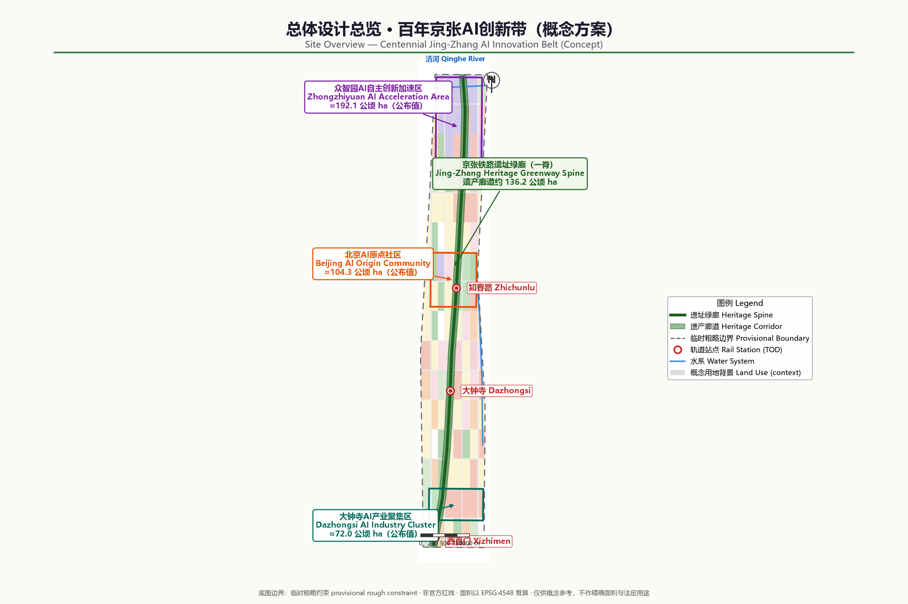
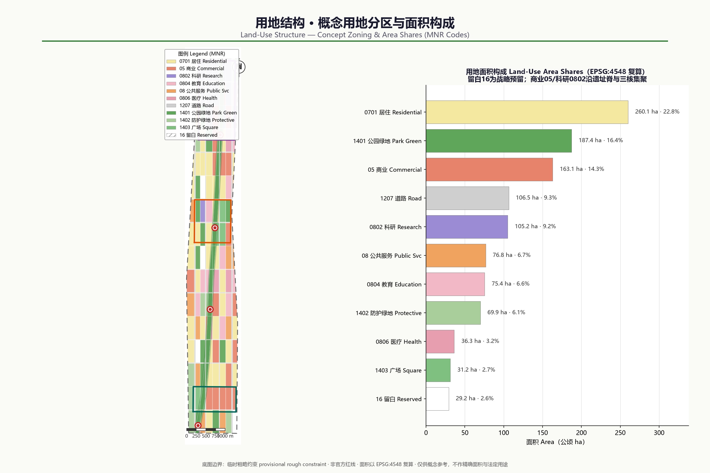
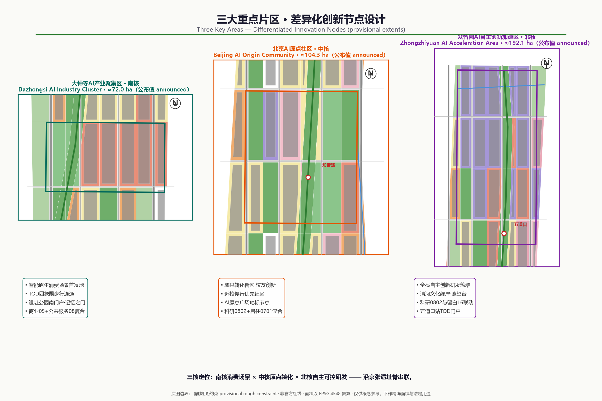
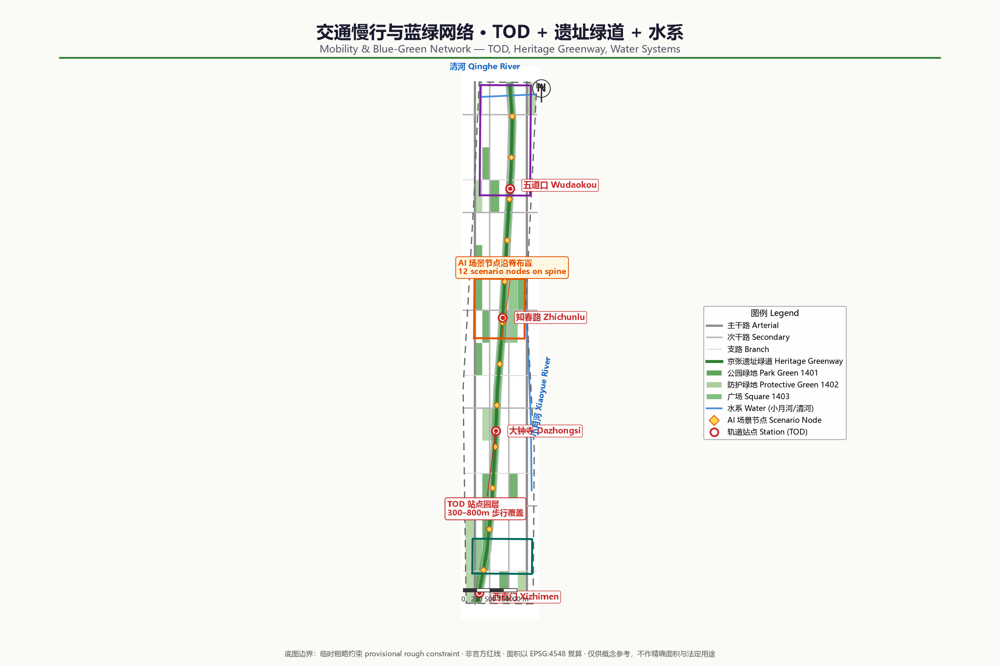
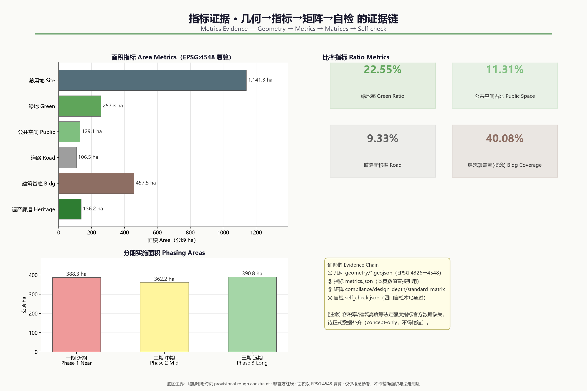

# Centennial Jing-Zhang AI Innovation Belt: Concept Urban Design

This proposal was generated by a Kimi Code Agent as an open co-creation concept deliverable for the "Centennial Jing-Zhang AI Innovation Belt Open Call for Urban Design". All spatial implementation recommendations are **conceptual recommendations and reference schemes for further study by professional teams**. They do not replace statutory planning and do not constitute any government-approved conclusion or implementation commitment.

## Design Basis and Source List

The primary basis of this proposal is the pre-qualification announcement issued on 9 May 2026 by the Haidian Branch of the Beijing Municipal Commission of Planning and Natural Resources: the announcement defines the three-level scope, the three key areas, the design tasks, and the requirement for urban design at Regulatory Detailed Planning depth [source:DATA-SRC-OFFICIAL-ANNOUNCEMENT-20260509] [standard:PROJECT-OFFICIAL-ANNOUNCEMENT]. The agent-facing open-call taskbook defines the three major positionings, the five major functions, the "Three Zones and Two Wings" industrial structure, six tasks agent.1 through agent.6, and the boundary clause on the "conceptual recommendation" nature of all outputs [source:DATA-SRC-AGENT-TASKBOOK-20260518] [standard:PROJECT-AGENT-OPEN-CALL-TASKBOOK].

Material use follows the permitted-purpose boundaries of the Source Registry: the announcement and taskbook, MOHURD urban design standards, and the Ministry of Natural Resources land-use classification guide may serve as formal task bases; the provisional boundary data may only be used for generation, display, and provisional self-checks; material such as smart-technology policy for older adults is background only and is not escalated into statutory control or implementation conclusions [source:DATA-SRC-PROVISIONAL-BOUNDARIES-20260605]. Full sources, licences, and restrictions are recorded in `sources.json`; the body text does not repeat the machine index.

Because the organizer has not yet released official precise boundaries and key-area polygons, all spatial layers in this proposal are generated from the repository-maintained provisional boundaries and are labelled as provisional constraint extents: rough, unofficial planning boundaries that cannot be used for precise area determination, approval basis, or statutory control [data:geometry/site_boundary.geojson#PROV-SITE-001] [metric:site_area_sqm]. Once official data is completed, land use, buildings, roads, green space, public space, phasing, and all area metrics must be recalculated and updated with the same generation script; this trigger condition is recorded in `assumptions.json`.

## Three-Level Scope Framework

The proposal organizes its work into the three levels defined by the announcement [source:DATA-SRC-OFFICIAL-ANNOUNCEMENT-20260509] [depth:three_level_scope_framework]:

| Level | Official Area | Work Objective | Depth and Expression in This Proposal |
| --- | --- | --- | --- |
| Coordinated Research Area (CRA) | approx. 43.6 sqkm | AI industry ecosystem, strategic positioning, future city form | Strategic research and structural diagrams; no precise planning boundaries |
| Overall Design Area (ODA) | approx. 11.4 sqkm | Overall urban renewal framework, industrial space, transport and municipal systems, urban character | Urban design at Regulatory Detailed Planning depth, with concept layers and metrics [data:geometry/land_use.geojson#LU-001] |
| Key-Area Detailed Design Area (KDA) | approx. 368.4 hectares | Refined design of three key areas | Concept detailed design at Integrated Planning Implementation Plan depth [data:geometry/key_areas.geojson#PROV-KEY-001] |

The three levels cascade: the CRA answers "where the industry goes and how the urban form adapts"; the ODA translates those judgements into land-use structure, renewal projects, and facility capacity; the key areas verify the implementability of functions, buildings, transport, and public space. From north to south the three key areas are the Zhongzhiyuan AI Independent Innovation Acceleration Area (approx. 192.1 hectares), the Beijing AI Origin Community (approx. 104.3 hectares), and the Dazhongsi AI Industry Cluster (approx. 72.0 hectares), expressed in this package as provisional rough polygons with areas recalculated under EPSG:4548 [metric:zhongzhiyuan_ai_acceleration_area_sqm].

It must be stressed that all three levels currently lack official precise boundaries; the ODA and key-area layers submitted here are provisional constraint extents. All area figures are geometric recalculations under EPSG:4548 based on the provisional boundaries and differ from the announcement's textual areas by roughly 0.1%–0.4%; they are for scheme discussion and self-checking only [data:geometry/key_areas.geojson#PROV-KEY-002] [metric:key_area_total_sqm].

## Coordinated Research Area: Industry and Future City Research

The Coordinated Research Area covers the region of Haidian's "Three Zones and Two Wings". The proposal advances one overarching concept, **"Jing-Zhang Intelligence Spine, Rebirth from the Origin" (Jing-Zhang Intelligence Spine)**: taking the Jing-Zhang Railway heritage corridor — built under Zhan Tianyou in 1909 — as the temporal and public-space spine, it extends the historical narrative of "the origin of China's independent engineering" into a future narrative of "the origin of China's independent AI innovation", forming the spatial carrier for the three positionings of a centennial Jing-Zhang cultural belt, an urban AI life experience belt, and an AI-integrated innovation belt [source:DATA-SRC-AGENT-TASKBOOK-20260518].

The recommended naming system is: the master brand keeps the open-call name "Centennial Jing-Zhang AI Innovation Belt"; the conceptual sub-brand is "Jing-Zhang Intelligence Spine"; the three key areas respectively reinforce the identities "Zhongzhiyuan: Full-Stack Origin", "AI Origin: Campus-Adjacent Translation", and "Dazhongsi: AI-Native". The recommended logo direction uses "railway switch × neural-network node" as the basic figure: the industrial memory of branching rails is structurally isomorphic with the growth of an AI network; primary colours are rail steel-cyan and Haidian tech blue, accented by heritage brick red. This direction is only a visual-identity conceptual recommendation and requires professional development plus font, trademark, and copyright clearance.

The spatial translation of the five major functions forms a coordinated loop: the Full-Stack Independent AI Innovation System lands in the Zhongzhiyuan R&D clusters; the world-class AI innovation ecosystem lands in the AI Origin Community and the university interface; new AI-enabled scenario paradigms land along the Xiaoyue River Scenario Enablement Wing and the heritage park; the intelligent AI vitality city lands in public services and the Walking and Cycling Network; and global AI governance voice lands in standards, safety governance, and exhibition functions [depth:overall_spatial_structure]. For regional coordination, the CRA links north to the Future Science City and Huairou Science City, east to the Jingzang Expressway innovation corridor, and south via the Xizhimen hub into the central city, with the Zhongguancun Technology Services Wing hosting capital and professional-service allocation.

Global AI innovation ecosystem case studies (summary, for mechanism reference only; not an investment-attraction or investment conclusion) [source:DATA-SRC-AGENT-TASKBOOK-20260518]:

| Case | Transferable Mechanism | Translation Direction in This Proposal |
| --- | --- | --- |
| Silicon Valley Stanford–Sand Hill innovation belt | University origination + venture capital + open office ecosystem | AI Origin Community tech-transfer blocks and the Technology Services Wing |
| Boston Kendall Square | Campus–park–city integrated renewal | Campus-adjacent low-disturbance renewal and walking-cycling stitching |
| London King's Cross Knowledge Quarter | Railway heritage activation + cultural institution anchors | Jing-Zhang heritage park corridor and pilgrimage landmarks |
| Toronto Quayside (lessons learned) | Data governance first, public-realm testing boundaries | Data governance and human review rules for scenario access |
| Shenzhen Qianhai/Nanshan tech corridor | Full-chain industrial space supply and scenario access | Zhongzhiyuan full-stack system and scenario-list management |
| Munich Werksviertel renewal district | Mixed use of industrial relics, incremental operation | Incremental renewal of Dazhongsi stock buildings and business-format cultivation |

Judgement on future urban form: an innovation district in the AI era should be "testable, walkable, and liveable" — industrial and public spaces are no longer segregated by zoning but interpenetrate through scenarios as interfaces. This judgement is carried into the ODA's mixed land use, Walking and Cycling Network, and scenario-node layout [depth:overall_spatial_structure] [data:geometry/public_space.geojson#PUBLIC-001].

## Overall Design Area: Urban Renewal and Regulatory-Plan-Level Urban Design

The Overall Design Area covers approx. 11.4 sqkm (approx. 11.413 million sqm recalculated under the provisional boundary) and is a high-density built-up district; the renewal logic must be **stock mending, not large-scale demolition and reconstruction** [metric:site_area_sqm] [standard:MOHURD-CONTROL-DETAILED-PLANNING]. The proposal advances an overall spatial structure of "one spine, three cores, two wings, multiple nodes": the Jing-Zhang heritage park green corridor as the public vitality spine; the three key areas of Zhongzhiyuan, AI Origin, and Dazhongsi as innovation cores; the Zhongguancun Technology Services Wing and Xiaoyue River Scenario Enablement Wing coordinated at the strategic level; and rail stations and scenario nodes forming the multi-point network [data:geometry/land_use.geojson#LU-001].

Following Regulatory Detailed Planning depth requirements, the proposal forms a concept land-use zoning: 367 land-use units that fully tessellate the provisional boundary with no gaps, covering residential, commercial services, research, education, public administration, medical, road, park green, protective green, plaza, and reserved (white) land; the classification codes correspond to a project subset of the Ministry of Natural Resources land and sea use classification guide [standard:MNR-LAND-USE-CLASSIFICATION-GUIDE] [data:geometry/land_use.geojson#LU-001]. In terms of industrial function ratios, research and commercial-service land cluster significantly within the key areas, supporting full-stack AI R&D, achievement translation, and AI-native business formats; reserved land keeps flexibility for long-term scenarios and functions.

The renewal framework is organized under the Demolish–Renovate–Retain Strategy (with new build): structurally sound, well-used existing buildings are mainly retained; inefficient buildings within the key areas are mainly renovated and functionally replaced; directional demolition-and-rebuild recommendations are made only for individual dilapidated, inefficient structures on key public corridors; new construction concentrates on potential plots in the key areas and around rail stations. All Demolish–Renovate–Retain judgements are conceptual recommendations, pending verification of ownership, existing-building ledgers, and regulatory-plan conditions by professional teams [depth:retain_renovate_demolish] [data:geometry/buildings.geojson#BLDG-001].

For overall capacity, the concept building footprint is approx. 4.575 million sqm with a concept building coverage ratio of approx. 40%, reflecting the high-density reality of the built-up area; total building volume, Floor Area Ratio, and building height are uniformly recorded as pending official data because official regulatory-plan conditions are missing, and no speculative values are passed off as approved metrics [metric:building_footprint_area_sqm] [metric:floor_area_ratio].

## Detailed Design of Key Areas

The detailed designs of all three key areas reach the concept depth of an Integrated Planning Implementation Plan; their spatial extents are expressed as provisional rough polygons and their conclusions are directional designs [data:geometry/key_areas.geojson#PROV-KEY-001] [depth:three_key_area_detailed_design].

**Zhongzhiyuan AI Independent Innovation Acceleration Area (approx. 192.1 hectares; approx. 1.929 million sqm recalculated under the provisional extent)** [data:geometry/key_areas.geojson#PROV-KEY-001] [metric:zhongzhiyuan_ai_acceleration_area_sqm]: positioned as a garden-style full-stack independent AI innovation district. Spatially it takes the Qinghe green waterfront and the northern section of the heritage park as its ecological skeleton, organizing R&D clusters, standards and safety-governance exhibition, and industry showcase and exchange functions; the concept land use is dominated by research land, composited with commercial services and park green space; external transport is recommended to be optimized in conjunction with the Fifth Ring Road regional integration planning study, with specific alignments and cross-sections to be developed by professional teams; it explores functional scenarios where green space serves AI development, such as low-carbon computing showcases and outdoor testing greenways.

**Beijing AI Origin Community (approx. 104.3 hectares; approx. 1.043 million sqm recalculated under the provisional extent)** [data:geometry/key_areas.geojson#PROV-KEY-002] [metric:beijing_ai_origin_community_sqm]: positioned as a campus-adjacent AI innovation living community. Around the original-innovation origination of universities, it plans achievement incubation and translation blocks, talent housing and living amenities, and achievement release and showcase nodes; the renewal mode emphasizes low-disturbance, organic renewal dominated by building renovation and functional replacement; the Walking and Cycling Network focuses on stitching campus–park–community breakpoints, with integrated concept design around rail stations such as Wudaokou and Qinghua East Road West.

**Dazhongsi AI Industry Cluster (approx. 72.0 hectares; approx. 0.720 million sqm recalculated under the provisional extent)** [data:geometry/key_areas.geojson#PROV-KEY-003] [metric:dazhongsi_ai_industry_cluster_sqm]: positioned as an urban AI-native industry district. Leveraging the pull of leading enterprises, it organizes industrial carriers around AI-native and AI+ integrated formats such as agents, smart terminals, and content consumption; it prioritizes the Dazhongsi station TOD integration and a four-quadrant pedestrian-connectivity concept at the intersection, improving static transport such as non-motorized parking; and it proposes composite-use conceptual recommendations for planned green space, embedding showcase, testing, and public-exchange functions.

The shared implementation risks of the three areas are: the provisional boundaries may be inconsistent with official extents, existing ownership is complex, and renewal intensity is constrained by regulatory-plan conditions. The proposal recommends advancing in the order of "consensus plots first, public corridors connected through, scenario nodes as catalysts"; specific Demolish–Renovate–Retain decisions and development sequencing await official data and professional demonstration [depth:renewal_project_list].

## AI Innovation Ecosystem, Personas, and AI+ Scenarios

The AI Innovation Ecosystem is organized along the chain "origination–translation–acceleration–application–governance": universities, research institutes, and the open-source community provide original innovation; the AI Origin Community hosts incubation and translation; Zhongzhiyuan carries full-stack acceleration and standards governance; Dazhongsi forms AI-native application and consumption scenarios; and the Zhongguancun Technology Services Wing provides capital, legal, accounting, and other professional services [source:DATA-SRC-AGENT-TASKBOOK-20260518]. Factor support covers land and space, industrial funding, talent policy, computing power and data, and scenario-access mechanisms; all are mechanism recommendations and do not constitute policy commitments.

User personas (5 categories, all derived from public research and common-sense inference, involving no personal data):

| Persona | Core Needs | Spatial and Service Touchpoints |
| --- | --- | --- |
| AI researchers / university faculty and students | Low-cost lab space, academic exchange, commuting convenience | AI Origin Community incubation blocks, transit-station integration |
| Entrepreneurs and developers | Computing and data access, showcase opportunities, community belonging | Zhongzhiyuan accelerators, developer-community operation space |
| Employees of leading enterprises | Efficient commuting, international exchange, business amenities | Dazhongsi TOD and international-exchange nodes |
| Local residents (including older adults and children) | Daily services, green space, understandable AI services | Community service centres, public sections of the heritage park |
| Visitors and global pilgrims | Accessible AI experiences, cultural narrative, wayfinding | AI pilgrimage route and landmark nodes |

AI scenario cards (12 in total, 4 of which are Testing and Validation Scenarios (TVS); all are conceptual recommendations and may be piloted only after passing privacy assessment and Human Review mechanisms) [depth:municipal_new_infrastructure]:

| No. | Scenario | Spatial Touchpoint | Users | Data and Privacy Boundaries | Human Review and Operation |
| --- | --- | --- | --- | --- | --- |
| S01 | Heritage-corridor AI guided narration | Entire heritage park | Visitors, students | Public cultural material; no face capture | Content-expert review; park operator |
| S02 | Low-speed autonomous shuttle (TVS) | Closed section of the heritage-park greenway | Commuters, visitors | In-vehicle anonymized sensor data; limited road sections | On-board safety officer; test entity filing |
| S03 | Urban computing testbed (TVS) | Zhongzhiyuan open blocks | Enterprises, universities | Anonymized environmental data; minimal collection | Third-party evaluation; management-committee platform |
| S04 | Robot last-mile delivery (TVS) | AI Origin Community blocks | Residents, merchants | Desensitized address data; limited time windows | Operator dispatch desk with manual takeover |
| S05 | AI+ health service navigation | Community health service nodes | Residents, older adults | Follows barrier-free and in-person service boundaries [standard:BARRIER-FREE-ENVIRONMENT-LAW] | Parallel staffed counters; institutional operation |
| S06 | AI+ education open classroom | University interface and community spaces | Students, public | Open course content; minor protection | Teacher-led; school review |
| S07 | AI+ legal and government-service assistance | Technology Services Wing nodes | Enterprises, residents | Public regulatory corpus; no case-specific conclusions | Licensed-personnel review; service provider responsible |
| S08 | Smart walking and cycling organization | Walking and Cycling Network and greenways | Commuters | Aggregated flow data; no individual tracking | Traffic-authority coordination; platform operation |
| S09 | Public-safety event operations review support (TVS) | Key public places | Managers | Strictly limited permissions and retention periods [source:DATA-SRC-GENERATIVE-AI-INTERIM-MEASURES] | Human final judgement; periodic audit |
| S10 | Enterprise service Copilot | Dazhongsi industrial carriers | Enterprises | Enterprise-authorized data; tiered access | Enterprise administrator review |
| S11 | Intelligent building and energy operations | Renewal demonstration buildings | Property managers, owners | On-premises processing of in-building sensor data | Property engineer review |
| S12 | Nighttime vitality and cultural light-and-shadow scenarios | Heritage park nodes | Public | Public content; no light-nuisance impact assessment required | Operator + community co-governance |

The principle of scenario–space–operation mapping is: every scenario card must land on a locatable spatial unit, an explicit operating entity, and a closable Human Review channel; services that provide generative AI content to the public follow, within their applicable scope, the relevant provisions on the management of generative AI services [source:DATA-SRC-GENERATIVE-AI-INTERIM-MEASURES] [standard:GENERATIVE-AI-INTERIM-MEASURES].

## Land Use, Building Scale, and Retain-Renovate-Demolish Strategy

The land-use layout follows the principles of "mixed, intensive, and flexible": research, commercial-service, and residential uses are composited within the key areas to reduce pendulum commuting; green space and public-service interfaces along both sides of the heritage park stitch the severed urban fabric; reserved land keeps flexibility for uncertain AI industry demand [data:geometry/land_use.geojson#LU-001] [standard:MNR-LAND-USE-CLASSIFICATION-GUIDE]. Concept land-use structure (recalculated under the provisional boundary): residential approx. 2.601 million sqm, commercial services approx. 1.631 million, research approx. 1.052 million, education approx. 0.754 million, public administration and medical approx. 1.131 million, roads approx. 1.065 million, park and protective green space plus plazas approx. 2.885 million, reserved approx. 0.292 million sqm [metric:land_use_area_0701_sqm].

For building scale, this package provides only the geometrically recalculated concept building footprint (approx. 4.575 million sqm across 91 concept footprint units) and the building coverage ratio (approx. 40%); both are low-confidence design quantities [metric:building_coverage_ratio_concept] [data:geometry/buildings.geojson#BLDG-001]. Total building volume, Floor Area Ratio, and building height are recorded in `metrics.json` as pending official data (status=unknown) because official regulatory-plan conditions are missing, with a stated recalculation path: once formal conditions are obtained, recalculate directly via "footprint × storeys" or the statutory Floor Area Ratio.

Demolish–Renovate–Retain logic (conceptual recommendation): the retain category mainly comprises structurally sound, normally used existing built-up areas; the renovate category concentrates on inefficient buildings and factory compounds within the three key areas, inserting R&D, incubation, and showcase functions through functional replacement; the demolish category is limited to individual dilapidated, inefficient structures at key public-corridor nodes, supported by ownership and safety appraisal; new construction concentrates on potential plots in the key areas and around stations. The spatial distribution of categories is expressed via the renewal_category attribute in the building layer [data:geometry/buildings.geojson#BLDG-001] [depth:retain_renovate_demolish].

## Transport, Rail, Municipal Infrastructure, and Public Services

Transport organization follows the framework of "rail as the skeleton, walking and cycling as the veins, micro-circulation to complete the network" [depth:traffic_rail_slow_parking] [data:geometry/roads.geojson#ROAD-001]. The concept road network comprises north–south arterial and sub-arterial roads plus east–west branch roads, with priority on opening micro-circulation breakpoints along both sides of the heritage park; road land is approx. 1.065 million sqm, about 9.3% of the provisional extent [metric:road_area_sqm].

Transit-Station Integration (TSI/TOD) is organized around stations such as Xizhimen, Dazhongsi, Zhichunlu, and Wudaokou: station–city integrated interfaces, multi-level non-motorized parking, bus and walking-cycling feeder connections, and functional mixing around stations — all conceptual recommendations whose specific schemes must be developed in conjunction with the rail special planning. The Walking and Cycling Network takes the Jing-Zhang heritage park greenway as its main spine, connecting the three key areas with universities and communities, with continuous cycling lanes and barrier-free walking paths [data:geometry/roads.geojson#ROAD-001].

For the integration of municipal and New Infrastructure, the proposal recommends exploring, in renewal demonstration areas, the intensive co-pole and co-corridor layout of distributed energy, edge computing nodes, sensing poles, and traditional municipal facilities; public services are configured under the dual circles of a "15-minute living circle + innovation service circle", with talent apartments, community canteens, childcare, medical, and cultural-sports facilities filled in around the key areas. Content involving municipal capacity, energy load, and pipeline engineering carries no professional calculation conclusions and awaits special studies [depth:municipal_new_infrastructure].

## Blue-Green Network, Public Space, and Urban Character

The Blue-Green Space network is organized as "one spine, two rivers, many parks": the Jing-Zhang heritage park green corridor as the main spine (heritage corridor indicative extent approx. 1.362 million sqm, pending official cultural-heritage and park boundary data), the Qinghe and Xiaoyue rivers as blue corridors, and neighbourhood parks and protective green space as network nodes [data:geometry/constraints.geojson#CONST-HERITAGE-001] [metric:heritage_corridor_area_sqm]. Concept green and open space totals approx. 2.573 million sqm, about 22.5% of the provisional extent; public space is approx. 1.291 million sqm, about 11.3% [metric:green_ratio] [metric:public_space_ratio].

Urban Character responds to the urban design management measures' coordinated requirements on distinctive character, public space, and building height, massing, style, and colour [standard:MOHURD-URBAN-DESIGN-MEASURES]: the city's tonal positioning is "heritage steel-cyan × tech blue × campus green" — industrial-heritage fabric is retained along the heritage park, the key areas are dominated by medium-high-density block forms with active ground floors, and roof forms encourage greening and public use; for areas with renewal potential, the proposal offers guiding directions for height, intensity, and character control, with specific indicators pending confirmation of formal regulatory-plan conditions [depth:height_massing_character].

AI pilgrimage landmarks (3 in total, all conceptual recommendations requiring cultural-heritage, copyright, and engineering demonstration) [source:DATA-SRC-AGENT-TASKBOOK-20260518]:

| Landmark | Location | Narrative and Experience |
| --- | --- | --- |
| Gate of Jing-Zhang Memory | Southern end of the heritage park (toward Xizhimen) | A gateway installation originating from the 1909 rails and station memory, with AI-guided narration of independent engineering history |
| AI Origin Square | Core of the Beijing AI Origin Community | Main venue for achievement-translation releases, developer gatherings, and annual events |
| Qinghe Smart Valley Lookout | Qinghe green waterfront north of Zhongzhiyuan | An overlook and low-altitude showcase node over the innovation belt, presenting the full-stack innovation narrative |

The recommended honours-display system comprises a "Jing-Zhang Innovation Hall of Fame + annual scenario rankings + open-source contribution wall", embedded in a public-space component library (smart benches, wayfinding screens, programmable paving, testing-interface kiosks); components must be rights-cleared and maintainable [depth:blue_green_public_space].

## Renewal Projects, Implementation Policy, and Phasing

The renewal project list is organized into four categories — "public corridors, area renewal, scenario nodes, facility gap-filling" — and lands spatially on the phasing layer [data:geometry/phasing.geojson#PHASE-01-01] [depth:renewal_project_list]:

| Project | Type | Concept Location | Dependencies |
| --- | --- | --- | --- |
| Heritage park greenway through-connection and breakpoint stitching | Public corridor | Entire corridor, southern section first | Park boundary and cultural-heritage data |
| Dazhongsi station four-quadrant pedestrian connectivity | Area renewal | Dazhongsi key area | Rail special planning and ownership coordination |
| AI Origin achievement-translation block renovation | Area renewal | AI Origin Community | Existing-building ledger and university consensus |
| Zhongzhiyuan R&D clusters and Qinghe green waterfront | Area renewal | Zhongzhiyuan key area | Fifth Ring integration planning study |
| Walking and Cycling Network and cycling system | Facility gap-filling | Entire scope | Road transport special planning |
| Scenario-node and component-library deployment | Scenario node | Greenways and plazas | Privacy assessment and operating entity |
| Community services and talent apartment gap-filling | Facility gap-filling | Around the key areas | Regulatory-plan conditions and public-service special planning |

Phasing recommendation: near term (Phase 1, approx. 3.883 million sqm of provisional extent) focuses on the southern heritage park section and the Dazhongsi area, building visibility through public corridors and station connectivity; medium term (Phase 2, approx. 3.622 million sqm) advances organic renewal and walking-cycling stitching in the AI Origin Community; long term (Phase 3, approx. 3.908 million sqm) completes the Zhongzhiyuan area and the northern green corridor [metric:phase_1_area_sqm] [depth:phasing_implementation]. Implementation policy recommendations include renewal-unit coordination, ownership-swap incentives, scenario-access list management, and front-loaded operations; all are policy research directions and do not constitute approval conclusions.

Global AI innovation activity system and long-term operation (conceptual recommendation): annual events run under the master brand "Jing-Zhang AI Innovation Season", linking developer conferences, open scenario competitions, heritage culture weeks, and youth AI education camps; the developer community operates through the open-source system and offline community spaces; scenario access follows a list-based mechanism of "application–evaluation–pilot–review–promotion"; international communication builds long-term brand assets through the AI pilgrimage route and bilingual narrative material. All events and operating arrangements are proposals only and are not stated as confirmed arrangements [source:DATA-SRC-AGENT-TASKBOOK-20260518].

## Metrics, Area Recalculation, and Compliance Matrix

The metric system has three categories: officially known values (announcement areas of the three-level scope and three key areas), geometrically recalculated values (from this package's GeoJSON under EPSG:4548), and values pending official data (Floor Area Ratio, building height, total building volume, and other official regulatory-plan conditions) [metric:site_area_sqm] [depth:metrics_recalculation]. Core recalculation results: the provisional Overall Design Area is approx. 11.413 million sqm; green space approx. 2.573 million sqm (22.5%); public space approx. 1.291 million sqm (11.3%); roads approx. 1.065 million sqm (9.3%); concept building footprint approx. 4.575 million sqm; the three key areas together approx. 3.693 million sqm. Each metric's formula, source file, confidence, and assumptions are recorded in `metrics.json` and can be independently recalculated [metric:green_space_area_sqm].

Design implications of the metrics: the approx. 22.5% green ratio supports the "liveable" talent-environment goal; the approx. 11.3% public-space ratio supports innovation exchange and scenario access; the approx. 40% concept building coverage ratio reflects the built-up reality and indicates that growth must come mainly from stock renewal rather than expansion. The 12 AI scenario nodes and the walking-cycling greenway form a "perceivable" scenario network [metric:ai_scenario_node_count].

On task coverage: announcement sections 1.3, 1.4, 1.5, all mandatory tasks, and agent.1–agent.6 are each mapped item by item to chapters, layers, metrics, drawings, and self-checks in `compliance_matrix.json`; mandatory professional standards are each responded to in `standard_matrix.json`; all 15 design-depth items are marked complete in `design_depth_matrix.json` with evidence-chain summaries. The three matrices form the machine-audit layer and their indexes are not duplicated in the body text [standard:PROJECT-OFFICIAL-ANNOUNCEMENT].

## Risk, Copyright, and Compliance

Material and data risks: official precise boundaries, regulatory-plan conditions, existing-building and ownership ledgers are all pending official data; every spatial conclusion in this proposal is a conceptual recommendation based on provisional boundaries; the provisional boundaries must not be used as official planning boundaries, precise area basis, or approval basis [source:DATA-SRC-PROVISIONAL-BOUNDARIES-20260605] [depth:risk_missing_data]. Scenario risks: scenarios involving personal information, public safety, and generative AI services all carry minimal-collection, Human Review, and applicable-scope boundaries, and no case-specific compliance conclusions are made. Implementation risks: Demolish–Renovate–Retain decisions, development sequencing, and policy mechanisms are research directions requiring demonstration by professional teams and government departments.

Copyright and compliance: the text, drawings, HTML, and PDF of this proposal were generated by an AI agent from public or rights-cleared material, using no non-public data, unauthorized fonts, trademarks, portraits, or copyrighted images; cited official documents are governed by local snapshots and registered sources; the proposal is submitted under the COMMUNITY-DISPLAY-ONLY licence for display and review within this project, with the full statement in `report/copyright_statement.md`. This proposal has not obtained, and does not claim, any government approval, official endorsement, or implementation commitment; final judgement on all conceptual recommendations rests with humans and professional teams [source:DATA-SRC-AGENT-TASKBOOK-20260518].

## References

1. Haidian Branch, Beijing Municipal Commission of Planning and Natural Resources: "Pre-qualification Announcement for the Centennial Jing-Zhang AI Innovation Belt International Urban Design Call", 2026-05-09 [source:DATA-SRC-OFFICIAL-ANNOUNCEMENT-20260509].
2. User-provided rights-cleared document: "Excerpts from the Taskbook for the Global Agent Open Call: Centennial Jing-Zhang AI Innovation Belt Urban Design Open Call", 2026-05-18 [source:DATA-SRC-AGENT-TASKBOOK-20260518].
3. Ministry of Housing and Urban-Rural Development: "Urban Design Management Measures", 2017.
4. Ministry of Housing and Urban-Rural Development: "Measures for the Preparation and Approval of Regulatory Detailed Planning for Cities and Towns".
5. Ministry of Natural Resources: "Guide to Land and Sea Use Classification for Territorial Space Survey, Planning, and Use Control", 2023.
6. Repository maintainers: Provisional rough boundary data for the three-level scope and three key areas of the Centennial Jing-Zhang AI Innovation Belt, 2026-06-05 (provisional constraint extents, not official planning boundaries) [source:DATA-SRC-PROVISIONAL-BOUNDARIES-20260605].
7. Beijing Municipal Science and Technology Commission / Zhongguancun Science Park Administrative Committee: "Building a World-Class AI Cluster with Three Zones and Two Wings", 2026-04-03 (background only).
8. Haidian District People's Government of Beijing: "Haidian District '1+X+1' Modern Industrial System Construction Layout", 2026-03-02 (background only).
