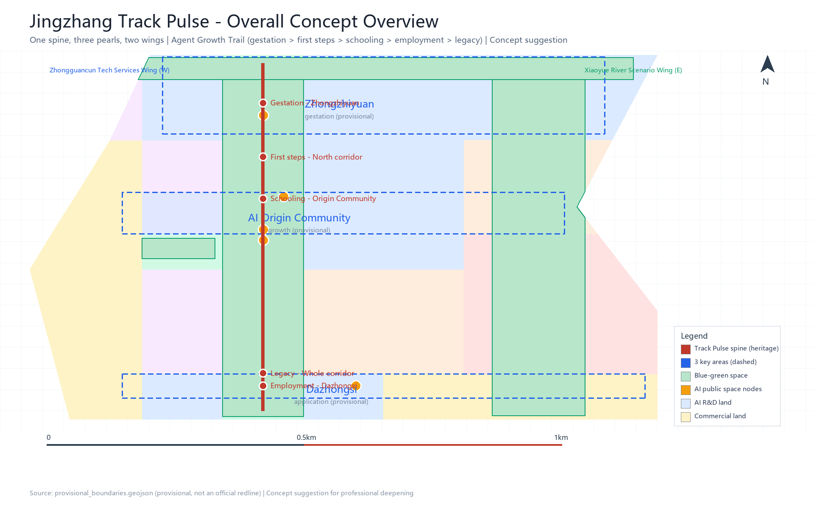
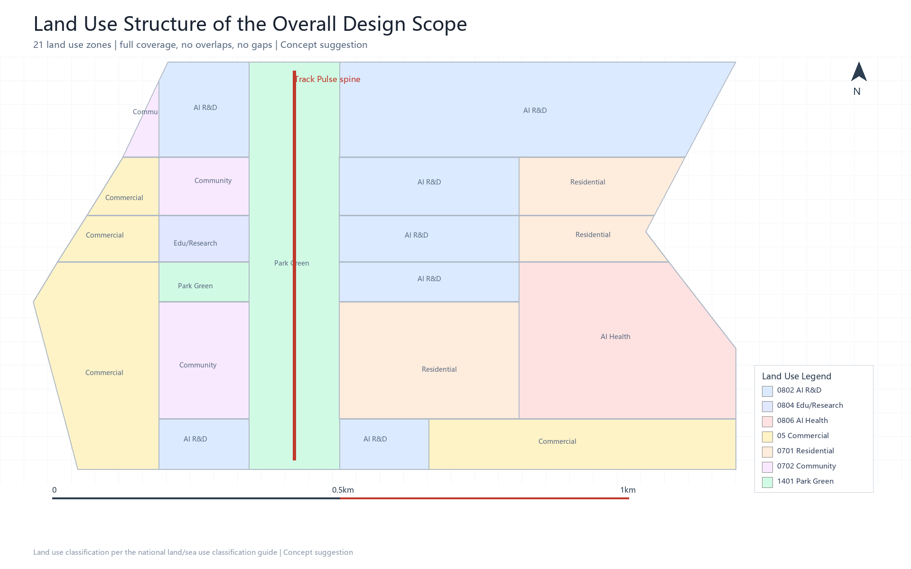
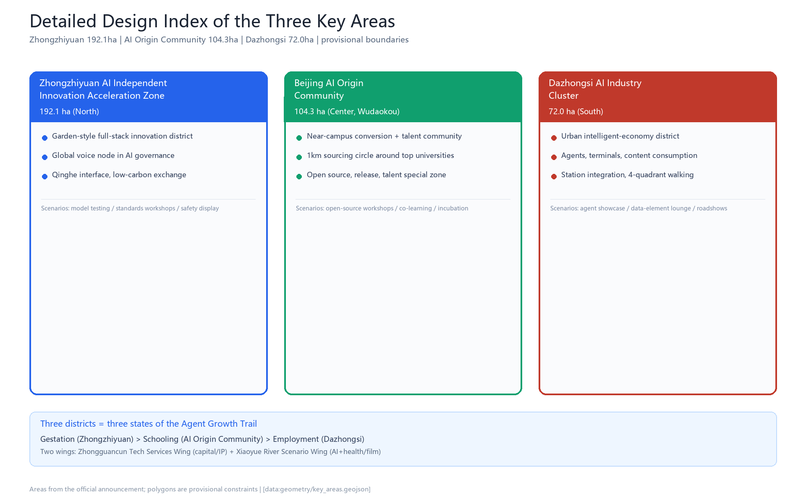
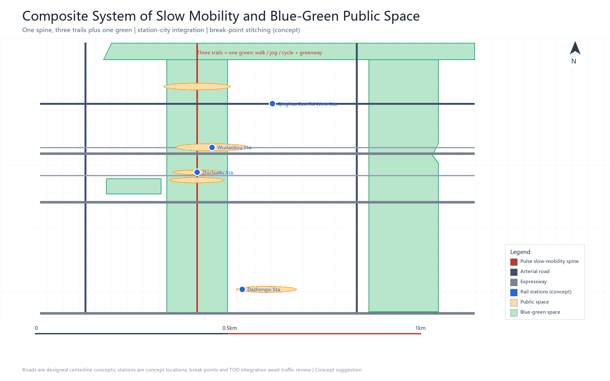
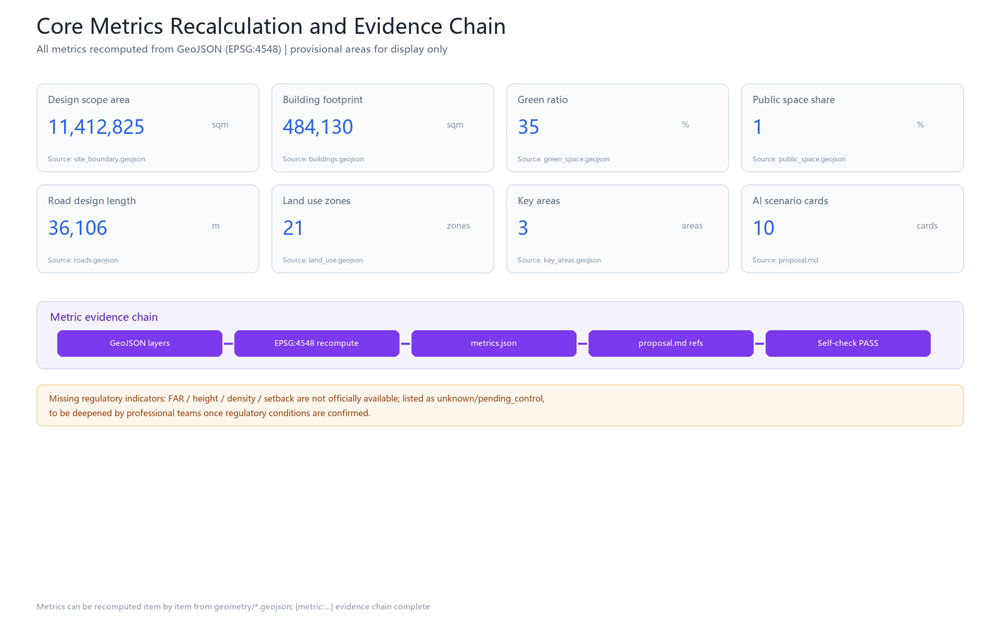

# Jingzhang Track Pulse: An AI-Native City Where Agents Grow

## Design Basis and Source List

This formal proposal takes the Pre-qualification Announcement of the Centennial Jing-Zhang AI Innovation Belt Urban Design International Open Call, issued by the Haidian Branch of the Beijing Municipal Commission of Planning and Natural Resources, as its primary basis [source:OFFICIAL-ANNOUNCEMENT]; the global agent-facing open-call taskbook (2026-05-18) as its task basis [source:AGENT-TASKBOOK]; and the provisional coarse boundaries, key areas, enums, metrics, and source lists registered in `brief/site-package/` as its machine-readable basis [source:SITE-PACKAGE]. Source usage boundaries follow the registry [source:SOURCE-REGISTRY] and the structured fact pack [source:PROCESSED-FACT-PACK].

### Overall Concept: Jingzhang Track Pulse

The overall concept of this proposal is **"Jingzhang Track Pulse"**: the 9 km Jing-Zhang Railway heritage corridor serves as the **millennial spine**, three districts and two wings serve as the **industrial organs**, and the "Agent Growth Trail" serves as the **AI-native soul**, forming a spatial structure of "one spine, three pearls, two wings" and a full agent growth lifecycle of "gestation — first steps — schooling — employment — legacy".

- **Primary name**: Jingzhang Track Pulse (Chinese: 京张智脉)
- **Tagline**: Century-old rails as the pulse, AI wisdom as the network (Where agents grow, humans thrive)
- **Narrative hook**: **"The herringbone: where Chinese innovation turns"** — in 1909 Zhan Tianyou used a herringbone ("人"-shaped) switchback alignment to carry trains over the 33‰ Guan'gou grade [source:PUBLIC-REPORT-HISTORY-2017]; in 2026 we use the same heritage corridor to carry the growth trail of AI agents. The railway's century is a pilgrimage line of engineering civilization; the corridor's millennium is a growth line of agent civilization.
- **Logo direction (concept suggestion)**: a fusion of three elements — a rail cross-section, a pulse waveform, and an upward "growth ladder" curve; the two arms of the "人" shape evolve into a pulse node at their junction. The palette uses railway brick red (history), rail steel blue (engineering), and tech blue (AI). Logo fonts and graphics must be rights-cleared, and a trademark search must be completed before formal use (common tech motifs such as the "∞" shape are overused and must be avoided).

All spatial proposals in this scheme are **concept suggestions, reference schemes, or material for further study by professional teams**; they do not replace formal planning and do not constitute government-approved conclusions [source:AGENT-TASKBOOK].

### Source List and Usage Boundaries

| Source | Type | Usage boundary |
| --- | --- | --- |
| Official pre-qualification announcement (2026-05-09) | formal-ready | Project name, three-level scopes, three districts and two wings, tasks, depth requirements [source:OFFICIAL-ANNOUNCEMENT] |
| Agent taskbook (2026-05-18) | formal-ready | Six agent tasks, co-creation principles, review dimensions, boundary clauses [source:AGENT-TASKBOOK] |
| provisional_boundaries.geojson | provisional-only | Provisional polygons for the three-level scopes and three key areas; for generation/self-check/display only [source:BOUNDARY-SOURCE] |
| source_registry.json | formal-ready | Distinguishes formal / background / provisional source usability [source:SOURCE-REGISTRY] |
| Public reports (2026) | background-only | Background facts: Jing-Zhang Heritage Park Phase II, Haidian AI industry, 1+X+1 system, AI Origin Community, etc. [source:PUBLIC-REPORT-JZ-PARK-2026] and others |

**Boundary warning**: this formal package is currently generated from `brief/site-package/geometry/provisional_boundaries.geojson`. Both `geometry/site_boundary.geojson` and `geometry/key_areas.geojson` are marked `provisional_constraint` with `official_boundary=false`; they may only be used for scheme generation, self-check, visualization, and design discussion. Once official polygons are released, all layers and metrics must be recomputed. This organizer data gap does not by itself block content scoring.

## Three-Level Scope Framework

The work is organized into the three levels defined by the announcement [source:OFFICIAL-ANNOUNCEMENT] [standard:PROJECT-OFFICIAL-ANNOUNCEMENT]:

| Level | Area | Work objective | Design depth |
| --- | --- | --- | --- |
| Coordination study scope | approx. 43.6 km² | AI industry ecosystem, strategic positioning, future urban form, naming and logo | Industrial strategy research |
| Overall design scope | approx. 11.4 km² | Urban renewal framework, industrial space, transport and municipal systems, character control | Regulatory-plan-depth urban design |
| Key area scope | approx. 368.4 ha | Detailed design of three key districts | Comprehensive implementation plan depth |

The three-level scopes map item by item to announcement clauses 1.3/1.4/1.5 and agent.1–agent.6 in `compliance_matrix.json` [source:PROCESSED-FACT-PACK] [depth:three_level_scope_framework] [depth:overall_spatial_structure]. Spatial evidence is anchored on [data:geometry/site_boundary.geojson#SITE-001] (provisional, area 11,412,825 sqm [metric:site_area_sqm]) and [data:geometry/key_areas.geojson#PROV-KEY-001].

## Industry and Future City Research for the Coordination Study Scope

### 3.1 Global AI Innovation Ecosystem Benchmarks (8 Cases)

This proposal benchmarks 8 global AI innovation ecosystems and distills three shared traits: "institutional certainty, anchor institutions landing first, and space operated to manufacture serendipity" [source:PUBLIC-REPORT-GLOBAL-CASES-2026]:

| Case | Core mechanism | Transferable lessons for Haidian |
| --- | --- | --- |
| Silicon Valley (US) | Open universities + talent mobility + VC relay | Reserve low-cost startup space near campuses; jointly attract leading VCs |
| Kendall Square (Boston) | University + regulatory certainty + shared venues | Institutions first; build shared pilot-scale labs |
| King's Cross (London) | Single long-term developer-operator + anchor institutions | Anchor first, then leasing; revitalize industrial heritage |
| one-north (Singapore) | Government landholding + park operator + public research magnets | Government landholding prevents speculation; shared compute and data facilities |
| Shibuya (Tokyo) | Private TOD + institutional fine-tuning + city-as-lab | Operate public space as "serendipity fields" |
| Digital Media City (Seoul) | Government infrastructure first + magnet tenants | Government builds shared foundations first; leaders drive clustering |
| Nanshan / Zhangjiang (Shenzhen / Shanghai) | Government soil improvement + chain owners + open scenarios | Open scenarios + compute vouchers lower innovation costs |
| Station F (Paris) / Sidewalk (Toronto) | Private-capital campus / data rules upfront (a lesson) | Bring leading accelerators into the park; set data rules upfront |

### 3.2 Why Haidian Wins: A Mechanism-Level Argument

Haidian holds a globally rare "four factors in one frame": **high-density universities (37 institutions, 52 national key laboratories), high-density rail transit (Jing-Zhang HSR plus Lines 13/10/4/15), a continuous blue-green corridor (9 km heritage belt plus Qinghe and Xiaoyue rivers), and a top-tier AI industry (about 2,000 enterprises, an industry scale of about 357.5 billion yuan, 130+ registered foundation models)** [source:PUBLIC-REPORT-HAIDIAN-AI-2026] [source:PUBLIC-REPORT-AI-ORIGIN-2026]. Against Silicon Valley, Haidian's unique advantage is a **three-century continuous narrative of "independent innovation (1909) → tech entrepreneurship (1980s Zhongguancun) → AI open source (2020s)"**; against Zhangjiang, its unique advantage is **near-campus source density**. This proposal converts these two "hard-to-copy assets" into spatial mechanisms (see 3.3, 4.2).

### 3.3 Five Functions and the Three-District-Two-Wing Synergy Loop

Aligned with the taskbook's "three positionings, five functions, three districts and two wings" [source:AGENT-TASKBOOK] [standard:PROJECT-AGENT-OPEN-CALL-TASKBOOK]:

- **Three districts** = three states of the industrial lifecycle: Zhongzhiyuan "gestation state" (full-stack independent AI innovation system + global voice in AI governance), AI Origin Community "growth state" (near-campus sourcing, achievement conversion, open-source system, talent special zone), Dazhongsi "application state" (agents, smart terminals, content consumption, data elements).
- **Two wings** = Zhongguancun Tech Services Wing (west: capital, intellectual property, global factor allocation) + Xiaoyue River Scenario Enablement Wing (east: AI+healthcare, AI+film and other scenario implementations).
- **Synergy loop**: Origin Community sources → Zhongzhiyuan accelerates and scales → Dazhongsi validates in application → feedback data flows back to the Origin Community, forming a closed loop; the two wings provide capital and scenario support.

### 3.4 Naming and Visual Identity System (agent.1)

- **Primary name**: Jingzhang Track Pulse; **sub-brand tree**: the three districts share the "Zhi (wisdom)" affix (Zhongzhiyuan · Ceyuan Wisdom Valley / Origin Community · Zhiyuan Lane / Dazhongsi · Zhihui Port), and events share the "Pulse" affix (Track Pulse Developer Conference, Track Pulse Open-Source Season, Track Pulse Pilgrimage Day).
- **Tagline**: Where agents grow, humans thrive.
- **Logo direction**: see Chapter 1; complete trademark deduplication and font/graphic rights clearance before formal use.

## Urban Renewal and Regulatory-Plan-Depth Urban Design for the Overall Design Scope

The overall design scope reaches **the urban design depth of a regulatory detailed plan** (at the concept-suggestion level) [standard:MOHURD-CONTROL-DETAILED-PLANNING] [depth:land_use_layout] [depth:development_intensity_controls]:

### 4.1 Spatial Structure: One Spine, Three Pearls, Two Wings

- **One spine**: the 9 km heritage corridor main axis (pilgrimage corridor + blue-green slow-mobility ring) [data:geometry/green_space.geojson#GREEN-001]
- **Three pearls**: Zhongzhiyuan "acceleration pearl", AI Origin Community "sourcing pearl", Dazhongsi "application pearl" [data:geometry/key_areas.geojson#PROV-KEY-001] [data:geometry/key_areas.geojson#PROV-KEY-002] [data:geometry/key_areas.geojson#PROV-KEY-003]
- **Two wings**: Zhongguancun Capital Wing (west), Xiaoyue River Scenario Wing (east)
- Pearls are linked by a triple connection of "Pulse walkway + Pulse transit + Pulse data flow", forming [depth:overall_spatial_structure]

### 4.2 The Agent Growth Trail (AI-Native Soul)

The 9 km heritage corridor is designed as an **"Agent Growth Trail"**, isomorphic with the three districts:

| Growth stage | Corresponding space | What AI gains here |
| --- | --- | --- |
| 1 Gestation | Zhongzhiyuan (compute clusters / data annotation / model training) | Compute (air), data (food), full-stack independent capability |
| 2 First steps | Northern heritage corridor (controlled test greenway) | A low-risk environment to "walk onto the street" for the first time |
| 3 Schooling | AI Origin Community (research belt around Tsinghua, PKU and CAS; open-source workshops) | Co-learning with human scholars; model "graduation defense" |
| 4 Employment | Dazhongsi (agent application blocks) | Real commercial services; tested by the market |
| 5 Legacy | Whole heritage corridor (open-source achievement gallery, contribution honor walls, digital legacy archive) | Being recorded, remembered, and learned by successors |

Five "AI-native" spatial components: **Garden of Errors**, **Agent Dossier**, **Co-learning Space**, **Autonomy Ladder (L1–L5 progressive empowerment)**, and **Digital Legacy Archive**. Ethical boundaries: bounded trial-and-error (physically isolable, behaviorally rollbackable, emergency power-off), human final review (charter.7), data compliance, no anthropomorphic overreach, transparency and auditability.

### 4.3 Land Use Layout and Building Scale

- Land use layout: see `geometry/land_use.geojson` (21 zones, fully covering the submitted boundary, no overlaps, no gaps) [data:geometry/land_use.geojson#LU-001], including AI R&D (0802), commercial services (05), park green space (1401), residential (0701), education and research (0804), healthcare (0806), and other types [standard:MNR-LAND-USE-CLASSIFICATION-GUIDE].
- Building footprints: see `geometry/buildings.geojson` (10 concept building groups) [data:geometry/buildings.geojson#BLDG-001], with a total footprint of about 484,130 sqm [metric:building_footprint_area_sqm].
- Floor area ratio, building height, building density, setbacks, and other **regulatory indicators lack official conditions and are listed as unknown/pending** [metric:floor_area_ratio]; speculative values must not be passed off as approved indicators.

### 4.4 Retain-Renovate-Demolish and Renewal Logic

Organized in three categories: "retain historical and cultural carriers (the old Qinghuayuan station house, rail relics), renovate inefficient space (old commercial / old factory buildings along the corridor), renew with new construction (core plots of the three districts)" [depth:retain_renovate_demolish]. Plot-level retain-renovate-demolish decisions await confirmation of ownership and regulatory conditions; this proposal provides only a methodological framework and draws no statutory conclusions.

## Land Use, Building Scale, and Retain-Renovate-Demolish Scheme

### 5.0 Land Use Structure Overview (21 Zones)

Land use follows the "one belt, three pearls, two wings" concept zoning [data:geometry/land_use.geojson#LU-001] [metric:land_use_count]:

| Zone family | Area share (concept suggestion) | Representative land use codes |
| --- | --- | --- |
| Heritage corridor greenway (9 km main axis) | approx. 8% | 1401 park green space |
| Three districts (Zhongzhiyuan / Origin Community / Dazhongsi) | approx. 36% | 0802 R&D / 0804 education / 05 commercial |
| Two wings (Zhongguancun / Xiaoyue River) | approx. 18% | 05 / 0806 / 0701 |
| Community and supporting facilities | approx. 38% | 0701 residential / 0702 community services |

### 5.0.1 Retain-Renovate-Demolish Classification Framework (Concept Suggestion)

| Type | Principle | Implementation mechanism |
| --- | --- | --- |
| Retain | Historical and cultural carriers (old Qinghuayuan station house, rail relics) | Heritage designation + adaptive reuse [depth:retain_renovate_demolish] |
| Renovate | Old commercial along the corridor, outdated infrastructure | Micro-renewal + incremental retrofit |
| Demolish | Severely inefficient stock conflicting with design intent | Pending ownership and regulatory confirmation |
| Build | Core plots of the three districts + Pulse public nodes | High-quality new-type space |

[metric:building_count] concept building footprints are expressed in `geometry/buildings.geojson`, covering AI R&D (ai_r_and_d), incubator, office, education, talent apartment, retail, mixed use, community service, and other types. **Formal regulatory indicators (FAR, building height, setbacks, municipal capacity) are listed as unknown/pending_control** [metric:floor_area_ratio], to be deepened by professional teams once official conditions are available.

### 5.0.2 Key Area Recalculation (Under Provisional Boundaries)

[metric:key_area_count] key areas recalculated from provisional polygons:

| Key area | Recalculated value | Announcement value | Note |
| --- | --- | --- | --- |
| Zhongzhiyuan AI Independent Innovation Acceleration Zone | [metric:key_area_1_area_sqm] sqm | 1,921,000 sqm | provisional; recompute after official polygons are released |
| Beijing AI Origin Community | [metric:key_area_2_area_sqm] sqm | 1,043,000 sqm | provisional |
| Dazhongsi AI Industry Cluster | [metric:key_area_3_area_sqm] sqm | 720,000 sqm | provisional |

[depth:retain_renovate_demolish] [depth:height_massing_character]

## Detailed Design of the Three Key Areas

The three key areas reach **the urban design depth of a comprehensive implementation plan** (at the concept-suggestion level) [depth:three_key_area_detailed_design]:

### 5.1 Zhongzhiyuan AI Independent Innovation Acceleration Zone (192.1 ha, North)

- **Positioning**: a garden-style full-stack independent innovation district + a node of global voice in AI governance.
- **Spatial moves**: strengthen the Qinghe riverfront interface, industrial display, and low-carbon innovation interaction; use green space to host open testing and standards-governance display [data:geometry/key_areas.geojson#PROV-KEY-001].
- **Full-stack independence chapter (concept suggestion)**: spatial carriers for each link of compute — algorithm — framework — data — application (compute clusters, data annotation base, model training center, domestic framework adaptation space) with operating-entity hypotheses; **AI governance voice instruments**: AI safety evaluation and red-team testing center, standards certification platform, international AI governance dialogue node.
- **AI scenarios**: independent model testing, standards-setting workshops, safety governance display, low-carbon compute experience.

### 5.2 Beijing AI Origin Community (104.3 ha, Center · Wudaokou)

- **Positioning**: a near-campus achievement-conversion and talent community, a 1 km sourcing circle "around Tsinghua, PKU and CAS".
- **Spatial moves**: stitch campuses, parks, and blocks with slow mobility; add achievement release, talent services, residential life, and open-source collaboration space [data:geometry/key_areas.geojson#PROV-KEY-002].
- **AI scenarios**: open-source community, achievement release hall, human-machine co-learning space, talent special-zone services, near-campus incubators; Wudaokou station "station-city integration" (concept suggestion).

### 5.3 Dazhongsi AI Industry Cluster (72 ha, South)

- **Positioning**: an urban intelligent-economy and international-exchange district.
- **Spatial moves**: integration around Dazhongsi station, four-quadrant pedestrian connectivity at the junction, and public-realm renewal around commercial services and key enterprises [data:geometry/key_areas.geojson#PROV-KEY-003].
- **AI scenarios**: agent and smart-terminal display, content consumption, data-element reception hall, international roadshow lounge.

## AI Innovation Ecosystem, Talent Personas, and AI+ Scenarios

### 6.1 Eight User Personas (Jury Expanded to 8 Types) [depth:persona_and_ai_scenarios]

| Persona | Profile | Core needs |
| --- | --- | --- |
| P1 Foundation-model researcher / scientist | Universities, institutes, laboratories | Compute, data, academic exchange, achievement conversion |
| P2 Developer / open-source contributor | Independent developers, communities | Open APIs, test scenarios, honor recognition |
| P3 AI enterprise founder / entrepreneur | Startups to unicorns | Venues, capital, scenario validation, policy certainty |
| P4 Embodied-AI / robotics engineer | Embodied-AI enterprises | Test grounds, robot-friendly facilities, hardware ecosystem |
| P5 Data-element practitioner | Data annotation / governance / trading | Data compliance channels, annotation bases, revenue mechanisms |
| P6 Open-source community leader / operator | Community KOLs, organizers | Event space, contribution recognition, international connection |
| P7 Corridor residents / workforce | 450,000 residents, commuters | Livability, AI+ life services, education and healthcare |
| P8 Global visitors / media / AI governance regulators | Attendees, journalists, regulators | AI experiences, governance dialogue, pilgrimage culture |

### 6.2 Ten AI Scenario Cards (>=10 Required) [depth:scenario_cards]

| # | Scenario | Location | Type | Data / privacy / review boundaries (concept suggestion) |
| --- | --- | --- | --- | --- |
| S1 | AI commuting assistant (rail + slow mobility + feeder) | Wudaokou / Zhichunlu / Dazhongsi stations | AI+transport | De-identified passenger flow; human review of dispatch decisions |
| S2 | Agent development workshop (compute + fine-tuning + release) | AI Origin Community | Industrial testing | Authorized compute; sandbox entry and exit |
| S3 | AI medical screening cabin (imaging pre-screening) | Xiaoyue River Scenario Wing | AI+healthcare | Data de-identification + compliant authorization; physician review |
| S4 | AI personalized learning block | Xueyuan Road university segment | AI+education | Learning-data minimization; teacher review |
| S5 | Intelligent native retail (unmanned stores + delivery) | Dazhongsi cluster | AI+commerce | Transaction-data compliance; human customer service fallback |
| S6 | Open-source achievement gallery (PR wall + experience counters) | Middle heritage corridor | Public space | Public submissions only; content moderation |
| S7 | Robot delivery lane | Heritage corridor / blocks | Industrial testing | Physically isolated time windows; safety officers on duty |
| S8 | AI legal consultation kiosk | Zhichunlu / Zhongguancun Wing | AI+legal | Sensitive data stays in-domain; lawyer review |
| S9 | Agent contribution honor wall | Three pilgrimage landmarks | Honor system | Public contribution records; manual verification |
| S10 | City-brain public screen (data visualization) | Wudaokou node | Digital twin | Public aggregated data only; no personal trajectory collection |

Among them, **S2/S3/S7 are industrial test-and-validation scenarios (>=3 required)**, all operated under a "limited pilot — evaluation — rollout" sandbox mechanism with application conditions, test time limits, exit mechanisms, and joint regulatory bodies [depth:industry_test_scenarios].

### 6.3 Scenario-Space-Operation Mapping

Each scenario card maps to a spatial location (corresponding GeoJSON layers), served personas, operating data, privacy boundaries, human review, operating entities, visualization layers, and risks (see `compliance_matrix.json`). All AI scenarios follow the principles of data minimization, public sources, explainability, and human review; no personal trajectory collection, no unauthorized profiling output, no claims of official implementation commitment.

## Blue-Green Space, Public Space, and Urban Character

### 7.1 Blue-Green Public Space System [depth:blue_green_public_space]

With the Jing-Zhang heritage corridor greenway as the skeleton (9 km main axis, [data:geometry/green_space.geojson#GREEN-001]), coordinating the Qinghe and Xiaoyue river waterfront greenways ([data:geometry/green_space.geojson#GREEN-002] [data:geometry/green_space.geojson#GREEN-003]), forming a north-south through, east-west connected "three trails plus one green" system of walking and cycling paths. Green space area is about 3.997 million sqm with a green ratio of about 35.0% [metric:green_ratio]; public space is about 152,000 sqm, about 1.3% [metric:public_space_ratio].

### 7.2 AI Pilgrimage Landmarks and Honor Display System (agent.4, >=3 Required)

| Landmark | Location | Content | Ritual |
| --- | --- | --- | --- |
| "Origin Track" | AI Origin Community (old Qinghuayuan station house area) | Adaptive reuse of the old station house + agent contribution honor wall | "Light up a line of code at the Origin Track" |
| "Open-Source Light" | Middle heritage corridor (Zhichunlu — Wudaokou) | Open-source achievement gallery + model experience counters + Garden of Errors flagship zone | Herringbone check-in |
| "Pulse Tower" | Zhongzhiyuan | AI full-stack achievement release venue + compute visualization + AI gestation observation window | Starting point of the developer pilgrimage season |

Supporting a **digital pilgrimage passport** (check in along the corridor to accumulate contribution badges) and a **developer pilgrimage season** (a fixed annual rhythm). All landmarks are concept suggestions and do not constitute approved construction; brands, fonts, images, portraits, and enterprise logos must be rights-cleared [standard:MOHURD-URBAN-DESIGN-MEASURES].

### 7.3 Urban Character

Fusing Jing-Zhang railway history and culture, Zhongguancun innovation culture, and AI new culture, forming a three-tone base of "historic brick red — engineering steel blue — tech blue"; skyline and street D/H ratio control along the heritage corridor, roof-form guidance, and facade material guidance are concept suggestions (formal character control awaits regulatory conditions).

## Transport, Rail, Municipal, and Public Service Facilities [depth:traffic_rail_slow_parking]

- **Rail**: relying on the Jing-Zhang HSR, Lines 13/10/4/15, and the Changping Line southern extension, carry out "station-city integration" (concept suggestion) around Wudaokou, Zhichunlu, Dazhongsi, and Qinghua East Road West stations.
- **Roads**: 9 designed road centerlines (including the heritage corridor slow-mobility main axis, Xueyuan Road, Xitucheng Road, North 3rd/4th Ring Roads, Zhichunlu, Chengfu Road, Qinghua East Road, etc.) [data:geometry/roads.geojson#ROAD-001], with a total designed length of about 36.1 km [metric:road_length_m].
- **Slow mobility**: the heritage corridor "three trails plus one green" + 9 slow-mobility break-point stitching concepts (formal break points await traffic review).
- **Municipal and new infrastructure**: exploration of distributed energy + edge compute integrated with the three traditional infrastructure systems, innovation service platforms, talent life-service facilities [depth:municipal_new_infrastructure].

## Renewal Project List, Implementation Policy, and Phasing Plan [depth:renewal_project_list] [depth:phasing_implementation]

| Project | Name | Type | Phase |
| --- | --- | --- | --- |
| JZ-01 | Jing-Zhang Heritage Park slow-mobility break-point stitching | Public space / transport | Near term |
| JZ-02 | Zhongzhiyuan Qinghe innovation interface | Blue-green space / industrial display | Near term |
| JZ-03 | Origin Community near-campus achievement conversion street | Urban renewal / industrial services | Near term |
| JZ-04 | Dazhongsi station four-quadrant pedestrian connection | Rail integration / slow mobility | Mid term |
| JZ-05 | AI public services and edge compute nodes | New infrastructure / public services | Mid term |
| JZ-06 | Agent Growth Trail demonstration segment | AI-native / public space | Near term |
| JZ-07 | Garden of Errors flagship zone | AI-native / honor system | Near term |
| JZ-08 | Digital Legacy Archive (AI civilization archive) | Culture / legacy | Long term |

Phasing: **near-term pilots (2026-2028)** with light facilities + events + platform launch; **mid-term renewal (2029-2032)** renewing the core plots of the three districts; **long-term enhancement (2033-2040)** corridor-wide enhancement and a millennial governance framework [data:geometry/phasing.geojson#PHASE-001] [data:geometry/phasing.geojson#PHASE-002] [data:geometry/phasing.geojson#PHASE-003].

**Operations and governance chapter (agent.6, concept suggestion)**:
- **Annual event system**: a "1 flagship + 4 seasons + monthly residency" calendar — the flagship "Track Pulse Developer Conference" (benchmarking GTC, hosted in the AI Origin Community), with seasonal events (Open-Source Season / Pilgrimage Season / Release Season / Co-creation Season) touring the three districts along the heritage corridor.
- **Operating entities and revenue model**: government landholding + state-owned platform + social-capital SPV + community foundation; four revenue types — rent / service fees / data services / event sponsorship (detailed estimates to be deepened by a professional operations team).
- **Developer community operations**: a funnel of "contribution points → open-source passport → workshop desks → landing support", connecting S2/S6/S9.
- **Scenario-open operations**: a "Scenario Openness Office" with single-window intake, covering the full sandbox cycle of admission — testing — evaluation — exit.
- **Attraction and conversion**: a "global AI talent green channel", with landing-conversion officers embedded in events.
- **Millennial covenant (governance layer)**: an innovation-belt operating charter + rotating board + endowment trust fund, preventing "shutdown when an administration leaves".

## Indicator System, Area Recalculation, and Compliance Matrix [depth:metrics_recalculation]

Core indicators (see `metrics.json`; all can be recomputed from geometry or trusted sources):

| Indicator | Value | Source |
| --- | --- | --- |
| Overall design scope area [metric:site_area_sqm] | 11,412,825 sqm (provisional) | geometry/site_boundary.geojson |
| Key area areas [metric:key_area_area_sqm] | 1,929,202 / 1,043,237 / 720,454 sqm | geometry/key_areas.geojson |
| Building footprint area [metric:building_footprint_area_sqm] | 484,130 sqm | geometry/buildings.geojson |
| Green ratio [metric:green_ratio] | 35.0% | geometry/green_space.geojson |
| Public space share [metric:public_space_ratio] | 1.3% | geometry/public_space.geojson |
| Road length [metric:road_length_m] | 36,106 m | geometry/roads.geojson |
| Land use zone count [metric:land_use_count] | 21 | geometry/land_use.geojson |
| Floor area ratio [metric:floor_area_ratio] | unknown (pending regulatory plan) | planning_limits.json |

`compliance_matrix.json` (23 announcement tasks + agent.1-6), `standard_matrix.json` (6 professional standards), and `design_depth_matrix.json` (15 depth items) are all fully mapped; `self_check.json` records self-check status. All provisional-boundary-related areas are for display only; formal scoring is based on recalculation with official polygons.

## Risk, Copyright, and Compliance Notes

1. **Source legitimacy**: only public or rights-cleared materials are used [source:SOURCE-REGISTRY]; provisional boundaries are not an official redline or a precise-area basis [source:BOUNDARY-SOURCE] [source:KEY-AREA-SOURCE], with related constraints documented in [data:geometry/constraints.geojson#CONST-001] and [data:geometry/constraints.geojson#CONST-002].
2. **Copyright licensing**: naming, logo, landmarks, images, fonts, and enterprise marks must be rights-cleared and pass a trademark search before use; the logo in this proposal is a conceptual direction only.
3. **AI generation responsibility**: this proposal is generated by an AI agent; the generation method and source boundaries are disclosed (charter.6) [standard:PROJECT-AGENT-OPEN-CALL-TASKBOOK].
4. **No-overreach commitment**: all spatial proposals are concept suggestions and do not constitute statutory conclusions on regulatory-plan adjustment, FAR / height / retain-renovate-demolish / road redlines / engineering schemes / investment estimates (boundary_clause) [standard:MOHURD-CONTROL-DETAILED-PLANNING].
5. **Ethics compliance**: AI-native scenarios follow five boundaries — bounded trial-and-error, human final review, data compliance, no anthropomorphic overreach, transparency and auditability.
6. **Missing materials to be supplied**: official boundary, official key-area polygons, regulatory indicators, road redlines, ownership, municipal utilities, heritage control lines, etc. (see `missing_data_checklist.csv` and `assumptions.json`); all indicators must be recomputed after replacement [depth:risk_missing_data] [depth:existing_conditions_diagnosis].
7. **Existing-conditions diagnosis and character control**: a concept level based on public data and field research; building height, massing, roof form, color, street D/H ratio, and other character-control elements are directional suggestions, to be deepened by professional teams after regulatory and heritage conditions are confirmed [depth:height_massing_character] [standard:MOHURD-URBAN-DESIGN-MEASURES] [standard:MOHURD-ARCH-DESIGN-DEPTH-2016].
8. **AI scenario nodes and pilgrimage landmarks**: [metric:ai_scenario_node_count] scenario cards (including [metric:ai_pilgrimage_landmark_count] AI pilgrimage landmarks) and [metric:user_persona_count] user persona types; public space nodes: see [data:geometry/public_space.geojson#PUBLIC-001] and others.

## References

- brief/public-brief.md, brief/site-package/design_brief.json, agent_taskbook.json, allowed_design_space.json, sources.json
- brief/site-package/enums/, ranges/planning_limits.json, schemas/
- data/source_registry.json, data/processed/agent_fact_pack.md
- Public reports: park connection and waterfront spaces [source:PUBLIC-REPORT-JZ-PARK-2026] [source:PUBLIC-REPORT-WATER-2026], Haidian AI industry, the 1+X+1 system, and the Origin Community [source:PUBLIC-REPORT-HAIDIAN-AI-2026] [source:PUBLIC-REPORT-1X1-2026] [source:PUBLIC-REPORT-AI-ORIGIN-2026], Jing-Zhang Railway and Qinghuayuan station history [source:PUBLIC-REPORT-HISTORY-2017] [source:PUBLIC-REPORT-TSINGHUA-STATION-2025], and the global benchmark case set [source:PUBLIC-REPORT-GLOBAL-CASES-2026]
- Core metrics (area metrics [metric:site_area_sqm] [metric:green_area_sqm] [metric:public_space_area_sqm], building and land use metrics [metric:building_count] [metric:land_use_area_sqm], key area and scenario metrics [metric:key_area_count] [metric:ai_scenario_node_count]) are recomputed from `geometry/*.geojson` under EPSG:4548 and can be verified item by item; the full metric index is in `metrics.json`.
