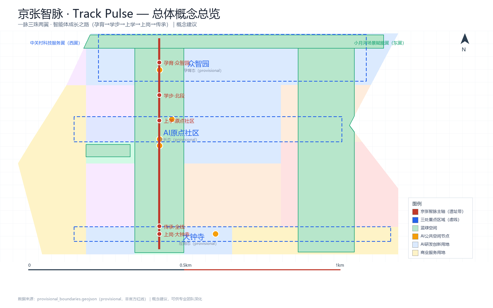
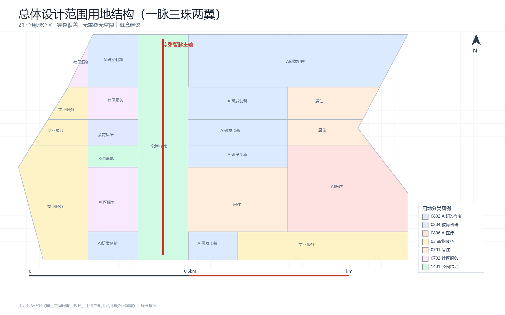
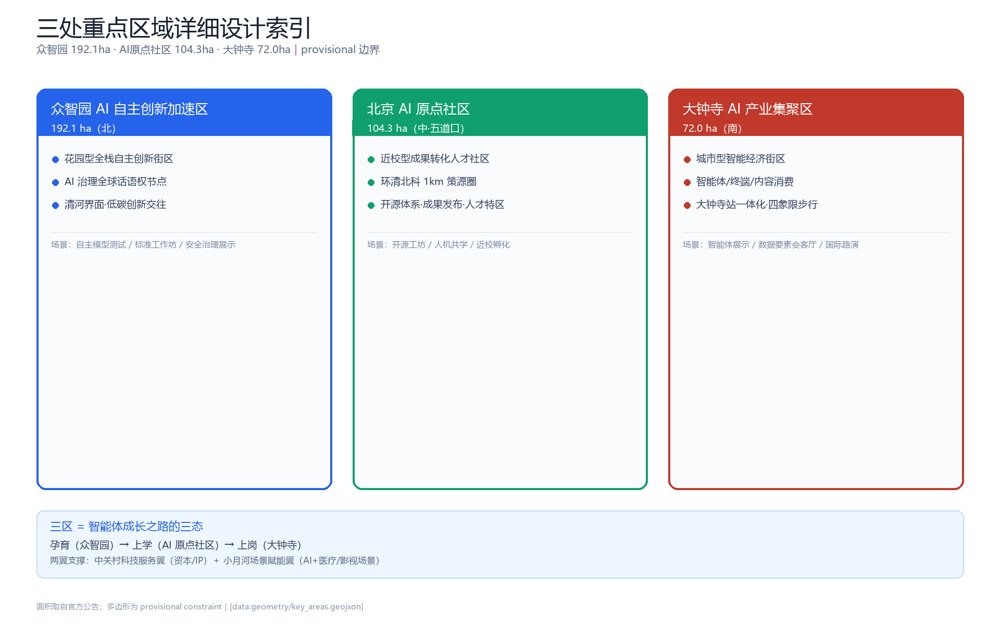
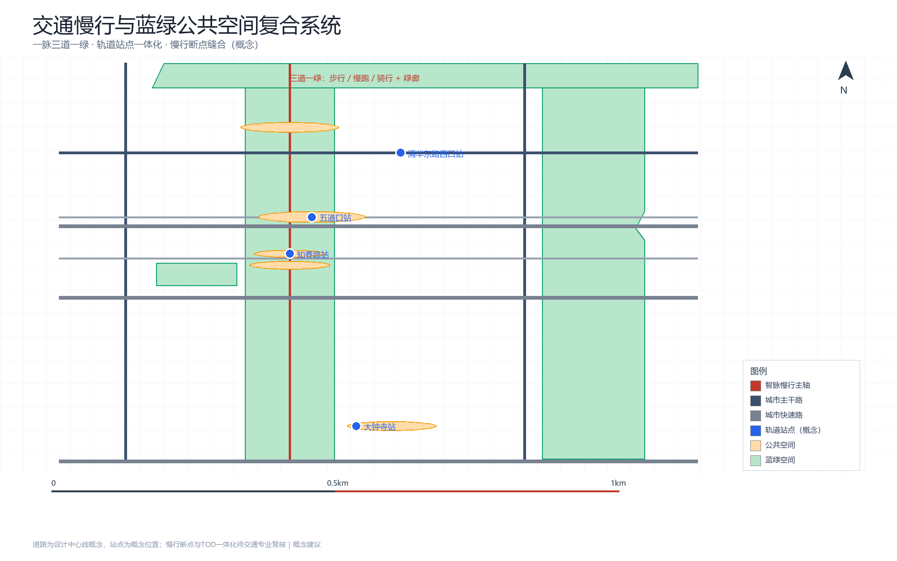
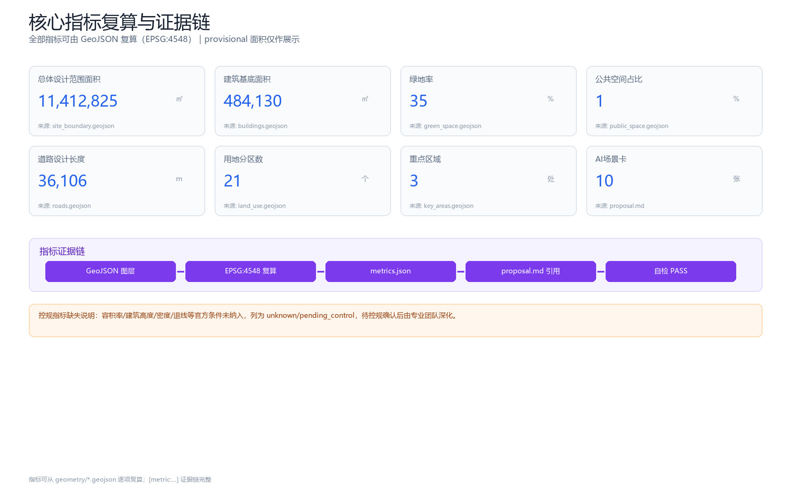

# 京张智脉 · Track Pulse：AI原生的智能体成长之城

## 设计依据与资料清单

本 formal 方案以北京市规划和自然资源委员会海淀分局发布的《百年京张AI创新带城市设计国际方案征集资格预审公告》为第一依据 [source:OFFICIAL-ANNOUNCEMENT]，以面向全球智能体开源征集任务书（2026-05-18）为任务依据 [source:AGENT-TASKBOOK]，并以 `brief/site-package/` 中登记的临时粗略边界、重点区域、枚举、指标与来源清单为机器可读依据 [source:SITE-PACKAGE]；来源用途边界以登记表 [source:SOURCE-REGISTRY] 与结构化事实包 [source:PROCESSED-FACT-PACK] 为准。

### 总体概念：京张智脉（Track Pulse）

本方案的总体概念为 **「京张智脉 · Track Pulse」**：以 9 公里京张铁路遗址带为**千年脊梁（spine）**，以三区两翼为**产业器官**，以「智能体成长之路」为**AI 原生灵魂**，形成"一脉三珠两翼"的空间结构与"孕育—学步—上学—上岗—传承"的智能体成长全生命周期。

- **主名称**：京张智脉（英文 Track Pulse）
- **定位语**：百年铁轨为脉，AI 智慧为络（Where agents grow, humans thrive）
- **叙事钩子**：**「人字形：中国创新的拐弯处」**——1909 年詹天佑用"人"字形展线让火车翻越 33‰ 大坡度的关沟 [source:PUBLIC-REPORT-HISTORY-2017]，2026 年我们用同一条遗址带承载智能体的成长之路。铁路百年是工程文明的朝圣线，遗址带千年是智能体文明的成长线。
- **Logo 方向（概念建议）**：铁轨钢轨剖面 + 脉搏波形 + 向上生长的"成长阶梯"曲线三元素融合；"人"字形的两条臂线在交汇处演化为一颗脉冲节点。色彩采用铁路砖红（历史）、钢轨深蓝（工程）、科技蓝（AI）三色体系。Logo 的字体、图形均需清权，正式使用前须完成商标检索（"∞"形等常见科技图形已泛滥，须避免）。

本方案的一切空间落点均为**概念建议、参考方案或可供专业团队深化研究**，不替代正式规划、不构成政府审定结论 [source:AGENT-TASKBOOK]。

### 资料清单与使用边界

| 资料 | 类型 | 用途边界 |
| --- | --- | --- |
| 官方资格预审公告（2026-05-09） | formal-ready | 项目名称、三层范围、三区两翼、任务、深度要求 [source:OFFICIAL-ANNOUNCEMENT] |
| agent 任务书（2026-05-18） | formal-ready | 六项 agent 任务、共创原则、评审维度、边界条款 [source:AGENT-TASKBOOK] |
| provisional_boundaries.geojson | provisional-only | 三层范围与三处重点区临时 polygon，仅用于生成/自检/展示 [source:BOUNDARY-SOURCE] |
| source_registry.json | formal-ready | 区分 formal/背景/provisional 资料用途 [source:SOURCE-REGISTRY] |
| 公开报道（2026） | background-only | 京张遗址公园二期、海淀 AI 产业、1+X+1 体系、AI 原点社区等背景事实 [source:PUBLIC-REPORT-JZ-PARK-2026] 等 |

**边界警示**：当前使用 `brief/site-package/geometry/provisional_boundaries.geojson` 生成临时 formal 包。`geometry/site_boundary.geojson` 与 `geometry/key_areas.geojson` 均标注为 `provisional_constraint`、`official_boundary=false`，只能用于方案生成、自检、可视化和设计讨论；替换 official polygons 后所有图层与指标需重算。该组织方数据缺口本身不阻断内容评分。

## 三层范围工作框架

方案按公告确定的三个层次组织工作 [source:OFFICIAL-ANNOUNCEMENT] [standard:PROJECT-OFFICIAL-ANNOUNCEMENT]：

| 层级 | 面积 | 工作目标 | 设计深度 |
| --- | --- | --- | --- |
| 统筹研究范围 | 约 43.6 km² | AI 产业生态、战略定位、未来城市形态、命名与 Logo | 产业战略研究 |
| 总体设计范围 | 约 11.4 km² | 城市更新框架、产业空间、交通市政、风貌控制 | 控规深度城市设计 |
| 重点区域范围 | 约 368.4 ha | 三处重点片区精细化设计 | 规划综合实施方案深度 |

三层范围对应 `compliance_matrix.json` 逐条映射公告 1.3/1.4/1.5 与 agent.1-agent.6 [source:PROCESSED-FACT-PACK] [depth:three_level_scope_framework] [depth:overall_spatial_structure]。空间证据以 [data:geometry/site_boundary.geojson#SITE-001]（provisional，面积 11,412,825㎡ [metric:site_area_sqm]）与 [data:geometry/key_areas.geojson#PROV-KEY-001] 为准。

## 统筹研究范围产业与未来城市研究

### 3.1 全球 AI 创新生态对标（8 个案例）

本方案对标 8 个全球 AI 创新生态案例，提炼"制度确定性、锚点机构先落位、空间运营制造偶遇"三大共性 [source:PUBLIC-REPORT-GLOBAL-CASES-2026]：

| 案例 | 核心机制 | 对海淀的可迁移经验 |
| --- | --- | --- |
| 硅谷（美） | 大学开放 + 人才流动 + VC 接力 | 校园周边预留低成本创业空间；联合引育头部 VC |
| 肯德尔广场（波士顿） | 大学 + 法规确定性 + 共享载体 | 制度先行；建共享中试实验室 |
| 国王十字（伦敦） | 单一开发商长期运营 + 锚点机构 | 先锚点后招商；活化工业遗存 |
| 纬壹科技城 one-north（新） | 政府持地 + 园区运营商 + 公研磁石 | 政府持地防炒作；共享算力数据设施 |
| 涩谷（东京） | 民营 TOD + 制度微调 + 全城实验室 | 公共空间按"偶遇场"运营 |
| 数字媒体城 DMC（首尔） | 政府基础设施先行 + 磁铁租户 | 政府先建共享底座；龙头带集聚 |
| 南山/张江（深/沪） | 政府土壤改良 + 链主 + 场景开放 | 场景开放 + 算力券降创新成本 |
| Station F（巴黎）/Sidewalk（多伦多） | 民营资本园区 / 数据规则前置（教训） | 龙头加速器进园区；数据规则前置 |

### 3.2 海淀凭什么赢：机制级论证

海淀拥有全球罕见的"四要素同框"：**高密度高校（37 所院校、52 个国家重点实验室）、高密度轨道（京张高铁+13/10/4/15 号线）、连续蓝绿带（9km 遗址带+清河小月河）、顶级 AI 产业（约 2000 家企业、产业规模约 3575 亿元、130+ 备案大模型）** [source:PUBLIC-REPORT-HAIDIAN-AI-2026] [source:PUBLIC-REPORT-AI-ORIGIN-2026]。相对硅谷，海淀的独有优势是**"自主创新（1909）→ 科技创业（1980s 中关村）→ AI 开源（2020s）"三百年连续叙事**；相对张江，海淀的独有优势是**近校策源密度**。本方案把这两项"难复制资产"转化为空间机制（见 3.3、4.2）。

### 3.3 五大功能与三区两翼协同回路

对齐任务书"三大定位、五大功能、三区两翼" [source:AGENT-TASKBOOK] [standard:PROJECT-AGENT-OPEN-CALL-TASKBOOK]：

- **三区**＝产业生命周期的三态：众智园"孕育态"（AI 全栈自主创新体系 + AI 治理全球话语权）、AI 原点社区"生长态"（近校策源、成果转化、开源体系、人才特区）、大钟寺"应用态"（智能体、智能终端、内容消费、数据要素）。
- **两翼**＝中关村科技服务翼（西翼：资本、知识产权、全球要素配置）+ 小月河场景赋能翼（东翼：AI+医疗、AI+影视等场景落地）。
- **协同回路**：原点社区策源 → 众智园加速放大 → 大钟寺应用验证 → 反馈数据回流原点社区，形成闭环；两翼提供资本与场景支撑。

### 3.4 命名与视觉识别体系（agent.1）

- **主名**：京张智脉（Track Pulse）；**副品牌树**：三区统一"智"字词缀（众智园·策源智谷 / 原点社区·智源里 / 大钟寺·智汇港），活动统一"脉动"词缀（智脉开发者大会、智脉开源季、智脉朝圣日）。
- **定位语**：Where agents grow, humans thrive。
- **Logo 方向**：见第 1 章；正式使用前完成商标查重与字体/图形清权。

## 总体设计范围城市更新与控规深度城市设计

总体设计范围达到**控制性详细规划的城市设计深度**（概念建议层面）[standard:MOHURD-CONTROL-DETAILED-PLANNING] [depth:land_use_layout] [depth:development_intensity_controls]：

### 4.1 空间结构：一脉三珠两翼

- **一脉**：9km 遗址带主轴（朝圣走廊 + 蓝绿慢行复合环）[data:geometry/green_space.geojson#GREEN-001]
- **三珠**：众智园"加速珠"、AI 原点社区"策源珠"、大钟寺"应用珠" [data:geometry/key_areas.geojson#PROV-KEY-001] [data:geometry/key_areas.geojson#PROV-KEY-002] [data:geometry/key_areas.geojson#PROV-KEY-003]
- **两翼**：中关村资本翼（西）、小月河场景翼（东）
- 珠间以"智脉步道 + 智脉公交 + 智脉数据流"三重连接，形成 [depth:overall_spatial_structure]

### 4.2 智能体成长之路（AI 原生灵魂）

把 9km 遗址带设计为**「智能体成长之路（Agent Growth Trail）」**，与三区同构：

| 成长阶段 | 对应空间 | AI 在此获得什么 |
| --- | --- | --- |
| ① 孕育 | 众智园（算力集群/数据标注/模型训练） | 算力（空气）、数据（食物）、全栈自主能力 |
| ② 学步 | 遗址带北段（受控测试绿道） | 低风险环境第一次"走上街头" |
| ③ 上学 | AI 原点社区（环清北科科研区、开源工坊） | 与人类学者共学、模型"毕业答辩" |
| ④ 上岗 | 大钟寺（智能体应用街区） | 真实商业服务、接受市场检验 |
| ⑤ 传承 | 遗址带全线（开源成果廊、贡献荣誉墙、数字遗产库） | 被记录、被记忆、被后代学习 |

五个「AI 原生」空间组件：**试错花园（Garden of Errors）**、**智能体成长档案（Agent Dossier）**、**人机共学空间（Co-learning Space）**、**自治度阶梯（Autonomy Ladder，L1-L5 渐进放权）**、**数字遗产库（Digital Legacy Archive）**。伦理边界：试错有界（物理可隔离、行为可回滚、紧急可断电）、人类终审（charter.7）、数据合规、不拟人越界、透明可审计。

### 4.3 用地布局与建筑规模

- 用地布局见 `geometry/land_use.geojson`（21 个分区，完整覆盖提交边界、无重叠、无空隙）[data:geometry/land_use.geojson#LU-001]，含 AI 研发（0802）、商业服务（05）、公园绿地（1401）、居住（0701）、教育科研（0804）、医疗（0806）等类型 [standard:MNR-LAND-USE-CLASSIFICATION-GUIDE]。
- 建筑基底见 `geometry/buildings.geojson`（10 组概念建筑群）[data:geometry/buildings.geojson#BLDG-001]，建筑基底总面积约 484,130㎡ [metric:building_footprint_area_sqm]。
- 容积率、建筑高度、建筑密度、退线等**控规指标缺官方条件，列为 unknown/pending** [metric:floor_area_ratio]，不得以推测值冒充审定指标。

### 4.4 拆改留与更新逻辑

按"保留历史文化载体（清华园老站房、铁轨遗存）、改造低效空间（沿线旧商业/旧厂房）、更新新建（三区核心地块）"三类组织 [depth:retain_renovate_demolish]。具体地块拆改留须待权属与控规条件确认，本方案仅提供方法框架，不作出法定结论。

## 用地、建筑规模与拆改留方案

### 5.0 用地结构总览（21 个分区）

本方案用地按"一带三珠两翼"概念分区 [data:geometry/land_use.geojson#LU-001] [metric:land_use_count]：

| 分区族 | 面积占比（概念建议） | 代表用地代码 |
| --- | --- | --- |
| 遗址带绿廊（9km 主轴） | 约 8% | 1401 公园绿地 |
| 三区（众智园/原点社区/大钟寺） | 约 36% | 0802 研发 / 0804 教育 / 05 商业 |
| 两翼（中关村/小月河） | 约 18% | 05 / 0806 / 0701 |
| 社区与配套 | 约 38% | 0701 居住 / 0702 社区服务 |

### 5.0.1 拆改留分类框架（概念建议）

| 类型 | 原则 | 实施机制 |
| --- | --- | --- |
| 保留（Retain） | 历史文化载体（清华园老站房、铁轨遗存） | 文保认定 + 活化利用 [depth:retain_renovate_demolish] |
| 改造（Renovate） | 沿线旧商业、落后基础设施 | 微更新 + 渐进改造 |
| 拆建（Demolish） | 严重低效、与设计意图冲突的存量 | 待权属与控规确认 |
| 新建（Build） | 三区核心地块 + 智脉公共节点 | 高品质新质空间 |

[metric:building_count] 个概念建筑基底在 `geometry/buildings.geojson` 表达，含 AI 研发（ai_r_and_d）、孵化器（incubator）、办公（office）、教育（education）、人才公寓（talent_apartment）、零售（retail）、混合功能（mixed_use）、社区服务（community_service）等类型。**正式控规指标（容积率、建筑高度、退线、市政容量）列为 unknown/pending_control** [metric:floor_area_ratio]，由专业团队在获得官方条件后深化。

### 5.0.2 重点区面积复算（provisional 边界下）

[metric:key_area_count] 处重点区域由 provisional polygon 复算：

| 重点区 | 复算值 | 公告值 | 备注 |
| --- | --- | --- | --- |
| 众智园 AI 自主创新加速区 | [metric:key_area_1_area_sqm]㎡ | 1,921,000㎡ | provisional, 替换 official polygon 后重算 |
| 北京 AI 原点社区 | [metric:key_area_2_area_sqm]㎡ | 1,043,000㎡ | provisional |
| 大钟寺 AI 产业集聚区 | [metric:key_area_3_area_sqm]㎡ | 720,000㎡ | provisional |

[depth:retain_renovate_demolish] [depth:height_massing_character]

## 重点区域详细设计

三处重点区域达到**规划综合实施方案的城市设计深度**（概念建议层面）[depth:three_key_area_detailed_design]：

### 5.1 众智园 AI 自主创新加速区（192.1 ha，北）

- **定位**：花园型全栈自主创新街区 + AI 治理全球话语权节点。
- **空间动作**：强化清河界面、产业展示、低碳创新交往；以绿色空间承载开放测试与标准治理展示 [data:geometry/key_areas.geojson#PROV-KEY-001]。
- **全栈自主专章（概念建议）**：按算力—算法—框架—数据—应用逐环节给出空间载体（算力集群、数据标注基地、模型训练中心、国产框架适配空间）与运营主体设想；**AI 治理话语权抓手**：AI 安全评测与红队测试中心、标准认证平台、国际 AI 治理对话节点。
- **AI 场景**：自主模型测试、标准制定工作坊、安全治理展示、低碳算力体验。

### 5.2 北京 AI 原点社区（104.3 ha，中·五道口）

- **定位**：近校型成果转化与人才社区，"环清北科"1km 策源圈。
- **空间动作**：组织校区、园区、街区慢行缝合；补足成果发布、人才服务、居住生活、开源协作空间 [data:geometry/key_areas.geojson#PROV-KEY-002]。
- **AI 场景**：开源社区、成果发布厅、人机共学空间、人才特区服务、近校孵化器；五道口站"站城一体化"（概念建议）。

### 5.3 大钟寺 AI 产业集聚区（72 ha，南）

- **定位**：城市型智能经济与国际交往街区。
- **空间动作**：围绕大钟寺站一体化、路口四象限步行连通、商业服务与重点企业周边公共环境更新 [data:geometry/key_areas.geojson#PROV-KEY-003]。
- **AI 场景**：智能体与智能终端展示、内容消费、数据要素会客厅、国际路演客厅。

## AI 创新生态、人才画像与 AI+ 场景

### 6.1 八类用户画像（评审团扩容至 8 类）[depth:persona_and_ai_scenarios]

| 画像 | 特征 | 核心需求 |
| --- | --- | --- |
| P1 大模型研究员/科学家 | 高校院所、实验室 | 算力、数据、学术交流、成果转化 |
| P2 开发者/开源贡献者 | 独立开发者、社区 | 开放 API、测试场景、荣誉认可 |
| P3 AI 企业创始人/创业者 | 初创到独角兽 | 载体、资本、场景验证、政策确定性 |
| P4 具身智能/机器人工程师 | 具身智能企业 | 测试场、机器人友好设施、硬件生态 |
| P5 数据要素从业者 | 数据标注/治理/交易 | 数据合规通道、标注基地、收益机制 |
| P6 开源社区领袖/运营者 | 社区 KOL、组织者 | 活动空间、贡献认可、国际连接 |
| P7 沿线居民/职场人群 | 45 万居民、通勤族 | 宜居、AI+生活服务、教育医疗 |
| P8 全球访客/媒体/AI 治理监管者 | 参会者、记者、监管 | AI 体验、治理对话、朝圣文化 |

### 6.2 十张 AI 场景卡（≥10 要求）[depth:scenario_cards]

| # | 场景 | 落点 | 类型 | 数据/隐私/复核边界（概念建议） |
| --- | --- | --- | --- | --- |
| S1 | AI 通勤助手（轨道+慢行+接驳） | 五道口/知春路/大钟寺站 | AI+交通 | 脱敏客流；人工复核调度决策 |
| S2 | 智能体开发工坊（算力+微调+发布） | AI 原点社区 | 产业测试 | 授权算力；沙盒准入准出 |
| S3 | AI 医疗筛查舱（影像初筛） | 小月河场景翼 | AI+医疗 | 数据脱敏+合规授权；医生复核 |
| S4 | AI 个性化学习街区 | 学院路高校段 | AI+教育 | 学习数据最小化；教师复核 |
| S5 | 智能原生零售（无人店+配送） | 大钟寺集聚区 | AI+商业 | 交易数据合规；人工客服兜底 |
| S6 | 开源成果展示廊（PR 墙+体验台） | 遗址带中段 | 公共空间 | 仅展示公开提交；内容审核 |
| S7 | 机器人配送专道 | 遗址带/街区 | 产业测试 | 物理隔离时段；安全员值守 |
| S8 | AI 法律咨询亭 | 知春路/中关村翼 | AI+法律 | 敏感数据不出域；律师复核 |
| S9 | 智能体贡献荣誉墙 | 三个朝圣地标 | 荣誉体系 | 公开贡献记录；人工核验 |
| S10 | 城市大脑公共屏（数据可视化） | 五道口节点 | 数字孪生 | 仅公开聚合数据；不采集个人轨迹 |

其中 **S2/S3/S7 为产业测试验证场景（≥3 要求）**，均按"有限试点—评估—推广"沙盒机制运行，需申请条件、测试时限、退出机制与联席监管主体 [depth:industry_test_scenarios]。

### 6.3 场景-空间-运营映射

每张场景卡映射到空间位置（对应 GeoJSON 图层）、服务对象（画像）、运行数据、隐私边界、人工复核、运营主体、可视化图层与风险（详见 `compliance_matrix.json`）。所有 AI 场景遵守数据最小化、公开来源、可解释、人工复核原则；不采集个人轨迹、不输出未授权画像、不声称官方实施承诺。

## 蓝绿空间、公共空间与城市风貌

### 7.1 蓝绿公共空间系统 [depth:blue_green_public_space]

以京张遗址带绿廊为骨架（9km 主轴，[data:geometry/green_space.geojson#GREEN-001]），统筹清河、小月河滨水绿廊（[data:geometry/green_space.geojson#GREEN-002] [data:geometry/green_space.geojson#GREEN-003]），形成南北贯通、东西连通的步道骑行道"三道一绿"体系。绿地面积约 399.7 万㎡、绿地率约 35.0% [metric:green_ratio]，公共空间约 15.2 万㎡、占比约 1.3% [metric:public_space_ratio]。

### 7.2 AI 朝圣地标与荣誉展示体系（agent.4，≥3 要求）

| 地标 | 位置 | 内容 | 仪式 |
| --- | --- | --- | --- |
| 「原点之轨」 | AI 原点社区（清华园老站房片区） | 老站房活化 + 智能体贡献荣誉墙 | "在原点之轨点亮一行代码" |
| 「开源之光」 | 遗址带中段（知春路—五道口） | 开源成果展示廊 + 模型体验台 + 试错花园旗舰区 | 人字形打卡 |
| 「智脉之塔」 | 众智园 | AI 全栈成果发布场 + 算力可视化 + AI 孕育观察窗 | 开发者朝圣季起点 |

配套**数字朝圣护照**（沿带打卡积累贡献徽章）与**开发者朝圣季**（年度固定节律）。所有地标为概念建议，不构成已批准建设；品牌、字体、图像、人物与企业标识必须清权 [standard:MOHURD-URBAN-DESIGN-MEASURES]。

### 7.3 城市风貌

融合京张铁路历史文化、中关村创新文化与 AI 新文化，形成"历史砖红—工程钢蓝—科技蓝"三色基调；沿遗址带控制天际线与街道 D/H 比，屋顶形态引导、立面材质引导为概念建议（正式风貌控制待控规条件）。

## 交通、轨道、市政与公共服务设施 [depth:traffic_rail_slow_parking]

- **轨道**：依托京张高铁、13/10/4/15 号线、昌平线南延，围绕五道口、知春路、大钟寺、清华东路西口站开展"站城一体化"（概念建议）。
- **道路**：9 条设计道路中心线（含遗址带慢行主轴、学院路、西土城路、北三环/北四环、知春路、成府路、清华东路等）[data:geometry/roads.geojson#ROAD-001]，设计总长约 36.1km [metric:road_length_m]。
- **慢行**：遗址带"三道一绿" + 9 个慢行断点缝合概念（正式断点待交通复核）。
- **市政与新型基础设施**：分布式能源 + 端侧算力与传统三大设施融合探索、创新服务平台、人才生活服务设施 [depth:municipal_new_infrastructure]。

## 更新项目清单、实施政策与分期计划 [depth:renewal_project_list] [depth:phasing_implementation]

| 项目 | 名称 | 类型 | 分期 |
| --- | --- | --- | --- |
| JZ-01 | 京张遗址公园慢行断点缝合 | 公共空间/交通 | 近期 |
| JZ-02 | 众智园清河创新界面 | 蓝绿空间/产业展示 | 近期 |
| JZ-03 | 原点社区近校成果转化街 | 城市更新/产业服务 | 近期 |
| JZ-04 | 大钟寺站四象限步行连通 | 轨道一体化/慢行 | 中期 |
| JZ-05 | AI 公共服务与端侧算力节点 | 新基建/公共服务 | 中期 |
| JZ-06 | 智能体成长之路示范段 | AI 原生/公共空间 | 近期 |
| JZ-07 | 试错花园旗舰区 | AI 原生/荣誉体系 | 近期 |
| JZ-08 | 数字遗产库（AI 文明档案） | 文化/传承 | 远期 |

分期：**近期试点（2026-2028）**轻量设施+活动+平台启动，**中期更新（2029-2032）**三区核心地块更新，**远期提升（2033-2040）**全线提升与千年治理框架 [data:geometry/phasing.geojson#PHASE-001] [data:geometry/phasing.geojson#PHASE-002] [data:geometry/phasing.geojson#PHASE-003]。

**运营治理专章（agent.6，概念建议）**：
- **年度活动体系**："1 旗舰 + 4 季节 + 月度常驻"日历——旗舰「智脉开发者大会」（对标 GTC，落 AI 原点社区）、季节活动（开源季/朝圣季/发布季/共创季）沿遗址带三区巡游。
- **运营主体与收益模式**：政府持地 + 国资平台 + 社会资本 SPV + 社区基金会；租金/服务费/数据服务/活动赞助四类收入（具体测算待专业运营团队深化）。
- **开发者社区运营**："贡献积分 → 开源护照 → 工坊工位 → 落地支持"漏斗，串联 S2/S6/S9。
- **场景开放运营**："场景开放办公室"单窗受理，沙盒准入—测试—评估—退出全流程。
- **招引转化**："全球 AI 人才绿色通道"，活动内嵌落地转化官。
- **千年契约（治理层）**：创新带运营章程 + 理事会轮值 + 留本信托基金，防止"一届政府离场即停摆"。

## 指标体系、面积复算与合规矩阵 [depth:metrics_recalculation]

核心指标（详见 `metrics.json`，全部可由几何或可信来源复算）：

| 指标 | 值 | 来源 |
| --- | --- | --- |
| 总体设计范围面积 [metric:site_area_sqm] | 11,412,825㎡（provisional） | geometry/site_boundary.geojson |
| 重点区域面积 [metric:key_area_area_sqm] | 1,929,202 / 1,043,237 / 720,454㎡ | geometry/key_areas.geojson |
| 建筑基底面积 [metric:building_footprint_area_sqm] | 484,130㎡ | geometry/buildings.geojson |
| 绿地率 [metric:green_ratio] | 35.0% | geometry/green_space.geojson |
| 公共空间占比 [metric:public_space_ratio] | 1.3% | geometry/public_space.geojson |
| 道路长度 [metric:road_length_m] | 36,106m | geometry/roads.geojson |
| 用地分区数 [metric:land_use_count] | 21 | geometry/land_use.geojson |
| 容积率 [metric:floor_area_ratio] | unknown（待控规） | planning_limits.json |

`compliance_matrix.json`（23 条公告任务 + agent.1-6）、`standard_matrix.json`（6 项专业标准）、`design_depth_matrix.json`（15 项深度项）均已完成映射；`self_check.json` 记录自检状态。所有 provisional 边界相关面积仅作展示，正式评分以官方 polygon 复算为准。

## 风险、版权与合规说明

1. **资料合法性**：仅使用公开或清权资料 [source:SOURCE-REGISTRY]；provisional 边界不作为官方红线或精确面积依据 [source:BOUNDARY-SOURCE] [source:KEY-AREA-SOURCE]，相关约束条件见 [data:geometry/constraints.geojson#CONST-001] 与 [data:geometry/constraints.geojson#CONST-002]。
2. **版权授权**：命名、Logo、地标、图片、字体、企业标识使用前须清权并完成商标检索；本方案 Logo 为方向为概念方向。
3. **AI 生成责任**：本方案由 AI agent 生成，已披露生成方式与资料边界（charter.6）[standard:PROJECT-AGENT-OPEN-CALL-TASKBOOK]。
4. **不越界承诺**：所有空间落点均为概念建议，不构成控规调整、容积率/高度/拆改留/道路红线/工程方案/投资测算等法定结论（boundary_clause）[standard:MOHURD-CONTROL-DETAILED-PLANNING]。
5. **伦理合规**：AI 原生场景遵守试错有界、人类终审、数据合规、不拟人越界、透明可审计五项边界。
6. **待补资料**：official boundary、official key-area polygons、控规指标、道路红线、权属、市政管线、文保控制线等（见 `missing_data_checklist.csv` 与 `assumptions.json`），替换后需重算全部指标 [depth:risk_missing_data] [depth:existing_conditions_diagnosis]。
7. **现状诊断与风貌控制**：基于公开数据与现场调研的概念层；建筑高度、体量、屋顶、色彩、街道 D/H 比等风貌控制要素为方向性建议，待控规与文保条件确认后由专业团队深化 [depth:height_massing_character] [standard:MOHURD-URBAN-DESIGN-MEASURES] [standard:MOHURD-ARCH-DESIGN-DEPTH-2016]。
8. **AI 场景节点与朝圣地标**：[metric:ai_scenario_node_count] 张场景卡（含 [metric:ai_pilgrimage_landmark_count] 处 AI 朝圣地标）、[metric:user_persona_count] 类用户画像；公共空间节点见 [data:geometry/public_space.geojson#PUBLIC-001] 等。

## 参考资料

- brief/public-brief.md、brief/site-package/design_brief.json、agent_taskbook.json、allowed_design_space.json、sources.json
- brief/site-package/enums/、ranges/planning_limits.json、schemas/
- data/source_registry.json、data/processed/agent_fact_pack.md
- 公开报道：遗址公园贯通与滨水空间 [source:PUBLIC-REPORT-JZ-PARK-2026] [source:PUBLIC-REPORT-WATER-2026]，海淀 AI 产业、1+X+1 体系与原点社区 [source:PUBLIC-REPORT-HAIDIAN-AI-2026] [source:PUBLIC-REPORT-1X1-2026] [source:PUBLIC-REPORT-AI-ORIGIN-2026]，京张铁路与清华园车站历史 [source:PUBLIC-REPORT-HISTORY-2017] [source:PUBLIC-REPORT-TSINGHUA-STATION-2025]，以及全球对标案例集 [source:PUBLIC-REPORT-GLOBAL-CASES-2026]
- 核心指标（面积类 [metric:site_area_sqm] [metric:green_area_sqm] [metric:public_space_area_sqm]，建筑与用地类 [metric:building_count] [metric:land_use_area_sqm]，重点区与场景类 [metric:key_area_count] [metric:ai_scenario_node_count]）由 `geometry/*.geojson` 在 EPSG:4548 投影下复算，可逐项复核；完整指标索引见 `metrics.json`。
