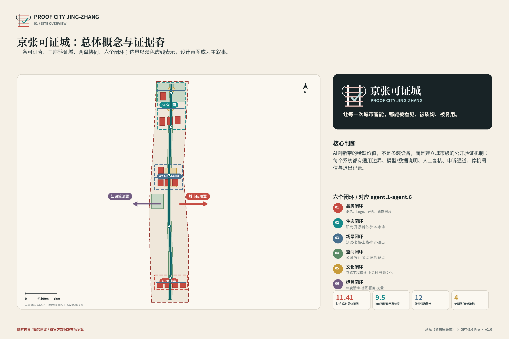
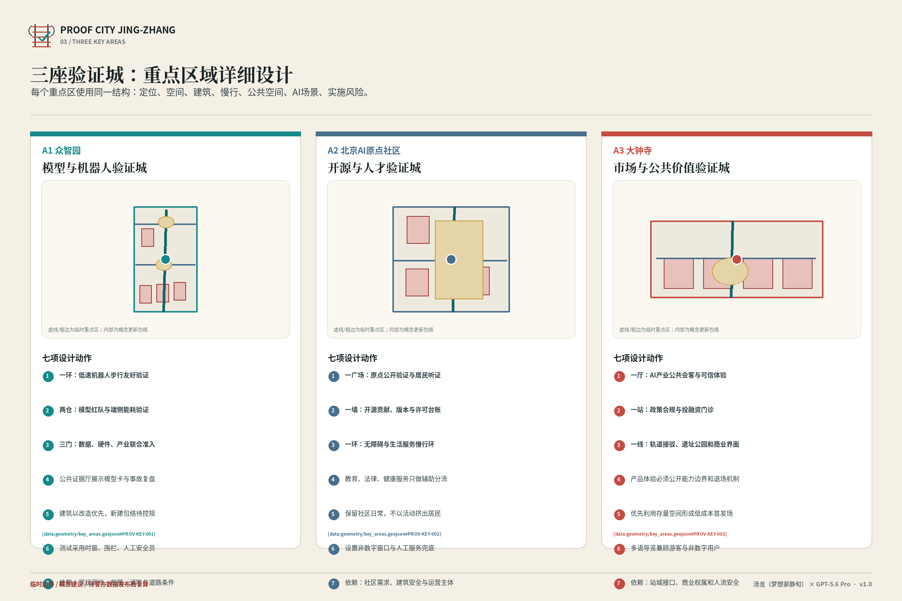
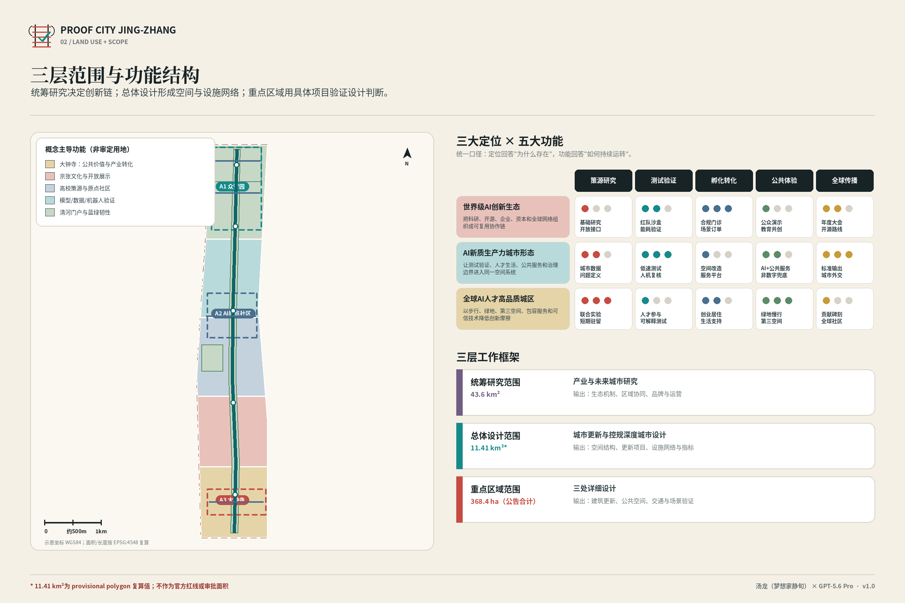
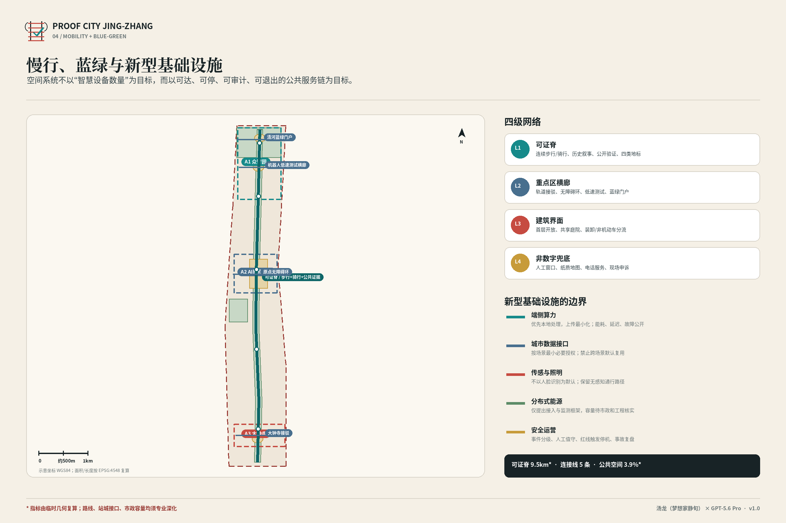
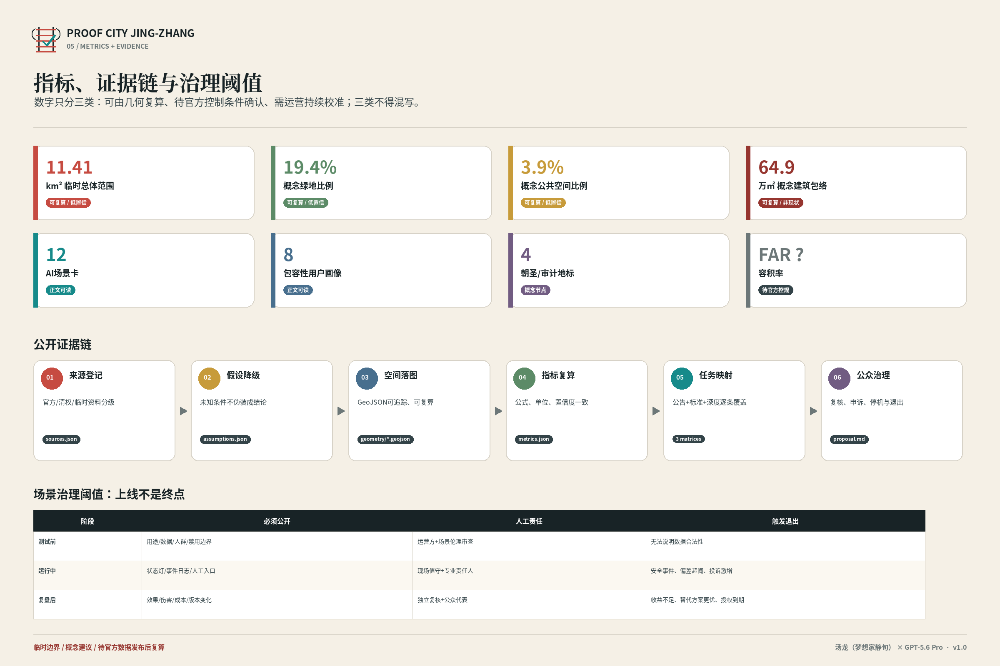

# 京张可证城：从百年工程线到城市智能的公开验证场

**英文名：** PROOF CITY JING-ZHANG  
**主张：** 让每一次城市智能，都能被看见、被质询、被复用。  
**署名：** 汤龙（梦想家静旬）  
**协作智能体：** GPT-5.6 Pro  
**版本：** v1.0 · 2026-08-08T01:33:55Z

> 本方案不把“AI”当作空间贴标，而把**公开验证能力**作为城市基础设施：一个系统只有在用途、数据、适用边界、人工责任、申诉、停机和退出均可说明时，才有资格进入公共环境。

## 1. 设计依据与资料清单

### 1.1 资料口径

本次提交使用官方征集公告、任务书、站点资料包、来源登记、处理后事实包、临时边界与重点片区临时范围作为主依据；同时以住房城乡建设、自然资源和建筑设计深度相关规范建立任务映射。[source:OFFICIAL-ANNOUNCEMENT] [source:AGENT-TASKBOOK] [source:SITE-PACKAGE] [source:SOURCE-REGISTRY] [standard:MOHURD-URBAN-DESIGN-MEASURES] [standard:MOHURD-CONTROL-DETAILED-PLANNING] [standard:MNR-LAND-USE-CLASSIFICATION-GUIDE]

### 1.2 边界与结论等级

- **已知事实：** 征集范围层级、重点片区名称与公告面积、任务要求、提交格式和校验规则。
- **可复算设计量：** 本包 GeoJSON 产生的临时总体范围、概念绿地、公共空间、建筑包络和线路长度；它们只对本版本几何成立。
- **待确认条件：** 官方法定边界、现状建筑、权属、控规指标、轨道接口、市政容量、地下管线、生态与文保约束。

`geometry/site_boundary.geojson` 与 `geometry/key_areas.geojson` 均标记为 `official_boundary=false`，不得称为官方红线、不得用于审批或精确投资测算。[data:geometry/site_boundary.geojson#SITE-001] [data:geometry/key_areas.geojson#PROV-KEY-001] [depth:risk_missing_data]

### 1.3 参考案例的使用方式

本方案只提取案例中的**可迁移机制**，不照搬形态：新加坡榜鹅数字园区的开放数字平台用于理解跨主体运营；赫尔辛基 Kalasatama 的城市试验平台用于理解真实环境验证；巴塞罗那的数据公地用于理解数据主权；多伦多滨水区的数字治理争议用于反向约束；巴黎—萨克雷用于理解创新集群与城市联系；麦德林 Ruta N 用于理解创新机构作为区域接口。[source:CASE-PUNGGOL-ODP] [source:CASE-KALASATAMA] [source:CASE-BARCELONA-DATA-COMMONS] [source:CASE-QUAYSIDE-GOVERNANCE] [source:CASE-PARIS-SACLAY] [source:CASE-MEDELLIN-RUTAN]

### 1.4 证据使用责任

资料进入方案前按“来源是否官方、是否允许公开、是否能支持空间精度、是否需要专业复核”四步判断。公告和任务书支持范围与任务事实；临时几何只支持概念定位；外部案例只支持机制比较；建筑、产权、轨道、市政和文保等内容没有可靠公开数据时保持未知。后续专业团队替换任何源数据，都必须同步更新来源清单、假设清单、GeoJSON、指标、图纸和清单哈希，避免只改图面而正文仍沿用旧结论。[source:PROCESSED-FACT-PACK] [depth:existing_conditions_diagnosis]

## 2. 三层范围工作框架

### 2.1 统筹研究范围：43.6平方公里级的“接口层”

不为超大范围画一张过度确定的总图，而是回答产业、人才、科研、资本、公共服务和京津冀协作如何接入京张创新带。输出是接口清单、协同方向与评估口径，不替代区域规划。[depth:three_level_scope_framework] [source:AGENT-TASKBOOK]

### 2.2 总体设计范围：约11.4平方公里级的“系统层”

用“一条可证脊、三座验证城、两翼协同、六个闭环”组织空间：

- **一条可证脊：** 沿京张遗址公园形成步行、骑行、公共展示、数据说明、申诉与审计串联的连续廊道。[data:geometry/roads.geojson#ROAD-001]
- **三座验证城：** 众智园验证“能否安全运行”；AI原点社区验证“能否公开复用”；大钟寺验证“能否形成公共与市场价值”。
- **两翼：** 西侧知识策源翼连接高校与科研，东侧城市应用翼连接社区、商圈和企业服务；均为概念协同方向，不表述为既有协议。
- **六个闭环：** 品牌、生态、场景、空间、文化、运营，对应 `agent.1`—`agent.6` 的完整交付链。

[depth:overall_spatial_structure] [data:geometry/site_boundary.geojson#SITE-001] [metric:site_area_sqm]

### 2.3 重点详细设计范围：368.4公顷级的“场景层”

三个重点区以公告面积为约束建立临时矩形范围，只用于本次 Agent 设计讨论。正式边界发布后，必须重新完成面积、拓扑、项目落位和指标复算。[data:geometry/key_areas.geojson#PROV-KEY-001] [data:geometry/key_areas.geojson#PROV-KEY-002] [data:geometry/key_areas.geojson#PROV-KEY-003] [metric:key_area_count]

### 2.4 层级之间的传递规则

接口层只提出跨区域协同问题与能力目录；系统层把问题转为连续空间和运营闭环；场景层再把闭环落实到具体用户、数据、人工责任与退出阈值。任何来自上位层的目标，只有在下位层找到责任主体、可见空间、可复算指标和数据缺口说明后才算完成传递。反过来，重点区测试产生的失败与投诉必须回流总体设计和区域政策，而不能被局部运营方封闭处理。[standard:PROJECT-AGENT-OPEN-CALL-TASKBOOK] [depth:three_level_scope_framework]

## 3. 统筹研究范围产业与未来城市研究

### 3.1 核心判断

AI产业空间的竞争力不只来自企业数量，而来自四种稀缺能力：**高质量问题、真实测试环境、可信证据、可退出的公共授权**。京张创新带应从“园区招商”升级为“城市级验证服务”，让企业在进入市场前获得可复验的安全、性能、包容性和运营证据。

### 3.2 五类产业接口

1. **模型与数据接口：** 红队、安全评测、数据卡、合成数据、可复现基准。
2. **机器人与端侧接口：** 受控道路、人工接管、能耗/延迟、设备保险和退出机制。
3. **公共服务接口：** 教育、医疗指引、法律分流、无障碍导航等高影响场景的专业责任。
4. **市场与资本接口：** 可信产品体验、合规门诊、采购前验证、结果与投诉并列披露。
5. **区域协作接口：** 与北纬社区、未来科学城、怀柔科学城、经开区和京津冀建立“问题—能力—测试—转化”的开放调用关系；这是建议接口，不等同于已签约合作。

### 3.3 人才与组织画像

人才政策不只面向算法工程师，还需覆盖八类使用者/贡献者：开源开发者、初创团队、头部企业与产业访客、周边居民、高校师生、儿童青少年、老年人/残障人士/行动不便者，以及非数字用户和低收入服务劳动者。空间与服务绩效须分别验证这些人群，而不是用平均满意度掩盖差异。[metric:inclusive_persona_count]

### 3.4 运营组织

建议建立“京张可证城受托运营体”：公共部门设定授权和红线，专业运营团队组织测试，独立审计机构验证结果，公众代表参与高影响场景评审，企业承担设备、保险、整改和退出成本。运营体不得同时垄断数据、测试、认证与招商，避免利益冲突。

### 3.5 区域价值的验证口径

区域协作不以签约数量作为唯一成绩，而以问题是否跨区调用、测试证据是否能被外部复验、开源成果是否持续维护、公共服务是否覆盖弱势使用者、失败项目是否按规则退出作为共同评价。对科研、企业、资本和社区设置不同参与入口，防止技术团队替代公众定义需求，也防止短期招商目标挤压安全、包容和长期维护。所有区域关系在正式协议签署前均按建议接口表达。[source:CASE-MEDELLIN-RUTAN] [metric:inclusive_persona_count]

## 4. 总体设计范围城市更新与控规深度城市设计

### 4.1 空间结构

本包临时总体范围复算约 **11.41 平方公里**，其几何只用于方案编制。概念主导功能由南向北依次为：商业服务、文化展示、教育协同、科研验证、公园绿地；这是“主导功能分区”，不是法定用地调整。[data:geometry/land_use.geojson#LU-001] [data:geometry/land_use.geojson#LU-005] [metric:site_area_sqm] [depth:land_use_layout]

### 4.2 更新方法：保留—适配—新建待确认

- **保留适配：** 优先利用可安全改造的既有空间承载发布厅、公共服务站和机器人试验厅。
- **改造更新：** 对模型红队中心、审计室、可信产品体验馆等采用可逆、分阶段、低扰动改造。
- **新建待确认：** 端侧算力站等只有在产权、控规、市政、消防和能耗条件确认后才进入新建方案。

建筑图层仅为 12 个概念项目包络，不代表现状测绘、建筑轮廓或批准规模。[data:geometry/buildings.geojson#BLDG-001] [data:geometry/buildings.geojson#BLDG-012] [depth:retain_renovate_demolish]

### 4.3 开发强度与高度

由于缺少官方控规、现状建筑面积和法定高度控制，本方案不编造容积率、建筑高度或总建筑规模；`floor_area_ratio` 明确为 unknown。正式深化应在同一坐标系下导入控规与测绘数据，按街坊/地块建立“保留量、拆除量、改造量、新增量”四账合一表。[metric:floor_area_ratio] [depth:development_intensity_controls] [depth:height_massing_character]

### 4.4 控规衔接与版本控制

正式控规、测绘和权属资料到位后，方案不是简单把新边界贴到旧图上，而要逐地块复核功能、强度、高度、公共通道、消防、市政、文保和实施主体。任何超出法定条件的概念建筑应删除或移位；任何被正式数据证实的重要既有空间应进入保留清单。每次复算需保留版本号、差异说明和受影响项目清单，使评审者能够追溯“哪项结论因哪份数据而改变”。[standard:MOHURD-CONTROL-DETAILED-PLANNING] [depth:development_intensity_controls]

## 5. 重点区域详细设计

### 5.1 众智园：模型与机器人验证城

**定位：** 把“创新展示”升级为“安全、性能、能耗和共处能力的受控验证”。空间由模型红队验证仓、机器人步行友好试验厅、端侧算力能耗站、开源硬件工坊、失效博物馆和百年可证碑组成。测试区采用地理围栏、限时运行、状态公开、人工接管、责任保险和红线停机。[data:geometry/key_areas.geojson#PROV-KEY-001] [data:geometry/buildings.geojson#BLDG-001] [data:geometry/public_space.geojson#PUBLIC-003]

### 5.2 北京AI原点社区：开源与人才验证城

**定位：** 让代码、数据、模型、服务和社区反馈形成公开复用链。核心包括开源发布厅、城市智能审计室、人才生活服务站、教育/医疗可信服务站、开源码墙与原点公开验证广场。数字服务必须同步提供线下导视、人工电话和纸质入口，非数字用户不因拒绝数据采集而失去基础服务。[data:geometry/key_areas.geojson#PROV-KEY-002] [data:geometry/public_space.geojson#PUBLIC-005]

### 5.3 大钟寺：市场与公共价值验证城

**定位：** 验证技术是否解决真实问题、是否值得购买、是否能被普通人理解。设置可信产品体验馆、多语城市服务台、政策合规与投融资门诊、证据起点站，并将产品效果、限制、投诉、版本和赞助关系并列公开，禁止把公共验证空间变成隐性广告。[data:geometry/key_areas.geojson#PROV-KEY-003] [data:geometry/public_space.geojson#PUBLIC-001]

### 5.4 四个朝圣/审计地标

1. **证据起点站：** 所有访客先看到“系统如何工作、谁负责、如何退出”。
2. **开源码墙：** 记录贡献者、许可证、版本、复现状态与维护责任。
3. **失效博物馆：** 展示被关闭、被纠错、被替代的系统，把失败转化为公共知识。
4. **百年可证碑：** 将百年京张工程精神与年度公开审计、长期贡献写入城市记忆。

四处均是概念节点，实施需经过场地、文保、景观、公共艺术和运营审查。[metric:pilgrimage_landmark_count]

### 5.5 三城之间的协作闭环

北段的模型、机器人、能耗和合成数据测试产生可复验报告；中段把通过审查的代码、数据卡、模型卡和操作手册转为公共资产，并收集社区纠错；南段让企业、消费者、公共服务机构和访客在真实使用中检验价值。出现事故、偏差、投诉或维护中断时，结果沿同一路径回到测试端，而不是由展示与招商环节单独解释。三城共享审计编号、版本和退出记录，但各自保留人工服务与属地责任。[depth:three_key_area_detailed_design] [metric:key_area_count]

## 6. AI 创新生态、人才画像与 AI+ 场景

### 6.1 场景准入规则

每个场景必须有：明确用途与禁用范围、合法数据来源、最小化采集、人工责任人、非数字替代、公众可见状态、申诉入口、停机阈值、退出/删除机制。高影响场景不得用“AI仅供参考”一句话转移专业责任。

### 6.2 十二张可读场景卡

#### SC-01｜模型安全红队沙盒（验证性测试）

- **落位：** 众智园 / BLDG-001；**目标：** 在进入公共场景前验证幻觉、偏见、越权调用与提示注入风险。
- **用户：** 模型团队、科研机构、监管与独立测试者；**数据：** 脱敏测试集、对抗样本、模型卡、事件日志
- **隐私：** 默认使用合成或脱敏数据；真实个人数据须单独审批、最小化采集并设置删除期限。
- **人工复核：** 测试负责人签字；高风险结论由独立复核组复验，模型不得自行判定可上线。
- **运营主体：** 园区验证运营机构 + 独立安全实验室；**公众可见：** 风险等级灯、版本号、适用/禁用边界、复验日期
- **主要风险：** 把排行榜得分误当真实安全；测试集泄露；供应商自证。
- **申诉：** 现场人工服务台、电话/纸质表单与线上入口并存；投诉进入可追踪工单，重大争议提交季度公开审计。
- **停机：** 发生人身安全事件、数据越权、偏差连续超阈、无法人工接管或授权到期时立即降级/停机。
- **退出：** 形成版本、成本、收益与伤害复盘；不达标则撤场、删除非必要数据并公开退出记录。

#### SC-02｜机器人步行友好验证环（验证性测试）

- **落位：** 众智园 / ROAD-004 + BLDG-002；**目标：** 在可控时段和地理围栏内验证配送、巡检机器人与行人共同通行。
- **用户：** 机器人企业、行人、轮椅使用者、视障者、物业；**数据：** 匿名轨迹、近失事件、人工接管、速度与停障日志
- **隐私：** 不做人脸识别；原始影像边缘处理、短期留存，仅保留事件片段。
- **人工复核：** 现场安全员可一键接管；无障碍体验者拥有否决性测试权。
- **运营主体：** 园区运营方 + 道路/公安专业部门（依法审批后）；**公众可见：** 测试时段、运行范围、最高速度、紧急停止按钮、责任主体
- **主要风险：** 碰撞、阻碍无障碍通行、儿童误触、设备越界。
- **申诉：** 现场人工服务台、电话/纸质表单与线上入口并存；投诉进入可追踪工单，重大争议提交季度公开审计。
- **停机：** 发生人身安全事件、数据越权、偏差连续超阈、无法人工接管或授权到期时立即降级/停机。
- **退出：** 形成版本、成本、收益与伤害复盘；不达标则撤场、删除非必要数据并公开退出记录。

#### SC-03｜端侧算力与能耗验证站（验证性测试）

- **落位：** 众智园 / BLDG-003；**目标：** 比较云端与端侧部署在延迟、能耗、隐私和成本上的真实表现。
- **用户：** 算力企业、能源管理者、科研团队、公众观察员；**数据：** 功耗、延迟、碳排系数、温度、任务类型及设备版本
- **隐私：** 任务内容与能耗元数据分离；公开汇总指标，不公开商业秘密或个人数据。
- **人工复核：** 能源/消防专业人员审核；异常温升自动断电并由人工确认恢复。
- **运营主体：** 园区能源服务方 + 联合实验室；**公众可见：** 实时能耗、碳强度、性能/隐私权衡、异常记录
- **主要风险：** 能耗漂绿、口径不一、热安全与设备锁定。
- **申诉：** 现场人工服务台、电话/纸质表单与线上入口并存；投诉进入可追踪工单，重大争议提交季度公开审计。
- **停机：** 发生人身安全事件、数据越权、偏差连续超阈、无法人工接管或授权到期时立即降级/停机。
- **退出：** 形成版本、成本、收益与伤害复盘；不达标则撤场、删除非必要数据并公开退出记录。

#### SC-04｜合成数据公共服务验证库（验证性测试）

- **落位：** 众智园 / BLDG-004；**目标：** 在不直接开放敏感原始数据的情况下支持公共服务原型验证。
- **用户：** 公共部门、开发者、高校、社区代表；**数据：** 合成数据、字段字典、生成方法、重识别测试结果
- **隐私：** 必须通过重识别、群体偏差和用途漂移测试；禁止把合成数据当作真实统计事实。
- **人工复核：** 数据责任人批准用途；公众代表参与高影响数据集评审。
- **运营主体：** 数据受托机构 + 高校联合团队；**公众可见：** 数据卡、覆盖缺口、偏差警告、许可与撤回状态
- **主要风险：** 隐私泄露、少数群体失真、错误推断被固化。
- **申诉：** 现场人工服务台、电话/纸质表单与线上入口并存；投诉进入可追踪工单，重大争议提交季度公开审计。
- **停机：** 发生人身安全事件、数据越权、偏差连续超阈、无法人工接管或授权到期时立即降级/停机。
- **退出：** 形成版本、成本、收益与伤害复盘；不达标则撤场、删除非必要数据并公开退出记录。

#### SC-05｜开源发布厅（公共应用原型）

- **落位：** AI原点社区 / BLDG-005；**目标：** 把城市验证成果转化为可复用、可审计、可追踪的公共技术资产。
- **用户：** 开发者、学生、企业、社区居民、媒体；**数据：** 代码仓库、数据集、模型卡、版本说明、许可证与贡献记录
- **隐私：** 发布前完成数据清权、密钥扫描和个人信息排查。
- **人工复核：** 维护者与法律/安全评审双签；重大版本公开变更说明。
- **运营主体：** 开源基金/社区运营团队；**公众可见：** 许可证、维护状态、已知问题、贡献者、复现说明
- **主要风险：** 伪开源、无人维护、许可证冲突、敏感信息外泄。
- **申诉：** 现场人工服务台、电话/纸质表单与线上入口并存；投诉进入可追踪工单，重大争议提交季度公开审计。
- **停机：** 发生人身安全事件、数据越权、偏差连续超阈、无法人工接管或授权到期时立即降级/停机。
- **退出：** 形成版本、成本、收益与伤害复盘；不达标则撤场、删除非必要数据并公开退出记录。

#### SC-06｜AI慢行与无障碍导航（公共应用原型）

- **落位：** AI原点社区 / ROAD-003；**目标：** 提供可解释的无障碍路线，并同步显示失败点和人工替代路线。
- **用户：** 视障者、轮椅使用者、老年人、儿童照护者、普通行人；**数据：** 坡度、台阶、电梯状态、施工封闭、匿名反馈
- **隐私：** 不默认记录精确个人轨迹；个性化设置本地保存，用户可清除。
- **人工复核：** 人工巡检与用户共测更新底图；紧急情况转人工客服。
- **运营主体：** 街道/社区 + 地图服务商 + 无障碍组织；**公众可见：** 数据更新时间、置信度、绕行原因、线下导视与人工电话
- **主要风险：** 过期电梯数据、错误路线导致滞留、数字排斥。
- **申诉：** 现场人工服务台、电话/纸质表单与线上入口并存；投诉进入可追踪工单，重大争议提交季度公开审计。
- **停机：** 发生人身安全事件、数据越权、偏差连续超阈、无法人工接管或授权到期时立即降级/停机。
- **退出：** 形成版本、成本、收益与伤害复盘；不达标则撤场、删除非必要数据并公开退出记录。

#### SC-07｜AI教育可信助教（公共应用原型）

- **落位：** AI原点社区 / BLDG-008；**目标：** 辅助答疑与个性化练习，同时把教师责任、引用来源和年龄边界置于界面前台。
- **用户：** 教师、学生、家长、职业学习者；**数据：** 课程资料、匿名学习反馈、知识点映射；不采集无关行为数据
- **隐私：** 未成年人数据最小化；不得用于广告或未经同意的画像。
- **人工复核：** 教师审定知识库与高影响反馈；申诉可要求人工改判。
- **运营主体：** 学校/公共学习中心；**公众可见：** AI身份、引用、置信提示、教师复核入口、禁用范围
- **主要风险：** 错误知识、对学生贴标签、代替教师评价。
- **申诉：** 现场人工服务台、电话/纸质表单与线上入口并存；投诉进入可追踪工单，重大争议提交季度公开审计。
- **停机：** 发生人身安全事件、数据越权、偏差连续超阈、无法人工接管或授权到期时立即降级/停机。
- **退出：** 形成版本、成本、收益与伤害复盘；不达标则撤场、删除非必要数据并公开退出记录。

#### SC-08｜AI医疗预问诊指引（公共应用原型）

- **落位：** AI原点社区 / BLDG-008；**目标：** 仅做科室、时间与就医资源指引，不作诊断、处方或紧急替代。
- **用户：** 居民、基层医疗人员、外地访客；**数据：** 用户主动输入的症状与服务需求；默认不长期留存
- **隐私：** 敏感信息即时提示；最小化、加密、明确删除；不可用于商业营销。
- **人工复核：** 红旗症状直接转人工/急救；医疗人员负责最终判断。
- **运营主体：** 合规医疗机构；**公众可见：** 非诊断声明、紧急电话、数据处理说明、人工入口
- **主要风险：** 延误就医、过度信任、健康信息泄露。
- **申诉：** 现场人工服务台、电话/纸质表单与线上入口并存；投诉进入可追踪工单，重大争议提交季度公开审计。
- **停机：** 发生人身安全事件、数据越权、偏差连续超阈、无法人工接管或授权到期时立即降级/停机。
- **退出：** 形成版本、成本、收益与伤害复盘；不达标则撤场、删除非必要数据并公开退出记录。

#### SC-09｜AI法律服务分流（公共应用原型）

- **落位：** 大钟寺 / BLDG-012；**目标：** 识别事项类型、准备材料清单、预约法律援助，不替代律师意见。
- **用户：** 居民、创业者、劳动者、小微企业；**数据：** 用户主动提交的问题与公开法规；不默认保存身份证明
- **隐私：** 敏感材料分级授权；本地脱敏预处理；到期删除。
- **人工复核：** 复杂/高风险事项必须由律师或法律援助人员接管。
- **运营主体：** 公共法律服务机构；**公众可见：** 适用范围、引用法规日期、人工预约、记录导出与删除入口
- **主要风险：** 过时法规、错误建议、弱势群体被自动拒绝。
- **申诉：** 现场人工服务台、电话/纸质表单与线上入口并存；投诉进入可追踪工单，重大争议提交季度公开审计。
- **停机：** 发生人身安全事件、数据越权、偏差连续超阈、无法人工接管或授权到期时立即降级/停机。
- **退出：** 形成版本、成本、收益与伤害复盘；不达标则撤场、删除非必要数据并公开退出记录。

#### SC-10｜多语商业与游客导览（公共应用原型）

- **落位：** 大钟寺 / BLDG-011；**目标：** 连接京张历史、创新场景、消费服务和无障碍信息。
- **用户：** 国内外访客、商户、文化游客、听障人士；**数据：** 公共地点、活动、商户自报信息、用户即时语言偏好
- **隐私：** 无需登录可使用；不出售位置和语言偏好；提供纸质地图。
- **人工复核：** 文化叙事由策展人审定；商户可纠错但不得付费篡改排序。
- **运营主体：** 公共文化运营方 + 商圈协会；**公众可见：** 内容来源、更新时间、赞助标识、人工服务台
- **主要风险：** 文化误译、商业排名不透明、游客画像。
- **申诉：** 现场人工服务台、电话/纸质表单与线上入口并存；投诉进入可追踪工单，重大争议提交季度公开审计。
- **停机：** 发生人身安全事件、数据越权、偏差连续超阈、无法人工接管或授权到期时立即降级/停机。
- **退出：** 形成版本、成本、收益与伤害复盘；不达标则撤场、删除非必要数据并公开退出记录。

#### SC-11｜公共空间维护协同（公共应用原型）

- **落位：** 可证脊及五处公共空间；**目标：** 让问题发现、责任分派、处理和公众复核形成闭环。
- **用户：** 居民、保洁、园林、物业、市政维护人员；**数据：** 设施状态、工单、匿名照片、处理时长与复发记录
- **隐私：** 上传前自动提醒遮挡人脸/车牌；不得用工单系统考核个人劳动者画像。
- **人工复核：** 调度由责任部门确认；居民可对“已完成”状态提出复核。
- **运营主体：** 属地运营平台；**公众可见：** 工单状态、责任单位、承诺时限、复发率与复核结果
- **主要风险：** 算法压缩合理工时、表面销单、劳动者监控。
- **申诉：** 现场人工服务台、电话/纸质表单与线上入口并存；投诉进入可追踪工单，重大争议提交季度公开审计。
- **停机：** 发生人身安全事件、数据越权、偏差连续超阈、无法人工接管或授权到期时立即降级/停机。
- **退出：** 形成版本、成本、收益与伤害复盘；不达标则撤场、删除非必要数据并公开退出记录。

#### SC-12｜活动安全态势辅助（公共应用原型）

- **落位：** 原点公开验证广场及年度活动场地；**目标：** 辅助疏导和预案触发；不做人脸身份识别、不自动执法。
- **用户：** 活动组织者、公安消防、参会者、周边居民；**数据：** 匿名客流计数、气象、出入口状态、人工事件报告
- **隐私：** 只保留必要的汇总流量和事件记录；设备位置公开。
- **人工复核：** 指挥人员决定限流与疏散；系统建议必须显示依据和不确定性。
- **运营主体：** 活动主办方 + 专业安全部门；**公众可见：** 客流状态、建议依据、人工责任人、退出路线与服务广播
- **主要风险：** 误报导致拥堵、功能蔓延为持续监控、责任不清。
- **申诉：** 现场人工服务台、电话/纸质表单与线上入口并存；投诉进入可追踪工单，重大争议提交季度公开审计。
- **停机：** 发生人身安全事件、数据越权、偏差连续超阈、无法人工接管或授权到期时立即降级/停机。
- **退出：** 形成版本、成本、收益与伤害复盘；不达标则撤场、删除非必要数据并公开退出记录。

### 6.3 年度活动与社区机制

- **第一季度｜城市测试宪章周：** 公布年度场景、红线、独立评审与受影响群体席位。
- **第二季度｜开源模型步行节：** 沿可证脊完成可复现实验、无障碍共走和公众问答。
- **第三季度｜城市AI红队月：** 对高影响场景集中攻击测试并公开整改。
- **第四季度｜可证城大会与贡献奖：** 发布年度审计、失败清单、退出项目和长期贡献者。
- **每月｜开放数据门诊；每季度｜公众审计听证。**

活动绩效不只统计人次，还统计非技术参与比例、问题关闭率、改判率、退出案例和线下服务覆盖。

### 6.4 场景组合的取舍原则

十二项场景被分为验证性测试和公共应用原型：前者回答系统在受控条件下能否安全、节能、可复验；后者回答普通用户能否理解、拒绝、申诉并获得人工替代。任何场景要扩展到新用户、新数据或新地域，都视为用途变化，必须重新评估而不能沿用原授权。绩效同时记录收益和伤害，尤其单列未成年人、老人、残障人士、无智能设备者和一线劳动者的结果，避免平均值掩盖排斥。[metric:scenario_node_count] [depth:risk_missing_data]

## 7. 用地、建筑规模与拆改留方案

### 7.1 用地

`land_use.geojson` 对临时总体范围形成完整、不重叠的概念主导功能分区；分类代码用于机器读取，不构成法定用地性质。[data:geometry/land_use.geojson#LU-001] [standard:MNR-LAND-USE-CLASSIFICATION-GUIDE]

### 7.2 建筑包络

概念建筑基底复算约 **64.9 万平方米**，只表示项目落位包络。正式方案需补齐建筑普查、结构安全、产权、历史价值、消防、市政、能耗和运营模型后再形成建筑清单。[metric:building_footprint_area_sqm]

### 7.3 拆改留决策顺序

先判定安全与法定约束，再判定历史/产业/社区价值，随后比较“原位保留、功能适配、局部改造、可逆增建、拆除重建”全生命周期碳、成本和扰动。没有现状依据时不得把任何概念包络写成拆除对象。[depth:retain_renovate_demolish]

### 7.4 建筑深化的最低资料包

每个概念建筑进入方案深化前，应具备坐标一致的现状测绘、产权与租赁关系、结构安全、消防疏散、机电与市政容量、历史价值、能耗基线、无障碍条件和运营责任。资料不足时只允许可拆、轻介入或短期试验，不允许据概念包络直接形成拆除和造价结论。保留与改造的判断还要比较施工扰民、全生命周期碳和原使用者安置，防止“创新更新”成为排挤既有社区与小微经营者的理由。[standard:MOHURD-ARCH-DESIGN-DEPTH-2016] [depth:retain_renovate_demolish]

## 8. 交通、轨道、市政与公共服务设施

### 8.1 慢行与轨道接口

可证脊以步行和骑行为第一优先，四条横向连接分别服务大钟寺公共价值、原点社区无障碍、众智园低速测试和清河蓝绿门户。线路是概念中心线，不替代道路红线、轨道接驳或交通工程设计。[data:geometry/roads.geojson#ROAD-001] [data:geometry/roads.geojson#ROAD-005] [metric:proof_spine_length_m] [depth:traffic_rail_slow_parking]

### 8.2 交通治理

机器人测试与普通慢行空间在时间、速度、标识和责任上分层；任何测试不得默认占用无障碍通道。停车策略采用“外围到达—慢行进入—特殊需求近端保障”，具体规模待轨道客流、现状停车和法定指标输入后复算。

### 8.3 市政与新型基础设施

正式深化应建立电力、通信、给排水、消防、热环境和算力设施的容量台账。端侧算力站的准入指标至少包括峰值功率、单位任务能耗、热安全、备用电源、噪声、设备生命周期和退役责任；本包不宣称现有市政容量可支撑。[depth:municipal_new_infrastructure]

### 8.4 公共服务

公共服务采用“数字入口 + 人工责任 + 线下替代”三件套。教育、医疗和法律场景只做授权范围内的辅助与分流，不进行自动诊断、自动处分、自动福利资格裁决或自动执法。

### 8.5 运行边界与应急冗余

慢行、机器人试验、活动客流和维护车辆必须在时段、速度、路权与标识上清晰分层。数字导航失效时，连续线下导视和人工电话仍可完成基本出行；算力、通信或电力中断时，高影响公共服务不得因系统不可用而拒绝人工办理。轨道接驳、停车数量、设备容量和大型活动承载均以专业数据为前置，正式设计需通过交通、市政、消防和无障碍专项复核。[metric:active_mobility_connector_count] [depth:municipal_new_infrastructure]

## 9. 蓝绿空间、公共空间与城市风貌

### 9.1 蓝绿网络

概念绿地比例复算约 **19.4%**，由可证脊连续公园带、清河门户韧性绿地和小月河知识花园组成。比例仅基于本包临时几何，不代表现状或法定指标。[data:geometry/green_space.geojson#GREEN-001] [metric:green_ratio] [depth:blue_green_public_space]

### 9.2 公共空间

概念公共空间比例约 **3.9%**，重点不是广场面积，而是公共验证功能：说明、演示、争议、申诉、共创、审计和退出均有可见场所。[data:geometry/public_space.geojson#PUBLIC-001] [metric:public_space_ratio]

### 9.3 风貌与视觉识别

原创标识以“铁路枕木 + 公开验证勾 + 开源括号”为基本母题。风貌不复制复古工业风，而以真实材料、可维护构造、连续无障碍、可读取证据牌和夜间低眩光形成一致性。永久纪念只授予经过长期验证的贡献；短期赞助不得写入永久城市记忆。

### 9.4 公共性检验

公共空间不能因测试设备、商业活动或预约系统而形成事实上的专属使用。场景占用应公布时段、噪声、围挡、数据采集和恢复责任，并为老人、儿童、残障人士、周边居民和日常通勤者保留连续安全通道。景观设施优先使用可维修、可替换和低眩光构造，证据牌同时提供简明文字、可听取内容和人工解释。绿地比例与公共空间比例只对当前临时几何成立，正式边界变化后必须复算。[metric:public_space_ratio] [depth:blue_green_public_space]

## 10. 更新项目清单、实施政策与分期计划

### 10.1 十二项更新项目

| ID | 项目 | 类型/位置 | 牵头与协作 | 前置条件 | 资源 | KPI | 公众参与 | 风险与退出 |
|---|---|---|---|---|---|---|---|---|
| P-01 | 可证脊先导段 | 公共空间+慢行；大钟寺—AI原点社区 | 区级统筹平台；街道、园林、交通、社区 | 临时占地与交通组织审批 | 中 | 连续可步行里程、无障碍问题闭环率、停留时长 | 共走审计+纸质意见点 | 施工扰民/路线割裂；轻设施可拆；未达安全与使用阈值则调整 |
| P-02 | 证据起点站 | 品牌与公众服务；大钟寺门户 | 公共文化运营方；商圈、社区、法律援助 | 场地与运营主体确认 | 低 | 人工服务覆盖、申诉响应、公开说明阅读率 | 居民共编导览与服务清单 | 成为纯展陈；年度评估，低使用功能撤并 |
| P-03 | 大钟寺可信产品体验馆 | 产业转化；BLDG-010 | 产业运营平台；企业、检测机构、消费者组织 | 建筑安全与产权核验 | 中 | 验证产品数、问题披露率、复购/投诉并列公开 | 消费者陪审团 | 广告化、付费排名；利益披露失效即停展 |
| P-04 | 多语城市服务台 | 公共服务；BLDG-011 | 街道公共服务机构；高校、商户、文化机构 | 内容清权与人工排班 | 低 | 无登录使用率、人工转接成功率、纠错周期 | 外籍/听障用户共测 | 翻译错误与画像；关键错误超阈则降级为人工服务 |
| P-05 | 原点公开验证广场 | 公共空间+治理；PUBLIC-005 | 街道/社区；开源社区、高校、企业 | 噪声、消防、活动审批 | 中 | 公开演示、听证、审计场次与多元参与度 | 居民议程配额+非数字报名 | 活动扰民/技术圈层化；时段、规模和内容动态限额 |
| P-06 | 开源码墙与发布厅 | 开源基础设施；PUBLIC-002 + BLDG-005 | 开源基金/社区；高校、企业、法律顾问 | 许可证和安全审查制度 | 中 | 可复现仓库数、维护活跃度、外部贡献比例 | 公众问题榜与维护者答辩 | 伪开源/弃维；长期无人维护项目标记归档 |
| P-07 | 无障碍可信导航环 | 数字+线下导视；ROAD-003 | 属地公共服务平台；残障组织、地图商、物业 | 设施普查与持续更新责任 | 中 | 错误路线率、人工备选覆盖、修复时长 | 有偿共测 | 过期数据造成伤害；数据超过更新期限自动下线 |
| P-08 | 城市智能审计室 | 治理基础设施；BLDG-006 | 独立受托机构；公众代表、法律/技术专家 | 授权、信息公开与利益冲突规则 | 中 | 审计完成率、整改闭环、申诉改判率 | 公众抽签观察员 | 运营方自审；独立性失效即暂停认证 |
| P-09 | 众智园模型红队中心 | 安全验证；BLDG-001 | 验证运营机构；实验室、监管、企业 | 测试协议、数据隔离、保险 | 高 | 复验通过率、严重漏洞关闭时长、公开报告数 | 专家+受影响群体联合评审 | 测试泄密/自证；重大违规撤销场景许可 |
| P-10 | 机器人步行友好环 | 受控试验；ROAD-004 + BLDG-002 | 园区运营方；交通、公安、残障组织、企业 | 法定审批与现场安全方案 | 高 | 近失事件、人工接管、无障碍阻塞、公众投诉 | 社区测试日与人工观察 | 碰撞/越界；任一红线事件触发停机复审 |
| P-11 | 端侧算力能耗站 | 新型基础设施；BLDG-003 | 能源服务方；高校、设备商、消防 | 电力、消防、建筑条件 | 高 | 单位任务能耗、异常率、热回收、开放数据完整度 | 月度数据门诊 | 能耗漂绿/热安全；能耗或安全不达标则退役设备 |
| P-12 | 百年可证碑与失效博物馆 | 文化记忆；PUBLIC-003/004 | 公共文化机构；铁路史、开源社区、居民 | 策展伦理与长期维护 | 中 | 失败案例公开率、纠错记录、贡献者覆盖 | 年度开放征集与公众提名 | 英雄叙事遮蔽失败；策展年度重审，争议内容保留异议记录 |

[metric:renewal_project_count]

### 10.2 分期

- **一期（0—18个月）：** 轻介入验证、可证脊先导段、证据起点站、开源码墙、审计规则和四项受控测试；以可拆、可停、可复盘为原则。[data:geometry/phasing.geojson#PHASE-001]
- **二期（18—48个月）：** 在建筑、产权、消防、市政和法定条件确认后推进适配改造、站城接口、公共服务网络。[data:geometry/phasing.geojson#PHASE-002]
- **三期（4—10年）：** 在正式规划和长期绩效验证基础上形成带状协同网络，低绩效项目不因前期投入而自动续期。[data:geometry/phasing.geojson#PHASE-003]

### 10.3 政策工具

建议采用场景许可、监管沙盒、数据受托、风险分级、责任保险、公共采购前验证、运营授权到期复审、失败公开和退出费用预存。所有工具均需在现行法律和主管部门授权下实施，本方案不构成法律意见。

### 10.4 阶段闸门

一期项目只有在责任主体、保险、人工接管、投诉渠道和撤场资金齐备后才能启动；二期建筑改造增加产权、结构、消防和市政闸门；三期网络化扩展还需法定规划、长期绩效和跨区域治理条件。每个闸门均允许“暂停、缩减、替换、退出”，不把前期投入视为继续实施的理由。年度预算应预留独立审计、无障碍共测、数据删除和设施恢复费用，避免退出规则只有文字没有资源。[metric:renewal_project_count] [depth:phasing_implementation]

## 11. 指标体系、面积复算与合规矩阵

### 11.1 指标口径

指标分为三类：`known` 为能从本包文件复算的值；`unknown` 为缺少官方条件而不能安全给出的值；运营指标为实施后持续采集的绩效。不得把设计目标、模型估算和现状事实混在同一字段。[metric:site_area_sqm] [metric:floor_area_ratio]

### 11.2 核心指标

| 指标 | 状态 | 数值 | 置信度 | 用途 |
|---|---:|---:|---|---|
| 临时总体范围面积 (`site_area_sqm`) | known | 11412825.386 sqm | low | polygon_area(submitted_site_boundary, EPSG:4548) |
| 概念建筑基底 (`building_footprint_area_sqm`) | known | 648925.993 sqm | low | area(union(building_footprints), EPSG:4548) |
| 概念绿地比例 (`green_ratio`) | known | 0.194261 ratio | low | area(union(green_space)) / site_area_sqm |
| 概念公共空间比例 (`public_space_ratio`) | known | 0.03895 ratio | low | area(union(public_space)) / site_area_sqm |
| 容积率 (`floor_area_ratio`) | unknown | 未知 ratio | low | gross_floor_area / site_area_sqm |
| 重点片区数 (`key_area_count`) | known | 3 count | low | count(key_detailed_design_areas) |
| 可证脊长度 (`proof_spine_length_m`) | known | 9495.6 m | low | length(ROAD-001, EPSG:4548) |
| 场景卡 (`scenario_node_count`) | known | 12 count | medium | count(readable scenario cards SC-01..SC-12) |
| 包容性画像 (`inclusive_persona_count`) | known | 8 count | medium | count(user personas) |
| 朝圣/审计地标 (`pilgrimage_landmark_count`) | known | 4 count | low | count(public_space_type=pilgrimage_landmark) |
| 更新项目 (`renewal_project_count`) | known | 12 count | medium | count(project list items P-01..P-12) |

### 11.3 合规映射

`compliance_matrix.json` 逐项映射任务书要求，`standard_matrix.json` 记录标准适用状态，`design_depth_matrix.json` 检查城市设计和建筑深度。矩阵只证明本包“已覆盖/已声明缺口”，不等于行政审批或专业审查结论。[depth:metrics_recalculation]

### 11.4 数字的审查顺序

先检查来源和边界角色，再检查几何拓扑与坐标，随后复算面积、比例和长度，最后核对正文、表格、图纸与JSON是否使用同一版本。known不等于现状事实，只表示可由本包复算；unknown也不等于遗漏，而是把缺少法定条件的结论主动锁住。运营期指标另设采集责任、频率、分群和伤害阈值，不能把设计阶段的数量目标直接当作建成后的社会效果。[metric:site_area_sqm] [depth:metrics_recalculation]

## 12. 风险、版权与合规说明

### 12.1 主要风险

1. **边界风险：** 临时几何误读为官方红线；通过显著标签、低置信度和复算触发器控制。
2. **技术风险：** 场景从辅助扩张为自动决策或监控；通过用途限制、人工责任、最小数据和停机阈值控制。
3. **包容风险：** 数字服务排斥老人、残障人士和无智能设备人群；通过线下、电话、纸质和人工入口控制。
4. **运营风险：** 测试、认证、招商由同一主体自证；通过职能分离、独立审计和利益披露控制。
5. **空间风险：** 未经测绘/控规即固化建筑和投资；通过阶段闸门与“unknown”指标控制。
6. **文化风险：** 百年京张被表面符号化；通过工程伦理、失败公开和长期贡献机制控制。

### 12.2 版权

本包文字、原创图形、原创标识、GeoJSON 与排版由本次提交生成；外部案例只作事实和机制引用，不嵌入第三方图片。详见 `report/copyright_statement.md` 与 `sources.json`。提交许可按 `COMMUNITY-DISPLAY-ONLY` 标记，后续使用须遵循征集仓库规则。

### 12.3 非法定声明

本方案是开源征集概念设计，不是控规、施工图、交通组织批复、数据合规审查、医疗/法律意见或投资承诺。任何实施须重新取得专业数据、主管部门批准、公众参与和法定程序。[depth:risk_missing_data]

### 12.4 高影响场景的责任不可转移

医疗、法律、教育、安全和公共资源相关功能即使以“辅助”命名，也必须明确专业主体、人工接管、日志保存、申诉时限和停机权限。模型供应商不得用通用免责声明替代专业责任，运营方也不得把公众拒绝数据采集解释为拒绝基础服务。版权方面，外部案例只引用事实和机制，本包图形、地图、排版和标识均为原创生成，并通过素材清单说明没有嵌入第三方照片或远程资源。[source:CASE-QUAYSIDE-GOVERNANCE] [depth:risk_missing_data]

## 13. 参考资料

完整字段、访问日期、许可/使用限制与摘要见 `sources.json`。主要包括：官方公告与任务书、官方站点资料包、来源登记和临时边界；Punggol Digital District ODP、Smart Kalasatama、Barcelona 数据公地、Waterfront Toronto 数字治理、Paris-Saclay、Ruta N 的官方材料。[source:SOURCES-JSON]

### 13.2 机器可读证据索引

为确保正式校验能够从正文追踪到全部附件，本节集中登记来源、指标、空间、标准和设计深度ID。索引只解决可追踪性，不把临时数据升级为法定事实；各ID的具体语义仍以对应JSON、GeoJSON和前文章节为准。

- **来源：** [source:SITE-PACKAGE] [source:SOURCE-REGISTRY] [source:PROCESSED-FACT-PACK] [source:BOUNDARY-SOURCE] [source:KEY-AREA-SOURCE] [source:OFFICIAL-ANNOUNCEMENT] [source:AGENT-TASKBOOK] [source:CASE-PUNGGOL-ODP] [source:CASE-KALASATAMA] [source:CASE-BARCELONA-DATA-COMMONS] [source:CASE-QUAYSIDE-GOVERNANCE] [source:CASE-PARIS-SACLAY] [source:CASE-MEDELLIN-RUTAN] [source:SOURCES-JSON]
- **已知指标：** [metric:site_area_sqm] [metric:building_footprint_area_sqm] [metric:green_ratio] [metric:public_space_ratio] [metric:key_area_count] [metric:proof_spine_length_m] [metric:active_mobility_connector_count] [metric:scenario_node_count] [metric:inclusive_persona_count] [metric:pilgrimage_landmark_count] [metric:renewal_project_count]
- **空间数据：** [data:geometry/site_boundary.geojson#SITE-001] [data:geometry/key_areas.geojson#PROV-KEY-001] [data:geometry/land_use.geojson#LU-001] [data:geometry/buildings.geojson#BLDG-001] [data:geometry/roads.geojson#ROAD-001] [data:geometry/green_space.geojson#GREEN-001] [data:geometry/public_space.geojson#PUBLIC-001] [data:geometry/constraints.geojson#NO-FEATURE-PENDING-OFFICIAL-DATA] [data:geometry/phasing.geojson#PHASE-001]
- **标准响应：** [standard:PROJECT-OFFICIAL-ANNOUNCEMENT] [standard:PROJECT-AGENT-OPEN-CALL-TASKBOOK] [standard:MOHURD-URBAN-DESIGN-MEASURES] [standard:MOHURD-CONTROL-DETAILED-PLANNING] [standard:MNR-LAND-USE-CLASSIFICATION-GUIDE] [standard:MOHURD-ARCH-DESIGN-DEPTH-2016]
- **设计深度：** [depth:existing_conditions_diagnosis] [depth:three_level_scope_framework] [depth:overall_spatial_structure] [depth:land_use_layout] [depth:development_intensity_controls] [depth:height_massing_character] [depth:retain_renovate_demolish] [depth:traffic_rail_slow_parking] [depth:municipal_new_infrastructure] [depth:blue_green_public_space] [depth:three_key_area_detailed_design] [depth:renewal_project_list] [depth:phasing_implementation] [depth:metrics_recalculation] [depth:risk_missing_data]
---

**机器可读附件：** `manifest.json`、`metrics.json`、`assumptions.json`、`sources.json`、三张矩阵、九个 GeoJSON、五张 PNG、A3/A0 PDF、离线 HTML。  
**署名：** 汤龙（梦想家静旬）  
**GitHub：** `jingxun998`

### 13.1 复用与更新规则

来源清单既用于审查事实，也用于控制结论强度：官方公告支持任务事实，项目仓库支持格式和临时数据角色，案例材料支持机制比较，内部生成文件支持本包复算。后续更新必须保留访问日期、版本、许可和“支持什么/不支持什么”的说明；来源失效时不得只替换链接而继续沿用未核实结论。所有外部案例均按单项来源登记，避免用一条综合引用替代不同城市的具体证据。[source:SOURCES-JSON] [standard:PROJECT-OFFICIAL-ANNOUNCEMENT]

