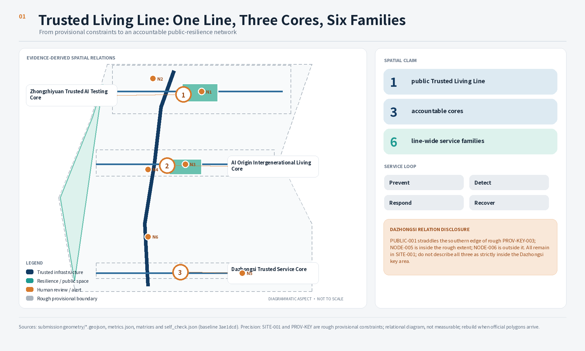
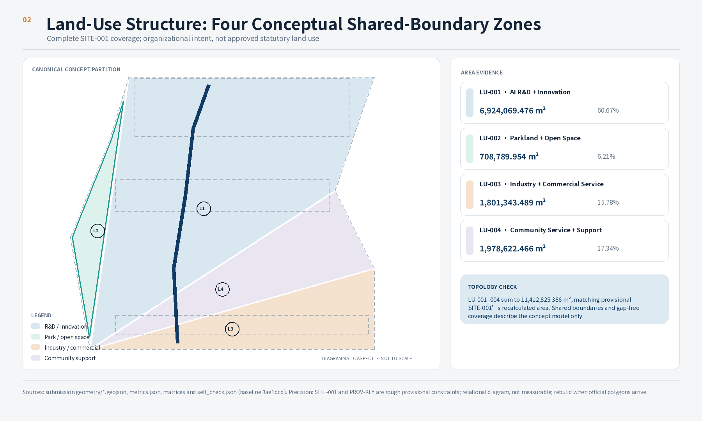
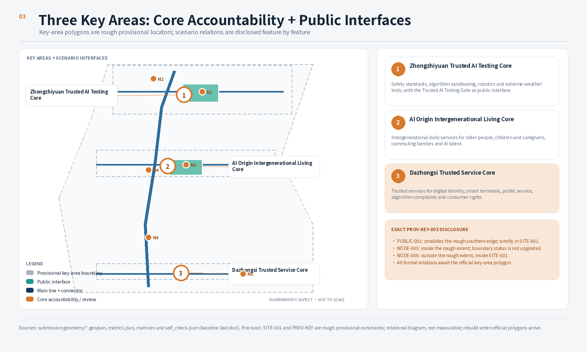
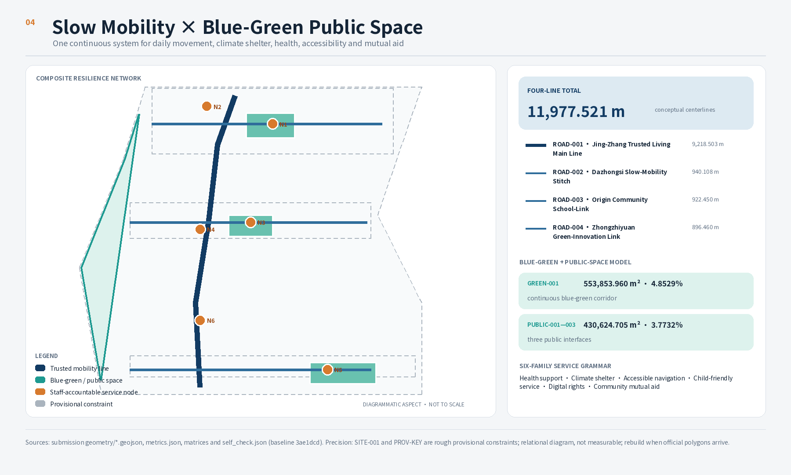
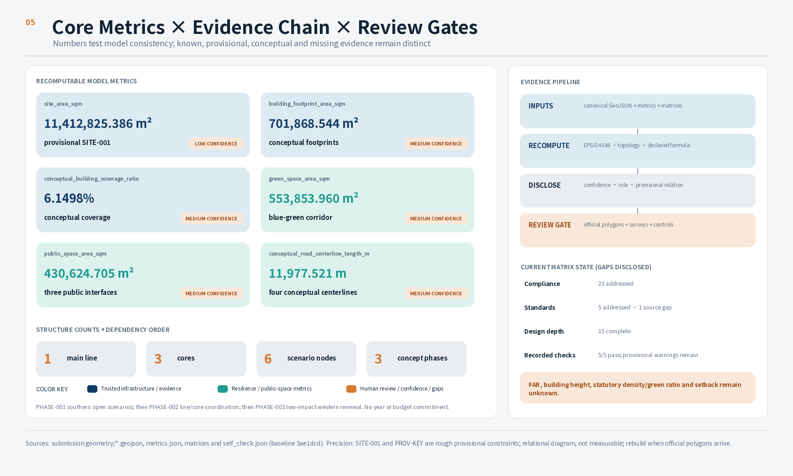

# Trusted Living Line / 京张可信生活线

**Urban intelligence people can understand, choose, verify, and leave.** “Trusted” translates the railway era’s signalling, dispatch, maintenance, and responsibility records into transparent notices, Human Review, rollback-tested services, and public audit for an AI city. The “Living Line” is not a new boundary: along the Jing-Zhang Railway Heritage Park it connects walking, shelter, health, accessibility, child care, and mutual aid as public resilience infrastructure. It serves families, older people, children and caregivers, commuting families, and AI talent before abstract technology users. Every spatial move is a Conceptual Recommendation or reference scheme for professional teams to develop. Nothing here replaces formal planning or constitutes government approval, engineering feasibility, or an investment commitment [source:DESIGN-SPEC-TRUSTED-LIVING-LINE].

## Design Basis and Source List

The proposal uses the official announcement for the project name, Three-Level Scope Framework, approximate areas, and mandatory tasks; the rights-cleared Agent taskbook for naming, scenarios, brand, and long-term operations; and the approved design specification to control users, three cores, six node families, resilience scenarios, and the Prevent–Detect–Respond–Recover service loop [source:OFFICIAL-ANNOUNCEMENT] [source:AGENT-TASKBOOK]. The five formally usable records and one provisional boundary source in the central registry retain their original purposes. This submission separately registers official primary webpages for six international cases in `sources.json`, with provenance, access date, license, prohibited use, transformation, and limitation; institutional self-description is not treated as independent performance evaluation [source:SOURCE-REGISTRY].

The local record confirms the announcement’s approximate areas, work program, names of the three key areas, and required professional depth. It does not confirm an official GIS/CAD boundary, existing buildings, ownership, approved regulatory controls, road redlines, station interfaces, municipal capacity, fire-safety conditions, river blue lines, or heritage controls. When their provisional status, precision, and limits are disclosed, `SITE-001` and the three `PROV-KEY` features may support concept generation, topology review, discussion location, and content scoring; they must not support an official redline, a precise-area or statutory-control basis, ownership, approval, or engineering conclusions. Areas, ratios, and lengths derived from them are not statutory indicators [source:BOUNDARY-SOURCE] [data:geometry/site_boundary.geojson#SITE-001]. `assumptions.json` records the gaps. When an official polygon or control condition enters the repository, the boundary, all derived layers, and all metrics must be rebuilt together rather than corrected only in prose.

The package separates a human reading layer from a machine-audit layer. This document explains design judgment, spatial moves, operations, and limits. `geometry/*.geojson`, `metrics.json`, `sources.json`, and the three matrices preserve recomputable evidence. Row-by-row semantic review confirms that the bilingual narrative, ten paired figures, offline HTML, and A3/A0 drawings now form reviewable concept-proposal evidence. The 23 task responses are therefore marked `addressed`, the 15 design-depth items `complete`, and the five mandatory standards with formal sources `addressed`. These states mean that this submission answers the concept-proposal requirements; they do not recast missing surveys, official polygons, or statutory controls as obtained evidence. The architectural design-depth reference without an official source URL remains a `data_gap` [depth:existing_conditions_diagnosis].

## Three-Level Scope Framework

Each scope level answers a different question. The approximately 43.6-square-kilometre Coordinated Research Area addresses industry and future-city cooperation across the Three Zones and Two Wings. The announcement’s approximately 11.4-square-kilometre Overall Design Area structures Urban Renewal, Public Space, transport, municipal infrastructure, and Urban Character. The approximately 368.4-hectare Key-Area Detailed Design Area develops Zhongzhiyuan, the Beijing AI Origin Community, and Dazhongsi separately. Strategic judgments form at the coordinated level, networks are tested at the overall level, and the key areas act as accountable anchors for scenarios and operations while public interfaces and line-wide service nodes may serve adjacent areas. The three current rough rectangles are not exclusive operating boundaries [source:OFFICIAL-ANNOUNCEMENT] [depth:three_level_scope_framework].

The current submission provides a provisional polygon only for the Overall Design Area and the three key areas. In EPSG:4548, `SITE-001` recalculates to 11,412,825.386 square metres, close to the announced approximate value of 11,400,000 square metres, but that proximity does not validate the boundary. The three key areas are also rough rectangles inferred from names, order, location clues, and approximate areas [metric:site_area_sqm] [data:geometry/key_areas.geojson#PROV-KEY-001]. The Coordinated Research Area is not submitted as a precise design polygon, so this proposal shows relationships at that level rather than inventing exact industry boundaries.

The spatial concept is “one line, three cores, and six node families.” `ROAD-001` is the public Trusted Living Line along the Jing-Zhang Railway Heritage Park, organizing walking, shelter, health, accessibility, and mutual aid. The three cores are the Trusted AI Testing Core at Zhongzhiyuan, AI Origin Intergenerational Living Core, and Dazhongsi Trusted Service Core. The six node families are fixed as health support, climate shelter, accessible navigation, child-friendly service, digital rights, and community mutual aid—not six interchangeable technology points [data:geometry/roads.geojson#ROAD-001] [source:DESIGN-SPEC-TRUSTED-LIVING-LINE]. The current six structured `SCENARIO_NODE` features only map those services to governable locations; when formal data arrives, all locations require recalculation and review by transport, ecology, heritage, municipal, public-health, and community-service professionals [metric:scenario_node_count].

## Coordinated Research Area: Industry and Future City Research

### Positioning, functions, and the Three Zones and Two Wings loop

“Trusted Living Line” responds to all three positioning statements: the history of trusted railway operation supports the Centennial Jing-Zhang Cultural Belt; resilience services families can understand, choose, verify, and leave support the Urban AI Living Experience Belt; and controlled tests, correction, and public audit support the AI Integrated Innovation Belt. The five functions are not enclosed parks. The Zhongzhiyuan Trusted AI Testing Core places safety standards, algorithm sandboxes, robotics, and extreme-weather testing under human accountability. The AI Origin Intergenerational Living Core lets older people, children and caregivers, commuting families, and AI talent share daily services. The Dazhongsi Trusted Service Core validates digital identity, smart terminals, public service, and consumer rights. The Zhongguancun Technology Services Wing provides compliance and professional support; the Xiaoyue River Scenario Enablement Wing carries climate, health, accessibility, and mutual-aid scenarios [source:AGENT-TASKBOOK] [standard:PROJECT-AGENT-OPEN-CALL-TASKBOOK].

Line-wide service follows a four-stage loop. **Prevent** reduces risk through environmental improvements and warnings for heat, heavy rain, falls, and traffic conflict. **Detect** combines resident reports with privacy-friendly environmental sensing and does not use face recognition by default. **Respond** provides accessible alternative routes, temporary shelter, staffed service, and mutual aid. **Recover** completes post-event review, repair, algorithm correction, version records, and public audit. Every AI scenario must name the person making the final judgment at each stage and the non-digital fallback if technology fails [source:DESIGN-SPEC-TRUSTED-LIVING-LINE].

Brand identity uses a conceptual logo grammar of one continuous line, three accountable cores, six service-node families, and one rollback verification loop. The line represents Jing-Zhang heritage and everyday resilience; the cores identify accountable places; the node families use distinct colour and tactile cues; the opening means people can question, correct, and leave. Palette directions are railway charcoal, verification teal, shelter amber, and public-space warm white. Every finished typeface, icon, historic photograph, portrait, company mark, or institutional mark requires item-by-item rights clearance. The Chinese slogan is exactly “让城市智能可以被理解、选择、验证和退出”; the English slogan is exactly `Urban intelligence people can understand, choose, verify, and leave`. Neither claims an official project renaming.

### Six global AI innovation ecosystem cases

1. **Vector Institute, Toronto.** Its official material describes an independent not-for-profit that connects research and talent through partner universities and supports trusted AI adoption through engineering support, training, and direct collaboration. Its research space is in the Schwartz Reisman Innovation Campus, with a clear distinction between public activity and restricted research areas. The transferable mechanism is an accountable operator connecting research, talent, adoption, and governance while separating public explanation from controlled R&D; its funding, partners, and campus conditions are not transferable [source:CASE-VECTOR-INSTITUTE].
2. **Mila, Montreal.** Official material describes a multi-university collaboration that became a nonprofit located in Mile-Ex, with a community of researchers, students, industry partners, and startups, and values including open science, collaboration, ethics, and transparency. The transferable mechanism is a common ethics charter and shared place connecting research, industry, and community rather than simply supplying office area; its scale, rankings, and university arrangements cannot be copied [source:CASE-MILA-QUEBEC].
3. **AI Singapore.** Official material describes a national program connecting Singapore research institutions, startups, and AI companies across research, governance, technology, industry adoption, products, and talent. `100 Experiments` brings companies, research institutes, AI engineers, and apprentices together around applied prototypes. The transferable mechanism is one accountable entry point for problem selection, controlled prototyping, talent training, governance review, and adoption retrospectives; its program duration, funding, and national institutional setting do not become Haidian commitments [source:CASE-AI-SINGAPORE].
4. **Cyber Valley, Germany.** Official material describes a Stuttgart–Tübingen-centred regional AI, robotics, and intelligent-systems community organized around an innovation campus and linking universities, research and graduate programs, industry, startup networks, and public engagement. The transferable mechanism is a corridor network using a common campus, community agenda, and public dialogue to connect distributed institutions; its alliance governance, ranking claims, and regional land conditions are not directly portable [source:CASE-CYBER-VALLEY].
5. **ETH AI Center.** ETH Zurich’s official material describes a central cross-department hub connecting AI foundations, applications, and implications, with a focus on trustworthy, inclusive, and accessible AI plus talent, entrepreneurship, industry collaboration, and public engagement. The transferable mechanism is to give every technical project an application partner, social-impact question, and interdisciplinary Human Review rather than equating “AI+” with device deployment; single-university governance and the Swiss institutional context do not establish a Haidian partnership [source:CASE-ETH-AI-CENTER].
6. **Hub71+ AI, Abu Dhabi.** Official program and release pages describe a specialist cross-program AI startup ecosystem connecting technical resources, compute, researchers, industry partners, product scaling, market access, regulatory guidance, investor networks, and real-world pilots. The transferable mechanism is one accountable access process connecting technical validation, compliance, pilot operation, and exit evaluation; its incentives, partners, markets, and regulatory conditions are neither copied nor promised here [source:CASE-HUB71-PLUS-AI].

Together, the cases support four local principles: name an accountable operator instead of installing ownerless technology points; connect talent development with validation of real problems; separate restricted R&D, public explanation, and complaint correction; and place regional networks, public participation, and long-term operations before standalone buildings. Every fact is an institution’s official self-description. `sources.json` records access dates, licenses, and limitations. This proposal uses no promotional performance number and draws no investment, finance, land-use, or engineering conclusion from the cases.

## Overall Design Area: Urban Renewal and Regulatory-Plan-Level Urban Design

The Overall Design Area reorganizes one line, three cores, and six node families as trusted urban-resilience infrastructure. Four shared-edge land-use partitions still represent AI research and innovation, green and open space, industry and commercial services, and community services and amenities, but design judgment begins with whether families receive continuous support during heat, heavy rain, falls, traffic conflict, digital-service failure, and neighbourly need—not with investment attraction. They cover the current Provisional Boundary only for functional and topology testing and are not approved zoning [data:geometry/land_use.geojson#LU-001] [depth:land_use_layout]. Research space sits near the Trusted AI Testing Core; community amenities carry health, child-friendly, and mutual-aid services; and open space supplies shelter, accessible alternatives, and daily recovery.

The six Building Footprints are service-capacity prototypes rather than generic industry points. `BLDG-001` may be developed for health and climate-risk research support; `BLDG-002` for intergenerational making and child care; `BLDG-003` for commuting-family and AI-talent daily support; `BLDG-004` for the Trusted AI Test Gate; `BLDG-005` for algorithm transparency and consumer-rights service; and `BLDG-006` for accessible connection and mutual aid. Their combined footprint is 701,868.544 square metres, producing a conceptual footprint coverage ratio of 0.061498. Both describe the submitted model, not total floor area, Building Coverage Ratio, or development rights [metric:building_footprint_area_sqm] [data:geometry/buildings.geojson#BLDG-001]. Total floor area, Floor Area Ratio, Building Height, statutory coverage, and setbacks remain pending official controls, surveys, ownership, and fire-safety conditions.

The renewal method is “identify the public problem first, then choose the minimum intervention.” It first stitches breaks in walking and open space, then improves industry premises through shared ground floors, common facilities, and reversible assembly, and only then studies objects requiring structural construction. Reliable data on building age, condition, ownership, and projects under construction is unavailable, so no specific building receives a retain, renovate, or demolish conclusion [standard:MOHURD-CONTROL-DETAILED-PLANNING] [depth:development_intensity_controls]. Professional development must overlay official boundaries, roads, rail, municipal systems, heritage, building safety, and community impact before producing RDP controls or implementable projects.

## Detailed Design of Key Areas

Each key-area proposal below is directional. Approximate announced areas help explain task scale, but each current feature is a Provisional Constraint that cannot determine parcels, construction quantity, or approval. All three use the same readable framework: positioning, spatial structure, building renewal, transport and walking, Public Space, AI scenarios, and delivery risks [depth:three_key_area_detailed_design].

### Zhongzhiyuan AI Independent Innovation Acceleration Area

**Positioning and structure.** Zhongzhiyuan is the **Trusted AI Testing Core**, publicly recognized by the **Trusted AI Test Gate**. It places safety standards, algorithm sandboxes, robotics tests, and extreme-weather scenario tests in controlled premises with boundaries, logs, and human accountability while making risk education and test rules readable at the public edge. `ROAD-004` connects to the public Trusted Living Line, `PUBLIC-003` acts as a safety-governance garden, and `NODE-001` plus `NODE-002` only mark conceptual locations for testing and climate service [data:geometry/key_areas.geojson#PROV-KEY-001] [data:geometry/public_space.geojson#PUBLIC-003].

**Buildings, mobility, and Public Space.** `BLDG-004` represents only a full-stack safety-governance prototype for professional teams to develop into shared testing units, isolation rooms, Human Review rooms, and a visitor-education edge. It asserts neither existing-building intervention nor testing permission. The walking connection prioritizes the Qing River edge, park entrances, and the main line. Road traffic and logistics await road, fire, and ownership data. Reversible facilities and visible zoning reduce conflict between specialist tests and daily recreation.

**Scenarios and risks.** Industry validation requires booking, isolation, audit logs, and sign-off by a qualified operator; every robot retains a human emergency stop. Heat and heavy-rain stress tests do not confer real emergency authority. River blue lines, flood protection, ecology, energy, and Fifth Ring Road conditions are missing, so the concept reaches no conclusion on bridges, tunnels, compute scale, energy load, or a national-platform project.

### Beijing AI Origin Community

**Positioning and structure.** Beijing AI Origin Community is the **AI Origin Intergenerational Living Core**, publicly recognized by the **Intergenerational Living Room**. Short paths and shared times connect daytime support for older people, activities for children and caregivers, commuting-family services, AI-talent daily support, and community learning; technology transfer does not replace family resilience. `ROAD-003` represents the near-campus living connector, `PUBLIC-002` is the Intergenerational Living Room prototype, and `NODE-003` plus `NODE-004` carry child-friendly and community mutual-aid services [data:geometry/key_areas.geojson#PROV-KEY-002] [data:geometry/public_space.geojson#PUBLIC-002].

**Buildings, mobility, and Public Space.** `BLDG-002` and `BLDG-003` are prototypes for intergenerational sharing and family–talent daily support. Study timed sharing, open ground floors, continuous stroller and wheelchair movement, caregiver rest, and reversible renovation before expanding construction quantity. Wudaokou, Qinghuadongluxikou, and campus-park links come from the announcement, but station interfaces, campus boundaries, and road conditions require official data. Shared space must balance quiet rest, child sightline safety, accessibility, and night-time disturbance.

**Scenarios and risks.** Intergenerational services do not rank residents by age, health, parenting, or profession, and AI-talent services do not displace basic family services. Child activity, health referral, and mutual-aid matching retain on-site staff, paper or telephone access, withdrawal, and complaint paths. Minors’ data, health information, personal résumés, and community-event data are not public by default.

### Dazhongsi AI Industry Cluster

**Positioning and structure.** Dazhongsi is the **Dazhongsi Trusted Service Core**, publicly recognized by the **Algorithm Transparency Plaza**. It makes minimal-disclosure digital identity, smart terminals, public services, algorithm complaints, and consumer rights explainable, optional, verifiable, and leaveable at a transit-accessible public interface. `ROAD-002` represents an accessible walking connection. Current conceptual geometry expresses service association rather than strict area membership: `NODE-005` is inside rough `PROV-KEY-003`; `PUBLIC-001` straddles the placeholder’s southern edge; and `NODE-006` is outside the rectangle, although the latter two remain inside `SITE-001`. They respectively act as a Transparency Plaza interface and booked test node associated with the Dazhongsi core while serving the adjacent area. When the official key-area polygon arrives, the relationship must be reviewed or relocated as a whole; the three cannot currently be claimed as strictly inside the core [data:geometry/key_areas.geojson#PROV-KEY-003] [data:geometry/public_space.geojson#PUBLIC-001] [data:geometry/public_space.geojson#NODE-006].

**Buildings, mobility, and Public Space.** `BLDG-005` and `BLDG-006` represent display and walking-connection prototypes only. Four-quadrant pedestrian connections, bicycle parking, and Dazhongsi Transit-Station Integration require professional analysis of flows, safety, municipal infrastructure, and accessibility. The lines shown are not feasibility findings for bridges, tunnels, or underground space. Public Space retains ordinary stopping and bypass space so events do not displace basic movement.

**Scenarios and risks.** Before use, every trusted service states why data is needed, who decides, how to appeal to a person, and when data is deleted. Passer-by profiling is prohibited, and experience data cannot automatically feed marketing. Minimal-disclosure identity and smart terminals are tested only in booked industry-validation periods; staffed counters, cash or physical credentials, and services using ordinary non-smart terminals remain available.

## AI Innovation Ecosystem, Personas, and AI+ Scenarios

### Six personas

1. **Older person:** needs continuous accessible paths with seating, readable information, and help, plus health referral and extreme-weather shelter that do not require a smartphone.
2. **Child and caregiver:** needs child-friendly paths with continuous sightlines, low-conflict crossings, caregiver rest, and clear pick-up responsibility; minors’ data is not the price of convenience.
3. **Commuting family:** needs predictable safe routes, temporary shelter, and staffed service among transit, school, care, and home without repeatedly submitting family data across platforms.
4. **AI R&D talent:** needs affordable daily support, clear testing access, and a public interface for joint retrospective work with residents; industry service does not displace basic public service.
5. **International visitor:** needs bilingual, accessible, offline-capable wayfinding and public-service explanations; identity checks are limited to necessary processes and deleted on schedule.
6. **Community-service or front-line operator:** needs clear authority, shifts, stop rights, referral manuals, and incident logs; algorithms do not replace professional judgment or labour protection.

Families are the living unit across the personas, not a seventh label: the needs of older people, children and caregivers, commuting families, and AI talent must be understood on the same public line. The six node families provide health support, climate shelter, accessible navigation, child-friendly service, digital rights, and community mutual aid. Twelve cards can share the six structured locations at different times, so they do not imply twelve new construction points [metric:scenario_node_count] [source:DESIGN-SPEC-TRUSTED-LIVING-LINE].

### Twelve scenario cards

#### 01 Climate shelter

**User:** older people, children and caregivers, commuting families, and outdoor workers. **Spatial carrier:** climate-shelter nodes along `ROAD-001`, with reversible shade and temporary shelter adjoining `GREEN-001`. **Minimum data:** official weather alerts, non-identifying temperature, humidity, or waterlogging state, and resident reports. **Accountable human operator:** local emergency liaison and facilities duty manager. **Opt-out:** turn off personalized notices and use physical signs or ask duty staff. **Failure fallback:** on sensor or network failure, use official alerts, human inspection, printed route signs, and an on-site opening decision. **Evaluation metric:** time from alert to human confirmation, available-shelter ratio, and reachability of accessible alternative routes. **Four-stage loop:** Prevent with shade and risk notices; Detect through resident reports and environmental sensing; Respond by opening shelter and staffed guidance; Recover by recording repair, false alarms, and version changes [data:geometry/green_space.geojson#GREEN-001].

#### 02 Accessible travel

**User:** older people, wheelchair or mobility-aid users, caregivers with strollers, and international visitors. **Spatial carrier:** `ROAD-001`, the three core connectors, rest points, and staffed service desks. **Minimum data:** verified slopes, steps, lifts, construction barriers, and voluntary reports without continuous personal tracking. **Accountable human operator:** transport and accessibility duty officer. **Opt-out:** no account is required for physical signs, a printed route, or human accompaniment. **Failure fallback:** if route data is uncertain, do not issue automated directions; use the nearest verified route and human confirmation. **Evaluation metric:** closure rate for verified barriers, time to correct wrong directions, and availability of a continuous accessible path. **Four-stage loop:** Prevent by repairing barriers; Detect through obstacle reports; Respond with alternative routes and accompaniment; Recover by updating facilities and route versions [data:geometry/roads.geojson#ROAD-001].

#### 03 Child-safe paths

**User:** children, caregivers, and authorized pick-up people. **Spatial carrier:** `PUBLIC-002`–`NODE-003` at the AI Origin Intergenerational Living Core and conceptual links among schools, transit, and communities. **Minimum data:** crossings, speed, works, lighting, and caregiver reports; no child face or continuous trajectory collection. **Accountable human operator:** community child-service lead and crossing-safety liaison. **Opt-out:** families can avoid location sharing and accounts, using printed safe routes and staffed pick-up registration. **Failure fallback:** if information is stale or conflicting, stop recommendation and use a verified fixed path with on-site crossing support. **Evaluation metric:** Human Review completion for high-risk crossings, report-to-temporary-action time, and fixed-path availability. **Four-stage loop:** Prevent by improving sightlines and conflict points; Detect through reports and non-identifying environmental information; Respond with crossing support and rerouting; Recover by reviewing incidents and revising routes [data:geometry/public_space.geojson#PUBLIC-002].

#### 04 Fall and health support

**User:** older people, residents with chronic conditions, caregivers, and anyone temporarily unwell. **Spatial carrier:** health-support nodes, the Intergenerational Living Room, and seated rest points along the line. **Minimum data:** a person’s voluntarily stated help location and need plus device-fault state; no default health-record, voice, or image collection. **Accountable human operator:** on-site staff trained in first aid and an authorized health-service referral officer. **Opt-out:** refuse digital registration and use a call button, telephone, or face-to-face help. **Failure fallback:** if automated prompts fail, immediately use human judgment and existing first-aid procedures; AI makes no diagnosis. **Evaluation metric:** time from request to human answer, successful-referral rate, and tested availability of non-digital channels. **Four-stage loop:** Prevent with lighting, slip resistance, and seating; Detect primarily through a person’s request; Respond with human first aid and referral; Recover by checking facilities and reviewing misleading advice.

#### 05 Community mutual aid

**User:** commuting families, older people living alone, caregivers, volunteers, and front-line staff. **Spatial carrier:** the `NODE-004` mutual-aid desk, Intergenerational Living Room, and line-side notice points. **Minimum data:** voluntarily submitted task, time, coarse location, and contact details, deleted on schedule after completion. **Accountable human operator:** community mutual-aid coordinator. **Opt-out:** withdraw at any time, block matching, or use telephone and on-site registration. **Failure fallback:** if there is no match, identity is doubtful, or the platform stops, the coordinator refers to existing community services; no automatic dispatch. **Evaluation metric:** completion rate after human verification, withdrawal-processing time, and referral rate for unmatched requests. **Four-stage loop:** Prevent with a maintained mutual-aid roster and training; Detect through voluntary requests; Respond by matching after human confirmation; Recover with follow-up, dispute handling, and rule updates [data:geometry/public_space.geojson#NODE-004].

#### 06 Trusted robot service [Industry Testing and Validation]

**User:** older people, children and caregivers, accessibility participants, and robotics or facilities teams. **Spatial carrier:** an isolated test unit at the Trusted AI Test Gate `NODE-001`–`BLDG-004`, never an unauthorized daily-life space. **Minimum data:** authorized task scripts, device state, collision, and stop logs; synthetic or explicitly consented test data, not resident life records. **Accountable human operator:** test supervisor with emergency-stop authority and facilities safety manager. **Opt-out:** refuse interaction, withdraw data, and use staffed service. **Failure fallback:** localization, network, or model fault triggers a safe stop, human takeover, and device isolation. **Evaluation metric:** human stop-response time, harm-free completion rate, and fault reproducibility. **Four-stage loop:** Prevent with boundary and stress tests; Detect equipment anomalies; Respond through human stop and isolation; Recover by reproducing, repairing, and recording the version before retesting [data:geometry/public_space.geojson#NODE-001].

#### 07 Minimal-disclosure digital identity [Industry Testing and Validation]

**User:** residents accessing public service, international visitors, service staff, and identity-technology validators. **Spatial carrier:** a booked test counter at Algorithm Transparency Plaza `NODE-005`. **Minimum data:** only the attribute or one-time credential needed to prove current eligibility, with no full identity-store copy or cross-context profile. **Accountable human operator:** public-service counter manager and privacy-compliance officer. **Opt-out:** refuse the test and use legally valid physical credentials and a staffed counter. **Failure fallback:** credential or system failure does not deny basic service; move to Human Review and record correction. **Evaluation metric:** share of tests completed without a full identity document, successful human-fallback rate, and on-time deletion-request rate. **Four-stage loop:** Prevent with a data-minimization review; Detect voluntarily reported errors; Respond through human verification; Recover by correcting credential rules, versions, and deletion records [data:geometry/public_space.geojson#NODE-005].

#### 08 Algorithm complaint and correction

**User:** residents, visitors, merchants, and front-line staff contesting an AI-enabled service result. **Spatial carrier:** the Human Review desk at Algorithm Transparency Plaza plus telephone and paper appeal channels. **Minimum data:** the contested decision, time, service number, and voluntarily supplied explanation, excluding identity or behaviour irrelevant to the dispute. **Accountable human operator:** independent appeals officer and responsible public-service manager. **Opt-out:** stop the automated process, request a human decision, and withdraw unnecessary material. **Failure fallback:** if logs are missing or explanation is inadequate, suspend the automated decision and use staffed service or the preceding rule. **Evaluation metric:** time to first human response, closure within the stated period, and recurrence after correction. **Four-stage loop:** Prevent by publishing rules and appeal rights; Detect complaints and anomaly reports; Respond with Human Review and correction; Recover by publishing aggregate retrospectives, algorithm version, and repair status.

#### 09 Trusted consumer terminal [Industry Testing and Validation]

**User:** consumers, older people, accessibility participants, merchants, and terminal-testing teams. **Spatial carrier:** a booked `NODE-006` test zone associated with the Dazhongsi Trusted Service Core while serving the adjacent area, physically and visibly separated from ordinary purchasing. The current point is outside rough `PROV-KEY-003` but inside `SITE-001` and requires review when the official key-area polygon arrives. **Minimum data:** task results, device state, and expressly selected transaction-test fields from active participants; passers-by are excluded by default. **Accountable human operator:** on-site test supervisor and consumer-rights service officer. **Opt-out:** stop immediately, request deletion, and use an ordinary terminal, cash, or staffed service. **Failure fallback:** network, recommendation, or payment-simulation fault stops the transaction without real charge or loss of rights and transfers to a person. **Evaluation metric:** successful opt-out rate, time to correct misleading notices, and accessible-task completion rate. **Four-stage loop:** Prevent with dark-pattern and accessibility checks; Detect through participant reports and device logs; Respond by stopping the test and protecting rights; Recover by reopening only after repaired-version retesting [data:geometry/public_space.geojson#NODE-006].

#### 10 Night safety

**User:** late-returning commuting families, older people, front-line workers, and international visitors. **Spatial carrier:** `ROAD-001`, transit connectors, rest points, and staffed interfaces. **Minimum data:** lighting, open-facility, construction, and voluntarily shared help-location data; no default face, voice, or continuous trajectory collection. **Accountable human operator:** night duty manager and local public-safety liaison. **Opt-out:** turn off location sharing and use a fixed help point, telephone, or human accompaniment. **Failure fallback:** on lighting or digital-guidance failure, use a fixed safe route, on-site patrol, and accompaniment; no algorithmic risk score determines assistance. **Evaluation metric:** faulty-lighting repair time, request-to-human-response time, and night fixed-route availability. **Four-stage loop:** Prevent by improving lighting and sightlines; Detect through patrol and reports; Respond with accompaniment, rerouting, and referral; Recover by reviewing facilities and duty arrangements.

#### 11 Multilingual visitor service

**User:** international visitors, people with reading or hearing barriers, event staff, and reception staff. **Spatial carrier:** staffed desks at the three cores, bilingual line-side wayfinding, and offline information points. **Minimum data:** selected language, destination, and voluntarily asked question; no default retention of passports, voice, or complete itinerary. **Accountable human operator:** multilingual service duty officer. **Opt-out:** avoid translation software and use standard symbols, printed material, or a human interpreter. **Failure fallback:** if translation confidence is inadequate or the matter concerns safety, law, or health, stop the automated answer and refer to a qualified person. **Evaluation metric:** successful human-referral rate, sampled accuracy of critical safety information, and offline-wayfinding availability. **Four-stage loop:** Prevent by pre-reviewing high-risk vocabulary; Detect user corrections; Respond through human referral and standard symbols; Recover by updating bilingual versions and correction records.

#### 12 Public resilience drill

**User:** families, older people, children and caregivers, AI talent, visitors, community organizations, and front-line operators. **Spatial carrier:** segmented drills on the public Trusted Living Line, three cores, and six node families without occupying unpermitted space. **Minimum data:** voluntary registration, role, necessary accessibility needs, aggregate timing, and human observation; no face recognition or individual ranking. **Accountable human operator:** exercise commander and safety officer at each node. **Opt-out:** leave at any time, observe only, or choose a non-digital exercise path. **Failure fallback:** any real risk, communication failure, or misleading instruction stops the exercise and switches to real emergency procedures and human announcement. **Evaluation metric:** human roll-call confirmation rate, time to complete critical fallback actions, accessible-participation rate, and retrospective-action closure rate. **Four-stage loop:** Prevent with training and inspection; Detect simulated reports and environmental anomalies; Respond with shelter, navigation, service, and mutual aid; Recover through a public aggregate retrospective, repair, algorithm correction, and version records.

All twelve cards implement Prevent–Detect–Respond–Recover and use data minimization, purpose limitation, opt-out, logging, Human Review, and appeal gates. Before launch, every scenario needs checks for legality, facilities, fire safety, cyber security, accessibility, and an accountable operator. Structured nodes state where discussion can occur, not that operation is approved [depth:risk_missing_data].

## Land Use, Building Scale, and Retain-Renovate-Demolish Strategy

The Land-Use model partitions `SITE-001` completely into the shared-edge `LU-001` through `LU-004`, with total area equal to the provisional site calculation. It represents relationships among research, open space, industry and commercial service, and community amenities. Classification semantics reference the Ministry of Natural Resources guide, but do not replace approved zoning [standard:MNR-LAND-USE-CLASSIFICATION-GUIDE] [metric:land_use_partition_area_sqm]. Professional development must overlay existing uses, property, public-service gaps, ecology, and transport within the official boundary before adjusting categories or compatible uses.

The six conceptual Building Footprints total 701,868.544 square metres, or 6.1498% conceptual footprint coverage. This checks whether the design model overwhelms open space and must not be confused with a statutory Building Coverage Ratio. Total floor area, Floor Area Ratio, and Building Height remain unavailable [metric:conceptual_building_coverage_ratio] [depth:height_massing_character]. Building-form directions include moderate depth, phasability, shareable ground floors, and integrated rooftop equipment; exact height, setback, or quantity awaits official controls.

The Demolish–Renovate–Retain Strategy uses four screening steps rather than parcel conclusions. First identify heritage, public-service, and structural value. Second verify ownership, condition, carbon, and fire safety. Third compare maintenance, low-disturbance renovation, adaptive reuse, and necessary new build. Fourth decide through participation and professional review. Demolition can only be considered after safety or major-public-interest analysis, and no current feature is marked for specific demolition [depth:retain_renovate_demolish]. `BLDG-001` through `BLDG-006` are functional prototypes, not existing buildings or approved new construction.

## Transport, Rail, Municipal Infrastructure, and Public Services

The transport concept uses four design centrelines totalling approximately 11,977.521 metres as the public Trusted Living Line plus three core connectors. `ROAD-001` connects family routines, shelter, health, accessibility, and mutual aid; `ROAD-002`, `ROAD-003`, and `ROAD-004` respectively serve the Dazhongsi Trusted Service Core, AI Origin Intergenerational Living Core, and Zhongzhiyuan Trusted AI Testing Core. The length comes from conceptual lines within the Provisional Boundary; it is not existing road mileage, a road redline, or an engineering alignment [metric:conceptual_road_centerline_length_m] [depth:traffic_rail_slow_parking]. Priorities are child-safe crossings, seats for older people, continuous walking and cycling, accessible alternatives, climate shelter, night safety, bicycle parking, and short station-to-Public-Space routes rather than default motor-vehicle expansion.

The announcement names Dazhongsi, Wudaokou, Qinghuadongluxikou, and the Fifth Ring Road crossing, so the proposal defines a verification checklist for Transit-Station Integration: actual exits and flows, signals, interchange distances, bicycle order, fire egress, underground utilities, and property interfaces. Without those inputs, it reaches no conclusion on a bridge, tunnel, underground passage, or road redline. Each break should first compare ground-level, reversible, low-cost options before transport professionals decide whether engineering study is warranted.

Municipal and public services use a “conventional-infrastructure base plus modular digital service” principle. Edge compute is considered only after energy, cooling, fire safety, network isolation, and maintenance responsibility are clear. Distributed energy remains a direction requiring specialist calculations. Health, care, identity, complaint, consumer-rights, and visitor services all keep staffed channels, and a digital interface cannot become the sole route [depth:municipal_new_infrastructure] [data:geometry/constraints.geojson#CONSTRAINTS]. Missing inputs include utilities, drainage and flood protection, energy load, waste and logistics, emergency response, safety, and service capacity.

## Blue-Green Network, Public Space, and Urban Character

`GREEN-001` is the conceptual continuous blue-green living corridor, covering 553,853.960 square metres. The three public spaces total 430,624.705 square metres. Ratios of 4.8529% and 3.7732% describe current design geometry only and are not a statutory green ratio or formal Public Space target [metric:green_ratio] [metric:public_space_ratio]. The intent is to overlap ecology maintenance, walking and cycling, daily rest, climate shelter, child-friendly service, health support, accessible navigation, and community mutual aid without allowing large events or technical equipment to displace green space.

Urban Character follows three narratives: railway time, Zhongguancun collaboration, and trusted-AI citizenship. Railway time appears through linear paths, distance, and material memory. Zhongguancun collaboration appears through open debate, prototypes, and contribution records. Trusted-AI citizenship appears through consent notices, Human Review desks, and withdrawable displays. Interpretation of specific heritage or arts resources, including Qinghuayuan Station or Beijing Film Academy-related resources, awaits authoritative history, heritage boundaries, and licensed assets; generated imagery cannot substitute for facts [standard:MOHURD-URBAN-DESIGN-MEASURES] [depth:blue_green_public_space].

### Three pilgrimage and recognition nodes

1. **Trusted AI Test Gate:** at the conceptual Zhongzhiyuan `PUBLIC-003`–`NODE-001` interface, it makes the sequence “question, test, human judgment, repair” visible for safety standards, algorithm sandboxes, robotics, and extreme-weather testing. It is neither a certification centre nor an approved monument; any built form must follow green-space, fire, and safety conditions.
2. **Intergenerational Living Room:** at the Beijing AI Origin Community `PUBLIC-002`–`NODE-003` interface, it lets older people, children and caregivers, commuting families, and AI talent share opt-out health, child-friendly, and mutual-aid services. Personal stories, health information, and activity images do not become public merely because the space is visible.
3. **Algorithm Transparency Plaza:** as a `PUBLIC-001`–`NODE-005` public interface associated with the Dazhongsi Trusted Service Core while serving the adjacent area, bilingual staffed service, minimal-disclosure identity demonstrations, algorithm complaints, and consumer-rights explanations connect public service with daily life. `NODE-005` is inside rough `PROV-KEY-003`, while `PUBLIC-001` straddles its southern edge; the formal spatial relationship awaits the official polygon. Company display and public-rights service are separate, and sponsorship cannot control appeal review.

The three nodes share one trust rule: traceable evidence, clear permission, visible validation state, recorded failure, individual withdrawal, and review by a human committee. The Public Space component library includes low-glare bilingual wayfinding, authorization and data-purpose notices, staffed service desks, accessible rest points, child-sightline safety components, reversible shade, power and display frames, and event-noise limits. These are directions; professionals must develop models, materials, and locations. The overall logo identifies the brand, cultural signs interpret history, and service signs explain the six node families; the three are not interchangeable.

## Renewal Projects, Implementation Policy, and Phasing

Renewal projects are organized by public problem, minimum action, professional prerequisite, and operating responsibility rather than an investment promise [depth:renewal_project_list]. The conceptual list is: JZ-01, verify child-safety, night-safety, and accessibility breaks on the public Trusted Living Line; JZ-02, study the Trusted AI Test Gate and Qing River edge; JZ-03, provide the Intergenerational Living Room and family daily services; JZ-04, provide Algorithm Transparency Plaza and an accessible Dazhongsi station connection; JZ-05, govern access and data for the health support, climate shelter, accessible navigation, child-friendly, digital-rights, and community-mutual-aid node families; JZ-06, provide three recognition nodes and bilingual wayfinding; JZ-07, fill staffed family, visitor, and community-service gaps; JZ-08, operate daily service, quarterly testing, annual public evaluation, and International Trusted AI Week. Each becomes implementable only after verification of official boundaries, ownership, transport, municipal systems, fire safety, ecology, heritage, and an accountable operator.

Phasing uses the three structured partitions only to express dependencies, not years or fiscal commitments. `PHASE-001` first studies southern open scenarios, walking safety, and the Dazhongsi public edge. `PHASE-002` studies coordination of the living line, the three cores, services, and reversible facilities. `PHASE-003` studies western low-disturbance renewal, community-service gaps, and long-term governance [data:geometry/phasing.geojson#PHASE-001] [metric:phase_count]. Area and sequence must be recalculated if the boundary changes.

Long-term operations follow the rhythm specified in the design statement. **Daily service** maintains the six node families and non-digital routes. **Quarterly testing** conducts controlled industry validation at the Trusted AI Test Gate and line-wide fallback sampling. **Annual public evaluation** aggregates use, complaints, opt-outs, repairs, accessibility, and exercise metrics. **International Trusted AI Week / 国际可信 AI 周** combines public retrospectives, professional exchange, and a public resilience drill. Names and visuals remain conceptual and require trademark search, permits, safety, accessibility, and copyright review [source:DESIGN-SPEC-TRUSTED-LIVING-LINE].

Long-term community operations use four mechanisms. Families, older people, children and caregivers, AI talent, and front-line staff jointly define service problems through deliberation and retrospectives. Scenario Access uses application, risk tiering, sandboxing, Human Review, and exit evaluation. Resident and professional committees jointly review public impacts. International communication releases verified bilingual material and treats visits as methodological exchange rather than overstated investment attraction. Quarterly testing publishes aggregate use, complaint, opt-out, repair, and accessibility data; annual public evaluation states unresolved items without releasing personal or company-sensitive data [source:AGENT-TASKBOOK] [depth:phasing_implementation].

## Metrics, Area Recalculation, and Compliance Matrix

Metrics fall into three classes. First are model metrics recomputable from provisional geometry: site area 11,412,825.386 square metres; equal Land-Use partition area; Building Footprint area 701,868.544 square metres; conceptual footprint coverage 0.061498; green space 553,853.960 square metres; Public Space 430,624.705 square metres; road centrelines 11,977.521 metres; three cores; six nodes; and three phases [metric:site_area_sqm] [metric:building_footprint_area_sqm]. These values test model consistency and must retain their low or medium confidence.

Second are announcement-text metrics: approximately 11,400,000 square metres for the Overall Design Area, approximately 43.6 square kilometres for the Coordinated Research Area, and approximately 368.4 hectares for the key areas. They explain task scale but do not replace an exact polygon [metric:announced_overall_design_area_sqm] [source:OFFICIAL-ANNOUNCEMENT]. Third are statutory or engineering indicators that cannot yet receive values: Floor Area Ratio, Building Height, statutory Building Coverage Ratio, statutory green ratio, and setbacks remain pending official data. Industry output, talent density, participation, and service satisfaction also need lawful operating baselines.

Design meaning matters more than false precision. The green and Public Space models test whether family routines, climate shelter, accessibility, and child-friendly services receive spatial support. Building Footprints test whether the three cores and six service premises overwhelm the public edge. Road length tests whether one Trusted Living network links the cores. Six nodes concentrate twelve scenario cards in governable locations. Response time, channel availability, successful opt-out, corrected-decision recurrence, and retrospective-action closure all receive definitions before lawful operating baselines; this proposal invents no target value. When the Official Boundary arrives, EPSG:4548 should be used to recalculate all areas and lengths, followed by topology, overlap, gap, and containment review [depth:metrics_recalculation].

The compliance matrix preserves all 17 official and 6 Agent task IDs and marks the 23 concept-proposal responses `addressed` after checking them against the bilingual narrative, GeoJSON, metrics, ten paired figures, offline HTML, and four drawing files. All 15 design-depth items have substantive narrative, spatial or metric evidence, drawings, and corresponding missing-data treatment, so they are marked `complete`; the five mandatory standards with formal local references are marked `addressed`. These states do not imply that official boundaries, surveys, or statutory controls have been supplied. The architectural design-depth record lacking a source URL remains a `data_gap` and is not cited as a verified standard.

## Risk, Copyright, and Compliance

The central risk is not insufficient precision but the misreading of provisional precision as official conclusion. `SITE-001`, the three key areas, Land Use, buildings, roads, green space, Public Space, and phasing are provisional constraints or conceptual designs. Official boundaries, RDP controls, surveys, ownership, roads and rail, municipal and fire systems, ecology and flood protection, heritage, and public services all require complete review when available [data:geometry/constraints.geojson#CONSTRAINTS] [depth:risk_missing_data]. The proposal claims no official approval, final ownership, confirmed construction scale, engineering feasibility, secured funding, or guaranteed implementation.

AI-enabled scenarios apply purpose limitation, data minimization, authorization, withdrawal, logging, Human Review, and appeal. Urban Agents cannot automatically make medical, education, legal, safety, planning, or engineering decisions. Detection relies on resident reports and privacy-friendly environmental sensing; Public Space does not use face recognition by default and does not default to collecting voice, continuous trajectories, or commercial preferences. Every industry test requires a controlled boundary and accountable operator. Minors, disabled people, older people, and anyone needing offline help retain non-digital alternatives.

The Chinese primary and English counterpart preserve chapter order, numbers, scenario order, evidence IDs, and figure positions. The submitter and an OpenAI Codex Agent generated and translated the text from approved local materials plus official primary webpages from six institutions, without reading or copying peer proposals. Case material is factual paraphrase and mechanism comparison only; no webpage text, image, logo, or self-reported performance conclusion is copied. `report/copyright_statement.md` records authorship, licenses, toolchain, derived-figure methods, fonts, and redistribution limits. The Chinese and English Markdown, offline reports, ten paired figures, paired display pages, and A3/A0 drawings have been generated and have passed local bilingual, offline, spatial, visual, professional-evidence, and file-integrity checks; the manifest is marked `ready_for_review`. That state means only that the package is reviewable; it does not alter provisional-boundary, missing-control, professional-review, approval, engineering, funding, or implementation limits [source:SITE-PACKAGE].

## References

1. Haidian Branch of the Beijing Municipal Commission of Planning and Natural Resources, *Prequalification Announcement for the Centennial Jing-Zhang AI Innovation Belt International Urban Design Open Call*, 2026-05-09; local snapshot and official link recorded in the source list.
2. Rights-cleared user document, *Agent Taskbook Extract for the Centennial Jing-Zhang AI Innovation Belt Open Call for Urban Design*, 2026-05-18.
3. Ministry of Housing and Urban-Rural Development, *Urban Design Management Measures*, local snapshot of the official page.
4. Ministry of Housing and Urban-Rural Development, *Measures for the Preparation and Approval of Regulatory Detailed Plans for Cities and Towns*, local government-page snapshot.
5. Ministry of Natural Resources, *Land and Sea Use Classification Guide for Territorial-Spatial Survey, Planning, and Use Control*, 2023-11-22, local government-page snapshot.
6. Repository maintainers, `data/source_registry.json`, governing formal, background, and provisional source use.
7. Repository maintainers, `brief/site-package/geometry/provisional_boundaries.geojson` and its basis note; when provisional status, precision, and limits are disclosed, it may support concept generation, self-check, design discussion, and content scoring, but not official, statutory, ownership, approval, or engineering conclusions.
8. This package's `report/narrative.md`, which records the controlling target users, spatial structure, service loop, scenario fields, operating cadence, and conceptual-claim boundaries; it is not an independent factual authority or formal plan [source:DESIGN-SPEC-TRUSTED-LIVING-LINE].
9. This submission’s `metrics.json`, `assumptions.json`, GeoJSON layers, and three matrix types as the recomputation and data-gap record [source:SITE-PACKAGE].
10. Vector Institute, *About*, official institutional webpage, accessed 2026-08-09 [source:CASE-VECTOR-INSTITUTE].
11. Mila, *About Mila*, official institutional webpage, accessed 2026-08-09 [source:CASE-MILA-QUEBEC].
12. AI Singapore, official homepage and *100 Experiments* program page, accessed 2026-08-09 [source:CASE-AI-SINGAPORE].
13. Cyber Valley, *Community*; ETH AI Center, *About Us*; and Hub71, *Hub71+ AI*, all official institutional webpages, accessed 2026-08-09 [source:CASE-CYBER-VALLEY] [source:CASE-ETH-AI-CENTER] [source:CASE-HUB71-PLUS-AI].
