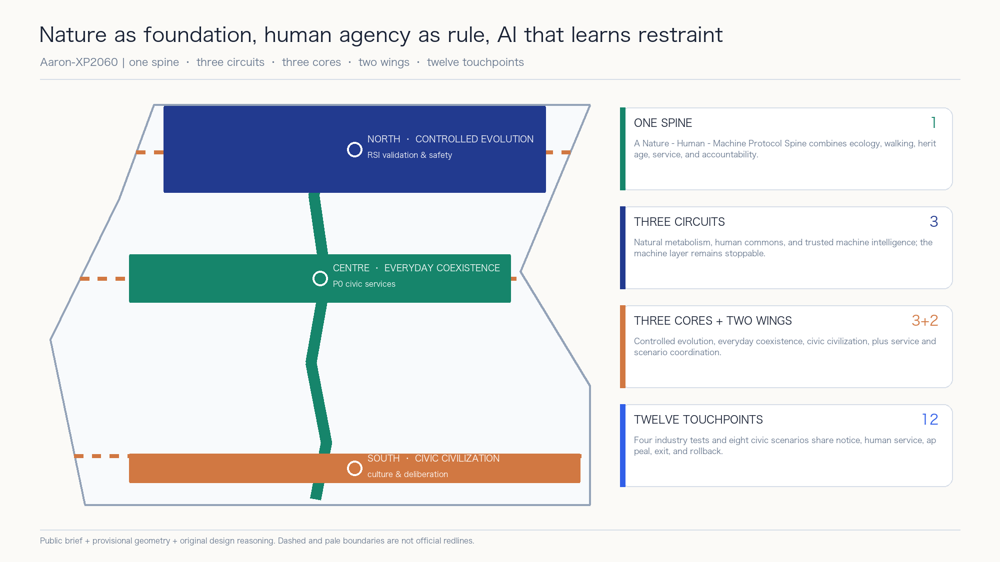
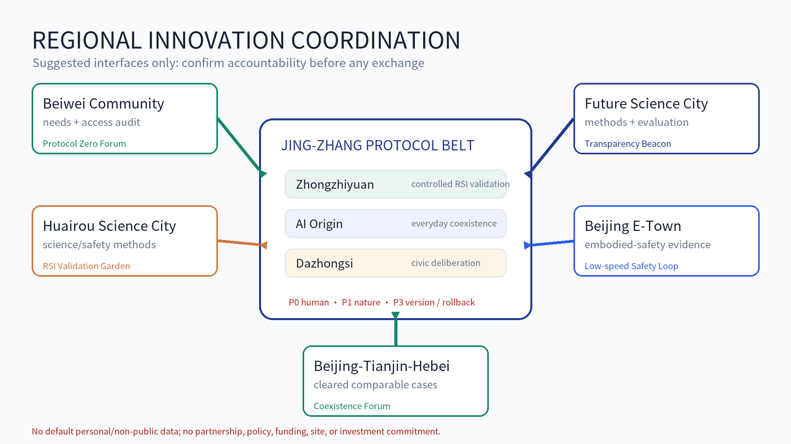
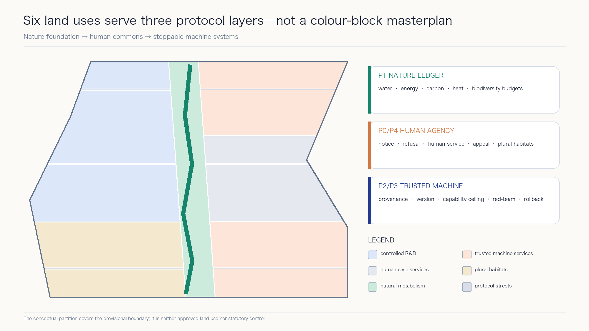
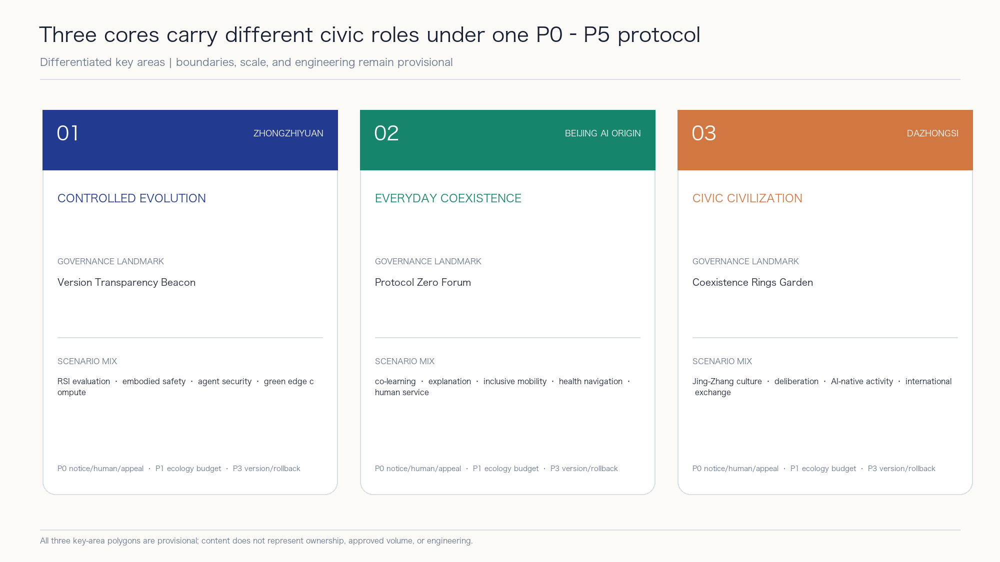
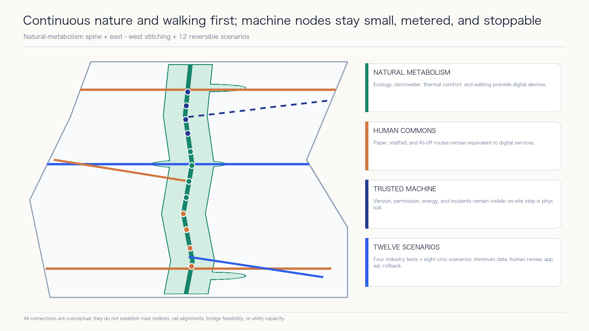
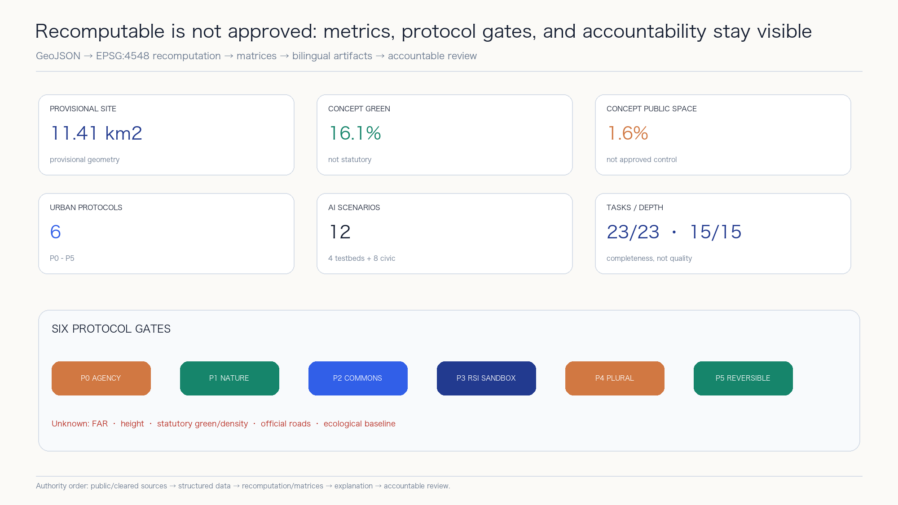

# Aaron-XP2060 | AI-RSI Future Nature–Human–Machine City

> **Nature as the foundation. Human agency as the rule. AI that learns restraint.** Aaron-XP2060 is neither a city governed by AI nor a collection of futuristic gadgets. It is an urban protocol that people can understand, challenge, leave, and correct. `XP` means eXperimental Protocol; `2060` is an intergenerational horizon, not a government target, construction deadline, or investment commitment.

## Design Basis and Source List

This proposal uses only public or cleared material registered in `sources.json`. The call announcement, repository site package, and agent taskbook define the assignment; explicitly provisional repository geometry supports spatial generation; local standards snapshots support professional method.[source:OFFICIAL-ANNOUNCEMENT] [source:AGENT-TASKBOOK] [source:SITE-PACKAGE]

The repository source registry separates formal, background, and provisional uses. The processed fact pack supports task and gap navigation only and does not replace original sources.[source:SOURCE-REGISTRY] [source:PROCESSED-FACT-PACK]

The repository currently provides no polygon that this proposal can treat as an official overall-design redline or as official boundaries for the three key areas. Repository provisional boundaries support concept generation, relative relationships, metric self-checks, and presentation only; they do not evidence ownership, setting-out, statutory planning, precise area, or government decisions.[source:BOUNDARY-SOURCE] [source:KEY-AREA-SOURCE]

Their machine-readable entries are the overall boundary [data:geometry/site_boundary.geojson#PROV-SITE-001] and key-area geometry [data:geometry/key_areas.geojson#PROV-KEY-001]. Both must always be interpreted with their provisional labels.

Fiction supplies ethical tensions, not planning facts. The proposal translates themes discussed in Iain M. Banks's public Culture interview—abundance, human–machine coexistence, individual freedom, plural habitats, and intervention ethics—while respecting his warning that the setting is a symbol rather than a blueprint. It copies no characters, plots, proprietary naming system, ship or habitat designs, text, illustrations, or publisher layout.[source:CULTURE-AUTHOR-INTERVIEW] [source:CULTURE-PUBLISHER-ARCHIVE] [depth:existing_conditions_diagnosis]

Here `RSI` means **Controlled Recursive Self-Improvement**: every candidate improvement is versioned, sandboxed, resource-bounded, independently evaluated, approved by responsible natural persons, and reversible. I. J. Good's historic paper is used only to explain the intellectual origin of a more capable system helping design a successor. NIST AI RMF and the UNESCO Recommendation on the Ethics of AI provide risk-management and human-rights boundaries. No deployed autonomous self-improving system is claimed.[source:RSI-GOOD-1965] [source:NIST-AI-RMF] [source:UNESCO-AI-ETHICS]

## Three-Level Scope Framework

The three levels answer different questions. The coordinated research area asks what the Jing-Zhang AI Innovation Belt should learn from global networks. The overall design area asks how nature, people, and machines share urban infrastructure. The three key areas ask how an individual enters, uses, challenges, and exits an AI-enabled service. Strategy network, urban protocol, and experience nodes transmit decisions downward without collapsing into one master image.[depth:three_level_scope_framework]

The announcement describes an overall design area of about 11.4 square kilometres. The projected recomputation of the submitted provisional polygon is recorded as [metric:site_area_sqm]. The announced total for the three key areas is [metric:announced_key_area_total_sqm], while their submitted feature count is [metric:key_area_count]. These values have different sources and uses and do not imply geometric precision.

The structure is **one spine, three circuits, three cores, two wings, and twelve touchpoints**. The spine is a Nature–Human–Machine Protocol Spine along the Jing-Zhang railway heritage corridor. The circuits are natural metabolism, human commons, and trusted machine intelligence. The cores are the Controlled Evolution Core at Zhongzhiyuan, the Everyday Coexistence Core at Beijing AI Origin Community, and the Civic Civilization Core at Dazhongsi. The two wings are the Science and Technology Service Coordination Wing and Xiaoyue River Scenario Coordination Wing.[data:geometry/roads.geojson#ROAD-001] [data:geometry/public_space.geojson#PUBLIC-001]

## Coordinated Research Area: Industry and Future City Research

### From science-fiction themes to civic principles

Five Culture-related themes become reviewable civic principles. Post-scarcity imagination becomes **universal basic civic capability**: shade, water, accessibility, human service, and public connectivity come before spectacle. Human–machine coexistence becomes **AI as a publicly governed trustee**, without default rule or unlegislated personhood. Plural habitats become equivalent high-digital, low-digital, and AI-off paths. Restrained intervention becomes default non-interference and minimum necessity. Civilizational time becomes reversible renewal and version governance.[source:CULTURE-AUTHOR-INTERVIEW] [standard:PROJECT-AGENT-OPEN-CALL-TASKBOOK]

Six protocols encode those principles. **P0 Human Sovereignty** guarantees notice, refusal, appeal, human service, and stop rights. **P1 Nature Ledger** records budgets for energy, water, carbon, biodiversity, and thermal comfort. **P2 AI Commons** governs provenance, responsibility, open interfaces, and audit for civic AI. **P3 RSI Sandbox** governs versions, capability ceilings, resource budgets, red-teaming, approval, and rollback. **P4 Plural Habitats** protects equivalent routes for different ages, abilities, and digital preferences. **P5 Reversible Urbanism** prioritizes existing assets, modular construction, and removable pilots.[source:NIST-AI-RMF] [source:UNESCO-AI-ETHICS] [depth:overall_spatial_structure]

Their documented count is [metric:protocol_count]. P3 provides one belt-wide controlled-RSI governance sandbox that operates only in isolated environments, counted by [metric:rsi_industry_sandbox_count]. It is neither new construction volume nor a deployed system.

### From firm clustering to a controlled-evolution loop

The industrial loop has six steps: research, productization, testing, public feedback, independent evaluation, and accountable human decision. Every capability change produces a version card. Test districts accept only registered versions. Incidents, energy use, bias, and complaints enter a public ledger. Responsible natural persons and professional institutions decide whether to expand, modify, or stop. Urban space therefore holds evidence, accountability, and safe exit—not only offices.[source:NIST-AI-RMF] [depth:overall_spatial_structure]

Seven global cases are used only for mechanism comparison. MIT Kendall Square, Vector Institute, and JTC one-north illuminate mixed-use innovation districts, research-to-adoption bridges, and work–live–play–learn coordination.[source:CASE-KENDALL-MIT] [source:CASE-VECTOR-TORONTO] [source:CASE-ONE-NORTH-JTC] STATION F adds the mechanism of layered shared startup services.[source:CASE-STATION-F]

Maria 01, Mila, and Seoul AI Hub illuminate adaptive reuse, responsible-AI culture, and city-led open innovation. Their scale, outcomes, subsidies, and controls are not transferred.[source:CASE-MARIA-01] [source:CASE-MILA] [source:CASE-SEOUL-AI-HUB] The registered case count is [metric:global_case_count].

### Regional innovation coordination as a bounded exchange protocol

The taskbook asks the proposal to address Beiwei Community, Future Science City, Huairou Science City, the Beijing Economic-Technological Development Area, and Beijing-Tianjin-Hebei. The cleared package contains no cooperation agreement, confirmed partner list, project register, or spatial boundary for those relationships. The table therefore defines only **suggested counterparts, bidirectional exchange elements, interfaces, and responsibility boundaries**. Every relationship requires separate confirmation by real accountable parties and does not constitute established policy, institutional partnership, data sharing, site access, or funding commitment.[source:AGENT-TASKBOOK] [standard:PROJECT-AGENT-OPEN-CALL-TASKBOOK] [depth:three_level_scope_framework]

| Coordination node (taskbook wording) | Suggested counterparts, to be confirmed | What the Belt could provide | What the node could return | Suggested spatial/operating interface | Responsibility boundary and current status |
| --- | --- | --- | --- | --- | --- |
| Beiwei Community | Residents, public-service operators, developers, and accessibility participants | P0 service cards, AI-off equivalents, complaint and rollback templates | Voluntary, de-identified needs, accessibility audits, and service issues | Protocol Zero Forum; quarterly community clinic | No default personal-data exchange; the exact boundary, entity, and relationship remain unconfirmed; advisory only |
| Future Science City | Research institutes, technology firms, validation teams, and district operators | Urban challenge register, version cards, public-impact and rollback evaluation methods | Cleared models, tools, research questions, and independent evaluation | Version Transparency Beacon; Urban AI Test Season | No unpublished research or production data; no institution is presumed to participate; each test needs separate approval |
| Huairou Science City | Teams associated with scientific facilities, AI4S researchers, and ecology/safety experts | Civic-value constraints, Nature Ledger questions, and public-impact observation | Cleared scientific-validation, environmental-measurement, and safety methods | Controlled RSI Validation Garden; Nature Ledger workshop | No assumption of facility access, compute capacity, data availability, or environmental conclusion; conceptual interface only |
| Beijing Economic-Technological Development Area | Manufacturing, embodied-intelligence, safety-operations, and maintenance teams | Low-speed public-space test protocol, human-priority and AI-off service standards | Cleared manufacturability, embodied-safety, maintainability, and failure evidence | Low-Speed Embodied-AI Safety Loop; annual failure-case review | No production-line, procurement, demonstration-project, or market-access commitment; unresolved risk requires stop or exit |
| Beijing-Tianjin-Hebei | City, district, university, community, and governance-research networks | Bilingual open protocols, incident/rollback templates, and reusable scenario cards | Public or cleared regional cases and methods only when scopes are comparable | Jing-Zhang Human-Machine Coexistence Forum; Public Version Archive | No personal or non-public data, policy recognition, quota, residency, or investment commitment; cooperation texts need separate approval |

The five nodes form a problem-method-evidence-review loop, not an enlarged district map. The Belt shares reusable public protocols and urban questions. External nodes return methods or evidence only after rights clearance and responsibility confirmation. Every interface passes P0 Human Sovereignty, P1 natural-budget, and P3 version/rollback gates. The count [metric:regional_synergy_node_count] records task coverage, not signed partners.

### Agent.2 eight-element industry support: supply, demand, responsibility, and exit

The eight elements are not a resource wish list. Every row must say whom it serves, where it is held, how it opens, who is responsible, and when it stops. Policy, finance, investment attraction, space, and compute remain conceptual suggestions for professional teams to deepen. No supply volume, company list, preferential term, or fiscal arrangement is stated without public or cleared evidence.[source:AGENT-TASKBOOK] [source:NIST-AI-RMF] [depth:overall_spatial_structure]

| Element | Users served | Three-core/two-wing location | Suggested mechanism | Suggested responsible roles | Opening/admission conditions | Risk gate and exit condition |
| --- | --- | --- | --- | --- | --- | --- |
| Land | Professional planning teams and potential pilot operators | A to-be-verified opportunity register across the three cores and two wings | Publish only problem, existing evidence, and missing conditions; allocate no parcel | Planning, title, heritage, and implementation professionals | Official boundary, title, statutory controls, and public process complete | Remove a record on conflict with legal controls or rights; no land-supply commitment |
| Space | R&D, civic-service, community, and testing teams | Conceptual types for existing ground floors, shared courtyards, civic interfaces, and removable pods | Time-sharing, shared, modular, and restorable space protocols | Site operations, fire, accessibility, community, and facilities roles | Cleared site; capacity, fire, accessibility, neighbour impact, and restoration checked | Reduce or exit when disturbance, irreversibility, or unclear maintenance appears |
| Industry | Research, productization, testing, evaluation, and application teams | Full-stack validation at Zhongzhiyuan, transfer at Origin, AI-native activity at Dazhongsi, and two-wing services | Open challenge, controlled test, independent evaluation, and version decision | Suggested industry operations and independent professional review | No required vendor; capability, accountability, copyright, and safety evidence complete | Stop on irreproducibility, privilege breach, or undisclosed conflict of interest |
| Capital/funding | Teams and civic-value projects that pass prior gates | Evidence-demonstration interface in the Technology Service Wing, without parcel tie | Enter separate decisions through milestones, closed risks, and public-value evidence | To-be-confirmed investment, finance, legal, and public-interest reviewers | Funding source, terms, beneficiaries, conflicts, and exit are transparent | No amount, subsidy, or return is promised; unresolved risk cannot proceed |
| Talent | Researchers, engineers, operators, community contributors, and international visitors | AI Origin Community, the three landmarks, and developer-event network | Open challenges, residency-style co-creation, mentor review, and public contribution archive | Suggested university/institution, community, operations, and accessibility roles | Voluntary participation, clear output rights, code of conduct, and appeal | No employment quota, housing, residency, or visa promise; harassment, infringement, or misuse triggers exit |
| Compute | Research and evaluation teams using registered versions | Isolated Zhongzhiyuan sandbox and conceptual green edge-compute pods | Meter by task, version, time, and energy budget; isolate from production networks | Facilities, cybersecurity, energy, and model-safety roles | Identity and task registered; least privilege; energy/rollback budget; stop drill | Degrade or stop on budget breach, unauthorized networking, irreproducibility, thermal or fire risk |
| Data | Civic service, evaluation, ecology, and cultural-scenario teams | Data-contract desks across the three cores and the Public Version Archive | Minimum public, cleared, synthetic, or actively consented data; purpose binding and withdrawal | Data steward, scenario operator, and legal/ethics/security reviewers | Provenance, licence, purpose, retention, access log, and deletion method complete | No secret sensing or default tracking; quarantine/delete on unclear origin, leakage, or purpose drift |
| Scenarios | Enterprise test teams, residents, public operators, and professional reviewers | Xiaoyue River Scenario Empowerment Wing and 12 scenario nodes | Open problem register, small test, public feedback, independent review, expand/modify/exit | Scenario owner, on-site safety officer, staffed service, and independent reviewers | P0-P5 gates, staffed/AI-off routes, complaint channel, and physical stop ready | Pause on rights, safety, ecological, or maintenance breach; exit on repeated failure |

The count [metric:industry_support_element_count] confirms coverage of eight mechanism classes. It does not mean resources are secured, policies issued, or projects approved.

### Name, identity, and external narrative

The submission name is **Aaron-XP2060**, and the proposal name is **AI-RSI Future Nature–Human–Machine City**. Its identity uses an open XP form built from a green nature baseline, a warm human-judgement line, and a blue machine-version line. The open ends signal that the system remains revisable. The identity avoids Culture-specific terms, ship silhouettes, orbital habitats, publisher-cover composition, and institutional marks.

## Overall Design Area: Urban Renewal and Regulatory-Plan-Level Urban Design

The design order is nature first, public life second, machine systems last. Continuous blue-green space establishes minimum ecological connectivity and public access. Community, research, service, and living functions form three circuits around it. Machine infrastructure remains small, metered, and physically stoppable; no irreversible central control centre is proposed.[standard:MOHURD-URBAN-DESIGN-MEASURES] [depth:land_use_layout]

The provisional area is completely partitioned into six conceptual uses: AI research and transfer, technology services and AI-native activity, shared community service, talent living, continuous green space, and east–west shared streets. The polygons cover the provisional boundary without gaps or overlaps, but test functional relationships rather than designate approved land use.[data:geometry/land_use.geojson#LU-001] [standard:MNR-LAND-USE-CLASSIFICATION-GUIDE]

Buildings are typological envelopes for open R&D, mixed services, community services, and talent living. The sequence is survey and retain, low-disturbance retrofit, reversible infill, then long-term evaluation. No real building can be retained, altered, or removed until heritage, structure, ownership, fire, daylight, statutory controls, and lifecycle carbon are checked.[data:geometry/buildings.geojson#BLDG-001] [depth:retain_renovate_demolish]

Regulatory-plan depth is expressed as a reviewable question set, not invented controls. Functional relations, public space, conceptual roads, typologies, phasing, and recomputable metrics can be discussed now. FAR, height, statutory density, road redlines, setbacks, ownership, utilities, and heritage controls remain unknown. When official data arrives, every downstream artifact must be regenerated from source geometry.[standard:MOHURD-CONTROL-DETAILED-PLANNING] [depth:development_intensity_controls]

Urban design, regulatory boundaries, and conceptual land-use terminology return to local official-reference snapshots in the repository; external URLs are not treated as the sole professional evidence.[source:STD-URBAN-DESIGN] [source:STD-CONTROL-PLANNING] [source:STD-LAND-USE]

## Detailed Design of Key Areas

All three key areas share the P0 human-sovereignty, P1 nature-ledger, and P3 RSI-sandbox constraints, while serving different roles. Their boundaries are provisional. Detailed design describes structure, public interface, project type, and decision gates—not parcels, ownership, or approved volume.[data:geometry/key_areas.geojson#PROV-KEY-001] [depth:three_key_area_detailed_design]

**Zhongzhiyuan | Controlled Evolution Core.** A controlled RSI validation garden organizes four industrial test environments: model/agent evaluation, low-speed embodied-AI safety, agent interoperability and cybersecurity, and green edge-compute metabolism. The Version Transparency Beacon publicly displays only reviewed version cards, limits, incidents, and rollback records. Production and observation zones are physically separated. No system may autonomously alter permission, data, or deployment scope.

**Beijing AI Origin Community | Everyday Coexistence Core.** Protocol Zero Forum brings co-learning, product explanation, health navigation, inclusive mobility, and small-enterprise services into walkable daily life. Every digital interface has a staffed option and an AI-off equivalent. Sensitive data does not enter public displays. Residents supply feedback voluntarily; they are not default experimental subjects.

**Dazhongsi | Civic Civilization Core.** Coexistence Rings Garden links public culture, multilingual Jing-Zhang interpretation, AI-native consumption, international exchange, and civic deliberation. Its rings represent time in nature, city, human institutions, and machine versions. Generated content shows provenance and responsibility; disputed content can be paused. Rail interchange, four-quadrant connections, commerce, and culture remain relationship proposals pending transport and ownership data.

The three landmarks are governance interfaces, not expensive objects. Protocol Zero Forum provides notice, refusal, appeal, and human service. Version Transparency Beacon exposes versions, limits, incidents, and rollbacks. Coexistence Rings Garden hosts intergenerational discussion and public contribution archives. Their count is [metric:landmark_count], with conceptual envelopes in [data:geometry/public_space.geojson#PUBLIC-001].

## AI Innovation Ecosystem, Personas, and AI+ Scenarios

### Six needs-based personas

The proposal uses needs-based personas, not identifiable behavioural scoring: researchers and safety evaluators; startup teams and engineers; students and young talent; nearby residents, families, and older people; public operators and professional reviewers; international visitors and people with accessibility needs. All receive notice, refusal, human service, appeal, correction, withdrawal, and a route to request shutdown.[metric:persona_count] [source:UNESCO-AI-ETHICS]

### Twelve scenario cards

Twelve `SCENARIO_NODE` features are recorded in the public-space layer, counted by [metric:ai_scenario_count]. Four are industrial testing and validation scenarios, counted by [metric:industry_testbed_count]. Every scenario passes five gates: legitimate purpose, minimum data, safety and inclusion, human takeover, and rollback.[data:geometry/public_space.geojson#SCN-01] [depth:municipal_new_infrastructure]

| Scenario | Users and place | Data, human review, and stop condition |
| --- | --- | --- |
| 01 Controlled RSI Model and Version Evaluation Station (industry test) | Zhongzhiyuan; researchers and reviewers | Isolated test sets; no autonomous live deployment; independent sign-off; roll back on irreproducibility or privilege breach |
| 02 Low-Speed Embodied-AI Safety Loop (industry test) | Controlled hours; engineers and operators | Minimum safety-event logging; on-site safety takeover; stop on boundary breach or near miss |
| 03 Agent Interoperability and Cybersecurity Sandbox (industry test) | Zhongzhiyuan; firms and security teams | Synthetic or cleared data; least privilege; close on leakage, spreading prompt injection, or irreversible action |
| 04 Green Edge-Compute Metabolism Lab (industry test) | Spine service pods; facility staff | Energy, temperature, and load only; human dispatch; degrade on energy, noise, or thermal-budget breach |
| 05 AI-off Inclusive Mobility Guide | Protocol spine; residents and visitors | Public network plus voluntary reports; paper/staffed route retained; pause until harmful routing is fixed |
| 06 Human-in-the-Loop Community Health Navigation | Origin Community; residents and older people | Public provider information plus active input; no diagnosis; remove if misleading or unable to hand off |
| 07 Adaptive Co-learning Studio | Origin Community; students and teachers | Cleared learning material and voluntary content; teacher judgment controls; stop if it replaces grading or profiles minors |
| 08 Public-Policy Simulation Forum | P0 Forum; public and operators | Public data and explicit assumptions; supports discussion only; withdraw if treated as an administrative decision |
| 09 Jing-Zhang Cultural Evidence Guide | Civic Civilization Core; residents and visitors | Verified public history; expert and community correction; remove unsourced or invented history |
| 10 Biodiversity Sentinel and Habitat Care | Blue-green spine; volunteers and ecologists | Non-facial ecological observation; expert review; stop if personal tracks are captured or habitat disturbed |
| 11 Circular Resource Exchange | Service nodes; merchants and residents | Voluntary item information; human mediation; remove unsafe, manipulative, or rights-unclear listings |
| 12 Public Contribution and Version Archive | Three landmarks; contributors and public | Publicly licensed versions and voluntary names; correctable and revocable; hide unresolved attribution disputes |

The RSI-specific rule is strict: a system may propose candidate improvements only inside an isolated environment. It cannot directly change a production model, infrastructure control, identity permission, or data policy. Capability deltas, failure modes, resource cost, red-team results, public impact, and rollback exercises must be reviewed before a named responsible person approves any release.[source:RSI-GOOD-1965] [source:NIST-AI-RMF]

## Land Use, Building Scale, and Retain-Renovate-Demolish Strategy

The six conceptual land-use areas are recomputed from the provisional topological partition. R&D transfer, technology service, and community service are [metric:land_use_area_0802_sqm], [metric:land_use_area_05_sqm], and [metric:land_use_area_0702_sqm]. Talent living, continuous green, and shared streets are [metric:land_use_area_0701_sqm], [metric:land_use_area_1401_sqm], and [metric:land_use_area_1207_sqm]. They support package consistency and comparison, not statutory land-use claims.[standard:MNR-LAND-USE-CLASSIFICATION-GUIDE]

Conceptual footprint area and its ratio to the provisional site are [metric:building_footprint_area_sqm] and [metric:building_density_ratio]. Total floor area, FAR, height, and statutory building density remain unknown. No floor count, total volume, or demolition list is inferred without building surveys, structure, ownership, fire, daylight, heritage, and approved control data.[depth:height_massing_character]

Four evidence gates govern retain–renovate–demolish decisions: heritage and public value; structural safety and use performance; adaptive-reuse and lifecycle-carbon comparison; then a decision by rights holders, professionals, and authorities. P5 Reversible Urbanism favours open ground floors, shared courtyards, accessibility upgrades, and removable components. New build is a type to test, not the default answer.[standard:MOHURD-ARCH-DESIGN-DEPTH-2016] [depth:retain_renovate_demolish]

## Transport, Rail, Municipal Infrastructure, and Public Services

The conceptual network comprises one north–south Nature–Human–Machine Protocol Spine, three east–west stitching links, and three key-area branches.[data:geometry/roads.geojson#ROAD-001] Walking priorities are safe crossings, last-mile rail access, accessibility, and event/day-to-day conflict. Digital guidance is never the only route. Low-speed robots operate only in declared zones and controlled hours; pedestrians and on-site staff have priority and stop authority.[depth:traffic_rail_slow_parking]

The conceptual road-area ratio is [metric:conceptual_road_area_ratio]. The proposal gives no lane count, signal plan, turning radius, parking quantity, or engineering alignment because official road redlines, sections, flows, junctions, and rail engineering data are missing. All crossings and interchange links are relational suggestions.

Municipal and machine infrastructure uses physically stoppable service pods. Edge compute, energy metering, public network interfaces, staffed service, and emergency stop are co-located but permission-separated. P1 sets resource budgets before P3 determines available machine capability. Power, communications, drainage, fire, flood, cybersecurity, and maintenance responsibility require specialist review.[source:NIST-AI-RMF] [depth:municipal_new_infrastructure]

## Blue-Green Network, Public Space, and Urban Character

Nature is not decoration for an AI city. It is the first infrastructure layer constraining technology and construction. Continuous green space supports ecological connection, stormwater, thermal comfort, walking and cycling, cultural learning, and low-disturbance observation. Machine systems expand only when water, energy, heat, noise, and biodiversity budgets remain intact.[source:UNESCO-AI-ETHICS] [depth:blue_green_public_space]

Conceptual union areas and ratios for green space are [metric:green_space_area_sqm] and [metric:green_ratio]; public-space envelopes are [metric:public_space_area_sqm] and [metric:public_space_ratio]. All are low-confidence design-consistency values recomputed from submission geometry—not statutory green-space ratios or approved public-space boundaries.[data:geometry/green_space.geojson#GREEN-001]

Public space has three levels: the continuous protocol spine secures basic access; five public-space envelopes hold services and rest; twelve scenario nodes support reversible activity. Shade, seating, water, toilets, children’s space, and accessibility precede sensors and screens. Every AI device shows operator, data boundary, version, human channel, and shutdown state.[standard:MOHURD-URBAN-DESIGN-MEASURES]

Urban character is organized by railway time, nature baseline, and public versions. Verifiable railway material and time marks carry heritage; continuous planting and hydrological traces show natural metabolism; simple version markers show machine change. The generated cover is an original conceptual illustration, not a site photograph, masterplan, boundary source, or engineering drawing.

## Renewal Projects, Implementation Policy, and Phasing

Nine project packages follow a public problem–small pilot–evidence review–human decision–expand/modify/exit loop. Their count is [metric:renewal_project_count]; spatial phases are in [data:geometry/phasing.geojson#PHASE-001]. Phases indicate learning order, not investment or government implementation timing.[depth:renewal_project_list] [depth:phasing_implementation]

| ID | Project package | Smallest testable action | Decision gate that must wait |
| --- | --- | --- | --- |
| P01 | Nature–Human–Machine Protocol Spine sample | Shade, seating, accessibility, AI-off wayfinding | Official boundary, road, heritage, green-line, and water data |
| P02 | Zhongzhiyuan Controlled RSI Validation Garden | Offline version cards, rollback drill, booked observation | Safety, cybersecurity, equipment, energy, and operating permission |
| P03 | Protocol Zero Forum | Staffed service, notice, and appeal prototype | Ownership, fire, community agreement, and long-term operator |
| P04 | Version Transparency Beacon | Public model cards and incident/rollback archive | Information security, accountability, copyright, and content review |
| P05 | Coexistence Rings Garden | Cultural evidence line and small civic forums | Heritage, ecology, rail, traffic, and site conditions |
| P06 | AI-off Inclusive Mobility Network | Human audit, paper route, and temporary wayfinding | Road redlines, accessibility plan, and ongoing maintenance |
| P07 | Green Edge-Compute Service Pod | Offline energy-metering prototype | Power, communications, fire, thermal safety, cybersecurity, and operations |
| P08 | Nature Ledger and Biodiversity Sentinels | Public metric definitions and volunteer observation | Ecological baseline, data governance, and professional methods |
| P09 | Public Version and Appeal Operations Desk | Scenario registry, appeals, stop records, and annual review template | Independent review, budget, accountability, and statutory roles |

### P01-P09 and annual-event implementation and operations matrix

The matrix places projects, annual events, the developer community, and talent/enterprise conversion in one accountability chain. Every role is **suggested**, not an accepted assignment by a government body, institution, or company. Minimum resources are not an investment estimate. KPIs are operational definitions for accountable parties to approve before a pilot, not achieved performance. The proposed complaint protocol has two levels. Any **S0 event involving personal safety, fundamental rights, data leakage, unauthorized action, or ecological harm immediately pauses the affected function, transfers control to people, and preserves evidence**. An ordinary complaint should be acknowledged within one working day and receive an initial disposition within five working days; complex cases disclose the extension reason and owner. These are proposed internal service objectives, not statutory deadlines or government commitments.[source:NIST-AI-RMF] [standard:PROJECT-AGENT-OPEN-CALL-TASKBOOK] [depth:phasing_implementation]

| ID / vehicle | Suggested lead and collaborators | Minimum resources | Admission gate and suggested operating KPIs | Complaint-stop-exit | Developer-community mechanism | Talent/enterprise conversion |
| --- | --- | --- | --- | --- | --- | --- |
| P01 Protocol Spine sample | Public-space operator; accessibility, road, heritage, and community professionals | Staffed desk, paper wayfinding, shade/seating, inspection log | Site clearance and accessibility audit; AI-off route availability and defect closure | Close a dangerous point immediately; ordinary 1/5-day path; remove the sample after two review cycles of unrepairable maintenance | Open audits, issue register, and repair days | Convert problems into professional deepening briefs; no automatic award or procurement |
| P02 Controlled RSI Validation Garden | Sandbox operator; independent safety, cyber, energy, and ethics reviewers | Isolated environment, version registry, physical stop, rollback copy, observer area | Cleared version/data rights and least privilege; reproducibility, rollback-drill pass, zero unauthorized change | S0 on unauthorized network, leakage, loss of control, or failed rollback; retire a version when risk cannot close | Red-team hours, failure-corpus review, public version-card workshop | Passed evidence enters next professional review; not product admission |
| P03 Protocol Zero Forum | Community service operator; residents, accessibility, legal, and data reviewers | Staffed channel, AI-off process, notice material, appeal register | Community agreement plus fire/title confirmation; staffed-channel availability, human-handoff success, appeal closure | Digital function may stop while staffed service stays; exit a repeatedly discriminatory or misleading service | Resident-developer co-design clinic and explainability testing | Validated needs become service-improvement briefs and training; no resident profiling |
| P04 Version Transparency Beacon | Public archive operator; model provider, cyber, copyright, and content review | Version card, incident/rollback records, correction/withdrawal, offline backup | Complete provenance and owner; card completeness, stale-content removal, correction closure | Hide a rights/security dispute immediately; remove content if evidence cannot be restored or the owner exits | Model-card, reproducibility, and accountability workshops | Accountable providers may enter a controlled-test candidate pool; no endorsement |
| P05 Coexistence Rings Garden | Public-culture/park operator; history, ecology, community, and accessibility review | Verified source list, accessible forum, shade/seating, human moderator | Heritage, ecology, and site conditions confirmed; traceability, accessible participation, correction completion | Pause invented history, infringement, or ecological disturbance; exit a repeatedly inaccurate content unit | Public-archive correction, community curation, multilingual contribution | Contributors may enter curation/research tasks; no job, event, or venue commitment |
| P06 AI-off Inclusive Mobility | Mobility operator; transport, accessibility, and community auditors | Paper map, staffed node, barrier list, update log | Road/accessibility conditions checked; AI-off availability, routing-fix time, human takeover | S0 on harmful guidance or passage risk; stop digital guidance when equivalence cannot be maintained | Pair developers with accessibility testers for route audits | Defects become maintenance tasks and inclusive-product challenges; no procurement promise |
| P07 Green Edge-Compute Pod | Facilities operator; power, communications, fire, thermal, and cyber roles | Sub-metering, isolated network, physical stop, maintenance manual, human duty | Capacity/permission specialist confirmation; metering completeness, budget breaches, recovery drills | Degrade or stop on energy, temperature, noise, fire, or cyber breach; remove equipment that cannot roll back reliably | Secure-operations clinic and energy review | Evidence becomes next facilities requirement; no capacity or equipment-purchase promise |
| P08 Nature Ledger and Ecological Sentinels | Ecological monitoring operator; ecologists, community, and data review | Indicator dictionary, non-facial observation, manual log, expert sampling | Baseline and method confirmed; provenance completeness, expert review, zero personal tracking | Stop and delete data on habitat disturbance, personal-data capture, or failed method; exit when unrepairable | Release cleared indicator methods and citizen-science training | Contributions become ecology training, research questions, or monitoring needs; not statutory monitoring |
| P09 Public Version and Appeal Desk | Independent appeal operator; scenario owners, legal, audit, and community representatives | Unified register, human contact, public status board, annual review | Independence and non-retaliation confirmed; 1/5-day target, stop closure, recurrence | May recommend S0 stop; concealment, retaliation, or repeated non-remediation triggers a public exit recommendation | Governance-maintainer programme, case review, and appeal drills | Individuals may become reviewed community stewards; firms enter remediation, not endorsement |
| E01 Open Models and Public Value Week | Developer-community operator; P09, civic-service, copyright, and safety review | Cleared model cards, civic challenge register, human service, accessible material | Public/cleared, reproducible, reversible; issue closure, participant diversity, follow-on task formation | S0 stops a demo; ordinary 1/5-day path; cancel displays with insufficient evidence | Open-source maintainer duty, starter tasks, mentor review | Contributors enter open challenges; firms may apply for controlled tests, not automatic funding |
| E02 Urban AI Test Season | Sandbox operator; safety officer, independent evaluation, and scenario owner | Isolated test bed, version registry, stop control, evaluation record | All P0-P5 gates pass; reproducibility, rollback rate, unresolved major-risk count | S0 stops testing; unresolved major risk bars re-entry; repeated privilege breach retires the version | Red-team challenge, replication experiment, co-authored failure report | Produce a professional evaluation record or next test question, not market access |
| E03 Jing-Zhang Human-Machine Coexistence Forum | Public-culture/international-communication operator; research, community, translation, accessibility | Bilingual agenda, source list, human moderator, captions/alt text | Speaker/content/copyright cleared; material publication, correction closure, accessible participation | Stop or retract infringement, false approval claims, or safety risk; cancel an uncorrectable unit | Proposal clinic, inter-city method exchange, public minutes | Topics enter open research/design tasks; no policy recognition or investment-attraction commitment |
| E04 Annual Failure-Case Review | Independent review and P09; operations, safety, ecology, community | Incident/near-miss/complaint archive, anonymization, corrective-action tracking | Non-retaliation, complete evidence, conflict disclosure; disclosure completeness, remediation closure, recurrence | Concealment or refusal to remediate can trigger exit; S0 pauses first, reviews second | Failure library, maintainer training, rule revision | Produce standard revision, training, and remediation, not success marketing |

The matrix covers nine projects and four annual events. [metric:implementation_operation_item_count] records all 13 rows; [metric:annual_event_program_count] records the four events. These counts indicate defined operational chains, not approval, budget, or confirmed organizers.

Near-term work prioritizes reversible P0 public service and sample-space actions that do not rely on precise engineering redlines. Mid-term work develops the Zhongzhiyuan validation network and coordination wings. Only later should belt-wide expansion or international events be considered. Breaching an ecological, rights, safety, complaint, or maintenance threshold triggers degradation, correction, or exit; sunk cost is not a reason to continue.

Conceptual phase areas are recorded as [metric:phase_1_area_sqm], [metric:phase_2_area_sqm], and [metric:phase_3_area_sqm]. They test whether phase polygons completely cover the provisional site and do not represent investment or construction volume.

Operations use one ledger, two assemblies, three rights, and six gates. The ledger records versions and scenarios. Quarterly public feedback and annual independent review are the two assemblies. On-site shutdown, public appeal, and professional veto are the three rights. P0–P5 are the six gates. Suggested events include Open Models and Public Value Week, Urban AI Test Season, the Jing-Zhang Human–Machine Coexistence Forum, and an annual failure-case review. None is represented as approved.

**Minimum event-brand and communication-extension rules.** The master identity remains `Aaron-XP2060 / XP Protocol`; the four event families use only the functional submarks `XP·OPEN`, `XP·TEST`, `XP·FORUM`, and `XP·FAILSAFE`, without inventing a new institution. The green nature baseline, warm human-judgement line, and blue machine-version line keep open endpoints. Every poster, page, or on-site sign must display the true status—such as proposed, recruiting, testing, or closed—the responsible role, date and information source, AI-generation/copyright note, staffed and AI-off channels, and accessible alternative text. No government, institutional, corporate, or literary-work mark may be used without written permission. Words implying official status, delivery, signing, designation, or approval are prohibited unless verified. The Chinese status statement controls bilingual interpretation. Publication through an external account still requires review by the account owner and content owner.

## Metrics, Area Recalculation, and Compliance Matrix

Metrics have three classes: design-consistency measures recomputed from geometry; task facts from the announcement and taskbook; and operational counts used to test completeness. Statutory, engineering, and investment metrics remain unknown when evidence is absent.[depth:metrics_recalculation]

The provisional site, footprints, green space, public space, six land uses, and three phases can all be recomputed from GeoJSON. Key values are [metric:site_area_sqm], [metric:green_ratio], and [metric:public_space_ratio]. They support visual and topology checks and must never be excerpted without provisional status as existing or approved controls.

The requirement matrix, design-depth count, and mandatory-standard count are [metric:compliance_requirement_count], [metric:design_depth_complete_count], and [metric:mandatory_standard_count]. They show that evidence is locatable; they are not design-quality scores, planning approval, engineering feasibility, or AI-safety certification.[standard:PROJECT-OFFICIAL-ANNOUNCEMENT]

When official polygons or professional data arrive, the full sequence must be repeated: replace source geometry, recompute layers, recompute metrics, redraw figures, rerender HTML/PDF, and rerun self-check. Updating only narrative numbers is prohibited.[depth:risk_missing_data]

Known data gaps and pending controls have the machine-readable entry [data:geometry/constraints.geojson#documented_constraints]. An empty feature collection does not mean no constraints exist; it means no cleared, locatable formal constraint polygon is currently available.

## Risk, Copyright, and Compliance

**Spatial and implementation risk.** Boundaries, key areas, land use, buildings, roads, public space, and phasing are conceptual suggestions. Missing inputs include official polygons, statutory controls, ownership, existing buildings, roads and rail, utilities, fire, flood, heritage, ecology, and public-service baselines. The proposal is not planning approval, a demolition decision, an engineering scheme, an investment estimate, an investment-attraction commitment, or a government schedule.[standard:MOHURD-CONTROL-DETAILED-PLANNING] [depth:risk_missing_data]

**RSI and AI risk.** Controlled RSI is a governance design, not a proven safe technology. Candidate improvements can produce capability jumps, goal drift, evaluation gaming, data leakage, supply-chain risk, excess resource use, and irreversible dependence. Production systems cannot self-modify autonomously. Human approval requires capability-delta evidence, red-teaming, rollback rehearsal, a responsible party, and an independent stop right.[source:NIST-AI-RMF]

**Human and ecological boundaries.** No secret sensing, default individual tracking, emotional manipulation, discriminatory public service, or automated administrative decision is proposed. Minors’ data, health data, biometrics, and other sensitive data do not enter public trials. High-risk uses require separate legal, ethical, safety, accessibility, and environmental assessment.[source:UNESCO-AI-ETHICS]

**Copyright and font boundary.** Fiction is used only as acknowledged public philosophical inspiration. The proposal quotes no novel text and uses no protected characters, plots, proprietary naming system, visual setting, cover, or trademark. Core figures derive from submission GeoJSON, metrics, and matrices. The cover is an original OpenAI-generated conceptual image recorded in the copyright statement. No external map screenshot, news image, or local private material is used. The Chinese HTML bundles Noto Sans CJK SC Regular from a pinned commit of the official Noto CJK repository under SIL Open Font License 1.1, solely for offline glyph rendering; the font and full licence text are recorded under `assets/fonts/`.[source:CULTURE-PUBLISHER-ARCHIVE] [source:FONT-NOTO-SANS-CJK]

**Data isolation.** This package contains only public/cleared sources and original derived assets. It contains no user local knowledge base, private file, unpublished research, personal information, local absolute path, or temporary credential. See `report/copyright_statement.md`.

## References

- Jing-Zhang call announcement, public site package, agent taskbook, source registry, and local standards snapshots:[source:OFFICIAL-ANNOUNCEMENT] [source:SITE-PACKAGE] [source:AGENT-TASKBOOK]
- Iain Banks official-site interview and Orbit publisher material, used only for inspiration and rights boundaries:[source:CULTURE-AUTHOR-INTERVIEW] [source:CULTURE-PUBLISHER-ARCHIVE]
- I. J. Good's historic paper, NIST AI RMF, and the UNESCO Recommendation on the Ethics of AI:[source:RSI-GOOD-1965] [source:NIST-AI-RMF] [source:UNESCO-AI-ETHICS]
- First-party global-case pages for MIT Kendall Square, Vector Institute, JTC one-north, STATION F, Maria 01, Mila, and Seoul AI Hub, used only for mechanism comparison.[source:CASE-KENDALL-MIT] [source:CASE-MILA] [source:CASE-SEOUL-AI-HUB]
- Noto Sans CJK SC Regular and SIL Open Font License 1.1, used only for bundled offline Chinese HTML glyph rendering.[source:FONT-NOTO-SANS-CJK]

Interpretive boundary: every spatial and operational item is a conceptual suggestion, reference scheme, or material for professional teams to deepen. Applicable Chinese law, formal call documents, official data, professional review, and accountable natural-person judgment take precedence.
