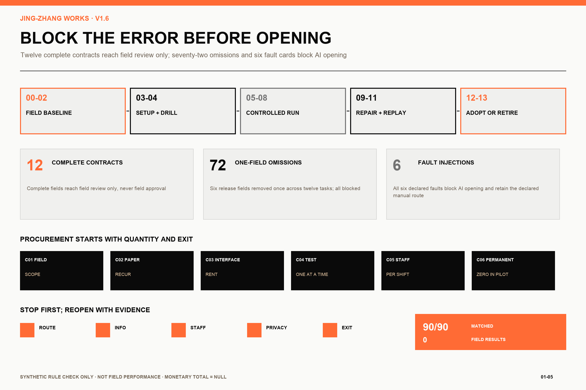
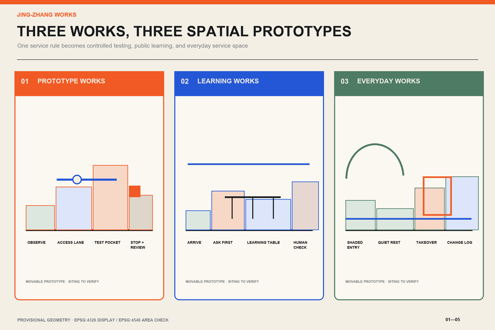
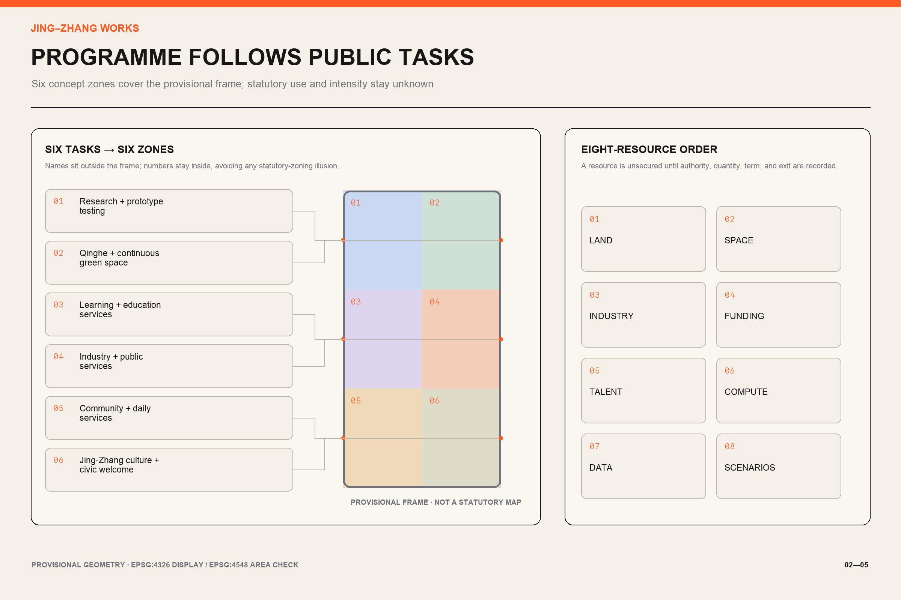
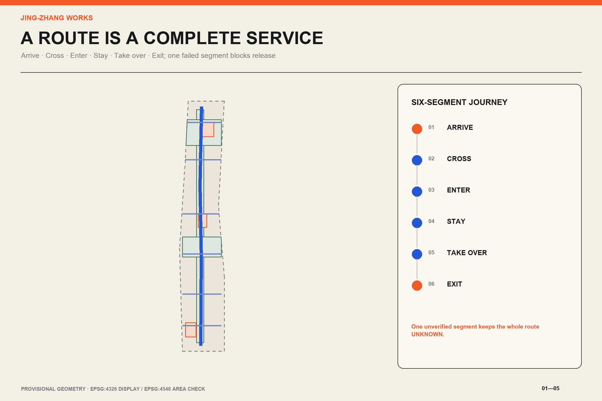
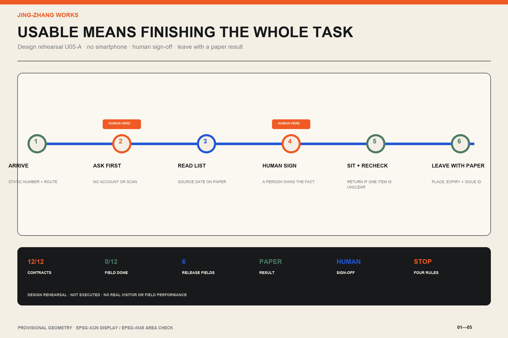

# JING-ZHANG WORKS / 京张好用

> Make the city work first; add AI only where it helps.

## Executive Brief

The Jing-Zhang Railway once answered how Beijing could reach farther places. Zhongguancun later answered how knowledge could become innovation. In the AI era, the corridor must answer a more ordinary question: when innovation enters a normal day, does it actually work?

This proposal treats the approximate 11.4-square-kilometre overall design area as a public-service test corridor. Zhongzhiyuan in the north becomes Prototype Works, where technology is tested under controlled conditions. AI Origin becomes Learning Works, connecting knowledge, talent, and public services. Dazhongsi becomes Everyday Works, where technology faces the realities of commuting, resting, studying, and seeking help. Two service chains connect them. “Lab to Street” requires usability, safety, and exit tests before public deployment. “Problem to Change” makes each barrier visible with an owner, due date, review, and retirement decision.[depth:overall_spatial_structure] [data:geometry/roads.geojson#ROAD-001]

The core product is an Urban Usability Compiler. It neither predicts people nor replaces public decisions. It checks whether a service contract is complete. If any of six fields is missing, the result stays `unknown` or `blocked`: accountable owner, no-app equivalent, minimum-data rule, human takeover, stop condition, and validation metric. All twelve scenario cards compile structurally; structural completeness is not field performance. Where no fieldwork or real operation exists, measured results remain empty.[metric:scenario_ready_count] (assumption A-FIELD-001)

Three public nodes make the rules visible. Ask First Desk provides routes and public-service help without registration. Human Takeover Pavilion is a visible and reachable interface when automation fails. Public Change Log shows the problem, owner, deadline, action, and retirement history. Each starts as a movable and reversible prototype. A reviewer can test the entire proposition with one question: can somebody without a smartphone, with low vision, or visiting for the first time arrive, get help, complete a task, and leave safely? If not, the AI service should not open.[metric:public_node_count]

That question now has a route a person can follow. Design rehearsal U05-A chooses an ordinary task. An older visitor without a smartphone wants to understand which materials a public service requires and where to go next. Static numbering leads the visitor to Learning Works. At Ask First, the visitor explains the task. A staff member provides a printed checklist carrying the source date. AI may shorten the public explanation, while the staff member verifies and signs every critical fact. The visitor sits down to reread the list and returns to the counter if one item is missing. On departure, the visitor carries the checklist, the offline service location, the information expiry date, and an issue number.

One broken step blocks the whole service. If the route is obstructed, the source is stale, or the counter is unstaffed, staff withdraw the AI service while paper and staffed routes continue. U05-A is currently a spatial and service design rehearsal. The package records no real visitor, field observation, or completion rate.[source:V13-COMPLETE-TASK-RECEIPT]

The ninety-day pilot now has a startup ledger that can support an actual scope meeting. Its six cost lines cover field baseline work, paper service, a movable public interface, controlled testing, staffed operation, and permanent works. Each line identifies its unit, quantity basis, recurring burden, quotation gate, removal, and data-deletion obligation. The monetary total stays empty because the site, opening hours, accountable buyer, and comparable quotes do not yet exist. That empty total blocks false precision while leaving a usable cost structure for the authorized team.[source:V11-IMPLEMENTATION-PLAYBOOK] [metric:startup_cost_line_count]

The day-one rehearsal now covers five stop situations: route and life safety, information and network failure, missing staff, a privacy incident, and supplier exit. Each has an immediate human action and evidence required for reopening. Structural checks show that the steps are specified; they do not authorize a site or prove that anyone has performed them.[source:V12-DAY-ONE-DRILL] [metric:stop_drill_category_count]

Complete fields are not enough; the release rule must also refuse a bad contract. The Pre-opening Rehearsal keeps one complete copy of each of the twelve task contracts, then removes the accountable owner, no-app route, minimum-data rule, human takeover, stop condition, and validation metric one at a time. That produces eighty-four contract fixtures. Six declared day-one faults add six more checks. A complete fixture can advance only to field review. All seventy-two incomplete fixtures and all six fault fixtures must block AI opening or return the task to paper and staffed service. The ninety synthetic decisions currently match their expected outcomes, while field results remain zero. This shows how the rule treats these fixtures; it does not show that any route, staff member, or service works on site.[source:V16-PREOPENING-REHEARSAL] [metric:preopening_synthetic_case_count] [metric:preopening_expected_match_count]

The rule also needs a room that can be assembled. Works Bay compresses the six U05-A steps into a 6.0 m by 4.8 m trial envelope. A 1.8 m ordinary passage stays open. The threshold shows paper cards and service status before any AI option. The counter tests 0.75 m and 1.05 m heights. The result table issues a dated paper sheet, the quiet recheck position reserves a 1.5 m turning envelope, and the takeover and change wall sits before the exit. These are trial-assembly dimensions. They have not been checked against a measured site, current accessibility requirements, fire, or egress. No site or operator is confirmed.[source:V17-WORKS-BAY] [metric:works_bay_design_area_sqm] [metric:works_bay_spatial_zone_count]

The paper result is a defined handover, not a slogan. Its blank template fixes seven fields: the task, public source and publication date, materials checklist, next offline step, recheck date, human verifier and time, and issue ID. AI may extract candidate fields from dated public sources, draft plain language and a bilingual version, and flag omissions. It may not decide eligibility, invent a source, replace the staff signature, or retain a personal profile. The counter issues nothing when the source, expiry, offline destination, or human sign-off is missing. The current template contains no real public-service answer, signature, or issue number.[source:V13-COMPLETE-TASK-RECEIPT] [metric:paper_result_required_field_count]

The A3 booklet has also been recut for standalone review. Each of its sixteen pages answers one question, carries one judgement, and provides both direct evidence and a boundary. Fourteen author-performed semantic checks compare the Chinese and English narrative, first screen, six core figures, A3 booklet, and A0 boards. The audit records that these pairs were checked; it does not replace independent translation review or public-comprehension testing.[source:V17-JUROR-PATH] [source:V17-BILINGUAL-AUDIT] [metric:bilingual_audited_pair_count]

## Design Basis and Source List

The official announcement and cleared agent taskbook define the commission. The repository source registry separates material suitable for formal submission from background material and provisional geometry. The published figures of approximately 43.6 square kilometres for research, 11.4 square kilometres for overall design, and 368.4 hectares for three key areas are nominal public facts. The value 11,412,825.386 square metres is a calculation from the provisional polygon in EPSG:4548. It supports package topology checks but is not a statutory precise area.[source:OFFICIAL-ANNOUNCEMENT] [source:BOUNDARY-SOURCE] [metric:site_area_sqm]

No official precise polygon for the overall area or three key areas is present in the repository. `site_boundary.geojson` and `key_areas.geojson` therefore retain `official_boundary=false`, `geometry_role=provisional_constraint`, and `boundary_precision=provisional_rough`. Drawings show that status with light dashed lines. When official geometry arrives, land use, roads, green space, public space, buildings, phasing, and every derived metric must be recalculated as one system.(assumption A-BOUNDARY-001) [depth:metrics_recalculation]

Public Issue #1029 suggests that the provisional Dazhongsi key-area marker may be displaced from the actual station context. This proposal treats it as a movable design container and makes no precise claim about station exits, roads, or parcels. Future phone-GPS records are labelled `field_observation`; they describe a task journey and never prove an official boundary.[source:REPO-ISSUE-1029] (assumption A-DAZHONGSI-001)

Six international cases contribute methods, not drawings. Punggol Digital District informs a shared operating platform across industry, education, and community. Toyota Woven City informs continuous feedback by real users. Helsinki’s Kalasatama informs short, real-city agile pilots. Seoul’s Magok Living Lab connects visual-accessibility, delivery-robot, and digital-twin tests with residents and experts. Barcelona’s Superblocks place comfort, access, daily services, and civic rights in one liveability framework. Paris urban experimentation programmes require real-world testing and evaluation before expansion.[source:CASE-PUNGGOL] [source:CASE-KALASATAMA] [source:CASE-MAGOK]

`sources.json` records publisher, use, and limitations. `visual/assets/peer_influence_ledger.json` discloses lessons from public competitor packages. Reversible pilots, responsibility matrices, and non-AI backup are general mechanisms; the narrative, fields, spatial prototypes, graphics, and compiler in this proposal are independently redesigned.[source:PEER-INFLUENCE-LEDGER] [depth:risk_missing_data]

## Three-Level Scope Framework

The coordinated research scope addresses industry and the future city. It uses the official “three zones and two wings” structure without inventing new boundaries. The three key areas carry prototype-making, shared learning, and daily-use roles. The Zhongguancun Technology Service Wing connects intellectual property, capital, and global factors. The Xiaoyuehe Scenario Empowerment Wing contributes public problems, resident feedback, and operating environments. Technology moves toward the street; evidence from the street returns to research.[source:AGENT-TASKBOOK] [standard:PROJECT-AGENT-OPEN-CALL-TASKBOOK]

The overall design scope addresses urban systems. Six conceptual land-use zones cover the provisional boundary without gaps or overlaps. Research, public service, living support, culture and education, green space, and mobility form a continuous north-south sequence. A service spine follows the Jing-Zhang heritage-park corridor as a preferred alignment, while six cross-connections link campus, industry, community, and candidate transit access. All lines are conceptual pending official road, rail, and utility constraints.[data:geometry/land_use.geojson#LU-001] [depth:land_use_layout]

The key-area scope develops prototypes that can be operated and reviewed. Each small plan includes programme, building adaptation, pedestrian sequence, public-space node, AI scenarios, ownership, and stop conditions. Provisional polygons test whether the package has spatial carriers; they do not support precise siting or development quantities.[data:geometry/key_areas.geojson#PROV-KEY-001] [metric:key_area_count]

The three levels share one evidence chain. Research defines tasks, overall design allocates space and service networks, key areas stage reversible prototypes, and operations feed results into the public change log. Missing professional conditions remain explicit in `assumptions.json`; the model does not fill them.[depth:three_level_scope_framework] (assumption A-CONTROLS-001)

Each of the taskbook's three positions has a testable urban action. The Centennial Jing-Zhang Cultural Belt turns railway work orders, numbering, and maintenance records into public wayfinding. The Urban AI Life Experience Belt uses eight daily tasks to test no-app access and human takeover. The AI Convergent Innovation Belt sends four industry tests through controlled trials before street use. The five functions also map to a carrier, an accountable action, and release evidence.[source:V11-TASKBOOK-CROSSWALK] [standard:PROJECT-AGENT-OPEN-CALL-TASKBOOK]

| Five functions | Primary carrier | Testable action in this proposal |
| --- | --- | --- |
| Full-stack AI innovation | Zhongzhiyuan Prototype Works | Controlled tests, physical emergency stop, and failure review |
| World-class AI ecosystem | AI Origin and Zhongguancun Technology Service Wing | Eight-resource order and problem-to-adoption flow |
| AI+ scenario enablement | Xiaoyuehe Scenario Empowerment Wing | Eight public tasks and four industry tests |
| AI-enabled active city | Dazhongsi Everyday Works | Complete journeys for commuting, rest, learning, and public service |
| Global AI-governance voice | Shared protocol across all Works | Six-field release, public change, and retirement records |

Regional collaboration moves anonymized task patterns, test protocols, and versioned service standards rather than personal records or confidential company data. Beiwei Community contributes community-service problems and review practice. Future Science City connects research prototypes and test methods. Huairou Science City connects science-facility applications with public understanding. Beijing E-Town connects manufacturing validation and scaling experience. The Beijing-Tianjin-Hebei network can receive portable bilingual service standards. These are proposed relationships; no participation, funding, or adoption commitment is claimed.[source:V11-REGIONAL-COLLABORATION]

## Coordinated Research Area: Industry and Future City Research

“JING-ZHANG WORKS” is both a name and a public test. The mark combines two railway lines with an orange acceptance stamp. Parallel lines mean that AI and no-app routes must coexist. An opening in the stamp means a service can be paused and withdrawn. Warm white, coal black, signal orange, and cobalt blue borrow the practical character of railway work orders and public-service manuals. The brand graphics, maps, and information structure are original and use no corporate marks. Sixteen external photographs in the A3 booklet and A0 boards provide historical, urban-character, and service-practice references only; every image records its author, licence, and original page and is never project field evidence.(assumption A-BRAND-001) [source:V14-PHOTO-CREDITS] [standard:PROJECT-AGENT-OPEN-CALL-TASKBOOK]

The ecosystem follows four stages: problem, validation, adoption, and maintenance. Universities contribute methods; companies productize; Prototype Works provides isolated testing; the scenario wing provides real public tasks; the technology-service wing supports legal, IP, and finance needs; and public operators decide whether to adopt. Adoption never removes responsibility. Every service retains a named maintainer, a human route, and a public retirement record. Innovation density is measured through closed problems, takeover time, and recovery from failure rather than showroom count.[metric:service_chain_count] [depth:overall_spatial_structure]

Eight resources share one adoption order. Land needs authorization and an exit condition. Space opens by time slot and safety boundary. Industry teams submit test articles without automatic release rights. Funding begins with S/M/L resource classes while accountable parties price later. Talent combines students, specialists, operators, and affected users. Compute favors offline, low-power, degradable service. Data uses minimum fields and expiry deletion. Scenarios begin with real tasks, and each industry test serves at least one public task. A resource without recorded authorization, quantity, term, and exit is not treated as secured.[source:V11-ECOSYSTEM-RESOURCE-MAP]

Each case becomes a local rule. Punggol suggests shared infrastructure, but only the minimum public-task fields are shared here. Woven City suggests continuous feedback, but participants may leave anonymously. Kalasatama suggests short pilots, so the first cycle is ninety days. Magok puts industry tests beside daily barriers, so every technical test must serve a public task. Barcelona adds walking comfort and civic rights to spatial checks. Paris requires evaluation before scaling, so a pilot without public review cannot be copied to another site.[source:CASE-WOVEN-CITY] [source:CASE-BARCELONA] [source:CASE-PARIS-URBANLAB]

An annual operating concept follows four seasons: issue public problem orders in spring, test on streets in summer, hold a public review in autumn, and archive maintenance in winter. “Jing-Zhang Works Week” publishes pass, revise, and retire decisions instead of vague awards. Hosts, funding, and permits remain proposals for authorized parties to develop.[metric:annual_cycle_count] (assumption A-OPERATIONS-001)

## Overall Design Area: Urban Renewal and Regulatory-Plan-Level Urban Design

The overall structure has one public-service spine, three Works, six cross-connections, and two resource loops. The spine uses the heritage park and adjacent public space as its preferred carrier for walking, rest, guidance, and visible improvement records. Cross-connections examine where an apparently nearby destination remains difficult to enter. Each checks crossings, ramps, thresholds, lighting, shade, seating, and access to human help. Provisional polygon edges remain secondary in every drawing.[data:geometry/roads.geojson#ROAD-001] [data:geometry/public_space.geojson#PUBLIC-001]

The Complete Task Receipt is the proposal's distinctive unit of acceptance. The plan draws one task as continuous space from arrival and clarification through verification and rereading to departure with a result. Prototype Works checks tools and safety. Learning Works makes information understandable and provides human sign-off. Everyday Works tests whether the service can survive an ordinary day. The same receipt records the owner, paper route, source date, reason for stopping, and repair result. A missing segment blocks the whole service.[source:V13-COMPLETE-TASK-RECEIPT]

Renewal proceeds from inventory to lightweight pilot to professional works. Existing buildings are first classified as shared-time opportunities, adaptive-reuse candidates, or unverified. Spaces with a public entrance and basic safety conditions may test movable counters, signs, shade, lighting, and temporary power. Structural, fire, heritage, utility, road, and permanent landscape work requires ownership and professional evidence.[standard:MOHURD-CONTROL-DETAILED-PLANNING] [depth:retain_renovate_demolish]

Six closed land-use features cover the full provisional site without unexplained gaps or overlaps. Research and industry services concentrate in the north and centre; public service and learning sit near Learning Works; living and urban services make an everyday southern interface; green and mobility space support continuity. The layer shows functional relationships and is neither existing land use nor statutory zoning.[data:geometry/land_use.geojson#LU-001] [metric:land_use_coverage_ratio]

Floor-area ratio, building height, road redlines, setbacks, parking supply, and utility capacities remain `unknown`. The building layer only shows conceptual footprints and ground-floor public interfaces for professional study. Once regulatory plans, ownership, survey, and engineering evidence are available, the retain-adapt-build strategy and every scale metric must be redone.[metric:floor_area_ratio] (assumption A-CONTROLS-001)

## Detailed Design of Key Areas

The three key areas use one usability protocol while performing different jobs. Each has a registration-free public entrance, a controlled test interface, a human takeover point, and a visible improvement record. Official polygons and field survey must determine final siting, area, and dimensions.[data:geometry/key_areas.geojson#PROV-KEY-001] [depth:three_key_area_detailed_design]

**Zhongzhiyuan Prototype Works.** Technology encounters failure before it reaches public space. The sequence includes a public problem foyer, accessible test lane, isolatable equipment zone, physical emergency-stop desk, and failure-review room. Service robots must be tested beside a wheelchair, with cane detection, low-level interaction, offline behaviour, and manual removal. Last-mile delivery stays inside a closed zone and stops on boundary breach, failed safe-stop, or loss of human supervision. Any permanent intervention beside the Qinghe interface waits for flood and ecological evidence.(assumption A-TEST-001) [data:geometry/buildings.geojson#BLDG-001]

**AI Origin Learning Works.** This area addresses the information barriers faced by first-time users. Ask First Desk offers paper and staffed routes. Multilingual guidance retrieves only dated public sources. Youth night learning has named attendants, a quiet zone, pick-up waiting, and a clear closing time. Services for older adults retain telephone, paper, and counter equivalents; QR codes and facial recognition cannot become entry conditions. Building study prioritizes shared ground floors, visible stairs, and a safe evening edge.[source:ELDERLY-SMART-TECH-POLICY] (assumption A-ACCESS-001)

**Dazhongsi Everyday Works.** AI is tested against commuting, commerce, rest, and cultural understanding. A Human Takeover Pavilion and quiet rest point form the service forecourt, with a Public Change Log outside the clear path of travel. Crowd guidance uses aggregate counts without face recognition or individual trajectories. Cultural explanations use traceable public sources and professional sign-off. Because the provisional key area may be displaced, every station-exit, quadrant, or road relationship remains unverified and the prototype stays movable.[source:REPO-ISSUE-1029] (assumption A-DAZHONGSI-001)

All three begin with reversible components. Adaptive ground-floor work follows only after observed use; permanent construction enters study only with operating evidence, public feedback, and professional confirmation. A prototype with no named operator, continuous accessible route, or safe exit does not open.[metric:public_node_count] [depth:height_massing_character]

Learning Works now develops one Works Bay in detail. It adapts an existing ground-floor public lobby and does not assume a new building. The 6.0 m by 4.8 m trial envelope contains ordinary passage, an ask-first threshold, a dual-height counter, a paper-result table, a quiet recheck position, and a takeover and change wall. The room can open in manual-only mode when staffed service is ready. AI enters as limited assistance only after the six-field contract and pre-opening checks pass. Network, model, or supplier failure returns the room to manual mode. Route, staffing, safety, privacy, or critical-information failure closes it for recovery. Reopening requires a replay of the paper task and reconciliation of the change record.[source:V17-WORKS-BAY]

The room remains a design package. Written site authorisation, a measured base plan, accessibility and fire-egress review, an information owner, a staffed shift, data review, and a removal method are all missing. The responsibility interfaces remain proposed; this submission appoints no institution or operator.[source:V17-WORKS-BAY] (assumption A-ACCESS-001)

The component library divides the prototypes into six tools that can be installed, checked, and removed separately. C01 Ask First Desk provides paper maps, staffed guidance, and issue intake. C02 Human Takeover Pavilion provides a visible marker, accessible counter, physical stop, and offline contact sheet. C03 Public Change Log shows task ID, owner, due date, result, and retirement. C04 Accessible Test Lane supports controlled equipment tests. C05 Task Journey Marker connects paper maps, numbered nodes, and takeover directions. C06 Quiet Rest Point records seating, shade, quiet, and access to human help. The display system is called the Works Record. It publishes only evidence-backed pass, revision due, and retired states; it does not award unsupported innovation honors.[source:V11-COMPONENT-LIBRARY]

## AI Innovation Ecosystem, Personas, and AI+ Scenarios

Personas are defined by a task, not a permanent profile. They include an older adult without a smartphone, wheelchair user, low-vision visitor, child with caregiver, nearby resident, student maker, startup test team, and international visitor. One person may change role from one task to the next. The service never infers health, income, emotion, or social relations and does not rank human value.[source:BARRIER-FREE-LAW] (assumption A-DATA-001)

Twelve scenarios use the same six-field gate. “Ready” below means the contract contains an owner, no-app equivalent, data rule, human takeover, stop condition, and validation metric. It does not mean field performance. Observation time, walking duration, route continuity, and photos stay null until the half-day protocol in `visual/assets/field_observations.json` is completed.[metric:scenario_ready_count] (assumption A-FIELD-001)

| ID | Public task or industry test | Limited role of AI | Equal no-AI route | Owner and hard stop |
| --- | --- | --- | --- | --- |
| U01 | Accessible arrival | Explain verified ramps, surfaces, and entrances | Paper route card and staffed escort | Public-space operator; withdraw route when continuity fails |
| U02 | Multilingual guidance | Retrieve dated public facts and draft bilingual text | Bilingual signs, paper map, interpreter | Service desk; stale source or critical mistranslation triggers takeover |
| U03 | Shade and rest route | Combine measured shade, seating, and drinking points | Static signs and staff advice | Park operator; heat alert or failed node suspends route |
| U04 | Youth night learning | Organize public opening times, seats, and notices | On-site or telephone registration | Named venue attendant; unsafe pick-up or over-capacity closes session |
| U05 | Older-adult public service | Turn public requirements into short steps | Telephone, paper forms, staffed counter | Public-service unit; policy uncertainty or individual judgment transfers to staff |
| U06 | Visual and hearing assistance | Draft high-contrast text, audio, and captions | Tactile signs, human explanation, sign-language service | Accessibility lead; loss of any channel stops auto-publication |
| U07 | Jobs and events | Aggregate authorized public listings | Noticeboard, telephone, counter | Publisher; expiry, discrimination, or unknown source removes item |
| U08 | Peak-period passage | Suggest diversion from anonymous aggregate counts | Staffed crowd control and static detours | Site safety lead; blockage, false alert, or egress conflict stops system |
| T01 | Accessible service-robot test | Record obstacles, stops, and recovery | Human tester performs same route | Test supervisor; person approach, boundary breach, or failed stop ends test |
| T02 | Closed-zone delivery | Plan low-speed route in isolated area | Manual trolley delivery | Venue and test team co-sign; disconnection, breach, or takeover failure ends test |
| T03 | Privacy-preserving sensor calibration | Compare aggregate count with manual sample | Manual count sheet | Data protection lead; identifiable output is deleted and test stops |
| T04 | Digital-twin emergency exercise | Rehearse egress and resources with synthetic data | Tabletop exercise and paper plan | Emergency professional; human command overrides any model conflict |

The compiler reads `visual/assets/task_journeys.json`. It emits `ready_for_field_review` only when all six fields are explicit, otherwise it lists what is missing. It never invents an owner or substitutes default data. `visual/assets/usability-readiness.json` stores compiler version, input hash, and replayable results. This is a responsibility-completeness check, not a compliance certificate.[source:USABILITY-COMPILER] [metric:compiler_required_field_count]

`visual/assets/run_preopening_rehearsal.js` then tests the reverse direction. It runs the complete contract, removes each of the six release fields in turn, and injects the six declared fault cards before opening. The script requires every omission and fault to block AI release, and requires every `field_result` to remain null. `visual/assets/preopening-rehearsal.json` stores the decisions and both input hashes. This is a replayable synthetic rule test, not resident participation, professional review, or field acceptance.[source:V16-PREOPENING-REHEARSAL] [metric:preopening_missing_case_blocked_count] [metric:preopening_fault_case_blocked_count]

Data rules are minimal, short-lived, and deletable. Route services do not keep personal trajectories; public-information services do not retain identity; crowd operations do not use face recognition; test scenes use synthetic or clearly authorized data. Each service has a complaint route and human review. Refusing AI never lowers access to an equivalent service.[standard:GENAI-INTERIM-MEASURES] (assumption A-DATA-001)

## Land Use, Building Scale, and Retain-Renovate-Demolish Strategy

The provisional boundary acts only as a calculation container. Concept classes include research, industry services, public service, community life, culture and education, park green, and mobility. Six polygons share exact cut lines and are checked in EPSG:4548 for complete coverage. They express priorities rather than existing conditions or statutory classification.[standard:MNR-LAND-USE-CLASSIFICATION-GUIDE] [metric:land_use_coverage_ratio]

The building layer contains twelve conceptual carriers, such as shared ground floors, lightweight test sheds, learning rooms, and public-service forecourts. Every feature declares `geometry_role=design_proposal` and medium or low confidence. Without measured buildings, ownership, structure, fire, and heritage evidence, this proposal makes no building-specific retain, demolish, or new-build decision. A professional team must overlay the official survey and evaluate each building for safety, embodied carbon, public benefit, and operating need.[data:geometry/buildings.geojson#BLDG-001] (assumption A-BUILDING-001)

Conceptual footprint area can be recalculated from submitted geometry, but it is not total floor area or approved development capacity. Floor-area ratio, density, height, total building volume, and parking controls remain `unknown`. The visual package avoids tower renderings or other signals of determined intensity.[metric:building_footprint_area_sqm] [metric:floor_area_ratio]

Urban character combines the discipline of a railway work order with the legibility of a public-service manual. Existing industrial and railway memory is carried by scale, linear elements, numbering, and repairable materials. Orange marks action and human takeover; cobalt marks verified public information. Technology does not become the visual background of the whole corridor.[depth:height_massing_character] (assumption A-HERITAGE-001)

## Transport, Rail, Municipal Infrastructure, and Public Services

Six short task journeys structure mobility work. Each checks arrival, crossing, entry, stay, takeover, and exit. The north-south service spine shows an intention for continuous walking; cross-connections show relationships to repair among industry, campus, community, and candidate transit access. No precise line or engineering dimension is claimed until road redlines, signal plans, rail protection, and station conditions are verified.[data:geometry/roads.geojson#ROAD-001] [depth:traffic_rail_slow_parking]

An accessible route is a continuous service. A compliant ramp followed by a locked door, or an accessible exterior followed by an unusable counter, is failure. Each published route must be walked end to end by an accessibility participant or professional, the venue operator, and a safety role. When a phone fails, a high-contrast paper map, numbered nodes, and Ask First Desk must support the same task.[source:BARRIER-FREE-LAW] [metric:route_candidate_count]

Parking and micromobility use edge transfer, short loading, and clear separation as conceptual directions. Robot or delivery tests never occupy the continuous accessible path. Peak management begins with human observation and temporary separation before anonymous sensing is considered. Every device has static signage and a human takeover when power or network is lost.(assumption A-TRAFFIC-001) [source:CASE-MAGOK]

Municipal and digital infrastructure starts with reversible, low-demand interfaces. Public nodes favor offline content, replaceable power, and low-energy devices; network failure degrades to staffed and paper service. Sensors output only task-level aggregates and do not retain raw audio or video streams. Power, communications, drainage, flood, fire, and waste capacities require specialist confirmation.[depth:municipal_new_infrastructure] (assumption A-UTILITIES-001)

Ask First Desk handles the first question, Human Takeover Pavilion handles failure and complex cases, and Public Change Log closes feedback. Nodes may be co-located or separate, but accountability must be obvious to the public.[metric:public_node_count] [data:geometry/public_space.geojson#PUBLIC-001]

## Blue-Green Network, Public Space, and Urban Character

The Jing-Zhang heritage park is the preferred public-service spine, not a technology showroom. Green space first provides shade, rest, water, evening light, quiet, and continuous travel. Low-impact testing comes later. Qinghe and Xiaoyuehe interfaces wait for flood, ecological, and management conditions; submitted green polygons express connection intent only.[data:geometry/green_space.geojson#GREEN-001] [depth:blue_green_public_space]

The three landmarks are named after ordinary actions. Ask First Desk answers “where do I go.” Human Takeover Pavilion answers “who helps when the system fails.” Public Change Log answers “what happened after I reported a problem.” They avoid monumentality and screen density. Comfortable sitting, readable type, wheelchair passing, and a findable member of staff are the acceptance criteria.[metric:public_node_count] (assumption A-ACCESS-001)

The cultural story unfolds through time. The railway addressed how to arrive; Zhongguancun addressed how to innovate; the AI era asks whether innovation works. Historical statements use verifiable sources and professional cultural review. Railway numbering, work orders, timestamps, and maintenance records enter the wayfinding system so improvement itself becomes visible urban culture.(assumption A-HERITAGE-001) [standard:MOHURD-URBAN-DESIGN-MEASURES]

AI devices must not obstruct heritage views, accessible movement, or safety sightlines. Evening activity has lighting, noise, and closure conditions. Resident complaints, a blocked accessible path, or absent human supervision cause the operator to pause and review publicly rather than wait for an algorithm to recover.[source:PUBLIC-CHANGE-LOG] [depth:risk_missing_data]

## Renewal Projects, Implementation Policy, and Phasing

The first ninety days contain reversible work only. It completes twelve observation points and six task journeys, selects one authorized indoor-outdoor interface, installs a temporary Ask First Desk and takeover sign, and runs two public services plus one industry test. Problems and fixes are published weekly. Failure of accessibility, safety, privacy, or accountable ownership stops the pilot and triggers removal.[metric:pilot_duration_days] [data:geometry/phasing.geojson#PHASE-001]

Years one to three may study shared ground floors, repaired walking gaps, shade and rest networks, and long-term operation of the three Works. Each project requires formal siting, ownership, investment, professional design, and public communication. A component that did not pass ninety days of operation does not enter the replication list.[depth:phasing_implementation] (assumption A-DELIVERY-001)

Years three to five may establish a corridor service standard. The six-field contract, bilingual wayfinding, takeover levels, and retirement record remain common, while each Works adapts space to users and operations. The standard sets responsibility and minimum safeguards without prescribing a vendor or technical stack.[source:USABILITY-COMPILER] [metric:service_chain_count]

| Phase | Project package | Accountable lead | Release evidence | Stop or rollback |
| --- | --- | --- | --- | --- |
| P0 baseline | 12 observations, 6 short journeys, photos and limits | Independent field collaborator | GPS, time, continuity, and explicit limitations | With no authentic record, field performance stays unknown |
| P1 90-day pilot | Three public nodes and three scenarios | Authorized site operator | Weekly issue orders, takeover log, no-app completion | Serious safety or privacy incident causes immediate suspension |
| P2 adaptive renewal | Shared ground floor, shade, rest, repaired links | Planning, architecture, mobility, and operation team | Survey, ownership, fire review, and public review | Incomplete conditions return project to movable components |
| P3 corridor standard | Three-Works service agreement and annual Works Week | Candidate multi-party governance group | Independent evaluation and public adopt-or-retire decision | Two failed cycles shrink or end the service |

Five gates divide the ninety days. Weeks 0 to 2 complete the field baseline, signed roles, and risk register. Weeks 3 to 4 install Ask First, takeover marking, a paper route, and the change log, followed by staff drills. Weeks 5 to 8 run two public services and one industry test. Weeks 9 to 11 repair repeated barriers and replay failed tasks. Weeks 12 to 13 decide whether each component is adopted, revised, or retired. S-class resources cover signs, paper service, existing furniture, and staff time. M-class resources cover a movable pavilion, controlled test lane, temporary power, and specialist review. L-class resources are permanent works requiring formal project approval. This package states no unauthorized monetary amount.[source:V11-IMPLEMENTATION-PLAYBOOK]

The ledger establishes measurement before quotation. Field baseline work is measured by six complete routes and twelve fixed observations. Paper service is measured at each opened entry, counter, and exit. The movable interface is one set per authorized site, with rental or adaptation preferred before purchase. The controlled window admits one industry test at a time. Staff cost is measured per open shift, with one named takeover person and a separate independent replay slot. Permanent works have a quantity of zero during the ninety-day pilot and wait for a formally approved project.[source:V11-IMPLEMENTATION-PLAYBOOK] [metric:startup_cost_line_count]

| Startup cost line | How quantity is established | One-off or recurring | Evidence needed before quotation |
| --- | --- | --- | --- |
| C01 field baseline | Six task routes and twelve fixed observations | One-off | Route list, privacy boundary, evidence acceptance sheet |
| C02 paper service | One set at every opened entry, counter, and exit | Recurring | Information owner, expiry rule, print specification |
| C03 movable public interface | One set for one pilot site | One-off | Site authorization, measured access route, fire review, removal method |
| C04 controlled test window | One industry test at a time | One-off | Test boundary, named handler, physical stop, restoration deposit |
| C05 staffed operation | One takeover person per open shift plus independent replay | Recurring | Shift plan, substitute, labour rules, stop authority |
| C06 permanent works | Zero during the ninety-day pilot | Formal-project cost | Official geometry, ownership, approved brief, investment decision, professional design |

The buying order is deliberately plain. Rent or adapt before commissioning a bespoke component. Fund human service and independent review before an AI display. Every installation quote includes removal, data deletion, and site restoration. Procurement stops when the operator or recurring budget is absent.[source:V11-IMPLEMENTATION-PLAYBOOK]

The RACI assigns site authorization to the owner or public-space operator, service release to the service owner, on-site takeover to named staff, and stopping or retirement to the safety lead or service owner. Planning, fire, accessibility, data protection, and professional reviewers join as required. Four design targets continue after release. Human takeover must remain visible. A serious safety or privacy event causes immediate suspension. Public information carries a source and expiry. Every published route passes a full no-app replay. These are pilot thresholds and have no measured achievement rate yet.[source:V11-IMPLEMENTATION-PLAYBOOK]

The developer community works from public problem orders. A team selects one public task, submits a six-field contract and synthetic test article, and enters real-task review only after the controlled test. The adoption path runs through problem order, contract completion, field baseline, controlled pilot, independent replay, authorized adoption, maintenance review, and retirement or renewal. International visitors can read bilingual task cards and version records. What travels is the test method and service standard, not an unverified success claim.[source:V11-IMPLEMENTATION-PLAYBOOK]

### How the first pilot day runs

One hour before opening, the pilot manager walks the complete route planned for that day. A vehicle blocking the entrance, a paper map pointing to a locked door, or an empty human takeover point keeps the affected service closed. Staff then complete one task with paper material, call the offline contact, and test the physical stop. If any step fails, the AI service stays closed while the manual service may continue.

Ten minutes before opening, the service owner and on-site staff read through the source date, expiry time, minimum fields, and stop rule. Their signed sheet is the opening record. Two hours later, an accessibility reviewer repeats the no-app journey. A broken route causes staff to withdraw its public information. It can return only after repair and a complete replay.

The afternoon includes one announced fault drill. No unsuspecting visitor becomes a test subject. A network outage sends the service back to paper and staff. A critical bilingual error is covered before anyone checks it against a dated public source. A blocked accessible or emergency route causes the safety lead to stop the affected service. At closing, the pilot manager reconciles the issue log, deletes expired test data, and records whether the next day will open, stay manual, wait for repair and replay, or retire the component.[source:V12-DAY-ONE-DRILL]

| Stop drill | Immediate site action | Evidence required to reopen |
| --- | --- | --- |
| Route and life safety | Stop the affected service and retain staffed guidance | Full route replay signed by safety and access reviewers |
| Information and network | Cover incorrect information and return to dated paper service | Source check and successful paper-task replay |
| Missing staff | Keep the AI service closed until a qualified substitute accepts responsibility | Primary and substitute staff each complete the manual task |
| Privacy incident | Stop processing, isolate records, delete through the approved path, and review | Scope, deletion result, corrective action, and independent data review |
| Supplier exit | Disconnect the dependency, export authorized public records, restore ordinary service, and remove the installation | Portable records, verified deletion, restored site, and ordinary-service replay |

This day-one drill remains an unexecuted operating procedure. Site, date, named people, budget, and permit are all blank. It shows the actions required to open and stop a service. It proves no rehearsal has taken place.[source:V12-DAY-ONE-DRILL]

Policy recommendations are deliberately practical. Public-space access should include accountability and exit clauses. Procurement should require human bypass and data deletion. Performance reports should count failure and repair, not only footfall. Operators, funding, and events remain proposals for authorized bodies to decide.[depth:renewal_project_list] (assumption A-OPERATIONS-001)

## Metrics, Area Recalculation, and Compliance Matrix

Metrics have three layers. Geometric metrics recalculate the provisional boundary, conceptual building footprint, green space, and public space in EPSG:4548. Task readiness checks six contractual fields. Field performance requires authentic observation or a running pilot and remains `unknown`. Values from different layers must never be presented as equivalent.[metric:site_area_sqm] [metric:scenario_ready_count] (assumption A-FIELD-001)

The calculated provisional area is 11,412,825.386 square metres. It is close to the announced approximate 11.4 square kilometres but carries a different precision meaning. A land-use coverage ratio of 1.0 proves only that the concept partition has no topology gap. Green and public-space ratios compare design choices inside this package; they are not statutory controls.[metric:land_use_coverage_ratio] [metric:green_ratio] [metric:public_space_ratio]

All twelve scenarios contain the six responsibility fields, so structural readiness is 12 of 12. That proves contract completeness only. Route success, takeover time, no-app completion, complaint closure, and heat comfort have no measured values and remain unknown.[metric:scenario_ready_count] [metric:field_observation_count]

Public-interest measures include coverage of no-app equivalents, visibility of human takeover, on-time issue closure, continuous-route pass rate, and published retirement records. The first-round target is complete equivalence and accountability. Real results require independent records.[source:PUBLIC-CHANGE-LOG] [depth:metrics_recalculation]

`compliance_matrix.json` maps every mandatory announcement item to sections, layers, drawings, metrics, sources, assumptions, and checks. `standard_matrix.json` records responses to professional standards. `design_depth_matrix.json` shows how regulatory-plan and implementation-plan depth is evidenced. The matrices support machine review; this narrative retains the human judgment.[standard:PROJECT-OFFICIAL-ANNOUNCEMENT] [depth:existing_conditions_diagnosis]

`reviewer_evidence_index.json` remains a structured attachment instead of carrying the public narrative. The proposal and figures first show how a person completes a task. The index provides a path only when a reviewer needs to verify a source. It does not score the entry or turn a summary into a new fact.[source:V12-REVIEWER-EVIDENCE-INDEX]

An author-performed bilingual equivalence ledger records the semantic comparison. Fourteen pairs cover critical narrative sections, the offline first screen, six core figures, the sixteen-page A3 booklet, and the three A0 boards. The review compares claims, numbers, units, titles, legends, evidence boundaries, and figure positions. All fourteen authored pairs are aligned. Independent human translation review remains incomplete, so 14/14 cannot replace a translator or a target reader.[source:V17-BILINGUAL-AUDIT] [metric:bilingual_audited_pair_count]

## Risk, Copyright, and Compliance

The first risk is provisional geometry. Every spatial conclusion stays conceptual and has a complete recalculation path when official geometry arrives. The second is absent field evidence. Current files provide a protocol but no invented time, photo, or walking result. The third is AI harm, including misdirection, discrimination, privacy loss, and responsibility drift. The six-field contract makes human takeover and stop conditions prerequisites.(assumption A-BOUNDARY-001) (assumption A-FIELD-001)

Accessibility services require review with professionals and people who use them. In scenarios involving older adults, children, health, employment, or safety, AI explains public information or organizes synthetic data. It does not diagnose, determine eligibility, enforce, or command emergencies. Generative-AI rules are cited only within their proper scope and not treated as a complete permit for urban devices.[standard:GENAI-INTERIM-MEASURES] [source:BARRIER-FREE-LAW]

Text, data structures, programmed graphics, HTML, and PDFs are original to this entry. External cases are summarized with primary public links. Influence from public competitor entries is disclosed line by line. Fonts use system-available or built-in CID fonts and are recorded with tools in `report/copyright_statement.md`. No external imagery, map tiles, remote font, CDN, tracker, form, or API is used.[source:COPYRIGHT-STATEMENT] [source:PEER-INFLUENCE-LEDGER]

The proposal claims no government approval, implementation commitment, or professional certification. Architecture, transport, utilities, heritage, fire safety, investment, and operation require qualified teams and accountable bodies. When a public source changes, its date, file hash, and affected metrics must be refreshed together.[depth:risk_missing_data] (assumption A-PROFESSIONAL-REVIEW-001)

## References

1. Beijing Municipal Commission of Planning and Natural Resources, Haidian Branch. Official Jing-Zhang AI Innovation Belt design call announcement, 2026.
2. Project repository. Cleared taskbook excerpt for the open agent call, 2026.
3. Ministry of Housing and Urban-Rural Development. Measures for Urban Design Management.
4. Ministry of Natural Resources. Land and Sea Use Classification Guide.
5. JTC. Punggol Digital District and Open Digital Platform materials.
6. Toyota Woven City. About and Inventors programme materials.
7. Forum Virium Helsinki. Smart Kalasatama and agile-pilot materials.
8. Seoul Metropolitan Government. Magok Smart City Living Lab materials.
9. Barcelona City Council. Superblocks and Urban Liveability publications.
10. Paris&Co. Metropolitan Innovation District programme materials.

Complete URLs, publishers, access dates, licenses, uses, and limitations are in `sources.json`. Field plans, task contracts, and peer influence are in `visual/assets/field_observations.json`, `visual/assets/task_journeys.json`, and `visual/assets/peer_influence_ledger.json`.[source:SOURCE-REGISTRY] [source:FIELD-OBSERVATIONS]
