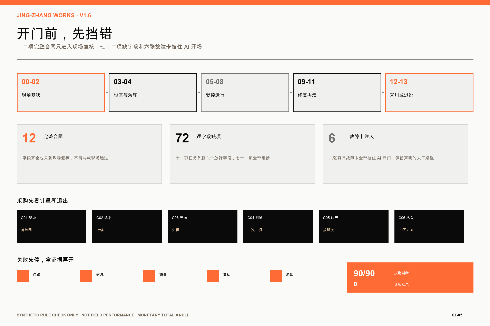
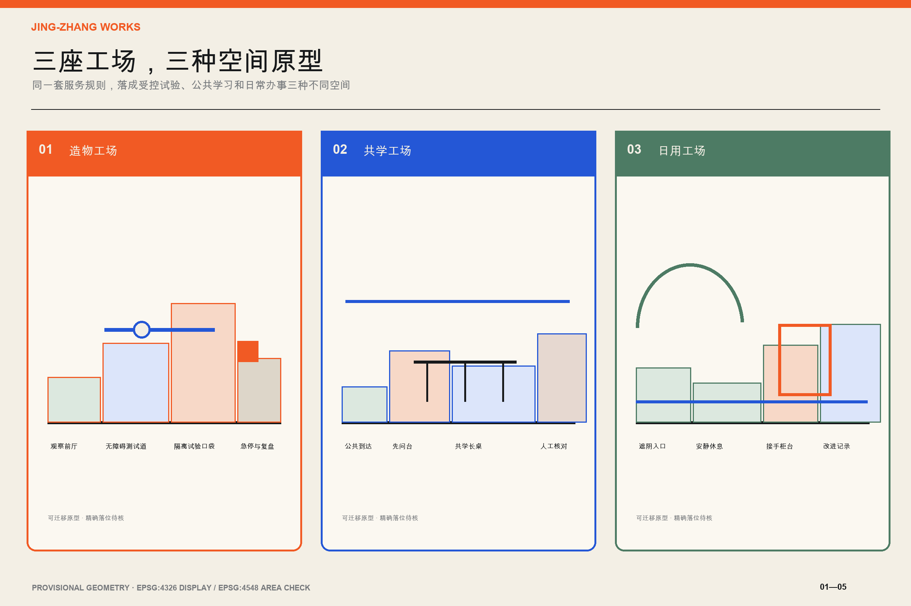
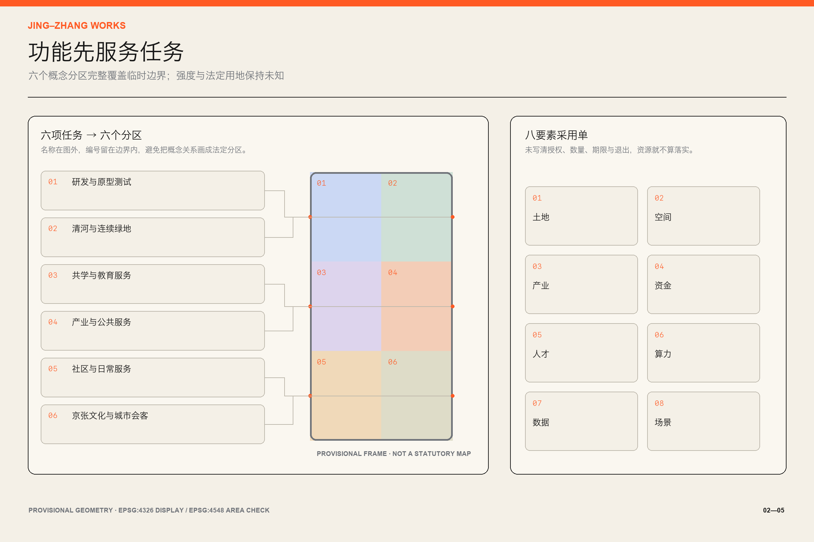
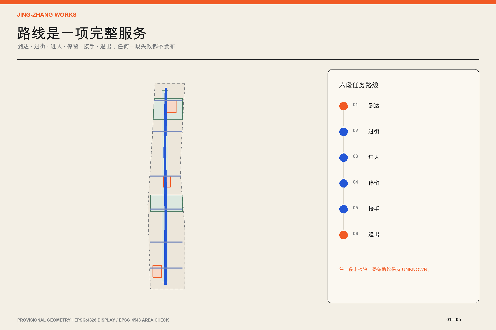
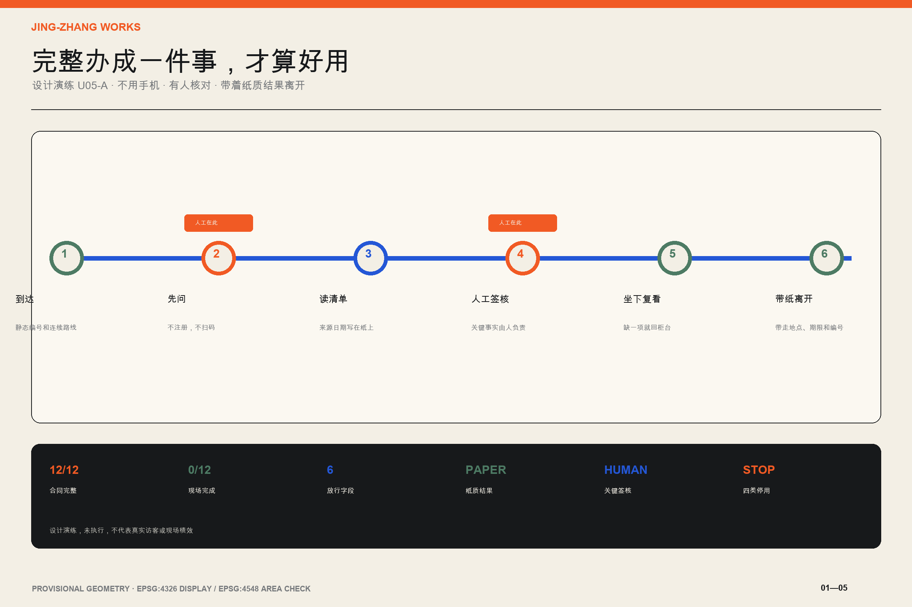

# 京张好用 / JING-ZHANG WORKS

> 城市先要好用，AI 才值得加入。
>
> Make the city work first; add AI only where it helps.

## 一页执行摘要 / Executive Brief

京张铁路曾经回答北京怎样抵达更远的地方。中关村随后回答知识怎样变成创新。到了 AI 时代，沿线还需要回答一个更朴素的问题，创新到了普通人的一天里，究竟好不好用。

本方案把约 11.4 平方公里总体设计范围视作一条公共服务试验走廊。北段众智园成为造物工场，负责把技术放进受控环境；中段 AI 原点成为共学工场，负责把知识、人才与公共服务接起来；南段大钟寺成为日用工场，负责让技术在通勤、休息、学习和办事中接受真实检验。两条服务链贯穿三处工场。“从实验到街道”让产品经过可用性、安全和退出测试后再进入公共空间。“从问题到改进”让居民遇到的障碍进入责任台账，并能看到谁在处理、何时复查、何时停用。[depth:overall_spatial_structure] [data:geometry/roads.geojson#ROAD-001]

方案的核心产品是“城市可用性编译器”。它不预测人，也不替政府作决定。它只检查一项服务能否被放行。责任主体、无 App 等价路径、最少数据规则、人工接手点、停止条件和验证指标六项中，只要缺一项，结果就保持 `unknown` 或 `blocked`。十二张场景卡已经用同一规则编译，结构完整不等于现场通过。没有踏勘和真实运行证据的绩效一律空置。[metric:scenario_ready_count] （假设 A-FIELD-001）

三个公共节点让这套规则在街上看得见。先问台让人无需注册就能问路和获得公共服务帮助。人工接手亭是 AI 失效时可见、可达、有人负责的接口。公开改进墙展示问题、责任人、截止时间、处理结果和停用记录。它们采用可移动、可撤回的原型，先验证到达、停留、接手和退出，再讨论永久工程。[standard:MOHURD-URBAN-DESIGN-MEASURES] [metric:public_node_count]

评审可以用一句话检验本方案。一个没有智能手机、看不清屏幕或第一次来到这里的人，能否到达、获得帮助、完成任务并安全离开。做不到这些，这项 AI 服务就不应上线。

这句话现在有了一张可以走的图。设计演练 U05-A 选了一件很普通的事。一个不用智能手机的老年访客，想查清办理一项公共服务需要哪些材料，下一步该去哪里。他沿静态编号来到共学工场，在先问台把事情说清。工作人员给他一张写有来源日期的纸质清单。AI 可以把公开说明改短一些，关键事实仍由柜台人员核对并签字。访客坐下来重看，少一项就回到柜台补问。离开时，他手里有材料清单、线下办理地点、信息到期日和问题编号。

六步里只要断掉一步，整项服务就不放行。路线被堵、来源过期或柜台无人时，工作人员先撤下 AI 服务，纸质和人工路径继续。U05-A 目前只是空间与服务设计演练。包内没有真实访客、现场记录或完成率。[source:V13-COMPLETE-TASK-RECEIPT]

九十天试点现在有了一本能拿去开会的开工账。六行成本对象分别是现场基线、纸质服务、可移动公共界面、受控测试、值守运行和永久工程。每一行都写明按什么计量，哪些费用会反复发生，谁确认范围以后才准询价，撤场和数据删除也放在同一笔采购里。金额仍为空，因为场地、开放时段、责任采购人和三家可比报价尚未成立。这个空白会阻止虚假的总投资，也给专业团队留下可以接着算的清单。[source:V11-IMPLEMENTATION-PLAYBOOK] [metric:startup_cost_line_count]

首日演练也补到五类停用情形。路线与生命安全、信息与网络、人员缺岗、隐私事件、供应商退出各有人工动作和重新开放证据。结构检查只能证明这些步骤已经写清，场地和人员签字之前仍然不能开场。[source:V12-DAY-ONE-DRILL] [metric:stop_drill_category_count]

字段写全以后，还要看看规则会不会真的挡错。开门前排演器为十二项任务各保留一份完整合同，再依次拿掉责任主体、无 App 路径、最少数据、人工接手、停止条件和验证指标，得到八十四个合同样例。六张首日故障卡另跑六次，总计九十次离线检查。完整样例最多只能进入现场复核，七十二个缺项样例和六个故障样例都必须挡住 AI 开门或退回纸质与人工服务。当前九十项预期判断全部相符，现场结果仍为零。这只能说明规则能挡住这些合成错误，不能说明任何路线、人员或服务已经在现场有效。[source:V16-PREOPENING-REHEARSAL] [metric:preopening_synthetic_case_count] [metric:preopening_expected_match_count]

规则还需要一间能被搭出来的房间。“好用服务间”把 U05-A 六步任务压进一处 6.0 米乘 4.8 米的试装范围。1.8 米普通通行带始终可以直接穿过。先问门槛先摆纸卡和服务状态，柜台做成 0.75 米与 1.05 米两种试装高度。结果台交付带来源和到期日的纸张，安静复核位预留 1.5 米回转范围，接手与改进墙放在出口前。这里的数字来自设计试装，尚未经过场地测量、无障碍、消防或疏散复核，不能写成合规尺寸。场地未授权，运营人也没有任命。[source:V17-WORKS-BAY] [metric:works_bay_design_area_sqm] [metric:works_bay_spatial_zone_count]

纸质结果不是一句口号。空白模板固定七栏，分别记录要办的事、公开来源和发布日期、材料清单、线下下一步、需要重查的日期、人工核对人与时间、问题编号。AI 可以从有日期的公开资料中提取候选字段，起草短句和双语版本，也可以提示缺项。它不能判断资格、补造来源、替工作人员签字或保存个人画像。来源、到期日、线下去向和人工签字少一项，柜台就不出单。当前模板没有填写任何真实公共服务答案，也没有真实签字或问题编号。[source:V13-COMPLETE-TASK-RECEIPT] [metric:paper_result_required_field_count]

这本 A3 手册也按独立评图重新排过。十六页各自回答一个问题，每页只承担一个判断，并同时给出直接证据和边界。中英文正文、首屏、六组核心图、A3 与 A0 另做十四组作者等义审计。审计能证明这些项目逐项核对过，不能代替独立译审或公众理解测试。[source:V17-JUROR-PATH] [source:V17-BILINGUAL-AUDIT] [metric:bilingual_audited_pair_count]

## 设计依据与资料清单

方案以正式公告和面向智能体任务书为任务依据，用仓库内资料登记表区分可用于正式提交的公开材料、仅供背景理解的材料和临时边界。公告给出的统筹研究范围约 43.6 平方公里，总体设计范围约 11.4 平方公里，三处重点区合计约 368.4 公顷。这些是公开标称规模。提交包中的 11,412,825.386 平方米来自临时 polygon 在 EPSG:4548 下的计算，只能用于本包拓扑校核，不能包装成法定精确面积。[source:OFFICIAL-ANNOUNCEMENT] [source:BOUNDARY-SOURCE] [metric:site_area_sqm]

当前仓库没有官方精确总体范围和三处重点区 polygon。`site_boundary.geojson` 与 `key_areas.geojson` 均保留 `official_boundary=false`、`geometry_role=provisional_constraint` 和 `boundary_precision=provisional_rough`。图面用淡色虚线表达这层限制。官方文件到位后，应整体重算用地、道路、绿地、公共空间、建筑基底、分期和全部面积指标，不能只替换一张底图。（假设 A-BOUNDARY-001） [depth:metrics_recalculation]

公开 Issue #1029 指出，大钟寺临时重点区可能与实际站点关系错位。本方案把该范围当作可迁移设计容器，不据此声称站口、道路或地块的精确关系。未来半日踏勘中的手机 GPS 只登记为 `field_observation`，用于描述一条任务路线是否连续，也不承担证明官方边界的职责。[source:REPO-ISSUE-1029] （假设 A-DAZHONGSI-001）

六个外部案例提供方法，不提供可复制的图纸。新加坡榜鹅数字园区提示我们把产业、教育、社区与开放测试平台放进同一运营结构。丰田 Woven City 提示真实使用者应进入长期反馈回路。赫尔辛基 Kalasatama 证明短周期、真实城市环境中的敏捷试点可以先积累共同认识。首尔麻谷 Living Lab 把视障出行、配送机器人和数字孪生消防纳入居民与专家共同验证。巴塞罗那 Superblock 把街道舒适、可达、日常服务和公众权利放进同一宜居指标。巴黎城市试验项目强调真实环境测试、定制评估和成功后再扩展。[source:CASE-PUNGGOL] [source:CASE-KALASATAMA] [source:CASE-MAGOK]

所有来源的发布者、用途和限制登记在 `sources.json`。借鉴其他参赛方案的部分单列在 `visual/assets/peer_influence_ledger.json`。我们学习可逆试点、责任矩阵和非 AI 备份机制，但重新设计叙事、字段、空间原型、图件和验证脚本，不复制文字、数据结构或视觉资产。[source:PEER-INFLUENCE-LEDGER] [depth:risk_missing_data]

## 三层范围工作框架

统筹研究范围处理产业与未来城市关系。它不新增边界图形，而是用“三区两翼”组织资源流。三处重点区分别承担造物、共学和日用环节。中关村科技服务翼提供知识产权、资本与全球要素服务，小月河场景翼提供城市问题、居民反馈和实际运行环境。资源从技术验证进入街道，再从公共问题回流研发，形成一个能纠错的循环。[source:AGENT-TASKBOOK] [standard:PROJECT-AGENT-OPEN-CALL-TASKBOOK]

总体设计范围处理城市系统。概念用地完整覆盖临时边界，并以产业研发、公共服务、生活配套、文化教育、绿地与交通六类功能形成南北连续结构。沿京张遗址公园设置步行与公共服务主链，横向用六条任务连接缝合园区、校园、社区和轨道候选入口。所有线位都属于概念建议，正式道路红线、轨道保护范围和市政条件仍待专业资料确认。[data:geometry/land_use.geojson#LU-001] [depth:land_use_layout]

重点区域范围处理可以被运营和复查的原型。每处都给出功能组合、建筑更新方法、慢行序列、公共空间节点、AI 场景、责任主体与停止条件。临时 polygon 只帮助检查三处方案是否有空间承载，不支持精确选址或开发量判断。[data:geometry/key_areas.geojson#PROV-KEY-001] [metric:key_area_count]

三层成果通过同一证据链相接。统筹层提出需要验证的城市任务，总体层分配空间与服务网络，重点区把任务做成可逆原型，运行结果再进入公开改进墙。任何专业条件缺失都会在 `assumptions.json` 保留，不由模型补齐。[depth:three_level_scope_framework] （假设 A-CONTROLS-001）

任务书中的三大定位在这里各有一项可检查的城市动作。百年京张文化带把铁路工作单、编号和维护记录变成公共导视。都市 AI 生活体验带用八项日常任务检查无 App 路径与人工接手。AI 融合创新带让四项产业测试经过受控试验再进入街道。五大功能也逐项落到空间、责任和证据中。[source:V11-TASKBOOK-CROSSWALK] [standard:PROJECT-AGENT-OPEN-CALL-TASKBOOK]

| 五大功能 | 主要承载 | 本方案的可检查动作 |
| --- | --- | --- |
| AI 全栈自主创新体系 | 众智园造物工场 | 受控测试、实体急停和失败复盘 |
| 世界级 AI 创新生态 | AI 原点与中关村科技服务翼 | 八要素资源单和问题到采用流程 |
| AI+ 场景应用新方式 | 小月河场景翼 | 八项公共任务与四项产业测试 |
| 智能化 AI 活力城市 | 大钟寺日用工场 | 通勤、休息、学习和办事的完整任务路线 |
| AI 治理全球话语权 | 三处工场共用协议 | 六字段放行、公开改进与退役记录 |

区域合作只传递经过脱敏的任务模式、测试协议和版本化服务标准，不搬运个人记录或企业受限资料。北纬社区提供社区服务问题和复盘经验，未来科学城连接科研原型与测试方法，怀柔科学城连接科学设施应用与公共理解，经开区连接制造验证和规模化工程经验，京津冀网络承接可移植的双语服务标准。以上均为建议关系，不表示任何机构已经参与、出资或承诺采用。[source:V11-REGIONAL-COLLABORATION]

## 统筹研究范围产业与未来城市研究

品牌名称“京张好用”是一句公共判断，也是一套工作方法。标志以两条铁路平行线和一枚橙色验收章构成。平行线代表 AI 路径与无 App 路径必须同时存在，验收章中的缺口代表服务可以暂停和撤回。暖白、煤黑、信号橙与钴蓝来自铁路工作单和公共服务手册的视觉经验。品牌图形、地图与信息结构均为原创，不使用企业商标。A3 文册和 A0 展板中的 16 张外部照片只作为历史、城市气质和服务做法参考，逐张登记作者、许可与原始页面，不作为项目现场证据。（假设 A-BRAND-001） [source:V14-PHOTO-CREDITS] [standard:PROJECT-AGENT-OPEN-CALL-TASKBOOK]

产业生态按“问题、验证、采用、维护”组织。高校和研究机构提出方法，企业完成产品化，造物工场提供隔离测试，场景翼提供真实任务，科技服务翼处理知识产权、法务和资本，公共运营单位决定是否采用。采用之后，每项服务仍要保留具名维护者、人工旁路和公开退役记录。创新密度由问题关闭率、人工接手时效和失败后恢复能力衡量，展厅数量不算结果。[metric:service_chain_count] [depth:overall_spatial_structure]

八类资源使用同一张采用单。土地必须有授权和撤场条件，空间按共享时段和安全边界开放，产业团队提交测试件但不自动取得上线权。资金先用 S/M/L 资源等级比较，金额等待责任主体测算。人才由学生、专业人员、运营者和当事人共同组成。算力优先离线、低功耗和可降级方案。数据保留最少字段和到期删除。场景从真实任务出发，每项产业测试至少服务一项公共任务。任何资源没有登记授权、数量、期限和退出条件，都不算已经落实。[source:V11-ECOSYSTEM-RESOURCE-MAP]

六个案例被转化为六条本地规则。榜鹅启发跨机构共享底座，但本方案只共享最少的公共任务字段。Woven City 启发持续反馈，但参与者可以匿名退出。Kalasatama 启发短周期试点，因此首轮限定九十天。麻谷启发把产业测试与日常障碍并置，因此四个技术测试必须服务至少一个公共任务。巴塞罗那启发以步行舒适和公共权利校验空间，因此无障碍、遮阴与休息纳入任务链。巴黎启发先评估再扩展，因此没有公开复盘的试点不得复制到下一处。[source:CASE-WOVEN-CITY] [source:CASE-BARCELONA] [source:CASE-PARIS-URBANLAB]

年度运营概念采用“春季问题开单、夏季街道测试、秋季公开复盘、冬季维护归档”的节奏。活动品牌为“京张好用周”。它不颁发模糊的创新大奖，只发布通过、待改、停用三类记录。国际访客看到的是双语任务卡、路线与证据，而不是只面向镜头的演示。活动是否举办、由谁主办和经费来源均待授权与专业深化。[metric:annual_cycle_count] （假设 A-OPERATIONS-001）

## 总体设计范围城市更新与控规深度城市设计

总体结构是一条公共服务脊柱、三座工场、六条横向连接和两条资源回路。服务脊柱优先利用京张遗址公园及其邻接公共空间的连续性，承载步行、休息、问路和公开改进记录。横向连接针对“到达后仍进不去”的问题，逐条检查过街、坡道、门槛、照明、树荫、座椅和人工帮助。图层表达方向与关系，不把临时 polygon 的边缘画成设计主角。[data:geometry/roads.geojson#ROAD-001] [data:geometry/public_space.geojson#PUBLIC-001]

“完整任务回执”是本方案独有的验收单位。总图把一件事从到达、问清、核对、复看直到带着结果离开画成连续空间。造物工场先检查工具和安全，共学工场负责说清信息并完成人工签核，日用工场检验这套服务能否进入普通的一天。这套机制让空间、服务和 AI 共用一张回执，记录负责人、纸质路径、来源日期、停止原因和修复结果。少一段，整项服务就不放行。[source:V13-COMPLETE-TASK-RECEIPT]

更新采取先盘点、再轻量试点、后专业工程的顺序。现有建筑先按共享时段、适应性改造候选、待核验三类登记。具备公共入口和基本安全条件的空间可先通过可移动桌台、导视、遮阴、照明和临时电源验证需求。涉及结构、消防、文保、市政、道路和永久景观的动作，只能在权属和专业条件到位后深化。[standard:MOHURD-CONTROL-DETAILED-PLANNING] [depth:retain_renovate_demolish]

概念用地由六个闭合分区组成，完整覆盖临时总体边界且无未解释缝隙或重叠。研发与产业服务集中在北中段，公共服务与文化教育靠近共学工场，生活配套和城市服务在南段形成日用界面，绿地与交通空间支撑连续慢行。该分区说明功能关系，不替代现状用地或法定用地分类。[data:geometry/land_use.geojson#LU-001] [metric:land_use_coverage_ratio]

开发强度、建筑高度、道路红线、建筑退线、停车规模和市政容量均保持 `unknown`。建筑图层只表达可供专业团队研究的概念基底和首层公共界面，不代表现状测绘、拆除决定或获批建设量。正式控规、权属、现状建筑测绘和工程资料到位后，应重新判断保留、改造与新建，并复算所有规模指标。[metric:floor_area_ratio] （假设 A-CONTROLS-001）

## 重点区域详细设计

三处重点区共用一套可用性协议，但各自承担不同任务。每处都有一个无需注册的公开入口、一个受控试验界面、一个人工接手点和一份可见的改进记录。具体位置、面积和尺寸须在官方 polygon 与现场测绘到位后由专业团队重新选择。[data:geometry/key_areas.geojson#PROV-KEY-001] [depth:three_key_area_detailed_design]

**众智园造物工场 / Prototype Works。** 这里把技术带入公共空间之前的问题暴露出来。空间序列由公开问题前厅、无障碍测试道、可围合设备区、人工急停台和失败复盘室组成。服务机器人必须完成轮椅并行、盲杖识别、低位交互、断网和人工拖离测试。末端配送只能在封闭区运行，越界、无法停车或人工值守离线即停止。清河界面优先作为遮阴慢行与低碳展示候选，防洪和生态条件未核实前不设置永久设施。（假设 A-TEST-001） [data:geometry/buildings.geojson#BLDG-001]

**AI 原点共学工场 / Learning Works。** 这里处理第一次来到海淀的人最容易遇到的信息门槛。先问台提供纸质与人工入口，多语导向只检索有来源和更新时间的公共信息。青少年夜间学习设置具名值守、安静区、接送等待和明确闭馆时间。老年公共服务保留电话、纸表和柜台等价路径，不以扫码和人脸作为进入条件。原点附近的建筑更新优先研究首层共享、可见楼梯和夜间安全界面。[source:ELDERLY-SMART-TECH-POLICY] （假设 A-ACCESS-001）

**大钟寺日用工场 / Everyday Works。** 这里把 AI 放进通勤、商业、休息与文化理解等日常任务中。人工接手亭与安静休息点构成服务前场，公开改进墙位于不阻塞通行的位置。拥挤时段通行场景只用聚合计数，不做人脸识别或个体轨迹。文化导览只使用可追溯公开资料，并由文化专业人员签核。临时重点区疑似错位，因此站口、四象限和具体道路关系全部待核实，原型须能够迁移。[source:REPO-ISSUE-1029] （假设 A-DAZHONGSI-001）

三处原型的建筑策略均从“少动也能验证”开始。可移动组件负责第一轮，首层适应性改造负责第二轮，永久建设只在运营证据、公众反馈和专业条件共同支持时进入研究。任何一处若无具名运营者、无障碍连续路线或安全退出，均不得开场。[metric:public_node_count] [depth:height_massing_character]

共学工场先深化一间“好用服务间”。它利用既有首层公共前厅，不预设新建筑。6.0 米乘 4.8 米的试装范围分成普通通行、先问门槛、双高度柜台、纸质结果、安静复核、接手与改进六段。人工服务具备时可以只开人工模式。六字段合同和开门前检查同时通过后，AI 才能有限加入。断网、模型或供应商出问题时退回人工模式；路线、人员、安全、隐私或关键信息出问题时整间关闭恢复。任何重新开放都要重新走通纸质任务并核对改进记录。[source:V17-WORKS-BAY]

这间房目前只有图纸和责任接口。场地授权、实测平面、无障碍与消防疏散复核、信息责任人、值守班次、数据审查和撤场办法，八项少一项都不进入安装。建议责任角色也保持待确认，方案没有替任何机构任命运营者。[source:V17-WORKS-BAY] （假设 A-ACCESS-001）

组件库把原型拆成六件可以单独安装、检查和撤走的工具。C01 先问台提供纸图、人工问路和问题登记。C02 人工接手亭设置可见标记、无障碍柜台、实体停止和离线联系人。C03 公开改进墙显示任务编号、负责人、期限、结果与退役记录。C04 无障碍测试道服务受控设备测试。C05 任务路线标记把纸图、编号和接手方向接起来。C06 安静休息点记录座椅、遮阴、安静和人工帮助状态。展示体系称为“好用记录”，只发布有证据通过、到期修改和已经退役三种状态，不颁发缺少证据的创新荣誉。[source:V11-COMPONENT-LIBRARY]

## AI 创新生态、人才画像与 AI+ 场景

人物画像按要完成的任务划分，不建立永久个人档案。八类使用者包括无智能手机老人、轮椅使用者、低视力访客、儿童与照护者、附近居民、学生创客、创业测试团队和国际访客。同一个人可以在不同任务中切换角色。系统不推断健康、收入、情绪或社会关系，也不按“价值”给人排序。[source:BARRIER-FREE-LAW] （假设 A-DATA-001）

十二个场景使用同一六字段放行规则。表中的“准备就绪”只表示字段完整、可进入下一轮专业和现场核验，不表示真实绩效已经发生。实际观察、步行耗时、可达连续性和照片均为空，等待协作者按 `visual/assets/field_observations.json` 的半日协议采集。[metric:scenario_ready_count] （假设 A-FIELD-001）

| ID | 公共任务或产业测试 | AI 的有限作用 | 无 AI 等价路径 | 责任与停止条件 |
| --- | --- | --- | --- | --- |
| U01 | 无障碍到达 | 在已核验路线中解释坡道、路面和入口信息 | 纸质路线卡加人工带路 | 公共空间运营方负责；任一连续通路中断即撤下路线 |
| U02 | 多语导向 | 检索有来源和日期的公共信息并生成双语草稿 | 双语标牌、纸图和人工翻译 | 公共服务台负责；来源过期或关键误译即转人工 |
| U03 | 遮阴休息路线 | 按实测遮阴、座椅和饮水点组合候选路线 | 现场导视和人工推荐 | 公园运营方负责；高温预警或点位失效即停用 |
| U04 | 青少年夜间学习 | 只整理公开时段、余位与活动说明 | 现场登记和电话查询 | 场地方具名值守；无安全接送或超容量即闭场 |
| U05 | 老年公共服务 | 把办事要求转成短步骤并提示材料 | 电话、纸表和人工柜台 | 公共服务单位负责；政策过期或个案判断即接手 |
| U06 | 视听障碍辅助 | 输出高对比文本、语音和字幕草稿 | 触觉导视、人工讲解和手语服务 | 无障碍专员负责；任一通道不可用即停止自动发布 |
| U07 | 就业与活动信息 | 聚合已授权公开岗位和活动 | 公告栏、电话和现场咨询 | 发布方维护；过期、歧视或来源不明即下线 |
| U08 | 拥挤时段通行 | 用匿名聚合计数提示分流 | 人工疏导和静态绕行牌 | 现场安全负责人决定；遮挡、误报或疏散受阻即停用 |
| T01 | 服务机器人无障碍测试 | 记录障碍、停止和恢复日志 | 人工测试员完整执行同一路径 | 测试主管负责；接近人员、越界或急停失败即终止 |
| T02 | 封闭区末端配送 | 在封闭测试区规划低速路线 | 人工手推配送 | 场地方与测试方双签；失联、越界或人工接手失败即终止 |
| T03 | 隐私保护传感器校准 | 比较聚合计数与人工抽样 | 人工计数表 | 数据保护负责人负责；出现可识别数据即删除并停测 |
| T04 | 数字孪生应急演练 | 用合成数据推演疏散和资源调度 | 桌面推演与纸质预案 | 应急专业人员负责；模型与预案冲突时以人工指挥为准 |

城市可用性编译器读取 `visual/assets/task_journeys.json`。六项字段全部存在时输出 `ready_for_field_review`，缺失时输出具体原因，不会生成默认责任人或替代数据。编译结果写入 `visual/assets/usability-readiness.json`，输入哈希和版本写入同一文件，便于复演。它是责任完整性检查器，不是合规认证器。[source:USABILITY-COMPILER] [metric:compiler_required_field_count]

`visual/assets/run_preopening_rehearsal.js` 继续做反向检查。每项任务先跑完整版本，再逐项删掉六个放行字段；六张故障卡则在开门前注入。脚本要求缺项和故障全部阻断 AI 开场，也要求所有 `field_result` 保持空值。结果连同两份输入哈希写入 `visual/assets/preopening-rehearsal.json`。这是一组可复演的合成规则测试，不是居民参与、专业审查或现场验收。[source:V16-PREOPENING-REHEARSAL] [metric:preopening_missing_case_blocked_count] [metric:preopening_fault_case_blocked_count]

数据规则遵循最少、短期、可删除。路线服务不保存精确个人轨迹，公共信息服务不保存提问者身份，拥挤管理不使用人脸，测试场景只使用合成或明确授权数据。每个场景都有人工复核与投诉路径，拒绝 AI 不影响获得等价服务。[standard:GENAI-INTERIM-MEASURES] （假设 A-DATA-001）

## 用地、建筑规模与拆改留方案

用地分区以本包临时边界为计算容器，采用 0802 科研、05 商业服务、0702 社区服务、0804 教育、0803 文化和 1401 公园绿地等概念类别。六个 polygon 通过共同切分边界生成，在 EPSG:4548 下校核覆盖率。它们表达功能优先级，不能替代法定用地或现状调查。[standard:MNR-LAND-USE-CLASSIFICATION-GUIDE] [metric:land_use_coverage_ratio]

建筑基底只表达十二个可供研究的空间原型，包含共享首层、轻量测试棚、学习客厅和公共服务前场。每个 feature 都标明 `geometry_role=design_proposal` 与中等或低置信度。由于缺少现状测绘、权属、结构、消防和文保资料，具体“保留、改造、拆除、新建”均不下结论。专业团队应先把正式建筑现状与概念基底叠合，再按安全、碳排、公共性和运营需求作逐栋判断。[data:geometry/buildings.geojson#BLDG-001] （假设 A-BUILDING-001）

本包可以复算概念建筑基底面积，但该数值只说明设计图层的图形规模，不等于总建筑面积或获批开发量。开发强度和建筑高度保持 `unknown`，总建筑规模与停车指标也未填写。图件不会用高楼效果图制造已确定的开发强度。[metric:building_footprint_area_sqm] [metric:floor_area_ratio]

风貌采用“铁路工作单 × 公共服务手册”的克制语言。既有工业与铁路记忆通过尺度、线性构件、编号和耐久材料延续，新增组件强调可读、可维护和可替换。橙色只标示需要行动或人工接手的位置，钴蓝用于可信公共信息，避免把整条走廊变成科技展陈背景。[depth:height_massing_character] （假设 A-HERITAGE-001）

## 交通、轨道、市政与公共服务设施

交通策略从六条短任务路线开始，逐条检查到达、过街、进入、停留、接手和退出。南北服务脊柱只表达连续慢行意图，横向连接只表达园区、校园、社区与轨道候选入口之间需要修补的关系。正式道路红线、路口信号、轨道保护区和站口状态到位前，不给出精确线位和工程尺寸。[data:geometry/roads.geojson#ROAD-001] [depth:traffic_rail_slow_parking]

无障碍路线必须是连续服务。坡道合格而入口上锁，或室外可达而柜台无法使用，都算失败。每条发布路线须由轮椅同行者或无障碍专业人员、场地运营者与安全人员共同走完。手机没电时仍可依靠高对比纸图、编号节点和先问台完成同一任务。[source:BARRIER-FREE-LAW] [metric:route_candidate_count]

停车与非机动车采用边缘换乘、短停装卸和清晰分流的概念建议。机器人和配送测试不得占用连续无障碍通道。拥挤时段先用人工观察和临时隔离验证，再讨论匿名传感。任何设备都必须有断电后仍可理解的静态标识和人工接管方案。（假设 A-TRAFFIC-001） [source:CASE-MAGOK]

市政与新型基础设施采用轻量、可逆接口。先问台和接手亭优先使用低功耗设备、离线内容和可更换电池，网络断开时降级为人工与纸质服务。传感器只输出任务所需的聚合数据，不将视频或音频原始流长期留存。电力、通信、排水、防洪、消防和垃圾清运容量都须专项核实。[depth:municipal_new_infrastructure] （假设 A-UTILITIES-001）

公共服务设施以三个节点形成基本网络，再与既有公共服务主体接续。先问台负责第一次提问，接手亭负责故障与复杂个案，改进墙负责跟进反馈。三者可以共址，也可以分开，但责任关系必须对公众清楚。[metric:public_node_count] [data:geometry/public_space.geojson#PUBLIC-001]

## 蓝绿空间、公共空间与城市风貌

京张遗址公园是公共服务脊柱的优先候选，不被当作科技设备展廊。绿地先解决遮阴、休息、饮水、夜间照明、安静和连续通行，再承载低侵入测试。清河与小月河相关空间必须等待防洪、生态和河道管理条件，概念绿地 polygon 只表达连接意图。[data:geometry/green_space.geojson#GREEN-001] [depth:blue_green_public_space]

三个标志性节点都以普通人的动作命名。先问台回答“我该往哪走”。人工接手亭回答“系统不管用时谁来”。公开改进墙回答“我说的问题后来怎样了”。节点不追求巨构和屏幕密度。坐下是否舒适、字能否看清、轮椅能否并行、工作人员能否找到，才是设计验收内容。[metric:public_node_count] （假设 A-ACCESS-001）

文化叙事沿时间展开。京张铁路解决如何抵达，中关村解决如何创新，AI 时代继续追问创新是否真正好用。历史内容只引用可核验材料，站点故事由文化专业人员复核。铁路编号、工作单、时间戳与维护记录进入导视系统，让“改进”成为可以被看见的城市文化。（假设 A-HERITAGE-001） [standard:MOHURD-URBAN-DESIGN-MEASURES]

公共空间中的 AI 设备不得遮挡遗产界面、无障碍路线和安全视线。夜间活动设置照明、噪声和闭场条件。若居民投诉、无障碍路线受阻或人工值守缺席，运营者应先暂停活动，再公开复查，而不是等待算法自行恢复。[source:PUBLIC-CHANGE-LOG] [depth:risk_missing_data]

## 更新项目清单、实施政策与分期计划

近期九十天只做可逆试点。工作包括完成十二个观察点和六条任务路线的踏勘，选择一处已授权室内外接口，安装临时先问台与接手标识，运行两项公共服务和一项产业测试，按周公开问题与修复。若无障碍、安全、隐私或责任主体任一条件不成立，试点停止并撤场。[metric:pilot_duration_days] [data:geometry/phasing.geojson#PHASE-001]

中期一至三年根据试点证据研究首层共享、慢行断点修补、遮阴休息网络和三处工场的长期运营。每项工程都应有正式选址、权属、投资、专业设计与公众沟通。没有通过九十天运行验证的组件不进入复制清单。[depth:phasing_implementation] （假设 A-DELIVERY-001）

长期三至五年形成跨片区服务标准。采用统一六字段合同、双语导视、人工接手等级和公开退役记录，但允许三处工场按使用者和运营条件调整空间。标准只规定责任与底线，不规定供应商和技术路线。[source:USABILITY-COMPILER] [metric:service_chain_count]

| 阶段 | 项目包 | 牵头角色 | 放行证据 | 停止或回退 |
| --- | --- | --- | --- | --- |
| P0 现场基线 | 12 点观察、6 条短路线、照片与限制 | 独立踏勘协作者 | GPS、时间、连续性和可识别限制 | 无真实记录则所有现场绩效保持未知 |
| P1 九十天试点 | 先问台、接手亭、改进墙与三个场景 | 获授权场地运营者 | 每周问题单、人工接手日志、无 App 成功率 | 严重安全或隐私事件立即停用 |
| P2 适应性更新 | 首层共享、遮阴休息和慢行修补 | 规划、建筑、交通与运营团队 | 正式测绘、权属、消防与公众复核 | 条件不完整退回临时组件 |
| P3 走廊标准 | 三工场服务协议与年度好用周 | 跨主体治理小组候选 | 独立评估、公开采用或退役决定 | 连续两期未达阈值则缩减或终止 |

九十天被拆成五道闸门。第 0 至 2 周完成现场基线、角色签字和风险登记。第 3 至 4 周安装先问台、接手标记、纸质路线和改进墙，并做人员演练。第 5 至 8 周运行两项公共服务与一项产业测试。第 9 至 11 周修复重复障碍，再走一遍失败任务。第 12 至 13 周逐项作出采用、修改或退役决定。S 级资源包括标识、纸质服务、既有家具和人员时段，M 级资源包括可移动亭、受控测试道、临时电源与专业复核，L 级资源只用于需要正式立项的永久工程。本包不填写未经授权的金额。[source:V11-IMPLEMENTATION-PLAYBOOK]

开工账先算计量方法，再进入报价。现场基线按六条完整路线和十二个定点观察计量。纸质服务按实际开放的入口、柜台和出口计量。可移动界面以一个获授权试点场地为单位，优先租用或改造现成物件。受控测试一次只放一个产业测试进入窗口。值守成本按开放班次计算，每班必须有具名接手人和独立复演时段。永久建设在九十天内计为零，待正式项目另行测绘、设计、审批和投资决策。[source:V11-IMPLEMENTATION-PLAYBOOK] [metric:startup_cost_line_count]

| 开工成本行 | 数量怎样确定 | 一次投入或持续成本 | 允许询价的前置证据 |
| --- | --- | --- | --- |
| C01 现场基线 | 六条任务路线加十二个定点观察 | 一次投入 | 路线清单、隐私边界、证据验收单 |
| C02 纸质服务 | 每个开放入口、柜台和出口各一套 | 持续成本 | 信息责任人、到期规则、印制规格 |
| C03 可移动公共界面 | 一个试点场地一套 | 一次投入 | 场地授权、无障碍实测、消防复核、撤场办法 |
| C04 受控测试窗口 | 同一时段只容纳一项产业测试 | 一次投入 | 测试边界、具名接手、实体急停、恢复押金 |
| C05 值守运行 | 每个开放班次一名接手人，另留独立复演时段 | 持续成本 | 班表、替岗人员、劳动规则、停用权 |
| C06 永久工程 | 九十天内为零 | 正式项目成本 | 官方边界、权属、批准任务书、投资决策、专业设计 |

采购顺序很朴素。先租、先改现成物件，随后才讨论定制购买。人工服务和独立复核先于智能屏幕。安装报价必须同时带上拆除、数据删除和场地复原。只要运营人或持续经费缺席，采购就停在纸面。[source:V11-IMPLEMENTATION-PLAYBOOK]

责任矩阵把场地授权交给产权或公共空间运营主体，把服务放行交给服务责任方，把现场接手交给具名值守人员，把停止和退役交给安全负责人或服务责任方。规划、消防、无障碍、数据保护和专业评审按事项参与复核。服务发布后仍要满足四项设计目标。人工接手点必须可见，严重安全或隐私事件立即停用，公共信息必须带来源和到期日，每条公开路线必须完成无 App 全程复演。这些是试点门槛，目前没有实测达成率。[source:V11-IMPLEMENTATION-PLAYBOOK]

开发者社区围绕公开问题单工作。团队先选择一个公共任务，提交六字段合同和合成测试件，通过受控测试后才进入真实任务复核。采用路径依次经过问题开单、合同完整、现场基线、受控试点、独立复演、授权采用、维护复查和退役或续期。国际访客可以读取双语任务卡和版本记录，复制的是测试方法与服务标准，不是未经验证的成功宣传。[source:V11-IMPLEMENTATION-PLAYBOOK]

### 试点第一天怎样过

开门前一小时，试点经理先把当天开放的路线完整走一遍。入口被车辆占住、纸图指向一道锁着的门，或人工接手点没有人，都会让当天的相关服务保持关闭。值守人员随后用纸质材料完成一次任务，再拨通离线联系人并按下实体停止装置。任何一步走不通，AI 服务当天不上线，人工服务仍可保留。

开门前十分钟，服务责任方和现场人员一起读出信息来源日期、到期时间、当天使用的最少字段以及停止规则。这张签字单是开场凭证。两小时后，无障碍复核人员再走一遍无 App 路线。路线一旦中断，现场先撤下发布信息，修好以后重新走完，不让后来的人继续踩同一个坑。

下午安排一次事先说明的故障演练，不拿不知情的访客试错。断网时，工作人员切回纸图和人工服务。双语信息出现关键误译时，先遮住错误内容，再从有日期的公开来源核对。无障碍路线或疏散通道被占用时，安全负责人立即停止受影响的服务。关场以后，试点经理核对问题记录，删除到期测试数据，并把当天状态写成继续开放、只留人工、修复后复演或退役四种结果之一。[source:V12-DAY-ONE-DRILL]

| 停用演练 | 现场先做什么 | 重新开放要拿出什么 |
| --- | --- | --- |
| 路线与生命安全 | 停掉受影响服务，保留有人带路 | 安全与无障碍复核人员共同签字的完整路线复演 |
| 信息与网络 | 遮住错误信息，切回带日期的纸质服务 | 公开来源核对记录和纸质任务成功复演 |
| 人员缺岗 | 智能服务不开，只有合格替岗到位后才保留人工服务 | 正班与替岗人员都能独立完成整项人工任务 |
| 隐私事件 | 停止处理，隔离记录，按批准路径删除并复盘 | 影响范围、删除结果、改正动作和独立数据复核 |
| 供应商退出 | 断开依赖，导出获准公开的记录，恢复普通服务并撤场 | 记录可带走、数据可删除、场地已复原、普通服务走通 |

这份首日演练现在仍是一套待执行的工作程序。场地、日期、具名人员、预算和许可全部留空。它能说明开场和关停需要哪些动作，不能证明任何演练已经发生。[source:V12-DAY-ONE-DRILL]

政策建议集中在三件可执行的小事。公共空间开放要附带责任与退出条款，场景采购要允许人工旁路和数据删除，运营评价要统计失败与修复而不只统计客流。所有实施主体、资金与活动安排均为概念建议，等待政府、产权方和专业团队决定。[depth:renewal_project_list] （假设 A-OPERATIONS-001）

## 指标体系、面积复算与合规矩阵

指标分为图形复算、任务准备度和现场绩效三层。图形复算由 EPSG:4548 计算临时边界、概念建筑基底、绿地与公共空间面积。任务准备度由编译器检查六字段完整性。现场绩效需要真实踏勘或试点，目前全部保持 `unknown`。三层数值不得混用。[metric:site_area_sqm] [metric:scenario_ready_count] （假设 A-FIELD-001）

临时边界计算面积为 11,412,825.386 平方米，来源与公告约 11.4 平方公里的标称规模相近，但精度含义不同。用地覆盖率应为 1.0，说明概念分区没有拓扑缺口。绿地率和公共空间率只反映本包概念图层，便于比较方案内部取舍，不是法定控制指标。[metric:land_use_coverage_ratio] [metric:green_ratio] [metric:public_space_ratio]

十二个场景均具备责任、无 App 路径、数据规则、人工接手、停止条件和验证指标，因此结构准备度为 12/12。该结果只证明任务合同写完整。现场路线成功率、人工接手时间、无 App 完成率、投诉关闭率和高温舒适度没有实测值，仍为未知。[metric:scenario_ready_count] [metric:field_observation_count]

核心公共利益指标包括无 App 等价路径覆盖率、人工接手可见率、问题按期关闭率、路线连续通过率和停用记录公开率。首轮目标是每项服务都有等价路径，每个现场点都能找到接手人，每个严重问题都能触发停用。数值目标是设计门槛，真实结果要由独立记录证明。[source:PUBLIC-CHANGE-LOG] [depth:metrics_recalculation]

`compliance_matrix.json` 对公告全部必选条款建立章节、图层、图纸、指标、来源、假设和自检映射。`standard_matrix.json` 记录正式标准的响应位置。`design_depth_matrix.json` 说明控规深度和综合实施方案深度如何被证据支撑。三份矩阵供机器复核，正文保留评审真正需要理解的判断。[standard:PROJECT-OFFICIAL-ANNOUNCEMENT] [depth:existing_conditions_diagnosis]

`reviewer_evidence_index.json` 留在结构化附件中，不再承担方案叙事。正文和图件先说明人怎样完成任务，索引只在需要核对来源时提供路径。它不替评审打分，也不会把概括当成新的事实。[source:V12-REVIEWER-EVIDENCE-INDEX]

双语等义由一份作者审计台账逐项记录。十四组配对覆盖正文关键章节、离线首屏、六组核心图、十六页 A3 和三页 A0，核对主张、数字、单位、图题、图例、证据边界与图位。作者已经逐项核完十四组，独立人工译审仍未完成，不能用 14/14 替代译者或目标读者的判断。[source:V17-BILINGUAL-AUDIT] [metric:bilingual_audited_pair_count]

## 风险、版权与合规说明

首要风险是临时边界。所有空间结论保持概念层级，并设置官方 geometry 到位后的整体重算路径。第二类风险是现场证据缺失。当前文件只提供踏勘协议，不填写时间、照片和步行结果。第三类风险是 AI 伤害，包括误导、歧视、隐私泄露和自动化责任漂移。六字段合同把人工接手与停止条件作为上线前置项。（假设 A-BOUNDARY-001） （假设 A-FIELD-001）

无障碍服务接受专业与当事人共同复核。涉及老年人、儿童、健康、就业和安全的场景，AI 只解释公开信息或组织合成数据，不作诊断、资格判断、执法或应急指挥。生成式人工智能相关规则只在适用范围内引用，不把一份互联网服务规范夸大为所有城市设备的完整许可。[standard:GENAI-INTERIM-MEASURES] [source:BARRIER-FREE-LAW]

文本、数据结构、程序图件、HTML 与 PDF 由本次参赛工作原创生成。外部案例只做摘要与方法比较，并链接一手公开页面。其他参赛方案的影响逐条披露。字体使用系统可用字体与 PDF 内置 CID 字体，许可和生成工具记录在 `report/copyright_statement.md`。仓库外图片、地图瓦片、远程字体、CDN、追踪脚本、表单和 API 均未使用。[source:COPYRIGHT-STATEMENT] [source:PEER-INFLUENCE-LEDGER]

本方案不声称获得政府批准、实施承诺或专业认证。所有建筑、交通、市政、文保、消防、投资和运营建议都须由有资质团队与相应责任主体深化。公开资料若更新，来源日期、内容哈希和受影响指标应一并刷新。[depth:risk_missing_data] （假设 A-PROFESSIONAL-REVIEW-001）

## 参考资料

1. 北京市规划和自然资源委员会海淀分局，《百年京张AI创新带城市设计国际方案征集资格预审公告》，2026。
2. 项目仓库，《面向全球智能体开展百年京张AI创新带城市设计开源征集任务书摘录》，2026。
3. 住房和城乡建设部，《城市设计管理办法》。
4. 自然资源部，《国土空间调查、规划、用途管制用地用海分类指南》。
5. JTC, Punggol Digital District and Open Digital Platform materials.
6. Toyota Woven City, About and Inventors programme materials.
7. Forum Virium Helsinki, Smart Kalasatama final report and agile pilot materials.
8. Seoul Metropolitan Government, Magok Smart City Living Lab materials.
9. Barcelona City Council, Superblocks and Urban Liveability publications.
10. Paris&Co, Quartiers Métropolitains d’Innovation programme materials.

完整网址、发布者、访问日期、许可、用途和限制见 `sources.json`。现场计划、任务合同与借鉴台账分别见 `visual/assets/field_observations.json`、`visual/assets/task_journeys.json` 和 `visual/assets/peer_influence_ledger.json`。[source:SOURCE-REGISTRY] [source:FIELD-OBSERVATIONS]
