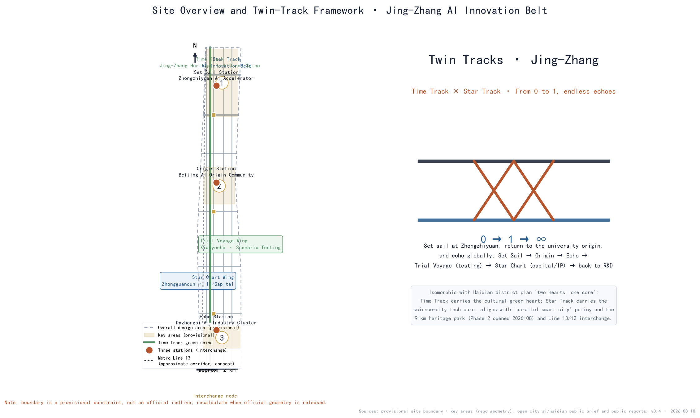
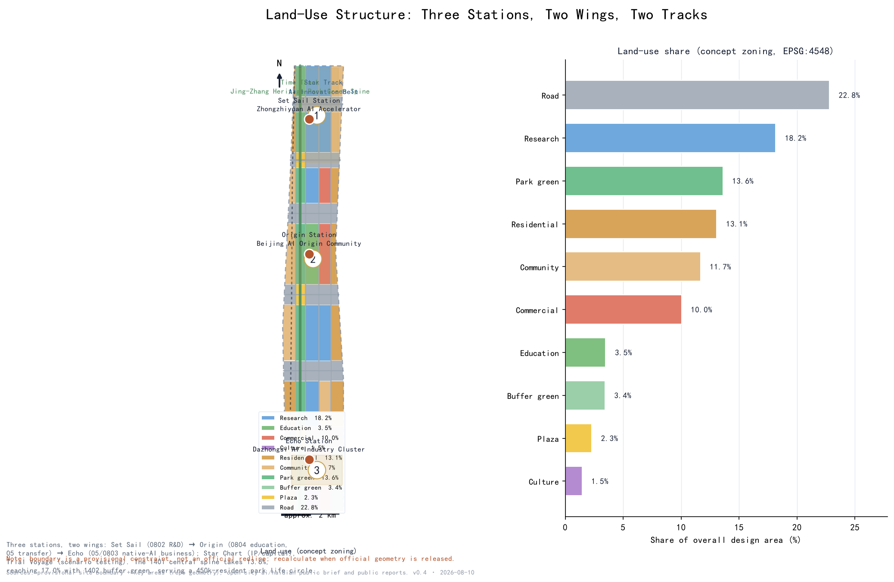
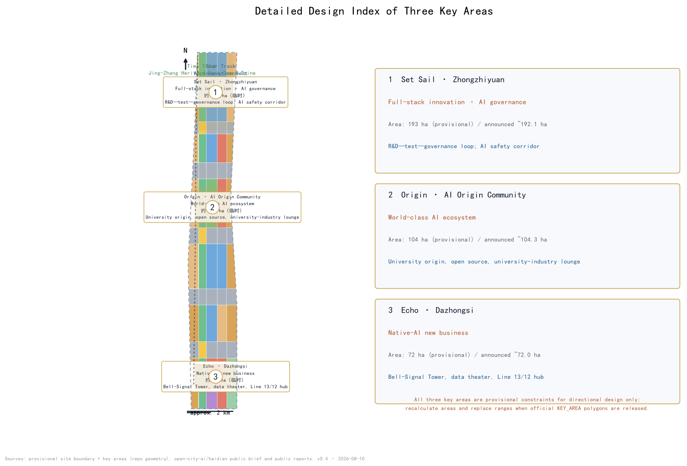
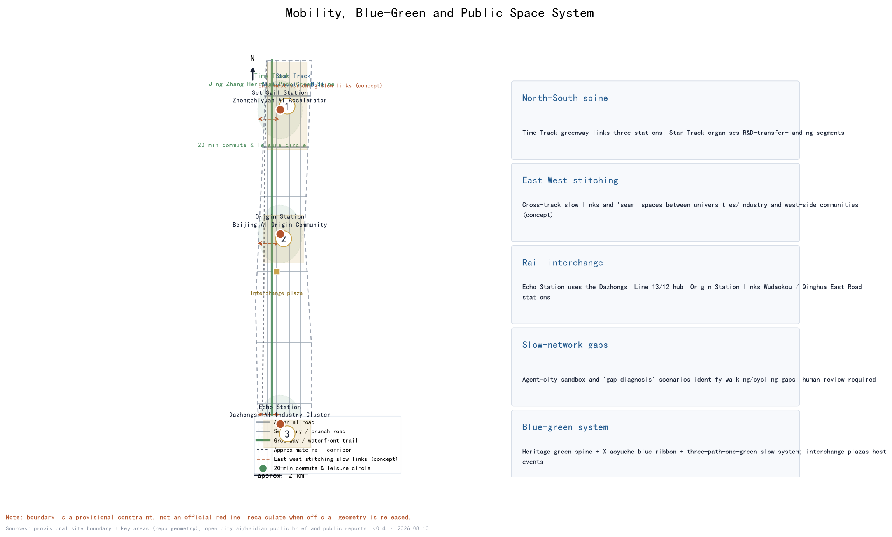
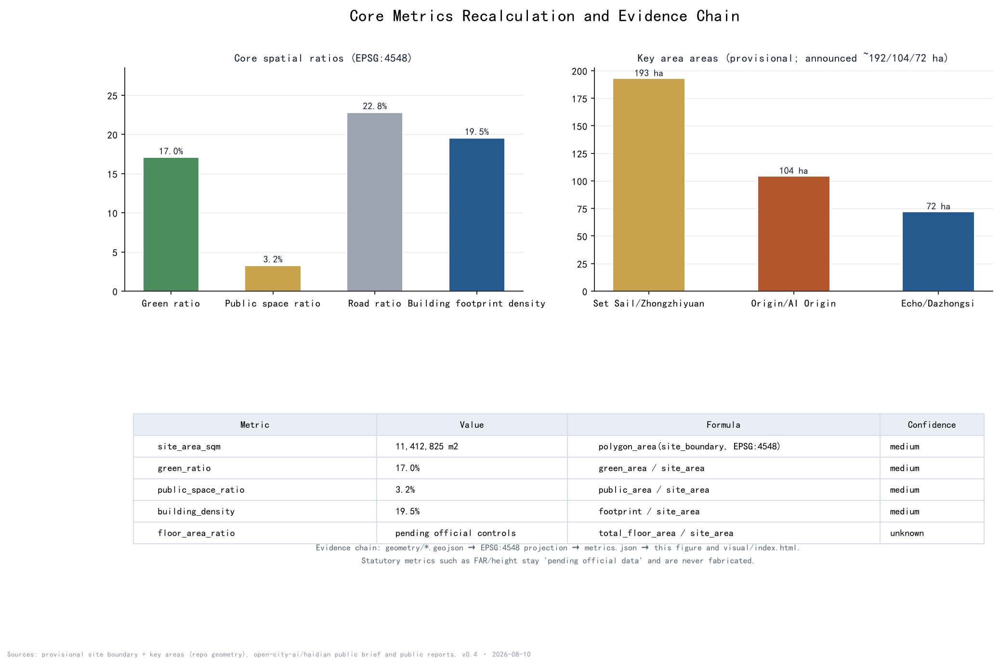

# Twin Tracks · Jing-Zhang — Concept Urban Design for the Centennial Jing-Zhang AI Innovation Belt

## Design Basis and Source List

This proposal follows the official open call announced by the Beijing Municipal Commission of Planning and Natural Resources in May 2026. It reads the public brief, the agent-facing taskbook, the allowed design space, planning ranges, standards, enums, visual-style recommendations, and schemas in the site package, and uses the public source registry to separate "formal-ready" sources from "background-only" material. The agent taskbook requires all outputs to be open co-creation suggestions rather than statutory plans or government-approved conclusions; every spatial proposal here is therefore worded as a concept, reference scheme, or material for professional teams to deepen [source:OFFICIAL-ANNOUNCEMENT] [source:SITE-PACKAGE] [source:AGENT-TASKBOOK] [standard:PROJECT-OFFICIAL-ANNOUNCEMENT] [standard:PROJECT-AGENT-OPEN-CALL-TASKBOOK].

Background sources include public reports on the Haidian district plan (2017-2035) with its "two hearts, one core" structure (the Sanshan-Wuyuan cultural green heart and the Zhongguancun Science City tech core) and its "parallel smart city" concept; the completion of Phase 2 of the Jing-Zhang Railway Heritage Park on 6 August 2026 (9-km green corridor, about 53 ha, serving about 70 communities and 450,000 residents, under the official slogan "One Hundred Years of Jing-Zhang, a Revived Green Corridor" with a "three paths, one green" slow system); the "three places" positioning of Zhongguancun as a world-leading science park (departure point of innovation, birthplace of original innovation, main front of independent innovation); and the fact that Metro Line 13 follows the old Jing-Zhang corridor, with Line 12 (opened December 2024) interchanging at Dazhongsi. These are used for conceptual alignment only and are not statutory planning evidence; full provenance is in sources.json [source:SOURCE-REGISTRY].

No official SITE_BOUNDARY or KEY_AREA polygons were included in the cleared site package. This submission uses the provisional constraint generated from brief/site-package/geometry/provisional_boundaries.geojson and labels it provisional_constraint with official_boundary=false in every layer, in the prose, in the figures, in the HTML, and in the self-check; when official geometry is released, all boundaries, areas, metrics, and figures must be recalculated [source:BOUNDARY-SOURCE] [source:KEY-AREA-SOURCE] [data:geometry/site_boundary.geojson#SITE-001].

## Three-Level Scope Framework

Following the announcement, the work is organized in three scopes. The coordinated research area, referencing the announced area of about 43.6 km2, addresses the world-class AI innovation ecosystem, industrial chain synergy, the three areas and two wings, future AI urban forms, and a continuous green-space system; its outputs are industrial strategy and spatial-structure judgments [metric:coordinated_research_area_official_sqm]. The overall design area is the Jing-Zhang heritage corridor and flanking urban districts, about 11.4 km2 as announced; the provisional boundary submitted here recalcs to 11,412,825 m2, and the design reaches regulatory-plan-depth urban design: land-use structure, twin-track skeleton, slow network, blue-green system, urban character, and renewal framework [metric:site_area_sqm] [data:geometry/site_boundary.geojson#SITE-001]. The key detailed-design area is about 3.68 km2 as announced and contains three key areas: the Zhongzhiyuan AI Acceleration Area (about 192.1 ha), the Beijing AI Origin Community (about 104.3 ha), and the Dazhongsi AI Industry Cluster (about 72.0 ha), designed to comprehensive-implementation-plan depth [metric:key_detailed_design_area_official_sqm] [data:geometry/key_areas.geojson#PROV-KEY-001].

The cascade is: industrial strategy decides functions (which innovation sector belongs where), overall urban design fixes the skeleton (twin tracks, three stations, two wings, slow and blue-green systems), and key-area design develops scenarios (mapping AI scenarios, public space, and renewal projects onto real places) [depth:three_level_scope_framework]. Importantly, all three key-area polygons are provisional constraints: they express location and relative extent only and cannot serve as parcel boundaries, precise areas, or approval redlines. When official polygons are released, key_areas, land_use, buildings, and all area metrics must be recomputed [data:geometry/key_areas.geojson#PROV-KEY-002] [data:geometry/key_areas.geojson#PROV-KEY-003].

## Coordinated Research Area: Industry and Future City Research

### Three positioning statements, five functions, and the naming system

The proposal expresses the announcement's three positions — Centennial Jing-Zhang Cultural Belt, Urban AI Life Experience Belt, and AI-Fused Innovation Belt — through the twin tracks: the Time Track carries the cultural belt, the Star Track carries the AI life-experience belt, and the interchange zones carry the fused innovation belt. The five functions (full-stack independent AI innovation, world-class AI ecosystem, new AI+ scenario paradigm, intelligent vibrant AI city, global AI governance voice) map onto Set Sail, Origin, Echo, Trial Voyage, Star Chart, and the interchange nodes, forming a closed loop: Set Sail (R&D) → Origin (transfer) → Echo (landing) → Trial Voyage (testing) → Star Chart (capital/IP) → back to R&D [source:AGENT-TASKBOOK] [depth:overall_spatial_structure].

The master name is "Twin Tracks · Jing-Zhang", subtitle "Between Iron Tracks and Star Tracks". The three stations use contemporary poetic names — Set Sail, Origin, Echo — and the two wings are Star Chart and Trial Voyage; the shared public spaces where the tracks meet are called Interchange nodes. Classical footnotes (启碇, 津梁, 觉生, 司南, 道生) are retained as a second layer, giving a dual naming system whose public layer is contemporary and whose hidden layer is historical, matching the journey grammar "0 → 1 → ∞" [depth:existing_conditions_diagnosis]. The logo direction embeds a "人" (person) zigzag between two parallel rails, closed by a circular interchange symbol, in rust red (rail heritage), ink (earth and rails), and star blue (AI light); it is a concept direction only and requires trademark, font, and copyright clearance by professionals [depth:overall_spatial_structure].

### Eight global AI ecosystem cases (public-source mechanism learning)

| Case | Core mechanism | Spatial lesson |
| --- | --- | --- |
| Silicon Valley | Concentration of venture capital and open tech culture | Star Chart Wing organizes capital/IP service interfaces |
| Kendall Square, Boston | University-to-industry transfer in place | Origin Station organizes transfer lounges around universities |
| Jurong Innovation District, Singapore | Government-firm-park collaborative governance | Trial Voyage Wing hosts regulated public test fields |
| King's Cross, London | Historic district renewal with innovation | Light innovation interfaces along the Time Track |
| Hangzhou West Sci-Tech Corridor | Platform ecosystems and anchor firms | Segmented thematic functions along the Star Track |
| Nanshan, Shenzhen | Hardware and incubation loop | Set Sail Station hosts incubation and pilot spaces |
| Tokyo/Seoul AI districts | Policy and scenario openness | Scenario-open operation and annual event mechanisms |
| Barcelona/Amsterdam smart cities | Urban data and public-space experiments | Agent-city sandbox and governance-first rules |

These cases inform mechanisms only; no firm names, investment figures, or output claims are made. The complete "mechanism-space-lesson" table is recorded under agent.2 in compliance_matrix.json [source:AGENT-TASKBOOK] [standard:PROJECT-AGENT-OPEN-CALL-TASKBOOK].

### Seven new variables and regional synergy

Seven contemporary AI-city variables are built into the scenarios and ecosystem: agentic city, embodied intelligence, open source and open weights, spatial intelligence and spatio-temporal foundation, data-factor markets, green compute and reasoning cities, and AI governance with inclusion. Regional synergy responds to the AI Beichuan community, Future Science City, Huairou Science City, the economic development zones, and the Jing-Jin-Ji innovation network, so the corridor is not treated in isolation [source:SITE-PACKAGE].

## Overall Design Area: Urban Renewal and Regulatory-Plan-Level Urban Design

The overall design area is a north-south corridor organized as "one spine, two tracks, three stations, two wings, multiple interchanges". The spine is the Jing-Zhang heritage park slow-mobility axis (Time Track); the tracks are the Time Track and the Star Track; the stations are Set Sail (Zhongzhiyuan full-stack R&D), Origin (AI Origin Community), and Echo (Dazhongsi native-AI business); the wings are Star Chart (Zhongguancun IP and capital) and Trial Voyage (Xiaoyuehe scenario testing); interchanges sit where each station meets the park [data:geometry/land_use.geojson#LU-001] [depth:land_use_layout].

Urban renewal follows Beijing's master plan direction of "reduction and intensification, cage change and bird exchange, blank space and green growth" and the Haidian district plan's "two hearts, one core": the Time Track builds on the completed heritage park green corridor (a model of green growth), while the Star Track relies on stock renewal and digital overlay rather than new land supply [source:SOURCE-REGISTRY] [standard:MOHURD-URBAN-DESIGN-MEASURES]. Functionally, the north is R&D, the middle is university origin and transfer services, the south is native-AI consumption and business, and the central green corridor carries public life and slow-mobility continuity. The renewal framework has four classes: retain (existing communities and mature campuses), weave (retrofit old factories and underused buildings into innovation space), insert (small display and event facilities along the green corridor), and vacate-and-replace (to be deepened only after official ownership and demolition information is confirmed) [depth:retain_renovate_demolish].

It must be stated clearly: statutory controls such as FAR, building height, building density, green ratio, and setbacks are not included in the public site package. Every intensity-related statement is marked "pending official data", and no regulatory conclusion is offered [depth:development_intensity_controls]. Urban character uses the rust-ink-star-blue dual-track palette; signage derives from sleepers, spikes, signals, station boards, and timetables, combined with AI symbols (nodes, waveforms, code) into a recognizable street interface [depth:height_massing_character].

## Detailed Design of Key Areas

### Set Sail · Zhongzhiyuan AI Acceleration Area (about 192.1 ha, provisional)

Positioned as the bearer of full-stack independent AI innovation and global AI governance voice, its spatial structure is "R&D core + pilot ring + governance corridor": the northern research land concentrates large-model training, compute scheduling, and basic research institutions; the middle hosts incubation and pilot space; an AI safety-governance corridor runs along the green edge. Commuting is served by roads south of the Fifth Ring Road and greenway interfaces; public space centers on the station plaza and rail-memory nodes. Core scenarios include the AI Safety Governance Corridor, a front zone of the Open Source Launch Hall, and low-carbon compute stations. Implementation risk is mainly parcel complexity and the scale of existing-building retrofit, pending official ownership information [data:geometry/key_areas.geojson#PROV-KEY-001] [depth:three_key_area_detailed_design].

### Origin · Beijing AI Origin Community (about 104.3 ha, provisional)

Positioned as the origin of a world-class AI ecosystem and university-based source innovation, its structure is "source circle + open-source belt + life ring": a source-innovation circle around university resources, an open-source community belt along Chengfu Road and Qinghua East Road, and a talent-apartment and services ring outside. University-enterprise transfer lounges, talent life concierge, and the Open Source Launch Hall land here, creating a continuous innovation interface "from campus to street". The main risk is limited space around campuses and the need to protect student and resident daily life; any building or function insertion must not disturb teaching and research [data:geometry/key_areas.geojson#PROV-KEY-002] [depth:three_key_area_detailed_design].

### Echo · Dazhongsi AI Industry Cluster (about 72.0 ha, provisional)

Positioned as the meeting of native-AI business and bell culture, its structure is "industry core + cultural sound field + interchange hub": business and consumption scenes around the Dazhongsi Metro Line 13/12 interchange hub, a cultural sound field around the Dazhongsi heritage site, with the Bell-Signal Tower and the Data-Factor Theater landing here. Risks include heritage protection construction-control zones and the balance of commercial renewal; all landmark installations are conceptual and require heritage and urban-character review [data:geometry/key_areas.geojson#PROV-KEY-003] [depth:three_key_area_detailed_design].

## AI Innovation Ecosystem, Personas, and AI+ Scenarios

### Five user personas

Developers and researchers (open source, compute, datasets); university faculty and students (courses, transfer, internships); startups and firms (incubation, capital, scenario testing); local residents and commuters (transit, community services, park life); global visitors (cultural narrative and AI experience routes). City administrators participate as collaborators in human review and safety boundaries [source:AGENT-TASKBOOK].

### Fourteen scenario cards

| # | Scenario card | Location | Users |
| --- | --- | --- | --- |
| 1 | Open Source Launch Hall | Origin Station | developers/firms |
| 2 | Agent-City Sandbox (test) | Trial Voyage Wing | firms/administrators |
| 3 | Embodied-Intelligence Test Field (test) | Trial Voyage Wing | robotics firms/public |
| 4 | Slow-Network Gap Diagnosis (test) | Time Track | administrators/residents |
| 5 | Talent Life Concierge | Origin Station | students/talent |
| 6 | AI Safety Governance Corridor | Set Sail Station | developers/administrators |
| 7 | University-Enterprise Transfer Lounge | Origin Station | universities/firms |
| 8 | Data-Factor Theater | Echo Station | firms/public |
| 9 | Low-Carbon Compute Station | Star Track | firms/developers |
| 10 | Jing-Zhang Memory Route | Time Track | residents/visitors |
| 11 | Developer Promenade | Time Track | developers/public |
| 12 | Signal of Honor · Contribution Wall | Interchange nodes | all contributors |
| 13 | Bell-Signal Pavilion | Echo Station | public/visitors |
| 14 | Global AI Twin-Tracks Festival Route | whole corridor | global visitors/community |

Every test scenario (2, 3, 4) requires human review, safety boundaries, and privacy assessment before opening; no immature technology is presented as ready for full deployment [source:AGENT-TASKBOOK] [depth:existing_conditions_diagnosis].

## Land Use, Building Scale, and Retain-Renovate-Demolish Strategy

Land use follows a banded "green spine in the middle, innovation belt, residential flanks" layout: a central park-green and plaza system (1401/1403, about 17.0% and 3.2%), a west flank of existing residential and community services (0701/0702), a central axis of research, education, commercial, and culture (0802/0804/05/0803), an east flank of innovation services and community support, and road land (1207) at about 22.8%, forming a complete partition of the submitted boundary [data:geometry/land_use.geojson#LU-001] [metric:green_ratio] [metric:road_ratio].

The concept building footprint recalculates to about 2,228,190 m2, about 19.5% of the overall area, guided by "small blocks, dense streets, mixed ground floors" [metric:building_footprint_area_sqm] [metric:building_density] [data:geometry/buildings.geojson#BLDG-001]. Retain-renovate-demolish is presented only as a concept classification: retain existing communities and mature campuses, weave and retrofit underused buildings, insert green-corridor display facilities, and leave vacate-and-replace parcels pending official confirmation; FAR, height, and total floor area remain pending data and are never estimated [depth:retain_renovate_demolish] [depth:development_intensity_controls].

## Transport, Rail, Municipal Infrastructure, and Public Services

The road network uses a "three horizontal, multi vertical" skeleton: the Time Track greenway along the green corridor links the three stations, while east-west roads and banded branch roads support block accessibility [data:geometry/roads.geojson#ROAD-001]. For rail, the proposal explicitly uses the Dazhongsi Line 13/12 interchange hub to serve Echo Station and links Origin Station to Wudaokou and Qinghua East Road station directions; the approximate Line-13 corridor shown is concept reference only and not an alignment proposal [data:geometry/constraints.geojson#CONST-RAIL-001] [depth:traffic_rail_slow_parking].

The slow system answers the "AI + transport and walkability" track: a Slow-Network Gap Diagnosis scenario identifies walking and cycling gaps, east-west stitching slow links connect universities and industry with west-side communities, and 20-minute commute-and-leisure circles are organized around the three stations. Municipal and new infrastructure combine "traditional municipal + digital overlay": low-carbon compute stations and edge inference integrate with block-level energy micro-grids, and a CIM spatio-temporal foundation serves as the digital base of the Star Track. All municipal proposals are conceptual; alignments and capacities require professional deepening [depth:municipal_new_infrastructure].

## Blue-Green Network, Public Space, and Urban Character

The blue-green system takes the 9-km Jing-Zhang heritage park corridor as its spine (building on the existing "three paths, one green" slow system), with the Xiaoyuehe blue ribbon and east-side buffer green as complements, forming a "one spine, one river, multiple nodes" network [data:geometry/green_space.geojson#GREEN-001] [metric:green_space_area_sqm]. Public space centers on the three interchange plazas (Set Sail, Origin, Echo; about 369,000 m2), which double as event, display, and commemoration grounds [data:geometry/public_space.geojson#PUBLIC-001] [metric:public_space_ratio].

Four AI pilgrimage landmarks are proposed as concepts: the Ren Plaza (near the former Qinghuayuan station site, echoing the 1909 zigzag and the 1949 "taking the exam" journey), the Open-Source Achievement Gallery and Contribution Wall (mid-Time Track), the Bell-Signal Tower (Echo Station; bell sound art with AI signal visualization, respecting heritage rules), and the Star Track Gallery (light and data art). None are approved construction; signage, logo, fonts, images, and person marks require clearance before use [source:AGENT-TASKBOOK] [depth:blue_green_public_space].

### Cultural narrative: from whistle to signal

The cultural narrative of the belt unfolds in four acts mapped to the spatial system: Act 1 "Whistle" (1905-1909) — the Jing-Zhang Railway overcame the Jundu mountain grade with the "人" zigzag, the first line of independent innovation written by Chinese engineers; Act 2 "Platform" (1910-1949) — Qinghuayuan Station was designed and supervised by Zhan Tianyou, and in 1949 the "taking the exam" journey arrived here, turning "taking the exam" into "welcoming the exam"; Act 3 "Electronics" (1980s-2010s) — Zhongguancun grew from an electronics street into a source of innovation; Act 4 "Signal" (2020s-) — the old Jing-Zhang line retired into a 9-km heritage park and AI signals spread from beside the Dazhongsi bell [source:SRC-QINGHUAYUAN-STATION] [source:SRC-JZ-PARK-PHASE2-2026]. The sound line runs "from bell to signal" (Dazhongsi, originally Juesheng Temple), and the symbol line runs "from the 人 zigzag to human-centered design"; signage derives from sleepers, spikes, signals, station boards, and timetables, combined with AI symbols into the twin-track urban character [depth:blue_green_public_space].

## Renewal Projects, Implementation Policy, and Phasing

Renewal projects are organized in four families: green-corridor activation (Jing-Zhang Memory Route, Developer Promenade, east-west stitching links), station-city integration (three interchange plazas and station-front interfaces), community weaving (talent apartments, community service centers, 15-minute life-circle facilities), and digital overlay (low-carbon compute stations, CIM base, agent-city sandbox) [depth:renewal_project_list].

Phasing matches phasing.geojson: Phase 1 focuses on Set Sail/Zhongzhiyuan and the north Time Track (demonstration R&D and green public life), Phase 2 on Origin/AI Origin Community and the middle green corridor (source innovation and transfer services), Phase 3 on Echo/Dazhongsi and the south (native-AI business and hub commerce) [data:geometry/phasing.geojson#PHASE-1] [metric:phasing_area_phase_1_sqm] [depth:phasing_implementation]. Policy suggestions include rolling renewal-project inventory, scenario-open filing, public-data openness with anonymization rules, and a developer contribution honor system; these are mechanism suggestions, not confirmed arrangements.

Long-term operation proposes the annual "Twin Tracks Festival", with a developer week, scenario open days, open-source release events, city experience routes, and international co-creation camps. The developer community operates on a "contribute → display → honor" loop, the agent-city sandbox opens quarterly with explicit human-review boundaries, and activity effects or recruitment conversion figures are not preset or exaggerated [source:AGENT-TASKBOOK] [depth:phasing_implementation].

## Metrics, Area Recalculation, and Compliance Matrix

Core metrics are recalculated from geometry/*.geojson in EPSG:4548: overall design area 11,412,825 m2, green ratio 17.0%, public-space ratio 3.2%, road ratio 22.8%, building footprint density 19.5%, and key-area areas of 192.9 ha, 104.3 ha, and 72.0 ha (provisional), cross-checked against the announced values of about 192.1/104.3/72.0 ha [metric:site_area_sqm] [metric:green_ratio] [metric:public_space_ratio] [metric:key_area_count]. The design meaning of each indicator is explained in the corresponding chapter: green ratio supports a park life circle for 450,000 residents, public-space ratio supports exchange and display between stations, and building density responds to industrial space supply.

Metrics, formulas, source files, and confidence are fully recorded in metrics.json; task coverage, professional standards, and design depth are recorded in compliance_matrix.json, standard_matrix.json, and design_depth_matrix.json without duplicating machine indexes in the prose [depth:metrics_recalculation]. Pending official data include statutory FAR, height, density, green-ratio controls, and all precise areas under the official boundary [metric:floor_area_ratio].

## Risk, Copyright, and Compliance

Data legality: all material comes from public or cleared sources, with provenance, licenses, collection methods, and limitations recorded in sources.json; no internal materials, non-public maps, or personal data are used. Copyright: text and graphics are AI-generated with the generation method disclosed; historical facts are cited from public sources; logo, fonts, images, historical photos, and heritage images require authorization checks (see report/copyright_statement.md). Boundary: all spatial layers use provisional constraints with official_boundary=false and must not be used as approval redlines or precise-area bases [depth:risk_missing_data].

Compliance wording: this proposal is an open co-creation suggestion by an AI agent; it is not a statutory plan, approval, investment, or engineering conclusion. Statements about FAR, retain-renovate-demolish, road alignments, or municipal pipelines are concept suggestions or pending confirmations. AI generation responsibility: text, figures, and structured data are AI-generated; key facts carry public sources, and professional judgment is ultimately made by humans and professional teams [source:AGENT-TASKBOOK].

## References

The following publications directly influenced this proposal; their official/third-party status, licenses, and limitations are registered in sources.json and separated into formal-ready and background use [source:OFFICIAL-ANNOUNCEMENT] [source:AGENT-TASKBOOK].

1. Beijing Municipal Commission of Planning and Natural Resources: pre-qualification announcement for the Centennial Jing-Zhang AI Innovation Belt urban design open call (May 2026) and public brief.
2. open-city-ai/haidian: Agent-facing open-call taskbook and site package (18 May 2026 edition).
3. Beijing Master Plan (2016-2035) public approval content (gov.cn, Xinhua and other public reports).
4. Haidian District Plan (2017-2035) public approval content (district government portal, People's Daily, Beijing Daily app), including "two hearts, one core" and "parallel smart city".
5. Science and Technology Daily (6 August 2026): "Beijing Haidian: Phase 2 of the Jing-Zhang Railway Heritage Park opens", including "One Hundred Years of Jing-Zhang, a Revived Green Corridor" and the "three paths, one green" system.
6. Beijing Daily "Check-in the Big City" series: Qinghuayuan Station site and the 1949 "taking the exam" history.
7. Beijing municipal website and Haidian media: Dazhongsi (Juesheng Temple) and the Yongle Bell public materials.
8. Public reports on the Plan for Building Zhongguancun into a World-Leading Science Park (MIIT, MOST, Beijing, 2023), including the "three places" positioning.
9. Beijing Daily: Metro Line 12 (opened December 2024) and the Dazhongsi interchange public reports.
10. China News and Beijing Daily: Haidian AI Origin Community and embodied-intelligence industry park public reports.
