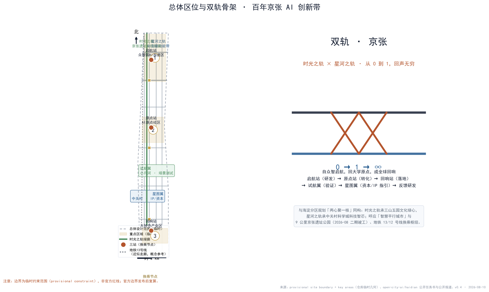
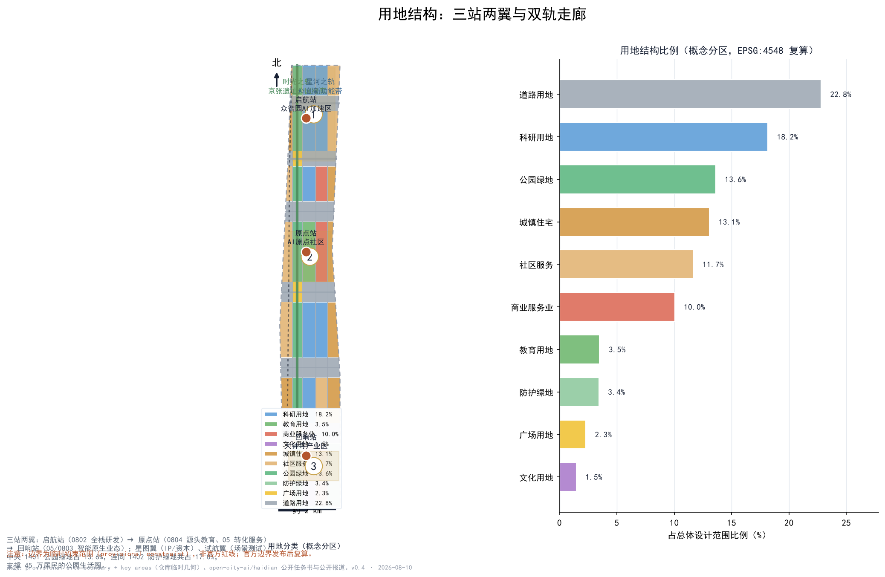
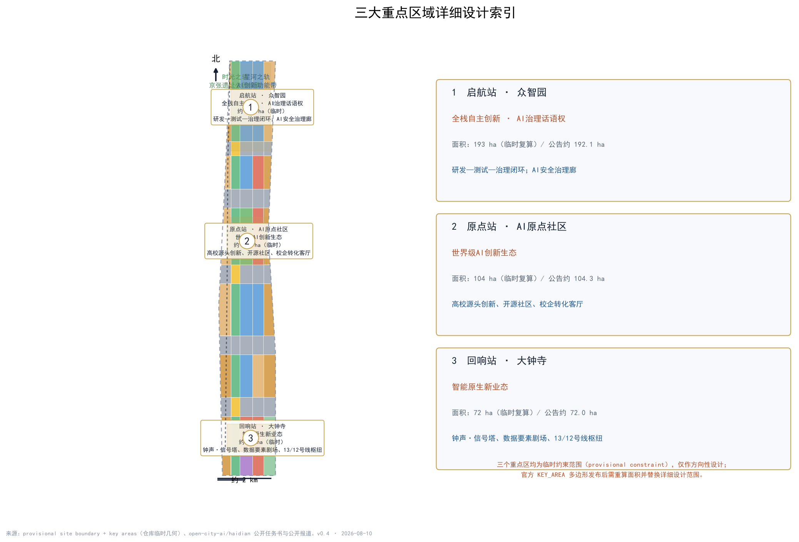
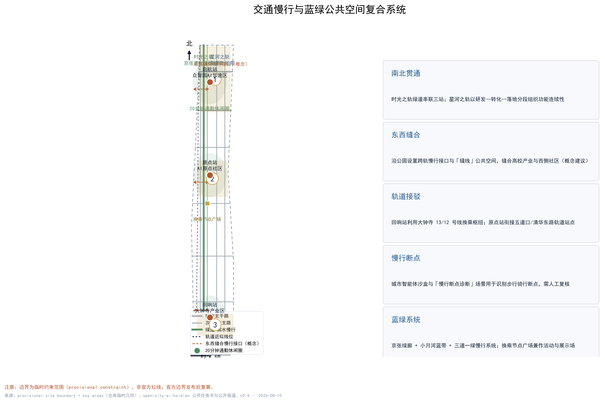
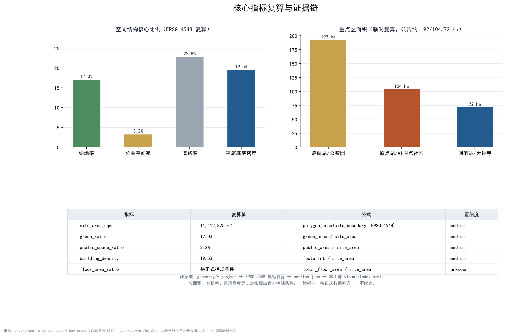

# 双轨 · 京张——百年京张AI创新带总体城市设计概念方案

## 设计依据与资料清单

本方案以征集公告（2026年5月北京市规划和自然资源委员会发布）为总体依据，逐项阅读了仓库内的公开任务书、面向智能体的任务书、允许设计空间、规划控制范围、标准与枚举、视觉风格建议等资料包内容，并按公开来源登记表区分“可用于正式方案”与“仅作背景”两类资料 [source:OFFICIAL-ANNOUNCEMENT] [source:SITE-PACKAGE] [source:AGENT-TASKBOOK]。面向智能体任务书明确要求：所有成果是开放共创建议，不替代专业规划，不构成政府审定结论；本方案全部空间落点均按“概念建议 / 参考方案 / 可供专业团队深化研究”表述，其标准要求见 [standard:PROJECT-OFFICIAL-ANNOUNCEMENT] [standard:PROJECT-AGENT-OPEN-CALL-TASKBOOK]。

背景类资料包括：海淀分区规划（2017—2035）批复内容中“两心聚一核”（三山五园文化绿心与中关村科学城科技智芯）与“智慧平行城市”的公开报道；京张铁路遗址公园二期于2026年8月6日竣工开放的公开报道（9公里绿廊、约53公顷、服务70个社区约45万居民，官方理念“百年京张，焕活绿廊”，已建成“三道一绿”慢行系统）；《中关村世界领先科技园区建设方案》提出的“科技创新出发地、原始创新策源地、自主创新主阵地”三地定位；以及地铁13号线沿老京张走廊敷设、12号线大钟寺站换乘（2024年12月开通）等公开信息。上述背景仅用于概念呼应，不作为法定规划依据，完整来源登记见 sources.json [source:SOURCE-REGISTRY]。

空间数据方面，仓库未随资料包提供官方 SITE_BOUNDARY 与 KEY_AREA 多边形，本方案使用 brief/site-package/geometry/provisional_boundaries.geojson 生成的临时约束范围，并在所有图层、正文、图件、HTML 与自检文件中明确标注 provisional constraint 与 official_boundary=false；官方几何发布后，边界、面积、指标与图件须全量复算 [source:BOUNDARY-SOURCE] [source:KEY-AREA-SOURCE] [data:geometry/site_boundary.geojson#SITE-001]。

## 三层范围工作框架

按公告口径建立三层范围。统筹研究范围以公告面积约43.6平方公里为参照，工作目标是研究世界级AI创新生态、产业链协同、三区两翼、未来AI城市形态与连续绿色空间体系，成果以产业战略与空间结构判断为主 [metric:coordinated_research_area_official_sqm]。总体设计范围为京张遗址公园走廊及两侧城市地区，公告面积约11.4平方公里，本方案提交的临时边界复算面积11,412,825平方米，工作目标达到控制性详细规划深度的城市设计研究：用地结构、双轨骨架、慢行网络、蓝绿系统、风貌控制与更新框架 [metric:site_area_sqm] [data:geometry/site_boundary.geojson#SITE-001]。重点区域范围为公告约3.68平方公里，包含三个重点片区：众智园AI自主创新加速区（约192.1公顷）、北京AI原点社区（约104.3公顷）、大钟寺AI产业集聚区（约72.0公顷），工作目标达到规划综合实施方案深度的详细设计 [metric:key_detailed_design_area_official_sqm] [data:geometry/key_areas.geojson#PROV-KEY-001]。

三层范围逐级落实的路径是：产业战略定功能（哪类创新业态落在哪个片区）→ 总体城市设计定骨架（双轨、三站、两翼、慢行与蓝绿系统）→ 重点片区详细设计定场景（把AI场景、公共空间与更新项目落到具体空间）[depth:three_level_scope_framework]。需要特别说明：三个重点区多边形均为临时约束范围，只能表达片区方位与相对关系，不能作为地块边界、精确面积或审批红线；官方多边形发布后，key_areas、land_use、buildings 等图层与全部面积类指标都要重算 [data:geometry/key_areas.geojson#PROV-KEY-002] [data:geometry/key_areas.geojson#PROV-KEY-003]。

## 统筹研究范围产业与未来城市研究

### 三大定位、五大功能与命名体系

呼应公告“百年京张文化带、都市AI生活体验带、AI融合创新带”三大定位，本方案以“双轨”统一表达：时光之轨承载文化带，星河之轨承载AI生活体验带，双轨交汇区承载融合创新带。五大功能（AI全栈自主创新体系、世界级AI创新生态、AI+场景赋能新范式、智能化AI活力城市、AI治理全球话语权）分别落到启航站、原点站、回响站、试航翼、星图翼与换乘节点上，形成“启航（研发）→ 原点（转化）→ 回响（落地）→ 试航（验证）→ 星图（资本/IP指引）→ 反馈研发”的协同回路 [source:AGENT-TASKBOOK] [depth:overall_spatial_structure]。

总名为“双轨 · 京张（Twin Tracks · Jing-Zhang）”，副题“铁轨与星轨之间”；三站主名采用当代诗性语汇“启航站（Set Sail）、原点站（Origin）、回响站（Echo）”，两翼为“星图翼（Star Chart）与试航翼（Trial Voyage）”，双轨交汇公共空间称“换乘节点（Interchange）”。历史典故（启碇、津梁、觉生、司南、道生）作为文化注脚保留，构成“明线当代、暗线历史”的双层命名体系，与“0→1→∞”的旅程语法一一对应 [depth:existing_conditions_diagnosis]。Logo方向为两条平行轨线之间嵌入“人”字折线，交汇处以圆形换乘符号收束，色彩取锈红（铁路之史）、墨色（大地与铁轨）、星蓝（AI之光）；Logo仅为概念方向，最终标识须由专业团队深化并完成商标、字体与版权核查 [depth:overall_spatial_structure]。

### 全球AI创新生态案例（8个，公开资料机制借鉴）

| 案例 | 核心机制 | 对空间的借鉴 |
| --- | --- | --- |
| 硅谷 | 风险资本与开放技术文化高度集聚 | 星图翼组织资本与IP服务界面 |
| 波士顿剑桥Kendall Square | 大学—产业就地转化 | 原点站围绕高校组织转化客厅 |
| 新加坡裕廊创新区 | 政府—企业—园区协同治理 | 试航翼设置可监管的公共测试场 |
| 伦敦国王十字 | 历史街区更新与科创共荣 | 时光之轨沿线植入轻量科创界面 |
| 杭州城西科创走廊 | 平台生态与龙头企业带动 | 星河之轨分段组织主题功能 |
| 深圳南山 | 硬件与产业孵化闭环 | 启航站布局孵化与中试空间 |
| 东京/首尔AI园区 | 政策与场景开放结合 | 场景开放运营与年度活动机制 |
| 巴塞罗那/阿姆斯特丹智慧城市 | 城市数据与公共空间实验 | 城市智能体沙盒与治理规则先行 |

以上案例仅作机制层面的公开资料借鉴，不涉及企业名单、投资额与产值承诺；每个案例对应的“机制—空间—可借鉴点”完整表见 compliance_matrix.json 与 agent.2 记录 [source:AGENT-TASKBOOK] [standard:PROJECT-AGENT-OPEN-CALL-TASKBOOK]。

### 七个前沿变量与区域协同

方案将当下AI与城市互动的七个新变量组织进场景与生态设计：城市智能体（Agentic City）、具身智能、开源与开放权重、空间智能与时空底座、数据要素×、绿色算力与推理城市、AI治理与包容性。区域协同上呼应北纬社区、未来科学城、怀柔科学城、经开区与京津冀创新带，避免就走廊论走廊 [source:SITE-PACKAGE]。

## 总体设计范围城市更新与控规深度城市设计

总体设计范围为一条南北向走廊，本方案的空间结构是“一廊两轨、三站两翼、多点换乘”。一廊指京张遗址公园文化慢行主轴（时光之轨）；两轨指时光之轨与星河之轨；三站为启航站（众智园全栈研发）、原点站（AI原点社区源头创新）、回响站（大钟寺智能原生业态）；两翼为星图翼（中关村IP与资本服务）与试航翼（小月河场景测试）；多点换乘指各站台与公园交界处的换乘节点 [data:geometry/land_use.geojson#LU-001] [depth:land_use_layout]。

城市更新遵循北京总规“减量集约、腾笼换鸟、留白增绿”导向与海淀分区规划“两心聚一核”结构：时光之轨依托已建成的遗址公园绿廊（留白增绿样板），星河之轨以存量更新与数字叠加为主，不新增建设用地 [source:SOURCE-REGISTRY] [standard:MOHURD-URBAN-DESIGN-MEASURES]。功能布局上，北段以科研研发为主，中段以教育源发与转化服务为主，南段以智能原生消费与商务场景为主，中央绿廊承担公共生活与慢行连续。更新框架分为四类：保留（现状社区与成熟校区）、织补（老旧厂房与低效楼宇改造为创新空间）、嵌入（沿绿廊植入小型展示与活动设施）、腾退置换（具体地块留待官方权属与拆改信息确认后深化）[depth:retain_renovate_demolish]。

需要明确的是：控规层级的容积率、建筑高度、建筑密度、绿地率、退线等法定控制条件未随公开资料包提供，本方案所有开发强度相关表述一律标注“待正式数据补齐”，不给出任何控规结论 [depth:development_intensity_controls]。风貌控制采用“锈红—墨色—星蓝”双轨色系，导视系统由轨枕、道钉、信号灯、站牌、时刻表衍生，与AI符号（节点、波形、代码）共同构成可识别的街道界面 [depth:height_massing_character]。

## 重点区域详细设计

### 启航站 · 众智园AI自主创新加速区（约192.1公顷，临时）

定位为AI全栈自主创新体系与AI治理全球话语权承载区。空间结构为“研发核+中试环+治理廊”：北部科研用地集聚大模型训练、算力调度与基础研究机构，中部设置孵化与中试空间，沿绿廊设置AI安全治理廊。交通慢行上依托五环南侧道路与绿道接口组织园区通勤，公共空间以站前广场与轨道记忆节点为主。核心AI场景包括AI安全治理廊、开源发布厅前置区、低碳算力驿站；实施风险主要是权属复杂与现状建筑改造量大，须待官方权属与拆改信息 [data:geometry/key_areas.geojson#PROV-KEY-001] [depth:three_key_area_detailed_design]。

### 原点站 · 北京AI原点社区（约104.3公顷，临时）

定位为世界级AI创新生态与高校源头创新的原点。空间结构为“源头圈+开源带+生活环”：围绕高校资源组织源头创新圈层，沿成府路—清华东路方向组织开源社区带，外围布置人才公寓与生活服务环。校企转化客厅、人才生活管家、开源发布厅等场景落地于此，强调“从校园到街道”的连续创新界面。实施风险主要是高校周边空间资源有限、学生与居民生活动线需精细保护，一切建筑与功能植入须以不干扰教学科研为前提 [data:geometry/key_areas.geojson#PROV-KEY-002] [depth:three_key_area_detailed_design]。

### 回响站 · 大钟寺AI产业集聚区（约72.0公顷，临时）

定位为智能原生新业态与钟声文化交融区。空间结构为“产业核+文化声场+换乘枢纽”：依托大钟寺地铁13/12号线换乘枢纽组织商务与消费场景，围绕大钟寺文物保护单位组织文化声场，钟声·信号塔、数据要素剧场等场景在此落地。实施风险主要是文物保护建设控制地带约束与商业更新平衡，地标装置均为概念设想，须经文物与风貌专项审查 [data:geometry/key_areas.geojson#PROV-KEY-003] [depth:three_key_area_detailed_design]。

## AI 创新生态、人才画像与 AI+ 场景

### 五类用户画像

开发者与研究者（开源贡献、算力与数据集需求）、高校师生（课程、科研转化与实习场景）、创业团队与企业（孵化、资本、场景测试需求）、本地居民与通勤者（通勤接驳、社区服务与公园生活）、全球访客（文化叙事与AI体验线路）；城市治理者作为协同角色参与人工复核与安全边界管理 [source:AGENT-TASKBOOK]。

### 十四张场景卡

| 编号 | 场景卡 | 落点 | 服务对象 |
| --- | --- | --- | --- |
| 1 | 开源发布厅 | 原点站 | 开发者/企业 |
| 2 | 城市智能体沙盒（测试） | 试航翼 | 企业与治理者 |
| 3 | 具身智能试炼场（测试） | 试航翼 | 机器人企业/公众 |
| 4 | 慢行断点诊断（测试） | 时光之轨 | 治理者/居民 |
| 5 | 人才生活管家 | 原点站 | 高校师生/人才 |
| 6 | AI安全治理廊 | 启航站 | 开发者/治理者 |
| 7 | 校企转化客厅 | 原点站 | 高校/企业 |
| 8 | 数据要素剧场 | 回响站 | 企业/公众 |
| 9 | 低碳算力驿站 | 星河之轨 | 企业/开发者 |
| 10 | 京张记忆线路 | 时光之轨 | 居民/访客 |
| 11 | 开发者散步道 | 时光之轨 | 开发者/公众 |
| 12 | 荣誉信号·贡献荣誉墙 | 换乘节点 | 全体贡献者 |
| 13 | 钟声·信号亭 | 回响站 | 公众/访客 |
| 14 | 全球AI双轨节路线 | 全线 | 全球访客/社区 |

场景卡均注明：测试类场景（2、3、4）须设置人工复核、安全边界与隐私评估后方可开放，任何场景不得把未成熟技术写成可全面部署 [source:AGENT-TASKBOOK] [depth:existing_conditions_diagnosis]。

## 用地、建筑规模与拆改留方案

用地布局采用“绿廊居中、创新成带、社区两翼”的带状分区：中央为公园绿地与防护绿地（1401/1402，合计约17.0%）及广场（1403，约2.3%），西翼为存量居住与社区服务（0701/0702），中轴为科研、教育、商业与文化用地（0802/0804/05/0803），东翼为创新服务与社区配套，道路用地（1207）约22.8%，形成完整覆盖提交边界的用地分区 [data:geometry/land_use.geojson#LU-001] [metric:green_ratio] [metric:road_ratio]。

建筑规模方面，概念建筑基底复算约2,228,190平方米，占总体范围约19.5%，以“小街区、密路网、复合底商”为形态原则 [metric:building_footprint_area_sqm] [metric:building_density] [data:geometry/buildings.geojson#BLDG-001]。建筑拆改留只作概念分类：保留现状社区与成熟校区，织补改造低效楼宇，嵌入绿廊展示设施，腾退置换留待官方信息确认；容积率、建筑高度与总建筑面积属待补条件，不以任何估算冒充 [depth:retain_renovate_demolish] [depth:development_intensity_controls]。

## 交通、轨道、市政与公共服务设施

道路系统以“三横多纵”骨架组织：沿绿廊的时光之轨绿道串联三站，东西向城市道路与带状支路共同支撑街区可达性 [data:geometry/roads.geojson#ROAD-001]。轨道方面，方案明确利用地铁13号线与12号线大钟寺换乘枢纽服务回响站，原点站衔接五道口与清华东路方向轨道站点；13号线近似走廊仅作概念参考，不代表线位方案 [data:geometry/constraints.geojson#CONST-RAIL-001] [depth:traffic_rail_slow_parking]。

慢行系统回应“AI+交通与慢行”赛道：以“慢行断点诊断”场景识别步行骑行断点，以东西缝合慢行接口连接高校产业与西侧社区，围绕三站组织20分钟通勤休闲圈。市政与新型基础设施采用“传统市政+数字叠加”：低碳算力驿站与端侧推理设施结合街区能源微网，CIM时空底座作为星河之轨的数字底板；所有市政方案均为概念策略，管线线位与容量须经专业深化 [depth:municipal_new_infrastructure]。

## 蓝绿空间、公共空间与城市风貌

蓝绿系统以京张遗址公园9公里绿廊为主轴（“三道一绿”慢行系统为现状底盘），辅以小月河蓝带与东侧防护绿地，形成“一廊一河多节点”网络 [data:geometry/green_space.geojson#GREEN-001] [metric:green_space_area_sqm]。公共空间以换乘节点广场为核心（启航、原点、回响三处节点，约36.9万平方米），兼作活动、展示与纪念场所 [data:geometry/public_space.geojson#PUBLIC-001] [metric:public_space_ratio]。

AI朝圣地标提出四个概念节点：人字广场（清华园车站旧址概念区，呼应1909人字形展线与1949赶考记忆）、开源成果展示廊与贡献荣誉墙（时光之轨中段）、钟声·信号塔（回响站，永乐大钟声音艺术与AI信号可视化，须尊重文物与文保要求）、星轨长廊（星河之轨光环境与数据艺术）。地标均为概念设想，不构成已批准建设；导视、Logo、字体、图片与人物标识均须清权后使用 [source:AGENT-TASKBOOK] [depth:blue_green_public_space]。

### 文化叙事：从汽笛到信号

本条创新带的文化叙事以“四幕”展开，与空间系统一一对应：第一幕“汽笛”（1905—1909），京张铁路以“人”字形展线攻克关沟陡坡，是中国人自主创新的第一行；第二幕“站台”（1910—1949），清华园车站由詹天佑设计督建，1949年“进京赶考”在此下车，从“赶考”到“迎考”；第三幕“电子”（1980s—2010s），中关村从电子一条街成长为创新策源地；第四幕“信号”（2020s—），老京张铁路退役化作9公里遗址公园，AI信号从大钟寺旁传向世界 [source:SRC-QINGHUAYUAN-STATION] [source:SRC-JZ-PARK-PHASE2-2026]。叙事以“钟声→信号”为声音线索（大钟寺本名觉生寺），以“人字→人本”为符号线索，导视系统由轨枕、道钉、信号灯、站牌与时刻表衍生，与AI符号共同构成“双轨”的城市气质 [depth:blue_green_public_space]。

## 更新项目清单、实施政策与分期计划

更新项目清单按“绿廊激活、站城一体、社区织补、数字叠加”四类组织：绿廊激活项目（京张记忆线路、开发者散步道、东西缝合接口），站城一体项目（三站换乘节点广场与站前界面），社区织补项目（人才公寓、社区服务中心、一刻钟生活圈设施），数字叠加项目（低碳算力驿站、CIM底座、城市智能体沙盒）[depth:renewal_project_list]。

分期计划与 phasing.geojson 对应：一期聚焦启航站·众智园与时光之轨北段（先行示范研发与绿廊公共生活），二期聚焦原点站·AI原点社区与中段绿廊（源头创新与转化服务），三期聚焦回响站·大钟寺与南段（智能原生业态与枢纽商业）[data:geometry/phasing.geojson#PHASE-1] [metric:phasing_area_phase_1_sqm] [depth:phasing_implementation]。实施政策建议包括：城市更新项目库滚动管理、场景开放备案制、公共数据开放与脱敏规则、开发者贡献荣誉体系；以上均为政策与机制建议，不构成已确定安排。

长期运营设计提出年度品牌“京张双轨节（Twin Tracks Festival）”，包含开发者周、场景开放日、开源成果发布会、城市体验路线与国际共创营；开发者社区按“贡献→展示→荣誉”闭环运营，城市智能体沙盒按季度开放并明确人工复核边界，活动效果与招引转化数据不预设、不夸大 [source:AGENT-TASKBOOK] [depth:phasing_implementation]。

## 指标体系、面积复算与合规矩阵

核心指标均从 geometry/*.geojson 经 EPSG:4548 投影复算：总体设计范围11,412,825平方米，绿地率17.0%，公共空间率3.2%，道路率22.8%，建筑基底密度19.5%，三个重点区面积分别为192.9公顷、104.3公顷、72.0公顷（临时复算），与公告约值192.1/104.3/72.0公顷互相校核 [metric:site_area_sqm] [metric:green_ratio] [metric:public_space_ratio]。重点区数量为3个 [metric:key_area_count]。绿地率支撑人才生活圈，公共空间率支撑创新交往，建筑基底密度回应产业空间供给，每个指标的设计含义已在正文相应章节解释。

指标的意义不只在数字本身：绿地率17.0%对应45万居民可及的公园生活圈，公共空间换乘节点对应三站之间的交往与展示界面，道路率对应小街区密路网的慢行可达性。指标、公式、来源文件与置信度完整记录在 metrics.json；任务覆盖、专业标准与设计深度分别记录在 compliance_matrix.json、standard_matrix.json、design_depth_matrix.json，正文不再重复机器索引 [depth:metrics_recalculation]。待正式数据补齐的指标包括：容积率、建筑高度、建筑密度、绿地率的法定控制值，以及官方边界下的全部精确面积 [metric:floor_area_ratio]。

## 风险、版权与合规说明

资料合法性：全部资料来自公开来源或仓库清权资料，来源、许可、采集方法与限制记录于 sources.json；不使用任何未经授权或非公开来源的材料，不涉及个人隐私数据。版权：本方案文字与图形由AI生成并声明生成方式，引用历史事实均标注公开出处；Logo、字体、图片、历史照片与文物形象使用须完成授权核查（见 report/copyright_statement.md）。边界：所有空间图层使用临时约束范围，official_boundary=false，不得作为审批红线或精确面积依据 [depth:risk_missing_data]。

合规表述：本方案为AI参与城市设计的开放共创建议，不构成法定规划、审批、投资或工程结论；涉及容积率、拆改留、道路线位、市政管线等内容一律为概念建议或待确认事项。AI生成责任：方案文本、图件与结构化数据由AI生成，关键事实均附公开来源，专业判断最终由人类与专业团队完成 [source:AGENT-TASKBOOK]。

## 参考资料

以下书目资料对方案判断产生直接影响，其官方/第三方属性、许可与限制已登记于 sources.json，并区分正式可用与背景参考 [source:OFFICIAL-ANNOUNCEMENT] [source:AGENT-TASKBOOK]。

1. 北京市规划和自然资源委员会：《百年京张AI创新带城市设计国际征集资格预审公告》（2026年5月）及公开任务书。
2. 开放城市实验室（open-city-ai/haidian）：《面向全球智能体开展百年京张AI创新带城市设计开源征集任务书》与资料包（2026年5月18日版）。
3. 《北京城市总体规划（2016—2035）》公开批复内容（中国政府网/新华社等公开报道）。
4. 《海淀分区规划（2017—2035）》批复公开内容（海淀区政府官网、人民网、北京日报客户端等报道），含“两心聚一核”“智慧平行城市”等表述。
5. 科技日报（2026年8月6日）：《北京海淀：京张铁路遗址公园二期建成开放》，“百年京张，焕活绿廊”“三道一绿”等。
6. 北京日报“打卡大城”系列：清华园车站旧址与“进京赶考”历史。
7. 北京市政府网站、海淀融媒：大钟寺（觉生寺）与永乐大钟公开资料。
8. 工信部、科技部、北京市联合印发《中关村世界领先科技园区建设方案》公开报道（“三地”定位）。
9. 北京日报“多图直击”：地铁12号线（2024年12月开通）与大钟寺站换乘公开报道。
10. 中新网、北京日报等：海淀AI原点社区、具身智能产业园等AI产业公开报道。
