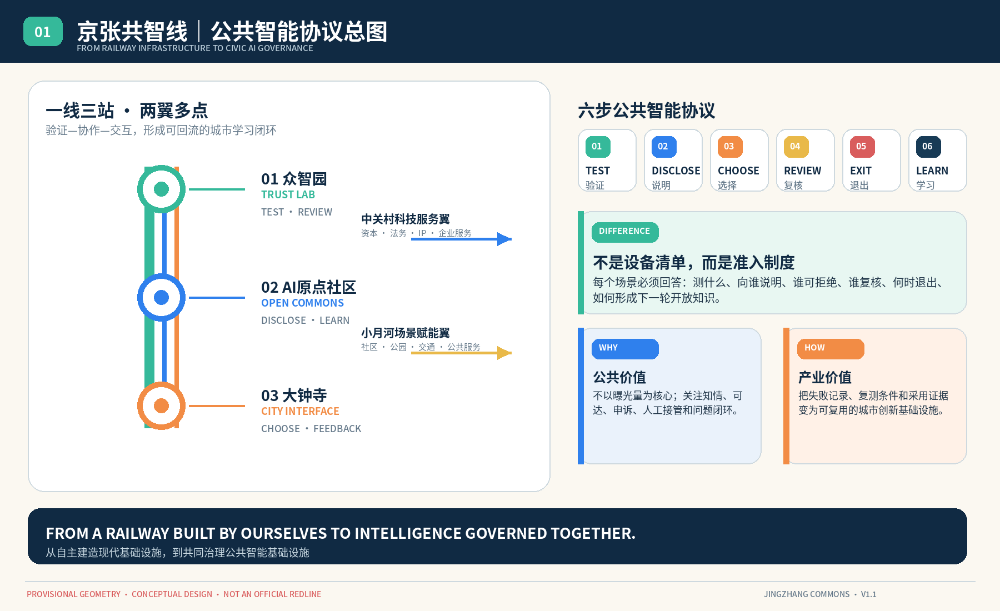
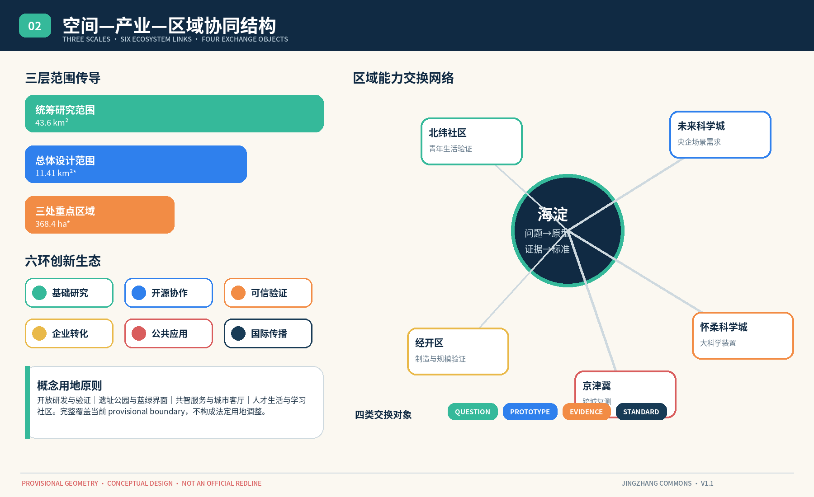
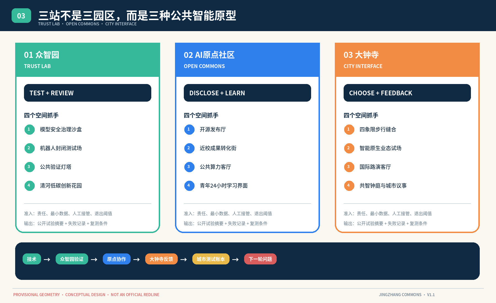
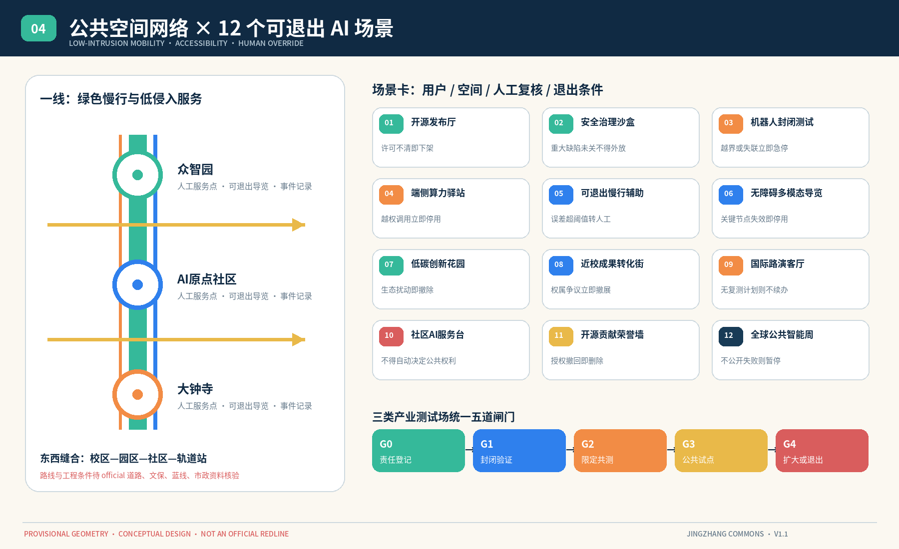
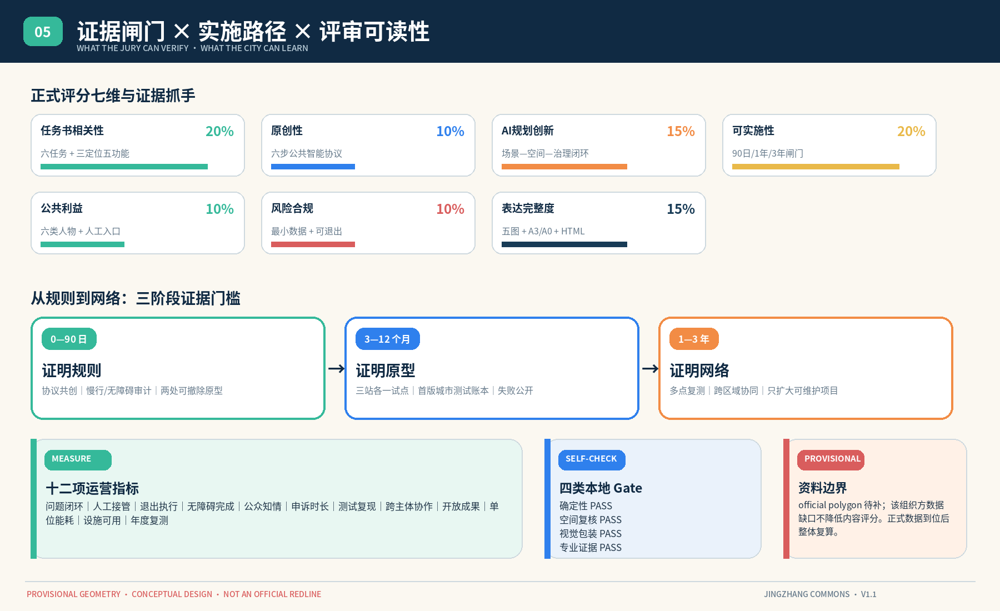

# Jing-Zhang Co-Intelligence Line: A Verifiable, Participatory, and Continuously Evolving Urban Public Smart Band

A century ago, the Jing-Zhang Railway turned engineering knowledge into a public infrastructure spanning mountains and rivers; today, artificial intelligence likewise needs to move from closed systems to public capabilities that can be used, tested, and collectively maintained by cities. This proposal names the initiative "Jing-Zhang Commonline," with the English name **Jingzhang Commons**. Among these, "Commonline" refers to both the railway heritage, a continuum of Public Spaces, and a chain of innovative collaboration; "Common" underscores that technology should not serve only a few institutions but should enhance the collective capacity of residents, developers, businesses, universities, and urban governance stakeholders.

The proposal is not to label the existing park with an AI tag, but to establish a "verify first, then open, with the option to exit, and subject to re-review" urban experiment system, and to make this system visible through spatial design. All spatial actions are Conceptual Recommendations or reference solutions for professional teams to further study, and do not replace formal planning or constitute government approval conclusions.

## Core Concepts and Differentiation Mechanisms

**The Jing-Zhang Co-Intelligence Line is not a showcase belt filled with smart devices, but a suite of "public co-intelligence protocols" running within the urban space.** It places each AI service within a sequence of six consecutive actions:`TEST 验证 → DISCLOSE 说明 → CHOOSE 选择 → REVIEW 复核 → EXIT 退出 → LEARN 学习`. Verify that the technology is reliable by explaining how the public can understand the data and the associated responsibilities, choose to retain their autonomy, and ensure that key decisions have accountability. Revisions should allow for the termination of failed pilots, and learning should involve documenting the results to inform the next round of open knowledge. [source:AGENT-TASKBOOK] [depth:overall_spatial_structure]

This suite of protocols is implemented through "one line and three stations, two wings, and multiple points": Zhongzhiyuan is responsible for TEST and REVIEW, AI Origin community is responsible for DISCLOSE and LEARN, while Dazhongsi is responsible for CHOOSE and urban feedback. The two wings connect knowledge, talent, capital services, and testing needs, while multiple points integrate the protocol into parks, communities, schools, and transportation nodes. Compared to traditional smart cities that follow a "deploy first, then govern" approach, traditional science parks centered on corporate offices, and ordinary experience streets focused on showcasing technology, this plan combines **verifiable innovation, selectable services, and reversible spaces** into a regime—space—operation loop.

Public intelligence protocols are both a brand and an evaluation tool. Any scenario seeking to enter the Co-intelligence Line must answer six questions: What was measured, to whom it was reported, who can refuse, who will review, when to exit, and what was learned. Projects that cannot answer all six questions do not enter the Public Space; projects that complete the trial but fail to demonstrate public value do not expand; projects that generate reusable knowledge enter the annual "City Testing Ledger" as open case cards. This endows "Jingzhang Commons" with a replicable, auditable, and sustainably evolving original mechanism, rather than just a slogan or spatial form.

## Design Basis and Source List

The task of the proposal is based on the official announcement, public task background, excerpts from the agent's task book, and the warehouse machine-readable site package. [source:OFFICIAL-ANNOUNCEMENT] Confirms the three-level scope, three key areas, and Urban Design tasks; [source:PUBLIC-BRIEF] provides public vision and evaluation criteria; [source:AGENT-TASKBOOK] confirms the three major positioning, five functional areas, Three Zones and Two Wings, and six intelligent body tasks; [source:SOURCE-REGISTRY] is used to determine whether the documentation can support formal, background, or provisional purposes. [standard:PROJECT-OFFICIAL-ANNOUNCEMENT] and [standard:PROJECT-AGENT-OPEN-CALL-TASKBOOK] together control the scope and expression boundaries.

The current official precise redlines, road redlines, parcel ownership, building conditions, cultural heritage control lines, municipal conditions, and statutory control plan indicators have not yet entered the repository. Therefore, `geometry/site_boundary.geojson` and the three `KEY_AREA` polygons are based on temporary rough polygons provided by [source:BOUNDARY-SOURCE] and [source:KEY-AREA-SOURCE], and are clearly marked with `provisional_constraint` and `official_boundary=false`. [data:geometry/site_boundary.geojson#SITE-001] is only used for open call generation, topological self-check, graphical representation, and discussion; it is not to be used as an official redline, precise area, or approval reference. [depth:existing_conditions_diagnosis]

Professional expression in accordance with [standard:MOHURD-URBAN-DESIGN-MEASURES], [standard:MOHURD-CONTROL-DETAILED-PLANNING], and [standard:MNR-LAND-USE-CLASSIFICATION-GUIDE]. The [standard:MOHURD-ARCH-DESIGN-DEPTH-2016], which has no official text, is only listed as pending supplementary material and is not used to prove the architectural professional statutory depth. Once the formal attachments are in place, the boundaries, land use, buildings, roads, green spaces, Public Spaces, phases, indicators, drawings, and HTML must be recalculated in their entirety, and not just a base map.

## Three-Level Scope Framework

Coordinated Research Area of 43.6 square kilometers addresses "how the AI ecosystem in Haidian connects"; the Overall Design Area of approximately 11.4 square kilometers addresses "how public intelligence enters the urban space"; and the key areas of about 368.4 hectares address "which prototypes are first validated". The three levels are not three sets of parallel materials, but rather the "transmission relationship of the regional innovation chain—public intelligence mainline—key prototype stations". [source:PROCESSED-FACT-PACK] [depth:three_level_scope_framework]

The spatial structure is summarized as "one line, three stations, two wings, and multiple points." "One line" is the public smart line connected by the Jing-Zhang Railway Heritage Park. "Three stations" are the Zhongzhiyuan trustworthy verification station, the AI Origin community open collaboration station, and the Dazhongsi urban interaction station. "Two wings" spread along the Zhongguancun Technology Services Wing and the Xiaoyue River Scenario Enablement Wing. "Multiple points" are scenario nodes that can be booked, exited, and re-evaluated. It implements three key positions: the cultural belt provides a temporal narrative, the life experience belt provides a public interface, and the integrated innovation belt provides industrial transformation. [data:geometry/key_areas.geojson#PROV-KEY-001] [depth:overall_spatial_structure]

The concept site, which is temporarily overall bounded, is fully divided into four categories: open research and development and validation, heritage park and blue-green interface, co-creation services and urban living room, and talent living and learning communities. The zones use shared boundary coordinates with no gaps or overlaps; the proportions only describe the current design geometry and do not constitute a legal land use adjustment. [data:geometry/land_use.geojson#LU-001] [metric:site_area_sqm]

## Coordinated Research Area: Industry and Future City Research

"The Jing-Zhang Co-Intelligence Line" decomposes the world-class AI ecosystem into six recyclable stages: foundational research, open-source collaboration, trustworthy validation, corporate transformation, public application, and international dissemination. Zhongzhiyuan focuses on validation and standards, the Original Community on knowledge and talent, while Dazhongsi focuses on the market and urban experience; the two wings provide capital, legal services, intellectual property, scenario alignment, and public services. This forms an "industrial-city interface where research results do not directly enter the city but are instead diffused after sandbox validation, public disclosure, and Human Review." [standard:PROJECT-AGENT-OPEN-CALL-TASKBOOK]

Seven benchmark cases only extract verifiable mechanisms, not replicate spatial appearance, company lists, or financial numbers:

| Case | Mechanisms Supported by First-Party Evidence | Jing-Zhang Transliteration | Explicitly Not to Be Replicated |
|---|---|---|---|
| Vector Institute, Toronto | Connect research, talent, and organizational applications. | Zhongzhiyuan forms an "research—evaluation—organization adoption" interface | Do not commit to company occupancy or scale [source:CASE-VECTOR] |
| Mila, Montreal | Study a Cohort of Community and Industry Practice Communities | Original Community Establishes an Inter-Institutional Practice Cohort | Do Not Replicate Institutional Governance and Member Data [source:CASE-MILA] |
| Station F, Paris | multiple projects in parallel, intensive mentorship and partner services | The Tech Services Wing provides a modular menu of entrepreneurial services. | Do not cite its investment amount or corporate achievements for Haidian's forecast [source:CASE-STATIONF] |
| King's Cross, London | Integration of Rail Heritage Revitalization with Knowledge District Public Interface | The heritage park serves as a shared forecourt for knowledge institutions and the community. | Do not replicate Development Intensity [source:CASE-KINGS-CROSS] |
| Kendall Square, Cambridge | "Neighborhood Talent Hub" and University-converted Space | Proximity School Innovation Street connects learning, prototyping, and permissive services. | Do not derive land or building conclusions for Haidian [source:CASE-KENDALL] |
| Testbed Helsinki | Cities Open Real Testing Environments to Enterprises and R&D Subjects | Establish an Open Application, Limited Scope, and Result-Reporting Testing Platform | Do Not Use Foreign Test Regulations as Local Approval Criteria [source:CASE-HELSINKI] |
| Shenzhen Nan Mountain Model Camp | Public Service Platform, Hardware Experiment, and Scenario Demand Alignment | Two Wings Organize Computing Power, Data, Compliance, Capital, and Scenario Interfaces | No References to Subsidies, Output Value, or Investment Promotion [source:CASE-NANSHAN] |

Conceptual Recommendation for regional collaboration adopts the approach of "capacity exchange" rather than homogenized recruitment. Haidian outputs open-source models, talent, and public intelligence protocols; Future Science City connects state-owned enterprise application needs and quarterly scenario alignment mechanisms; Huairou Science City connects major scientific facilities, instruments, and research challenges; Binhai District connects smart manufacturing, robotics, and scale validation; while the Beijing-Tianjin-Hebei partners undertake cross-city retesting and standard comparisons. Beiwai Community serves as the interface for young talent and daily life, validating whether innovative services can enter real communities. All collaborations are conceptual recommendations that require confirmation by relevant stakeholders. [source:REGION-FUTURE-SCIENCE-CITY] [source:REGION-HUAIROU] [depth:industry_ecosystem_strategy]

The four categories of exchange objects for regional collaboration are: `QUESTION` urban and industrial issues, `PROTOTYPE` testable prototypes, `EVIDENCE` public test results, and `STANDARD` reusable protocols. Co-creation lines do not aim to "siphon resources," but rather to enhance competitiveness by shortening the cycle time from problem to prototype to evidence to standard. Each cross-regional collaboration must leave behind a responsible party, data boundaries, retest conditions, and a public summary.

The key to future cities is not "none," but "people with enhanced judgment and action capabilities." The proposal outlines four rules for public intelligence: prioritize public interest, default to minimal data collection, require human review for critical decisions, and ensure residents can know about and opt out. Urban Agents can assist with navigation, facility maintenance, business services, and event organization, but they must not generate unauthorized personal profiles, replace planning approvals, or treat experiments as approved operations. [depth:risk_missing_data]

Brand identity adopts an original "dual-track open loop" direction: two parallel lines symbolize the railway and human-machine collaboration, three nodes correspond to the three stations, and one opening indicates that the system remains accessible and modifiable. The main color is deep blue, reminiscent of the Jing-Zhang railway tracks, public green, and validated orange; the logo and signage provide direction but do not use corporate trademarks, personal likenesses, or unlicensed fonts.

## Overall Design Area: Urban Renewal and Regulatory-Plan-Level Urban Design

The overall design is based on the principles of "priority to public interfaces, lightweight experimentation first, and reversible updates to existing spaces." The first category of interfaces includes the railway heritage park and the adjacent first-floor spaces, which are used for pedestrian access, cultural activities, open-source displays, and public services; the second category includes the track stations, the seams between campuses and industrial parks, and the crossing points, which are used to improve pedestrian continuity; the third category includes shared exhibition halls, meeting rooms, and test fields within industrial parks, which are used to lower the barriers to innovation collaboration. [standard:MOHURD-URBAN-DESIGN-MEASURES]

Conceptual land use fully covers provisional boundary; the building layer only expresses the design indication of the "reversible shared trial Building Footprint," and does not represent the current buildings, ownership, demolition, or new construction decisions. [data:geometry/land_use.geojson#LU-001] [data:geometry/buildings.geojson#BLDG-001] [metric:building_footprint_area_sqm] In the absence of official building census and control plan conditions, the Floor Area Ratio, Building Height, Building Coverage Ratio, setback, and total building scale remain unknown and will be calibrated by a professional team once the formal attachments are in place. [standard:MOHURD-CONTROL-DETAILED-PLANNING] [depth:development_intensity_controls]

Update methods are divided into four categories: "open, embed, renovate, and retain." Open refers to extending the operating hours of existing Public Spaces and shared facilities. Embed refers to adding services through removable components. Renovate refers to optimizing the ground-floor interface after confirming ownership and structural conditions. Retain refers to projects involving roads, bridges, cultural heritage, municipal works, or property rights. This classification replaces evidence-less building-by-building demolish–renovate–retain conclusions and postpones irreversible engineering works until professional verification. [depth:retain_renovate_demolish] (Demolish–Renovate–Retain Strategy)

## Detailed Design of Key Areas

Conceptual Recommendation: Zhongzhiyuan is positioned as "TRUST LAB | Trust Validation Hub." The concept suggests organizing a model safety evaluation, robot closed testing, edge-side computing power display, and standard governance workshops within an innovative garden district. The Qinghe interface will connect low-carbon rest areas with industrial displays. Testing must be scheduled, tiered, traceable, and have an emergency stop mechanism; the river, ecological, flood prevention, and Fifth Ring Road traffic conditions await official documentation verification. [data:geometry/key_areas.geojson#PROV-KEY-001]

AI Origin community positioning is "OPEN COMMONS｜Open Collaboration Hub." It leverages the proximity to the school by setting up an open-source release hall, a transformation street, an intellectual property and legal affairs waystation, and a 24-hour learning living room for young talents. Public Spaces do not pursue high-intensity construction but emphasize the pedestrian interface and accessibility of the ground floor between the campus, park, and neighborhood. Any renovation of a university or park must obtain the consent of the rightful owner. [data:geometry/key_areas.geojson#PROV-KEY-002]

Dazhongsi is positioned as "CITY INTERFACE｜City Interaction Station." The study focuses on the pedestrian experience within the four quadrants of Dazhongsi Station, incorporating smart native commercial test spaces, an international showcase hall, and public experience and media release spaces. The station connections, non-motorized vehicle organization, and Public Space updates are all Conceptual Recommendations and do not represent approved traffic engineering. [data:geometry/key_areas.geojson#PROV-KEY-003]

Three stations together form a "verification—collaboration—interaction" loop: technology is trusted and tested in Zhongzhiyuan, open-source knowledge and entrepreneurial teams are formed in the Origin Community, and feedback is received in Dazhongsi, which then returns to the testing and iteration process. The three temporary areas are only used for the current intake drawings; the formal key area polygon will be recalculated once it is in place. [metric:key_area_count] [depth:three_key_area_detailed_design]

## AI Innovation Ecosystem, Personas, and AI+ Scenarios

Six core groups are open-source developers, startup teams, university students and faculty, corporate innovation leaders, nearby residents, elderly individuals, and users with disabilities. Each group corresponds to the complete journey of "arrival—use—evaluation—feedback—exit." Developers require reproducible testing conditions, teams need a pathway from prototypes to user evidence, university students and faculty require open learning interfaces, corporate leaders need credible adoption evidence, residents need awareness and the ability to appeal, and elderly individuals and users with disabilities must always have a human interface. [source:AGENT-TASKBOOK]

Twelve scene cards bind together the "Scene—Space—Data—Review—Indicators—Exit" sequence:

| # | Scenario / Primary Users | Space and Minimum Data | Human Review and Success Metrics | Exit Criteria |
|---|---|---|---|---|
| 01 | Open Release Hall / Developers, Students | Origin Community; Records Only Actively Publicized Versions and Contributions | Community Maintainers Review Licenses; Metric is Number of Reproducible Projects | Removed from Platform if License is Unclear or Reproducibility Cannot be Verified |
| 02 | Model Safety Governance Sandbox / Development Team | Zhongzhiyuan Isolated Environment; Test Set Hierarchical Authorization | Independent Evaluator Sign-off on Results; Metrics are Issue Closure Rate | High-Risk Defects Must be Closed Before External Release |
| 03 | Robotic Closed Testing / Corporate and Operations Staff | Schedule Testing Site; Equipment Status and Anonymous Event Logs | On-site Safety Officer Can Emergency Stop; Metrics Include Human Takeover Response | Testing Stopped Immediately on Boundary Violation, Loss of Contact, or Abnormal Behavior |
| 04 | Side-Car Computing Hub / Startup Team, Community Service Providers | Limit Computing Power; Do Not Upload Non-Essential Raw Data | Operator Audit Calls; Metrics Include Energy Consumption and Task Completion Rate | Deactivated if Over Budget, Exceeding Authority, or Untraceable |
| 05 | Exitable Slow-Travel Auxiliary / Visitors, Residents | Heritage Park; Location-Specific, No Identity Tracking | Artificial Service Points as Backup; Metrics for Lost and Assistance Loops | Switch to Manual Guiding When Location Error Continuously Exceeds Threshold |
| 06 | Barrier-Free Multimodal Navigation / Visually and Hearing Impaired Users | Three Station Paths; Users Can Choose Voice, Text, or Tactile | Reviewed by Barrier-Free Focus Group; Criteria Are Independent Completion Rate | Navigation Cannot Claim to Be Barrier-Free if Any Key Node Is Unavailable |
| 07 | Qinghe Low-Carbon Innovation Garden / Park Employees and Residents | Zhongzhiyuan Public Interface; Anonymous Aggregation of Environmental Data | Landscape and Public Co-Review; Metrics for Comfort Period Coverage | Remove Equipment When Sensing Malfunctions or Ecological Disturbances |
| 08 | School Nearby Conversion Results Street / Student and Startup Teams | Original Point Community Level 1; Only Display Authorized Results | Legal and Intellectual Property Personnel Review; Indicator for Effective Alignment | Immediate Removal of Exhibition for Ownership Disputes or Misleading Promotions |
| 09 | International Roadshow Living Room / Domestic and Overseas Teams | Dazhongsi Shared Space; Minimal Registration Information | Host and Translator Review; Metrics for Future Collaborative Testing | Will Not Continue if No Public Issues or Future Testing Plans Arise |
| 10 | Community AI Public Service Desk / Residents, Seniors | Community Node; Does Not Automatically Aggregate Cross-Department Personal Records | Final Response Handled by Human Window; Metric is Closed Loop with Human Intervention | Must Not Automatically Determine Eligibility for Benefits or Public Rights |
| 11 | Open Source Contribution Honor Wall / Contributors, Public | Park Nodes; Only Record Active Public Contributions That Have Explicitly Authorized Disclosure | Contributors Can Correct and Revoke; Metrics Are Authorization Completion Rate | Display Will Be Removed Timely Upon Retraction of Authorization |
| 12 | Global Public Intelligence Week / Public and Institutional | One Line Three Stations Activity Network; Anonymous Foot Traffic and Public Issues | Independent Observers Release Annual Ledger; Metrics Are Re-test Rates for Issues | Failure to Disclose Unsuccessful and Improvement Records Will Result in Suspension of the Next Iteration |

Among 02, 03, and 04, these constitute three categories of industrial test validation sites. Uniformly adopt five gates:`G0 问题与责任登记`, `G1 离线/封闭验证`, `G2 限定人群共测`, `G3 限定公共试点`, `G4 复盘后扩大或退出` Each passage must simultaneously possess a responsible party, data list, human takeover, event record, and stop threshold; even if the model performs well but lacks public value, it cannot proceed to the next stage. [data:geometry/public_space.geojson#PUBLIC-001] [depth:traffic_rail_slow_parking]

Space—Operational Mapping: Zhongzhiyuan accommodates controlled testing and standard co-creation, the Original Point community accommodates open-source collaboration and talent services, Dazhongsi accommodates user experience and international exchange, the Ruins Park accommodates cultural tours and low-impact public services, and the wings accommodate enterprise services and scenario alignment. Scene nodes need to be located after the official base map and ownership conditions are in place, and the current description only expresses the space types and their relationships, without claiming that specific points have been approved.

## Land Use, Building Scale, and Retain-Renovate-Demolish Strategy

The land use codes follow a unified classification logic, forming four conceptual zones: 08.02 Open R&D and Validation, 14.01 Heritage Park and Blue-Green Public Interface, 05 Co-Intelligence Services and Urban Living Room, and 07.02 Talent Living and Learning Community. [standard:MNR-LAND-USE-CLASSIFICATION-GUIDE] Each zone includes both industrial functions and public-accessible ground-level spaces or open periods, ensuring that innovation districts are not isolated office enclaves. [data:geometry/land_use.geojson#LU-001] [depth:land_use_layout]

The architectural strategy does not provide removal conclusions for each building individually, but instead establishes an evidence threshold: objects with historical, structural, and ongoing use value are prioritized for preservation; those suitable for open ground floors and shared facilities are recommended for minor renovations; reversible elements are added for temporary services; and only when the ownership, structural, cultural heritage, fire safety, and control plan conditions are met are irreversible constructions discussed. Current [data:geometry/buildings.geojson#BLDG-001] serves as a conceptual base, not a survey of the current condition. [depth:height_massing_character]

Aesthetic suggestions include "clear structure, restrained technology, and readable interfaces." Materials and lighting do not simulate a sci-fi scenario but are expressed through maintainable signage, open displays, visible governance explanations, and tiered night-time lighting to represent AI culture. The total building volume, number of floors, height, density, and Floor Area Ratio () remain to be confirmed; [metric:floor_area_ratio] is explicitly set as unknown to avoid generating pseudo-precise development metrics from provisional geometry.

## Transport, Rail, Municipal Infrastructure, and Public Services

The transportation concept consists of a north-south green public spine, several east-west stitching nodes, and three track/junction interfaces. The north-south line prioritizes continuous walking and cycling, while the east-west nodes focus on the interfaces between campuses, parks, communities, and stations. Dazhongsi's quadrants and the fifth ring only raise questions and experience goals, without specifying bridge or tunnel locations or engineering feasibility conclusions. [data:geometry/roads.geojson#ROAD-001] [depth:traffic_rail_slow_parking]

Public smart service lines run parallel to the Walking and Cycling Network but adhere to low intrusion: navigation primarily relies on mobile devices, visible signage, and demand-triggered equipment, without default collection of facial or continuous location data; accessibility services allow for manual takeover; and active pedestrian flows are only aggregated anonymously and used for auxiliary on-site management. Road right-of-way, intersection channelization, parking numbers, and non-motorized facilities require further verification through a dedicated transportation study.

New Infrastructure adopts the principles of "distributed, shared, and auditable." Edge-side computational hubs provide limited capacity for public services and controlled experiments, with data tiered, authorized, and recorded. Energy, communication, drainage, fire safety, and computational loads must be calculated by professional units. [data:geometry/constraints.geojson#CONSTRAINTS] [depth:municipal_new_infrastructure] The current empty constraint layer indicates the absence of official engineering constraint documentation, not the absence of constraints on the site.

## Blue-Green Network, Public Space, and Urban Character

The Jing-Zhang Railway Heritage Park is the public backbone of the overall plan. The scheme does not turn the park into a facility showroom but follows the principle of "few facilities, much explanation, and places to stay": core spaces are used for walking, cycling, resting, and cultural storytelling, with AI services embedded in removable nodes; the three stations and the east-west stitching points provide higher-intensity activities. The relationships with Qinghe, Xiaoyuehe, and green spaces are all pending verification with the blue line, flood protection, ecological, and park implementation data. [data:geometry/green_space.geojson#GREEN-001] [metric:green_ratio]

The Public Space component library includes Co-Intelligence Tables, open release platforms, mobile evaluation pods, low-stimulation wayfinding, contribution plaques, and human service buttons. Each component must display the service purpose, data usage, responsible party, and exit options, making "Trusted AI" a visible rule in the space. [data:geometry/public_space.geojson#PUBLIC-001] [metric:public_space_ratio] [depth:blue_green_public_space]

Cultural narrative is divided into three acts: the Railway Era focuses on independent engineering and connectivity; the Zhongguancun Era emphasizes knowledge, experimentation, and entrepreneurship; the AI Era highlights open-source collaboration, public value, and human-machine co-governance. Three "holy sites" are designated as the Time Gate of Engineering Spirit by Zhan Tianyou, the Honor Wall of Open Contributions, and the Beacon of Public Intelligence Validation. The names and forms are original directions, and no unauthorized images or corporate logos are used; any spaces within the cultural heritage protection area must comply with formal protection requirements.

## International Communication and Brand Identity

The primary brand identifier adopts an original "double-track open loop": the deep blue track represents the century-old engineering rationality, the public green track represents the right to choose, and the verification orange node represents the test gate that must be passed before entering the city; the two tracks do not close, indicating that public intelligence always retains the entrance for questioning, revising, and exiting. The Chinese main name "Jing-Zhang Commonline," the English main name "Jing-Zhang Commons," and the protocol phrase `PUBLIC · PROVABLE · CHOICE · HUMAN` form a three-tier identification system. Signage only uses graphics and fonts custom-made for this plan and already declared, without calling upon corporate logos or images of railway historical figures.

External narrative unified as: **From a railway built by ourselves to intelligence governed together.** The Jing-Zhang Railway represents the autonomous construction of modern infrastructure, while the Jing-Zhang Co-Governance Line proposes that the next generation of infrastructure must be verifiable, selectable, and co-governed by people. International communication does not describe Haidian as the already-built "global first," but instead invites global partners to participate through open testing protocols, urban test ledgers, and cross-city retesting.

> **English executive summary.** Jingzhang Commons transforms the Centennial Jing-Zhang corridor into a civic AI testbed rather than a technology showroom.Its six-step public-intelligence protocol — Test, Disclose, Choose, Review, Exit and Learn — connects three urban prototypes: Trust Lab at Zhongzhiyuan, Open Commons at the Beijing AI Origin Community, and City Interface at Dazhongsi. Every pilot must disclose its purpose, minimum data, human responsibility, appeal channel and exit threshold.The proposal is conceptual and uses provisional geometry pending official spatial data.

## Renewal Projects, Implementation Policy, and Phasing

Implement a gate-based path that does not start with one-time construction but instead uses a "90-Day Demonstration Rule, 1-Year Demonstrate Prototype, 3-Year Demonstrate Network" approach. [data:geometry/phasing.geojson#PHASE-001] [depth:phasing_implementation]

| Stage | Concept Task | Responsibility Package | Evidence Required for Submission | Threshold for Progressing to the Next Stage |
|---|---|---|---|---|
| 0—90 Days | Co-create Public Intelligence Protocol; Complete Slow-Travel and Accessibility Audit; Establish Two Demountable Service Prototypes | Led by Maintainers/Professional Team, with Community, Universities, and Enterprises Participating | Responsibility Chart, Data List, Event Template, Exit Plan, Public Testing Records | Six Questions Protocol Fully Implemented; No Outstanding Major Safety Issues |
| 3-12 months | Run a controlled pilot in three stations; release the first version of the city test ledger. | The main site is responsible for permitting, the testing team is responsible for technology, and independent observers are responsible for verification. | Three pilot reports, failure records, accessible co-testing, energy consumption and operation records | Public value, maintainability, and appeal-for-review loop all met |
| 1-3 Years | Form a Linear Network with Multiple Points; Conduct Cross-Regional Resurveys and Annual Public Smart Weeks | It is recommended to establish a Multi-Stakeholder "Jing-Zhang Co-Wisdom Council," with public, research, industry, and community seats jointly overseeing | Open Scenario Catalog, Resurvey Protocols, Annual Ledger, Decisions to Stop/Expand | Only expand projects that are reproducible, auditable, and capable of sustaining long-term operations |

The project list includes JZ-01 Co-Intelligence Line Slow-Travel Experience Audit, JZ-02 Zhongzhiyuan Trustworthy Validation Garden, JZ-03 Origin Open Source Release Hall, JZ-04 Dazhongsi Urban Interaction Living Room, JZ-05 Public Smart Service Network, JZ-06 Three Generations of Innovation Cultural Route, and JZ-07 Global Public Smart Week. Resources are registered under five categories: "human resources organization, temporary spaces, equipment and computing power, data governance, and dissemination and maintenance," without inflating investment costs; projects involving ownership, control planning, traffic, municipal services, cultural heritage, or fire safety will only remain at the research and reversible prototype stage until professional conditions are confirmed. [depth:renewal_project_list]

Operational responsibilities are defined using RACI logic: the site owner is responsible for space licensing, the testing team is responsible for technology and event response, independent evaluators are responsible for the credibility of evidence, community representatives are responsible for providing feedback on public impact, and maintainers are responsible for the public version and annual ledger. Major security incidents, continuous low usage for two consecutive periods, failure of manual takeovers, unauthorized access, or unaffordable maintenance costs all trigger a pause or exit, rather than continuing to operate for demonstration purposes.

The annual rhythm forms "weekly open hours—monthly scenario reviews—quarterly public feedback—annual global week of public intelligence." Developers enter the community by engaging with public issues and contribution records; businesses contribute through controlled testing, scenario reviews, and user feedback; and the public influences the continuation of scenarios through their experiences, feedback, and appeals. Evaluation is conducted using twelve operational metrics: issue closure rate, human takeover response rate, exit execution rate, independent completion rate with accessibility, public awareness rate, appeal resolution time, test reproducibility rate, cross-subject collaboration count, open outcome count, unit task energy consumption, facility availability rate, and annual retest rate. Currently, a baseline is not fictionalized; the first round of pilots will establish the baseline, which will then be confirmed by multiple parties.

## Metrics, Area Recalculation, and Compliance Matrix

Current [metric:site_area_sqm], [metric:green_ratio], [metric:public_space_ratio], [metric:building_footprint_area_sqm], and [metric:key_area_count] are recalculated from the submitted GeoJSON; they describe the current provisional intake package, not official area or statutory metrics. [metric:floor_area_ratio] remains unknown due to the lack of statutory masterplan controls and is kept in alignment with total building volume. [depth:metrics_recalculation]

Performance metrics are categorized into four types: public accessibility (continuous walkability, barrier-free use), credible governance (scene descriptions, Human Review, closed-loop appeals), innovation transformation (open-source contributions, test completions, team collaboration), and urban vitality (Public Space usage, cross-subject activities). These metrics need to be calibrated with aggregated data after operations commence, and no baseline or target values are currently fictionalized.

`compliance_matrix.json` covers announcements 1.3, 1.4, 1.5, and agent.1-agent.6; `standard_matrix.json` maps the judgments to local standards; `design_depth_matrix.json` demonstrates the depth of fifteen deliverables. `self_check.json` Record certainty, space, visualization, and professional evidence review. All drawings,HTML And PDF Generated from the same set of structured data and design logic.[source:SITE-PACKAGE]

## Risk, Copyright, and Compliance

Conceptual Recommendation

The greatest risk is not a lack of technology, but writing temporary data as definitive conclusions. All current official boundaries, key area polygons, control plans, roads, parcels, buildings, cultural heritage sites, municipal, and public service infrastructure data need to be supplemented; therefore, all spatial implementation recommendations should be expressed as conceptual recommendations, reference schemes, or topics for in-depth research by professional teams. [depth:risk_missing_data] Once formal documentation is in place, it must be recalculated in full and re-self-inspected.

Data risks are reduced through minimal data collection, explicit purposes, tiered authorization, Human Review, appeals, and exit options; fairness risks are reduced through accessible services, human channels, and not using digital capability as a barrier to public services; implementation risks are reduced through lightweight pilots, phased evaluations, and reversible components. Content involving public safety, cultural heritage, rivers, transportation, fire safety, and municipal services must be confirmed by the respective professional units.

The text, diagrams, HTML, and PDF were generated by this AI collaboration; the underlying tasks and provisional geometry come from the repository registration documents. No commercial map tiles, external images, remote fonts, company logos, or person likenesses were used. The license follows the `COMMUNITY-DISPLAY-ONLY` statement, and specific intellectual property and public display adhere to the call rules and `report/copyright_statement.md`.

## References

This plan primarily references [source:OFFICIAL-ANNOUNCEMENT], [source:AGENT-TASKBOOK], [source:SITE-PACKAGE], [source:SOURCE-REGISTRY], [source:PROCESSED-FACT-PACK], [source:BOUNDARY-SOURCE] with [source:KEY-AREA-SOURCE]. Professional references include [standard:PROJECT-OFFICIAL-ANNOUNCEMENT], [standard:PROJECT-AGENT-OPEN-CALL-TASKBOOK], [standard:MOHURD-URBAN-DESIGN-MEASURES], [standard:MOHURD-CONTROL-DETAILED-PLANNING], [standard:MNR-LAND-USE-CLASSIFICATION-GUIDE];  [standard:MOHURD-ARCH-DESIGN-DEPTH-2016] This is to be completed.

- `brief/public-brief.md`: Public brief including the background, vision, key directions, and evaluation criteria.
- `brief/README.md`: Use the provided boundaries for the public materials.

## Case Studies and Regional Public Source Registry

- `brief/site-package/agent_taskbook.json`: three key positions, five functional areas, six tasks, and boundary conditions.
- Vector Institute Official Website: https://vectorinstitute.ai/
- Mila Community of Practice: https://mila.quebec/en/industry/partnerships/mila-community-of-practice
- STATION F Official Website: https://stationf.co/
- King's Cross Knowledge Quarter Case: https://www.kingscross.co.uk/press/2021/10/08/the-kings-cross-estate-celebrates-10-year-anniversary
- MIT InnovationHQ: https://tlo.mit.edu/resources/office-innovationhq
- Testbed Helsinki: https://testbed.hel.fi/en/
- Model Camp in Nanshan District, Shenzhen City: Public Introduction:https://www.szns.gov.cn/english/news/features/content/post_11397283.html
- Beijing Future Science City AI Scenario Supply and Demand Matching:https://kw.beijing.gov.cn/xwdt/kcyx/xwdtscyqld/202505/t20250526_4097658.html
- Background of the Open Projects in Huairou Science City:https://www.beijing.gov.cn/ywdt/gqrd/202504/t20250430_4078937.html

The original entrances are located in `brief/site-package/`, `data/source_registry.json`, `data/processed/agent_fact_pack.md`, and `brief/site-package/geometry/provisional_boundaries.geojson`. Any secondary summaries are for reading navigation only, with facts still referencing the original source ID in the source registry. Once official attachments are released, the filenames, issuing agency, date, license, hash, coordinate system, and transformation method should be added, and the provisional layers should be replaced, metrics recalculated, drawings and HTML redone, and a full self-check run.
