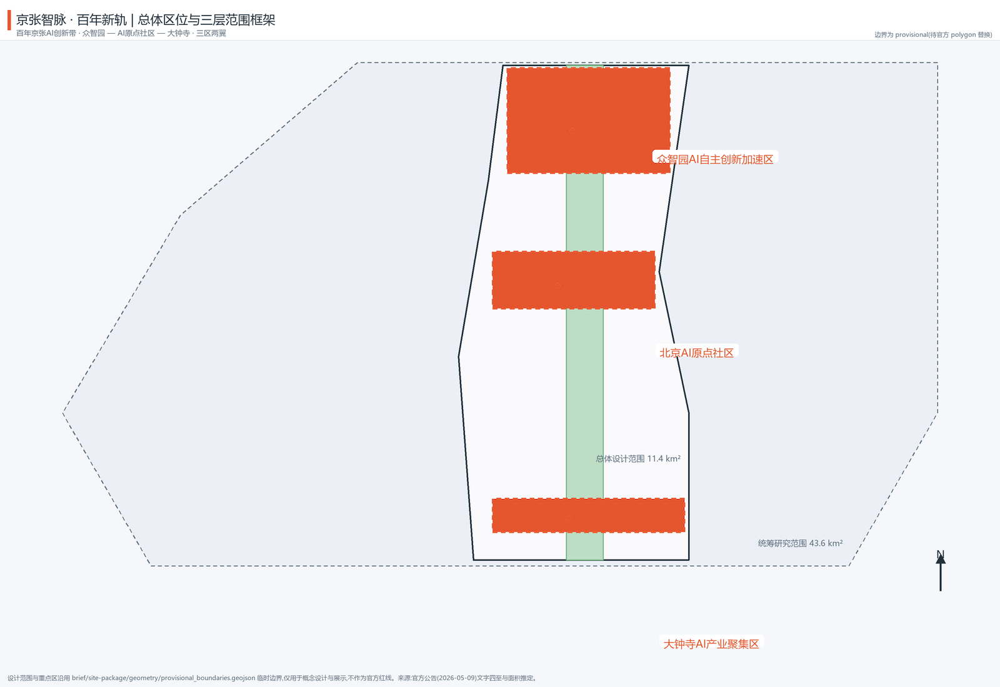
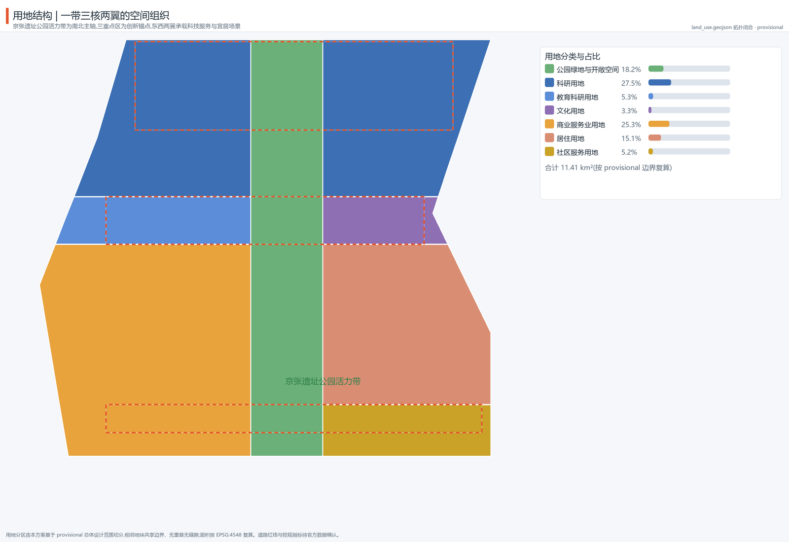
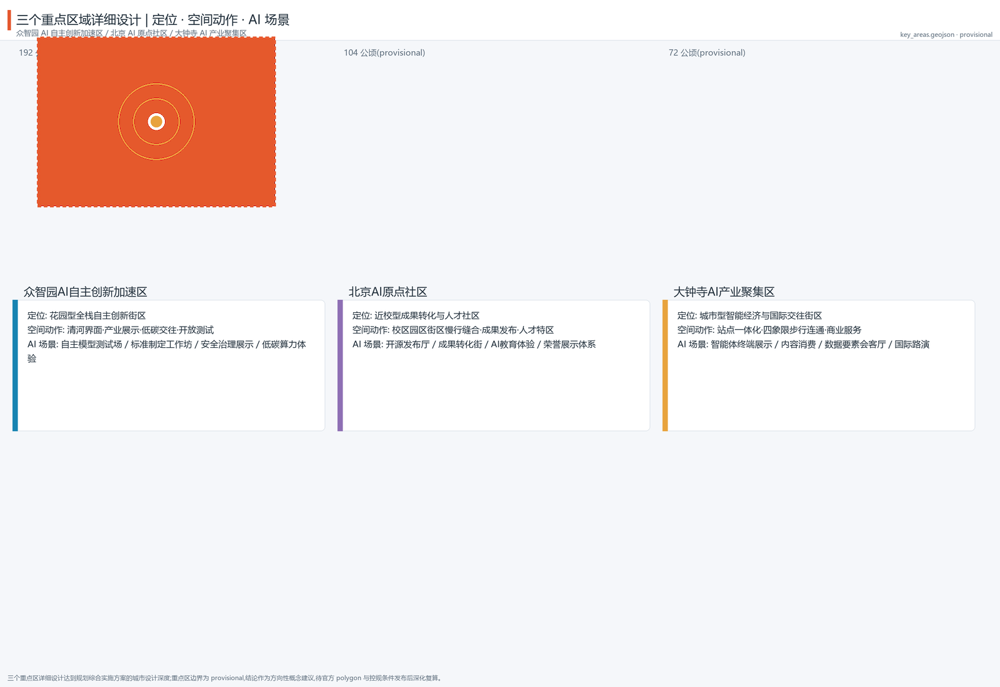
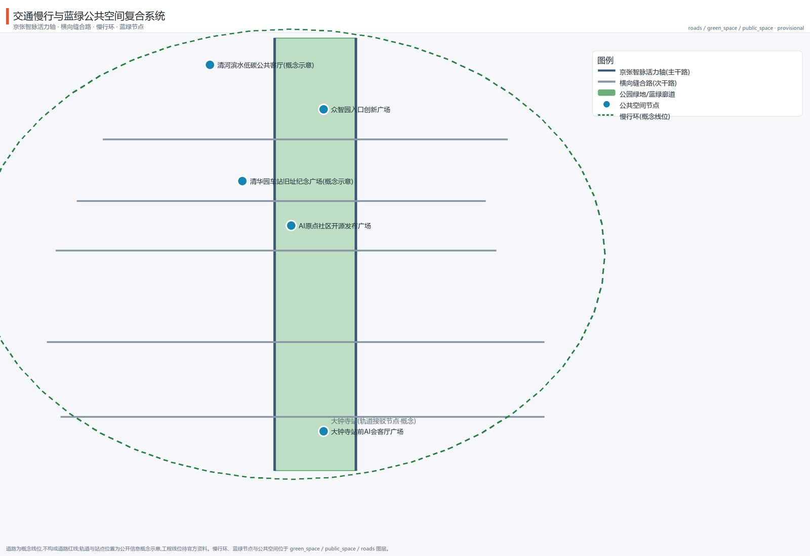
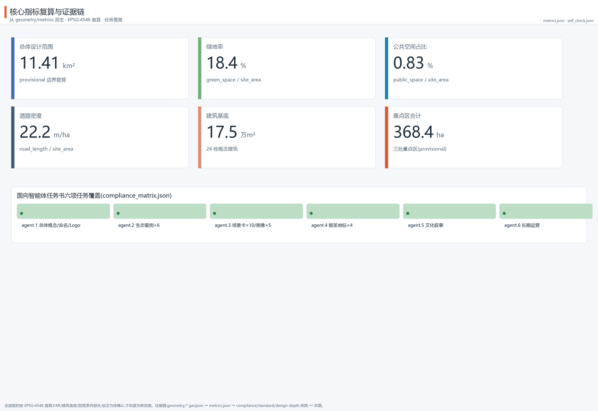

# Jingzhang AI Pulse: A Century-Old Rail Reborn as an AI Innovation Belt

## Design Basis and Source Inventory

This proposal takes the Qualification Pre-announcement of the Centennial Jing-Zhang AI Innovation Belt International Urban Design Solicitation, issued by the Haidian Branch of the Beijing Municipal Commission of Planning and Natural Resources, as its primary authoritative basis, and uses the machine-readable brief, allowed design space, enums, ranges, source inventory, and standards library under `brief/site-package/` as traceable basis [source:OFFICIAL-ANNOUNCEMENT] [standard:PROJECT-OFFICIAL-ANNOUNCEMENT]. The agent-facing open-call taskbook (agent.1–agent.6) and its ten co-creation principles directly constrain how this document is organized [source:AGENT-TASKBOOK] [standard:PROJECT-AGENT-OPEN-CALL-TASKBOOK]; the source registry distinguishes formal-ready, background, provisional, and needs-review materials, and this proposal uses only formal-ready materials for formal judgments while labeling all provisional material [source:SOURCE-REGISTRY] [source:PROCESSED-FACT-PACK].

As of the retrieval date (2026-08-10), the official announcement does not include an exact polygon; this proposal uses the organization-provided provisional replacement boundary `provisional_boundaries.geojson` for generation, self-check, and visualization [source:BOUNDARY-SOURCE]. That boundary may only be used for AI generation, display, and design discussion; it must not be treated as an official redline, approval basis, or precise-area conclusion. Once official polygons are released, the site boundary, key areas, land use, roads, green space, public space, buildings, phasing, and all area metrics must be recalculated. The organization's data gap does not by itself block content scoring, but every spatial conclusion in this proposal is expressed as "discussable, reviewable, and to be recalculated after official data replacement" [source:KEY-AREA-SOURCE].

The narrative keeps only a few evidence anchors directly tied to each judgment; the complete sources, metrics, standards, design-depth items, and task coverage are stored in `sources.json`, `metrics.json`, `standard_matrix.json`, `design_depth_matrix.json`, and `compliance_matrix.json`, not repeated as machine indexes in the text. Every sentence remains natural and complete after the evidence markers are removed [source:SITE-PACKAGE].

## Three-Level Scope Framework

The proposal organizes work according to the three levels defined by the announcement [standard:PROJECT-OFFICIAL-ANNOUNCEMENT] [depth:three_level_scope_framework]:

- **Coordinated research area (43.6 km²)**: bounded by the North 5th Ring Road, Jingzang Expressway, Xizhimenwai Street, and Wanquanhe Road, answering questions of AI industrial ecology, strategic positioning, innovation chain, and future urban form [data:geometry/site_boundary.geojson#SITE-001] [metric:site_area_sqm].
- **Overall design area (11.4 km²)**: the urban and industrial area within 1–2 km around the Jing-Zhang heritage park, developed to regulatory-plan urban design depth, implementing renewal framework, industrial space, transport/municipal support, and urban character control [metric:site_area_sqm] [depth:overall_spatial_structure].
- **Key detailed design area (368.4 ha)**: the three key areas—Zhizhiyuan, AI Origin Community, and Dazhongsi—developed to implementation-plan urban design depth, verifying the feasibility of parcels, buildings, transport, public space, and AI scenarios [data:geometry/key_areas.geojson#PROV-KEY-001] [metric:key_area_count].

The three levels are progressively refined: the coordinated research area decides industry-chain and urban-form judgments, the overall design area lands them into renewal projects and facility capacity, and the key areas verify implementability. All three levels map to announcement clauses 1.3, 1.4, 1.5, and agent.1–agent.6 in `compliance_matrix.json` [depth:three_level_scope_framework] [depth:metrics_recalculation].

The boundary adopted here is the organization's provisional replacement boundary (`official_boundary=false`, `geometry_role=provisional_constraint`, `boundary_precision=provisional_rough`). All spatial layers and metrics are calculated on this boundary, with precision warnings retained in the narrative, HTML, drawings, sources, and assumptions; after official polygons replace it, all layers and metrics must be recalculated [source:BOUNDARY-SOURCE] [metric:land_use_cover_sqm].

## Coordinated Research Area: Industry and Future City Study

### Overall Concept, Naming System, and Visual Identity (agent.1)

This proposal puts forward the overall concept "Jingzhang AI Pulse" (Chinese: 京张智脉 · 百年新轨), with the naming system "one corridor, three cores, two wings": the corridor is the Jingzhang AI Pulse Corridor; the three cores are the Zhizhiyuan AI Acceleration Core, the AI Origin Community, and the Dazhongsi Industry Core; the two wings are the Zhongguancun Service Wing and the Xiaoyuehe Scenario Wing [source:AGENT-TASKBOOK].

The logo direction translates the "herringbone railway × neural network" symbol: the herringbone alignment of Zhan Tianyou's Jing-Zhang Railway forms the skeleton, a node-connected neural network forms the body, producing a symbol that unfolds from south to north and converges into "pulse nodes" at the three key areas. The visual specification suggests a three-color system of Jing-Zhang heritage rust red (history), Haidian tech blue (innovation), and AI-pulse green (public space); fonts prefer open-source typefaces, and all identity assets are self-drawn vectors that do not reference uncleared trademarks [source:AGENT-TASKBOOK] [standard:PROJECT-AGENT-OPEN-CALL-TASKBOOK].

The three positionings (Centennial Jing-Zhang Culture Belt, Urban AI Life Experience Belt, AI Integration Innovation Belt), the five functions (AI full-stack independent innovation system, world-class AI innovation ecosystem, AI+ scenario empowerment paradigm, intelligent AI vibrant city, global voice in AI governance), and the three-cores-two-wings synergy loop form the logical core of the overall structure: Zhizhiyuan carries "full-stack independent innovation and governance voice", the AI Origin Community carries "world-class ecosystem and open-source culture", Dazhongsi carries "intelligent-native new business forms", the Zhongguancun Wing provides global factor allocation and capital empowerment, and the Xiaoyuehe Wing carries scenario empowerment and vibrant living [source:AGENT-TASKBOOK] [depth:overall_spatial_structure].

### Global AI Innovation Ecosystem Cases (agent.2)

Six transferable global AI ecosystem cases serve as references for spatial, operational, and institutional design (full sources and use boundaries are recorded in `sources.json`) [source:AGENT-TASKBOOK] [metric:ai_ecosystem_case_count]:

| Case | Key lesson | Transfer to Haidian |
| --- | --- | --- |
| Sand Hill Road venture corridor, Silicon Valley | Walkable overlay of capital density and social networks | "Capital + services" walking street in the Zhongguancun Service Wing |
| Kendall Square, Boston | University-incubator-pharma symbiosis; re-urbanization of a forgotten district | Near-campus transformation and talent zone in the AI Origin Community |
| one-north, Singapore | Unified branding, graded public space, scenario-first development | Belt-wide branding and "scenario-first, operations feedback" |
| King's Cross, London | Railway-heritage renewal into an innovation quarter; public space first | Renewal path of the Jing-Zhang heritage park corridor |
| Nanshan Science Park, Shenzhen | Anchor-chain enterprises plus SME rain-forest ecology | Dazhongsi anchor enterprises and agent ecosystem organization |
| Future Sci-Tech City, Hangzhou | Integrated platform-scenario-talent operations | Xiaoyuehe Scenario Wing and open-testing mechanisms |

These cases are not copied; six mechanisms are extracted—walkable capital networks, near-campus transformation, unified branding, heritage activation, anchor-chain ecosystems, and scenario operations—and translated into the spatial and operational moves in the following chapters [depth:overall_spatial_structure].

### Future Urban Form Study

The ways AI changes work, life, socializing, learning, transport, and public services are here translated into locatable function zones, nodes, corridors, and scenarios: the innovation chain "university ideation—open-source collaboration—enterprise conversion—public experience—international communication" unfolds along the Jingzhang AI Pulse spine; edge computing, robot delivery, autonomous shuttle, and AI guideway capabilities enter selected streets under "monitorable, reviewable, bookable" principles [source:AGENT-TASKBOOK] [standard:GENERATIVE-AI-INTERIM-MEASURES]. All future-urban-form descriptions are conceptual suggestions and material for professional teams to deepen; they are not engineering or operational commitments [depth:three_level_scope_framework].

## Overall Design Area: Urban Renewal at Regulatory-Plan Urban Design Depth

### Overall Spatial Structure

The overall design area adopts the "one corridor, three cores, two wings, multiple scenario nodes, blue-green slow-mobility loop" structure [depth:overall_spatial_structure] [data:geometry/land_use.geojson#LU-001]:

- **One corridor**: the Jing-Zhang Heritage Park vitality corridor, the north-south spine and the largest public asset, carrying cultural narrative, slow commuting, and AI public experience;
- **Three cores**: the three key areas as industry and scenario anchors;
- **Two wings**: the western Zhongguancun Service Wing (commercial office and tech services) and the eastern Xiaoyuehe Scenario Wing (livable communities and scenario experience);
- **Multiple scenario nodes**: AI+ scenario nodes and public service points along the spine and wings;
- **Blue-green slow-mobility loop**: composed of the park corridor, Qinghe/Xiaoyuehe blue-green space, and the slow loop, stitching east-west and linking north-south.

The land-use structure is expressed by `land_use.geojson`: eight land-use categories topologically close the submitted boundary with no overlaps or gaps (11.41 km² total): park green and open space 2.08 km² (18.2%), research land 3.14 km² (27.5%), education-research land 0.61 km², cultural land 0.38 km², commercial-services land 2.89 km², residential land 1.72 km², and community-services land 0.60 km² [data:geometry/land_use.geojson#LU-001] [metric:land_use_cover_sqm] [standard:MNR-LAND-USE-CLASSIFICATION-GUIDE].

### Urban Renewal at Regulatory-Plan Depth

Renewal follows a "retain—renovate—new-build" classification: the Jing-Zhang railway heritage, the Qinghuayuan Station heritage site, and surrounding heritage-protection environment are retained and activated as a whole; existing industrial buildings are updated through "micro-renovation plus function replacement"; and the core parcels of the three key areas add innovation space through new build and composite use. Because official regulatory-plan conditions (FAR, height, density, green ratio, setback, road redlines) are not yet published, all such content is labeled **pending official regulatory-plan confirmation** and never substitutes inferred values for approved indicators [depth:development_intensity_controls] [depth:retain_renovate_demolish] [standard:MOHURD-CONTROL-DETAILED-PLANNING].

Building footprints are expressed by 24 conceptual buildings in `buildings.geojson` (research offices, education-research, cultural exhibition, commercial services, residential, and community facilities), with a total footprint area of about 175,000 m² used only as design-discussion scale, not as a building-scale conclusion [data:geometry/buildings.geojson#BLDG-001] [metric:building_footprint_area_sqm] [metric:building_count].

## Key Area Detailed Design

Each of the three key areas is developed to implementation-plan urban design depth, forming a readable mini-scheme of "positioning + spatial structure + building renewal + transport and slow mobility + public space + AI scenarios + implementation risk" [depth:three_key_area_detailed_design].

### Zhizhiyuan AI Acceleration Area (approx. 192.1 ha)

- **Positioning**: a garden-type full-stack independent innovation district carrying "AI full-stack independent innovation system and global voice in AI governance" [data:geometry/key_areas.geojson#PROV-KEY-001].
- **Spatial structure**: a low-carbon blue-green interaction belt along the Qinghe waterfront, with an industry-exhibition and standards-governance axis at the center.
- **Building renewal**: retain research and headquarters buildings, renovate inefficient industrial space into shared testing and standards workshops, and add a safety-governance exhibition center (conceptual suggestion).
- **Transport and slow mobility**: strengthen external transport links and 5th Ring Road connections; organize the interior slow-mobility first.
- **Public space**: an entrance innovation plaza and a Qinghe waterfront low-carbon public living room [data:geometry/public_space.geojson#PUBLIC-003].
- **AI scenarios**: autonomous-model testing ground, standards workshops, safety-governance exhibition, low-carbon compute experience (bookable and monitored).
- **Implementation risk**: engineering and low-carbon calculations need professional deepening; no implementation conclusion before regulatory and ownership data are available.

### Beijing AI Origin Community (approx. 104.3 ha)

- **Positioning**: a near-campus transformation and talent community carrying "world-class AI innovation ecosystem" and open-source cultural origin functions [data:geometry/key_areas.geojson#PROV-KEY-002].
- **Spatial structure**: organize campus—park—neighborhood three-level slow-mobility stitching, forming a composite interface of release—incubation—exhibition—living.
- **Building renewal**: retain university and research-institute holdings; renovate street-level shops and older buildings into transformation stations and open-source collaboration space; add an open-source release hall and talent-service complex (conceptual suggestion).
- **Transport and slow mobility**: campus-park slow links and station-integrated connections (Wudaokou direction).
- **Public space**: an open-source release plaza and a Qinghuayuan Station heritage memorial plaza (conceptual indicator, not an official heritage redline) [data:geometry/public_space.geojson#PUBLIC-002].
- **AI scenarios**: open-source release hall, near-campus transformation street, AI education experience points, honor display system.
- **Implementation risk**: any renovation touching university or research-institute property requires ownership and heritage permits first.

### Dazhongsi AI Industry Cluster (approx. 72.0 ha)

- **Positioning**: an urban intelligent-economy and international-exchange district carrying "intelligent-native new business forms" [data:geometry/key_areas.geojson#PROV-KEY-003].
- **Spatial structure**: organize station-integrated development around Dazhongsi station and four-quadrant pedestrian connectivity, building a commercial interface for agents/smart terminals/content consumption.
- **Building renewal**: retain leading-enterprise buildings, renovate older commercial properties, and add an international roadshow hall and a data-element living room (conceptual suggestion).
- **Transport and slow mobility**: transit-first connections and a four-quadrant pedestrian network that removes detour gaps.
- **Public space**: an AI reception plaza in front of Dazhongsi station [data:geometry/public_space.geojson#PUBLIC-001].
- **AI scenarios**: agent and smart-terminal exhibition, content consumption, compliant data-element circulation display, international roadshows.
- **Implementation risk**: commercial renewal requires owner and operator coordination; roadshow and data-element businesses must satisfy compliance and authorization requirements.

All three key-area boundaries are provisional; the above is directional conceptual material for professional deepening and will be recalculated once official polygons and regulatory conditions are released [source:KEY-AREA-SOURCE] [metric:key_area_zhongzhiyuan_sqm] [metric:key_area_origin_community_sqm].

## AI Innovation Ecosystem, Talent Profiles, and AI+ Scenarios

### Five User Personas (agent.3)

Space and services are organized around five user personas [source:AGENT-TASKBOOK] [metric:persona_count]:

| Persona | Typical needs | Spatial response | Self-check boundary |
| --- | --- | --- | --- |
| Open-source developers | Release, collaboration, testing, community reputation | Open-source release hall in the Origin Community, public code wall, night collaboration space | No personal behavior tracking; event data aggregated only |
| Startup teams | Low-cost offices, compute access, product testbeds | Shared testing ground in Zhizhiyuan, edge-compute service points | Compute and data services require separate authorization |
| Head-enterprise visitors | Exhibition, business, international reception, recruiting | Dazhongsi international roadshow hall, transit connections, enterprise public spaces | Enterprise marks and cases must be cleared |
| Surrounding residents | Commuting, leisure, community services, low-disturbance renewal | Park corridor slow loop, embedded community services, graded night lighting and events | Resident profiles never used for commercial recommendation |
| University faculty and students | Transformation, cross-campus collaboration, daily slow mobility | Campus-park slow stitching, transformation stations, AI education experience points | Campus data and research outputs require authorization |

### Ten AI Scenario Cards (agent.3)

Each scenario card states the served users, spatial carrier, operating data, privacy boundary, human review, and operating body, and maps to a layer or the compliance matrix [source:AGENT-TASKBOOK] [metric:ai_scenario_card_count]:

| # | Scenario card | Spatial carrier | Data and privacy | Human review / operator |
| --- | --- | --- | --- | --- |
| 01 | Open-source release hall | Around the Origin Community release plaza | Public code and aggregated event data | Community self-governance + platform review |
| 02 | Autonomous model testing ground (test scenario) | Zhizhiyuan shared testing zone | Isolated test data; shown only de-identified | Third-party evaluation + human sampling |
| 03 | Standards workshop (test scenario) | Zhizhiyuan standards axis | Public minutes; confidential isolation | Standards body + expert review |
| 04 | Safety governance sandbox (test scenario) | Zhizhiyuan safety exhibition center | Red-team data never leaves the sandbox | Security team + government oversight interface |
| 05 | Edge-compute station | Service nodes across the overall design area | Edge processing, minimal collection | Operator + privacy impact assessment |
| 06 | AI slow-mobility navigation | Park vitality corridor | Low-intrusion sensing, anonymized | Public management + manual patrol |
| 07 | Dazhongsi international roadshow hall | Around Dazhongsi station plaza | Business data used under authorization | Venue operator + content review |
| 08 | Data-element living room | Dazhongsi area | Compliant, authorized, auditable | Data-exchange body + legal review |
| 09 | AI life-service model street | Community-commerce intersection | Minimal service data | Sub-district + service provider co-operation |
| 10 | Global AI event week route | Belt-wide public-space system | Aggregated event statistics | Organizing committee + volunteer review |

Cards 02, 03, and 04 are industry test/validation scenarios [metric:test_scenario_count]. All scenarios follow data minimization, public sources, explainability, and human review; they do not replace planning approval or output unauthorized personal profiles [standard:GENERATIVE-AI-INTERIM-MEASURES] [standard:BARRIER-FREE-ENVIRONMENT-LAW] [depth:blue_green_public_space].

## Land Use, Building Scale, and Retain-Renovate-Demolish Strategy

Land use follows the eight categories in `land_use.geojson`; the industry function mix (research plus education-research at about 33%, commercial services at about 25%) supports the composite structure of "full-stack innovation—scenario experience—livable services" [data:geometry/land_use.geojson#LU-001] [metric:land_use_cover_sqm] [standard:MNR-LAND-USE-CLASSIFICATION-GUIDE].

Building scale: 24 conceptual buildings in `buildings.geojson` with about 175,000 m² of footprint, used only as design-discussion illustration [data:geometry/buildings.geojson#BLDG-001] [metric:building_footprint_area_sqm] [metric:building_count]. Retain-renovate-demolish strategy: **retain**—the Jing-Zhang railway heritage, the Qinghuayuan Station heritage site and its protected environment, and existing universities and research institutes; **renovate**—function replacement and micro-renewal of inefficient industrial buildings and street-front properties; **new build**—innovation space and public facilities on core parcels of the three key areas (all conceptual suggestions) [depth:retain_renovate_demolish] [depth:development_intensity_controls]. FAR, height, density, and green ratio await official regulatory-plan confirmation; this proposal provides no approved values [standard:MOHURD-CONTROL-DETAILED-PLANNING].

## Transport, Rail, Municipal, and Public Service Facilities

- **Roads and slow mobility**: the Jingzhang AI Pulse east/west auxiliary roads form the north-south main channel (conceptual alignments); cross-linking roads connect the three cores and two wings; the blue-green slow-mobility loop links public spaces and transit stations [data:geometry/roads.geojson#ROAD-001] [metric:road_density_m_per_ha] [depth:traffic_rail_slow_parking].
- **Rail integration**: station-integrated organization at Dazhongsi and Wudaokou-direction stations, conceptually proposing slow-mobility-first transfers and four-quadrant pedestrian connectivity (engineering alignments await official data) [data:geometry/roads.geojson#ROAD-004].
- **Municipal and new infrastructure**: edge-compute stations and distributed-energy/low-carbon experience combined with public service facilities; conventional municipal pipes and fire-access requirements await existing-condition data before verification [depth:municipal_new_infrastructure].
- **Public services**: 0.60 km² of community-services land carries education, health, elderly care, culture, and other facilities as conceptual layouts under current public standards; facility standards await professional review [data:geometry/land_use.geojson#LU-008] [standard:ELDERLY-SMART-TECH-PLAN-2020-45].

## Blue-Green Space, Public Space, and Urban Character

### Blue-Green System

The Jing-Zhang Heritage Park vitality corridor (about 2.08 km² of park green) is the north-south spine; together with the Qinghe/Xiaoyuehe blue-green space and community pocket parks it forms a continuous blue-green network [data:geometry/green_space.geojson#GREEN-001] [metric:green_ratio] [depth:blue_green_public_space]. Five public-space nodes (station reception hall, open-source release plaza, entrance innovation plaza, Qinghuayuan memorial plaza, Qinghe waterfront living room) give a public-space ratio of about 0.83%, all recomputable from `public_space.geojson` [data:geometry/public_space.geojson#PUBLIC-001] [metric:public_space_ratio].

### AI Pilgrimage Landmarks and Honor Display System (agent.4)

Four AI pilgrimage landmarks/honor-display nodes are proposed (conceptual suggestions) [source:AGENT-TASKBOOK] [metric:ai_landmark_count]:

1. **AI Origin Pulse Monument** (AI Origin Community release plaza): the annual convergence point of open-source outputs and community contributions;
2. **Agent Contribution Honor Wall** (north section of the park corridor): a permanent memorial system for selected Agents and contributors, continuing the project vision that "a century after the Jing-Zhang Railway, your GitHub ID will be engraved here";
3. **AI Milestone Corridor** (Zhizhiyuan): annual technology milestones and open-source output display nodes along the industry-exhibition axis;
4. **Qinghuayuan Station · AI Culture Station** (conceptual indicator at the heritage memorial plaza): the narrative convergence of century-old railway culture, Zhongguancun innovation culture, and AI culture.

All landmark, wayfinding, and identity materials are self-drawn concepts with no uncleared trademarks, fonts, portraits, or images; landmarks are not presented as approved construction and avoid over-entertainment [standard:PROJECT-AGENT-OPEN-CALL-TASKBOOK] [depth:height_massing_character].

### Urban Character

The character keynote is "heritage rust red + tech blue + AI-pulse green": the heritage section retains historic fabric and scale; the innovation section encourages transparent, low-carbon, displayable building forms; roofs and facades reserve AI display and interaction interfaces (conceptual suggestion) [depth:height_massing_character] [standard:MOHURD-URBAN-DESIGN-MEASURES].

## Renewal Project List, Implementation Policy, and Phasing

### Renewal Project List

| Project | Type | Location | Dependencies | Phase |
| --- | --- | --- | --- | --- |
| Core start-up zone of the three key areas | New build + renovation | Core parcels of Zhizhiyuan/Origin/Dazhongsi | Regulatory conditions, ownership, heritage permits | Near term (2026–2028) |
| Heritage park corridor stitching section | Renewal + landscape | Entire park corridor | Heritage protection and construction coordination | Mid term (2029–2031) |
| Two-wings function introduction and quality uplift | Renovation + services | Zhongguancun Wing, Xiaoyuehe Wing | Owner and operator coordination | Long term (2032–2035) |

Phasing is expressed by the three phases in `phasing.geojson`, corresponding to announcement 1.5-type tasks and agent.6 in `compliance_matrix.json` [data:geometry/phasing.geojson#PHASE-001] [metric:phase_count] [depth:renewal_project_list].

### Global AI Event System and Long-Term Operations (agent.6)

The proposal puts forward a "four seasons, one cycle" annual event system (conceptual suggestion): spring AI Origin Open-Source Week, summer Global AI Innovation Conference (Jingzhang AI Pulse Forum), autumn Agent Annual Honor Ceremony with AI milestone releases, and winter developer-community hackathon with international communication roadshows, with an "AI pilgrimage route" connecting heritage culture, open-source communities, industry exhibition, and international roadshow nodes [source:AGENT-TASKBOOK] [standard:PROJECT-AGENT-OPEN-CALL-TASKBOOK].

Long-term operations include: a developer-community points and traceable contribution system; open operation of AI scenarios (bookable, monitored, human-reviewed); public experience and city-landmark operations; and international communication and investment-conversion pathways (event—site visit—landing service chain). All events, investment, funding, and policy arrangements are conceptual suggestions and deepening directions, not confirmed government arrangements or implementation commitments [depth:phasing_implementation] [depth:risk_missing_data].

## Indicator System, Area Recalculation, and Compliance Matrix

Core indicators are recalculated from `geometry/*.geojson` in EPSG:4548; formulas, sources, and confidence are in `metrics.json` [depth:metrics_recalculation] [metric:site_area_sqm] [metric:land_use_cover_sqm]:

| Indicator | Recalculated value | Formula/source | Status |
| --- | --- | --- | --- |
| Overall design area | 11,412,825 m² | polygon_area(site_boundary) | provisional |
| Green ratio | 18.4% | green_space / site_area | provisional |
| Public-space ratio | 0.83% | public_space / site_area | provisional |
| Road density | 22.2 m/ha | road_length / site_area | conceptual alignments |
| Building footprint | 174,920 m² (24 buildings) | sum(building_footprints) | design illustration |
| Key areas total | 3,692,893 m² | sum(key_areas) | provisional |
| Scenario cards / test scenarios / personas | 10 / 3 / 5 | count in proposal.md | satisfies agent.3 |
| Ecosystem cases / pilgrimage landmarks | 6 / 4 | count in proposal.md | satisfies agent.2/4 |

All tasks in announcement clauses 1.3, 1.4, 1.5, and agent.1–agent.6 are covered item by item in `compliance_matrix.json`; professional standards are covered in `standard_matrix.json`; design-depth items in `design_depth_matrix.json` are marked complete, with items dependent on official data (FAR, height) labeled pending confirmation [depth:metrics_recalculation].

## Risk, Copyright, and Compliance Statement

- **Boundary risk**: all spatial layers are generated on the provisional boundary; recalculation is required after official polygons are released [source:BOUNDARY-SOURCE] [depth:risk_missing_data].
- **Data risk**: regulatory conditions, ownership, existing buildings, transport, municipal, and public-service baselines are missing; related conclusions are labeled pending confirmation and never disguised as approved values [depth:risk_missing_data] [standard:MOHURD-CONTROL-DETAILED-PLANNING].
- **Compliance boundary**: this proposal is an open co-creation conceptual suggestion; it does not replace formal planning or constitute a government-approved conclusion; all spatial implementation, events, investment, policy, and operations content is "conceptual suggestion / reference scheme / material for professional teams to deepen" [source:AGENT-TASKBOOK] [standard:GENERATIVE-AI-INTERIM-MEASURES].
- **Copyright and licensing**: this proposal is submitted under the COMMUNITY-DISPLAY-ONLY license; all text, figures, logos, and geometry are original to this proposal or reference registered public/cleared sources, avoiding unauthorized fonts and assets; details are in `report/copyright_statement.md` [standard:PROJECT-AGENT-OPEN-CALL-TASKBOOK].
- **Accessibility and ethics**: public space and wayfinding follow accessibility and aging-friendly requirements; every AI scenario has a human-review and privacy boundary [standard:BARRIER-FREE-ENVIRONMENT-LAW] [standard:ELDERLY-SMART-TECH-PLAN-2020-45].

## References

The following bibliography directly shapes this proposal's judgments; the complete machine index is in `sources.json` and the three matrix files [source:OFFICIAL-ANNOUNCEMENT] [source:AGENT-TASKBOOK] [source:SITE-PACKAGE].

1. Qualification Pre-announcement of the Centennial Jing-Zhang AI Innovation Belt International Urban Design Solicitation, Haidian Branch of the Beijing Municipal Commission of Planning and Natural Resources (2026-05-09, primary official basis).
2. Agent-facing open-call taskbook digest (`brief/site-package/agent_taskbook.json` and local standard reference `agent-open-call-taskbook-0518.md`).
3. Public materials on the Jing-Zhang Railway Heritage Park and the Qinghuayuan Station heritage site (public channels including the Beijing Cultural Heritage Bureau).
4. Urban Design Administrative Measures, Ministry of Housing and Urban-Rural Development (basis for urban character, public space, and building layout coordination).
5. Guidelines for the Classification of Land for Territorial Spatial Survey, Planning, and Use Control (Trial), Ministry of Natural Resources (2023-11, land-use classification basis).
6. Interim Measures for the Administration of Generative AI Services (basis for AI scenario compliance boundaries).
7. Law of the People's Republic of China on the Construction of a Barrier-Free Environment (basis for accessibility of public space and wayfinding).
8. Implementation Plan for Effectively Solving the Difficulties of the Elderly in Using Intelligent Technologies (aging-friendly basis).
9. OpenStreetMap baseline data (ODbL license, background reference only).
10. Public reports on global AI ecosystem cases (Silicon Valley, one-north, King's Cross, etc.; see `sources.json` and the case table in the narrative).
