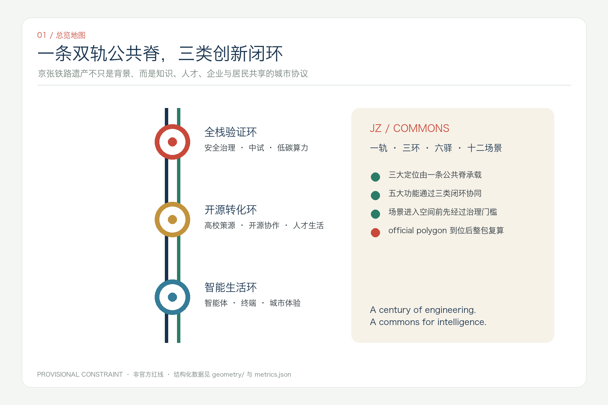
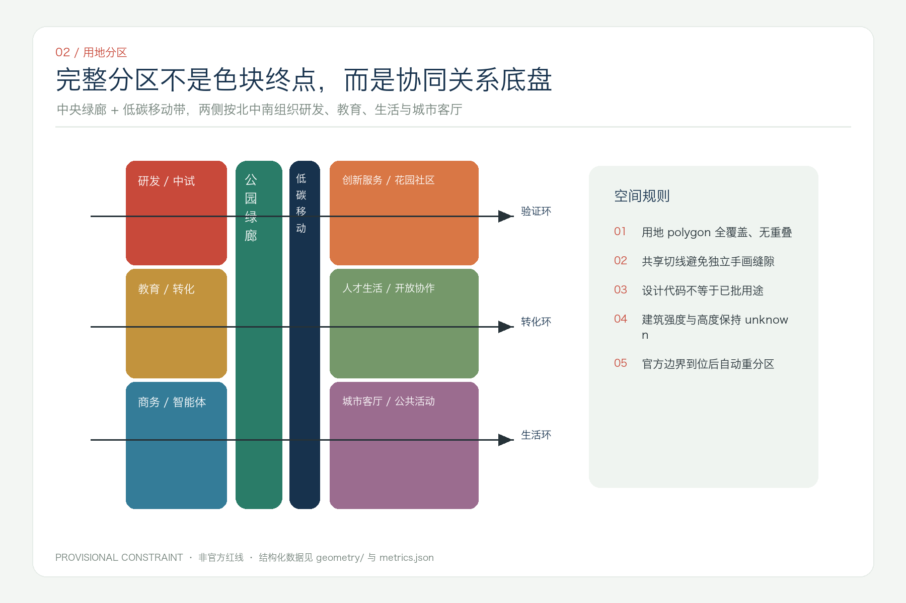
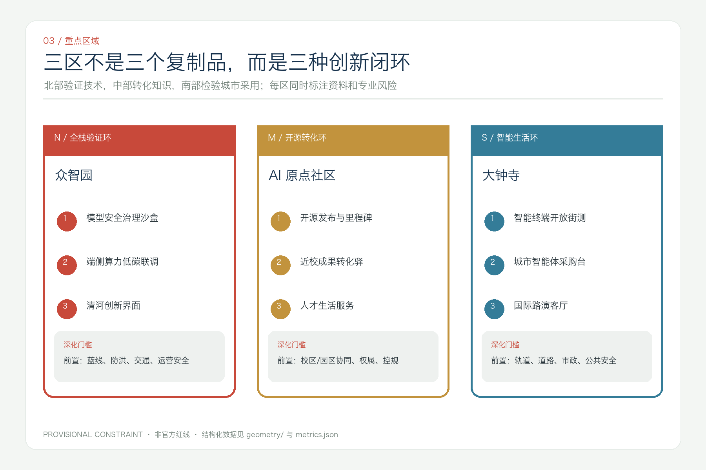
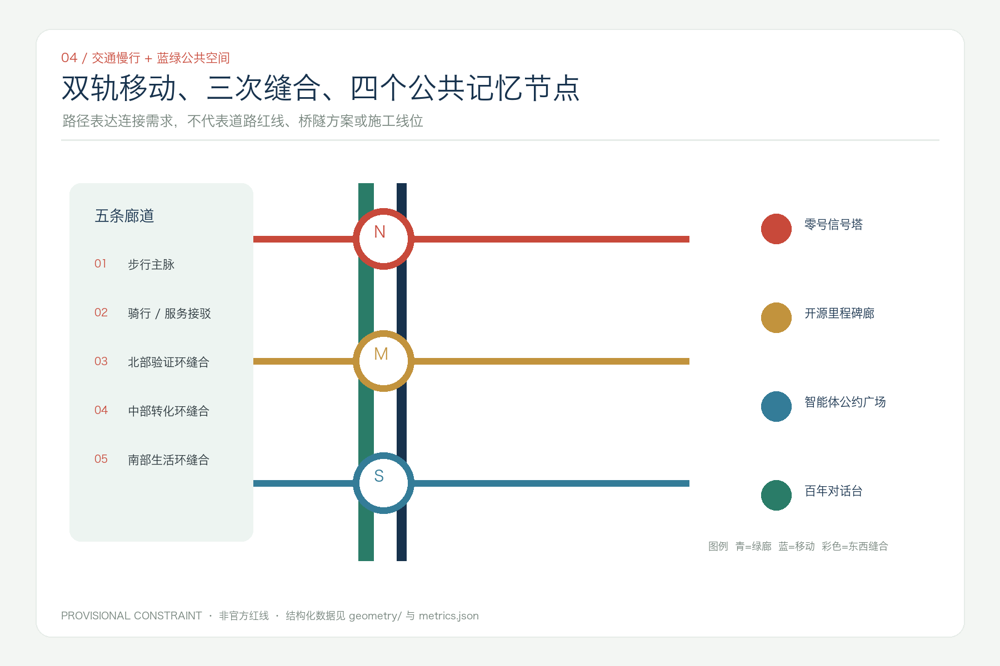
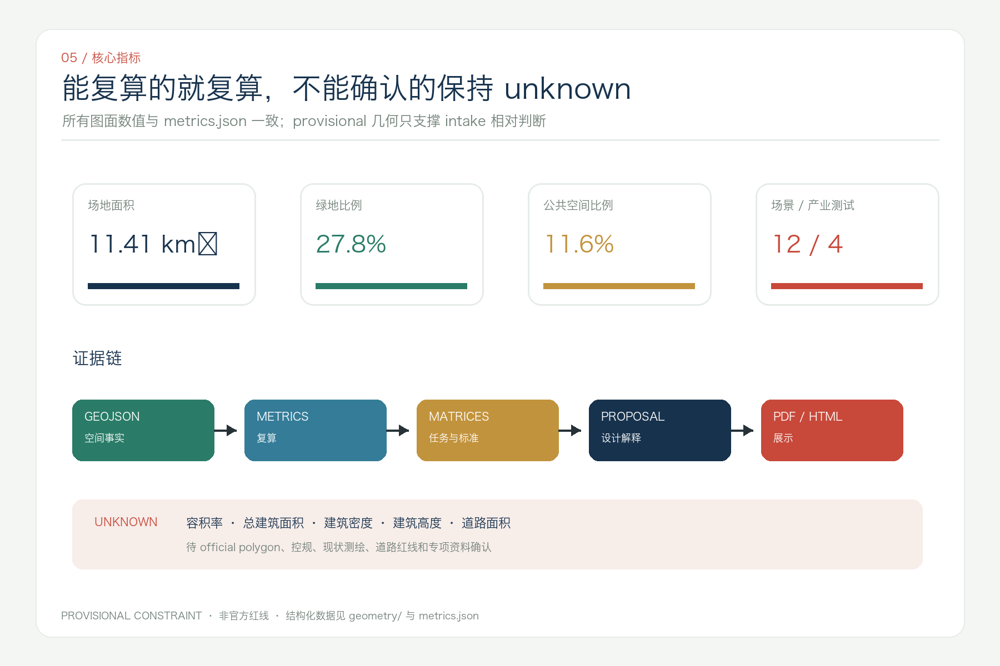

# 京张智环：一轨三环十二场景的开放智能城市共同体

> **JingZhang Commons — One Rail, Three Loops, Twelve Scenes**
> 本成果是开放共创建议，不替代正式规划，不构成政府审定、投资、审批或实施承诺。

## 方案摘要

“京张智环”把百年铁路理解为一种城市共同体协议：过去铁路连接人和物，今天这条遗产公共空间可以连接知识、人才、企业、居民与智能体。方案提出“一轨三环、六驿十二场景”：一轨是京张遗产公园的文化与慢行公共脊；三环分别是北部“全栈验证环”、中部“开源转化环”和南部“智能生活环”；六驿是跨园区、校区、社区和轨道站点的服务接口；十二场景则把 AI 从抽象产业词汇转化为可体验、可审计、可退出的公共服务与产业测试。

设计并不把 provisional polygon 画成一条“已批红线”。`geometry/site_boundary.geojson` 与三处 `KEY_AREA` 仅用于 intake 拓扑、相对比例和图面组织，[data:geometry/site_boundary.geojson#SITE-001] [data:geometry/key_areas.geojson#PROV-KEY-001] [source:BOUNDARY-SOURCE]。空间动作均为概念建议；官方 polygon、控规、权属、道路、市政、消防和文保资料到位后，必须整包重算 [depth:risk_missing_data]。

## 设计依据与资料清单

方案的第一权威依据是官方资格预审公告，用于确认项目任务、三层范围文字描述、面积约值和成果语境 [source:OFFICIAL-ANNOUNCEMENT] [standard:PROJECT-OFFICIAL-ANNOUNCEMENT]；面向智能体任务书用于确认命名、生态案例、十二场景、用户画像、朝圣地标、文化叙事与运营要求 [source:AGENT-TASKBOOK] [standard:PROJECT-AGENT-OPEN-CALL-TASKBOOK]。`data/source_registry.json` 决定资料可以用于 formal、background 还是 provisional [source:SOURCE-REGISTRY]，处理事实包只作为导航 [source:PROCESSED-FACT-PACK]。

专业判断分别受《城市设计管理办法》、控规编制审批办法和用地分类指南约束 [standard:MOHURD-URBAN-DESIGN-MEASURES] [standard:MOHURD-CONTROL-DETAILED-PLANNING] [standard:MNR-LAND-USE-CLASSIFICATION-GUIDE]。`MOHURD-ARCH-DESIGN-DEPTH-2016` 尚缺官方正文，只登记为缺口，不能当作 formal 权威 [standard:MOHURD-ARCH-DESIGN-DEPTH-2016]。现状诊断采用“已知事实 / 可复算设计 / 待补资料”三栏法 [depth:existing_conditions_diagnosis]。

### 数据边界

- official：项目任务、范围名称、公告面积约值、专业原则。
- provisional：总体边界和三处重点区 polygon，只支持 intake、自检和相对关系。
- design proposal：用地、概念建筑基底、道路中心线、绿地、公共空间与分期。
- unknown：容积率、建筑高度、建筑密度、道路面积、权属、市政、消防、文保控制线。

## 三层范围工作框架

统筹研究范围回答“海淀的创新要素如何协同”；总体设计范围回答“协同如何转译为空间网络”；三处重点区回答“网络在哪些类型空间中被验证”。三层不靠叠加更多红线，而靠同一套证据链从任务到图层、从图层到指标、从指标到图纸 [depth:three_level_scope_framework]。

| 层级 | 核心问题 | 京张智环的回答 | 证据 |
| --- | --- | --- | --- |
| 统筹研究 43.6km² | 创新链与城市形态 | 高校策源—开源协作—中试验证—企业服务—公共体验—全球传播 | compliance_matrix.json |
| 总体设计 11.4km² | 更新、交通、蓝绿与风貌 | 一条公共脊、三类闭环、两条低碳移动线、五条缝合廊 | [data:geometry/land_use.geojson#LU-001] [metric:mobility_corridor_count] |
| 重点区域 368.4ha | 精细化场景与实施依赖 | 众智园验证、原点社区转化、大钟寺城市体验 | [data:geometry/key_areas.geojson#PROV-KEY-001] [metric:key_area_count] |

## 一带总体概念、命名与视觉识别

主名称“京张智环”强调铁路的线性记忆与创新的反馈闭环；英文名 **JingZhang Commons** 强调公共知识、共享空间和共同治理。命名体系按“轨—环—驿—场景”展开，既能用于空间导视，也能用于年度活动和数字目录。

Logo 方向由两条不封闭的平行线组成：一条代表 1909 年京张铁路的工程理性，一条代表开放智能时代的协作协议；三枚铜色节点代表三类创新环，线端保持开放，表示方案仍需公众和专业团队共同完成。图形仅用本方案自行绘制的几何线条和系统字体，不使用企业商标、人物肖像或未授权字体 [depth:height_massing_character]。

视觉系统以海淀科技蓝 `#17324D`、铁路朱红 `#C8493A`、遗址铜 `#C2933D`、公园青 `#2A7C68` 和纸本灰绿 `#F3F6F3` 为核心。轨道双线承担信息层级，里程牌承担证据标签，铜色节点只用于重点区与公共荣誉节点，避免赛博霓虹和娱乐化“AI感”。这套识别可供专业品牌团队深化，不构成已采纳城市品牌方案。

## 统筹研究范围产业与未来城市研究

### 七个全球案例与可转化机制

案例只作为 background 比较，不支撑本项目规划控制。转化对象不是复制建筑形式，而是提取“组织—空间—运营—治理”的机制。

| 案例 | 可观察机制 | 转译到京张智环 | 来源 |
| --- | --- | --- | --- |
| 新加坡 one-north | 专业园区、孵化网络与生活服务共存 | 众智园采用“测试—孵化—展示—生活”邻近组织 | [source:CASE-ONE-NORTH] |
| Paris-Saclay | 大学、科研中心与企业形成集群协同 | 原点社区配置跨校成果转化驿与共享服务 | [source:CASE-PARIS-SACLAY] |
| London Knowledge Quarter | 成员制网络、共同品牌、知识向公众开放 | 以联盟章程管理一带活动与开放资源目录 | [source:CASE-LONDON-KQ] |
| Toronto MaRS | 科研商业化、公共使命和空间运营同址 | 大钟寺设置企业服务、应用采购与社会影响接口 | [source:CASE-MARS] |
| Kendall Square | anchor-plus 与高品质城市生活复合 | 高校/院所作为锚点，补足生活、交流与慢行 | [source:CASE-KENDALL] |
| 河套深港合作区 | 规则协同、科研服务和中试转化 | 建立可审计的跨机构场景开放协议 | [source:CASE-HETAO] |
| 香港北部都会区 | 创新区与生态保育并置 | 把清河、小月河与公园作为承载边界，而非剩余空间 | [source:CASE-NORTHERN-METROPOLIS] |

### 三区两翼协同回路

北部众智园负责“能否安全验证”，中部 AI 原点社区负责“能否从科研走向社会”，南部大钟寺负责“能否在高密城市生活中被采用”；中关村科技服务翼提供法务、知识产权、资本与国际服务，小月河场景赋能翼提供公共服务和日常体验。信息、人才、场景反馈沿京张公共脊循环，不以单次招商或活动数量作为成功标准 [depth:overall_spatial_structure]。

## 总体设计范围城市更新与控规深度城市设计

### 一轨三环六驿

“一轨”由遗产公园连续绿廊与两条低碳移动线共同表达 [data:geometry/green_space.geojson#GREEN-001] [data:geometry/roads.geojson#ROAD-001]；“三环”通过三条东西缝合廊连接公园两侧功能；“六驿”是北、中、南各两类接口：产业测试驿 / 生态会客驿、开源发布驿 / 人才生活驿、轨道接驳驿 / 国际路演驿。

用地分区以完整覆盖、共享边界和可替换重算为原则 [depth:land_use_layout]。中央为公园绿廊和慢行服务带；西侧由北向南布置研发中试、教育科研、商务服务；东侧由北向南布置创新服务、人才生活、城市客厅。所有代码沿用用地分类指南，但仅表达设计建议，不声称已批用地性质 [data:geometry/land_use.geojson#LU-001]。

发展强度保持 unknown。概念建筑基底只用于说明空间载体的颗粒度和首层公共性，不用于推导容积率、建筑高度、建筑密度或拆改留 [data:geometry/buildings.geojson#BLDG-001] [metric:building_footprint_area_sqm] [depth:development_intensity_controls] [depth:retain_renovate_demolish]。正式深化必须叠合权属、现状测绘、控规、文保和工程条件。

## 重点区域详细设计

### 众智园 AI 自主创新加速区：全栈验证环

概念目标是把封闭测试转译为“可参观、可预约、可监管”的创新街区。北部设置模型安全治理沙盒、端侧算力与低碳能源联合测试、开放标准工作坊和清河创新界面；对外展示与敏感测试分区管理。清河侧公共空间只建议轻量可逆设施，防洪、蓝线和生态条件未核实前不提出工程断面 [data:geometry/key_areas.geojson#PROV-KEY-001] [data:geometry/public_space.geojson#PUBLIC-001]。

### 北京 AI 原点社区：开源转化环

概念目标是缩短“论文/代码—原型—试用—复核—转化”的步行距离。沿校区、园区和街区接口布置开源发布厅、知识产权与伦理咨询、成果转化驿、人才生活服务和社区共评室；既服务高校团队，也让居民对进入公共空间的场景拥有知情、反馈和退出权 [data:geometry/key_areas.geojson#PROV-KEY-002] [data:geometry/public_space.geojson#PUBLIC-002]。

### 大钟寺 AI 产业聚集区：智能生活环

概念目标是验证智能体、智能终端和内容服务能否在真实、高密、混合的城市环境中被负责任地采用。围绕轨道接驳和四象限步行联系提出国际路演客厅、智能体市集、公共服务体验台和非机动车秩序优化；任何站城一体化、桥隧或路口改造都必须由交通、市政与轨道专业团队另行论证 [data:geometry/key_areas.geojson#PROV-KEY-003] [data:geometry/public_space.geojson#PUBLIC-003]。

三处重点区均按功能、建筑载体、公共空间、交通组织、运营责任和资料缺口六栏表达 [depth:three_key_area_detailed_design]，不以 provisional rectangle 代替场地设计。

## AI 创新生态、人才画像与 AI+ 场景

### 六类用户画像

| 用户 | 决策权与需求 | 空间响应 | 公共利益边界 |
| --- | --- | --- | --- |
| 开源开发者 | 发布、协作、声誉与测试 | 开源发布驿、贡献记录、夜间协作 | 不以连续轨迹衡量贡献 |
| 高校师生 | 转化、跨校合作、步行连接 | 成果转化驿、跨校慢行、伦理咨询 | 科研与校园数据需授权 |
| 初创团队 | 低成本原型、客户与合规 | 共享测试、企业服务、应用采购接口 | 不承诺资金和招商结果 |
| 企业与国际访客 | 路演、人才与合作 | 国际路演客厅、轨道接驳、双语导视 | 企业标识和案例须清权 |
| 居民与照护者 | 通勤、休闲、无障碍与安静 | 社区共评室、分时活动、低侵入服务 | 不做商业化居民画像 |
| 一线公共服务人员 | 可解释工具、人工复核与申诉 | 人机协作台、操作日志、退出机制 | AI 不替代法定职责 |

用户画像数量由 [metric:persona_count] 记录，场景与空间必须共同接受隐私、无障碍、夜间扰动和人工复核检查。

### 十二张场景卡

| ID | 场景 / 类型 | 位置与载体 | 数据与人工复核 | 试点评价 |
| --- | --- | --- | --- | --- |
| S01 | 模型安全治理沙盒 / **产业测试** | 众智园隔离测试与展示界面 | 合成或清权数据；红队与人工签字 | 风险闭环率、问题复现率 |
| S02 | 端侧算力低碳联调 / **产业测试** | 众智园共享设备驿 | 设备与能耗聚合数据；运维复核 | 单任务能耗、服务可用性 |
| S03 | 智能终端开放街测 / **产业测试** | 大钟寺可控室内外界面 | 明示测试区；安全员可急停 | 事件率、无障碍影响 |
| S04 | 城市智能体服务采购台 / **产业测试** | 大钟寺国际路演客厅 | 公开任务、审计日志、专家验收 | 问题解决率、申诉处理 |
| S05 | 开源发布与贡献里程碑 | AI 原点社区 | 用户主动提交；社区复核 | 可复用项目数、公开许可率 |
| S06 | 近校成果转化协作台 | AI 原点社区 | 项目授权信息；法务/伦理人工审查 | 转化周期、跨机构协作数 |
| S07 | AI 慢行与无障碍导航 | 京张公共脊 | 最小化路况数据；人工报错与校正 | 断点减少、无障碍可达性 |
| S08 | 社区健康信息助手 | 社区服务驿 | 不做诊断；医务人员复核与转介 | 转介准确性、满意度 |
| S09 | AI 教育与媒体素养工作坊 | 原点社区 / 公共文化空间 | 教师与家长可见；不采集未成年人画像 | 完课率、误导纠正率 |
| S10 | 百年京张可解释导览 | 遗产公园与清华园节点 | 引用公开史料；专家与公众纠错 | 史料可追溯率、可访问性 |
| S11 | 公共空间分时共治 | 三环共享空间 | 只用聚合预约；社区委员会复核 | 冲突率、不同群体使用公平性 |
| S12 | Global AI Commons Week 路线 | 一轨三环公共空间 | 活动报名最小化；安全与版权人工审核 | 开源成果复用、后续合作 |

十二场景、四项产业测试分别由 [metric:scenario_count] 和 [metric:industry_test_scenario_count] 记录。它们是概念试点清单，不代表已批准运营；所有场景应在公开规则、知情参与、数据最小化、人工复核、申诉和退出六个门槛同时满足后才可进入专业深化。

## AI 公共空间、朝圣地标与荣誉展示

四个概念地标沿公共脊形成“工程—开源—公约—对话”的叙事，不追求高耗能视觉奇观 [metric:pilgrimage_landmark_count]：

1. **零号信号塔**：以铁路信号语言讲解模型验证、标准与安全治理；轻量可逆。
2. **开源里程碑廊**：按时间与许可证记录可复用贡献，贡献者可更正、撤回不当内容。
3. **智能体公约广场**：公开展示公共利益、隐私、可解释与人工最终判断的规则。
4. **百年对话台**：让铁路工程史、中关村创新史与 AI 新文化在同一公共论坛中对话。

荣誉体系不按融资额或流量排序，而按公共价值、可复用性、证据完整度和长期维护贡献分层；任何永久展示均需维护者、权利人、公众和主管部门确认 [data:geometry/public_space.geojson#PUBLIC-001]。

## 用地、建筑规模与拆改留方案

`land_use.geojson` 由共享切线生成完整分区，覆盖 provisional site 且不重叠。中央 13% 左右的带状空间作为公园绿廊概念分区，邻近 8% 作为低碳接驳骨架，其余按北中南和两侧关系分配研发、教育、服务、生活与城市客厅 [data:geometry/land_use.geojson#LU-004] [metric:green_ratio]。

建筑采用“保留优先—低扰动改造—可逆插入—条件成熟后更新”四级决策树。由于缺少现状测绘和权属，本包没有把任何真实建筑标为拆除或新建；九个 `BUILDING_FOOTPRINT` 只是功能载体原型 [depth:retain_renovate_demolish]。高度、体量、屋顶和界面遵循“靠遗产与绿廊一侧降低视觉压迫、首层增加公共性、跨街形成连续步行界面”的原则性建议，数值全部待官方控规和专项条件确认 [depth:height_massing_character] [metric:building_height_m]。

## 交通、轨道、市政与公共服务设施

交通采用“两条纵向低碳线 + 三条东西缝合线”的概念网络：步行主脉贴近遗产公园，骑行与服务接驳脉位于其侧，三条东西通道分别服务三类创新环 [data:geometry/roads.geojson#ROAD-001] [metric:mobility_corridor_count]。线路表达的是连接需求，不是道路红线、桥隧方案或施工线位 [depth:traffic_rail_slow_parking]。

市政与新基建建议采用“共享接口而非独立机房清单”：端侧算力、分布式能源、环境感知与公共服务设备先通过能源、安全、维护、网络和隐私五项容量审查，再决定规模和位置 [depth:municipal_new_infrastructure]。道路面积、管线、消防、排涝与能源负荷均为 unknown [metric:road_area_sqm]。

## 蓝绿空间、公共空间与城市风貌

蓝绿系统不是产业开发后的余量，而是一轨三环的承载底盘。中央连续绿廊连接北中南，三条横向共享绿廊把高校、园区、社区和轨道站点接入公园；绿地面积与比例由相同 geometry 复算 [data:geometry/green_space.geojson#GREEN-001] [metric:green_space_area_sqm] [metric:green_ratio] [depth:blue_green_public_space]。

公共空间按“安静日常—协作展示—受控测试—年度活动”分时运行，避免所有节点全年高强度活动。城市风貌保留铁路工程的尺度、材料与构造诚实，用铜、耐候金属、灰砖和可替换信息面板形成当代表达；不得伪造历史构件或把文化降为科技装饰。

## 百年京张—中关村—AI 新文化叙事

叙事分三章：**自主工程**讲詹天佑和京张铁路所代表的独立工程能力；**开放创新**讲中关村通过知识流动、市场试验和社区协作形成的创新文化；**共同智能**讨论人与智能体如何在公共规则中协作。导视中的每条历史事实必须能回到公开史料，AI 生成解释必须标识并接受专家/公众纠错。

国际传播不以“未来城市已经实现”为口号，而以 “A century of engineering. A commons for intelligence.” 为叙事句，强调百年工程与开放共同体的连续性。文化标识系统与整体 Logo 分开管理，避免历史资源被品牌化吞没。

## 更新项目清单、实施政策与分期计划

| 项目 | 概念动作 | 前置条件 | 分期 |
| --- | --- | --- | --- |
| JZ-01 双轨公共脊连续性审计 | 识别步行、骑行、无障碍和夜间安全断点 | 官方道路/公园边界、交通专项 | 一期 |
| JZ-02 众智园安全治理沙盒 | 室内优先的可监管测试与展示 | 运营主体、数据清权、安全评审 | 一期 |
| JZ-03 开源里程碑廊 | 贡献登记、许可检查与公共展示 | 版权规则、维护机制、文保审查 | 一期 |
| JZ-04 近校成果转化驿 | 法务、伦理、知识产权和应用采购接口 | 校园/园区协同、权属、运营主体 | 二期 |
| JZ-05 人才生活服务补链 | 共享学习、托育照护、夜间服务与居住接口 | 公服底数、人口需求、控规 | 二期 |
| JZ-06 大钟寺智能体公约广场 | 测试、路演、公共反馈和申诉入口 | 轨道/交通/市政专项 | 三期 |
| JZ-07 三环共享绿廊 | 把园区、校区、社区接入公园 | 蓝绿线、文保、防洪、权属 | 分区深化 |
| JZ-08 Global AI Commons Week | 场景开放、开源发布与公众论坛 | 活动审批、安全、版权、无障碍 | 每年评估 |

分期 geometry 覆盖同一 provisional site 的北、中、南三段，仅表达依赖顺序 [data:geometry/phasing.geojson#PHASE-001] [metric:phase_count] [depth:renewal_project_list] [depth:phasing_implementation]。一期优先轻量、可逆和制度型试点；二期在公服、权属和控规条件清晰后补链；三期在轨道、交通和市政专项通过后深化。它不构成投资、建设或审批时序承诺。

## 全球 AI 创新活动体系与长期运营

年度运营采用“四季一周一档案”：春季开放任务发布，夏季场景测试与公众共评，秋季 Global AI Commons Week，冬季证据审计与维护者大会；全年维护一个开放场景目录和贡献档案。组织结构建议由公共利益委员会、专业技术组、居民/使用者组、开发者社区和独立数据伦理组构成，任何高风险场景可被暂停。

从活动到转化的路径是“公开问题—小规模原型—第三方评测—公共反馈—专业深化—应用采购/社区采用—持续审计”。不以一次路演替代长期运营，也不把人才、企业、资金或政策支持写成已确定事项 [source:AGENT-TASKBOOK] [standard:PROJECT-AGENT-OPEN-CALL-TASKBOOK]。

## 指标体系、面积复算与合规矩阵

当前 provisional site 的复算面积为 [metric:site_area_sqm]；绿地和公共空间分别由 polygon union 复算 [metric:green_space_area_sqm] [metric:green_ratio] [metric:public_space_area_sqm] [metric:public_space_ratio]；概念建筑基底来自九个原型 [metric:building_footprint_area_sqm]。三处重点区、十二场景、四项产业测试、六类用户、四个朝圣地标、五条移动廊道和三期关系分别记录为 [metric:key_area_count] [metric:scenario_count] [metric:industry_test_scenario_count] [metric:persona_count] [metric:pilgrimage_landmark_count] [metric:mobility_corridor_count] [metric:phase_count]。

总建筑面积、容积率、建筑密度、建筑高度和道路面积保持 unknown [metric:total_floor_area_sqm] [metric:floor_area_ratio] [metric:building_density] [metric:building_height_m] [metric:road_area_sqm]。这样做不是回避设计，而是避免 provisional geometry 产生伪精确法定结论 [depth:metrics_recalculation]。

`compliance_matrix.json` 覆盖公告 1.3、1.4、1.5 与 agent.1-agent.6 的 23 条要求；`standard_matrix.json` 覆盖全部 mandatory 标准；`design_depth_matrix.json` 的 15 项深度均由正文、图层、图纸、指标、假设和自检共同支撑。

## 专业标准响应与设计深度证据

本方案的证据索引为：[depth:existing_conditions_diagnosis] [depth:three_level_scope_framework] [depth:overall_spatial_structure] [depth:land_use_layout] [depth:development_intensity_controls] [depth:height_massing_character] [depth:retain_renovate_demolish] [depth:traffic_rail_slow_parking] [depth:municipal_new_infrastructure] [depth:blue_green_public_space] [depth:three_key_area_detailed_design] [depth:renewal_project_list] [depth:phasing_implementation] [depth:metrics_recalculation] [depth:risk_missing_data]。

几何 authority 顺序为 GeoJSON → metrics → matrices → manifest/sources/assumptions/self_check → proposal → figures/HTML/PDF。展示层若与结构化数据不一致，以前者之前的证据层为准。

## 风险、版权与合规说明

| 风险 | 当前处理 | 正式深化动作 |
| --- | --- | --- |
| official boundary 缺失 | 全部标记 provisional | 替换 polygon，重做用地、指标、图件与 PDF |
| 控规与权属缺失 | 强度、拆改留保持 unknown | 叠合 approved control 与权属资料 |
| 道路/市政/消防缺失 | 只画连接关系 | 专项交通、市政、消防和排涝论证 |
| 文保控制线缺失 | 地标轻量可逆 | 文物专业审查与公众参与 |
| 场景隐私与偏见 | 数据最小化、人工复核、申诉退出 | DPIA、第三方评测和持续审计 |
| 运营承诺风险 | 全部写为参考方案 | 明确运营主体、预算、责任和暂停机制 |

文本、线性 Logo、图解、HTML 与 PDF 由 Codex 依据公开/清权资料和本包结构化数据生成；未使用商业地图截图、远程字体、企业 Logo、人物肖像或外部图片。案例仅以文字机制引用并登记 URL。`report/copyright_statement.md` 记录生成方式与限制。

风险缺口同时登记在 [data:geometry/constraints.geojson#CONSTRAINTS]、[source:PROCESSED-FACT-PACK] 与 [depth:risk_missing_data]。本方案不声称官方批准、审定控规、最终土地权属、确认建设规模、保证实施或政府承诺。所有空间落地建议均为“概念建议”“参考方案”或“可供专业团队深化研究”。

## 参考资料

- [source:SITE-PACKAGE]：项目任务、标准、枚举与 schema。
- [source:SOURCE-REGISTRY]：公开/清权/provisional 用途边界。
- [source:PROCESSED-FACT-PACK]：任务和缺口导航层。
- [source:OFFICIAL-ANNOUNCEMENT]：官方公告任务与范围语境。
- [source:AGENT-TASKBOOK]：六项智能体任务与边界条款。
- [source:BOUNDARY-SOURCE]、[source:KEY-AREA-SOURCE]：provisional 几何，仅用于 intake。
