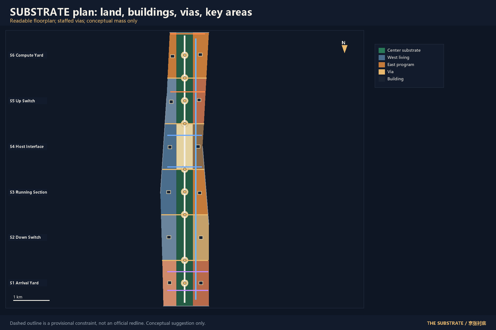
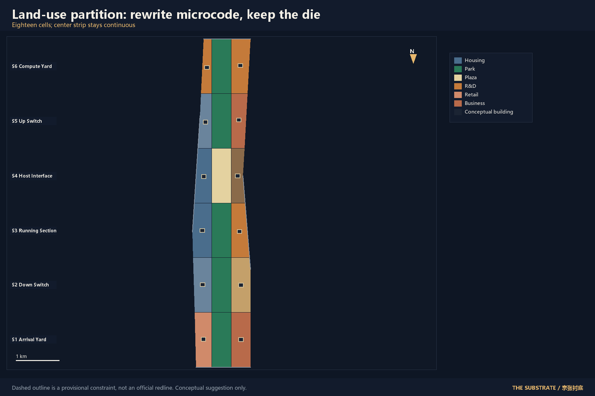
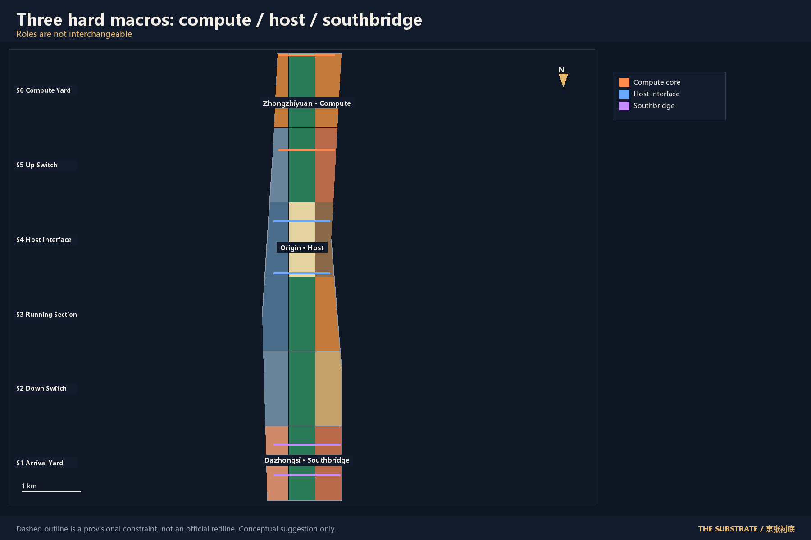
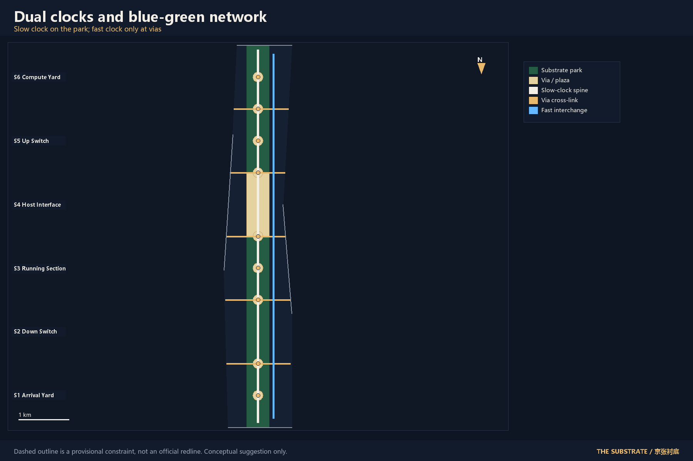
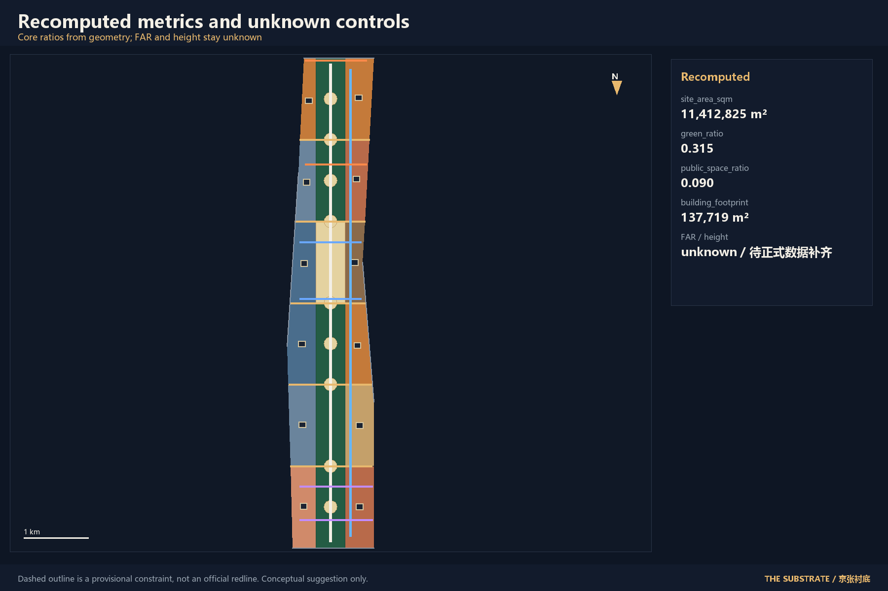

# THE SUBSTRATE / 京张衬底

## Design Basis and Source List

The first authority is the Haidian Planning and Natural Resources Bureau prequalification announcement for the Centennial Jing-Zhang AI Innovation Belt. It states the three nested scopes, approximate areas, three key areas, and required design depth, but it does not publish an approvable official redline [source:OFFICIAL-ANNOUNCEMENT]. The agent-facing taskbook adds the three positioning statements, five functions, three districts and two wings, and tasks agent.1 through agent.6, and it limits every spatial move to a conceptual suggestion [source:AGENT-TASKBOOK].

Temporary polygons in the site package are used only for generation, display, and self-check. The submitted boundary and the three key-area polygons are labeled as provisional constraints and must not be read as an official redline or as a precise-area basis [data:geometry/site_boundary.geojson#SITE-001]. After official data is published, the boundary, land use, roads, green space, public space, buildings, phasing, and metrics must be recomputed as a whole package rather than patched in one file.

The public source registry sorts material into formal-ready, background-only, and provisional-only. This proposal uses the announcement, the taskbook, the urban-design administration measures, the regulatory-plan compilation measures, the land-use classification guide, and the barrier-free environment law for formal judgments. The Brasília plan and Jacobs street life are mechanism readings only and are not promoted into statutory authority [source:SOURCE-REGISTRY]. Floor-area ratio, building height, tenure, and municipal capacity are absent from the public package; the prose leaves them pending official data instead of inventing complete-looking numbers [standard:MOHURD-CONTROL-DETAILED-PLANNING].

The identity system is one rectangular die and a row of vias. The Chinese name is 京张衬底; the English name is THE SUBSTRATE. The mark is a dark field, one continuous ground plane, and six halt-able test sections. No unauthorized typeface, trademark, or portrait is used.

## Three-Level Scope Framework

The coordinated research area is about 43.6 square kilometers, from the North Fifth Ring in the north to Xizhimen Outer Street in the south, from the Beijing–Tibet Expressway in the east to Wanquanhe Road in the west. This layer answers only the network question: where current enters and where results leave. This proposal draws no polygon at this layer, so a verbal extent cannot be disguised as a redline [depth:three_level_scope_framework].

The overall design area is about 11.4 square kilometers and is the provisional boundary submitted in this package. The announcement describes it as the urban and industrial belt one to two kilometers around the heritage park. The floorplan on this temporary plate has six bands, three strips, and twelve vias. The site area recomputed from geometry is a design-model value with medium confidence [metric:site_area_sqm].

The key detailed-design areas total about 368.4 hectares. From north to south they are Zhongzhiyuan, the Origin Community, and Dazhongsi. Their polygons are likewise temporary rectangles; their edges must not be read as parcels or road redlines [data:geometry/key_areas.geojson#PROV-KEY-001]. After official polygons arrive, the three hard macros may shift in position, but the roles of compute core, host interface, and southbridge stay the same.

Transfer between the three levels must be auditable. The coordinated layer supplies the loop, the overall layer supplies the bus and standard cells, and the key-area layer supplies the package pins. While official geometry is missing, that transfer is written as band numbers on land-use cells, not as pretend-precise coordinates.

## Coordinated Research Area: Industry and Future City Research

The three positioning statements sit on one line: the Centennial Jing-Zhang cultural belt is the substrate itself; the urban AI living-experience belt happens inside vias and standard cells; the AI fusion-innovation belt is injected by the two wings [source:AGENT-TASKBOOK]. The five functions are not spread evenly. Full-stack autonomy and global discourse sit in the north compute yard; a world-class innovation ecology sits at the host interface; scenario enablement runs the full line and concentrates at the down switch; a living city sits in the south arrival yard; governance is the token and the four gates.

The three districts and two wings are drawn as a closed loop, not as an adjacency diagram. Research capacity enters beside the Origin campus, hardens into standards and evaluation at Zhongzhiyuan, runs booked tests along the main line, converts into products and outward interfaces at Dazhongsi, and is returned by the Zhongguancun technology-service wing and the Xiaoyuehe scenario-enablement wing as capital, professional services, and real demand. This is an innovation system, not an innovation label.

Global cases are read as mechanisms, not copied as images. Brasília proves that a readable floorplan can be understood at once, and it also proves that emptying the ground plane pushes life into satellite towns. Jacobs proves that short blocks, mixed use, and eyes on the street are the current. Singapore one-north shows that a research park still needs a walkable ground floor. Barcelona 22@ shows that industrial renewal should change the program, not the block skeleton. Helsinki Kalasatama shows that a trial must be exit-able. Songdo shows that “fully smart and unmanned” becomes an empty city. West Zhongguancun shows that a professional-service wing already exists and does not need another new town. Station F shows that an interface is a bookable room, not a sculpture.

These cases become three rules: the floorplan may be as readable as Brasília; the ground must be as walkable as Jacobs; a trial must be as halt-able as a test port. Industry space is therefore split into an unrewritable substrate, replaceable microcode, and vias that must stay staffed [standard:PROJECT-AGENT-OPEN-CALL-TASKBOOK].

## Overall Design Area: Urban Renewal and Regulatory-Plan-Level Urban Design

The overall structure is six bands and three strips. From south to north: Arrival Yard, Down Switch, Running Section, Host Interface, Up Switch, Compute Yard. The east–west strips are the living strip, the substrate strip, and the program strip. Each land-use cell carries a band number so a reviewer can return from a parcel to a structural role [data:geometry/land_use.geojson#LU-001].

Urban renewal here is not another monumental avenue. It repairs already-existing compounds and breaks. Existing-condition judgment can only go as far as public material allows: the second phase of the heritage park is already an open public reference, and the site still contains many unconnected superblocks. This proposal treats a closed compound larger than a short walkable edge as a routing fault. It suggests adding one public crossing and one stayable ground floor, and it does not write property closure as a proven fact [depth:overall_spatial_structure].

Regulatory-plan depth appears here as structure, use partition, a public-space network, and a list of pending control conditions, not as a forged FAR zoning map. Building height, development intensity, and road-redline widths stay unknown. Conceptual masses recomputed from this package’s geometry may be kept, but they are not statutory controls [depth:land_use_layout].

The Jing-Zhang heritage-park vitality belt is the ground plane, not a corridor waiting to be built. East–west stitching happens only at vias; north–south continuity uses the substrate slow-clock spine. Character control is a continuous dark ground plane and pale via rooms, not an uncleared viral installation.

## Detailed Design of Key Areas

Zhongzhiyuan is the compute core. It hosts full-stack trials and evaluation, yet the public ground must still be walkable after the model is turned off. The suggestion is to put trial density in the east program strip, put exit-able public rooms at the vias, and leave daily services in the west strip. Retain–renovate–demolish here can only be written as a conceptual class: existing public passages are retained first, trial components must be removable, and new mass must not cut the substrate [data:geometry/key_areas.geojson#PROV-KEY-001]. One public space issues only one trial token at a time; the next token is not issued until the last is returned.

The Origin Community is the host interface. Universities, housing, and daily services meet here, and the default path is the account-free daily track. The suggestion is to put education and research in the east strip, housing and community services in the west strip, and to make the center a plaza rather than a parking lot [data:geometry/key_areas.geojson#PROV-KEY-002]. The AI window stands after the human window, and the exit receipt must remain. The pilgrimage landmark here is a “reversing point.” It commemorates Zhan Tianyou’s switchback, not a new tower.

Dazhongsi is the southbridge. Markets, industry, and outward interfaces land here. The suggestion is to write AI-native consumption as closable stalls and halls, not as an always-on surveillance mall [data:geometry/key_areas.geojson#PROV-KEY-003]. Freight and low-speed delivery use the fast-clock interchange concept line and do not enter the substrate slow spine. The temporary rectangle is not Dazhongsi’s real extent; the whole district is rebound after official data arrives.

The three detailed designs share one DRC: do not cut the ground plane; do not cut at grade without a via; keep unknown controls unknown. They are non-interchangeable hard macros. Zhongzhiyuan’s trial protocol must not be copied onto Origin’s daily track [depth:three_key_area_detailed_design].

## AI Innovation Ecosystem, Personas, and AI+ Scenarios

Six personas cover a resident, a student, a researcher, a small merchant, a municipal inspector, and a visitor with a child. The proposal does not build a separate city for “premium users.” Every scenario card states the people served, the spatial location, the operating data, the privacy boundary, human review, the operator, and the equivalent path after the model is halted [standard:PROJECT-AGENT-OPEN-CALL-TASKBOOK].

S01 via inquiry: twelve vias provide multi-channel wayfinding; after shutdown, a printed map and a staffed person remain. S02 account-free clinic navigation: routes are shown on Origin Community public screens and do not collect ID numbers. S03 campus-to-park slow walk: the slow-clock spine connects education land to the substrate and does not add a car shortcut. S04 small-merchant token: Dazhongsi trial stalls open on a half-day token and issue the next token only after return. S05 low-speed delivery detour: delivery stays on the fast-clock interchange; entering the living strip requires a speed drop and a human stop. S06 cultural guide: the line tells only registered public history and does not generate unverified celebrity stories. S07 public learning desk: human window, information seat, AI switch, and exit receipt cannot be reordered. S08 safety review: an inspector may veto a removable component next to an entrance without giving a reason. S09 enterprise compliance copilot: it organizes public rules only and does not read internal enterprise data. S10 rain and quiet alternative: a parallel slow path for people who avoid noise and glare. S11 developer booking track: Zhongzhiyuan trial sections open by token and stop on failure. S12 no-data equivalent service: any service that asks for personal data must also provide a window that completes the task without upload.

S04, S11, and S12 are industry test-and-validation scenarios. They test admission, isolation, and exit, not automation rate. Data is kept on-device or destroyed on site. Human review precedes model output.

## Land Use, Building Scale, and Retain-Renovate-Demolish Strategy

Land use is split into six bands and three strips. Eighteen cells cover the submitted boundary with no unlabeled leftover [data:geometry/land_use.geojson#LU-001]. The center strip is mainly park and plaza so the ground plane stays continuous; the west strip is mainly housing and community services so the street has eyes; the east strip is mainly research, education, and business so the program can be replaced. Green ratio and public-space ratio are recomputed from this package’s geometry and are low-confidence design-model values [metric:green_ratio].

Building footprints are conceptual masses inside the west and east strips. They mark where the program sits. They are not an existing-building survey and not an approved construction quantity [metric:building_footprint_area_sqm]. Floor-area ratio and building height stay unknown because the public package has no regulatory-plan sheets [metric:floor_area_ratio].

Retain–renovate–demolish can only be written as principles. Retain: the already-open continuous park surface, confirmable public passages, and unknown heritage and water controls, which must not be rewritten before official data arrives. Renovate: the ground floor at vias so it can host a stay, a shutdown, and a rollback. Demolish: only removable trial components, not buildings of unclear tenure. New build: only conceptual patches that do not cut the substrate. Any parcel-level conclusion waits for official tenure and controls [depth:retain_renovate_demolish]. Intensity and height stay pending official data; conceptual mass is not written as an intensity zone [depth:development_intensity_controls].

## Transport, Rail, Municipal Infrastructure, and Public Services

Traffic is split into two clock domains. The slow clock is walking, cycling, and staying; it uses the substrate spine and the via cross-links. The fast clock is a concept line for rail interchange, bus, and low-speed delivery; it stays on the east side and does not open a new at-grade expressway that cuts living fabric [data:geometry/roads.geojson#ROAD-001]. The two clocks exchange only at vias. Brasília’s monumental axis has almost no vias, so the photograph is fine and the street is empty. Jing-Zhang vias must be staffed.

Rail-station integration is written as an interchange room, not a new alignment. This proposal does not draw rail geometry and does not claim bridge or tunnel feasibility. Municipal and new infrastructure likewise keep unknown capacity: on-device compute, data elements, and the token ledger are service protocols, not substation or utility engineering. The smallest public-service carrier is the all-sense desk: the human window first, the AI switch behind, the exit receipt always present. Slow continuity and barrier-free passage outrank any trial component [standard:MOHURD-URBAN-DESIGN-MEASURES] [depth:traffic_rail_slow_parking].

Parking and cycle parking are given only as principles: vias give people first claim; vehicles stop at conceptual bays outside the cell. Exact stalls wait for a traffic detail plan. External traffic uses conceptual interfaces at the Dazhongsi southbridge and the Fifth Ring north end and does not change expressway redlines.

## Blue-Green Network, Public Space, and Urban Character

The main spine of the blue-green system is the center substrate strip. It joins park green into a ground plane that can be walked end to end without another program. Qinghe and Xiaoyuehe are treated only as side blue-band clues within what public material allows; no blue line is invented [data:geometry/green_space.geojson#GREEN-001]. Public space is the via rooms and the host-interface plaza, used for staying, asking, and exiting [data:geometry/public_space.geojson#PUBLIC-001] [metric:public_space_ratio] [depth:blue_green_public_space].

The three pilgrimage landmarks are: a “return the token” pavilion at the south arrival yard; a “switchback reverse” ground mark at the Origin Community; and a “halt-able trial” gate at the north compute yard. They commemorate operations, not idols. The honor-display system places replaceable contribution boards along the substrate, writing a GitHub name and a date, not unhappened political credit. The public-space kit has five pieces: the service desk, the via lamp, the removable trial fence, the printed map, and the exit-receipt box. All can be taken apart by hand.

Character is a dark continuous ground and pale vias. Roof, mass, and color are not locked before controls arrive [depth:height_massing_character]. Technology-test scenes must yield to walking continuity; the park must not become a showroom. AI-native businesses may appear at Dazhongsi and the vias, but they must be able to leave within one token cycle. Municipal capacity, on-device compute, and utility engineering likewise stay pending official data. This proposal gives a service protocol, not engineering feasibility [depth:municipal_new_infrastructure].

## Renewal Projects, Implementation Policy, and Phasing

Six conceptual work packages sit behind four evidence gates. JZ-01 via prototype: first build three staffed public rooms. JZ-02 slow-clock spine patches: only patch already-broken walking continuity. JZ-03 Origin service desk: test that the four positions cannot be reordered. JZ-04 Zhongzhiyuan token track: test one token, one section. JZ-05 Dazhongsi no-data window: test that a service can finish without upload. JZ-06 contribution board and annual inquiry: make commemoration an updatable public record [data:geometry/phasing.geojson#PH-G0].

Phasing is G0 evidence-zero, G1 via stitching, G2 three-macro interfaces, and G3 full-belt recheck. The next gate is not entered until the last one passes. The implementing body is written as “professional team + local users + maintainer review,” not as a settled government arrangement. Policy advice has only two lines: recompute the whole package when public geometry arrives; keep a no-data equivalent window for any service that asks for personal data [depth:renewal_project_list] [depth:phasing_implementation].

The annual event system suggests four dates: a spring via open day, a summer account-free walk-through, an autumn token return, and a winter rereading of the standard. Developer-community operations run through a public repository, Issues, and reproducible trial sections. Attraction and conversion use only four words: submitted, reviewed, selected, implemented. This package is not written as implemented. The one-sentence international claim is: rewrite the metal, keep the die.

## Metrics, Area Recalculation, and Compliance Matrix

Three core visual metrics can be recomputed from this package’s geometry: site area, green ratio, and public-space ratio. They are temporary design-model values, not statutory areas [metric:site_area_sqm]. Building-footprint area is likewise the sum of conceptual masses and only shows where the program sits. Floor-area ratio and height stay unknown.

Countable figures that are not scores include eighteen land-use cells, twelve vias, twelve scenario cards, six personas, three landmarks, six work packages, six bands, and four gates [metric:scenario_card_count]. Task coverage, professional standards, and design depth sit in three matrices. Announcement items 1.3, 1.4, and 1.5 and agent.1 through agent.6 are hung on chapters, layers, metrics, and boards; the prose does not repeat the machine index.

The design meaning of the metrics is this: green ratio asks whether the program has eaten the ground plane; public-space ratio asks whether the vias actually exist; unknown FAR asks whether the proposal stayed honest. Defining progress as automation rate would cancel this proposal’s own thesis. Recalculation, formulas, and confidence stay in the metrics file; the prose explains meaning [depth:metrics_recalculation].

## Risk, Copyright, and Compliance

The main risks are treating a temporary boundary as a redline, treating conceptual mass as approved construction, and treating an AI scenario as a service already in operation. This proposal blocks those three paths with provisional labels, unknown metrics, and the G0 gate. Privacy risk is blocked by no-data equivalent services and by a ban on collecting ID numbers. Heritage, blue-line, and road-redline geometry are not rewritten before official data arrives. Existing-condition diagnosis can only go as far as public material allows; a missing official survey is not a license to invent a complete-looking existing-condition map [source:OFFICIAL-ANNOUNCEMENT] [depth:risk_missing_data] [depth:existing_conditions_diagnosis].

The copyright statement is in the reading-copy attachment. Generated figures, boards, and electronic pages are conceptual diagrams. They are to be read as conceptual suggestions and must not impersonate site photographs or official drawings. Background literature is read as mechanism only; original plates are not copied. No third-party trademark, portrait, or uncleared typeface is used. The visual page runs offline and loads no remote resource. Every spatial landing suggestion is a conceptual suggestion and a reference scheme for a professional team to deepen. It does not replace formal planning and does not constitute a government-approved conclusion.

## References

Haidian Branch of the Beijing Municipal Commission of Planning and Natural Resources, Prequalification Announcement for the Centennial Jing-Zhang AI Innovation Belt Urban Design International Consultation, 2026 [source:OFFICIAL-ANNOUNCEMENT]. Excerpt of the open-call taskbook for global agents, 2026 [source:AGENT-TASKBOOK]. The site package, public source registry, and reading navigation layer distinguish formal-ready, background-only, and provisional-only material [source:SITE-PACKAGE] [source:SOURCE-REGISTRY]. The Ministry of Housing and Urban-Rural Development urban-design administration measures and regulatory-plan compilation measures, together with the Ministry of Natural Resources land-use classification guide snapshot, constrain design depth and unknown controls. The barrier-free environment law snapshot constrains slow continuity. Lucio Costa’s Brasília Plano Piloto and Jane Jacobs’s *The Death and Life of Great American Cities* are mechanism readings only and are not promoted into statutory authority. Temporary boundaries in the repository are used only for generation and self-check; the whole package is recomputed after official polygons are published.
