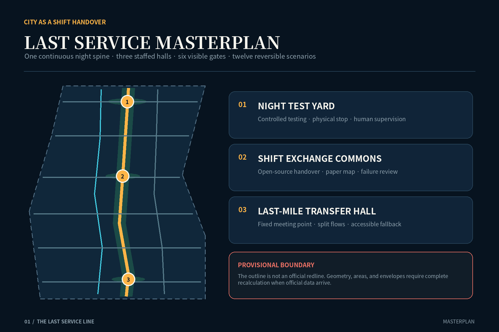
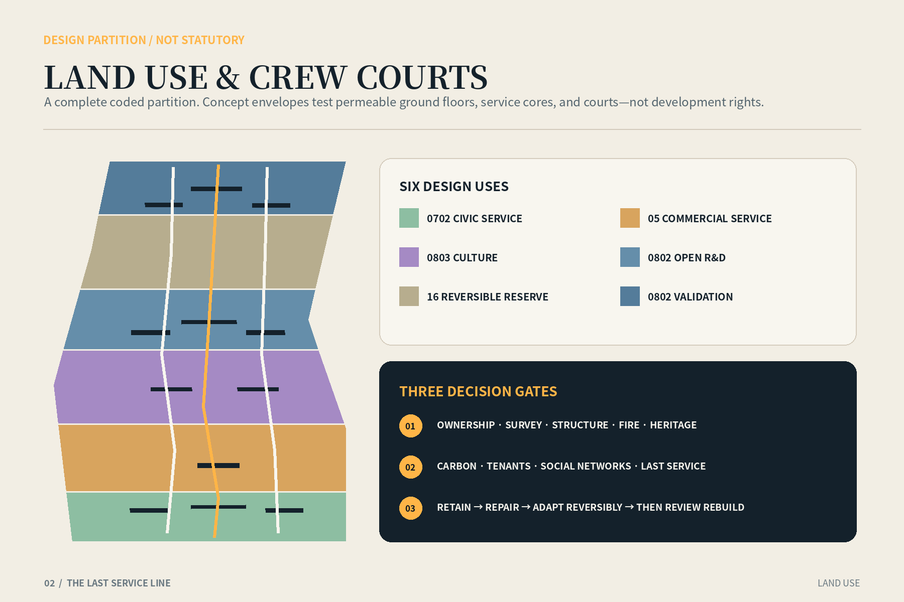
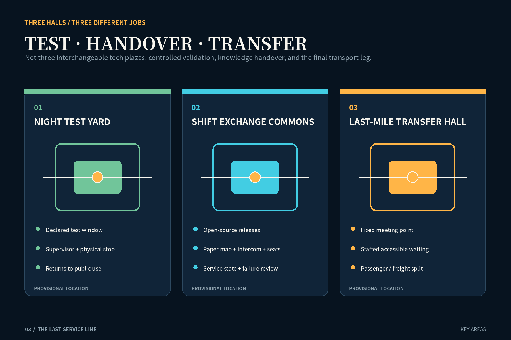
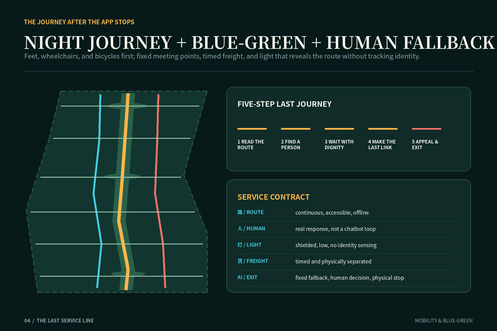
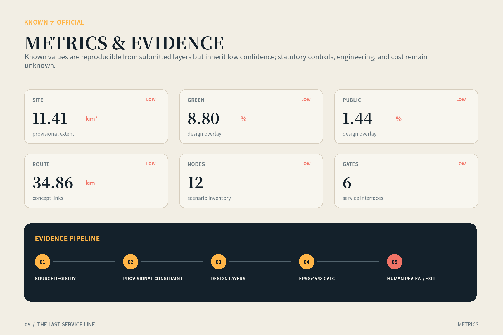

# THE LAST SERVICE LINE

> A way home for the last people leaving the Jing-Zhang AI Belt. “Last service” is not a fictional train. It is a civic contract: after regular departures, staffed desks, phone batteries, and predictive systems stop, the route remains continuous, help remains human, information remains legible, and every AI service has an exit.

## Design Basis and Source List

The proposal begins with the official Centennial Jing-Zhang AI Innovation Belt open-call announcement and the agent taskbook. It translates their objectives—an internationally significant AI ecosystem, an urban form suited to new productive forces, and a high-quality district—into reviewable spatial, operational, and governance objects. Machine-readable inputs include the brief, allowed design space, enums, planning limits, schemas, standards, and source registry. A background source is never promoted into a statutory condition. [source:OFFICIAL-ANNOUNCEMENT] [source:AGENT-TASKBOOK]

The repository does not currently contain an official precise overall boundary, official polygons for the three key areas, regulatory indicators, road redlines, building surveys, ownership, utility networks, or heritage control lines. This package therefore retains the maintainer’s rough provisional geometry derived from textual extents and announced areas. Every relevant feature is marked `official_boundary=false` and `boundary_precision=provisional_rough`. The calculated area is an internal consistency check, not an approval area, and no provisional edge is represented as a parcel or road redline. [data:geometry/site_boundary.geojson#PROV-SITE-001] [source:BOUNDARY-SOURCE]

Evidence is divided into three classes. Project documents and national standards govern task coverage, planning expression, land-use coding, accessibility, and AI governance. Cleared or provisional repository data support scope and recalculation. International cases—London night transport, Seoul Owl Bus, Singapore one-north, Barcelona 22@, Helsinki Maria 01, Cambridge Kendall Square, and Paris-Saclay—inform operational comparison only. They do not supply Beijing ridership, service intervals, or planning controls. Each case is registered with publisher, access date, permitted use, and exclusion. [standard:MOHURD-URBAN-DESIGN-MEASURES] [source:EXT-LONDON-NIGHT-TUBE]

The cover image is an original AI-generated conceptual illustration. It is neither site photography nor evidence of an existing or promised condition. Its people are fictional; architecture, railway traces, and lighting are atmospheric only. Spatial claims reside in GeoJSON, reproducible metrics, explicit assumptions, and the risk register. [depth:existing_conditions_diagnosis] [source:AI-GENERATED-COVER]

## Three-Level Scope Framework

One question connects all three scales: how should an innovation district treat the last person leaving? The approximately 43.6-square-kilometre coordinated research area addresses cooperation among universities, firms, communities, transport, and late-hour services. The approximately 11.4-square-kilometre overall design area establishes a Last Service Spine. The three key areas—Zhongzhiyuan, Beijing AI Origin Community, and Dazhongsi—test three spatial prototypes. The regional scale does not invent precise projects; the overall scale does not impersonate a statutory plan; the key areas do not turn provisional rectangles into sites. [depth:three_level_scope_framework] [standard:PROJECT-OFFICIAL-ANNOUNCEMENT]

At regional scale, a proposed Last Service Mutual-Aid Protocol lets participating campuses, parks, stations, companies, and communities publish a minimum service directory and incident handover rules. The directory exposes whether a staffed point, accessible route, toilet, water point, and final connection is available, but never exposes individual traces. At overall scale, one north-south service spine connects three staffed halls, six gates, blue-green slow-mobility branches, and a separated logistics branch. At key-area scale, the project tests controlled technology validation, knowledge handover, and intermodal transfer. [data:geometry/roads.geojson#ROAD-LAST-SERVICE-SPINE] [metric:key_area_count]

The transfer rule is “contract above, network in the middle, interface below.” Regional partners define minimum service and data boundaries. The overall plan makes walking, cycling, transfer, lighting, open space, and help points continuous. Detailed design then answers where the door is, who is responsible, what happens during a power or network failure, how freight and passengers separate, and how a test stops. Official geometry can later replace provisional constraints and trigger recalculation without invalidating the civic-service logic. [data:geometry/key_areas.geojson#PROV-KEY-001] [depth:overall_spatial_structure]

Every AI-enabled facility is evaluated by a Last Service Check: closing time, offline substitute, human takeover, failure exit, accessible route, and complaint loop. International quality is therefore measured not only by the density of innovation resources, but by the dignity offered to low-visibility workers and visitors during low-demand, low-battery, low-visibility conditions. [source:CASE-SYNTHESIS] [standard:PROJECT-AGENT-OPEN-CALL-TASKBOOK]

## Coordinated Research Area: Industry and Future City Research

The research area treats AI industry as an urban system that must be maintained. Alongside laboratories and companies, the innovation chain includes testers, equipment maintainers, data workers, property staff, cleaners, couriers, security personnel, caregivers, and public-transport workers. The talent map therefore includes the cooperative labour that keeps research operational. The identity “Last Relay” combines the discipline of railway timetables with the discipline of contemporary AI handover: a cultural narrative that changes operations rather than decorating a logo. [source:AGENT-TASKBOOK] [depth:overall_spatial_structure]

Three verification environments organise industrial space. Zhongzhiyuan hosts a controlled Night Test Yard for low-speed shuttles, edge devices, and human-AI maintenance dispatch during closed, supervised windows with physical emergency stops. AI Origin Community hosts a Shift Ledger where model cards, service state, open-source contributions, failures, and community learning become visible handover work. Dazhongsi hosts a Last-Mile Transfer Hall where rail, shuttle, cycling, walking, and delivery have a legible human fallback and separated flows. These are design proposals, not commitments from operators. [data:geometry/public_space.geojson#PUBLIC-NIGHT-YARD] [source:EXT-JTC-ONE-NORTH]

Seven public cases yield methods, not templates. Seoul demonstrates iterative late-route planning with aggregate demand evidence. London links night services to station staffing, step-free conditions, connecting buses, and protected maintenance windows. one-north, 22@, Maria 01, Kendall Square, and Paris-Saclay show that innovation districts need mixed daily life, adaptable space, reuse, and public ground rather than sealed technology campuses. Institutional and demographic differences rule out numerical transfer. The applicable lesson is procedural: pilot at small scale, publish measures, preserve human recourse, and review regularly. [source:EXT-SEOUL-OWL-BUS] [source:EXT-HELSINKI-MARIA01]

An annual proposed Last Service Week invites operators, transport providers, workers, disabled people, community members, and technical teams to walk the complete journey under different conditions. The audit records closed gates, broken links, dark transitions, dead signals, missing seats, inaccessible toilets, and unanswered calls. It publishes aggregate defects and repairs, never personal travel histories. The event and governance structure remain subject to public and institutional agreement. [standard:BARRIER-FREE-ENVIRONMENT-LAW] [source:EXT-BARCELONA-22AT]

## Overall Design Area: Urban Renewal and Regulatory-Plan-Level Urban Design

The overall structure is “one spine, three halls, six gates, two wings, twelve nodes.” The spine connects the three key areas north to south. The halls support night testing, shift exchange, and last-mile transfer. Six gates make entry and exit visible at all service states. Two wings connect knowledge/community support and industry/logistics support. Twelve reversible nodes provide rest, water, toilets, charging, offline information, accessible help, maintenance handover, and freight/passenger separation. These lines are proposed connections, not surveyed roads. [data:geometry/roads.geojson#ROAD-LAST-SERVICE-SPINE] [depth:overall_spatial_structure]

Land-use polygons employ the repository’s national purpose-classification subset. Six complete bands combine research, commercial service, community service, culture, green open space, and reserved land. They remain design partitions; “AI land” is not invented as a statutory class. Mixed programmes may be refined later only after official land-use, ownership, existing-building, and infrastructure surveys. Conceptual building footprints are capacity-test envelopes and do not identify an existing building, demolition parcel, or approved floor area. [data:geometry/land_use.geojson#LU-01] [standard:MNR-LAND-USE-CLASSIFICATION-GUIDE]

Renewal follows “service before construction.” Phase one uses service agreements, staffed points, signs, offline maps, and movable facilities to repair the last journey. Phase two adapts the three halls and continuous public interfaces. Phase three assesses new envelopes only after official controls, ownership, engineering, environmental, and funding conditions are confirmed. Floor-area ratio, floor area, height, statutory building coverage, setbacks, parking, and implementation cost remain unknown; conceptual footprints cannot be reversed into regulatory intensity. [metric:floor_area_ratio] [depth:development_intensity_controls]

Regulatory-plan-level expression is organised in three columns: known, proposed, and pending. Known items are the open-call tasks, announced approximate areas, and provenance of repository geometry. Proposed items are the service network, programmes, project sequence, and operating rules. Pending items include every formal control. Dashed boundaries on boards and HTML deliberately remain visually subordinate so precision does not manufacture authority. [data:geometry/constraints.geojson] [standard:MOHURD-CONTROL-DETAILED-PLANNING]

## Detailed Design of Key Areas

Zhongzhiyuan’s Night Test Yard separates innovation validation from public risk. Its perimeter remains a generally accessible layer with seating, water, toilets, and staffed help; its interior becomes a booked controlled test loop only during declared windows. A low-speed shuttle, edge inspection device, or maintenance-dispatch system requires clear signs, physical separation, an accountable supervisor, manual stop, minimum data collection, and a restoration procedure. Reversible canopies, an equipment room, and an observation walk prevent experimental risk from being transferred to people going home. [data:geometry/key_areas.geojson#PROV-KEY-001] [depth:three_key_area_detailed_design]

The Shift Exchange Commons at Beijing AI Origin Community is a hall for knowledge and labour handover. By day it supports open-source releases, enterprise services, exhibitions, and neighbourhood classes. At night it contracts into a staffed service core: screens may turn off, but a paper map, intercom, emergency charging, quiet seats, and an accessible toilet remain. The Shift Ledger publishes system state, failures, and the next responsible role without exposing identities or ranking workers. Researchers, founders, property teams, and neighbours can discuss why a system failed at the same table. [data:geometry/key_areas.geojson#PROV-KEY-002] [standard:GENERATIVE-AI-INTERIM-MEASURES]

The Last-Mile Transfer Hall at Dazhongsi makes the final journey a civic building. Because the provisional key-area polygon may not align with the real station context, this package specifies functions rather than a precise station position: staffed transfer desk, low-floor waiting area, offline departure board, continuous accessible route, bicycle storage, pick-up zone, shuttle gathering point, and a separate delivery bay. When AI dispatch fails, a fixed meeting point and human queue replace it. [data:geometry/key_areas.geojson#PROV-KEY-003] [source:KEY-AREA-SOURCE]

Each area receives one landmark. The Last Relay at Zhongzhiyuan resembles a maintainers’ portable work light. The Shift Ledger at AI Origin becomes a public long table. The Last Bell at Dazhongsi uses a silent low-brightness ring to indicate service available or transferred to a human. No landmark claims to use a heritage artefact. Text, sound, light, accessibility, and disturbance require specialist design and public review. [standard:MOHURD-URBAN-DESIGN-MEASURES] [source:OFFICIAL-ANNOUNCEMENT]

## AI Innovation Ecosystem, Personas, and AI+ Scenarios

Six principal personas are a late-departing researcher, sanitation worker, repair technician, bicycle courier, family caregiver, and wheelchair or mobility-impaired passenger; a first-time visitor is a seventh test case. Each journey asks the same questions: Is the path continuous? Is there a seat, water, and a toilet? Can the direction be understood without a smartphone? Is the last connection credible? Can a real person respond? Is there a safe exit from an automated decision? [standard:BARRIER-FREE-ENVIRONMENT-LAW] [depth:risk_missing_data]

Twelve scenarios form one service chain: offline last-service wayfinding; staffed help; accessible rest and toilet; low-battery charging and paper map; passenger/freight curb separation; fixed-point late shuttle; aggregate-demand route review; energy-aware non-tracking light; night school and shift exchange; maintenance dispatch; controlled low-speed shuttle testing; and open failure review. Concept nodes in `public_space.geojson` express the design inventory, not built facilities. [data:geometry/public_space.geojson#SCENARIO-01] [metric:scenario_node_count]

Three are explicit industry validation scenarios. Low-speed night testing needs a closed window, supervisor, physical emergency stop, and test log. Human-AI maintenance dispatch minimises work-order data, gives the maintainer final authority, and supports rollback after misrouting. Aggregate-demand route review uses de-identified temporal and spatial bins rather than personal night-travel profiles. Each test requires safety, data, accessibility, and affected-public review, and passers-by must be able to recognise and avoid it. [standard:GENERATIVE-AI-INTERIM-MEASURES] [source:EXT-SEOUL-OWL-BUS]

The Last Service Contract appears beside each interface: service hours, accountable operator, no-network path, error response, human contact, exit, and complaint route. An algorithm cannot become the gatekeeper for a toilet, rest place, help point, or route home. Face recognition, emotion inference, and hidden worker scoring are excluded. Measures focus on service availability, human response, break repair, and closure of accessibility findings; thresholds remain subject to pilot agreement. [source:CASE-SYNTHESIS] [standard:ELDERLY-SMART-TECH-PLAN-2020-45]

## Land Use, Building Scale, and Retain-Renovate-Demolish Strategy

The provisional overall polygon is topologically partitioned into six complete design land-use units. The sequence accommodates northern research and testing, ecological reserve, central research/community/culture, southern commercial service, public service, and green space. Codes follow the repository enum, but areas and ratios inherit provisional-boundary uncertainty. Public-space and green-space layers are overlays and cannot be added to the land-use balance as a separate total. [data:geometry/land_use.geojson#LU-03] [metric:site_area_sqm]

Conceptual buildings form small, permeable “crew courts,” not continuous gated campuses. Envelopes represent a service hall, lab/R&D block, community service, mobility hub, and mixed-use prototype. All are marked `agent_generated_design` and `design_proposal`. They test whether courts, passages, active ground floors, and service cores can fit; they are not surveys, identified demolition objects, or approved development capacity. [data:geometry/buildings.geojson#BLDG-HALL-NORTH] [metric:building_footprint_area_sqm]

Retain-renovate-demolish decisions pass three gates. Gate one verifies ownership, measured survey, structural safety, fire, heritage, and occupancy. Gate two assesses embodied carbon, social networks, tenants, and last-service impacts. Gate three can then assign retain, repair, adapt, remove, or build. The preference is retain useful space, repair lightly, adapt reversibly, and consider replacement last. No concept envelope receives a demolition decision without these gates. [depth:retain_renovate_demolish] [standard:MOHURD-CONTROL-DETAILED-PLANNING]

Height, massing, and character remain non-numeric principles. The rail-park and civic edges require a human scale and continuous accessible ground floor. Staffed cores should visibly communicate that a person is present without creating glare. Plant, cooling, loading, waste, and repair need dignified back-of-house space. Metres, storeys, skyline controls, and total floor area await official planning conditions plus daylight, fire, structure, and environmental studies. [metric:building_height_m] [depth:height_massing_character]

## Transport, Rail, Municipal Infrastructure, and Public Services

The transport hierarchy is feet, wheelchairs, bicycles, shuttles, rail, and freight. The Last Service Spine is a continuous walking and accessibility armature. A parallel cycle route slows at staffed halls. Six gates connect potential surrounding streets and stations. Fixed-point shuttles are a pilot concept only; actual routes, stops, timetable, ticketing, and authority require transport-agency and operator decisions. The GeoJSON represents proposed relationships, not surveyed roads or rail alignments. [data:geometry/roads.geojson#ROAD-LAST-SERVICE-SPINE] [depth:traffic_rail_slow_parking]

The Dazhongsi transfer concept uses two flows. Passengers move on a sheltered, seated, continuously accessible inner route; deliveries and maintenance use an outer timed bay. Low-speed shared crossings retain human marshalling. Dispatch AI can recommend vehicles and meeting points but cannot silently remove a fixed fallback. During disruption, an offline board communicates the human plan. Seoul and London support route iteration, staffing, accessibility, and maintenance coordination; they do not prove local demand or authorisation. [source:EXT-LONDON-NIGHT-TUBE] [source:EXT-SEOUL-OWL-BUS]

Municipal and digital infrastructure follows “small core, low energy, disconnectable.” Each hall reserves basic power, emergency light, water, sanitation, communications, maintenance access, and waste handling. Edge computation processes only necessary service state; raw personal data does not feed a public display. Network, power, or model failure falls back to mechanical opening, paper map, stored lighting, intercom, and manual record. Capacity, utility connections, drainage, fire water, and energy systems await official data and engineering review. [depth:municipal_new_infrastructure] [data:geometry/constraints.geojson]

The minimum public-service kit is deliberately ordinary: seat, shelter, water, toilet, charge, quiet waiting, human help, and direction. It works without registration, a face scan, or an app. Turning space, gradients, tactile information, audible information, contrast, and glare require co-review by accessibility professionals and people with lived experience. [standard:BARRIER-FREE-ENVIRONMENT-LAW] [source:CASE-SYNTHESIS]

## Blue-Green Network, Public Space, and Urban Character

The blue-green system is climatic Last Service infrastructure rather than decorative planting. A continuous green corridor provides shade, rainwater management, and orientation. Staffed halls have visible, moderately lit edges. The Night Test Yard returns to ordinary open space outside test windows. Rain gardens and sunken planting require utility, soil-contamination, and drainage checks before refinement. Green-space area is a design overlay and inherits provisional-boundary limitations. [data:geometry/green_space.geojson#GREEN-SPINE] [metric:green_ratio]

Public-space character begins with three qualities: see a person, find a person, and be allowed to stop. Low, continuous, shielded, maintainable warm work light reveals level changes, doors, ramps, and help interfaces instead of maximising brightness. Energy-aware lighting reads environmental and equipment state, never personal identity or emotion. Staffed rooms maintain visual connection while protecting the worker’s rest and privacy. [data:geometry/public_space.geojson#PUBLIC-SHIFT-COMMONS] [standard:MOHURD-URBAN-DESIGN-MEASURES]

The identity system borrows the clarity of railway timetables: a heavy line means open passage; a ring means human service; a dashed line means pending data. Chinese, English, graphics, tactile information, and high contrast create redundant wayfinding. The Last Bell uses a quiet low-luminance ring, not a disruptive sound. Heritage references are limited to the confirmed open-call theme and do not invent artefact locations, dates, or protection categories. [source:OFFICIAL-ANNOUNCEMENT] [depth:blue_green_public_space]

A last-departure walk-through brings cleaners, repair staff, security, transport workers, disabled users, and neighbours together in different weather and service-transition conditions. It records the availability of gates, lights, ramps, seats, toilets, intercoms, and departure information rather than tracking individuals. Defects enter a public repair board with responsible roles and dates, without worker rankings. [source:CASE-SYNTHESIS] [standard:ELDERLY-SMART-TECH-PLAN-2020-45]

## Renewal Projects, Implementation Policy, and Phasing

Phase one is “one accountable light before major construction.” It completes a Last Service audit, six-gate identity, paper and offline maps, human handover protocol, basic seating/water, and three temporary staffed cores. In parallel it verifies official boundaries, stations, streets, ownership, buildings, utilities, and heritage conditions. Every pilot has an exit date, complaint route, and public review so temporary equipment does not become permanent and ownerless. [data:geometry/phasing.geojson#PHASE-01] [depth:phasing_implementation]

Phase two is “three halls and one spine.” After data confirmation, participation, and specialist review, it adapts the Night Test Yard, Shift Exchange Commons, Transfer Hall, and continuous slow-mobility interface. It adds passenger/freight separation, accessibility repairs, low-level light, water management, and small energy/communication cores. Procurement bundles spatial works, operating responsibility, data rules, and human fallback rather than buying devices alone. [data:geometry/phasing.geojson#PHASE-02] [depth:renewal_project_list]

Phase three is network extension. Only if the first phases demonstrate service availability, public acceptance, affordable operation, and safety does the system expand into the two wings and regional partnerships. Conceptual new-build envelopes advance only after statutory planning, ownership, funding, and engineering conditions are confirmed. Reversible modules and open interfaces reduce dependence on a single technical provider. [data:geometry/phasing.geojson#PHASE-03] [standard:PROJECT-AGENT-OPEN-CALL-TASKBOOK]

Four policy proposals accompany phasing: include the minimum service directory in operating agreements; procure staff and maintenance explicitly in late-hour services; require offline, human, and exit interfaces for AI systems; and publish problems, repairs, and unresolved items at each iteration. A joint review group should include planning, transport, park operators, communities, workers, and accessibility representatives, with legal authority defined separately. Cost, programme, and responsible agencies remain uncommitted. [metric:implementation_cost_cny] [depth:phasing_implementation]

## Metrics, Area Recalculation, and Compliance Matrix

All known metrics are recalculated from submitted geometry, while “geometrically known” is kept separate from “planning control known.” Provisional site area, conceptual footprint area, green/public-space overlay areas, road centreline length, three key areas, twelve scenario nodes, six gates, three halls, and three phases can be reproduced. Because the upstream boundary is rough, all geometry-derived values have low confidence and support internal consistency only. [metric:site_area_sqm] [metric:road_centerline_length_m]

Known design measures cover conceptual building footprint and its ratio [metric:building_footprint_area_sqm] [metric:design_building_footprint_ratio], green overlay area and ratio [metric:green_space_area_sqm] [metric:green_ratio], and public-space overlay area and ratio [metric:public_space_area_sqm] [metric:public_space_ratio]. Green and public-space overlays may overlap and must not be summed into a total-open-space claim.

Service inventory includes three key areas [metric:key_area_count], three staffed halls [metric:staffed_hall_count], six Last Service gates [metric:last_service_gate_count], twelve scenario nodes [metric:scenario_node_count], and three phases [metric:phase_count]. These are proposed objects, not completed assets, government promises, or performance outcomes.

Unknowns remain floor-area ratio [metric:floor_area_ratio], total floor area [metric:total_floor_area_sqm], building height [metric:building_height_m], statutory building coverage [metric:regulatory_building_density], road redlines, parking, late-hour demand, headways, and implementation cost [metric:implementation_cost_cny]. New official or cleared data must record source version, coordinate system, and conversion method, then trigger geometry clipping, recalculation, and re-rendering. [depth:metrics_recalculation] [source:SOURCE-REGISTRY]

The compliance matrix maps each official and agent task to prose, geometry, measures, and drawings. The standard matrix separates mandatory standards, optional references, and gaps. The design-depth matrix covers fifteen professional deliverable categories. Self-checks address boundary trust, topology, metric consistency, bilingual display, offline HTML, PDF pages, privacy, and accessibility; a script pass is never represented as professional approval. [standard:MOHURD-CONTROL-DETAILED-PLANNING] [depth:metrics_recalculation]

## Risk, Copyright, and Compliance

The largest spatial risk is mislocated provisional geometry. A public repository issue specifically questions the relationship between the third temporary key area and the Dazhongsi place reference. When official CAD, GIS, or PDF becomes available, the complete package must be recalculated rather than moving one rectangle while retaining old measures. The principal implementation risk is a costly device showcase with no maintenance owner; every project therefore combines operating responsibility, human fallback, repair budget, and exit condition. [data:geometry/constraints.geojson] [depth:risk_missing_data]

Data and technology risks include the sensitivity of night-travel traces, unstable low-frequency dispatch, surveillance expansion through lighting or cameras, provider lock-in, and automation transferring risk to frontline workers. Mitigation uses minimum data, aggregate statistics, edge processing, short retention, purpose limits, human final decisions, physical stops, offline-equivalent service, and public failure review. High-risk tests require data, safety, transport, accessibility, and affected-public review. [standard:GENERATIVE-AI-INTERIM-MEASURES] [standard:BARRIER-FREE-ENVIRONMENT-LAW]

The core equity risk is that app users leave first while everybody else is stranded. Rest, water, toilets, help, fixed meeting points, and directions therefore have no registration requirement. Disabled and older people, late-shift workers, and non-Chinese speakers participate in audits. An algorithm cannot assign hidden worker-performance scores or deny civic service on the basis of predicted risk. [standard:ELDERLY-SMART-TECH-PLAN-2020-45] [source:CASE-SYNTHESIS]

The proposal text, diagrams, code-generated drawings, and layout are original for this submission under `COMMUNITY-DISPLAY-ONLY`. External pages are used for fact checking and paraphrased precedents; their images, maps, and long passages are not reproduced. The generated cover is labelled conceptual and non-evidentiary. System fonts are used only for rendering with licences recorded. Nothing here claims official approval, government endorsement, operator commitment, or professional seal. [source:AI-GENERATED-COVER] [source:FONT-NOTO-CJK]

## References

Primary project references are the Beijing municipal planning authority’s Haidian announcement, repository site package, agent taskbook, source registry, and included national standards. Precise official boundary downloads are not publicly available in the repository, so boundary and regulatory gaps remain visible. Boards must not be extracted and used as permitting or investment evidence. [source:OFFICIAL-ANNOUNCEMENT] [source:SITE-PACKAGE]

Operational precedents are institutional publications from the City of Seoul, Transport for London, Singapore JTC, Barcelona City Council, City of Helsinki, City of Cambridge, and Paris-Saclay public organisations. They support discussion of staffing, accessibility, maintenance windows, iterative routes, mixed daily life, adaptive reuse, and civic space. Their numbers, legal settings, and spatial solutions are not transferred to Beijing. [source:EXT-CAMBRIDGE-KENDALL] [source:EXT-PARIS-SACLAY]

Titles, publishers, URLs, access dates, uses, reuse limits, and exclusions are recorded in `sources.json`. Boundary derivation remains in the repository note, formulas in `metrics.json`, pending matters in `assumptions.json`, and scored risks in `risk.json`. This separation keeps the proposal human-readable and machine-reviewable while preserving a clear entry point for the next iteration when official data arrive. [source:PROCESSED-FACT-PACK] [depth:existing_conditions_diagnosis]

The Last Service Line is not a slogan for longer opening hours. It is an urban-design ethic tested when the district is quietest, people are tired, and attention is scarce. If the last person can still understand the direction, find a seat, reach a human, and leave safely, the AI Innovation Belt has completed a meaningful handover. [standard:PROJECT-AGENT-OPEN-CALL-TASKBOOK] [source:CASE-SYNTHESIS]
