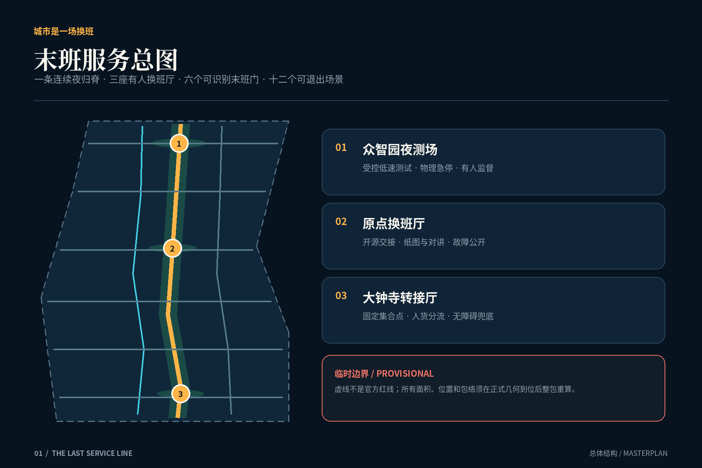
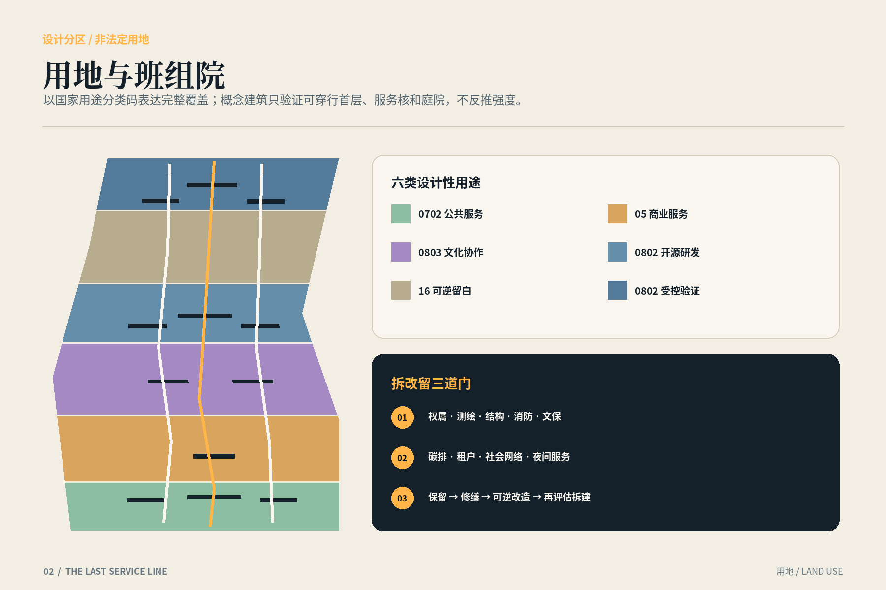
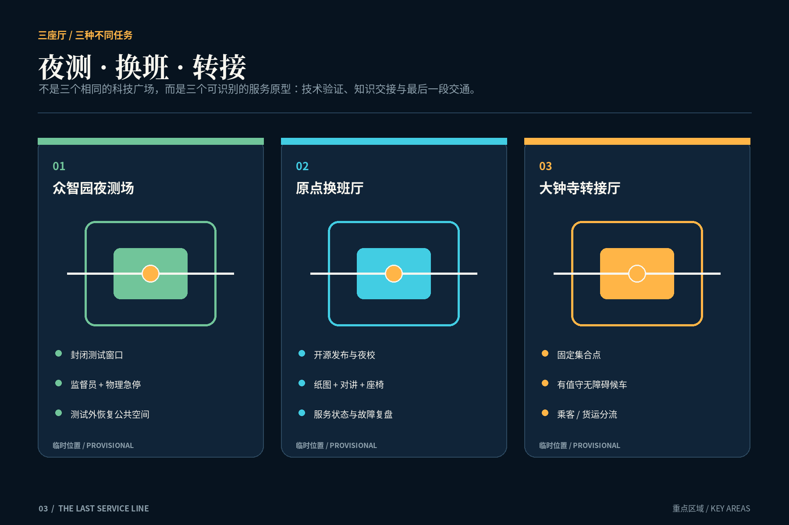
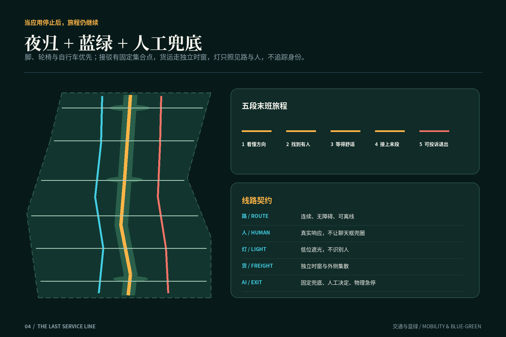
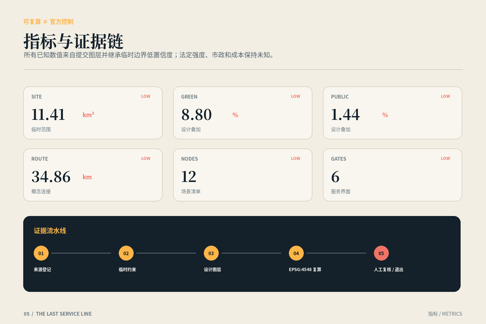

# 京张末班线 / THE LAST SERVICE LINE

> 让创新带最后离开的人也有路回家。这里的“末班”不是一班虚构列车，而是一份公共服务合同：当正常班次、前台和手机电量都结束后，路仍连续，门仍可开，人仍可求助，AI 仍可退出。

## 设计依据与资料清单

本方案首先服从《百年京张AI创新带城市设计国际方案征集资格预审公告》和面向智能体任务书，将“世界级AI创新生态、新型城市形态、高品质城区”转译成可审查的空间、服务与治理成果。机器可读依据包括 `brief/site-package/` 下的设计任务、允许设计空间、枚举、规划限值、模式与标准，资料用途以 `data/source_registry.json` 为准，不能把背景材料升级为法定条件。[source:OFFICIAL-ANNOUNCEMENT] [source:AGENT-TASKBOOK]

当前仓库没有官方精确总体边界、三处重点区红线、控规指标、道路红线、建筑现状、权属、市政管线或文保控制线。故本包沿用维护者依据公告文字四至和公告面积生成的临时粗略几何：总体范围约 11.4 平方公里，三处重点区公告面积合计 368.4 公顷；图层均标记 `official_boundary=false`、`boundary_precision=provisional_rough`，只用于设计讨论和拓扑自检。面积复算值不是审批面积，边界也不是道路或用地红线。[data:geometry/site_boundary.geojson#PROV-SITE-001] [source:BOUNDARY-SOURCE]

设计依据被分成三类：一是项目与国家标准，约束任务覆盖、城市设计表达、用地分类、无障碍和AI治理；二是仓库提供的已清权或临时数据，支撑范围与指标复算；三是伦敦夜间交通、首尔深夜公交、新加坡 one-north、巴塞罗那 22@、赫尔辛基 Maria 01、剑桥 Kendall Square 和 Paris-Saclay 等公开案例，只用于比较运营方法，不导出北京的客流、班次或控规数值。每项外部案例均在 `sources.json` 登记发布者、访问日期与用途限制。[standard:MOHURD-URBAN-DESIGN-MEASURES] [source:EXT-LONDON-NIGHT-TUBE]

方案的概念效果图由内置图像生成工具原创生成，不是场地摄影、测绘或建成承诺；人物不对应真实个人，画面中的建筑、铁路和灯光不能作为现状证据。空间结论只认 GeoJSON、指标公式和明确假设，图像只承担氛围与人物叙事。缺失数据、风险与复算触发条件分别进入 `assumptions.json`、`risk.json` 与 `self_check.json`。[depth:existing_conditions_diagnosis] [source:AI-GENERATED-COVER]

## 三层范围工作框架

三层范围以同一个问题贯通：一座创新城区如何对待最后离开的人。约 43.6 平方公里统筹研究范围讨论高校、企业、社区、交通和夜间服务的区域协作；约 11.4 平方公里总体设计范围建立“末班服务脊”；众智园、北京AI原点社区、大钟寺三处重点区域则把线路落实为可建、可运营、可失败的空间原型。统筹层不画伪精确项目，总体层不冒充法定控规，重点层也不把临时矩形边界解释为地块。[depth:three_level_scope_framework] [standard:PROJECT-OFFICIAL-ANNOUNCEMENT]

区域层提出“末班互助协议”：参与园区、大学、站点、企业和社区共享最低服务目录与事件转接规则。目录只公开站点是否有人、无障碍路径是否可用、卫生间和饮水点是否开放、最后一段接驳状态及人工求助方式，不公开个人轨迹。总体层形成一条南北连续的夜归脊、三座换班服务厅、六个末班门、蓝绿慢行支线和物流分流支线；重点层通过三种截然不同的厅堂检验技术试验、知识交接和交通换乘。[data:geometry/roads.geojson#ROAD-LAST-SERVICE-SPINE] [metric:key_area_count]

三层之间采用“上层定契约、中层定网络、下层定界面”的传递方法。区域协作先定义最低服务和数据边界；总体设计再把开放空间、步行、骑行、接驳、照明与求助节点连成连续网络；重点区详细设计最后回答门在哪里、谁值守、断电怎么办、货客如何分开、测试如何退出。官方几何到位后只需替换约束并重新裁切设计图层，而不是推翻服务逻辑。[data:geometry/key_areas.geojson#PROV-KEY-001] [depth:overall_spatial_structure]

本方案以“最后一次服务检查”作为共同评价尺度：任何AI设施都必须声明最后服务时间、离线替代、人工接管、故障退出、无障碍路径和投诉回路。这样，世界级不再只是创新资源密度，也包括最不显眼劳动者在低峰、低电量、低能见度条件下仍获得尊严服务的能力。[source:CASE-SYNTHESIS] [standard:PROJECT-AGENT-OPEN-CALL-TASKBOOK]

## 统筹研究范围产业与未来城市研究

统筹研究把AI产业看作“被持续维护的城市系统”，不只统计实验室和企业。创新链增加测试员、设备维护、数据标注、物业、保洁、配送、安保、社区照护和公共交通等关键角色；人才链也不再只画“全球科学家”，而是画出使科研能连续运行的协作劳动。由此提出京张品牌母题“最后一棒”：百年铁路的时刻纪律与当代AI系统的交接纪律相遇，形成可识别、可操作而非装饰性的文化叙事。[source:AGENT-TASKBOOK] [depth:overall_spatial_structure]

产业空间沿三类验证场组织。北段众智园设置受控夜测场，供低速接驳、端侧设备和维护调度在封闭时窗、明确责任人和物理急停条件下测试；中段原点社区设置“换班账本”，把模型卡、服务状态、开源贡献、故障复盘和社区培训放进可见的知识交接厅；南段大钟寺设置末公里转接厅，让轨道、夜间接驳、骑行、步行与货运之间有清楚的人货分流和人工兜底。这些是设计建议，不代表运营方已经承诺。[data:geometry/public_space.geojson#PUBLIC-NIGHT-YARD] [source:EXT-JTC-ONE-NORTH]

未来城市研究从七个外部案例提炼方法而不照搬形式：首尔深夜公交提示可用聚合需求数据迭代路线；伦敦夜间交通提示夜间服务仍需站务、无障碍与维修窗口协同；one-north、22@、Maria 01、Kendall Square 和 Paris-Saclay 共同说明创新区需要复合生活、可适应空间、存量再用和公共领域，而非封闭科技园。由于城市制度、人口和交通差异，案例只形成“先小规模试验、公开指标、保留人工、定期复盘”的过程建议。[source:EXT-SEOUL-OWL-BUS] [source:EXT-HELSINKI-MARIA01]

区域协作建议设立年度“最后服务周”：由园区运营者、交通服务者、劳动者代表、残障人士、社区和技术团队共同走完整条夜归链，记录关门、断路、暗角、无信号、无座椅和无人响应点。活动名称、组织者和周期均为提案，落地前需公开协商；审计结果采用聚合问题清单，不发布个人出行轨迹。[standard:BARRIER-FREE-ENVIRONMENT-LAW] [source:EXT-BARCELONA-22AT]

## 总体设计范围城市更新与控规深度城市设计

总体结构是“一脊、三厅、六门、两翼、十二节点”。“一脊”沿临时总体范围南北方向串联三处重点区域；“三厅”分别承担夜测、换班和转接；“六门”是进入或离开服务网络的全天候识别界面；“两翼”是面向高校社区的知识协作翼与面向产业物流的运维支撑翼；十二节点承载休息、饮水、卫生间、充电、离线导视、无障碍求助、维修交接和货客分流。图层是概念网络，不是现状道路判读。[data:geometry/roads.geojson#ROAD-LAST-SERVICE-SPINE] [depth:overall_spatial_structure]

用地采用自然资源用途分类码表达，但这里只是设计性分区：科研、商业服务、社区服务、文化、绿地与留白等六类纵向带状单元共同覆盖临时范围，避免把自造的“AI用地”替代法定分类。功能可在后续地块深化中复合，但必须先取得官方用地、权属、现状建筑和市政底图。所有概念建筑基底都是空间容量测试包络，不代表现状建筑、拆除对象或批准建筑规模。[data:geometry/land_use.geojson#LU-01] [standard:MNR-LAND-USE-CLASSIFICATION-GUIDE]

更新策略不是大拆大建，而是“先服务、后建设”：第一阶段用标识、值守、开放时段协议和可移动设施补齐末班门；第二阶段改造三座换班厅和连续慢行界面；第三阶段只有在官方控规、权属、工程与环境条件确认后，才评估新建包络。容积率、总建筑面积、建筑高度、建筑密度、退线、停车指标和建设成本在本包中全部保持未知，不能由概念建筑基底反推法定强度。[metric:floor_area_ratio] [depth:development_intensity_controls]

控规深度通过“已知—建议—待确认”三栏表达。已知是公告任务、公告面积和仓库临时几何的来源状态；建议是服务网络、概念功能、项目顺序和运营规则；待确认是所有正式控制条件。A3/A0 与HTML上的虚线只说明临时约束，不能用视觉精度制造权威感。[data:geometry/constraints.geojson] [standard:MOHURD-CONTROL-DETAILED-PLANNING]

## 重点区域详细设计

众智园“夜测场 / NIGHT TEST YARD”把创新验证与公共安全分开。场地外围是可全天使用的休息、饮水、卫生间和人工求助界面，内部是预约制受控试验环。低速无人接驳、端侧巡检或维护调度只能在标识清楚、物理隔离、有人监督、可手动急停、数据最小化的窗口运行；测试结束后恢复普通公共空间。北厅以可逆雨棚、设备库和观察廊组织，不把试验风险转嫁给夜归人。[data:geometry/key_areas.geojson#PROV-KEY-001] [depth:three_key_area_detailed_design]

北京AI原点社区“换班厅 / SHIFT EXCHANGE COMMONS”是知识与劳动交接的中心。白天承担开源发布、成果展示、企业服务与社区课堂，夜间缩小为有值守的服务核：屏幕关闭后仍保留纸质地图、对讲呼叫、应急充电、安静座椅和无障碍卫生间。厅内“换班账本”公开服务状态、故障复盘和下一班责任人，不公开个人身份或绩效排名；高校师生、创业者、物业和社区可在同一桌面讨论系统为何失败。[data:geometry/key_areas.geojson#PROV-KEY-002] [standard:GENERATIVE-AI-INTERIM-MEASURES]

大钟寺“末公里转接厅 / LAST-MILE TRANSFER HALL”把最后一段交通当作公共建筑。临时重点区与现实站点关系仍待官方几何核验，因此方案只提出功能而不声称精确站位：有值守换乘柜台、低地板候车区、离线班次板、无障碍连续路径、骑行停放、网约与接驳上客区、配送集散区和夜间可见的回家方向。货运和乘客在平面与时间上分流，AI调度失效时回退到固定集合点与人工排队。[data:geometry/key_areas.geojson#PROV-KEY-003] [source:KEY-AREA-SOURCE]

三处各设置一个公共地标：众智园“最后一棒”以可手持的检修灯形态纪念维护；原点社区“换班账本”把交接记录变成公共长桌；大钟寺“末班钟”用无声光环显示服务仍在或已转人工。地标不复制历史构件，不声称使用遗址原物；其文字、声光、无障碍和夜间扰动须在专业设计与公众评议后确定。[standard:MOHURD-URBAN-DESIGN-MEASURES] [source:OFFICIAL-ANNOUNCEMENT]

## AI 创新生态、人才画像与 AI+ 场景

六类核心画像分别是深夜离场的研究员、完成收运的环卫工、抢修设备的维护员、跨区配送的骑手、陪同就医或照护的家属、轮椅或行动不便乘客；外地访客作为第七类校核者。方案不把他们抽象成“流量”，而是逐一检查：是否有连续路径、可坐下的地方、饮水与卫生间、无需智能手机的方向、可理解的最后班次、真实的人类响应和安全退出。[standard:BARRIER-FREE-ENVIRONMENT-LAW] [depth:risk_missing_data]

十二个场景组成服务链：①离线末班导视；②有人值守求助；③无障碍休息与卫生间；④低电量充电与纸质地图；⑤货客分流路缘；⑥固定集合点夜间接驳；⑦聚合需求辅助路线复盘；⑧能耗感知但不追踪个体的照明；⑨社区夜校与换班交接；⑩设备维修调度；⑪受控低速接驳夜测；⑫故障公开复盘。每个节点在 `public_space.geojson` 中有概念点位，数量只表达设计清单，不代表已经建设。[data:geometry/public_space.geojson#SCENARIO-01] [metric:scenario_node_count]

其中三项明确为产业测试验证场景。低速接驳夜测要求封闭窗口、监督员、物理急停和测试日志；人机协同维修调度要求工单最小必要数据、维修员最终决定和误派回滚；聚合需求路线复盘只使用去标识、时间和空间分箱后的统计量，不建立个人夜行画像。任何测试都必须先通过专业安全、数据合规和无障碍评审，公众可识别并绕行测试区域。[standard:GENERATIVE-AI-INTERIM-MEASURES] [source:EXT-SEOUL-OWL-BUS]

“末班服务合同”写在每个AI界面旁：服务到几点、谁负责、没网怎么办、识别错误怎么办、如何找人、如何退出、何处投诉。算法不得成为进入卫生间、休息区、求助点或回家路线的门槛；人脸识别、情绪识别和针对劳动者的隐性绩效监控不进入方案。运营数据以公开的服务可用率、人工响应时间、断点修复时间和无障碍审计问题闭环率为主，具体阈值待试点协商。[source:CASE-SYNTHESIS] [standard:ELDERLY-SMART-TECH-PLAN-2020-45]

## 用地、建筑规模与拆改留方案

临时总体边界被拓扑切分为六个完整覆盖的设计性用地单元：北段科研与试验，中北段留白与生态缓冲，中段科研/社区服务与文化协作，南中段商业服务，南段公共服务和绿地。用地码遵守仓库枚举，但面积和比例随临时边界复算，只能比较结构，不能替代法定用地平衡表。公共空间和绿地是叠加设计网络，不能与用途分类面积简单相加。[data:geometry/land_use.geojson#LU-03] [metric:site_area_sqm]

概念建筑采用小尺度、可穿行的“班组院”而非连续封闭园区。`buildings.geojson` 中的包络分为服务厅、实验/研发、社区服务、交通接驳和混合使用原型，全部标注 `agent_generated_design` 与 `design_proposal`。它们只是验证庭院、廊道、首层公共界面和服务核是否能落下的二维包络；没有现状建筑调查，故不作现状保留、改造或拆除对象判定，也不声称地块可建设。[data:geometry/buildings.geojson#BLDG-HALL-NORTH] [metric:building_footprint_area_sqm]

拆改留采用决策门而不是虚构清单。第一门核验产权、现状测绘、结构安全、消防、文保与使用状态；第二门评估碳排、社会网络、租户和夜间服务影响；第三门才形成“保留、修缮、改造、拆除或新建”结论。优先顺序是保留可用空间、轻介入修缮、可逆改造，最后才考虑拆建。未通过三门的概念包络均标为“待核验容量测试”。[depth:retain_renovate_demolish] [standard:MOHURD-CONTROL-DETAILED-PLANNING]

建筑高度、体量与风貌只提出非数值原则：沿遗址公园和公共空间保持可感知的人尺度与连续首层界面；服务厅用透明但不眩光的值守核表达“有人”；屋顶设备、算力散热、装卸和垃圾收运被纳入背面运维；材料优先耐久、易维修、可替换。任何米数、层数、天际线控制和建筑总规模都等待官方控规与专业日照、消防、结构和环境分析。[metric:building_height_m] [depth:height_massing_character]

## 交通、轨道、市政与公共服务设施

交通系统按“脚—轮椅—自行车—接驳—轨道—货运”排序。末班服务脊是连续步行与无障碍骨架，绿色骑行支线平行但在厅前降速；六个末班门衔接外围街道和潜在站点；固定集合点接驳只作为试点概念，真实线路、站位、班次和票制必须由交通主管与运营单位确定。路线图层只表达设计联系，不把临时折线称为现状道路或轨道。[data:geometry/roads.geojson#ROAD-LAST-SERVICE-SPINE] [depth:traffic_rail_slow_parking]

大钟寺转接厅采用“人货两条线”：乘客在有遮蔽、可坐、连续无障碍的内侧换乘；配送与维护车辆在外侧时窗集散，交叉口用低速共享界面和人工指挥兜底。夜间接驳算法只能建议车辆与集合点，不得单方面取消固定兜底；服务中断时，离线板显示人工安排。首尔与伦敦案例只证明深夜公共交通需要路线迭代、值守、无障碍与维修协调，不证明本项目已有夜班需求或运营授权。[source:EXT-LONDON-NIGHT-TUBE] [source:EXT-SEOUL-OWL-BUS]

市政与新基建采用“小核、低耗、可断开”。每座厅预留基础电力、应急照明、饮水、卫生、通讯、设备检修和垃圾分类空间；边缘算力只处理必要的现场状态，原始个人数据不进入公共大屏。关键服务必须在断网、断电或模型不可用时回退到机械开门、纸质地图、蓄电照明、对讲与人工登记。容量、管线接入、防洪排涝、消防水源和能源方案均待官方资料与专项工程校核。[depth:municipal_new_infrastructure] [data:geometry/constraints.geojson]

公共服务的最低包不是豪华配套，而是座椅、遮蔽、饮水、卫生间、充电、安静等候、人工求助和清楚方向。所有人都能在不注册、不刷脸、不下载应用的条件下使用。轮椅转弯、坡道、盲文/触觉、听觉提示、对比度和夜间眩光须由无障碍专业人士及真实使用者共同评审。[standard:BARRIER-FREE-ENVIRONMENT-LAW] [source:CASE-SYNTHESIS]

## 蓝绿空间、公共空间与城市风貌

蓝绿系统不是一条装饰绿带，而是末班服务的气候基础设施。连续绿廊为步行与骑行提供遮荫、雨洪调蓄和可辨方向；三座服务厅周围设置可见、不过度明亮的安全边缘；夜测场在非测试时恢复为开放地面；雨水花园和下凹绿地只能在地下管线、土壤污染和排水条件核验后深化。绿色空间面积来自设计叠加层，受临时边界限制。[data:geometry/green_space.geojson#GREEN-SPINE] [metric:green_ratio]

公共空间以“看得见人、找得到人、允许停留”为风貌底线。夜间照明采用低位、连续、遮光、可维护的暖色工作光，重点照亮路面高差、门牌、坡道和求助界面，而非追求整段高亮。能耗感知照明只读取环境与设备状态，不利用个人身份或情绪推断；值守空间保持视觉联系，同时设置工作者休息与隐私区域。[data:geometry/public_space.geojson#PUBLIC-SHIFT-COMMONS] [standard:MOHURD-URBAN-DESIGN-MEASURES]

城市识别系统来自铁路时刻表的清晰纪律：一条粗线表示仍可通行，一枚光环表示人工服务，一段虚线明确数据待定。中文、英文、图形、触觉和高对比信息形成多通道导视；“末班钟”不发出扰民钟声，而以低亮度状态环传递服务切换。历史叙事只引用公告确认的京张文化主题，不虚构遗址位置、年代、构件或保护等级。[source:OFFICIAL-ANNOUNCEMENT] [depth:blue_green_public_space]

公共空间管理引入“最后离场走查”：保洁、维修、安保、交通、残障使用者和社区代表在不同天气与服务切换时段共同检查连续性。走查不采集个人行动轨迹，记录的是门、灯、坡道、座椅、厕所、对讲和班次信息是否可用。问题进入公开修复看板，负责人和期限可见，但不进行劳动者排名。[source:CASE-SYNTHESIS] [standard:ELDERLY-SMART-TECH-PLAN-2020-45]

## 更新项目清单、实施政策与分期计划

第一期为“先开一盏有人负责的灯”，不依赖大规模建设：完成末班服务审计、六门统一标识、纸质与离线地图、人工转接协议、基础座椅饮水和三个临时值守核；同时核验官方边界、站点、道路、权属、建筑、市政和文保资料。试点必须有退出日期、投诉渠道和公开复盘，不能把临时设施长期化而无人维护。[data:geometry/phasing.geojson#PHASE-01] [depth:phasing_implementation]

第二期为“三厅一脊改造”：在资料核验、公众参与和专项审查后，改造夜测场、换班厅、转接厅及连续慢行界面，实施货客分流、无障碍补缺、低位照明、雨洪和小型能源/通讯服务核。项目包按“空间工程+运营责任+数据规则+人工兜底”一并招采，避免只采购设备。年度“最后服务周”和班组维护奖励从此阶段开始试行。[data:geometry/phasing.geojson#PHASE-02] [depth:renewal_project_list]

第三期为“网络化扩展”：只有前两期的服务可用率、公众接受、运维成本和安全评估通过后，才向两翼园区和区域协作伙伴扩展；概念新建包络也只在法定规划、权属、资金和工程条件确认后进入方案设计。扩展遵循可逆模块和开放接口，避免被单一技术供应商锁定。[data:geometry/phasing.geojson#PHASE-03] [standard:PROJECT-AGENT-OPEN-CALL-TASKBOOK]

实施政策包括四项：最低服务目录纳入园区运营协议；夜间公共服务采购单列人工值守和维护；AI系统必须提供离线、人工和退出接口；每次迭代公开问题、修复和未解决项。组织架构建议由规划、交通、园区、社区、劳动者和无障碍代表组成联合评审组，名称与权责需依法另行确定。财务成本、建设时序和主管单位没有公开依据，本方案不作承诺。[metric:implementation_cost_cny] [depth:phasing_implementation]

## 指标体系、面积复算与合规矩阵

本包的已知指标全部从提交图层复算，并明确“几何已知不等于规划条件已知”。临时总体边界面积、概念建筑基底面积、绿地叠加面积、公共空间叠加面积、路网中心线长度、三处重点区数量、十二个场景节点、六个末班门和三期数量均可从 GeoJSON 重现；因为上游边界是临时粗略数据，这些值统一采用低置信度，只用于方案内部一致性。[metric:site_area_sqm] [metric:road_centerline_length_m]

已知设计指标包括：概念建筑基底面积与基底占比 [metric:building_footprint_area_sqm] [metric:design_building_footprint_ratio]；绿地面积与叠加比 [metric:green_space_area_sqm] [metric:green_ratio]；公共空间面积与叠加比 [metric:public_space_area_sqm] [metric:public_space_ratio]。重叠的绿地与公共空间不可相加为“总开放空间”，所有数值在图件中均标“临时边界复算”。

服务结构按清单复核：重点区域 3 处 [metric:key_area_count]，换班服务厅 3 座 [metric:staffed_hall_count]，末班门 6 个 [metric:last_service_gate_count]，场景节点 12 个 [metric:scenario_node_count]，实施阶段 3 期 [metric:phase_count]。这些计数是提案对象数量，不是建成数量、政府承诺或运营绩效。

保持未知的指标包括容积率 [metric:floor_area_ratio]、总建筑面积 [metric:total_floor_area_sqm]、建筑高度 [metric:building_height_m]、法定建筑密度 [metric:regulatory_building_density]、道路红线、停车供给、夜间客流、服务班次和实施成本 [metric:implementation_cost_cny]。任何后续版本一旦获得官方或经清权数据，必须记录来源版本、坐标系与转换方法，重新裁切全套几何、复算指标并重绘图件。[depth:metrics_recalculation] [source:SOURCE-REGISTRY]

`compliance_matrix.json` 将公告和智能体任务书的每项必选任务映射到正文、图层、指标和图纸；`standard_matrix.json` 区分强制标准、建议参考和资料缺口；`design_depth_matrix.json` 覆盖十五项专业深度。自检分为范围可信度、拓扑、指标一致性、双语显示、离线HTML、PDF页数和隐私/无障碍风险，不以“验证通过”冒充专业审批。[standard:MOHURD-CONTROL-DETAILED-PLANNING] [depth:metrics_recalculation]

## 风险、版权与合规说明

最大空间风险是临时边界的错误定位，尤其仓库公开问题已提示第三重点区临时几何与“大钟寺”语义位置可能存在偏离。应在官方CAD/GIS/PDF到位后整包重算，而不是移动一个矩形后保留旧指标。最大实施风险是夜间服务变成昂贵却无人维护的设备展；故每个项目同时指定运营责任、人工兜底、维修预算和退出条件。[data:geometry/constraints.geojson] [depth:risk_missing_data]

数据与技术风险包括夜间轨迹对个人更敏感、算法调度对低频需求不稳定、照明和摄像设备可能形成监控扩张、供应商锁定以及自动化把风险转移给一线劳动者。缓解原则是数据最小化、聚合统计、边缘处理、短期保留、用途限制、人工最终决定、物理急停、离线等价服务和公开复盘。高风险试验必须由数据合规、安全、交通、无障碍专业人员和受影响公众共同复核。[standard:GENERATIVE-AI-INTERIM-MEASURES] [standard:BARRIER-FREE-ENVIRONMENT-LAW]

公平风险来自“有应用的人先走、不会用的人被留下”。因此休息、饮水、卫生间、求助、固定集合点和方向信息不设注册门槛；轮椅使用者、老年人、听视障者、夜班劳动者和非中文使用者参与走查。算法不得给劳动者打隐性绩效分，不以预测风险为由拒绝个人使用公共服务。[standard:ELDERLY-SMART-TECH-PLAN-2020-45] [source:CASE-SYNTHESIS]

版权方面，正文、图表、代码生成图件和排版由本次提交原创组织，按 `COMMUNITY-DISPLAY-ONLY` 提交；外部网页只作事实核对和案例释义，没有复制其图像、地图或长篇文字。AI生成封面明确标注概念性、非现场证据；系统字体仅用于渲染，许可证信息写入版权说明。方案不声称官方批准、政府背书、运营承诺或专业设计签章。[source:AI-GENERATED-COVER] [source:FONT-NOTO-CJK]

## 参考资料

项目依据以北京市规划和自然资源委员会海淀分局公告、仓库 `brief/site-package/`、面向智能体任务书、来源登记表和已收录国家标准为准。正式边界下载资料目前未公开可用，因此本方案主动保留边界与控规缺口，使用者不得把图件截取后单独作为审批或投资依据。[source:OFFICIAL-ANNOUNCEMENT] [source:SITE-PACKAGE]

外部运营案例来自公开机构页面：首尔市深夜公交、伦敦交通局夜间地铁、新加坡JTC one-north、巴塞罗那市22@资料、赫尔辛基市Maria 01、剑桥市Kendall Square规划及Paris-Saclay公共机构材料。它们支持“有人值守、无障碍、维护窗口、数据迭代、复合生活、存量再用和公共空间”等方法讨论，但其数据、法规与空间方案不移植为北京结论。[source:EXT-CAMBRIDGE-KENDALL] [source:EXT-PARIS-SACLAY]

所有来源的标题、发布机构、网址、访问日期、用途、复用限制与禁用范围保存在 `sources.json`。边界推导过程见仓库说明，面积与图层公式见 `metrics.json`，待确认事项见 `assumptions.json`，风险评分见 `risk.json`。这套证据分工使提案既能被人阅读，也能被脚本复核，并为官方资料补齐后的下一轮迭代保留清晰入口。[source:PROCESSED-FACT-PACK] [depth:existing_conditions_diagnosis]

“京张末班线”最终不是延长营业时间的口号，而是一种城市设计伦理：判断创新是否成立，要看系统最安静、最疲惫、最少人关注的时刻。只要最后一个人仍能看懂方向、找到座位、得到人的回应并安全离开，AI创新带才真正完成了一次交接。[standard:PROJECT-AGENT-OPEN-CALL-TASKBOOK] [source:CASE-SYNTHESIS]
