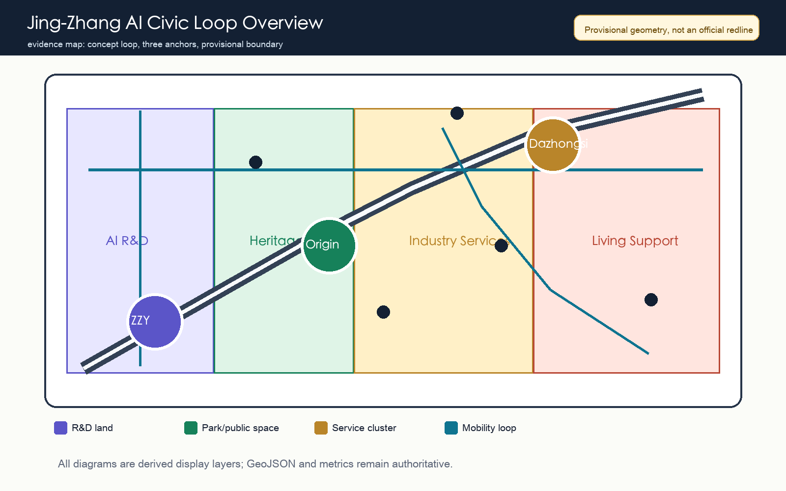
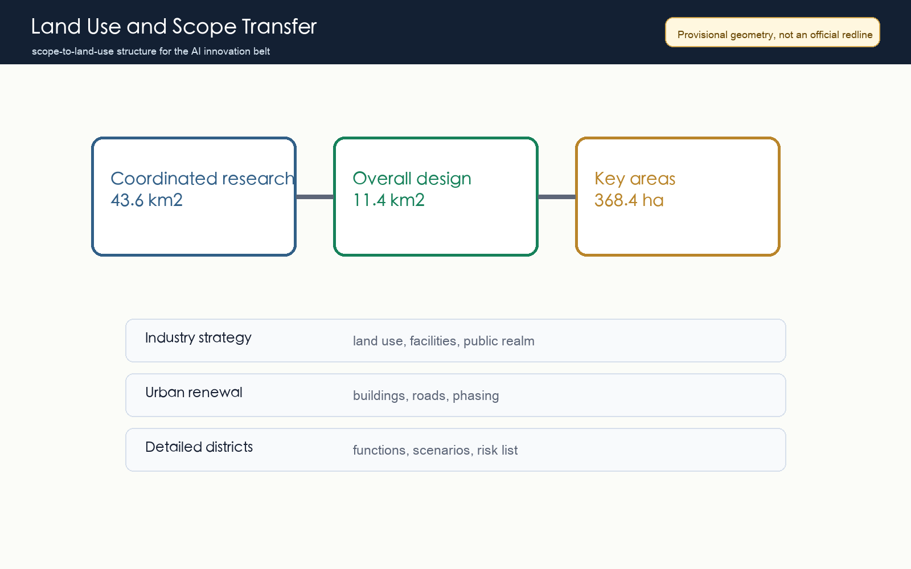
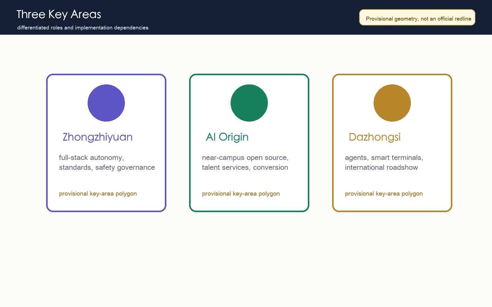
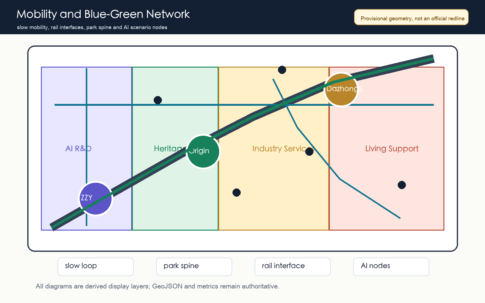
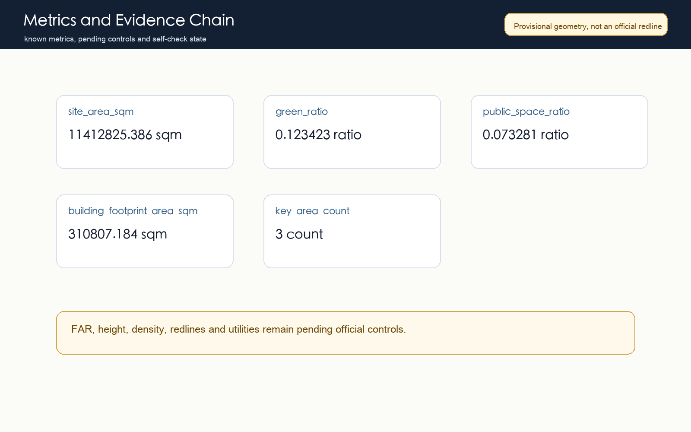

# Jing-Zhang AI Civic Loop: Urban Design Proposal for the Centennial Jing-Zhang AI Innovation Belt

## Design Basis and Source List

This proposal participates in the Centennial Jing-Zhang AI Innovation Belt open call. It uses the repository site package, the official announcement excerpt, the Agent taskbook, the public source registry, and local professional standard snapshots as its evidence base. The working title is "Jing-Zhang AI Civic Loop": a public-space and innovation loop that translates the railway heritage spine into a civic framework, links Zhongzhiyuan, Beijing AI Origin Community, and Dazhongsi as three AI anchors, and connects slow mobility, blue-green space, industry services, and public AI experiences into one auditable concept. Complete provenance, rights, limitations, and machine indexes stay in `sources.json` and the three matrices [source:SITE-PACKAGE] [source:OFFICIAL-ANNOUNCEMENT] [depth:existing_conditions_diagnosis].

The repository does not yet contain official precise redlines, official polygons for the three key areas, road redlines, parcel ownership, regulatory planning indicators, or municipal engineering files. The package therefore uses `brief/site-package/geometry/provisional_boundaries.geojson` as a temporary constraint. Areas and diagrams derived from it are valid only for intake, discussion, and repair; they are not official redlines, statutory approval material, or precise professional scoring evidence [source:SOURCE-REGISTRY] [data:geometry/site_boundary.geojson#SITE-001].

The machine-audit layer contains nine GeoJSON files, `metrics.json`, `compliance_matrix.json`, `standard_matrix.json`, `design_depth_matrix.json`, `assumptions.json`, and `self_check.json`. The human reading layer contains this report, five derived figures, offline HTML, and A3/A0 PDFs. Each design statement explains why the spatial move is proposed, which layer or metric supports it, and which official materials are still missing. The processed fact pack is used only as a navigation layer, not as a new authority [source:PROCESSED-FACT-PACK].

## Three-Level Scope Framework

The proposal is structured through three nested scopes: coordinated research area, overall design area, and key detailed-design areas. The coordinated research area addresses how Haidian can organize universities, research institutes, enterprises, computing resources, data, capital, and global communication into a world-class AI innovation ecosystem. The overall design area addresses how the 11.4 square kilometre area around the Jing-Zhang heritage park can support urban renewal, land-use structure, transport, municipal systems, blue-green public space, and urban character for AI-driven productive capacity. The key areas test the concept at implementation depth [depth:three_level_scope_framework] [standard:PROJECT-OFFICIAL-ANNOUNCEMENT].

The transfer logic is industry ecosystem to spatial structure, spatial structure to land use and facilities, and key districts to scenarios and operations. At the coordinated level, the proposal organizes a chain of academic origination, open-source collaboration, enterprise conversion, public experience, and international communication. At the overall level, that chain becomes AI R&D land, industry-service land, blue-green public space, and living support. At the key-area level, the three anchors are differentiated as full-stack autonomy, near-campus conversion, and intelligent-native consumption and business [data:geometry/land_use.geojson#LU-001] [data:geometry/key_areas.geojson#PROV-KEY-001].

Because the package uses provisional geometry, the scope framework expresses a method and spatial relationship rather than a statutory boundary. When official polygons are released, the boundary, key areas, land use, roads, green space, public space, buildings, phasing, and all known metrics must be recalculated. The current `site_area_sqm` metric only documents internal consistency under the provisional boundary [metric:site_area_sqm].

## Coordinated Research Area: Industry and Future City Research

The coordinated research strategy avoids relabeling a traditional district as an AI park. It organizes Haidian's academic research, open-source communities, enterprise services, and global communication into an AI full-stack autonomy system. Zhongzhiyuan becomes the venue for models, chips, compute, data security, standards, and safety governance. Beijing AI Origin Community becomes the venue for university innovation, open-source collaboration, and talent services. Dazhongsi becomes the venue for agents, smart terminals, content consumption, and international business presentation. The Zhongguancun service wing and Xiaoyuehe scenario wing support capital, IP, public experience, and scenario opening [source:AGENT-TASKBOOK] [standard:PROJECT-AGENT-OPEN-CALL-TASKBOOK].

Global AI ecosystem references are converted into mechanisms rather than copied as names: Bay Area academic-enterprise exchange, Cambridge-London research conversion, Paris Station F startup community, Shenzhen hardware supply-chain experimentation, Seoul digital-media content consumption, and Shibuya developer events. Transferable mechanisms include high-frequency collaboration space, open test fields, transparent governance, public experience routes, international roadshows, developer events, and daily talent services. These mechanisms map to the slow loop, public-space nodes, service streets, and key-area interfaces [depth:overall_spatial_structure].

The identity direction uses "Jing-Zhang AI Civic Loop" as the main English name and "Heritage to Intelligence" as a communication line. The loop is not a new statutory boundary. It is a spatial narrative that connects railway heritage, innovation collaboration, and public experience. The logo direction combines a rail arc, a node network, and open-source bracket symbols. Fonts, icons, trademarks, portraits, and corporate material must be cleared before any final visual use.

## Overall Design Area: Urban Renewal and Regulatory-Plan-Level Urban Design

The overall design area is organized as one belt, three anchors, four concept land-use zones, and multiple AI scenario nodes. The belt is the Jing-Zhang heritage park and its slow, blue-green public-space system. The anchors are Zhongzhiyuan, AI Origin Community, and Dazhongsi. The four zones are AI R&D, park and open space, industry and business services, and community support. `land_use.geojson` covers the provisional boundary completely so the proposal does not rely on loose concept lines [data:geometry/land_use.geojson#LU-001] [depth:land_use_layout].

The renewal strategy is to retain useful urban fabric, renovate inefficient interfaces, add public services, and only cautiously discuss new capacity. At this stage `buildings.geojson` records a conceptual building footprint rather than parcel-level demolition decisions. Height, FAR, density, setbacks, and character zones need official planning controls, existing building data, ownership, and heritage information before professional confirmation [data:geometry/buildings.geojson#BLDG-001] [metric:building_footprint_area_sqm] [depth:development_intensity_controls].

Transport and municipal support focus on walkable, bikeable, and rail-connected low-disruption renewal. The proposal prioritizes stitching discontinuities around the heritage park, strengthening pedestrian connections around Dazhongsi Station, Wudaokou, and Qinghua East Road West Station, and describing edge compute, distributed energy, public services, and maintenance nodes as new infrastructure directions pending engineering study [standard:MOHURD-CONTROL-DETAILED-PLANNING] [data:geometry/roads.geojson#ROAD-001].

## Detailed Design of Key Areas

Zhongzhiyuan AI Autonomous Innovation Acceleration Area is positioned as a garden-style full-stack autonomy district. The spatial moves are to strengthen the Qinghe interface, create a safety-governance and standards gallery, organize low-carbon compute and public-service nodes, and connect industry exhibition with the slow-mobility system. The proposal supports model evaluation, chip and compute display, data-security governance, and international technical workshops, subject to official boundaries, river constraints, transport organization, and engineering confirmation [data:geometry/key_areas.geojson#PROV-KEY-001].

Beijing AI Origin Community is positioned as a near-campus conversion and talent district. The moves are campus-park-street slow-mobility stitching, an open-source release hall, a research conversion street, talent services, and daily living support. The design goal is that source innovation becomes visible, conversion services become findable, and talent life becomes supported, without making final claims about campus boundaries, ownership space, or building renewal [data:geometry/key_areas.geojson#PROV-KEY-002] [depth:three_key_area_detailed_design].

Dazhongsi AI Industry Cluster is positioned as an urban intelligent-economy and international-exchange district. The moves are station integration, four-quadrant pedestrian connection, agent and smart-terminal display, a data-factor salon, content consumption, and an international roadshow room. The public and commercial spaces are conceptual and must not use unauthorized corporate marks or imply confirmed public events [data:geometry/key_areas.geojson#PROV-KEY-003] [metric:key_area_count].

Version 0.3 incorporates the community review of `PROV-KEY-003`: Issue #1029 reports that the provisional Dazhongsi key-area polygon is broadly area-consistent with the announced 72.0 hectares, but its centroid appears closer to Beijing North Railway Station than to Dazhongsi Station and the four-quadrant intersection named in the task. This proposal does not independently move the shared provisional geometry, because doing so would break the repository's common validation basis. Station integration and four-quadrant pedestrian connection therefore remain directional design topics until official or maintainer-versioned geometry is supplied, after which key areas, land use, roads, public space, figures, metrics, and bilingual text must be recalculated together [source:ISSUE-1029] [source:KEY-AREA-SOURCE] [depth:risk_missing_data].

## AI Innovation Ecosystem, Personas, and AI+ Scenarios

The proposal defines five personas: open-source developer, startup team, lead-enterprise visitor, nearby resident, and university student or researcher. Developers need release, evaluation, community, and reputation mechanisms. Startups need affordable space, compute access, and product test fields. Enterprise visitors need presentation, business exchange, and international reception. Residents need low-disruption commuting, services, and recreation. University users need research conversion, cross-campus collaboration, and daily slow mobility. Version 0.3 records these personas in `visual/assets/scenario_cards.json`, and each one carries a public-interest check so the urban agent does not become personal profiling infrastructure [depth:municipal_new_infrastructure] [metric:persona_count].

Ten AI scenario cards are proposed: open-source release hall, urban-agent sandbox, slow-mobility gap diagnosis, talent life concierge, AI safety-governance corridor, university-enterprise conversion room, data-factor theatre, low-carbon compute station, Jing-Zhang memory route, and global AI week route. The industry test scenarios include the urban-agent sandbox, AI safety-governance corridor, and low-carbon compute station. They require reservation, authorization, sandboxing, audit logs, and human review [data:geometry/public_space.geojson#PUBLIC-001] [metric:scenario_card_count] [metric:industry_test_scenario_count].

| Scenario Card | Spatial Anchor | Initial State | Boundary |
|---|---|---|---|
| Open-source release hall | AI Origin Community | green | Public release material only; rights status reviewed by a human operator |
| Urban-agent sandbox | Controlled public-space test segment | yellow | Synthetic or public task data only; operator can stop the test immediately |
| Slow-mobility gap diagnosis | Mobility and road layer | yellow | Anonymous feedback and field verification, without personal trajectory inference |
| Talent life concierge | Living and service zones | green | Qualification, legal, medical, and financial questions are handed to staff |
| AI safety-governance corridor | Zhongzhiyuan | yellow | Cleared cases and sanitized evidence only |
| University-enterprise conversion room | AI Origin Community | green | No confidential research, patent drafts, or NDA material |
| Data-factor theatre | Dazhongsi concept area | yellow | Mock or public data only, with the Issue #1029 anchor limitation retained |
| Low-carbon compute station | Public-service node | yellow | Equipment capacity, fire safety, and energy load require engineering review |
| Jing-Zhang memory route | Blue-green public space | green | Heritage text, images, and accessible routes require rights and factual review |
| Global AI week route | First scenario-opening segment | green | Public agenda and opt-in questions only; no confirmed-event claim |

Scenarios are placed through three kinds of space, two kinds of operation, and one switchback protocol. The spaces are key-area presentation rooms, heritage-park public space, and daily-service space around rail stations. The operations are developer-community operation for professional users and public urban-experience operation for citizens and visitors. The switchback protocol adapts Issue #1119's open template: each card has a green, yellow, or red state, a default 90-day review, a five-minute human takeover target, and a non-AI equivalent service path. All scenarios remain concept proposals in the compliance matrix, `visual/assets/scenario_cards.json`, and visual page until data security, public safety, engineering feasibility, and operator responsibility are reviewed [source:SWITCHBACK-PROTOCOL] [metric:scenario_review_cycle_days] [metric:human_takeover_target_minutes].

## Land Use, Building Scale, and Retain-Renovate-Demolish Strategy

The land-use proposal divides the provisional boundary into AI R&D, park/open space, industry/business services, and community support. These zones are not statutory land-use replacements. They are a recomputable design framework for the open-call phase that can be recalculated after official geometry is available. The colors and ratios are derived from GeoJSON and should not be read as approval drawings [standard:MNR-LAND-USE-CLASSIFICATION-GUIDE].

The building-scale strategy starts from collaboration scenarios before capacity decisions. Without official controls, the proposal does not declare final FAR, height, or density; `floor_area_ratio` remains unknown in the metrics file. The conceptual building footprint highlights ground-floor public interfaces, release spaces, validation facilities, talent services, and international exchange rather than large-scale new development [metric:floor_area_ratio] [depth:height_massing_character].

The retain-renovate-demolish method has four categories: retain valuable heritage, innovation-service, and community-service spaces; renovate inefficient ground-floor and disconnected interfaces; treat demolition only as an option after ownership, structure, safety, heritage, and public review; and use new building only to fill public-service and industry-platform gaps. Parcel-level decisions require official attachments and professional surveys [depth:retain_renovate_demolish].

## Transport, Rail, Municipal Infrastructure, and Public Services

The transport concept is slow-mobility first, rail connected, and micro-circulation supported. The loop links the heritage park, three key areas, rail stations, enterprise services, and community life. The road layer records conceptual centerlines and links needing further study, not road redlines or bridge-tunnel decisions. Transport is cross-checked with public space, green space, and key-area layers [data:geometry/roads.geojson#ROAD-001] [depth:traffic_rail_slow_parking].

Municipal and public-service facilities are organized as edge compute, green energy, public services, and intelligent maintenance nodes. Edge compute stations support small-scale public experiences and testing. Green-energy nodes explain distributed energy and low-carbon display. Public-service nodes serve talent, residents, and visitors. Maintenance nodes support facility upkeep and safety review. Capacity, utilities, fire safety, energy loads, and engineering feasibility remain pending official engineering data [depth:municipal_new_infrastructure].

Rail-station areas focus on legibility, transfer comfort, pedestrian continuity, and public interface quality after arrival. Dazhongsi Station should prioritize four-quadrant pedestrian connection. Wudaokou and Qinghua East Road West Station should prioritize slow-mobility stitching among campuses, parks, and enterprises. North Fifth Ring Road and heritage-park discontinuities are proposed as near-term public-space improvement topics.

## Blue-Green Network, Public Space, and Urban Character

The blue-green strategy treats the Jing-Zhang heritage park as the skeleton of public life and AI experience, not merely as landscape background. The proposal connects the heritage park, Qinghe, Xiaoyuehe, campus edges, enterprise interfaces, and community spaces into continuous walking and cycling routes, with explainable AI wayfinding, scenario display, developer events, and public rest points at key nodes [data:geometry/green_space.geojson#GREEN-001] [metric:green_ratio].

Public space performs three tasks: daily service for residents, students, and commuters; innovation exchange for enterprises, developers, and university teams; and cultural display linking railway heritage, Zhongguancun innovation, and AI culture. The public-space ratio is only a recalculated indicator. The design target is publicness, continuity, and maintainability [standard:MOHURD-URBAN-DESIGN-MEASURES] [data:geometry/public_space.geojson#PUBLIC-001].

Three types of AI pilgrimage or honor-display nodes are proposed: a Tsinghuayuan Station memory node and railway heritage display, an AI Origin open-source contribution wall, a Zhongzhiyuan trustworthy-AI governance beacon, and a Dazhongsi intelligent-economy roadshow room. They are concept proposals pending heritage, copyright, public safety, visual-impact, and operator review [depth:blue_green_public_space].

## Renewal Projects, Implementation Policy, and Phasing

Near-term projects should be low-disruption, pilotable, and reviewable: heritage-park slow-mobility gap stitching, Zhongzhiyuan Qinghe innovation interface, AI Origin open-source release hall, Dazhongsi station-area pedestrian connection, edge-compute stations, and the global AI week public route. `phasing.geojson` names the phase-one area as the Jing-Zhang AI Civic Loop first scenario-opening segment, but this is only conceptual phasing and not a construction sequence or funding arrangement [data:geometry/phasing.geojson#PHASE-001] [depth:phasing_implementation].

Mid-term work should deepen building renewal, ground-floor interfaces, public services, road micro-circulation, and blue-green repair after official boundary, ownership, controls, and engineering files are available. Long-term work should form developer-community operation, scenario open days, an international AI week, public experience routes, and knowledge-asset accumulation. Policy suggestions are directions for professional study, including public-space co-management, scenario governance, data-security sandboxes, conversion services, and operational evaluation [depth:renewal_project_list].

Phasing governance separates the design-submission period from real urban renewal implementation. The open call can quickly produce a readable, inspectable, and recalculable package. City implementation must still go through governmental review, public participation, professional design, municipal and transport checking, funding, and ownership coordination. Version 0.3 keeps near-term pilots in yellow or green concept status: yellow scenarios must pass virtual evaluation, controlled-site trial, and real-block review gates, and they turn red when review is absent or privacy, safety, or accessibility thresholds are crossed. Green scenarios must also retain a staffed alternative path so AI never becomes the only service entrance. The proposal should keep tracking repository issues, pull requests, material updates, and peer proposals [source:SWITCHBACK-PROTOCOL] [depth:phasing_implementation].

## Metrics, Area Recalculation, and Compliance Matrix

The known metrics are provisional site area, conceptual building footprint, green ratio, public-space ratio, key-area count, scenario-card count, industry test scenario count, persona count, scenario review cycle, and human takeover target. Unknown metrics include FAR and other indicators requiring official planning controls. Known spatial metrics are derived from GeoJSON; known governance metrics are derived from `visual/assets/scenario_cards.json`. Unknown metrics retain their reasons and prerequisites and must not be displayed as confirmed numeric controls [metric:site_area_sqm] [metric:green_ratio] [metric:scenario_card_count].

Under the provisional boundary, `site_area_sqm` is 11412825.386 square metres, `green_ratio` is 0.123423, and `public_space_ratio` is 0.073281. The governance layer records `scenario_card_count` as 10, `industry_test_scenario_count` as 3, `persona_count` as 5, `scenario_review_cycle_days` as 90, and `human_takeover_target_minutes` as 5. These values document package consistency across geometry and scenario governance; they do not replace official survey, planning controls, or operating-service commitments [metric:public_space_ratio] [metric:industry_test_scenario_count] [data:geometry/site_boundary.geojson#SITE-001].

`compliance_matrix.json` covers official announcement tasks 1.3, 1.4, and 1.5 plus agent.1 through agent.6. `standard_matrix.json` covers the official announcement, Agent taskbook, urban design measures, regulatory planning, and land-use classification. `design_depth_matrix.json` covers fifteen formal depth items. Passing those gates means the package can enter machine inspection and human discussion, not that it has been selected, approved, or implemented [metric:key_area_count] [depth:metrics_recalculation].

## Risk, Copyright, and Compliance

The main risks are spatial-data risk, professional-control risk, data and privacy risk, and copyright and communication risk. Spatial-data risk comes from missing official polygons and includes the unresolved Dazhongsi provisional-anchor issue raised in #1029. Professional-control risk comes from missing controls, utilities, transport, ownership, and heritage data. Data and privacy risk comes from AI scenarios that may involve personal behavior or enterprise data. Copyright risk comes from logos, fonts, images, case studies, and landmark expression. These risks are recorded in `assumptions.json`, `self_check.json`, and future issue tracking [depth:risk_missing_data] [source:BOUNDARY-SOURCE] [source:ISSUE-1029].

The proposal uses only public or repository-cleared material. It does not use secret maps, internal tables, unauthorized images, personal data, or enterprise internal data. AI scenarios require data minimization, authorization, explainability, human review, and opt-out mechanisms. Public-space sensors and urban agents must not create personal profiles or replace administrative approval. A3/A0 PDFs, HTML, and images are display layers; structured files remain authoritative.

The proposal does not claim official approval, statutory planning approval, final land ownership, final building scale, or confirmed events. Every spatial move is a concept suggestion, reference scheme, or material for professional teams to deepen. If official attachments become available, the source and license must be registered, geometry replaced, metrics recalculated, figures redrawn, bilingual text updated, and self-check rerun.

## References

- Beijing Municipal Commission of Planning and Natural Resources, Haidian Branch: qualification pre-announcement for the Centennial Jing-Zhang AI Innovation Belt open call [source:OFFICIAL-ANNOUNCEMENT].
- `brief/site-package/design_brief.json`, `agent_taskbook.json`, `allowed_design_space.json`, and `planning_limits.json`.
- `data/source_registry.json` and `data/processed/agent_fact_pack.md`.
- Local professional standard snapshots under `brief/site-package/standards/references/`.
- Complete machine indexes are in `sources.json`, `metrics.json`, `compliance_matrix.json`, `standard_matrix.json`, `design_depth_matrix.json`, and `assumptions.json` [source:AGENT-TASKBOOK].
