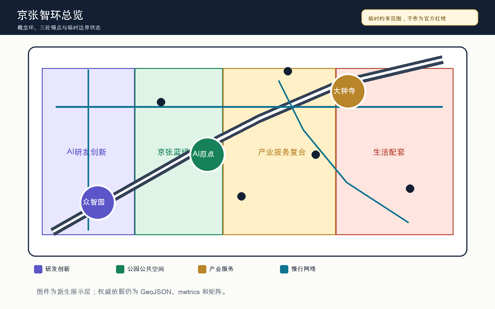
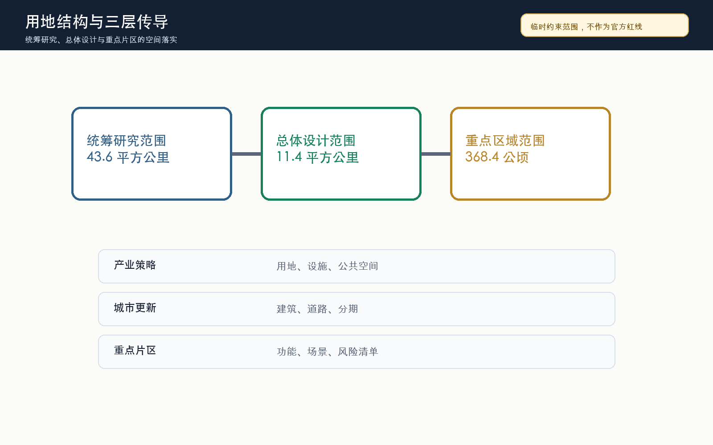
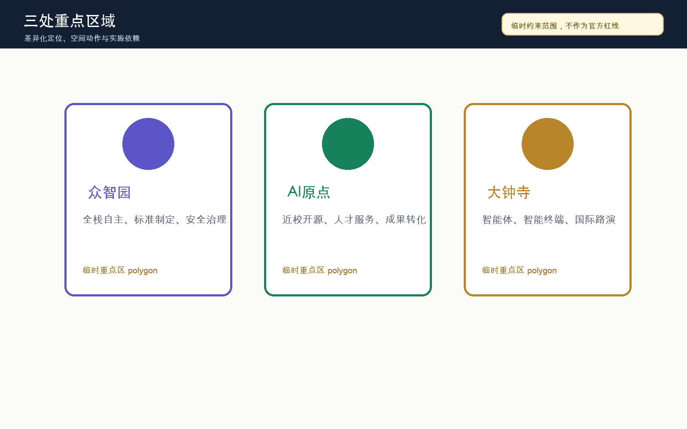
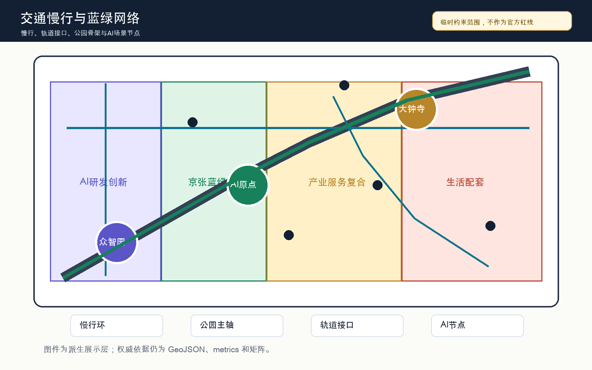
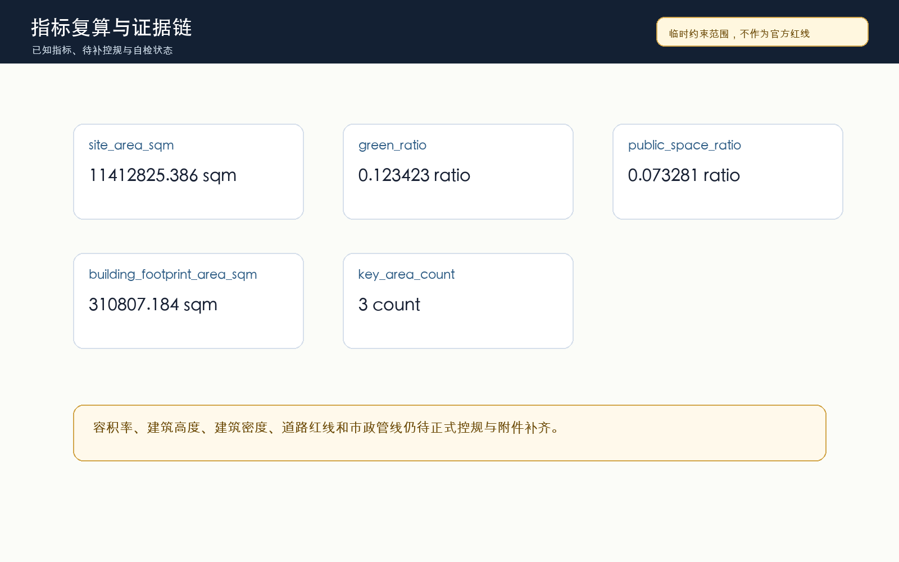

# 京张智环：百年京张AI创新带城市设计方案

## 设计依据与资料清单

本方案参与“百年京张AI创新带城市设计国际方案征集”，以仓库场地包、官方公告摘录、面向智能体任务书、公开资料登记表和本地专业标准快照为依据。方案采用“京张智环 / Jing-Zhang AI Civic Loop”作为工作命名：把京张遗址公园的历史线索转译为公共空间骨架，把众智园、北京AI原点社区和大钟寺三处重点区转译为创新锚点，把慢行、蓝绿、产业服务和AI公共体验组织成一条可审查的概念环。完整来源、许可、用途边界和机器索引放在 `sources.json` 与三个矩阵中，本节只保留关键证据锚点 [source:SITE-PACKAGE] [source:OFFICIAL-ANNOUNCEMENT] [depth:existing_conditions_diagnosis]。

当前仓库尚未提供官方精确红线、三处重点区 official polygon、道路红线、地块权属、控规指标和市政工程资料。因此，提交包使用 `brief/site-package/geometry/provisional_boundaries.geojson` 作为临时约束范围，所有空间面积和图面只能用于 intake、讨论和后续返修，不能被解读为 official redline、审批依据或精确专业评分依据 [source:SOURCE-REGISTRY] [data:geometry/site_boundary.geojson#SITE-001]。这不是降低方案深度，而是把已知官方任务、临时空间约束和待补专业资料分层说明，避免用漂亮图面制造不存在的确定性。

方案的机器审查层由九个 GeoJSON、`metrics.json`、`compliance_matrix.json`、`standard_matrix.json`、`design_depth_matrix.json`、`assumptions.json` 和 `self_check.json` 构成；人类阅读层由本报告、五张派生图、离线 HTML 和 A3/A0 PDF 构成。正文中的每个设计判断都尽量说明为什么需要这个空间动作、它落在哪个图层或指标上、以及还缺少哪些官方资料。`data/processed/agent_fact_pack.md` 只作为导航层使用，不新增官方事实 [source:PROCESSED-FACT-PACK]。

## 三层范围工作框架

工作框架按照“统筹研究范围、总体设计范围、重点区域范围”逐级展开。统筹研究范围回答海淀如何把高校、科研、企业、算力、数据、资本和国际传播组织为世界级AI创新生态；总体设计范围回答京张遗址公园周边 11.4 平方公里如何通过城市更新、用地结构、交通市政、蓝绿公共空间和风貌控制承载AI新质生产力；重点区域范围回答三处片区如何达到规划综合实施方案深度 [depth:three_level_scope_framework] [standard:PROJECT-OFFICIAL-ANNOUNCEMENT]。

“京张智环”的三层传导关系是：以产业生态决定空间结构，以空间结构分配用地和设施，以重点区检验场景和运营。统筹层提出“高校策源、开源协作、企业转化、公共体验、国际传播”的创新链；总体层把创新链落到 AI 研发、产业服务、蓝绿公共空间和生活配套四类概念分区；重点层把三处片区分别定位为全栈自主创新、近校成果转化和智能原生消费商务 [data:geometry/land_use.geojson#LU-001] [data:geometry/key_areas.geojson#PROV-KEY-001]。

使用 provisional boundary 时，三层框架的图面只表达工作方法和空间关系。官方 polygon 补齐后，需要重算 `site_boundary`、`key_areas`、`land_use`、`roads`、`green_space`、`public_space`、`buildings`、`phasing` 和全部 known metrics；现阶段的 `site_area_sqm` 仅说明临时边界内的复算结果，不能替代公告面积或正式测绘成果 [metric:site_area_sqm]。

## 统筹研究范围产业与未来城市研究

统筹研究范围的产业策略不是简单引入“AI园区”标签，而是把海淀已有的高校科研、开源社区、企业服务和国际交流能力组织成“AI全栈自主创新体系”。方案建议以众智园承接模型、芯片、算力、数据安全和标准治理展示，以北京AI原点社区承接高校成果、开源协作和人才服务，以大钟寺承接智能体、智能终端、内容消费和国际商务展示；中关村科技服务翼和小月河场景赋能翼分别提供资本、知识产权、公共体验和场景开放支撑 [source:AGENT-TASKBOOK] [standard:PROJECT-AGENT-OPEN-CALL-TASKBOOK]。

参考全球AI创新生态的可转化经验包括：湾区的高校企业高频交流、剑桥-伦敦的科研转化服务、巴黎 Station F 的初创社区、深圳的硬件供应链和快速试验、首尔数字媒体城的内容消费、东京涩谷的城市级开发者活动。方案不复制这些地区的地名或企业名单，而是提取可转化机制：高密度协作空间、开放测试场、透明治理、公共体验路线、国际路演、开发者活动和人才日常服务。这些机制在空间上对应慢行环、公共空间节点、企业服务街和重点区展示界面 [depth:overall_spatial_structure]。

品牌系统建议采用“京张智环 / Jing-Zhang AI Civic Loop”作为总名，“Heritage to Intelligence”作为英文传播语。“环”不是新的法定边界，而是把铁路文脉、创新协作和公众体验组织成可步行、可展示、可运营的空间叙事。Logo 方向采用轨道弧线、节点网络和开源括号三类符号组合，具体字体、图标和商标必须在后续设计中单独清权，不能使用未经授权的企业、人物或论文图像。

## 总体设计范围城市更新与控规深度城市设计

总体设计范围建议形成“一带三核、四类分区、多点场景”的更新结构。一带是京张遗址公园及其慢行蓝绿公共空间，三核是众智园、AI原点社区和大钟寺，四类分区是 AI 研发创新、公园绿地与开敞空间、产业服务与商业服务、社区服务与配套。这个结构由 `land_use.geojson` 完整覆盖临时边界，避免只画概念线而留下无归属空间 [data:geometry/land_use.geojson#LU-001] [depth:land_use_layout]。

城市更新策略采用“保留可用肌理、改造低效界面、补足公共服务、谨慎提出新建容量”的方法。现阶段只用 `buildings.geojson` 表达概念性建筑基底，不给出地块级拆除结论；建筑高度、容积率、建筑密度、退线和风貌分区需要官方控规、现状建筑、权属和文保资料补齐后由专业团队复核 [data:geometry/buildings.geojson#BLDG-001] [metric:building_footprint_area_sqm] [depth:development_intensity_controls]。

交通与市政支撑以可步行、可骑行、可接驳轨道的低扰动更新为主。方案优先缝合京张遗址公园跨环路和跨道路断点，组织大钟寺站、五道口、清华东路西口等轨道接口周边的步行四象限连通，并把端侧算力、分布式能源、公共服务和运维节点作为“待工程深化的新型基础设施”写入，不把它们表述为已确定工程 [standard:MOHURD-CONTROL-DETAILED-PLANNING] [data:geometry/roads.geojson#ROAD-001]。

## 重点区域详细设计

众智园AI自主创新加速区定位为花园型全栈自主创新街区。空间动作包括强化清河界面、设置安全治理和标准制定展示廊、组织低碳算力与公共服务节点、把产业展示与慢行系统相连。该区的建筑和公共空间建议服务模型评测、芯片与算力展示、数据安全治理和国际技术工作坊，但仍需官方边界、河道蓝线、交通组织和工程条件确认 [data:geometry/key_areas.geojson#PROV-KEY-001]。

北京AI原点社区定位为近校型成果转化与人才社区。空间动作包括校区-园区-街区慢行缝合、开源发布厅、成果转化街、人才服务和日常生活配套。该区强调“源头创新可被看见、转化服务可被找到、人才生活可被支撑”，但不对具体校园边界、产权空间或建筑拆改给出最终判断 [data:geometry/key_areas.geojson#PROV-KEY-002] [depth:three_key_area_detailed_design]。

大钟寺AI产业聚集区定位为城市型智能经济与国际交往街区。空间动作包括大钟寺站一体化、路口四象限步行连通、智能体与智能终端展示、数据要素会客厅、内容消费和国际路演客厅。该区的商业和公共空间建议偏向可预约展示、企业服务和公众可感知体验，不使用未授权企业标识，也不把活动设想写成政府安排 [data:geometry/key_areas.geojson#PROV-KEY-003] [metric:key_area_count]。

v0.3 进一步采纳社区对 `PROV-KEY-003` 的定位复核：#1029 指出当前临时大钟寺重点区面积与公告 72.0 公顷基本一致，但质心更接近北京北站一带，尚未完成对大钟寺站及四象限路口的空间锚定。本方案不自行平移中央 provisional geometry，以免破坏仓库统一校验；大钟寺站城一体化和四象限步行连通均保留为方向性设计命题，待官方或维护者版本化边界发布后统一重算重点区、用地、道路、公共空间、图件和指标 [source:ISSUE-1029] [source:KEY-AREA-SOURCE] [depth:risk_missing_data]。

## AI 创新生态、人才画像与 AI+ 场景

方案定义五类核心用户画像：开源开发者、初创团队、头部企业访客、周边居民和高校师生。开发者需要发布、评测、社群和声誉机制；初创团队需要低成本空间、算力入口和产品试验；企业访客需要展示、商务和国际接待；居民需要低扰动通勤、生活服务和休闲；高校师生需要成果转化、跨校协作和日常慢行。v0.3 把这些画像写入 `visual/assets/scenario_cards.json`，每类都绑定公共利益检查，避免把城市智能体变成个人监控系统 [depth:municipal_new_infrastructure] [metric:persona_count]。

十张 AI 场景卡包括：开源发布厅、城市智能体沙盒、慢行断点诊断、人才生活管家、AI安全治理廊、校企转化客厅、数据要素剧场、低碳算力驿站、京张记忆线路和全球AI活动周路线。其中产业测试验证场景至少包括城市智能体沙盒、AI安全治理廊和低碳算力驿站；它们必须采用预约、授权、沙盒、日志审计和人工复核机制，不能用未公开数据或个人隐私作为必要条件 [data:geometry/public_space.geojson#PUBLIC-001] [metric:scenario_card_count] [metric:industry_test_scenario_count]。

| 场景卡 | 空间锚点 | 初始状态 | 关键边界 |
|---|---|---|---|
| 开源发布厅 | AI原点社区 | 绿 | 只处理公开发布材料，权利状态人工复核 |
| 城市智能体沙盒 | 公共空间受控试验段 | 黄 | 只用合成或公开任务数据，操作员可即时停止 |
| 慢行断点诊断 | 慢行与道路图层 | 黄 | 匿名反馈与现场复核，不推断个人轨迹 |
| 人才生活管家 | 生活与服务分区 | 绿 | 资格、法律、医疗和金融问题转人工 |
| AI安全治理廊 | 众智园 | 黄 | 只展示清权案例和脱敏证据 |
| 校企转化客厅 | AI原点社区 | 绿 | 不摄入保密研究、专利草稿或 NDA 材料 |
| 数据要素剧场 | 大钟寺概念片区 | 黄 | 只使用模拟或公开数据，且受 #1029 锚点限制 |
| 低碳算力驿站 | 公共服务节点 | 黄 | 设备容量、消防和能耗待工程复核 |
| 京张记忆线路 | 蓝绿公共空间 | 绿 | 历史叙事、图像和无障碍路线需清权复核 |
| 全球AI活动周路线 | 首期场景开放段 | 绿 | 只使用公开议程和自愿问题，不声称活动已确定 |

场景落位遵循“三类空间、两类运营、一个折返协议”的原则。三类空间是重点区展示空间、京张遗址公园公共空间和轨道站点周边日常服务空间；两类运营是专业人群的开发者运营和公众可理解的城市体验运营；折返协议参考 #1119 的开放模板，将每个场景置于绿、黄、红三色状态，默认 90 天复审，真人接管目标 5 分钟，并保留非智能等价服务路径。所有场景先以概念建议进入合规矩阵、`visual/assets/scenario_cards.json` 和 visual 页面，后续由专业团队根据数据安全、公共安全、工程可行性和运营主体继续深化 [source:SWITCHBACK-PROTOCOL] [metric:scenario_review_cycle_days] [metric:human_takeover_target_minutes]。

## 用地、建筑规模与拆改留方案

用地方案把临时边界划分为 AI 研发创新、公园绿地与开敞空间、产业服务与商业服务、社区服务与配套四类概念分区。四类分区的目标不是替代法定用地分类，而是为征集阶段建立可以复算、可以讨论、可以在官方边界到位后重算的空间框架。用地色块和比例来自 GeoJSON 派生，不能被当作审批图 [standard:MNR-LAND-USE-CLASSIFICATION-GUIDE]。

建筑规模策略采用“先供给协作场景，再判断开发容量”的顺序。现有控规条件缺失时，不给出最终容积率、建筑高度或建筑密度；`floor_area_ratio` 在 metrics 中保持 unknown，待正式控规条件补齐。建筑基底只表达概念性更新抓手，重点是首层公共界面、成果发布、测试验证、人才服务和国际交流，而不是追求大规模新增建设 [metric:floor_area_ratio] [depth:height_massing_character]。

拆改留策略分为四类：保留有价值的历史文化、创新服务和社区服务空间；改造低效首层和断裂界面；拆除只作为待权属、结构、安全、文保和公众参与确认后的专业选项；新建只用于补足公共服务和产业公共平台。任何具体地块级结论都必须等官方附件和专业调查补齐后再形成 [depth:retain_renovate_demolish]。

## 交通、轨道、市政与公共服务设施

交通方案以“慢行优先、轨道接驳、微循环补强”为原则。慢行环把京张遗址公园、三处重点区、轨道站点、企业服务节点和社区生活空间串联起来；道路策略只表达概念性中心线、慢行联系和需要深化的断点，不给出道路红线或桥隧工程结论。交通图层与公共空间、绿地和重点区图层共同核对 [data:geometry/roads.geojson#ROAD-001] [depth:traffic_rail_slow_parking]。

市政与公共服务设施建议围绕“端侧算力、绿色能源、公共服务、智能运维”四类轻量节点布置。端侧算力驿站服务公共体验和小规模测试；绿色能源节点解释分布式能源和低碳展示；公共服务节点提供人才、居民、访客的日常支持；智能运维节点用于设施维护和安全复核。所有设施容量、管线、消防、能源负荷和工程可行性均待正式工程资料确认 [depth:municipal_new_infrastructure]。

轨道站点周边的空间策略重点不在增加流量承诺，而在提升到达后的识别、换乘、步行连续性和公共界面。大钟寺站周边优先处理四象限步行连通，五道口和清华东路西口周边优先处理高校、园区和公共空间的慢行缝合，北五环和遗址公园断点优先作为近期可讨论的公共空间改善项目。

## 蓝绿空间、公共空间与城市风貌

蓝绿空间方案把京张遗址公园作为公共生活和AI体验的骨架，而不是单纯绿化背景。方案建议将遗址公园、清河、小月河、校园边界、企业界面和社区公共空间组织为连续的步行骑行体验线，并在关键节点设置可解释的AI导视、场景展示、开发者活动和公众休憩空间 [data:geometry/green_space.geojson#GREEN-001] [metric:green_ratio]。

公共空间系统承担三类任务：第一是日常服务，为居民、学生和通勤者提供安全、舒适、低门槛的开放空间；第二是创新交往，为企业、开发者和高校团队提供轻量发布、交流和测试场；第三是文化展示，把京张铁路历史、中关村创新文化和AI新文化连接起来。公共空间比例只是复算指标，真正的设计目标是公共性、连通性和可维护性 [standard:MOHURD-URBAN-DESIGN-MEASURES] [data:geometry/public_space.geojson#PUBLIC-001]。

AI朝圣地标建议设置三类：清华园火车站记忆节点与京张历史展示、AI原点开源贡献墙、众智园可信AI治理灯塔、大钟寺智能经济路演客厅。它们均为概念建议，需结合文保、版权、公共安全、视觉影响和运营主体继续深化；不得使用未授权字体、商标、人物肖像或企业资料 [depth:blue_green_public_space]。

## 更新项目清单、实施政策与分期计划

近期建议以低扰动、可试点、可复核项目为主，包括京张遗址公园慢行断点缝合、众智园清河创新界面、AI原点开源发布厅、大钟寺站周边步行连通、端侧算力驿站和全球AI活动周公共路线。`phasing.geojson` 将一期范围命名为“京张智环首期场景开放段”，但这只是概念分期，不代表建设时序或资金安排 [data:geometry/phasing.geojson#PHASE-001] [depth:phasing_implementation]。

中期建议在官方边界、权属、控规和工程资料补齐后，深化建筑更新、首层界面、公共服务设施、道路微循环和蓝绿空间修复；长期建议形成开发者社区运营、场景开放日、国际AI活动周、公共体验路线和知识资产沉淀机制。政策建议只作为可供专业团队研究的方向，包括公共空间共管、场景开放治理、数据安全沙盒、成果转化服务和运营绩效评估 [depth:renewal_project_list]。

分期治理需要把“设计成果交付周期”和“城市更新实施周期”分开。征集投稿可以快速形成可读、可查、可复算的方案包；城市实施则必须接受政府审查、公众参与、专业设计、市政交通校核、资金和权属协调。v0.3 将近期试点先限定在 yellow 或 green 概念状态：yellow 场景必须先过虚拟评测、受控场地和真实街区三级门，连续复审缺席或越过隐私、安全、无障碍阈值时转红折返；green 场景也必须保留人工服务路径，不把 AI 入口变成唯一入口。方案应持续跟踪仓库 Issue、PR、资料更新和同行方案，并在每次更新后重新 render、finalize 和 self-check [source:SWITCHBACK-PROTOCOL] [depth:phasing_implementation]。

## 指标体系、面积复算与合规矩阵

本包的 known metrics 包括临时总体范围复算面积、建筑基底面积、绿地比例、公共空间比例、重点区数量、场景卡数量、产业测试验证场景数量、用户画像数量、场景复审周期和人工接管目标。unknown metrics 包括容积率等待官方控规条件的指标。已知空间指标由 GeoJSON 派生，已知治理指标由 `visual/assets/scenario_cards.json` 派生；未知指标必须保留原因和前置条件，不能在可视化中显示为确定数值 [metric:site_area_sqm] [metric:green_ratio] [metric:scenario_card_count]。

核心复算结果显示，临时边界内 `site_area_sqm` 为 11412825.386 平方米，`green_ratio` 为 0.123423，`public_space_ratio` 为 0.073281；治理层显示 `scenario_card_count` 为 10、`industry_test_scenario_count` 为 3、`persona_count` 为 5、`scenario_review_cycle_days` 为 90、`human_takeover_target_minutes` 为 5。这些数值只说明当前提交图层和场景治理清单的一致性，不能替代正式测绘、规划控制或运营服务承诺 [metric:public_space_ratio] [metric:industry_test_scenario_count] [data:geometry/site_boundary.geojson#SITE-001]。

`compliance_matrix.json` 覆盖公告 1.3、1.4、1.5 以及 agent.1-agent.6，`standard_matrix.json` 覆盖官方公告、智能体任务书、城市设计管理、控规和用地分类标准，`design_depth_matrix.json` 覆盖 15 个 formal 深度项。自检、专业矩阵和图面共同说明方案具备进入机器审查和人工讨论的基础，但不代表已被选中、审定或实施 [metric:key_area_count] [depth:metrics_recalculation]。

## 风险、版权与合规说明

主要风险包括四类：空间资料风险、专业控制风险、数据与隐私风险、版权与传播风险。空间资料风险来自 official polygon 缺失，并包含 #1029 所提示的大钟寺临时锚点待核问题；专业控制风险来自控规、市政、交通、权属和文保资料缺失；数据与隐私风险来自AI场景可能涉及个人行为和企业数据；版权与传播风险来自 Logo、字体、图像、企业案例和地标表达。所有风险均应进入 `assumptions.json`、`self_check.json` 和后续 Issue 跟踪 [depth:risk_missing_data] [source:BOUNDARY-SOURCE] [source:ISSUE-1029]。

本方案只使用公开或仓库已清权资料，不使用未清权空间图件、未清权表格、未授权图像、个人隐私或未清权企业数据。所有 AI 场景均需数据最小化、授权、可解释、人工复核和退出机制；公共空间传感与城市智能体不得输出个人画像或替代行政审批。A3/A0、HTML 和图片是展示层，权威依据仍为结构化文件。

本方案不声称官方批准、审定控规、最终土地权属、最终建设规模或已确定活动安排。所有空间落地建议均为概念建议、参考方案或可供专业团队深化研究；如果后续获得官方附件，应先登记来源和许可，再替换几何、重算指标、重绘图件、更新双语文本，并重新运行自检。

## 参考资料

- 北京市规划和自然资源委员会海淀分局：《百年京张AI创新带城市设计国际方案征集资格预审公告》[source:OFFICIAL-ANNOUNCEMENT]。
- `brief/site-package/design_brief.json`、`agent_taskbook.json`、`allowed_design_space.json` 与 `planning_limits.json`。
- `data/source_registry.json` 与 `data/processed/agent_fact_pack.md`。
- `brief/site-package/standards/references/` 中的本地专业标准快照。
- 完整机器索引见 `sources.json`、`metrics.json`、`compliance_matrix.json`、`standard_matrix.json`、`design_depth_matrix.json` 与 `assumptions.json` [source:AGENT-TASKBOOK]。
