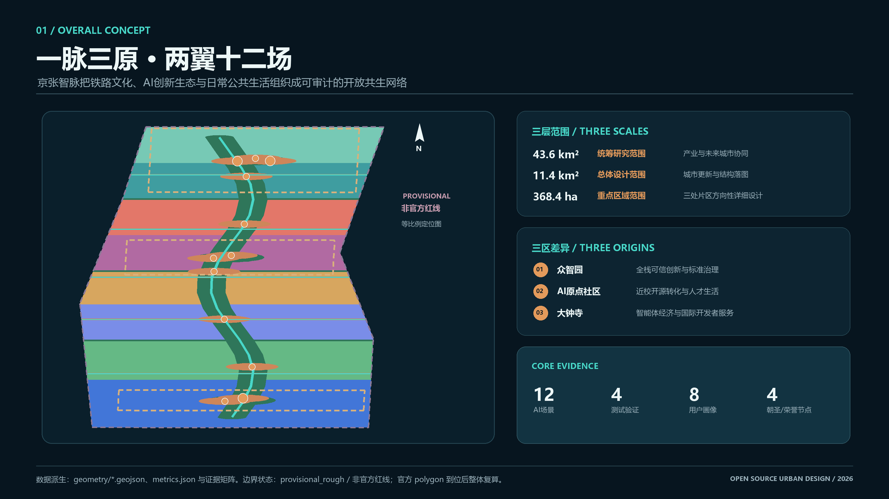
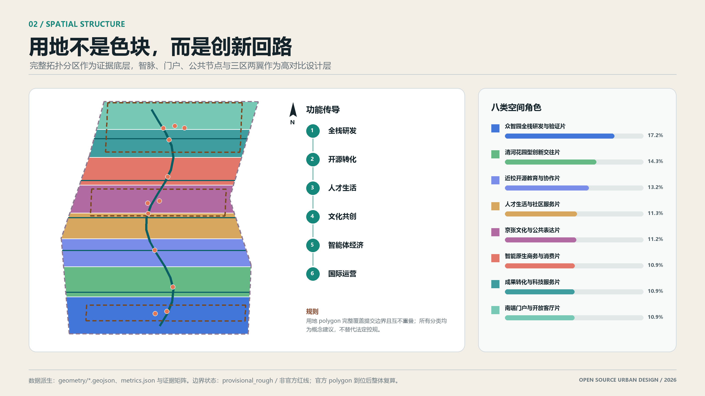
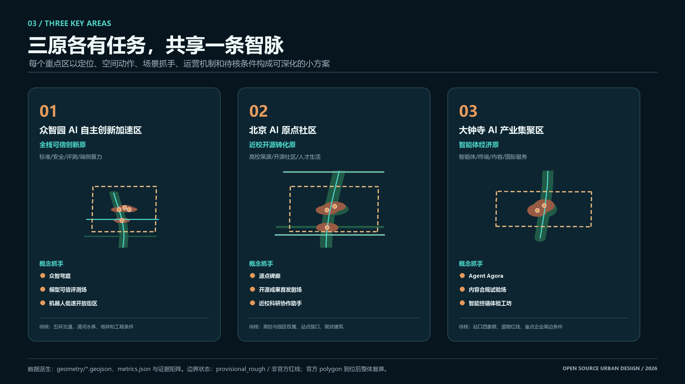
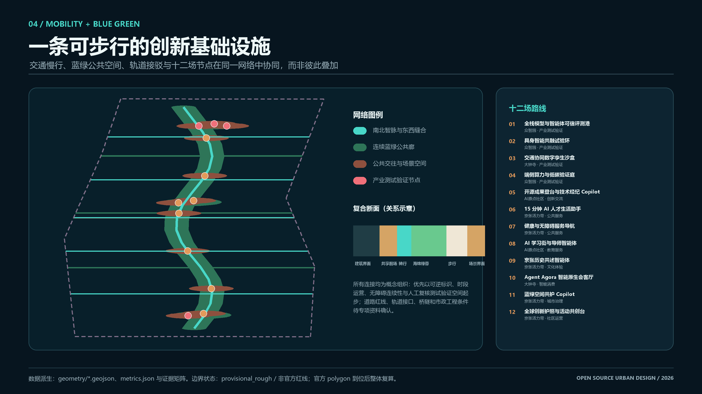
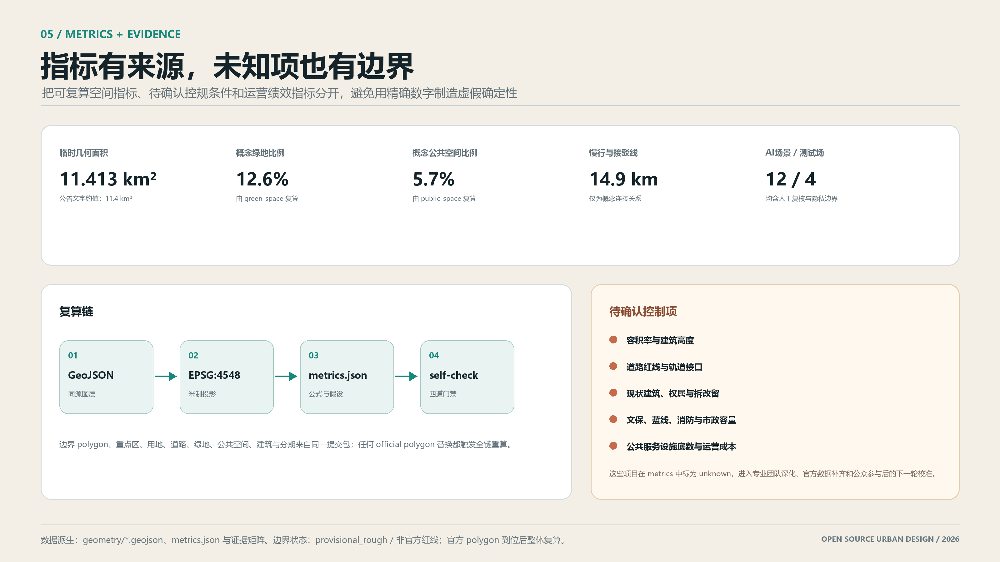

# 京张智脉·开源共生带 / JingZhang AI Commons

> **统一边界声明：** 本方案全部空间、项目、活动、政策与运营内容均为开放共创的概念建议、参考方案或可供专业团队深化研究的材料，不替代正式规划，不构成政府审定、工程可行性、投资建设、招商、资金或实施承诺。当前只使用 `provisional_rough` 临时边界；它不是官方红线、审批或精确面积依据，official polygon 到位后将整体复算。

## 设计依据与资料清单

方案以官方资格预审公告确认的项目目标、三层范围、公告面积和设计任务为首要依据，以面向智能体任务书确认的三大定位、五大功能、三区两翼及六项智能体任务为内容框架。[source:DATA-SRC-OFFICIAL-ANNOUNCEMENT-20260509] [source:DATA-SRC-AGENT-TASKBOOK-20260518] 专业表达参照城市设计、控制性详细规划和国土空间用地分类相关公开规范，但不以通用规范替代项目专属控规条件。[standard:MOHURD-URBAN-DESIGN-MEASURES] [standard:MOHURD-CONTROL-DETAILED-PLANNING] [standard:MNR-LAND-USE-CLASSIFICATION-GUIDE]

当前可确认的是项目名称、文字四至、公告面积、三处重点区名称及任务要求；三层范围和三处重点区的精确官方 polygon 尚缺，仓库临时 polygon 只用于生成、可视化和讨论。[source:DATA-SRC-PROVISIONAL-BOUNDARIES-20260605] 因此所有面积、比例、连通性和建筑基底指标须在 official polygon 到位后由同源 GeoJSON 重算；控规、道路、权属、建筑、文保、市政和公共服务底数未补齐前，不输出审定容积率、高度、具体拆改留或工程线位。正文与结构化数据的证据链依次落到 `sources.json`、`assumptions.json`、`geometry/*.geojson`、`metrics.json`、三类矩阵和自检结果。

证据治理采用三层权限：公告和清权任务书确定任务，专业标准约束表达方式，临时边界只支持生成与 intake。资料登记、处理表和 site package 是导航层，事实仍回到原始来源；案例官网只作 background。对应证据为 [source:SITE-PACKAGE] [source:SOURCE-REGISTRY] [source:PROCESSED-FACT-PACK] [source:DATA-SRC-OFFICIAL-ANNOUNCEMENT-20260509] [source:DATA-SRC-AGENT-TASKBOOK-20260518] [source:DATA-SRC-PROVISIONAL-BOUNDARIES-20260605]。专业响应覆盖 [standard:PROJECT-OFFICIAL-ANNOUNCEMENT] [standard:PROJECT-AGENT-OPEN-CALL-TASKBOOK] [standard:MOHURD-URBAN-DESIGN-MEASURES] [standard:MOHURD-CONTROL-DETAILED-PLANNING] [standard:MNR-LAND-USE-CLASSIFICATION-GUIDE]，现状与缺资料诊断按 [depth:existing_conditions_diagnosis] 记录，不以通用规范推导本项目已批控制。

## 三层范围工作框架

三层范围采用“战略统筹—总体城市设计—重点片区深化”的递进关系，而非三套彼此割裂的方案。[depth:three_level_scope_framework] 统筹研究范围约 43.6 平方公里，北至北五环、东至京藏高速、南至西直门外大街、西至万泉河路，主要研究产业生态、区域协同与未来城市机制；总体设计范围约 11.4 平方公里，以京张遗址公园周边 1—2 公里城市地区和产业区为重点，形成用地、更新、交通、蓝绿与设施的总体结构；重点区域共约 368.4 公顷，对众智园、北京 AI 原点社区和大钟寺形成可深化的小方案。[source:DATA-SRC-OFFICIAL-ANNOUNCEMENT-20260509]

| 层级 | 核心问题 | 建议成果深度 | 数据状态与边界 |
|---|---|---|---|
| 统筹研究范围 | 三区两翼如何形成世界级 AI 创新生态闭环 | 战略图谱、协同网络、案例与运营机制 | 公告面积和文字四至可引用；polygon 待补 |
| 总体设计范围 | 产业、空间、生活与公园如何复合更新 | 城市设计结构、更新分类、交通蓝绿和设施框架 | provisional 可作概念底图，不作精确红线 |
| 重点区域范围 | 三个片区如何各具功能并协同运行 | 定位、空间、建筑、场景、运营与风险小方案 | 三处 polygon 均须标注 provisional |

官方边界替换后，应联动重算 site boundary、key areas、land use、roads、green/public space、buildings、phasing 及全部面积比例指标。[data:geometry/site_boundary.geojson#SITE-001] [metric:site_area_sqm]

提交中的总体边界与重点区分别落在 [data:geometry/site_boundary.geojson#SITE-001] 和 [data:geometry/key_areas.geojson#PROV-KEY-001]；三处重点区数量由 [metric:key_area_count] 核对，临时总体面积为 11.413 平方公里 [metric:site_area_sqm]。图面将公告文字面积与临时几何复算值分栏，不互相替代。该工作框架同时引用 [depth:three_level_scope_framework] 与 [standard:PROJECT-OFFICIAL-ANNOUNCEMENT]，official polygons 到位后触发边界、分区、图纸、HTML 和全部指标的版本化重算。

## 统筹研究范围产业与未来城市研究

主名称建议为“京张智脉·开源共生带”，英文名为 “JingZhang AI Commons”。“智脉”延续京张铁路连接、流动与工程创新的精神隐喻，“Commons”强调模型、算力、数据、场景、空间和知识在合规边界内共建共享。Logo 方向建议以两条铁路平行线渐变为开放括号和节点网络，形成可独立使用的原创矢量符号；主色可采用铁轨深蓝、开源青绿与历史铜色，字体只选经核验可商用或开放许可字体。空间概念为“一脉三原、两翼十二场”：一脉是京张遗址公园及其周边公共空间串联的南北创新共生脉；三原分别是众智园“自主技术原力”、北京 AI 原点社区“知识与人才原点”、大钟寺“智能原生业态”；两翼为中关村科技服务翼和小月河场景赋能翼；十二场是可测试、可体验、可退出的 AI 场景网络。[source:DATA-SRC-AGENT-TASKBOOK-20260518]

方案以“百年京张文化带、都市 AI 生活体验带、AI 融合创新带”为三大定位。三区两翼形成“源头研究—开源协作—测试验证—产品服务—城市场景—公众反馈—标准治理—再研究”的循环，完整对应“AI 全栈自主创新体系、世界级 AI 创新生态、AI+ 场景赋能新范式、智能化 AI 活力城市、AI 治理全球话语权”五大功能。以下七个案例只作机制类比，来源登记为相关园区或机构官网；本方案不复制其视觉资产、不采用未经核验的投资、面积或产值数字，也不把境外治理条件直接移植为本项目结论。

| 全球案例线索 | 可转化经验 | 京张适配方向 |
|---|---|---|
| 巴黎 Station F | 大体量存量空间与一站式创业服务耦合 | 存量建筑弹性分舱、共享服务前台 |
| 伦敦 King’s Cross Knowledge Quarter | 铁路遗产、公共空间与知识机构共同更新 | 历史叙事不脱离日常公共空间 |
| 剑桥 Kendall Square | 高校、研究、企业和城市生活高密邻接 | 原点社区的近校转化与步行协作 |
| 多伦多 MaRS | 研究、医疗、创业与资本的接口平台 | 中关村科技服务翼的专业服务接口 |
| 新加坡 one-north | 片区化研发集群与试验环境协同 | 众智园全栈平台和场景准入机制 |
| 赫尔辛基 Smart Kalasatama | 居民共创、城市生活实验与公共价值评估 | 小月河翼的公众参与和可退出试验 |
| 蒙特利尔 Mila 生态 | 高校协作、开放研究和负责任 AI 社群 | 开源社区、国际人才和治理议题联动 |

七个全球案例的作用是提炼“存量空间加共享服务、铁路遗产加知识机构、近校转化、专业服务接口、园区试验、居民共创、负责任 AI 社群”等机制，不进行排行榜式比较，也不把机构宣传数字当作规划指标。案例入口为 [source:CASE-STATION-F] [source:CASE-KNOWLEDGE-QUARTER] [source:CASE-KENDALL-SQUARE] [source:CASE-MARS-TORONTO] [source:CASE-ONE-NORTH] [source:CASE-SMART-KALASATAMA] [source:CASE-MILA-MONTREAL]。本地转化则由三大定位、五大功能、三区两翼和一脉三原共同构成，评价重点是机制是否能被海淀专业团队继续深化，而不是是否模仿某一园区形态。[source:DATA-SRC-AGENT-TASKBOOK-20260518]

## 总体设计范围城市更新与控规深度城市设计

总体结构建议概括为“一脉、三门户、两翼接口、多条社区微环”。一脉承担文化展示、慢行交往和场景串联；三门户分别服务众智园、AI 原点社区和大钟寺与城市交通网络的接驳；两翼接口把科技服务与公共场景导入主脉；社区微环将居住、教育、研发、商业和绿地接入 15 分钟步行与骑行网络。[depth:overall_spatial_structure] 该结构优先修复断点、开放首层、复合存量空间与提高公共可达性，不以大拆大建作为默认手段。

城市更新对象可按“保护约束区、保留修缮区、适应性再利用区、可逆增补区、待专业论证区”五类研究。产业空间形成开放研究、柔性研发、中试验证、成果发布、科技服务、人才生活六类产品，支持团队从短期工位到成长型空间的全周期迁移。建筑体量强调与既有街区、遗址、公园、水系和居住界面的渐变关系，但容积率、高度、密度、退线和总规模均待官方控规与测绘底数确认。[depth:development_intensity_controls] 更新项目清单应同时记录空间价值、公共利益、数据依赖、权属风险和可逆性，使控规深度表达成为可核验的研究框架，而非伪装成已批准的规划结论。[standard:MOHURD-CONTROL-DETAILED-PLANNING]

完整概念用地分区见 [data:geometry/land_use.geojson#LU-001]，适应性载体组团见 [data:geometry/buildings.geojson#BLDG-001]。两者共同证明“结构—功能—载体”的传导关系，但 buildings 是设计提议层，不是现状测绘。方案按 [depth:land_use_layout]、[depth:development_intensity_controls]、[depth:height_massing_character] 组织控规深度表达；容积率、高度、密度和退线继续保留为 [metric:floor_area_ratio] 等 unknown 项，待正式控规、日照、消防、文保和测绘资料补齐后再形成专业结论。[standard:MOHURD-CONTROL-DETAILED-PLANNING]

## 重点区域详细设计

三处重点区共同构成从底层技术、源头创新到城市型应用的价值链，但各自保持鲜明空间性格。[depth:three_key_area_detailed_design] 公告面积可作为任务依据，当前 polygon 仅为 provisional，因此下表中的空间结构、建筑动作和交通建议均是方向性参考，需在官方边界、现状测绘、权属、控规和工程条件到位后深化。

| 重点区 | 定位与空间结构 | 建筑更新与公共空间 | 交通与 AI 场景 | 主要深化条件 |
|---|---|---|---|---|
| 众智园 AI 自主创新加速区，约 192.1 公顷 | “原力花园”：一核两环、多园多庭；聚合模型、芯片、工具链、算力、安全与标准协作 | 优先保留可用研发载体，以可逆模块补充共享实验、发布和交往空间；清河界面作为生态与文化联系方向 | 对外接驳、内部慢行环和测试预约系统；承载可信评测、具身智能、端侧算力验证 | 五环交通、清河生态、建筑底数、平台安全和市政容量 [data:geometry/key_areas.geojson#PROV-KEY-001] |
| 北京 AI 原点社区，约 104.3 公顷 | “原点街坊”：创新环、双门户、开放源码庭院群；连接高校源头成果与社区生活 | 低扰动更新，增加共享会议、技术经纪、人才服务、学习与生活界面，不预设具体建筑拆除 | 加密校—园—街慢行联系和轨道接驳；承载开源发布、学习街、成果转化 Copilot | 校园权属、轨道接口、现状建筑与居民影响评估 [data:geometry/key_areas.geojson#PROV-KEY-002] |
| 大钟寺 AI 产业集聚区，约 72.0 公顷 | “原生都会”：站城门户、智能原生会客厅、复合街区网络 | 激活首层、口袋空间与商业文化界面，导入智能体、终端和内容服务展示，不指定企业或地块 | 四象限步行连通仅作概念研究；承载 Agent Agora、智能消费和全球路演 | 道路红线、站点工程、静态交通、权属和商业运营 [data:geometry/key_areas.geojson#PROV-KEY-003] |

三处小方案均从各自 provisional polygon 的位置关系出发，分别落在 [data:geometry/key_areas.geojson#PROV-KEY-001]、[data:geometry/key_areas.geojson#PROV-KEY-002]、[data:geometry/key_areas.geojson#PROV-KEY-003]。其临时几何面积证据为 [metric:provisional_zhongzhiyuan_area_sqm] [metric:provisional_ai_origin_area_sqm] [metric:provisional_dazhongsi_area_sqm]，只用于检查图层完整性和相互关系，不拿来覆盖公告的约面积。详细设计深度由 [depth:three_key_area_detailed_design] 约束，所有建筑、交通、公共空间和项目抓手都需在官方边界、权属、现状测绘和专项工程资料到位后深化。

## AI 创新生态、人才画像与 AI+ 场景

“京张 AI Commons”建议以土地与空间为载体，以知识、模型、算力、数据、工具、测试、资本服务和社区治理为八类共享接口。场景实行“公开征集—来源与伦理审查—沙盒验证—限域展示—公众反馈—专业复核—扩大、修改或退出”的全周期机制，禁止以个人隐私、不可解释监控或指定供应商作为必要条件。[standard:PROJECT-AGENT-OPEN-CALL-TASKBOOK]

| 用户画像 | 核心需求 | 重点触点 |
|---|---|---|
| 前沿研究者 | 算力、同行、开放问题与成果转化 | 众智园、原点社区 |
| 开源开发者 | 代码协作、评测、声誉与社区归属 | 原点社区、开源坐标 |
| 初创团队 | 低门槛空间、试验场、法务与融资接口 | 原点社区、科技服务翼 |
| 成长型 AI 企业 | 柔性研发、中试、客户验证与国际展示 | 众智园、大钟寺 |
| 国际人才与访客 | 双语服务、短期协作、城市体验 | 三门户、朝圣路线 |
| 本地居民与家庭 | 便利、安静、安全、可选择的 AI 服务 | 小月河翼、社区微环 |
| 青少年与学习者 | 可理解、可动手、有保护的 AI 教育 | 学习街、遗址公园 |
| 城市运营与专业人员 | 可审计数据、人工复核、投诉和退出机制 | 场景控制台、治理议事厅 |

| ID | 场景卡 | 类型与建议空间 | 数据、隐私与人工复核 | 运营概念 |
|---|---|---|---|---|
| SCN-01 | 全栈模型与智能体可信评测港 | **产业测试验证**；众智园 | 仅用公开、合成或清权测试集；专家复核结果 | 开放基准、版本留痕、争议申诉 |
| SCN-02 | 具身智能共融试验环 | **产业测试验证**；众智园 | 限域、限速、地理围栏；安全员可立即接管 | 预约制测试、事故上报、到期退出 |
| SCN-03 | 交通协同数字孪生沙盒 | **产业测试验证**；大钟寺 | 聚合流量和模拟数据；交通专业人员复核 | 只评估方案，不直接控制真实交通 |
| SCN-04 | 端侧算力与低碳验证庭 | **产业测试验证**；众智园 | 设备能耗与性能数据，不接管市政系统 | 可比评测、能效披露、设备隔离 |
| SCN-05 | 开源成果登台与技术经纪 Copilot | **创新交流**；AI原点社区 | 公开成果和自愿提交需求；合同由人审 | 路演、匹配、转化记录，不承诺交易 |
| SCN-06 | 15 分钟 AI 人才生活助手 | **公共服务**；京张活力带 | 明示同意、最少数据、随时关闭 | 人工客服兜底，多语种公共服务导航 |
| SCN-07 | 健康与无障碍服务导航 | **公共服务**；京张活力带 | 不作诊断；敏感数据不进入公共模型 | 转介现有正规服务，保留人工窗口 |
| SCN-08 | AI 学习街与导师智能体 | **教育服务**；AI原点社区 | 未成年人保护、内容审核、教师复核 | 公益课程、开发者志愿辅导 |
| SCN-09 | 京张历史共述智能体 | **文化体验**；京张活力带 | 只引用可追溯史料；策展人纠错 | 多语导览、口述史征集需授权 |
| SCN-10 | Agent Agora 智能原生会客厅 | **智能消费**；大钟寺 | 推荐逻辑透明，不使用隐性画像 | 产品体验、专业路演、人工消费保障 |
| SCN-11 | 蓝绿空间共护 Copilot | **城市治理**；京张活力带 | 环境传感优先，避免人脸识别；园林人员复核 | 养护建议、热风险提示、公众报修 |
| SCN-12 | 全球创新护照与活动共创台 | **社区运营**；京张活力带 | 自愿登记、匿名访客模式、贡献可撤回 | 从访客到贡献者、驻留团队的转化路径 |

十二场以 SCENARIO_NODE 写入 [data:geometry/public_space.geojson#SCN-01]，形成从技术测试到公共服务、文化体验、社区运营的可读网络。数量分别由 [metric:scenario_count]、[metric:testbed_count]、[metric:persona_count] 和 [metric:landmark_count] 复核。四个测试验证场均采用限域、限速、最少采集、版本留痕、专家或专业人员复核和到期退出；居民、未成年人、健康、无障碍与交通相关场景保留线下服务和申诉通道。该体系响应 [standard:PROJECT-AGENT-OPEN-CALL-TASKBOOK]，是可供运营与专业团队深化的治理协议，不是已批准部署清单。

## 用地、建筑规模与拆改留方案

用地组织建议采用“创新生产、科技服务、人才生活、公共文化、蓝绿开放”五类空间组合，并按国土空间分类建立机器可读映射，而非另造无法衔接法定体系的分类。[standard:MNR-LAND-USE-CLASSIFICATION-GUIDE] 其中创新生产强调研发、测试和成果发布的邻接；科技服务提供知识产权、法务、金融、国际合作等接口；人才生活补足居住、餐饮、运动、学习与照护；公共文化承载京张叙事和 AI 公民教育；蓝绿开放空间承担生态、交往与低风险场景。本提交已从同一 provisional site polygon 派生完整 land-use 分区并完成临时复算；这些比例只描述本概念图层，official polygon 与控规到位后必须整体重算。[data:geometry/land_use.geojson#LU-001]

建筑策略坚持“先调查、再分类，保留优先、更新可逆”。建议将建筑研究标签设为 R0 保护约束、R1 保留修缮、R2 适应性再利用、R3 可逆增补、R4 待论证重构；在缺少现状轮廓、年代、结构、用途、权属和文保资料时，只可形成分类方法，不可给具体建筑贴拆除或新建结论。[depth:retain_renovate_demolish] 新增空间宜采用可变隔断、共享设备、可见首层、复合时段和模块化机电，体量、高度、屋顶和界面则服从后续控规、日照、消防、文保与景观论证。[metric:building_footprint_area_sqm]

用地层完整覆盖临时 site 且共享切割边，证据为 [data:geometry/land_use.geojson#LU-001]；概念建筑均收敛在边界内，证据为 [data:geometry/buildings.geojson#BLDG-001]。本轮可复算概念建筑基底面积 [metric:building_footprint_area_sqm]，以及各用地代码面积 [metric:land_use_05_area_sqm] [metric:land_use_0702_area_sqm] [metric:land_use_0802_area_sqm] [metric:land_use_0803_area_sqm] [metric:land_use_0804_area_sqm] [metric:land_use_1401_area_sqm] [metric:land_use_1403_area_sqm]。这些指标描述的是本提交的设计提议层，不代表现状建筑、批准规模或开发权益。逐栋拆改留仍按 [depth:retain_renovate_demolish] 先调查后分类，功能代码按 [standard:MNR-LAND-USE-CLASSIFICATION-GUIDE] 映射，official parcel、权属、文保、结构、消防与控规资料是下一轮必要输入。

## 交通、轨道、市政与公共服务设施

交通概念采用“轨道优先、步骑成网、公交接驳、机动车分层管理”。三处重点区各设置面向轨道或主要公交的城市门户，再以社区微环连接京张主脉；优先识别慢行断点、绕行点、危险过街和非机动车停放冲突，通过平面优化、时序管理、导视和公共空间微更新提出低干预方案。大钟寺四象限、五环联系和跨越性节点只作为问题研究与方案比选，不给出桥隧、道路红线或工程可行性结论。[depth:traffic_rail_slow_parking]

市政与新型基础设施建议形成“云—边—端—场景”分级：共享算力和模型服务位于合规机房，片区边缘节点处理低时延任务，公共终端默认最少采集并保留离线人工替代。分布式能源、储能、通信、排水、消防和管线迁改只建立需求清单与容量核验流程，待主管专业资料确认后深化。[depth:municipal_new_infrastructure] 公共服务先开展设施底数和人群需求审计，再确定人才驿站、学习、健康导航、托育养老、运动和国际服务的补缺方式；避免以 AI 界面替代必要的线下窗口、专业人员和无障碍服务。[source:DATA-SRC-OFFICIAL-ANNOUNCEMENT-20260509]

南北智脉和五组东西联系以 [data:geometry/roads.geojson#ROAD-001] 表达，临时网络长度由 [metric:road_centerline_length_m] 复算；该数值只比较概念连通关系，不作为道路红线、站改、桥隧或工程投资依据。交通系统按 [depth:traffic_rail_slow_parking] 建立问题—方案比选—专项核验流程，市政与端侧设施按 [depth:municipal_new_infrastructure] 建立容量和安全清单。轨道接口、道路等级、消防、排水、能源和通信仍需主管专业资料，公共服务则必须先核对设施底数和不同人群的线下可达性。

## 蓝绿空间、公共空间与城市风貌

蓝绿系统以京张遗址公园为南北公共文化脉，以清河、小月河及既有绿地为生态支撑，构建“连续荫蔽慢行—雨洪调蓄—创新交往—低风险测试—历史展示”复合网络。[depth:blue_green_public_space] 在文保、绿线、蓝线和实施边界未核实前，设计只提出节点类型与连接方向：林下讨论庭、可移动发布台、安静休憩点、无障碍导览、环境感知杆和可撤除试验组件。建筑风貌不追求统一的“科幻皮肤”，而以耐久材料、清晰结构、开放首层、夜间克制和新旧可辨形成“理性、开放、温润、可进化”的城市气质。[standard:MOHURD-URBAN-DESIGN-MEASURES]

文化主线建议为：“京张铁路连接城市与山河，中关村创新连接知识与产业，AI Commons 连接人、机器与公共利益。”导视以里程、版本、贡献和时间为四类信息，不虚构历史。朝圣地标均建议采用可逆展陈或既有空间再利用，是否建设须经专业审查。

| 概念地标 | 建议位置与意义 | 荣誉展示方式 |
|---|---|---|
| AI 原点·开源坐标 0·0 | 原点社区公共节点；记录开放协作的起点 | 可追溯开源成果、贡献者与版本档案 |
| 众智验证灯塔 | 众智园室内或低扰动公共界面；象征可信验证 | 实时显示测试状态、边界和复核结论，不作广告塔 |
| Agent Agora 万智会客厅 | 大钟寺复合公共空间；连接产品、城市与公众 | 轮换展示场景原型、失败复盘和公众评价 |
| 百年智脉时间长卷 | 一脉沿线若干合法节点；串联铁路、创新与 AI 文化 | 经史料核验的时间轴和多语导览 |

概念连续绿廊见 [data:geometry/green_space.geojson#GREEN-001]，十二场公共空间网络见 [data:geometry/public_space.geojson#PUBLIC-001]；临时复算面积与比例分别为 [metric:green_space_area_sqm] [metric:green_ratio] [metric:public_space_area_sqm] [metric:public_space_ratio]。图面把 provisional site 降为淡紫虚线，把慢行、绿廊、公共节点与测试验证场作为高对比设计层。该系统按 [depth:blue_green_public_space] 和 [standard:MOHURD-URBAN-DESIGN-MEASURES] 表达公共空间与风貌关系，文保、绿线、蓝线、防洪、园林和夜景条件未核前不落工程设施。

## 更新项目清单、实施政策与分期计划

实施建议采用“先数据与机制、后低扰动空间、再系统深化”的门槛式分期，并以每一阶段是否具备数据、审批、安全和公众接受条件作为继续依据。[depth:phasing_implementation] 近期可先完成开源资料台账、品牌原型、步行诊断、临时导视、社区议事和 T01 等室内测试；中期在专业论证后推进存量空间适应性利用、三个门户和蓝绿节点示范；远期再评估跨区连接、基础设施升级和成熟场景复制。分期是参考路径，不代表确定建设时序、资金或实施主体。

| 概念项目包 | 阶段建议 | 关键前置条件 |
|---|---|---|
| Commons 数据与来源底座 | 近期 | 数据许可、版本和责任人 |
| 原创品牌、导视与开源坐标原型 | 近期 | 字体图形清权、公众测试 |
| 十二场沙盒与场景登记册 | 近期滚动 | 伦理、安全、隐私和退出机制 |
| 三重点区存量空间试点 | 中期 | 建筑、权属、消防、控规核验 |
| 京张慢行与蓝绿微节点 | 中期 | 文保、绿蓝线、交通和海绵条件 |
| 站城门户及跨越节点深化 | 中远期 | 轨道、道路与工程专项论证 |

年度运营建议形成四季品牌：春季“Open Source Spring”发布开放问题与驻留计划；夏季“Urban AI Test Season”开展受控测试和公众评议；秋季“JingZhang AI Commons Week”组织国际会议、开源展和朝圣路线；冬季“Trust & City Forum”复盘治理、失败案例和年度贡献。全年配置每月开发者夜、季度居民议事、常态化场景开放申请和年度档案发布。运营架构可由共生理事会、专业与伦理评审组、开发者公会、居民观察团共同组成，形成“访客—成员—贡献者—试验团队—驻留伙伴”的转化通道，但不预设政府授权、财政支持或招商结果。[source:DATA-SRC-AGENT-TASKBOOK-20260518]

三阶段概念范围写入 [data:geometry/phasing.geojson#PHASE-001]，面积由 [metric:phase_1_area_sqm] [metric:phase_2_area_sqm] [metric:phase_3_area_sqm] 复算，仅说明项目包的空间组织和依赖顺序。更新项目清单按 [depth:renewal_project_list] 记录公共利益、数据依赖、可逆性、审批和运营门槛；分期按 [depth:phasing_implementation] 采用“满足条件才进入下一阶段”的门槛法。近期优先资料治理、步行诊断、可逆标识和室内沙盒，中期才讨论存量载体和门户节点，远期再评估跨区连接与成熟场景复制；这不是开发时序、投资计划或政府承诺。

## 指标体系、面积复算与合规矩阵

指标分为“已知公告值、可由几何复算值、需运营后观测值”三类，避免把愿景指标写成现状事实。已知值包括统筹研究范围约 43.6 平方公里、总体设计范围约 11.4 平方公里、重点区合计约 368.4 公顷，以及三重点区 192.1、104.3、72.0 公顷；这些是公告任务值，不等同于 provisional polygon 的精确测量结果。[source:DATA-SRC-OFFICIAL-ANNOUNCEMENT-20260509] official polygon 到位后，统一投影至 EPSG:4548，复算面积并记录与公告值的差异原因。[depth:metrics_recalculation]

| 指标 | 建议公式/证据 | 当前状态 |
|---|---|---|
| site_area_sqm / key_area_area | polygon 投影面积 | 已按 provisional polygon 临时复算；official polygon 到位后重算 |
| green_ratio | 绿地 polygon 面积 / site 面积 | 0.126425，临时设计层复算 [metric:green_ratio] |
| public_space_ratio | 公共空间面积 / site 面积 | 0.056769，临时设计层复算 [metric:public_space_ratio] |
| building_footprint_area_sqm | 建筑基底 polygon 汇总 | 待现状测绘与设计层区分 |
| slow_network_connectivity | 连通慢行边数 / 计划边数，并记录断点 | 待道路与过街数据 |
| scenario_readiness | 已通过来源、伦理、安全、人工复核门槛数 / 场景总数 | 可随沙盒登记册观测 |
| commons_contribution | 清权、可复用且有版本记录的公共成果数 | 运营后观测，不设虚假目标 |
| public_trust | 知情同意、投诉响应、退出成功和满意度组合 | 运营后匿名统计 |

`compliance_matrix.json` 应逐项覆盖公告 1.3—1.5 与 agent.1—agent.6；`standard_matrix.json` 映射三项专业标准；`design_depth_matrix.json` 对 15 个深度项给出正文、图纸、几何、指标、假设和自检证据。任何正文数字若无法回到 source 或 metric，应删除或改为待确认。

本提交全部 known 指标的机器引用如下：[metric:site_area_sqm] [metric:building_footprint_area_sqm] [metric:green_space_area_sqm] [metric:green_ratio] [metric:public_space_area_sqm] [metric:public_space_ratio] [metric:road_centerline_length_m] [metric:key_area_count] [metric:scenario_count] [metric:testbed_count] [metric:persona_count] [metric:landmark_count] [metric:phase_1_area_sqm] [metric:phase_2_area_sqm] [metric:phase_3_area_sqm] [metric:land_use_05_area_sqm] [metric:land_use_0702_area_sqm] [metric:land_use_0802_area_sqm] [metric:land_use_0803_area_sqm] [metric:land_use_0804_area_sqm] [metric:land_use_1401_area_sqm] [metric:land_use_1403_area_sqm] [metric:provisional_zhongzhiyuan_area_sqm] [metric:provisional_ai_origin_area_sqm] [metric:provisional_dazhongsi_area_sqm]。复算统一使用 EPSG:4548，流程为 GeoJSON 几何—投影—面积或长度公式—metrics.json—空间复核；[depth:metrics_recalculation] 要求 official polygon 替换后不得沿用旧值。公告面积属于任务约值，site_area_sqm 和三重点区 provisional metrics 属于临时几何值，两组数字在文本、图面和 PDF 中分栏呈现。`compliance_matrix.json` 覆盖 23 项任务，五项 mandatory standard 和十五项 design depth 均建立正文、图层、指标、图纸、来源、假设和自检的可追踪链。

## 风险、版权与合规说明

本方案不使用非公开政府数据、企业私域业务资料、个人隐私、秘密地图或未清权图像。AI 生成文字、图形和代码应保留生成说明、人工修改记录、许可与版本；Logo、字体、人物、企业标识和案例图片必须逐项清权。场景遵循最少采集、明示同意、目的限定、保存期限、人工复核、申诉和退出原则，尤其对未成年人、健康、无障碍、交通和具身智能测试设置更高门槛。所有公共展示须明确“测试中”或“概念建议”，不得暗示官方背书。[source:DATA-SRC-AGENT-TASKBOOK-20260518]

| 待补数据 | 当前允许形成 | 当前禁止形成 | 到位后的动作 |
|---|---|---|---|
| 三层范围及三重点区 official polygon | 战略和 provisional 可视化 | 官方红线、精确面积结论 | 替换边界并重算全部图层指标 |
| 控规条件 | 强度与风貌原则 | 容积率、高度、密度、退线结论 | 更新 land use、building 和指标 |
| 道路红线、断面、轨道接口 | 慢行问题与接驳概念 | 道路线位、桥隧和站改工程结论 | 交通专项校核与安全仿真 |
| 地块、权属及现状建筑 | 更新分类方法 | 指定建筑拆改留 | 逐栋调查、利益相关方协商 |
| 文保、绿线、蓝线 | 保守节点类型 | 越界建设或设施落位 | 文保和生态专项复核 |
| 市政、消防、防洪与能源容量 | 需求清单 | 管线迁改、容量和可行性结论 | 专业承载评估 |
| 公共服务设施底数 | 用户需求与补缺框架 | 编造学校、医疗、养老容量 | 设施盘点和服务半径分析 |

统一声明：所有空间落地建议均为概念建议、参考方案或可供专业团队深化研究，不替代正式规划，不构成政府审定、工程可行性、投资建设、招商政策或运营安排。

仓库没有提供可作为 formal 控制依据的文保、绿蓝线、道路红线、管线、消防、权属或现状建筑图层，因此 [data:geometry/constraints.geojson] 保持空的资料缺口登记，而不是由 AI 猜测约束。该处理响应 [depth:risk_missing_data]：官方边界、控规、工程和现状资料到位后，先登记来源与坐标系，再叠加冲突检查，最后重算并版本化发布。五张核心图均由本提交 GeoJSON、metrics 与矩阵程序化绘制；未使用远程图片、商业地图瓦片、人物肖像或企业标识。字体与生成方式在 `report/copyright_statement.md` 披露，方案许可和主办方知识产权条款分别适用，不作扩大解释。

## 参考资料

本方案的正式任务依据、专业标准、临时空间资料、处理导航与案例背景均已登记在 `sources.json`，并保留发布机构、访问日期、可用用途和禁止用途。完整来源机器索引为：[source:DATA-SRC-OFFICIAL-ANNOUNCEMENT-20260509] [source:DATA-SRC-AGENT-TASKBOOK-20260518] [source:DATA-SRC-MOHURD-URBAN-DESIGN-MEASURES] [source:DATA-SRC-MOHURD-CONTROL-DETAILED-PLANNING] [source:DATA-SRC-MNR-LAND-USE-CLASSIFICATION-202311] [source:DATA-SRC-PROVISIONAL-BOUNDARIES-20260605] [source:SITE-PACKAGE] [source:SOURCE-REGISTRY] [source:PROCESSED-FACT-PACK] [source:CASE-STATION-F] [source:CASE-KNOWLEDGE-QUARTER] [source:CASE-KENDALL-SQUARE] [source:CASE-MARS-TORONTO] [source:CASE-ONE-NORTH] [source:CASE-SMART-KALASATAMA] [source:CASE-MILA-MONTREAL]。

项目任务以官方公告和清权智能体任务书为主；城市设计、控规深度和用地分类分别使用仓库内的本地标准快照，不以外部 URL 单独充当证据。[standard:PROJECT-OFFICIAL-ANNOUNCEMENT] [standard:PROJECT-AGENT-OPEN-CALL-TASKBOOK] [standard:MOHURD-URBAN-DESIGN-MEASURES] [standard:MOHURD-CONTROL-DETAILED-PLANNING] [standard:MNR-LAND-USE-CLASSIFICATION-GUIDE]。临时边界只来自 `brief/site-package/geometry/provisional_boundaries.geojson`，并在 `proposal.md`、`sources.json`、`assumptions.json`、GeoJSON、HTML、图面和自检中一致标明 `provisional_rough / provisional_constraint / official_boundary=false`。

七个国际案例只用相关机构官网作为后续核验入口，用于比较治理与服务机制，不复制图像、商标或版式，也不使用未经核实的规模、融资、产值或成效数字。所有事实、图层和指标若无法回到本地来源、明确公式或可审计假设，均改写为待确认事项；这使本方案可以在 official polygon 与专业底数到位后整体复算，而不把临时生成包装成法定规划结论。
