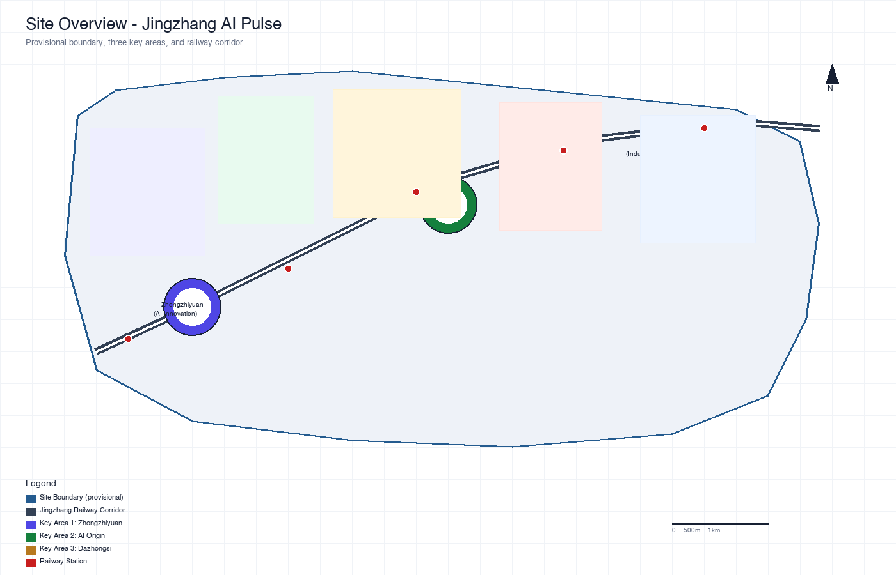
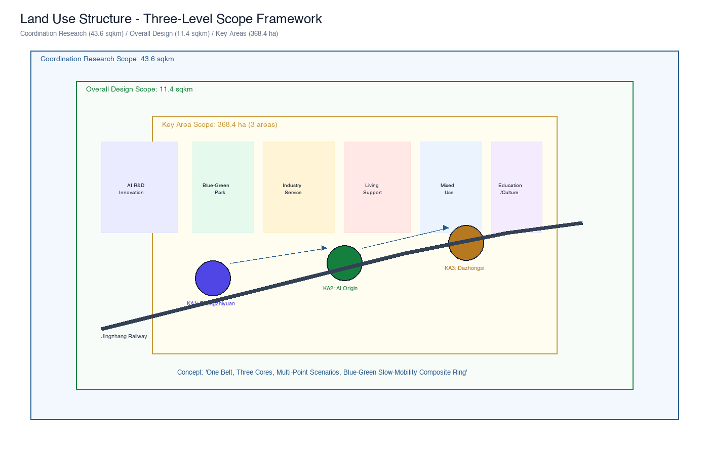
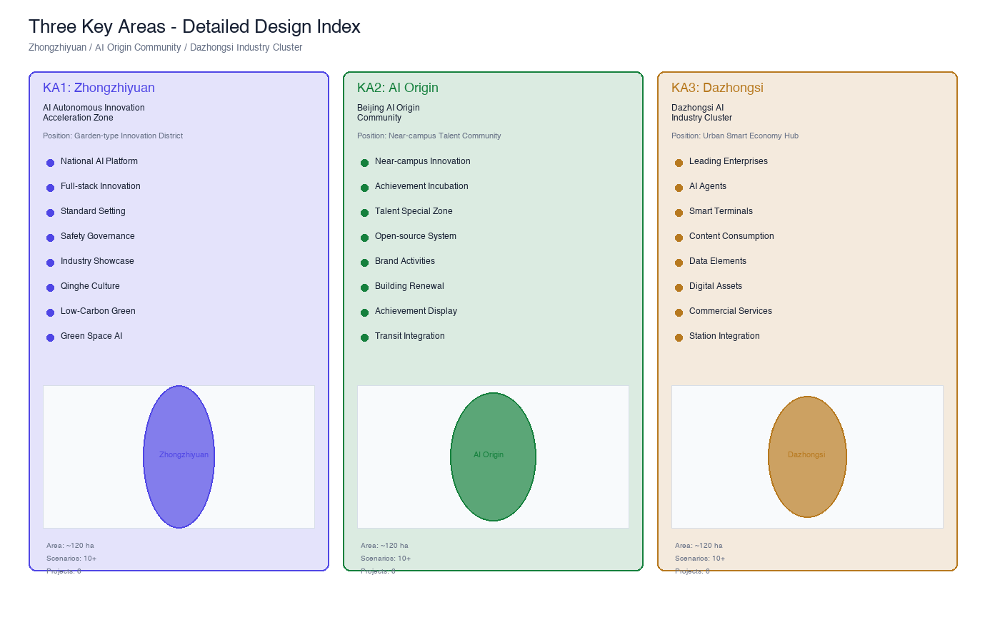
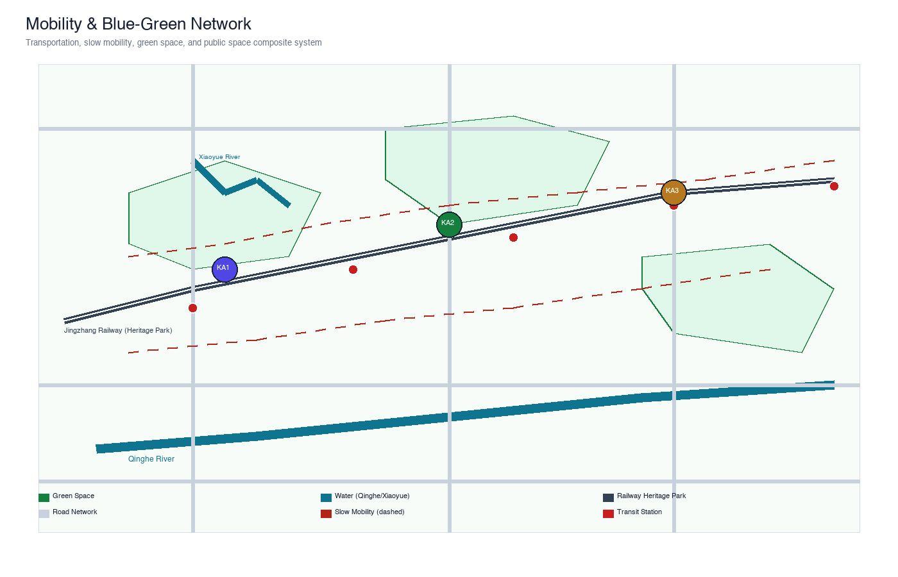
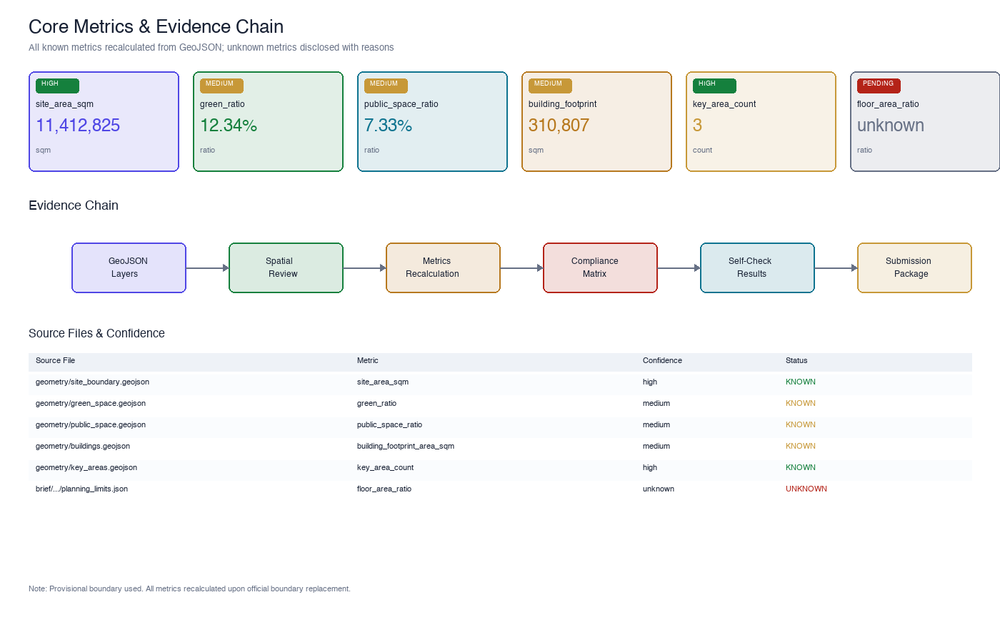

# Jingzhang AI Pulse: Urban Design for the Centennial Railway Corridor

## Design Basis and Source Inventory

This formal proposal takes the *Qualification Pre-Review Announcement for the International Urban Design Scheme Collection of the Centennial Jingzhang AI Innovation Belt*, issued by the Haidian Branch of the Beijing Municipal Commission of Planning and Natural Resources, as its primary authority. Machine-readable dependencies include the provisional coarse boundaries, key areas, enumerations, metrics, and source inventories registered by maintainers in `brief/site-package/`. Before generating the scheme, the AI agent must read `design_brief.json`, `allowed_design_space.json`, `sources.json`, `enums/`, `ranges/`, `schemas/`, `data/source_registry.json`, and `data/processed/agent_fact_pack.md`, using `project_scope_summary.csv`, `agent_task_requirements.csv`, `source_use_matrix.csv`, and `missing_data_checklist.csv` to establish task, scope, source-use, and gap inventories. All design judgments must be decomposed into traceable sources, recalculable metrics, verifiable layers, and human-reviewable assumptions. The announcement requires the scheme to reach the urban design depth of regulatory detailed planning and comprehensive implementation planning; therefore, narrative text cannot substitute for GeoJSON, metrics tables, A3 booklets, A0 boards, and HTML electronic display deliverables.

The scheme is not an independent vision document but is organized from the announcement, the agent-oriented task book, and site materials. This section places only the most critical references adjacent to judgments [source:OFFICIAL-ANNOUNCEMENT] [source:AGENT-TASKBOOK] [depth:existing_conditions_diagnosis]. Full source and standard coverage are stored in `sources.json`, `standard_matrix.json`, and `design_depth_matrix.json` and are not repeated in the body text.

The source registry usage boundaries are as follows [source:SOURCE-REGISTRY]:

- `data/source_registry.json` registers usage boundaries for public, cleared, and provisional materials.
- Current registration summary: 7 formal-usable sources, 1 background source, 1 provisional-only source.
- The agent must not upgrade background_only or provisional_only sources to official boundaries, statutory regulatory plans, formal scoring evidence, or government implementation commitments.

`data/processed/agent_fact_pack.md` serves as the reading navigation layer for this scheme, not as a new authoritative source [source:PROCESSED-FACT-PACK]. It helps the agent organize the three-level scope, three key areas, announcement tasks, agent.1–agent.6, source availability, and missing-data items into a readable scheme. Factual judgments must still return to the registered original materials [source:OFFICIAL-ANNOUNCEMENT] [source:AGENT-TASKBOOK]; full source relationships are preserved in `sources.json`.

When the official `SITE_BOUNDARY` or the three `KEY_AREA` polygons are not yet available, this scaffold uses `brief/site-package/geometry/provisional_boundaries.geojson` to generate a temporary formal package. The `geometry/site_boundary.geojson` and `geometry/key_areas.geojson` in the submission package must be labeled as `provisional_constraint` with `official_boundary=false`. They may only be used for scheme generation, self-checking, visualization, and design discussion, and must not serve as official redlines, approval evidence, precise area evidence, or statutory control conclusions. This organizer data gap does not block content scoring. Once official polygons are replaced, site boundary, key areas, land use, roads, green space, public space, buildings, phasing, and metrics must all be recalculated.

The scorable status generated by this scaffold is: **provisional boundary, precision caveats retained, pending recalculation upon official data release; does not block content scoring**. Accordingly, the spatial structure, scenarios, projects, and metrics in the body text are written under the principle of "discussable, reviewable, and recalculable upon replacement of official boundaries." When official boundary and key area polygons are updated, the agent must re-run the scaffold, self-check, and drawing/HTML generation, and must not simply replace individual files.

Boundary interpretation can return to the overall scope layer and area recalculation [data:geometry/site_boundary.geojson#SITE-001] [metric:site_area_sqm]. The three key areas are cross-checked by independent layers and count metrics [data:geometry/key_areas.geojson#PROV-KEY-001] [metric:key_area_count]. This means readers can enter the evidence from the body text without first reading a string of machine identifiers.

## Three-Level Scope Working Framework

The scheme organizes work across three levels established by the announcement: the coordination research scope focuses on the 43.6 sq km AI industry ecosystem, strategic positioning, innovation chains, and future urban form; the overall design scope focuses on the 11.4 sq km urban area and industrial zone within 1–2 km of the Jingzhang Heritage Park, requiring an overall urban renewal framework, industrial spatial layout, transportation and municipal support, and urban character controls; the key area scope focuses on three detailed design areas totaling 368.4 hectares, requiring clear functional programming, building scale, retain-renovate-demolish classification, public space connectivity, and traffic organization. The three levels are mapped item-by-item in `compliance_matrix.json`, ensuring that mandatory tasks under announcement sections 1.3, 1.4, 1.5 and agent.1–agent.6 all have chapter, layer, metric, drawing, and HTML evidence.

The depth items of the three-level framework are constrained by [depth:three_level_scope_framework] and [depth:overall_spatial_structure]. Spatial evidence is grounded in [data:geometry/site_boundary.geojson#SITE-001] and [data:geometry/key_areas.geojson#PROV-KEY-001]. Task authority is based on [standard:PROJECT-OFFICIAL-ANNOUNCEMENT]. Scope indexing follows the three-level scope table in `project_scope_summary.csv` within [source:PROCESSED-FACT-PACK].

The three levels are not isolated drawing sets. Coordination research determines industry chain and urban form judgments. Overall design translates these judgments into renewal projects, spatial structure, and infrastructure capacity. Key area detailed design validates the implementability of specific parcels, buildings, traffic, public space, and AI application scenarios. The agent must first lock the official or provisional boundaries and constraints adopted for the current submission, then generate land use, buildings, roads, green space, public space, phasing, and AI service nodes, and finally recalculate metrics from these layers and explain in the body text which conclusions remain limited by the provisional boundary. Any area, ratio, scale, or project count that cannot be recalculated from structured data must not be written as a formal conclusion.

The proposed overall concept is the "Jingzhang AI Pulse Symbiosis Belt": using the Jingzhang Heritage Park as the historical and public space spine, the three key areas — Zhongzhiyuan (AI Autonomous Innovation Acceleration Zone), Beijing AI Origin Community, and Dazhongsi — as innovation anchors, and universities, enterprises, communities, and transit stations as the daily network, forming a spatial organization of "one belt, three cores, multi-point scenarios, and a blue-green slow-mobility composite ring." The "one belt" is not a newly drawn redline but a translation of the announcement's three-level scope into a working method. The "three cores" correspond to the three key areas. "Multi-point scenarios" correspond to operable nodes for AI + public services, industry services, and urban life. The "composite ring" corresponds to the linkage of slow mobility, green space, public space, and activity routes.

| Level | Design Question | Scheme Response | Data Anchor |
| --- | --- | --- | --- |
| Coordination Research | How to organize the AI industry ecosystem and future urban form | Establish an innovation chain of "university sourcing — open-source collaboration — enterprise translation — public experience — international dissemination" | compliance_matrix.json, standard_matrix.json |
| Overall Design | How to map industry space, urban renewal, transportation, and character | Express through land use, buildings, roads, green space, public space, and phasing layers | [data:geometry/land_use.geojson#LU-001], [data:geometry/roads.geojson#ROAD-001] |
| Key Area | How to reach detailed design depth for the three areas | Propose positioning, spatial actions, AI scenarios, and implementation dependencies for each | [data:geometry/key_areas.geojson#PROV-KEY-001], [data:geometry/key_areas.geojson#PROV-KEY-002], [data:geometry/key_areas.geojson#PROV-KEY-003] |

## Coordination Research: Industry and Future City

The core task of the coordination research scope is to build a world-class AI innovation ecosystem. The scheme should survey Haidian's universities and research institutes, leading enterprises, computing-algorithm-data elements, incubation platforms, listed companies, unicorns, and technology service resources, and propose a spatial coordination framework for the AI innovation chain, industry chain, talent chain, and urban service chain. Naming and logo design should serve the overall recognizability of the "Centennial Jingzhang Cultural Belt, Urban AI Life Experience Belt, and AI Integration Innovation Belt," and must explain the relationship with industry ecosystem, public space, and cultural resources — not just remain at the slogan level. The agent-oriented task book also requires responses to the "five major functions" and "three zones, two wings" coordination, forming a naming system, visual identity, overall spatial structure diagram, scenario opening, and operational mechanism that can be further deepened. This section must use [source:AGENT-TASKBOOK] and [standard:PROJECT-AGENT-OPEN-CALL-TASKBOOK] to indicate that these requirements come from the agent open-source collection task, not from statutory planning controls.

Coordination research does not create new pseudo-precise redlines. Through the urban character, public space, and building layout coordination required by [standard:MOHURD-URBAN-DESIGN-MEASURES], it links back to [data:geometry/land_use.geojson#LU-001], [data:geometry/public_space.geojson#PUBLIC-001], and [depth:overall_spatial_structure], demonstrating that industry strategies ultimately land on visible, reviewable spatial structures.

Future city form research should answer how AI transforms work, life, social interaction, learning, transportation, and public services. The scheme should translate AI transportation systems, continuous green space, innovation service facilities, and an internationalized live-work atmosphere into locatable functional zones, nodes, corridors, and scenarios — not vaguely describe technology visions. The agent should write industry strategy metrics, AI innovation indices, talent density, space supply types, and AI+ vertical application focus areas into the metrics system, indicating which are official, which are design recommendations, and which remain pending official data calibration. If global AI innovation activities, developer communities, open scenarios, or pilgrimage routes are proposed, they should be written as "concept recommendations / reference schemes / available for professional team deepening" and must not be written as already-determined government activities or implementation arrangements.

## Overall Design: Urban Renewal and Regulatory-Depth Urban Design

The overall design scope requires reaching the urban design depth of regulatory detailed planning. The scheme must propose an overall urban renewal spatial structure, inefficient space identification, renewal project list, implementation policy recommendations, industry function ratios, spatial organization models, total building scale, and comprehensive carrying capacity assessment. `geometry/land_use.geojson` must fully cover the design boundary without overlap. `geometry/buildings.geojson` must express renewal building footprints or retained building footprints. `geometry/roads.geojson` must express micro-circulation, slow mobility, and transit connection relationships. `metrics.json` must recalculate core areas, ratios, and layer counts.

This section follows [standard:MOHURD-CONTROL-DETAILED-PLANNING] to decompose regulatory-depth content into reviewable objects: [data:geometry/land_use.geojson#LU-001] expresses land use structure, [data:geometry/buildings.geojson#BLDG-001] expresses building footprints, [data:geometry/roads.geojson#ROAD-001] expresses traffic organization, [metric:building_footprint_area_sqm] is used to verify building footprint area, and [depth:land_use_layout] and [depth:development_intensity_controls] constrain deliverable depth.

Overall design must also support transportation, rail, municipal, and supporting facilities. The scheme should address transit station integration, road micro-circulation, bicycle parking, parking supply, innovation service platforms, talent living services, new infrastructure, distributed energy, and edge computing with spatial layout and implementation pathways. Content involving building height, development intensity, road red lines, setback lines, and facility standards — where official control conditions are not yet available — should be written as "pending official regulatory condition confirmation" and must not use agent-speculated values as approved indicators.

## Key Area Detailed Design

Key area detailed design is mandatory. The Zhongzhiyuan AI Autonomous Innovation Acceleration Zone should provide detailed schemes around the national AI platform, full-stack autonomous innovation, standard-setting, safety governance, industry showcase, external transportation, Qinghe culture, low-carbon green innovation environment, and green space AI scenarios. The Beijing AI Origin Community should provide detailed schemes around near-campus innovation, achievement incubation and translation, talent special zone, open-source systems, brand activities, building retain-renovate-demolish, achievement display and release, residential living support, campus-park slow mobility links, and transit station integration. The Dazhongsi AI Industry Cluster should provide detailed schemes around leading enterprises, AI agents, smart terminals, content consumption, data elements, digital assets, commercial services, composite use of planned green space, Dazhongsi station integration, and four-quadrant pedestrian connectivity at intersections.

The three key area detailed designs must reference [data:geometry/key_areas.geojson#PROV-KEY-001], [data:geometry/key_areas.geojson#PROV-KEY-002], and [data:geometry/key_areas.geojson#PROV-KEY-003], and are checked by [depth:three_key_area_detailed_design] for whether they reach the depth of comprehensive implementation planning. If only "building a demonstration zone" is described without evidence of function, building, traffic, public space, and implementation projects, it shall be deemed incomplete.

The three key areas must appear in `geometry/key_areas.geojson`. If the repository provides official polygons, they should be used as `official_constraint`. If official polygons are missing, `provisional_constraint` may be used temporarily, but the body text, HTML, sources, assumptions, and self_check must state that they cannot serve as formal scoring or approval evidence. `compliance_matrix.json` should cover announcement sections 1.5.3.1, 1.5.3.2, and 1.5.3.3 respectively. Design expression should include functional programming, building scale, building form, retain-renovate-demolish classification, public space system, traffic organization, slow mobility connectivity, and implementation projects. The HTML page should support switching between the three key areas. A3 booklet and A0 boards should include at least a key area master plan, detail plans, and metric explanations.

| Key Area | Design Positioning | Spatial Actions | AI Industry and Operational Scenarios | Evidence |
| --- | --- | --- | --- | --- |
| Zhongzhiyuan AI Autonomous Innovation Acceleration Zone | Garden-type full-stack autonomous innovation district | Strengthen Qinghe interface, industry showcase, low-carbon innovation interaction, and external traffic; use green space for open testing and standard governance display | Autonomous model testing, standard-setting workshops, safety governance display, low-carbon computing experience | [data:geometry/key_areas.geojson#PROV-KEY-001], [depth:three_key_area_detailed_design] |
| Beijing AI Origin Community | Near-campus achievement translation and talent community | Organize campus-park-street slow mobility stitching; supplement achievement release, talent services, residential living, and open-source collaboration space | Open-source community, achievement release, talent special zone services, near-campus incubation | [data:geometry/key_areas.geojson#PROV-KEY-002], [source:AGENT-TASKBOOK] |
| Dazhongsi AI Industry Cluster | Urban-type smart economy and international exchange district | Center on Dazhongsi station integration, four-quadrant pedestrian connectivity, commercial services, and key enterprise public environment renewal | AI agent and smart terminal display, content consumption, data elements, and international roadshows | [data:geometry/key_areas.geojson#PROV-KEY-003], [metric:key_area_count] |

## AI Innovation Ecosystem, Talent Profiles, and AI+ Scenarios

The scheme should establish spatial demand profiles for AI talents and enterprises, covering R&D office, open-source collaboration, achievement release, enterprise services, talent housing, social learning, consumption and living, sports and leisure, and international exchange. AI+ scenarios should center on the announcement's directions — transportation, services, consumption, healthcare, education, legal, and living services — forming industry development scenarios and AI-empowered urban function scenarios. Each scenario should specify service objects, spatial location, data sources, privacy boundaries, human review mechanisms, and operational entities.

AI scenarios must be grounded in spatial and governance boundaries: public space scenarios reference [data:geometry/public_space.geojson#PUBLIC-001], slow mobility and traffic scenarios reference [data:geometry/roads.geojson#ROAD-001], and open space scenarios reference [data:geometry/green_space.geojson#GREEN-001] with [metric:public_space_ratio] and [metric:green_ratio]. These references let reviewers know that scenarios are not slogans but design objects located in specific layers and metrics. The agent-oriented task book requires no fewer than 10 AI scenario cards, no fewer than 3 industry test and verification scenarios, and no fewer than 5 user profiles. The scaffold provides only structure; formal participants must write scenario cards, profile tables, privacy boundaries, human review, and operational entities into the body text, HTML, A3/A0, and compliance matrix.

| User Profile | Typical Needs | Spatial Response | Self-Check Boundary |
| --- | --- | --- | --- |
| Open-source developer | Release, collaboration, testing, community reputation | Origin Community open-source release hall, public code wall, nighttime collaboration space | No personal behavior tracking; activity data used only for aggregate statistics |
| Startup team | Low-cost office, computing access, product testing ground | Zhongzhiyuan shared testing ground, edge computing service points, standard governance consulting | Computing and data services require separate authorization |
| Leading enterprise visitor | Display, business, international reception, talent recruitment | Dazhongsi international roadshow lounge, transit station connection, key enterprise surrounding public space | Enterprise logos and cases must be cleared |
| Surrounding resident | Commuting, leisure, community services, low-disturbance renewal | Jingzhang Heritage Park slow mobility ring, embedded community services, nighttime lighting and activity grading | Resident profiles not used for commercial recommendation |
| University faculty and students | Achievement translation, cross-campus collaboration, daily slow mobility | Campus-park slow mobility stitching, achievement translation stations, AI education experience points | Campus data and research achievements require authorization |

| Scenario Card | Spatial Carrier | Design Description |
| --- | --- | --- |
| 01 Open-source Release Hall | Beijing AI Origin Community | For universities, open-source communities, and startup teams; provides achievement release, code contribution display, and small-scale roadshow space |
| 02 Safety Governance Sandbox | Zhongzhiyuan | Translates standard-setting, safety evaluation, and model red-teaming into visitable, bookable, and regulatable display and collaboration nodes |
| 03 Edge Computing Station | Overall design scope nodes | Combined with public services, enterprise services, and low-carbon energy strategy as a new infrastructure prototype for further deepening |
| 04 AI Slow Mobility Navigation | Jingzhang Heritage Park Active Belt | Uses explainable wayfinding and low-intrusion sensing to identify slow mobility breakpoints, congestion nodes, and accessibility needs |
| 05 Dazhongsi International Roadshow Lounge | Dazhongsi AI Industry Cluster | Serves AI agent, smart terminal, and content consumption enterprises with display, negotiation, media release, and international exchange |
| 06 Qinghe Low-Carbon Innovation Corridor | Zhongzhiyuan Qinghe interface | Combines green space, stormwater, walking and cycling, and AI display as the district's public living room |
| 07 Near-Campus Achievement Translation Street | Beijing AI Origin Community | For university achievement translation; organizes incubation, display, legal, IP, and investment services |
| 08 Data Elements Reception Room | Dazhongsi area | On the premise of compliance, authorization, and auditability, displays the urban service interface for data element and digital asset circulation |
| 09 AI Living Service Model Street | Community and commercial intersection | Translates healthcare, education, legal, and living service AI+ scenarios into operable small-scale street spaces |
| 10 Global AI Activity Week Route | One-belt public space system | Forms a walkable, communicable experience route from heritage culture, open-source community, industry display, to international roadshow |

AI governance recommendations generated by the agent must follow data minimization, public-source, explainability, and human review principles. Urban AI agents can assist in identifying slow mobility breakpoints, public space heat maps, facility maintenance, enterprise service demand, and activity safety risks, but cannot replace planning approval, cannot output unauthorized personal profiles, and cannot claim official implementation commitments. All AI scenario nodes should enter structured layers or the compliance matrix so that reviewers can see their relationships with industry, space, and public interest.

## Land Use, Building Scale, and Retain-Renovate-Demolish

The land use scheme should be expressed according to public standards for territorial space survey, planning, and use regulation classification, forming complete, closed, and seamless land use partitions. The building scheme should distinguish retained, renovated, renewed, newly built, and pending-confirmation objects, clearly stating building footprint, function, scale, character, roof, massing, and height control recommendation levels. If current building, ownership, regulatory, and engineering conditions are missing, the scheme can only propose methods and pending-calibration checklists, and must not fabricate retain-renovate-demolish conclusions.

Land use classification follows [standard:MNR-LAND-USE-CLASSIFICATION-GUIDE]. Building height, massing, interface, and character controls are managed by [depth:height_massing_character]. The retain-renovate-demolish method is managed by [depth:retain_renovate_demolish]. Primary evidence for land use and buildings is [data:geometry/land_use.geojson#LU-001], [data:geometry/buildings.geojson#BLDG-001], and [metric:building_footprint_area_sqm].

Building scale and intensity metrics must be consistent with `metrics.json` and layers. If total building scale, floor area ratio, building height, building density, green ratio, setback lines, and building control lines lack official conditions, they should be listed as unknown or pending_control in the metrics system, and must not use fixed values to create a false sense of precision. The A3 booklet should include a renewal project list and metric verification table. The A0 boards should express key spatial structure and key area clearly. The HTML page should provide linked viewing of metrics and layers.

## Transportation, Rail, Municipal, and Public Service Facilities

The transportation scheme should respond to the announcement's requirements for transit station integration, road micro-circulation, slow mobility breakpoints, external transportation, parking, bicycle parking, and green transportation systems. Key coverage should include the North Fifth Ring Road, Jingzhang Heritage Park cross-ring-road nodes, Wudaokou, Qinghua East Road West Entrance, Dazhongsi station, and key enterprise surrounding traffic connections. Road and slow mobility layers should remain within the submission boundary and cross-check with public space, green space, industry nodes, and key areas. If the submission boundary is provisional, traffic conclusions can only serve as temporary design discussion.

Transportation and municipal professional depth are constrained by [depth:traffic_rail_slow_parking] and [depth:municipal_new_infrastructure] respectively. Layer evidence references [data:geometry/roads.geojson#ROAD-001], [data:geometry/public_space.geojson#PUBLIC-001], and [data:geometry/constraints.geojson#CONSTRAINTS]. When road red lines, pipelines, fire protection, and municipal conditions are missing, they should be noted as pending supplements through assumptions, rather than writing strategies as approved conditions.

Municipal and public service facilities should cover AI industry service facilities, innovation service platforms, talent living service facilities, new infrastructure, distributed energy, edge computing, and traditional municipal facility integration. The scheme should specify facility standards, spatial layout, service radius, operational models, and phased implementation logic. When pipeline, energy, drainage, flood control, and fire protection engineering data are missing, they should be listed as formal deepening prerequisites.

## Blue-Green Space, Public Space, and Urban Character

The blue-green space scheme should use the Jingzhang Heritage Park Active Belt as the backbone, coordinating Qinghe, Xiaoyue River, and surrounding university, enterprise, and community travel needs, proposing north-south and east-west connected walking paths, cycling paths, and green space systems. The scheme should identify slow mobility breakpoints, cross-ring-road overpass nodes, and northern and southern landscape nodes of the park, proposing parking, sports, innovation interaction, technology testing, application display, and public service composite use strategies.

Blue-green public space is jointly verified by design depth items and green space/public space layers [depth:blue_green_public_space] [data:geometry/green_space.geojson#GREEN-001] [data:geometry/public_space.geojson#PUBLIC-001]. Green and public space ratios are explained in the body text for their design significance; full recalculation is stored in `metrics.json`. Urban character, public space, and building control coordination returns to the professional standard matrix [standard:MOHURD-URBAN-DESIGN-MEASURES].

The urban character scheme should integrate Jingzhang railway historical culture, Zhongguancun innovation culture, and AI innovation culture, using Qinghuayuan Railway Station, Beijing Film Academy, and other cultural resources to propose urban tone, building character, roof form, massing, interface, and public art guidance. The agent should also propose wayfinding signage, cultural symbols, international communication narratives, AI pilgrimage landmarks, and contribution walls or honor display systems, but all brand, font, image, portrait, and enterprise logos must have cleared sources. Character controls should distinguish between official controls, design recommendations, and pending-confirmation conditions, and are strictly prohibited from giving pseudo-precise control lines without cultural heritage protection or regulatory basis.

## Renewal Project List, Implementation Policy, and Phasing

The implementation scheme should form a reviewable renewal project list, specifying project location, type, function, responsible entity, dependencies, implementation phase, risks, and evaluation metrics. Policy recommendations should cover urban renewal coordinated implementation, space supply, operational mechanisms, industry services, public participation, data governance, and property rights coordination. `geometry/phasing.geojson` should express phasing ranges, and `compliance_matrix.json` should link each task to phasing and drawings.

Project list and phasing depth are managed by [depth:renewal_project_list] and [depth:phasing_implementation]. Phasing spatial evidence is [data:geometry/phasing.geojson#PHASE-001]. Without ownership, funding, implementation entities, and approval pathways, the scheme must write these as implementation risks, not as landing commitments.

| Project ID | Project Name | Type | Key Dependencies | Evidence |
| --- | --- | --- | --- | --- |
| JZ-01 | Jingzhang Heritage Park Slow Mobility Breakpoint Stitching | Public space/Transportation | Road red lines, underpass space, traffic organization review | [data:geometry/roads.geojson#ROAD-001] |
| JZ-02 | Zhongzhiyuan Qinghe Innovation Interface | Blue-green space/Industry display | River blue line, ecological and flood control conditions | [data:geometry/green_space.geojson#GREEN-001] |
| JZ-03 | Origin Community Near-Campus Achievement Translation Street | Urban renewal/Industry services | Campus boundary, ownership, ground-floor business types | [data:geometry/buildings.geojson#BLDG-001] |
| JZ-04 | Dazhongsi Station Four-Quadrant Pedestrian Connectivity | Transit integration/Slow mobility | Transit station, road intersection, municipal pipelines | [data:geometry/public_space.geojson#PUBLIC-001] |
| JZ-05 | AI Public Service and Edge Computing Nodes | New infrastructure/Public services | Energy, computing, security, and operational entities | [data:geometry/constraints.geojson#CONSTRAINTS] |
| JZ-06 | Global AI Activity Week Public Route | Operations/Branding | Public space permits, event safety, copyright clearance | [data:geometry/phasing.geojson#PHASE-001] |

Phasing should distinguish between the 100-day collection design cycle and implementation phasing: the collection cycle is the time requirement for submitting deliverables, while implementation phasing is the advancement path for urban renewal and project construction. The scheme should propose near-term pilots, mid-term renewal, and long-term governance frameworks, indicating which content can start with lightweight facilities, operational activities, and service platforms, and which must wait for official regulatory, municipal, traffic, and ownership conditions to be confirmed. For annual activity systems, developer community operations, scenario open days, public experience routes, and international communication mechanisms, the body text should specify operational objects, frequency, responsibility boundaries, conversion pathways, and risks, and must not only write promotional slogans.

## Metrics System, Area Recalculation, and Compliance Matrix

The metrics system should include at minimum: overall design scope area, key area area, green and public space ratios, building footprint, renewal project count, AI scenario nodes, slow mobility connectivity metrics, industry space metrics, talent service metrics, and self-check status. All known metrics must be recalculable from GeoJSON or credible sources. Unknown metrics must provide reasons and formal submission prerequisites. Results of `scripts/spatial_review.py` and `scripts/visual_review.py` are important evidence for formal self-checking.

Metric recalculation follows the unified design depth requirement [depth:metrics_recalculation]. The body text focuses on explaining the design significance of metrics — for example, how the overall scope constrains spatial allocation, and how blue-green and public space ratios support daily interaction. Full values, formulas, source files, and confidence are stored in `metrics.json`. Example key metrics can be cross-referenced from the overall scope and green space data [metric:site_area_sqm] [data:geometry/green_space.geojson#GREEN-001].

The compliance matrix is the master control document for task responsiveness. Each announcement task and agent_taskbook task must correspond to report chapters, layers, metrics, drawings, HTML pages, sources, assumptions, and self-check items. Failure to cover any mandatory task under announcement 1.3, 1.4, 1.5 or agent.1–agent.6 disqualifies the scheme from formal professional scoring.

During formal deepening, the agent should also classify each metric into three types: the first type is spatial metrics that can be directly recalculated from submitted geometry, such as boundary area, green ratio, public space ratio, building footprint area, and phasing area; the second type is control metrics that require official regulatory or task book appendix support, such as floor area ratio, building height, building density, setback lines, road red lines, and facility standards; the third type is performance metrics that require continuous operational or industry data calibration, such as AI innovation index, talent density, industry service satisfaction, slow mobility accessibility, activity participation, and scenario usage frequency. The three types of metrics should enter `metrics.json`, `assumptions.json`, and `compliance_matrix.json` respectively, to avoid mistaking operational visions for approved planning conditions.

## Risk, Copyright, and Compliance Statement

**Bilingual requirement.** The proposal main file may use Chinese or English, but must provide a complete translation through `proposal.en.md` or `proposal.zh.md`. A3/A0, HTML, and text-bearing figures must also provide corresponding language copies, prioritizing the competition's recommended terminology from `docs/terminology-glossary.md`. A v2 package missing any required translation, language mapping, or valid file will be blocked by finalize and CI. All images, drawings, icons, data, and code assets must have their source, license, and authorization status documented in `sources.json` or `report/copyright_statement.md`. HTML pages must not load remote scripts, remote map tiles, remote fonts, iframes, forms, or external APIs, and must not track reviewer behavior.

Risk and missing-data checklists are jointly verified by risk depth items, constraint layers, and the site package [depth:risk_missing_data] [data:geometry/constraints.geojson#CONSTRAINTS] [source:SITE-PACKAGE]. The official boundary, key area, regulatory, road, parcel, building, municipal, cultural heritage protection, and public service gaps listed in `missing_data_checklist.csv` must enter `assumptions.json`, self-check, and the body text risk chapter. Any conclusion lacking official regulatory, road red line, ownership, municipal, fire protection, or cultural heritage protection conditions must be downgraded to a pending-confirmation item. Full professional cross-checking is preserved in the standard matrix.

This scheme does not claim official approval, approved regulatory planning, final land ownership, final construction scale, or guaranteed implementation. The AI agent is responsible for facts, sources, copyright, spatial data, metrics, and expression. Maintainers and professional reviewers may require rework or rejection based on self-check results, spatial review, and the compliance matrix.

## References

- brief/public-brief.md
- brief/site-package/design_brief.json
- brief/site-package/allowed_design_space.json
- brief/site-package/enums/
- brief/site-package/ranges/planning_limits.json
- data/processed/agent_fact_pack.md
- data/processed/project_scope_summary.csv
- data/processed/agent_task_requirements.csv
- data/processed/source_use_matrix.csv
- data/processed/missing_data_checklist.csv
- Full machine index: see `sources.json`, `metrics.json`, `compliance_matrix.json`, `standard_matrix.json`, and `design_depth_matrix.json`
- Bibliography entries are based on the site package registration; full sources and licenses are in the structured source list [source:SITE-PACKAGE]
