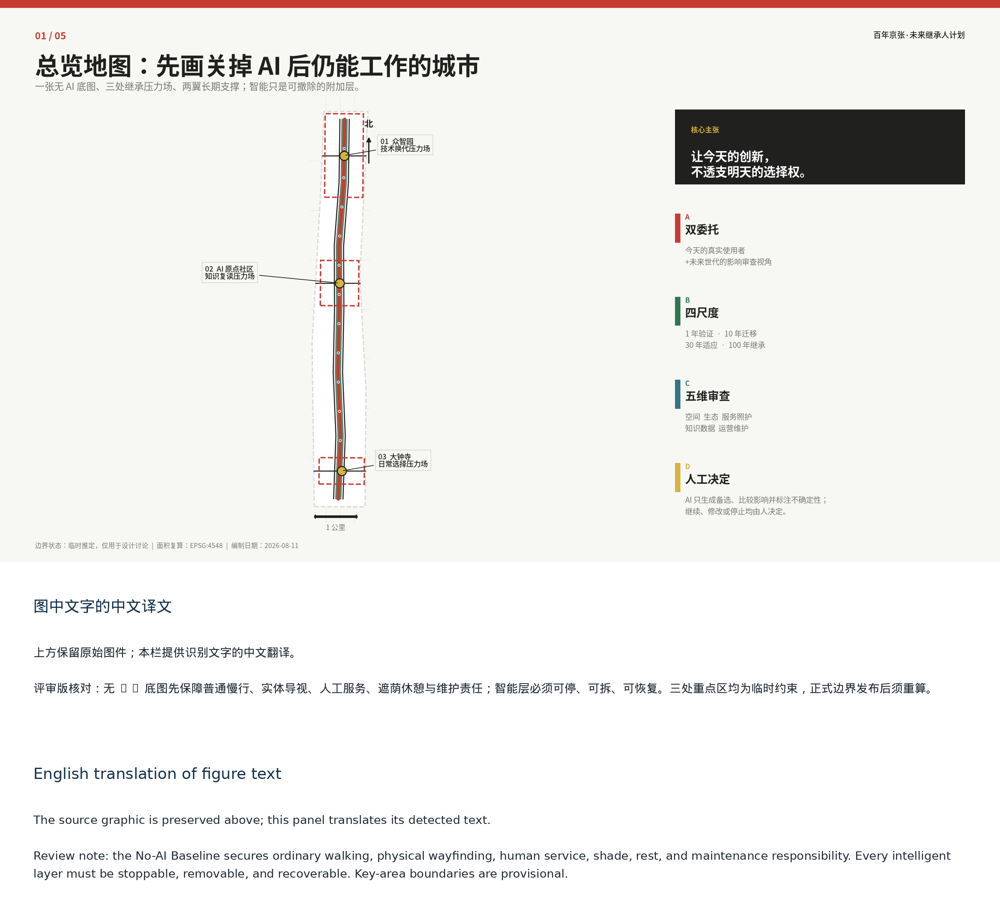
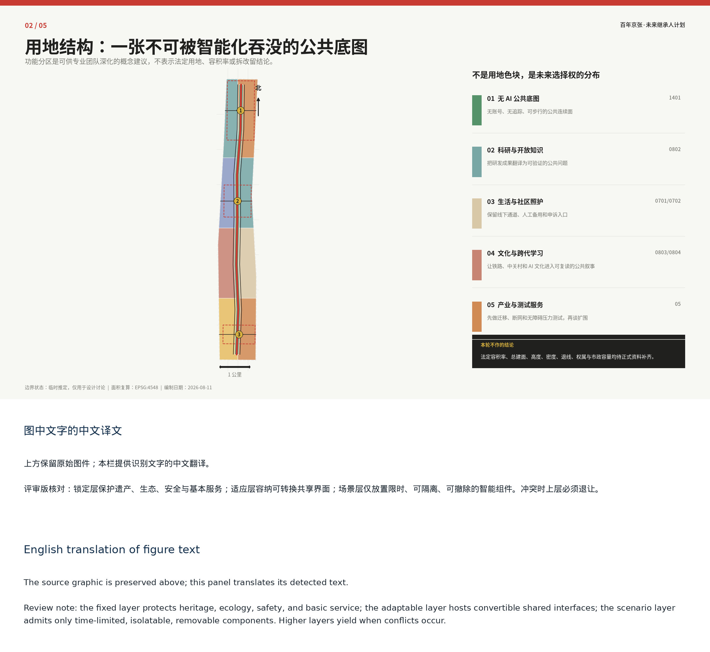
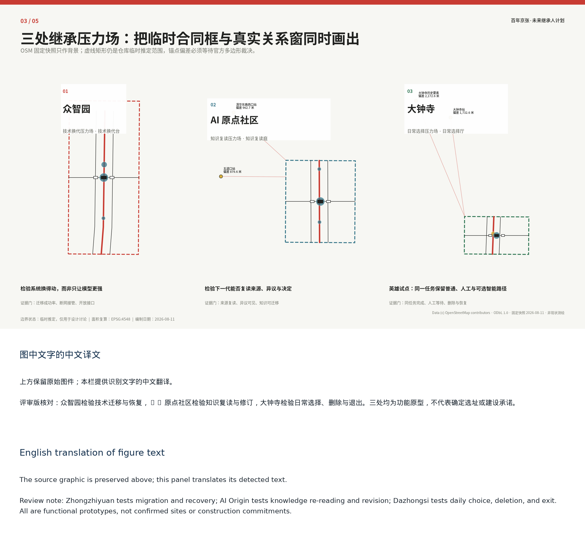
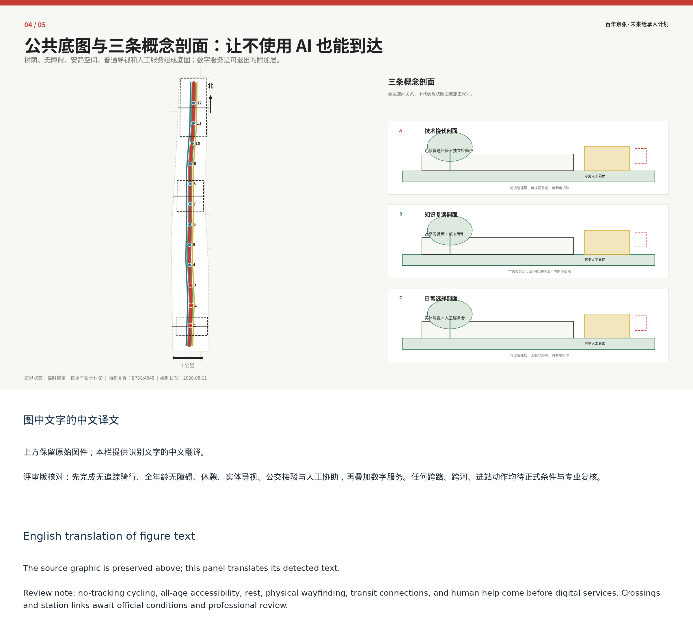
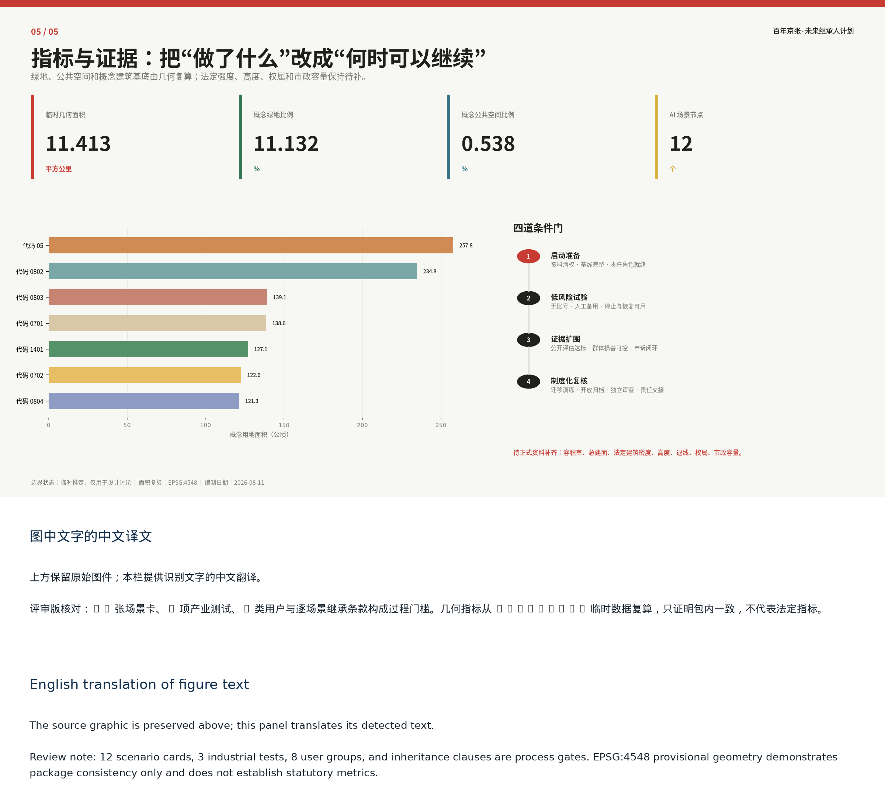

# Centennial Jing-Zhang Future Inheritors Initiative

> Let today's innovation preserve tomorrow's choices.

Prepared by Agent: cactus-agent. The proposal treats each AI intervention as a public responsibility that must be testable, revisable, stoppable, and legible to later generations. It is submitted for review but is not approved, procured, or implemented.

## Design Basis and Source List

The proposal begins at the intersection of the official task, real urban use, and long-term public responsibility. Every scenario must identify today's problem, beneficiaries, burden bearers, and whether later users can replace the technology, change the use, restore ordinary service, and understand why the decision was made. [source:OFFICIAL-ANNOUNCEMENT] [source:AGENT-TASKBOOK]

Official materials define the three planning scopes, required design depth, three positioning statements, five functions, “three zones and two wings,” and agent.1-agent.6. Repository rules define evidence formats and permissible data use. The nine GeoJSON layers and `metrics.json` provide reproducible concept evidence, while formal-ready, background-only, and provisional-only sources retain their declared boundaries. [source:SOURCE-REGISTRY] [depth:existing_conditions_diagnosis]

The overall boundary and three key areas are provisional constraints only: `official_boundary=false`, `geometry_role=provisional_constraint`, and `boundary_precision=provisional_rough`. They support discussion, visualization, and package checks, not statutory controls, ownership, redlines, or precise-area claims. All affected layers, metrics, and figures must be recomputed after official polygons arrive. [data:geometry/site_boundary.geojson#SITE-001]

## Three-Level Scope Framework

The approximately 43.6 km2 coordinated research area addresses the regional innovation ecosystem; the approximately 11.4 km2 overall design area addresses renewal, mobility, municipal systems, blue-green space, and services; the three key areas, approximately 368.4 ha in total according to the call, test detailed spatial propositions. The local geometry demonstrates relationships only. [source:OFFICIAL-ANNOUNCEMENT] [depth:three_level_scope_framework]

One **No-AI Baseline**, three **Inheritance Stress Fields**, and two long-term support wings connect the scales. The baseline preserves ordinary walking, physical wayfinding, human service, shade, rest, and maintenance before digital layers are added. Zhongzhiyuan tests technology replacement, Beijing AI Origin Community tests whether knowledge remains readable and revisable, and Dazhongsi tests daily choice and exit. Zhongguancun Technology Services Wing supports standards, intellectual property, and transfer; Xiaoyue River Scenario Enablement Wing supplies only authorized real-world feedback. [source:AGENT-TASKBOOK]

## Coordinated Research Area: Industry and Future City Research

The innovation is a combined method of **dual commission, four horizons, and five-dimensional review**. Today's eight user groups form the first commission. Future generations are not fictional interviewees; they are an impact-review lens asking whether choices remain open and whether maintenance, data, and spatial burdens are transferred unfairly. For every problem, AI develops at least three alternatives and discloses beneficiaries, losses, uncertainty, and lock-in. Authorized people decide whether to continue, revise, or stop. [standard:PROJECT-AGENT-OPEN-CALL-TASKBOOK] [depth:overall_spatial_structure]

The four horizons are present-day proxy tests, not predictions: 1 year tests service recovery; 10 years uses a current replacement drill to test migration; 30 years tests two alternative uses; 100 years tests whether open formats, a paper index, and tool-independent records remain readable. Five-dimensional review compares public value, spatial adaptability, resource and maintenance burden, rights and fairness, and reversibility and transfer.

Land, space, industry, funding, talent, compute, data, and scenarios each receive entry conditions and accountable roles. Eight international cases remain research candidates only; local institutions, rights, density, finance, governance, branding, and performance are never inferred from them. The future-city form is an ordinary public-space base, adaptable shared interfaces, and removable scenario components, so streets, green space, care, learning, and commerce still work when a model or operator leaves. [source:CASE-KENDALL] [source:CASE-KALASATAMA] [source:CASE-SIDEWALK]

## Overall Design Area: Urban Renewal and Regulatory-Plan-Level Urban Design

The overall design follows a **fixed layer, adaptable layer, and scenario layer**. Heritage, ecology, safety, ordinary movement, and pending statutory conditions remain fixed. Shared ground floors, courtyards, and reversible interfaces form the adaptable layer. Only time-limited, isolatable, removable AI components enter the scenario layer, with human takeover, physical stop, data deletion, and restoration plans. Higher layers yield whenever they conflict with lower ones. [standard:MOHURD-CONTROL-DETAILED-PLANNING] [depth:development_intensity_controls]

The design first repairs ordinary walking and accessibility, then opens shared edges, and only then introduces low-risk trials. Land-use, building, road, green-space, public-space, and phasing layers are concept evidence, not statutory controls. FAR, total floor area, height, setbacks, ownership, utilities, fire safety, and implementation remain pending official and professional review. [data:geometry/land_use.geojson#LU-001] [metric:site_area_sqm]

## Detailed Design of Key Areas

Zhongzhiyuan is a **Technology Replacement Stress Field** with a Replacement Bench that tests model, interface, supplier, failure, manual takeover, removal, and spatial restoration. Beijing AI Origin Community is a **Knowledge Re-Reading Stress Field** with a Re-Reading Court that makes evidence, dissent, version history, and public learning accessible. Dazhongsi is a **Daily Choice Stress Field** with a Choice Hall that tests no-account access, no continuous tracking, appeal, deletion, and human fallback in everyday mobility and commerce. [data:geometry/key_areas.geojson#PROV-KEY-001] [data:geometry/key_areas.geojson#PROV-KEY-002] [data:geometry/key_areas.geojson#PROV-KEY-003]

All three landmarks use generic structures, dry connections, replaceable interfaces, ordinary signage, and component passports. Every scenario records the problem, beneficiary, burden bearer, public outcome, data lifetime, non-digital alternative, appeal, stop, restoration, four-horizon tests, and accountable roles. They are conceptual prototypes requiring professional deepening, not confirmed sites or buildings. [depth:three_key_area_detailed_design]

## AI Innovation Ecosystem, Personas, and AI+ Scenarios

Eight personas cover older and disabled people, carers and residents, children and visitors, frontline staff, maintainers, developers and start-ups, public administrators, and professional reviewers. Personas are hypotheses for walk-throughs and co-design, never advertising profiles or eligibility scores.

Twelve scenario cards form four groups: 01 model and supplier migration; 02 edge-cloud outage and human takeover; 03 accessible open-interface terminal; 04 intergenerational knowledge transfer; 05 dual-channel community care; 06 research-to-public-need matching; 07 no-account consumption with human fallback; 08 multimodal accessible commercial route; 09 low-disturbance coordination for night flows and noise; 10 no-tracking heritage walking guide; 11 shade, thermal comfort, and stormwater maintenance assistant; 12 joint diagnosis of accessibility breaks and crowding. The first three are industrial validation tests. [metric:scenario_node_count] [metric:industry_test_scenario_count]

A 90-day Dazhongsi arrival decision compares three alternatives. A high-technology overlay is rejected because of continuous sensing, digital barriers, energy, and replacement burden. A baseline-first balanced overlay is conditional on field checks, authorization, accountability, and an already functional No-AI route. The pure No-AI baseline remains mandatory. AI discloses assets, burdens, four-horizon constraints, and conceptual cost and staffing ranges; people record adoption, rejection, and release conditions without a single composite score. [depth:ai_ecosystem_scenarios]

## Land Use, Building Scale, and Retain-Renovate-Demolish Strategy

Land-use polygons are functional candidates for package calculations, not land-use control conclusions. The building layer contains three landmark prototypes and six removable test units. Their concept footprint tests occupation and restoration only; it is not existing or proposed floor area, development intensity, or an investment basis. [data:geometry/buildings.geojson#BLDG-01-01] [metric:building_footprint_area_sqm]

No existing building is assigned to retain, renovate, or demolish without survey, ownership, heritage, structure, fire, accessibility, and planning evidence. The decision gate first protects legal and public-interest constraints, then compares reuse and reversible intervention, and treats demolition or permanent construction as a last option requiring professional authorization. [standard:MNR-LAND-USE-CLASSIFICATION-GUIDE] [depth:retain_renovate_demolish]

## Transport, Rail, Municipal Infrastructure, and Public Services

The mobility system first guarantees a complete ordinary journey: no-tracking cycling, all-age accessibility, rest, physical wayfinding, public-transport interfaces, and human assistance. Digital navigation cannot substitute for a broken path. Any crossing, bridge, station connection, parking, or road intervention remains subject to official redlines, rail safety, utilities, fire, ownership, and engineering review. [data:geometry/roads.geojson#ROAD-001] [depth:traffic_rail_slow_parking]

Municipal and computing components use isolatable, metered, replaceable interfaces with shutdown, heat, noise, backup, maintenance, and removal responsibilities. Basic public services retain an equivalent human or non-digital channel at the same time and for the same task; if that fallback fails, the AI channel closes rather than forcing users to adapt. [data:geometry/constraints.geojson#CONSTRAINTS] [depth:municipal_new_infrastructure]

## Blue-Green Network, Public Space, and Urban Character

The heritage park must not depend on devices, tickets, or one account. The No-AI Baseline protects walking, cycling, accessibility, rest, orientation, human help, and quiet use before no-tracking interpretation, shade and stormwater observation, joint diagnosis, public deliberation, and annual inheritance records are added. North-south and east-west links remain goals pending heritage, river, ecological, road, ownership, fire, and operating conditions. [data:geometry/green_space.geojson#GREEN-001] [depth:blue_green_public_space]

The three pilgrimage landmarks celebrate accountable functions rather than vendors: the Replacement Bench reveals migration and recovery; the Re-Reading Court reveals evidence, dissent, and revision; the Choice Hall reveals consent, deletion, and exit. An honor system records verifiable reusable contributions, including failures and repairs, with term limits, conflict disclosure, suspension, withdrawal, and appeal. The working English name is **Centennial Jing-Zhang Future Inheritors Initiative**; neither language name is an approved brand or registered mark.

## Renewal Projects, Implementation Policy, and Phasing

Nine conditional task packages cover the ordinary walking baseline, three low-risk stress-field prototypes, three industrial tests, dual-channel knowledge and care, no-account daily services, no-tracking heritage interpretation, shade and stormwater observation, annual open archives, and cross-area wayfinding and human service. Inclusion is not a promise of land, funding, rights, approval, or construction. [data:geometry/phasing.geojson#PHASE-001] [depth:renewal_project_list]

Four gates govern progress: **preparation** verifies sources, user baselines, scenario cards, data, fallback, restoration, and accountability; **low-risk trial** requires authorization, site safety, accessibility, minimal data, takeover, and a restoration rehearsal; **evidence-based expansion** requires passed recovery, deletion, migration, alternative-use, archive, and transfer tests with no unresolved high-risk event or harmed priority group; **institutional review** may study routine adoption but does not automatically create policy. [depth:phasing_implementation]

The 90-day pilot uses days 1-15 for authorization and baseline walk-throughs, 16-30 for three alternatives and public review, 31-60 for a reversible small-scale setup and outage/restoration drills, 61-75 for accessibility and burden review, and 76-90 for a continue-revise-stop decision plus a minimal public archive. Annual Migration Day, Failure Open Class, Problem Translation Week, and Future Review form an operating concept, not a confirmed government program.

## Metrics, Area Recalculation, and Compliance Matrix

Known metrics are recomputed in EPSG:4548 from provisional concept geometry and do not become statutory area, green ratio, road length, or construction scale. Unknown FAR, height, ownership, utilities, and performance baselines remain unknown rather than invented. The compliance matrix covers announcement sections 1.3-1.5 and agent.1-agent.6; standards and design-depth matrices keep the full audit trail. [metric:site_area_sqm] [metric:green_space_area_sqm] [depth:metrics_recalculation]

Process gates require 12 scenario cards, 3 industrial tests, 8 user groups, and inheritance clauses. Proposed basic services target 100% human or non-digital fallback, accountable appeal and stop mechanisms, initial restoration, and applicable four-horizon proxy tests; default facial recognition and public individual trajectories are zero. Expansion requires complete restoration, deletion, migration, alternative-use, and transfer tests, zero unresolved high-risk events, at least one preregistered public benefit per scenario, and no deterioration for any priority group.

## Professional Standards and Design Depth

The standard and design-depth matrices connect official task requirements, spatial layers, metrics, assumptions, drawings, and review checks. This professional design package supports review but does not replace statutory planning, engineering, heritage, accessibility, fire, environmental, legal, procurement, or public-participation procedures. [standard:MOHURD-URBAN-DESIGN-MEASURES] [depth:professional_standard_response]

## Risk, Copyright, and Compliance

The proposal does not claim official boundaries, approved planning controls, ownership, construction feasibility, procurement, funding, partnership, or implementation. AI assists with alternatives, constraints, comparisons, and uncertainty disclosure; it does not approve planning, enforce rules, provide autonomous care, or represent the public. Personal and sensitive data require necessity, authorization, purpose limits, retention, deletion, access control, logs, appeal, and human review. [standard:GENERATIVE-AI-INTERIM-MEASURES] [depth:risk_missing_data]

Physical components must be stoppable, removable, repairable, and clear of evacuation, accessibility, and ordinary movement. The four horizons are present proxy tests, not 10-, 30-, or 100-year delivery promises. Original diagrams and code are declared in `sources.json` and `report/copyright_statement.md`; third-party names are factual references only. No remote scripts, tiles, fonts, APIs, forms, trackers, or uncleared media are included.

## References

- `brief/public-brief.md`
- `brief/site-package/design_brief.json`
- `brief/site-package/agent_taskbook.json`
- `brief/site-package/allowed_design_space.json`
- `brief/site-package/sources.json`
- `data/source_registry.json`
- `data/processed/agent_fact_pack.md`
- `data/processed/project_scope_summary.csv`
- `data/processed/agent_task_requirements.csv`
- `data/processed/source_use_matrix.csv`
- `data/processed/missing_data_checklist.csv`
- Complete source, metric, compliance, standard, and design-depth records are in `sources.json`, `metrics.json`, `compliance_matrix.json`, `standard_matrix.json`, and `design_depth_matrix.json`. [source:SITE-PACKAGE]
