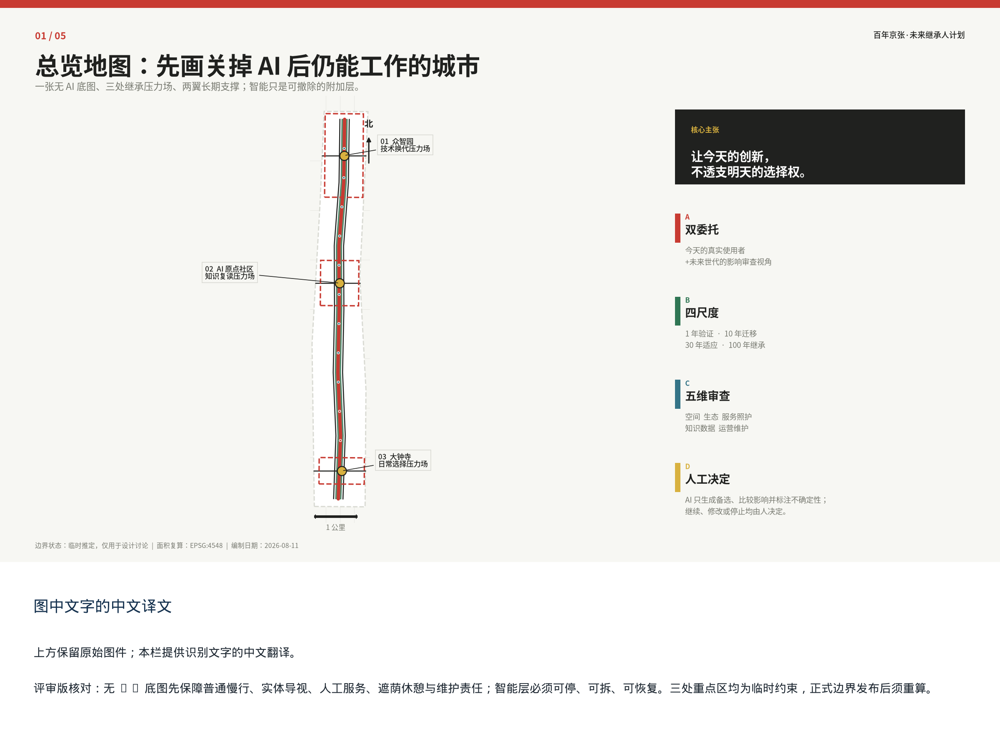
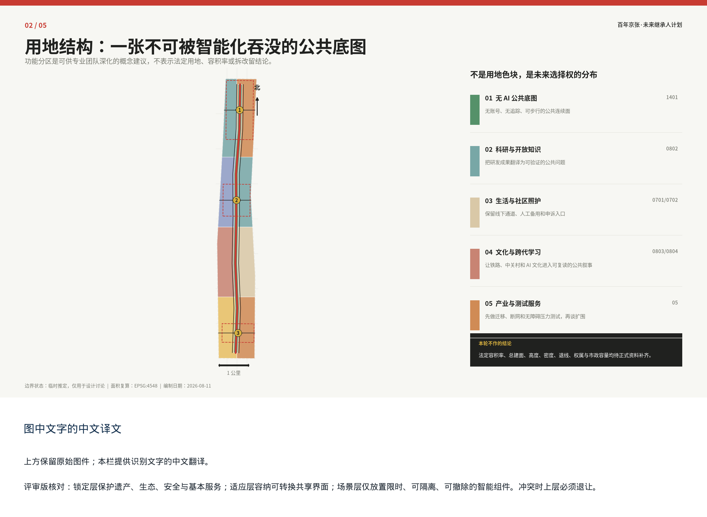
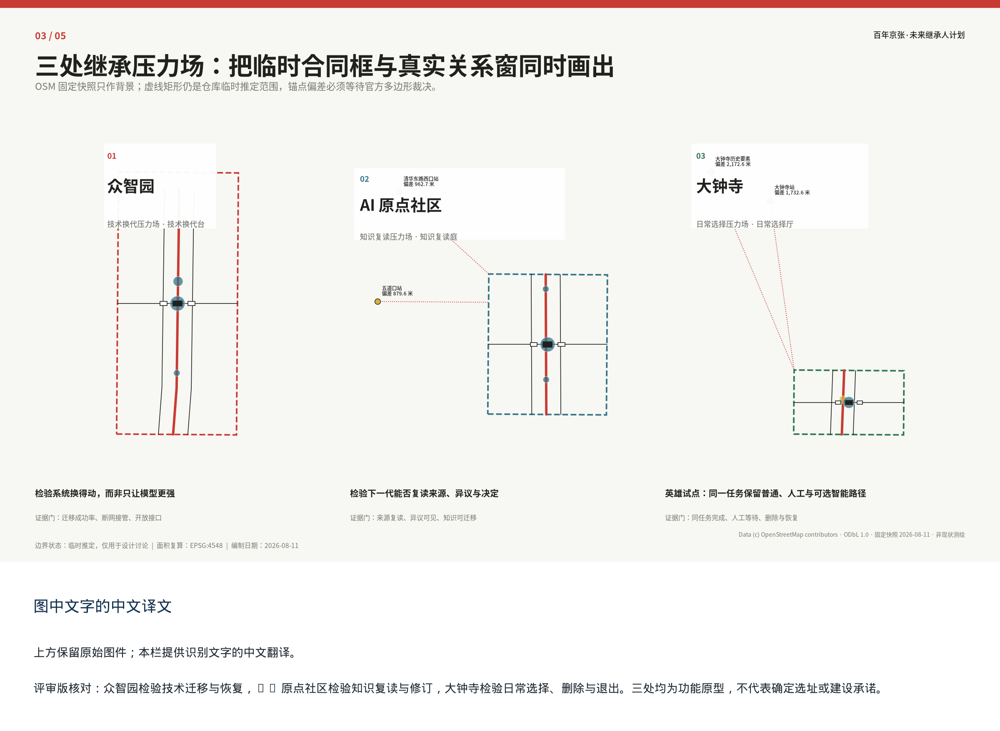
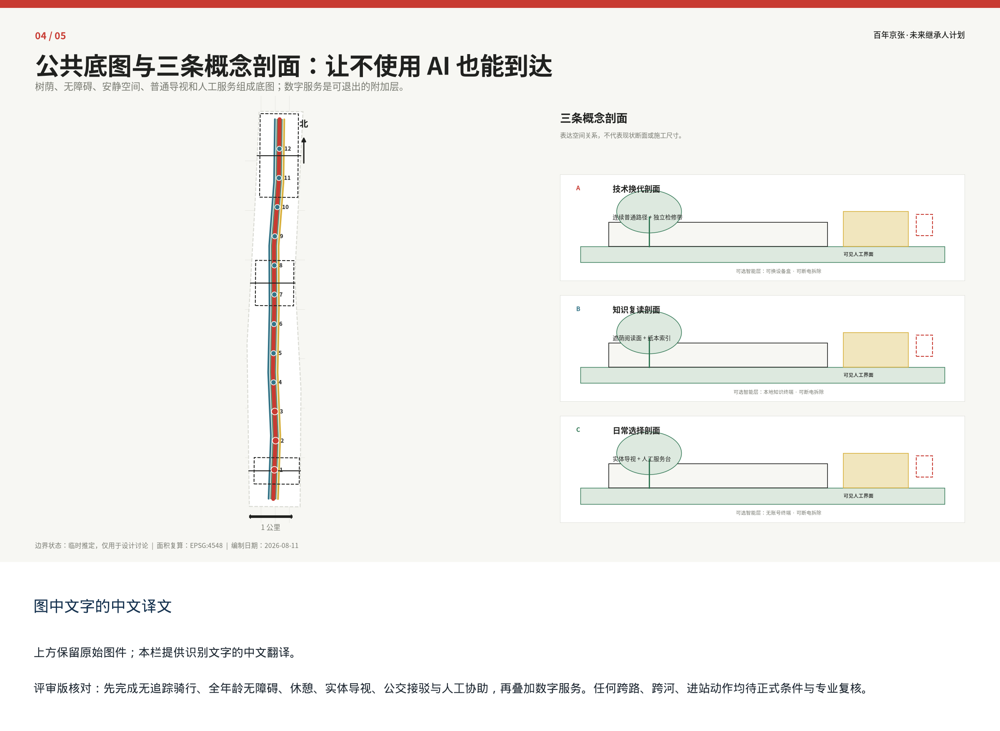
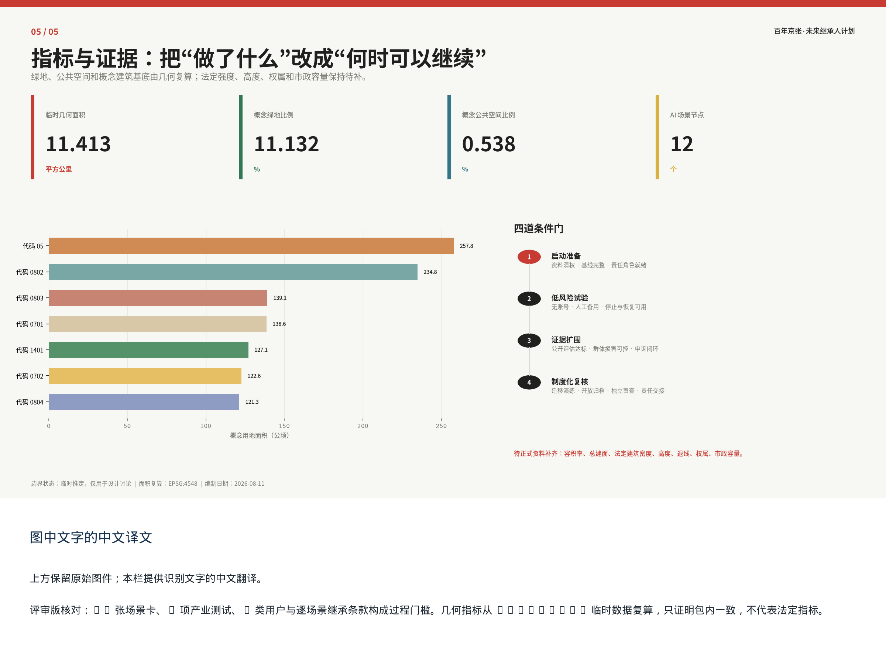

# 百年京张·未来继承人计划

> 让今天的创新，不透支明天的选择权。

本稿由 Agent: cactus-agent 编制。它以未来世代影响审查、四尺度代理试验、五维资产—负担审查和逐场景未来继承条款为方法，把百年京张从历史叙事转化为可以被今天验证、修订和停止的公共责任。成果已进入投稿 PR，但不表示已通过维护者、专家或政府部门审查。

## 设计依据与资料清单

### 核心判断

《百年京张·未来继承人计划》不是从技术清单出发，而是从征集任务、真实城市使用与长期公共责任三者的交集出发。方案把“让今天的创新，不透支明天的选择权”作为总判断：任何 AI 场景都必须先说明今天解决什么问题、谁获得便利、谁可能承担额外负担，再检查未来是否仍能更换技术、改变用途、恢复普通服务并读懂当年的决定。编制主体为 Agent: cactus-agent；当前成果处于公开投稿与评审准备阶段，不表示已通过维护者、专家或政府部门审查。

### 依据分层

第一层是正式任务依据。北京市规划和自然资源委员会海淀分局公开公告用于确认项目背景、三层范围的文字描述与约面积、设计任务和成果深度；仓库中的清权任务书用于确认三大定位、五大功能、“三区两翼”、六项智能体任务以及场景卡、用户画像、地标、活动和开源协作要求。这两类材料共同规定“必须回答什么”，但不提供地块权属、道路红线、市政容量或建筑现状结论 [source:OFFICIAL-ANNOUNCEMENT] [source:AGENT-TASKBOOK]。

第二层是仓库规则与本地可复核数据。`design_brief.json`、`allowed_design_space.json`、来源登记、专业标准快照和校验脚本规定“证据怎样表达”；九层 GeoJSON 与 `metrics.json` 记录“当前概念方案怎样复算”。完整机器索引由后续结构化台账承担，正文只在具体主张旁放置证据锚点。所有资料按 `formal-ready`、`background_only`、`provisional_only`、`方案自采候选` 四类使用，公开可访问不等于允许再分发，研究线索也不得升级为法定依据 [source:SOURCE-REGISTRY] [depth:existing_conditions_diagnosis]。

### 空间与资料边界

当前总体范围和三处重点区采用仓库临时推定几何，统一身份为 `geometry_role=provisional_constraint`、`boundary_precision=provisional_rough`、`official_boundary=false`。其用途仅限方案生成、关系讨论、可视化、本地自检和公式演示；临时几何面积不能替代公告约面积，更不能解释为审批红线、地块界线或权属边界 [data:geometry/site_boundary.geojson#SITE-001]。现状测绘、正式多边形、控规、权属、文保、道路、轨道客流、河道、市政、消防和公共设施底数尚未齐备，因此容积率、总建筑面积、法定高度、法定密度、退线、道路面积与市政容量均保持待正式资料补齐。

### 使用与更新规则

每项判断均须回到来源、假设、空间图层、指标公式和人工决定。新资料到达时，先核对发布主体、日期、许可、时间与空间范围，再追踪受影响的章节、图件、场景和指标；正式边界变化时必须整体重算九层几何、五张图和全文数字，而不是只替换一条轮廓。境外案例在一手文件、适用条件与版权完成核验前只称“研究候选”。图像、字体、标志、照片和第三方图表逐项清权；本稿的核心图均由本地概念几何与指标派生，不用效果图冒充现场证据。

## 三层范围工作框架

### 从三层任务到一个验证网络

三层范围不是把同一张总图放大三次，而是三个不同的决策层。统筹研究范围约 43.6 平方公里，回答区域创新链、产业生态、人才与知识网络如何协同；总体设计范围约 11.4 平方公里，回答京张铁路遗址公园周边的城市更新、交通、市政、蓝绿与公共服务怎样形成共同结构；三处重点区域合计约 368.4 公顷，回答众智园、北京 AI 原点社区和大钟寺各自怎样承担可验证的空间任务。约面积与文字四至服从公开公告，当前本地几何只辅助建立关系，不把统筹层策略误写为地块控制 [source:OFFICIAL-ANNOUNCEMENT] [depth:three_level_scope_framework]。

本方案以“**一张无 AI 底图、三处继承压力场、两翼长期支撑**”贯通三层。无 AI 底图先保障普通慢行、实体导视、人工服务、休憩遮荫和维护责任；京张铁路遗址公园只承担待正式边界核验的线性文化关系，不另造工程名称。“三区”仍是任务书的三个片区：众智园解释为技术换代压力场，北京 AI 原点社区解释为知识复读压力场，大钟寺解释为日常选择压力场；压力场不另造边界、法定分区或已定建筑。中关村科技服务翼提供标准、知识产权、人才和转化支持，小月河场景赋能翼提供经授权后的现实反馈；两翼都是协同关系，不是第四、第五个建设片区 [source:AGENT-TASKBOOK]。

> 图面状态：图件表达临时几何、既有节点关系与“无 AI 底图—三处继承压力场—两翼长期支撑”的概念结构；正式边界发布后必须重算。

### 深度分配与空间动作

统筹层形成“高校策源—开放协作—产业转化—公共验证—国际交流”的机制网络，并对土地、空间、产业、资金、人才、算力、数据、场景八类要素逐一说明责任与进入条件。总体层采用“锁定层—适应层—场景层”：遗产、生态、安全、基本通行和待核法定条件先锁定；可复合使用的建筑界面与公共空间作为适应层；可拆、可换、可关闭的 AI 原型进入场景层。重点区则用功能、公共空间、出行、服务、组件、运营与停止条件组成小方案，而不在资料不足时指定拆改留和开发量。

空间次序坚持“先保留选择，再增加设施”。先保障南北普通慢行连续，再研究三区与东西向社区、高校、轨道和服务节点的缝合；先保留无账号、无设备和人工通道，再叠加数字服务；先利用既有空间的共享时段和轻量组件，再讨论永久建设。由此，无 AI 底图不是背景口号，而是智能层关闭后仍可完成任务的公共基线；两翼不是资源口号，而是输入支持和反馈证据的双向回路 [data:geometry/roads.geojson#ROAD-001] [depth:overall_spatial_structure]。

### 统一边界声明

本章涉及的本地空间数据均标注 `geometry_role=provisional_constraint`、`boundary_precision=provisional_rough`、`official_boundary=false`。总体边界和重点区范围只用于概念方案生成、展示和本地复核，不据此判断地块、道路、轨道、文保、河道、建筑或权属。正式多边形到达后，应重新检查三区归属、场景节点、线网长度、面积比例和全部图件；若新的事实与概念结构冲突，优先修改方案，而不是调整事实来维护图面。

## 统筹研究范围产业与未来城市研究

### 产业不是园区名录，而是可交接的能力链

统筹研究的目标不是罗列未经核验的企业、资本和产值，而是建立能够跨机构、跨技术周期运行的创新能力链。方案把任务书的五大功能转译为五类公共接口：全栈自主创新通过模型、接口和供应商迁移试验检验；世界级创新生态通过高校、开发者、企业和科技服务之间的开放协作检验；AI+ 场景通过现实任务和公共收益检验；智能活力城市通过无障碍、人工后备和低扰动日常服务检验；治理话语权通过公开方法、失败记录、许可边界与申诉机制检验。每一类能力都必须在三区两翼找到空间载体和责任角色 [source:AGENT-TASKBOOK] [standard:PROJECT-AGENT-OPEN-CALL-TASKBOOK]。

“百年京张·未来继承人计划”的原创方法是双委托、四尺度与五维审查的组合。今天的八类真实使用者构成第一委托视角；未来世代不被虚构为可访谈人物，只作为“是否保留未来选择、是否转嫁维护和数据负担”的第二审查视角。AI 对同一问题生成不少于三套空间与运营组合，分别披露受益、受损、不确定性和锁定风险；人类与有权主体作继续、修改或停止决定。1 年验证服务与恢复，10 年以当前替换演练检验迁移，30 年以两种替代用途推演适应，100 年以开放格式、纸质索引和工具失效后的复读测试检验交接。这些是今天能做的代理试验，不是城市未来的确定预测。

### 八类资源与三区两翼

土地与空间只在取得权属和正式规划条件后进入具体配置；产业、资金和人才以合作机制候选表达，不虚构签约；算力以能耗计量、故障隔离、人工接管和退出责任为前提；数据执行最小化、用途限定、期限与删除；场景以普通服务不受损、可恢复和公共收益预登记为放行条件。众智园集中验证技术迁移和全栈治理，原点社区把科研成果转为可修订的公共知识，大钟寺在消费、出行与公共服务中检验“可选择的智能”；中关村科技服务翼提供规则与转化支持，小月河场景赋能翼只在场地、河道、生态和管理授权明确后承担低风险反馈。

区域协同只画能力接口候选，不虚构组织关系：北纬社区可反馈社区日常、照护和无障碍任务；未来科学城可比较跨学研发与技术换代方法；怀柔科学城可研究基础科研成果如何被公众复读、追溯与修正；经开区可比较工程化、供应链、备件和批量维护；京津冀可复做开放格式、跨场地迁移、人工后备和群体公平方法。所有机构、项目、数据、知识产权、资金、采购和合作状态待一手材料与相关主体确认，不使用“已签约”“已共建”或“已落地”表述。

八个全球案例严格保持研究候选状态：Kendall Square、Mila／Mile-Ex、one-north／Punggol Digital District、Kalasatama、22@、Marineterrein、King's Cross Knowledge Quarter，以及作为反面研究的 Sidewalk Toronto。方案只提炼知识锚点、生活实验室、适应性使用、机构网络、逐步开放和平台锁定警示等机制；不复制境外密度、土地制度、融资、治理权限、品牌或绩效数字。任何机制进入京张，都要重新回答本地问题、正式资料、责任主体、群体影响、失败动作与退出条件 [source:CASE-KENDALL] [source:CASE-KALASATAMA] [source:CASE-SIDEWALK]。

### 面向未来的城市形态判断

未来城市形态不应被单一技术设备锁定。方案主张以连续的普通公共空间为底，以可适应的共享界面为中层，以可拆场景组件为上层；当模型、终端或运营者退出时，街道、绿地、照护、学习和消费仍能工作。产业创新是否成功，不只看研发和展示，还看能否留下开放评测、可迁移接口、公共课程、维护知识和可读取的失败记录。产业绩效、人才密度、可负担空间和公众接受度因缺少基线暂不填改善值，只登记公式、取数方法、责任角色与失败动作，避免用愿景替代证据。

## 总体设计范围城市更新与控规深度城市设计

### 总体结构与更新判断

总体设计以无 AI 底图为公共基线，将三处继承压力场、两类长期支撑网络、八类功能分区和十二个场景节点组织成“验证—反馈—迁移—归档”的空间系统。城市更新的首要动作不是增加永久建筑，而是识别必须保持的遗产、生态、安全与基本服务条件，修补普通慢行和无障碍连续性，开放可共享的首层、院落和边界，再用可拆构件承载低风险试验。该次序把未知的法定和工程条件留在锁定层，避免概念设计提前占用未来规划选择 [depth:overall_spatial_structure] [data:geometry/site_boundary.geojson#SITE-001]。

本地 `land_use.geojson` 以八个功能候选区和一条公园绿带表达空间分工：社区服务与照护、生活验证与产业服务、京张文化与公共学习、可适应社区生活、跨代学习与人才衔接、开放知识与科研转译、未来技术验证、开放接口与创新服务，以及无 AI 底图中的线性公共绿带。分类代码只为提交契约和概念面积复算服务，不构成用途管制建议；任何正式用地性质仍须以法定资料为准 [data:geometry/land_use.geojson#LU-001] [standard:MNR-LAND-USE-CLASSIFICATION-GUIDE]。

### “锁定层—适应层—场景层”

锁定层包括待核的文保范围、河道与生态安全、道路轨道安全、市政消防、基本公共服务、普通通行以及任何不可由本方案擅自改变的法定条件。适应层研究共享时段、可逆隔断、通用接口、无障碍路径和能够在学习、照护、展示、议事之间转换的空间。场景层只允许限时、低资源、可隔离、可撤除的组件，并必须有人工接管、物理停止、数据删除和恢复预案。三层发生冲突时，场景层退让，适应层调整，锁定层不因图面完整而被突破 [standard:MOHURD-CONTROL-DETAILED-PLANNING] [depth:development_intensity_controls]。

交通方面先表达无 AI 底图中的普通公共路径、无追踪自行车平行线、全年龄无障碍平行线和三个重点区的公交慢行接驳关系；蓝绿方面先保护普通使用和低扰动连续，再叠加树荫、雨洪维护与文化阅读；公共服务方面所有拟试基本服务保留人工或非数字路径。建筑图层只放置技术换代台、知识复读庭、日常选择厅三个地标功能原型及其可拆测试单元，用于检查空间占用、组件恢复和视觉表达，不代表现状建筑、确定选址或建设项目 [data:geometry/buildings.geojson#BLDG-01-02]。

### 控规深度的诚实边界

当前临时总体几何复算面积为 11,412,825.386 平方米，与公告约 11.4 平方公里处于相同量级，但只能说明本包数据内部一致，不能反向证明范围准确 [metric:site_area_sqm]。容积率、总建筑面积、法定建筑密度、高度、退线、道路面积、权属和市政容量均待正式资料补齐；现阶段不指定拆、改、留对象，不给出道路断面、桥隧、管径、机房和投资结论。全章空间数据统一为 `geometry_role=provisional_constraint`、`boundary_precision=provisional_rough`、`official_boundary=false`，正式资料到达后须由规划、交通、市政、文保、园林、消防和无障碍专业团队联合深化。

## 重点区域详细设计

### 三区即三处继承压力场

重点区域采取差异化任务，而不是复制同一种“AI 园区”。众智园 AI 自主创新加速区作为技术换代压力场，回答技术能否迁移、故障时能否人工接管、组件退出后空间能否恢复；北京 AI 原点社区作为知识复读压力场，回答科研知识能否被普通人进入、复述、质疑与修订；大钟寺 AI 产业聚集区作为日常选择压力场，回答无账号、不持续追踪、可申诉且有人工作为后备的智能服务能否在日常消费和出行中成立。“三区”是任务片区口径，“压力场”仅为方案功能解释，不新增边界、设施类别或确定选址 [source:AGENT-TASKBOOK] [depth:three_key_area_detailed_design]。

### 众智园：技术换代压力场与技术换代台

建议以共享测试界面、技术换代台和可拆单元形成低风险原型。场景 01 检查模型、供应商和接口替换，场景 02 检查端边云失效与人工接管，场景 03 检查开放接口对不同辅助终端的适配；三者是产业测试验证候选，不等于已经获得场地和数据授权。首轮只做不触碰锁定层的桌面或隔离演练；若数据不可导出、许可禁止迁移、人工路径中断或组件不能按预案撤除，则停止扩围。清河、五环、交通、绿地、能耗、市政和权属资料到达前，不确定具体点位与工程形式 [data:geometry/key_areas.geojson#KEY-001] [data:geometry/public_space.geojson#PUBLIC-001]。

### 北京 AI 原点社区：知识复读压力场与知识复读庭

建议以共享首层与时段、跨代知识复读工坊、知识复读庭和科研需求匹配台组成开放知识原型。场景 04 让下一组使用者在无原工具条件下复读上一组记录，场景 05 比较社区照护的数字与人工双通道，场景 06 为同一公共需求展示多类科研候选及未匹配理由。空间优先服务长期居民、儿童青年、老人、残障人士、高校师生、开发者和一线人员，不把“人才社区”做成封闭会员空间；任何校园边界、建筑共享、站点接驳和适应性改造都须经权属、安全与运营核验 [data:geometry/key_areas.geojson#KEY-002] [data:geometry/public_space.geojson#PUBLIC-004]。

### 大钟寺：日常选择压力场与日常选择厅

建议在不改变普通服务的前提下研究无账号智能消费、人工后备、多模态无障碍路径与夜间低扰动协同。场景 07 比较无账号、账号和人工三条完成路径，场景 08 走查“到达—找店—获取信息—完成服务—离开”的整段体验，场景 09 只用聚合计数与人工巡查研究分时运营和安静路线，不追踪个体、不自动执法。若价格、资格、申诉或退出只能通过账号完成，或任何重点人群较基线恶化，则关闭 AI 路径并恢复普通服务。站点、路口、道路、非机动车、绿地、建筑和商业运营边界未核验前，只表达连通目标，不画成桥隧或改造工程 [data:geometry/key_areas.geojson#KEY-003] [data:geometry/public_space.geojson#PUBLIC-007]。

### 共同设计合同

三区的地标功能原型均采用通用结构、干式连接、可替换接口、普通导视和组件护照；每个场景共同登记现实问题、受益者、可能承担代价者、公共成果、数据寿命、人工替代、申诉、停止、恢复、四尺度代理试验和责任角色。当前三处范围均为 `geometry_role=provisional_constraint`、`boundary_precision=provisional_rough`、`official_boundary=false`；三处临时面积只能用于本包复算。正式边界、现状和权利资料到达后，应重新确定载体与节点，必要时允许原型退出，不以保持方案造型为优先。

## AI 创新生态、人才画像与 AI+ 场景

### 从真实任务而非技术演示出发

AI 创新生态的价值，以现实任务能否更公平、更连续地完成来判断，而不是以模型参数、设备数量或活动流量判断。方案固定检查八类今天的使用者：长期居民与照护者、儿童与青年、老人、残障人士、高校师生与开发者、初创企业与商户、一线服务与维护人员、通勤者与访客。同一人可以属于多类，评估时保留群体差异，不能用总体平均改善掩盖某一群体恶化。未来世代只作为影响审查视角，不编造未来人物、需求或授权 [source:AGENT-TASKBOOK] [depth:three_key_area_detailed_design]。

用户画像不采集真实个人履历，也不把画像用于广告推荐或资格判断。每类画像只登记常见任务、空间障碍、可能的数据暴露、人工或非数字替代、可观察指标和失败动作。例如老人和残障人士关注连续无障碍、清晰状态、休息点与人工协助；开发者和初创团队关注开放接口、测试条件、迁移与许可；一线人员关注告警负担、接管权限、维护工时和物理停止；居民与照护者关注普通服务、安静时段、儿童安全、隐私和申诉。正式试验前必须通过现场走查和共创修正这些假设。

### 十二个场景的空间组合

十二张场景卡形成三类组合。产业验证组包括 01 模型与供应商迁移压力测试、02 端边云断网与人工接管测试、03 开放接口无障碍终端适配测试；知识与照护组包括 04 跨代知识交接工坊、05 社区照护双通道服务、06 科研成果与城市公共需求匹配台；日常服务组包括 07 无账号智能消费与人工后备、08 多模态无障碍商业路径、09 夜间客流与噪声低扰动协同；公共空间组包括 10 无追踪遗产慢行导览、11 树荫热舒适与雨洪维护助手、12 无障碍断点与拥挤共诊。结构化公共空间图层已经放置十二个概念节点，其中前三个标为产业测试验证场景 [metric:scenario_node_count] [metric:industry_test_scenario_count]。

每张场景卡必须写明问题、当前受益者、潜在负担承担者、空间动作、公共成果、数据寿命、人工替代、申诉入口、停止条件、恢复方法、1／10／30／100 年代理试验和责任角色。AI 的任务是对同一问题提出多种组合、检查约束、比较群体影响和披露不确定性，不自动审批、自动执法、自动医疗照护或代表公众下结论。对于基本公共服务，人工或非数字路径必须在同一时间、同一任务上可用；人工路径失效时，先关闭 AI 路径，而不是要求使用者适应系统 [data:geometry/public_space.geojson#PUBLIC-005]。

### 一次可检查的 AI 三案决策

`50_structured/ai_decision_case.json#AI-DECISION-DAZHONGSI-001` 留下“大钟寺站到公共服务界面的 90 日到达任务”完整三案。高技术叠加案因持续感知、数字门槛、能耗和换代负担被明确拒绝；底图优先的平衡叠加案只在现场走查、授权、责任和无 AI 路径先达基线后条件选择；纯无 AI 底图案保留为强制基线。AI 逐案输出五维资产与负担、1／10／30／100 年约束、概念成本与人员区间；人工记录采用、拒绝和放行条件，不产生总分。

该案例由 `cactus-agent` 生成，证据类型为 `synthetic_design_exercise`，`is_real_approval=false`，属于合成设计演练，不是现场调查、报价、采购、保险意见、真实审批或已实施绩效。大钟寺站只是 OSM 背景锚点，当前与临时重点区存在可复算偏差；真实位置、任务、成本与人工决定必须在官方边界、现场基线和真实责任主体到位后重做。完整证据见 `20_design/28_AI代际推演实证.md`。

### 数据与公共利益底线

十二个场景默认人脸识别为零，公开个体轨迹为零。可用环境或客流信息优先采用人工走查、现场计数、匿名汇总和短寿命记录，不跨场景拼接个人身份；敏感事项转人工，数据到期须由数据负责人和独立复核者共同核验删除。每个场景在启动前预登记至少一项现实公共收益及阈值，例如任务成功、等待、无障碍连续、树荫舒适、普通通行或维护负担，并检查任一重点群体不较基线恶化。只有恢复、删除、迁移、用途适应和长期交接代理试验全部通过，未关闭高风险事件为零，有权主体才可决定是否扩大；这些门槛是设计建议，不表示现场验证已经发生。

## 用地、建筑规模与拆改留方案

### 用地是功能候选，不是用途管制结论

概念用地以九个连续分区表达“公共服务—生活验证—文化学习—适应生活—人才衔接—科研转译—技术验证—开放接口—公园绿带”的关系，并用统一代码满足机器复算。它回答的是不同城市任务在何处优先讨论、怎样进入无 AI 底图并与三处继承压力场关联，不回答法定用地性质、地块边界、开发权或供地方式。现有分区由临时总体范围派生，正式多边形、现状用地和控规到达后必须重新叠合、消除冲突并复算 [data:geometry/land_use.geojson#LU-001] [depth:land_use_layout]。

用地与空间资源遵循“锁定优先、共享优先、轻量优先、永久建设最后”的次序。文保、生态、安全、道路轨道、市政消防、基本服务和普通通行条件先列为锁定层；权属和建筑条件允许时，再研究共享首层、院落、边界和分时使用；只有低风险测试证明公共收益、维护责任与恢复能力后，才把更长期载体交给专业团队比较。任何场景均不得以“AI 专用”名义挤占无障碍、疏散、通勤、排队、非机动车和普通公共服务空间。

### 建筑原型只检验可拆与可换

建筑图层包含三个地标功能原型及六个可拆测试单元，共九个概念基底。当前复算的概念基底总面积为 19,440 平方米，占临时总体几何约 0.1703%；这个数只描述本包所画原型，不是现状建筑面积、拟建规模、开发强度或投资依据 [metric:building_footprint_area_sqm] [data:geometry/buildings.geojson#BLDG-01-01]。原型采用通用尺度、干式连接、可替换接口、可维修表皮和组件护照，分别服务技术换代台、知识复读庭与日常选择厅的功能验证。具体位置、体量、结构、防火、能源、无障碍和工程做法均待正式资料与专业设计。

下一轮须为三个原型各补一条概念剖面，并以“叠加前基线、90 日运行、停止后恢复”并列首层三态。剖面只表达普通通行、人工服务、公开界面、可选智能组件与受控后勤的相对关系，同时标出独立断电、停止采集、拆件、表面修复和普通任务复测界面；真实净宽、高程、结构、锚固、消防与设备参数仍待测绘和专业深化。拆除恢复顺序固定为：冻结新增采集、导出最小责任记录、双角色核验到期删除、物理断电、拆除终端与可逆固定件、修复表面、复做普通任务并签认。若两名受训人员不能在一个工作班次内完成现场预演，该智能叠加不得开放。

### 拆改留的判定门

本阶段不对任何现状建筑给出保留、改造或拆除结论。后续取得测绘、结构安全、历史价值、使用状态、产权、租赁、消防、市政和运营资料后，才按“公共价值、碳与材料负担、适应能力、可负担使用、群体影响、全寿命维护”进行多方案比较。保留并非自动正确，拆除也不能由效率单项决定；每个对象须记录受益者、可能被迁出者、替代空间、材料去向、工期影响、申诉和人工决定。缺少任一关键资料时，状态保持“待核”，不以图面颜色制造确定性 [depth:retain_renovate_demolish] [depth:height_massing_character]。

容积率、总建筑面积、法定建筑密度、法定高度、建筑退线、建筑控制线和权属在指标中保持待正式数据补齐。所有本章空间要素均为 `geometry_role=provisional_constraint`、`boundary_precision=provisional_rough`、`official_boundary=false`；当前概念分区和建筑基底仅用于生成、展示、本地自检和方案取舍，不能作为规划许可、工程设计或资产判断依据。

## 交通、轨道、市政与公共服务设施

### 先保证完整出行，再叠加智能服务

交通策略从真实使用者的一段完整旅程出发：能否在不依赖手机、账号或 AI 的情况下到达、辨路、过街、换乘、停留并离开。概念线网由无 AI 底图中的普通公共路径、无追踪自行车平行线、全年龄无障碍平行线和三个重点区公交慢行接驳线组成，当前中心线复算总长 31,460.826 米，只用于检验概念联系和图面一致性，不代表道路红线、工程线位或已建成长度 [data:geometry/roads.geojson#ROAD-001] [metric:concept_road_centerline_length_m]。

普通公共路径承担步行、历史阅读和公共记录；自行车平行线强调不持续追踪的连续骑行；全年龄无障碍平行线以坡度、宽度、过街、休息、照明和人工引导的现场核验为前提。三处继承压力场的接驳关系只表达“公交或轨道到公共空间与场景节点”的目标。北五环跨越、五道口、清华东路西口、大钟寺站及重点企业周边均需在道路、轨道、客流、非机动车、信号、消防和管理边界到达后由专业团队复核；本稿不指定桥隧、断面、车道、停车数量和施工方式 [depth:traffic_rail_slow_parking]。

### 市政与新型基础设施采用可关闭接口

市政策略不预测负荷与容量，只规定接口原则。端、边、云节点应分区隔离并可单独关闭；能源、通信和数据使用可计量；设备故障不影响照明、疏散、给排水、照护等基本服务；一线人员拥有清晰的物理停止和人工接管路径；供应商退出时能够导出必要记录、拆除专用设备并恢复普通空间。管线、排水、防洪、电力、消防、通信和机房资料缺失时，相应能力均标记待正式数据补齐，不把端侧算力或分布式能源写成已具备条件 [depth:municipal_new_infrastructure]。

### 公共服务坚持双通道

拟试的社区照护、消费、导览、出行信息和公共需求匹配均保留人工或非数字通道。普通标识、纸本索引、现场人员和物理按钮是基础，数字终端只作增量；状态统一显示“试验中、人工接管、暂停、已退出”，避免系统故障时公众无法判断。服务前预登记任务与重点人群，比较数字与人工的成功率、等待、可达性和申诉结果，不用平均值掩盖老人、儿童、残障人士或低数字能力人群的损失 [data:geometry/public_space.geojson#PUBLIC-012]。

任何具体设施的服务半径、规模、数量和等级，均须在取得人口、就业、现状设施、运营能力与法定标准后计算。本章图层统一保留 `geometry_role=provisional_constraint`、`boundary_precision=provisional_rough`、`official_boundary=false`。正式资料到达后，应把交通、市政和公共服务作为同一条使用链联合校核，而不是各专业分别满足纸面指标后再发现接口断裂。

## 蓝绿空间、公共空间与城市风貌

### 无 AI 底图首先是普通人的公共空间

蓝绿与公共空间的核心判断是：遗址公园的价值不能依赖设备、活动门票或统一账号。无 AI 底图首先保障连续步行、骑行、无障碍、休息、辨路、人工求助和安静使用，再叠加无追踪导览、树荫与雨洪维护观察、断点共诊、公共议事和年度继承清册。南北贯通与东西缝合目前只表达目标关系，任何跨路、跨河、进校、进园或进入建筑的具体动作，都要服从文保、河道、生态、道路、权属、消防与运营条件 [depth:blue_green_public_space] [data:geometry/green_space.geojson#GREEN-001]。

本包临时几何中的概念绿地面积为 1,270,503.225 平方米，占临时总体范围 11.1322%；十五处场景与议事节点形成的概念公共空间面积为 61,416.436 平方米，占 0.5381%。这些数字用于复核图层内部关系，不是法定绿地率、规划公共空间供给标准或工程量 [metric:green_ratio] [metric:public_space_ratio]。正式边界、绿地性质、河道蓝线、树木、海绵条件、土壤、热环境和日常使用基线到达后，应重算面积并由园林、生态、水务和无障碍专业人员确定干预边界。

### 可停、可换、可维护的公共空间

技术换代台、知识复读庭和日常选择厅各对应一个概念公共界面，十二个场景节点采用小尺度、可拆、可维修组件。座椅、遮阴、照明、导视和终端不能阻断普通通行；需要采集环境信息时，优先人工巡查、匿名汇总和短寿命记录；维护工时、备件、清场与恢复由空间运营者预先登记。任何活动或设备触碰遗产、树木、安静时段、疏散或无障碍红线时立即停止，恢复普通使用。空间是否成功以真实停留、任务完成、群体差异与维护负担判断，而不是以装置数量和传播流量判断 [data:geometry/public_space.geojson#PLAZA-001]。

### 铁路档案与公共证据的风貌语言

城市风貌采用“铁路档案 × 公共证据控制台”的克制语言：纸白作为公共阅读底，炭黑回应铁路工业记忆，信号朱红标识决策门与风险，生态绿标识蓝绿系统，公共服务黄标识人工与包容路径，少量青色标识知识与数据。导视以普通实体信息为主，说明地点、方向、无障碍、开放状态和人工入口；二维码与智能终端只能补充。历史叙事按“铁路是时间证据，创新是继承责任”组织，每一条史实、照片、字体、标志和机构名称分别核验来源与许可，未清权素材不上图 [standard:MOHURD-URBAN-DESIGN-MEASURES]。

三处 AI 朝圣地标是功能原型，不是纪念碑竞赛：众智园“技术换代台”展示迁移、故障与恢复；原点社区“知识复读庭”展示异议、知识版本与共同学习；大钟寺“日常选择厅”展示选择、删除与退出记录。荣誉体系只记录可核验、可复用、能承认失败并完成继承责任的贡献，设置展示期限、利益冲突披露、暂停、撤销和申诉。全章几何身份为 `geometry_role=provisional_constraint`、`boundary_precision=provisional_rough`、`official_boundary=false`，不据此确定地标选址、建筑形式或风貌控制线。

### 中文名称与标志方向

本轮使用中文主名 **百年京张·未来继承人计划**，英文对照名为 **Centennial Jing-Zhang Future Inheritors Initiative**。两者均为投稿工作名称，不是注册商标或已批准的国际传播口径；正式使用前仍须完成语言、法律边界与商标近似审查。

Logo 工作方向由“两组平行线、一个可见开口、完整中文名称”组成：两线表示今天与未来同时进入决策，开口表示后人仍可修改选择。它不得模仿铁路局、轨道运营、高校、企业或活动官方标识；黑白、小尺寸、低视力对比和单色印刷测试通过前，不确定彩色终稿。Logo 只回答“这是什么计划”，安全和无障碍导视继续使用现行规范符号。

## 更新项目清单、实施政策与分期计划

### 项目不是建设承诺，而是条件化任务包

本方案把更新内容组织为九类候选任务包：无 AI 底图普通慢行连续、三处继承压力场的低风险空间原型、众智园三项产业测试、原点社区知识与照护双通道、大钟寺无账号与无障碍日常服务、无追踪遗产导览、树荫雨洪维护观察、年度继承清册与开放归档、跨区普通导视和人工服务接口。每一包都必须注明概念位置、现实问题、受益与受损人群、空间动作、依赖资料、责任角色、公共收益指标、停止和恢复。候选进入清单不表示已具备场地、资金、权利或审批条件 [depth:renewal_project_list] [data:geometry/phasing.geojson#PHASE-001]。

项目排序采用公共风险与证据成熟度，而不是造价或传播效果。可以先做的是桌面推演、人工走查、纸本索引、开放格式归档和不改变场地的演练；经授权后才研究限时、低资源、可隔离、可恢复的现场试验；涉及道路、轨道、河道、文保、建筑、市政、消防或基本服务的动作，必须等待相应正式资料与专业审查。若一个项目不能说明谁恢复普通服务、谁删除数据、谁处理申诉和谁承担维护，它就不进入下一条件门。

### 四个条件门

“启动准备”完成来源核验、八类用户基线、十二张场景卡、三项产业测试脚本、数据清单、人工路径、空间恢复预案和责任映射。“低风险试验”只在有权主体许可、场地安全、无障碍、数据最小化、人工接管和恢复预演齐备后开展。“证据扩围”只复制已经通过恢复、删除、迁移、两种用途适应、开放归档与责任交接测试的对象，且未关闭高风险事件为零、重点群体核心指标不恶化。“制度化复核”研究把成熟方法纳入常态维护、开放知识和年度审议，但不自动成为政策 [depth:phasing_implementation]。

四门是条件状态，不绑定固定年月；1、10、30、100 年则是当前代理试验的复核尺度，也不是建设时序。任何阶段只允许三个决定：证据完整且红线均关闭时“继续”；不存在立即停止事项但证据或公平仍不足时“修改”；触及隐私、安全、文保、生态、锁定层、基本服务中断、无法人工接管、无法删除、无法恢复、责任缺失或未经授权时“停止”。停止后先恢复服务、补救影响、撤除组件并保留不含敏感信息的责任记录，不删除失败来美化成果。

### 大钟寺 90 日最小试点实施摘要

该试点只推进“底图优先的平衡叠加案”，且以 24 万—42 万元、3.0—4.5 个全时当量的纯无 AI 底图案为不得降低的强制基线。高技术叠加案概念成本 68 万—110 万元、持续人员 4.0—5.5 个全时当量，因持续感知、设备占位、数字门槛和换代负担被拒绝；平衡叠加案概念成本 38 万—68 万元、持续人员 3.0—4.0 个全时当量，只获得条件选择。所有数值均为合成设计演练的比较区间，不是报价、批复或政府投资承诺。

| 实施项 | 90 日概念预案与放行边界 |
| --- | --- |
| 责任 | 场地、公共服务、数据、无障碍共同核查、独立安全与保险复核五类角色均须映射到真实主体；任一缺失则不采购、不安装、不开放 |
| 成本与人员 | 平衡案合计 38 万—68 万元，持续投入 3.0—4.0 个全时当量；真实主体必须重新核价和排班，一线等待或维护工时失控即缩小或停止智能层 |
| 采购与保险 | 先验收普通导视、可移动服务台和无障碍修补；智能组件后询价，须支持本地断网、物理断电、数据导出删除、非专有接口与退出协助；公众责任、临时设施、安装拆除和设备故障保险由真实场地及保险顾问另行确定 |
| 维护 | 每日检查普通路径、实体导视、人工服务台和紧急停止；每周记录运行、实测用电、维护工时、故障与人工接管；每 30 日公开不含个人信息的服务差异、申诉、删除与停止记录 |
| 恢复 | 按“停采集—导出最小责任记录—核验删除—断电—拆组件—修复表面—复测普通任务”执行；两名受训人员不能在一个工作班次内完成预演，则智能层不得开放 |

真实放行还须确认正式边界或管理范围、站口至目标服务界面的联合现场走查、五类真实责任主体、无障碍代表与一线人员共同确认的任务脚本，以及经真实程序落实的预算、采购、维护、保险与恢复资源。任何一项缺失，案例继续保持 `synthetic_design_exercise` 与 `is_real_approval=false`，不得通过修改文案升级为实施状态。

### 实施政策建议

政策侧建议形成场景准入、公共空间轻量使用、数据寿命、人工接管、开放许可、组件护照、年度继承清册、利益冲突和公众申诉八类非法律约束模板，供有权主体与专业团队深化。中关村科技服务翼可研究标准、知识产权、人才和转化服务；小月河场景赋能翼可在正式授权与生态条件成立后研究现实反馈。每个产业测试至少形成一项来源、版本、许可和限制清晰的可公开复用成果；活动、开发者社区和国际交流必须把真实公共内容、低门槛参与、安静时段、清场与年度复盘写入运营协议，而不是仅做品牌宣传 [source:AGENT-TASKBOOK]。

分期图层的四个面仍为 `geometry_role=provisional_constraint`、`boundary_precision=provisional_rough`、`official_boundary=false`。其面积只显示当前概念覆盖，不表示政府时序、项目边界、资金分配或审批顺序。正式资料到达、责任主体变化、数据用途变化或场景跨区扩展时，旧的放行记录不自动沿用，必须重新核验并由人工记录决定。

## 指标体系、面积复算与合规矩阵

### 指标先说明身份，再解释数值

指标分为三类。第一类可由本包 GeoJSON 直接复算，用于检查方案内部一致性；第二类需要正式规划、权属或工程资料，只登记公式、缺口和解除条件；第三类需要现场与运营基线，只登记分子、分母、取数方法、群体、频率、责任和失败动作。任何指标都不得在试验结束后修改口径来迎合结果，也不得把总平均改善作为覆盖弱势群体损失的理由 [depth:metrics_recalculation]。

临时总体几何面积为 11,412,825.386 平方米；概念绿地面积为 1,270,503.225 平方米，比例 0.111322；概念公共空间面积为 61,416.436 平方米，比例 0.005381；九个地标与测试单元概念基底合计 19,440 平方米，比例 0.001703；六条概念道路中心线合计 31,460.826 米；图层包含三个重点区、三个地标、十二个场景节点，其中三个为产业测试验证场景 [metric:site_area_sqm] [metric:green_space_area_sqm] [metric:scenario_node_count]。这些数值均从 EPSG:4548 中的临时几何计算，精度置信只说明本包计算可重复，不代表法定面积、绿地率、道路长度或建设规模。

容积率、总建筑面积、法定建筑密度、法定高度、退线、道路面积与比例、权属和市政容量保持待正式数据补齐。三个重点区的临时面积以及四个条件门的临时覆盖面积可在 `metrics.json` 复算，但只用于图层检查；公告约值仍以公告为准。全套边界身份为 `geometry_role=provisional_constraint`、`boundary_precision=provisional_rough`、`official_boundary=false`，正式多边形到达后需重算九层几何、全部指标、五张图、网页、PDF 和正文 [data:geometry/site_boundary.geojson#SITE-001]。

### 过程底线与扩大条件

准备稿要求十二张场景卡、三项产业测试验证候选、八类现实用户和逐场景未来继承条款全部齐备；拟试基本公共服务的人工或非数字替代、责任申诉停止机制、首轮可恢复、适用四尺度代理检查均以 100% 为设计门槛；默认人脸识别与公开个体轨迹均为零。扩围前，恢复原状、到期数据删除、技术迁移、替代用途适应和长期交接测试均须对拟扩对象达到 100%，未关闭高风险事件为零，且每个场景至少达成一项事前登记公共收益并保证任一重点群体不恶化。这些是放行条件，不是已经取得的现场成绩。

### 合规矩阵的审阅路径

任务覆盖矩阵把公告 1.3、1.4、1.5 与 `agent.1` 至 `agent.6` 分别映射到章节、场景、图层、图件、指标、假设与验证；专业标准矩阵区分法定依据、指导性文件、国际经验和方案自设底线；设计深度矩阵把已完成的概念表达、待专业深化和资料阻断分开。正文不堆叠完整机器索引，评审者可以从一个判断进入相邻锚点，再由结构化文件检查全量覆盖 [standard:PROJECT-OFFICIAL-ANNOUNCEMENT] [depth:risk_missing_data]。若矩阵与正文冲突，以权威来源与可复算数据为准并修订正文，不用修改结构化证据来迁就叙事。

## 风险、版权与合规说明

### 规划与空间边界

本方案是开放共创的城市设计概念建议，不替代正式规划，不构成政府审定、建设许可、投资安排或运营承诺。所有本地范围与派生图层采用 `geometry_role=provisional_constraint`、`boundary_precision=provisional_rough`、`official_boundary=false`，仅用于生成、讨论、可视化和本地自检，不作为审批红线、地块权属或工程依据。正式边界、控规、现状建筑、道路轨道、文保、河道、市政、消防、设施与权属资料缺失时，具体拆改留、开发量、线位、容量和投资结论全部阻断 [source:SITE-PACKAGE] [depth:risk_missing_data]。

### AI、数据与公共利益

AI 只辅助生成多方案、检查约束、比较群体影响和披露不确定性，不自动审批、执法、医疗照护、资格判断或代表公众和未来世代作决定。所有场景执行数据最小化、用途限定、短寿命、权限分离、到期删除和人工复核；默认人脸识别与公开个体轨迹为零，公共空间与基本服务不以统一账号、持续采集或专有平台为进入条件。出现越界采集、人工接管失败、基本服务中断、重点人群恶化或高风险事件未关闭时，立即停止相应功能，恢复普通服务、删除越界数据并独立复核 [data:geometry/public_space.geojson#PUBLIC-002]。

### 安全、维护和长期承诺

物理组件必须可停、可拆、可维修，不阻断疏散、无障碍和普通通行；运营前登记值守、工时、备件、能耗、清场和恢复责任。四尺度只表示当前代理试验，不能写成 10 年建设、30 年转型或 100 年结果保证。供应商或责任角色变化、数据用途扩张、场景跨区或正式资料更新时，旧结论全部重新审查。停止不是失败记录消失：只在排除个人敏感信息和第三方受限材料后，保留决定理由、补救、退出和责任移交的最小档案。

### 来源、版权与表达

来源台账分别登记标题、发布者、网址、日期、获取时间、用途、许可、转换和限制；公开可见不等于开放许可。第三方照片、地图、标志、字体、肖像、报告图表和案例素材未取得明确再分发权时不进入展板或网页，改用自制图或只作文字引用。京张历史、中关村创新文化和机构贡献逐条回到一手材料；一手来源未核的全球案例始终称研究候选。五张核心图、离线网页与 PDF 由本地几何和指标派生，不能用渲染效果替代现场、权属或工程证据 [source:SOURCE-REGISTRY]。

### 当前包状态与后续门禁

当前成果由 Agent: cactus-agent 编制，已补齐中英文对照稿、图件、HTML 与 A3/A0 展示材料并进入投稿 PR。正式空间资料替换、权利确认和外部专业审查仍是后续条件；本地门禁通过不等于官方批准、采购或实施。后续每次更新都应记录输入版本、自检结果、未关闭问题与人工责任，确保不确定性和未完成事项持续可见。

## 参考资料

### 权威任务与仓库规则

本稿的首要任务依据是北京市规划和自然资源委员会海淀分局公开的项目公告本地快照，用于确认项目背景、三层范围文字与约面积、设计内容和成果深度；第二项是用户提供且仓库登记为已清权的面向智能体任务书，用于确认三大定位、五大功能、三区两翼、六项智能体任务和场景成果要求。结构化设计摘要、允许设计空间、枚举、指标范围、专业标准快照与校验脚本用于解释机器契约，不自行提高原材料的权威等级 [source:OFFICIAL-ANNOUNCEMENT] [source:AGENT-TASKBOOK]。

核心阅读入口包括 `brief/site-package/design_brief.json`、`agent_taskbook.json`、`allowed_design_space.json`、`sources.json`、`ranges/planning_limits.json`、`standards/standards.json`、专业参考快照、`data/source_registry.json` 与 `docs/data-workflow.md`。来源登记负责区分 `formal-ready`、`background_only`、`provisional_only` 和 `方案自采候选`；任何摘要、事实包或本地研究文档只是导航与派生层，事实仍回到登记的原始材料 [source:SOURCE-REGISTRY] [source:SITE-PACKAGE]。

### 空间、指标与方案内证据

当前边界依据为仓库提供的临时推定几何及其说明，只允许方案生成、讨论、可视化与本地自检。方案内证据包括 `geometry/site_boundary.geojson`、`key_areas.geojson`、`land_use.geojson`、`buildings.geojson`、`roads.geojson`、`green_space.geojson`、`public_space.geojson`、`constraints.geojson`、`phasing.geojson` 和 `metrics.json`；空间计算统一在 EPSG:4548 中完成后输出 GeoJSON。所有临时要素保持 `geometry_role=provisional_constraint`、`boundary_precision=provisional_rough`、`official_boundary=false`，其复算数值不得替代公告约值 [data:geometry/site_boundary.geojson#SITE-001] [metric:site_area_sqm]。

设计论证同时回溯本地控制与研究文件：编制说明、任务响应矩阵、来源假设版权台账、术语与边界用语、三层范围与资料缺口、全球案例研究、八类现实用户画像、总体概念与三区两翼、三处重点区小方案、十二张 AI 场景卡、地标组件与荣誉体系、文化叙事与导视、年度活动与长期运营、实施分期指标与风险。它们是当前工作区的编制记录，不冒充组织方文件或已审定成果。

### 国际案例与专业框架

案例研究候选严格包括 Kendall Square、Mila／Mile-Ex、one-north／Punggol Digital District、Kalasatama、22@、Marineterrein、King's Cross Knowledge Quarter 与 Sidewalk Toronto。每案正式引用前须核对政府、规划或实际运营主体的一手文件，记录版本、空间与时间范围、利益关系、独立评价、许可及不可照搬项；当前不采用案例的密度、开发权、资金、平台权限、绩效数字、品牌图像和机构标志。城市设计方法参考公共空间、混合使用、可步行、适应性更新、完整街道、生活实验室和数据治理等通行框架，但具体参数不自动成为京张的法定标准 [standard:MOHURD-URBAN-DESIGN-MEASURES]。

### 引用和更新方法

正文采用 v2 邻近证据锚点，只在可读判断后附一至三条直接证据；完整来源、指标、任务、标准、设计深度与假设索引分别保存在 `sources.json`、`metrics.json`、`compliance_matrix.json`、`standard_matrix.json`、`design_depth_matrix.json` 和 `assumptions.json`。后续资料到达时，先验证发布者、日期、许可、覆盖范围与冲突，再更新台账、受影响章节、空间数据、图件和指标，并保留版本差异。正式使用任何外部素材前还须进行版权和专业复核；无法确认的事实删除或降为研究线索，不以“来源很多”代替证据质量 [depth:existing_conditions_diagnosis]。
