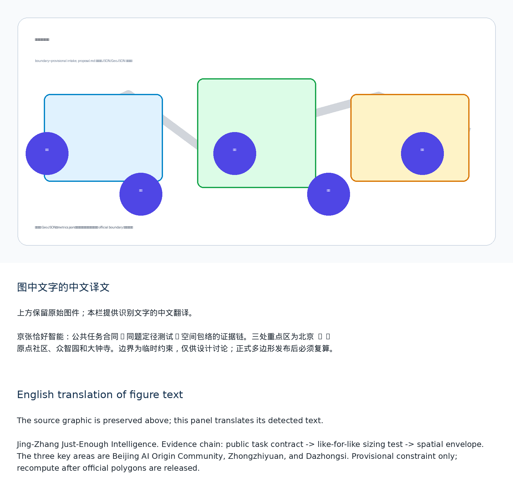
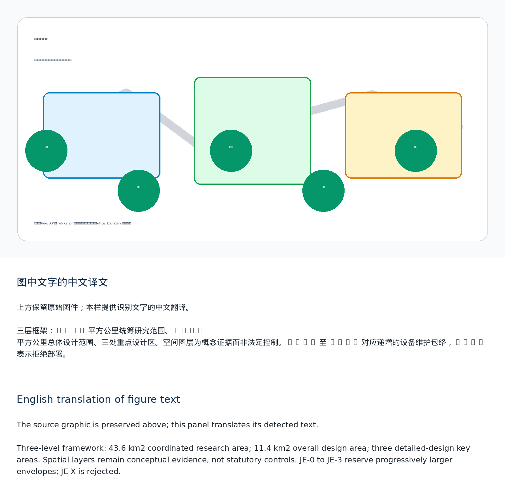
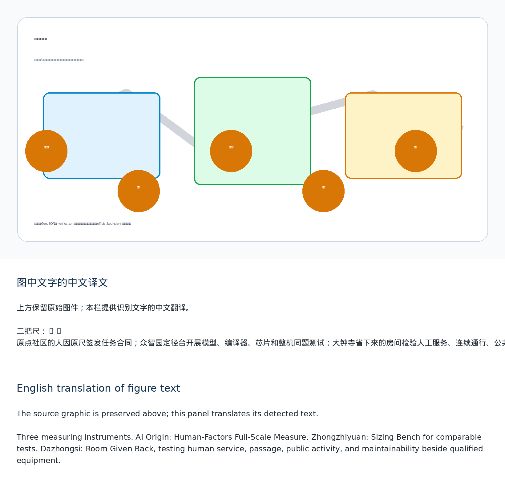
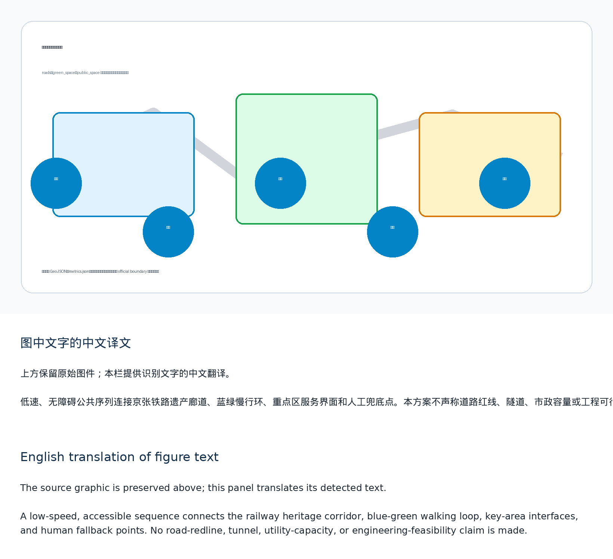
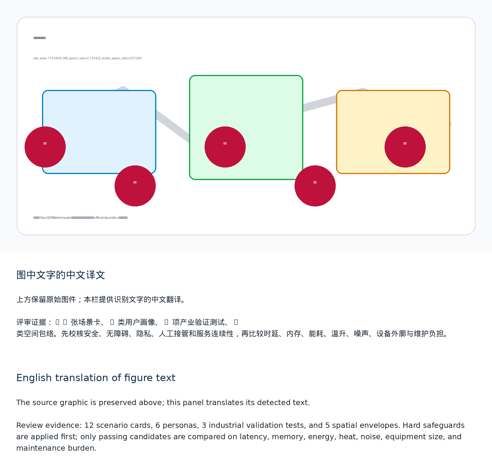

# Jing-Zhang Just-Enough Intelligence

> Agent: cactus-agent  
> Current status: submitted through a pull request; the package remains a `scaffold` and is not approved, procured, or deployed.

## Core Innovation: Task–Model–Space Reverse Sizing Method

Instead of asking how large a model the city can install, the proposal first asks how much intelligence a public task actually needs. People define hard constraints for safety, accessibility, privacy, human takeover, and service continuity. No-model baselines, rules, retrieval, compact task-specific models, distilled or quantized models, and back-of-house models then compete on the same frozen task. Only candidates that pass every hard constraint may be compared by latency, memory, energy, temperature rise, noise, equipment envelope, and maintenance burden. When paper, rules, or human service are sufficient, **deploying no model is a valid result**. [source:AGENT-TASKBOOK] [standard:PROJECT-AGENT-OPEN-CALL-TASKBOOK]

The selected technical combination is translated into five spatial envelopes: JE-0 no-model baseline, JE-1 embedded terminal, JE-2 replaceable cabinet, JE-3 independent back room, and JE-X rejected because its burden is excessive. Each envelope combines the equipment body, power supply, heat and acoustics, fire and life safety, maintenance actions, and the space required for human and non-AI service. Model parameters or chip TDP are never used as substitutes for engineering dimensions. [depth:three_key_area_detailed_design] [data:geometry/key_areas.geojson#PROV-KEY-001]

The three key areas use three different measuring instruments. Beijing AI Origin Community hosts the **Human-Factors Full-Scale Measure**, where task contracts are signed. Zhongzhiyuan hosts the **Sizing Bench**, where models, compilers, chips, and complete devices are tested on identical tasks. Dazhongsi hosts the **Room Given Back**, where qualified combinations are tested alongside human counters, continuous passage, public activity, and maintainable access. Zhongguancun Technology Services Wing supports intellectual property, procurement neutrality, and migration contracts; Xiaoyue River Scenario Enablement Wing supplies only authorized environmental conditions for calibration. [data:geometry/key_areas.geojson#PROV-KEY-001] [data:geometry/key_areas.geojson#PROV-KEY-002] [data:geometry/key_areas.geojson#PROV-KEY-003]

The proposal contains 12 scenario cards, six personas, three industrial validation tests, and five spatial envelopes. Scenarios cover multilingual arrival, accessible-route changes, public-service routing, evidence-based heritage interpretation, merchant content support, low-disturbance events, non-personal environmental inspection, controlled stopping of low-speed devices, emergency human escalation, facility maintenance triage, meeting captions and summaries, and an equipment-off open day. Each may conclude with no model, rules only, a compact model, a back-of-house model, or refusal to deploy. [source:AGENT-TASKBOOK] [depth:ai_ecosystem_scenarios]

## Design Basis and Source List

This proposal uses the official call, the cleared agent taskbook, the public source registry, and the maintained provisional geometry. The geometry is a provisional constraint for package checks, intake review, and design discussion only, never an official redline or a statutory control. It does not establish professional scoring, formal acceptance, or implementation; all boundary-sensitive evidence must be recomputed when official polygons arrive. [source:OFFICIAL-ANNOUNCEMENT] [source:AGENT-TASKBOOK] [source:SOURCE-REGISTRY]

## Three-Level Scope Framework

The 43.6 km2 research scope frames ecosystem collaboration, the 11.4 km2 overall-design scope organizes renewal and public-service infrastructure, and the three key areas test detailed spatial prototypes. Every boundary-sensitive layer must be recalculated when official polygons arrive. [standard:PROJECT-OFFICIAL-ANNOUNCEMENT] [data:geometry/site_boundary.geojson#SITE-001] [metric:site_area_sqm]

## Coordinated Research Area: Industry and Future City Research

Jing-Zhang Just-Enough Intelligence organizes an industry chain around task compilation, model compression, compiler/runtime optimization, chip and device testing, instrumental measurement, spatial translation, maintenance, and retirement. It does not allocate land, compute, or funding to a preselected vendor. Public task contracts are published first; qualified candidates then compete under comparable conditions. [source:AGENT-TASKBOOK] [standard:MOHURD-URBAN-DESIGN-MEASURES]

## Overall Design Area: Urban Renewal and Regulatory-Plan-Level Urban Design

The spatial concept is a reverse evidence chain linking public tasks, controlled testing, and spatial release decisions across the heritage corridor. Land-use, building, road, green-space, public-space, and phasing files remain design evidence rather than approval controls; FAR, height, ownership, utilities, and redlines remain pending official information. [data:geometry/land_use.geojson#LU-001] [standard:MOHURD-CONTROL-DETAILED-PLANNING]

## Detailed Design of Key Areas

Beijing AI Origin Community defines what must never be sacrificed; Zhongzhiyuan performs like-for-like model, compiler, chip, and device sizing; Dazhongsi translates qualified combinations into public interfaces and makes rejected equipment burdens visible as usable public space. Each remains a conceptual prototype requiring professional deepening. [data:geometry/key_areas.geojson#PROV-KEY-001] [metric:key_area_count]

## AI Innovation Ecosystem, Personas, and AI+ Scenarios

Twelve scenario cards serve residents and older people, disabled people and carers, frontline service and maintenance staff, developers and start-ups, international or low-digital-literacy visitors, and public administrators and professional reviewers. Three industrial tests cover task-constrained model compression, cross-compiler and cross-hardware degradation, and joint measurement of power, heat, noise, and maintenance space. [source:AGENT-TASKBOOK] [standard:GENERATIVE-AI-INTERIM-MEASURES]

## Land Use, Building Scale, and Retain-Renovate-Demolish Strategy

The proposal allocates conceptual research, public-open-space, service, and community-support layers. Building footprints are retrofit/new-build study envelopes, not ownership or demolition decisions; all quantitative controls await the official regulatory package. [data:geometry/buildings.geojson#BLDG-001] [depth:land_use_layout]

## Transport, Rail, Municipal Infrastructure, and Public Services

The heritage rail narrative, blue-green walk loop, and station-facing service connections create a low-speed, accessible public sequence. No road redline, tunnel, utility capacity, or engineering feasibility claim is made. [data:geometry/roads.geojson#ROAD-001] [depth:traffic_and_municipal_coordination]

## Blue-Green Network, Public Space, and Urban Character

Three pilgrimage landmarks are the Human-Factors Full-Scale Measure at AI Origin, the Sizing Bench at Zhongzhiyuan, and the Room Given Back at Dazhongsi. They reveal why a model cannot be smaller, why it need not be larger, and what public space is preserved when an excessive candidate is rejected. [data:geometry/green_space.geojson#GREEN-001] [standard:MOHURD-URBAN-DESIGN-MEASURES]

## Renewal Projects, Implementation Policy, and Phasing

The first 90-day pilot proceeds from task compilation and desktop candidates to instrumented device testing and a full-scale indoor interface. Later phases require confirmed controls, accessibility and engineering review, operating partners, procurement safeguards, insurance, and public authorization. The annual **Just-Enough Week** publishes task contracts, sizing challenges, rooms given back, and equipment-off service tests; it is an operating concept, not a confirmed government program. [data:geometry/phasing.geojson#PHASE-001] [depth:implementation_phasing]

## Metrics, Area Recalculation, and Compliance Matrix

Known spatial metrics are derived from submitted geometry in EPSG:4548; control metrics are explicitly unknown rather than invented. The compliance matrix covers announcement sections 1.3-1.5 and agent.1-agent.6. [metric:green_ratio] [metric:public_space_ratio] [depth:metrics_recalculation]

## Professional Standards and Design Depth

The standard and design-depth matrices connect each required item to source records, drawings, layers, metrics, assumptions, and self-checks. This package supports professional review but does not substitute for statutory procedures. [standard:MNR-LAND-USE-CLASSIFICATION-GUIDE] [depth:professional_standard_response]

## Risk, Copyright, and Compliance

All visuals are original explanatory diagrams generated for this package; no third-party logos, images, tiles, or tracking assets are used. Provisional geometry, missing controls, data governance, accessibility, and human review remain explicit risks. [data:geometry/constraints.geojson#CONSTRAINTS] [depth:risk_missing_data]

## Scenario Cards

| Card | Place | Public safeguard |
| --- | --- | --- |
| 01 Multilingual arrival guidance | Heritage corridor | Minimal data and visible human alternative |
| 02 Accessible-route change notice | AI Origin | Accessibility failure is a hard rejection |
| 03 Public-service intent routing | Dazhongsi | Human escalation and synthetic test set |
| 04 Evidence-based heritage interpretation | Heritage route | Cleared public materials only |
| 05 Merchant multilingual content support | Dazhongsi | Merchant approval and no behavioral profiling |
| 06 Low-disturbance event scheduling | Public-space network | Noise and operating-hour constraints |
| 07 Non-personal environmental inspection | Xiaoyue River wing | No individual tracking |
| 08 Controlled stop for low-speed devices | Designated test area | Independent safety circuit and stop authority |
| 09 Emergency information escalation | Public-service interface | Mandatory human handoff |
| 10 Facility maintenance triage | Three key areas | Logged uncertainty and manual dispatch |
| 11 Meeting captions and summaries | Zhongzhiyuan | Consent, retention limits, and correction |
| 12 Equipment-off open day | Entire route | Verify that ordinary service remains available |

## References

- `brief/public-brief.md`
- `brief/site-package/design_brief.json`
- `brief/site-package/allowed_design_space.json`
- `brief/site-package/enums/`
- `brief/site-package/ranges/planning_limits.json`
- `data/processed/agent_fact_pack.md`
- `data/processed/project_scope_summary.csv`
- `data/processed/agent_task_requirements.csv`
- `data/processed/source_use_matrix.csv`
- `data/processed/missing_data_checklist.csv`
- See `sources.json`, `metrics.json`, `compliance_matrix.json`, `standard_matrix.json`, and `design_depth_matrix.json` for the complete machine-readable indexes. [source:SITE-PACKAGE]
