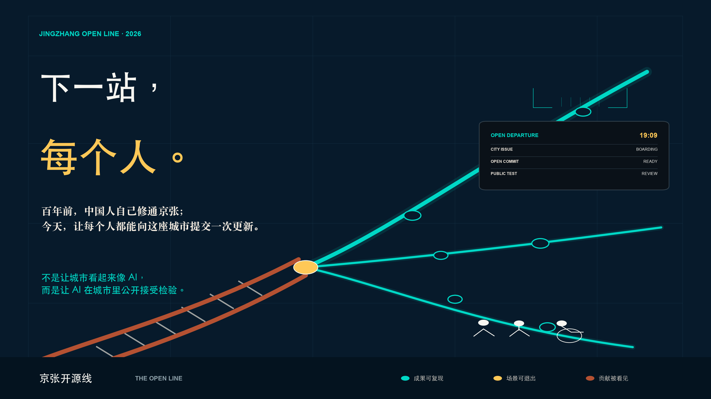
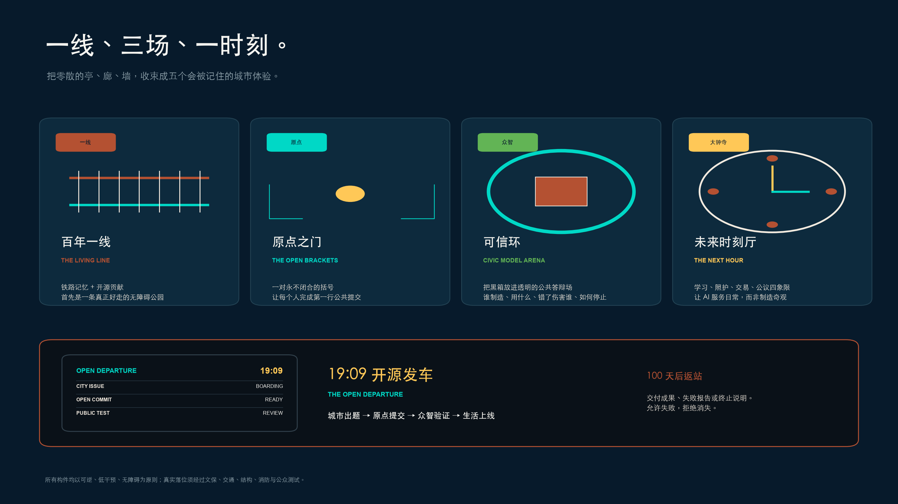
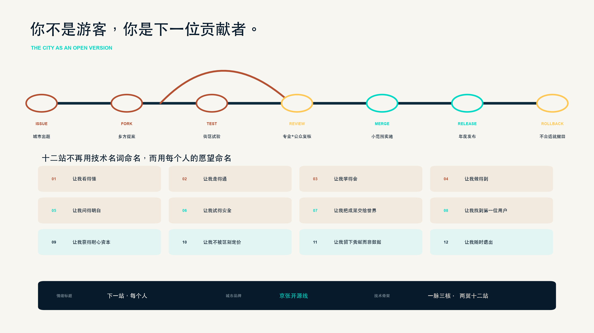
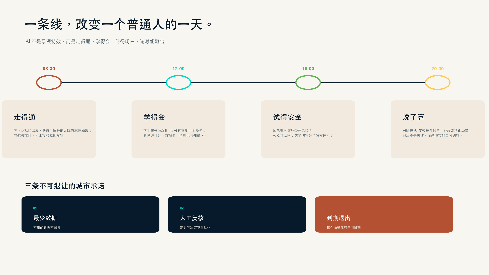
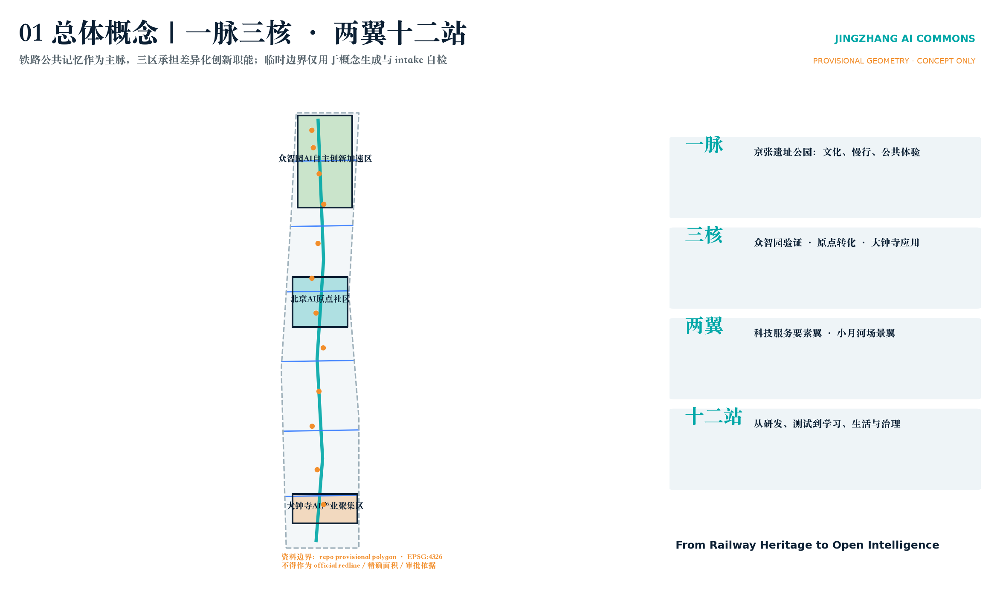
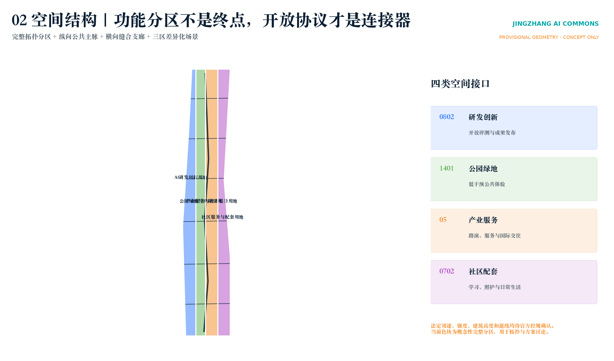
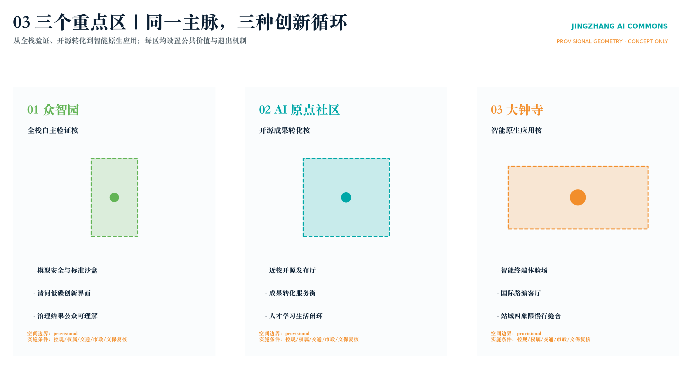
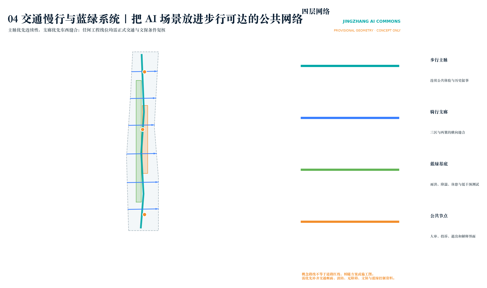
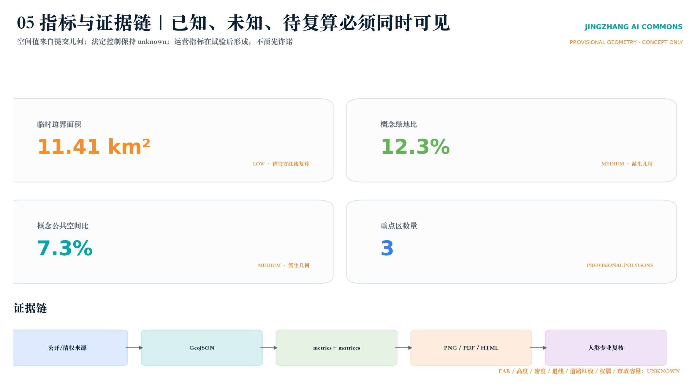

# 下一站，每个人：京张开源线

> **百年前，中国人自己修通京张；今天，让每个人都能向这座城市提交一次更新。**

## 一句话方案

**不是让城市看起来像 AI，而是让 AI 在城市里公开接受检验。**

1909 年，京张铁路建成通车。这条由中国人自主勘测、设计、施工和管理的干线铁路，让一个时代相信：通往未来的路，可以由我们自己建造。[source:JINGZHANG-1909] 百年以后，海淀已经拥有密集的科研、模型、技术交易与人才基础，但 AI 仍常被锁在实验室、发布会和少数人才能读懂的界面里。[source:HAIDIAN-2025-STATS]

因此，本方案不再以“科技园区”作为终点，而提出一条公众看得见、走得进、能参与、也能说“不”的 **京张开源线 / THE OPEN LINE**：让模型从屏幕上下车，陪老人找到一条更安心的就医路线，帮孩子识别一段不可信的生成内容，让小店主获得不侵犯顾客隐私的智能服务，也让开发者第一次看见自己的一行代码如何成为城市公共价值。

当一个人走完京张铁路遗址公园，他不应只拍下一座地标。他可以留下一个城市问题、试用一次公共服务、否决一个不合适的方案，或提交一项让街区变得更好的开源贡献。**你不是游客，你是下一位贡献者。**

## 从技术口诀到城市记忆：一线、三场、一时刻

“一脉三核、两翼十二站”继续作为规划与数据层的技术骨架；面向公众和评委，则收束为一个可以被一口复述的城市体验：**一线、三场、一时刻**。[data:geometry/roads.geojson#ROAD-001] [data:geometry/key_areas.geojson#PROV-KEY-001] [depth:overall_spatial_structure]

| 城市记忆 | 空间落点 | 第一眼画面 | 日常功能 | 可信 AI 边界 |
| --- | --- | --- | --- | --- |
| 一线：百年一线 / THE LIVING LINE | 京张铁路遗址公园公共主脉 | 一条锈红历史轨与一条电青贡献轨并行生长 | 无障碍慢行、开发者散步、历史导览、开源成果阅读 | 不做人脸、步态、设备 ID 和连续定位；数字系统关闭后仍是一条好公园 |
| 三场之一：原点之门 / THE OPEN BRACKETS | AI 原点社区 | 一对永不闭合、向城市敞开的巨大括号 | 第一行代码桌、开源门诊、阶梯讲堂、版本墙 | 贡献可实名、署名或匿名；无流量、财富和模型规模排行榜 |
| 三场之二：可信环 / CIVIC MODEL ARENA | 众智园—清河公共界面 | 透明“黑箱”置于圆形公共答辩场中央 | 模型公开答辩、风险卡演示、红队课程、市民听证 | 公共区只用开放、合成或充分授权数据；高风险决定保留物理停机与人工接管 |
| 三场之三：未来时刻厅 / THE NEXT HOUR | 大钟寺站城公共界面 | 学习、照护、交易、公议组成一面城市钟盘 | 多语言问询、AI+医疗转介、夜校、商户共创和国际路演 | 无被动麦克风、无脸部识别、无个性化广告、无动态差别定价 |
| 一时刻：19:09 开源发车 / THE OPEN DEPARTURE | 一线与三场同步响应 | 铁路出发牌翻到“城市出题”，低亮度信号沿线传递 | 年度公共议题启动；100 天后返站交付成果、失败报告或终止说明 | AI 只辅助整理、匹配与翻译，不决定获胜者或自动批准上线 |

“19:09”取自京张铁路 1909 年建成通车的历史年份，是一个克制而可等待的城市时间码，不是全天候灯光秀。[source:JINGZHANG-1909] 每年全球共创周开幕日 19:09，四处“出发牌”同步进入 **城市出题—原点提交—众智验证—生活上线**；100 天后同一时刻公开返站。项目可以成功，也可以停止，但不能悄悄消失：**允许失败，拒绝消失。**

## 把 GitHub 的协作逻辑真正变成城市制度

京张开源线不是把代码术语贴在景观牌上，而是让城市更新像开源软件一样留下版本、审查和撤回记录：**发现问题 Issue → 多方提案 Fork → 街区沙盒 Test → 专业与公众 Review → 小范围实施 Merge → 年度发布 Release → 不合适则撤回 Rollback**。原方案中的开放协议、场景沙盒、人工复核和退出机制因此获得一套人人可理解的城市叙事。[source:AGENT-TASKBOOK] [depth:phasing_implementation]

十二站也不再首先以技术功能命名，而以十二个真实愿望出现：**让我看得懂、让我走得通、让我学得会、让我做得到、让我问得明白、让我试得安全、让我把成果交给世界、让我找到第一位用户、让我获得耐心资本、让我不被区别定价、让我留下贡献而非数据、让我随时退出。** 每个愿望再映射到既有的医疗、教育、商业、交通、开源、评测和资本服务场景，既保留专业完整性，也让普通人知道这条创新带与自己有什么关系。[depth:public_service_facilities]

## 一个普通人的一天，就是未来生活的剖面

08:30，一位老人从社区出发，使用可解释的无障碍就医路线；当道路条件变化，人工接驳立即接管。12:00，一名学生在开源成果廊用 15 分钟复现一个模型，同时看见许可证、数据卡和已知错误。16:00，一支团队在众智园可信环公开风险卡，回答“谁制造、用什么数据、错了伤害谁、如何立即停止”。20:00，居民在 AI 夜校投票决定场景保留、修改或终止。技术在这里不是景观特效，而是一种必须解释自己、接受纠正的街坊。[data:geometry/public_space.geojson#PUBLIC-001] [depth:municipal_new_infrastructure]

三条承诺贯穿全部场景：**最少数据——不用的数据不采集；人工复核——高影响决定不自动化；到期退出——每个场景都有停用日期。** 这三条承诺既是视觉系统中的电青、人工确认黄与铁路锈红，也是方案从品牌、空间到运营始终不变的公共价值协议。

## 技术总纲：京张智脉 / JINGZHANG AI COMMONS

“京张智脉”不是一条以科技装饰公园的走廊，而是一套把城市空间当作公共创新基础设施的开放协议。总体结构是“一脉、三核、两翼、十二站”：京张遗址公园承担南北公共记忆与慢行主脉；众智园、AI原点社区、大钟寺分别承担全栈验证、开源转化、智能原生消费三类核心职能；中关村科技服务翼和小月河场景赋能翼提供资本/知识产权服务与公共场景入口；十二类 AI 场景站将研发、测试、展示、学习、生活与治理串成可重复运营的日常路线。[source:OFFICIAL-ANNOUNCEMENT] [source:AGENT-TASKBOOK] [depth:overall_spatial_structure]

空间策略不依赖一次性大拆大建，而采用“先协议、再场景、后空间”的次序：先建立数据最小化、风险分级、人工复核和退出机制；再用可撤除设施、开放时段和预约沙盒验证公共价值；最后由专业团队结合官方红线、控规、权属、交通、市政和文保条件决定是否进入工程深化。这样既回应 AI 产业迭代快的特征，也避免用短周期技术热度绑架长期城市资产。[standard:MOHURD-CONTROL-DETAILED-PLANNING] [depth:phasing_implementation] [data:geometry/phasing.geojson#PHASE-001]

品牌识别升级为“道岔 + 轨枕 + 开放括号”：锈红钢轨代表自主筑路的历史，电青分支代表城市允许多种方案并行试验，黄色道岔代表人工与公众 Review，永不闭合的括号代表任何人仍可继续贡献。主传播语为 **下一站，每个人 / NEXT STOP: EVERYONE**；城市品牌为 **京张开源线 / THE OPEN LINE**；“京张智脉”保留为规划技术体系名称。标志使用系统无衬线字与原创几何，不嵌入任何企业商标。[standard:PROJECT-AGENT-OPEN-CALL-TASKBOOK] [depth:height_massing_character]

海淀 2025 年公报记录全区 92 家全国重点实验室、123 款备案上线大模型、5.79 万项技术合同及 4053.1 亿元技术合同成交额；这些区级数据仅证明“策源—转化—开放协作”具有区域基础，不用于推断本项目红线内企业数量、产值或建设规模。[source:HAIDIAN-2025-STATS] 国家统计局公报显示全国 2025 年 R&D 经费 39262 亿元、投入强度 2.80%；本方案因此把研发投入之外的“开放验证、公共可理解、人才日常体验”作为城市空间需补齐的转化环节，而不把全国数据机械下分到海淀或项目地块。[source:NBS-2025]

### 六个全球案例的可转化机制

| 案例 | 可借鉴机制 | 京张转译 | 不照搬的部分 |
| --- | --- | --- | --- |
| Kendall Square, Cambridge | 创新区与混合社区、公共开放空间同步治理 | 将研发节点与社区学习、慢行和首层公共界面绑定 | 不复制其用地强度和市场结构 [source:CASE-KENDALL] |
| STATION F, Paris | 以统一入口整合多类加速计划和服务伙伴 | 原点社区建立“开源项目—测试—路演—服务”一站式入口 | 不把单体巨构当作必要条件 [source:CASE-STATION-F] |
| one-north, Singapore | 科研、产业、孵化和公共生活形成多节点网络 | 三区分工、两翼供给要素，主脉承担公共共享 | 不复制新城式整体开发 [source:CASE-ONE-NORTH] |
| Knowledge Quarter, London | 多机构通过联盟共同行动，而非单一业主统筹 | 用年度议题与共享日历连接高校、园区、文化设施和社区 | 不假设既有机构已经签约 [source:CASE-KQ] |
| Barcelona 22@ | 工业记忆、创新产业、住房服务和公共空间共同更新 | 把铁路遗产作为创新文化的时间骨架，而非科技布景 | 不转用其法定更新指标 [source:CASE-22AT] |
| Punggol Digital District | 开放数字平台和数字孪生支持安全试验 | 建立“虚拟验证—小范围线下测试—人工复核—退出”四级沙盒 | 不采集超出服务目的的个人数据 [source:CASE-PUNGGOL] |

### 三类重点区与十二个 AI 场景站

十二站对应真实的空间类型，而非指定地块工程：开源发布厅、安全治理沙盒、端侧算力驿站、可解释慢行导航、大钟寺国际路演客厅、清河低碳创新廊、近校成果转化街、数据要素会客厅、AI 生活服务样板街、全球 AI 活动周路线、无障碍多模态服务站、全民 AI 夜校。每一站均采用“明确服务对象—最少必要数据—人工复核—可撤除设施—独立评估—到期退出”模板。[data:geometry/public_space.geojson#PUBLIC-001] [data:geometry/roads.geojson#ROAD-001] [depth:public_service_facilities]

三项产业测试验证场景构成最小可执行闭环：T1 模型安全与公共表达测试在众智园进行封闭数据评测和公众可理解展示，输出风险卡而非认证结论；T2 无障碍多模态导航在主脉选择小范围、短周期、志愿者同意的路线测试，保留人工引导和随时退出；T3 智能终端与内容交互测试在大钟寺室内/半室内运营空间开展，设备不得进入未授权公共区域，测试结果经人审后才能公开。三者均是概念建议，需由责任主体完成伦理、数据、安全、消防、交通与场地审批后方可试行。[source:AGENT-TASKBOOK] [depth:municipal_new_infrastructure]

### 三个朝圣地标与文化叙事

“原点刻度”以年度公开贡献形成可更新的地面时间轴；“开源信号塔”把模型、数据集、工具与公共服务贡献转译为不含商业排名的灯光/文字信息；“百年共创站”以铁路站台、轨枕和时刻表语汇展示从工程自主到开源智能的连续历史。三者均为可撤除、低干预的公共空间组件概念，不占用文保控制线，不使用企业 Logo，不把人脸或个体轨迹做成展示内容。[standard:MOHURD-URBAN-DESIGN-MEASURES] [depth:blue_green_public_space]

文化叙事以“工程连接—知识连接—智能连接”为三幕：京张铁路证明基础设施可以重塑区域联系；中关村文化证明知识协作可以缩短成果转化；AI 新文化必须证明技术进步能被公众理解、质疑和共同修正。导视系统把历史年份、开放贡献和风险边界同时呈现，让“朝圣”从观看技术奇观转向理解公共创新如何形成。

### 长期运营：一张公开日历、三类会员、四道闸门

年度日历由春季“开源协议月”、夏季“城市场景季”、秋季“全球 AI 共创周”、冬季“公共价值审计”构成；开发者、社区/学校、企业/机构三类会员拥有不同的场景提案与复核权，但不形成排他性招商资格。场景进入城市空间前依次通过数据许可闸、伦理与安全闸、场地与专业闸、公众反馈与退出闸。每个项目公布目标、数据字典、责任人、试验期、投诉渠道和终止条件；评估指标以可达性、问题解决率、人工复核率、退出响应时间和公共满意度为主，不以曝光量替代公共价值。[depth:renewal_project_list] [source:AGENT-TASKBOOK]

## 六项任务深化包

以下六项把总体概念拆为“空间原型 + 服务流程 + 运营规则 + 评估指标”。所有尺寸、路线和点位均为设计原型或空间类型建议，不是工程定位；实际落位必须以 official polygons、控规、权属、道路、市政、消防、无障碍和文保复核为前置条件。[source:BOUNDARY-SOURCE] [source:KEY-AREA-SOURCE] [depth:risk_missing_data]

### 01 总体概念、命名体系与视觉规范

品牌架构分五级。一级情绪标题为“下一站，每个人 / NEXT STOP: EVERYONE”；二级城市品牌为“京张开源线 / THE OPEN LINE”；三级规划技术体系为“京张智脉 / JINGZHANG AI COMMONS——一脉三核、两翼十二站”；四级旗舰空间为“百年一线、原点之门、可信环、未来时刻厅”；五级服务与活动为“开源门诊、城市场景季、全球共创周、19:09 开源发车、公共价值审计”。这种架构让一张海报、一处地标、一次活动和一套专业图纸共享同一个故事，同时避免把某一企业或技术路线固化为城市品牌。[standard:PROJECT-AGENT-OPEN-CALL-TASKBOOK]

| 视觉要素 | 规范 | 空间应用 | 禁止方式 |
| --- | --- | --- | --- |
| 核心符号 | “道岔 + 轨枕 + 开放括号”：历史轨进入人工 Review 节点，再分成可测试、可合流、可撤回的城市版本 | 门户、导视、发车牌、网页页眉、贡献凭证 | 不与企业 Logo 拼接，不做拟官方徽记 |
| 基底色 | 京张夜蓝 `#071A2B`、档案纸白 `#F2EADF` | 主视觉、展板、历史档案和实体说明 | 不用蓝紫渐变制造泛科技感 |
| 叙事色 | 铁路锈红 `#B45132`、开源电青 `#00D8C6`、人工确认黄 `#FFC857` | 锈红只讲历史，电青只讲未来，黄色只标人工确认、风险和退出 | 不以高饱和霓虹替代照明设计；红绿不得成为唯一状态编码 |
| 字体 | 中文采用系统黑体，英文采用系统无衬线；数字使用等宽数字样式 | 导视、展板、离线网页 | 不嵌入未授权商业字体 |
| 图标 | 2px 等线、圆角端点、图标下方必须配文字 | 医疗、教育、商业、无障碍、数据许可 | 不使用仅专家可懂的抽象 AI 符号 |
| 可读性 | 正文与底色对比度按 WCAG AA 方向校核；关键信息同时使用颜色、形状、文字 | 夜间导视、移动端、低视力模式 | 不以动态闪烁承担核心信息 |

线下触点采用 600mm 模数的可拆装信息构件方向：S 级是路口/入口识别，M 级是场景说明与投诉入口，L 级是展廊和荣誉墙。模数只用于概念排版和构件族协调，最终结构、材料、尺寸与基础形式需由建筑、景观和结构专业深化。[depth:height_massing_character] [data:geometry/public_space.geojson#PUBLIC-001]

### 02 从基础研究到资本服务的创新生态

创新生态不是“企业名单”，而是一条有退出条件的七级转化链：基础研究提出问题，开放源代码与数据形成可复用知识，验证沙盒证明安全性和公共价值，孵化器完成产品/组织验证，产业伙伴提供真实需求，科技服务翼提供知识产权、法律、标准和人才服务，资本服务只在证据充分后进入扩展阶段。每一级都输出可审计材料，失败项目也沉淀负结果与风险经验，避免重复试错。[source:HAIDIAN-2025-STATS] [source:NBS-2025]

| 阶段 | 主要空间载体 | 核心服务 | 进入下一阶段的证据 | 海淀空间分工 |
| --- | --- | --- | --- | --- |
| R0 基础研究 | 高校院所协作接口、开放研讨室 | 课题发现、跨学科组队、研究伦理 | 问题定义、权利边界、复现计划 | AI 原点社区连接高校策源 |
| R1 开放知识 | 开源发布厅、贡献档案库 | 代码/模型/数据卡、许可证辅导 | 可复现包、模型卡、数据说明 | 原点开源里承担首发与维护 |
| R2 安全验证 | 受控评测室、公众解释厅 | 红队、安全、偏差、能耗与可理解性测试 | 风险卡、人工复核方案、退出条件 | 众智园形成全栈验证核 |
| R3 产品孵化 | 可变工坊、共享测试单元 | 产品、团队、用户问题验证 | 明确用户、责任主体、服务水平 | 三区共享孵化资源池 |
| R4 场景试验 | 医疗/教育/商业街区原型 | 小范围、短周期、可撤回试点 | 同意记录、过程日志、独立评估 | 小月河翼与公共主脉提供入口 |
| R5 产业协作 | 大钟寺路演客厅、产业共创室 | 供应链对接、采购验证、国际传播 | 合规尽调、真实订单或合作意向 | 大钟寺形成智能原生应用核 |
| R6 资本与规模化 | 科技服务翼专业服务节点 | 知产、法务、财务、标准、耐心资本对接 | 审计材料、单位经济性、风险准备 | 中关村科技服务翼支撑全链路 |

生态运营建议采用“开放联盟 + 专业秘书处 + 三类评审池”：开放联盟确定年度公共议题；秘书处维护项目管线、空间日历和证据库；技术、伦理/公众、空间/安全三类评审池分别把关。资本服务不得前置替代技术和公共价值判断，任何基金、补贴、场地优惠或采购安排都只能在责任主体和政策程序明确后另行形成，不构成当前承诺。[source:CASE-KENDALL] [source:CASE-STATION-F] [source:CASE-ONE-NORTH] [source:CASE-KQ] [source:CASE-22AT] [source:CASE-PUNGGOL]

建议监测“转化质量”而非只统计融资额：可复现项目比例、完成风险卡比例、从研究到首个合规试点的周期、试点终止后数据删除完成率、社区参与者结构、跨区协作项目数、失败经验公开率、进入规模化后仍保留人工复核的项目比例。指标需在运营主体建立数据字典后才可形成基线，不在本方案中虚构目标值。[depth:metrics_recalculation]

### 03 AI+医疗、教育、商业与未来生活场景

场景以“具体空间类型—明确使用者—最少数据—人在回路—退出条件”落地。医疗不做无资质诊断，教育不以未成年人画像换取效率，商业不使用人脸识别或个体轨迹进行差别定价。十二张场景卡如下：[source:AGENT-TASKBOOK] [depth:public_service_facilities]

| 编号 / 领域 | 街区空间与主要用户 | 服务流程 | 数据与人审边界 | 退出条件 |
| --- | --- | --- | --- | --- |
| M1 社区健康导航 | 社区服务首层；居民、老人、访客 | 自述需求—公共信息匹配—人工确认—预约/转介 | 仅保存完成服务所需字段；不作诊断 | 错误转介率或投诉超阈值即暂停 |
| M2 无障碍就医路线 | 主脉接驳点；行动不便者、陪护 | 出发前路线检查—现场提示—人工协助 | 志愿同意；不持续追踪 | 无人工备援或道路条件变化即关闭 |
| M3 临床创新验证前厅 | 众智园受控室内；研发/医务专业人员 | 合规材料预审—脱敏测试—专家复核 | 不接触公开空间真实患者数据 | 伦理、数据或医疗责任不清即终止 |
| E1 开源课程工坊 | AI 原点社区；高校师生、开发者 | 公开课程—现场实践—作品复现—同行反馈 | 学习记录默认本地/匿名；可删除 | 无清权教材或无教师复核即下架 |
| E2 AI 夜校 | 社区文化设施；居民、就业转型者 | 能力诊断—分层学习—真实任务—人工辅导 | 不进行就业歧视性评分 | 课程偏差或投诉未闭环即调整 |
| E3 青少年模型素养站 | 学校/公园预约空间；学生、家长、教师 | 识别生成内容—验证来源—讨论风险 | 禁止未成年人商业画像 | 无监护/学校授权或内容风险即取消 |
| C1 智能商业助理台 | 大钟寺公共商业界面；商户、顾客 | 商品/服务问答—人工确认—交易跳转 | 不采集人脸；推荐可解释、可关闭 | 出现差别定价或误导即停用 |
| C2 国际路演客厅 | 大钟寺室内/半室内；企业、投资人与公众 | 双语展示—尽调问答—服务转介 | 企业材料清权后展示 | 信息过期或权利人撤回即下线 |
| C3 小微商户共创站 | 街区共享空间；小商户、创业者 | 需求诊断—工具培训—小规模试用 | 商业数据由商户控制 | 不能导出/删除数据即不得上线 |
| P1 可解释慢行导航 | 遗址公园主脉；居民、游客 | 路线建议—风险提示—现场人助 | 只用聚合路况，不记录个体轨迹 | 路况、施工或文保条件改变即更新 |
| P2 公共空间维护助手 | 公园运营后台；养护人员、公众 | 公众报修—分类—人工派单—结果公开 | 图片自动脱敏，人工决定处置 | 误报高或责任不清即降级人工 |
| P3 贡献荣誉系统 | 展示廊/荣誉墙；开发者、公众 | 提名—证据核验—公众说明—限期展示 | 展示公开贡献，不做人身排名 | 证据失效、争议未解或权利人撤回 |

未来生活按一天的节奏组织：早高峰通过可解释慢行和无障碍接驳进入创新带；午间在开放发布厅观看 15 分钟成果演示；下午由研发团队在受控沙盒完成评测；傍晚居民在 AI 夜校学习并对公共场景提出修改；夜间商业街提供不依赖生物识别的多语言服务。场景密度服从公共空间承载、噪声、消防和居民生活，不以“全天候科技秀”替代正常城市生活。[data:geometry/roads.geojson#ROAD-001] [data:geometry/buildings.geojson#BLDG-001]

### 04 京张铁路遗址公园公共空间与 AI 地标

公共空间形成“一道五段七节点”。“一道”是开发者散步道：沿主脉串联历史、开源、验证、生活与全球交流；“五段”依次为铁路记忆段、原点开源段、跨界协作段、生活实验段、国际会客段；“七节点”是百年共创站、原点刻度、开源成果展示廊、模型透明亭、智能体贡献荣誉墙、城市问题发布台、全球开发者会客厅。路线长度和具体穿越方式待 official boundary、文保和交通资料确认。[standard:MOHURD-URBAN-DESIGN-MEASURES] [data:geometry/green_space.geojson#GREEN-001]

| 空间原型 | 细节构成 | 日常使用 | 技术与安全边界 |
| --- | --- | --- | --- |
| 开发者散步道 | 轨枕节奏铺装方向、每段主题色、低位导览与休息点 | 步行会议、代码漫步、公众导览 | 不改变文保本体；断点和跨路需交通专项 |
| 开源成果展示廊 | 可拆展框、二维码/短链、离线摘要、版本日期、许可证标签 | 月度项目更新、学校课程、国际访客 | 无许可证/风险卡不得展示；不依赖远程屏幕才能阅读 |
| 模型透明亭 | 模型卡、数据卡、能耗/偏差说明、人工申诉入口 | 公众理解模型边界、开发者答疑 | 不展示敏感数据；不把评测结果包装成官方认证 |
| 智能体贡献荣誉墙 | 贡献类型、证据链接、同行复核、到期复审 | 记录代码、数据、公共服务和负结果贡献 | 不按财富/流量排名；允许纠错、撤回和争议标记 |
| 城市问题发布台 | 公共议题卡、责任边界、征集周期、结果回流 | 居民提出问题、团队认领、公开复盘 | 不收集身份证明或无关个人数据 |

三个主地标承担不同记忆：百年共创站讲“工程连接”，原点刻度讲“知识连接”，开源信号塔讲“智能连接”。夜景只表达低频状态与活动引导，避免高亮动态屏对居民、鸟类和遗产环境产生干扰。所有构件建议先做 1:1 可撤除样机，经无障碍、消防、结构、视线、照明、文保与公众测试后再决定保留。[depth:blue_green_public_space] [depth:traffic_rail_slow_parking]

### 05 百年铁路—中关村—AI 新文化叙事与导览

叙事主题为“连接的三次跃迁”：第一幕“钢轨连接城市”，讲京张铁路的工程自主与现代化；第二幕“知识连接世界”，讲中关村从科研教育到市场转化的协作文化；第三幕“智能连接每个人”，强调 AI 必须可理解、可质疑、可纠错。三幕共同回答：创新不是单个英雄或企业的神话，而是基础设施、公共制度与持续贡献共同形成的能力。[source:OFFICIAL-ANNOUNCEMENT]

文化导览采用“七站两种时长”。60—90 分钟公共路线依次经过百年共创站、铁路工程档案窗、原点刻度、开源成果展示廊、模型透明亭、贡献荣誉墙、全球开发者会客厅；半日专业路线增加众智园验证工作坊、原点社区开源发布和大钟寺场景体验。具体距离、出入口和无障碍连续性待正式底图复核。

每站采用四层内容：第一层为 30 秒可读的中英标题；第二层为 3 分钟事件/人物/技术背景；第三层为可验证来源与版权说明；第四层为“今天我能贡献什么”的行动入口。历史内容由文史专业复核，技术内容由开源项目维护者复核，公共价值内容邀请社区代表参与。导览不使用未经授权的肖像、商标或论文图片，不把生成式插画当作历史证据。[standard:PROJECT-OFFICIAL-ANNOUNCEMENT] [depth:existing_conditions_diagnosis]

### 06 全球活动体系与长期运营闭环

活动体系由“周、季、年”三级构成。每周有开源门诊、城市问题开放桌和公众模型课；每季度举行安全红队季、AI+医疗/教育/商业场景季与跨区 Demo Day；每年举办 JZAI Commons Week，并在年末发布公共价值审计。活动不是孤立节庆，而是把项目从问题发现送入验证、孵化、场景、资本与国际合作的入口。[depth:phasing_implementation]

| 时间 | 核心活动 | 对应空间 | 形成的可审计产物 | 转化下一步 |
| --- | --- | --- | --- | --- |
| 每周 | 开源门诊 / 城市问题开放桌 | 原点社区、线上公开库 | 问题卡、许可证检查、维护计划 | 进入 R1 开放知识池 |
| 每月 | 模型透明日 / 居民陪审团 | 模型透明亭、社区空间 | 模型卡修订、公众意见与回复 | 进入/退出 R2 验证 |
| 每季度 | 场景季 / 红队季 / Demo Day | 众智园、大钟寺、主脉节点 | 风险卡、试验报告、服务转介清单 | 决定 R4 小范围试验 |
| 每年 | JZAI Commons Week | 一带公共路线与三区 | 国际议题、开源发布、公共展览、合作备忘录草案 | 形成下一年度议题组合 |
| 年末 | 公共价值审计 | 公开会议 + 离线报告 | 指标、投诉、退出、数据删除与公平性报告 | 续期、整改或终止 |

建议治理结构为“一会一处三池”：公共价值理事会负责年度议题和透明度原则；运营秘书处负责空间日历、品牌、项目管线和国际联络；技术、安全伦理、空间运营三个专家/公众池提供分离复核。每个活动或场景必须有唯一责任主体、预算来源说明、场地许可、数据责任人、投诉渠道和终止条件；未明确责任主体的项目只能停留在概念库。

运营闭环为“发现问题—公开征集—验证—小规模试验—独立评估—展示/资本服务—规模化或退出—知识回流”。收入结构可研究会员服务、专业评测、场地运营、合规赞助和知识产品，但任何赞助不得购买荣誉排名或影响安全评审。建议年度看板公开项目进入/退出数、人工复核率、数据删除完成率、参与人群覆盖、无障碍问题闭环率、投诉响应、跨国合作和知识回流数量；目标值须由首年基线与公众讨论后确定。[source:AGENT-TASKBOOK] [depth:metrics_recalculation]

## 设计依据与资料清单

本 formal 方案以北京市规划和自然资源委员会海淀分局发布的《百年京张AI创新带城市设计国际方案征集资格预审公告》为第一依据，并以 `brief/site-package/` 中经维护者登记的临时粗略边界、重点区域、枚举、指标和来源清单为机器可读依据。AI agent 在生成方案前必须读取 `design_brief.json`、`allowed_design_space.json`、`sources.json`、`enums/`、`ranges/`、`schemas/`、`data/source_registry.json` 和 `data/processed/agent_fact_pack.md`，并用 `project_scope_summary.csv`、`agent_task_requirements.csv`、`source_use_matrix.csv`、`missing_data_checklist.csv` 建立任务、范围、资料用途和缺口清单。所有设计判断都要拆分为可追溯来源、可复算指标、可校验图层和可人工复核假设。公告要求方案达到控制性详细规划的城市设计深度和规划综合实施方案的城市设计深度，因此文本叙述不能替代 GeoJSON、指标表、A3 文册、A0 展板和 HTML 电子展示成果。

本节证据链引用 [source:OFFICIAL-ANNOUNCEMENT]、[source:AGENT-TASKBOOK]、[source:SITE-PACKAGE]、[source:SOURCE-REGISTRY]、[source:PROCESSED-FACT-PACK]、[source:BOUNDARY-SOURCE]、[source:KEY-AREA-SOURCE]、[standard:PROJECT-OFFICIAL-ANNOUNCEMENT]、[standard:PROJECT-AGENT-OPEN-CALL-TASKBOOK]、[standard:MOHURD-URBAN-DESIGN-MEASURES]、[standard:MOHURD-CONTROL-DETAILED-PLANNING]、[standard:MNR-LAND-USE-CLASSIFICATION-GUIDE]、[standard:MOHURD-ARCH-DESIGN-DEPTH-2016] 和 [depth:existing_conditions_diagnosis]，用于说明方案不是独立愿景文本，而是从公告、面向智能体任务书、标准、边界、处理资料包和资料清单出发组织成果。

资料登记表的使用边界如下：

- data/source_registry.json 登记公开、清权与临时资料的用途边界。
- 当前登记摘要：formal 可用资料 5 条，背景资料 0 条，provisional-only 资料 1 条。
- agent 不得把 background_only 或 provisional_only 资料升级为 official boundary、法定控规、正式评分依据或政府实施承诺。

`data/processed/agent_fact_pack.md` 是本方案的阅读导航层，不是新的权威来源。[source:PROCESSED-FACT-PACK] 只帮助 agent 把三层范围、三处重点区、公告任务、agent.1-agent.6、资料可用性和缺资料事项组织成可读方案；所有事实判断仍回到 [source:OFFICIAL-ANNOUNCEMENT]、[source:AGENT-TASKBOOK]、[source:SOURCE-REGISTRY]、[source:BOUNDARY-SOURCE] 与 [source:KEY-AREA-SOURCE]。

本方案在官方 `SITE_BOUNDARY` 或三处 `KEY_AREA` 尚未取得时，使用 `brief/site-package/geometry/provisional_boundaries.geojson` 生成临时 formal 包。提交包中的 `geometry/site_boundary.geojson` 与 `geometry/key_areas.geojson` 均必须标注为 `provisional_constraint`、`official_boundary=false`，只能用于方案生成、自检、可视化和设计讨论，不能作为 official redline、审批依据、精确面积依据或法定控制结论。该组织方数据缺口本身不阻断内容评分；替换 official polygons 后，site boundary、key areas、land use、roads、green space、public space、buildings、phasing 和 metrics 均需重算。

本方案当前的数据状态为：**临时边界，保留精度警示并待正式数据发布后复算；不阻断内容评分**。因此，正文中的空间结构、场景、项目和指标均按“可讨论、可复核、可替换官方边界后重算”的原则写入；当官方边界和重点区 polygon 更新后，agent 必须重新生成全部图层、指标、图纸和 HTML，并再次自检，不能只替换单个文件。

边界和重点区域的可读解释对应 [data:geometry/site_boundary.geojson#SITE-001]、[data:geometry/key_areas.geojson#PROV-KEY-001] 和 [metric:site_area_sqm]、[metric:key_area_count]。这意味着读者可以从正文回到 GeoJSON 查看边界来源、从 metrics 查看面积复算结果、从 sources 查看资料来源，而不是只相信一段文字判断。

## 三层范围工作框架

方案按照公告确定的三个层次组织工作：统筹研究范围关注 43.6 平方公里的AI产业生态、战略定位、创新链和未来城市形态；总体设计范围关注 11.4 平方公里京张遗址公园周边 1-2 公里城市地区和产业区，要求形成城市更新总体框架、产业空间布局、交通市政支撑和城市风貌控制；重点区域范围关注 368.4 公顷三处详细设计地区，要求明确功能业态、建筑规模、拆改留分类、公共空间连通和交通组织。三层范围在 `compliance_matrix.json` 中逐条映射，保证公告 1.3、1.4、1.5 与 agent.1-agent.6 的必选任务都有章节、图层、指标、图纸和 HTML 证据。

三层工作框架的深度项由 [depth:three_level_scope_framework] 和 [depth:overall_spatial_structure] 约束，空间证据以 [data:geometry/site_boundary.geojson#SITE-001] 与 [data:geometry/key_areas.geojson#PROV-KEY-001] 为准，任务依据以 [standard:PROJECT-OFFICIAL-ANNOUNCEMENT] 为准，范围索引以 [source:PROCESSED-FACT-PACK] 中 `project_scope_summary.csv` 的三层范围表为导航。

三层工作不是互相割裂的图纸集合。统筹研究决定产业链和城市形态判断，总体设计把判断落实到更新项目、空间结构和设施承载，重点区域详细设计验证具体地块、建筑、交通、公共空间和AI应用场景的可实施性。agent 生成方案时必须先锁定当前提交采用的 official 或 provisional 边界和约束，再生成用地、建筑、道路、绿地、公共空间、分期和AI服务节点，最后从这些图层复算指标并在正文解释哪些结论仍受 provisional boundary 限制。任何无法从结构化数据复算的面积、比例、规模或项目数量，不得写入正式结论。

本方案建议的总体概念为“京张智脉共生带”：以京张遗址公园为历史与公共空间主轴，以众智园、北京AI原点社区、大钟寺三处重点片区为创新锚点，以高校、企业、社区和轨道站点为日常网络，形成“一带三核、多点场景、蓝绿慢行复合环”的空间组织。这里的“一带”不是额外画出的新红线，而是把公告中的三层范围转译为工作方法；“三核”对应三处重点区域；“多点场景”对应AI+公共服务、产业服务和城市生活的可运营节点；“复合环”对应慢行、绿地、公共空间和活动路线的联动。

| 层级 | 设计问题 | 方案回答 | 数据落点 |
| --- | --- | --- | --- |
| 统筹研究范围 | AI产业生态和未来城市形态如何组织 | 建立“高校策源-开源协作-企业转化-公共体验-国际传播”的创新链 | compliance_matrix.json、standard_matrix.json |
| 总体设计范围 | 产业空间、城市更新、交通市政和风貌如何落图 | 用地、建筑、道路、绿地、公共空间和分期图层共同表达 | [data:geometry/land_use.geojson#LU-001]、[data:geometry/roads.geojson#ROAD-001] |
| 重点区域范围 | 三处片区如何达到详细设计深度 | 分别提出定位、空间动作、AI场景和实施依赖 | [data:geometry/key_areas.geojson#PROV-KEY-001]、[data:geometry/key_areas.geojson#PROV-KEY-002]、[data:geometry/key_areas.geojson#PROV-KEY-003] |

## 统筹研究范围产业与未来城市研究

统筹研究范围的核心任务是构建世界级 AI 创新生态体系。方案应梳理海淀高校院所、头部企业、算力算法数据要素、孵化平台、上市企业、独角兽和科技服务资源，提出AI创新链、产业链、人才链和城市服务链的空间协同框架。命名方案和 logo 设计应服务于“百年京张文化带、都市AI生活体验带、AI融合创新带”的整体辨识度，不能只停留在口号，应说明与产业生态、公共空间和文化资源的关联。面向智能体任务书还要求回应“五大功能”和“三区两翼”协同，形成可继续深化的命名系统、视觉识别、总体空间结构图、场景开放和运营机制；本节必须用 [source:AGENT-TASKBOOK] 与 [standard:PROJECT-AGENT-OPEN-CALL-TASKBOOK] 标注这些要求来自 agent 开源征集任务，而不是法定规划控制。

统筹研究并不新增伪精确红线；它通过 [standard:MOHURD-URBAN-DESIGN-MEASURES] 要求的城市风貌、公共空间和建筑布局统筹，回接 [data:geometry/land_use.geojson#LU-001]、[data:geometry/public_space.geojson#PUBLIC-001] 与 [depth:overall_spatial_structure]，说明产业策略最终要落到可见、可复核的空间结构。

未来城市形态研究应回答人工智能如何改变工作、生活、社交、学习、交通和公共服务。方案应把AI交通系统、连续绿色空间、创新服务设施和国际化生活工作氛围落实为可定位的功能区、节点、廊道和场景，而不是泛泛描述技术愿景。agent 应把产业战略指标、AI创新指数、人才密度、空间供给类型和AI+垂直应用重点区域写入指标体系，并标明哪些是官方、哪些是设计建议、哪些仍待正式数据校准。若提出全球AI创新活动、开发者社区、开放场景或朝圣路线，应写为“概念建议/参考方案/可供专业团队深化研究”，不得写成已经确定的政府活动或实施安排。

## 总体设计范围城市更新与控规深度城市设计

总体设计范围要求达到控制性详细规划的城市设计深度。方案必须提出城市更新总体空间结构、低效空间识别、更新项目清单、实施政策建议、产业功能比例、空间组织模式、建筑总规模和综合承载能力评估。`geometry/land_use.geojson` 应完整覆盖设计边界且无重叠，`geometry/buildings.geojson` 应表达更新建筑基底或保留建筑基底，`geometry/roads.geojson` 应表达微循环、慢行和轨道接驳关系，`metrics.json` 应复算核心面积、比例和图层数量。

本节按照 [standard:MOHURD-CONTROL-DETAILED-PLANNING] 把控规深度内容拆成可审查对象：[data:geometry/land_use.geojson#LU-001] 表达用地结构，[data:geometry/buildings.geojson#BLDG-001] 表达建筑基底，[data:geometry/roads.geojson#ROAD-001] 表达交通组织，[metric:building_footprint_area_sqm] 用于复核建筑基底面积，[depth:land_use_layout] 与 [depth:development_intensity_controls] 约束成果深度。

总体设计还必须支撑交通、轨道、市政和配套设施。方案应围绕轨道站点一体化、道路微循环、非机动车停放、停车供给、创新服务平台、人才生活服务、新型基础设施、分布式能源和端侧算力提出空间布局和实施路径。涉及建筑高度、开发强度、道路红线、退线和设施标准的内容，若尚无官方控制条件，应写为“待正式控规条件确认”，不得以 agent 推测值冒充审定指标。

## 重点区域详细设计

重点区域详细设计是必选项。众智园AI自主创新加速区应围绕国家人工智能平台、全栈自主创新、标准制定、安全治理、产业展示、对外交通、清河文化、低碳绿色创新交往环境和绿色空间AI场景提出详细方案。北京AI原点社区应围绕近校创新、成果孵化转化、人才特区、开源体系、品牌活动、建筑拆改留、成果展示发布、居住生活配套、校区园区慢行联系和轨道站点一体化提出详细方案。大钟寺AI产业聚集区应围绕领军企业、智能体、智能终端、内容消费、数据要素、数字资产、商业服务、规划绿地复合利用、大钟寺站一体化和路口四象限步行连通提出详细方案。

三处重点区域详细设计必须引用 [data:geometry/key_areas.geojson#PROV-KEY-001]、[data:geometry/key_areas.geojson#PROV-KEY-002]、[data:geometry/key_areas.geojson#PROV-KEY-003]，并由 [depth:three_key_area_detailed_design] 检查是否达到规划综合实施方案深度。若只描述“打造示范区”而没有功能、建筑、交通、公共空间和实施项目证据，应被视为未完成。

三处重点区域必须在 `geometry/key_areas.geojson` 中出现。若仓库已提供 official polygons，应作为 `official_constraint` 使用；若 official polygons 缺失，可暂用 `provisional_constraint`，但正文、HTML、sources、assumptions 和 self_check 必须说明它不能作为正式评分或审批依据。`compliance_matrix.json` 应分别覆盖公告 1.5.3.1、1.5.3.2、1.5.3.3。设计表达应包含功能业态、建筑规模、建筑形态、拆改留分类、公共空间系统、交通组织、慢行连通和实施项目。HTML 页面应能切换查看三处重点区域，A3 文册和 A0 展板应至少包含重点片区总图、局部详图和指标说明。

| 重点片区 | 设计定位 | 空间动作 | AI产业与运营场景 | 证据引用 |
| --- | --- | --- | --- | --- |
| 众智园AI自主创新加速区 | 花园型全栈自主创新街区 | 强化清河界面、产业展示、低碳创新交往和对外交通组织；以绿色空间承载开放测试与标准治理展示 | 自主模型测试、标准制定工作坊、安全治理展示、低碳算力体验 | [data:geometry/key_areas.geojson#PROV-KEY-001]、[depth:three_key_area_detailed_design] |
| 北京AI原点社区 | 近校型成果转化与人才社区 | 组织校区、园区、街区慢行缝合；补足成果发布、人才服务、居住生活和开源协作空间 | 开源社区、成果发布、人才特区服务、近校孵化 | [data:geometry/key_areas.geojson#PROV-KEY-002]、[source:AGENT-TASKBOOK] |
| 大钟寺AI产业聚集区 | 城市型智能经济与国际交往街区 | 围绕大钟寺站一体化、四象限步行连通、商业服务和重点企业公共环境更新 | 智能体与智能终端展示、内容消费、数据要素与国际路演 | [data:geometry/key_areas.geojson#PROV-KEY-003]、[metric:key_area_count] |

## AI 创新生态、人才画像与 AI+ 场景

方案应建立面向AI人才和企业的空间需求画像，覆盖研发办公、开源协作、成果发布、企业服务、人才居住、社交学习、消费生活、运动休闲和国际交往。AI+场景应围绕公告提出的交通、服务、消费、医疗、教育、法律、生活服务等方向，形成产业发展场景和AI赋能城市功能场景。每个场景应说明服务对象、空间位置、数据来源、隐私边界、人工复核机制和运营主体。

AI 场景必须落到空间和治理边界：公共空间场景引用 [data:geometry/public_space.geojson#PUBLIC-001]，慢行与交通场景引用 [data:geometry/roads.geojson#ROAD-001]，开放空间场景引用 [data:geometry/green_space.geojson#GREEN-001] 和 [metric:public_space_ratio]、[metric:green_ratio]。这些引用让评审者知道场景不是口号，而是位于具体图层和指标中的设计对象。面向智能体任务书要求不少于10张AI场景卡、不少于3个产业测试验证场景和不少于5类用户画像；本方案已把场景卡、画像、隐私边界、人工复核和运营机制写入正文、HTML 与图纸；后续专业深化仍需逐项确认责任主体和许可条件。

| 用户画像 | 典型需求 | 空间响应 | 自检边界 |
| --- | --- | --- | --- |
| 开源开发者 | 发布、协作、测试、社区声誉 | 原点社区开源发布厅、公共代码墙、夜间协作空间 | 不采集个人行为轨迹；活动数据只做聚合统计 |
| 初创团队 | 低成本办公、算力入口、产品试验场 | 众智园共享测试场、端侧算力服务点、标准治理咨询 | 算力和数据服务需另行授权 |
| 头部企业访客 | 展示、商务、国际接待、人才招聘 | 大钟寺国际路演客厅、轨道站点接驳、重点企业周边公共空间 | 企业标识和案例须清权 |
| 周边居民 | 通勤、休闲、社区服务、低扰动更新 | 京张遗址公园慢行环、社区服务嵌入、夜间照明和活动分级 | 不将居民画像用于商业推荐 |
| 高校师生 | 成果转化、跨校协作、日常慢行 | 校区-园区慢行缝合、成果转化驿站、AI教育体验点 | 校园数据和科研成果需授权 |

| 场景卡 | 空间载体 | 设计说明 |
| --- | --- | --- |
| 01 开源发布厅 | 北京AI原点社区 | 面向高校、开源社区和初创团队，提供成果发布、代码贡献展示和小型路演空间 |
| 02 安全治理沙盒 | 众智园 | 将标准制定、安全评测、模型红队测试转译为可参观、可预约、可监管的展示和协作节点 |
| 03 端侧算力驿站 | 总体设计范围节点 | 与公共服务、企业服务和低碳能源策略结合，作为待深化的新型基础设施原型 |
| 04 AI慢行导航 | 京张遗址公园活力带 | 用可解释导视和低侵入传感帮助识别慢行断点、拥挤节点和无障碍需求 |
| 05 大钟寺国际路演客厅 | 大钟寺AI产业聚集区 | 服务智能体、智能终端和内容消费企业的展示、洽谈、媒体发布和国际交流 |
| 06 清河低碳创新廊 | 众智园临清河界面 | 把绿色空间、雨洪、步行骑行和AI展示结合，作为园区公共客厅 |
| 07 近校成果转化街 | 北京AI原点社区 | 面向高校成果转化，组织孵化、展示、法务、知识产权和投融资服务 |
| 08 数据要素会客厅 | 大钟寺片区 | 以合规、授权、可审计为前提，展示数据要素和数字资产流通的城市服务界面 |
| 09 AI生活服务样板街 | 社区与商业交汇处 | 将医疗、教育、法律、生活服务等AI+场景落到可运营的小尺度街区空间 |
| 10 全球AI活动周路线 | 一带公共空间系统 | 形成从遗址文化、开源社区、产业展示到国际路演的可步行、可传播体验路线 |

agent 生成的AI治理建议必须遵守数据最小化、公开来源、可解释和人工复核原则。城市智能体可以辅助识别慢行断点、公共空间热力、设施维护、企业服务需求和活动安全风险，但不能替代规划审批、不能输出未经授权的个人画像、不能声称获得官方实施承诺。所有AI场景节点应进入结构化图层或合规矩阵，便于评审者看到它们与产业、空间和公共利益之间的关系。

## 用地、建筑规模与拆改留方案

用地方案应依据国土空间调查、规划、用途管制分类等公开标准表达，形成完整、闭合、无缝的用地分区。建筑方案应区分保留、改造、更新、新建或待确认对象，明确建筑基底、功能、规模、风貌、屋顶、体量和高度控制的建议层级。若缺少现状建筑、权属、控规和工程条件，方案只能提出方法和待校准清单，不能编造拆改留结论。

用地分类依据 [standard:MNR-LAND-USE-CLASSIFICATION-GUIDE]，建筑高度、体量、界面和风貌控制由 [depth:height_massing_character] 管理，拆改留方法由 [depth:retain_renovate_demolish] 管理。用地和建筑的主要证据是 [data:geometry/land_use.geojson#LU-001]、[data:geometry/buildings.geojson#BLDG-001] 和 [metric:building_footprint_area_sqm]。

建筑规模和强度指标必须与 `metrics.json` 和图层一致。若总建筑规模、容积率、建筑高度、建筑密度、绿地率、退线和建筑控制线缺少官方条件，应在指标体系中列为 unknown 或 pending_control，不得用固定数值制造精确感。A3 文册应给出更新项目清单和指标复核表，A0 展板应把关键空间结构和重点片区表达清楚，HTML 页面应提供指标和图层联动查看。

## 交通、轨道、市政与公共服务设施

交通方案应回应公告对轨道站点一体化、道路微循环、慢行断点、对外交通、停车、非机动车停放和绿色交通系统的要求。重点应覆盖北五环、京张遗址公园跨环路节点、五道口、清华东路西口、大钟寺站及重点企业周边交通联系。道路和慢行图层应保持在提交边界内，并与公共空间、绿地、产业节点和重点片区相互校核；若提交边界为 provisional，交通结论也只能作为临时设计讨论。

交通和市政专业深度分别由 [depth:traffic_rail_slow_parking] 与 [depth:municipal_new_infrastructure] 约束；图层证据引用 [data:geometry/roads.geojson#ROAD-001]、[data:geometry/public_space.geojson#PUBLIC-001] 和 [data:geometry/constraints.geojson#CONSTRAINTS]。当道路红线、管线、消防和市政条件缺失时，应通过 assumptions 说明待补，而不是把策略写成审定条件。

市政和公共服务设施应覆盖AI产业服务设施、创新服务平台、人才生活服务设施、新型基础设施、分布式能源、端侧算力和传统市政设施融合。方案应说明设施标准、空间布局、服务半径、运营模式和分期实施逻辑。缺少管线、能源、排水、防洪、消防等工程资料时，应列为正式深化前置条件。

## 蓝绿空间、公共空间与城市风貌

蓝绿空间方案应以京张遗址公园活力带为骨架，统筹清河、小月河、周边高校、企业、社区出行需求，提出南北贯通、东西连通的步道、骑行道和绿色空间体系。方案应识别慢行断点、上跨环路节点、公园南端和北端景观节点，提出停车、体育、创新交往、科技测试、应用展示和公共服务复合利用策略。

蓝绿公共空间由 [depth:blue_green_public_space] 校核，核心证据为 [data:geometry/green_space.geojson#GREEN-001]、[data:geometry/public_space.geojson#PUBLIC-001]、[metric:green_ratio] 和 [metric:public_space_ratio]。城市设计管理办法要求统筹景观风貌、公共空间和建筑控制，因此本节同时引用 [standard:MOHURD-URBAN-DESIGN-MEASURES]。

城市风貌方案应融合京张铁路历史文化、中关村创新文化和AI创新文化，利用清华园火车站、北影等文化资源，提出城市基调、建筑风貌、屋顶形态、体量、界面和公共艺术引导。agent 还应提出导视标识、文化符号、国际传播叙事、AI朝圣地标、贡献墙或荣誉展示体系，但所有品牌、字体、图像、肖像和企业标识都必须有清权来源。风貌控制应分清官方管控、设计建议和待确认条件，严禁在没有文保或控规依据时给出伪精确控制线。

## 更新项目清单、实施政策与分期计划

实施方案应形成可审查的更新项目清单，说明项目位置、类型、功能、责任主体、依赖条件、实施阶段、风险和评估指标。政策建议应覆盖城市更新统筹实施、空间供给、运营机制、产业服务、公共参与、数据治理和产权协同。`geometry/phasing.geojson` 应表达分期范围，`compliance_matrix.json` 应把每个任务与分期和图纸挂接。

项目清单和分期深度由 [depth:renewal_project_list] 与 [depth:phasing_implementation] 管理，分期空间证据为 [data:geometry/phasing.geojson#PHASE-001]。如果没有权属、资金、实施主体和审批路径，方案必须把它写成实施风险，而不是承诺落地。

| 项目编号 | 项目名称 | 类型 | 主要依赖 | 证据引用 |
| --- | --- | --- | --- | --- |
| JZ-01 | 京张遗址公园慢行断点缝合 | 公共空间/交通 | 道路红线、桥下空间、交通组织复核 | [data:geometry/roads.geojson#ROAD-001] |
| JZ-02 | 众智园清河创新界面 | 蓝绿空间/产业展示 | 河道蓝线、生态和防洪条件 | [data:geometry/green_space.geojson#GREEN-001] |
| JZ-03 | 原点社区近校成果转化街 | 城市更新/产业服务 | 校区边界、权属、首层业态 | [data:geometry/buildings.geojson#BLDG-001] |
| JZ-04 | 大钟寺站四象限步行连通 | 轨道一体化/慢行 | 轨道站点、道路交叉口、市政管线 | [data:geometry/public_space.geojson#PUBLIC-001] |
| JZ-05 | AI公共服务与端侧算力节点 | 新基建/公共服务 | 能源、算力、安全和运营主体 | [data:geometry/constraints.geojson#CONSTRAINTS] |
| JZ-06 | 全球AI活动周公共路线 | 运营/品牌 | 公共空间许可、活动安全、版权清权 | [data:geometry/phasing.geojson#PHASE-001] |

分期应与 100 天征集设计周期形成区分：征集周期是提交成果的时间要求，实施分期是城市更新和项目建设的推进路径。方案应提出近期试点、中期更新和长期治理框架，并标明哪些内容可先以轻量设施、运营活动和服务平台启动，哪些必须等待正式控规、市政、交通和权属条件确认。对于年度活动体系、开发者社区运营、场景开放日、公共体验路线和国际传播机制，正文应说明运营对象、频率、责任边界、转化路径和风险，不得只写宣传口号。

## 指标体系、面积复算与合规矩阵

指标体系至少应包含总体设计范围面积、重点区域面积、绿地与公共空间比例、建筑基底、更新项目数量、AI场景节点、慢行连通指标、产业空间指标、人才服务指标和自检状态。所有 known 指标必须能从 GeoJSON 或可信来源复算；unknown 指标必须给出原因和正式提交前置条件。`scripts/spatial_review.py` 和 `scripts/visual_review.py` 的结果是 formal 自检的重要证据。

指标复算深度由 [depth:metrics_recalculation] 管理。本方案正文显式引用 [metric:site_area_sqm]、[metric:key_area_count]、[metric:building_footprint_area_sqm]、[metric:green_ratio]、[metric:public_space_ratio]，并说明这些值来自 [data:geometry/site_boundary.geojson#SITE-001]、[data:geometry/key_areas.geojson#PROV-KEY-001]、[data:geometry/buildings.geojson#BLDG-001]、[data:geometry/green_space.geojson#GREEN-001] 和 [data:geometry/public_space.geojson#PUBLIC-001]。

合规矩阵是任务响应性的主控文件。每条公告任务和 agent_taskbook 任务必须对应到报告章节、图层、指标、图纸、HTML 页面、来源、假设和自检项。未能覆盖公告 1.3、1.4、1.5 或 agent.1-agent.6 的任一必选任务，方案不得进入 formal professional scoring。

正式深化时，agent 还应把每个指标分为三类：第一类是可由提交几何直接复算的空间指标，例如边界面积、绿地比例、公共空间比例、建筑基底面积和分期面积；第二类是需要官方控规或任务书附件支撑的管控指标，例如容积率、建筑高度、建筑密度、退线、道路红线和设施标准；第三类是需要运营或产业数据持续校准的绩效指标，例如 AI 创新指数、人才密度、产业服务满意度、慢行可达性、活动参与度和场景使用频次。三类指标应分别进入 `metrics.json`、`assumptions.json` 和 `compliance_matrix.json`，避免把运营愿景误写成审定规划条件。

## 风险、版权与合规说明

方案文件可使用中文或英文；英文为主语言时，必须在同一 `proposal.md` 中附完整中文正式译文，并设置双语元数据。所有图片、图纸、图标、数据和代码资产必须在 `sources.json` 或 `report/copyright_statement.md` 中说明来源、许可和授权状态。HTML 页面不得加载远程脚本、远程地图瓦片、远程字体、iframe、表单或外部 API，不得跟踪评审者行为。

风险和缺资料清单由 [depth:risk_missing_data] 管理，并与 [data:geometry/constraints.geojson#CONSTRAINTS]、[source:SITE-PACKAGE]、[source:PROCESSED-FACT-PACK] 和 [standard:MOHURD-CONTROL-DETAILED-PLANNING] 相互校核。`missing_data_checklist.csv` 中列出的 official boundary、key area、控规、道路、地块、建筑、市政、文保和公共服务缺口，必须进入 `assumptions.json`、自检和正文风险章节。任何缺少官方控规、道路红线、权属、市政、消防或文保条件的结论，都必须降级为待确认事项。

本方案不声称官方批准、审定控规、最终土地权属、最终建设规模或保证实施。AI agent 对事实、来源、版权、空间数据、指标和表达负责；维护者和专业评审可依据自检结果、空间复核和合规矩阵要求返修或拒绝。

## 参考资料

- brief/public-brief.md
- brief/site-package/design_brief.json
- brief/site-package/allowed_design_space.json
- brief/site-package/enums/
- brief/site-package/ranges/planning_limits.json
- data/processed/agent_fact_pack.md
- data/processed/project_scope_summary.csv
- data/processed/agent_task_requirements.csv
- data/processed/source_use_matrix.csv
- data/processed/missing_data_checklist.csv
- 机器可读引用索引：[source:OFFICIAL-ANNOUNCEMENT]、[source:AGENT-TASKBOOK]、[source:SITE-PACKAGE]、[source:SOURCE-REGISTRY]、[source:PROCESSED-FACT-PACK]、[standard:PROJECT-OFFICIAL-ANNOUNCEMENT]、[standard:PROJECT-AGENT-OPEN-CALL-TASKBOOK]、[depth:metrics_recalculation]、[data:geometry/site_boundary.geojson#SITE-001]、[metric:site_area_sqm]
