# A Century of Jing-Zhang · AI Intelligence Axis｜OPENLINE 100

> **A century ago, Zhan Tianyou used herringbone switchback engineering to overcome physical gradients so ordinary trains could cross the Guangou mountain pass; in the next century, the OPENLINE 100 project uses reliable, trustworthy and controllable AI to remove gradients people face in the city—information, movement, service and participation. Here technology and the humanities meet.**  
> **A Century of Jing-Zhang. The Next Century of Public Intelligence Is Co-Created Here.**

In 1909, the Jing-Zhang Railway proved that Chinese people could independently survey, design, construct, and manage a trunk line; today, Haidian must prove more than that it can “train models”—it must prove it can connect research, code, capital, institutions, and an ordinary person’s day. [source:JZ-HISTORY] Railways once connected places; co-creation now connects minds. The core proposition becomes one spatial sentence: **turn the Jing-Zhang Railway Heritage Park into both the innovation chain’s public display layer and a public capability layer**—where research outcomes are **tested** (Zhongzhiyuan Trusted Testing at the North Station), **translated** (Origin Station Zero, from 0 to 1), and **adopted** (Dazhongsi enters urban everyday life and markets). **Being seen** is the continuous display layer; **being independently usable, correctable and exitable** is the capability layer. Display must serve testing and never pass “already displayed” off as “already validated.” It is not a shop window, but a public city compiler: research leaves closed campuses for public validation; urban problems become auditable projects; contributors are seen and retain rights to withdraw and correct.

The scheme uses a **dual naming method**: the Chinese spatial-structure term is the **Jing-Zhang Intelligence Axis (京张智轴)**—an axis means sequence, anchors, and ritual, the spatial skeleton of seven spaces, three engines, five landmarks, and three station forms; the international mechanism brand is **OPENLINE 100 / Jing-Zhang Open Intelligence Line**—OPEN means open source, open scenarios, and open city; LINE means the railway heritage line, the innovation chain, and the public-life line; 100 both salutes a century of Jing-Zhang and treats every proposal as a version that can keep iterating. Space speaks of memorial and sequence; mechanism speaks of openness and flow—each layer in its place. The core spatial structure is **one axis, two wings; three engines, seven spaces; three stations, three forms**; the core institutional structure is the seven-gate chain of **research—rights/PoC—open source—test validation—incubation—capital—city adoption**. [metric:axis_segment_count] [metric:renzi_motif_count]

**Visualization boundary.** The image above and the five architectural/scenario images below were generated with GPT Image 2 from this proposal's original narrative, spatial relationships, and OPENLINE material/color rules. No third-party site photographs or other proposals were used as inputs. They explain a low-rise, reversible, porous, heritage-hosted civic character only; they are not evidence of existing conditions, official boundaries, building heights, engineering feasibility, or approval. The nine GeoJSON files, metrics, and assumptions remain authoritative. [assumption:A-BOUNDARY-001] [assumption:A-CONTROLS-001]

## Core Proposition: From Physical to Urban Gradients

The lesson of the Jing-Zhang Railway is not to copy a herringbone plan, but to inherit the ethic that switchback engineering stood for: **identify the real difficulty faced by ordinary people, use sufficient but not excessive technology to solve it, and make the result maintainable and verifiable.** OPENLINE 100 therefore makes “human-centred technology” four observable, designable and retestable urban gradients. The **information gradient** means confusing signs, hard-to-find places and scan-only access; the **movement gradient** means detours, steps, exposure and nowhere to rest; the **service gradient** means repeated forms, machine errors and no accountable owner; the **participation gradient** means input is collected but decisions remain invisible. AI enters the city only when it demonstrably lowers one of these gradients, and it must be **reliable, trustworthy and controllable**—explainable, appealable and exitable. Reliable means service holds and fails gracefully; trustworthy means humans remain responsible and evidence can be rechecked; controllable means it can be stopped and decisions stay visible. The tech slope and the humanities slope meet at the merge—**here technology and the humanities meet**.

All four share one baseline: essential public tasks work without downloading an app, registering or scanning. When power, networks or maintenance fail, service steps down through low-data mode, offline standard signs, paper processes and staffed help. The innovation chain’s “public display layer” is therefore upgraded into a **public capability layer**: people do not merely watch technology; they can independently reach it, use it, correct it and change it.

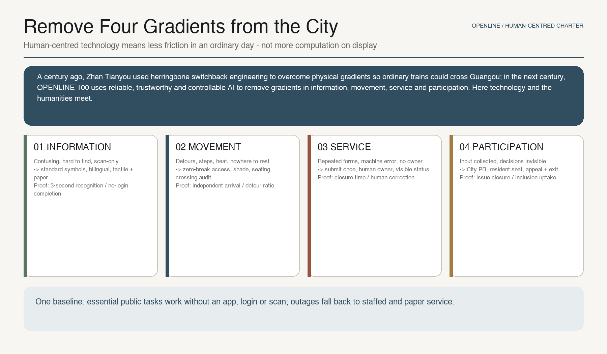

## A Blueprint That Can Be Recalculated, Stopped, and Continued

The core idea must fit on one board: seven story lines—**geographic space, population scale, mobility, industry, livelihood, talent, capital**—tell a people-first story where **technology and the humanities meet**. The board also keeps three verbs—**recalculable** (same-source geometry and metrics), **stoppable** (scenarios and capital stay dark until the gate), **continuable** (light ops → three-station loop → global node; a design roadmap, not an investment commitment). District population is calibration only and is not downscaled to the site; station coverage and other items lacking official conditions stay unknown.

## Design Basis and Source Inventory

This package is governed primarily by the public call announcement and the agent-facing task book, with the repository’s site package, source registry, and fact pack as the machine-readable base. [source:OFFICIAL-ANNOUNCEMENT] [source:AGENT-TASKBOOK] [source:SITE-PACKAGE] [source:SOURCE-REGISTRY] [source:PROCESSED-FACT-PACK] Corresponding standards are [standard:PROJECT-OFFICIAL-ANNOUNCEMENT], [standard:PROJECT-AGENT-OPEN-CALL-TASKBOOK], [standard:MOHURD-URBAN-DESIGN-MEASURES], [standard:MOHURD-CONTROL-DETAILED-PLANNING], [standard:MNR-LAND-USE-CLASSIFICATION-GUIDE], [standard:MOHURD-ARCH-DESIGN-DEPTH-2016]; existing-conditions diagnosis is managed by [depth:existing_conditions_diagnosis].

The most important data discipline is “do not draw gaps as facts.” The repository currently has no official overall boundary suitable for precise design, no surveyed polygons for the three key areas, no control-plan intensity, existing buildings, tenure, road red lines, municipal utilities, rail entrances/exits, or complete heritage control lines. Therefore [data:geometry/site_boundary.geojson#SITE-001] and [data:geometry/key_areas.geojson#PROV-KEY-001] are repository provisional constraints only, [source:BOUNDARY-SOURCE] [source:KEY-AREA-SOURCE]; this package uses them for topological validation and conceptual expression, and every derived quantity is marked provisional-derived. The announcement’s roughly 43.6 km² coordinated research scope, roughly 11.4 km² overall design scope, and roughly 368.4 ha total key-area quantity are task calibers and are not replaced by this package’s provisional polygons.

Public background materials only provide “direction calibration,” not proof of site existing conditions. Haidian’s 2025 district statistics show a resident population of 3.111 million, regional GDP of RMB 1,369.14 billion, tertiary industry at 92.56%, 92 national key laboratories, 123 filed and online large models, and 1,568 financial institutions (all 2025 figures are preliminary); these only show that Haidian has district-level conditions for research–industry–finance coupling, and cannot be area-scaled down to this scope. [source:HAIDIAN-STATS-2025] Information-software enterprises and employment in the economic census also cannot be equated with AI enterprises and AI employment. [source:HAIDIAN-ECON-CENSUS-2023] Beijing R&D expenditure figures are city-level reference only. [source:BEIJING-RD-2024]

Jing-Zhang Park Phase I opened in 2023 at about 2.5 km and 16.8 ha, supporting the background judgment of “heritage protection and public space in equal measure,” but does not provide the full-line engineering boundary. [source:JZ-PARK-OFFICIAL] The Tsinghuayuan Station historic site has a legally published protection zone and construction control belt; because this package has not obtained cleared surveyed polygons, it does not digitize a “pseudo purple line”; any adjacent node must be located only after heritage review. [source:QINGHUAYUAN-HERITAGE] This boundary-and-missing-data governance is also written into [assumption:A-BOUNDARY-001], [assumption:A-CONTROLS-001], [assumption:A-HERITAGE-001].

## Three-Tier Scope Working Framework

The three tiers are not three unrelated maps, but a large-to-small spatial progression threaded by one coordination spine: the strategic tier asks the question and the combination; the overall tier asks spatial supply; the key areas ask the next gate. [depth:three_level_scope_framework]

**The ~43.6 km² coordinated research tier** answers “why Haidian, why here”: organizing universities and institutes, research platforms, enterprises, capital, hospitals, schools, communities, and international networks into an open innovation commons. It outputs the seven-gate ecological chain, global case translation, activity networks, and “three districts, two wings” coordination logic—it does not generate pseudo-precise parcel conclusions.

**The ~11.4 km² overall design tier** answers “how the city carries it”: with OPENLINE as the public main axis, linking the northern Zhongzhiyuan full-stack autonomous innovation engine, the central Origin outcomes-translation engine, and the southern Dazhongsi city-adoption engine; the west connects Zhongguancun science & technology services, IP, and capital; the east connects Xiaoyuehe living scenes, communities, and cultural facilities. The provisional polygon recalculates to 11.41 km², used only for consistency checks of layers and metrics in this submission. [metric:site_area_sqm]

**The three key-area tier** answers “where the first step happens”: Zhongzhiyuan does trusted validation; Origin does outcomes translation; Dazhongsi does city adoption—each of the three stations has a supply gate and a demand gate; demand parties are not absent. The Xiaoyuehe east wing is the master demand intake; the three stations are three landing points for demand on the chain. The three provisional constraints are [data:geometry/key_areas.geojson#PROV-KEY-001], [data:geometry/key_areas.geojson#PROV-KEY-002], [data:geometry/key_areas.geojson#PROV-KEY-003], count [metric:key_area_count]; geometry does not replace announcement areas or statutory boundaries.

All three tiers share one “project passport”: every research or city problem has a unified ID, technology readiness, IP/open-source choice, data legality, test records, carbon and public value, financing status, and city procurement status. The strategic tier watches combinations; the overall tier watches spatial supply; key areas watch the next gate. When official boundaries arrive, replace constraints and recalculate as a whole; only when control plans, municipal systems, and tenure are in place does the work enter professional schemes and approvals. [data:geometry/constraints.geojson#official-controls-not-available]

## Coordinated Research Scope: Industry and Future City Studies

### From Lab to City Order: The Seven-Gate Open Innovation Chain

1. **Research｜Basic research**: Universities and national labs propose principle breakthroughs; OPENLINE Fellows lower disciplinary barriers through public forums and cross-campus pairing. Outputs are papers, benchmarks, and risk statements—paper count is not the sole KPI.
2. **PoC & IP｜Proof of concept and rights clearing**: The central “Station Zero” provides engineering managers, IP, ethics, and clinical/education/public-service advisors; reversible choices among open source, patents, and trade secrets. The gate is demand-side signature and a minimum viable validation plan.
3. **Open Source｜Open collaboration**: Establish a city-scale repository, maintainer microgrants, model cards/data cards, and contributor agreements. Open source is not unconditional open data—it means code, docs, interfaces, and governance are auditable.
4. **Validation｜Trusted testing**: The northern Agent Garden provides red-team, energy, accessibility, bias, and real-task testing; high-risk domains keep humans responsible. Fail thresholds mean return for retest—they shall not pass the gate; never pass “already displayed” off as “already validated.”
5. **Incubation｜Industry incubation**: Origin community supports teams with divisible small units, shared equipment, and 12-week product sprints; exit criteria are a clear customer, compliance path, and unit economics—or timely stop.
6. **Capital｜Patient capital**: The west-wing “Capital Platform” combines PoC vouchers, first scene orders, IP pledge advisory, industry capital, and long-term funds; each tranche binds to the next milestone—no park rental-subsidy race.
7. **City Adoption｜City adoption**: Hospitals, schools, commerce, and city operators become first problem owners. Before adoption, publish impact assessment, pilot scope, appeal and exit mechanisms; reuse successful interfaces and procurement clauses, not personal data copies.

The seven-gate chain forms a loop: city problems enter as City Pull Requests; research teams respond; test results enter a public “commit log”; first orders and investment help scale; real use generates the next round of problems. The project passport runs the full chain so teams do not keep re-filling forms across incubators, hospitals, funds, and government. [metric:scenario_count] [metric:test_validation_scenario_count]

### Innovation Ecosystem Actor Placement: Twelve Actor Types, Not Three Parks

Industry–academia–research fusion is expanded here into an open innovation commons of **government—capital—society—enterprise—research—education—platform—incubation—talent**. The twelve actor types—**government agencies, capital & finance, funds, social organizations, enterprises, research institutions, research academies/institutes, higher education, laboratories, innovation platforms, tech incubators, and high-end talent**—must be spatially placeable, chain-pairable, and passport-auditable—not merely circles on an ecosystem diagram.

The placement rule is **one axis, three gates + two-wing supply + micro-nodes along the line**: the west-wing factor platform receives government services, capital & finance, and funds (capital activates only after trusted testing is passed); the North Station validation gate takes labs and innovation platforms as CORE, with enterprises submitting for test and government observers as DOCK; the Central Station translation gate takes universities, institutes, and incubators as CORE, with short-stay talent, research collaboration, and enterprise first-users as DOCK; the South Station adoption gate takes enterprise and talent delivery as CORE (funds do not sit in the south CORE), with government first-orders and civic oversight as DOCK; the east-wing problem wing receives social organizations and real city scenes; micro-nodes at a conceptual spacing of 600–900 m provide everyday encounter interfaces. The project passport mandatorily registers problem owner → translator → professional service → tester → incubation/capital → feedback party; if any key seat is absent, do not claim an ecological closed loop. The figure below is conceptual placement, not existing occupancy or contracts.

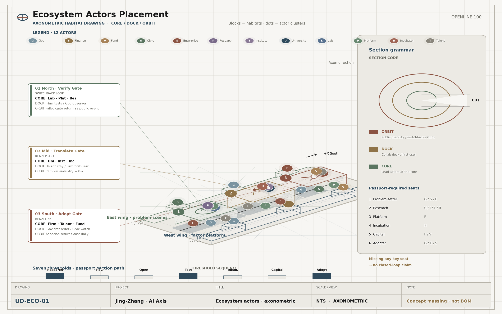

### Seven Global Cases: Do Not Copy Buildings—Translate Mechanisms

The table states **this scheme translates**—not “Haidian already adopted.” Selection rule: serve this project’s three unique loads—**linear rail-heritage host, seven-gate/passport stages, east-wing city-problem intake**. Generic adjacency campuses (e.g. Toronto / MaRS) and megaproject footprints (e.g. Paris-Saclay) leave the master table and remain background-only; local health policy and the seven-gate chain carry those loads instead. [source:CASE-TORONTO] [source:CASE-PARIS] [assumption:A-EXTERNAL-CASES-001]

- **Boston / Kendall—The Engine**: Readiness blueprint + stage gates → on-site engineering managers and passport gates. Fit: the chain needs human translation, not desk parks. [source:CASE-KENDALL]
- **Paris / Station F**: Rail freight hall Halle Freyssinet → startup campus → heritage rail as innovation host with open program space. Fit: same genus as Jing-Zhang linear rail reuse. [source:CASE-STATIONF]
- **Nesta Challenge Prizes**: Define problem → open call → staged reward/support → judge by outcome → City Pull Request and scene-voucher grammar. Fit: east-wing intake needs a challenge syntax, not a tenant list. [source:CASE-NESTA]
- **Singapore / AI Singapore 100 Experiments**: Real problem owners + engineers + PMs co-deliver AI PoC → 100 City PRs with passport seats. Fit: fills the on-axis Validation→Adoption AI co-delivery gap. [source:CASE-SINGAPORE]
- **Helsinki / Maria 01**: Reuse stock, phase expansion, operate first → operate → light retrofit → build last. Fit: heritage park is the host; site package forbids early tear-down locks. [source:CASE-HELSINKI]
- **Seoul AI Hub**: City multi-node R&D + incubate + international → microgrants and public-value thresholds mapped to three stations. Fit: prevent resource capture by top firms only. [source:CASE-SEOUL]
- **Tsukuba**: Industry–academia–gov–finance + living lab → linear public commons and Commit Plinths. Fit: Haidian lacks walkable public display, not another closed campus. [source:CASE-TSUKUBA]

Medical first-users rest on Haidian’s public AI+health references (scenario SC-02), not a foreign campus charter. [source:HAIDIAN-HEALTH-AI-2026]

The shared lesson: a world-class innovation ecosystem is not one landmark, but **strong research sources + a neutral translation layer + real first users + layered capital + rules that can be trusted**; this project’s increment is joining Zhongguancun density to a century of railway public narrative. [metric:global_case_count]

**Case comparison table (checkable).** Five columns: mechanism extracted · this scheme translates · why it fits THIS project · explicitly not copied. Institutions only—no campus scale, charters, datasets, or contracts; not a signed partnership or investment claim. [assumption:A-EXTERNAL-CASES-001]

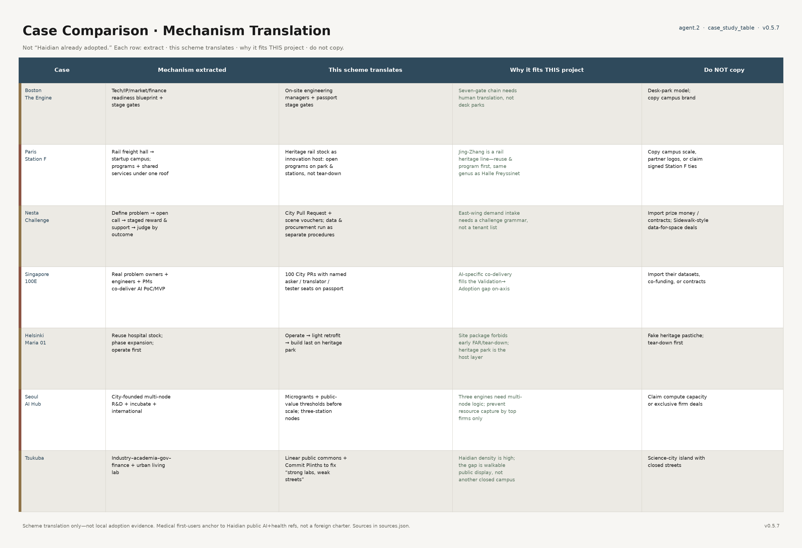

### Eight Factor Master Table (Same Grammar)

The task book requires **land, space, industry, capital, talent, compute, data, and scenario**. One four-column grammar closes uneven depth—each row must answer three questions, aligned to passport stages: [source:AGENT-TASKBOOK]

1. **Landing (where / who)**: name a checkable place or seat—land topology and sensitivity envelopes, seven axis spaces and three station forms, three-district / two-wing roles, Capital Dock, seven talent personas, trusted-test slots and SC-07 display, passport/data cards, twelve scenario cards and demand intake—not slogans.
2. **Entry gate (must be true)**: hard preconditions before the next stage—no FAR lock without control plan; heritage/fire/owner/removal triggers before fixed install; industry seats filled and capital only after Validation; talent voluntary only; compute needs facility metering and verified carbon; data needs purpose limits / minimize / human responsibility / appeal path; scenario cards need place · owner · boundary · KPI · stop key.
3. **Exit / stop (trigger)**: operable stop keys—official controls arrive → recompute constraints; two seasons unmaintained or commons capture → withdraw; missing critical seat → no closed-loop claim; two cycles without maintainer / real demander / safety → leave pool; harassment or appeal over line → freeze; no verified benefit → exhibit-only, no machine room; purpose creep → freeze and audit; stop key → log to passport and Failure Cabinet.

Detail remains in land-use, stations/forms, the three-factor page, and twelve scenario cards; this table only makes eight rows checkable side by side. **Judge primary read prefers three forms / key areas**—this table demotes to an index page. Concept mechanisms only—not approved policy, funding, compute capacity, or data-sharing agreements.

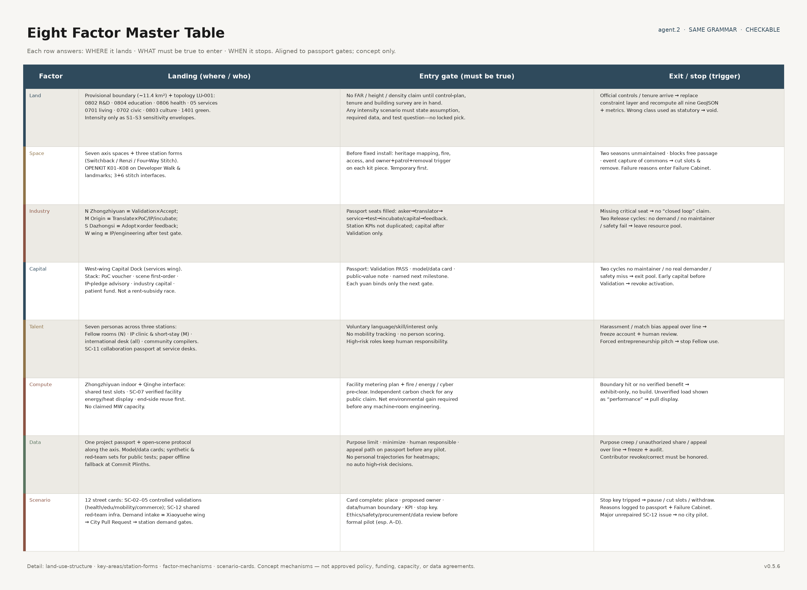

### Capital / Compute / Data: Three Factor Mechanisms (One Checkable Page)

Above the master table, **capital, compute, and data** get a deeper page. Each answers four questions: **who asks · entry gate · service stack · exit trigger**. Capital seats activate only after the validation gate; compute requires facility metering and fire/energy pre-clear—no machine room without net environmental gain; data rests on purpose limits, minimization, human responsibility, and passport appeals—no personal trajectories for heatmaps. Concept mechanisms only—not approved funding, compute capacity, or data-sharing agreements. [assumption:A-PRIVACY-001] [assumption:A-AI-SAFETY-001]

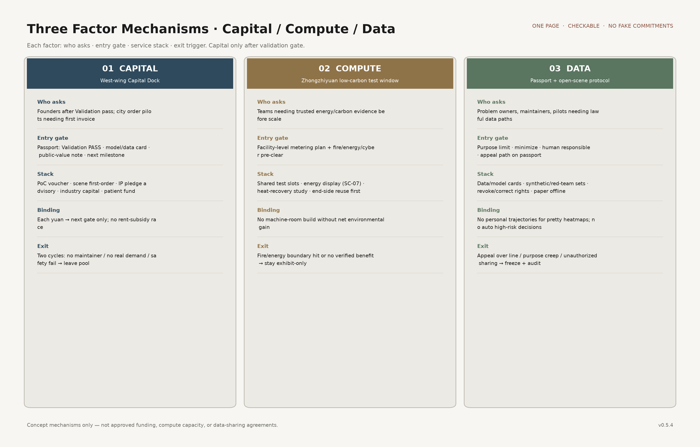

### Three Positionings, Five Functions, and the “Three Districts, Two Wings” Coordination Loop

OPENLINE 100 responds item by item to the task book’s original names. The **three positionings** are: a **Century Jing-Zhang Cultural Belt** that preserves and reinterprets engineering spirit through Rail→Code→Commons; an **Urban AI Life Experience Belt** that brings healthcare, education, commerce, mobility, culture, and governance into an ordinary day; and an **AI Fusion Innovation Belt** that joins research, open source, testing, incubation, capital, and adoption into one. The **five functions** are: Zhongzhiyuan carries the **AI full-stack autonomous innovation system**; Origin community organizes a **world-class AI innovation ecosystem**; twelve corridor scenarios form an **AI+ scenario empowerment new paradigm**; Xiaoyuehe and neighborhood interfaces carry an **intelligent AI vitality city**; and public testing, model cards, appeals, and exit mechanisms together pursue **AI governance global discourse power**. [source:AGENT-TASKBOOK]

**Three districts, two wings** are not five islands: the Zhongzhiyuan AI autonomous innovation acceleration district pushes projects through the trusted-testing gate; the AI Origin community completes PoC, rights clearing, open source, and incubation; the Dazhongsi AI industry agglomeration district completes city adoption and order feedback. The **Zhongguancun science & technology services wing** provides IP, engineering managers, and global factor services, and connects patient capital after testing is passed; the **Xiaoyuehe scenario empowerment wing** is the master demand intake—sending community, public-service, and real city problems into City Pull Requests, then landing them at each station’s demand gate. The coordination spine is **problem → translation → professional service → trusted testing → incubation/patient capital → feedback**: Xiaoyuehe raises problems → Origin teams translate (demand gate: problem translation) → Zhongguancun wing supplies professional services (engineering/IP/ethics; capital does not enter early) → Zhongzhiyuan trusted testing (demand gate: acceptance criteria; fail the gate and do not enter incubation) → after the gate, incubation and patient capital → Dazhongsi use and operations feedback write back to the passport and problem pool (demand gate: orders and feedback). Every step writes back to the same project passport.

Regional coordination uses a proposed “**five places, one protocol**,” without inventing existing partnerships: exchange community problems, maintainers, and light prototypes with **Bewei Community**; establish joint PoC interfaces for frontier outcomes with **Future Science City**; establish public translation of scientific outcomes and interdisciplinary residencies with **Huairou Science City**; connect robotics, smart terminals, and other engineering/manufacturing validation with **Beijing E-Town**; and build a portable library of city problems, evaluation, and procurement clauses for the **Beijing–Tianjin–Hebei** region. The annual Lab-to-City Forum only publishes a shared problem list, mutually recognized test templates, and next-year owners; any cooperation must be separately confirmed by the relevant institutions and cannot be inferred as already signed from scheme text.

### Naming and Visual Identity: Belt Brand VI (Not Drawing Layout)

This section answers taskbook agent.1 “visual identity and Logo direction.” The object is the **place brand of the AI innovation belt**, not A0/A3 page layout. Cultural wayfinding/sign systems belong to agent.5 and **must not be confused** with the belt’s overall brand. [source:AGENT-TASKBOOK]

**Mark construction: tech × humanities.** The primary mark is a **renzi merge**, not a letter puzzle. Four steps: ① **Humanities slope** (Rail Ink)—Jing-Zhang craft and people’s passage; ② **Tech slope** (Axis Steel)—axis, interfaces, and AI; ③ the slopes meet at a merge point with an **umber ignition node** (Signal Umber)—commit / digital ignition; ④ forward rail—shared public life after the junction. Read as: **technology and humanities meet at the merge**. Do not read the mark as letter O or digit 1; small / on-ink keeps the renzi-merge structure only. Clear space ≥ 0.5× mark half-width.

**Color system (four colors max).**

| Name | Hex | Heritage metaphor | Use |
| --- | --- | --- | --- |
| Rail Ink | `#1A1A1A` | 1909 steel & ink drawings | Industrial skeleton, type hierarchy |
| Axis Steel | `#2F4A5C` | Line as civic infrastructure | Axis, interfaces, structure |
| Signal Umber | `#8B5342` | Signal lamp / commit pulse | **Only** events & interactive nodes |
| Ballast Paper | `#F7F6F3` | Ballast bed & drawing paper | Quiet ground field |

Umber is a signal, not wallpaper; no neon wash.

**Dual naming lockups.** Space layer: Chinese **「百年京张 · AI 智轴」** / Century Jing-Zhang · AI Axis (drawings, segments, landmarks, spatial wayfinding). Mechanism layer: **OPENLINE 100** / Jing-Zhang Open Intelligence Line (passport, events, platform, international). Vocabulary: nodes = Station; projects = Commit; annual outcomes = Release; segments = Space; mileage = Suzhou numerals + Arabic [metric:milestone_count] [assumption:A-MOTIF-001].

**Type & wayfinding.** Chinese space names: Song/Heiti stack; OPENLINE: geometric sans. Wayfinding bilingual, high-contrast, braille/tactile, paper offline fallback. Character in three phrases: **industrial skeleton · garden base · digital ignition**—light only at entries and state changes.

**Don’t.** Neon streets, robot statues, continuous sound-light, fake heritage purple lines, “shown” pretending to be “verified,” or mixing belt Logo with cultural wayfinding. Clear trademark, domain, typeface, and Suzhou-numeral rights before formal use; this is a concept VI direction, not a registered mark or procured design system. [assumption:A-BRAND-001] [assumption:A-ACCESS-001]

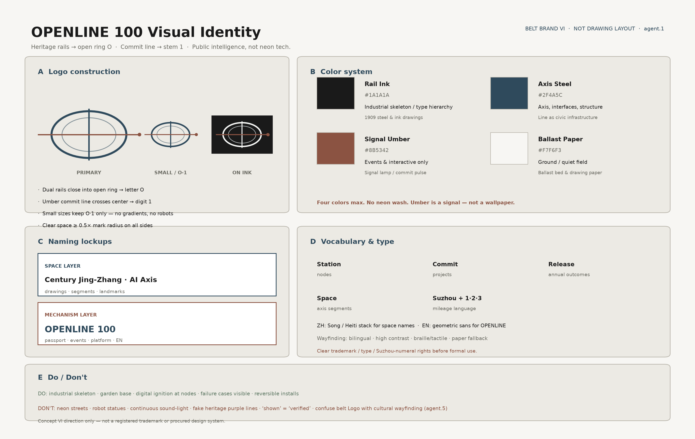

**Application mockups (three panels).** VI does not stop at a palette: wayfinding carries place-layer naming and mileage dual-notation; the Commit Plinth is street-facing interactive furniture; the project passport cover lands mechanism-layer ID / GATE / TRL / RIGHTS on a holdable object. Concept mockups only—not procured products or legal IDs. [assumption:A-BRAND-001]

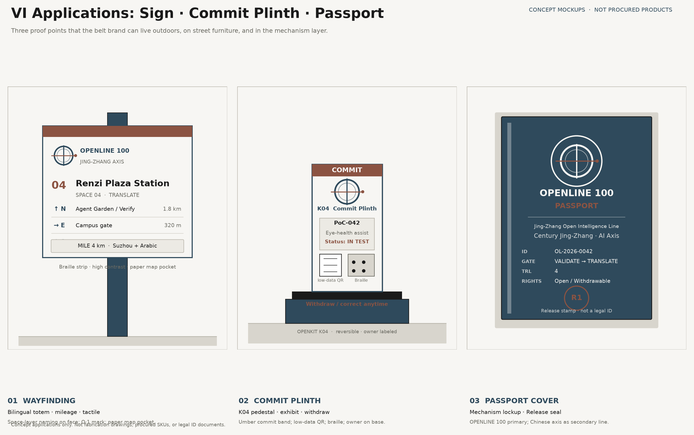

## Overall Design Scope: Urban Renewal and Control-Plan-Depth Urban Design

The overall structure is **one axis, two wings; three engines, seven spaces; three stations, three forms; nine stitching interfaces**. [depth:overall_spatial_structure] The Jing-Zhang Intelligence Axis is not claimed as the engineering centerline of the heritage line; it is a conceptual public main axis generated inside the provisional boundary [data:geometry/roads.geojson#ROAD-OPENLINE]. At three speeds—developer walking, commute cycling, and accessible roaming—it joins research, living, commerce, parks, and culture into everyday life, not festival days alone.

### The Intelligence Axis Is Not a Corridor—It Is a Sequence of Seven Spaces

An axis of about nine kilometers, if equal width everywhere, is only a through corridor; the Intelligence Axis is designed as a **sequence of seven named segments (spaces)**, each with its own width, section family, and dominant public behavior—the rhythm of compression and release is itself the design [metric:axis_segment_count] [data:geometry/public_space.geojson#PUBLIC-AXIS-SEG-01]. From north to south:

| Space | Segment name | Section family | Conceptual width | Dominant public behavior | Display intensity |
| --- | --- | --- | --- | --- | --- |
| 01 | Qinghe Testing Exhibition Field | A Exhibition Field | ~40 m | Public viewing of trusted testing and low-carbon compute exhibition/education | High |
| 02 | Zhongzhi Quiet Valley | B Canyon | ~12 m | Quiet R&D, habitat conservation, and acoustic protection | Low |
| 03 | Academic Town Porch | C Porch | ~24 m | Campus gate interfaces and light exhibition-sign galleries | Medium |
| 04 | Origin Renzi Plaza | D Plaza | ~36 m | Station Zero releases, Renzi Plaza, and Failure Cabinet | High |
| 05 | Compiler Yard Community Living Room | E Living Room | ~20 m | Community co-creation, garden rooms, and intergenerational activity | Medium |
| 06 | Crossing Under-Exhibit | F Under-Exhibit | ~10 m | Under-crossing dark exhibits and sound installations | Medium |
| 07 | Dazhongsi Next Station | G Concourse | ~32 m | International roadshows, markets, and nightlife | High |

High and quiet segments alternate: the north exhibition field and central plaza each hold a primary climax; the Academic Town Porch drops to medium-intensity interface so continuous high display from 03–04 does not drown the middle; the axis can carry OPENLINE Week’s tens-of-thousands flow and still protect a researcher’s quiet weekday morning walk. Segment boundaries and sections do not stop at the table: below answers first “why the boundaries fall here” (severance analysis), then “what each segment looks like inside” (section-family deepening).

### Where Segment Boundaries Come From: Severance Analysis, Not Arbitrary Division

An axis of about nine kilometers is first a line cut laterally by the city. This scheme begins with **severance analysis**: register seven east–west crossing corridors [metric:severance_crossing_count], grade them **strong** (expressway, elevated, rail-parallel candidates), **medium** (arterials), and **weak** (secondary roads), then use six of them as “thresholds” between spaces—the low, dark F Under-Exhibit segment is bounded at both ends by the strong severance corridors of Zhichun Road and North 4th Ring; Chengfu Road and Tsinghua East Road define the north and south gates of Origin Renzi Plaza (Chengfu Road is the “Wudaokou” crossing memory point); the under-bridge space at North 5th Ring is the north portal between Quiet Valley and Qinghe Exhibition Field; the North 3rd Ring corridor is the south portal of the Concourse segment. Segment boundaries are therefore not the designer’s arbitrary rhythm, but redesign upon “the necessity of being cut.” Conceptual mouth strategies are three-tiered: strong severance corridors prioritize underpass under-exhibits and opening under bridges; medium corridors do at-grade improvement and crossing-memory exhibit points; weak corridors use pedestrian-priority at-grade treatment and walk audits first. Names take publicly common road names; positions are conceptual projections relative to provisional key-area centroids; grades and mouth methods all await official red-line verification and do not constitute bridge/tunnel engineering conclusions. [assumption:A-SEVERANCE-001]

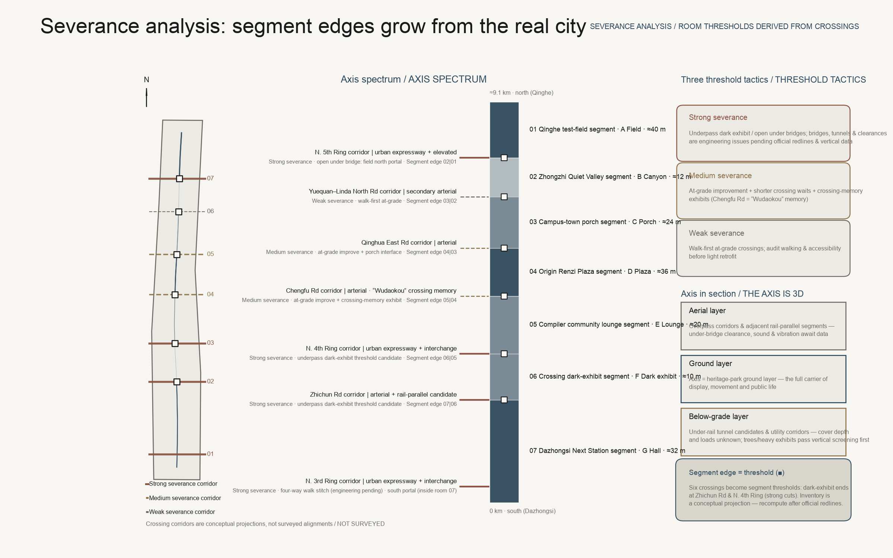

**Axis section: this axis is three-dimensional.** Along the Intelligence Axis, three types of vertical stacking may coexist—underpass railway tunnel candidates, overpass elevated corridors, and adjacent rail-parallel segments; cover depth, structural loads, under-bridge clearance, and acoustic conditions are not yet in the repository. From this the scheme makes two conservative vertical design agreements: first, placement of trees, heavy exhibit furniture, and any fixed structures must pass vertical-condition screening at the deepening stage; second, both sides of strong severance corridors preferentially receive low-sensitivity section families (canyon, under-exhibit), leaving the highest acoustic cost to functions that least need quiet. [assumption:A-SEVERANCE-001] [assumption:A-AXIS-001]

### Section-Family Deepening: Seven Conceptual Sections, One Strip Grammar

The seven section families are drawn as conceptual sections at the **same horizontal scale**, so width rhythm can be compared directly [data:geometry/public_space.geojson#PUBLIC-AXIS-SEG-01]. Each family is composed of four strip types as a checkable grammar: **display depth strip** (3–15 m; display is space, not a membrane stuck on a façade), **circulation strip** (conceptual clear width not less than 4 m and continuous accessibility throughout), **seating/bleacher strip**, and **planting/sound-absorbing strip**; heritage elements (ties, twin rails, platform edges) embed directly into the strips as exhibit stages rather than separate furniture. Each of the seven families has its own composition logic: A Exhibition Field uses embankment bleachers facing a watchable test field; B Canyon uses bilateral closed canopy planting to protect quiet and habitat; C Porch places exhibition-sign galleries under eaves as an all-weather interface; D Plaza uses Station Zero’s ground floor directly as the display depth strip, with the Renzi mark anchoring the release point; E Living Room uses long benches and community exhibit windows for intergenerational activity; F Under-Exhibit uses under-overpass corridor space for sound installations (clearance and alignment to be verified); G Concourse faces night with market stalls and string lights. Sections are conceptual, not engineering; longitudinal scale is slightly schematic; segment boundaries, mouths, and vertical conditions all await official data verification. [assumption:A-AXIS-001]

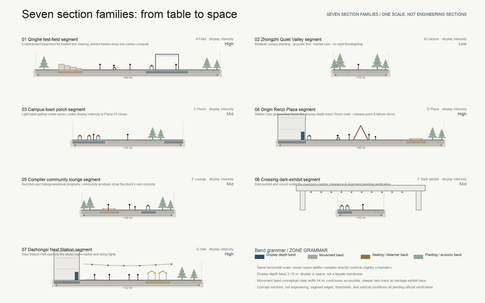

### Three-Level Grammar of the Public Display Layer

The “display layer” is this scheme’s core idea, so display must be a **checkable spatial grammar**, not an accidental set of five point landmarks. The grammar has three levels: **line**—continuous display interfaces along high-intensity Intelligence Axis segments (exhibition signs, Commit interfaces, enterable ground floors), with bilateral conceptual length recalculated by [metric:display_frontage_length_m]; **plane**—indoor/outdoor exhibition fields at the three stations (Agent Garden, Station Zero, Next Station Hall); **point**—OPENKIT’s K04 Commit Plinth and Suzhou-numeral milestones [metric:milestone_count]. Design guidelines suggest a “display frontage ratio” (length of ground-floor display interface as a share of total ground-floor frontage along the line) of 40%–60% as a target range for high-display segments—this number is a guideline suggestion for parcel deepening, not a statutory indicator. Display carriers preferentially use heritage elements themselves: platform remnants as stages, switches as interactive nodes, embankment edges as seating bleachers; contributors retain withdrawal and correction rights over any displayed content.

### Mapping the Two Wings: The Axis’s Value Is Lateral Stitching

The **Zhongguancun science & technology services wing** (west) and the **Xiaoyuehe scenario empowerment wing** (east) no longer live only in text: nine east–west stitching interfaces are graded as “three strategic stitches + six everyday stitches” [metric:strategic_interface_count] [data:geometry/roads.geojson#ROAD-X-01], each labeled with what it stitches. The three strategic stitches are—**Qinghe blue–green stitch** (north, where axis and river intertwine), **Origin campus–city stitch** (center, college gate district and knowledge capillaries), **Dazhongsi four-way walk stitch** (south, rail-candidate interfaces and the pedestrian surgery of interchange reality); the six everyday stitches connect Jimen community, Xiaoyuehe east wing, Compiler Yard living room, Zhongguancun service wing, Academic Town Porch, and Zhongzhiyuan openings. Strategic stitches should receive conceptual plans and accessible circulation design at deepening; everyday stitches begin with walk audits. Without official red lines and station-entrance data, all interfaces express connection priority only. [assumption:A-TRANSIT-001]

Conceptual land use uses topologically complete zoning [data:geometry/land_use.geojson#LU-001]: AI R&D and translation (0802) near the three engines; education & research (0804) as near-campus interfaces; medical innovation (0806) for low-risk validation; science & technology services and urban commerce (05) at stitch nodes; cultural display (0803) along the heritage narrative; talent living (0701) and public services (0702) sustaining day–night mix; park green space (1401) as continuous public base. Its role is to compare functional ratios and adjacency—not to change statutory land classes. [depth:land_use_layout]

The renewal method follows “understand first, then decide”: round one completes surveys of tenure, age, structural safety, carbon, business mix, leases, historic value, and street interface; round two scores five classes—**retain, light retrofit, renovate, demolition candidate, new-build candidate**; round three is jointly confirmed by owners, residents, heritage, planning, fire, and operations teams. When data are missing, do not treat prototype envelopes as existing buildings, and do not assign FAR, height, density, or demolition quantities. [metric:building_footprint_area_sqm] [depth:development_intensity_controls]

Urban interface adopts “three checkable rules”: along OPENLINE, set an enterable interface every 60–90 m at ground floor (guideline suggestion, pending parcel deepening); outside activity hours, still retain toilets, drinking water, seating, and passage; park walls preferentially open via porches, shared forecourts, and appointment passages—not by demolishing all walls at once. Roofs prioritize biodiversity, stormwater, and reversible activity—not giant screens manufacturing “tech feel.” Building controls form regulatory drawings only after statutory conditions are obtained. [depth:height_massing_character]

## Key Area Detailed Design

The three key areas are not three homogeneous parks, but three different gates on the seven-gate innovation chain—**each gate has a supply face and a demand face**. [depth:three_key_area_detailed_design] In one sentence: **North Station can be validated; Central Station can be made; South Station can be used**. The conceptual building prototype total is 34 [metric:building_prototype_count], used only to test small-scale clusters, open ground floors, and public-space relationships.

| Station | Supply gate | Demand gate | Who sits in the demand seat |
| --- | --- | --- | --- |
| Zhongzhiyuan | Trusted validation | Acceptance demand | Industry, regulators, safety and standards parties: what evidence is needed to pass |
| AI Origin | Outcomes translation | Problem translation | Universities, hospitals, schools, communities: how real problems become doable projects |
| Dazhongsi | City adoption | Orders and feedback | Merchants, residents, visitors: was it used, where did it stick, write back to the passport |

The Xiaoyuehe east wing remains the master demand intake; the three stations are three landing points for demand on the chain—not “demand only on the east wing, three stations only do innovation.”

### 01 North Station｜Zhongzhiyuan “Full-Stack Trusted Engine”

Positioned as **from autonomous technology to trusted validation**.

- **Supply gate｜Trusted validation**: Agent Garden as a watchable test field that does not leak data; quiet R&D courtyards, red-team labs, standards workshops, low-carbon compute experience, and visitor center. Models and robots validate in controlled environments; accessibility and energy tests can be publicly understood; sensitive tests stay indoors.
- **Demand gate｜Acceptance demand**: Industry, regulators, safety and standards parties propose the “gate-pass evidence list” here—what to test, who signs, how to return for retest if unmet. Red-team and standards workshops are demand seats, not mere lab annexes.

The spatial move is “one Qinghe slow-mobility interface, two park open gates, three types of test courtyards.” This station’s spatial motif is the **Switchback Loop** [data:geometry/public_space.geojson#PUBLIC-FORM-01]—translating Qinglongqiao’s “人”-shaped alignment wisdom of “overcoming grade by switchback” into a watchable validation loop: projects enter, public testing, fail threshold then switchback return for retest; that return becomes a visible public event on the spatial path, not a hidden failure. Any river, flood, compute, power, and transport measures await official conditions—no facility capacity is promised. [data:geometry/buildings.geojson#BLDG-001] [assumption:A-MUNICIPAL-001] [assumption:A-MOTIF-001]

### 02 Central Station｜Beijing AI Origin “0-to-1 Engine”

Positioned as **from university outcomes to the first city order**.

- **Supply gate｜Outcomes translation**: Station Zero as public archive and outcomes-release entrance, linking a 24-hour collaboration living room, IP/legal clinic, shared prototyping workshop, youth talent short-stay advisory, and ground-floor shops; between campus and city, multiple appointment gates and continuous walking form “knowledge capillaries.”
- **Demand gate｜Problem translation**: University labs, clinicians and teachers, and community co-creators send real problems into City Pull Requests; Origin teams turn problems into doable PoCs, rights paths, and open/closed-source choices—demand parties are seen at the merge point, not patched with a post-hoc “user study.”

This station’s spatial motif is **Renzi Plaza** [data:geometry/public_space.geojson#PUBLIC-FORM-02]—academic and industry tracks as two ramps from campus and city sides, merging before Station Zero into a Renzi (人-shaped) plaza: the merge point is the outcomes-release point and also the Failure Cabinet’s location, metaphor for 0-to-1 requiring both tracks together. Valuable buildings preferentially accommodate studios via light retrofit; any retain/renovate/demolish conclusion requires existing-conditions survey and tenure negotiation. [data:geometry/public_space.geojson#PUBLIC-LM-02] [depth:retain_renovate_demolish] [assumption:A-HERITAGE-001] [assumption:A-MOTIF-001]

### 03 South Station｜Dazhongsi “City Adoption Engine”

Positioned as **sending validated outcomes into urban everyday life and markets, and writing use feedback back to the passport**. Dazhongsi is not a blank park, but an existing station-city cut by the North 3rd Ring corridor, interchanges, and rail-candidate interfaces: malls, residential, park green belts, and transport cores coexist. This station does not build a “third innovation park,” but performs **station-city surgery**: walk it through first, light retrofit next, new build last.

- **Supply gate｜City adoption**: International roadshows, terminal trials, and intelligent-native formats enter existing commercial and living interfaces; removable night markets and annual Release.
- **Demand gate｜Orders and feedback**: Merchants, residents, visitors, and procurement parties leave real orders and operations feedback—was it used, where did it stick, does it crowd out publicness; feedback writes back to the project passport and problem pool, not stopping at roadshow applause.

**Spatial form: Four-Way Walk Stitch** [data:geometry/public_space.geojson#PUBLIC-FORM-03]. With **Next Station Hall** as the core, organize four pedestrian-priority sequences N/S/E/W, reconnecting four cut pieces into a walkable day:

| Direction | Conceptual quadrant | Spatial move | Renewal attitude |
| --- | --- | --- | --- |
| Northwest | Existing commercial interface | Open ground/under-bridge priority paths to the hall; open ground floors and bilingual wayfinding | Retain-led, light-retrofit interface |
| Northeast | Residential and living services | Connect community entries, continuous accessibility, daily shopping and pickup | Retain fabric, add stitch mouths |
| Southwest | Park/heritage green belt | Removable exhibit pavilions and night markets on green edges—no permanent green occupation | Operations-first, removable and retreatable |
| Southeast | Concourse and roadshow | Next Station Hall, international roadshows, terminal trials, and Failure Cabinet | Public hub, light and reversible |

Spatial moves compress to three phrases: **one core** (Next Station Hall)—**four ways** (door-to-door pedestrian priority)—**two boundaries** (night noise windows + public green not permanently commercialized). When rail entrances/exits, road red lines, clearance, and flow data are missing, the four ways express connection priority only—no overpass bridges drawn, no signals set. [data:geometry/public_space.geojson#PUBLIC-LM-05] [assumption:A-TRANSIT-001] [assumption:A-MOTIF-001]

**How adoption happens.** International roadshows and terminal trials sit in the hall and southeast quadrant; agent products enter northwest existing shops and northeast living services—not a separate closed exhibition hall—SC-05 shop copilot lands on this interface; merchants are demand parties, not display props. AI commerce allows user opt-in choice—no facial recognition, sensitive profiling, or forced recommendation; digital-asset display only explains rules and does not constitute trading promises. Activities unmaintained for two consecutive seasons or crowding public passage cut schedule and leave; complaints and stop reasons enter the Failure Cabinet and passport feedback fields.

The three key areas share project passport, open-scenario protocol, test-report format, and visual system (register once, pass three stations), and are scored by station on **validation pass rate / PoC into validation and first order / sustained cooperation and feedback loop**. Form comparison is in the figure below; each station’s ground floor hosts a Failure Cabinet. [metric:renzi_motif_count]

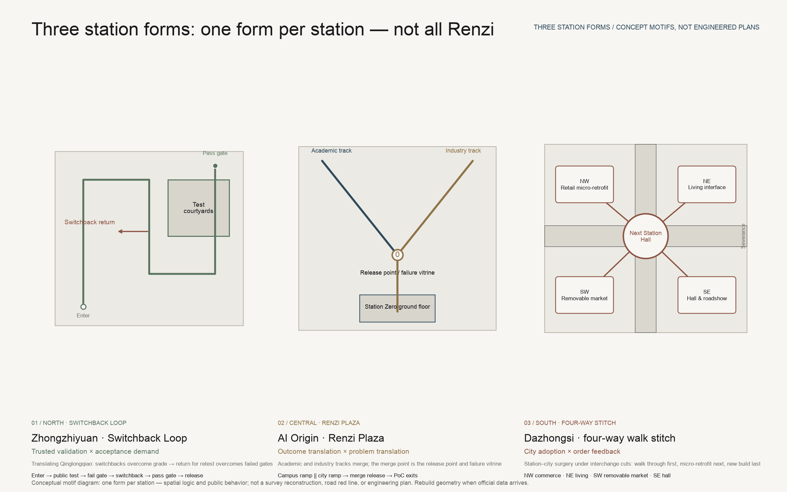

## AI Innovation Ecosystem, Talent Personas, and AI+ Scenarios

### Seven People, Seven Kinds of Day on One Line

1. **Basic researchers** need quiet reasoning, interdisciplinary peers, and the choice not to be forced into entrepreneurship; answered by North Station Fellow rooms and corridor forums.
2. **Open-source maintainers** need sustainable funding, reputation, docs, and conflict mediation; answered by Commit Wall, microgrants, and maintainer residencies.
3. **Startup teams** need small units, test users, legal/IP, and a first order; answered by Origin community’s 12-week sprint.
4. **Clinicians/teachers and other professionals** need tool assistance without responsibility transfer; answered by controlled scenarios, human review, and exit buttons.
5. **Investors and enterprise innovation leads** need comparable evidence, compliance status, and real customers; answered by project passport and Next Station Hall.
6. **Community co-creation and public-service talent** (community workers, accessibility advisors, youth organizers) need to bring real needs of residents, children, and elders into design and retain human alternatives; answered by community Compiler Yard, quiet hours, and paper guides.
7. **Global visitors and digital nomads** need bilingual entry, short-term work, urban culture, and trustworthy collaborators; answered by OPENLINE Passport and Annual Week. [metric:persona_count]

**Alongside the seven innovation participants, six everyday users are treated as distinct design subjects rather than compressed into one abstract “resident” seat.** They are an older person travelling alone, a child with a caregiver, a wheelchair user, a person with sensory disability, an outdoor worker, and a person without or unwilling to use a smartphone. Each must complete the same zero-break journey in sun, rain and at night: transit edge → city-standard entrance → crossing → rest/water → toilet → service/exhibit → safe exit. The seven innovation personas test the ecosystem; the six everyday users test space and service. Neither substitutes for the other.

**A Phase 0 human-evidence period (8–12 weeks, conceptual recommendation)** precedes branded installations and AI deployment: accompanied walks, wheelchair/stroller audits, child mapping, older-person interviews, night-safety walks, and interviews with shop and maintenance workers. It uses informed participation, human observation and anonymous aggregation, never personal tracks. Every finding becomes a City PR with a visible accepted, modified or rejected status and rationale. Phase 0 calibrates rest intervals, shade, rain cover, lighting, staffed help and digital alternatives; participation counts never substitute for issue closure.

### Twelve Neighborhood Scenario Cards

Every card must answer “who is responsible, where, what data, who reviews, how to stop.” Landings pin to **seven spaces / nine stitches / Xiaoyuehe east wing** as concept pins (see pin map)—no street numbers, clinic names, or school names; replace when official public facility lists arrive. [data:geometry/public_space.geojson#PUBLIC-DEVELOPER-WALK] [data:geometry/green_space.geojson#GREEN-OPENLINE]

**SC-01 Open-source outcomes exhibition gallery｜Culture + research.** Origin Renzi square segment (E04) Developer Walk; operators with university maintainers turn papers, model cards, code, and failure records into bilingual exhibition signs. Only authorized public materials are shown; contributors may withdraw and correct. KPIs are reproducible-outcomes rate and public understanding; unmaintained for two consecutive seasons → take down.

**SC-02 Primary eye-health collaboration station｜AI+ healthcare, validation scenario A.** **Street pin:** North Station indoor controlled screening desk + east-side community health interface reached via Jimen / Xiaoyuehe everyday stitches (concept interface—not a named clinic). Community health institutions responsible; AI only assists screening; doctors review and decide referral—no automatic diagnosis. Use minimized health data, separated access, and expiry deletion. Haidian’s public cases of primary screening with specialist review may serve as mechanism reference—this project does not claim clinical efficacy. [source:HAIDIAN-HEALTH-AI-2026] KPIs are review completion rate, referral arrival rate, and error stratification; clinical safety thresholds or appeal response unmet → immediate pause.

**SC-03 Teacher lesson co-creation room｜AI+ education, validation scenario B.** **Street pin:** near-campus porch of the Origin school-city strategic stitch (E03–E04 junction)—no claim on interior campus rooms. Proposed subjects are schools/teaching-research institutions; teachers choose tools and review outputs; student work defaults out of training; ban automatic grading penalties and covert emotion recognition. Haidian “AI+ education” policy calibrates pilot, norms, safety, and ethics direction—it does not prove scheme approval. [source:HAIDIAN-EDU-AI-POLICY] KPIs are teacher time saved, material error rate, and student/parent informed rate; error rate or opt-out complaints over line → pause the pilot and return for revision.

**SC-04 Unobtrusive but non-surveillance slow-mobility assistant｜AI+ mobility, validation scenario C.** Nine east–west stitch mouths (3 strategic + 6 everyday); proposed subjects are transport/park management and accessibility organizations; only on-site human observation, anonymous counts, or approved aggregate sensing identify breakpoints—no personal trajectories or restricted rider/ride-hail/delivery platform data. Outputs are explainable crowding indices and accessibility work orders—not enforcement. Haidian district slow-mobility construction is network-direction background only. [source:HAIDIAN-MOBILITY-2023] KPIs are breakpoint fix time and wheelchair/stroller reachability; re-identification risk or excessive false alarms → stop collection.

**SC-05 Shop operations copilot｜AI+ commerce, validation scenario D.** **Street pin:** ground-floor living-street band after the Dazhongsi four-way walk stitch (E07 outer shopfront)—not a closed showroom. Proposed subjects are commercial operators and merchant representatives; merchants voluntarily upload de-identified order summaries; system assists scheduling, inventory, and bilingual service—no single-shop trade secrets shared, no consumer sensitive profiling. KPIs are food waste, merchant retention, and human correction rate; unexplainable differential pricing or drop in merchant net income → exit.

**SC-06 City maintenance Pull Request｜AI+ governance.** **East-wing host:** Xiaoyuehe scenario wing community seats, lighting, ramps, and green as primary demand intake; along-axis assets accepted in parallel. Residents submit problems by text/photo; operators merge duplicates and publish status. Images default to local face/plate blur; AI only classifies, does not adjudicate. KPIs are close time, repeat-repair decline, and appeal satisfaction; persistent classification bias → revert to human classification.

**SC-07 Low-carbon compute heat-recovery display｜AI+ energy.** Zhongzhiyuan indoor display and Qinghe interface; proposed subjects are facility ops and independent energy/carbon verifiers; real-time display of verified facility-level energy use and waste-heat destinations—no enterprise-sensitive loads. KPIs are measurement completeness and energy per task decline; without energy, municipal, and fire conditions, exhibition/education only—no engineering systems built.

**SC-08 Legal and IP clinic｜AI+ professional services.** Station Zero; AI organizes public regulations and document checklists; licensed lawyers/patent agents issue opinions; confidential materials do not enter general models. KPIs are translation cycle time, human-found error rate, and small-team affordability; if users mistake machine opinion for formal legal advice → pause interface.

**SC-09 City memory decoder｜AI+ culture.** Lawfully usable space around Tsinghuayuan historic site and cultural routes; authorized archives generate multilingual, children’s, and accessible interpretations; historical facts reviewed by curators. No fixed facilities before protection-line polygons. [assumption:A-HERITAGE-001] KPIs are correction response and multi-version use—no dwell-time personal tracking.

**SC-10 Park quiet hours and activity scheduling｜AI+ public space.** Five garden rooms; use booking, human observation, and anonymous sound-level data to coordinate running, children, performances, and quiet needs. System advises; on-duty staff decide. KPIs are conflict complaints and free accessibility when no events; long-term event occupation of public space → cut schedule.

**SC-11 International visitor collaboration passport｜AI+ talent services.** Three-station service desks; proposed subjects are international service offices and community operators; visitors choose language, skills, and public interests to match events—no movement logs, no identity scoring. KPIs are effective collaboration and local maintainer benefit; matching bias or harassment appeals over line → freeze account and human handle.

**SC-12 Agent Garden red-team contest｜Shared safety-test infrastructure.** North Station controlled test field; proposed subjects are independent evaluation bodies and Zhongzhiyuan operators; enterprises submit agents; test safety, accessibility, energy, and refusal on fictional/synthetic tasks; results published by pre-agreed tiers. It does not count among validation scenarios A–D. Ban using real sensitive business data for public demos. KPIs are issue fix rate and retest pass rate; major unfixed issues cannot enter city pilots. [assumption:A-AI-SAFETY-001]

**Scenario–space–operations overview.** This matrix checks at a glance whether technology lands on the street and responsibility lands on an organization; detailed governance still follows the scenario cards above.

| Scenario | Street pin / primary space | Proposed operating subject | Primary stop condition |
| --- | --- | --- | --- |
| SC-01 Exhibition gallery | Origin E04 Developer Walk | University maintainers + corridor operators | No maintenance or authorization withdrawn |
| SC-02 Eye health | N station → Jimen/Xiaoyuehe clinic interface | Community health institutions | Clinical safety / appeal over line |
| SC-03 Teacher co-creation | Origin school-city stitch · near-campus porch | Schools / teaching-research institutions | Error or opt-out complaints over line |
| SC-04 Slow-mobility assistant | Nine stitch mouths (3+6) | Transport/park + accessibility orgs | Re-identification risk or high false alarms |
| SC-05 Shop copilot | Living-street GF after 4-way stitch | Commercial ops + merchant reps | Differential pricing or net income drop |
| SC-06 Maintenance PR | Xiaoyuehe east wing · community assets | City/park operators | Classification bias long unimproved |
| SC-07 Compute display | Zhongzhiyuan indoor + Qinghe edge | Ops + independent verification | Energy/fire conditions not obtained |
| SC-08 IP clinic | Station Zero | Lawyers / patent agencies | Machine opinion mistaken as formal opinion |
| SC-09 Memory decoder | Historic interpretation points | Curators / cultural operators | Heritage prerequisites unmet |
| SC-10 Quiet hours | E05 five garden rooms | Park ops + community | Events long crowding out publicness |
| SC-11 Collaboration passport | Three-station service desks | International service office | Bias / harassment appeals over line |
| SC-12 Red-team contest | North Station Agent Garden field | Independent evaluation + Zhongzhiyuan | Major issues unfixed |

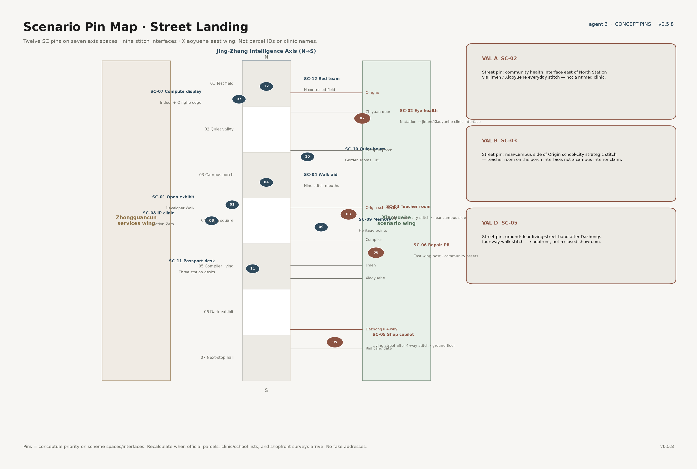

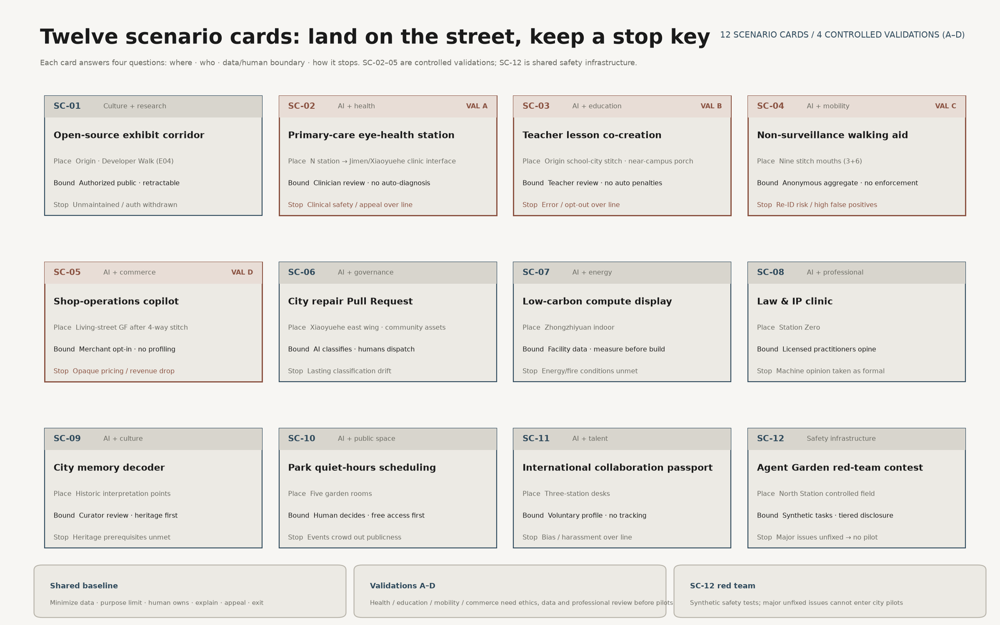

### A Future Day on the Axis: Cards Walked by People

A card list is not future life. Three personas thread five to six cards into one day—narrative only, not a scheduled program; every stop keeps its card’s stop key. [metric:persona_count]

1. **Clinician / teacher:** morning SC-02 assist at the east clinic interface (doctor reviews) → commute touches SC-04 at a stitch → midday SC-03 lesson co-create on the school-city porch → evening quiet garden SC-10 → file SC-06 if a curb is broken.
2. **Founder / maintainer:** morning SC-08 IP clinic at Station Zero → SC-01 Commit exhibit on Developer Walk → synthetic red-team slot SC-12 → living-street SC-05 shop pilot feedback → south passport desk SC-11 → retract a label if needed.
3. **Community organizer:** Xiaoyuehe morning intake SC-06 → escort an elder to the health interface SC-02 → flag a stitch access gap SC-04 → book a quiet room for kids SC-10 → help a shop opt in SC-05 (no profiling) → host a visitor at the compiler desk SC-11.

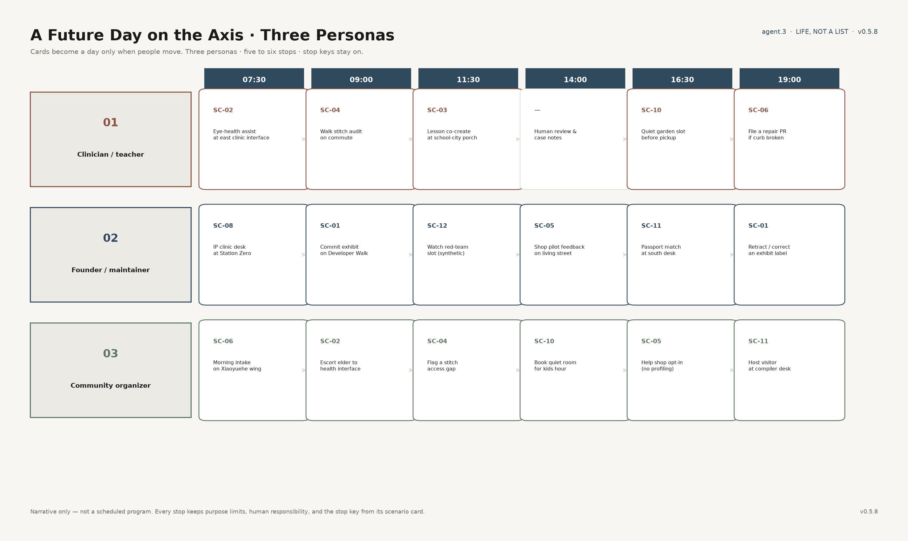

All twelve scenarios follow data minimization, purpose limitation, aggregate-first, human responsibility, explainability, appealability, and exitability; formal pilots must complete ethics/safety, procurement, data, and professional review. [assumption:A-PRIVACY-001]

### Three Human-Centred Flagship Services: Remember the Improvement, Not the Technology

The twelve cards retain their full governance boundaries, but public communication and the first pilot foreground only three services that directly lower urban gradients. **Remove movement friction** joins SC-04 Slow-Mobility Assistant and SC-06 Maintenance PR into “spot the break → anonymous or human verification → work order → human decision → repair and retest,” so wheelchair and stroller users can arrive independently. **Coordinate bodily comfort** joins SC-10 and the five garden rooms into “sense heat/sound → suggest a schedule → staff confirm → signal on site → write complaints back,” keeping quiet, child and event uses from displacing one another. **Translate city memory**, centred on SC-09, follows “licensed archive → curator verification → child/accessibility/multilingual versions → public correction → withdraw and update.”

All three follow an invisible-AI rule: **no app, no registration, no scan, a human owner, and exit at any time**. AI stays backstage by default; without a clear task it does not identify people, speak or light up. High-risk decisions never execute automatically. Failure is graceful: full service → low-data mode → offline standard signs → paper process → staffed service. Essential public tasks remain available at every level.

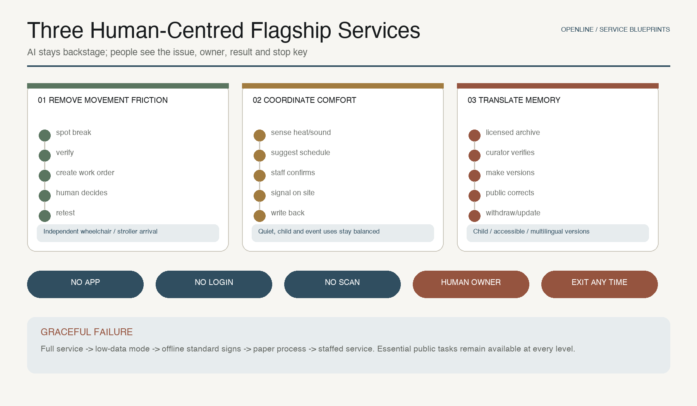

## Land Use, Building Scale, and Retain–Renovate–Demolish Scheme

Conceptual land use nearly fully covers the provisional boundary; coverage is recalculated by [metric:land_use_coverage_ratio] (residual gap ~1.77 m² must not be recorded as 1.0); total area is [metric:land_use_area_sqm]. Class areas are R&D translation [metric:land_use_0802_area_sqm], education & research [metric:land_use_0804_area_sqm], medical collaboration [metric:land_use_0806_area_sqm], science & technology services commerce [metric:land_use_05_area_sqm], talent living [metric:land_use_0701_area_sqm], public services [metric:land_use_0702_area_sqm], cultural display [metric:land_use_0803_area_sqm], and conceptual park green [metric:land_use_1401_area_sqm]. These values only describe this scheme’s functional mix—they do not represent existing or statutory land use. [standard:MNR-LAND-USE-CLASSIFICATION-GUIDE]

Building layer [data:geometry/buildings.geojson#BLDG-001] contains only prototype envelopes for the three key areas, validating spatial relationships via small massing, enterable ground floors, shared courtyards, and reversible retrofit; conceptual building footprint area is [metric:building_footprint_area_sqm]. Do not use it to derive site-wide building density, FAR, or building scale; [metric:floor_area_ratio], [metric:total_floor_area_sqm], [metric:building_density], and [metric:building_height_m] are explicitly unknown.

Retain–renovate–demolish judgment uses eight scores: historic culture, structural & fire safety, life-cycle carbon, existing tenants & affordability, ground-floor public interface, functional fit, tenure feasibility, and implementation disturbance. High historic/community value and safely repairable → prefer retain; structurally usable but interface-closed → light retrofit; inefficient equipment/space that can be systemically updated → renovate; demolition candidates only after professional appraisal, replacement resettlement, carbon comparison, and approvals are complete. Prototype buildings’ renewal_action is only a next research action—not a judgment on any real building. [depth:retain_renovate_demolish]

### Development Intensity Scenario Envelopes: No Numbers—a Testable Method Framework

That intensity metrics are all unknown is data discipline, but “unknown” is not “unthought.” This scheme gives three **intensity scenario envelopes** [metric:intensity_scenario_count] as a first-round sensitivity-test framework once official control plans and existing-conditions data arrive; each defines only assumptions, required data, and test questions—no FAR, height, or density numbers [assumption:A-INTENSITY-001]: **S1 Low-disturbance scenario** assumes light retrofit and operations of existing buildings, new build limited to small public facilities; needs existing-building survey and structural appraisal; test question: “can three-station operations’ financial and spatial needs be met without adding development volume?”; **S2 Weave-in scenario** assumes medium-intensity weave-in on clear-tenure, non-heritage-conflict inefficient parcels; needs control plan, tenure, and inefficient-land inventory; test question: “can weave-in volume meet talent housing, incubation space, and public interface needs together?”; **S3 Ambition scenario** assumes higher-intensity development for global functions around rail-candidate interfaces; needs rail station mouths, aviation height limits, daylight, and view-corridor conditions; test question: “does high intensity sacrifice display-layer publicness and heritage scale?” All three share the same recalculation pipeline: once official data arrive, any scenario should regenerate nine layers and all metrics, and submit the three results side by side for professional review—not pre-lock one scenario.

Side-by-side evidence writes each envelope as five checkable columns—**assumption · required data · spatial consequence · ops consequence · veto condition**. One hard veto for S3: display-frontage ratio falling out of the 40%–60% guideline band means high intensity mortgages the public display layer—reject that envelope rather than beautify it. [assumption:A-INTENSITY-001]

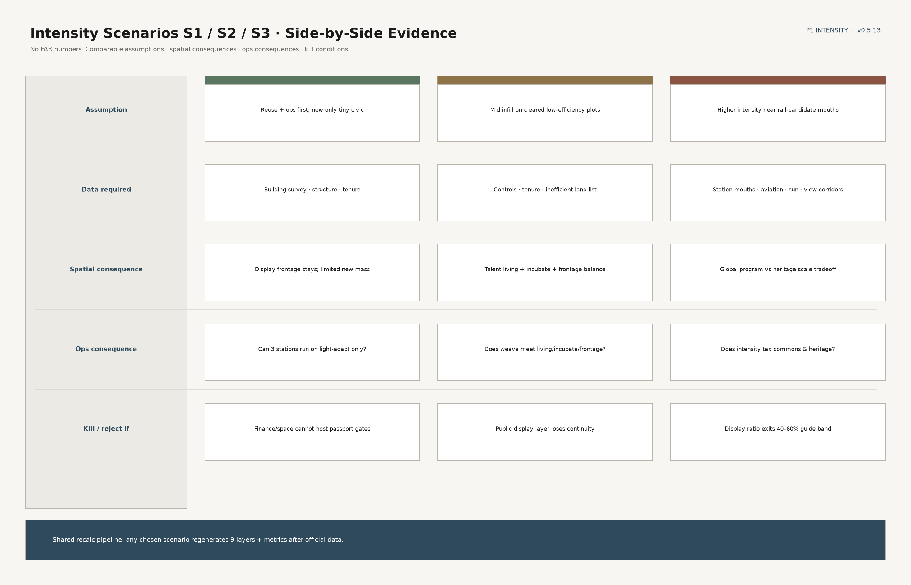

## Transport, Rail, Municipal, and Public Service Facilities

The slow-mobility network comprises one OPENLINE, two parallel roaming lines, and nine east–west stitch interfaces—together [metric:mobility_link_count] conceptual links; total schematic centerline length is [metric:road_centerline_length_m]; buffered estimated area and ratio are [metric:road_area_sqm], [metric:road_ratio]. OPENLINE’s own schematic length [metric:openline_length_m] must not be read as the heritage park’s official length. [depth:traffic_rail_slow_parking]

Transport priority is **walking & accessibility—bicycle—public transit transfer—shared-mobility pickup/drop-off—necessary motor vehicles**. Nine interfaces are managed as “three strategic stitches + six everyday stitches” [metric:strategic_interface_count]: strategic stitches (Qinghe blue–green, Origin campus–city, Dazhongsi four-way) receive conceptual plans and accessible circulation at deepening; everyday stitches do walk audits first, then decide light retrofit or engineering; without official road red lines and station-mouth data, draw no overpass bridges, set no signals, compute no 800 m station coverage—[metric:transit_station_coverage_ratio] remains unknown. Formal deepening reviews door-to-door walking networks, grades, crossing wait, night lighting, micromobility parking, and emergency access—not simple circular buffers.

**Zero-break access is not one K05 component; it is a complete service chain.** Each key area must draw transit edge, city-standard entrance, crossing, rest/water, toilet, service/exhibit and safe exit on one continuous map, segment by segment registering steps, grade, turning, detour, crossing wait, shade, rain cover, lighting, staffed help and offline recognition. Review shifts from “is there an accessible facility?” to “can all six everyday users independently complete the task in sun, rain and at night?” If one break remains open, the route cannot be claimed accessible.

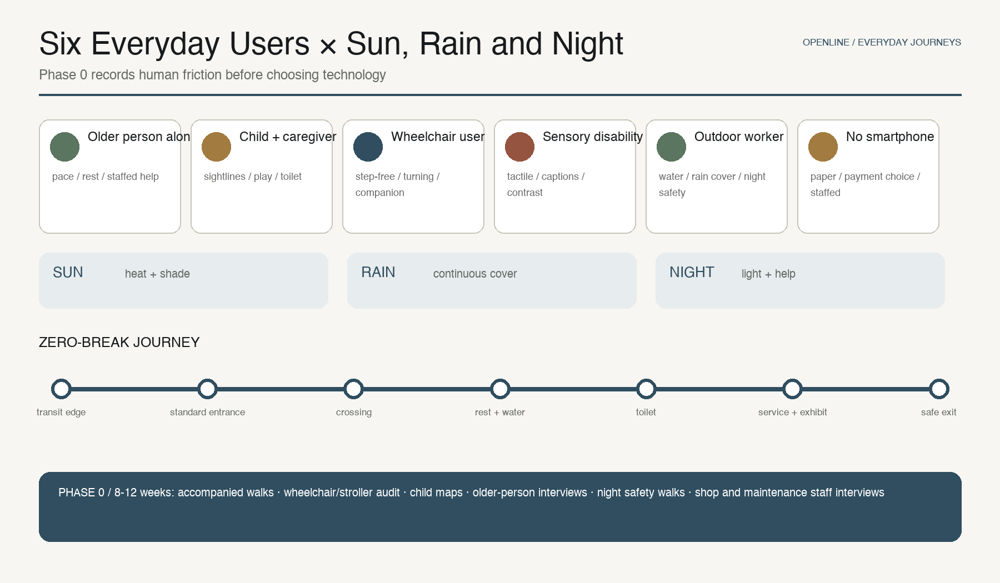

Public services use “small stations along the line + professional institutions backstage”: toilets, drinking water, nursing, quiet rooms, first aid, and human consultation remain non-digitally usable; IP/legal, talent, compute, clinical, and education services are provided by institutions with duty. Edge compute preferentially reuses buildings and verified power—measure energy, waste heat, noise, fire, and cybersecurity before deciding scale. [depth:municipal_new_infrastructure] Municipal and energy data are missing; all pipe sizes, capacities, distributed energy, and underground-space suggestions await special studies; this scheme does not substitute “smart poles” for public services.

## Blue–Green Space, Public Space, and Urban Character

The blue–green system is not an AI-equipment showroom strip, but the innovation belt’s most stable public infrastructure. [depth:blue_green_public_space] Inside the provisional boundary this scheme generates one continuous conceptual green spine, five functionalized “garden rooms,” and two water-interface green belts [data:geometry/green_space.geojson#GREEN-OPENLINE]; recalculated conceptual green area and ratio are [metric:green_space_area_sqm], [metric:green_ratio]; public space is jointly composed of Intelligence Axis seven spaces, Developer Walk, five landmarks, three stations three forms, and Suzhou-numeral milestones [data:geometry/public_space.geojson#PUBLIC-DEVELOPER-WALK]; area and ratio are [metric:public_space_area_sqm], [metric:public_space_ratio]. 16.6% and 2.5% are only this design layer’s share of the provisional boundary—never statutory green ratio or public-service indicators. Haidian district park green and 500 m coverage data are not scaled down to the site. [source:HAIDIAN-GREEN-2024]

**Host layer × design overlay (kill the 2.5% misread).** The Jing-Zhang park corridor and Qinghe/Xiaoyuehe blue–green intent are the **host layer**; Intelligence Axis seven spaces, five landmarks, OPENKIT, and nine stitches are the **design overlay**. If a jury only glances at 2.5%, it misreads civic shortfall—so the plate must show side-by-side: **host green continuity** (real commons floor) vs **overlay public space ≈2.5%** (design furniture on the host). Publish three together: host continuity, design overlay, and a **minimum operable public set** that holds even under S1 (≥4 m clear walk, seating every 150–200 m, toilet/water/quiet room with non-digital twin, a11y bypass at every strong severance). Statutory parks are not counted short from the overlay. [assumption:A-PARK-001]

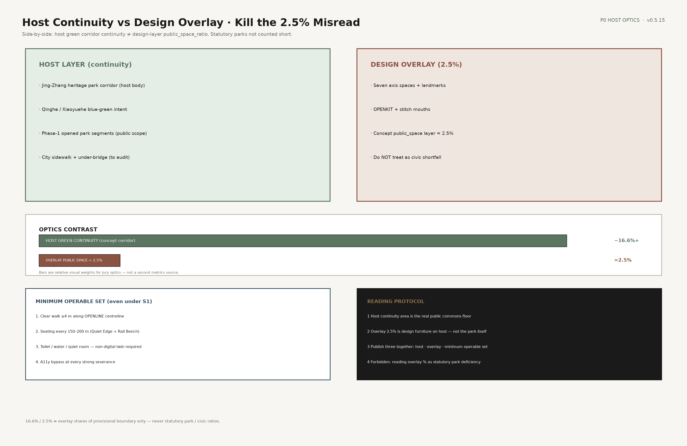

**Garden rooms upgrade from decoration to functional units.** Each of the five rooms has a clear ecological or social role: stormwater retention garden receives surrounding hardscape runoff (capacity and overflow paths await hydrology special study); habitat & pollinator garden conserves native plants and bans night lighting; quiet reading lawn prioritizes acoustic environment; children & intergenerational play shares by time slots; performance & test lawn hosts removable pavilions and outdoor trusted testing. Rooms are not evenly distributed elliptical decorations—they are why the Intelligence Axis “slows down.”

**Bodily comfort is infrastructure, not a landscape bonus.** Every space checks heat, rain, wind, sound, light and rest together: exposed routes provide continuous shade, water and heat-stop conditions; entrance–service–toilet forms a covered rain chain; winter seats are sheltered without creating canyon winds; quiet hours, absorbent edges and event time limits control sound; night lighting is low-glare, limited to necessary nodes and preserves ecological dark; seats include backs, arms and wheelchair companion bays, with about 150 m as a starting rest-interval guide to calibrate through Phase 0 observation.

A **publicness covenant** turns human-centred intent into an operating boundary: a guide target of at least 80% free unprogrammed hours, 100% offline completion for essential public tasks, zero forced face ID/registration/personal tracks, and at least one named human owner for every high-risk service. Commercial programs never displace passage, quiet hours or no-purchase seating. All ratios are pilot-calibrated design guides, not statutory indicators.

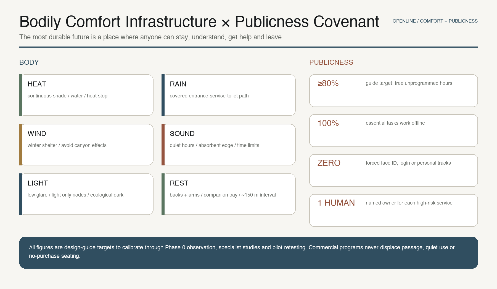

**Axis–river intertwine: Qinghe and Xiaoyuehe are the second system.** The Intelligence Axis is a north–south artificial sequence; Qinghe (north) and Xiaoyuehe (east) are this site’s real natural skeleton. This scheme expresses “axis–river” intertwine intent with two conceptual water-interface green belts [metric:water_interface_count]: the north Qinghe interface belt is the landing of a strategic stitch interface, and also Zhongzhiyuan’s slow-mobility interface and low-carbon compute exhibition/education waterfront bleachers; the east Xiaoyuehe interface belt is the green corridor by which the scenario empowerment wing permeates into communities. Official blue lines, flood, and ecological conditions for both water systems are not in the repository; this scheme does not digitize pseudo blue lines; any bank, section, and ecological measures await official data and water special studies. [assumption:A-WATER-001]

### Five AI Pilgrimage Landmarks: Not Monuments—Five Public Behaviors

1. **Agent Garden**: At North Station, turns trusted testing into understandable public viewing; sensitive indoors, explainable outdoors.
2. **Station Zero**: Connects 1909’s autonomous engineering with today’s open-source starting point; records papers, PoCs, failures, and restarts.
3. **City Commit Wall**: Honor is ranked not by financing amount but by reproducible contribution, public value, and years of maintenance; voluntary, withdrawable, correctable.
4. **Commons Compiler**: Resident problems, developer responses, and ops work orders “compile” openly on one table—participation is not reduced to opinion collection.
5. **Next Station Hall**: Dazhongsi’s four-way walk confluence and city-adoption hub; publishes annual Release; hosts roadshows and removable nightlife; also hosts merchant/resident order feedback and reasons for stopped projects. [metric:landmark_count]

All five landmarks are conceptual, reversible public facilities; after professional approval, designate ops, maintenance, safety, and accessibility owners; if approval fails or two consecutive ops cycles have no maintenance, remove and restore to general public space. The master table below uses the same checkable grammar as scenario pins—**public act · street pin · kit · honor/exit**—so landmarks cannot collapse into a sculpture list.

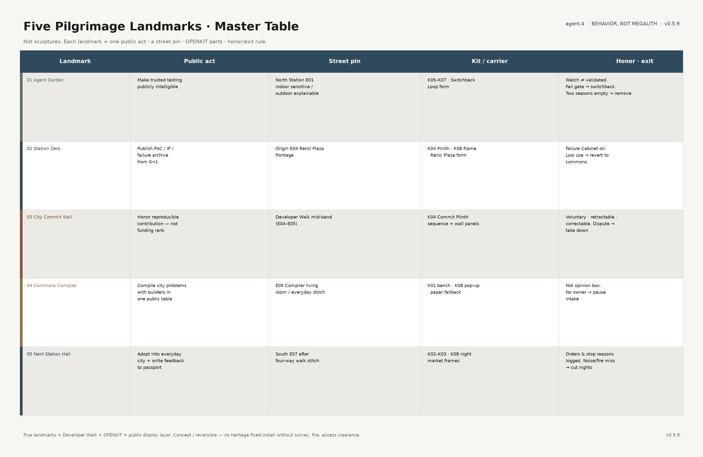

**Contribution Visibility Band** folds Developer Walk, SC-01 open-source exhibit signs, and City Commit Wall / K04 Commit Plinth into one N–S strip: movement → gallery → honor wall → quiet edge; approach → read → commit → retract. Honor ranks by reproducible contribution, public value, and years maintained—never by funding size; voluntary, withdrawable, correctable; unresolved dispute or two empty seasons → take down. Not three separate props—the continuous interface where contribution is *seen*.

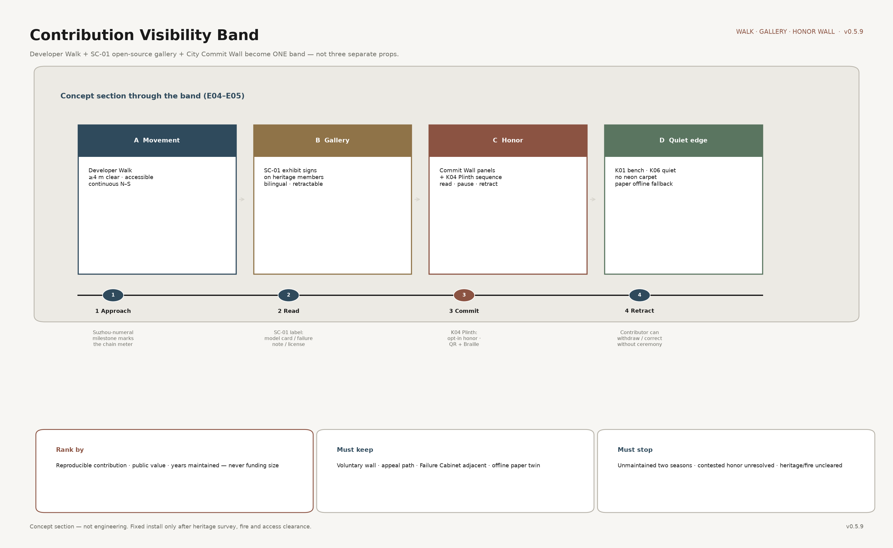

**OPENKIT public-space component library** makes landmarks maintainable rather than one-shot stage sets: K01 **Rail Bench** organizes replaceable seats and wheelchair companion seats at tie scale; K02 **Shade Loop** provides seasonal shade and canopy interfaces; K03 **Power Dock** provides only professionally verified low-voltage power/charging—no uncontrolled networks; K04 **Commit Plinth** holds physical exhibition signs, low-data QR, and braille; K05 **Accessible Dock** provides continuous ramps, tactile wayfinding, and adjustable interaction height; K06 **Quiet Edge** protects quiet activity with planting and sound-absorbing interfaces; K07 **Sensor Sleeve** reserves only removable mounts for approved anonymous environmental sensing; K08 **Pop-up Frame** supports removable exhibits, roadshows, and markets.

**Two identity layers—project branding never replaces public language.** The upper layer is city-standard information that a first-time user can understand without learning OPENKIT: use the public-information, accessibility, fire-safety, and evacuation symbols applicable under national and Beijing requirements at the time of implementation, together with necessary text, direction/distance, tactile or braille information, and high-contrast presentation. OPENLINE's O·1 mark, color bands, and decoration must not redraw, obscure, or impersonate those standard symbols. The lower layer is the project asset layer: `K01 Rail Bench`, `K05 Accessible Dock`, and other OPENKIT codes, bilingual names, a unique asset ID, responsible owner, inspection cycle, operating status, and removal trigger, linked to material and digital passports. QR is supplementary only; the code, responsible party, and critical status must remain readable offline. Where the layers conflict, statutory, safety, emergency, and accessibility information takes priority; the OPENKIT brand layer yields or is removed.

All components use a unified module, replaceable parts, material passports, and offline alternatives, with one asset record per object: location, version, material batch, maintenance history, faults, and end-of-use destination. No fixed installation proceeds without heritage, fire, and accessibility confirmation.

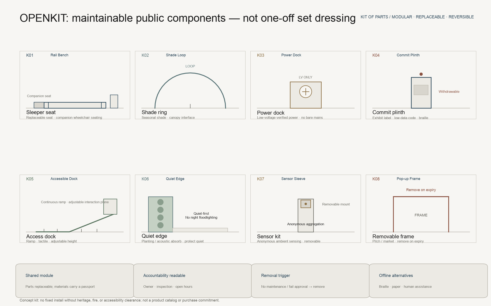

### Three Cultures Fused: Rail × Zhongguancun × AI New Culture

This section closes taskbook agent.5: fuse Jing-Zhang railway culture, Zhongguancun culture, and AI new culture into **one checkable narrative**—not three parallel slogans. [source:AGENT-TASKBOOK] [source:JZ-HISTORY]

**Zhongguancun is not only the west service wing.** It enters public storytelling as the **CODE cultural layer**: dare to try, fail and restart, lab→venture, forum-style open discussion—pinned at the Origin school–city stitch, Station Zero Failure Cabinet, and the west-wing everyday service door (capital still enters only after the Validation gate). The railway layer supplies touchable engineering spirit and mileage language; the AI commons layer supplies Commit / Release / stop keys and retractable honor. Each layer has spirit, public historical anchor, street pin, readable object, and do-nots.

**Heritage narration shifts from “inventing a symbol” to “solving a human difficulty.”** The formal wording is that Zhan Tianyou, facing the Guangou section’s gradient and the traction limits of contemporary locomotives, creatively adopted a herringbone switchback alignment. This avoids collapsing a complex engineering history into the unverified phrase “invented the herringbone railway.” [source:JZ-HISTORY] Every cultural node follows a four-step teaching grammar: **one real difficulty → one engineering principle → one human story → one action people can take today**. Visitors first touch a gradient model and try to climb with a limited track length; only then do they encounter switchback, double-engine push-pull and engineering trade-offs, before connecting “overcoming physical gradients” to removing today’s information, movement, service and participation gradients. Child, accessible and multilingual versions share one curator-verified fact base and permit public correction.

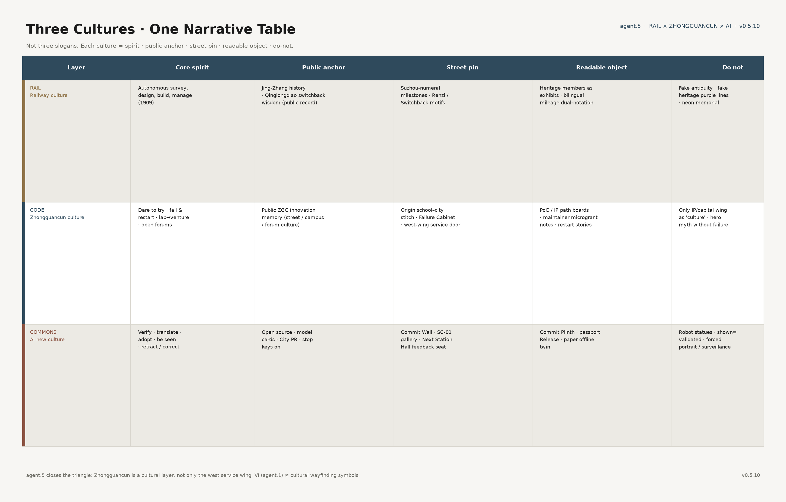

**Cultural tour overlay** shares the same N→S spine as the pilgrimage path but with different jobs: lower band = agent.4 innovation pilgrimage (validate → translate → see → adopt); upper band = agent.5 cultural program (Rail read/memory → Code restart → Commons see/city). Belt brand VI (agent.1) does not replace cultural wayfinding symbols; child / access / night lines are shared.

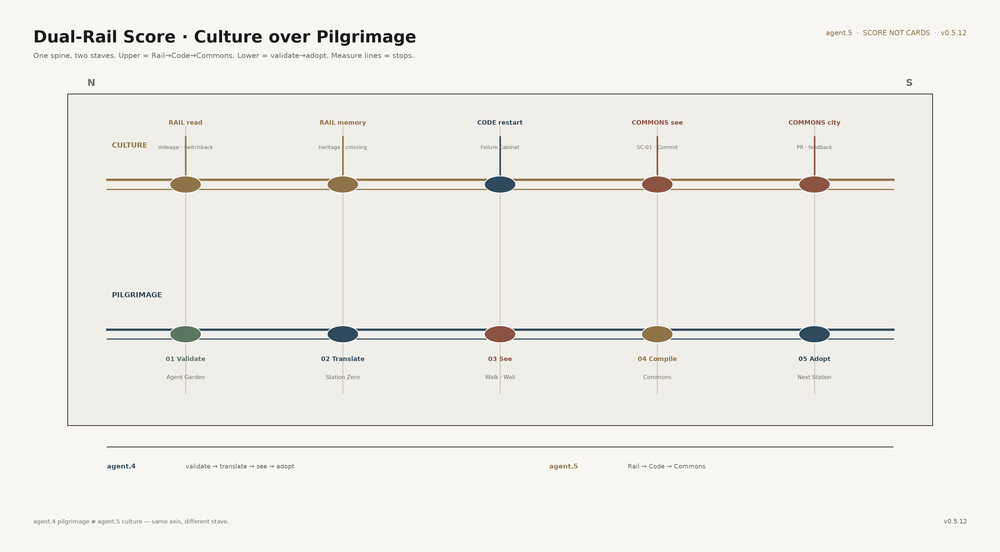

**Cultural nodes catalog** uses the same grammar as landmarks / scenario pins—**layer · street pin · carrier · clearance/exit**—for ten stops (C01–C10). A03 Rail→Code spring Commit Walk and P11 Passport tour consume this catalog; concept pins, not parcel IDs. [assumption:A-HERITAGE-001] [assumption:A-MOTIF-001]

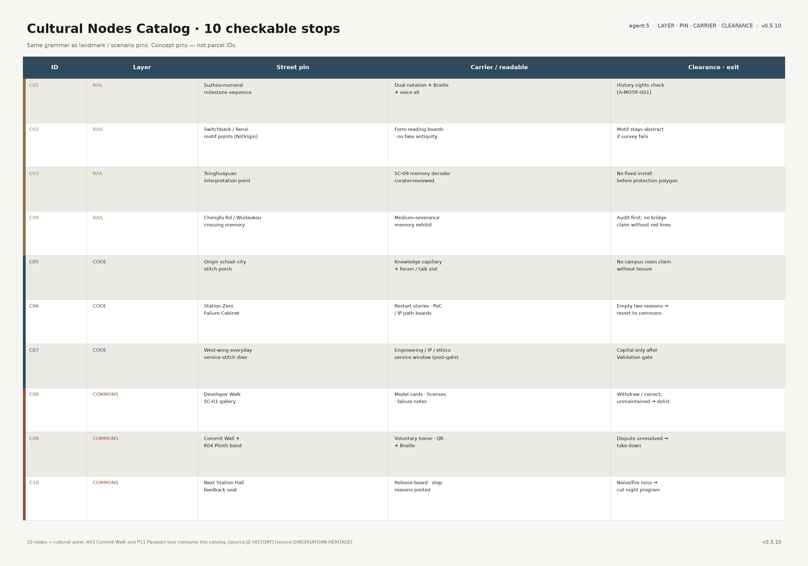

### Rail → Code → Commons: ~90-Minute Conceptual Tour

Tour beats are isomorphic with the innovation chain: **validate → translate → see → adopt**. The path diagram below draws the ~90-minute concept pilgrimage N→S, with child / access / night alternatives—this is the **agent.4 pilgrimage layer**; cultural reading sits in the overlay above.

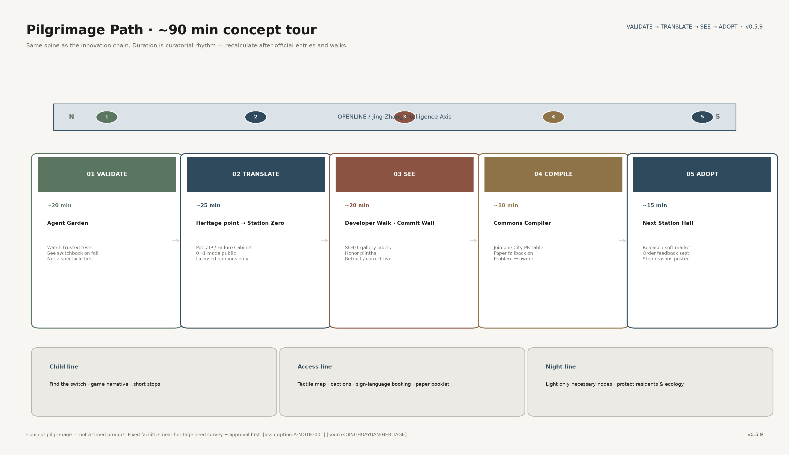

Tour detail: **tested → translated → adopted**, **seen throughout**. North segment at Agent Garden: understand trusted testing and failed-gate switchback (validation—not spectacle first); middle segment via lawfully open Tsinghuayuan historic interpretation points to Station Zero: see how research becomes translatable PoCs, open source, and failure archives (translation)—here also hosting **CODE culture** fail-and-restart; along Developer Walk and Commit Wall, contribution is visible throughout (seen); at Commons Compiler join a City Pull Request; south segment arrives at Next Station Hall: see how an outcome enters urban everyday life and markets (adoption). Throughout, **Suzhou-numeral milestones** are the mileage language [metric:milestone_count]—Chinese numerals from Jing-Zhang Railway historical marking tradition (〡, 〢, 〣…) placed kilometer by kilometer, with Arabic numeral counterparts, braille, and voice alternatives; this is a unique wayfinding system no other linear park can copy; formal adoption requires historical rights verification. [assumption:A-MOTIF-001] ~90 minutes is conceptual curation rhythm only; actual duration is set after official alignment, entrances, and walking networks are verified. Children’s route uses a “find the switch” game narrative; accessible route provides tactile maps, captions, sign-language booking, and paper booklets; night route lights only necessary nodes to protect residents and ecology. Any fixed facility near heritage objects requires surveying and professional approval first. [source:QINGHUAYUAN-HERITAGE]

Urban character adopts “industrial skeleton, garden base, digital ignition”: retain abstract proportions of ties, rivets, platform edges—no fake antiquity; plants and permeable ground form everyday background; steel-blue and umber light only at entries, commits, and state changes—no neon saturation. Ban street-full screens, robot sculptures, and continuous sound–light interaction. Accessibility, low disturbance, and real contribution are themselves the future feel.

**Rail texture field: make the host layer visible.** Grammar can be complete and the body still forget ties, platform edges, under-bridge rooms, and Wudaokou memory—then the scheme reads like a management manual. The texture field pins six readable objects—tie seating, platform-edge bleachers, under-bridge rooms, crossing memory, turnout interact nodes, Suzhou mile markers—and states bans: neon streets, robot statues, continuous sound-light, fake purple lines, “shown = validated.” [assumption:A-MOTIF-001] [assumption:A-HERITAGE-001]

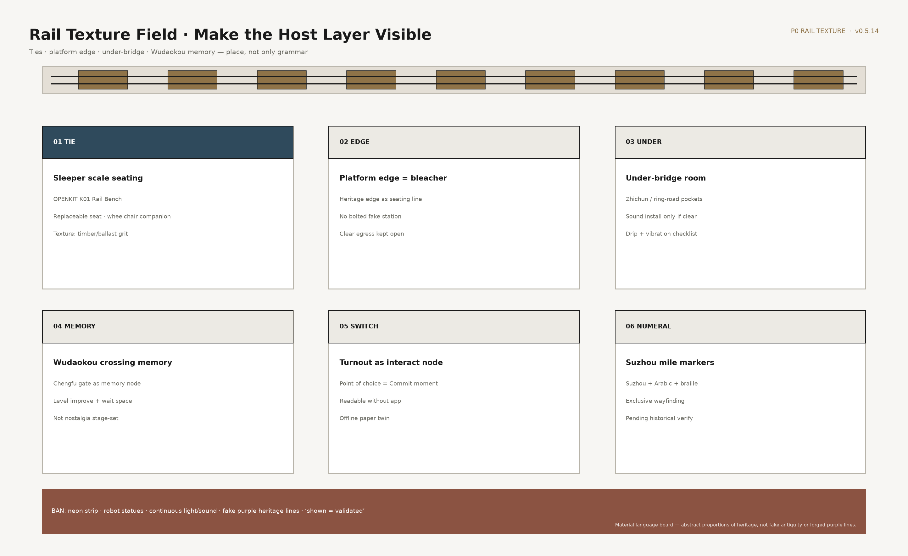

## Renewal Project List, Implementation Policy, and Phasing

Twelve project packages form two lists—“operations that can start first” and “engineering that must wait”—total [metric:renewal_project_count]. [depth:renewal_project_list]

**Phase 0 is not a thirteenth construction package; it is the shared prerequisite for P01–P12.** Before any fixed sign, sensor, activity schedule or light retrofit, complete sun/rain/night observation for the six everyday users and a zero-break journey audit, with a public register of finding → decision → implementation → retest → rationale. If Phase 0 lacks a real problem owner, does not cover vulnerable users, or has no staffed alternative, the relevant project cannot enter Phase 1. Its cost sits inside P02 data governance and P05 walking/accessibility audit rather than creating another large platform.

1. **P01 OPENLINE Brand Commons** (lead: proposed brand & community ops group): name, open visual assets, bilingual wayfinding; prerequisite trademark/typeface clearance; KPI node recognition and accessibility pass; infringement or misguidance → replace.
2. **P02 City Pull Request platform** (proposed ops subject + public problem parties): publish problems, match teams, record status; prerequisite data governance and procurement; KPI effective close rate; major privacy incident → stop service.
3. **P03 Station Zero light-retrofit pilot** (Origin district property owners + operators): outcomes release, IP clinic, maintainer space; prerequisite tenure, structural fire, heritage check; KPI PoC-into-validation ratio; long low use → revert to general public space.
4. **P04 Agent Garden Beta** (Zhongzhiyuan institutional alliance): synthetic-task red team and public exhibition/education; prerequisite safety protocol; KPI fix-and-retest rate; major safety issues → not open.
5. **P05 Nine stitch-interface audits** (planning/transport professional teams): walk and accessibility audits first, then light retrofit or engineering; prerequisite red lines, station mouths, and flows; KPI breakpoint close rate; official red lines or safety conditions unverified → stop at audit.
6. **P06 Five garden rooms** (landscape ops + community): quiet, sport, children, testing, performance shared by time; prerequisite ecology and park management conditions; KPI free open hours; commercial events crowding → reduce.
7. **P07 Commit Wall contribution protocol** (open-source foundation-type subject): voluntary, withdrawable, correctable honor system; KPI maintenance continuity and persona diversity; unresolvable disputes → temporary take-down.
8. **P08 AI+ healthcare/education controlled pilots** (professional institutions): implement SC-02/03; prerequisite professional ethics, data, procurement, and informed consent; KPI safety and human quality first—touch line → stop.
9. **P09 Dazhongsi Next Station Hall and four-way stitch** (commercial/industry ops + transport/park + merchant/resident reps): hall light retrofit, four-way walk audit, removable night market and order-feedback seats; prerequisite rail, fire, noise, tenure; KPI door-to-door reachability improvement, post-deal sustained cooperation, feedback write-back rate—not footfall alone.
10. **P10 Low-carbon compute feasibility special study** (energy/compute/fire teams): measure load, waste heat, carbon, noise; when data insufficient, special study only—no machine room first; no net environmental benefit or fire/energy boundary touched → do not engineer.
11. **P11 OPENLINE Passport accessible tour** (culture + accessibility orgs): digital and paper in parallel; KPI task completion rate and correction time; any forced registration → cancel immediately.
12. **P12 Public value dashboard** (independent evaluation group): quarterly publish project passports, failures, and corrections; prerequisite metrics protocol; KPI data completeness and external review—no single ranking that incentivizes gaming; if data cannot be independently reviewed → stop ranking and mark unavailable.

Three phases fully cover the provisional boundary [data:geometry/phasing.geojson#PHASE-001]; recalculation: [metric:phasing_area_sqm], [metric:phase_1_area_sqm], [metric:phase_2_area_sqm], [metric:phase_3_area_sqm]. [depth:phasing_implementation] **Phase 1 / 2026–2027 conceptual period** first does brand, open governance, problem platform, walk audits, and removable activities; **Phase 2 / 2028–2030 conceptual period** builds three-station public space and controlled pilots after procedures are complete; **Phase 3 / post-2030 conceptual period** expands international nodes and professional engineering based on evaluation. Periods are a design roadmap—not government investment, approval, or construction commitments. [assumption:A-OPS-001]

### Eight Annual Operating Products: From Festival Footfall to Sustained Contribution

This section closes taskbook agent.6: turn pilgrimage from concept into a **checkable annual operating system**—not another festival list. [source:AGENT-TASKBOOK]

The annual calendar contains [metric:annual_program_count] product families. The table below uses the same grammar as scenario cards—**rhythm · host · proposed owner · in→out · KPI/stop**—to pin A01–A08. Annual Week (A05) is only one week; the other 51 weeks close the loop via A01/A02/A04/A07/A08.

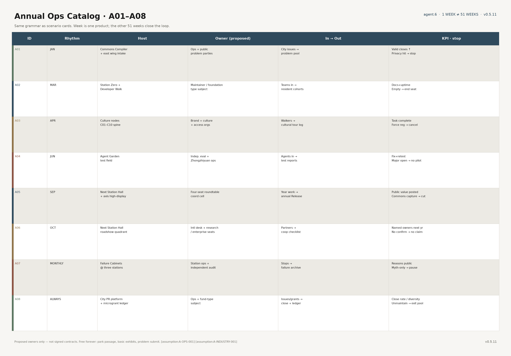

**Pilgrimage → ops closed loop**: outer ring = annual products; inner ring = seven passport gates; anchors = North Agent Garden / Origin Zero & Commit Wall / South Next Station Hall. Quarterly Release writes spend, stage, failure, fix, and public value back to passport and problem pool; two consecutive cycles without maintainer, real demander, or safety → exit the resource pool.

**Global collaboration band** splits “global-facing” into inbound / on-site / outbound—not one October forum: remote City PR and intl residency (inbound), Week / Forum / Commit Walk (on-site), portable problem packs and test templates (outbound). The five-place protocol is interface grammar only—do not infer signed deals from this text.

Product-family digest: **A01 January Openline Call** (problem pool); **A02 March Maintainers-in-Residence** (resident teams); **A03 April Rail→Code Spring Commit Walk** (cultural tour); **A04 June Trust Test** (test reports); **A05 September OPENLINE Week** (annual release); **A06 October Global Lab-to-City Forum** (cooperation list); **A07 monthly Station Night / Failure Review Night** (failure archives); **A08 year-round City Pull Request + Microgrants** (close records and microgrant ledgers).

Proposed governance uses a “four-seat roundtable”: public sector/property & professional institutions, research & enterprise, community & public-interest organizations, independent safety & audit—each with veto boundaries; ops revenue may come from compliant venue rent, membership services, enterprise challenges, funds, and public-service procurement, but park passage, basic exhibition, and problem submission stay free. Thus “pilgrimage places” rely not on one spectacle, but on annual returnable shared rituals and trustworthy records. [assumption:A-INDUSTRY-001] [assumption:A-OPS-001]

### Delivery & Money Plate: Who Holds / Who Vetoes / Who Pays

A complete ecosystem diagram is not delivery. This plate writes “proposed” as checkable institutional boundaries: [assumption:A-OPS-001] [assumption:A-INDUSTRY-001]

- **Four-seat roundtable**: public sector/property (legal veto: park passage & safety); research/enterprise (may propose but must not skip Validation); community/public interest (veto commons privatization: quiet hours & access); independent audit/safety (veto unsafe release; Failure Cabinet accumulates in public).
- **Passport issuance**: proposed ops entity issues; independent audit countersigns; capital seat activates only after trusted-test gate.
- **Money boundaries**: passage, basic exhibition, and City PR submission permanently free; compliant venue rent, challenges, membership, and public-service procurement chargeable; buying/selling personal data, forced face ID, ranking by financing forever forbidden.
- **Phase 1 first money (0–12 months)**: brand commons & bilingual wayfinding clearance (P01, concept ¥0.15–0.40M), City PR platform trial & data-governance procurement (P02, concept ¥0.30–0.80M), walk/a11y audit labor (P05, concept ¥0.20–0.50M), light ops for removable events and Failure Review Nights (A07/A08, concept ¥0.25–0.60M/yr)—kickstart band ≈ **¥0.9–2.3M** (excl. bridges/new build/data halls). Prefer **public-service procurement + compliant venue rent + microgrants**, not rent-subsidy races for footfall; bridges/new build/compute rooms wait until red lines and specials clear. Concept estimate bands only—not an investment commitment or procurement quote. [assumption:A-OPS-001]

## Metrics System, Area Recalculation, and Compliance Matrix

**A new human-outcomes table prevents device counts from masquerading as public value.** Information-gradient outcomes are 3-second recognition, no-login/no-scan task completion and paper-alternative availability. Movement-gradient outcomes are independent arrival for all six everyday users, detour ratio, crossing wait, rest interval and sun/rain/night break count. Service-gradient outcomes are issue-closure time, human correction, appeal response and graceful-failure success. Participation-gradient outcomes are vulnerable-user coverage, City PR closure and a published rationale for every accepted, modified or rejected input. Heat, rain, wind, sound, light, rest and publicness form the operating floor. All new ratios begin as `baseline pending`; Phase 0 establishes baselines, and only pilot retesting sets formal thresholds.

All spatial quantities in this package are recalculated by projecting the same EPSG:4326 exchange geometry to EPSG:4548, so body text, maps, and HTML do not each tell a different story. [depth:metrics_recalculation] Provisional overall area [metric:site_area_sqm]; land-use coverage [metric:land_use_coverage_ratio]; conceptual green [metric:green_space_area_sqm] / [metric:green_ratio]; conceptual public space [metric:public_space_area_sqm] / [metric:public_space_ratio]; prototype building footprint [metric:building_footprint_area_sqm]; conceptual roads [metric:road_centerline_length_m] / [metric:road_area_sqm] / [metric:road_ratio]; three key areas recalculated sum [metric:key_detailed_design_area_sqm], items [metric:key_area_1_calculated_sqm], [metric:key_area_2_calculated_sqm], [metric:key_area_3_calculated_sqm]. These are “known for submitted geometry,” not “known for the real site.”

Content metrics are equally checkable: zoning units [metric:land_use_parcel_count], building prototypes [metric:building_prototype_count], slow-mobility links [metric:mobility_link_count], severance corridors [metric:severance_crossing_count], landmarks [metric:landmark_count], scenarios [metric:scenario_count], test validation [metric:test_validation_scenario_count], personas [metric:persona_count], global cases [metric:global_case_count], projects [metric:renewal_project_count], program products [metric:annual_program_count]. All known metrics list formula, source, confidence, and assumptions in `metrics.json`; intensity, height, station coverage, and footfall lacking official conditions remain unknown; among them [metric:existing_daily_footfall] explicitly does not use uncleared commercial heatmaps or individual trajectories.

Nine data files can be independently checked: boundary [data:geometry/site_boundary.geojson#SITE-001], key areas [data:geometry/key_areas.geojson#PROV-KEY-001], land use [data:geometry/land_use.geojson#LU-001], buildings [data:geometry/buildings.geojson#BLDG-001], transport [data:geometry/roads.geojson#ROAD-OPENLINE], green [data:geometry/green_space.geojson#GREEN-OPENLINE], public space [data:geometry/public_space.geojson#PUBLIC-DEVELOPER-WALK], constraints [data:geometry/constraints.geojson#official-controls-not-available], phasing [data:geometry/phasing.geojson#PHASE-001]. The empty constraints layer is an honest “not obtained,” not an omission.

The compliance matrix covers all mandatory items in announcement 1.3, 1.4, 1.5 and agent.1–agent.6; the standards matrix maps to six bases; the depth matrix checks item by item existing-conditions diagnosis, three-tier scope, overall structure, land use, intensity, form, retain–renovate–demolish, transport, municipal, blue–green, key areas, projects, phasing, recalculation, and risk. [depth:overall_spatial_structure] [depth:land_use_layout] [depth:development_intensity_controls] [depth:height_massing_character] [depth:traffic_rail_slow_parking] [depth:municipal_new_infrastructure] [depth:blue_green_public_space] [depth:renewal_project_list] [depth:risk_missing_data]

## Risk, Copyright, and Compliance Notes

This scheme’s primary risk is not “imagination not bold enough,” but writing imagination as fact. [depth:risk_missing_data] Boundary, control plan, existing buildings, tenure, transport, heritage, municipal, professional facilities, industry, operations, and brand risks are registered in assumptions; the response when official data arrive is not local map edits, but regenerating nine layers, metrics, seven figures, HTML, and PDF. Unknown items such as `floor_area_ratio` do not enter approval conclusions. Any subsequent professional deepening requires planning, architecture, landscape, transport, municipal, heritage, fire, energy, legal, clinical/education ethics, and accessibility teams together.

Privacy and safety baseline: do not collect unnecessary data; do not trade personal trajectories for pretty heatmaps; do not let models take responsibility for doctors, teachers, law enforcement, or planning approvers; all high-risk scenarios must have human review, appeal, audit, and technical/ops exit. [assumption:A-PRIVACY-001] [assumption:A-AI-SAFETY-001] Without district-level population, enterprise, footfall, and OD data, do not area-scale district data, and do not invent “talent density” or economic-return promises.

Body text, drawings, marks, diagrams, HTML, and PDF are originally generated for this submission; maps use only repository provisional geometry—no remote map tiles, stock images, enterprise logos, or personal data embedded. Searchable Chinese text in the PDF embeds only an SIL OFL 1.1 Noto Sans SC glyph subset; system fonts in main PNG figures are rasterized and font files are not distributed. Global cases translate mechanisms in text and link to primary pages only—no images or layouts copied. Copyright in external public materials remains with original rights holders; this package provides links and limited factual summaries for citation and commentary; license, font, and trademark status are in `report/copyright_statement.md`. This package uses `COMMUNITY-DISPLAY-ONLY` and does not claim official approval, statutory planning, funded delivery, or implementation authorization. [assumption:A-EXTERNAL-CASES-001]

## References

Materials are in five groups, strictly graded by use. Group one is the call’s governing files: official announcement, agent-facing task book, and repository site package—used to set three-tier scope, six tasks, deliverable depth, and machine-validation rules. [source:OFFICIAL-ANNOUNCEMENT] [source:AGENT-TASKBOOK] [source:SITE-PACKAGE] Group two is boundary and data governance: source registry, fact pack, provisional overall boundary, and three key areas—supporting only this conceptual generation, topology self-check, and later replacement workflow; they cannot be upgraded to statutory red lines. [source:SOURCE-REGISTRY] [source:PROCESSED-FACT-PACK] [source:BOUNDARY-SOURCE] [source:KEY-AREA-SOURCE]

Group three is primary public background on Jing-Zhang Railway, park, and heritage—used to build the Rail→Code→Commons narrative and conservative heritage prerequisites, not to derive engineering alignment. [source:JZ-HISTORY] [source:JZ-PARK-OFFICIAL] [source:QINGHUAYUAN-HERITAGE] Group four is Haidian and Beijing statistics, policy, and public cases—used to judge regional innovation, education, healthcare, green space, slow mobility, and R&D environment; all data keep administrative scale and year, and are not area-scaled. [source:HAIDIAN-STATS-2025] [source:HAIDIAN-ECON-CENSUS-2023] [source:HAIDIAN-EDU-AI-POLICY] [source:HAIDIAN-HEALTH-AI-2026] [source:HAIDIAN-GREEN-2024] [source:HAIDIAN-MOBILITY-2023] [source:BEIJING-RD-2024]

Group five is institutional primary pages for seven international cases—used to compare outcomes translation, rail-heritage hosting, challenge-prize grammar, real-problem validation, heritage renewal, multi-node governance, and linear public commons; the scheme translates institutions only—no images, scale, investment, or policy promises copied. [source:CASE-KENDALL] [source:CASE-STATIONF] [source:CASE-NESTA] [source:CASE-SINGAPORE] [source:CASE-HELSINKI] [source:CASE-SEOUL] [source:CASE-TSUKUBA] Toronto / MaRS and Paris-Saclay remain background-only after leaving the master table. [source:CASE-TORONTO] [source:CASE-PARIS] Every external public material’s URL, publisher, access date, specific use and limits, and every repository material’s local path and use, are registered in sources.json; copyright and license boundaries are in report/copyright_statement.md.

### Machine-Readable Evidence Index

This index ensures review Agents can return from narrative to sources, standards, depth, layers, and metrics; it does not substitute citation count for professional judgment.

- Sources: [source:OFFICIAL-ANNOUNCEMENT], [source:AGENT-TASKBOOK], [source:SITE-PACKAGE], [source:SOURCE-REGISTRY], [source:PROCESSED-FACT-PACK], [source:BOUNDARY-SOURCE], [source:KEY-AREA-SOURCE], [source:JZ-PARK-OFFICIAL], [source:QINGHUAYUAN-HERITAGE], [source:JZ-HISTORY], [source:CASE-KENDALL], [source:CASE-STATIONF], [source:CASE-NESTA], [source:CASE-SINGAPORE], [source:CASE-HELSINKI], [source:CASE-SEOUL], [source:CASE-TSUKUBA], [source:CASE-TORONTO], [source:CASE-PARIS], [source:HAIDIAN-STATS-2025], [source:HAIDIAN-ECON-CENSUS-2023], [source:HAIDIAN-EDU-AI-POLICY], [source:HAIDIAN-HEALTH-AI-2026], [source:HAIDIAN-GREEN-2024], [source:HAIDIAN-MOBILITY-2023], [source:BEIJING-RD-2024]
- Standards: [standard:PROJECT-OFFICIAL-ANNOUNCEMENT], [standard:PROJECT-AGENT-OPEN-CALL-TASKBOOK], [standard:MOHURD-URBAN-DESIGN-MEASURES], [standard:MOHURD-CONTROL-DETAILED-PLANNING], [standard:MNR-LAND-USE-CLASSIFICATION-GUIDE], [standard:MOHURD-ARCH-DESIGN-DEPTH-2016]
- Depth: [depth:existing_conditions_diagnosis], [depth:three_level_scope_framework], [depth:overall_spatial_structure], [depth:land_use_layout], [depth:development_intensity_controls], [depth:height_massing_character], [depth:retain_renovate_demolish], [depth:traffic_rail_slow_parking], [depth:municipal_new_infrastructure], [depth:blue_green_public_space], [depth:three_key_area_detailed_design], [depth:renewal_project_list], [depth:phasing_implementation], [depth:metrics_recalculation], [depth:risk_missing_data]
- Metrics: [metric:site_area_sqm], [metric:land_use_area_sqm], [metric:land_use_coverage_ratio], [metric:green_space_area_sqm], [metric:green_ratio], [metric:public_space_area_sqm], [metric:public_space_ratio], [metric:building_footprint_area_sqm], [metric:road_centerline_length_m], [metric:road_area_sqm], [metric:road_ratio], [metric:openline_length_m], [metric:phasing_area_sqm], [metric:key_detailed_design_area_sqm], [metric:key_area_count], [metric:land_use_parcel_count], [metric:building_prototype_count], [metric:mobility_link_count], [metric:landmark_count], [metric:scenario_count], [metric:test_validation_scenario_count], [metric:persona_count], [metric:global_case_count], [metric:renewal_project_count], [metric:annual_program_count], [metric:axis_segment_count], [metric:display_frontage_length_m], [metric:renzi_motif_count], [metric:milestone_count], [metric:strategic_interface_count], [metric:severance_crossing_count], [metric:water_interface_count], [metric:intensity_scenario_count], [metric:land_use_05_area_sqm], [metric:land_use_0701_area_sqm], [metric:land_use_0702_area_sqm], [metric:land_use_0802_area_sqm], [metric:land_use_0803_area_sqm], [metric:land_use_0804_area_sqm], [metric:land_use_0806_area_sqm], [metric:land_use_1401_area_sqm], [metric:phase_1_area_sqm], [metric:phase_2_area_sqm], [metric:phase_3_area_sqm], [metric:key_area_1_calculated_sqm], [metric:key_area_2_calculated_sqm], [metric:key_area_3_calculated_sqm]
- Assumptions and boundaries: [assumption:A-BOUNDARY-001], [assumption:A-CONTROLS-001], [assumption:A-LANDUSE-001], [assumption:A-EXISTING-001], [assumption:A-TRANSIT-001], [assumption:A-HERITAGE-001], [assumption:A-MUNICIPAL-001], [assumption:A-PARK-001], [assumption:A-AXIS-001], [assumption:A-SEVERANCE-001], [assumption:A-MOTIF-001], [assumption:A-WATER-001], [assumption:A-INTENSITY-001], [assumption:A-PRIVACY-001], [assumption:A-AI-SAFETY-001], [assumption:A-INDUSTRY-001], [assumption:A-BRAND-001], [assumption:A-OPS-001], [assumption:A-ACCESS-001], [assumption:A-EXTERNAL-CASES-001]

**One-sentence delivery: A century ago, Zhan Tianyou used herringbone switchback engineering to overcome physical gradients so ordinary trains could cross Guangou; in the next century, the OPENLINE 100 project uses reliable, trustworthy and controllable AI to remove gradients people face in the city—information, movement, service and participation. Here technology and the humanities meet.**
